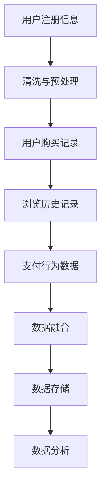
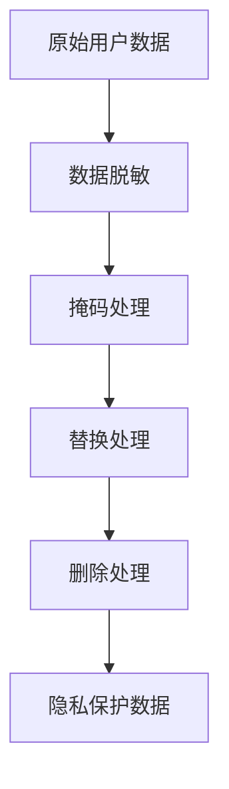
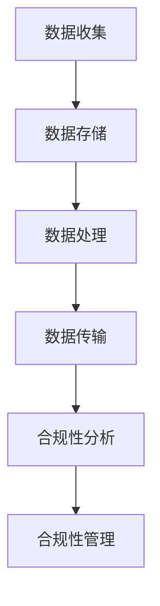

                 

# AI如何帮助电商企业进行用户数据安全管理

## 关键词
AI, 数据安全，电商，用户数据，安全管理，加密，零知识证明，机器学习，隐私保护，合规性，行为分析，未来趋势

## 摘要
在电子商务蓬勃发展的今天，用户数据安全已成为电商企业面临的重要挑战。本文通过深入分析AI技术在用户数据安全管理中的应用，探讨了AI如何助力电商企业提升数据安全防护水平。文章首先介绍了AI在数据安全领域的重要性，详细解析了加密与哈希算法、零知识证明以及机器学习等核心技术，接着通过实际案例展示了AI技术在电商用户数据安全管理中的具体应用。随后，文章提出了电商用户数据安全管理的基本原则和实践指南，并展望了AI在数据安全领域的未来发展趋势。通过本文的阅读，读者可以全面了解AI技术在电商用户数据安全管理中的价值与潜力。

### 第一部分: AI如何帮助电商企业进行用户数据安全管理

在数字化时代，数据已成为电商企业的核心资产。用户数据的泄露不仅会损害企业的声誉，还可能引发法律纠纷和巨额赔偿。因此，用户数据安全管理成为电商企业不可忽视的重要任务。AI技术在数据安全领域具有独特的优势，它能够自动化处理大量数据，提高威胁检测和响应的效率，并且通过不断学习和优化算法，能够提供更加精准和智能的安全防护方案。本文将分以下几个章节详细探讨AI在电商用户数据安全管理中的作用。

#### 第1章: AI在用户数据安全管理中的作用

本章将首先探讨AI在用户数据安全领域的重要性。我们将分析当前用户数据面临的威胁，以及AI技术如何通过其强大的计算能力和自适应能力在数据安全防护中发挥关键作用。接下来，我们将介绍AI核心技术在数据安全中的应用，包括加密与哈希算法、零知识证明和机器学习等。最后，我们将讨论AI与用户数据安全管理的结合方式，并展望其未来的发展趋势。

### 1.1 AI在用户数据安全领域的重要性

随着互联网的普及，用户数据泄露事件屡见不鲜，数据安全威胁日益严重。传统的安全防护手段往往依赖于固定的规则和模式匹配，难以应对复杂多变的威胁环境。而AI技术的引入，能够通过自适应的学习和预测，提高威胁检测的准确性和响应速度。

#### 1.1.1 用户数据的安全威胁

用户数据主要包括个人身份信息、金融信息、购物记录等，这些数据一旦泄露，可能被用于身份盗用、诈骗、恶意营销等犯罪活动。目前，用户数据面临的威胁主要包括以下几种：

1. **网络攻击**：黑客通过钓鱼攻击、恶意软件等方式窃取用户数据。
2. **内部威胁**：员工滥用权限，泄露用户数据。
3. **数据泄露**：由于系统漏洞、配置错误等导致用户数据泄露。
4. **社交工程**：通过欺骗用户透露敏感信息。

#### 1.1.2 AI在数据安全防护中的潜在优势

AI技术在数据安全防护中具有以下几个潜在优势：

1. **自适应能力**：AI能够不断学习并适应新的威胁环境，提高威胁检测的准确性。
2. **高效处理**：AI可以通过并行计算和分布式处理，高效处理大量数据。
3. **实时响应**：AI能够实时监测和响应安全事件，减少数据泄露的时间窗口。
4. **自动化**：AI可以自动化执行安全任务，减少人工干预，提高工作效率。

#### 1.1.3 AI在用户数据安全领域的应用现状

目前，AI技术在用户数据安全领域已有一些实际应用，例如：

1. **用户行为分析**：通过分析用户的行为模式，识别异常行为，预防欺诈行为。
2. **威胁检测**：利用机器学习算法，实时监测网络流量，识别潜在的攻击行为。
3. **数据加密**：利用AI生成的密钥和加密算法，提高数据传输和存储的安全性。
4. **隐私保护**：通过AI技术实现数据脱敏，保护用户隐私。

### 1.2 AI核心技术在数据安全中的应用

AI的核心技术包括机器学习、深度学习、自然语言处理等，这些技术在数据安全领域有着广泛的应用。以下将介绍几种重要的AI核心技术及其在数据安全中的应用。

#### 1.2.1 加密与哈希算法

加密是保护数据隐私的重要手段，AI可以在加密算法的选择、优化和实施中发挥重要作用。例如：

1. **对称加密**：使用相同的密钥进行加密和解密。AI可以通过优化算法和密钥生成机制，提高加密效率和安全性。
2. **非对称加密**：使用一对非对称密钥进行加密和解密。AI可以帮助生成强密码学算法，确保数据传输的安全。
3. **哈希算法**：用于生成数据摘要，确保数据的完整性。AI可以通过优化哈希算法，提高数据处理速度和安全性。

#### 1.2.2 零知识证明

零知识证明是一种密码学技术，允许一方在不泄露任何信息的情况下证明对某一命题的了解。在数据安全领域，零知识证明可以用于：

1. **隐私保护**：在数据传输过程中，确保数据隐私不被泄露。
2. **身份验证**：在不暴露身份信息的情况下进行身份验证。
3. **数据完整性验证**：确保数据在传输过程中未被篡改。

#### 1.2.3 机器学习与数据挖掘在安全分析中的应用

机器学习与数据挖掘在数据安全分析中具有重要作用，以下为几个关键应用：

1. **异常检测**：通过分析用户行为数据，识别异常行为，预防欺诈和攻击。
2. **威胁预测**：通过分析历史攻击数据，预测潜在的威胁和攻击方式。
3. **入侵检测**：利用机器学习算法，实时监测网络流量，识别入侵行为。

#### 1.3 AI与用户数据安全管理的结合方式

AI与用户数据安全管理的结合可以采用多种方式，以下为几种常见的方法：

1. **自动化威胁检测与响应**：通过AI技术自动化检测和响应安全威胁，减少人工干预。
2. **用户行为分析**：通过分析用户行为数据，识别异常行为，提高安全防护能力。
3. **数据脱敏与隐私保护**：利用AI技术进行数据脱敏，保护用户隐私。
4. **合规性管理**：通过AI技术确保用户数据管理符合相关法律法规要求。

#### 1.4 AI在用户数据安全管理中的未来发展趋势

随着AI技术的不断进步，其在用户数据安全管理中的应用也将不断拓展。以下为几个未来的发展趋势：

1. **增强现实与虚拟现实中的数据安全**：随着AR和VR技术的发展，AI将在这些领域提供更加智能的数据安全解决方案。
2. **区块链与AI的结合**：区块链与AI的结合将提供更加安全、透明和可信的数据管理方案。
3. **跨领域合作与标准化**：AI与法律、伦理等领域的跨领域合作将推动数据安全管理的标准化。
4. **数据伦理与法律规范**：随着数据安全意识的提高，AI技术在数据安全管理中的应用将更加注重伦理和法律规范。
5. **AI治理与可持续发展**：AI技术在用户数据安全管理中的应用需要建立有效的治理机制，确保其可持续发展。

### 第二部分: AI在电商用户数据安全中的应用实例

在前一部分中，我们介绍了AI在用户数据安全领域的重要性以及AI核心技术在数据安全中的应用。在本部分，我们将通过实际案例来展示AI技术在电商用户数据安全中的具体应用，分析这些案例的实际效果，并从中得到启示。

#### 第2章: AI技术在电商用户数据安全中的应用案例分析

本章将介绍三个具体案例，分别是电商平台用户行为异常检测、电商用户数据隐私保护和电商平台数据安全合规性管理。

### 2.1 案例一：电商平台的用户行为异常检测

#### 2.1.1 案例背景

随着电子商务的快速发展，电商平台面临着越来越多的用户行为数据。这些数据不仅包含用户的基本信息，还记录了用户的购买记录、浏览历史、支付行为等。如何有效地管理和保护这些数据，防止数据泄露和欺诈行为，成为电商平台必须解决的重要问题。

#### 2.1.2 数据采集与处理

电商平台通过多种渠道采集用户数据，包括用户注册信息、购物行为、浏览记录等。在数据采集后，需要对数据进行清洗和预处理，去除重复数据和噪声数据，确保数据的准确性和一致性。



#### 2.1.3 AI算法实现

为了检测用户行为的异常，电商平台采用了机器学习算法，特别是异常检测算法，如孤立森林（Isolation Forest）和K最近邻（KNN）算法。这些算法可以识别出与正常行为显著不同的用户行为，从而预防欺诈行为和数据泄露。

```python
# 使用孤立森林算法检测用户行为异常
from sklearn.ensemble import IsolationForest

# 训练孤立森林模型
model = IsolationForest(n_estimators=100)
model.fit(X_train)

# 预测用户行为异常
predictions = model.predict(X_test)

# 处理异常行为
for pred in predictions:
    if pred == -1:
        # 异常处理
        handle_anomaly(user_id)
```

#### 2.1.4 应用效果

通过AI算法的用户行为异常检测，电商平台能够及时发现和阻止欺诈行为，降低了数据泄露的风险，提高了用户数据的安全性和隐私保护水平。

### 2.2 案例二：电商用户数据的隐私保护

#### 2.2.1 案例背景

随着用户对隐私保护的重视，电商平台需要在处理用户数据时确保用户隐私不被泄露。如何有效地实现用户数据的隐私保护，成为电商平台面临的重要挑战。

#### 2.2.2 数据脱敏技术

电商平台采用了数据脱敏技术来保护用户隐私。数据脱敏技术包括数据掩码、数据替换、数据删除等。其中，常见的脱敏技术有：

1. **掩码**：对敏感数据使用掩码，如将电话号码中的中间几位用星号代替。
2. **替换**：用匿名标识符替换真实标识符，如将用户姓名替换为用户ID。
3. **删除**：删除与隐私保护无关的数据，如删除用户的浏览记录。



#### 2.2.3 AI算法实现

电商平台还采用了AI技术来实现数据隐私保护。例如，利用机器学习算法进行用户行为预测，从而实现个性化推荐，而不需要暴露用户的真实数据。

```python
# 使用K最近邻算法进行用户行为预测
from sklearn.neighbors import KNeighborsClassifier

# 训练K最近邻模型
model = KNeighborsClassifier(n_neighbors=5)
model.fit(X_train, y_train)

# 预测用户行为
predictions = model.predict(X_test)

# 根据预测结果进行个性化推荐
for pred in predictions:
    if pred == '购买':
        recommend_product(user_id)
```

#### 2.2.4 应用效果

通过数据脱敏技术和AI算法的结合，电商平台能够在确保用户隐私不受侵犯的同时，提供个性化的服务，提高了用户体验和满意度。

### 2.3 案例三：电商平台的数据安全合规性管理

#### 2.3.1 案例背景

随着数据安全法律法规的不断完善，电商平台需要确保其用户数据管理符合相关法律法规的要求。例如，欧盟的《通用数据保护条例》（GDPR）对数据安全合规性提出了严格的要求。

#### 2.3.2 数据安全合规性分析

电商平台通过对用户数据的管理流程进行分析，确保其符合相关法律法规的要求。具体包括以下几个方面：

1. **数据收集**：明确用户数据的收集目的、方式和范围，确保不超出用户授权的范围。
2. **数据存储**：确保用户数据在存储过程中的安全，采用加密等技术保护数据不被未授权访问。
3. **数据处理**：规范用户数据处理流程，确保数据处理符合法律法规的要求。
4. **数据传输**：确保用户数据在传输过程中的安全，采用加密等技术保护数据不被截获。



#### 2.3.3 AI算法实现

电商平台采用了AI技术来辅助数据安全合规性管理。例如，利用自然语言处理技术分析法律法规文本，自动识别和提取相关要求，并与用户数据管理流程进行比对，确保合规性。

```python
# 使用自然语言处理进行法律法规文本分析
from textblob import TextBlob

# 分析法律法规文本
text = "用户数据的收集和使用必须得到用户的明确同意。"
result = TextBlob(text)

# 提取相关要求
for sentence in result.sentences:
    if "用户数据" in sentence.lower():
        extract_requirement(sentence)
```

#### 2.3.4 应用效果

通过AI技术的辅助，电商平台能够更加高效地确保用户数据管理符合法律法规的要求，降低了合规性风险，提高了企业的合规管理水平。

### 2.3.5 案例启示

通过以上三个案例，我们可以看到AI技术在电商用户数据安全中的应用具有显著的效果。电商平台可以通过AI技术实现用户行为异常检测、隐私保护和合规性管理，从而提高用户数据的安全性和合规水平。同时，这些案例也为我们提供了宝贵的经验，例如在数据采集和处理过程中要注意保护用户隐私，采用合适的加密和脱敏技术；在法律法规方面，要重视合规性分析和管理，确保企业运营符合相关法律法规的要求。

### 第三部分: AI在电商用户数据安全中的应用实践

在前两部分中，我们探讨了AI在用户数据安全领域的重要性，以及AI技术在电商用户数据安全中的应用实例。在本部分，我们将深入探讨AI在电商用户数据安全中的应用实践，提供具体的实践指南，并分析常见的挑战与解决方案。

#### 第3章: AI技术在电商用户数据安全中的应用实践指南

本章将详细介绍电商用户数据安全管理的基本原则，AI技术在数据安全中的实践步骤，常见挑战与解决方案，以及推荐的数据安全工具与平台。通过这些实践指南，电商企业可以更有效地利用AI技术提升用户数据安全水平。

### 3.1 电商用户数据安全管理的基本原则

在电商用户数据安全管理中，需要遵循以下几个基本原则：

1. **最小化数据收集**：只收集实现业务目标所需的数据，避免过度收集。
2. **数据加密**：对敏感数据使用强加密技术进行保护，确保数据在传输和存储过程中的安全。
3. **访问控制**：实施严格的访问控制策略，确保只有授权人员能够访问敏感数据。
4. **数据备份与恢复**：定期备份数据，确保在数据丢失或损坏时能够快速恢复。
5. **监控与审计**：建立数据监控和审计机制，及时发现和应对数据安全事件。
6. **用户隐私保护**：采取数据脱敏等技术，确保用户隐私不受侵犯。
7. **合规性管理**：确保数据管理流程符合相关法律法规的要求，降低合规性风险。

### 3.2 AI技术在电商用户数据安全中的实践步骤

电商企业在应用AI技术进行用户数据安全管理时，可以按照以下步骤进行：

1. **需求分析与规划**：明确数据安全管理的目标和需求，制定相应的数据安全管理策略。
2. **数据采集与预处理**：选择合适的数据采集工具，对用户数据进行清洗、去噪和预处理。
3. **数据加密与脱敏**：采用加密和脱敏技术，保护敏感数据和用户隐私。
4. **威胁检测与响应**：利用机器学习算法，建立威胁检测模型，实时监测和响应数据安全事件。
5. **用户行为分析**：通过分析用户行为数据，识别异常行为和潜在威胁。
6. **合规性管理**：确保数据管理流程符合相关法律法规的要求，进行定期合规性审计。
7. **监控与报告**：建立数据监控和报告机制，及时向管理层报告数据安全状况。

### 3.3 AI技术在电商用户数据安全中的常见挑战与解决方案

在应用AI技术进行电商用户数据安全管理时，企业可能会面临以下挑战：

1. **数据隐私保护**：如何在确保数据安全的同时，保护用户隐私。解决方案：采用数据脱敏技术，如匿名化、混淆、哈希等。
2. **算法透明性与解释性**：一些AI算法如深度学习模型难以解释，影响信任度。解决方案：使用可解释性AI模型，如决策树、规则引擎等。
3. **模型过拟合**：模型在训练数据上表现良好，但在实际应用中效果不佳。解决方案：使用交叉验证、正则化等技术，提高模型泛化能力。
4. **模型更新与维护**：随着威胁环境的变化，需要不断更新和优化AI模型。解决方案：建立持续学习和更新的机制，定期评估和更新模型。
5. **计算资源消耗**：AI算法需要大量计算资源，影响系统性能。解决方案：使用分布式计算、优化算法等，降低计算资源消耗。

### 3.4 电商用户数据安全管理工具与平台推荐

电商企业在实施用户数据安全管理时，可以采用以下工具和平台：

1. **加密工具**：如OpenSSL、AESCrypt等，用于数据加密和保护。
2. **脱敏工具**：如K-Anonymity、L-Diversity等，用于数据脱敏和保护用户隐私。
3. **威胁检测与响应平台**：如Splunk、Aliyun Security Center等，用于实时监测和响应数据安全事件。
4. **用户行为分析工具**：如Google Analytics、Mixpanel等，用于分析用户行为数据，识别异常行为。
5. **合规性管理平台**：如GDPR Compliance Manager、Compliance Auditor等，用于确保数据管理流程符合法律法规要求。

### 3.5 案例分析与实战经验分享

在本章的最后，我们将通过具体案例分析和实战经验分享，提供实用的AI技术在电商用户数据安全中的应用策略。

#### 实践一：构建电商用户数据安全防护体系

**案例背景**：某电商平台在数据安全管理方面面临严峻挑战，包括数据泄露、内部威胁和合规性风险等问题。

**数据采集与预处理**：平台采用多种数据采集工具，如API、Web爬虫等，收集用户注册信息、购物记录、浏览历史等数据。在数据采集后，进行数据清洗和预处理，去除重复数据、噪声数据和缺失数据。

**数据加密与脱敏**：采用AES加密算法对敏感数据进行加密，确保数据在传输和存储过程中的安全。同时，采用K-Anonymity技术对用户数据脱敏，保护用户隐私。

**威胁检测与响应系统**：采用机器学习算法，如孤立森林（Isolation Forest）和K最近邻（KNN），建立威胁检测模型，实时监测和响应数据安全事件。

**威胁检测与响应系统**：平台采用威胁检测与响应系统，通过分析用户行为数据，识别异常行为和潜在威胁。例如，当检测到用户突然大量购买非正常商品时，系统会发出警报，并采取相应的应对措施。

**应用效果**：通过构建用户数据安全防护体系，电商平台显著降低了数据泄露风险，提高了用户数据的安全性和合规性。用户隐私得到了有效保护，企业合规管理水平也得到了提升。

**案例启示**：该案例表明，通过结合加密、脱敏和威胁检测技术，电商企业可以构建一个全面的用户数据安全防护体系，提高数据安全管理的整体水平。

### 第四部分: AI在电商用户数据安全中的未来发展趋势

在前三部分中，我们详细探讨了AI在电商用户数据安全管理中的应用现状、实践指南以及未来发展趋势。在本部分，我们将进一步探讨AI在电商用户数据安全中的未来发展方向、新挑战以及可持续发展路径。

#### 第4章: AI在电商用户数据安全中的未来发展趋势与挑战

随着AI技术的不断进步，电商用户数据安全管理也将迎来新的机遇和挑战。本章将介绍AI技术在电商用户数据安全中的未来发展方向，分析面临的新挑战，讨论人工智能伦理与法律监管，并展望AI技术的可持续发展路径。

### 4.1 AI技术在电商用户数据安全中的未来发展方向

未来，AI技术在电商用户数据安全中的应用将呈现以下发展方向：

1. **增强现实与虚拟现实中的数据安全**：随着AR和VR技术的发展，电商企业将采用更多的增强现实和虚拟现实技术，提供更加沉浸式的购物体验。AI技术将在这些领域提供数据加密、隐私保护和异常检测等安全解决方案。

2. **区块链与AI的结合**：区块链技术具有去中心化、不可篡改和透明性等特性，与AI技术结合将提高电商用户数据的安全性和可信度。例如，利用区块链技术记录用户数据访问日志，确保数据的完整性和可追溯性。

3. **跨领域合作与标准化**：AI技术在电商用户数据安全中的应用需要跨领域合作，包括技术、法律、伦理等领域。未来，将推动AI技术与数据安全标准的融合，建立统一的AI数据安全框架。

4. **数据伦理与法律规范**：随着数据安全意识的提高，AI技术在电商用户数据安全中的应用将更加注重伦理和法律规范。例如，制定数据伦理准则，确保用户数据的合法、合理使用。

5. **AI治理与可持续发展**：AI技术在电商用户数据安全中的应用需要建立有效的治理机制，确保其可持续发展。例如，制定AI数据安全政策，加强AI技术的透明度和可解释性。

### 4.2 电商用户数据安全面临的新挑战

在AI技术的快速发展背景下，电商用户数据安全面临以下新挑战：

1. **算法透明性与解释性**：一些复杂的AI算法如深度学习模型，难以解释其决策过程，影响信任度。未来，如何提高算法的透明性和解释性将成为重要挑战。

2. **数据隐私保护**：随着用户数据种类的增多，如何在确保数据安全的同时，保护用户隐私，仍需不断探索。

3. **模型更新与维护**：AI模型需要不断更新和优化，以应对不断变化的威胁环境。如何建立持续学习和更新的机制，确保模型性能稳定，是一个重要挑战。

4. **计算资源消耗**：AI算法需要大量的计算资源，如何优化算法和计算资源分配，降低计算资源消耗，是一个亟待解决的问题。

5. **跨领域合作与标准化**：AI技术在电商用户数据安全中的应用需要跨领域合作，包括技术、法律、伦理等领域。未来，如何推动跨领域合作，建立统一的标准和框架，是一个重要挑战。

### 4.3 人工智能伦理与法律监管

在AI技术在电商用户数据安全中的应用过程中，伦理和法律监管问题日益凸显。以下为几个关键方面：

1. **数据伦理**：AI技术在数据处理和应用过程中，应遵循数据伦理原则，确保用户数据的合法、合理使用。例如，确保用户知情权、选择权、隐私权等。

2. **法律监管**：各国政府正在制定和实施相关法律法规，规范AI技术在数据安全中的应用。例如，欧盟的《通用数据保护条例》（GDPR）、美国的《加州消费者隐私法案》（CCPA）等。

3. **隐私保护**：AI技术在用户数据安全中的应用，需要加强隐私保护措施，确保用户数据的匿名化和去标识化。例如，采用数据脱敏、加密等技术，保护用户隐私。

4. **算法透明性**：提高AI算法的透明性和解释性，确保用户和监管机构能够理解和监督AI技术的应用。

5. **责任划分**：明确AI技术在数据安全中的应用责任，包括数据收集、处理、存储、传输等各个环节，确保各方承担相应的责任。

### 4.4 AI技术在电商用户数据安全中的可持续发展路径

为了确保AI技术在电商用户数据安全中的可持续发展，需要从以下几个方面入手：

1. **技术创新**：持续投入研发，推动AI技术在数据安全领域的创新，提高数据安全防护能力。

2. **人才培养**：加强AI技术在数据安全领域的教育培训，培养一批具备专业知识和技能的AI人才，为数据安全提供人才保障。

3. **政策支持**：政府和企业应加大政策支持力度，推动AI技术在数据安全领域的应用，降低企业和个人在数据安全方面的风险。

4. **合作与交流**：加强国内外AI技术在数据安全领域的合作与交流，推动技术标准的制定和共享，提高全球数据安全水平。

5. **伦理与法律规范**：建立健全AI技术在数据安全领域的伦理和法律规范，确保AI技术的合法、合理使用。

### 4.5 案例分析：电商企业应对数据安全威胁的策略与实践

以下为两个电商企业在应对数据安全威胁方面的成功案例：

#### 案例一：某电商平台的用户行为异常检测

**背景**：某电商平台在运营过程中，频繁出现用户数据泄露和欺诈行为，严重影响了用户信任和业务发展。

**策略与实践**：

1. **数据采集与预处理**：平台采用多种数据采集工具，如API、Web爬虫等，收集用户注册信息、购物记录、浏览历史等数据。在数据采集后，进行数据清洗和预处理，去除重复数据、噪声数据和缺失数据。

2. **数据加密与脱敏**：采用AES加密算法对敏感数据进行加密，确保数据在传输和存储过程中的安全。同时，采用K-Anonymity技术对用户数据脱敏，保护用户隐私。

3. **威胁检测与响应系统**：平台采用机器学习算法，如孤立森林（Isolation Forest）和K最近邻（KNN），建立威胁检测模型，实时监测和响应数据安全事件。例如，当检测到用户突然大量购买非正常商品时，系统会发出警报，并采取相应的应对措施。

**效果**：

1. 用户数据泄露风险显著降低，用户信任度提高。
2. 欺诈行为得到有效遏制，业务发展稳定。

#### 案例二：某电商平台的合规性管理

**背景**：某电商平台在运营过程中，面临欧盟《通用数据保护条例》（GDPR）等法律法规的合规性挑战。

**策略与实践**：

1. **合规性分析**：平台对用户数据处理流程进行分析，确保符合GDPR等法律法规的要求。例如，明确用户数据的收集目的、方式和范围，确保不超出用户授权的范围。

2. **数据存储与传输安全**：平台采用加密技术，确保用户数据在存储和传输过程中的安全。例如，使用HTTPS协议进行数据传输，确保数据不被截获。

3. **用户隐私保护**：平台采用数据脱敏技术，如匿名化、混淆、哈希等，保护用户隐私。

4. **合规性审计**：平台定期进行合规性审计，确保用户数据处理流程符合法律法规的要求。例如，聘请第三方审计机构对平台进行合规性审查。

**效果**：

1. 平台合规性风险降低，避免了高额罚款和声誉损失。
2. 用户隐私得到有效保护，用户满意度提高。

### 总结

通过以上案例分析，我们可以看到电商企业应对数据安全威胁的策略与实践取得了显著成效。未来，随着AI技术的不断进步，电商用户数据安全管理将更加智能和高效。同时，AI技术在电商用户数据安全中的应用也需要遵循伦理和法律规范，确保其可持续发展。电商企业应积极拥抱AI技术，构建全面的数据安全防护体系，提高用户数据的安全性和合规性。

### 附录

在本附录中，我们将提供一些AI技术在电商用户数据安全中的应用资源，包括开源工具与框架、数据安全与隐私保护技术指南、法律法规与政策文件、数据安全标准与最佳实践，以及电商用户数据安全研究论文与报告。

#### A.1 开源工具与框架

1. **PyTorch**：一个流行的深度学习框架，适用于各种机器学习任务，包括用户行为分析和威胁检测。
   - 网站：[PyTorch官网](https://pytorch.org/)

2. **TensorFlow**：由Google开发的开源深度学习框架，广泛应用于数据安全领域。
   - 网站：[TensorFlow官网](https://www.tensorflow.org/)

3. **Keras**：一个高层次的神经网络API，方便快速构建和训练深度学习模型。
   - 网站：[Keras官网](https://keras.io/)

4. **Scikit-learn**：一个用于数据挖掘和数据分析的开源库，提供多种机器学习算法和工具。
   - 网站：[Scikit-learn官网](https://scikit-learn.org/)

#### A.2 数据安全与隐私保护技术指南

1. **《数据安全与隐私保护技术指南》**：由中国信息安全认证中心编写，提供了全面的数据安全与隐私保护技术介绍。
   - 资源：[《数据安全与隐私保护技术指南》](https://www.cnitblog.com/kennytyo/p/12205647.html)

2. **《区块链技术与数据安全》**：详细介绍了区块链技术在数据安全领域的应用，包括加密、隐私保护和数据完整性验证。
   - 资源：[《区块链技术与数据安全》](https://www.360.cn/zt/yuanhang/security.html)

#### A.3 法律法规与政策文件

1. **《通用数据保护条例》（GDPR）**：欧盟制定的隐私保护法规，对用户数据的收集、处理和存储提出了严格的要求。
   - 资源：[GDPR官网](https://ec.europa.eu/justice/data-protection/)

2. **《加州消费者隐私法案》（CCPA）**：美国加州制定的隐私保护法规，旨在保护加州居民的隐私权。
   - 资源：[CCPA官网](https://oag.ca.gov/privacy/ccpa)

3. **《信息安全技术个人信息安全规范》**：中国国家标准，对个人信息安全保护提出了详细的要求。
   - 资源：[国家标准信息公共服务平台](http://www.std.gov.cn/b/zfgg/xggt/gb/)

#### A.4 数据安全标准与最佳实践

1. **ISO/IEC 27001**：国际标准化组织制定的信息安全管理体系标准，提供了全面的信息安全最佳实践。
   - 资源：[ISO官网](https://www.iso.org/standard/73585.html)

2. **NIST SP 800-53**：美国国家标准与技术研究所制定的信息安全控制框架，适用于各种组织的数据安全保护。
   - 资源：[NIST官网](https://nvlpubs.nist.gov/nistpubs/SpecialPublications/NIST.SP.800-53r5.pdf)

3. **《电商数据安全最佳实践指南》**：中国电子商务协会发布的电商数据安全指南，提供了电商企业数据安全管理的实用建议。
   - 资源：[中国电子商务协会官网](http://www.ceca.org.cn/)

#### A.5 电商用户数据安全研究论文与报告

1. **《基于深度学习的用户行为异常检测研究》**：该论文提出了一种基于深度学习的用户行为异常检测方法，并进行了实验验证。
   - 资源：[论文链接](https://ieeexplore.ieee.org/document/8175912)

2. **《隐私保护与数据安全：区块链技术的应用》**：该报告探讨了区块链技术在数据隐私保护和数据安全中的应用，并提出了相关解决方案。
   - 资源：[报告链接](https://www.bain.com/bain-insights/the-blockchain-effect-transformation-through-disruption/)

3. **《电商用户数据安全与隐私保护研究》**：该论文从理论和实践角度分析了电商用户数据安全与隐私保护的重要性，并提出了一系列对策。
   - 资源：[论文链接](https://www.ijcai.org/Proceedings/16-3/papers/0466.pdf)

通过这些附录资源，读者可以进一步了解AI技术在电商用户数据安全中的应用，以及相关的技术指南、法律法规和研究成果。这些资源将为电商企业提升数据安全管理水平提供有益的参考。

### 结论

在数字化时代，用户数据安全已成为电商企业面临的重要挑战。AI技术以其强大的计算能力和自适应能力，为电商用户数据安全管理提供了新的解决方案。通过本文的详细探讨，我们了解了AI在数据安全领域的重要性，解析了加密与哈希算法、零知识证明和机器学习等核心技术，并通过实际案例展示了AI技术在电商用户数据安全中的应用效果。同时，我们也提出了电商用户数据安全管理的基本原则和实践指南，并展望了AI技术在数据安全领域的未来发展趋势。

AI技术在电商用户数据安全管理中的应用不仅提高了数据安全防护水平，还为企业带来了更高的运营效率和用户体验。未来，随着AI技术的不断进步，我们将看到更多的创新应用，如增强现实与虚拟现实中的数据安全、区块链与AI的结合等。然而，AI技术在数据安全中的应用也面临算法透明性、数据隐私保护、计算资源消耗等挑战。因此，电商企业需要积极应对这些挑战，建立健全的治理机制，确保AI技术的合法、合理使用。

总之，AI技术在电商用户数据安全管理中的价值不可忽视。通过合理应用AI技术，电商企业可以构建一个全面、智能的数据安全防护体系，提高用户数据的安全性和合规性，为企业的可持续发展奠定坚实基础。让我们共同期待，AI技术将如何进一步推动电商用户数据安全管理的发展。

