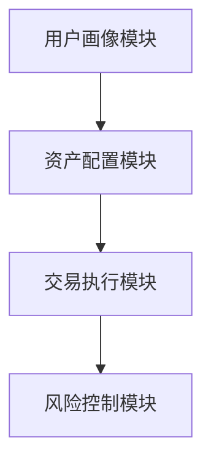

                 

# 《AI技术在不同场景中的应用》

> **关键词：** 人工智能，应用场景，医疗健康，金融，制造业，智能交通，教育，环境保护，农业
>
> **摘要：** 本文章旨在探讨AI技术在各个行业中的应用，通过深入分析医疗健康、金融、制造业、智能交通、教育、环境保护和农业领域的AI技术应用，揭示其核心概念、算法原理及实践案例，为行业从业者提供有价值的参考。

## 目录大纲

- 第一部分：AI技术概述
  - 1.1 AI技术的基本概念
    - 1.1.1 AI技术的发展历程
    - 1.1.2 AI技术的分类与核心算法
  - 1.2 AI技术的应用现状
    - 1.2.1 AI技术在不同领域的应用场景
    - 1.2.2 AI技术的应用挑战与机遇

- 第二部分：AI技术在具体场景中的应用
  - 2.1 AI在医疗健康领域的应用
    - 2.1.1 AI在疾病诊断中的应用
      - 2.1.1.1 人工智能辅助肺癌诊断
    - 2.1.2 AI在药物研发中的应用
      - 2.1.2.1 AI加速药物筛选流程
    - 2.1.3 AI在健康管理中的应用
      - 2.1.3.1 个性化健康管理的实现
  - 2.2 AI在金融领域的应用
    - 2.2.1 AI在风险管理中的应用
      - 2.2.1.1 模型风险评估与预测
    - 2.2.2 AI在智能投顾中的应用
      - 2.2.2.1 智能投顾系统架构
    - 2.2.3 AI在反欺诈中的应用
      - 2.2.3.1 AI在反欺诈系统中的应用原理
  - 2.3 AI在制造业的应用
    - 2.3.1 AI在质量控制中的应用
      - 2.3.1.1 AI质量检测系统
    - 2.3.2 AI在供应链管理中的应用
      - 2.3.2.1 供应链优化模型与算法
    - 2.3.3 AI在产品设计中的应用
      - 2.3.3.1 AI驱动产品创新
  - 2.4 AI在智能交通领域的应用
    - 2.4.1 AI在智能交通信号控制中的应用
      - 2.4.1.1 智能交通信号控制算法
    - 2.4.2 AI在无人驾驶车辆中的应用
      - 2.4.2.1 无人驾驶车辆感知与决策系统
      - 2.4.2.2 无人驾驶车辆测试与验证
  - 2.5 AI在教育领域的应用
    - 2.5.1 AI在个性化学习中的应用
      - 2.5.1.1 个性化学习系统架构
    - 2.5.2 AI在在线教育平台中的应用
      - 2.5.2.1 在线教育平台的AI技术应用
  - 2.6 AI在环境保护领域的应用
    - 2.6.1 AI在污染监测与治理中的应用
      - 2.6.1.1 污染监测系统的构建
    - 2.6.2 AI在资源优化中的应用
      - 2.6.2.1 资源优化模型与算法
  - 2.7 AI在农业领域的应用
    - 2.7.1 AI在智能农业中的应用
      - 2.7.1.1 智能农业系统的实现
    - 2.7.2 AI在作物病害监测中的应用
      - 2.7.2.1 作物病害监测与预警系统

- 第三部分：AI技术实践与应用案例
  - 3.1 AI技术应用案例分析
    - 3.1.1 案例一：基于AI的智能工厂建设
    - 3.1.2 案例二：AI在智能安防中的应用
  - 3.2 AI技术在企业中的应用策略
    - 3.2.1 企业AI战略规划
    - 3.2.2 AI技术在企业中的实施与管理

- 附录
  - 附录 A：AI技术常用工具与框架
  - 附录 B：参考文献与资料

---

### 第一部分：AI技术概述

#### 1.1 AI技术的基本概念

##### 1.1.1 AI技术的发展历程

人工智能（Artificial Intelligence，简称AI）的概念最早可以追溯到20世纪50年代。当时，随着计算机科学和数理逻辑的快速发展，人们开始探讨能否制造出能够模拟、延伸和扩展人类智能的机器。1956年，约翰·麦卡锡（John McCarthy）等人正式提出了人工智能这一术语，并举办了首届人工智能研讨会，标志着人工智能学科的正式诞生。

从1956年到2010年，AI经历了早期探索、起伏、复苏和初步发展的阶段。这一时期，研究者们主要集中于符号主义和知识表示方法，代表性工作包括逻辑推理、专家系统和自然语言处理等。

2010年后，随着大数据、云计算和深度学习的兴起，AI技术迎来了新一轮的突破。深度学习，特别是卷积神经网络（CNN）和递归神经网络（RNN）的发展，使得AI在图像识别、语音识别、自然语言处理等领域取得了显著的成果。

##### 1.1.2 AI技术的分类与核心算法

AI技术可以根据其实现方式和功能进行分类。主要可以分为以下几类：

1. **符号主义AI**：基于逻辑推理和知识表示的方法，通过构建规则库和推理机来实现智能。代表性算法包括逻辑推理、规划算法等。

2. **连接主义AI**：基于神经网络和机器学习的方法，通过模拟人脑神经元连接关系来实现智能。代表性算法包括神经网络、深度学习等。

3. **行为主义AI**：通过模拟人的行为和决策过程来实现智能。代表性算法包括强化学习、决策树等。

在连接主义AI中，深度学习是当前最为热门和有效的技术。深度学习基于多层神经网络，通过反向传播算法进行训练，能够自动提取输入数据的特征表示。

深度学习的核心算法包括：

1. **卷积神经网络（CNN）**：适用于图像识别和处理。

2. **递归神经网络（RNN）**：适用于序列数据处理，如语音识别、自然语言处理等。

3. **生成对抗网络（GAN）**：用于生成数据、图像和音频等。

#### 1.2 AI技术的应用现状

AI技术已经在众多领域得到了广泛应用，并且不断推动着各行各业的变革。

1. **医疗健康**：AI技术在疾病诊断、药物研发和健康管理等方面都有广泛的应用。例如，深度学习算法可以辅助医生进行肺癌诊断，显著提高诊断准确率。

2. **金融**：AI技术在风险管理、智能投顾和反欺诈等方面发挥着重要作用。通过机器学习算法，金融机构可以更准确地预测风险，提高业务效率。

3. **制造业**：AI技术在质量控制、供应链管理和产品设计等方面有广泛应用。例如，通过AI算法，企业可以实现自动化质量检测和优化生产流程。

4. **智能交通**：AI技术在交通信号控制、无人驾驶车辆和智能交通管理等方面有着重要的应用。通过智能算法，可以实现交通流量的优化和交通事故的预防。

5. **教育**：AI技术在个性化学习、在线教育平台和智能评测等方面有广泛应用。例如，通过AI算法，可以实现个性化学习路径的推荐和在线教育平台的智能评测。

6. **环境保护**：AI技术在污染监测与治理、资源优化和生态保护等方面有广泛应用。例如，通过AI算法，可以实现环境污染的实时监测和优化资源利用。

7. **农业**：AI技术在智能农业、作物病害监测和养殖管理等方面有广泛应用。例如，通过AI算法，可以实现作物的精准灌溉和病害的早期预警。

然而，AI技术在应用过程中也面临着一些挑战，如数据隐私保护、算法透明性和公平性等问题。这些问题需要在未来得到有效的解决。

#### 1.2.1 AI技术在不同领域的应用场景

- **医疗健康**：AI技术可以用于疾病诊断、药物研发和健康管理等领域。例如，深度学习算法可以辅助医生进行肺癌诊断，提高诊断准确率。

- **金融**：AI技术可以用于风险管理、智能投顾和反欺诈等领域。例如，通过机器学习算法，金融机构可以更准确地预测风险，提高业务效率。

- **制造业**：AI技术可以用于质量控制、供应链管理和产品设计等领域。例如，通过AI算法，企业可以实现自动化质量检测和优化生产流程。

- **智能交通**：AI技术可以用于交通信号控制、无人驾驶车辆和智能交通管理等领域。例如，通过智能算法，可以实现交通流量的优化和交通事故的预防。

- **教育**：AI技术可以用于个性化学习、在线教育平台和智能评测等领域。例如，通过AI算法，可以实现个性化学习路径的推荐和在线教育平台的智能评测。

- **环境保护**：AI技术可以用于污染监测与治理、资源优化和生态保护等领域。例如，通过AI算法，可以实现环境污染的实时监测和优化资源利用。

- **农业**：AI技术可以用于智能农业、作物病害监测和养殖管理等领域。例如，通过AI算法，可以实现作物的精准灌溉和病害的早期预警。

#### 1.2.2 AI技术的应用挑战与机遇

AI技术在应用过程中面临着一系列挑战：

1. **数据隐私保护**：AI模型的训练和优化依赖于大量数据，如何保护用户隐私成为了一大难题。

2. **算法透明性和公平性**：AI算法的决策过程往往是黑箱化的，如何保证算法的透明性和公平性是一个重要问题。

3. **技术成熟度**：虽然AI技术在某些领域已经取得了显著成果，但仍然有许多技术难题需要解决，如智能交通中的无人驾驶技术、医疗健康中的精准诊断等。

然而，AI技术也带来了巨大的机遇：

1. **产业变革**：AI技术可以改变传统产业的运作模式，提高生产效率，降低成本。

2. **经济增长**：AI技术的广泛应用有望推动新产业的出现，带动经济增长。

3. **社会进步**：AI技术可以应用于医疗、教育、环境保护等领域，提高生活质量，促进社会进步。

### 第二部分：AI技术在具体场景中的应用

#### 2.1 AI在医疗健康领域的应用

##### 2.1.1 AI在疾病诊断中的应用

AI技术在医疗健康领域的应用主要集中在疾病诊断、药物研发和健康管理等方面。其中，疾病诊断是AI技术应用最为广泛的领域之一。通过深度学习算法，AI可以辅助医生进行疾病诊断，提高诊断的准确性和效率。

以下是一个具体的案例：肺癌诊断。

**2.1.1.1 人工智能辅助肺癌诊断**

肺癌是世界上最常见的癌症之一，早期诊断对于患者的生存率至关重要。传统的肺癌诊断主要依赖于影像学检查（如CT扫描）和病理学检查，但这种方法存在一定的误诊率和漏诊率。

通过深度学习算法，AI可以自动分析CT扫描图像，识别肺癌的早期特征。例如，研究人员使用卷积神经网络（CNN）对大量的CT扫描图像进行训练，使模型能够自动识别肺结节的大小、形状和密度等特征。

以下是一个简化的流程：

1. **数据预处理**：将CT扫描图像进行预处理，包括图像增强、去噪和归一化等操作。

2. **模型训练**：使用大量的标注好的CT扫描图像数据集，训练卷积神经网络模型。模型训练过程中，通过反向传播算法不断优化模型参数。

3. **模型评估**：使用测试数据集对训练好的模型进行评估，计算模型的准确率、召回率和F1分数等指标。

4. **模型应用**：将训练好的模型部署到实际应用中，医生可以通过输入患者的CT扫描图像，获取肺癌诊断结果。

以下是一个简化的伪代码：

```python
# 数据预处理
def preprocess_image(image):
    # 图像增强、去噪、归一化等操作
    return enhanced_image

# 卷积神经网络模型
class LungCancerDetector(nn.Module):
    def __init__(self):
        super(LungCancerDetector, self).__init__()
        # 定义卷积层、池化层、全连接层等
        self.conv1 = Conv2d(1, 32, 3, 1)
        self.pool = MaxPool2d(2, 2)
        # ...

    def forward(self, x):
        x = self.pool(F.relu(self.conv1(x)))
        # ...
        return x

# 训练模型
def train_model(model, train_loader, criterion, optimizer, num_epochs):
    for epoch in range(num_epochs):
        running_loss = 0.0
        for images, labels in train_loader:
            # 前向传播
            outputs = model(images)
            loss = criterion(outputs, labels)
            # 反向传播
            optimizer.zero_grad()
            loss.backward()
            optimizer.step()
            running_loss += loss.item()
        print(f'Epoch {epoch+1}, Loss: {running_loss/len(train_loader)}')

# 评估模型
def evaluate_model(model, test_loader):
    correct = 0
    total = 0
    with torch.no_grad():
        for images, labels in test_loader:
            outputs = model(images)
            predicted = outputs.argmax(dim=1)
            total += labels.size(0)
            correct += (predicted == labels).sum().item()
    print(f'Accuracy: {100 * correct / total}%')

# 主程序
def main():
    # 加载数据集
    train_loader = torch.utils.data.DataLoader(train_dataset, batch_size=64, shuffle=True)
    test_loader = torch.utils.data.DataLoader(test_dataset, batch_size=64, shuffle=False)

    # 初始化模型、损失函数和优化器
    model = LungCancerDetector()
    criterion = nn.CrossEntropyLoss()
    optimizer = optim.Adam(model.parameters(), lr=0.001)

    # 训练模型
    train_model(model, train_loader, criterion, optimizer, num_epochs=10)

    # 评估模型
    evaluate_model(model, test_loader)

if __name__ == '__main__':
    main()
```

通过以上案例，我们可以看到AI技术如何辅助肺癌诊断。然而，实际应用中还需要考虑更多的因素，如模型的可解释性、数据质量和医疗法规等。未来，随着AI技术的不断发展，AI在医疗健康领域的应用将会更加广泛和深入。

##### 2.1.2 AI在药物研发中的应用

AI技术在药物研发中的应用主要体现在药物筛选、药物设计和临床试验等领域。通过深度学习算法，AI可以大大加速药物研发过程，降低研发成本。

**2.1.2.1 AI加速药物筛选流程**

药物筛选是药物研发过程中的关键环节，传统的药物筛选方法需要大量的人力和时间。通过AI技术，可以自动化和智能化药物筛选过程。

以下是一个简化的流程：

1. **数据收集**：收集大量的化合物结构和生物活性数据。

2. **特征提取**：使用深度学习算法对化合物结构进行特征提取，生成高维特征向量。

3. **模型训练**：使用特征向量训练深度学习模型，预测化合物的生物活性。

4. **筛选候选药物**：根据模型预测结果，筛选出具有潜在生物活性的化合物。

5. **实验室验证**：对筛选出的化合物进行实验室验证，确定其是否具有药物潜力。

以下是一个简化的伪代码：

```python
# 加载化合物结构和生物活性数据
def load_data():
    compounds = load_compounds()
    activities = load_activities()
    return compounds, activities

# 特征提取
def extract_features(compounds):
    features = []
    for compound in compounds:
        # 提取化合物特征
        feature = extract_compound_features(compound)
        features.append(feature)
    return features

# 训练深度学习模型
def train_model(features, activities):
    model = build_model()
    criterion = nn.CrossEntropyLoss()
    optimizer = optim.Adam(model.parameters(), lr=0.001)

    for epoch in range(num_epochs):
        running_loss = 0.0
        for feature, activity in zip(features, activities):
            # 前向传播
            output = model(feature)
            loss = criterion(output, activity)
            # 反向传播
            optimizer.zero_grad()
            loss.backward()
            optimizer.step()
            running_loss += loss.item()
        print(f'Epoch {epoch+1}, Loss: {running_loss/len(features)}')

    return model

# 筛选候选药物
def select_candidate_drugs(model, compounds):
    features = extract_features(compounds)
    predictions = model(features)
    active_compounds = compounds[predictions.argmax(dim=1) == 1]
    return active_compounds

# 主程序
def main():
    compounds, activities = load_data()
    features = extract_features(compounds)
    model = train_model(features, activities)
    candidate_drugs = select_candidate_drugs(model, compounds)

    # 实验室验证
    validate_candidate_drugs(candidate_drugs)

if __name__ == '__main__':
    main()
```

通过以上案例，我们可以看到AI技术如何加速药物筛选流程。然而，实际应用中还需要考虑更多的因素，如模型的可解释性、数据质量和药物研发的伦理问题等。未来，随着AI技术的不断发展，AI在药物研发中的应用将会更加广泛和深入。

##### 2.1.3 AI在健康管理中的应用

AI技术在健康管理中的应用主要体现在个性化健康管理的实现、健康数据的分析和健康风险评估等方面。通过深度学习算法，AI可以提供更加精准的健康管理服务。

**2.1.3.1 个性化健康管理的实现**

个性化健康管理是基于个人的健康数据，为个体提供个性化的健康建议和干预措施。通过AI技术，可以自动分析健康数据，生成个性化的健康管理计划。

以下是一个简化的流程：

1. **数据收集**：收集个体的健康数据，包括体重、血压、血糖、运动数据等。

2. **特征提取**：使用深度学习算法对健康数据进行特征提取，生成高维特征向量。

3. **模型训练**：使用特征向量训练深度学习模型，预测个体的健康状态和风险。

4. **健康管理计划生成**：根据模型预测结果，为个体生成个性化的健康管理计划。

5. **计划实施与反馈**：个体按照健康管理计划进行干预，系统根据反馈数据不断调整计划。

以下是一个简化的伪代码：

```python
# 加载健康数据
def load_health_data():
    weights = load_weight_data()
    blood_pressures = load_blood_pressure_data()
    blood_glucoses = load_blood_glucose_data()
    exercises = load_exercise_data()
    return weights, blood_pressures, blood_glucoses, exercises

# 特征提取
def extract_health_features(weights, blood_pressures, blood_glucoses, exercises):
    features = []
    for weight, blood_pressure, blood_glucose, exercise in zip(weights, blood_pressures, blood_glucoses, exercises):
        # 提取健康特征
        feature = extract_health_feature(weight, blood_pressure, blood_glucose, exercise)
        features.append(feature)
    return features

# 训练深度学习模型
def train_model(features, health_status):
    model = build_model()
    criterion = nn.CrossEntropyLoss()
    optimizer = optim.Adam(model.parameters(), lr=0.001)

    for epoch in range(num_epochs):
        running_loss = 0.0
        for feature, status in zip(features, health_status):
            # 前向传播
            output = model(feature)
            loss = criterion(output, status)
            # 反向传播
            optimizer.zero_grad()
            loss.backward()
            optimizer.step()
            running_loss += loss.item()
        print(f'Epoch {epoch+1}, Loss: {running_loss/len(features)}')

    return model

# 生成个性化健康管理计划
def generate_health_management_plan(model, health_data):
    features = extract_health_features(*health_data)
    health_status = model(features)
    plan = generate_health_management_plan(health_status)
    return plan

# 主程序
def main():
    weights, blood_pressures, blood_glucoses, exercises = load_health_data()
    model = train_model(extract_health_features(weights, blood_pressures, blood_glucoses, exercises), health_status)
    health_management_plan = generate_health_management_plan(model, (weights, blood_pressures, blood_glucoses, exercises))

    # 实施健康管理计划
    implement_health_management_plan(health_management_plan)

if __name__ == '__main__':
    main()
```

通过以上案例，我们可以看到AI技术如何实现个性化健康管理。然而，实际应用中还需要考虑更多的因素，如数据隐私保护、模型的解释性和个性化健康管理的伦理问题等。未来，随着AI技术的不断发展，AI在健康管理中的应用将会更加广泛和深入。

#### 2.2 AI在金融领域的应用

##### 2.2.1 AI在风险管理中的应用

AI技术在金融领域的应用非常广泛，特别是在风险管理方面。通过机器学习和深度学习算法，金融机构可以更准确地预测风险，从而提高业务决策的准确性和效率。

**2.2.1.1 模型风险评估与预测**

在金融领域，风险评估是风险管理的重要环节。通过机器学习算法，金融机构可以对各种金融产品进行风险评估，预测其潜在的风险。

以下是一个简化的流程：

1. **数据收集**：收集金融产品的历史数据，包括价格、成交量、利率等。

2. **特征提取**：使用深度学习算法提取金融产品的特征，生成高维特征向量。

3. **模型训练**：使用特征向量训练深度学习模型，预测金融产品的风险。

4. **风险预测**：根据模型预测结果，对金融产品进行风险评级。

以下是一个简化的伪代码：

```python
# 加载金融产品数据
def load_financial_product_data():
    prices = load_price_data()
    volumes = load_volume_data()
    interest_rates = load_interest_rate_data()
    return prices, volumes, interest_rates

# 特征提取
def extract_financial_product_features(prices, volumes, interest_rates):
    features = []
    for price, volume, interest_rate in zip(prices, volumes, interest_rates):
        # 提取金融产品特征
        feature = extract_financial_product_feature(price, volume, interest_rate)
        features.append(feature)
    return features

# 训练深度学习模型
def train_model(features, risk_levels):
    model = build_model()
    criterion = nn.CrossEntropyLoss()
    optimizer = optim.Adam(model.parameters(), lr=0.001)

    for epoch in range(num_epochs):
        running_loss = 0.0
        for feature, risk_level in zip(features, risk_levels):
            # 前向传播
            output = model(feature)
            loss = criterion(output, risk_level)
            # 反向传播
            optimizer.zero_grad()
            loss.backward()
            optimizer.step()
            running_loss += loss.item()
        print(f'Epoch {epoch+1}, Loss: {running_loss/len(features)}')

    return model

# 风险预测
def predict_risk(model, financial_product_features):
    predictions = model(financial_product_features)
    risk_levels = predictions.argmax(dim=1)
    return risk_levels

# 主程序
def main():
    prices, volumes, interest_rates = load_financial_product_data()
    financial_product_features = extract_financial_product_features(prices, volumes, interest_rates)
    model = train_model(financial_product_features, risk_levels)
    risk_levels = predict_risk(model, financial_product_features)

    # 根据风险评级进行业务决策
    make_business_decisions(risk_levels)

if __name__ == '__main__':
    main()
```

通过以上案例，我们可以看到AI技术如何进行模型风险评估与预测。然而，实际应用中还需要考虑更多的因素，如数据质量、模型的可解释性和风险评估的伦理问题等。未来，随着AI技术的不断发展，AI在金融风险管理中的应用将会更加广泛和深入。

##### 2.2.2 AI在智能投顾中的应用

智能投顾（Robo-Advisory）是金融领域的一个新兴领域，通过AI技术，为投资者提供个性化的投资建议和服务。

**2.2.2.1 智能投顾系统架构**

智能投顾系统通常由以下几个核心模块组成：

1. **用户画像模块**：收集和分析用户的数据，包括年龄、收入、投资经验、风险偏好等，为个性化投资建议提供基础。

2. **资产配置模块**：根据用户画像，使用机器学习算法生成个性化的资产配置策略。

3. **交易执行模块**：根据资产配置策略，执行具体的交易操作。

4. **风险控制模块**：监控投资组合的风险，进行动态调整。

以下是一个简化的系统架构图：



以下是一个简化的伪代码：

```python
# 用户画像模块
def generate_user_profile(user_data):
    # 提取用户特征
    profile = extract_user_features(user_data)
    return profile

# 资产配置模块
def generate_asset_allocation_strategy(user_profile):
    # 使用机器学习算法生成资产配置策略
    strategy = generate_strategy(user_profile)
    return strategy

# 交易执行模块
def execute_trades(allocation_strategy):
    # 执行具体的交易操作
    trades = execute_allocation_strategy(allocation_strategy)
    return trades

# 风险控制模块
def monitor_and_adjust_risk(investment_port

