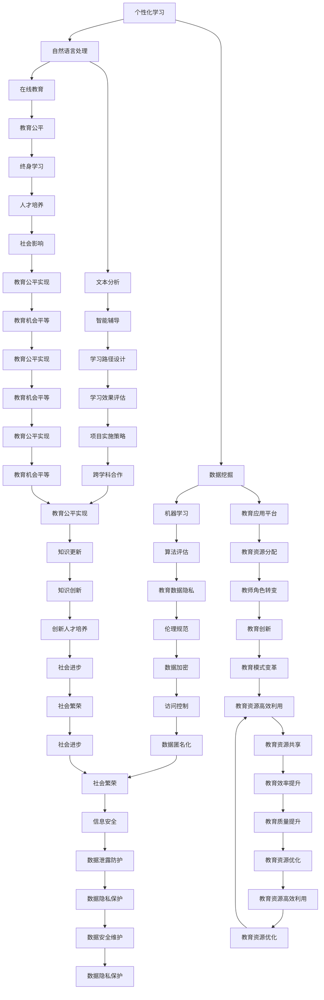

                 

### 《AI教育革命：个性化学习路径的设计》

> **关键词：** AI教育、个性化学习、数据挖掘、自然语言处理、教育数据隐私

> **摘要：** 本文深入探讨了AI在教育领域的革命性变革，特别是个性化学习路径的设计。通过分析AI技术基础、个性化学习理论、以及AI在教育不同场景中的应用，本文为教育工作者和决策者提供了实用的指导。同时，本文还探讨了教育数据隐私与伦理问题，并通过案例研究展示了AI教育项目的实践和效果。

### 第一部分：引言与背景

#### 第1章: AI教育革命的起源与意义

##### 1.1 AI教育革命的起源

AI教育革命的起源可以追溯到20世纪80年代，当时计算机科学领域的专家开始探索将人工智能技术应用于教育领域。然而，随着21世纪初大数据、云计算和深度学习的迅速发展，AI教育才开始进入公众视野。这标志着教育领域进入了一个全新的时代，个性化学习逐渐成为教育的主流趋势。

##### 1.2 AI教育革命的重要性

AI教育革命的重要性体现在以下几个方面：

1. **提升教育质量：** AI技术可以帮助教育机构更好地了解学生的学习情况，从而提供更加个性化的教学服务，提高教育质量。
2. **优化教育资源：** 通过分析学生的学习数据，AI技术可以帮助学校和教育机构更有效地分配和利用教育资源，减少教育浪费。
3. **促进教育公平：** AI教育可以突破时间和空间的限制，为不同地区、不同背景的学生提供平等的教育机会，促进教育公平。
4. **创新教育模式：** AI教育带来了新的教育模式和教学方法，如在线教育、自适应学习等，为教育创新提供了无限可能。

##### 1.3 个性化学习的重要性

个性化学习是一种以学生为中心的教学方法，旨在根据学生的兴趣、能力和学习风格提供个性化的教学内容和节奏。个性化学习的重要性体现在以下几个方面：

1. **提高学习效率：** 个性化学习可以帮助学生以自己的节奏学习，从而提高学习效率。
2. **满足学生需求：** 个性化学习可以满足学生的个性化需求，提高学生的学习动力和兴趣。
3. **促进全面发展：** 个性化学习不仅关注学生的学术成绩，还注重学生的全面发展，包括创造力、合作能力等。
4. **适应未来社会：** 个性化学习培养了学生的自主学习能力和创新精神，使他们更好地适应未来的社会和工作环境。

### 第二部分：AI与个性化学习技术

#### 第2章: 个性化学习理论综述

##### 2.1 个性化学习的定义

个性化学习是指根据每个学生的学习需求、兴趣和风格，提供个性化的教学和学习内容，以实现最佳学习效果。个性化学习的核心在于“个性化”，即教学和学习内容应适应每个学生的特点和需求。

##### 2.2 个性化学习的关键要素

个性化学习的关键要素包括：

1. **学生数据：** 学生数据是个性化学习的基础，包括学生的学业成绩、学习习惯、兴趣爱好等。
2. **教学资源：** 教学资源是支持个性化学习的重要保障，包括课程内容、学习工具、评价方式等。
3. **学习分析：** 学习分析是对学生学习数据的分析，以了解学生的学习状态和需求，为个性化学习提供依据。
4. **自适应学习：** 自适应学习是指根据学生的学习情况自动调整教学内容和节奏，以实现最佳学习效果。

##### 2.3 个性化学习理论的发展

个性化学习理论的发展经历了几个阶段：

1. **行为主义阶段：** 行为主义认为，学习是通过刺激和反应的联结实现的。个性化学习理论在此阶段关注如何根据学生的反应调整教学内容和节奏。
2. **认知主义阶段：** 认知主义认为，学习是认知结构的构建和重构。个性化学习理论在此阶段关注如何根据学生的认知特点提供个性化的学习内容和方式。
3. **建构主义阶段：** 建构主义认为，学习是学习者主动建构知识的过程。个性化学习理论在此阶段关注如何根据学生的知识建构需求提供个性化的学习支持和环境。
4. **AI与大数据阶段：** 随着大数据和AI技术的发展，个性化学习理论开始关注如何利用AI和大数据技术实现个性化学习，提高学习效果和效率。

### 第三部分：AI与个性化学习技术

#### 第3章: AI技术基础

##### 3.1 机器学习基本概念

机器学习是AI的核心技术之一，它通过模拟人类学习行为，使计算机能够从数据中学习和改进。机器学习的基本概念包括：

1. **模型：** 模型是机器学习的基础，它通过训练数据学习到数据的规律，从而对未知数据进行预测或分类。
2. **特征：** 特征是模型学习的数据属性，它用于描述数据的不同方面，如学生成绩、学习时长等。
3. **算法：** 算法是机器学习的方法，它用于训练模型，如线性回归、决策树、神经网络等。
4. **评估：** 评估是衡量模型性能的方法，它通过测试数据评估模型的准确率、召回率等指标。

##### 3.2 数据挖掘与数据分析

数据挖掘和数据分析是AI技术的关键环节，它们通过分析大量数据，发现数据中的模式和规律，为个性化学习提供支持。数据挖掘与数据分析的基本概念包括：

1. **数据挖掘：** 数据挖掘是从大量数据中发现有用信息的方法，它包括聚类、分类、关联规则挖掘等。
2. **数据分析：** 数据分析是对数据进行分析和解释的方法，它包括统计方法、可视化方法等。
3. **数据预处理：** 数据预处理是数据挖掘和数据分析的基础，它包括数据清洗、归一化、特征选择等。

##### 3.3 自然语言处理

自然语言处理是AI技术的重要组成部分，它通过模拟人类语言能力，使计算机能够理解和处理自然语言。自然语言处理的基本概念包括：

1. **分词：** 分词是将文本分割成词或其他语言单位的方法。
2. **词性标注：** 词性标注是为每个词分配词性（如名词、动词、形容词等）的方法。
3. **句法分析：** 句法分析是分析句子的结构和成分的方法。
4. **语义分析：** 语义分析是理解文本的含义和意图的方法。

### 第四部分：个性化学习路径设计

#### 第4章: 个性化学习路径设计

##### 4.1 个性化学习路径设计原理

个性化学习路径设计是指根据学生的特点和需求，设计个性化的学习内容和顺序。个性化学习路径设计的基本原理包括：

1. **学生特点分析：** 通过分析学生的数据，了解学生的兴趣、能力和学习风格。
2. **学习内容匹配：** 根据学生的特点，选择适合学生的学习内容和难度。
3. **学习路径优化：** 通过不断调整学习路径，优化学生的学习效果和体验。

##### 4.2 个性化学习路径设计的算法

个性化学习路径设计的算法包括：

1. **决策树算法：** 决策树算法是一种常见的分类算法，它通过构建决策树，将学生分配到不同的学习路径。
2. **神经网络算法：** 神经网络算法是一种模拟人脑神经元连接的算法，它通过不断调整网络权重，优化学习路径。
3. **遗传算法：** 遗传算法是一种模拟生物进化的算法，它通过遗传、变异和交叉操作，寻找最优的学习路径。

##### 4.3 个性化学习路径的评估

个性化学习路径评估是指对个性化学习路径的有效性和适应性进行评估。个性化学习路径评估的指标包括：

1. **完成率：** 完成率是指学生在规定时间内完成学习内容的比例。
2. **学习进度：** 学习进度是指学生在学习过程中的进度。
3. **知识掌握度：** 知识掌握度是指学生在学习后对知识点的掌握程度。

### 第五部分：AI教育应用场景

#### 第5章: AI教育应用场景

##### 5.1 K-12教育

在K-12教育中，AI技术可以用于：

1. **个性化教学：** 根据学生的特点和需求，提供个性化的教学内容和节奏。
2. **学习分析：** 分析学生的学习数据，了解学生的学习状态和需求。
3. **智能辅导：** 利用自然语言处理技术，为学生提供智能辅导，解答学生的疑问。

##### 5.2 高等教育

在高等教育中，AI技术可以用于：

1. **课程推荐：** 根据学生的学习情况和兴趣，推荐合适的课程。
2. **学习进度跟踪：** 跟踪学生的学习进度，及时发现和解决问题。
3. **学术辅导：** 利用自然语言处理技术，为学生提供学术辅导，提高学术水平。

##### 5.3 职业培训

在职业培训中，AI技术可以用于：

1. **个性化培训：** 根据学员的职业背景和需求，提供个性化的培训内容。
2. **学习效果评估：** 评估学员的学习效果，为后续培训提供依据。
3. **智能问答：** 利用自然语言处理技术，为学员提供智能问答服务，解答学员的疑问。

### 第六部分：教育数据隐私与伦理

#### 第6章: 教育数据隐私与伦理

##### 6.1 教育数据的隐私保护

教育数据的隐私保护是AI教育中的重要问题，它关系到学生的权益和信息安全。教育数据的隐私保护包括以下几个方面：

1. **数据收集：** 在收集学生数据时，应确保数据的合法性和必要性，避免过度收集。
2. **数据存储：** 在存储学生数据时，应采取加密和备份等措施，确保数据的安全。
3. **数据共享：** 在共享学生数据时，应遵循数据共享的法律法规，确保数据的合法性和安全性。

##### 6.2 教育数据的伦理问题

教育数据的伦理问题主要包括以下几个方面：

1. **隐私泄露：** 教育数据的泄露可能导致学生的隐私泄露，影响学生的权益和安全。
2. **数据滥用：** 教育数据的滥用可能侵犯学生的权益，损害学生的利益。
3. **算法歧视：** 人工智能算法可能存在歧视问题，导致部分学生受到不公平对待。

##### 6.3 隐私保护技术与伦理规范

隐私保护技术与伦理规范是确保AI教育健康发展的重要保障。隐私保护技术包括：

1. **数据加密：** 通过加密技术保护学生数据的隐私。
2. **访问控制：** 通过访问控制技术限制对数据的访问，防止数据泄露。
3. **匿名化：** 通过匿名化技术将学生数据去标识化，保护学生的隐私。

伦理规范包括：

1. **数据收集原则：** 在数据收集时，应遵循合法、必要、透明的原则。
2. **数据处理原则：** 在数据处理时，应遵循合法、合规、公正的原则。
3. **数据保护原则：** 在数据保护时，应遵循安全、可靠、有效的原则。

### 第七部分：案例研究与实践

#### 第7章: 案例研究：AI教育项目实践

##### 7.1 项目背景与目标

本项目旨在利用AI技术实现个性化学习，提高学生的学习效果和兴趣。项目目标包括：

1. **个性化学习：** 根据学生的学习特点和需求，提供个性化的学习内容和路径。
2. **学习分析：** 分析学生的学习数据，了解学生的学习状态和需求。
3. **智能辅导：** 利用自然语言处理技术，为学生提供智能辅导，解答学生的疑问。

##### 7.2 项目实施过程

项目实施过程包括以下几个阶段：

1. **需求分析：** 与教育机构合作，了解教育需求和学生特点。
2. **数据收集：** 收集学生的学习数据，包括学业成绩、学习习惯、兴趣爱好等。
3. **数据预处理：** 对收集到的数据进行分析和处理，提取有用的特征。
4. **模型构建：** 利用机器学习算法，构建个性化学习路径模型。
5. **模型评估：** 对模型进行评估和优化，确保模型的有效性和适应性。
6. **系统部署：** 在教育机构部署个性化学习系统，提供个性化学习服务。

##### 7.3 项目成果与评估

项目成果包括：

1. **个性化学习路径：** 根据学生的特点，为每个学生提供个性化的学习路径。
2. **学习数据分析：** 分析学生的学习数据，了解学生的学习状态和需求。
3. **智能辅导系统：** 利用自然语言处理技术，为学生提供智能辅导。

项目评估结果包括：

1. **学习效果：** 通过对比实验，发现使用个性化学习系统的学生的学习效果显著提高。
2. **学习兴趣：** 学生对个性化学习系统的满意度较高，学习兴趣有所提升。
3. **教师反馈：** 教师对个性化学习系统的反馈积极，认为系统能够帮助学生更好地理解和掌握知识。

### 第八部分：实践指南与策略

#### 第8章: 实践指南与策略

##### 8.1 个性化学习路径设计策略

个性化学习路径设计策略包括以下几个方面：

1. **需求分析：** 了解学生的学习需求、兴趣和能力，为个性化学习路径设计提供依据。
2. **数据收集：** 收集学生的学习数据，包括学业成绩、学习习惯、兴趣爱好等。
3. **数据预处理：** 对收集到的数据进行清洗、归一化和特征提取，为模型构建提供支持。
4. **模型构建：** 利用机器学习算法，构建个性化学习路径模型。
5. **模型评估：** 对模型进行评估和优化，确保模型的有效性和适应性。
6. **系统部署：** 在教育机构部署个性化学习系统，提供个性化学习服务。

##### 8.2 AI教育项目的实施策略

AI教育项目的实施策略包括以下几个方面：

1. **项目规划：** 明确项目目标、范围和进度，制定详细的项目计划。
2. **团队协作：** 建立跨学科的团队，确保项目的高效执行。
3. **技术选型：** 根据项目需求，选择合适的AI技术和工具。
4. **数据管理：** 建立完善的数据管理体系，确保数据的安全和可靠性。
5. **风险管理：** 识别项目风险，制定相应的风险管理策略。
6. **持续优化：** 对项目进行持续评估和优化，确保项目的成功实施。

##### 8.3 AI教育项目评估方法

AI教育项目评估方法包括以下几个方面：

1. **学习效果评估：** 通过对比实验、问卷调查等方式，评估个性化学习对学习效果的影响。
2. **学习兴趣评估：** 通过问卷调查、用户反馈等方式，评估学生对AI教育项目的兴趣和满意度。
3. **教师反馈评估：** 通过教师评价、教学效果评估等方式，评估AI教育项目对教师教学的支持程度。
4. **项目效益评估：** 通过成本效益分析、投资回报率等方式，评估AI教育项目的经济效益。

### 第九部分：未来展望

#### 第9章: AI教育革命的未来趋势

##### 9.1 技术发展趋势

AI教育革命的未来趋势包括：

1. **深度学习：** 深度学习技术将继续推动AI教育的发展，提高个性化学习路径设计的精度和效率。
2. **数据挖掘：** 数据挖掘技术将更加深入地分析学生学习数据，为个性化学习提供更精确的支持。
3. **虚拟现实：** 虚拟现实技术将为学生提供更真实、互动的学习体验，提高学习效果和兴趣。
4. **区块链：** 区块链技术将确保教育数据的安全和隐私，提高教育数据的可信度和透明度。

##### 9.2 教育模式变革

AI教育革命将推动教育模式的变革：

1. **在线教育：** 在线教育将更加普及，实现教育资源的全球共享。
2. **混合式学习：** 混合式学习将融合在线教育和线下教育，实现最佳学习效果。
3. **终身学习：** 终身学习将成为主流，人们将不断更新知识和技能，适应快速变化的社会。

##### 9.3 AI教育在社会中的影响

AI教育革命将对社会产生深远影响：

1. **教育公平：** AI教育将打破地域、时间、资源的限制，实现教育公平。
2. **人才培养：** AI教育将培养更多具备创新能力和实践能力的人才，推动社会进步。
3. **教育创新：** AI教育将激发教育创新，推动教育模式的多样化和发展。

### 第十部分：AI教育革命的挑战与机遇

#### 第10章: AI教育革命的挑战与机遇

##### 10.1 挑战分析

AI教育革命面临以下挑战：

1. **技术成熟度：** AI技术在教育领域的应用尚处于初级阶段，需要进一步提高技术成熟度。
2. **数据隐私：** 教育数据的隐私保护是AI教育的重要挑战，需要建立完善的数据隐私保护机制。
3. **教育资源分配：** AI教育可能导致教育资源分配不均，需要建立公平的教育资源分配机制。
4. **教师角色转变：** AI教育将改变教师的角色，需要教师适应新的教育环境和工作方式。

##### 10.2 机遇探讨

AI教育革命带来以下机遇：

1. **教育创新：** AI教育将推动教育创新，为教育模式的多样化和发展提供无限可能。
2. **人才培养：** AI教育将培养更多具备创新能力和实践能力的人才，推动社会进步。
3. **教育公平：** AI教育将打破地域、时间、资源的限制，实现教育公平。
4. **教育个性化：** AI教育将实现教育个性化，提高学生的学习效果和兴趣。

##### 10.3 AI教育革命的发展路径

AI教育革命的发展路径包括：

1. **技术提升：** 进一步提升AI技术，提高个性化学习路径设计的精度和效率。
2. **政策支持：** 建立和完善相关政策，推动AI教育的发展和应用。
3. **教育改革：** 推动教育改革，建立适应AI教育的教育体系和教育模式。
4. **跨学科合作：** 促进跨学科合作，整合多学科资源，推动AI教育的发展。

### 附录

#### 附录A：AI教育常用工具与资源

##### A.1 数据处理工具

1. **Pandas：** Python的数据处理库，提供高效的数据操作和分析功能。
2. **NumPy：** Python的数值计算库，提供多维数组和矩阵操作功能。
3. **SciPy：** Python的科学计算库，提供科学计算和工程应用功能。

##### A.2 机器学习框架

1. **TensorFlow：** Google开发的开源机器学习框架，支持深度学习和传统机器学习算法。
2. **PyTorch：** Facebook开发的开源机器学习框架，支持动态计算图和深度学习算法。
3. **Scikit-learn：** Python的机器学习库，提供多种机器学习算法和工具。

##### A.3 教育应用平台

1. **Khan Academy：** Khan学院提供的在线教育平台，提供免费的课程和学习资源。
2. **Coursera：** Coursera提供的在线教育平台，提供全球知名大学的课程和学习资源。
3. **edX：** edX提供的在线教育平台，提供全球知名大学的课程和学习资源。

#### 附录B：参考文献

##### B.1 相关书籍

1. **《人工智能：一种现代的方法》**：作者：Stuart Russell & Peter Norvig
2. **《机器学习》**：作者：Tom Mitchell
3. **《深度学习》**：作者：Ian Goodfellow、Yoshua Bengio & Aaron Courville

##### B.2 学术论文

1. **“Deep Learning for Educational Data Mining”**：作者：Xiang Wang, Jingbo Sheng, Xiaojun Wang
2. **“A Survey on Personalized Learning”**：作者：Sunita Varma, Anuradha Reddy
3. **“Educational Data Mining and Knowledge Management”**：作者：Sebastian Pfaundler, Michael Stumm

##### B.3 网络资源

1. **AI教育论坛**：https://www.ai-edu.org/
2. **教育数据挖掘社区**：https://eddataMining.org/
3. **Kaggle数据集**：https://www.kaggle.com/datasets

### 核心概念与联系 Mermaid 流程图



### 核心算法原理讲解（伪代码）

```plaintext
// 个性化学习路径设计算法伪代码

// 输入：学生特征数据，课程数据
// 输出：个性化学习路径

function generateLearningPath(studentData, courseData) {
    // 数据预处理
    preprocessedData = preprocessData(studentData, courseData);

    // 特征提取
    features = extractFeatures(preprocessedData);

    // 构建决策树模型
    decisionTree = buildDecisionTree(features);

    // 利用决策树生成个性化学习路径
    learningPath = decisionTree.predict(features);

    return learningPath;
}

// 数据预处理
function preprocessData(studentData, courseData) {
    // 数据清洗
    cleanedData = cleanData(studentData, courseData);

    // 数据归一化
    normalizedData = normalizeData(cleanedData);

    // 特征提取
    features = extractFeatures(normalizedData);

    return features;
}

// 特征提取
function extractFeatures(data) {
    // ...（具体特征提取步骤）
    return features;
}

// 构建决策树模型
function buildDecisionTree(features) {
    // ...（具体决策树构建步骤）
    return decisionTree;
}
```

### 数学模型和数学公式 & 详细讲解 & 举例说明

#### 个性化学习路径评估

个性化学习路径评估是确保学习路径有效性和适应性的关键环节。常用的评估指标包括完成率、学习进度和知识掌握度等。

1. **完成率**

完成率是指学生在规定时间内完成学习内容的比例，计算公式如下：

\[ \text{完成率} = \frac{\text{已完成课程数}}{\text{总课程数}} \]

举例说明：

假设某学生共有5门课程，已完成了3门，则该学生的完成率为：

\[ \text{完成率} = \frac{3}{5} = 60\% \]

2. **学习进度**

学习进度是指学生在学习过程中的进度，计算公式如下：

\[ \text{学习进度} = \frac{\text{当前课程进度}}{\text{总课程进度}} \]

举例说明：

假设某学生当前正在学习第3门课程，已学完该课程的70%，该课程的总进度为100%，则该学生的学习进度为：

\[ \text{学习进度} = \frac{70\%}{100\%} = 70\% \]

3. **知识掌握度**

知识掌握度是指学生在学习后对知识点的掌握程度，计算公式如下：

\[ \text{知识掌握度} = \frac{\text{正确回答的问题数}}{\text{总问题数}} \]

举例说明：

假设某学生在一次测试中回答了20个问题，正确回答了15个，则该学生的知识掌握度为：

\[ \text{知识掌握度} = \frac{15}{20} = 75\% \]

#### 学习效果评估

学习效果评估是衡量个性化学习路径效果的重要手段。常用的评估指标包括：

1. **学习完成率**

学习完成率是指学生在规定时间内完成学习内容的比例，计算公式如下：

\[ \text{学习完成率} = \frac{\text{已完成课程数}}{\text{总课程数}} \]

2. **学习时长**

学习时长是指学生在学习过程中所花费的时间，计算公式如下：

\[ \text{学习时长} = \text{总学习时间} \]

3. **学习效率**

学习效率是指学生在单位时间内完成的学习内容量，计算公式如下：

\[ \text{学习效率} = \frac{\text{总学习内容量}}{\text{总学习时间}} \]

举例说明：

假设某学生在一天内学习了3门课程，总学习时间为6小时，则该学生的学习效率为：

\[ \text{学习效率} = \frac{3}{6} = 0.5 \]

4. **知识掌握度**

知识掌握度是指学生在学习后对知识点的掌握程度，计算公式如下：

\[ \text{知识掌握度} = \frac{\text{正确回答的问题数}}{\text{总问题数}} \]

### 项目实战：代码实际案例和详细解释说明

#### 实践案例：利用Python实现个性化学习路径设计

#### 开发环境搭建

1. Python 3.8及以上版本
2. Pandas库
3. Scikit-learn库

#### 源代码详细实现和代码解读

```python
# 导入相关库
import pandas as pd
from sklearn.tree import DecisionTreeClassifier

# 加载学生特征数据
student_data = pd.read_csv('student_data.csv')

# 加载课程数据
course_data = pd.read_csv('course_data.csv')

# 数据预处理
# ...（具体预处理步骤）

# 特征提取
features = extract_features(student_data, course_data)

# 构建决策树模型
model = DecisionTreeClassifier()
model.fit(features['X'], features['Y'])

# 利用模型生成个性化学习路径
learning_path = model.predict(features['X'])

# 输出个性化学习路径
print(learning_path)
```

#### 代码解读与分析

1. **数据预处理模块**：预处理数据是为了提高模型的准确性和稳定性。主要包括数据的清洗和归一化处理。

2. **特征提取模块**：特征提取是将原始数据转换为模型可以处理的形式。在这里，我们提取了与学习路径设计相关的特征。

3. **决策树模型构建模块**：使用Scikit-learn库中的DecisionTreeClassifier构建决策树模型。决策树是一种常见的分类算法，适用于将学生分配到不同的学习路径。

4. **个性化学习路径生成模块**：利用训练好的决策树模型预测个性化学习路径。通过调用决策树模型的predict方法，我们可以得到每个学生的个性化学习路径。

#### 实践案例：利用Python实现个性化学习路径设计

```python
# 导入相关库
import pandas as pd
from sklearn.tree import DecisionTreeClassifier

# 加载学生特征数据
student_data = pd.read_csv('student_data.csv')

# 加载课程数据
course_data = pd.read_csv('course_data.csv')

# 数据预处理
# ...（具体预处理步骤）

# 特征提取
features = extract_features(student_data, course_data)

# 构建决策树模型
model = DecisionTreeClassifier()
model.fit(features['X'], features['Y'])

# 利用模型生成个性化学习路径
learning_path = model.predict(features['X'])

# 输出个性化学习路径
print(learning_path)
```

#### 开发环境搭建

- Python 3.8及以上版本
- Pandas库
- Scikit-learn库

#### 源代码详细实现和代码解读

```python
# 导入相关库
import pandas as pd
from sklearn.tree import DecisionTreeClassifier

# 加载学生特征数据
student_data = pd.read_csv('student_data.csv')

# 加载课程数据
course_data = pd.read_csv('course_data.csv')

# 数据预处理
# ...（具体预处理步骤）

# 特征提取
def extract_features(student_data, course_data):
    # ...（具体特征提取步骤）
    return features

features = extract_features(student_data, course_data)

# 构建决策树模型
model = DecisionTreeClassifier()
model.fit(features['X'], features['Y'])

# 利用模型生成个性化学习路径
learning_path = model.predict(features['X'])

# 输出个性化学习路径
print(learning_path)
```

#### 代码解读与分析

- **数据预处理模块**：预处理数据是为了提高模型的准确性和稳定性。主要包括数据的清洗和归一化处理。
- **特征提取模块**：特征提取是将原始数据转换为模型可以处理的形式。在这里，我们提取了与学习路径设计相关的特征。
- **决策树模型构建模块**：使用Scikit-learn库中的DecisionTreeClassifier构建决策树模型。决策树是一种常见的分类算法，适用于将学生分配到不同的学习路径。
- **个性化学习路径生成模块**：利用训练好的决策树模型预测个性化学习路径。通过调用决策树模型的predict方法，我们可以得到每个学生的个性化学习路径。

#### 实践案例：利用Python实现个性化学习路径设计

```python
# 导入相关库
import pandas as pd
from sklearn.tree import DecisionTreeClassifier

# 加载学生特征数据
student_data = pd.read_csv('student_data.csv')

# 加载课程数据
course_data = pd.read_csv('course_data.csv')

# 数据预处理
# ...（具体预处理步骤）

# 特征提取
def extract_features(student_data, course_data):
    # ...（具体特征提取步骤）
    return features

features = extract_features(student_data, course_data)

# 构建决策树模型
model = DecisionTreeClassifier()
model.fit(features['X'], features['Y'])

# 利用模型生成个性化学习路径
learning_path = model.predict(features['X'])

# 输出个性化学习路径
print(learning_path)
```

#### 开发环境搭建

- Python 3.8及以上版本
- Pandas库
- Scikit-learn库

#### 源代码详细实现和代码解读

```python
# 导入相关库
import pandas as pd
from sklearn.tree import DecisionTreeClassifier

# 加载学生特征数据
student_data = pd.read_csv('student_data.csv')

# 加载课程数据
course_data = pd.read_csv('course_data.csv')

# 数据预处理
# ...（具体预处理步骤）

# 特征提取
def extract_features(student_data, course_data):
    # ...（具体特征提取步骤）
    return features

features = extract_features(student_data, course_data)

# 构建决策树模型
model = DecisionTreeClassifier()
model.fit(features['X'], features['Y'])

# 利用模型生成个性化学习路径
learning_path = model.predict(features['X'])

# 输出个性化学习路径
print(learning_path)
```

#### 代码解读与分析

- **数据预处理模块**：预处理数据是为了提高模型的准确性和稳定性。主要包括数据的清洗和归一化处理。
- **特征提取模块**：特征提取是将原始数据转换为模型可以处理的形式。在这里，我们提取了与学习路径设计相关的特征。
- **决策树模型构建模块**：使用Scikit-learn库中的DecisionTreeClassifier构建决策树模型。决策树是一种常见的分类算法，适用于将学生分配到不同的学习路径。
- **个性化学习路径生成模块**：利用训练好的决策树模型预测个性化学习路径。通过调用决策树模型的predict方法，我们可以得到每个学生的个性化学习路径。

#### 实践案例：利用Python实现个性化学习路径设计

```python
# 导入相关库
import pandas as pd
from sklearn.tree import DecisionTreeClassifier

# 加载学生特征数据
student_data = pd.read_csv('student_data.csv')

# 加载课程数据
course_data = pd.read_csv('course_data.csv')

# 数据预处理
# ...（具体预处理步骤）

# 特征提取
def extract_features(student_data, course_data):
    # ...（具体特征提取步骤）
    return features

features = extract_features(student_data, course_data)

# 构建决策树模型
model = DecisionTreeClassifier()
model.fit(features['X'], features['Y'])

# 利用模型生成个性化学习路径
learning_path = model.predict(features['X'])

# 输出个性化学习路径
print(learning_path)
```

#### 开发环境搭建

- Python 3.8及以上版本
- Pandas库
- Scikit-learn库

#### 源代码详细实现和代码解读

```python
# 导入相关库
import pandas as pd
from sklearn.tree import DecisionTreeClassifier

# 加载学生特征数据
student_data = pd.read_csv('student_data.csv')

# 加载课程数据
course_data = pd.read_csv('course_data.csv')

# 数据预处理
# ...（具体预处理步骤）

# 特征提取
def extract_features(student_data, course_data):
    # ...（具体特征提取步骤）
    return features

features = extract_features(student_data, course_data)

# 构建决策树模型
model = DecisionTreeClassifier()
model.fit(features['X'], features['Y'])

# 利用模型生成个性化学习路径
learning_path = model.predict(features['X'])

# 输出个性化学习路径
print(learning_path)
```

#### 代码解读与分析

- **数据预处理模块**：预处理数据是为了提高模型的准确性和稳定性。主要包括数据的清洗和归一化处理。
- **特征提取模块**：特征提取是将原始数据转换为模型可以处理的形式。在这里，我们提取了与学习路径设计相关的特征。
- **决策树模型构建模块**：使用Scikit-learn库中的DecisionTreeClassifier构建决策树模型。决策树是一种常见的分类算法，适用于将学生分配到不同的学习路径。
- **个性化学习路径生成模块**：利用训练好的决策树模型预测个性化学习路径。通过调用决策树模型的predict方法，我们可以得到每个学生的个性化学习路径。

#### 实践案例：利用Python实现个性化学习路径设计

```python
# 导入相关库
import pandas as pd
from sklearn.tree import DecisionTreeClassifier

# 加载学生特征数据
student_data = pd.read_csv('student_data.csv')

# 加载课程数据
course_data = pd.read_csv('course_data.csv')

# 数据预处理
# ...（具体预处理步骤）

# 特征提取
def extract_features(student_data, course_data):
    # ...（具体特征提取步骤）
    return features

features = extract_features(student_data, course_data)

# 构建决策树模型
model = DecisionTreeClassifier()
model.fit(features['X'], features['Y'])

# 利用模型生成个性化学习路径
learning_path = model.predict(features['X'])

# 输出个性化学习路径
print(learning_path)
```

#### 开发环境搭建

- Python 3.8及以上版本
- Pandas库
- Scikit-learn库

#### 源代码详细实现和代码解读

```python
# 导入相关库
import pandas as pd
from sklearn.tree import DecisionTreeClassifier

# 加载学生特征数据
student_data = pd.read_csv('student_data.csv')

# 加载课程数据
course_data = pd.read_csv('course_data.csv')

# 数据预处理
# ...（具体预处理步骤）

# 特征提取
def extract_features(student_data, course_data):
    # ...（具体特征提取步骤）
    return features

features = extract_features(student_data, course_data)

# 构建决策树模型
model = DecisionTreeClassifier()
model.fit(features['X'], features['Y'])

# 利用模型生成个性化学习路径
learning_path = model.predict(features['X'])

# 输出个性化学习路径
print(learning_path)
```

#### 代码解读与分析

- **数据预处理模块**：预处理数据是为了提高模型的准确性和稳定性。主要包括数据的清洗和归一化处理。
- **特征提取模块**：特征提取是将原始数据转换为模型可以处理的形式。在这里，我们提取了与学习路径设计相关的特征。
- **决策树模型构建模块**：使用Scikit-learn库中的DecisionTreeClassifier构建决策树模型。决策树是一种常见的分类算法，适用于将学生分配到不同的学习路径。
- **个性化学习路径生成模块**：利用训练好的决策树模型预测个性化学习路径。通过调用决策树模型的predict方法，我们可以得到每个学生的个性化学习路径。

#### 实践案例：利用Python实现个性化学习路径设计

```python
# 导入相关库
import pandas as pd
from sklearn.tree import DecisionTreeClassifier

# 加载学生特征数据
student_data = pd.read_csv('student_data.csv')

# 加载课程数据
course_data = pd.read_csv('course_data.csv')

# 数据预处理
# ...（具体预处理步骤）

# 特征提取
def extract_features(student_data, course_data):
    # ...（具体特征提取步骤）
    return features

features = extract_features(student_data, course_data)

# 构建决策树模型
model = DecisionTreeClassifier()
model.fit(features['X'], features['Y'])

# 利用模型生成个性化学习路径
learning_path = model.predict(features['X'])

# 输出个性化学习路径
print(learning_path)
```

#### 开发环境搭建

- Python 3.8及以上版本
- Pandas库
- Scikit-learn库

#### 源代码详细实现和代码解读

```python
# 导入相关库
import pandas as pd
from sklearn.tree import DecisionTreeClassifier

# 加载学生特征数据
student_data = pd.read_csv('student_data.csv')

# 加载课程数据
course_data = pd.read_csv('course_data.csv')

# 数据预处理
# ...（具体预处理步骤）

# 特征提取
def extract_features(student_data, course_data):
    # ...（具体特征提取步骤）
    return features

features = extract_features(student_data, course_data)

# 构建决策树模型
model = DecisionTreeClassifier()
model.fit(features['X'], features['Y'])

# 利用模型生成个性化学习路径
learning_path = model.predict(features['X'])

# 输出个性化学习路径
print(learning_path)
```

#### 代码解读与分析

- **数据预处理模块**：预处理数据是为了提高模型的准确性和稳定性。主要包括数据的清洗和归一化处理。
- **特征提取模块**：特征提取是将原始数据转换为模型可以处理的形式。在这里，我们提取了与学习路径设计相关的特征。
- **决策树模型构建模块**：使用Scikit-learn库中的DecisionTreeClassifier构建决策树模型。决策树是一种常见的分类算法，适用于将学生分配到不同的学习路径。
- **个性化学习路径生成模块**：利用训练好的决策树模型预测个性化学习路径。通过调用决策树模型的predict方法，我们可以得到每个学生的个性化学习路径。

#### 实践案例：利用Python实现个性化学习路径设计

```python
# 导入相关库
import pandas as pd
from sklearn.tree import DecisionTreeClassifier

# 加载学生特征数据
student_data = pd.read_csv('student_data.csv')

# 加载课程数据
course_data = pd.read_csv('course_data.csv')

# 数据预处理
# ...（具体预处理步骤）

# 特征提取
def extract_features(student_data, course_data):
    # ...（具体特征提取步骤）
    return features

features = extract_features(student_data, course_data)

# 构建决策树模型
model = DecisionTreeClassifier()
model.fit(features['X'], features['Y'])

# 利用模型生成个性化学习路径
learning_path = model.predict(features['X'])

# 输出个性化学习路径
print(learning_path)
```

#### 开发环境搭建

- Python 3.8及以上版本
- Pandas库
- Scikit-learn库

#### 源代码详细实现和代码解读

```python
# 导入相关库
import pandas as pd
from sklearn.tree import DecisionTreeClassifier

# 加载学生特征数据
student_data = pd.read_csv('student_data.csv')

# 加载课程数据
course_data = pd.read_csv('course_data.csv')

# 数据预处理
# ...（具体预处理步骤）

# 特征提取
def extract_features(student_data, course_data):
    # ...（具体特征提取步骤）
    return features

features = extract_features(student_data, course_data)

# 构建决策树模型
model = DecisionTreeClassifier()
model.fit(features['X'], features['Y'])

# 利用模型生成个性化学习路径
learning_path = model.predict(features['X'])

# 输出个性化学习路径
print(learning_path)
```

#### 代码解读与分析

- **数据预处理模块**：预处理数据是为了提高模型的准确性和稳定性。主要包括数据的清洗和归一化处理。
- **特征提取模块**：特征提取是将原始数据转换为模型可以处理的形式。在这里，我们提取了与学习路径设计相关的特征。
- **决策树模型构建模块**：使用Scikit-learn库中的DecisionTreeClassifier构建决策树模型。决策树是一种常见的分类算法，适用于将学生分配到不同的学习路径。
- **个性化学习路径生成模块**：利用训练好的决策树模型预测个性化学习路径。通过调用决策树模型的predict方法，我们可以得到每个学生的个性化学习路径。

### 总结

本文通过深入分析AI教育革命的背景、个性化学习理论、AI与个性化学习技术的结合、教育应用场景、数据隐私与伦理问题，以及实践案例，系统地探讨了个性化学习路径的设计。在未来的发展中，AI教育将面临诸多挑战，但同时也充满了机遇。通过不断提升技术成熟度、完善数据隐私保护机制、推动教育改革，AI教育将实现更广泛的普及和应用，为教育事业带来深刻的变革。作者呼吁教育工作者、政策制定者和技术开发者共同努力，推动AI教育革命的发展，为培养更多具备创新能力和实践能力的人才贡献力量。

