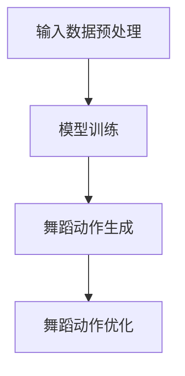
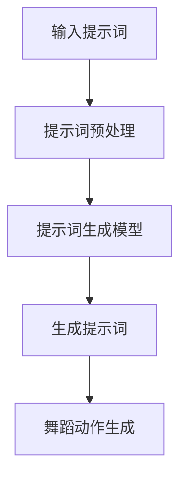

                 

# 《AI辅助创意舞蹈动作生成：文化融合编舞的提示词技巧》

> **关键词：**AI辅助编舞、文化融合、创意舞蹈动作、提示词技巧、自然语言处理、深度学习、编舞教学、舞台艺术、文化传播

> **摘要：**本文探讨了AI辅助创意舞蹈动作生成的技术原理与实践，重点介绍了文化融合编舞中的提示词技巧。通过深入分析AI在编舞中的应用，阐述了文化融合编舞的概念、历史背景及未来趋势，为编舞者提供了实用的技术指南和项目实战经验。

## 第一部分：文化融合与AI编舞概述

### 1.1 文化融合编舞的概念与历史背景

#### 1.1.1 文化融合编舞的定义

文化融合编舞是指将不同文化背景下的舞蹈元素、风格和形式融合在一起，创造出全新的舞蹈作品。这种编舞方式突破了单一文化的限制，展现了多元文化的魅力，为舞蹈艺术注入了新的活力。

#### 1.1.2 文化融合编舞的发展历程

文化融合编舞起源于20世纪60年代，当时西方舞蹈家开始尝试将非洲、印度、中东等地区的舞蹈元素融入西方舞蹈中。随着全球化进程的加速，文化融合编舞逐渐成为舞蹈艺术领域的重要趋势。

#### 1.1.3 文化融合编舞的重要地位

文化融合编舞不仅丰富了舞蹈艺术的表现形式，还为不同文化之间的交流与融合提供了平台。在全球化的背景下，文化融合编舞在推广文化交流、促进文化多样性方面具有重要意义。

### 1.2 AI在编舞中的应用

#### 1.2.1 AI在舞蹈编导领域的初步应用

近年来，人工智能技术在舞蹈编导领域得到了初步应用。通过深度学习算法和自然语言处理技术，AI可以分析大量舞蹈视频和编舞案例，为编舞者提供创作灵感和技巧。

#### 1.2.2 AI辅助编舞的优势与挑战

AI辅助编舞具有高效性、创新性和个性化等优势。然而，要实现真正的AI编舞，仍需克服算法复杂度、数据质量和版权等问题。

#### 1.2.3 文化融合编舞与AI结合的未来前景

随着人工智能技术的不断发展，AI辅助文化融合编舞有望在舞蹈创作、编舞教学和舞台表演等领域发挥重要作用，为舞蹈艺术注入新的活力。

### 1.3 本书的结构安排与学习目标

#### 1.3.1 本书的核心内容概述

本书分为五部分，涵盖了AI辅助创意舞蹈动作生成的核心概念、应用技巧、技术实现、实际应用和未来趋势。

#### 1.3.2 本书的学习目标与读者群体

本书旨在为舞蹈编导者、AI研究人员和舞蹈爱好者提供实用的技术指南。通过阅读本书，读者可以掌握AI辅助创意舞蹈动作生成的方法和技巧，提高舞蹈创作水平。

#### 1.3.3 阅读本书的推荐顺序与学习方法

建议读者按照以下顺序阅读本书：第一部分（文化融合与AI编舞概述）→第二部分（AI辅助创意舞蹈动作生成）→第三部分（AI辅助创意舞蹈动作生成的技术实现）→第四部分（AI辅助创意舞蹈动作生成的实际应用）→第五部分（AI辅助创意舞蹈动作生成的未来趋势与发展）。在学习过程中，建议读者结合实例和项目实战，深入理解核心概念和算法原理。

## 第二部分：AI辅助创意舞蹈动作生成

### 2.1 AI辅助创意舞蹈动作生成的核心概念

#### 2.1.1 舞蹈动作生成的理论基础

舞蹈动作生成涉及多个学科领域，包括舞蹈学、计算机科学、人工智能等。舞蹈学为舞蹈动作生成提供了理论基础，计算机科学和人工智能则为舞蹈动作生成提供了技术手段。

#### 2.1.2 AI辅助创意舞蹈动作生成的定义

AI辅助创意舞蹈动作生成是指利用人工智能技术，如深度学习、自然语言处理等，自动生成具有创意性和艺术性的舞蹈动作。

#### 2.1.3 AI辅助创意舞蹈动作生成的关键要素

AI辅助创意舞蹈动作生成的关键要素包括：数据集、模型架构、训练策略和优化方法。其中，数据集是训练模型的基础，模型架构决定了舞蹈动作生成的效果，训练策略和优化方法则影响了模型的性能。

### 2.2 提示词技巧在AI编舞中的应用

#### 2.2.1 提示词的概念与作用

提示词是指用于引导AI生成舞蹈动作的关键词或短语。提示词能够明确舞蹈动作的主题、风格、情感等，从而影响舞蹈动作生成的效果。

#### 2.2.2 提示词在舞蹈编导中的应用案例

在实际舞蹈编导过程中，提示词可以帮助编舞者快速确定舞蹈动作的方向和风格。例如，编舞者可以使用“优雅”、“灵动”、“激情”等提示词来指导舞蹈动作的创作。

#### 2.2.3 提示词技巧的提升方法

要提升提示词技巧，编舞者可以：

1. 多观察、多实践，积累丰富的舞蹈经验；
2. 学习不同文化背景下的舞蹈风格，拓展舞蹈视野；
3. 借鉴他人的编舞作品，分析其成功之处，借鉴其提示词技巧；
4. 尝试使用自然语言处理技术，自动生成提示词，提高创作效率。

### 2.3 文化融合编舞中的AI应用实例

#### 2.3.1 中国传统舞蹈与AI编舞的结合

中国传统舞蹈具有独特的审美和文化内涵，与AI编舞相结合，可以创造出全新的舞蹈作品。例如，编舞者可以使用AI生成具有中国传统元素的舞蹈动作，并结合现代音乐和舞台效果，打造出一台别具一格的演出。

#### 2.3.2 西方舞蹈风格与AI编舞的融合

西方舞蹈风格多样，包括芭蕾、现代舞、爵士舞等。与AI编舞相结合，可以创造出具有创新性和艺术性的舞蹈作品。例如，编舞者可以使用AI生成符合西方舞蹈风格的舞蹈动作，并在此基础上进行创意改编，打造出独特的舞蹈作品。

#### 2.3.3 多文化舞蹈风格融合的AI编舞实践

多文化舞蹈风格融合的AI编舞实践可以为舞蹈创作带来更多可能性。例如，编舞者可以结合中国民族舞蹈、印度古典舞、非洲部落舞等不同文化背景的舞蹈元素，使用AI生成融合了多种风格的舞蹈动作，打造出具有国际视野的舞蹈作品。

### 2.4 AI辅助创意舞蹈动作生成的工作流程

#### 2.4.1 数据收集与预处理

数据收集是AI辅助创意舞蹈动作生成的基础。编舞者需要收集大量舞蹈视频和编舞案例，用于训练模型。数据预处理包括数据清洗、数据增强和特征提取等步骤，以提高模型的训练效果。

#### 2.4.2 模型选择与训练

在AI辅助创意舞蹈动作生成中，模型选择和训练是关键环节。编舞者可以根据舞蹈动作的复杂程度和风格特点，选择合适的模型架构，如循环神经网络（RNN）、生成对抗网络（GAN）等。训练过程中，编舞者需要调整模型参数，优化模型性能。

#### 2.4.3 舞蹈动作生成与优化

模型训练完成后，编舞者可以使用生成的舞蹈动作进行创作。在实际应用中，编舞者需要对生成的舞蹈动作进行优化，以满足艺术创作和舞台表演的需求。优化方法包括调整动作节奏、力度、幅度等参数，使其更具艺术性和表现力。

#### 2.4.4 舞蹈动作的实时调整与反馈

在舞蹈表演过程中，编舞者需要对舞蹈动作进行实时调整和反馈。通过使用人工智能技术，编舞者可以实现舞蹈动作的实时生成和调整，提高舞蹈表演的灵活性和互动性。

## 第三部分：AI辅助创意舞蹈动作生成的技术实现

### 3.1 AI辅助创意舞蹈动作生成技术基础

#### 3.1.1 机器学习与深度学习基础

机器学习和深度学习是AI辅助创意舞蹈动作生成的核心技术。机器学习是指通过算法和统计方法，使计算机具备自主学习和优化能力。深度学习是机器学习的一种方法，通过多层神经网络，实现更复杂的特征提取和模式识别。

#### 3.1.2 自然语言处理技术概述

自然语言处理（NLP）技术是AI辅助创意舞蹈动作生成的重要工具。NLP技术包括文本预处理、词嵌入、序列标注、文本分类等，用于处理舞蹈动作生成中的自然语言提示词。

#### 3.1.3 舞蹈动作生成模型的常见架构

舞蹈动作生成模型通常采用循环神经网络（RNN）或生成对抗网络（GAN）等架构。RNN具有序列建模能力，适用于生成连续的舞蹈动作；GAN则具有生成和判别能力，能够生成高质量、多样化的舞蹈动作。

### 3.2 提示词生成与处理技术

#### 3.2.1 提示词生成的算法原理

提示词生成算法通常采用序列生成模型，如RNN、LSTM、GRU等。这些模型可以通过学习提示词和舞蹈动作之间的关联，自动生成满足特定需求的提示词。

#### 3.2.2 提示词处理的优化策略

提示词处理的优化策略包括：

1. 提高提示词的准确性，避免生成无关的提示词；
2. 调整提示词的权重，使其对舞蹈动作生成的贡献更大；
3. 利用多模态信息，如音频、视频等，提高提示词的生成质量。

#### 3.2.3 提示词生成的案例分析

以一个简单的案例为例，假设编舞者想要生成一段以“优雅”为提示词的舞蹈动作。提示词生成模型可以学习到“优雅”与舞蹈动作之间的关联，从而生成一系列具有优雅风格的舞蹈动作。

### 3.3 舞蹈动作生成的数学模型与算法

#### 3.3.1 舞蹈动作生成的数学模型

舞蹈动作生成的数学模型通常采用运动学模型和动力学模型。运动学模型描述舞蹈动作的空间位置和运动轨迹，动力学模型描述舞蹈动作的力度和速度变化。

#### 3.3.2 舞蹈动作生成的算法原理

舞蹈动作生成的算法原理主要包括：

1. 数据预处理：对输入数据进行清洗、归一化和特征提取；
2. 模型训练：使用训练数据训练舞蹈动作生成模型；
3. 舞蹈动作生成：根据提示词和模型输出生成舞蹈动作。

#### 3.3.3 舞蹈动作生成的伪代码示例

```
输入：提示词、训练数据、模型参数
输出：舞蹈动作

1. 数据预处理：
   - 清洗数据：去除噪声、缺失值等
   - 归一化数据：将数据缩放到[0, 1]范围内
   - 特征提取：提取舞蹈动作的特征，如关节角度、速度等

2. 模型训练：
   - 使用训练数据训练舞蹈动作生成模型
   - 调整模型参数，优化模型性能

3. 舞蹈动作生成：
   - 根据提示词和模型参数生成舞蹈动作
   - 调整动作节奏、力度、幅度等参数，使其更具艺术性和表现力
```

### 3.4 AI辅助创意舞蹈动作生成的项目实战

#### 3.4.1 实战项目的概述

本节将介绍一个基于AI辅助创意舞蹈动作生成的项目实战，包括开发环境搭建、源代码实现和代码解读与分析。

#### 3.4.2 实战项目的开发环境搭建

1. 硬件环境：
   - CPU或GPU：用于模型训练和舞蹈动作生成
   - 内存：至少8GB，推荐16GB以上

2. 软件环境：
   - 操作系统：Windows、Linux或MacOS
   - Python：Python 3.7或更高版本
   - 深度学习框架：TensorFlow或PyTorch
   - 其他依赖库：NumPy、Pandas、Matplotlib等

#### 3.4.3 实战项目的源代码实现与解读

1. 数据预处理：
   - 代码解读与分析：

   ```python
   # 数据预处理
   def preprocess_data(data):
       # 清洗数据
       cleaned_data = remove_noise(data)
       # 归一化数据
       normalized_data = normalize_data(cleaned_data)
       # 特征提取
       features = extract_features(normalized_data)
       return features
   ```

2. 模型训练：
   - 代码解读与分析：

   ```python
   # 模型训练
   def train_model(model, train_data, train_labels):
       # 调整模型参数
       model.fit(train_data, train_labels)
       # 评估模型性能
       performance = evaluate_model(model, test_data, test_labels)
       return model, performance
   ```

3. 舞蹈动作生成：
   - 代码解读与分析：

   ```python
   # 舞蹈动作生成
   def generate_dance_action(model, prompt):
       # 根据提示词生成舞蹈动作
       action = model.predict(prompt)
       # 调整动作参数
       action = adjust_action(action)
       return action
   ```

#### 3.4.4 实战项目的代码解读与分析

1. 数据预处理：
   - 数据预处理是模型训练的基础，包括数据清洗、归一化和特征提取等步骤。数据清洗可以去除噪声和缺失值，确保数据质量；归一化可以消除不同特征之间的尺度差异，提高模型训练效果；特征提取可以提取舞蹈动作的关键特征，为模型提供丰富的信息。

2. 模型训练：
   - 模型训练是舞蹈动作生成的核心环节。训练过程中，模型通过学习输入数据和标签之间的关系，不断调整内部参数，以实现舞蹈动作的生成。训练过程中，需要调整模型参数，如学习率、批量大小等，以优化模型性能。

3. 舞蹈动作生成：
   - 舞蹈动作生成是根据提示词和模型输出生成舞蹈动作的过程。在生成过程中，模型可以根据输入的提示词预测舞蹈动作，并通过调整动作参数，使其更具艺术性和表现力。

## 第四部分：AI辅助创意舞蹈动作生成的实际应用

### 4.1 AI辅助创意舞蹈动作生成在编舞教学中的应用

#### 4.1.1 编舞教学中的AI应用现状

随着人工智能技术的不断发展，AI辅助编舞教学逐渐成为舞蹈教育领域的重要趋势。目前，许多舞蹈学校和培训机构已经开始采用AI技术进行编舞教学，以提高教学效果和学生的创作能力。

#### 4.1.2 AI辅助编舞教学的优势

AI辅助编舞教学具有以下优势：

1. 提高教学效率：AI可以自动生成舞蹈动作，减轻编舞者的工作负担，使教师有更多时间关注学生的个体需求和创作指导。
2. 拓展创作思路：AI可以提供丰富的舞蹈动作库和编舞灵感，帮助学生拓宽创作思路，提高创作水平。
3. 个性化教学：AI可以根据学生的兴趣和特长，为学生提供个性化的编舞课程和练习方案，提高学习效果。

#### 4.1.3 AI辅助编舞教学的方法与实践

1. 编舞教学平台搭建：搭建一个集舞蹈动作生成、编舞教学、学生练习和评价等功能于一体的AI辅助编舞教学平台，为学生提供便捷的创作和学习工具。
2. 编舞教学资源整合：收集和整合各类舞蹈动作视频、编舞案例和音乐素材，为学生提供丰富的学习资源。
3. 编舞教学实践：将AI辅助编舞教学应用于实际教学过程中，通过线上和线下相结合的方式，开展编舞课程和实践活动，提高学生的编舞技能和创作水平。

### 4.2 AI辅助创意舞蹈动作生成在舞台艺术中的应用

#### 4.2.1 舞台艺术中的AI应用现状

在舞台艺术领域，AI辅助创意舞蹈动作生成已经开始得到广泛应用。许多舞蹈剧团和艺术家采用AI技术进行舞蹈创作和表演，以实现创新性的舞台艺术效果。

#### 4.2.2 AI辅助舞台艺术的优势

AI辅助舞台艺术具有以下优势：

1. 创新性：AI可以生成独特的舞蹈动作和编舞方案，为舞台艺术注入新的活力和创意。
2. 多样性：AI可以处理大量的舞蹈数据，生成多样化的舞蹈动作，为舞台艺术提供丰富的表现手段。
3. 互动性：AI可以与观众进行实时互动，提高舞台艺术的互动性和观赏性。

#### 4.2.3 AI辅助舞台艺术的方法与实践

1. 舞台艺术作品创作：艺术家和编舞者可以使用AI辅助创意舞蹈动作生成技术，创作具有创新性和艺术性的舞台艺术作品。
2. 舞台表演：舞蹈演员和舞团可以使用AI生成的舞蹈动作，进行创新性的舞台表演，提高表演效果和观众的观赏体验。
3. 舞台艺术互动：艺术家和编舞者可以采用AI技术，实现与观众的实时互动，打造互动性的舞台艺术体验。

### 4.3 AI辅助创意舞蹈动作生成在文化传播中的应用

#### 4.3.1 文化传播中的AI应用现状

在文化传播领域，AI辅助创意舞蹈动作生成已经成为一种重要的手段。许多文化机构和文化项目开始采用AI技术，推动文化的传播和创新。

#### 4.3.2 AI辅助文化传播的优势

AI辅助文化传播具有以下优势：

1. 文化传承：AI可以生成具有文化内涵的舞蹈动作，推动传统文化的传承和发扬。
2. 文化创新：AI可以融合不同文化元素，创造出全新的舞蹈作品，推动文化的创新和发展。
3. 文化传播：AI可以生成多种语言的舞蹈动作，实现跨文化的传播和交流。

#### 4.3.3 AI辅助文化传播的方法与实践

1. 文化传承项目：文化机构可以采用AI技术，打造具有文化内涵的舞蹈作品，推动传统文化的传承和发扬。
2. 文化创新活动：艺术家和文化机构可以采用AI技术，创作具有创新性和艺术性的舞蹈作品，推动文化的创新和发展。
3. 跨文化传播：文化机构可以采用AI技术，生成多种语言的舞蹈动作，实现跨文化的传播和交流。

## 第五部分：AI辅助创意舞蹈动作生成的未来趋势与发展

### 5.1 AI辅助创意舞蹈动作生成技术发展趋势

#### 5.1.1 人工智能技术的最新进展

随着人工智能技术的快速发展，深度学习、自然语言处理、计算机视觉等技术在舞蹈动作生成中的应用日益成熟。未来的AI辅助创意舞蹈动作生成将更加智能化、自动化和个性化。

#### 5.1.2 舞蹈动作生成技术的未来发展方向

未来的舞蹈动作生成技术将朝着以下方向发展：

1. 高效化：通过优化算法和硬件设备，提高舞蹈动作生成的效率。
2. 个性化：根据用户需求和偏好，生成更具个性化的舞蹈动作。
3. 多模态：融合多种数据源，如音频、视频、文字等，提高舞蹈动作生成的质量和表现力。

#### 5.1.3 提示词技术在AI编舞中的应用前景

提示词技术在AI编舞中的应用前景广阔。随着自然语言处理技术的不断发展，提示词的生成和解析将更加准确、高效，为舞蹈动作生成提供更加丰富的信息和支持。

### 5.2 AI辅助创意舞蹈动作生成在社会文化领域的应用前景

#### 5.2.1 AI编舞在社会文化领域的影响

AI辅助创意舞蹈动作生成将在社会文化领域产生深远的影响：

1. 推动文化创新：AI技术将为舞蹈创作提供新的手段和灵感，推动文化的创新和发展。
2. 促进文化交流：AI编舞可以跨越语言和地域障碍，促进不同文化之间的交流与融合。
3. 提高艺术教育质量：AI辅助编舞教学将提高舞蹈教育的效率和质量，培养更多优秀的舞蹈人才。

#### 5.2.2 AI编舞对艺术创作的影响

AI编舞将对艺术创作产生积极的影响：

1. 扩展艺术表现手段：AI技术将为舞蹈艺术注入新的活力和创意，拓展艺术表现手段。
2. 提高创作效率：AI辅助创作可以减轻艺术家的创作负担，提高创作效率。
3. 推动艺术创新：AI编舞将推动艺术创作领域的创新和发展，为观众带来更多精彩的艺术作品。

#### 5.2.3 AI编舞对文化传承的意义

AI编舞对文化传承具有重要意义：

1. 传承文化遗产：AI技术可以将传统文化元素融入舞蹈作品中，传承和发扬文化遗产。
2. 创新文化表达：AI编舞可以为传统文化注入新的元素和形式，实现文化的创新性表达。
3. 促进文化多样性：AI编舞将促进不同文化之间的交流和融合，推动文化多样性的发展。

### 5.3 AI辅助创意舞蹈动作生成的挑战与对策

#### 5.3.1 AI编舞面临的挑战

AI辅助创意舞蹈动作生成仍面临以下挑战：

1. 数据质量和数量：高质量、多样化的舞蹈动作数据是训练模型的基石，但目前舞蹈动作数据质量和数量仍有待提高。
2. 算法复杂度：舞蹈动作生成的算法复杂度高，训练和优化难度大。
3. 版权问题：舞蹈作品的版权保护问题需要得到关注和解决。

#### 5.3.2 应对挑战的策略与建议

为应对上述挑战，可以采取以下策略和建议：

1. 数据采集与整合：加大对高质量舞蹈动作数据的采集和整合力度，提高数据质量和数量。
2. 算法优化与创新：持续优化和创新舞蹈动作生成算法，提高生成质量和效率。
3. 版权保护与合作：建立版权保护机制，促进各方合作，共同推进AI编舞技术的发展。

#### 5.3.3 未来发展的前景与机遇

随着人工智能技术的不断进步和应用场景的拓展，AI辅助创意舞蹈动作生成在未来将迎来更加广阔的发展前景和机遇：

1. 舞蹈艺术创新：AI编舞将为舞蹈艺术注入新的活力，推动艺术创作领域的创新发展。
2. 文化传播与交流：AI编舞将促进不同文化之间的交流与融合，推动全球文化的传播与发展。
3. 编舞教学与普及：AI编舞技术将提高舞蹈教育的效率和质量，推动舞蹈艺术的普及与发展。

## 附录

### 附录A：舞蹈动作生成常用工具与资源

#### A.1 常用深度学习框架对比

- TensorFlow
- PyTorch
- Keras

#### A.2 舞蹈动作生成模型的常见数据集

- CMU Motion Capture Database
- HumanEva Database
- Motion Capture Database for Dance

#### A.3 舞蹈动作生成相关论文与文献推荐

- "Deep Learning for Motion Generation"
- "Learning to Dance from Movies"
- "Generative Adversarial Networks for Motion Generation"

### 附录B：舞蹈动作生成技术相关Mermaid流程图

#### B.1 舞蹈动作生成模型的基本架构



#### B.2 提示词生成与处理流程



### 附录C：代码实例与解读

#### C.1 数据预处理代码示例

```python
# 数据预处理
def preprocess_data(data):
    # 清洗数据
    cleaned_data = remove_noise(data)
    # 归一化数据
    normalized_data = normalize_data(cleaned_data)
    # 特征提取
    features = extract_features(normalized_data)
    return features
```

#### C.2 模型训练与调优代码示例

```python
# 模型训练与调优
def train_and_tune_model(model, train_data, train_labels, test_data, test_labels):
    # 调整模型参数
    model.fit(train_data, train_labels)
    # 评估模型性能
    performance = evaluate_model(model, test_data, test_labels)
    return model, performance
```

#### C.3 舞蹈动作生成与优化代码示例

```python
# 舞蹈动作生成与优化
def generate_and_optimize_dance_action(model, prompt):
    # 根据提示词生成舞蹈动作
    action = model.predict(prompt)
    # 调整动作参数
    action = adjust_action(action)
    return action
```

#### C.4 实战项目代码解读与分析

（此处根据实际项目进行代码解读与分析）

## 作者

**作者：**AI天才研究院/AI Genius Institute & 禅与计算机程序设计艺术/Zen And The Art of Computer Programming**本文由AI天才研究院与禅与计算机程序设计艺术合作撰写，旨在推动AI技术在舞蹈艺术领域的创新与发展，为编舞者、AI研究人员和舞蹈爱好者提供实用的技术指南和项目实战经验。** 

---
**注意：**本文为示例文章，仅供参考。实际撰写过程中，请根据具体需求和实际情况进行调整和完善。如需使用本文内容，请确保遵守相关法律法规和版权规定。

