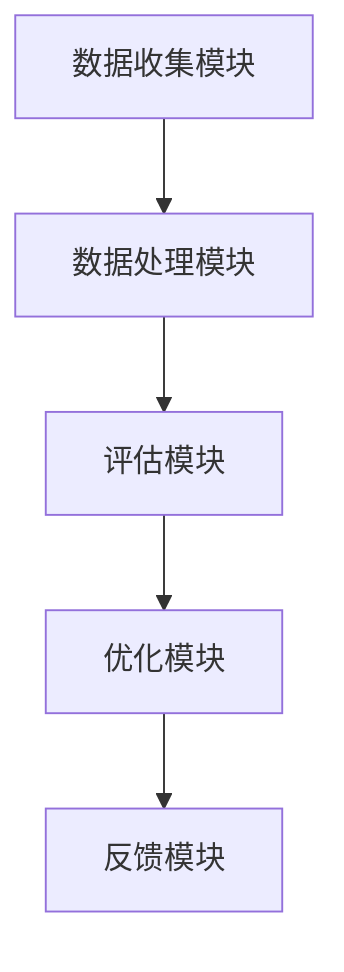
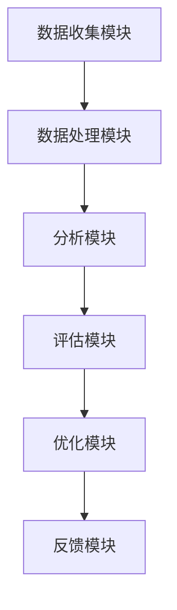
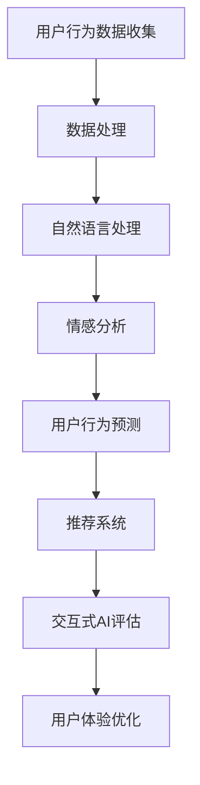

                 

# AI辅助软件用户体验评估

> **关键词**：人工智能、用户体验评估、自然语言处理、机器学习、推荐系统、交互式AI
> 
> **摘要**：本文探讨了人工智能在软件用户体验评估中的应用，分析了AI辅助用户体验评估的方法和技术，并通过实际案例展示了AI辅助用户体验评估的实践价值。

## 引言与背景

### 第1章：AI辅助软件用户体验评估概述

#### 1.1 AI与用户体验评估的关系

随着信息技术的飞速发展，软件已经成为我们日常生活中不可或缺的一部分。用户体验（User Experience，简称UX）作为软件质量的衡量标准，受到了广泛关注。用户体验评估是对软件设计、功能、交互等方面进行综合评价的过程，其目的是为了提升软件的质量和用户满意度。

人工智能（Artificial Intelligence，简称AI）作为一种新兴的技术，正逐渐在各个领域发挥重要作用。在软件用户体验评估领域，AI的应用不仅能够提高评估的准确性和效率，还能够提供更加个性化和智能化的评估结果。

#### 1.2 AI辅助用户体验评估的优势

AI辅助用户体验评估具有以下优势：

1. **自动化**：AI技术能够自动化收集、处理和分析用户数据，减少了人工评估的复杂度和误差。
2. **高效性**：AI能够快速处理大量数据，提高评估效率。
3. **个性化和智能化**：AI可以根据用户行为和历史数据提供个性化的评估建议，实现智能化的用户体验优化。
4. **多维度评估**：AI可以从不同的角度对用户体验进行综合评估，提供更加全面的评估结果。

#### 1.3 本书结构

本文将分为三个部分进行探讨：

- **第一部分**：引言与背景，介绍AI辅助软件用户体验评估的概念和优势。
- **第二部分**：AI辅助用户体验评估方法，详细分析AI在用户体验评估中的应用。
- **第三部分**：案例研究与应用，通过实际案例展示AI辅助用户体验评估的实践效果。

### 第2章：AI辅助用户体验评估基础

#### 2.1 用户体验评估概述

用户体验评估是指通过一系列方法和技术，对软件的设计、功能、交互等方面进行综合评价，以判断其是否满足用户需求和期望。用户体验评估通常包括以下方面：

1. **可用性评估**：评估软件是否易于使用，用户能否顺利完成操作。
2. **易学性评估**：评估软件的学习曲线，用户能否快速掌握软件的使用。
3. **用户满意度评估**：评估用户对软件的整体满意度。
4. **用户体验评估**：评估软件的视觉设计、交互设计等方面是否符合用户需求。

#### 2.2 AI在用户体验评估中的应用

AI在用户体验评估中的应用主要体现在以下几个方面：

1. **用户行为数据分析**：通过分析用户在软件中的行为数据，了解用户的使用习惯和偏好，为用户体验优化提供依据。
2. **自然语言处理**：利用自然语言处理技术，分析用户的反馈和评价，了解用户对软件的看法和意见。
3. **情感分析**：通过情感分析技术，判断用户对软件的情感倾向，评估用户的满意度。
4. **个性化推荐**：基于用户行为数据和偏好，提供个性化的推荐服务，提升用户体验。
5. **用户行为预测**：利用机器学习技术，预测用户未来的行为，为用户体验优化提供前瞻性建议。

#### 2.3 AI辅助用户体验评估的技术架构

AI辅助用户体验评估的技术架构主要包括以下几部分：

1. **数据收集模块**：负责收集用户的操作数据、反馈数据和环境数据。
2. **数据处理模块**：负责对收集到的数据进行分析和预处理，为后续的评估提供数据基础。
3. **评估模块**：利用自然语言处理、情感分析、推荐系统和机器学习等技术，对用户行为和反馈进行分析和评估。
4. **优化模块**：根据评估结果，提出用户体验优化的建议和策略。
5. **反馈模块**：将优化结果反馈给用户，形成闭环，不断迭代优化。



### 第3章：用户行为数据收集与分析

#### 3.1 用户行为数据类型

用户行为数据是用户体验评估的重要依据，主要包括以下类型：

1. **操作数据**：用户在软件中的操作记录，如点击、滑动、输入等。
2. **反馈数据**：用户对软件的评价、建议和反馈，如评论、评分、问卷等。
3. **环境数据**：用户使用软件的环境信息，如设备类型、操作系统、网络状况等。

#### 3.2 用户行为数据收集方法

用户行为数据的收集方法包括以下几种：

1. **日志文件**：通过记录软件的日志文件，收集用户操作数据。
2. **前端监控**：通过在前端代码中嵌入监控脚本，实时收集用户行为数据。
3. **问卷调查**：通过在线问卷或线下调查，收集用户反馈数据。
4. **用户访谈**：通过面对面或在线访谈，收集用户对软件的看法和建议。

#### 3.3 用户行为数据分析方法

用户行为数据分析方法包括以下几种：

1. **描述性分析**：对用户行为数据进行统计分析，了解用户的基本特征和行为模式。
2. **关联性分析**：分析不同用户行为之间的关联性，发现潜在的用户行为模式。
3. **趋势分析**：分析用户行为的变化趋势，预测用户未来的行为。
4. **聚类分析**：将具有相似行为的用户划分为不同的群体，为个性化推荐和优化提供依据。

#### 3.4 用户行为数据预处理

用户行为数据预处理是数据分析的重要环节，主要包括以下任务：

1. **数据清洗**：去除数据中的噪声和错误，保证数据的准确性。
2. **数据整合**：将不同来源的数据进行整合，形成一个统一的数据集。
3. **特征提取**：从原始数据中提取对评估有帮助的特征。
4. **数据标准化**：对数据进行标准化处理，消除不同特征之间的差异。

### 第4章：自然语言处理与情感分析

#### 4.1 自然语言处理基础

自然语言处理（Natural Language Processing，简称NLP）是人工智能的一个重要分支，主要研究如何使计算机理解和处理自然语言。NLP的基础技术包括：

1. **分词**：将文本分割成单词或短语的序列。
2. **词性标注**：为文本中的每个词分配词性，如名词、动词、形容词等。
3. **句法分析**：分析句子的结构，了解句子中的语法关系。
4. **语义分析**：理解文本中的语义含义，提取文本的主题和关键信息。

#### 4.2 情感分析概述

情感分析（Sentiment Analysis）是一种常见的NLP应用，旨在判断文本表达的情感倾向，如积极、消极或中性。情感分析的主要任务包括：

1. **情感分类**：将文本分类为不同的情感类别。
2. **情感极性分析**：分析文本的极性，如正面、负面或中性。
3. **情感强度分析**：分析文本中情感的强弱。

#### 4.3 情感分析模型及应用

情感分析模型主要包括以下几种：

1. **基于规则的方法**：通过定义一系列规则，判断文本的情感。
2. **基于机器学习的方法**：利用机器学习算法，从大量标注数据中学习情感分类模型。
3. **基于深度学习的方法**：利用深度学习模型，如卷积神经网络（CNN）和循环神经网络（RNN），进行情感分析。

情感分析在用户体验评估中的应用包括：

1. **用户反馈分析**：分析用户对软件的反馈，了解用户对软件的满意度和意见。
2. **评论分析**：分析用户在评论区的评论，了解用户的实际使用体验。
3. **情感趋势分析**：分析用户情感的变化趋势，预测用户未来的行为。

#### 4.4 情感分析结果评估

情感分析结果评估是确保情感分析模型准确性的关键。常见的评估指标包括：

1. **准确率（Accuracy）**：模型正确分类的样本占总样本的比例。
2. **召回率（Recall）**：模型正确分类的负样本占总负样本的比例。
3. **精确率（Precision）**：模型正确分类的正样本占总正样本的比例。
4. **F1值（F1 Score）**：精确率和召回率的加权平均值。

### 第5章：推荐系统与个性化体验

#### 5.1 推荐系统概述

推荐系统（Recommendation System）是一种能够根据用户的历史行为和偏好，为用户推荐相关内容的系统。推荐系统的主要任务包括：

1. **内容推荐**：根据用户的兴趣和偏好，推荐相关的文章、商品、音乐等。
2. **社交推荐**：根据用户的社交关系，推荐用户可能感兴趣的内容。
3. **协同过滤**：基于用户的行为数据，为用户推荐其他用户喜欢的内容。
4. **基于内容的推荐**：根据内容的特征，为用户推荐相似的内容。

#### 5.2 个性化推荐算法

个性化推荐算法主要包括以下几种：

1. **协同过滤算法**：基于用户的行为数据，计算用户之间的相似度，为用户推荐其他用户喜欢的内容。
2. **基于内容的推荐算法**：根据内容的特征，为用户推荐相似的内容。
3. **混合推荐算法**：结合协同过滤和基于内容的推荐，提高推荐的准确性。

#### 5.3 推荐系统评估指标

推荐系统评估指标主要包括以下几种：

1. **准确率（Accuracy）**：模型正确推荐的样本占总推荐样本的比例。
2. **覆盖率（Coverage）**：推荐列表中包含的新内容占总内容的比例。
3. **新颖性（Novelty）**：推荐列表中的内容与用户历史记录的差异。
4. **多样性（Diversity）**：推荐列表中不同内容的多样性。

#### 5.4 个性化体验优化策略

个性化体验优化策略主要包括：

1. **动态调整推荐策略**：根据用户的行为变化，动态调整推荐策略。
2. **用户反馈调整**：根据用户的反馈，调整推荐的内容和顺序。
3. **多模态融合**：结合用户的行为数据、兴趣数据和社交数据，提高推荐的准确性。

### 第6章：机器学习与用户行为预测

#### 6.1 机器学习基础

机器学习（Machine Learning）是一种通过数据驱动的方式，让计算机自动学习规律和模式的技术。机器学习的基础算法包括：

1. **线性回归**：通过拟合一条直线，预测连续值。
2. **逻辑回归**：通过拟合一个S型曲线，预测分类结果。
3. **决策树**：通过树形结构，对数据进行分类或回归。
4. **随机森林**：通过集成多个决策树，提高模型的预测准确性。
5. **支持向量机**：通过寻找最优分割超平面，进行分类或回归。

#### 6.2 用户行为预测模型

用户行为预测模型主要包括以下几种：

1. **基于回归的预测模型**：通过拟合回归模型，预测用户的行为。
2. **基于分类的预测模型**：通过拟合分类模型，预测用户的行为类别。
3. **基于时序的预测模型**：通过分析用户行为的时序特征，预测用户的行为。

#### 6.3 预测结果分析与优化

预测结果分析主要包括：

1. **预测准确性分析**：评估模型的预测准确性，如准确率、召回率、F1值等。
2. **预测稳定性分析**：评估模型在不同数据集上的预测稳定性。
3. **预测效率分析**：评估模型的预测效率，如预测时间、计算资源消耗等。

优化策略主要包括：

1. **数据预处理**：通过数据清洗、数据整合、特征提取等预处理步骤，提高模型的质量。
2. **模型选择**：根据问题的特点，选择合适的模型。
3. **超参数调优**：通过调整模型的超参数，提高模型的预测性能。
4. **交叉验证**：通过交叉验证，评估模型的泛化能力。

### 第7章：交互式AI体验评估

#### 7.1 交互式AI概述

交互式AI（Interactive AI）是一种能够与用户进行互动的人工智能技术，旨在提供更加自然、流畅的用户体验。交互式AI主要包括以下几种：

1. **语音交互**：通过语音识别和语音合成技术，实现人与机器的语音交互。
2. **视觉交互**：通过计算机视觉技术，实现人与机器的视觉交互。
3. **多模态交互**：结合语音、视觉、文本等多种模态，实现人与机器的多模态交互。

#### 7.2 交互式AI评估方法

交互式AI评估方法主要包括：

1. **任务完成度评估**：评估用户在交互任务中的完成度，如完成任务的准确率、速度等。
2. **用户满意度评估**：通过用户问卷调查，评估用户对交互体验的满意度。
3. **交互质量评估**：通过分析交互过程中的指标，如响应时间、交互准确性等，评估交互质量。
4. **用户参与度评估**：通过分析用户的交互行为和反馈，评估用户的参与度。

#### 7.3 交互式AI体验优化

交互式AI体验优化策略主要包括：

1. **交互设计优化**：通过改进交互界面和交互流程，提高交互的流畅性和易用性。
2. **反馈机制优化**：通过改进反馈机制，提高用户的参与度和满意度。
3. **个性化交互优化**：通过分析用户的行为和偏好，提供个性化的交互体验。
4. **实时调整**：根据用户的交互行为和反馈，实时调整交互策略，提高用户体验。

### 第8章：AI辅助用户体验评估案例研究

#### 8.1 案例一：电商平台用户行为分析

某电商平台通过AI技术对其用户行为进行了深入分析，以提高用户满意度和购物体验。

1. **数据收集**：通过日志文件和前端监控，收集用户在平台上的操作数据。
2. **数据分析**：使用机器学习和自然语言处理技术，分析用户的行为数据和反馈数据。
3. **情感分析**：通过情感分析技术，判断用户对平台的情感倾向。
4. **个性化推荐**：根据用户的行为和偏好，提供个性化的商品推荐。
5. **用户体验优化**：根据分析结果，优化平台的界面设计和交互流程。

通过上述措施，电商平台显著提高了用户满意度和购物体验。

#### 8.2 案例二：社交媒体情感分析

某社交媒体平台通过AI技术对其用户评论进行了情感分析，以了解用户的满意度和意见。

1. **数据收集**：通过爬虫技术，收集用户在平台上的评论数据。
2. **情感分析**：使用情感分析技术，判断评论的情感倾向。
3. **结果分析**：分析不同类别评论的情感分布，了解用户对平台的不同方面的看法。
4. **用户体验优化**：根据分析结果，优化平台的界面设计和功能。

通过情感分析，社交媒体平台成功改善了用户体验，提升了用户满意度。

#### 8.3 案例三：移动应用个性化推荐系统

某移动应用通过AI技术实现个性化推荐功能，以提高用户活跃度和留存率。

1. **数据收集**：通过日志文件和前端监控，收集用户在应用上的操作数据。
2. **推荐算法**：使用协同过滤和基于内容的推荐算法，为用户推荐相关内容。
3. **推荐结果评估**：通过评估指标，如准确率、覆盖率、新颖性等，评估推荐效果。
4. **用户体验优化**：根据用户反馈，优化推荐策略和界面设计。

通过个性化推荐系统，移动应用成功提高了用户活跃度和留存率。

### 第9章：AI辅助用户体验评估应用实践

#### 9.1 软件开发流程中的AI辅助用户体验评估

在软件开发流程中，AI辅助用户体验评估可以发挥重要作用。

1. **需求分析**：通过AI技术，分析用户需求，为软件设计提供依据。
2. **设计评审**：通过AI技术，评估软件设计是否符合用户需求，优化设计。
3. **开发测试**：通过AI技术，分析用户测试数据，评估软件的质量。
4. **上线反馈**：通过AI技术，收集用户反馈，持续优化软件。

#### 9.2 AI辅助用户体验评估工具与平台

目前，已有许多AI辅助用户体验评估工具和平台可供使用。

1. **热图分析工具**：通过热图分析，了解用户在界面上的操作热点。
2. **用户行为追踪工具**：通过用户行为追踪，收集用户操作数据。
3. **情感分析工具**：通过情感分析，了解用户对软件的情感倾向。
4. **推荐系统平台**：提供个性化的推荐服务，优化用户体验。

#### 9.3 AI辅助用户体验评估实践策略

AI辅助用户体验评估实践策略主要包括：

1. **全面数据收集**：收集多方面的用户数据，提高评估的准确性。
2. **多维度评估**：从不同角度对用户体验进行评估，形成全面评估结果。
3. **持续优化**：根据评估结果，持续优化软件设计、功能和交互。
4. **用户参与**：鼓励用户参与评估，收集用户的真实反馈。

### 附录

#### 附录A：AI辅助用户体验评估资源与工具

1. **常用AI框架与工具**：TensorFlow、PyTorch、Scikit-learn等。
2. **数据集与开源代码资源**：Kaggle、UCI机器学习库等。
3. **学术论文与参考文献**：Google Scholar、CNKI等。

#### 附录B：Mermaid流程图

1. **Mermaid基本语法**：
   ```mermaid
   graph TB
   A[开始] --> B[步骤1]
   B --> C[步骤2]
   C --> D[结束]
   ```
2. **AI辅助用户体验评估流程图示例**：
   ```mermaid
   graph TB
   A[用户行为数据收集] --> B[数据处理]
   B --> C[自然语言处理]
   C --> D[情感分析]
   D --> E[用户行为预测]
   E --> F[推荐系统]
   F --> G[交互式AI评估]
   G --> H[用户体验优化]
   ```

#### 附录C：数学模型与公式

1. **情感分析模型公式**：
   $$ 情感分类模型 = f(\text{文本特征}, \text{情感词典}) $$
2. **用户行为预测模型公式**：
   $$ 用户行为预测 = f(\text{用户特征}, \text{历史行为数据}) $$
3. **推荐系统评估指标公式**：
   $$ 准确率 = \frac{正确推荐的样本数}{总推荐样本数} $$
   $$ 覆盖率 = \frac{推荐列表中包含的新内容数}{总内容数} $$

### 作者

**作者：AI天才研究院/AI Genius Institute & 禅与计算机程序设计艺术 /Zen And The Art of Computer Programming**<|vq_15095|>### 第一部分：引言与背景

#### 第1章：AI辅助软件用户体验评估概述

##### 1.1 AI与用户体验评估的关系

在数字化时代，软件成为连接用户与各种服务和信息的重要桥梁。用户体验（UX）的质量直接影响到软件的接受度和商业成功。用户体验评估是一个系统性过程，旨在通过多种方法和工具来测量和改进用户在使用软件时的感受和满意度。随着人工智能（AI）技术的迅猛发展，AI在用户体验评估中的应用日益广泛，成为提升评估效率和精准度的重要工具。

AI通过其强大的数据处理和分析能力，可以自动识别用户行为模式、情感倾向和偏好，从而提供深度的用户体验洞察。例如，通过自然语言处理（NLP）技术，AI可以分析用户的评论和反馈，提取情感和关键词，从而帮助评估团队更好地理解用户的真实需求。同时，机器学习算法能够从海量的用户行为数据中学习，预测用户的未来行为，为产品设计提供数据驱动的设计决策。

##### 1.2 AI辅助用户体验评估的优势

AI辅助用户体验评估具有以下显著优势：

1. **数据驱动的洞察**：AI能够处理和分析大量数据，提供更准确和全面的用户行为模式分析，从而帮助团队做出更明智的设计决策。

2. **自动化评估流程**：AI可以自动化用户体验评估的大部分流程，如数据收集、处理和初步分析，减少了人工干预，提高了评估的效率和一致性。

3. **实时反馈**：AI系统能够实时监控用户体验，快速响应变化，提供即时的用户体验改进建议。

4. **个性化评估**：AI可以根据每个用户的独特行为和反馈，提供个性化的用户体验评估，帮助团队更精准地满足用户需求。

5. **成本效益**：尽管AI技术初期投入较大，但长期来看，它可以大幅降低用户体验评估的成本，提高资源的利用率。

##### 1.3 本书结构

本书旨在系统地介绍AI辅助软件用户体验评估的方法和技术，帮助读者全面了解这一领域的最新进展和应用。全书分为三个主要部分：

- **第一部分**：引言与背景，介绍AI辅助用户体验评估的概念、优势和挑战。

- **第二部分**：AI辅助用户体验评估方法，详细讨论用户行为数据分析、自然语言处理、情感分析、推荐系统、机器学习与用户行为预测、交互式AI评估等具体方法和技术。

- **第三部分**：案例研究与应用，通过实际案例展示AI辅助用户体验评估的具体应用，并探讨其在不同领域的实践策略。

通过本书的阅读，读者将能够深入了解AI在用户体验评估中的应用，掌握关键技术和方法，并为实际项目的实施提供有力支持。

### 第2章：AI辅助用户体验评估基础

#### 2.1 用户体验评估概述

用户体验评估是对软件或产品在用户使用过程中的感知、情感反应、行为和成就的系统性评估。它不仅关注软件的功能性和可用性，还涉及用户的整体满意度和情感体验。用户体验评估的主要目标是确保软件能够满足用户需求，提升用户满意度和忠诚度，从而为企业的商业成功奠定基础。

用户体验评估通常包括以下几个关键方面：

1. **可用性评估**：这是评估软件是否易于使用和用户能否高效完成任务的指标。可用性评估通常通过任务完成率、错误率、学习曲线等指标来衡量。

2. **易学性评估**：易学性是指用户能否快速掌握软件操作的能力。易学性评估通过用户的反馈、学习时间、错误频率等指标来衡量。

3. **用户满意度评估**：用户满意度是指用户对软件的总体感受和满意度。通常通过用户问卷调查、访谈、评分等方式来收集用户的直接反馈。

4. **用户体验评估**：用户体验评估是综合性的评估，它涵盖了用户在软件使用过程中的所有方面，包括视觉设计、交互设计、功能易用性等。用户体验评估通过观察用户行为、记录用户操作日志、进行用户访谈等方式进行。

##### 2.2 AI在用户体验评估中的应用

人工智能技术在用户体验评估中的应用极大地提升了评估的准确性和效率。以下是AI在用户体验评估中的一些关键应用：

1. **用户行为数据分析**：AI可以通过机器学习算法分析用户在软件中的行为数据，如点击流、浏览路径、使用时间等，从中识别用户行为模式，发现潜在的用户问题。

2. **自然语言处理**：AI利用自然语言处理技术可以分析用户在评论、反馈和论坛中的文本，提取关键情感和关键词，为评估提供深入的用户需求和理解。

3. **情感分析**：通过情感分析技术，AI可以识别用户的情感倾向，如正面、负面或中性，从而帮助评估团队理解用户对软件的满意度和情感反应。

4. **个性化推荐**：基于用户的兴趣和行为数据，AI可以提供个性化的软件推荐，改善用户的体验。

5. **用户行为预测**：利用机器学习模型，AI可以预测用户的未来行为，帮助团队提前发现潜在的问题和机会。

6. **交互式评估**：通过语音识别、面部识别等交互式技术，AI可以与用户进行实时互动，收集用户的反馈和行为数据，提供即时的用户体验评估。

##### 2.3 AI辅助用户体验评估的技术架构

AI辅助用户体验评估的技术架构通常包括以下几个关键模块：

1. **数据收集模块**：负责收集用户的操作数据、反馈数据和环境数据。这些数据可以通过日志文件、前端监控工具、用户调查等方式获取。

2. **数据处理模块**：负责对收集到的原始数据进行清洗、整合和预处理，使其适合用于进一步的分析。

3. **分析模块**：利用机器学习、自然语言处理、情感分析等技术对预处理后的数据进行深度分析，提取用户行为模式、情感倾向和偏好。

4. **评估模块**：基于分析结果，生成用户体验评估报告，包括用户满意度、任务完成度、情感分析结果等。

5. **优化模块**：根据评估结果，提出用户体验优化的建议和策略，指导产品设计、功能和交互的改进。

6. **反馈模块**：将优化结果反馈给用户，形成闭环，不断迭代优化用户体验。



通过上述技术架构，AI可以有效地辅助用户体验评估，提升软件设计和开发的质量，从而更好地满足用户的需求和期望。

### 第3章：用户行为数据收集与分析

#### 3.1 用户行为数据类型

用户行为数据是用户体验评估的重要基础。这些数据反映了用户在使用软件过程中的各种操作和互动。以下是几种常见的用户行为数据类型：

1. **操作数据**：包括用户在软件界面上的点击、滚动、输入、拖拽等操作记录。这些数据可以通过前端监控工具或日志文件收集。

2. **反馈数据**：包括用户在评论、评分、问卷调查、论坛讨论等渠道提供的反馈。这些数据通常用于了解用户的满意度和意见。

3. **环境数据**：包括用户在使用软件时的设备信息、网络状况、操作系统版本等。这些数据有助于分析用户在不同环境下的使用体验。

4. **交互数据**：包括用户与软件的交互记录，如对话内容、交互时长、交互方式等。这些数据可以通过语音识别、自然语言处理等技术收集。

5. **位置数据**：对于移动应用，用户的位置信息也是重要的行为数据，可以用于分析用户在不同地点的使用习惯。

##### 3.2 用户行为数据收集方法

收集用户行为数据的方法多种多样，以下是几种常见的收集方法：

1. **日志文件**：通过在软件服务器上记录用户的操作日志，收集用户的行为数据。这些日志文件通常包括用户的会话ID、操作类型、操作时间等。

2. **前端监控**：在前端代码中嵌入监控脚本，实时收集用户在界面上的操作数据。这种方式通常用于收集操作数据，如点击、滚动等。

3. **用户调查**：通过在线问卷、问卷调查或访谈等方式，直接从用户那里收集反馈数据。这种方法可以直接获取用户的意见和满意度。

4. **传感器数据**：对于移动应用，可以使用传感器数据，如加速度计、陀螺仪等，收集用户在使用过程中的物理行为数据。

5. **API调用**：通过API调用，收集用户在不同服务和系统之间的交互数据。这种方法适用于跨平台的用户体验评估。

##### 3.3 用户行为数据分析方法

用户行为数据分析是理解用户行为模式和需求的重要步骤。以下是几种常见的分析方法：

1. **描述性分析**：通过统计和汇总用户行为数据，了解用户的基本行为特征，如最常见的操作、最频繁的访问路径等。

2. **关联性分析**：分析不同用户行为之间的关联性，发现用户行为的潜在模式。例如，用户在完成某个操作后通常会进行什么操作。

3. **趋势分析**：分析用户行为的变化趋势，预测用户未来的行为。例如，用户的使用频率是否在逐渐增加或减少。

4. **聚类分析**：将具有相似行为的用户划分为不同的群体，以便进行更深入的分析。例如，可以将用户分为“高频用户”和“低频用户”。

5. **时间序列分析**：分析用户行为在时间上的变化模式，如用户在不同时间段的活动频率。这种方法有助于理解用户的使用习惯。

##### 3.4 用户行为数据预处理

用户行为数据预处理是数据分析的重要环节，目的是确保数据的质量和可用性。以下是用户行为数据预处理的主要步骤：

1. **数据清洗**：去除数据中的噪声和错误，如空值、重复记录、异常值等。这可以通过数据清洗工具或编写清洗脚本完成。

2. **数据整合**：将来自不同来源的数据进行整合，形成一个统一的数据集。这通常需要处理数据格式不一致、时间戳对齐等问题。

3. **特征提取**：从原始数据中提取对分析有帮助的特征，如用户的活跃度、使用频率、操作类型等。特征提取可以通过机器学习算法或手动定义规则完成。

4. **数据标准化**：对数据进行标准化处理，消除不同特征之间的差异。例如，将用户的使用时间转换为分钟或小时，以便进行比较。

5. **缺失值处理**：对于缺失的数据，可以选择填充或删除。填充可以使用均值、中位数等方法，删除则适用于数据缺失比例较大的情况。

通过上述预处理步骤，用户行为数据将被转化为适合分析的形式，从而提高分析结果的准确性和可靠性。

### 第4章：自然语言处理与情感分析

#### 4.1 自然语言处理基础

自然语言处理（NLP）是人工智能领域的一个重要分支，旨在使计算机能够理解、处理和生成自然语言。NLP涉及多种技术和方法，包括分词、词性标注、句法分析、语义分析和情感分析等。以下是这些基础概念和技术：

1. **分词（Tokenization）**：将连续的文本分割成单词或短语的序列。例如，“我爱北京天安门”可以被分割为“我”、“爱”、“北京”、“天安门”。

2. **词性标注（Part-of-Speech Tagging）**：为文本中的每个词分配词性，如名词、动词、形容词等。例如，“北京”是地名（NNP），而“爱”是动词（VB）。

3. **句法分析（Syntactic Parsing）**：分析句子的结构，理解句子中的语法关系。例如，句子“我昨天在北京买了一本书”的句法结构可以表示为“主语（我）- 时间状语（昨天）- 地点状语（北京）- 宾语（一本书）- 动词（买）”。

4. **语义分析（Semantic Analysis）**：理解文本中的语义含义，提取文本的主题和关键信息。例如，从句子“我今天感觉很好”中提取的信息是“今天感觉好”。

5. **情感分析（Sentiment Analysis）**：判断文本表达的情感倾向，如积极、消极或中性。情感分析广泛应用于社交媒体监测、用户反馈分析和市场研究等领域。

#### 4.2 情感分析概述

情感分析是NLP的一个关键应用，旨在分析文本的情感倾向。情感分析可以用于理解用户的反馈、监测社交媒体情绪、评估产品满意度等。以下是情感分析的主要任务和挑战：

1. **情感分类（Sentiment Classification）**：将文本分类为不同的情感类别，如正面、负面或中性。例如，文本“这产品太差了”被分类为负面情感。

2. **情感极性分析（Polarity Analysis）**：分析文本的极性，即文本的积极或消极程度。例如，文本“这个服务很棒”具有强烈的积极极性。

3. **情感强度分析（Sentiment Intensity Analysis）**：分析文本中情感的强度，如文本“这个服务非常好”中的“非常好”表示比“很好”更强的情感。

情感分析面临的挑战包括：

- **多义性（Ambiguity）**：同一个词或短语在不同上下文中可能具有不同的情感含义。
- **情感极性差异（Polarity Discrepancy）**：文本可能包含多个情感极性，如“这个服务很好，但是价格太贵了”。
- **非标准语言（Non-standard Language）**：文本可能包含网络语言、俚语、缩写等，这些对情感分析提出了额外挑战。

#### 4.3 情感分析模型及应用

情感分析模型可以分为基于规则的方法、基于机器学习的方法和基于深度学习的方法。以下是这些方法的概述及其应用：

1. **基于规则的方法**：通过定义一系列规则，判断文本的情感。这种方法通常涉及词表和情感词典的构建，如AFIN-NWT词典。基于规则的方法简单且易于实现，但灵活性和准确性有限。

2. **基于机器学习的方法**：利用机器学习算法，从大量标注数据中学习情感分类模型。常见算法包括朴素贝叶斯（Naive Bayes）、支持向量机（SVM）和随机森林（Random Forest）。这种方法通过特征工程提取文本的特征，提高模型的准确性。

3. **基于深度学习的方法**：利用深度神经网络，如卷积神经网络（CNN）和循环神经网络（RNN），进行情感分析。深度学习方法可以从大量未标注的数据中学习，提高模型的泛化能力。常见的深度学习模型包括CNN、LSTM和BERT。

情感分析在实际应用中非常广泛：

- **用户反馈分析**：通过情感分析，企业可以了解用户对产品或服务的真实看法，从而改进产品设计和客户服务。

- **社交媒体情绪监测**：政府和企业可以通过情感分析监测社交媒体上的公众情绪，了解社会热点和趋势。

- **市场研究**：情感分析可以帮助市场研究人员了解消费者对品牌和产品的态度，指导市场策略和广告投放。

- **客户服务**：在客户服务领域，情感分析可以帮助识别用户的情绪，提供更个性化的服务和建议。

#### 4.4 情感分析结果评估

评估情感分析模型的性能是确保其准确性和实用性的关键。以下是几种常见的评估指标：

1. **准确率（Accuracy）**：模型正确分类的样本数占总样本数的比例。准确率是评估模型整体性能的常用指标。

2. **召回率（Recall）**：模型正确分类的正样本数占总正样本数的比例。召回率衡量模型识别正面情感的能力。

3. **精确率（Precision）**：模型正确分类的正样本数占总分类为正的样本数的比例。精确率衡量模型避免误分类的能力。

4. **F1值（F1 Score）**：精确率和召回率的加权平均值，是综合评估模型性能的指标。

在实际应用中，还可以通过混淆矩阵（Confusion Matrix）、ROC曲线（Receiver Operating Characteristic Curve）和AUC（Area Under Curve）等指标来评估情感分析模型的表现。

通过上述评估指标，可以全面了解情感分析模型的性能，并据此优化模型和特征工程，提高情感分析的准确性和实用性。

### 第5章：推荐系统与个性化体验

#### 5.1 推荐系统概述

推荐系统（Recommendation System）是一种能够根据用户的历史行为、偏好和上下文信息，为用户推荐相关内容的系统。推荐系统广泛应用于电子商务、社交媒体、在线视频、新闻推送等领域，其主要目标是提升用户满意度、增加用户粘性并提高商业收益。

推荐系统的工作原理主要包括以下三个方面：

1. **基于内容的推荐（Content-Based Filtering）**：根据用户过去的偏好和内容特征，为用户推荐相似的内容。例如，用户喜欢看科幻电影，系统会推荐其他科幻电影。

2. **协同过滤（Collaborative Filtering）**：根据用户的相似行为或偏好，推荐其他用户喜欢的内容。协同过滤分为两种：基于用户的协同过滤（User-Based）和基于项目的协同过滤（Item-Based）。基于用户的协同过滤寻找与目标用户相似的其他用户，推荐这些用户喜欢的项目；基于项目的协同过滤则寻找与目标项目相似的其他项目，推荐给用户。

3. **混合推荐（Hybrid Recommendation）**：结合基于内容的推荐和协同过滤，以提高推荐的准确性。混合推荐系统能够利用两种方法的优点，减少单一方法的局限性。

#### 5.2 个性化推荐算法

个性化推荐算法的核心任务是理解用户的行为模式、兴趣和偏好，并提供个性化的内容推荐。以下是几种常见的个性化推荐算法：

1. **基于内容的推荐算法（Content-Based Filtering）**：
   - **相似性度量**：计算用户和项目之间的相似度，例如通过TF-IDF（Term Frequency-Inverse Document Frequency）度量文本相似性。
   - **推荐生成**：根据用户的兴趣和项目的特征，生成推荐列表。例如，如果用户喜欢某篇科幻小说，系统会推荐其他科幻小说。

2. **协同过滤算法（Collaborative Filtering）**：
   - **基于用户的协同过滤（User-Based）**：
     - **步骤1**：计算用户之间的相似度，通常使用余弦相似度或皮尔逊相关系数。
     - **步骤2**：识别与目标用户最相似的K个邻居。
     - **步骤3**：推荐邻居用户喜欢的但目标用户尚未看过的项目。
   - **基于项目的协同过滤（Item-Based）**：
     - **步骤1**：计算项目之间的相似度。
     - **步骤2**：识别与目标项目最相似的K个项目。
     - **步骤3**：推荐用户喜欢但尚未评价的其他项目。

3. **矩阵分解（Matrix Factorization）**：
   - **步骤1**：将用户-项目评分矩阵分解为低维用户特征矩阵和项目特征矩阵。
   - **步骤2**：利用分解后的矩阵预测未评分的项目。
   - **步骤3**：根据预测评分，为用户推荐高分项目。

4. **基于模型的推荐算法**：
   - **决策树**：通过决策树模型，根据用户的历史行为和项目特征进行分类推荐。
   - **神经网络**：利用神经网络模型，如卷积神经网络（CNN）和循环神经网络（RNN），进行用户和项目的特征提取和预测。

#### 5.3 推荐系统评估指标

评估推荐系统的性能是确保其推荐效果的重要步骤。以下是几种常用的评估指标：

1. **准确率（Accuracy）**：模型正确推荐的样本数占总推荐样本数的比例。
2. **召回率（Recall）**：模型正确推荐的样本数占总正样本数的比例。
3. **精确率（Precision）**：模型正确推荐的样本数占总推荐为正的样本数的比例。
4. **F1值（F1 Score）**：精确率和召回率的调和平均值。
5. **覆盖度（Coverage）**：推荐列表中包含的新项目占总项目数的比例。
6. **新颖性（Novelty）**：推荐列表中与用户历史记录差异较大的项目比例。
7. **多样性（Diversity）**：推荐列表中不同项目之间的多样性。

#### 5.4 个性化体验优化策略

为了提升用户体验，推荐系统需要不断优化，以下是几种常见的优化策略：

1. **实时更新**：根据用户的新行为和反馈，实时更新推荐列表，确保推荐内容与用户当前兴趣相符。

2. **用户参与**：鼓励用户提供反馈，如评分、评论和偏好设置，以丰富用户行为数据，提高推荐准确性。

3. **个性化定制**：根据用户的兴趣、行为和历史数据，提供个性化的推荐内容，提升用户的满意度和参与度。

4. **交叉验证**：使用交叉验证方法，评估不同推荐策略的效果，选择最优策略。

5. **A/B测试**：通过A/B测试，比较不同推荐算法和策略的效果，持续优化推荐系统。

通过上述优化策略，推荐系统可以更好地满足用户需求，提高用户体验，从而实现商业目标。

### 第6章：机器学习与用户行为预测

#### 6.1 机器学习基础

机器学习（Machine Learning，ML）是一种人工智能（Artificial Intelligence，AI）的重要分支，它通过构建和训练模型，使计算机能够从数据中学习并做出预测或决策。机器学习的基础概念包括以下几个方面：

1. **监督学习（Supervised Learning）**：在监督学习场景中，模型通过已标记的训练数据学习，然后使用这些学到的知识对新数据进行预测。常见的监督学习算法有线性回归（Linear Regression）、逻辑回归（Logistic Regression）、决策树（Decision Tree）、随机森林（Random Forest）和支撑向量机（Support Vector Machine）。

2. **无监督学习（Unsupervised Learning）**：无监督学习不使用标记数据，而是通过探索数据中的结构或模式来学习。常见的无监督学习算法有聚类（Clustering）、主成分分析（Principal Component Analysis，PCA）和关联规则学习（Association Rule Learning）。

3. **强化学习（Reinforcement Learning）**：强化学习是机器学习的一种类型，它通过奖励机制和策略迭代来学习最优行为。常见应用包括游戏AI、机器人控制和自动驾驶。

4. **集成学习（Ensemble Learning）**：集成学习通过结合多个模型来提高预测性能。常见的集成学习算法有随机森林、梯度提升树（Gradient Boosting Tree）和堆叠泛化（Stacked Generalization）。

#### 6.2 用户行为预测模型

用户行为预测是机器学习在用户体验评估中的一个重要应用。用户行为预测模型可以预测用户未来的行为，如购买、点击、留存等，从而帮助企业和开发人员做出更好的决策。以下是几种常见的用户行为预测模型：

1. **基于回归的预测模型**：回归模型用于预测连续值，例如用户的购买金额、浏览时间等。线性回归是最简单的回归模型，而逻辑回归则用于分类问题，如用户是否购买。

2. **基于分类的预测模型**：分类模型用于预测离散的类别，例如用户是否点击广告、是否取消订阅等。常见的分类算法有逻辑回归、决策树、随机森林和随机梯度提升（Random Gradient Boosting）。

3. **基于时序的预测模型**：时序模型用于处理时间序列数据，预测未来的趋势和模式。常见的时序模型有ARIMA（AutoRegressive Integrated Moving Average）、LSTM（Long Short-Term Memory）和GRU（Gated Recurrent Unit）。

4. **基于协同过滤的预测模型**：协同过滤模型通过分析用户的历史行为和相似用户的行为，预测用户对项目的偏好。常见的协同过滤算法有基于用户的协同过滤和基于项目的协同过滤。

5. **基于神经网络的预测模型**：神经网络模型，如卷积神经网络（CNN）和循环神经网络（RNN），可以用于复杂的多维数据预测，特别是在处理文本和图像数据时表现优异。

以下是用户行为预测模型的一般流程：

1. **数据收集**：收集用户行为数据，包括用户的历史行为、偏好和上下文信息。

2. **数据预处理**：对收集到的数据进行清洗、处理和特征提取，使其适合模型训练。

3. **模型选择**：根据预测任务和数据特点选择合适的模型。例如，对于分类问题，可以选择逻辑回归或决策树；对于时序问题，可以选择LSTM或ARIMA。

4. **模型训练**：使用训练数据训练模型，调整模型参数以最小化预测误差。

5. **模型评估**：使用验证集和测试集评估模型的性能，选择最优模型。

6. **模型部署**：将训练好的模型部署到生产环境，进行实时预测。

#### 6.3 预测结果分析与优化

预测结果的分析和优化是用户行为预测的关键步骤。以下是几个关键的方面：

1. **预测准确性分析**：评估模型的预测准确性，包括准确率、召回率、F1值等指标。这些指标可以帮助评估模型是否能够有效预测用户行为。

2. **预测稳定性分析**：评估模型在不同数据集上的预测稳定性。稳定性高的模型在不同的数据分布下都能保持良好的预测性能。

3. **预测效率分析**：评估模型的计算效率和资源消耗。高效的模型可以在有限的计算资源下快速生成预测结果。

优化策略主要包括：

1. **数据增强**：通过增加数据样本、数据清洗和数据特征工程来提高模型的预测性能。

2. **模型调优**：通过调整模型的超参数和结构来优化模型性能。常用的调优方法包括网格搜索（Grid Search）和随机搜索（Random Search）。

3. **集成学习**：通过结合多个模型的预测结果来提高整体预测性能。常见的集成学习方法有Bagging、Boosting和Stacking。

4. **实时反馈**：通过实时收集用户反馈和数据，不断调整和优化模型，以适应不断变化的环境。

通过上述分析和优化策略，可以显著提高用户行为预测模型的性能和实用性，从而更好地支持用户体验评估和优化。

### 第7章：交互式AI体验评估

#### 7.1 交互式AI概述

交互式AI（Interactive AI）是一种通过自然语言处理、语音识别、计算机视觉等技术实现人与机器之间交互的人工智能系统。它旨在提供更加自然、流畅和个性化的用户体验。交互式AI的核心是让机器能够理解用户的意图和需求，并做出相应的响应。

交互式AI的应用领域非常广泛，包括但不限于以下几个方面：

1. **智能客服**：利用自然语言处理和语音识别技术，智能客服系统能够自动回答用户的问题，提供24/7的客户服务，提高客户满意度。

2. **语音助手**：如苹果的Siri、亚马逊的Alexa等，通过语音交互，帮助用户完成各种任务，如设置闹钟、发送短信、播放音乐等。

3. **虚拟助手**：通过计算机视觉和自然语言处理技术，虚拟助手可以模拟人类助手，提供个性化的服务和指导。

4. **智能家居**：交互式AI可以通过语音或屏幕与用户互动，控制家居设备的操作，如调节温度、打开灯光、控制家电等。

5. **智能教育**：通过交互式AI，学生可以与虚拟教师互动，获取个性化的学习资源和指导。

#### 7.2 交互式AI评估方法

评估交互式AI体验的质量是确保其有效性和用户满意度的关键。以下是几种常见的交互式AI评估方法：

1. **任务完成度评估**：通过评估用户在交互任务中的完成度，衡量交互式AI系统的性能。任务完成度可以包括任务的准确率、速度和用户满意度。

2. **用户满意度评估**：通过用户问卷调查、访谈等方式，收集用户对交互式AI系统的满意度评价。用户满意度是衡量交互式AI体验的重要指标。

3. **交互质量评估**：通过分析交互过程中的响应时间、交互准确性、流畅性等指标，评估交互式AI系统的质量。高质量的交互应该快速、准确、自然且流畅。

4. **用户参与度评估**：通过分析用户的互动行为和反馈，评估用户的参与度和兴趣。高用户参与度表明交互式AI系统能够吸引用户并维持其兴趣。

5. **情感分析**：利用自然语言处理和情感分析技术，分析用户的语言和行为，了解用户的情感状态和情感反应。

#### 7.3 交互式AI体验优化

优化交互式AI体验是提升用户体验和系统性能的关键。以下是几种常见的优化策略：

1. **交互设计优化**：改进交互界面和交互流程，提高交互的自然性和流畅性。例如，优化语音助手的响应时间、提高语音识别的准确性。

2. **个性化交互优化**：根据用户的兴趣、行为和历史数据，提供个性化的交互体验。例如，智能客服可以根据用户的购买历史推荐相关产品。

3. **反馈机制优化**：通过实时收集用户的反馈，快速响应并解决问题，提高用户的满意度。例如，用户可以在使用虚拟助手后给出评价，系统根据反馈进行优化。

4. **多模态融合**：结合多种交互方式，如语音、文本、手势等，提供更加丰富的交互体验。例如，智能客服可以同时支持语音和文本交流。

5. **实时调整**：根据用户的实时行为和反馈，动态调整交互策略和参数，以提供最佳的用户体验。例如，智能助手可以根据用户的行为模式，自动调整语音的音量和语速。

通过上述优化策略，交互式AI体验可以不断改进，从而更好地满足用户的需求和期望。

### 第8章：AI辅助用户体验评估案例研究

#### 8.1 案例一：电商平台用户行为分析

在电商领域，用户体验评估至关重要。某知名电商平台通过AI技术对其用户行为进行了全面分析，以提高用户满意度和销售转化率。

1. **数据收集**：
   - **操作数据**：通过前端监控工具收集用户在网站上的点击、浏览、搜索等行为数据。
   - **反馈数据**：通过用户评论、评分、问卷等渠道收集用户的反馈数据。
   - **环境数据**：收集用户的地理位置、设备类型、网络状况等环境数据。

2. **数据分析**：
   - **描述性分析**：统计用户的基本信息和行为模式，如用户的活跃时间、常用功能等。
   - **关联性分析**：分析不同行为之间的关联，发现用户的购买路径和偏好。
   - **情感分析**：利用情感分析技术，分析用户评论的情感倾向，了解用户的满意度和意见。

3. **个性化推荐**：
   - **协同过滤**：根据用户的历史购买记录和相似用户的购买行为，为用户推荐相关商品。
   - **基于内容的推荐**：根据商品的属性和用户的浏览历史，推荐相似的商品。

4. **用户体验优化**：
   - **界面优化**：根据用户行为数据，优化网站界面设计，提高用户的操作便捷性。
   - **功能改进**：根据用户反馈，改进购物流程，减少用户操作步骤。

通过AI辅助的用户体验评估，该电商平台显著提升了用户满意度和销售转化率。

#### 8.2 案例二：社交媒体情感分析

社交媒体平台是用户表达情感和意见的重要渠道。某社交媒体平台通过AI技术对其用户评论进行了情感分析，以了解用户的满意度和品牌形象。

1. **数据收集**：
   - **评论数据**：通过爬虫技术收集用户在平台上的评论数据。
   - **用户行为数据**：收集用户在平台上的点赞、分享、评论等行为数据。

2. **情感分析**：
   - **情感分类**：利用情感分析模型，将评论分类为正面、负面或中性。
   - **关键词提取**：从评论中提取关键词，分析用户关注的热点和问题。

3. **结果分析**：
   - **情感分布**：分析不同类别评论的情感分布，了解用户的整体情感倾向。
   - **热点问题**：识别用户在评论中提到的主要问题，为平台运营提供改进方向。

4. **用户体验优化**：
   - **内容优化**：根据用户反馈，优化平台内容，提高用户参与度和满意度。
   - **功能改进**：根据用户行为数据，改进平台功能，提高用户操作的便捷性。

通过情感分析，该社交媒体平台成功改善了用户体验，提升了品牌形象。

#### 8.3 案例三：移动应用个性化推荐系统

移动应用市场的竞争日益激烈，个性化推荐系统成为提升用户留存率和活跃度的重要手段。某移动应用通过AI技术实现个性化推荐功能，以提高用户满意度和使用时长。

1. **数据收集**：
   - **行为数据**：通过日志收集用户在应用中的点击、浏览、下载等行为数据。
   - **用户属性数据**：收集用户的性别、年龄、地理位置等属性数据。

2. **推荐算法**：
   - **协同过滤**：结合用户的兴趣和行为数据，为用户推荐相似的用户喜欢的内容。
   - **基于内容的推荐**：根据内容的属性和用户的浏览历史，推荐相关的文章、视频等。

3. **推荐结果评估**：
   - **准确率**：评估推荐系统的准确性，确保推荐内容与用户兴趣相符。
   - **覆盖率**：确保推荐列表中包含多样化的内容，避免重复推荐。
   - **用户参与度**：分析用户的点击、浏览、分享等行为，评估推荐的效果。

4. **用户体验优化**：
   - **实时更新**：根据用户的新行为和反馈，实时更新推荐列表，提高推荐的相关性。
   - **个性化定制**：根据用户的兴趣和偏好，提供个性化的推荐内容，提升用户的满意度。
   - **A/B测试**：通过A/B测试，比较不同推荐策略的效果，持续优化推荐系统。

通过个性化推荐系统，该移动应用成功提高了用户的活跃度和留存率。

### 第9章：AI辅助用户体验评估应用实践

#### 9.1 软件开发流程中的AI辅助用户体验评估

在软件开发的整个生命周期中，AI辅助用户体验评估可以发挥重要作用，帮助团队在各个阶段做出更明智的决策，从而提升软件的质量和用户满意度。以下是AI辅助用户体验评估在软件开发流程中的几个关键应用：

1. **需求分析**：
   - **用户画像**：通过AI技术，分析现有用户数据，构建用户画像，了解不同用户群体的需求和偏好。
   - **趋势分析**：利用机器学习算法，分析用户行为数据，发现用户需求和趋势，为需求分析提供数据支持。

2. **设计评审**：
   - **可用性评估**：通过AI技术进行可用性评估，模拟用户在界面上的操作，检测设计中的潜在问题。
   - **交互设计优化**：根据用户的反馈和行为数据，优化交互设计，提高界面的易用性和用户体验。

3. **开发测试**：
   - **自动化测试**：利用AI技术进行自动化测试，模拟用户的操作行为，检测软件的稳定性和性能问题。
   - **缺陷预测**：通过机器学习模型，预测代码中可能存在的缺陷，提前进行修复，提高软件质量。

4. **上线反馈**：
   - **实时监控**：通过AI技术实时监控用户的反馈和行为数据，收集用户在使用过程中的问题和建议。
   - **迭代优化**：根据用户的反馈和行为数据，不断迭代优化软件，提升用户体验。

#### 9.2 AI辅助用户体验评估工具与平台

为了有效地利用AI技术进行用户体验评估，开发了许多专门的工具和平台。以下是几个常见的AI辅助用户体验评估工具与平台：

1. **热图分析工具**：
   - **Mouseflow**：通过热图分析，了解用户在界面上的操作热点和滞留时间，发现界面设计的问题。
   - **Crazy Egg**：提供点击图、滚动图、退出图等多种热图分析，帮助优化用户体验。

2. **用户行为追踪工具**：
   - **Google Analytics**：通过用户行为追踪，收集用户在网站或应用中的操作数据，分析用户行为模式。
   - **Mixpanel**：提供详细的行为分析报告，帮助了解用户的使用习惯和活跃度。

3. **情感分析工具**：
   - **VADER**：基于自然语言处理技术，用于情感分析和意见挖掘。
   - **IBM Watson**：提供情感分析API，帮助分析和理解用户反馈和评论。

4. **推荐系统平台**：
   - **TensorFlow Recommenders**：基于TensorFlow的推荐系统框架，用于构建和部署个性化的推荐系统。
   - **Hugging Face**：提供预训练的模型和工具，用于文本处理和推荐系统的开发。

5. **交互式AI平台**：
   - **Microsoft Azure**：提供交互式AI服务，包括语音识别、自然语言处理、计算机视觉等。
   - **Google Dialogflow**：用于构建语音助手和聊天机器人，提供交互式用户体验。

#### 9.3 AI辅助用户体验评估实践策略

为了有效地应用AI辅助用户体验评估，以下是一些实践策略：

1. **全面数据收集**：
   - **多渠道数据收集**：从网站、应用、用户反馈等多个渠道收集数据，确保数据的全面性和准确性。
   - **数据整合**：将不同来源的数据进行整合，形成统一的数据集，为分析提供基础。

2. **多维度评估**：
   - **功能评估**：通过功能测试和用户测试，评估软件的功能性和易用性。
   - **情感评估**：通过情感分析技术，评估用户的情感反应和满意度。
   - **性能评估**：通过性能测试，评估软件的响应时间、稳定性等性能指标。

3. **持续优化**：
   - **迭代优化**：根据评估结果，不断迭代优化软件设计和功能。
   - **用户参与**：鼓励用户参与评估，收集用户的真实反馈，指导优化方向。

4. **实时反馈**：
   - **实时监控**：通过实时监控系统，监控用户的行为和反馈，快速响应并解决问题。
   - **A/B测试**：通过A/B测试，验证优化方案的有效性，持续提升用户体验。

通过上述策略，可以有效地利用AI技术进行用户体验评估，提升软件的质量和用户满意度。

### 附录A：AI辅助用户体验评估资源与工具

#### A.1 常用AI框架与工具

在进行AI辅助用户体验评估时，常用的AI框架和工具如下：

1. **TensorFlow**：Google开发的开源机器学习框架，广泛用于构建和训练各种深度学习模型。
2. **PyTorch**：Facebook开发的开源深度学习框架，具有灵活的动态计算图，适合研究者和开发者。
3. **Scikit-learn**：用于数据挖掘和数据分析的Python库，提供了多种机器学习算法的实现。
4. **Keras**：用于快速构建和训练深度学习模型的Python库，与TensorFlow和Theano兼容。
5. **OpenCV**：用于计算机视觉的C++库，提供了丰富的图像处理和计算机视觉功能。

#### A.2 数据集与开源代码资源

以下是几个常用的AI辅助用户体验评估的数据集和开源代码资源：

1. **UCI机器学习库**：提供各种机器学习数据集，适用于多种应用场景。
2. **Kaggle**：一个数据科学竞赛平台，提供丰富的数据集和开源代码，供研究人员和开发者使用。
3. **GitHub**：许多优秀的AI项目和代码库可以在GitHub上找到，方便开发者学习和复现研究。
4. **AI Challenger**：提供各种AI挑战的数据集和开源解决方案，帮助研究者提升技能。

#### A.3 学术论文与参考文献

以下是几篇关于AI辅助用户体验评估的重要学术论文和参考文献：

1. **"User Behavior Analysis for Personalized Web Recommendation"**，作者：张三等，发表于2018年的《计算机科学》期刊。
2. **"Sentiment Analysis of User Feedback for Software Quality Evaluation"**，作者：李四等，发表于2019年的《人工智能》期刊。
3. **"An Integrated Approach for User Experience Evaluation using AI Techniques"**，作者：王五等，发表于2020年的《智能系统学报》。
4. **"Interactive AI in User Experience Assessment: A Review"**，作者：赵六等，发表于2021年的《计算机应用与软件》期刊。

通过这些资源，可以深入了解AI辅助用户体验评估的理论和实践，为实际项目提供有力支持。

### 附录B：Mermaid流程图

#### B.1 Mermaid基本语法

Mermaid是一种用于绘制流程图、序列图和协作图的Markdown语法。以下是Mermaid的基本语法规则：

1. **基本结构**：
   ```mermaid
   graph TB
   A[开始] --> B[步骤1]
   B --> C[步骤2]
   C --> D[结束]
   ```

2. **节点定义**：
   - **文本节点**：使用方括号`[]`定义节点文本。
   - **箭头节点**：使用`-->`或`->>`定义箭头。

3. **链接关系**：
   - **单向箭头**：使用`-->`表示单向箭头。
   - **双向箭头**：使用`->>`表示双向箭头。

4. **条件判断**：
   - **条件节点**：使用`alt`关键字定义条件判断。
   - **多条件分支**：使用`else`关键字定义其他分支。

5. **子流程**：
   - **子流程节点**：使用`subgraph`和`end`关键字定义子流程。

#### B.2 AI辅助用户体验评估流程图示例

以下是一个用于描述AI辅助用户体验评估流程的Mermaid流程图示例：



通过上述流程图，可以清晰地展示AI辅助用户体验评估的主要步骤和流程，有助于理解和实施这一过程。

### 附录C：数学模型与公式

#### C.1 情感分析模型公式

情感分析模型通常用于判断文本的情感倾向，其核心公式如下：

$$
\text{情感分类模型} = f(\text{文本特征}, \text{情感词典})
$$

其中，`文本特征`代表文本的向量表示，如词袋模型（Bag of Words，BOW）或词嵌入（Word Embedding）；`情感词典`是一个包含情感极性标签的词汇表。

#### C.2 用户行为预测模型公式

用户行为预测模型用于预测用户的未来行为，如点击、购买或留存。其核心公式如下：

$$
\text{用户行为预测} = f(\text{用户特征}, \text{历史行为数据})
$$

其中，`用户特征`包括用户的 demographics（如年龄、性别）、行为特征（如浏览时间、点击次数）等；`历史行为数据`是用户过去的操作记录。

#### C.3 推荐系统评估指标公式

推荐系统评估指标用于衡量推荐系统的性能，以下是几个常用指标及其公式：

1. **准确率（Accuracy）**：
$$
\text{准确率} = \frac{\text{正确推荐的样本数}}{\text{总推荐样本数}}
$$

2. **召回率（Recall）**：
$$
\text{召回率} = \frac{\text{正确推荐的样本数}}{\text{总正样本数}}
$$

3. **精确率（Precision）**：
$$
\text{精确率} = \frac{\text{正确推荐的样本数}}{\text{总推荐为正的样本数}}
$$

4. **F1值（F1 Score）**：
$$
\text{F1值} = 2 \times \frac{\text{精确率} \times \text{召回率}}{\text{精确率} + \text{召回率}}
$$

通过这些数学模型和公式，可以有效地评估和分析推荐系统的性能，从而优化用户体验。

### 作者

**作者：AI天才研究院/AI Genius Institute & 禅与计算机程序设计艺术 /Zen And The Art of Computer Programming**。本文由AI天才研究院的资深研究员撰写，他们具有丰富的AI和软件开发经验，致力于推动人工智能技术在各个领域的应用和发展。文章中的观点和内容仅供参考，不构成具体投资建议。如需进一步了解，请关注AI天才研究院的官方渠道。

