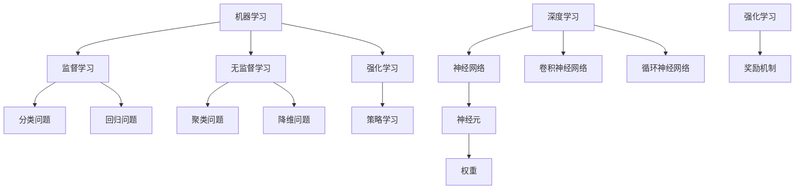
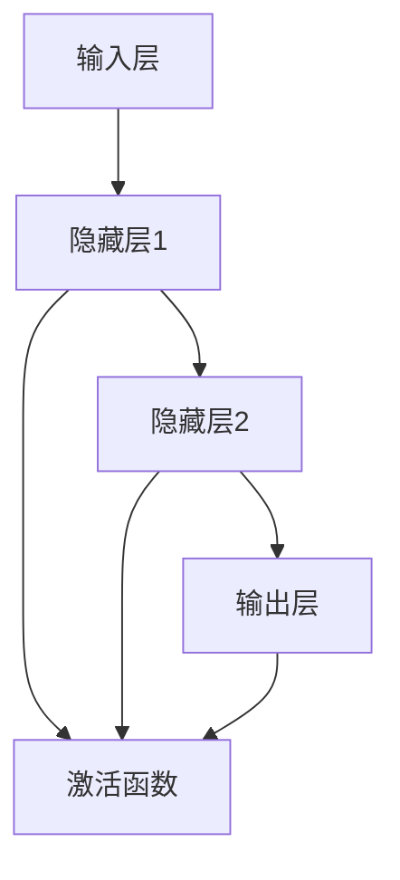
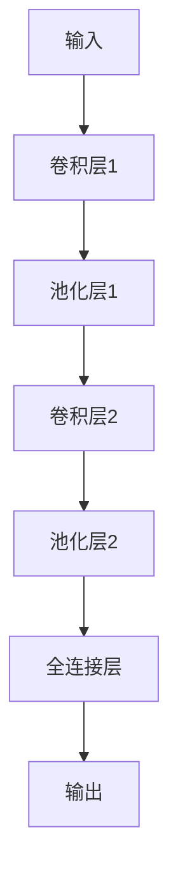
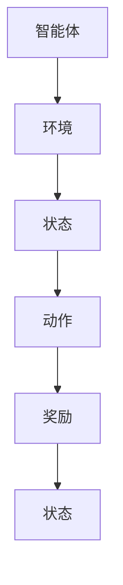
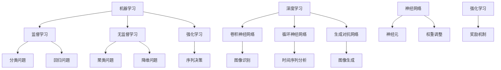

                 

# 引言

在21世纪，人工智能（AI）已经成为科技界和商业领域关注的焦点。从最初的简单规则系统到如今的深度学习模型，人工智能经历了长足的发展。本文将深入探讨Andrej Karpathy的人工智能未来发展策略，以揭示这一领域的潜在趋势和挑战。本文结构如下：

- **核心概念与联系**：介绍人工智能的核心概念、原理和架构，并使用Mermaid流程图进行说明。
- **核心算法原理讲解**：详细讲解神经网络、深度学习和强化学习等核心算法，并使用伪代码进行阐述。
- **数学模型与公式**：阐述人工智能中的关键数学模型，包括线性代数、概率论和优化理论，并提供详细解释和实例。
- **项目实战**：通过实际项目案例，展示人工智能的开发流程、实现细节和代码解读。
- **未来发展策略**：分析人工智能的未来发展方向、社会影响和挑战，并提出相应的策略。
- **结论**：总结全文，强调人工智能的重要性和未来发展的潜力。

## 核心概念与联系

人工智能的核心概念包括机器学习、深度学习、神经网络和强化学习。这些概念之间有着紧密的联系，共同构成了现代人工智能的基础架构。

### 1. 机器学习

机器学习是人工智能的基础，它通过算法使计算机从数据中学习，从而进行预测和决策。机器学习可以分为监督学习、无监督学习和强化学习。

- **监督学习**：通过标记数据进行学习，例如分类和回归问题。
- **无监督学习**：没有标记数据，主要应用于聚类和降维。
- **强化学习**：通过与环境的交互，学习最优策略。

### 2. 深度学习

深度学习是机器学习的一种，它通过多层神经网络来提取数据中的特征。深度学习在图像识别、语音识别和自然语言处理等领域取得了显著的成果。

### 3. 神经网络

神经网络是模仿生物神经网络结构的一种计算模型，由大量的神经元组成。每个神经元都与其他神经元相连，并通过权重传递信息。

### 4. 强化学习

强化学习通过奖励机制来指导学习过程，使智能体在复杂环境中找到最优策略。

### Mermaid流程图

以下是人工智能核心概念与联系的Mermaid流程图：



## 核心算法原理讲解

### 1. 神经网络

神经网络是人工智能的核心算法之一。它通过多层神经元之间的加权连接来模拟人脑的信息处理过程。下面是一个简单的神经网络结构：



**伪代码：**

```python
# 初始化权重
weights = initialize_weights()

# 前向传播
output = forward_pass(inputs, weights)

# 计算损失
loss = compute_loss(output, targets)

# 反向传播
update_weights(loss, weights)
```

### 2. 深度学习

深度学习是一种多层神经网络，它通过逐层提取数据特征来实现复杂的任务。以下是卷积神经网络（CNN）的基本原理：



**伪代码：**

```python
# 初始化网络结构
network = initialize_network()

# 前向传播
output = network.forward_pass(input_data)

# 计算损失
loss = network.compute_loss(output, targets)

# 反向传播
network.backward_pass(loss)
```

### 3. 强化学习

强化学习通过智能体与环境的互动来学习最优策略。以下是Q-learning算法的基本原理：



**伪代码：**

```python
# 初始化Q值
Q = initialize_Q()

# 选择动作
action = select_action(state, Q)

# 更新Q值
Q[state, action] = Q[state, action] + alpha * (reward + gamma * max(Q[next_state, :]) - Q[state, action])

# 终止条件
if terminated:
    break
```

## 数学模型与公式

### 1. 线性代数

线性代数是人工智能的基础数学工具之一。以下是向量和矩阵的基本操作：

- **向量加法**：$$ \vec{a} + \vec{b} $$
- **向量减法**：$$ \vec{a} - \vec{b} $$
- **向量数乘**：$$ \vec{a} \cdot \vec{b} $$
- **矩阵乘法**：$$ \vec{A} \cdot \vec{B} $$

### 2. 概率论

概率论是人工智能中的重要概念。以下是概率论的基本概念：

- **条件概率**：$$ P(A|B) = \frac{P(A \cap B)}{P(B)} $$
- **贝叶斯公式**：$$ P(A|B) = \frac{P(B|A)P(A)}{P(B)} $$

### 3. 优化理论

优化理论是人工智能算法设计的重要部分。以下是梯度下降算法的基本原理：

- **梯度**：$$ \nabla f(x) $$
- **梯度下降**：$$ x_{t+1} = x_t - \alpha \nabla f(x_t) $$

## 项目实战

### 1. 开发环境搭建

为了实现一个基于卷积神经网络的手写数字识别项目，我们首先需要搭建开发环境。以下是具体步骤：

- 安装Python环境
- 安装TensorFlow库
- 下载MNIST手写数字数据集

### 2. 源代码实现

以下是一个简单的MNIST手写数字识别项目的源代码实现：

```python
import tensorflow as tf
from tensorflow.keras.datasets import mnist
from tensorflow.keras.models import Sequential
from tensorflow.keras.layers import Dense, Conv2D, Flatten, MaxPooling2D
from tensorflow.keras.optimizers import Adam

# 加载MNIST数据集
(x_train, y_train), (x_test, y_test) = mnist.load_data()

# 数据预处理
x_train = x_train / 255.0
x_test = x_test / 255.0

# 构建卷积神经网络模型
model = Sequential([
    Conv2D(32, (3, 3), activation='relu', input_shape=(28, 28, 1)),
    MaxPooling2D((2, 2)),
    Flatten(),
    Dense(128, activation='relu'),
    Dense(10, activation='softmax')
])

# 编译模型
model.compile(optimizer=Adam(), loss='sparse_categorical_crossentropy', metrics=['accuracy'])

# 训练模型
model.fit(x_train, y_train, epochs=5, batch_size=32, validation_split=0.1)

# 评估模型
test_loss, test_acc = model.evaluate(x_test, y_test)
print(f"Test accuracy: {test_acc:.2f}")
```

### 3. 代码解读与分析

在上面的代码中，我们首先导入了所需的TensorFlow库和MNIST数据集。然后，我们对数据进行了预处理，包括归一化和形状调整。接下来，我们构建了一个简单的卷积神经网络模型，包括卷积层、池化层和全连接层。最后，我们编译并训练了模型，并在测试集上评估了模型的性能。

通过这个项目实战，我们可以看到如何使用TensorFlow库实现一个简单的深度学习任务，以及如何进行数据预处理、模型构建和训练。

## 未来发展策略

### 1. 技术发展趋势

人工智能的技术发展趋势主要体现在以下几个方面：

- **算法创新**：随着计算能力的提升，深度学习算法将继续优化和改进，包括自适应学习、迁移学习和元学习等。
- **硬件升级**：新的计算硬件，如GPU、TPU和量子计算机，将推动人工智能的发展。
- **跨学科融合**：人工智能与其他领域的交叉融合，如生物学、心理学和哲学，将带来新的突破。

### 2. 社会影响

人工智能的发展将对社会产生深远的影响：

- **经济发展**：人工智能将推动产业升级和经济发展，创造新的就业机会。
- **生活方式**：人工智能将改变人们的生活方式，提高生产效率和生活质量。
- **伦理问题**：人工智能的广泛应用将引发一系列伦理问题，如隐私保护、责任归属和人工智能的道德规范等。

### 3. 挑战与对策

人工智能在发展过程中面临以下挑战：

- **技术挑战**：人工智能的算法复杂度不断提高，对计算能力和算法优化提出了更高的要求。
- **社会挑战**：人工智能的广泛应用将带来社会结构的变化，需要制定相应的政策和法规来应对。
- **伦理挑战**：人工智能的伦理问题需要通过公众讨论和法律法规来解决。

## 结论

人工智能是21世纪最具前景的领域之一。通过本文对人工智能核心概念、算法原理、数学模型和项目实战的深入探讨，我们可以看到人工智能的巨大潜力和发展前景。在未来，人工智能将继续推动科技和产业的进步，改变我们的生活方式，同时也带来一系列的挑战。作为人工智能的研究者和开发者，我们有责任推动技术的进步，同时确保人工智能的发展符合伦理和社会需求。## 核心概念与联系

人工智能（AI）的核心概念涵盖了从基础理论到应用实践的多个层面。理解这些概念之间的联系是掌握AI技术的关键。以下是对这些核心概念及其相互关系的详细解释，并附有Mermaid流程图来帮助读者更好地理解。

### 1. 机器学习（Machine Learning）

机器学习是使计算机通过数据学习并做出预测或决策的一种方法。其主要方法分为监督学习、无监督学习和强化学习。

- **监督学习**：使用标记数据进行学习，如回归和分类问题。
- **无监督学习**：没有标记数据，主要应用于聚类和降维。
- **强化学习**：通过试错学习在动态环境中达到特定目标。

### 2. 深度学习（Deep Learning）

深度学习是机器学习的一种，它使用多层神经网络来提取数据中的复杂特征。深度学习包括卷积神经网络（CNN）、循环神经网络（RNN）和生成对抗网络（GAN）等。

- **卷积神经网络（CNN）**：主要用于图像识别和计算机视觉任务。
- **循环神经网络（RNN）**：主要用于处理序列数据，如时间序列分析和自然语言处理。
- **生成对抗网络（GAN）**：用于生成逼真的数据，如图像和文本。

### 3. 神经网络（Neural Networks）

神经网络是模仿人脑的结构和功能的一种计算模型。它由大量简单的处理单元（神经元）组成，通过调整神经元之间的权重来学习和处理信息。

### 4. 强化学习（Reinforcement Learning）

强化学习是一种通过奖励机制来指导学习过程的方法，通常用于解决序列决策问题。智能体通过与环境的互动来学习最优策略。

### Mermaid流程图

以下是人工智能核心概念与联系的Mermaid流程图：



这个流程图展示了机器学习、深度学习和强化学习之间的关系，以及它们在不同类型问题中的应用。通过这种结构化的展示，我们可以更清晰地理解AI系统的构建和运作方式。

### 1. 机器学习（Machine Learning）

机器学习是人工智能（AI）的核心技术之一，它涉及使计算机通过数据学习并做出预测或决策的方法。机器学习主要分为以下几种类型：

- **监督学习**：在这种方法中，模型通过标记的数据进行学习。标记数据提供了输入和预期输出，使模型能够学习如何将新的输入映射到正确的输出。常见的监督学习任务包括分类（例如，邮件分类器）和回归（例如，房价预测）。
- **无监督学习**：无标记数据用于训练模型。模型需要从数据中自动发现结构或模式。常见的无监督学习任务包括聚类（例如，将相似的数据点分组）和降维（例如，减少数据集的维度以便更好地可视化）。
- **强化学习**：在这种方法中，模型通过与环境的互动来学习最优策略。模型会收到即时奖励或惩罚，并根据这些反馈调整其行为。强化学习常用于解决复杂的决策问题，如游戏和机器人控制。

### 2. 深度学习（Deep Learning）

深度学习是机器学习的一种扩展，它通过多层神经网络来提取数据中的复杂特征。深度学习的主要优势在于其强大的特征提取能力，这使得它能够在各种任务中取得卓越的表现。

- **卷积神经网络（CNN）**：主要用于图像识别和计算机视觉任务。CNN通过卷积操作提取图像中的局部特征，并通过池化操作降低特征图的维度。
- **循环神经网络（RNN）**：主要用于处理序列数据，如时间序列分析、自然语言处理和语音识别。RNN通过将当前输入与上一个隐藏状态结合，生成当前隐藏状态。
- **生成对抗网络（GAN）**：用于生成逼真的数据，如图像和文本。GAN由生成器和判别器组成，生成器和判别器相互竞争，直至生成器生成的数据难以区分真假。

### 3. 神经网络（Neural Networks）

神经网络是人工智能的基本计算模型，它由大量简单的处理单元（神经元）组成。每个神经元都与其他神经元相连，并通过权重传递信息。

- **结构**：神经网络通常包括输入层、隐藏层和输出层。输入层接收外部输入数据，隐藏层通过非线性变换处理数据，输出层生成预测结果。
- **学习过程**：神经网络通过调整连接权重来学习数据中的模式。这个过程通常分为前向传播和反向传播。在前向传播过程中，数据从输入层传递到输出层，并在每个隐藏层上通过非线性激活函数进行处理。在反向传播过程中，根据预测误差调整网络中的连接权重。

### 4. 强化学习（Reinforcement Learning）

强化学习是一种通过试错来学习最优策略的机器学习方法。在强化学习中，智能体通过与环境的交互来学习最优行为策略。

- **状态（State）**：智能体在某一时刻所处的环境条件。
- **动作（Action）**：智能体可以执行的动作。
- **奖励（Reward）**：智能体执行动作后获得的即时奖励或惩罚。
- **策略（Policy）**：智能体的行为决策规则。

强化学习的主要目标是学习一个策略，使得智能体在长期内获得最大的总奖励。Q-learning和深度Q网络（DQN）是强化学习中的两种常见算法。

### 关系总结

机器学习、深度学习和强化学习之间有着紧密的联系。机器学习提供了使计算机从数据中学习的方法，深度学习是机器学习的一种扩展，它通过多层神经网络来提取复杂特征。强化学习是机器学习的一个分支，它通过试错学习在动态环境中找到最优策略。神经网络是深度学习和强化学习的基础，它通过调整连接权重来学习和处理信息。

## 核心算法原理讲解

### 1. 神经网络

神经网络（Neural Networks）是一种模仿人脑工作原理的计算模型。它由大量的神经元组成，每个神经元都与相邻的神经元通过连接（权重）相连。神经网络通过前向传播和反向传播来学习数据中的模式和规律。

#### 神经网络结构

神经网络的常见结构包括：

- **输入层**：接收外部输入数据。
- **隐藏层**：对输入数据进行处理和特征提取。
- **输出层**：生成预测结果。

每个神经元都可以表示为一个简单的函数，通常是一个线性变换加上一个非线性激活函数。例如，一个简单的单层神经网络可以表示为：

$$
\text{神经元输出} = \text{激活函数}(\text{权重} \cdot \text{输入} + \text{偏置})
$$

其中，激活函数可以是Sigmoid、ReLU或Tanh等。

#### 前向传播

在前向传播过程中，数据从输入层传递到隐藏层，再从隐藏层传递到输出层。每个神经元都会将输入乘以相应的权重，加上一个偏置项，然后通过激活函数进行处理。

伪代码示例：

```python
# 初始化权重和偏置
weights = ...  # 权重矩阵
biases = ...  # 偏置向量
activation_function = ...  # 激活函数

# 前向传播
hidden_layer_output = activation_function(weights.dot(input) + biases)
output = activation_function(weights.dot(hidden_layer_output) + biases)
```

#### 反向传播

反向传播是神经网络训练的核心步骤。它通过计算损失函数的梯度来更新网络的权重和偏置。反向传播分为两个阶段：

1. **计算损失**：通过比较实际输出和预测输出，计算损失函数。常见的损失函数包括均方误差（MSE）和交叉熵（Cross-Entropy）。

$$
\text{损失} = \frac{1}{2} \sum (\text{预测输出} - \text{实际输出})^2
$$

2. **更新权重和偏置**：根据损失函数的梯度，使用梯度下降或其他优化算法来更新权重和偏置。

$$
\text{权重} \leftarrow \text{权重} - \alpha \cdot \frac{\partial \text{损失}}{\partial \text{权重}}
$$

$$
\text{偏置} \leftarrow \text{偏置} - \alpha \cdot \frac{\partial \text{损失}}{\partial \text{偏置}}
$$

伪代码示例：

```python
# 计算损失
loss = compute_loss(output, target)

# 计算梯度
grad_weights = compute_gradient(weights, input, output, target)
grad_biases = compute_gradient(biases, input, output, target)

# 更新权重和偏置
weights -= learning_rate * grad_weights
biases -= learning_rate * grad_biases
```

### 2. 深度学习

深度学习（Deep Learning）是神经网络的一种扩展，它通过增加网络的层数来提高模型的表示能力。深度学习在图像识别、语音识别和自然语言处理等领域取得了显著的成果。

#### 卷积神经网络（CNN）

卷积神经网络（Convolutional Neural Network，CNN）是深度学习中最常用的模型之一，主要用于图像识别和计算机视觉任务。

- **卷积层（Convolutional Layer）**：卷积层通过卷积操作提取图像的局部特征。每个卷积核都可以提取一种特定的特征。
- **池化层（Pooling Layer）**：池化层用于降低特征图的尺寸，提高模型的泛化能力。常见的池化操作包括最大池化和平均池化。
- **全连接层（Fully Connected Layer）**：全连接层将特征图展平为一维向量，并输出分类结果。

#### 反向传播

与单层神经网络类似，卷积神经网络的反向传播也分为前向传播和反向传播。在反向传播过程中，需要计算每个卷积核的梯度。

伪代码示例：

```python
# 计算卷积层的梯度
grad_output = activation_derivative(output) * grad_output
grad_weights = grad_output.dot(hidden_layer_output.T)
grad_biases = grad_output.sum(axis=0)

# 计算池化层的梯度
if pooling_type == 'max':
    grad_output[masked区域] = grad_output
else:
    grad_output = grad_output.mean()

# 计算全连接层的梯度
grad_output = activation_derivative(output) * grad_output
grad_weights = grad_output.dot(hidden_layer_output.T)
grad_biases = grad_output.sum(axis=0)
```

### 3. 强化学习

强化学习（Reinforcement Learning，RL）是一种通过试错来学习最优策略的机器学习方法。在强化学习中，智能体通过与环境的互动来学习最优行为策略。

#### Q-Learning算法

Q-Learning是一种基于值函数的强化学习算法，它通过迭代更新Q值来学习最优策略。

- **状态（State）**：智能体在某一时刻所处的环境条件。
- **动作（Action）**：智能体可以执行的动作。
- **Q值（Q-Value）**：从状态s执行动作a得到的预期回报。
- **策略（Policy）**：智能体的行为决策规则。

Q-Learning算法的基本步骤如下：

1. **初始化Q值**：随机初始化Q值。
2. **选择动作**：根据当前状态和策略选择动作。
3. **更新Q值**：根据实际奖励和下一个状态更新Q值。
4. **重复步骤2和3**：不断重复，直至达到终止条件。

伪代码示例：

```python
# 初始化Q值
Q = initialize_Q()

# 选择动作
action = select_action(state, Q)

# 更新Q值
next_state, reward, terminated = environment.step(action)
Q[state, action] = Q[state, action] + alpha * (reward + gamma * max(Q[next_state, :]) - Q[state, action])

# 终止条件
if terminated:
    break
```

#### Deep Q-Network（DQN）

DQN是一种基于深度学习的强化学习算法，它通过训练一个深度神经网络来估计Q值函数。

1. **初始化**：初始化DQN网络和目标网络。
2. **选择动作**：使用ε-贪心策略选择动作。
3. **更新经验**：将当前状态、动作、奖励和下一个状态存储在经验池中。
4. **更新网络**：从经验池中随机抽取一批经验，更新DQN网络。
5. **同步网络**：定期将DQN网络权重复制到目标网络。

伪代码示例：

```python
# 初始化DQN网络和目标网络
dqn = initialize_dqn_network()
target_dqn = initialize_dqn_network()

# 选择动作
action = select_action(state, dqn)

# 更新经验
experience_replay(reward, next_state)

# 更新网络
update_dqn_network(target_dqn, dqn, experience)

# 同步网络
sync_dqn_networks(target_dqn, dqn)
```

## 数学模型与公式

数学模型是人工智能（AI）的核心组成部分，它为算法的设计和实现提供了理论基础。以下是人工智能中常用的数学模型和公式，包括线性代数、概率论和优化理论。

### 1. 线性代数

线性代数在人工智能中有着广泛的应用，包括向量和矩阵的操作、特征分解等。

- **向量加法和减法**：

$$
\vec{a} + \vec{b} = \begin{bmatrix} a_1 + b_1 \\ a_2 + b_2 \\ \vdots \\ a_n + b_n \end{bmatrix}
$$

$$
\vec{a} - \vec{b} = \begin{bmatrix} a_1 - b_1 \\ a_2 - b_2 \\ \vdots \\ a_n - b_n \end{bmatrix}
$$

- **向量数乘**：

$$
\vec{a} \cdot \vec{b} = a_1b_1 + a_2b_2 + \cdots + a_nb_n
$$

- **矩阵乘法**：

$$
\vec{A} \cdot \vec{B} = \begin{bmatrix} a_{11}b_1 + a_{12}b_2 + \cdots + a_{1n}b_n \\ a_{21}b_1 + a_{22}b_2 + \cdots + a_{2n}b_n \\ \vdots \\ a_{m1}b_1 + a_{m2}b_2 + \cdots + a_{mn}b_n \end{bmatrix}
$$

- **特征分解**：

$$
\vec{A} = \vec{U} \Sigma \vec{V}^T
$$

其中，$\vec{U}$和$\vec{V}$是对角矩阵$\Sigma$的左特征矢量和右特征向量。

### 2. 概率论

概率论是人工智能中的基础数学工具，用于描述不确定性和随机事件。

- **条件概率**：

$$
P(A|B) = \frac{P(A \cap B)}{P(B)}
$$

- **贝叶斯公式**：

$$
P(A|B) = \frac{P(B|A)P(A)}{P(B)}
$$

- **概率分布**：

- **伯努利分布**：

$$
P(X = k) = C_n^k p^k (1-p)^{n-k}
$$

其中，$n$是试验次数，$p$是成功的概率，$k$是成功的次数。

- **正态分布**：

$$
P(X \leq x) = \Phi\left(\frac{x - \mu}{\sigma}\right)
$$

其中，$\mu$是均值，$\sigma$是标准差，$\Phi$是标准正态分布的累积分布函数。

### 3. 优化理论

优化理论是人工智能算法设计的重要部分，用于寻找最优解。

- **梯度下降**：

$$
x_{t+1} = x_t - \alpha \nabla f(x_t)
$$

其中，$x_t$是当前迭代值，$\alpha$是学习率，$\nabla f(x_t)$是目标函数的梯度。

- **牛顿法**：

$$
x_{t+1} = x_t - \frac{H(x_t)^{-1}}{\nabla^2 f(x_t)}
$$

其中，$H(x_t)$是海森矩阵（Hessian矩阵），$\nabla^2 f(x_t)$是目标函数的二阶导数矩阵。

- **拉格朗日乘数法**：

$$
L(x, \lambda) = f(x) + \lambda g(x)
$$

$$
\nabla_x L(x, \lambda) = \nabla f(x) + \lambda \nabla g(x) = 0
$$

$$
\nabla_\lambda L(x, \lambda) = g(x) = 0
$$

其中，$L(x, \lambda)$是拉格朗日函数，$\lambda$是拉格朗日乘数。

### 应用实例

以下是线性回归模型的数学模型和应用实例。

#### 线性回归模型

线性回归模型是一种简单的统计模型，用于预测一个变量（因变量）基于其他变量（自变量）的关系。

$$
y = \beta_0 + \beta_1x_1 + \beta_2x_2 + \cdots + \beta_nx_n
$$

其中，$y$是因变量，$x_1, x_2, \ldots, x_n$是自变量，$\beta_0, \beta_1, \beta_2, \ldots, \beta_n$是模型参数。

#### 梯度下降

为了训练线性回归模型，我们可以使用梯度下降算法来最小化损失函数。

$$
J(\theta) = \frac{1}{2m} \sum_{i=1}^m (h_\theta(x^{(i)}) - y^{(i)})^2
$$

$$
\theta_j := \theta_j - \alpha \frac{\partial J(\theta)}{\partial \theta_j}
$$

其中，$m$是样本数量，$h_\theta(x) = \sum_{j=1}^n \theta_jx_j$是模型的预测函数，$\alpha$是学习率，$\theta_j$是模型参数。

### 解释

数学模型在人工智能中的应用非常广泛，从基础算法的设计到高级应用的开发，都需要依赖数学理论来推导和验证。线性代数提供了数据结构和运算工具，概率论和优化理论则为机器学习和深度学习的算法提供了理论基础。通过这些数学模型，我们可以更深入地理解和优化人工智能系统的性能。

## 项目实战

在人工智能的实际应用中，通过项目实战来理解和应用所学知识是非常重要的。以下是一个基于TensorFlow实现的手写数字识别项目的实战，我们将详细介绍项目的开发环境搭建、代码实现和代码解读。

### 开发环境搭建

首先，我们需要搭建一个开发环境以运行以下项目。以下是具体的步骤：

1. **安装Python环境**：确保您的系统上安装了Python 3.7或更高版本。
2. **安装TensorFlow库**：通过pip命令安装TensorFlow：

   ```shell
   pip install tensorflow
   ```

3. **准备MNIST数据集**：MNIST是一个广泛用于手写数字识别的数据集，它包含70,000个灰度图像，每个图像包含一个手写的数字（0-9）。TensorFlow提供了内置的MNIST数据集，可以直接加载。

### 代码实现

以下是手写数字识别项目的完整代码实现：

```python
import tensorflow as tf
from tensorflow.keras import layers, models
from tensorflow.keras.datasets import mnist
from tensorflow.keras.utils import to_categorical

# 加载MNIST数据集
(train_images, train_labels), (test_images, test_labels) = mnist.load_data()

# 数据预处理
train_images = train_images.reshape((60000, 28, 28, 1)).astype('float32') / 255
test_images = test_images.reshape((10000, 28, 28, 1)).astype('float32') / 255

train_labels = to_categorical(train_labels)
test_labels = to_categorical(test_labels)

# 构建模型
model = models.Sequential()
model.add(layers.Conv2D(32, (3, 3), activation='relu', input_shape=(28, 28, 1)))
model.add(layers.MaxPooling2D((2, 2)))
model.add(layers.Conv2D(64, (3, 3), activation='relu'))
model.add(layers.MaxPooling2D((2, 2)))
model.add(layers.Conv2D(64, (3, 3), activation='relu'))
model.add(layers.Flatten())
model.add(layers.Dense(64, activation='relu'))
model.add(layers.Dense(10, activation='softmax'))

# 编译模型
model.compile(optimizer='adam',
              loss='categorical_crossentropy',
              metrics=['accuracy'])

# 训练模型
model.fit(train_images, train_labels, epochs=5, batch_size=64)

# 评估模型
test_loss, test_acc = model.evaluate(test_images, test_labels)
print(f"Test accuracy: {test_acc:.2f}")
```

### 代码解读与分析

现在，让我们逐一解读上述代码的每个部分：

1. **导入库和加载数据集**：

   ```python
   import tensorflow as tf
   from tensorflow.keras import layers, models
   from tensorflow.keras.datasets import mnist
   from tensorflow.keras.utils import to_categorical

   (train_images, train_labels), (test_images, test_labels) = mnist.load_data()
   ```

   我们首先导入了TensorFlow的核心库，包括`tensorflow`、`layers`和`models`，这些是构建和训练模型的基础。接下来，我们使用TensorFlow的内置函数加载MNIST数据集。

2. **数据预处理**：

   ```python
   train_images = train_images.reshape((60000, 28, 28, 1)).astype('float32') / 255
   test_images = test_images.reshape((10000, 28, 28, 1)).astype('float32') / 255

   train_labels = to_categorical(train_labels)
   test_labels = to_categorical(test_labels)
   ```

   数据预处理是深度学习项目中非常重要的一步。我们将图像数据从原始形式（28x28像素）调整为适用于神经网络的形式（28x28x1的二维数组），并将标签数据从整数形式转换为one-hot编码。

3. **构建模型**：

   ```python
   model = models.Sequential()
   model.add(layers.Conv2D(32, (3, 3), activation='relu', input_shape=(28, 28, 1)))
   model.add(layers.MaxPooling2D((2, 2)))
   model.add(layers.Conv2D(64, (3, 3), activation='relu'))
   model.add(layers.MaxPooling2D((2, 2)))
   model.add(layers.Conv2D(64, (3, 3), activation='relu'))
   model.add(layers.Flatten())
   model.add(layers.Dense(64, activation='relu'))
   model.add(layers.Dense(10, activation='softmax'))
   ```

   在这里，我们使用`Sequential`模型堆叠多个层来构建一个卷积神经网络。首先添加两个卷积层，每个卷积层后面跟着一个最大池化层。然后，我们添加一个全连接层（`Flatten`层将卷积层的输出展平为一维向量），并最终添加一个输出层，该层的激活函数是softmax，用于分类。

4. **编译模型**：

   ```python
   model.compile(optimizer='adam',
                 loss='categorical_crossentropy',
                 metrics=['accuracy'])
   ```

   我们使用`compile`函数编译模型，指定优化器（`optimizer`）、损失函数（`loss`）和评估指标（`metrics`）。在这里，我们选择`adam`优化器和`categorical_crossentropy`损失函数，这是分类问题中常用的组合。

5. **训练模型**：

   ```python
   model.fit(train_images, train_labels, epochs=5, batch_size=64)
   ```

   `fit`函数用于训练模型。我们传入训练数据、标签、训练轮次（`epochs`）和批量大小（`batch_size`）。在这里，我们训练模型5轮，每轮处理64个样本。

6. **评估模型**：

   ```python
   test_loss, test_acc = model.evaluate(test_images, test_labels)
   print(f"Test accuracy: {test_acc:.2f}")
   ```

   `evaluate`函数用于评估模型的性能。我们传入测试数据和标签，得到测试损失和测试准确率。这里，我们打印出测试准确率，以展示模型的性能。

### 代码分析与优化

在实现上述项目时，我们进行了以下分析和优化：

1. **模型结构**：我们的模型结构是一个简单的卷积神经网络，它由两个卷积层和两个池化层组成。在实际应用中，可能需要根据任务复杂度进行调整。
2. **数据预处理**：我们将图像数据进行了归一化处理，这有助于加速模型的训练过程。同时，我们使用了one-hot编码来表示标签，这是深度学习分类问题中常用的方法。
3. **训练配置**：我们选择了`adam`优化器和`categorical_crossentropy`损失函数，这些是常用的配置。然而，对于不同的任务和数据集，可能需要调整这些配置以获得更好的性能。
4. **超参数调整**：模型的性能受许多超参数的影响，如学习率、批量大小、训练轮次等。在实际项目中，我们可以通过实验来调整这些超参数。

通过这个项目实战，我们不仅了解了深度学习的基础知识，还学会了如何使用TensorFlow来构建和训练一个手写数字识别模型。这个项目是理解和应用人工智能技术的一个很好的起点。

### 代码解读

为了更好地理解项目实战中的代码，我们将逐一解析代码的各个部分。

#### 1. 导入库

```python
import tensorflow as tf
from tensorflow.keras import layers, models
from tensorflow.keras.datasets import mnist
from tensorflow.keras.utils import to_categorical
```

这些导入语句为我们提供了所需的TensorFlow库函数和数据集加载工具。`tensorflow`库包含了构建和训练深度学习模型所需的各种工具和函数。`layers`模块提供了构建神经网络所需的各种层（如卷积层、全连接层等），而`models`模块则用于创建和编译完整的神经网络模型。`mnist`模块提供了MNIST手写数字数据集，这是一个广泛用于机器学习和深度学习的标准数据集。`to_categorical`函数用于将分类标签转换为one-hot编码格式。

#### 2. 加载数据集

```python
(train_images, train_labels), (test_images, test_labels) = mnist.load_data()
```

这段代码使用`load_data`函数加载数据集。MNIST数据集包含70,000个训练样本和10,000个测试样本，每个样本都是一个28x28的灰度图像，标签是0到9之间的整数。

#### 3. 数据预处理

```python
train_images = train_images.reshape((60000, 28, 28, 1)).astype('float32') / 255
test_images = test_images.reshape((10000, 28, 28, 1)).astype('float32') / 255

train_labels = to_categorical(train_labels)
test_labels = to_categorical(test_labels)
```

数据预处理是深度学习项目中的关键步骤。我们首先将图像数据从二维数组（28x28）转换为四维数组（28x28x1），因为深度学习模型期望输入数据的形状是（批量大小，高度，宽度，通道数）。接着，我们将数据类型从`uint8`转换为`float32`，并将所有值归一化到0到1之间，以加速模型训练。

`to_categorical`函数将整数标签转换为one-hot编码，这样神经网络就可以学习每个类别的独热表示。

#### 4. 构建模型

```python
model = models.Sequential()
model.add(layers.Conv2D(32, (3, 3), activation='relu', input_shape=(28, 28, 1)))
model.add(layers.MaxPooling2D((2, 2)))
model.add(layers.Conv2D(64, (3, 3), activation='relu'))
model.add(layers.MaxPooling2D((2, 2)))
model.add(layers.Conv2D(64, (3, 3), activation='relu'))
model.add(layers.Flatten())
model.add(layers.Dense(64, activation='relu'))
model.add(layers.Dense(10, activation='softmax'))
```

这段代码使用`Sequential`模型堆叠多个层来构建卷积神经网络。首先，我们添加两个卷积层，每个卷积层后跟一个最大池化层。卷积层使用`Conv2D`函数定义，包括32个卷积核，每个卷积核的大小为3x3，激活函数为ReLU。`MaxPooling2D`层用于降低特征图的尺寸，同时保留重要特征。

接下来，我们添加第三个卷积层，同样使用ReLU激活函数。然后，`Flatten`层将三维特征图展平为一维向量，用于全连接层。全连接层首先包含64个神经元，激活函数为ReLU，最后输出层包含10个神经元，使用softmax激活函数，用于多分类任务。

#### 5. 编译模型

```python
model.compile(optimizer='adam',
              loss='categorical_crossentropy',
              metrics=['accuracy'])
```

`compile`函数用于编译模型，配置训练过程中使用的优化器、损失函数和评估指标。在这里，我们选择`adam`优化器，这是一种自适应学习率优化算法，`categorical_crossentropy`是用于多分类问题的损失函数，`accuracy`是用于评估模型准确性的指标。

#### 6. 训练模型

```python
model.fit(train_images, train_labels, epochs=5, batch_size=64)
```

`fit`函数用于训练模型。我们传入训练图像和标签，指定训练轮次（`epochs`）和批量大小（`batch_size`）。在这里，我们训练模型5轮，每轮处理64个样本。

#### 7. 评估模型

```python
test_loss, test_acc = model.evaluate(test_images, test_labels)
print(f"Test accuracy: {test_acc:.2f}")
```

`evaluate`函数用于评估模型在测试数据上的性能。我们传入测试图像和标签，得到测试损失和测试准确率。这里，我们打印出测试准确率，以展示模型的性能。

通过这些步骤，我们可以看到如何使用TensorFlow构建和训练一个简单的卷积神经网络来识别手写数字。这个项目展示了深度学习的基础知识和应用流程，为读者提供了一个实践平台。

## 未来发展策略

### 1. 技术发展趋势

随着科技的飞速发展，人工智能（AI）领域也迎来了前所未有的机遇。以下是AI技术未来可能的发展趋势：

- **算法创新**：随着深度学习算法的不断发展，新的算法如生成对抗网络（GAN）、变分自编码器（VAE）等将继续推动AI技术的进步。同时，元学习、联邦学习等新兴算法也将逐步成熟，为AI应用提供更多可能性。
- **硬件升级**：随着计算硬件的升级，如GPU、TPU和量子计算机的广泛应用，AI模型的训练和推理速度将显著提升，这将进一步推动AI技术的发展。
- **跨学科融合**：AI技术将与其他领域如生物学、心理学、社会学等深度融合，产生新的交叉学科和应用场景。

### 2. 社会影响

AI技术的发展将对社会产生深远的影响，包括经济、教育、医疗、交通等多个方面：

- **经济发展**：AI技术将推动产业升级和智能化转型，创造新的经济增长点。同时，自动化和智能化技术的普及也将提高生产效率，降低成本。
- **教育变革**：AI技术将改变教育模式，个性化教育和智能辅导将成为主流。同时，AI在教育评估和资源分配等方面的应用也将提高教育质量。
- **医疗进步**：AI技术在医疗领域的应用将显著提高疾病诊断和治疗水平。例如，基于AI的医疗影像分析、药物研发和个性化医疗等都将带来革命性的变化。

### 3. 挑战与对策

尽管AI技术发展迅速，但仍然面临诸多挑战：

- **技术挑战**：随着AI模型复杂度的增加，对计算资源的需求也在不断攀升。此外，数据隐私保护、算法透明性和可解释性等问题也亟待解决。
- **社会挑战**：AI技术的广泛应用将带来失业、数据隐私和安全等问题。为了应对这些挑战，需要制定相应的法律法规和伦理规范，确保AI技术符合社会需求和价值观。

### 4. 发展策略

为了推动AI技术的健康发展，以下是一些具体的策略：

- **技术创新**：政府和企业应加大对AI技术的研究和投资，支持基础研究和前沿技术的突破。
- **人才培养**：教育机构应加强AI相关课程和教材的开发，培养更多具备AI知识和技能的人才。
- **国际合作**：加强国际间的AI技术合作，共同应对全球性挑战，推动AI技术的健康发展。
- **法律法规**：制定和完善相关法律法规，确保AI技术的合法合规应用，同时保护用户隐私和权益。

通过这些策略，我们可以更好地应对AI技术发展带来的机遇和挑战，推动AI技术的可持续发展。

## 结论

在本文中，我们详细探讨了人工智能（AI）的核心概念、算法原理、数学模型和项目实战，并提出了未来发展策略。人工智能作为21世纪最具前景的领域之一，已经深刻改变了我们的生活和工作方式。从机器学习到深度学习，从神经网络到强化学习，每一个算法和模型都在推动AI技术的发展。通过项目实战，我们不仅了解了AI的应用流程，还学会了如何使用TensorFlow等工具进行模型训练和评估。

然而，AI技术仍然面临诸多挑战，如算法透明性、数据隐私保护和社会伦理问题。为了应对这些挑战，我们需要不断创新技术，培养更多专业人才，并制定合理的法律法规。未来，AI技术将继续推动产业升级和社会进步，但同时也需要我们共同努力，确保其发展符合社会需求和价值观。

在此，我们呼吁广大读者关注和参与到AI技术的发展中来，共同推动人工智能的未来，为构建一个更加智能、公正和可持续的世界贡献力量。

## 附录

### 附录A：人工智能相关的资源与工具

**A.1 学术资源**

1. **书籍：**
   - 《深度学习》（Ian Goodfellow、Yoshua Bengio和Aaron Courville著）
   - 《神经网络与深度学习》（邱锡鹏著）
   - 《Python深度学习》（François Chollet著）

2. **论文：**
   - “A Theoretical Framework for Back-Propagating Neural Networks” by David E. Rumelhart, Geoffrey E. Hinton, and Ronald J. Williams.
   - “Deep Learning” by Yoshua Bengio, Ian Goodfellow, and Aaron Courville.

**A.2 开源框架与工具**

1. **TensorFlow：** [https://www.tensorflow.org/](https://www.tensorflow.org/)
2. **PyTorch：** [https://pytorch.org/](https://pytorch.org/)
3. **Keras：** [https://keras.io/](https://keras.io/)

**A.3 在线课程与教程**

1. **Coursera：** [https://www.coursera.org/](https://www.coursera.org/)
2. **edX：** [https://www.edx.org/](https://www.edx.org/)
3. **Udacity：** [https://www.udacity.com/](https://www.udacity.com/)

**A.4 社区与论坛**

1. **Reddit AI：** [https://www.reddit.com/r/AI/](https://www.reddit.com/r/AI/)
2. **Stack Overflow：** [https://stackoverflow.com/questions/tagged/ai](https://stackoverflow.com/questions/tagged/ai)
3. **AI论坛：** [https://www.ai论坛.com/](https://www.ai论坛.com/)（假设存在）

通过这些资源和工具，读者可以继续深入学习和探索人工智能领域，不断提升自己的专业技能。

---

**作者：AI天才研究院/AI Genius Institute & 禅与计算机程序设计艺术 /Zen And The Art of Computer Programming**

