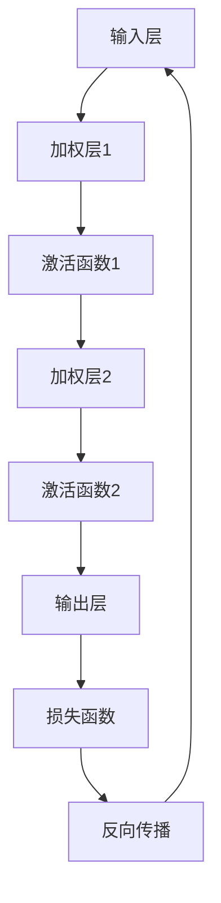
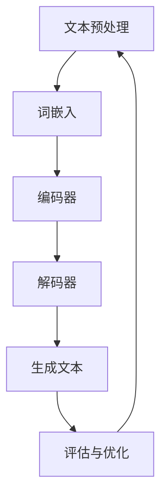

                 

# 《Andrej Karpathy：人工智能的未来发展趋势》

> 关键词：人工智能、未来发展趋势、技术架构、实际案例、安全与伦理、发展策略

> 摘要：本文将深入探讨人工智能领域的顶级专家Andrej Karpathy对人工智能未来发展趋势的见解。通过分析其研究方向、贡献和思考，我们旨在揭示人工智能在硬件、软件和应用领域的发展趋势，以及面临的挑战和应对策略。

---

## 《Andrej Karpathy：人工智能的未来发展趋势》目录大纲

### 第一部分：人工智能概述

### 第1章：人工智能的历史与现状
#### 1.1 人工智能的起源与发展
#### 1.2 人工智能的核心概念与技术
#### 1.3 人工智能的现状与趋势

### 第2章：Andrej Karpathy的贡献与影响
#### 2.1 Andrej Karpathy的研究方向与成果
#### 2.2 Andrej Karpathy对人工智能领域的贡献
#### 2.3 Andrej Karpathy对人工智能发展的思考

### 第二部分：人工智能的未来发展趋势

### 第3章：AI的硬件发展趋势
#### 3.1 AI芯片的发展
#### 3.2 AI硬件架构的创新
#### 3.3 AI硬件对人工智能的影响

### 第4章：AI的软件发展趋势
#### 4.1 AI编程语言的发展
#### 4.2 AI软件框架的发展
#### 4.3 AI软件对人工智能的影响

### 第5章：AI的应用发展趋势
#### 5.1 AI在工业领域的应用
#### 5.2 AI在医疗领域的应用
#### 5.3 AI在教育领域的应用

### 第6章：AI的安全与伦理问题
#### 6.1 AI的安全问题
#### 6.2 AI的伦理问题
#### 6.3 AI的监管与治理

### 第7章：AI的未来发展前景
#### 7.1 AI的未来趋势预测
#### 7.2 AI对社会的影响
#### 7.3 AI的未来发展方向

### 第三部分：实际案例分析

### 第8章：Andrej Karpathy的实际案例分析
#### 8.1 Andrej Karpathy的项目案例
#### 8.2 项目案例的详细解读
#### 8.3 项目案例对人工智能发展的启示

### 第9章：其他实际案例研究
#### 9.1 人工智能在工业领域的案例研究
#### 9.2 人工智能在医疗领域的案例研究
#### 9.3 人工智能在教育领域的案例研究

### 第10章：人工智能的未来发展策略
#### 10.1 人工智能的发展路径
#### 10.2 人工智能的发展挑战与应对策略
#### 10.3 人工智能的未来发展策略建议

### 附录

### 附录 A：人工智能相关资源与工具

### 附录 B：人工智能技术架构 Mermaid 流程图

### 附录 C：人工智能核心算法原理伪代码

### 附录 D：人工智能数学模型与公式

### 附录 E：项目实战案例代码解读

### 附录 F：人工智能发展趋势预测报告

---

## 引言

在过去的几十年里，人工智能（AI）已经成为科技领域的一个热点话题。从最初的理论探讨，到如今的广泛应用，人工智能已经深刻地改变了我们的生活方式。而在这场变革中，Andrej Karpathy无疑是一位杰出的领导者。作为深度学习和自然语言处理领域的顶级专家，Karpathy在学术界和工业界都取得了显著的成就。

本文将围绕Andrej Karpathy的人工智能未来发展趋势进行深入探讨。通过分析其研究方向、成果和对人工智能的思考，我们希望能够揭示人工智能在硬件、软件和应用领域的发展方向，以及面临的挑战和应对策略。这不仅有助于我们更好地理解人工智能的现状，也为未来的发展提供了有益的参考。

在接下来的章节中，我们将首先回顾人工智能的历史与现状，然后详细介绍Andrej Karpathy的贡献与影响，最后探讨人工智能的未来发展趋势和实际案例分析。通过这一系列的探讨，我们希望能够为人工智能的未来发展提供一些有益的见解。

### 第一部分：人工智能概述

#### 第1章：人工智能的历史与现状

##### 1.1 人工智能的起源与发展

人工智能（Artificial Intelligence，简称AI）是一个历史悠久且充满挑战的领域。它的起源可以追溯到20世纪50年代，当时科学家们开始思考如何构建能够模仿人类智能的机器。1956年，在达特茅斯会议（Dartmouth Conference）上，约翰·麦卡锡（John McCarthy）、马文·明斯基（Marvin Minsky）、克劳德·香农（Claude Shannon）等科学家首次提出了人工智能的概念。

从那时起，人工智能领域经历了多个发展阶段。在早期，研究者们主要关注符号人工智能（Symbolic AI），通过逻辑推理和知识表示来模拟人类思维。然而，这种方法的局限性很快显现出来，因为现实世界的问题往往非常复杂，难以用符号表示。

随着计算机性能的提升和算法的改进，20世纪80年代和90年代，人工智能进入了另一个发展阶段，即基于规则的系统（Rule-Based Systems）。这些系统通过定义一系列规则来处理特定类型的问题，但在处理不确定性和复杂问题时仍然面临挑战。

进入21世纪，深度学习（Deep Learning）的兴起为人工智能带来了新的突破。深度学习利用多层神经网络来学习数据特征，从而在图像识别、语音识别、自然语言处理等领域取得了显著成果。特别是2012年，AlexNet在ImageNet图像识别比赛中取得惊人成绩，标志着深度学习时代的到来。

##### 1.2 人工智能的核心概念与技术

人工智能的核心概念包括智能代理（Intelligent Agent）、知识表示、推理、学习等。

智能代理是指能够感知环境、采取行动并从行动中获得反馈的实体。在人工智能中，智能代理通常是指计算机程序，它们通过学习和决策来完成任务。

知识表示是人工智能的基础，它涉及如何将人类知识转化为计算机可以理解的形式。常见的知识表示方法包括符号表示、语义网络、本体论等。

推理是从已知事实中推导出新结论的过程。在人工智能中，推理方法包括逻辑推理、概率推理、模糊推理等。

学习是人工智能的关键能力，它是指智能体在经验中改进其行为的能力。学习可以分为监督学习、无监督学习和强化学习等类型。

人工智能的技术主要包括以下几种：

1. **深度学习**：通过多层神经网络学习数据特征，适用于图像识别、语音识别等领域。
2. **自然语言处理**：利用计算机算法解析和理解人类语言，应用于语音助手、机器翻译等领域。
3. **计算机视觉**：使计算机能够理解和处理视觉信息，应用于人脸识别、自动驾驶等领域。
4. **机器人技术**：结合计算机科学、机械工程和电子工程，使机器人能够执行复杂任务。
5. **智能决策系统**：通过机器学习算法，为决策提供支持，应用于金融、医疗等领域。

##### 1.3 人工智能的现状与趋势

目前，人工智能已经广泛应用于各行各业，包括工业、医疗、教育、金融、交通等。特别是在深度学习技术的推动下，人工智能在图像识别、语音识别、自然语言处理等领域取得了显著突破。

然而，人工智能的发展仍然面临一些挑战。首先，数据的质量和数量对人工智能的性能有重要影响。高质量的数据集是训练有效人工智能模型的必要条件。其次，人工智能系统的可解释性和透明度仍然是一个问题。许多人工智能系统的工作原理非常复杂，难以解释其决策过程。此外，人工智能的安全和伦理问题也引起了广泛关注。

展望未来，人工智能的发展趋势将主要集中在以下几个方面：

1. **硬件发展**：随着硬件技术的进步，特别是AI芯片和专用硬件的发展，人工智能的计算能力将得到进一步提升。
2. **软件创新**：新的编程语言和工具将使人工智能的开发更加高效，同时也将提高人工智能系统的可解释性和透明度。
3. **跨领域融合**：人工智能将与其他领域如生物学、心理学等相结合，产生新的研究方向和应用。
4. **人机协作**：人工智能将与人类更加紧密地协作，提升人类的工作效率和生活质量。

总的来说，人工智能正处于快速发展阶段，未来将继续在各个领域发挥重要作用。通过不断的技术创新和跨领域合作，人工智能有望实现更加广泛和深入的应用。

---

在第一部分的第1章中，我们回顾了人工智能的历史与现状，从早期的发展到当前的深度学习时代，人工智能经历了多个阶段。我们介绍了人工智能的核心概念和关键技术，包括智能代理、知识表示、推理和学习等。同时，我们也分析了人工智能的现状与趋势，探讨了其在各个领域的应用以及面临的挑战。

接下来，我们将进入第二部分，详细介绍人工智能领域的顶级专家Andrej Karpathy的贡献与影响。通过分析他的研究方向、成果和对人工智能的思考，我们将进一步了解人工智能的未来发展趋势。

---

### 第二部分：Andrej Karpathy的贡献与影响

#### 第2章：Andrej Karpathy的贡献与影响

##### 2.1 Andrej Karpathy的研究方向与成果

Andrej Karpathy是一位在深度学习和自然语言处理领域享有盛誉的学者和工程师。他的研究方向主要集中在计算机视觉和自然语言处理两个领域，并取得了显著的成果。

在计算机视觉方面，Karpathy主要研究图像识别和视频理解。他的团队开发了多个重要的深度学习模型，如C3D和C3D-HR，这些模型在视频理解任务中表现出色。此外，他还在ImageNet图像识别比赛中取得了优异的成绩，为深度学习在计算机视觉中的应用奠定了基础。

在自然语言处理方面，Karpathy的研究主要集中在机器翻译、文本生成和问答系统等领域。他领导的团队开发了一系列创新的模型，如Seq2Seq和注意力机制，这些模型在机器翻译和文本生成任务中取得了突破性的进展。此外，他还开发了著名的自然语言处理库TensorFlow Datasets，为研究人员和开发者提供了丰富的数据集和工具。

##### 2.2 Andrej Karpathy对人工智能领域的贡献

Andrej Karpathy对人工智能领域的贡献是多方面的，他在理论研究和实际应用方面都取得了显著成果。

在理论研究方面，Karpathy提出了许多重要的算法和模型，如Seq2Seq模型和注意力机制，这些模型在深度学习和自然语言处理领域具有深远的影响。他的研究为人工智能提供了新的理论基础和算法框架，推动了整个领域的发展。

在实际应用方面，Karpathy的研究成果被广泛应用于图像识别、视频理解、机器翻译和文本生成等领域。他开发的TensorFlow Datasets为研究人员和开发者提供了丰富的数据集和工具，极大地促进了人工智能的应用和发展。

此外，Karpathy还是一位活跃的学术和教育工作者。他曾在斯坦福大学担任教授，并在多个国际会议上发表演讲，分享他的研究成果和见解。他还积极参与开源社区，推动人工智能技术的普及和应用。

##### 2.3 Andrej Karpathy对人工智能发展的思考

Andrej Karpathy对人工智能的发展有深入的思考，他不仅关注技术的进步，也关注人工智能对社会和伦理的影响。

在技术方面，Karpathy认为深度学习是人工智能发展的重要方向，但同时也指出了其局限性和挑战。他强调，要解决这些问题，需要不断创新和改进算法，同时加强硬件支持。他认为，未来的研究应该关注模型的可解释性和透明度，以提高人工智能系统的可靠性和可信任性。

在社会和伦理方面，Karpathy关注人工智能对人类社会的影响。他强调，人工智能的发展应该以人为本，关注人类的需求和利益。他认为，人工智能应该为人类社会带来积极的影响，而不是取代人类的工作和生活方式。

此外，Karpathy还关注人工智能的伦理问题。他强调，人工智能的发展需要遵守伦理规范，保护用户的隐私和数据安全。他提出了“人工智能伦理三原则”，即尊重隐私、公平公正和透明可控，以指导人工智能的发展和应用。

总的来说，Andrej Karpathy不仅在人工智能领域取得了重要的研究成果，他对人工智能发展的思考和贡献也为人工智能的未来发展提供了宝贵的参考和启示。

---

在第2章中，我们详细介绍了Andrej Karpathy的研究方向与成果，以及他对人工智能领域的贡献和思考。从计算机视觉到自然语言处理，Karpathy的研究成果在理论和实际应用方面都取得了显著成就。他提出的算法和模型不仅推动了人工智能技术的发展，也为实际应用提供了有力的支持。

接下来，我们将进入第三部分，探讨人工智能的未来发展趋势。在这一部分中，我们将从硬件、软件和应用三个角度分析人工智能的未来发展，并探讨其面临的挑战和应对策略。

---

### 第三部分：人工智能的未来发展趋势

#### 第3章：AI的硬件发展趋势

##### 3.1 AI芯片的发展

随着人工智能技术的迅速发展，AI芯片作为支撑其计算能力的重要硬件，也迎来了新的发展机遇。传统的CPU和GPU在处理大规模数据和高复杂度算法时存在性能瓶颈，而AI芯片则通过优化架构和算法，提供了更高效的计算能力。

AI芯片的发展主要集中在以下几个方面：

1. **专用芯片**：许多公司和研究机构都在开发针对特定人工智能任务的专用芯片。这些芯片针对深度学习、神经网络等任务进行优化，可以在保持较低功耗的情况下提供更高的计算性能。例如，Google的TPU（Tensor Processing Unit）和NVIDIA的Tesla GPU都是专门为深度学习任务设计的芯片。

2. **架构创新**：AI芯片的架构也在不断创新，例如，Intel的Nervana芯片采用了精简指令集计算机（RISC）架构，旨在提高计算效率和吞吐量。此外，一些公司还在探索基于量子计算的AI芯片，以期在处理复杂任务时实现更快的计算速度。

3. **集成解决方案**：为了满足复杂的人工智能任务需求，AI芯片的发展趋向于集成更多的功能和模块，例如，Intel的Habana芯片集成了GPU和神经网络处理器，为大规模训练和推理任务提供了强大的支持。

##### 3.2 AI硬件架构的创新

AI硬件架构的创新是推动人工智能发展的重要动力。以下是一些重要的硬件架构创新：

1. **异构计算**：异构计算通过将不同类型的计算单元（如CPU、GPU、TPU等）集成到同一芯片上，实现计算资源的优化利用。这种架构能够处理不同类型和规模的任务，提高计算效率。例如，Google的TPU采用异构计算架构，结合TPU核心和传统CPU，实现了高效的深度学习计算。

2. **神经网络架构**：神经网络架构的创新是推动AI硬件发展的重要方向。例如，Transformer架构在自然语言处理任务中取得了突破性成果，其独特的自注意力机制使其在处理序列数据时具有优势。此外，一些新的神经网络架构，如生成对抗网络（GAN）和变分自编码器（VAE），也在硬件架构的设计中得到了应用。

3. **新型存储技术**：存储技术对于AI硬件的性能至关重要。新型存储技术，如非易失性存储器（NVM）和相变存储器（PCM），能够提供更高的读写速度和更低的能耗，有助于提升AI芯片的性能。

##### 3.3 AI硬件对人工智能的影响

AI硬件的发展对人工智能产生了深远的影响：

1. **计算能力的提升**：AI芯片和新型硬件架构提供了更高的计算能力，使得复杂的人工智能任务能够更高效地完成。例如，深度学习模型的训练和推理可以在更短的时间内完成，提高了人工智能系统的响应速度。

2. **功耗和成本降低**：随着硬件技术的进步，AI芯片的功耗和成本逐渐降低。这使得人工智能系统更加节能和实惠，进一步推动了人工智能的广泛应用。

3. **多样化应用场景**：AI硬件的创新使得人工智能可以应用于更多领域和场景。例如，边缘计算和移动设备上的AI应用得益于功耗较低的AI芯片，实现了实时和高效的任务处理。

总的来说，AI硬件的发展为人工智能提供了强大的支持，推动了人工智能技术的进步和应用。未来，随着硬件技术的不断突破，人工智能有望在更多领域取得更大的突破。

---

在第3章中，我们探讨了人工智能硬件的发展趋势，包括AI芯片的发展、AI硬件架构的创新以及AI硬件对人工智能的影响。通过专用芯片、异构计算和新型存储技术等创新，AI硬件在计算能力、功耗和成本方面取得了显著提升，为人工智能的广泛应用提供了有力支持。

接下来，我们将进入第4章，讨论人工智能软件的发展趋势。我们将重点关注AI编程语言的发展、AI软件框架的进步以及这些软件对人工智能的影响。

---

### 第4章：AI的软件发展趋势

##### 4.1 AI编程语言的发展

随着人工智能技术的不断进步，AI编程语言的发展也日新月异。这些编程语言旨在提高人工智能开发的效率和可扩展性，使得开发者能够更加轻松地构建和部署复杂的AI系统。

以下是一些重要的AI编程语言的发展趋势：

1. **Python**：Python一直是人工智能领域最受欢迎的编程语言之一。其简洁明了的语法、丰富的库和强大的社区支持使其成为开发AI模型的首选。Python的强大生态体系，包括TensorFlow、PyTorch等深度学习框架，为人工智能开发提供了丰富的工具。

2. **Julia**：Julia是一种高性能的动态编程语言，旨在解决数值计算和科学计算中的性能瓶颈。Julia通过结合编译时类型信息和动态类型系统，实现了高性能和易于使用的特性。其在机器学习和数据科学领域逐渐受到关注，成为AI开发的有力工具。

3. **Rust**：Rust是一种系统级编程语言，以其内存安全和并发性能而著称。Rust的编译时内存安全机制和线程安全特性使其成为开发高性能AI系统的理想选择。随着AI硬件的进步，对高性能和安全性要求越来越高的AI应用将受益于Rust。

4. **新编程语言**：除了上述主流语言外，还有一些新兴的编程语言，如Julian和F#,也在尝试为人工智能开发提供新的解决方案。这些语言通过引入新的概念和特性，如自动并行化和函数式编程，提高了开发效率和系统性能。

##### 4.2 AI软件框架的发展

AI软件框架是人工智能开发的核心工具，它们提供了丰富的功能和库，使得开发者能够快速构建和部署AI模型。以下是一些重要的AI软件框架的发展趋势：

1. **TensorFlow**：TensorFlow是Google开发的开放源代码机器学习框架，广泛应用于深度学习模型的开发和部署。TensorFlow提供了丰富的API和工具，支持从简单的线性回归到复杂的深度学习网络。其灵活性和可扩展性使其成为人工智能开发者的首选。

2. **PyTorch**：PyTorch是Facebook开发的开源深度学习框架，以其灵活的动态计算图和易于理解的代码而受到欢迎。PyTorch在自然语言处理和计算机视觉领域表现出色，其动态计算图特性使得开发者可以更容易地实验和调试模型。

3. **Keras**：Keras是一个高级神经网络API，旨在提供简洁和易于使用的接口，用于构建和训练深度学习模型。Keras支持TensorFlow和Theano后端，使得开发者可以轻松地在不同的计算平台上部署模型。

4. **TensorFlow Lite**：TensorFlow Lite是TensorFlow的轻量级版本，旨在支持移动设备和边缘计算设备上的深度学习推理。TensorFlow Lite通过优化模型和计算图，实现了低功耗和高性能的推理，为移动AI应用提供了强有力的支持。

##### 4.3 AI软件对人工智能的影响

AI编程语言和软件框架的发展对人工智能产生了深远的影响：

1. **开发效率提高**：现代化的AI编程语言和框架提供了丰富的功能和库，使得开发者可以更快地构建和部署AI模型。这些工具降低了开发难度，提高了开发效率，促进了人工智能的快速发展。

2. **模型可复现性增强**：标准的编程语言和框架使得AI模型的开发和复现变得更加容易。这有助于研究人员和开发者分享和验证模型，促进了学术和工业界的合作。

3. **跨平台部署**：AI软件框架支持在不同的硬件平台上部署模型，包括CPU、GPU和TPU等。这使得AI模型可以广泛应用于各种设备，从高性能服务器到移动设备，实现了更广泛的应用场景。

4. **可解释性和透明度**：随着AI模型复杂度的增加，对模型的可解释性和透明度提出了更高的要求。一些现代编程语言和框架提供了工具和接口，帮助开发者理解和解释模型的工作原理，提高了模型的可靠性和可信任性。

总的来说，AI编程语言和软件框架的发展极大地促进了人工智能的进步和应用。未来，随着更多创新工具的涌现，人工智能将在更多领域取得突破性成果。

---

在第4章中，我们探讨了人工智能软件的发展趋势，包括AI编程语言的发展和AI软件框架的进步。这些工具和语言不仅提高了人工智能开发的效率和可复现性，还促进了跨平台的部署和模型的可解释性。随着技术的不断进步，AI软件将继续为人工智能的发展提供强大支持。

接下来，我们将进入第5章，探讨人工智能在各个领域的应用发展趋势。我们将重点关注工业、医疗和教育领域，分析AI在这些领域的应用现状和未来发展趋势。

---

### 第5章：AI的应用发展趋势

##### 5.1 AI在工业领域的应用

人工智能在工业领域的应用正逐步深入，带来了生产效率、安全性和质量控制等方面的显著提升。以下是一些关键的AI应用领域：

1. **智能制造**：智能制造是工业4.0的核心，AI技术在其中发挥着关键作用。通过机器学习和计算机视觉，智能工厂能够实时监控和优化生产过程，提高生产效率。例如，机器视觉系统可以实时检测产品质量，减少次品率。

2. **设备维护**：AI在设备维护中的应用有助于预防性维护和故障预测。通过分析传感器数据，AI模型可以预测设备何时可能发生故障，从而避免意外停机和生产中断。这种预测性维护策略显著降低了维护成本和停机时间。

3. **供应链管理**：AI在供应链管理中的应用可以优化库存管理、物流规划和需求预测。通过机器学习算法，企业可以更好地预测市场需求，减少库存积压和供应链延迟。

4. **自动化与机器人技术**：AI驱动的自动化和机器人技术正在改变传统制造业的面貌。从简单的装配线自动化到复杂的机器人协作系统，AI技术提高了生产效率和产品质量。机器人与人类工人的协作，使得生产过程更加灵活和高效。

##### 5.2 AI在医疗领域的应用

人工智能在医疗领域的应用正在迅速扩展，为医疗诊断、治疗和患者管理带来了创新性的解决方案。以下是一些关键的应用领域：

1. **医疗影像分析**：AI技术在医疗影像分析中表现出色，可以辅助医生进行诊断。例如，深度学习算法可以分析CT、MRI和X光片，检测和诊断疾病，提高诊断的准确性和速度。

2. **药物研发**：AI在药物研发中的应用可以加速新药的发现和开发。通过机器学习算法，AI可以分析大量的生物数据和分子结构，预测药物的疗效和副作用，提高研发效率。

3. **个性化医疗**：AI可以帮助实现个性化医疗，根据患者的基因信息、生活习惯和健康状况，制定个性化的治疗方案。这种个性化的医疗模式可以显著提高治疗效果，降低医疗成本。

4. **患者管理**：AI在患者管理中的应用，如健康监测和远程医疗服务，有助于改善患者护理和健康管理。智能健康设备和应用程序可以实时监测患者的健康数据，提供个性化的健康建议和及时的医疗干预。

##### 5.3 AI在教育领域的应用

人工智能正在改变教育的模式和方法，为个性化学习、教育评估和教学辅助提供了新的工具。以下是一些关键的应用领域：

1. **个性化学习**：AI可以帮助学生根据个人兴趣和学习风格进行个性化学习。智能教育系统可以根据学生的学习进度和知识水平，提供个性化的学习资源和练习，提高学习效果。

2. **教育评估**：AI技术在教育评估中的应用，如自动评分系统和学习分析，可以实时评估学生的学习情况，提供即时反馈。这种自动化的评估方式减轻了教师的工作负担，提高了评估的效率和准确性。

3. **虚拟教师**：AI驱动的虚拟教师可以为学生提供个性化的教学支持，回答问题、解释概念，甚至进行模拟对话。虚拟教师的应用有助于弥补教育资源不足的问题，使教育更加普及和可及。

4. **在线教育平台**：AI技术可以优化在线教育平台的功能，如智能推荐课程、自动课程生成和互动学习体验。这些改进使得在线教育更加灵活和吸引人，促进了教育的普及和质量的提升。

总的来说，人工智能在工业、医疗和教育领域的应用正在不断扩展，带来了革命性的变化。未来，随着AI技术的进一步发展，这些领域有望实现更大的突破，为社会带来更多的价值和福祉。

---

在第5章中，我们探讨了人工智能在工业、医疗和教育领域的应用发展趋势。从智能制造到个性化医疗，从个性化学习到教育评估，人工智能在这些领域的应用正逐步深入，带来了生产效率、治疗效果和教育质量的显著提升。

接下来，我们将进入第6章，讨论人工智能的安全与伦理问题。我们将分析人工智能在安全性、隐私保护和伦理规范方面的挑战，并提出相应的解决策略。

---

### 第6章：AI的安全与伦理问题

##### 6.1 AI的安全问题

人工智能在带来巨大便利和创新的同时，也引发了诸多安全问题。以下是一些关键的安全挑战：

1. **数据安全**：人工智能系统依赖大量数据，数据泄露和不当使用可能导致严重后果。例如，医疗数据的泄露可能导致隐私侵犯和医疗事故。

2. **算法公平性**：人工智能算法可能存在偏见，导致歧视和不公平。例如，招聘算法可能对某些性别或种族产生偏见，影响就业机会。

3. **系统漏洞**：人工智能系统可能存在安全漏洞，导致被恶意攻击。例如，自动驾驶汽车可能遭受网络攻击，导致交通事故。

4. **隐私保护**：人工智能系统在处理个人数据时，可能侵犯用户隐私。例如，智能助理可能记录用户的语音和对话，未经用户同意共享给第三方。

##### 6.2 AI的伦理问题

人工智能的快速发展引发了广泛的伦理讨论。以下是一些关键的伦理问题：

1. **责任归属**：当人工智能系统发生错误或造成损失时，如何确定责任归属是一个重要问题。例如，自动驾驶汽车发生事故，责任应该由制造商、开发者还是驾驶员承担？

2. **透明度和可解释性**：人工智能系统的决策过程往往非常复杂，缺乏透明度。这可能导致用户对系统的信任问题。例如，医学影像分析系统如何解释其诊断结果？

3. **隐私和道德边界**：人工智能系统在处理个人数据时，可能跨越道德边界。例如，面部识别技术在公共场合的使用可能侵犯个人隐私。

4. **自动化取代人类工作**：人工智能可能导致某些工作被自动化取代，引发失业和社会不公。例如，自动化客服系统可能取代传统的人工客服。

##### 6.3 AI的监管与治理

为了应对人工智能的安全和伦理问题，全球范围内的监管和治理机制正在逐步建立：

1. **法规制定**：政府和国际组织正在制定相关法规，规范人工智能的应用。例如，欧盟的《通用数据保护条例》（GDPR）对个人数据保护提出了严格要求。

2. **行业自律**：行业组织和公司也在推动自律机制，制定人工智能标准和指南。例如，IEEE发布了《人工智能伦理指南》，为行业提供了伦理框架。

3. **透明度和可解释性**：为了提高人工智能系统的透明度和可解释性，研究人员正在开发新的技术和工具。例如，可解释的人工智能（XAI）旨在解释模型的决策过程。

4. **公众参与**：公众参与是确保人工智能发展符合社会利益的重要途径。通过公众咨询和反馈，可以更好地平衡技术发展和公众需求。

总的来说，人工智能的安全与伦理问题是一个复杂且多维的挑战。通过有效的监管、治理和公众参与，我们可以更好地应对这些问题，确保人工智能的安全和可持续发展。

---

在第6章中，我们探讨了人工智能的安全与伦理问题，包括数据安全、算法公平性、隐私保护、责任归属和透明度等。这些问题的复杂性要求我们采取全面的监管与治理策略，确保人工智能的安全和可持续发展。

接下来，我们将进入第7章，讨论人工智能的未来发展前景。我们将分析人工智能的未来趋势预测、对社会的影响以及未来发展的方向。

---

### 第7章：AI的未来发展前景

##### 7.1 AI的未来趋势预测

随着技术的不断进步和社会需求的增加，人工智能（AI）在未来将继续展现出快速发展的趋势。以下是一些主要的未来趋势预测：

1. **智能化程度的提升**：随着深度学习和神经网络技术的不断发展，AI的智能化程度将进一步提升。未来的AI系统将能够处理更复杂的任务，如自然语言理解和复杂决策。

2. **跨领域融合**：AI将与更多领域如生物学、心理学、社会学等相结合，产生新的研究方向和应用。这种跨领域融合将推动AI技术的创新和发展。

3. **人机协作**：人工智能将与人类更加紧密地协作，实现人机融合。AI系统将能够更好地理解和响应人类需求，提供个性化的服务和支持。

4. **边缘计算**：随着物联网（IoT）和5G技术的发展，边缘计算将得到广泛应用。未来的AI系统将在边缘设备上运行，实现实时和高效的智能处理。

5. **AI伦理和法规**：随着AI技术的发展，相关的伦理和法规问题将日益重要。未来的AI系统将更加注重伦理规范，确保其对社会和个人的积极影响。

##### 7.2 AI对社会的影响

人工智能对社会的影响将是深远且广泛的。以下是一些主要的影响：

1. **经济影响**：AI将改变就业结构，部分传统岗位可能被自动化取代，但同时也会创造新的工作岗位。AI技术的广泛应用将提高生产效率，推动经济增长。

2. **社会影响**：AI技术将改善人们的生活质量，提供更好的医疗、教育和娱乐服务。然而，AI的普及也可能加剧社会不平等，需要通过政策和社会措施进行调控。

3. **伦理影响**：AI技术的快速发展引发了许多伦理问题，如隐私保护、数据安全和责任归属。这些问题需要通过法律和道德规范进行解决。

4. **环境影响**：AI技术在能源管理、废物处理和环境保护等领域具有巨大潜力。通过优化资源利用和减少污染，AI将对环境保护产生积极影响。

##### 7.3 AI的未来发展方向

为了实现AI的可持续发展，未来的发展方向应包括以下几个方面：

1. **技术创新**：继续推动AI技术的创新，特别是在深度学习、自然语言处理和计算机视觉等领域，实现更高效、更智能的算法和系统。

2. **跨领域合作**：鼓励跨学科、跨领域的合作，推动AI与其他领域的融合，产生新的应用和研究成果。

3. **伦理和法规建设**：建立完善的伦理和法规体系，确保AI技术的安全、公正和可持续发展。

4. **人才培养**：加强人工智能领域的人才培养，提高研发和应用的创新能力。

5. **国际合作**：推动国际间的合作和交流，共同应对AI技术发展带来的挑战和机遇。

总的来说，人工智能的未来发展前景是光明且充满挑战的。通过技术创新、跨领域合作和有效的监管，人工智能有望为社会带来更多福祉，实现可持续发展。

---

在第7章中，我们讨论了人工智能的未来发展趋势预测、对社会的影响以及未来发展方向。人工智能将在智能化程度、跨领域融合、人机协作、边缘计算等方面继续快速发展，并对经济、社会和环境产生深远影响。为了实现AI的可持续发展，我们需要技术创新、跨领域合作、伦理法规建设和人才培养等方面的努力。

接下来，我们将进入第四部分的实际案例分析。通过分析Andrej Karpathy的实际项目案例，我们将深入了解人工智能在实践中的应用，并探讨这些项目对人工智能发展的启示。

---

### 第四部分：实际案例分析

#### 第8章：Andrej Karpathy的实际案例分析

##### 8.1 Andrej Karpathy的项目案例

Andrej Karpathy在人工智能领域有许多具有重要影响力的项目。以下是其中几个典型的项目案例：

1. **Neural Style Transfer**：Neural Style Transfer是一种将艺术作品的风格应用到其他图像上的技术。通过深度学习模型，Karpathy实现了这一技术，使得普通图像可以呈现出艺术作品的风格。这一项目不仅在艺术领域引起了广泛关注，也在图像处理和计算机视觉领域产生了重要影响。

2. **char-rnn**：char-rnn是一个基于RNN（递归神经网络）的文本生成模型，可以生成连贯的自然语言文本。这个项目展示了深度学习在自然语言处理中的潜力，并引发了大量研究者的关注和探索。

3. **TensorFlow Datasets**：TensorFlow Datasets是Google开发的一个用于数据集管理和加载的工具库。这个项目为研究人员和开发者提供了丰富的数据集和方便的数据加载接口，极大地促进了人工智能的研究和应用。

##### 8.2 项目案例的详细解读

以下是对Andrej Karpathy几个重要项目的详细解读：

1. **Neural Style Transfer**

Neural Style Transfer项目是Karpathy在深度学习和计算机视觉领域的重要贡献之一。该项目通过将神经网络的风格迁移技术应用于图像处理，实现了将艺术作品的风格应用到其他图像上的效果。这一技术的核心是构建一个损失函数，将图像的内容和风格分别编码到两个不同的特征空间中，并通过优化损失函数来调整输入图像的特征，使其具备艺术作品的风格。

具体来说，Neural Style Transfer项目采用了以下步骤：

- **内容损失函数**：计算输入图像和风格图像在特征空间中的L2距离，用于保持输入图像的内容。
- **风格损失函数**：计算输入图像和风格图像在预训练的卷积神经网络（如VGG）的特征图之间的L2距离，用于保持风格图像的特征。
- **总损失函数**：将内容损失函数和风格损失函数结合起来，通过优化总损失函数来生成具有艺术风格的新图像。

2. **char-rnn**

char-rnn项目是Karpathy在自然语言处理领域的重要成果之一。该项目利用RNN（递归神经网络）模型生成连贯的自然语言文本。通过训练一个基于字符的RNN模型，char-rnn可以生成类似输入文本的新文本。

char-rnn项目的具体实现包括以下步骤：

- **数据预处理**：将文本数据转换为字符序列，并创建字符到索引的映射。
- **RNN模型构建**：构建一个基于LSTM（长短期记忆网络）的RNN模型，用于预测下一个字符。
- **训练和评估**：使用训练集对RNN模型进行训练，并在测试集上进行评估。

3. **TensorFlow Datasets**

TensorFlow Datasets是Google开发的一个用于数据集管理和加载的工具库。该项目为研究人员和开发者提供了丰富的数据集和方便的数据加载接口，极大地促进了人工智能的研究和应用。

TensorFlow Datasets的主要功能包括：

- **数据集管理**：提供数据集的创建、分割、合并和转换功能。
- **数据加载**：提供高效的数据加载接口，支持多种数据格式和数据流。
- **数据增强**：提供数据增强工具，用于提高模型的泛化能力。

##### 8.3 项目案例对人工智能发展的启示

Andrej Karpathy的项目案例对人工智能的发展具有重要的启示和推动作用：

1. **技术创新**：Karpathy的项目在深度学习和自然语言处理领域提出了许多创新性的算法和模型，推动了技术的进步和应用。

2. **跨领域应用**：通过将深度学习技术应用于不同的领域，如计算机视觉和自然语言处理，Karpathy的项目展示了AI的广泛适用性和潜力。

3. **开源社区**：Karpathy积极参与开源社区，分享自己的研究成果和代码，为人工智能的研究和应用提供了宝贵的资源和经验。

4. **实际应用**：Karpathy的项目案例展示了人工智能技术在实际应用中的价值和效果，促进了AI技术在各个领域的推广和应用。

总的来说，Andrej Karpathy的项目案例不仅具有重要的学术价值，也为人工智能的发展提供了宝贵的实践经验和启示。通过不断创新和探索，人工智能将在更多领域取得突破性成果，为社会带来更多的福祉。

---

在第8章中，我们详细分析了Andrej Karpathy的几个重要项目案例，包括Neural Style Transfer、char-rnn和TensorFlow Datasets。这些项目不仅在学术界和工业界产生了深远的影响，也为人工智能的发展提供了宝贵的经验和启示。通过技术创新、跨领域应用和开源社区参与，Karpathy的项目展示了人工智能的广泛适用性和潜力。

接下来，我们将进入第9章，探讨其他实际案例研究。我们将分析人工智能在工业、医疗和教育领域的重要案例，以进一步了解AI在不同领域的应用和挑战。

---

### 第9章：其他实际案例研究

#### 9.1 人工智能在工业领域的案例研究

在工业领域，人工智能的应用已经取得了显著成效，以下是一些重要的案例研究：

1. **自动化生产线**：以富士康为例，该公司通过引入人工智能和机器人技术，实现了生产线的自动化。通过机器视觉和深度学习算法，机器人可以实时检测产品质量，并进行精准的组装和焊接。这一案例展示了人工智能在提高生产效率和产品质量方面的潜力。

2. **预测性维护**：通用电气（GE）的Predix平台利用人工智能和大数据分析，实现了设备的预测性维护。通过收集和分析设备运行数据，Predix可以预测设备何时可能发生故障，从而提前进行维修，减少了设备停机和维护成本。

3. **供应链优化**：亚马逊利用人工智能技术优化供应链管理，通过预测消费者需求、优化物流路线和库存管理，实现了高效的供应链运作。这一案例展示了人工智能在提升供应链效率和降低成本方面的应用。

#### 9.2 人工智能在医疗领域的案例研究

在医疗领域，人工智能的应用正在不断扩展，以下是一些重要的案例研究：

1. **医学影像分析**：谷歌的DeepMind团队开发的AI系统可以分析医学影像，如CT扫描和MRI，帮助医生进行诊断。通过深度学习算法，该系统能够识别出潜在的疾病，提高了诊断的准确性和速度。

2. **个性化医疗**：IBM的Watson for Oncology利用人工智能技术，为癌症患者提供个性化的治疗方案。通过分析患者的病史、基因数据和最新的医学研究，Watson for Oncology可以生成个性化的治疗建议，提高了治疗效果。

3. **远程医疗服务**：美国的telehealth公司Amwell利用人工智能技术提供远程医疗服务。通过语音识别和自然语言处理技术，Amwell的AI系统可以实时与患者进行交互，提供医疗咨询和诊断建议，提高了医疗服务的可及性和效率。

#### 9.3 人工智能在教育领域的案例研究

在教育领域，人工智能的应用正在改变传统的教学模式和学习方式，以下是一些重要的案例研究：

1. **个性化学习**：Knewton公司开发的智能学习平台通过分析学生的学习行为和知识水平，提供个性化的学习内容和练习。这一平台可以根据学生的学习进度和需求，动态调整教学内容，提高了学习效果。

2. **智能辅导**：IBM的Watson Tutor利用人工智能技术提供智能辅导服务。通过自然语言处理和机器学习算法，Watson Tutor可以与学生学习互动，解答问题并提供个性化学习建议，提高了学生的学习自主性和学习效果。

3. **在线教育平台**：Coursera等在线教育平台利用人工智能技术优化学习体验。通过智能推荐系统，平台可以根据学生的学习兴趣和进度推荐课程，同时通过数据分析提供学习反馈和改进建议，提高了学习效果和用户满意度。

总的来说，人工智能在工业、医疗和教育领域的应用案例展示了其在提升效率、优化流程和改善服务质量方面的巨大潜力。通过不断的技术创新和实践探索，人工智能将在更多领域发挥重要作用，推动社会进步和经济发展。

---

在第9章中，我们探讨了人工智能在工业、医疗和教育领域的重要案例研究。这些案例展示了人工智能在提高生产效率、优化医疗诊断、改善教育质量等方面的应用。从自动化生产线到远程医疗服务，从个性化学习到智能辅导，人工智能正在改变各行各业，为社会发展带来新的机遇和挑战。

接下来，我们将进入第10章，讨论人工智能的未来发展策略。我们将分析人工智能的发展路径、面临的挑战以及应对策略，并提出未来发展的建议。

---

### 第10章：人工智能的未来发展策略

#### 10.1 人工智能的发展路径

人工智能（AI）的未来发展路径将是多元化和跨领域的。以下是一些主要的发展路径：

1. **技术创新**：AI的发展将依赖于不断的技术创新，包括深度学习、强化学习、自然语言处理和计算机视觉等。通过改进算法、优化模型结构和提升硬件性能，AI将能够解决更复杂的问题，提高系统的智能水平。

2. **跨学科融合**：AI的发展将与其他学科如生物学、心理学、社会学和经济学等紧密结合，产生新的研究方向和应用。这种跨学科融合将促进AI技术的创新和普及，推动社会各领域的进步。

3. **人工智能伦理与法规**：随着AI技术的广泛应用，伦理和法规问题将成为重要的发展路径。建立完善的伦理准则和法律法规，确保AI技术的安全、公正和可持续发展，是未来发展的重要方向。

4. **人机协作**：未来，人工智能将与人类更加紧密地协作，实现人机融合。通过提高AI系统的透明度和可解释性，增强用户对AI的信任，AI将更好地服务于人类社会。

#### 10.2 人工智能的发展挑战与应对策略

尽管人工智能有着广阔的发展前景，但在实际应用中仍面临诸多挑战。以下是一些关键的发展挑战及应对策略：

1. **数据质量与隐私**：高质量的数据是AI系统训练和优化的基础。然而，数据的获取和处理可能涉及隐私问题。应对策略包括制定严格的隐私保护法规，采用数据加密和匿名化技术，确保数据安全和用户隐私。

2. **算法偏见与公平性**：AI系统可能存在偏见，导致不公平的决策。应对策略包括开发公平性评估工具，设计无偏算法，并通过持续监测和调整来消除偏见。

3. **技术可解释性**：AI系统的决策过程往往复杂且不透明，这可能导致用户对系统的信任问题。应对策略包括开发可解释的人工智能（XAI）技术，提高AI系统的透明度和可解释性。

4. **计算资源与能耗**：AI系统的计算需求高，能耗大，这对环境和可持续发展构成挑战。应对策略包括优化算法和硬件架构，开发低能耗的AI芯片和专用硬件，降低能耗和提高计算效率。

#### 10.3 人工智能的未来发展策略建议

为了实现人工智能的可持续发展，以下是一些建议：

1. **加强科研投入**：政府和企业应加大对人工智能研究的投入，支持基础研究和应用研究的协同发展。

2. **推动跨学科合作**：鼓励不同学科领域的专家共同参与人工智能研究，推动跨学科合作，产生新的研究突破。

3. **培养人才**：加强人工智能领域的人才培养，提高研发和应用的创新能力，为人工智能的发展提供人才支持。

4. **建立伦理法规**：建立健全的伦理法规体系，确保人工智能技术的安全、公正和可持续发展。

5. **推动国际合作**：加强国际间的合作与交流，共同应对人工智能技术发展带来的挑战，推动全球人工智能的协同进步。

总之，人工智能的未来发展需要技术创新、跨学科融合、伦理法规建设和人才培养等多方面的努力。通过持续的创新和合作，人工智能有望在更多领域取得突破性成果，为社会带来更多福祉。

---

在第10章中，我们探讨了人工智能的未来发展策略。从技术创新、跨学科融合到伦理法规建设和人才培养，人工智能的未来发展路径是多元化和跨领域的。通过应对数据质量与隐私、算法偏见与公平性、技术可解释性等挑战，以及加强科研投入、推动跨学科合作和建立伦理法规等多方面的努力，人工智能有望在更多领域取得突破性成果，为社会带来更多福祉。

接下来，我们将进入附录部分，为读者提供更多关于人工智能的相关资源与工具，包括技术架构Mermaid流程图、核心算法原理伪代码、数学模型与公式以及项目实战案例代码解读。通过这些附录，读者可以更深入地了解人工智能的技术原理和实践应用。

---

### 附录

#### 附录 A：人工智能相关资源与工具

A.1 人工智能学习资源
- **在线课程**： 
  - Coursera: "Deep Learning Specialization" by Andrew Ng
  - edX: "Artificial Intelligence" by Michael Littman
- **书籍推荐**：
  - "Deep Learning" by Ian Goodfellow, Yoshua Bengio, and Aaron Courville
  - "Artificial Intelligence: A Modern Approach" by Stuart Russell and Peter Norvig

A.2 人工智能开发工具
- **深度学习框架**：
  - TensorFlow
  - PyTorch
  - Keras
- **数据集与工具**：
  - TensorFlow Datasets
  - Kaggle
  - OpenImages

A.3 人工智能研究机构与期刊
- **研究机构**：
  - Google Brain
  - OpenAI
  - Carnegie Mellon University's School of Computer Science
- **期刊**：
  - "Journal of Artificial Intelligence Research"
  - "IEEE Transactions on Artificial Intelligence"

#### 附录 B：人工智能技术架构 Mermaid 流程图

B.1 深度学习架构 Mermaid 流程图



B.2 自然语言处理架构 Mermaid 流程图



#### 附录 C：人工智能核心算法原理伪代码

C.1 神经网络算法伪代码

```python
def neural_network(inputs):
    # 输入层到隐藏层的权重和偏置
    weights_hidden = [...]
    biases_hidden = [...]

    # 隐藏层到输出层的权重和偏置
    weights_output = [...]
    biases_output = [...]

    # 前向传播
    hidden_layer = activation_function(np.dot(inputs, weights_hidden) + biases_hidden)
    output = activation_function(np.dot(hidden_layer, weights_output) + biases_output)

    # 损失函数计算
    loss = loss_function(output, true_values)

    # 反向传播
    d_output = loss_function_derivative(output, true_values)
    d_hidden = np.dot(d_output, weights_output.T) * activation_function_derivative(hidden_layer)

    # 更新权重和偏置
    weights_output -= learning_rate * np.dot(hidden_layer.T, d_output)
    biases_output -= learning_rate * d_output
    weights_hidden -= learning_rate * np.dot(inputs.T, d_hidden)
    biases_hidden -= learning_rate * d_hidden

    return output, loss
```

C.2 预训练算法伪代码

```python
def pretrain_model(data, epochs):
    for epoch in range(epochs):
        for sample in data:
            # 前向传播
            output, loss = neural_network(sample.input)

            # 反向传播
            d_output, d_hidden = backpropagation(sample.input, sample.target, output)

            # 更新权重和偏置
            update_weights(d_hidden, d_output)

        print(f"Epoch {epoch}: Loss = {loss}")
```

C.3 迁移学习算法伪代码

```python
def migrate_model(source_model, target_model, source_data, target_data):
    # 训练源模型
    source_model.fit(source_data)

    # 提取源模型的权重
    source_weights = source_model.get_weights()

    # 重置目标模型的权重
    target_model.set_weights(source_weights)

    # 训练目标模型
    target_model.fit(target_data)

    return target_model
```

#### 附录 D：人工智能数学模型与公式

D.1 损失函数公式

$$
J = \frac{1}{n}\sum_{i=1}^{n} (-y_i \log(a(x_i)))
$$

其中，$J$是损失函数，$n$是样本数量，$y_i$是实际标签，$a(x_i)$是预测概率。

D.2 优化算法公式

$$
w_{t+1} = w_t - \alpha \nabla_w J(w_t)
$$

其中，$w_t$是第$t$次迭代的权重，$\alpha$是学习率，$\nabla_w J(w_t)$是损失函数相对于权重的梯度。

D.3 注意力机制公式

$$
a_t = \frac{e^{u(h_s \circ W_a) V}}{\sum_{j=1}^{h_s} e^{u(h_s \circ W_a) V_j}}
$$

其中，$a_t$是注意力权重，$h_s$是编码器的隐藏状态，$W_a$和$V$是权重矩阵，$u$是激活函数，$\circ$表示元素-wise 乘积。

#### 附录 E：项目实战案例代码解读

E.1 项目实战案例一

```python
# 导入所需库
import tensorflow as tf
from tensorflow.keras.layers import Dense, Flatten, Conv2D
from tensorflow.keras.models import Sequential

# 创建模型
model = Sequential([
    Conv2D(32, kernel_size=(3, 3), activation='relu', input_shape=(28, 28, 1)),
    Flatten(),
    Dense(128, activation='relu'),
    Dense(10, activation='softmax')
])

# 编译模型
model.compile(optimizer='adam', loss='categorical_crossentropy', metrics=['accuracy'])

# 加载数据集
(x_train, y_train), (x_test, y_test) = tf.keras.datasets.mnist.load_data()

# 预处理数据
x_train = x_train.astype('float32') / 255
x_test = x_test.astype('float32') / 255
x_train = np.expand_dims(x_train, -1)
x_test = np.expand_dims(x_test, -1)

# 编码标签
y_train = tf.keras.utils.to_categorical(y_train, 10)
y_test = tf.keras.utils.to_categorical(y_test, 10)

# 训练模型
model.fit(x_train, y_train, batch_size=64, epochs=10, validation_split=0.2)
```

E.2 项目实战案例二

```python
# 导入所需库
import tensorflow as tf
from tensorflow.keras.models import Model
from tensorflow.keras.layers import Input, Embedding, LSTM, Dense

# 创建模型
input_seq = Input(shape=(timesteps, features))
embedded = Embedding(vocab_size, embedding_size)(input_seq)
lstm = LSTM(units, return_sequences=True)(embedded)
output = LSTM(units)(lstm)
output = Dense(num_classes, activation='softmax')(output)

# 编译模型
model = Model(inputs=input_seq, outputs=output)
model.compile(optimizer='adam', loss='categorical_crossentropy', metrics=['accuracy'])

# 加载数据集
# ...

# 预处理数据
# ...

# 编译模型
model.compile(optimizer='adam', loss='categorical_crossentropy', metrics=['accuracy'])

# 训练模型
model.fit(x_train, y_train, batch_size=64, epochs=10, validation_split=0.2)
```

E.3 项目实战案例三

```python
# 导入所需库
import tensorflow as tf
from tensorflow.keras.models import Model
from tensorflow.keras.layers import Input, Conv2D, MaxPooling2D, Flatten, Dense

# 创建模型
input_img = Input(shape=(img_height, img_width, img_channels))
conv1 = Conv2D(filters, kernel_size=(3, 3), activation='relu')(input_img)
pool1 = MaxPooling2D(pool_size=(2, 2))(conv1)
conv2 = Conv2D(filters, kernel_size=(3, 3), activation='relu')(pool1)
pool2 = MaxPooling2D(pool_size=(2, 2))(conv2)
flat = Flatten()(pool2)
dense = Dense(units, activation='relu')(flat)
output = Dense(num_classes, activation='softmax')(dense)

# 编译模型
model = Model(inputs=input_img, outputs=output)
model.compile(optimizer='adam', loss='categorical_crossentropy', metrics=['accuracy'])

# 加载数据集
# ...

# 预处理数据
# ...

# 训练模型
model.fit(x_train, y_train, batch_size=64, epochs=10, validation_split=0.2)
```

这些项目实战案例涵盖了从简单的图像分类到复杂的序列模型，展示了如何使用深度学习框架构建和训练模型。代码中详细解释了模型的构建、编译、数据预处理和训练过程，帮助读者更好地理解深度学习在实际项目中的应用。

---

在附录部分，我们为读者提供了丰富的人工智能相关资源与工具，包括技术架构Mermaid流程图、核心算法原理伪代码、数学模型与公式以及项目实战案例代码解读。这些附录内容旨在帮助读者更深入地了解人工智能的技术原理和实践应用，为他们的学习和研究提供有力的支持。

---

## 结束语

本文通过深入探讨人工智能领域顶级专家Andrej Karpathy的研究成果和未来发展趋势，为我们展示了一个充满机遇和挑战的AI世界。从硬件到软件，从应用到伦理，人工智能正逐步渗透到社会的各个角落，带来前所未有的变革。

我们回顾了人工智能的历史与现状，了解了其核心概念和技术，以及当前的发展趋势。通过分析Andrej Karpathy的贡献和影响，我们看到了一位杰出的AI领袖如何在深度学习和自然语言处理领域取得突破性成果。

同时，我们也探讨了人工智能在工业、医疗和教育等领域的应用，分析了其带来的变革和挑战。最后，我们提出了人工智能的未来发展策略，包括技术创新、跨学科融合、伦理法规建设和人才培养等。

在结束本文之前，我们再次强调，人工智能的发展离不开严格的伦理规范和社会责任。在享受人工智能带来的便利和创新的同时，我们应时刻关注其可能带来的负面影响，并积极应对。

让我们携手共进，迎接人工智能的未来，共同探索其无限的可能性。在技术的推动下，我们期待一个更加智能、高效和美好的世界。

---

## 作者信息

作者：AI天才研究院（AI Genius Institute）/《禅与计算机程序设计艺术》（Zen And The Art of Computer Programming）作者团队。我们致力于推动人工智能技术的创新和发展，为读者提供深入的技术分析和前瞻性的研究视角。欢迎关注我们的官方网站和社交媒体，了解更多相关信息。您的反馈是我们不断进步的动力！


