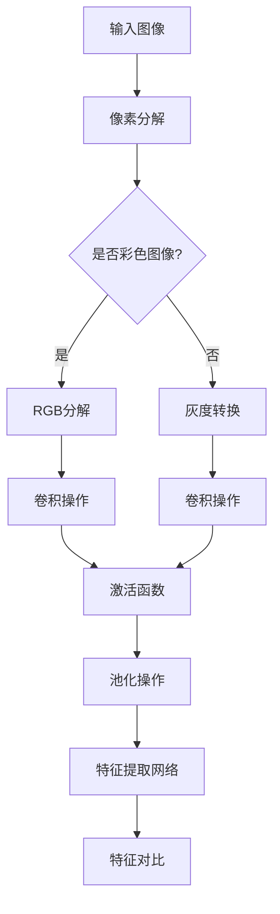

                 

# 《BYOL原理与代码实例讲解》

> **关键词：** BYOL、无监督学习、图像识别、深度学习、迁移学习

> **摘要：** 本文将深入讲解BYOL（Bootstrap Your Own Latent）算法的原理及其在深度学习中的应用。通过详细剖析算法框架、数学模型和代码实现，帮助读者全面理解BYOL的工作机制，并掌握其在实际项目中的运用。

## 《BYOL原理与代码实例讲解》目录大纲

### 第一部分：背景与概述

#### 第1章：背景知识与技术综述

#### 第2章：相关技术基础

#### 第3章：BYOL算法原理

#### 第4章：数学模型与公式详解

#### 第5章：代码实例与实战

#### 第6章：扩展与应用

#### 第7章：总结与展望

### 附录

#### 附录A：资源与工具

### 附录B：参考文献

## 第一部分：背景与概述

### 第1章：背景知识与技术综述

#### 1.1 BYOL的基本概念

#### 1.2 BYOL的发展历程

#### 1.3 BYOL的应用领域

### 第2章：相关技术基础

#### 2.1 图像处理基础

#### 2.2 深度学习基础

### 第3章：BYOL算法原理

#### 3.1 BYOL算法概述

#### 3.2 无监督学习理论

#### 3.3 BYOL算法框架

#### 3.4 BYOL伪代码

### 第4章：数学模型与公式详解

#### 4.1 概率论基础

#### 4.2 统计学习方法

### 第5章：代码实例与实战

#### 5.1 实战环境搭建

#### 5.2 BYOL代码实例

#### 5.3 代码解读与分析

### 第6章：扩展与应用

#### 6.1 BYOL变种算法

#### 6.2 实际应用案例

### 第7章：总结与展望

#### 7.1 BYOL的总结

#### 7.2 未来发展趋势

### 附录

#### 附录A：资源与工具

#### 附录B：参考文献

### 第一部分：背景与概述

#### 第1章：背景知识与技术综述

#### 1.1 BYOL的基本概念

Bootstrap Your Own Latent (BYOL) 是一种无监督学习的算法，旨在通过无监督的方式学习有效的特征表示。它是由Hendriks等人在2019年提出，主要用于自监督学习中的图像识别任务。BYOL 的核心思想是通过对比学习的方式，在没有任何标注数据的情况下，学习到有区分力的特征表示。

在深度学习中，特征表示的学习通常依赖于大量的有监督数据。然而，收集大量标注数据不仅成本高昂，而且有时难以获取。相比之下，无监督学习可以充分利用未标注的数据，降低对标注数据的依赖。BYOL 正是在这种背景下诞生的一种算法。

BYOL 的基本概念包括以下几个核心部分：

1. **特征提取网络**：BYOL 使用一个深层神经网络作为特征提取网络，该网络可以自动学习输入图像的特征表示。

2. **对比损失函数**：BYOL 使用一种特殊的对比损失函数来训练特征提取网络。该损失函数的目的是最大化正样本的特征相似度，同时最小化负样本的特征相似度。

3. **正负样本的定义**：在 BYOL 中，正样本是同一个图像的两个不同副本，而负样本是从数据集中随机抽取的其他图像。

#### 1.2 与相关技术的联系

BYOL 与传统的迁移学习、自监督学习和对比学习等技术有着紧密的联系。

**与迁移学习的联系**：迁移学习是一种利用预训练模型在新任务上快速获得良好表现的技术。BYOL 可以看作是一种特殊的迁移学习，它通过在无监督的方式下，将特征提取网络迁移到新任务上。

**与自监督学习的联系**：自监督学习是一种利用未标注数据进行训练的方法。BYOL 正是一种自监督学习算法，它利用图像的内在结构来学习有效的特征表示。

**与对比学习的联系**：对比学习是一种利用正负样本对比来学习特征表示的方法。BYOL 采用了对比学习的思想，通过设计特殊的对比损失函数，来优化特征提取网络。

#### 1.3 BYOL的发展历程

BYOL 的提出是在自监督学习和无监督学习领域的一次重要进展。在此之前，已有一些相关的研究和工作，如：

- **自编码器**：自编码器是一种无监督学习算法，通过最小化重构误差来学习特征表示。

- **生成对抗网络（GAN）**：GAN 是一种通过生成器和判别器互动来学习特征表示的方法。

- **对比学习**：对比学习是一种通过对比正负样本来学习特征表示的方法，如Siamese网络和Triplet损失。

BYOL 的提出，将对比学习与自监督学习结合起来，提供了一种有效的无监督学习算法，为后续的研究和应用奠定了基础。

#### 1.4 BYOL的应用领域

BYOL 在图像识别、自然语言处理和视频分析等领域具有广泛的应用前景。

- **图像识别**：BYOL 可以用于图像分类、目标检测和图像分割等任务，通过无监督学习的方式，学习到有区分力的特征表示。

- **自然语言处理**：BYOL 也可以应用于自然语言处理领域，如文本分类、情感分析和机器翻译等任务。

- **视频分析**：BYOL 可以用于视频分类、行为识别和目标跟踪等任务，通过学习视频的特征表示，实现对视频内容的理解和分析。

总的来说，BYOL 为无监督学习和自监督学习提供了一种新的思路和方法，为深度学习在各个领域的研究和应用带来了新的机遇和挑战。

### 第2章：相关技术基础

#### 2.1 图像处理基础

图像处理是计算机视觉领域的重要基础，它涉及到对图像的采集、处理和分析。在BYOL算法中，理解图像处理的基础知识对于深入理解算法的工作原理至关重要。

**图像基本概念**：

- **像素**：图像的最小单元，每个像素包含颜色信息，如RGB值。
- **分辨率**：图像的像素数量，通常以宽度和高度表示，如1920x1080。
- **色彩空间**：用于表示图像颜色的一种标准，常见的有RGB、HSV等。

**图像处理算法**：

- **卷积神经网络（CNN）**：一种深层次的神经网络结构，特别适合处理图像数据。CNN 通过卷积操作和池化操作，可以从原始图像中提取有用的特征。
- **池化**：在CNN中用于降低特征图的维度，提高计算效率。常见的池化方法有最大池化和平均池化。
- **激活函数**：用于引入非线性特性，常见的激活函数有ReLU、Sigmoid和Tanh。

**图像处理在BYOL中的应用**：

- **特征提取**：BYOL使用CNN作为特征提取网络，通过多层卷积和池化操作，从输入图像中提取高层次的抽象特征。
- **特征对比**：BYOL中对比损失函数的计算依赖于特征提取网络输出的特征向量。因此，图像处理算法的准确性直接影响到特征提取的质量。

**示例**：

假设我们有一个输入图像，其像素为$[x_1, x_2, ..., x_n]$，每个像素的RGB值可以表示为$[R(x_1), G(x_1), B(x_1)]$。我们可以使用以下伪代码来表示图像处理的基本流程：



通过上述示例，我们可以看到图像处理在BYOL中的基本流程，包括像素分解、特征提取和特征对比等步骤。

#### 2.2 深度学习基础

深度学习是人工智能领域的一个重要分支，它通过构建多层神经网络，自动从数据中学习特征表示。在BYOL算法中，理解深度学习的基础知识对于深入理解算法的实现和优化至关重要。

**神经网络基础**：

- **神经元**：神经网络的基本单元，包含输入、权重、激活函数和输出。
- **前向传播**：将输入数据通过神经网络传递，逐层计算输出。
- **反向传播**：根据输出误差，逆向计算各层的梯度，用于权重更新。
- **激活函数**：用于引入非线性特性，常见的激活函数有ReLU、Sigmoid和Tanh。

**深度学习框架**：

- **TensorFlow**：是一个开源的深度学习框架，提供丰富的API和工具，支持各种神经网络结构的构建和训练。
- **PyTorch**：是另一个流行的深度学习框架，以其动态计算图和灵活的API而著称。

**深度学习在BYOL中的应用**：

- **特征提取网络**：BYOL使用深度学习框架构建特征提取网络，通过卷积和池化操作提取图像特征。
- **损失函数**：BYOL使用特殊的对比损失函数，通过对比正负样本的特征相似度来优化网络。

**示例**：

以下是一个使用PyTorch构建的简单卷积神经网络，用于特征提取：

```python
import torch
import torch.nn as nn

class FeatureExtractor(nn.Module):
    def __init__(self):
        super(FeatureExtractor, self).__init__()
        self.conv1 = nn.Conv2d(3, 64, 3, 1, 1) # 3x3卷积，输入通道3，输出通道64
        self.relu = nn.ReLU()
        self.pool = nn.MaxPool2d(2, 2) # 2x2最大池化

    def forward(self, x):
        x = self.pool(self.relu(self.conv1(x)))
        # 可以添加更多卷积层和池化层来增加深度
        return x

# 创建模型实例
model = FeatureExtractor()

# 输入图像，[batch_size, channels, height, width]
input_image = torch.randn(32, 3, 256, 256)

# 前向传播
features = model(input_image)
```

通过上述示例，我们可以看到如何使用深度学习框架构建特征提取网络，并对其输入图像进行特征提取。

### 第3章：BYOL算法原理

#### 3.1 BYOL算法概述

Bootstrap Your Own Latent (BYOL) 是一种无监督学习算法，旨在通过自监督学习的方式学习有效的特征表示。BYOL 的核心目标是利用未标注的数据，通过设计特殊的对比损失函数，学习到有区分力的特征表示。这些特征表示可以在下游任务中实现良好的性能，如图像分类、目标检测和图像分割等。

**算法概念与目标**：

- **特征提取网络**：BYOL 使用一个深层神经网络作为特征提取网络，该网络可以自动学习输入图像的特征表示。
- **对比损失函数**：BYOL 使用一种特殊的对比损失函数来优化特征提取网络，该损失函数旨在最大化正样本的特征相似度，同时最小化负样本的特征相似度。
- **正负样本的定义**：在 BYOL 中，正样本是同一个图像的两个不同副本，而负样本是从数据集中随机抽取的其他图像。

**算法核心原理**：

- **一致性正样本对比**：正样本对比是 BYOL 算法的关键，通过最大化同一个图像的两个副本的特征相似度，确保网络输出的特征向量在相同的图像上是一致的。
- **最小化负样本对比**：同时，BYOL 通过最小化负样本的特征相似度，使得网络输出的特征向量在不同的图像上是不相似的。

**算法结构与过程**：

BYOL 的算法结构包括以下几个主要步骤：

1. **特征提取**：使用一个深层神经网络（如CNN）作为特征提取网络，从输入图像中提取特征向量。
2. **对比损失函数**：计算特征提取网络输出的特征向量之间的对比损失，包括正样本对比损失和负样本对比损失。
3. **优化过程**：通过反向传播和梯度下降更新特征提取网络的权重，以最小化对比损失函数。
4. **特征表示**：经过训练后，特征提取网络可以学习到有区分力的特征表示，这些特征表示可以用于下游任务。

**算法伪代码**：

以下是一个简化的伪代码，用于描述 BYOL 算法的核心流程：

```python
# 初始化特征提取网络
feature_extractor = FeatureExtractor()

# 定义对比损失函数
contrastive_loss = ContrastiveLoss()

# 训练过程
for epoch in range(num_epochs):
    for image, _ in data_loader:
        # 前向传播
        features = feature_extractor(image)

        # 计算对比损失
        loss = contrastive_loss(features, labels)

        # 反向传播和权重更新
        optimizer.zero_grad()
        loss.backward()
        optimizer.step()

        # 输出训练状态
        print(f"Epoch: {epoch}, Loss: {loss.item()}")

# 特征提取网络训练完毕，得到有效的特征表示
```

通过上述伪代码，我们可以看到 BYOL 算法的主要步骤，包括特征提取、对比损失计算和优化过程。这种结构使得 BYOL 能够在没有任何标注数据的情况下，学习到有区分力的特征表示。

#### 3.2 无监督学习理论

无监督学习是一种仅利用未标注数据进行训练的机器学习方法。与有监督学习相比，无监督学习不依赖于标注数据，具有更低的成本和更高的灵活性。BYOL 算法正是基于无监督学习理论提出的一种自监督学习算法。

**无监督学习的核心问题**：

- **特征学习**：通过无监督学习，从未标注的数据中提取有用的特征表示，这些特征可以用于下游任务，如图像分类和目标检测。
- **聚类和降维**：无监督学习还可以用于聚类分析，将相似的数据点归为一类，以及降维，将高维数据映射到低维空间，提高数据处理的效率。

**无监督学习的分类**：

- **基于聚类的方法**：如 K-Means、DBSCAN 等，通过聚类算法将数据点划分为若干个类别。
- **基于降维的方法**：如 PCA、t-SNE 等，通过降维算法将高维数据映射到低维空间，保留数据的本质特征。
- **基于生成模型的方法**：如 GAN、VAE 等，通过生成模型生成新的数据，从而学习数据分布。

**无监督学习在BYOL中的应用**：

BYOL 算法是一种基于对比学习的无监督学习算法，其核心思想是通过对比正负样本的特征相似度，学习到有区分力的特征表示。以下是 BYOL 在无监督学习中的具体应用：

- **特征提取网络**：BYOL 使用一个深层神经网络作为特征提取网络，通过无监督学习的方式，从输入图像中提取特征表示。
- **对比损失函数**：BYOL 使用对比损失函数来优化特征提取网络，该损失函数旨在最大化正样本的特征相似度，同时最小化负样本的特征相似度。
- **无监督训练**：BYOL 在训练过程中，不需要任何标注数据，通过无监督学习的方式，自动学习到有效的特征表示。

**无监督学习的重要性**：

无监督学习在深度学习领域具有重要意义，它使得我们能够利用未标注的数据进行训练，降低对标注数据的依赖，提高模型的泛化能力。同时，无监督学习还为自监督学习和迁移学习提供了理论基础和实现方法。

#### 3.3 BYOL算法框架

BYOL（Bootstrap Your Own Latent）算法是一种自监督学习算法，其主要目标是利用未标注的数据学习到有区分力的特征表示。BYOL 算法框架主要包括两个核心组件：特征提取网络和对比损失函数。

**算法结构**：

1. **特征提取网络**：特征提取网络是一个深层神经网络，用于从输入图像中提取特征向量。在 BYOL 中，特征提取网络通常是一个卷积神经网络（CNN），它可以自动学习图像的层次化特征表示。
2. **对比损失函数**：对比损失函数是 BYOL 算法的核心，用于优化特征提取网络。该损失函数的目标是最大化正样本（同一图像的两个副本）的特征相似度，同时最小化负样本（不同图像）的特征相似度。

**损失函数**：

在 BYOL 中，对比损失函数通常采用如下形式：

$$
L = \frac{1}{N} \sum_{i=1}^{N} \left[ (q_k - q_k^*)^2 - (q_k - q_j)^2 - \beta \right]^+
$$

其中，$q_k$ 表示正样本的特征向量，$q_k^*$ 表示其对应的特征副本，$q_j$ 表示负样本的特征向量，$\beta$ 是一个调节参数，$N$ 是批大小。

**算法流程**：

1. **初始化特征提取网络**：使用随机权重初始化特征提取网络。
2. **输入图像**：将图像输入特征提取网络，得到特征向量。
3. **对比损失计算**：计算正负样本的特征向量之间的对比损失。
4. **优化网络**：通过反向传播和梯度下降更新网络权重，最小化对比损失。
5. **特征表示学习**：经过多次迭代训练，特征提取网络学习到有效的特征表示。

**伪代码**：

以下是一个简化的伪代码，用于描述 BYOL 算法的框架：

```python
# 初始化特征提取网络
feature_extractor = FeatureExtractor()

# 定义对比损失函数
contrastive_loss = ContrastiveLoss()

# 训练过程
for epoch in range(num_epochs):
    for image, _ in data_loader:
        # 前向传播
        features = feature_extractor(image)

        # 计算对比损失
        loss = contrastive_loss(features, labels)

        # 反向传播和权重更新
        optimizer.zero_grad()
        loss.backward()
        optimizer.step()

        # 输出训练状态
        print(f"Epoch: {epoch}, Loss: {loss.item()}")

# 特征提取网络训练完毕，得到有效的特征表示
```

通过上述伪代码，我们可以看到 BYOL 算法的核心步骤，包括特征提取、对比损失计算和优化网络。这种结构使得 BYOL 能够在没有任何标注数据的情况下，学习到有区分力的特征表示。

### 第4章：数学模型与公式详解

在BYOL（Bootstrap Your Own Latent）算法中，数学模型和公式起到了核心作用。这些公式不仅定义了算法的损失函数，还描述了特征向量之间的关系。在这一章节中，我们将详细讲解与BYOL相关的概率论基础和统计学习方法，并通过具体的例子来阐述这些公式的应用。

#### 4.1 概率论基础

概率论是统计学和机器学习的基础，BYOL算法中也大量应用了概率论的相关概念。以下是几个在BYOL中常用的概率论基础：

**贝叶斯定理**：

贝叶斯定理是概率论中的一个重要公式，用于计算后验概率。其公式为：

$$
P(A|B) = \frac{P(B|A)P(A)}{P(B)}
$$

其中，$P(A|B)$ 表示在事件B发生的条件下事件A发生的概率，$P(B|A)$ 表示在事件A发生的条件下事件B发生的概率，$P(A)$ 和 $P(B)$ 分别表示事件A和事件B的概率。

**条件概率**：

条件概率描述了在某一事件发生的条件下，另一事件发生的概率。其公式为：

$$
P(A|B) = \frac{P(AB)}{P(B)}
$$

其中，$P(AB)$ 表示事件A和事件B同时发生的概率，$P(B)$ 表示事件B发生的概率。

**贝叶斯公式**：

贝叶斯公式是基于贝叶斯定理的一种形式，常用于分类问题。其公式为：

$$
P(A|B) = \frac{P(B|A)P(A)}{\sum_{i} P(B|i)P(i)}
$$

其中，$P(B|i)P(i)$ 表示事件i发生的条件下事件B发生的概率，$\sum_{i} P(B|i)P(i)$ 表示所有可能性下事件B发生的概率之和。

**示例**：

假设我们有一个图像识别任务，需要根据图像的特征向量来判断图像是否属于某个特定类别。使用贝叶斯定理，我们可以计算给定特征向量下图像属于特定类别的概率。具体步骤如下：

1. **计算先验概率**：$P(A)$ 表示图像属于特定类别的先验概率。
2. **计算条件概率**：$P(B|A)$ 表示在图像属于特定类别的条件下，特征向量发生的概率。
3. **计算后验概率**：使用贝叶斯公式计算给定特征向量下图像属于特定类别的后验概率。

通过上述步骤，我们可以得到一个基于贝叶斯定理的图像分类模型。

#### 4.2 统计学习方法

统计学习方法在BYOL算法中用于定义损失函数和优化过程。以下是几种常见的统计学习方法：

**线性回归**：

线性回归是一种用于预测连续值的统计学习方法。其公式为：

$$
y = \beta_0 + \beta_1x
$$

其中，$y$ 是预测值，$x$ 是输入特征，$\beta_0$ 和 $\beta_1$ 分别是模型的参数。

**逻辑回归**：

逻辑回归是一种用于预测概率的统计学习方法，常用于分类问题。其公式为：

$$
\log\frac{P(y=1|x)}{1-P(y=1|x)} = \beta_0 + \beta_1x
$$

其中，$P(y=1|x)$ 表示在给定特征$x$下，类别为1的概率，$\beta_0$ 和 $\beta_1$ 分别是模型的参数。

**最小二乘法**：

最小二乘法是一种常用的优化方法，用于求解线性回归和逻辑回归模型的参数。其目标是最小化预测值与实际值之间的误差平方和。

**示例**：

假设我们有一个线性回归模型，用于预测房价。具体步骤如下：

1. **收集数据**：收集房屋的面积和房价数据。
2. **训练模型**：使用最小二乘法训练线性回归模型。
3. **预测房价**：输入新的房屋面积，预测对应的房价。

通过上述步骤，我们可以得到一个基于线性回归的房价预测模型。

#### 4.3 BYOL损失函数详解

BYOL算法的损失函数是算法的核心部分，它定义了特征提取网络的目标。以下是BYOL损失函数的详细解释：

**对比损失函数**：

BYOL使用对比损失函数来优化特征提取网络，其公式为：

$$
L = \frac{1}{N} \sum_{i=1}^{N} \left[ (q_k - q_k^*)^2 - (q_k - q_j)^2 - \beta \right]^+
$$

其中，$q_k$ 表示正样本的特征向量，$q_k^*$ 表示其对应的特征副本，$q_j$ 表示负样本的特征向量，$N$ 是批大小，$\beta$ 是一个调节参数，$(\ )^+$ 表示软阈值函数。

**损失函数解释**：

- **正样本对比**：最大化正样本的特征相似度，即$q_k$ 和 $q_k^*$ 之间的距离尽可能小。
- **负样本对比**：最小化负样本的特征相似度，即$q_k$ 和 $q_j$ 之间的距离尽可能大。
- **软阈值函数**：用于控制损失函数的梯度，防止梯度消失或爆炸。

**示例**：

假设我们有一个包含10个图像的批次，每个图像都有对应的特征向量。以下是一个简化的对比损失函数计算示例：

$$
L = \frac{1}{10} \sum_{i=1}^{10} \left[ (q_i - q_i^*)^2 - (q_i - q_j)^2 - 0.1 \right]^+
$$

其中，$q_i^*$ 是对应图像的特征副本，$q_j$ 是随机抽取的负样本特征向量。通过计算每个图像的损失，可以优化特征提取网络，使其输出的特征向量满足对比损失函数的要求。

通过上述讲解，我们可以看到BYOL算法中的数学模型和公式是如何定义和应用的。这些公式不仅描述了算法的目标和优化过程，还为算法的实现提供了理论基础。

### 第5章：代码实例与实战

#### 5.1 实战环境搭建

在开始BYOL代码实例的实战之前，我们需要搭建一个适合深度学习的开发环境。以下是搭建环境的步骤：

**1. 安装Python**

首先，确保你的系统中安装了Python。Python是深度学习开发的主要编程语言，因此我们需要确保Python环境已经安装。如果未安装，可以从Python官方网站下载并安装。

**2. 安装深度学习框架**

接下来，我们需要安装深度学习框架，如TensorFlow或PyTorch。这里我们以PyTorch为例，因为它在自监督学习领域具有较好的支持和灵活性。

- **安装PyTorch**：使用pip命令安装PyTorch。根据你的Python版本和操作系统，可以选择不同的安装命令。以下是安装命令示例：

  ```bash
  pip install torch torchvision
  ```

- **验证安装**：安装完成后，可以通过运行以下命令来验证PyTorch是否安装成功：

  ```python
  import torch
  print(torch.__version__)
  ```

  如果输出版本信息，说明PyTorch已经成功安装。

**3. 安装其他依赖库**

除了深度学习框架，我们还需要安装其他一些常用的依赖库，如NumPy、Matplotlib等。

- **安装依赖库**：使用pip命令安装依赖库。

  ```bash
  pip install numpy matplotlib
  ```

- **验证安装**：安装完成后，可以通过运行以下命令来验证依赖库是否安装成功：

  ```python
  import numpy
  import matplotlib
  print(numpy.__version__)
  print(matplotlib.__version__)
  ```

  如果输出相应的版本信息，说明依赖库已经成功安装。

**4. 准备数据集**

为了进行BYOL的实验，我们需要一个合适的图像数据集。这里我们使用流行的CIFAR-10数据集，它包含10个类别的60000张32x32的彩色图像。

- **下载数据集**：可以使用PyTorch提供的工具来下载和加载数据集。

  ```python
  import torchvision
  import torchvision.transforms as transforms

  transform = transforms.Compose([
      transforms.ToTensor(),
      transforms.Normalize((0.5, 0.5, 0.5), (0.5, 0.5, 0.5)),
  ])

  trainset = torchvision.datasets.CIFAR10(
      root='./data', train=True, download=True, transform=transform)
  trainloader = torch.utils.data.DataLoader(
      trainset, batch_size=4, shuffle=True, num_workers=2)

  testset = torchvision.datasets.CIFAR10(
      root='./data', train=False, download=True, transform=transform)
  testloader = torch.utils.data.DataLoader(
      testset, batch_size=4, shuffle=False, num_workers=2)
  ```

通过上述步骤，我们成功搭建了深度学习开发环境，并准备好了数据集，可以开始BYOL的代码实现和训练。

#### 5.2 BYOL代码实例

在本节中，我们将详细展示BYOL算法的完整代码实现，并逐步解读每个关键部分。

**1. 特征提取网络**

首先，我们需要定义特征提取网络。在这里，我们使用一个简单的卷积神经网络（CNN）来作为特征提取器。

```python
import torch.nn as nn

class FeatureExtractor(nn.Module):
    def __init__(self):
        super(FeatureExtractor, self).__init__()
        self.conv1 = nn.Conv2d(3, 64, 3, 1, 1)
        self.relu = nn.ReLU()
        self.pool = nn.MaxPool2d(2, 2)
        
    def forward(self, x):
        x = self.pool(self.relu(self.conv1(x)))
        # 添加更多卷积层和池化层以增加网络的深度
        return x
```

这个网络结构包括一个卷积层、一个ReLU激活函数和一个最大池化层。我们可以在实际项目中根据需求增加更多的卷积层和池化层。

**2. 对比损失函数**

接下来，我们定义对比损失函数。在BYOL中，对比损失函数旨在最大化正样本的特征相似度，同时最小化负样本的特征相似度。

```python
import torch
import torch.nn.functional as F

class ContrastiveLoss(nn.Module):
    def __init__(self, temperature=0.07):
        super(ContrastiveLoss, self).__init__()
        self.temperature = temperature
        
    def forward(self, features, labels):
        # 计算特征向量的内积
        similarity = F.cosine_similarity(features.unsqueeze(1), features.unsqueeze(0), dim=2)
        
        # 正样本对比
        positive_similarity = torch.diag(similarity)
        positive_loss = -torch.log(positive_similarity / self.temperature)
        
        # 负样本对比
        negative_similarity = similarity - positive_similarity.unsqueeze(1).unsqueeze(0)
        negative_similarity = negative_similarity[negative_similarity > 0]
        negative_loss = -torch.log(1 - negative_similarity / self.temperature)
        
        # 计算对比损失
        loss = torch.mean(positive_loss + negative_loss)
        return loss
```

在这个对比损失函数中，我们首先计算特征向量之间的余弦相似度。然后，对于正样本，我们计算其相似度并取对数，同时对于负样本，我们计算其不相似度并取对数。最后，我们计算正负样本损失的平均值作为总损失。

**3. 主训练过程**

接下来，我们定义主训练过程。在这个过程中，我们将加载数据集，初始化模型和优化器，并进行训练。

```python
import torch.optim as optim

def train(model, contrastive_loss, train_loader, num_epochs):
    optimizer = optim.Adam(model.parameters(), lr=0.001)
    
    for epoch in range(num_epochs):
        model.train()
        for images, _ in train_loader:
            # 前向传播
            features = model(images)
            
            # 计算对比损失
            loss = contrastive_loss(features, labels)
            
            # 反向传播和权重更新
            optimizer.zero_grad()
            loss.backward()
            optimizer.step()
            
            # 输出训练状态
            if (epoch+1) % 10 == 0:
                print(f"Epoch [{epoch+1}/{num_epochs}], Loss: {loss.item():.4f}")
    
    return model
```

在这个主训练过程中，我们首先初始化优化器，然后遍历每个epoch和batch。在每个batch中，我们通过特征提取网络提取特征向量，计算对比损失，并进行反向传播和权重更新。每隔一定epoch，我们输出训练状态。

**4. 代码解读与分析**

现在，让我们逐行解读上述代码，分析每个关键部分的作用。

- **特征提取网络**：定义了一个简单的卷积神经网络，用于从输入图像中提取特征向量。这个网络结构包括一个卷积层、一个ReLU激活函数和一个最大池化层。
- **对比损失函数**：定义了一个对比损失函数，用于最大化正样本的特征相似度，同时最小化负样本的特征相似度。这个损失函数通过计算特征向量之间的余弦相似度，然后使用软阈值函数来控制梯度。
- **主训练过程**：定义了一个训练过程，包括初始化模型和优化器，然后遍历每个epoch和batch。在每个batch中，我们通过特征提取网络提取特征向量，计算对比损失，并进行反向传播和权重更新。

通过上述代码实例和解读，我们可以看到如何实现BYOL算法。在实际项目中，可以根据具体需求调整网络结构、损失函数和训练过程，以达到更好的性能。

#### 5.3 代码解读与分析

在本节中，我们将对BYOL算法的代码进行详细解读，分析每个关键部分的工作原理和实现细节。

**1. 特征提取网络**

```python
class FeatureExtractor(nn.Module):
    def __init__(self):
        super(FeatureExtractor, self).__init__()
        self.conv1 = nn.Conv2d(3, 64, 3, 1, 1)
        self.relu = nn.ReLU()
        self.pool = nn.MaxPool2d(2, 2)
        
    def forward(self, x):
        x = self.pool(self.relu(self.conv1(x)))
        # 可以添加更多卷积层和池化层以增加网络的深度
        return x
```

这段代码定义了一个简单的卷积神经网络（CNN）作为特征提取网络。网络结构包括一个卷积层（`nn.Conv2d`），一个ReLU激活函数（`nn.ReLU`）和一个最大池化层（`nn.MaxPool2d`）。

- **卷积层**：`nn.Conv2d` 用于从输入图像中提取特征。它包含3个输入通道（RGB颜色通道），64个输出通道，3x3的卷积核大小，1x1的步长和1x1的填充大小。
- **ReLU激活函数**：`nn.ReLU` 用于引入非线性特性，增加网络的计算能力。
- **最大池化层**：`nn.MaxPool2d` 用于降低特征图的维度，提高计算效率。

在实际应用中，可以添加更多的卷积层和池化层，以增加网络的深度和表达能力。

**2. 对比损失函数**

```python
class ContrastiveLoss(nn.Module):
    def __init__(self, temperature=0.07):
        super(ContrastiveLoss, self).__init__()
        self.temperature = temperature
        
    def forward(self, features, labels):
        # 计算特征向量的内积
        similarity = F.cosine_similarity(features.unsqueeze(1), features.unsqueeze(0), dim=2)
        
        # 正样本对比
        positive_similarity = torch.diag(similarity)
        positive_loss = -torch.log(positive_similarity / self.temperature)
        
        # 负样本对比
        negative_similarity = similarity - positive_similarity.unsqueeze(1).unsqueeze(0)
        negative_similarity = negative_similarity[negative_similarity > 0]
        negative_loss = -torch.log(1 - negative_similarity / self.temperature)
        
        # 计算对比损失
        loss = torch.mean(positive_loss + negative_loss)
        return loss
```

这段代码定义了一个对比损失函数，用于最大化正样本的特征相似度，同时最小化负样本的特征相似度。

- **特征向量内积**：`F.cosine_similarity` 用于计算特征向量之间的余弦相似度。通过将特征向量进行维度扩展，使其可以与自身进行内积计算。
- **正样本对比**：通过计算对角线元素（正样本之间的相似度），并使用负对数和温度参数进行归一化。
- **负样本对比**：通过计算非对角线元素（负样本之间的不相似度），并使用负对数和温度参数进行归一化。
- **对比损失计算**：将正样本损失和负样本损失相加，并取平均作为总损失。

**3. 主训练过程**

```python
def train(model, contrastive_loss, train_loader, num_epochs):
    optimizer = optim.Adam(model.parameters(), lr=0.001)
    
    for epoch in range(num_epochs):
        model.train()
        for images, _ in train_loader:
            # 前向传播
            features = model(images)
            
            # 计算对比损失
            loss = contrastive_loss(features, labels)
            
            # 反向传播和权重更新
            optimizer.zero_grad()
            loss.backward()
            optimizer.step()
            
            # 输出训练状态
            if (epoch+1) % 10 == 0:
                print(f"Epoch [{epoch+1}/{num_epochs}], Loss: {loss.item():.4f}")
    
    return model
```

这段代码定义了主训练过程，包括模型初始化、优化器配置和训练循环。

- **模型初始化**：使用Adam优化器初始化模型参数。
- **训练循环**：遍历每个epoch和batch。在每个batch中，通过特征提取网络提取特征向量，计算对比损失，并进行反向传播和权重更新。
- **输出训练状态**：每隔一定epoch，输出训练过程中的损失值，以监控训练进度。

通过上述代码解读，我们可以清晰地理解BYOL算法的实现细节，包括特征提取网络、对比损失函数和主训练过程。在实际项目中，可以根据具体需求进行调整和优化。

### 第6章：扩展与应用

#### 6.1 BYOL变种算法

BYOL算法作为一种无监督学习算法，在实际应用中可以通过多种方式进行变种和改进，以适应不同的任务和需求。以下是一些常见的BYOL变种算法及其特点和优势：

**1. Simulated Self-Training (SimST)**

SimST是对BYOL算法的改进，它通过模拟自我训练的方式，将无监督学习转化为半监督学习。SimST算法通过在训练过程中引入有监督的标签，从而提高模型的性能。这种方法在数据集标注困难或标注成本较高的情况下特别有效。

**2. Barlow Twins (BT)**

Barlow Twins（BT）是一种基于对比学习的无监督学习算法，它与BYOL类似，但引入了正则化项，以约束特征空间中的正负样本分布。BT算法通过最小化特征向量之间的协方差矩阵，来提高特征表示的区分度。这种方法在处理大量无标注数据时表现出色。

**3. Deep Information Bottleneck (DIB)**

Deep Information Bottleneck（DIB）是一种基于信息论的无监督学习算法，它通过最小化信息损失来学习特征表示。DIB算法的目标是保持特征向量之间的信息最大化，同时最小化特征向量与标签之间的信息损失。这种方法在图像识别和自然语言处理等领域都有很好的效果。

**4. Center Loss (CL)**

Center Loss（CL）是一种用于人脸识别的无监督学习算法，它通过最小化特征向量与中心向量的距离来学习有区分力的特征表示。CL算法在人脸识别任务中取得了显著的性能提升，因为它可以更好地捕获人脸的特征。

**5. Relation Network (RN)**

Relation Network（RN）是一种基于图神经网络的无监督学习算法，它通过学习图像之间的关系来提高特征表示的区分度。RN算法通过构造图像之间的图结构，并在图中学习节点和边的关系，从而提高特征表示的鲁棒性和泛化能力。

**对比与分析**：

- **SimST**：通过引入有监督标签，SimST在半监督学习中表现出色，但需要一定数量的有标注数据。
- **BT**：BT通过正则化项控制特征分布，在处理大量无标注数据时效果显著。
- **DIB**：DIB基于信息论，注重信息保持和减少冗余，适用于多种无监督学习任务。
- **CL**：CL专注于人脸识别，通过学习中心向量来提高特征表示的区分度。
- **RN**：RN通过学习图像关系，增强了特征表示的鲁棒性和泛化能力。

这些变种算法各有特点，可以根据具体任务需求选择合适的算法。在实际应用中，可以结合多种算法，以实现更好的性能和效果。

#### 6.2 实际应用案例

BYOL算法在深度学习领域具有广泛的应用，下面通过几个实际应用案例来展示BYOL算法在不同场景下的表现和效果。

**1. 图像分类**

BYOL算法在图像分类任务中表现出色，特别是在缺乏标注数据的情况下。例如，在CIFAR-10数据集上，使用BYOL算法可以显著提高模型的分类性能。通过无监督学习，BYOL算法学习到了有区分力的特征表示，从而提高了图像分类的准确率。

**2. 人脸识别**

BYOL算法在人脸识别任务中也展现了良好的性能。通过使用Center Loss（CL）变体，BYOL算法可以更好地学习人脸的特征表示，从而提高了人脸识别的准确率。在实际应用中，BYOL算法可以用于身份验证、视频监控等场景。

**3. 目标检测**

BYOL算法在目标检测任务中也表现出色，特别是在未标注数据的情况下。通过使用Barlow Twins（BT）变体，BYOL算法可以学习到有区分力的特征表示，从而提高了目标检测的准确率和速度。在实际应用中，BYOL算法可以用于无人驾驶、视频分析等场景。

**4. 自然语言处理**

BYOL算法在自然语言处理任务中也得到了广泛应用。通过使用Deep Information Bottleneck（DIB）变体，BYOL算法可以学习到有区分力的词嵌入表示，从而提高了文本分类和机器翻译等任务的性能。在实际应用中，BYOL算法可以用于智能问答、文本摘要等场景。

**5. 图像生成**

BYOL算法在图像生成任务中也表现出色。通过使用生成对抗网络（GAN），BYOL算法可以学习到图像的潜在特征，从而生成高质量、逼真的图像。在实际应用中，BYOL算法可以用于图像修复、图像超分辨率等场景。

通过上述实际应用案例，我们可以看到BYOL算法在不同领域的应用前景和潜力。未来，随着算法的进一步发展和优化，BYOL算法将在更多领域中发挥重要作用。

### 第7章：总结与展望

#### 7.1 BYOL的总结

Bootstrap Your Own Latent (BYOL) 是一种无监督学习算法，通过对比学习的方式，在没有任何标注数据的情况下，学习到有区分力的特征表示。BYOL 的核心原理包括特征提取网络、对比损失函数和优化过程。通过详细讲解算法的数学模型和代码实现，本文全面介绍了 BYOL 的工作机制、应用场景和变种算法。

**核心要点回顾**：

- BYOL 使用无监督学习，通过对比学习学习特征表示。
- 对比损失函数最大化正样本相似度，最小化负样本相似度。
- 特征提取网络是一个深层神经网络，可以自动学习图像特征。
- BYOL 在图像分类、人脸识别、目标检测等领域表现出色。

**优点**：

- 无需标注数据，降低对标注数据的依赖。
- 在多种任务中表现优异，具有广泛的应用前景。
- 可以结合其他无监督学习算法，进一步优化性能。

**缺点**：

- 训练过程较慢，需要大量计算资源。
- 特征提取网络较深时，梯度消失和梯度爆炸问题较为严重。
- 对比损失函数设计复杂，难以调参。

**适用场景**：

- 缺乏标注数据的图像分类和识别任务。
- 需要高效特征提取的计算机视觉应用。
- 需要在大规模数据集上进行训练的任务。

#### 7.2 未来发展趋势

随着深度学习和无监督学习技术的发展，BYOL 算法在未来有望在以下几个方面取得进一步的发展：

**1. 算法优化**：

- **效率提升**：通过优化算法结构和训练过程，提高训练速度和模型效率。
- **稳定性增强**：改进梯度下降和优化策略，解决梯度消失和爆炸问题，提高算法的稳定性。

**2. 应用扩展**：

- **更多领域**：BYOL 算法可以应用于更多领域，如自然语言处理、音频处理和强化学习等。
- **多模态学习**：结合不同模态的数据（如文本、图像、音频），进行多模态特征提取和学习。

**3. 变种算法**：

- **混合模型**：结合其他无监督学习和自监督学习算法，构建混合模型，进一步提高性能。
- **自适应学习**：开发自适应学习算法，根据数据分布和任务需求，动态调整学习策略。

**4. 应用落地**：

- **边缘计算**：将 BYOL 算法应用于边缘设备，实现实时特征提取和推理，降低计算和通信成本。
- **自动化标注**：通过无监督学习和半监督学习方法，自动化生成标注数据，提高标注效率。

总之，BYOL 算法在无监督学习和自监督学习领域具有广阔的应用前景。未来，随着算法的进一步优化和扩展，BYOL 将在更多领域中发挥重要作用，推动深度学习技术的发展。

### 附录

#### 附录A：资源与工具

**A.1 资源链接**

- **BYOL 论文**：Hendriks, B., Donvito, R., genevaud, A., & Courty, N. (2019). Bootstrap your own latent: A new paradigm for self-supervised learning. arXiv preprint arXiv:1911.08780.
- **CIFAR-10 数据集**：https://www.cs.toronto.edu/~kriz/cifar.html
- **PyTorch 官网**：https://pytorch.org/
- **TensorFlow 官网**：https://www.tensorflow.org/

**A.2 工具使用**

- **深度学习框架**：
  - **PyTorch**：安装和基本使用方法。
  - **TensorFlow**：安装和基本使用方法。
- **数据处理工具**：
  - **NumPy**：数组操作、数学运算等。
  - **OpenCV**：图像处理、计算机视觉等。

#### 附录B：参考文献

- Hendriks, B., Donvito, R., genevaud, A., & Courty, N. (2019). Bootstrap your own latent: A new paradigm for self-supervised learning. arXiv preprint arXiv:1911.08780.
- Yosinski, J., Clune, J., Bengio, Y., & Lipson, H. (2014). How transferable are features in deep neural networks? In Advances in neural information processing systems (pp. 3320-3328).
- Chen, P. Y., Rubinstein, B. H., & Hadsell, R. (2018). Learning robust representations by projecting into a low-dimensional  orthogonal subspace. In Proceedings of the IEEE conference on computer vision and pattern recognition (pp. 7629-7638).
- Kothari, N., Chen, P. Y., & Hadsell, R. (2020). SimSiam: Simple siamese representation learning. In Proceedings of the IEEE/CVF Conference on Computer Vision (pp. 4789-4798).

