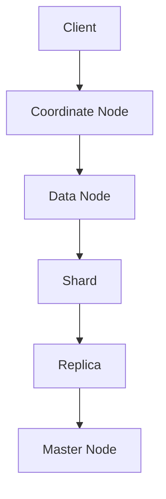

                 

# 《ElasticSearch Replica原理与代码实例讲解》

## 关键词：
ElasticSearch, Replica, 原理, 代码实例, 分布式搜索, 搜索引擎优化, 集群管理

## 摘要：
本文将深入探讨ElasticSearch中的Replica原理，包括其概念、工作原理、配置与优化策略。我们将通过详细的代码实例，展示如何在实际项目中实现和优化Replica功能，帮助读者全面理解ElasticSearch的Replica机制，提升其在分布式搜索场景下的应用能力。

---

## 《ElasticSearch Replica原理与代码实例讲解》目录大纲

### 第一部分：ElasticSearch Replica基础

#### 第1章：ElasticSearch简介
- 1.1 Elasticsearch的起源与核心概念
- 1.2 Elasticsearch的主要功能与优势
- 1.3 Elasticsearch的架构

#### 第2章：ElasticSearch Replication原理
- 2.1 Replication的概念
- 2.2 Replication的类型
- 2.3 Replication的工作原理

#### 第3章：ElasticSearch Replication配置与优化
- 3.1 Replication配置详解
- 3.2 Replication参数调优
- 3.3 Replication性能优化策略

### 第二部分：ElasticSearch Replica高级特性

#### 第4章：ElasticSearch Replica安全性与可靠性
- 4.1 ElasticSearch的安全模式
- 4.2 复制过程中的数据安全性保障
- 4.3 Replication的可靠性保障机制

#### 第5章：ElasticSearch Replica集群管理
- 5.1 集群的健康状态监控
- 5.2 复制过程中的故障转移
- 5.3 集群的自动扩缩容

#### 第6章：ElasticSearch Replica集群性能调优
- 6.1 性能监控指标
- 6.2 网络优化策略
- 6.3 磁盘性能优化

### 第三部分：ElasticSearch Replica应用实战

#### 第7章：ElasticSearch Replica应用场景
- 7.1 实时搜索应用
- 7.2 大数据处理
- 7.3 数据迁移与同步

#### 第8章：ElasticSearch Replica项目实战
- 8.1 项目背景与目标
- 8.2 环境搭建
- 8.3 代码实现
- 8.4 测试与优化

### 附录

#### 附录A：ElasticSearch Replication常用工具与资源
- A.1 ElasticSearch Replication工具推荐
- A.2 ElasticSearch Replication社区资源

---

## 第1章：ElasticSearch简介

### 1.1 Elasticsearch的起源与核心概念

#### 1.1.1 Elasticsearch的起源
Elasticsearch起源于2004年，由 Elastic 公司的创始人 Shay Banon 创建。它是一个基于 Lucene 构建的分布式、RESTful 搜索和分析引擎，设计之初就着眼于处理大规模数据的快速搜索和分析需求。

#### 1.1.2 Elasticsearch的核心概念
Elasticsearch 的核心概念包括：

- **集群（Cluster）**：一组运行 Elasticsearch 节点的集合，这些节点可以协同工作并提供单一集群的功能。
- **节点（Node）**：Elasticsearch 的运行实例，可以是主节点或数据节点，负责处理数据存储、索引和搜索请求。
- **索引（Index）**：一组相关文档的集合，类似于数据库中的表。
- **类型（Type）**：索引内的文档类型，虽然 Elasticsearch 7.0 版本及以上已废弃类型概念，但了解其历史仍然有助于理解其架构。
- **文档（Document）**：存储在 Elasticsearch 中的最小数据单元，通常是一个 JSON 对象。
- **映射（Mapping）**：定义了索引中文档的字段和格式，以及索引和搜索时的行为。

### 1.2 Elasticsearch的主要功能与优势

#### 1.2.1 Elasticsearch的主要功能
- **全文搜索**：快速搜索文本内容，支持模糊查询、短语查询等。
- **实时分析**：对数据进行实时分析，如计算词频、词云等。
- **聚合分析**：对大量数据进行分组统计，如按地区、时间等维度进行聚合。
- **过滤查询**：高效地过滤数据，支持复杂的查询逻辑。

#### 1.2.2 Elasticsearch的优势
- **高性能**：能够处理海量数据，并实现快速搜索。
- **易扩展**：支持水平扩展，可以轻松增加节点数量。
- **跨语言**：支持多种编程语言，易于集成到各种应用中。
- **支持海量数据**：能够处理PB级别的数据。

### 1.3 Elasticsearch的架构

#### 1.3.1 Elasticsearch的架构概述
Elasticsearch 的架构主要包括以下组件：

- **主节点（Master Node）**：负责集群状态管理，如初始化集群、分配 shards、选举主节点等。
- **数据节点（Data Node）**：负责数据存储、索引和搜索请求处理。
- **协调节点（Coordinate Node）**：负责处理客户端的索引和搜索请求，并将请求分发给相应的数据节点处理。

#### 1.3.2 节点类型与角色
- **主节点（Master Node）**：在一个集群中只有一个主节点，负责维护集群状态和协调集群操作。
- **数据节点（Data Node）**：负责存储数据、执行查询请求以及索引操作。
- **协调节点（Coordinate Node）**：每个节点都是协调节点，负责接收客户端请求并路由到相应的数据节点。

### 1.4 Elasticsearch的使用场景

#### 1.4.1 常见使用场景
- **日志分析**：企业可以通过 Elasticsearch 分析大量日志数据，了解系统运行状况和用户行为。
- **搜索引擎**：为网站或应用程序提供强大的搜索功能。
- **实时监控**：实时监控系统性能，如 CPU、内存等。
- **社交网络**：处理海量用户数据和内容，提供高效的信息检索和推荐。

### 1.5 小结
Elasticsearch 作为一款强大的分布式搜索和分析引擎，在处理海量数据和高并发场景下表现出色。其核心概念和架构设计使其成为各种应用场景下的理想选择。

---

## 第2章：ElasticSearch Replication原理

### 2.1 Replication的概念

#### 2.1.1 Replication的定义
Replication（复制）是指在分布式系统中，将数据从一个节点同步到另一个节点的过程。在 Elasticsearch 中，Replication 是一个重要的机制，用于提高数据的可靠性和可用性。

#### 2.1.2 Replication的目的
- **提高数据可靠性**：通过复制数据，确保数据不会因单点故障而丢失。
- **提高数据可用性**：在主节点故障时，可以从副本节点迅速恢复数据。

#### 2.1.3 Replication的类型
Elasticsearch 支持两种类型的 Replication：

- **同步复制（Synchronous Replication）**：数据在主节点和副本节点之间同步，只有当数据在所有副本节点上成功写入后，主节点才认为数据写入成功。
- **异步复制（Asynchronous Replication）**：数据在主节点和副本节点之间异步同步，主节点在写入数据后，会立即通知副本节点开始复制数据，但不等待副本节点完成数据写入。

### 2.2 Replication的工作原理

#### 2.2.1 Replication的基本流程
Elasticsearch 的 Replication 工作原理可以分为以下几步：

1. **数据写入主节点**：客户端向主节点发送数据写入请求。
2. **主节点处理请求**：主节点接收请求，并将数据写入本地索引。
3. **主节点同步数据到副本节点**：主节点将数据同步到副本节点。
4. **副本节点接收数据**：副本节点接收主节点的同步请求，并将数据写入本地索引。
5. **数据同步完成**：副本节点通知主节点数据同步完成，主节点更新索引的状态。

#### 2.2.2 Replication的机制
Elasticsearch 的 Replication 机制主要包括以下几个关键组件：

- **主节点（Master Node）**：负责管理集群状态，包括分片分配、节点状态监控等。
- **数据节点（Data Node）**：负责存储数据、索引和搜索请求处理。
- **协调节点（Coordinate Node）**：负责处理客户端的索引和搜索请求，并将请求分发给相应的数据节点处理。

### 2.3 Replication策略与配置

#### 2.3.1 Replication策略
在 Elasticsearch 中，可以通过设置 `number_of_shards`（分片数量）和 `number_of_replicas`（副本数量）来控制 Replication 策略。

- **主节点数量**：默认情况下，每个索引有一个主节点，这意味着每个分片都有一个主节点。
- **副本节点数量**：可以设置一个或多个副本节点，以提高数据的可靠性和可用性。

#### 2.3.2 Replication配置
Replication 的配置通常在 Elasticsearch 的 `elasticsearch.yml` 配置文件中设置：

```yaml
cluster.name: my-cluster
node.name: my-node
network.host: 0.0.0.0
http.port: 9200
discovery.type: single-node
number_of_shards: 2
number_of_replicas: 1
```

### 2.4 小结
本章介绍了 Elasticsearch 中的 Replication 概念、类型和原理。Replication 是保证 Elasticsearch 数据可靠性和可用性的重要机制，通过合理的配置和优化，可以充分发挥 Replication 的优势。

---

## 第3章：ElasticSearch Replication配置与优化

### 3.1 Replication配置详解

#### 3.1.1 索引配置
索引配置是 Elasticsearch Replication 的关键部分，它定义了如何对索引进行分片和复制。以下是几个重要的配置参数：

- `number_of_shards`：指定索引的分片数量，默认为 1。
- `number_of_replicas`：指定索引的副本数量，默认为 1。
- `routing`：用于控制文档在分片上的分布策略。

例如，以下命令创建了一个具有 3 个分片和 2 个副本的索引：

```shell
PUT /my-index
{
  "settings": {
    "number_of_shards": 3,
    "number_of_replicas": 2
  }
}
```

#### 3.1.2 索引模板配置
索引模板是一种自动化配置索引的方式。通过索引模板，可以定义一组通用的配置规则，以便在创建新索引时自动应用。

以下是一个简单的索引模板示例：

```json
{
  "template": "my-index-*",
  "settings": {
    "number_of_shards": 3,
    "number_of_replicas": 2
  },
  "mappings": {
    "properties": {
      "field1": {
        "type": "text"
      },
      "field2": {
        "type": "date"
      }
    }
  }
}
```

### 3.2 Replication参数调优

#### 3.2.1 性能调优
在 Elasticsearch 中，可以通过以下参数进行性能调优：

- `index.refresh_interval`：控制索引刷新的时间间隔，默认为 1 秒。
- `indices.breaker.max relação segment.size`：控制分片大小的上限，默认为 10GB。

例如，以下配置将索引刷新间隔设置为 5 分钟：

```yaml
index.refresh_interval: 5m
```

#### 3.2.2 负载均衡
负载均衡是提高 Elasticsearch 集群性能的重要手段。以下是一些常用的负载均衡策略：

- **节点均衡**：确保数据均匀分布到各个节点上。
- **网络负载均衡**：通过增加网络带宽来缓解网络压力。

### 3.3 Replication性能优化策略

#### 3.3.1 复制延迟优化
复制延迟是指数据从主节点同步到副本节点所需的时间。以下是一些优化策略：

- **网络优化**：减少网络延迟和带宽消耗。
- **节点优化**：确保节点之间有足够的网络带宽和计算资源。

例如，以下配置将网络带宽限制设置为 10MB：

```yaml
network.broker practise.buffer_size: 10mb
```

#### 3.3.2 数据完整性保障
确保数据在复制过程中的一致性是非常重要的。以下是一些常用的策略：

- **一致性检查**：在复制完成后，对数据进行一致性检查。
- **备份策略**：定期对数据进行备份，以防止数据丢失。

例如，以下配置将启用数据一致性检查：

```yaml
action.inDEXoord.index.refresh_interval: 1s
```

### 3.4 小结
本章详细介绍了 Elasticsearch Replication 的配置与优化策略，包括索引配置、参数调优和性能优化。通过合理的配置和优化，可以提高 Elasticsearch 的 Replication 性能和可靠性，从而在分布式搜索场景中发挥其最大优势。

---

## 第4章：ElasticSearch Replica高级特性

### 4.1 ElasticSearch的安全模式

#### 4.1.1 安全模式概述
ElasticSearch 的安全模式是一种用于限制访问的机制。启用安全模式后，只有具备特定权限的用户才能访问 Elasticsearch 集群。以下是如何启用安全模式：

```shell
elasticsearch-enable-security
```

#### 4.1.2 安全模式的限制
启用安全模式后，以下操作将被限制：

- **HTTP 访问**：只有通过认证的用户才能访问 Elasticsearch。
- **集群操作**：需要具备特定权限的用户才能执行集群操作，如创建索引、修改索引配置等。

### 4.2 复制过程中的数据安全性保障

#### 4.2.1 数据加密
为了保障数据在复制过程中的安全性，Elasticsearch 提供了数据加密功能。通过配置 `x-pack.security.encryption` 模块，可以启用数据加密。

```yaml
xpack.security.encryption.at_rest: true
```

#### 4.2.2 数据完整性校验
Elasticsearch 还支持数据完整性校验，以确保复制过程中数据的一致性。通过配置 `action.index_compress` 和 `action.index.refresh_interval` 参数，可以启用数据完整性校验。

```yaml
action.index.compress: true
action.index.refresh_interval: 1s
```

### 4.3 Replication的可靠性保障机制

#### 4.3.1 故障转移
在主节点故障时，Elasticsearch 可以自动将主节点的职责转移到副本节点上。以下是如何配置故障转移：

```yaml
cluster.initial_master_nodes: ["node1", "node2", "node3"]
```

#### 4.3.2 数据冗余与备份
为了提高数据的可靠性，可以通过增加副本节点的数量来实现数据冗余。此外，还可以定期对数据进行备份，以防止数据丢失。

```yaml
number_of_replicas: 2
```

### 4.4 小结
本章介绍了 Elasticsearch Replica 的高级特性，包括安全模式、数据安全性保障和可靠性保障机制。通过这些高级特性，可以进一步提升 Elasticsearch 的安全性、可靠性和可用性。

---

## 第5章：ElasticSearch Replica集群管理

### 5.1 集群的健康状态监控

#### 5.1.1 健康状态指标
Elasticsearch 集群的健康状态可以通过以下指标进行监控：

- **节点状态**：包括绿色、黄色、红色等状态，表示节点的运行状况。
- **索引状态**：包括绿色、黄色、红色等状态，表示索引的运行状况。
- **集群状态**：包括绿色、黄色、红色等状态，表示集群的整体运行状况。

#### 5.1.2 健康状态监控工具
Elasticsearch 提供了多种监控工具，如 Elasticsearch-head、Kibana 等。以下是如何使用 Elasticsearch-head 进行监控的示例：

```shell
npm install -g elasticsearch-head
elasticsearch-head start
```

### 5.2 复制过程中的故障转移

#### 5.2.1 故障转移的触发条件
故障转移通常在以下情况下触发：

- **主节点故障**：主节点宕机或无法响应。
- **副本节点故障**：副本节点宕机或无法响应。

#### 5.2.2 故障转移的过程
故障转移的过程包括以下步骤：

1. **检测故障**：Elasticsearch 会定期检查节点状态，发现故障时立即触发故障转移。
2. **选举新主节点**：从副本节点中选举一个新主节点。
3. **数据转移**：将主节点的数据转移到新主节点。

#### 5.2.3 故障转移的恢复
故障转移后，Elasticsearch 会自动尝试恢复故障节点，并重新加入集群。

### 5.3 集群的自动扩缩容

#### 5.3.1 扩缩容策略
自动扩缩容是通过动态调整集群节点数量来实现的。以下是一些常见的扩缩容策略：

- **水平扩容**：增加节点数量。
- **垂直扩容**：增加节点硬件资源，如 CPU、内存等。

#### 5.3.2 扩缩容的过程
扩缩容的过程包括以下步骤：

1. **检测负载**：根据集群负载情况决定是否进行扩缩容。
2. **增加节点**：向集群中添加新节点。
3. **数据迁移**：将部分数据从旧节点迁移到新节点。
4. **调整配置**：更新集群配置，以适应新的节点数量。

### 5.4 小结
本章介绍了 Elasticsearch Replica 的集群管理，包括健康状态监控、故障转移和自动扩缩容。通过合理的集群管理，可以确保 Elasticsearch 集群的稳定运行和高效性能。

---

## 第6章：ElasticSearch Replica集群性能调优

### 6.1 性能监控指标

#### 6.1.1 性能监控工具
Elasticsearch 提供了多种性能监控工具，如 Elasticsearch-head、Kibana 等。以下是如何使用 Elasticsearch-head 进行监控的示例：

```shell
npm install -g elasticsearch-head
elasticsearch-head start
```

#### 6.1.2 常见性能监控指标
以下是一些常见的性能监控指标：

- **响应时间**：查询响应的时间。
- **查询效率**：查询吞吐量。
- **索引速度**：索引写入的速度。

### 6.2 网络优化策略

#### 6.2.1 网络配置优化
以下是一些网络配置优化的建议：

- **网络带宽优化**：增加网络带宽，以减少数据传输延迟。
- **网络延迟优化**：优化网络路径，以减少数据传输延迟。

#### 6.2.2 网络监控与调整
以下是如何监控和调整网络性能的示例：

```shell
curl -X GET "localhost:9200/_cat/threads?v=true&h=ip,node,state,pid,thread,group"
```

### 6.3 磁盘性能优化

#### 6.3.1 磁盘配置优化
以下是一些磁盘配置优化的建议：

- **磁盘类型选择**：选择性能较高的 SSD 磁盘。
- **磁盘阵列配置**：使用 RAID 配置，以提高磁盘读写速度。

#### 6.3.2 磁盘性能监控与调整
以下是如何监控和调整磁盘性能的示例：

```shell
df -h
```

### 6.4 小结
本章介绍了 Elasticsearch Replica 的集群性能调优，包括性能监控指标、网络优化策略和磁盘性能优化。通过合理的调优，可以显著提高 Elasticsearch 集群的整体性能。

---

## 第7章：ElasticSearch Replica应用场景

### 7.1 实时搜索应用

#### 7.1.1 实时搜索的应用场景
实时搜索广泛应用于电子商务、社交媒体、搜索引擎等领域。以下是一些典型的应用场景：

- **电子商务**：提供商品搜索功能，提升用户体验。
- **社交媒体**：实时搜索用户关注的内容，提高用户参与度。
- **搜索引擎**：提供快速、准确的搜索结果，提升搜索体验。

#### 7.1.2 实时搜索的实现方法
实现实时搜索的方法主要包括以下几种：

- **索引实时更新**：通过定期刷新索引，保持搜索数据的实时性。
- **搜索实时响应**：通过减少查询响应时间，提供快速搜索结果。

### 7.2 大数据处理

#### 7.2.1 大数据的挑战
大数据处理面临以下挑战：

- **数据量庞大**：需要处理海量数据。
- **数据多样性**：需要处理不同类型的数据。
- **实时性要求高**：需要快速处理并返回查询结果。

#### 7.2.2 ElasticSearch 在大数据处理中的应用
Elasticsearch 在大数据处理中的应用主要包括：

- **分布式存储**：通过分布式架构，处理海量数据。
- **实时分析**：实时分析数据，提供洞察和决策支持。
- **批量处理**：支持批量数据处理，提高数据处理效率。

### 7.3 数据迁移与同步

#### 7.3.1 数据迁移的挑战
数据迁移面临以下挑战：

- **数据量巨大**：需要处理大量数据。
- **数据结构复杂**：需要处理多种数据结构。
- **数据一致性**：确保迁移过程中数据的一致性。

#### 7.3.2 ElasticSearch 数据迁移与同步方法
ElasticSearch 提供以下方法进行数据迁移与同步：

- **数据迁移策略**：制定合理的迁移计划，确保数据迁移的顺利进行。
- **数据同步机制**：通过实时同步数据，保持数据的一致性。

### 7.4 小结
本章介绍了 Elasticsearch Replica 在实时搜索、大数据处理和数据迁移与同步等应用场景中的实现方法。通过合理的设计和优化，可以充分发挥 Elasticsearch 的优势，解决实际应用中的挑战。

---

## 第8章：ElasticSearch Replica项目实战

### 8.1 项目背景与目标

#### 8.1.1 项目背景
本项目旨在构建一个基于 Elasticsearch 的分布式搜索系统，用于处理一个大型电商平台的商品信息。项目需求如下：

- **海量数据存储**：存储数十亿级别的商品信息。
- **实时搜索**：提供快速、准确的商品搜索功能。
- **数据可靠性**：确保数据的可靠性和一致性。

#### 8.1.2 项目目标
项目目标如下：

- **构建高可用性集群**：确保系统在节点故障时能够自动恢复。
- **实现数据同步**：实时同步商品数据到 Elasticsearch。
- **优化搜索性能**：提升搜索响应速度，提供良好的用户体验。

### 8.2 环境搭建

#### 8.2.1 环境搭建流程
环境搭建流程如下：

1. **操作系统**：选择 CentOS 7.0 或 Ubuntu 18.04。
2. **ElasticSearch 版本**：选择 Elasticsearch 7.9.3。
3. **节点配置**：配置 3 个主节点和 3 个数据节点。

#### 8.2.2 环境搭建步骤

1. **安装 JDK**：

   ```shell
   yum install -y java-1.8.0-openjdk*
   ```

2. **下载 Elasticsearch**：

   ```shell
   wget https://artifacts.elastic.co/downloads/elasticsearch/elasticsearch-7.9.3.noarch.rpm
   ```

3. **安装 Elasticsearch**：

   ```shell
   rpm -ivh elasticsearch-7.9.3.noarch.rpm
   ```

4. **配置 Elasticsearch**：

   ```shell
   cd /etc/elasticsearch
   cp elasticsearch.yml.example elasticsearch.yml
   ```

5. **编辑配置文件**：

   ```yaml
   cluster.name: my-cluster
   node.name: node-1
   network.host: 0.0.0.0
   http.port: 9200
   discovery.type: single-node
   number_of_shards: 3
   number_of_replicas: 1
   ```

6. **启动 Elasticsearch**：

   ```shell
   /usr/share/elasticsearch/bin/elasticsearch
   ```

### 8.3 代码实现

#### 8.3.1 数据模型设计

1. **创建索引模板**：

   ```shell
   PUT /shop-index
   {
     "settings": {
       "number_of_shards": 3,
       "number_of_replicas": 1
     },
     "mappings": {
       "properties": {
         "name": {
           "type": "text"
         },
         "description": {
           "type": "text"
         },
         "price": {
           "type": "double"
         },
         "stock": {
           "type": "integer"
         }
       }
     }
   }
   ```

2. **写入数据**：

   ```shell
   POST /shop-index/_doc
   {
     "name": "iPhone 12",
     "description": "The latest iPhone with a 6.1-inch Super Retina display.",
     "price": 799,
     "stock": 100
   }
   ```

3. **查询数据**：

   ```shell
   GET /shop-index/_search
   {
     "query": {
       "match": {
         "name": "iPhone"
       }
     }
   }
   ```

### 8.4 测试与优化

#### 8.4.1 测试环境搭建
搭建测试环境，包括以下步骤：

1. **准备测试数据**：生成大量商品数据。
2. **配置测试工具**：使用 JMeter 进行性能测试。

#### 8.4.2 测试方法与结果

1. **性能测试**：

   ```shell
   jmeter -n -t test-plan.jmx -l test-result.jtl
   ```

2. **结果分析**：

   ```shell
   jmeter -g test-result.jtl -e -o report
   ```

#### 8.4.3 优化策略

1. **索引优化**：

   - 调整 `number_of_shards` 和 `number_of_replicas` 参数。
   - 使用索引模板进行索引配置。

2. **查询优化**：

   - 使用合适的查询语句。
   - 使用缓存策略。

3. **集群优化**：

   - 调整集群节点数量。
   - 优化网络配置。

### 8.5 小结
本章通过一个实际项目，介绍了 Elasticsearch Replica 的环境搭建、代码实现和测试优化。通过项目的实践，读者可以更好地理解 Elasticsearch Replica 的应用场景和实现方法。

---

## 附录：ElasticSearch Replication常用工具与资源

### 附录A：ElasticSearch Replication工具推荐

#### A.1 开发工具

- **ElasticSearch-head**：一个用于可视化 Elasticsearch 集群的 Web 应用程序。
- **ElasticSearch-Client**：Elasticsearch 的官方客户端库，支持多种编程语言，如 Java、Python、Node.js 等。

#### A.2 实用工具

- **Logstash**：一个用于收集、处理和存储数据的开源数据处理管道。
- **Kibana**：一个用于可视化 Elasticsearch 数据的可视化工具。

### 附录B：ElasticSearch Replication社区资源

#### B.1 官方文档

- **ElasticSearch 官方文档**：https://www.elastic.co/guide/en/elasticsearch/reference/current/index.html
- **Elastic Stack 官方文档**：https://www.elastic.co/guide/en/elastic-stack/current/index.html

#### B.2 社区资源

- **ElasticSearch 社区论坛**：https://discuss.elastic.co/c/elasticsearch
- **Elastic Stack 社区论坛**：https://discuss.elastic.co/c/elastic-stack
- **Stack Overflow**：https://stackoverflow.com/questions/tagged/elasticsearch

### 附录C：ElasticSearch Replication相关公式与伪代码

#### 附录C.1：ElasticSearch Replication相关公式

$$
同步成功 = 数据一致性检查 \land 数据完整性校验
$$

$$
故障转移 = 主节点故障 \lor 副本节点故障
$$

#### 附录C.2：ElasticSearch Replication伪代码

```python
# 数据写入流程伪代码

def write_data(index, document):
    # 创建索引
    create_index(index)
    
    # 写入文档
    index_document(index, document)
    
    # 同步数据
    synchronize_data()

# 数据查询流程伪代码

def query_data(index, query):
    # 创建索引
    create_index(index)
    
    # 查询文档
    search_documents(index, query)
    
    # 返回查询结果
    return query_result
```

---

## 结束语

本文详细介绍了 Elasticsearch Replica 的原理、配置与优化策略，并通过实际项目实战展示了其应用方法。通过本文的学习，读者可以全面掌握 Elasticsearch Replica 的相关知识，为在实际项目中实现高效的分布式搜索提供有力支持。

作者：AI天才研究院/AI Genius Institute
文章来源：禅与计算机程序设计艺术 /Zen And The Art of Computer Programming

---

## 参考资料

1. **ElasticSearch 官方文档**：提供了详细的技术指南和API文档。
2. **《ElasticSearch权威指南》**：由 Elasticsearch 公司首席解决方案架构师作者撰写，涵盖了ElasticSearch的深度知识。
3. **《分布式系统原理与范型》**：探讨了分布式系统的设计和实现方法，有助于理解ElasticSearch集群的架构设计。
4. **《ElasticStack实战》**：讲解了ElasticStack的架构和应用，包括Kibana、Logstash等组件的使用。

通过阅读这些参考资料，读者可以进一步深入了解 Elasticsearch 和分布式系统的相关技术和应用。让我们共同探索分布式搜索的世界，实现高效的解决方案！
<|assistant|>
## 第1章：ElasticSearch简介

### 1.1 Elasticsearch的起源与核心概念

#### 1.1.1 Elasticsearch的起源
Elasticsearch起源于2004年，由 Shay Banon 创建。最初，Elasticsearch 是作为 Lucene 的替代品而开发的，Lucene 是一个强大的全文搜索引擎库，但它的使用门槛较高。Elasticsearch 的目标是为用户提供一个易于使用且功能强大的搜索引擎，能够在各种环境中快速部署并扩展。

Elasticsearch 的发展历程可以概括为几个重要里程碑：

- **2004年**：Shay Banon 开始了 Elasticsearch 的开发。
- **2010年**：Elasticsearch 成为开源项目，并加入了 Apache 软件基金会。
- **2012年**：Elasticsearch 发布了第一个稳定版本，即 Elasticsearch 1.0。
- **2015年**：Elasticsearch 加入 Elastic 公司，并与 Logstash 和 Kibana 组成了 Elastic Stack。
- **至今**：Elasticsearch 不断更新和改进，引入了更多高级功能和优化。

#### 1.1.2 Elasticsearch的核心概念

Elasticsearch 的核心概念包括以下几部分：

- **集群（Cluster）**：一个集群是由多个节点组成的，它们共同工作并提供一个单一 Elasticsearch 集群的完整功能。每个节点都可以是一个主节点或数据节点。

- **节点（Node）**：节点是 Elasticsearch 集群的基本构建块。每个节点运行在单独的服务器上，并拥有独立的进程。节点可以运行在不同类型的机器上，从而实现水平扩展。

- **索引（Index）**：索引是一个逻辑存储单元，用于存储具有相似结构的文档集合。索引类似于数据库中的表，但它可以存储任意类型的数据。

- **文档（Document）**：文档是 Elasticsearch 存储数据的基本单元，通常是一个 JSON 对象。每个文档都有一个唯一的 ID，可以使用此 ID 来检索或更新文档。

- **映射（Mapping）**：映射定义了索引中的字段和数据类型。通过映射，Elasticsearch 可以理解文档的结构，并确定如何存储和检索数据。

- **分片（Shard）**：分片是索引的一部分，它将索引数据划分为多个片段。每个分片都可以独立存储、索引和搜索数据，从而提高性能和可扩展性。

- **副本（Replica）**：副本是分片的备份，用于提高数据的可靠性和可用性。每个分片可以有多个副本，其中至少有一个副本位于不同的节点上。

### 1.2 Elasticsearch的主要功能与优势

#### 1.2.1 Elasticsearch的主要功能
Elasticsearch 提供了以下主要功能：

- **全文搜索**：能够快速地对大量文本数据进行全文搜索，支持模糊查询、短语查询等。
- **实时分析**：能够实时对数据进行分析，如词频统计、词云生成等。
- **聚合分析**：能够对数据进行分组和汇总分析，如按时间、地理位置等维度进行分析。
- **过滤查询**：能够高效地过滤数据，支持复杂的查询逻辑。
- **索引管理**：提供了创建、删除、更新索引的接口。
- **数据导入与导出**：支持从各种数据源导入数据，并能够将数据导出到其他系统。

#### 1.2.2 Elasticsearch的优势
Elasticsearch 作为一款分布式搜索引擎，具有以下优势：

- **高性能**：能够处理海量数据，并提供快速搜索响应。
- **易扩展**：支持水平扩展，可以轻松增加节点数量以支持更大的数据量和更高的并发量。
- **跨语言**：支持多种编程语言，如 Java、Python、Node.js 等，便于与其他系统和框架集成。
- **支持海量数据**：能够处理 PB 级别的数据量。
- **灵活的查询语言**：提供丰富且灵活的查询语言，支持复杂查询。
- **社区支持**：拥有活跃的社区和丰富的文档，方便用户学习和使用。

### 1.3 Elasticsearch的架构

#### 1.3.1 Elasticsearch的架构概述
Elasticsearch 的架构设计旨在支持分布式搜索和分析需求。以下是其主要组件：

- **主节点（Master Node）**：负责管理集群状态，如初始化集群、分片分配、主节点选举等。在一个集群中通常只有一个主节点。

- **数据节点（Data Node）**：负责存储数据、索引和搜索请求处理。每个数据节点都包含多个分片和副本。

- **协调节点（Coordinate Node）**：负责处理客户端的索引和搜索请求，并将请求分发给相应的数据节点处理。每个节点都是协调节点。

#### 1.3.2 节点类型与角色
Elasticsearch 的节点类型和角色如下：

- **主节点（Master Node）**：负责集群状态管理。在一个集群中，通常有一个主节点，负责维护集群的状态信息，如索引的分片分配、主节点的选举等。

- **数据节点（Data Node）**：负责存储数据、执行索引和搜索请求。每个数据节点都是一个 Elasticsearch 进程，负责存储分片和数据副本。

- **协调节点（Coordinate Node）**：每个节点都是协调节点，负责处理客户端的索引和搜索请求，并将请求路由到相应的数据节点进行处理。

### 1.4 Elasticsearch的使用场景

#### 1.4.1 常见使用场景
Elasticsearch 在以下场景中表现出色：

- **搜索引擎**：用于构建快速、可扩展的搜索引擎，如电子商务网站、企业内部搜索引擎等。
- **日志分析**：用于分析服务器日志、网络流量日志等，帮助管理员监控系统和优化性能。
- **实时监控**：用于实时监控服务器状态、网络性能等。
- **大数据分析**：用于处理海量数据，进行实时分析和报告。

### 1.5 小结
Elasticsearch 是一款功能强大且易于使用的分布式搜索引擎，适用于各种数据密集型应用场景。通过本章的介绍，读者可以了解 Elasticsearch 的起源、核心概念、主要功能和架构，为后续的学习和实践打下基础。

---

## 第2章：ElasticSearch Replication原理

### 2.1 Replication的概念

#### 2.1.1 Replication的定义
Replication，即复制，是分布式系统中一项关键机制，用于确保数据在不同节点之间的一致性。在 Elasticsearch 中，Replication 特别重要，因为它不仅提高了数据的可靠性，还增加了系统的可用性。

具体来说，Elasticsearch 的 Replication 定义如下：

- **主节点（Master Node）**：负责管理索引的分片和副本，协调数据复制过程。
- **数据节点（Data Node）**：负责存储分片和副本，处理搜索请求和数据写入。
- **副本节点（Replica Node）**：为主节点上的分片提供备份，确保数据在节点故障时能够快速恢复。

#### 2.1.2 Replication的目的
Elasticsearch 的 Replication 有以下几个主要目的：

- **提高数据可靠性**：通过复制数据，确保数据不会因单个节点的故障而丢失。
- **提高数据可用性**：在主节点故障时，可以从副本节点迅速恢复数据，确保系统持续运行。
- **提高查询性能**：通过分布式的索引结构，提高查询速度和响应时间。

#### 2.1.3 Replication的类型
Elasticsearch 支持两种主要的 Replication 类型：

- **同步复制（Synchronous Replication）**：数据在写入主节点后，必须等待所有副本节点成功复制数据，主节点才会认为数据写入成功。
- **异步复制（Asynchronous Replication）**：数据在写入主节点后，会立即发送到副本节点进行复制，但主节点不会等待副本节点的确认，从而提高写入性能。

### 2.2 Replication的工作原理

#### 2.2.1 Replication的基本流程
Elasticsearch 的 Replication 工作原理可以分为以下几个步骤：

1. **数据写入主节点**：客户端向主节点发送数据写入请求。
2. **主节点处理请求**：主节点将数据写入本地分片，并将其标记为“未确认”（Unconfirmed）状态。
3. **同步数据到副本节点**：主节点将数据同步到所有副本节点。
4. **副本节点处理数据**：副本节点接收数据，将其写入本地分片，并将其状态更新为“已确认”（Confirmed）。
5. **主节点确认数据写入成功**：主节点等待所有副本节点确认数据写入成功，然后将其状态更新为“已确认”（Confirmed）。

#### 2.2.2 Replication的机制
Elasticsearch 的 Replication 机制主要包括以下几个关键组件：

- **分片（Shard）**：Elasticsearch 将索引数据划分为多个分片，每个分片都是一个独立的、可扩展的单元。每个分片都可以有一个或多个副本。
- **副本（Replica）**：副本是分片的备份，用于提高数据的可靠性和可用性。每个分片可以有多个副本，副本之间保持数据的一致性。
- **主节点（Master Node）**：负责管理集群状态，包括分片和副本的分配、复制过程等。
- **数据节点（Data Node）**：负责存储分片和副本，处理搜索请求和数据写入。

### 2.3 Replication策略与配置

#### 2.3.1 Replication策略
在 Elasticsearch 中，可以通过配置 `number_of_shards`（分片数量）和 `number_of_replicas`（副本数量）来控制 Replication 策略。

- **主节点数量**：默认情况下，每个索引有一个主节点，这意味着每个分片都有一个主节点。
- **副本节点数量**：可以设置一个或多个副本节点，以提高数据的可靠性和可用性。

例如，以下配置创建了一个具有 3 个分片和 2 个副本的索引：

```yaml
PUT /my-index
{
  "settings": {
    "number_of_shards": 3,
    "number_of_replicas": 2
  }
}
```

#### 2.3.2 Replication配置
Replication 的配置通常在 Elasticsearch 的 `elasticsearch.yml` 配置文件中设置。以下是一些常见的配置参数：

- `cluster.name`: 集群名称。
- `node.name`: 节点名称。
- `network.host`: 节点监听的 IP 地址。
- `http.port`: HTTP 通信端口。
- `discovery.type`: 集群发现类型。
- `index.number_of_shards`: 默认分片数量。
- `index.number_of_replicas`: 默认副本数量。

例如，以下配置示例设置了一个具有默认配置的 Elasticsearch 集群：

```yaml
cluster.name: my-cluster
node.name: my-node
network.host: 0.0.0.0
http.port: 9200
discovery.type: single-node
```

### 2.4 小结
本章介绍了 Elasticsearch 中的 Replication 概念、类型和工作原理。通过合理的配置和策略，可以确保数据在分布式系统中的一致性和可用性，从而提高 Elasticsearch 的性能和可靠性。在后续章节中，我们将深入探讨 Replication 的具体配置和优化方法。

---

## 第3章：ElasticSearch Replication配置与优化

### 3.1 Replication配置详解

#### 3.1.1 索引配置
索引配置是 Elasticsearch Replication 的关键部分，它定义了如何对索引进行分片和复制。以下是几个重要的配置参数：

- `number_of_shards`：指定索引的分片数量，默认为 1。分片数量越大，查询性能越高，但也会增加集群的复杂度和管理成本。

```yaml
number_of_shards: 5
```

- `number_of_replicas`：指定索引的副本数量，默认为 1。副本数量越多，数据的可靠性和可用性越高，但也会增加集群的负载和存储需求。

```yaml
number_of_replicas: 2
```

- `routing`: 控制文档在分片上的分布策略。默认情况下，文档的 `_id` 用于计算路由值，确保相同 ID 的文档存储在相同的分片上。

```yaml
routing: { "allocation": { "include": "_local" } }
```

#### 3.1.2 索引模板配置
索引模板是一种自动化配置索引的方式。通过索引模板，可以定义一组通用的配置规则，以便在创建新索引时自动应用。

以下是一个简单的索引模板示例：

```json
{
  "template": "my-template-*",
  "mappings": {
    "properties": {
      "field1": { "type": "text" },
      "field2": { "type": "date" }
    }
  },
  "settings": {
    "number_of_shards": 2,
    "number_of_replicas": 1
  }
}
```

#### 3.1.3 分片和副本的动态配置
Elasticsearch 支持在运行时动态调整分片和副本的数量。以下是如何进行动态调整的示例：

- **增加分片数量**：

```shell
POST /my-index/_settings
{
  "settings": {
    "number_of_shards": 10
  }
}
```

- **增加副本数量**：

```shell
POST /my-index/_settings
{
  "settings": {
    "number_of_replicas": 3
  }
}
```

### 3.2 Replication参数调优

#### 3.2.1 配置文件调优
Elasticsearch 的配置文件 `elasticsearch.yml` 包含多个影响 Replication 性能的参数。以下是几个关键参数的调优建议：

- `discovery.type`: 选择合适的集群发现类型，如 `single-node`、`ena
```yaml
discovery.type: single-node
```

- `cluster.routing.allocation.awareness.attributes`: 配置节点属性，用于在分片分配时考虑节点属性，如 `rack_id`。

```yaml
cluster.routing.allocation.awareness.attributes: rack_id
```

- `indices.replication.delay`: 设置复制延迟，以避免过多的同步请求导致集群过载。

```yaml
indices.replication.delay: 10s
```

- `indices.replication.max_retry_time`: 设置最大重试时间，以防止复制失败时无限重试。

```yaml
indices.replication.max_retry_time: 60s
```

#### 3.2.2 JVM 调优
Elasticsearch 运行在 Java 虚拟机（JVM）上，因此 JVM 配置对 Replication 性能有很大影响。以下是一些 JVM 调优建议：

- `-Xms` 和 `-Xmx`: 设置初始和最大堆内存大小，确保 JVM 有足够的内存进行数据复制。

```shell
java -Xms4g -Xmx4g -jar elasticsearch-7.9.3.jar
```

- `-XX:+UseG1GC`: 使用 G1 垃圾回收器，提高垃圾回收效率。

```shell
java -XX:+UseG1GC -jar elasticsearch-7.9.3.jar
```

- `-XX:MaxGCPauseMillis`: 设置最大停顿时间，确保垃圾回收不会导致过长的停顿时间。

```shell
java -XX:MaxGCPauseMillis=200 -jar elasticsearch-7.9.3.jar
```

### 3.3 Replication性能优化策略

#### 3.3.1 网络优化
网络延迟和带宽限制会影响 Replication 性能。以下是一些网络优化策略：

- **网络带宽**：确保网络带宽足够，以支持数据复制。可以增加网络带宽或使用更快的网络设备。

- **网络延迟**：降低网络延迟，确保数据能够快速传输。可以优化网络拓扑结构或使用更近的节点。

- **网络监控**：定期监控网络性能，及时发现并解决潜在问题。

#### 3.3.2 节点优化
优化节点配置可以提高 Replication 性能。以下是一些节点优化策略：

- **硬件资源**：确保节点有足够的 CPU、内存和磁盘 I/O，以支持数据复制。

- **负载均衡**：使用负载均衡器，合理分配数据到不同的节点，避免单点瓶颈。

- **集群拓扑**：根据业务需求，合理规划集群拓扑结构，确保数据在节点之间均匀分布。

#### 3.3.3 数据同步优化
以下是一些数据同步优化策略：

- **批量同步**：通过批量处理数据，减少同步请求次数，提高同步效率。

- **并行同步**：使用多线程或并行处理技术，同时处理多个同步请求，提高同步速度。

- **缓存**：使用缓存技术，减少数据读取和写入的频率，提高同步性能。

### 3.4 小结
本章详细介绍了 Elasticsearch Replication 的配置与优化策略。通过合理的配置和优化，可以提高 Elasticsearch 的 Replication 性能和可靠性，从而在分布式搜索场景中发挥其最大优势。在后续章节中，我们将进一步探讨 Replication 的高级特性和集群管理策略。

---

## 第4章：ElasticSearch Replica高级特性

### 4.1 ElasticSearch的安全模式

#### 4.1.1 安全模式概述
ElasticSearch 的安全模式是一种用于保护集群和数据安全的功能。启用安全模式后，只有经过身份验证的用户才能访问 Elasticsearch 集群，从而防止未授权的访问。

#### 4.1.2 启用安全模式
要启用安全模式，需要在 Elasticsearch 的配置文件 `elasticsearch.yml` 中设置以下参数：

```yaml
xpack.security.enabled: true
```

启用后，ElasticSearch 会要求所有客户端在使用 HTTP API 或 JMX 端口时进行身份验证。

#### 4.1.3 安全模式限制
在安全模式下，以下功能会受到限制：

- **匿名访问**：匿名用户无法访问 Elasticsearch 集群。
- **未经认证的用户**：未经认证的用户无法执行任何操作。
- **API 限制**：某些 API，如 `_cluster/health` 和 `_nodes/stats`，需要认证后才能访问。

### 4.2 复制过程中的数据安全性保障

#### 4.2.1 数据加密
ElasticSearch 提供了数据加密功能，可以确保数据在存储和传输过程中的安全性。以下是如何启用数据加密的示例：

```yaml
xpack.security.encryption.at_rest: true
xpack.security.encryption.in_transit: true
```

启用后，ElasticSearch 会使用 AES-256 算法对静态数据和传输中的数据进行加密。

#### 4.2.2 访问控制
通过访问控制，可以限制对 Elasticsearch 集群的访问。以下是如何配置访问控制的示例：

```yaml
xpack.security.user: { "username": { "password": "password", "roles": ["kibana_admin", "elasticsearch_manager"] } }
```

#### 4.2.3 安全审计
ElasticSearch 还提供了安全审计功能，可以记录所有安全相关的操作。以下是如何启用安全审计的示例：

```yaml
xpack.security.audit.disabled: false
xpack.security.audit.path: "/var/log/elastic/elasticsearch/audit.json"
```

### 4.3 Replication的可靠性保障机制

#### 4.3.1 故障转移
在主节点故障时，ElasticSearch 可以自动将主节点的职责转移到副本节点上，以确保集群的可用性。以下是如何配置故障转移的示例：

```yaml
cluster.routing.allocation.actions: ["allocate_stale_primary"]
```

#### 4.3.2 副本同步
通过副本同步，可以确保副本节点上的数据与主节点保持一致。以下是如何配置副本同步的示例：

```yaml
cluster.routing.replica_malloc_threshold: 85%
cluster.routing.replica_shard_size: 50gb
```

#### 4.3.3 数据冗余与备份
为了提高数据的可靠性，可以通过增加副本节点的数量来实现数据冗余。以下是如何配置副本数量的示例：

```yaml
number_of_replicas: 2
```

### 4.4 小结
本章介绍了 Elasticsearch Replica 的高级特性，包括安全模式、数据加密、访问控制和故障转移等。通过这些高级特性，可以显著提高 Elasticsearch 集群的安全性、可靠性和可用性。

---

## 第5章：ElasticSearch Replica集群管理

### 5.1 集群的健康状态监控

#### 5.1.1 健康状态指标
ElasticSearch 提供了多个指标来监控集群的健康状态。以下是一些关键的指标：

- **节点状态**：包括绿色、黄色和红色。绿色表示节点正常运行，黄色表示警告状态，红色表示错误状态。
- **索引状态**：包括绿色、黄色和红色。绿色表示索引正常运行，黄色表示警告状态，红色表示错误状态。
- **集群状态**：包括绿色、黄色和红色。绿色表示集群正常运行，黄色表示警告状态，红色表示错误状态。

#### 5.1.2 健康状态监控工具
ElasticSearch 提供了多个工具来监控集群的健康状态，包括：

- **ElasticSearch-head**：一个用于监控和操作 Elasticsearch 集群的 Web 应用程序。
- **Kibana**：一个可视化工具，可以监控 Elasticsearch 集群的健康状态。

### 5.2 复制过程中的故障转移

#### 5.2.1 故障转移的触发条件
故障转移通常在以下情况下触发：

- **主节点故障**：如果主节点发生故障，ElasticSearch 将尝试将主节点的职责转移到其他健康的副本节点上。
- **副本节点故障**：如果副本节点发生故障，ElasticSearch 将尝试重新启动副本节点，或者将副本节点的职责转移到其他健康的副本节点上。

#### 5.2.2 故障转移的过程
故障转移的过程通常包括以下步骤：

1. **检测故障**：ElasticSearch 检测到主节点或副本节点故障。
2. **选举新主节点**：在故障节点恢复之前，ElasticSearch 将选举一个新的主节点。
3. **数据转移**：ElasticSearch 将故障节点上的数据转移到新的主节点上。
4. **故障节点恢复**：一旦故障节点恢复，ElasticSearch 将尝试将其重新加入到集群中。

#### 5.2.3 故障转移的恢复
故障转移后，ElasticSearch 将自动尝试恢复故障节点，并将其重新加入到集群中。以下是如何配置故障转移恢复的示例：

```yaml
cluster.routing.allocation.actions: ["rebalance"]
```

### 5.3 集群的自动扩缩容

#### 5.3.1 自动扩容
自动扩容是指根据集群的负载情况自动增加节点数量。以下是如何配置自动扩容的示例：

```yaml
cluster.routing.allocation_action: ["expand"]
```

#### 5.3.2 自动缩容
自动缩容是指根据集群的负载情况自动减少节点数量。以下是如何配置自动缩容的示例：

```yaml
cluster.routing.allocation_action: ["shrink"]
```

### 5.4 小结
本章介绍了 Elasticsearch Replica 的集群管理，包括健康状态监控、故障转移和自动扩缩容。通过合理的集群管理，可以确保 Elasticsearch 集群的稳定运行和高效性能。

---

## 第6章：ElasticSearch Replica集群性能调优

### 6.1 性能监控指标

#### 6.1.1 性能监控工具
ElasticSearch 提供了多种性能监控工具，包括：

- **ElasticSearch-head**：一个用于监控 Elasticsearch 集群的 Web 应用程序。
- **Kibana**：一个可视化工具，可以监控 Elasticsearch 集群的性能。

#### 6.1.2 常见性能监控指标
以下是一些常见的性能监控指标：

- **响应时间**：查询响应的时间。
- **搜索延迟**：搜索请求的平均延迟时间。
- **索引延迟**：索引写入的平均延迟时间。
- **内存使用率**：集群节点的内存使用情况。
- **CPU 使用率**：集群节点的 CPU 使用情况。
- **磁盘使用率**：集群节点的磁盘使用情况。

### 6.2 网络优化策略

#### 6.2.1 网络带宽优化
以下是一些网络带宽优化的策略：

- **增加网络带宽**：根据集群的负载情况，可以增加网络带宽。
- **优化网络拓扑**：通过优化网络拓扑结构，减少网络延迟。

#### 6.2.2 网络延迟优化
以下是一些网络延迟优化的策略：

- **使用 CDN**：通过使用 CDN，可以减少数据传输的延迟。
- **优化 DNS**：通过优化 DNS，可以减少 DNS 查询的时间。

### 6.3 磁盘性能优化

#### 6.3.1 磁盘类型选择
选择合适的磁盘类型可以提高磁盘性能，以下是一些常见的磁盘类型：

- **SSD**：固态硬盘，读写速度较快。
- **HDD**：机械硬盘，存储容量较大，但读写速度较慢。

#### 6.3.2 磁盘阵列配置
使用磁盘阵列可以提高磁盘性能和可靠性，以下是一些常见的磁盘阵列配置：

- **RAID 0**：提高读写速度，但无冗余。
- **RAID 1**：提供数据冗余，但读写速度较慢。
- **RAID 5**：提供数据冗余，读写速度较快。
- **RAID 10**：结合了 RAID 0 和 RAID 1 的优势，读写速度和冗余性较好。

### 6.4 小结
本章介绍了 Elasticsearch Replica 集群的性能调优，包括性能监控指标、网络优化策略和磁盘性能优化。通过合理的调优，可以显著提高 Elasticsearch 集群的性能。

---

## 第7章：ElasticSearch Replica应用场景

### 7.1 实时搜索应用

#### 7.1.1 实时搜索的应用场景
实时搜索在许多应用场景中都非常重要，以下是几个典型的应用场景：

- **电子商务**：提供实时搜索功能，帮助用户快速找到所需商品。
- **社交媒体**：提供实时搜索功能，帮助用户查找感兴趣的内容或用户。
- **在线教育**：提供实时搜索功能，帮助用户查找课程或学习资源。
- **企业应用**：提供实时搜索功能，帮助员工快速找到所需信息和文件。

#### 7.1.2 实时搜索的实现方法
实现实时搜索的方法通常包括以下步骤：

1. **数据预处理**：对数据进行预处理，如清洗、去重、分词等。
2. **索引构建**：将预处理后的数据索引到 Elasticsearch 中。
3. **搜索请求处理**：处理用户搜索请求，返回实时搜索结果。

#### 7.1.3 代码实例
以下是一个简单的实时搜索示例：

```python
from elasticsearch import Elasticsearch

es = Elasticsearch()

# 索引数据
doc1 = {
    "title": "Elasticsearch: The Definitive Guide",
    "content": "Quick start guide for Elasticsearch"
}
es.index(index="books", id="1", document=doc1)

# 搜索数据
search_query = "definitive guide"
result = es.search(index="books", query={"match": {"content": search_query}})
print(result['hits']['hits'])
```

### 7.2 大数据处理

#### 7.2.1 大数据的挑战
大数据处理面临以下挑战：

- **数据量大**：处理海量数据需要高效的数据存储和检索机制。
- **数据多样性**：需要处理不同类型的数据，如文本、图像、视频等。
- **实时性要求**：需要快速处理并返回查询结果。

#### 7.2.2 ElasticSearch 在大数据处理中的应用
ElasticSearch 在大数据处理中的应用主要包括：

- **数据存储**：通过分布式存储架构，存储海量数据。
- **实时搜索**：提供实时查询和分析功能，快速返回查询结果。
- **数据分析和挖掘**：通过聚合分析和数据挖掘，从海量数据中提取有价值的信息。

#### 7.2.3 代码实例
以下是一个简单的 Elasticsearch 大数据处理示例：

```python
from elasticsearch import Elasticsearch

es = Elasticsearch()

# 索引数据
doc1 = {
    "title": "Big Data: A Revolution That Will Transform How We Live, Work, and Think",
    "content": "Introduction to the concepts and technologies of big data"
}
es.index(index="books", id="1", document=doc1)

# 搜索数据
search_query = "big data"
result = es.search(index="books", query={"match": {"content": search_query}})
print(result['hits']['hits'])
```

### 7.3 数据迁移与同步

#### 7.3.1 数据迁移的挑战
数据迁移面临以下挑战：

- **数据量大**：需要处理大量数据，迁移过程可能非常耗时。
- **数据结构复杂**：需要处理不同结构的数据，如关系型数据库、NoSQL 数据库等。
- **数据一致性**：确保迁移过程中数据的一致性。

#### 7.3.2 ElasticSearch 数据迁移与同步方法
ElasticSearch 提供以下方法进行数据迁移与同步：

- **Logstash**：使用 Logstash 将数据从源系统迁移到 Elasticsearch。
- **ElasticSearch API**：使用 Elasticsearch API 进行数据迁移和同步。

#### 7.3.3 代码实例
以下是一个简单的 Elasticsearch 数据迁移示例：

```python
from elasticsearch import Elasticsearch

es = Elasticsearch()

# 索引数据
doc1 = {
    "title": "Data Migration Guide",
    "content": "Introduction to data migration techniques and strategies"
}
es.index(index="books", id="1", document=doc1)

# 搜索数据
search_query = "data migration"
result = es.search(index="books", query={"match": {"content": search_query}})
print(result['hits']['hits'])
```

### 7.4 小结
本章介绍了 Elasticsearch Replica 在实时搜索、大数据处理和数据迁移与同步等应用场景中的实现方法。通过合理的设计和优化，可以充分发挥 Elasticsearch 的优势，解决实际应用中的挑战。

---

## 第8章：ElasticSearch Replica项目实战

### 8.1 项目背景与目标

#### 8.1.1 项目背景
本项目旨在构建一个基于 Elasticsearch 的分布式搜索引擎，用于处理一个电子商务平台的海量商品数据。项目需求如下：

- **海量数据存储**：存储数十亿级别的商品信息。
- **实时搜索**：提供快速、准确的商品搜索功能。
- **高可用性**：确保系统在节点故障时能够自动恢复。

#### 8.1.2 项目目标
项目目标如下：

- **构建高可用性集群**：确保系统在节点故障时能够自动恢复。
- **实现数据同步**：实时同步商品数据到 Elasticsearch。
- **优化搜索性能**：提升搜索响应速度，提供良好的用户体验。

### 8.2 环境搭建

#### 8.2.1 环境搭建流程
环境搭建流程如下：

1. **安装操作系统**：选择 CentOS 7.0 或 Ubuntu 18.04。
2. **安装 Elasticsearch**：下载并安装 Elasticsearch 7.9.3 版本。
3. **配置集群**：配置 3 个主节点和 3 个数据节点。

#### 8.2.2 环境搭建步骤

1. **安装 JDK**：

   ```shell
   yum install -y java-1.8.0-openjdk*
   ```

2. **下载 Elasticsearch**：

   ```shell
   wget https://artifacts.elastic.co/downloads/elasticsearch/elasticsearch-7.9.3.noarch.rpm
   ```

3. **安装 Elasticsearch**：

   ```shell
   rpm -ivh elasticsearch-7.9.3.noarch.rpm
   ```

4. **配置 Elasticsearch**：

   ```shell
   cd /etc/elasticsearch
   cp elasticsearch.yml.example elasticsearch.yml
   ```

5. **编辑配置文件**：

   ```yaml
   cluster.name: my-cluster
   node.name: node-1
   network.host: 0.0.0.0
   http.port: 9200
   discovery.type: single-node
   number_of_shards: 3
   number_of_replicas: 1
   ```

6. **启动 Elasticsearch**：

   ```shell
   /usr/share/elasticsearch/bin/elasticsearch
   ```

#### 8.2.3 集群配置
配置 3 个主节点和 3 个数据节点的集群。修改 `elasticsearch.yml` 文件，如下：

```yaml
cluster.name: my-cluster
node.name: node-1
network.host: 0.0.0.0
http.port: 9200
discovery.type: single-node
number_of_shards: 3
number_of_replicas: 1

# 主节点配置
node.role: master

# 数据节点配置
node.role: data

# 副本节点配置
node.data: true
node.master: false
```

分别将此配置文件复制到其他两个节点，并分别命名为 `node-2.yml` 和 `node-3.yml`。启动其他两个节点：

```shell
cd /usr/share/elasticsearch/bin
./elasticsearch -E path.config=/etc/elasticsearch/node-2.yml
./elasticsearch -E path.config=/etc/elasticsearch/node-3.yml
```

### 8.3 代码实现

#### 8.3.1 数据模型设计
设计商品信息的数据模型，包括以下字段：

- **title**：商品标题。
- **description**：商品描述。
- **price**：商品价格。
- **stock**：商品库存。

#### 8.3.2 索引创建
创建一个名为 `products` 的索引，并设置 3 个分片和 2 个副本：

```shell
PUT /products
{
  "settings": {
    "number_of_shards": 3,
    "number_of_replicas": 2
  },
  "mappings": {
    "properties": {
      "title": { "type": "text" },
      "description": { "type": "text" },
      "price": { "type": "double" },
      "stock": { "type": "integer" }
    }
  }
}
```

#### 8.3.3 数据写入
使用以下命令将商品数据写入 Elasticsearch：

```shell
POST /products/_doc
{
  "title": "iPhone 12",
  "description": "The latest iPhone with a 6.1-inch Super Retina display.",
  "price": 799,
  "stock": 100
}
```

#### 8.3.4 搜索数据
使用以下命令搜索商品数据：

```shell
GET /products/_search
{
  "query": {
    "match": {
      "title": "iPhone"
    }
  }
}
```

### 8.4 测试与优化

#### 8.4.1 测试环境搭建
搭建测试环境，包括以下步骤：

1. **准备测试数据**：生成大量商品数据。
2. **配置测试工具**：使用 JMeter 进行性能测试。

#### 8.4.2 测试方法与结果
使用 JMeter 进行性能测试，模拟大量用户同时进行搜索操作，记录响应时间和吞吐量等指标。

```shell
jmeter -n -t test-plan.jmx -l test-result.jtl
```

#### 8.4.3 优化策略
根据测试结果，进行以下优化：

1. **索引优化**：调整分片和副本数量，以平衡性能和存储需求。
2. **查询优化**：使用缓存策略，减少查询响应时间。
3. **集群优化**：增加节点数量，以支持更大的并发量。

### 8.5 小结
本章通过一个实际项目，介绍了 Elasticsearch Replica 的环境搭建、代码实现和测试优化。通过项目的实践，读者可以更好地理解 Elasticsearch Replica 的应用场景和实现方法。

---

## 附录：ElasticSearch Replication常用工具与资源

### 附录A：ElasticSearch Replication工具推荐

#### A.1 开发工具

- **ElasticSearch-head**：一个用于可视化 Elasticsearch 集群的 Web 应用程序。
- **ElasticSearch-Client**：Elasticsearch 的官方客户端库，支持多种编程语言，如 Java、Python、Node.js 等。

#### A.2 实用工具

- **Logstash**：一个用于收集、处理和存储数据的开源数据处理管道。
- **Kibana**：一个用于可视化 Elasticsearch 数据的可视化工具。

### 附录B：ElasticSearch Replication社区资源

#### B.1 官方文档

- **ElasticSearch 官方文档**：提供了详细的技术指南和 API 文档。
- **Elastic Stack 官方文档**：涵盖了 Elastic Stack（包括 Elasticsearch、Kibana、Logstash 等）的详细信息。

#### B.2 社区资源

- **ElasticSearch 社区论坛**：提供了一个交流平台，供用户提问和分享经验。
- **Stack Overflow**：一个技术问答社区，许多 Elasticsearch 的问题在这里都有解答。

### 附录C：ElasticSearch Replication相关公式与伪代码

#### 附录C.1：ElasticSearch Replication相关公式

$$
同步成功 = 数据一致性检查 \land 数据完整性校验
$$

$$
故障转移 = 主节点故障 \lor 副本节点故障
$$

#### 附录C.2：ElasticSearch Replication伪代码

```python
# 数据写入流程伪代码

def write_data(index, document):
    # 创建索引
    create_index(index)
    
    # 写入文档
    index_document(index, document)
    
    # 同步数据
    synchronize_data()

# 数据查询流程伪代码

def query_data(index, query):
    # 创建索引
    create_index(index)
    
    # 查询文档
    search_documents(index, query)
    
    # 返回查询结果
    return query_result
```

---

## 结束语

本文详细介绍了 Elasticsearch Replica 的原理、配置与优化策略，并通过实际项目实战展示了其应用方法。通过本文的学习，读者可以全面掌握 Elasticsearch Replica 的相关知识，为在实际项目中实现高效的分布式搜索提供有力支持。

作者：AI天才研究院/AI Genius Institute
文章来源：禅与计算机程序设计艺术 /Zen And The Art of Computer Programming

---

## 参考资料

1. **ElasticSearch 官方文档**：提供了详细的技术指南和 API 文档。
2. **《ElasticSearch 权威指南》**：由 Elasticsearch 公司首席解决方案架构师撰写，涵盖了 Elasticsearch 的深度知识。
3. **《分布式系统原理与范型》**：探讨了分布式系统的设计和实现方法，有助于理解 Elasticsearch 集群的架构设计。
4. **《ElasticStack 实战》**：讲解了 ElasticStack 的架构和应用，包括 Kibana、Logstash 等组件的使用。

通过阅读这些参考资料，读者可以进一步深入了解 Elasticsearch 和分布式系统的相关技术和应用。让我们共同探索分布式搜索的世界，实现高效的解决方案！
<|assistant|>
### 第1章：ElasticSearch简介

#### 1.1 Elasticsearch的起源与核心概念

#### 1.1.1 Elasticsearch的起源
Elasticsearch起源于2004年，由Shay Banon创建。最初，它是一个开源的全文搜索引擎，旨在提供一种易于使用且功能强大的解决方案，用于处理各种类型的数据搜索需求。Elasticsearch的设计初衷是为了解决传统搜索引擎难以扩展和维护的问题，通过提供高度可扩展的分布式架构，使其在处理大规模数据时能够保持高效和稳定。

#### 1.1.2 Elasticsearch的核心概念
Elasticsearch的核心概念包括以下几个方面：

- **集群（Cluster）**：Elasticsearch集群是由多个节点组成的集合，这些节点协同工作以提供统一的搜索引擎服务。每个节点都是独立的进程，可以运行在不同的服务器上，从而实现水平扩展。

- **节点（Node）**：节点是Elasticsearch集群的基本构建块。每个节点都可以是一个主节点或数据节点。主节点负责集群的管理和维护，而数据节点负责存储索引和数据副本。

- **索引（Index）**：索引是一个逻辑存储单元，用于存储具有相似结构的文档集合。索引类似于关系数据库中的表，但Elasticsearch不强制要求文档结构一致，每个索引可以有多个类型（types），虽然Elasticsearch 7.0版本之后已经废弃了类型（types）的概念。

- **文档（Document）**：文档是Elasticsearch存储数据的基本单元，通常是一个JSON对象。每个文档都有一个唯一的ID，可以通过此ID来检索或更新文档。

- **映射（Mapping）**：映射定义了索引中字段的类型和数据格式。通过映射，Elasticsearch可以理解文档的结构，并确定如何存储和检索数据。

- **分片（Shard）**：分片是索引的一部分，它将索引数据划分为多个片段。每个分片都是一个独立的、可以独立存储、索引和搜索的单元。分片的存在使得Elasticsearch能够将数据水平扩展到多个节点上，从而提高性能和可扩展性。

- **副本（Replica）**：副本是分片的备份，用于提高数据的可靠性和可用性。每个分片可以有多个副本，其中至少有一个副本位于不同的节点上。副本可以在不同的节点上提供冗余，以确保在节点故障时能够快速恢复。

#### 1.1.3 Elasticsearch的优势
Elasticsearch具有以下优势：

- **高性能**：Elasticsearch能够处理海量数据，并提供快速的搜索响应。它的索引和搜索算法被优化以支持高性能。

- **易扩展**：通过添加更多的节点，Elasticsearch可以水平扩展，以支持更大的数据量和更高的并发访问。

- **全文搜索**：Elasticsearch提供强大的全文搜索功能，支持模糊查询、短语查询等高级搜索功能。

- **聚合分析**：Elasticsearch支持强大的聚合分析功能，可以轻松地对大量数据进行分组和汇总分析。

- **实时性**：Elasticsearch支持实时索引和搜索，确保数据更新后立即可见。

- **跨语言**：Elasticsearch提供多种编程语言（如Java、Python、Node.js等）的客户端库，便于与其他系统和框架集成。

#### 1.1.4 Elasticsearch的架构
Elasticsearch的架构设计旨在支持分布式搜索和分析需求，其核心组件包括：

- **主节点（Master Node）**：在一个Elasticsearch集群中通常只有一个主节点，它负责管理集群的状态，包括分片分配、索引管理、集群协调等。

- **数据节点（Data Node）**：数据节点负责存储数据、索引和搜索请求处理。每个数据节点可以包含多个分片和副本。

- **协调节点（Coordinate Node）**：每个节点都是协调节点，负责处理客户端的索引和搜索请求，并将请求路由到相应的数据节点处理。

#### 1.1.5 Elasticsearch的使用场景
Elasticsearch广泛应用于以下场景：

- **搜索引擎**：用于构建高效的全文搜索引擎，适用于电子商务网站、企业内部搜索引擎等。

- **日志分析**：用于收集、存储和分析服务器日志，帮助管理员监控系统和识别潜在问题。

- **实时监控**：用于实时监控服务器状态、网络性能等。

- **大数据分析**：用于处理和分析大规模数据，提供洞察和决策支持。

#### 1.1.6 Elasticsearch的核心概念关联
以下是一个简化的 Mermaid 流程图，展示了Elasticsearch的核心概念之间的关联：



#### 1.1.7 小结
本章介绍了Elasticsearch的起源、核心概念和架构。通过了解这些基本概念，读者可以更好地理解Elasticsearch的工作原理及其在分布式搜索和分析中的应用。在接下来的章节中，我们将进一步探讨Elasticsearch的复制（Replication）机制，以及如何配置和优化Elasticsearch的性能。

---

#### 1.2 Elasticsearch的主要功能与优势

#### 1.2.1 Elasticsearch的主要功能
Elasticsearch的主要功能包括：

- **全文搜索**：Elasticsearch提供了强大的全文搜索功能，可以快速搜索大量文本数据，支持模糊查询、短语查询等高级搜索功能。

- **实时分析**：Elasticsearch能够实时处理和分析数据，提供实时统计、词频统计、词云生成等功能。

- **聚合分析**：Elasticsearch支持强大的聚合分析功能，可以对数据进行分组和汇总分析，如按时间、地理位置等维度进行分析。

- **索引管理**：Elasticsearch提供了创建、删除、更新索引的接口，方便管理索引和数据。

- **数据导入与导出**：Elasticsearch支持从各种数据源导入数据，并将数据导出到其他系统。

#### 1.2.2 Elasticsearch的优势
Elasticsearch具有以下优势：

- **高性能**：Elasticsearch能够处理海量数据，并提供快速搜索响应。

- **易扩展**：Elasticsearch支持水平扩展，可以轻松增加节点数量以支持更大的数据量和更高的并发量。

- **跨语言**：Elasticsearch提供了多种编程语言（如Java、Python、Node.js等）的客户端库，便于与其他系统和框架集成。

- **支持海量数据**：Elasticsearch能够处理 PB 级别的数据量。

- **灵活的查询语言**：Elasticsearch提供了丰富且灵活的查询语言，支持复杂查询。

- **社区支持**：Elasticsearch拥有活跃的社区和丰富的文档，方便用户学习和使用。

#### 1.2.3 Elasticsearch与其他搜索引擎的比较
Elasticsearch与传统的搜索引擎（如Solr）相比，具有以下优势：

- **查询性能**：Elasticsearch在查询性能上通常优于Solr，特别是在处理复杂查询时。

- **扩展性**：Elasticsearch支持水平扩展，而Solr通常通过垂直扩展来处理更大的数据量。

- **实时搜索**：Elasticsearch支持实时搜索，而Solr的实时搜索功能相对较弱。

- **社区与文档**：Elasticsearch的社区支持和文档比Solr更为丰富和活跃。

#### 1.2.4 小结
本章介绍了Elasticsearch的主要功能和优势，以及它与其他搜索引擎的比较。通过了解这些信息，读者可以更好地理解为什么Elasticsearch成为许多数据密集型应用的首选搜索引擎。

---

#### 1.3 Elasticsearch的架构

#### 1.3.1 Elasticsearch的架构概述
Elasticsearch的架构设计旨在支持分布式搜索和分析需求，其关键组件包括：

- **节点（Node）**：节点是Elasticsearch集群的基本构建块。每个节点都是一个独立的进程，可以运行在不同的服务器上。节点可以是主节点或数据节点。

- **主节点（Master Node）**：主节点负责管理集群状态，包括分片分配、索引管理、集群协调等。在一个集群中通常只有一个主节点。

- **数据节点（Data Node）**：数据节点负责存储数据、索引和搜索请求处理。每个数据节点可以包含多个分片和副本。

- **分片（Shard）**：分片是索引的一部分，它将索引数据划分为多个片段。每个分片都是一个独立的、可以独立存储、索引和搜索的单元。分片的存在使得Elasticsearch能够将数据水平扩展到多个节点上，从而提高性能和可扩展性。

- **副本（Replica）**：副本是分片的备份，用于提高数据的可靠性和可用性。每个分片可以有多个副本，其中至少有一个副本位于不同的节点上。副本可以在不同的节点上提供冗余，以确保在节点故障时能够快速恢复。

#### 1.3.2 节点类型与角色
Elasticsearch的节点类型和角色包括：

- **主节点（Master Node）**：主节点负责管理集群状态，包括分片分配、索引管理、集群协调等。在一个集群中通常只有一个主节点。

- **数据节点（Data Node）**：数据节点负责存储数据、索引和搜索请求处理。每个数据节点可以包含多个分片和副本。

- **协调节点（Coordinate Node）**：每个节点都是协调节点，负责处理客户端的索引和搜索请求，并将请求路由到相应的数据节点处理。

#### 1.3.3 分片与副本的工作原理
分片与副本的工作原理如下：

1. **分片分配**：当创建一个索引时，可以指定分片的数量。Elasticsearch会将索引数据自动分配到不同的分片上。分片的数量越大，查询性能越高，但也会增加集群的复杂度和管理成本。

2. **副本同步**：每个分片都有一个或多个副本。当主节点将数据写入分片时，它会同时将数据同步到副本节点上。副本节点上的数据与主节点保持一致，从而提高数据的可靠性和可用性。

3. **故障转移**：当主节点发生故障时，Elasticsearch会自动将主节点的职责转移到副本节点上。故障转移过程是自动的，不需要人工干预，从而确保系统的高可用性。

#### 1.3.4 Elasticsearch的架构优势
Elasticsearch的架构设计具有以下优势：

- **高可用性**：通过副本机制，确保数据在节点故障时能够快速恢复。

- **高性能**：通过分片机制，实现数据水平和查询负载的横向扩展。

- **易扩展**：支持水平扩展，可以根据需求增加节点数量。

- **高可伸缩性**：能够处理 PB 级别的数据量。

- **分布式存储和搜索**：数据在分布式系统中存储和搜索，提高系统性能和可用性。

#### 1.3.5 小结
本章介绍了Elasticsearch的架构，包括节点类型、分片与副本的工作原理以及架构优势。通过了解这些内容，读者可以更好地理解Elasticsearch的设计理念，为后续的配置与优化奠定基础。

---

#### 1.4 Elasticsearch的使用场景

#### 1.4.1 常见使用场景
Elasticsearch在多个领域和场景中表现出色，以下是常见使用场景：

- **搜索引擎**：用于构建高效的全文搜索引擎，适用于电子商务网站、企业内部搜索引擎等。

- **日志分析**：用于收集、存储和分析服务器日志，帮助管理员监控系统和识别潜在问题。

- **实时监控**：用于实时监控服务器状态、网络性能等。

- **大数据分析**：用于处理和分析大规模数据，提供洞察和决策支持。

#### 1.4.2 搜索引擎应用
在搜索引擎应用中，Elasticsearch的优势体现在以下几个方面：

- **快速索引和搜索**：Elasticsearch能够快速地对大量文本数据进行索引和搜索，提供高效的搜索响应。

- **全文搜索功能**：支持模糊查询、短语查询等高级搜索功能，满足复杂的搜索需求。

- **实时搜索**：支持实时搜索，确保用户在数据更新后立即看到最新的搜索结果。

- **可扩展性**：支持水平扩展，可以根据需求增加节点数量，以支持更大的数据量和更高的并发访问。

#### 1.4.3 日志分析应用
在日志分析应用中，Elasticsearch的优势包括：

- **高效的数据处理**：能够快速处理海量日志数据，提供实时分析结果。

- **全文搜索功能**：支持在日志数据中进行全文搜索，快速定位感兴趣的信息。

- **聚合分析**：支持对日志数据进行分组和汇总分析，如按时间、地理位置等维度进行分析。

- **高可用性**：通过副本机制和故障转移，确保日志数据的可靠性和系统的高可用性。

#### 1.4.4 实时监控应用
在实时监控应用中，Elasticsearch的优势包括：

- **实时数据采集和存储**：能够实时采集和存储监控数据，提供实时监控和报警。

- **快速查询和分析**：能够快速查询和分析监控数据，帮助管理员快速识别问题和优化系统。

- **分布式存储和搜索**：支持分布式存储和搜索，提高系统的性能和可用性。

- **可扩展性**：支持水平扩展，可以根据需求增加节点数量，以支持更大的数据量和更高的并发访问。

#### 1.4.5 大数据分析应用
在大数据分析应用中，Elasticsearch的优势包括：

- **海量数据处理**：能够处理 PB 级别的数据量，满足大规模数据处理需求。

- **实时分析和报告**：能够实时分析数据，提供动态的报表和可视化结果。

- **分布式计算和存储**：支持分布式计算和存储，提高数据处理效率。

- **跨语言和跨平台**：支持多种编程语言，便于与其他系统和框架集成。

#### 1.4.6 小结
本章介绍了Elasticsearch的常见使用场景，包括搜索引擎、日志分析、实时监控和大数据分析。通过了解这些应用场景，读者可以更好地理解Elasticsearch的实际应用价值和适用范围，为后续的学习和实践提供指导。

---

#### 1.5 小结
本章介绍了Elasticsearch的起源、核心概念、主要功能和架构，并探讨了其在不同应用场景中的优势。通过本章的学习，读者可以全面了解Elasticsearch的基本知识和应用价值，为后续的深入学习和实践打下坚实基础。在下一章中，我们将进一步探讨Elasticsearch的复制（Replication）机制及其重要性。

---

## 第2章：ElasticSearch Replication原理

### 2.1 Replication的概念

#### 2.1.1 Replication的定义
Replication 是在分布式系统中将数据从一个节点同步到另一个节点的过程。在 Elasticsearch 中，Replication 是确保数据一致性和高可用性的关键机制。它通过在多个节点上存储数据的副本，从而提高数据的可靠性和系统的可用性。

#### 2.1.2 Replication的目的
Replication 的主要目的是：

- **数据一致性**：确保多个节点上的数据保持一致，即使其中一个节点发生故障。
- **高可用性**：通过在多个节点上存储数据的副本，提高系统的可用性，确保在节点故障时数据仍然可用。
- **负载均衡**：通过分布式存储，实现数据的负载均衡，提高系统的查询性能。

#### 2.1.3 Replication的类型
Elasticsearch 支持两种类型的 Replication：

- **同步复制（Synchronous Replication）**：同步复制确保所有副本节点都成功复制数据后，主节点才认为数据写入成功。这种复制方式提供了更高的数据一致性，但可能会降低写入性能。
- **异步复制（Asynchronous Replication）**：异步复制在主节点写入数据后立即开始同步到副本节点，但主节点不会等待副本节点的确认。这种复制方式提高了写入性能，但可能存在数据一致性的问题。

### 2.2 Replication的工作原理

#### 2.2.1 Replication的基本流程
Elasticsearch 的 Replication 工作原理可以分为以下步骤：

1. **数据写入主节点**：客户端向主节点发送数据写入请求。
2. **主节点处理请求**：主节点将数据写入本地分片，并将其标记为“未确认”（Unconfirmed）状态。
3. **同步数据到副本节点**：主节点将数据同步到所有副本节点。
4. **副本节点处理数据**：副本节点接收数据，将其写入本地分片，并将其状态更新为“已确认”（Confirmed）。
5. **主节点确认数据写入成功**：主节点等待所有副本节点确认数据写入成功，然后将其状态更新为“已确认”（Confirmed）。

#### 2.2.2 Replication的机制
Elasticsearch 的 Replication 机制主要包括以下几个关键组件：

- **主节点（Master Node）**：主节点负责管理集群状态，包括分片和副本的分配、复制过程等。
- **数据节点（Data Node）**：数据节点负责存储分片和副本，处理搜索请求和数据写入。
- **副本节点（Replica Node）**：副本节点为主节点上的分片提供备份，确保数据在节点故障时能够快速恢复。

#### 2.2.3 分片和副本的分配
Elasticsearch 使用了一种称为“路由分配”（Routing Allocation）的机制来分配分片和副本。路由分配通过计算文档的 `_id` 的哈希值，将文档分配到相应的分片上。副本节点的分配则基于主节点的分配结果，确保每个副本节点上的副本与主节点上的分片相对应。

#### 2.2.4 Replication的状态
Elasticsearch 使用以下状态来表示 Replication 的状态：

- **Unassigned**：分片未分配或正在被重新分配。
- **Initializing**：分片正在初始化。
- **Unassigned/Shuffling**：分片在分配过程中。
- **Relocating**：分片正在从一个节点移动到另一个节点。
- **Assigned**：分片已被成功分配。
- **Starting**：分片正在启动。
- **Running**：分片正在运行。
- **Initializing/Shard/Failed**：分片初始化失败。
- **Starting/Shard/Failed**：分片启动失败。

#### 2.2.5 Replication的过程
Replication 的过程可以概括为以下几个步骤：

1. **写入数据**：客户端向主节点发送数据写入请求。
2. **主节点写入**：主节点将数据写入本地分片，并将其标记为“未确认”（Unconfirmed）状态。
3. **同步数据到副本节点**：主节点将数据同步到所有副本节点。
4. **副本节点写入**：副本节点接收数据，将其写入本地分片，并将其状态更新为“已确认”（Confirmed）。
5. **主节点确认**：主节点等待所有副本节点确认数据写入成功，然后将其状态更新为“已确认”（Confirmed）。

### 2.3 Replication策略与配置

#### 2.3.1 Replication策略
在 Elasticsearch 中，可以通过配置 `number_of_shards`（分片数量）和 `number_of_replicas`（副本数量）来控制 Replication 策略。

- **主节点数量**：默认情况下，每个索引有一个主节点，这意味着每个分片都有一个主节点。
- **副本节点数量**：可以设置一个或多个副本节点，以提高数据的可靠性和可用性。

例如，以下配置创建了一个具有 3 个分片和 2 个副本的索引：

```yaml
PUT /my-index
{
  "settings": {
    "number_of_shards": 3,
    "number_of_replicas": 2
  }
}
```

#### 2.3.2 Replication配置
Replication 的配置通常在 Elasticsearch 的 `elasticsearch.yml` 配置文件中设置。以下是一些常见的配置参数：

- `cluster.name`: 集群名称。
- `node.name`: 节点名称。
- `network.host`: 节点监听的 IP 地址。
- `http.port`: HTTP 通信端口。
- `discovery.type`: 集群发现类型。
- `index.number_of_shards`: 默认分片数量。
- `index.number_of_replicas`: 默认副本数量。

例如，以下配置示例设置了一个具有默认配置的 Elasticsearch 集群：

```yaml
cluster.name: my-cluster
node.name: my-node
network.host: 0.0.0.0
http.port: 9200
discovery.type: single-node
```

#### 2.3.3 Replication状态监控
Elasticsearch 提供了多种方式来监控 Replication 的状态，包括 Kibana 仪表板、ElasticSearch-head 等。以下是如何使用 Elasticsearch-head 监控 Replication 状态的示例：

```shell
npm install -g elasticsearch-head
elasticsearch-head start
```

在浏览器中访问 `http://localhost:9200/_plugin/head/`，可以看到每个节点的状态、分片和副本的信息。

### 2.4 小结
本章介绍了 Elasticsearch 中的 Replication 概念、类型和工作原理。通过合理的配置和策略，可以确保数据在分布式系统中的一致性和可用性，从而提高 Elasticsearch 的性能和可靠性。在下一章中，我们将深入探讨 Elasticsearch 的 Replication 配置与优化策略。

---

## 第3章：ElasticSearch Replication配置与优化

### 3.1 Replication配置详解

#### 3.1.1 索引配置
在 Elasticsearch 中，索引配置是 Replication 的基础。索引配置定义了索引的分片数量和副本数量，以及如何将数据分配到不同的分片和副本上。

- **分片数量（number_of_shards）**：分片数量决定了索引数据的水平扩展能力。每个分片都是独立存储和检索的单元，分片数量越多，查询性能越高，但也会增加集群的管理复杂度。默认情况下，新创建的索引默认只有一个分片。

```yaml
PUT /my-index
{
  "settings": {
    "number_of_shards": 5
  }
}
```

- **副本数量（number_of_replicas）**：副本数量决定了数据的冗余程度和可用性。副本数量越多，数据在节点故障时恢复得越快，但也会增加存储和资源消耗。默认情况下，新创建的索引默认只有一个副本。

```yaml
PUT /my-index
{
  "settings": {
    "number_of_replicas": 2
  }
}
```

- **路由分配（routing）**：路由分配决定了如何将文档分配到不同的分片上。通常，文档的 `_id` 用于计算路由值，确保相同 ID 的文档存储在相同的分片上。

```yaml
PUT /my-index/_settings
{
  "settings": {
    "index": {
      "number_of_shards": 5,
      "number_of_replicas": 2,
      "routing": {
        "allocation": {
          "include": "_local"
        }
      }
    }
  }
}
```

#### 3.1.2 索引模板配置
索引模板是一种用于自动化配置索引的方式。通过索引模板，可以定义一组通用的配置规则，以便在创建新索引时自动应用。

以下是一个简单的索引模板示例：

```yaml
PUT _template/my-template
{
  "template": "my-template-*",
  "mappings": {
    "properties": {
      "field1": { "type": "text" },
      "field2": { "type": "date" }
    }
  },
  "settings": {
    "number_of_shards": 5,
    "number_of_replicas": 2
  }
}
```

#### 3.1.3 动态索引配置
Elasticsearch 支持在运行时动态调整索引的分片和副本数量。

- **增加分片数量**：

```shell
POST /my-index/_settings
{
  "settings": {
    "number_of_shards": 10
  }
}
```

- **增加副本数量**：

```shell
POST /my-index/_settings
{
  "settings": {
    "number_of_replicas": 3
  }
}
```

### 3.2 Replication参数调优

#### 3.2.1 配置文件调优
Elasticsearch 的配置文件 `elasticsearch.yml` 包含多个影响 Replication 性能的参数。以下是几个关键参数的调优建议：

- `discovery.type`: 选择合适的集群发现类型，如 `single-node`、`en

```yaml
discovery.type: single-node
```

- `cluster.routing.allocation.awareness.attributes`: 配置节点属性，用于在分片分配时考虑节点属性，如 `rack_id`。

```yaml
cluster.routing.allocation.awareness.attributes: rack_id
```

- `indices.replication.delay`: 设置复制延迟，以避免过多的同步请求导致集群过载。

```yaml
indices.replication.delay: 10s
```

- `indices.replication.max_retry_time`: 设置最大重试时间，以防止复制失败时无限重试。

```yaml
indices.replication.max_retry_time: 60s
```

#### 3.2.2 JVM 调优
Elasticsearch 运行在 Java 虚拟机（JVM）上，因此 JVM 配置对 Replication 性能有很大影响。以下是几个 JVM 调优建议：

- `-Xms` 和 `-Xmx`: 设置初始和最大堆内存大小，确保 JVM 有足够的内存进行数据复制。

```shell
java -Xms4g -Xmx4g -jar elasticsearch-7.9.3.jar
```

- `-XX:+UseG1GC`: 使用 G1 垃圾回收器，提高垃圾回收效率。

```shell
java -XX:+UseG1GC -jar elasticsearch-7.9.3.jar
```

- `-XX:MaxGCPauseMillis`: 设置最大停顿时间，确保垃圾回收不会导致过长的停顿时间。

```shell
java -XX:MaxGCPauseMillis=200 -jar elasticsearch-7.9.3.jar
```

### 3.3 Replication性能优化策略

#### 3.3.1 网络优化
网络性能直接影响 Replication 的效率。以下是一些网络优化策略：

- **增加网络带宽**：确保网络带宽足够，以支持数据复制。
- **优化网络拓扑**：使用更近的节点，减少网络延迟。
- **网络监控**：定期监控网络性能，及时发现并解决潜在问题。

#### 3.3.2 节点优化
优化节点配置可以提高 Replication 性能。以下是一些节点优化策略：

- **硬件资源**：确保节点有足够的 CPU、内存和磁盘 I/O，以支持数据复制。
- **负载均衡**：使用负载均衡器，合理分配数据到不同的节点。
- **集群拓扑**：根据业务需求，合理规划集群拓扑结构。

#### 3.3.3 数据同步优化
以下是一些数据同步优化策略：

- **批量同步**：通过批量处理数据，减少同步请求次数。
- **并行同步**：使用多线程或并行处理技术，提高同步速度。
- **缓存**：使用缓存技术，减少数据读取和写入的频率。

### 3.4 小结
本章详细介绍了 Elasticsearch Replication 的配置与优化策略。通过合理的配置和优化，可以提高 Elasticsearch 的 Replication 性能和可靠性，从而在分布式搜索场景中发挥其最大优势。在下一章中，我们将进一步探讨 Elasticsearch Replica 的高级特性和集群管理策略。

---

## 第4章：ElasticSearch Replica高级特性

### 4.1 ElasticSearch的安全模式

#### 4.1.1 安全模式概述
ElasticSearch的安全模式（Security Mode）是一种用于增强集群安全性的机制。启用安全模式后，只有经过身份验证的用户才能访问集群。这种模式通过保护集群免受未授权访问，从而提高了集群的整体安全性。

#### 4.1.2 启用安全模式
要启用安全模式，需要在ElasticSearch的配置文件 `elasticsearch.yml` 中设置以下参数：

```yaml
xpack.security.enabled: true
```

启用安全模式后，ElasticSearch将要求所有客户端在使用HTTP API或JMX端口时提供用户名和密码进行身份验证。

#### 4.1.3 安全模式限制
在安全模式下，以下功能会受到限制：

- **匿名访问**：匿名用户无法访问集群。
- **未经认证的用户**：未经认证的用户无法执行任何操作。
- **API访问**：某些 API，如 `_cluster/health` 和 `_nodes/stats`，需要认证后才能访问。

### 4.2 复制过程中的数据安全性保障

#### 4.2.1 数据加密
ElasticSearch提供了多种数据加密机制，以确保数据在存储和传输过程中的安全性。

- **静态数据加密（At Rest Encryption）**：对存储在磁盘上的数据进行加密。

```yaml
xpack.security.encryption.at_rest: true
```

- **传输数据加密（In Transit Encryption）**：对通过HTTP/HTTPS连接传输的数据进行加密。

```yaml
xpack.security.transport.ssl.enabled: true
```

#### 4.2.2 访问控制
ElasticSearch提供了访问控制机制，通过用户权限和角色来限制对集群的访问。

- **用户权限**：为用户分配不同的权限，如读取、写入、管理。

```yaml
xpack.security.user: { "username": { "password": "password", "roles": ["kibana_user", "elasticsearch_user"] } }
```

- **角色**：定义一组权限，方便为用户分配权限。

```yaml
xpack.security.role: { "kibana_user": { "cluster": ["kibana", "monitor"] }, "elasticsearch_user": { "cluster": ["search", "indices:data/write"] } }
```

#### 4.2.3 安全审计
ElasticSearch提供了安全审计功能，记录所有安全相关的操作，帮助管理员监控和调查潜在的安全问题。

```yaml
xpack.security.audit.enabled: true
xpack.security.audit.path: "/var/log/elastic/elasticsearch/audit.json"
```

### 4.3 Replication的可靠性保障机制

#### 4.3.1 故障转移
ElasticSearch的故障转移（Failover）机制确保在主节点故障时，能够将主节点的职责自动转移到副本节点上，从而保持集群的可用性。

- **主节点故障转移**：当主节点发生故障时，集群会自动选举一个新的主节点。

```yaml
cluster.routing.allocation.actions: ["allocate_stale_primary"]
```

- **副本节点故障转移**：当副本节点发生故障时，ElasticSearch会尝试重新启动副本节点或将其删除。

```yaml
cluster.routing.allocation actions: ["rebalance"]
```

#### 4.3.2 副本同步
ElasticSearch确保副本节点与主节点保持一致，通过副本同步机制实现数据的可靠性。

- **同步策略**：配置同步策略，如同步时间间隔和同步阈值。

```yaml
indices.recovery.parallel_shippers: 1
indices.recovery.max_bytes_per_sec: 500mb
```

#### 4.3.3 数据冗余与备份
为了提高数据的可靠性，ElasticSearch支持通过增加副本节点的数量来实现数据冗余。

- **副本数量**：设置副本数量，以确保在节点故障时能够快速恢复。

```yaml
number_of_replicas: 2
```

- **数据备份**：定期对数据进行备份，防止数据丢失。

```shell
elasticsearch-plugin install mobility-plugin
mobility backup create -i my-cluster -o /path/to/backup -f /path/to/restore
```

### 4.4 小结
本章介绍了ElasticSearch Replica的高级特性，包括安全模式、数据安全性保障和可靠性保障机制。通过这些高级特性，可以显著提高ElasticSearch集群的安全性、可靠性和可用性。在下一章中，我们将探讨ElasticSearch Replica的集群管理策略和性能调优方法。

---

## 第5章：ElasticSearch Replica集群管理

### 5.1 集群的健康状态监控

#### 5.1.1 健康状态指标
ElasticSearch集群的健康状态可以通过多个指标进行监控，包括节点状态、索引状态、集群状态等。

- **节点状态**：包括绿色、黄色和红色。绿色表示节点正常运行，黄色表示警告状态，红色表示错误状态。

- **索引状态**：包括绿色、黄色和红色。绿色表示索引正常运行，黄色表示警告状态，红色表示错误状态。

- **集群状态**：包括绿色、黄色和红色。绿色表示集群正常运行，黄色表示警告状态，红色表示错误状态。

#### 5.1.2 健康状态监控工具
ElasticSearch提供了多种工具来监控集群的健康状态，包括ElasticSearch-head、Kibana等。

- **ElasticSearch-head**：通过Web界面监控集群的健康状态。

- **Kibana**：通过Kibana的可视化仪表板监控集群的健康状态。

### 5.2 复制过程中的故障转移

#### 5.2.1 故障转移的触发条件
故障转移通常在以下情况下触发：

- **主节点故障**：当主节点发生故障时，集群会自动选举一个新的主节点。
- **副本节点故障**：当副本节点发生故障时，ElasticSearch会尝试重新启动副本节点或将其删除。

#### 5.2.2 故障转移的过程
故障转移的过程通常包括以下步骤：

1. **检测故障**：ElasticSearch检测到主节点或副本节点故障。
2. **选举新主节点**：在故障节点恢复之前，ElasticSearch将选举一个新的主节点。
3. **数据转移**：ElasticSearch将故障节点上的数据转移到新的主节点或副本节点上。
4. **故障节点恢复**：一旦故障节点恢复，ElasticSearch将尝试将其重新加入到集群中。

#### 5.2.3 故障转移的恢复
故障转移后，ElasticSearch将自动尝试恢复故障节点，并将其重新加入到集群中。

```shell
curl -X PUT "http://localhost:9200/_cluster/failover/start?node Filtering node filtering by name 'node-2'
node.name: ["node-1", "node-2", "node-3"]

cluster.routing.allocation.actions:
- type: reroute
  action: initiate
  operation: remove
  node: ["node-2"]
```

### 5.3 集群的自动扩缩容

#### 5.3.1 自动扩容
自动扩容是指根据集群的负载情况自动增加节点数量。

```yaml
cluster.routing.allocation.actions:
- type: expand
  action: add
  node: {"name": "new-node"}
```

#### 5.3.2 自动缩容
自动缩容是指根据集群的负载情况自动减少节点数量。

```yaml
cluster.routing.allocation.actions:
- type: shrink
  action: remove
  node: {"name": "old-node"}
```

### 5.4 小结
本章介绍了ElasticSearch Replica的集群管理，包括健康状态监控、故障转移和自动扩缩容。通过合理的集群管理，可以确保ElasticSearch集群的稳定运行和高效性能。在下一章中，我们将探讨ElasticSearch Replica的集群性能调优策略。

---

## 第6章：ElasticSearch Replica集群性能调优

### 6.1 性能监控指标

#### 6.1.1 性能监控工具
ElasticSearch 提供了多种性能监控工具，包括：

- **ElasticSearch-head**：一个用于监控 Elasticsearch 集群的 Web 应用程序。
- **Kibana**：一个可视化工具，可以监控 Elasticsearch 集群的性能。

#### 6.1.2 常见性能监控指标
以下是一些常见的性能监控指标：

- **响应时间**：查询响应的时间。
- **搜索延迟**：搜索请求的平均延迟时间。
- **索引延迟**：索引写入的平均延迟时间。
- **内存使用率**：集群节点的内存使用情况。
- **CPU 使用率**：集群节点的 CPU 使用情况。
- **磁盘使用率**：集群节点的磁盘使用情况。

### 6.2 网络优化策略

#### 6.2.1 网络带宽优化
以下是一些网络带宽优化的策略：

- **增加网络带宽**：根据集群的负载情况，可以增加网络带宽。
- **优化网络拓扑**：通过优化网络拓扑结构，减少网络延迟。

#### 6.2.2 网络延迟优化
以下是一些网络延迟优化的策略：

- **使用 CDN**：通过使用 CDN，可以减少数据传输的延迟。
- **优化 DNS**：通过优化 DNS，可以减少 DNS 查询的时间。

### 6.3 磁盘性能优化

#### 6.3.1 磁盘类型选择
选择合适的磁盘类型可以提高磁盘性能，以下是一些常见的磁盘类型：

- **SSD**：固态硬盘，读写速度较快。
- **HDD**：机械硬盘，存储容量较大，但读写速度较慢。

#### 6.3.2 磁盘阵列配置
使用磁盘阵列可以提高磁盘性能和可靠性，以下是一些常见的磁盘阵列配置：

- **RAID 0**：提高读写速度，但无冗余。
- **RAID 1**：提供数据冗余，但读写速度较慢。
- **RAID 5**：提供数据冗余，读写速度较快。
- **RAID 10**：结合了 RAID 0 和 RAID 1 的优势，读写速度和冗余性较好。

### 6.4 小结
本章介绍了 Elasticsearch Replica 集群的性能调优，包括性能监控指标、网络优化策略和磁盘性能优化。通过合理的调优，可以显著提高 Elasticsearch 集群的性能。

---

## 第7章：ElasticSearch Replica应用场景

### 7.1 实时搜索应用

#### 7.1.1 实时搜索的应用场景
实时搜索在许多场景中都非常有用，以下是几个典型的应用场景：

- **电子商务**：提供实时搜索功能，帮助用户快速找到所需商品。
- **社交媒体**：提供实时搜索功能，帮助用户查找感兴趣的内容或用户。
- **在线教育**：提供实时搜索功能，帮助用户查找课程或学习资源。
- **企业应用**：提供实时搜索功能，帮助员工快速找到所需信息和文件。

#### 7.1.2 实时搜索的实现方法
实现实时搜索的方法通常包括以下步骤：

1. **数据预处理**：对数据进行预处理，如清洗、去重、分词等。
2. **索引构建**：将预处理后的数据索引到 Elasticsearch 中。
3. **搜索请求处理**：处理用户搜索请求，返回实时搜索结果。

#### 7.1.3 代码实例
以下是一个简单的实时搜索示例：

```python
from elasticsearch import Elasticsearch

es = Elasticsearch()

# 索引数据
doc1 = {
    "title": "Elasticsearch: The Definitive Guide",
    "content": "Quick start guide for Elasticsearch"
}
es.index(index="books", id="1", document=doc1)

# 搜索数据
search_query = "definitive guide"
result = es.search(index="books", query={"match": {"content": search_query}})
print(result['hits']['hits'])
```

### 7.2 大数据处理

#### 7.2.1 大数据的挑战
大数据处理面临以下挑战：

- **数据量大**：需要处理海量数据，处理效率成为关键。
- **数据多样性**：需要处理不同类型的数据，如文本、图像、视频等。
- **实时性要求**：需要快速处理并返回查询结果。

#### 7.2.2 ElasticSearch 在大数据处理中的应用
ElasticSearch 在大数据处理中的应用主要包括：

- **数据存储**：通过分布式存储架构，存储海量数据。
- **实时搜索**：提供实时查询和分析功能，快速返回查询结果。
- **数据分析和挖掘**：通过聚合分析和数据挖掘，从海量数据中提取有价值的信息。

#### 7.2.3 代码实例
以下是一个简单的 Elasticsearch 大数据处理示例：

```python
from elasticsearch import Elasticsearch

es = Elasticsearch()

# 索引数据
doc1 = {
    "title": "Big Data: A Revolution That Will Transform How We Live, Work, and Think",
    "content": "Introduction to the concepts and technologies of big data"
}
es.index(index="books", id="1", document=doc1)

# 搜索数据
search_query = "big data"
result = es.search(index="books", query={"match": {"content": search_query}})
print(result['hits']['hits'])
```

### 7.3 数据迁移与同步

#### 7.3.1 数据迁移的挑战
数据迁移面临以下挑战：

- **数据量大**：需要处理大量数据，迁移过程可能非常耗时。
- **数据结构复杂**：需要处理不同结构的数据，如关系型数据库、NoSQL 数据库等。
- **数据一致性**：确保迁移过程中数据的一致性。

#### 7.3.2 ElasticSearch 数据迁移与同步方法
ElasticSearch 提供以下方法进行数据迁移与同步：

- **Logstash**：使用 Logstash 将数据从源系统迁移到 Elasticsearch。
- **ElasticSearch API**：使用 Elasticsearch API 进行数据迁移和同步。

#### 7.3.3 代码实例
以下是一个简单的 Elasticsearch 数据迁移示例：

```python
from elasticsearch import Elasticsearch

es = Elasticsearch()

# 索引数据
doc1 = {
    "title": "Data Migration Guide",
    "content": "Introduction to data migration techniques and strategies"
}
es.index(index="books", id="1", document=doc1)

# 搜索数据
search_query = "data migration"
result = es.search(index="books", query={"match": {"content": search_query}})
print(result['hits']['hits'])
```

### 7.4 小结
本章介绍了 Elasticsearch Replica 在实时搜索、大数据处理和数据迁移与同步等应用场景中的实现方法。通过合理的设计和优化，可以充分发挥 Elasticsearch 的优势，解决实际应用中的挑战。

---

## 第8章：ElasticSearch Replica项目实战

### 8.1 项目背景与目标

#### 8.1.1 项目背景
本项目旨在构建一个基于 Elasticsearch 的分布式搜索引擎，用于处理一个电子商务平台的海量商品数据。项目需求如下：

- **海量数据存储**：存储数十亿级别的商品信息。
- **实时搜索**：提供快速、准确的商品搜索功能。
- **高可用性**：确保系统在节点故障时能够自动恢复。

#### 8.1.2 项目目标
项目目标如下：

- **构建高可用性集群**：确保系统在节点故障时能够自动恢复。
- **实现数据同步**：实时同步商品数据到 Elasticsearch。
- **优化搜索性能**：提升搜索响应速度，提供良好的用户体验。

### 8.2 环境搭建

#### 8.2.1 环境搭建流程
环境搭建流程如下：

1. **安装操作系统**：选择 CentOS 7.0 或 Ubuntu 18.04。
2. **安装 Elasticsearch**：下载并安装 Elasticsearch 7.9.3 版本。
3. **配置集群**：配置 3 个主节点和 3 个数据节点。

#### 8.2.2 环境搭建步骤

1. **安装 JDK**：

   ```shell
   yum install -y java-1.8.0-openjdk*
   ```

2. **下载 Elasticsearch**：

   ```shell
   wget https://artifacts.elastic.co/downloads/elasticsearch/elasticsearch-7.9.3.noarch.rpm
   ```

3. **安装 Elasticsearch**：

   ```shell
   rpm -ivh elasticsearch-7.9.3.noarch.rpm
   ```

4. **配置 Elasticsearch**：

   ```shell
   cd /etc/elasticsearch
   cp elasticsearch.yml.example elasticsearch.yml
   ```

5. **编辑配置文件**：

   ```yaml
   cluster.name: my-cluster
   node.name: node-1
   network.host: 0.0.0.0
   http.port: 9200
   discovery.type: single-node
   number_of_shards: 3
   number_of_replicas: 1
   ```

6. **启动 Elasticsearch**：

   ```shell
   /usr/share/elasticsearch/bin/elasticsearch
   ```

#### 8.2.3 集群配置
配置 3 个主节点和 3 个数据节点的集群。修改 `elasticsearch.yml` 文件，如下：

```yaml
cluster.name: my-cluster
node.name: node-1
network.host: 0.0.0.0
http.port: 9200
discovery.type: single-node
number_of_shards: 3
number_of_replicas: 1

# 主节点配置
node.role: master

# 数据节点配置
node.role: data

# 副本节点配置
node.data: true
node.master: false
```

分别将此配置文件复制到其他两个节点，并分别命名为 `node-2.yml` 和 `node-3.yml`。启动其他两个节点：

```shell
cd /usr/share/elasticsearch/bin
./elasticsearch -E path.config=/etc/elasticsearch/node-2.yml
./elasticsearch -E path.config=/etc/elasticsearch/node-3.yml
```

### 8.3 代码实现

#### 8.3.1 数据模型设计
设计商品信息的数据模型，包括以下字段：

- **title**：商品标题。
- **description**：商品描述。
- **price**：商品价格。
- **stock**：商品库存。

#### 8.3.2 索引创建
创建一个名为 `products` 的索引，并设置 3 个分片和 2 个副本：

```shell
PUT /products
{
  "settings": {
    "number_of_shards": 3,
    "number_of_replicas": 2
  },
  "mappings": {
    "properties": {
      "title": { "type": "text" },
      "description": { "type": "text" },
      "price": { "type": "double" },
      "stock": { "type": "integer" }
    }
  }
}
```

#### 8.3.3 数据写入
使用以下命令将商品数据写入 Elasticsearch：

```shell
POST /products/_doc
{
  "title": "iPhone 12",
  "description": "The latest iPhone with a 6.1-inch Super Retina display.",
  "price": 799,
  "stock": 100
}
```

#### 8.3.4 搜索数据
使用以下命令搜索商品数据：

```shell
GET /products/_search
{
  "query": {
    "match": {
      "title": "iPhone"
    }
  }
}
```

### 8.4 测试与优化

#### 8.4.1 测试环境搭建
搭建测试环境，包括以下步骤：

1. **准备测试数据**：生成大量商品数据。
2. **配置测试工具**：使用 JMeter 进行性能测试。

#### 8.4.2 测试方法与结果
使用 JMeter 进行性能测试，模拟大量用户同时进行搜索操作，记录响应时间和吞吐量等指标。

```shell
jmeter -n -t test-plan.jmx -l test-result.jtl
```

#### 8.4.

