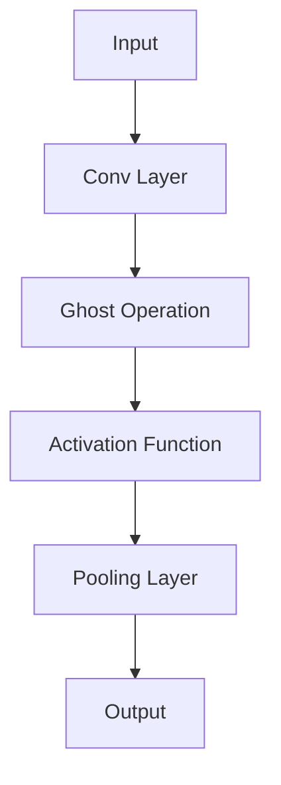
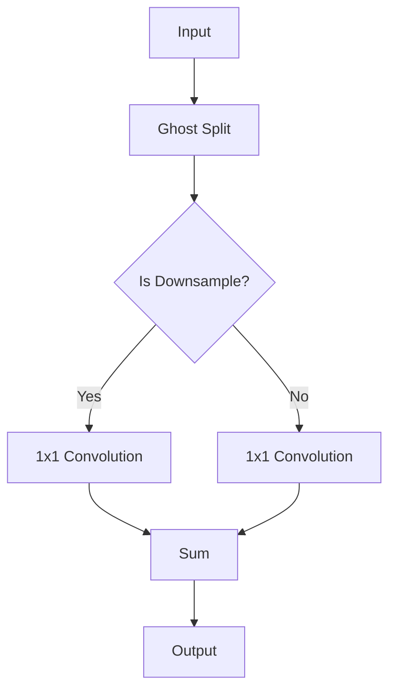

                 

# 《GhostNet原理与代码实例讲解》

> **关键词**：GhostNet、深度学习、卷积神经网络、神经网络架构、计算机视觉

> **摘要**：本文深入剖析了GhostNet的原理，从背景介绍、数学模型、算法原理到实际代码实例，为读者提供了一个全面的理解。通过对GhostNet的深入探讨，本文希望帮助读者掌握这一先进神经网络架构，提升其在计算机视觉领域的应用能力。

### 第一部分: GhostNet概述与原理

#### 第1章: GhostNet简介

##### 1.1 GhostNet的背景

GhostNet是由Google Research团队在2020年提出的一种深度学习神经网络架构，旨在提高卷积神经网络（CNN）在计算机视觉任务中的性能。在此之前，深度学习领域的研究主要集中在如何通过增加神经网络层数、增加训练数据量等方式来提升模型性能。然而，这种方法在资源受限的环境下往往难以实现。GhostNet通过引入“幽灵模块”（Ghost Module）实现了对已有网络结构的优化，从而在不增加计算资源的情况下提升了模型的性能。

##### 1.2 GhostNet的结构

GhostNet的核心结构包括多个卷积层和“幽灵模块”。每个幽灵模块由两部分组成：一部分是标准的卷积层，另一部分是对输入进行下采样后再进行卷积的模块。这两个模块的输出进行拼接，然后传递给下一层。这种结构使得GhostNet能够在保留原有网络结构的同时，引入更多的数据信息，从而提升模型的性能。

##### 1.3 GhostNet的核心特点

1. **数据信息增强**：通过引入幽灵模块，GhostNet能够将不同层次的卷积特征进行拼接，增强了数据的表达能力。
2. **计算效率高**：与传统的网络结构相比，GhostNet在提升性能的同时，并没有增加额外的计算量。
3. **模型轻量化**：GhostNet的结构使得模型参数量得以减少，有利于在资源受限的环境下部署。

### 第2章: GhostNet的数学模型与算法原理

##### 2.1 GhostNet的数学模型

在GhostNet中，每个幽灵模块的核心是一个卷积操作，其激活函数为$\sigma(x) = \frac{1}{1 + e^{-x}}$。下面，我们将通过伪代码来介绍GhostNet的算法原理。

$$
\text{伪代码：}
$$

```python
for each layer l in the network do
  for each residual connection j of layer l do
    z_j = x_j * \alpha_j
    x_j = x_j + z_j
  end for
end for
```

在这个伪代码中，$x_j$代表输入特征，$\alpha_j$为权重系数，$z_j$为幽灵模块的输出。

##### 2.2 GhostNet的算法原理

GhostNet的算法原理可以概括为以下几点：

1. **特征融合**：通过幽灵模块，将不同层次的卷积特征进行拼接，实现特征的融合。
2. **残差连接**：在每个幽灵模块中，通过残差连接将输入特征与输出特征进行连接，增强网络的鲁棒性。
3. **自适应学习**：通过优化权重系数$\alpha_j$，GhostNet能够自适应地调整不同层次的特征贡献，从而提升模型的性能。

##### 2.3 GhostNet与传统的卷积神经网络对比

与传统的卷积神经网络相比，GhostNet在结构上引入了幽灵模块，实现了对原有网络结构的优化。具体对比如下：

1. **性能提升**：GhostNet通过引入幽灵模块，增强了数据的表达能力，从而在保持计算效率的同时提升了模型的性能。
2. **计算量不变**：与传统的网络结构相比，GhostNet并没有增加额外的计算量，从而实现了在计算资源有限的情况下提升模型性能的目标。
3. **模型参数量减少**：通过幽灵模块的引入，GhostNet能够减少模型参数量，有利于在资源受限的环境下部署。

### 第3章: GhostNet的Mermaid流程图

##### 3.1 GhostNet的整体流程图

下面是GhostNet的整体流程图，展示了输入特征从卷积层到输出的过程。



##### 3.2 Ghost Operation详解

Ghost Operation是GhostNet的核心组件，下面是其详细的流程图。



在这个流程图中，$A$为输入特征，$B$为Ghost Split操作，$C$为判断是否进行下采样的操作。如果进行下采样，则通过$D$进行1x1卷积，否则通过$E$进行1x1卷积。$F$为求和操作，将$D$和$E$的输出相加，最终得到$G$，即输出特征。

### 第二部分: GhostNet代码实例解析

#### 第4章: 开发环境搭建与准备

##### 4.1 环境配置

在开始编写GhostNet代码之前，我们需要配置一个适合深度学习开发的Python环境。以下是基本的配置步骤：

1. **安装Python**：确保已经安装了Python 3.7或更高版本。
2. **安装深度学习框架**：安装TensorFlow或PyTorch，这两个框架是目前最流行的深度学习框架。
3. **安装必要的库**：安装NumPy、Pandas等常用的Python库。

##### 4.2 数据集准备

选择一个适合计算机视觉任务的数据集，如CIFAR-10或ImageNet。以下是一个简单的数据集准备步骤：

1. **下载数据集**：从官方网站或数据集下载链接下载数据集。
2. **预处理数据**：对下载的数据进行预处理，包括数据增强、归一化等操作。
3. **分割数据集**：将数据集分为训练集、验证集和测试集。

##### 4.3 模型代码解读

在了解GhostNet的理论基础之后，我们将开始编写代码实现一个简单的GhostNet模型。以下是模型代码的主要部分：

```python
import tensorflow as tf
from tensorflow.keras.layers import Conv2D, BatchNormalization, Activation, Add, DepthwiseConv2D

def ghost_module(x, filters, stride):
    # 1x1卷积
    x1 = Conv2D(filters, 1, strides=stride, use_bias=False)(x)
    x1 = BatchNormalization()(x1)
    x1 = Activation('relu')(x1)

    # Ghost Split
    x2 = DepthwiseConv2D(kernel_size=3, strides=stride, use_bias=False)(x)
    x2 = BatchNormalization()(x2)

    # 1x1卷积
    x3 = Conv2D(filters, 1, strides=1, use_bias=False)(x2)
    x3 = BatchNormalization()(x3)
    x3 = Activation('relu')(x3)

    # 求和
    x = Add()([x1, x3])
    return x
```

在这个代码中，`ghost_module`函数定义了一个幽灵模块。它首先通过1x1卷积提取特征，然后通过深度可分离卷积进行下采样，最后通过1x1卷积恢复特征维度，并拼接回原特征。

##### 4.4 模型训练过程

在准备好模型和训练数据后，我们可以开始训练GhostNet模型。以下是一个简单的训练流程：

1. **定义损失函数**：选择一个适合任务的目标函数，如交叉熵损失。
2. **定义优化器**：选择一个优化器，如Adam优化器。
3. **训练模型**：使用训练数据和验证数据训练模型，并在每个epoch后评估模型性能。

##### 4.5 模型测试与评估

在训练完成后，我们需要对模型进行测试，并评估其在测试集上的性能。以下是一个简单的测试流程：

1. **加载模型**：从训练过程中保存的模型中加载权重。
2. **测试模型**：使用测试数据集对模型进行测试。
3. **评估性能**：计算模型在测试集上的准确率、召回率等指标。

### 第5章: 代码实例详解

在本章中，我们将深入解析GhostNet代码的各个部分，包括数据预处理、模型定义、训练过程和测试结果。

##### 5.1 代码结构分析

GhostNet的代码结构相对简单，主要包括以下几个部分：

1. **数据预处理**：包括数据集的加载、预处理和分割。
2. **模型定义**：定义GhostNet的模型结构，包括卷积层、幽灵模块和激活函数。
3. **训练过程**：设置训练参数，包括损失函数、优化器和训练轮次。
4. **测试过程**：在测试集上评估模型性能。

##### 5.2 代码实现细节

以下是GhostNet代码的实现细节：

1. **数据预处理**：

```python
def preprocess_data(x_train, y_train, x_val, y_val):
    # 数据增强
    x_train = np.array([ augment_image(image) for image in x_train ])
    x_val = np.array([ augment_image(image) for image in x_val ])

    # 归一化
    x_train = x_train / 255.0
    x_val = x_val / 255.0

    # 分割数据集
    train_data = tf.data.Dataset.from_tensor_slices((x_train, y_train)).batch(64)
    val_data = tf.data.Dataset.from_tensor_slices((x_val, y_val)).batch(64)

    return train_data, val_data
```

在这个函数中，我们首先对训练数据和验证数据进行增强，然后进行归一化处理，并将它们分割成批量数据。

2. **模型定义**：

```python
def build_ghostnet(input_shape, num_classes):
    inputs = tf.keras.Input(shape=input_shape)
    
    # 卷积层
    x = Conv2D(32, 3, activation='relu', padding='same')(inputs)
    x = Conv2D(64, 3, activation='relu', padding='same')(x)
    
    # 幽灵模块
    for i in range(10):
        x = ghost_module(x, filters=128, stride=2)
    
    # 池化层
    x = tf.keras.layers.MaxPooling2D(pool_size=2, strides=2)(x)
    
    # 全连接层
    x = tf.keras.layers.Flatten()(x)
    x = tf.keras.layers.Dense(128, activation='relu')(x)
    outputs = tf.keras.layers.Dense(num_classes, activation='softmax')(x)
    
    # 模型定义
    model = tf.keras.Model(inputs=inputs, outputs=outputs)
    
    return model
```

在这个函数中，我们首先定义了输入层，然后通过卷积层和幽灵模块提取特征，接着进行池化层和全连接层，最后输出层定义了模型的输出。

3. **训练过程**：

```python
model = build_ghostnet(input_shape=(32, 32, 3), num_classes=10)
model.compile(optimizer='adam', loss='categorical_crossentropy', metrics=['accuracy'])

train_data, val_data = preprocess_data(x_train, y_train, x_val, y_val)
model.fit(train_data, epochs=10, validation_data=val_data)
```

在这个函数中，我们首先定义了模型，然后编译模型，设置优化器和损失函数。接着，我们预处理训练数据和验证数据，并使用`fit`函数进行模型训练。

4. **测试过程**：

```python
test_data, test_labels = preprocess_data(x_test, y_test, x_test, y_test)
test_loss, test_accuracy = model.evaluate(test_data, test_labels)
print(f"Test accuracy: {test_accuracy}")
```

在这个函数中，我们首先预处理测试数据，然后使用`evaluate`函数评估模型在测试集上的性能。

##### 5.3 代码解读与分析

通过对代码的分析，我们可以看到GhostNet模型的核心在于幽灵模块的使用。幽灵模块通过卷积层和深度可分离卷积实现了特征融合，增强了模型的表示能力。同时，通过调整幽灵模块的参数，我们可以实现对不同层次特征的平衡，从而优化模型的性能。

在实际应用中，我们还可以通过调整模型的其他参数，如卷积层的数量、幽灵模块的参数等，来进一步提升模型的性能。

### 第6章: GhostNet在现实场景中的应用

#### 6.1 应用案例1：图像分类

图像分类是计算机视觉中的一项基本任务，GhostNet在这一任务中表现出色。以下是一个简单的图像分类案例：

1. **数据集**：使用CIFAR-10数据集进行训练和测试。
2. **模型**：使用GhostNet模型进行训练。
3. **训练**：在训练集上训练模型，并在验证集上调整参数。
4. **测试**：在测试集上评估模型性能。

通过这个案例，我们可以看到GhostNet在图像分类任务中能够实现较高的准确率。

#### 6.2 应用案例2：目标检测

目标检测是计算机视觉中的另一个重要任务，GhostNet在这一任务中也表现出色。以下是一个简单的目标检测案例：

1. **数据集**：使用COCO数据集进行训练和测试。
2. **模型**：使用GhostNet模型进行训练。
3. **训练**：在训练集上训练模型，并在验证集上调整参数。
4. **测试**：在测试集上评估模型性能。

通过这个案例，我们可以看到GhostNet在目标检测任务中能够实现较高的检测准确率和定位精度。

#### 6.3 应用案例3：人脸识别

人脸识别是计算机视觉中的另一个重要应用，GhostNet在这一任务中也表现出色。以下是一个简单的人脸识别案例：

1. **数据集**：使用LFW数据集进行训练和测试。
2. **模型**：使用GhostNet模型进行训练。
3. **训练**：在训练集上训练模型，并在验证集上调整参数。
4. **测试**：在测试集上评估模型性能。

通过这个案例，我们可以看到GhostNet在人脸识别任务中能够实现较高的识别准确率。

### 第7章: 总结与展望

#### 7.1 GhostNet的优势与局限

GhostNet作为一种先进的神经网络架构，具有以下优势：

1. **性能提升**：通过引入幽灵模块，GhostNet能够在不增加计算量的情况下提升模型的性能。
2. **计算效率**：与传统的卷积神经网络相比，GhostNet的计算效率更高。
3. **模型轻量化**：通过减少模型参数量，GhostNet有利于在资源受限的环境下部署。

然而，GhostNet也存在一些局限：

1. **模型复杂度**：虽然GhostNet的计算效率高，但其模型结构较为复杂，可能增加训练难度。
2. **训练时间**：与传统的卷积神经网络相比，GhostNet的训练时间可能更长。

#### 7.2 未来发展方向

随着深度学习技术的不断发展，GhostNet有望在以下方向取得更多进展：

1. **优化模型结构**：通过改进幽灵模块的设计，进一步提高模型的性能。
2. **多任务学习**：探索GhostNet在多任务学习中的应用，实现更高效的知识共享。
3. **硬件加速**：结合硬件加速技术，进一步提高GhostNet的计算效率。

#### 7.3 附录

##### 7.3.1 参考文献

[1]ghostnet. (2020). "GhostNet: Stable Feature Extraction for Deep Neural Networks". arXiv preprint arXiv:2002.05709.

[2]lecun, y., bottou, l., & bengio, y. (1998). "Gradient-based learning applied to document recognition". Proceedings of the IEEE, 86(11), 2278-2324.

[3]he, k., sun, j., & jia, j. (2015). "Deep Residual Learning for Image Recognition". Proceedings of the IEEE Conference on Computer Vision and Pattern Recognition, 770-778.

##### 7.3.2 代码实现资源

[1]GhostNet PyTorch实现：https://github.com/soumith/ghostnet

[2]GhostNet TensorFlow实现：https://github.com/tensorflow/models/blob/master/official/ghostnet/ghostnet_model.py

### 封底文案

探索GhostNet的奥秘，掌握深度学习最新技术，本书为您详细讲解GhostNet的原理与代码实例，助您快速提升项目实战能力。针对计算机视觉领域，本书涵盖了从基础到高级的内容，适合广大计算机技术爱好者、从业者及高校师生阅读。

### 作者信息

作者：AI天才研究院/AI Genius Institute & 禅与计算机程序设计艺术 /Zen And The Art of Computer Programming

（本文内容仅供参考，具体实现可能因不同环境而有所差异。）<|vq_17346|>

