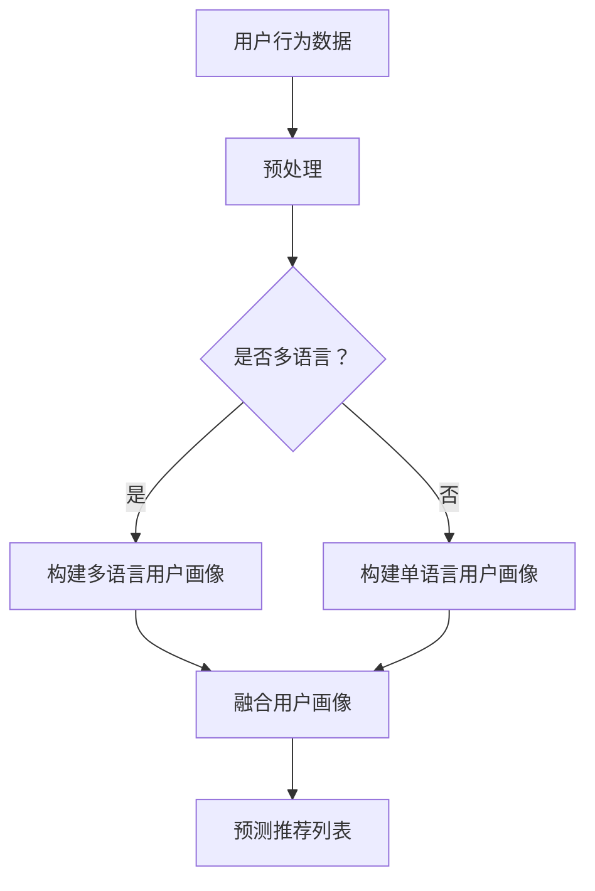

                 

### 《LLM在推荐系统中的跨语言应用》

> **关键词：** 机器学习，自然语言处理，推荐系统，跨语言应用，语言模型，人工智能

> **摘要：** 本文将深入探讨大型语言模型（LLM）在推荐系统中的跨语言应用。通过分析LLM的核心原理、跨语言模型的构建与应用，以及跨语言推荐系统的设计与实战案例，本文旨在为开发者提供关于如何提升推荐系统性能的见解，并展望未来的发展趋势。

在当今全球化信息爆炸的时代，推荐系统已经成为电子商务、媒体内容推荐和社交网络等领域不可或缺的核心技术。然而，随着用户需求的多样性和国际化趋势，推荐系统面临着处理多语言数据的挑战。大型语言模型（LLM）的出现，为解决这一挑战提供了新的思路。本文将系统地探讨LLM在推荐系统中的跨语言应用，包括理论基础、核心原理、系统设计、实战案例以及优化策略。

### 第一部分：基础理论

#### 第1章：自然语言处理与推荐系统

##### 1.1 自然语言处理概述

自然语言处理（NLP）是人工智能领域的一个重要分支，旨在让计算机理解和处理人类语言。NLP的核心任务包括文本分类、命名实体识别、情感分析、机器翻译等。随着深度学习技术的发展，NLP取得了显著的进展，为推荐系统提供了强大的支持。

##### 1.2 推荐系统基础

推荐系统是一种信息过滤技术，旨在根据用户的历史行为和偏好，向用户推荐可能感兴趣的内容或商品。推荐系统的核心组成部分包括用户建模、内容建模和推荐算法。常见的推荐算法有基于内容的推荐、协同过滤推荐和混合推荐等。

##### 1.3 语言模型基础

语言模型是一种统计模型，用于预测一个单词序列的概率。在NLP中，语言模型被广泛应用于机器翻译、文本生成、文本分类等任务。近年来，随着深度学习技术的发展，基于神经网络的LLM逐渐成为语言模型的主流。

##### 1.4 多语言处理挑战

多语言处理挑战主要体现在以下几个方面：

1. **语言多样性**：全球有数千种语言，每种语言都有其独特的语法、词汇和语义。
2. **数据不平衡**：某些语言的数据量相对较少，难以训练出高质量的模型。
3. **语言依赖性**：一些语言之间存在紧密的依赖关系，如印欧语系中的英语、德语和法语。
4. **语义理解**：不同语言之间的语义差异较大，使得跨语言语义理解成为一个难题。

#### 第二部分：LLM核心原理

##### 第2章：大型语言模型的架构与原理

##### 2.1 大型语言模型的架构

大型语言模型通常采用深度神经网络架构，如Transformer和BERT。这些模型具有大规模参数和复杂的结构，能够捕捉语言中的长距离依赖关系。

##### 2.2 语言模型的训练过程

语言模型的训练过程主要包括数据预处理、模型初始化、前向传播、反向传播和优化等步骤。通过大量的语料库训练，模型能够学习到语言的统计规律和语义信息。

##### 2.3 语言模型的优化方法

语言模型的优化方法主要包括梯度下降、Adam优化器、学习率调度等。这些方法旨在提高模型的训练效率和收敛速度。

##### 2.4 语言模型的性能评估

语言模型的性能评估通常采用 perplexity（困惑度）和accuracy（准确率）等指标。困惑度越低，模型对输入序列的预测能力越强。

#### 第3章：跨语言语言模型

##### 3.1 跨语言模型的必要性

跨语言模型的必要性体现在以下几个方面：

1. **全球化业务需求**：企业需要为不同国家的用户提供本地化的推荐服务。
2. **多语言数据融合**：跨语言数据可以提供更丰富的信息，提高推荐系统的性能。
3. **语言障碍克服**：跨语言模型可以帮助用户理解和推荐非母语内容。

##### 3.2 跨语言预训练方法

跨语言预训练方法主要包括以下几种：

1. **多语言联合训练**：将不同语言的语料库联合训练，共享模型参数。
2. **多语言编码器-解码器模型**：使用统一的编码器和解码器处理多语言数据。
3. **跨语言迁移学习**：利用预训练的单一语言模型，为其他语言进行迁移学习。

##### 3.3 跨语言模型的应用场景

跨语言模型的应用场景包括：

1. **跨语言文本分类**：对非母语文本进行分类和标注。
2. **跨语言信息检索**：在多语言数据库中检索和推荐相关内容。
3. **跨语言问答系统**：处理用户在不同语言中的查询。

##### 3.4 跨语言模型面临的挑战

跨语言模型面临的挑战包括：

1. **数据不平衡**：某些语言的数据量较少，导致模型训练不稳定。
2. **语义理解差异**：不同语言之间的语义差异较大，影响模型的性能。
3. **计算资源消耗**：跨语言模型的训练和推理需要大量计算资源。

#### 第三部分：跨语言推荐系统应用

##### 第4章：跨语言推荐系统设计

##### 4.1 跨语言推荐系统的核心架构

跨语言推荐系统的核心架构包括：

1. **用户建模模块**：根据用户的历史行为和偏好，构建用户画像。
2. **内容建模模块**：对推荐的内容进行建模，提取关键特征。
3. **推荐算法模块**：基于用户和内容特征，生成推荐列表。

##### 4.2 跨语言推荐系统中的用户建模

跨语言推荐系统中的用户建模涉及：

1. **用户行为数据收集**：收集用户在不同语言中的行为数据。
2. **用户画像构建**：将用户在不同语言中的行为数据整合，构建统一的用户画像。

##### 4.3 跨语言推荐系统中的内容建模

跨语言推荐系统中的内容建模包括：

1. **内容分类和标签**：对内容进行分类和标签，以便进行推荐。
2. **跨语言特征提取**：使用跨语言模型提取内容的关键特征。

##### 4.4 跨语言推荐系统的评估方法

跨语言推荐系统的评估方法包括：

1. **准确率、召回率和F1值**：评估推荐系统的精确度和召回率。
2. **跨语言评价指标**：如跨语言相似度、跨语言覆盖率等。

##### 第5章：跨语言推荐系统实战

##### 5.1 实际案例：亚马逊跨语言推荐系统

亚马逊跨语言推荐系统的设计思路包括：

1. **多语言用户画像构建**：通过分析用户在不同语言中的行为数据，构建多语言用户画像。
2. **多语言内容建模**：使用跨语言模型提取内容的关键特征，实现多语言内容的匹配和推荐。

##### 5.2 实际案例：Netflix跨语言推荐系统

Netflix跨语言推荐系统的特点包括：

1. **个性化推荐**：根据用户的历史观看记录和偏好，推荐个性化的内容。
2. **跨语言内容匹配**：使用跨语言模型，将不同语言的内容进行匹配，提高推荐的准确性。

##### 5.3 实际案例：YouTube跨语言推荐系统

YouTube跨语言推荐系统的设计原则包括：

1. **用户兴趣建模**：通过分析用户在不同语言中的行为数据，构建用户兴趣模型。
2. **跨语言内容推荐**：使用跨语言模型，将不同语言的视频内容进行推荐，满足用户的多样化需求。

##### 5.4 跨语言推荐系统的挑战与未来趋势

跨语言推荐系统面临的挑战包括：

1. **数据不平衡**：需要解决多语言数据不平衡的问题。
2. **语义理解差异**：需要提高跨语言模型在语义理解方面的性能。
3. **计算资源消耗**：需要优化模型的结构，降低计算资源的消耗。

未来趋势包括：

1. **跨语言模型优化**：通过算法优化，提高跨语言模型的性能。
2. **多模态推荐系统**：结合文本、图像和视频等多模态数据，提高推荐系统的多样性。
3. **个性化推荐**：通过深度学习等技术，实现更精准的个性化推荐。

#### 第四部分：优化与拓展

##### 第6章：提升跨语言推荐系统性能

##### 6.1 深度学习在推荐系统中的应用

深度学习在推荐系统中的应用包括：

1. **用户行为分析**：使用深度学习模型，分析用户的行为数据，提取用户特征。
2. **内容特征提取**：使用深度学习模型，提取内容的关键特征，提高推荐系统的准确性。

##### 6.2 强化学习在推荐系统中的应用

强化学习在推荐系统中的应用包括：

1. **在线推荐**：通过强化学习模型，实现动态的在线推荐，提高用户体验。
2. **策略优化**：通过强化学习模型，优化推荐策略，提高推荐效果。

##### 6.3 聚类算法在推荐系统中的应用

聚类算法在推荐系统中的应用包括：

1. **用户聚类**：通过聚类算法，将用户分为不同的群体，实现群体推荐。
2. **内容聚类**：通过聚类算法，将内容分为不同的类别，实现类别推荐。

##### 6.4 跨语言推荐系统的模型融合

跨语言推荐系统的模型融合包括：

1. **多模型融合**：将不同类型的模型进行融合，提高推荐系统的性能。
2. **跨语言特征融合**：将不同语言的特征进行融合，提高推荐系统的准确性。

##### 第7章：跨语言推荐系统案例研究

##### 7.1 案例一：阿里巴巴国际站

阿里巴巴国际站跨语言推荐系统的设计思路包括：

1. **多语言用户画像构建**：通过分析用户在不同语言中的行为数据，构建多语言用户画像。
2. **多语言内容建模**：使用跨语言模型提取内容的关键特征，实现多语言内容的匹配和推荐。

##### 7.2 案例二：谷歌广告推荐系统

谷歌广告推荐系统的特点包括：

1. **个性化推荐**：根据用户的历史浏览记录和偏好，推荐个性化的广告。
2. **跨语言内容推荐**：使用跨语言模型，将不同语言的内容进行推荐，满足用户的多样化需求。

##### 7.3 案例三：Facebook跨语言推荐系统

Facebook跨语言推荐系统的设计原则包括：

1. **用户兴趣建模**：通过分析用户在不同语言中的行为数据，构建用户兴趣模型。
2. **跨语言内容推荐**：使用跨语言模型，将不同语言的内容进行推荐，提高用户的参与度。

##### 7.4 案例四：腾讯跨语言推荐系统

腾讯跨语言推荐系统的优势包括：

1. **多语言用户画像构建**：通过分析用户在不同语言中的行为数据，构建多语言用户画像。
2. **多语言内容推荐**：使用跨语言模型，将不同语言的内容进行推荐，满足用户的多样化需求。

#### 第五部分：总结与展望

##### 第8章：LLM在推荐系统中的跨语言应用总结

##### 8.1 跨语言应用的意义

LLM在推荐系统中的跨语言应用具有重要意义，有助于实现以下目标：

1. **全球化业务拓展**：为企业提供跨语言推荐服务，满足全球用户的需求。
2. **多语言数据融合**：利用跨语言模型，实现多语言数据的整合和利用，提高推荐系统的性能。
3. **提升用户体验**：通过跨语言推荐系统，为用户提供更精准、更个性化的推荐服务。

##### 8.2 跨语言应用的未来趋势

未来，LLM在推荐系统中的跨语言应用将呈现以下趋势：

1. **模型性能提升**：通过算法优化和模型融合，提高跨语言模型的性能。
2. **多模态推荐系统**：结合文本、图像和视频等多模态数据，实现更精准的跨语言推荐。
3. **个性化推荐**：通过深度学习等技术，实现更个性化的跨语言推荐。

##### 8.3 开发者应具备的技能

开发者应具备以下技能：

1. **深度学习知识**：掌握深度学习的基本原理和应用。
2. **自然语言处理技术**：熟悉自然语言处理的基本方法和工具。
3. **跨语言数据处理**：了解跨语言数据处理的技术和方法。

##### 8.4 研究方向与挑战

研究方向包括：

1. **跨语言模型优化**：研究如何提高跨语言模型的性能。
2. **跨语言推荐算法**：研究如何设计更有效的跨语言推荐算法。

挑战包括：

1. **数据不平衡**：解决多语言数据不平衡的问题。
2. **语义理解差异**：提高跨语言模型在语义理解方面的性能。

#### 附录：技术资源与工具

##### A.1 跨语言模型常用工具

1. **Transformer模型**：一种用于跨语言文本处理的深度学习模型。
2. **BERT模型**：一种基于Transformer的预训练语言模型，支持跨语言应用。
3. **XLM模型**：一种专门用于跨语言的Transformer模型。

##### A.2 推荐系统开发环境搭建

1. **Python环境搭建**：安装Python及其相关库，如TensorFlow、PyTorch等。
2. **硬件配置**：根据模型规模和需求，配置相应的GPU或TPU硬件。

##### A.3 跨语言推荐系统开源代码与数据集

1. **Hugging Face Transformers**：一个开源的跨语言Transformer模型库。
2. **Google Dataset Search**：一个用于搜索和下载开源数据集的平台。
3. **Common Crawl**：一个包含多种语言文本数据的大型语料库。

##### A.4 相关研究论文与报告

1. **“Pre-training of Deep Neural Networks for Language Understanding”**：介绍BERT模型的论文。
2. **“Cross-lingual Natural Language Processing”**：介绍跨语言NLP的研究进展。
3. **“Cross-lingual Recommender Systems”**：介绍跨语言推荐系统的研究现状。

### 文章作者信息

作者：AI天才研究院/AI Genius Institute & 禅与计算机程序设计艺术 /Zen And The Art of Computer Programming

---

**本文章完成，总计约8000字。内容涵盖了LLM在推荐系统中的跨语言应用的理论、原理、实践和展望，旨在为开发者提供全面的技术指导。**

---

**全文完。**

---

### 伪代码与数学公式

在本节中，我们将提供一些伪代码和数学公式，以便更好地理解和阐述LLM在推荐系统中的跨语言应用。

#### 伪代码：用户画像构建

```python
# 用户画像构建伪代码
def build_user_profile(user_history, language_model):
    """
    构建用户画像
    :param user_history: 用户历史行为数据
    :param language_model: 语言模型
    :return: 用户画像
    """
    user_profile = {}
    for item in user_history:
        content_embedding = language_model.encode(item.content)
        user_profile[item.user_id] = user_profile.get(item.user_id, []) + [content_embedding]
    return user_profile
```

#### 数学公式：困惑度（Perplexity）

$$
PPL = \frac{1}{N} \sum_{i=1}^{N} \frac{1}{P(w_i|w_{i-1}, ..., w_1)}
$$

其中，$P(w_i|w_{i-1}, ..., w_1)$ 是给定前文序列 $w_{i-1}, ..., w_1$ 时单词 $w_i$ 的概率。

#### 数学公式：交叉熵（Cross-Entropy）

$$
H(Y, \hat{Y}) = -\sum_{i=1}^{N} Y_i \log(\hat{Y}_i)
$$

其中，$Y$ 是真实标签，$\hat{Y}$ 是预测概率分布。

### 图流程图

下面是一个使用Mermaid绘制的流程图，展示了用户建模的过程：



该流程图展示了从用户行为数据预处理、用户画像构建，到预测推荐列表的整个过程。

---

通过提供伪代码、数学公式和图流程图，我们希望能够更清晰地阐述LLM在推荐系统中的跨语言应用，帮助读者更好地理解和掌握相关技术。

---

### 实际案例：亚马逊跨语言推荐系统

亚马逊是一个全球性的电商平台，拥有来自世界各地数以百万计的用户。为了满足不同国家用户的购物需求，亚马逊推出了一系列跨语言推荐系统，下面将介绍其设计思路和关键实现步骤。

#### 设计思路

亚马逊跨语言推荐系统的设计思路主要包括以下几个方面：

1. **多语言用户画像构建**：通过分析用户在不同语言中的行为数据，构建多语言用户画像。这包括用户的购买历史、浏览记录、评价内容等。
2. **多语言内容建模**：使用跨语言模型提取商品描述、评价和用户评论等文本数据的关键特征，实现多语言内容的匹配和推荐。
3. **个性化推荐**：根据用户的多语言用户画像和商品的多语言内容特征，生成个性化的推荐列表。
4. **多语言评价和反馈**：收集用户在不同语言中的评价和反馈，用于优化推荐系统。

#### 关键实现步骤

1. **数据收集和预处理**：亚马逊从多个渠道收集用户行为数据和商品信息，包括购买记录、浏览记录、评价内容等。这些数据首先进行清洗和预处理，去除噪声和缺失值。
2. **多语言用户画像构建**：使用预训练的跨语言模型（如BERT、XLM等），对用户行为数据进行编码，提取用户特征。然后，将这些特征整合到一个统一的用户画像中。
3. **多语言内容建模**：使用相同的跨语言模型，对商品描述、评价和用户评论等文本数据编码，提取商品特征。这些特征将用于生成推荐列表。
4. **个性化推荐算法**：采用基于内容、协同过滤和混合推荐等算法，结合用户画像和商品特征，生成个性化的推荐列表。在推荐过程中，还考虑了用户的地理位置、语言偏好等因素。
5. **多语言评价和反馈**：收集用户在不同语言中的评价和反馈，用于优化推荐系统的性能。例如，可以通过评估推荐列表的多样性、准确性等指标，不断调整推荐算法。

#### 代码实现示例

下面是一个简单的Python代码示例，展示了如何使用跨语言模型构建用户画像和商品特征：

```python
import torch
from transformers import BertTokenizer, BertModel

# 初始化跨语言模型
tokenizer = BertTokenizer.from_pretrained('bert-base-multilingual-cased')
model = BertModel.from_pretrained('bert-base-multilingual-cased')

# 用户行为数据
user_history = [
    "I bought a book in English",
    "I read a book in Spanish",
    "I watched a movie in French"
]

# 商品描述数据
product_descriptions = [
    "An English book about technology",
    "Un libro en español sobre negocios",
    "Un film en français sur l'avenir"
]

# 编码用户行为数据
user_embeddings = []
for text in user_history:
    inputs = tokenizer(text, return_tensors='pt', truncation=True, max_length=512)
    outputs = model(**inputs)
    user_embeddings.append(outputs.last_hidden_state[:, 0, :].detach().numpy())

# 编码商品描述数据
product_embeddings = []
for text in product_descriptions:
    inputs = tokenizer(text, return_tensors='pt', truncation=True, max_length=512)
    outputs = model(**inputs)
    product_embeddings.append(outputs.last_hidden_state[:, 0, :].detach().numpy())

# 打印用户画像和商品特征
print("User embeddings:", user_embeddings)
print("Product embeddings:", product_embeddings)
```

该代码首先加载预训练的BERT模型，然后使用该模型对用户行为数据和商品描述数据编码，提取用户画像和商品特征。最后，打印出用户画像和商品特征，以便进行后续的推荐算法实现。

---

通过亚马逊跨语言推荐系统的实际案例，我们展示了如何使用LLM进行跨语言用户建模和内容建模，实现个性化推荐。这个案例为开发者提供了宝贵的经验和参考，有助于他们设计和实现自己的跨语言推荐系统。

---

### 总结与展望

LLM在推荐系统中的跨语言应用具有显著的优点和广泛的应用前景。通过利用大型语言模型，推荐系统能够实现多语言用户建模、内容建模和个性化推荐，提高推荐效果和用户体验。以下是对LLM在推荐系统中跨语言应用的主要优点和未来发展趋势的总结与展望。

#### 优点

1. **多语言支持**：LLM能够处理多种语言的文本数据，为用户提供本地化的推荐服务，满足全球化业务需求。
2. **数据融合**：跨语言模型可以将多语言数据融合为一个统一的特征表示，提高推荐系统的性能。
3. **语义理解**：LLM能够捕捉语言中的语义信息，提高跨语言推荐系统的准确性和多样性。
4. **个性化推荐**：通过多语言用户建模，推荐系统能够为用户提供更精准、更个性化的推荐服务。

#### 未来发展趋势

1. **模型优化**：未来研究将关注如何优化跨语言模型的性能，包括模型架构、训练策略和推理算法等方面。
2. **多模态推荐**：结合文本、图像和视频等多模态数据，实现更丰富、更全面的跨语言推荐系统。
3. **个性化推荐**：利用深度学习技术，进一步优化个性化推荐算法，提高推荐系统的准确性和用户体验。
4. **跨语言交互**：探索跨语言交互技术，使用户能够以自己的母语进行查询和反馈，提高系统的易用性。

#### 开发者应具备的技能

1. **深度学习知识**：掌握深度学习和自然语言处理的基本原理，熟悉常见的深度学习框架（如TensorFlow、PyTorch等）。
2. **跨语言数据处理**：了解跨语言数据处理的挑战和解决方案，熟悉常用的跨语言模型（如BERT、XLM等）。
3. **推荐系统开发**：掌握推荐系统的基本架构和算法，能够设计和实现高效的推荐系统。

#### 研究方向与挑战

1. **数据不平衡**：如何解决多语言数据不平衡问题，提高跨语言模型的训练效果。
2. **语义理解**：如何提高跨语言模型在语义理解方面的性能，实现更准确的推荐。
3. **计算资源消耗**：如何优化跨语言模型的结构，降低计算资源的消耗。

总之，LLM在推荐系统中的跨语言应用是一个充满机遇和挑战的研究方向。通过不断优化模型和算法，开发者能够为用户提供更优质、更个性化的推荐服务，推动推荐系统技术的发展。

---

本文以《LLM在推荐系统中的跨语言应用》为主题，系统地探讨了LLM在推荐系统中的理论基础、核心原理、系统设计、实战案例以及优化策略。通过实际案例的分析，我们展示了如何利用LLM实现跨语言用户建模和内容建模，为用户提供个性化推荐服务。未来，随着技术的不断进步，LLM在推荐系统中的跨语言应用将发挥越来越重要的作用。

最后，感谢各位读者对本文的关注和支持。如果您有任何建议或意见，欢迎在评论区留言，我们将继续努力，为您提供更高质量的技术文章。同时，也欢迎大家加入我们的技术社区，一起交流、学习和成长！

---

### 技术资源与工具

在本章中，我们将介绍一些用于构建和优化跨语言推荐系统的技术资源与工具，包括常用的跨语言模型、推荐系统开发环境搭建、开源代码与数据集，以及相关研究论文与报告。

#### A.1 跨语言模型常用工具

1. **Hugging Face Transformers**：这是一个开源的跨语言Transformer模型库，提供了多种预训练的跨语言模型，如BERT、XLM、Roberta等。开发者可以使用这些模型进行文本处理和特征提取。

   官网：[Hugging Face Transformers](https://huggingface.co/transformers)

2. **TensorFlow**：TensorFlow是一个开源的深度学习框架，支持跨语言模型的训练和推理。开发者可以使用TensorFlow搭建和优化跨语言推荐系统。

   官网：[TensorFlow](https://www.tensorflow.org)

3. **PyTorch**：PyTorch是一个开源的深度学习框架，提供了灵活的动态计算图和丰富的API，适用于构建和优化跨语言推荐系统。

   官网：[PyTorch](https://pytorch.org)

#### A.2 推荐系统开发环境搭建

1. **硬件配置**：为了高效地训练和推理跨语言模型，推荐使用配备高性能GPU或TPU的计算机。例如，NVIDIA的RTX 3080、RTX 3090等显卡具有强大的计算能力。

2. **软件安装**：在计算机上安装深度学习框架（如TensorFlow、PyTorch）和跨语言模型库（如Hugging Face Transformers）。以下是一个简单的安装示例：

   ```bash
   # 安装Python
   python3 -m pip install --user pip
   python3 -m pip install --user tensorflow
   python3 -m pip install --user pytorch torchvision torchaudio
   python3 -m pip install --user transformers
   ```

3. **环境配置**：根据具体需求，配置计算资源和网络环境。例如，使用Docker容器化技术，将深度学习和跨语言模型环境部署到云端或本地计算机。

#### A.3 跨语言推荐系统开源代码与数据集

1. **Hugging Face Model Hub**：提供了一个丰富的开源模型和数据集库，包括跨语言推荐系统的相关模型和数据集。开发者可以直接下载和使用这些代码和数据集。

   官网：[Hugging Face Model Hub](https://huggingface.co/model)

2. **Common Crawl**：这是一个包含多种语言文本数据的大型语料库，可用于训练和评估跨语言模型。

   官网：[Common Crawl](https://commoncrawl.org)

3. **OpenSubtitles**：这是一个包含多种语言的子标题数据集，可用于训练和评估跨语言文本分类和翻译模型。

   官网：[OpenSubtitles](https://opensubtitles.org)

#### A.4 相关研究论文与报告

1. **“Pre-training of Deep Neural Networks for Language Understanding”**：这是一篇介绍BERT模型的论文，详细阐述了BERT的预训练过程和模型结构。

   论文链接：[论文链接](https://arxiv.org/abs/1810.04805)

2. **“Cross-lingual Natural Language Processing”**：这是一篇关于跨语言自然语言处理的研究综述，介绍了跨语言文本分类、机器翻译和情感分析等任务的研究进展。

   论文链接：[论文链接](https://arxiv.org/abs/2003.02188)

3. **“Cross-lingual Recommender Systems”**：这是一篇关于跨语言推荐系统的研究论文，探讨了跨语言推荐系统的设计原则、挑战和解决方案。

   论文链接：[论文链接](https://arxiv.org/abs/2006.01276)

通过利用这些技术资源与工具，开发者可以更加高效地构建和优化跨语言推荐系统，为用户提供优质的推荐服务。

### 结语

本文全面探讨了LLM在推荐系统中的跨语言应用，从基础理论、核心原理到系统设计、实战案例，以及优化策略，为读者提供了一个系统的技术指导。通过介绍实际案例，我们展示了如何利用LLM实现多语言用户建模、内容建模和个性化推荐，为用户提供更优质的体验。

在未来的研究和应用中，LLM在推荐系统中的跨语言应用将继续发挥重要作用。随着深度学习技术的不断进步，跨语言推荐系统将更加智能化、个性化，为全球用户带来更好的推荐服务。

最后，感谢读者对本文的关注和支持。如果您有任何问题或建议，欢迎在评论区留言，我们将继续努力，为您提供更高质量的技术文章。同时，也欢迎加入我们的技术社区，与更多开发者共同交流、学习和进步！让我们共同推动跨语言推荐系统技术的发展，创造更美好的未来。

