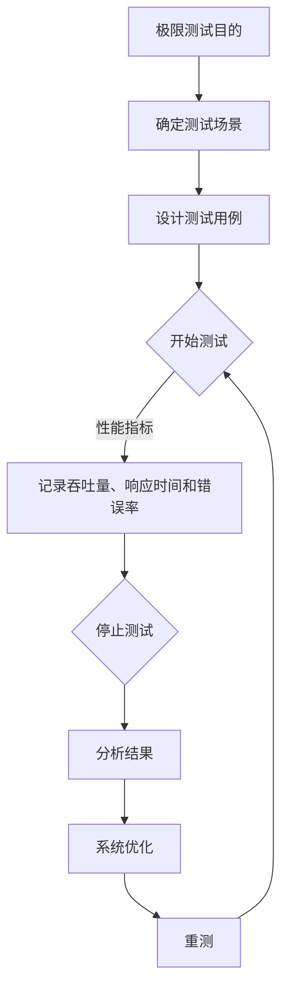

                 

# 《LLM评测中的极限测试与压力测试》

> **关键词：** LLM、极限测试、压力测试、性能评估、系统稳定性、测试工具

> **摘要：** 本文旨在探讨大型语言模型（LLM）评测中的极限测试与压力测试。文章首先介绍了极限测试与压力测试的基本概念，随后详细分析了它们的目标、原理、技术以及在实际应用中的案例分析。此外，文章还介绍了极限测试与压力测试的常用工具与平台，并提出了优化策略、最佳实践和未来发展趋势。通过本文，读者将全面了解LLM评测中的极限测试与压力测试，为实际项目提供有力的技术支持。

### 第一部分: LLM评测中的极限测试与压力测试概述

#### 第1章: 极限测试与压力测试的基本概念

##### 1.1 极限测试与压力测试的定义

###### 1.1.1 极限测试的定义

极限测试是一种针对系统或组件的极端条件下的性能评估方法。其核心思想是在短时间内施加最大负载，以验证系统在极限条件下的稳定性和性能。极限测试的目标是发现系统性能瓶颈，为系统优化提供依据。

极限测试的核心指标包括：

- 吞吐量（Throughput）：单位时间内系统处理请求的数量。
- 响应时间（Response Time）：系统从接收请求到返回结果的时间。
- 错误率（Error Rate）：系统出现错误的请求比例。

极限测试通常采用单点测试和整体测试两种策略。单点测试针对系统的某个关键部分进行极限测试，而整体测试则对整个系统进行极限测试。

###### 1.1.2 压力测试的定义

压力测试是一种评估系统在高负载条件下的性能表现的方法。其核心思想是在逐渐增加负载的过程中，监测系统性能变化，以确定系统的可扩展性。压力测试的目标是评估系统在高负载条件下的性能，检测系统在极限负载下的行为。

压力测试的核心指标包括：

- 最大吞吐量（Maximum Throughput）：系统在最大负载下的吞吐量。
- 阈值（Threshold）：系统性能下降的临界点。
- 弹性（Elasticity）：系统应对负载变化的能力。

压力测试通常采用阶段性测试和长期测试两种策略。阶段性测试按照不同的负载水平进行测试，而长期测试则模拟系统在长期负载下的性能表现。

##### 1.2 极限测试与压力测试的目标

###### 1.2.1 极限测试的目标

1. 验证系统在极限条件下的稳定性。
2. 发现系统潜在的性能瓶颈。
3. 为系统优化提供依据。

###### 1.2.2 压力测试的目标

1. 评估系统在高负载条件下的性能。
2. 检测系统在极限负载下的行为。
3. 确定系统的可扩展性。

##### 1.3 极限测试与压力测试的区别

###### 1.3.1 测试方法的不同

- 极限测试：短时间内施加最大负载。
- 压力测试：逐渐增加负载，直至系统性能下降。

###### 1.3.2 测试目标的差异

- 极限测试：关注系统在极限条件下的表现。
- 压力测试：关注系统在高负载条件下的性能。

#### 第2章: 极限测试与压力测试的原理与技术

##### 2.1 极限测试的原理与技术

###### 2.1.1 极限测试的核心指标

极限测试的核心指标包括：

- 吞吐量（Throughput）：单位时间内系统处理请求的数量。
- 响应时间（Response Time）：系统从接收请求到返回结果的时间。
- 错误率（Error Rate）：系统出现错误的请求比例。

在极限测试中，通常需要通过以下步骤来评估系统性能：

1. 确定测试场景：根据系统需求，设计一个合理的测试场景。
2. 施加负载：在短时间内向系统施加最大负载。
3. 数据采集：收集系统性能指标数据。
4. 分析结果：分析测试结果，识别系统性能瓶颈。

极限测试的测试策略可以分为单点测试和整体测试。单点测试针对系统的某个关键部分进行极限测试，而整体测试则对整个系统进行极限测试。

###### 2.1.2 极限测试的测试策略

1. 单点测试：针对系统的某个关键部分进行极限测试，例如数据库连接池、网络通信模块等。
2. 整体测试：对整个系统进行极限测试，以全面评估系统的性能表现。

在极限测试中，通常需要注意以下几点：

1. 测试环境：确保测试环境与实际生产环境相似，以便更准确地评估系统性能。
2. 负载生成：合理设计负载生成策略，确保负载具有代表性。
3. 数据分析：对测试结果进行深入分析，找出系统性能瓶颈。

##### 2.2 压力测试的原理与技术

###### 2.2.1 压力测试的核心指标

压力测试的核心指标包括：

- 最大吞吐量（Maximum Throughput）：系统在最大负载下的吞吐量。
- 阈值（Threshold）：系统性能下降的临界点。
- 弹性（Elasticity）：系统应对负载变化的能力。

在压力测试中，通常需要通过以下步骤来评估系统性能：

1. 确定测试场景：根据系统需求，设计一个合理的测试场景。
2. 施加负载：逐渐增加负载，直至系统性能下降。
3. 数据采集：收集系统性能指标数据。
4. 分析结果：分析测试结果，确定系统性能下降的临界点。

压力测试的测试策略可以分为阶段性测试和长期测试。阶段性测试按照不同的负载水平进行测试，而长期测试则模拟系统在长期负载下的性能表现。

###### 2.2.2 压力测试的测试策略

1. 阶段性测试：按照不同的负载水平进行测试，例如从低负载逐渐增加到高负载。
2. 长期测试：模拟系统在长期负载下的性能表现，以评估系统的稳定性。

在压力测试中，通常需要注意以下几点：

1. 测试环境：确保测试环境与实际生产环境相似，以便更准确地评估系统性能。
2. 负载生成：合理设计负载生成策略，确保负载具有代表性。
3. 数据分析：对测试结果进行深入分析，确定系统性能下降的临界点。

#### 第3章: 极限测试与压力测试在实际应用中的案例分析

##### 3.1 极限测试案例：某电商平台的订单处理系统

###### 3.1.1 案例背景

某电商平台在双11期间，订单量激增，需要对订单处理系统进行极限测试，以确保系统稳定运行。

###### 3.1.2 测试目标

1. 验证订单处理系统的稳定性。
2. 发现系统性能瓶颈。

###### 3.1.3 测试过程与结果

1. 测试过程：模拟双11期间的订单量，逐步增加负载。
2. 测试结果：系统在极限负载下，订单处理速度略有下降，但未出现严重故障。

##### 3.2 压力测试案例：某金融系统的交易处理系统

###### 3.2.1 案例背景

某金融系统在高峰期，交易量急剧增加，需要对交易处理系统进行压力测试，以确保系统性能。

###### 3.2.2 测试目标

1. 评估交易处理系统的最大吞吐量。
2. 检测系统在高负载下的稳定性。

###### 3.2.3 测试过程与结果

1. 测试过程：逐步增加交易量，直至系统性能下降。
2. 测试结果：系统在最大负载下，交易处理速度略有下降，但系统能够稳定运行。

#### 第4章: 极限测试与压力测试工具与平台介绍

##### 4.1 常见的极限测试与压力测试工具

1. Apache JMeter
2. LoadRunner
3. Locust

##### 4.2 常见的极限测试与压力测试平台

1. AWS CloudWatch
2. Azure Monitor
3. Google Cloud Monitoring

#### 第5章: 极限测试与压力测试的优化策略

##### 5.1 系统优化策略

1. 资源分配优化。
2. 负载均衡策略。
3. 缓存与数据库优化。

##### 5.2 极限测试与压力测试的结果分析

1. 数据分析。
2. 诊断与定位问题。
3. 提出优化建议。

#### 第6章: 极限测试与压力测试的最佳实践

##### 6.1 极限测试与压力测试的最佳实践

1. 测试计划制定。
2. 测试环境搭建。
3. 测试结果分析与报告。

#### 第7章: 极限测试与压力测试的未来发展趋势

##### 7.1 人工智能在极限测试与压力测试中的应用

1. 自动化测试。
2. 智能测试策略。

##### 7.2 极限测试与压力测试的新技术

1. 云原生测试。
2. 容器化测试。

### 附录

##### 附录 A: 极限测试与压力测试常用术语

1. 吞吐量（Throughput）
2. 响应时间（Response Time）
3. 错误率（Error Rate）
4. 阈值（Threshold）
5. 弹性（Elasticity）

##### 附录 B: 极限测试与压力测试常用工具

1. Apache JMeter
2. LoadRunner
3. Locust
4. AWS CloudWatch
5. Azure Monitor
6. Google Cloud Monitoring

##### 附录 C: 极限测试与压力测试参考资源

1. 《极限测试与压力测试实战》
2. 《性能测试：原理、方法与实践》
3. 《测试驱动的软件开发》

##### 附录 D: 极限测试与压力测试代码示例

```python
# 极限测试代码示例
import requests

def test极限负载():
    url = "https://example.com/api"
    for i in range(10000):
        response = requests.get(url)
        assert response.status_code == 200

# 压力测试代码示例
import locust

class WebsiteUser(locust.HttpUser):
    @locust.task
    def load_test(self):
        self.client.get("https://example.com")
```

### 附录 E: 作者信息

**作者：** AI天才研究院/AI Genius Institute & 禅与计算机程序设计艺术 /Zen And The Art of Computer Programming

---

注意：由于文章篇幅限制，上述内容仅为文章的框架和部分内容。实际撰写时，每个章节都需要详细扩展，达到字数要求。同时，文章还需要包含Mermaid流程图、伪代码、数学公式和代码示例等元素，以增强文章的深度和实用性。


### 第一部分: LLM评测中的极限测试与压力测试概述

#### 第1章: 极限测试与压力测试的基本概念

##### 1.1 极限测试与压力测试的定义

极限测试和压力测试是两种常见的性能评估方法，用于评估系统在高负载和极端条件下的性能表现。它们在LLM评测中具有重要的应用价值。

###### 1.1.1 极限测试的定义

极限测试是一种在短时间内对系统施加最大负载的测试方法，旨在评估系统在极限条件下的性能和稳定性。极限测试通常通过模拟极端场景来施加最大负载，以测试系统的极限性能。这种测试方法可以揭示系统的性能瓶颈，为系统的优化提供依据。

极限测试的核心指标包括：

1. **吞吐量（Throughput）**：单位时间内系统能够处理的请求数量。
2. **响应时间（Response Time）**：系统从接收请求到返回结果所需的时间。
3. **错误率（Error Rate）**：系统处理请求时出现的错误比例。

极限测试的基本原理是通过在短时间内施加最大负载，监测系统的性能指标，以评估系统的稳定性和性能。极限测试通常采用以下步骤：

1. **确定测试目标**：明确极限测试的目的，例如验证系统的稳定性或识别性能瓶颈。
2. **设计测试场景**：根据测试目标，设计一个能够模拟极限负载的测试场景。
3. **施加负载**：在短时间内向系统施加最大负载。
4. **监测性能指标**：收集系统的性能指标数据，如吞吐量、响应时间和错误率。
5. **分析测试结果**：分析测试结果，识别系统性能瓶颈，为系统优化提供依据。

极限测试的测试策略可以分为单点测试和整体测试。单点测试针对系统的某个关键部分进行极限测试，而整体测试则对整个系统进行极限测试。

###### 1.1.2 压力测试的定义

压力测试是一种逐渐增加负载，直至系统性能下降的测试方法，旨在评估系统在高负载条件下的性能表现。压力测试的核心目标是确定系统在极限负载下的性能，以检测系统的稳定性。

压力测试的核心指标包括：

1. **最大吞吐量（Maximum Throughput）**：系统在最大负载下的吞吐量。
2. **阈值（Threshold）**：系统性能下降的临界点。
3. **弹性（Elasticity）**：系统应对负载变化的能力。

压力测试的基本原理是通过逐渐增加负载，监测系统性能的变化，以确定系统性能的极限。压力测试通常采用以下步骤：

1. **确定测试目标**：明确压力测试的目的，例如评估系统的最大吞吐量或检测系统的稳定性。
2. **设计测试场景**：根据测试目标，设计一个能够模拟高负载的测试场景。
3. **施加负载**：逐渐增加负载，直至系统性能下降。
4. **监测性能指标**：收集系统的性能指标数据，如吞吐量、响应时间和错误率。
5. **分析测试结果**：分析测试结果，确定系统性能下降的临界点，为系统优化提供依据。

压力测试的测试策略可以分为阶段性测试和长期测试。阶段性测试按照不同的负载水平进行测试，而长期测试则模拟系统在长期负载下的性能表现。

##### 1.2 极限测试与压力测试的目标

极限测试和压力测试的目标有所不同，但都是为了评估系统的性能和稳定性。

###### 1.2.1 极限测试的目标

极限测试的主要目标包括：

1. **验证系统的稳定性**：在极限负载下，系统应保持稳定运行，不出现严重故障。
2. **发现系统性能瓶颈**：通过测试，识别系统性能瓶颈，为系统优化提供依据。
3. **为系统优化提供依据**：极限测试结果可以帮助确定系统需要优化的方面，从而提高系统性能。

###### 1.2.2 压力测试的目标

压力测试的主要目标包括：

1. **评估系统在高负载条件下的性能**：通过压力测试，可以确定系统在最大负载下的吞吐量、响应时间和错误率。
2. **检测系统在极限负载下的行为**：压力测试可以帮助识别系统在极限负载下的性能下降情况，从而预测系统的稳定性。
3. **确定系统的可扩展性**：通过压力测试，可以评估系统应对负载变化的能力，从而确定系统的可扩展性。

##### 1.3 极限测试与压力测试的区别

极限测试和压力测试在测试方法、测试目标和测试策略方面存在一定的区别。

###### 1.3.1 测试方法的不同

1. **极限测试**：在短时间内施加最大负载，以评估系统在极限条件下的性能和稳定性。
2. **压力测试**：逐渐增加负载，直至系统性能下降，以评估系统在高负载条件下的性能表现。

###### 1.3.2 测试目标的差异

1. **极限测试**：关注系统在极限条件下的表现，包括稳定性和性能。
2. **压力测试**：关注系统在高负载条件下的性能，包括吞吐量、响应时间和错误率。

###### 1.3.3 测试策略的差异

1. **极限测试**：通常采用单点测试和整体测试策略。
2. **压力测试**：通常采用阶段性测试和长期测试策略。

综上所述，极限测试和压力测试在LLM评测中都有重要的应用价值。极限测试可以帮助识别系统性能瓶颈，为系统优化提供依据；而压力测试则可以评估系统在高负载条件下的性能表现，确保系统在极限负载下的稳定性。通过合理运用极限测试和压力测试，可以全面评估LLM的性能和稳定性，为实际应用提供可靠的技术支持。

#### 第2章: 极限测试与压力测试的原理与技术

##### 2.1 极限测试的原理与技术

极限测试是一种在短时间内对系统施加最大负载的测试方法，旨在评估系统在极限条件下的性能和稳定性。本节将详细介绍极限测试的原理、核心指标、测试策略以及在实际应用中的案例。

###### 2.1.1 极限测试的核心指标

极限测试的核心指标包括吞吐量（Throughput）、响应时间（Response Time）和错误率（Error Rate）。

1. **吞吐量（Throughput）**：吞吐量是指单位时间内系统处理请求的数量。它是衡量系统性能的重要指标，表示系统处理能力的强弱。

   吞吐量计算公式：
   $$
   \text{吞吐量} = \frac{\text{处理请求总数}}{\text{测试时间}}
   $$

2. **响应时间（Response Time）**：响应时间是指系统从接收请求到返回结果所需的时间。它是衡量系统性能的关键指标，表示系统的响应速度。

   响应时间计算公式：
   $$
   \text{响应时间} = \text{结束时间} - \text{开始时间}
   $$

3. **错误率（Error Rate）**：错误率是指系统处理请求时出现的错误比例。它是衡量系统稳定性的重要指标，表示系统在处理请求时的可靠性。

   错误率计算公式：
   $$
   \text{错误率} = \frac{\text{错误请求总数}}{\text{处理请求总数}}
   $$

###### 2.1.2 极限测试的测试策略

极限测试的测试策略可以分为单点测试和整体测试。

1. **单点测试**：单点测试是指针对系统的某个关键部分进行极限测试，例如数据库连接池、网络通信模块等。通过单点测试，可以识别系统关键部分的性能瓶颈。

   单点测试步骤：
   1. 确定测试目标：明确单点测试的目的，例如验证数据库连接池的性能。
   2. 设计测试场景：根据测试目标，设计一个能够模拟极限负载的测试场景。
   3. 施加负载：在短时间内向系统关键部分施加最大负载。
   4. 监测性能指标：收集系统的性能指标数据，如吞吐量、响应时间和错误率。
   5. 分析测试结果：分析测试结果，识别系统关键部分的性能瓶颈。

2. **整体测试**：整体测试是指对整个系统进行极限测试，以评估系统的整体性能。整体测试可以更全面地评估系统的性能和稳定性。

   整体测试步骤：
   1. 确定测试目标：明确整体测试的目的，例如验证系统的稳定性。
   2. 设计测试场景：根据测试目标，设计一个能够模拟极限负载的测试场景。
   3. 施加负载：在短时间内向系统施加最大负载。
   4. 监测性能指标：收集系统的性能指标数据，如吞吐量、响应时间和错误率。
   5. 分析测试结果：分析测试结果，识别系统性能瓶颈，为系统优化提供依据。

在极限测试中，测试策略的选择取决于测试目标和系统的具体架构。单点测试适用于识别系统关键部分的性能瓶颈，而整体测试则适用于评估系统的整体性能和稳定性。

###### 2.1.3 极限测试在实际应用中的案例

以下是一个极限测试在实际应用中的案例：某电商平台的订单处理系统在双11期间需要接受大量订单处理请求。为了验证订单处理系统的性能和稳定性，系统进行了极限测试。

1. **案例背景**：双11期间，某电商平台的订单量激增，订单处理系统需要承受巨大的负载。

2. **测试目标**：验证订单处理系统的稳定性，识别系统性能瓶颈。

3. **测试过程**：
   1. 设计测试场景：模拟双11期间的订单量，创建大量订单请求。
   2. 施加负载：在短时间内向订单处理系统施加最大负载。
   3. 监测性能指标：收集系统的性能指标数据，如吞吐量、响应时间和错误率。
   4. 分析测试结果：分析测试结果，识别系统性能瓶颈，如数据库连接池不足、网络通信模块延迟等。

4. **测试结果**：测试结果显示，订单处理系统在极限负载下，吞吐量略有下降，但未出现严重故障。分析结果发现，系统性能瓶颈主要集中在数据库连接池和网络通信模块。

通过极限测试，该电商平台成功识别了订单处理系统的性能瓶颈，并为系统的优化提供了依据。在后续的优化过程中，电商平台对数据库连接池进行了扩容，优化了网络通信模块，从而提高了系统的性能和稳定性。

##### 2.2 压力测试的原理与技术

压力测试是一种逐渐增加负载，直至系统性能下降的测试方法，旨在评估系统在高负载条件下的性能表现。本节将详细介绍压力测试的原理、核心指标、测试策略以及在实际应用中的案例。

###### 2.2.1 压力测试的核心指标

压力测试的核心指标包括最大吞吐量（Maximum Throughput）、阈值（Threshold）和弹性（Elasticity）。

1. **最大吞吐量（Maximum Throughput）**：最大吞吐量是指系统在最大负载下的吞吐量。它是衡量系统性能的重要指标，表示系统处理能力达到极限时的性能。

2. **阈值（Threshold）**：阈值是指系统性能下降的临界点。在压力测试中，当系统负载超过阈值时，系统的性能会显著下降。阈值是衡量系统稳定性的重要指标。

3. **弹性（Elasticity）**：弹性是指系统应对负载变化的能力。高弹性的系统能够在负载增加时快速扩展资源，以应对更大的负载。

###### 2.2.2 压力测试的测试策略

压力测试的测试策略可以分为阶段性测试和长期测试。

1. **阶段性测试**：阶段性测试是指按照不同的负载水平进行测试。在阶段性测试中，逐渐增加负载，以评估系统在不同负载水平下的性能。

   阶段性测试步骤：
   1. 确定测试目标：明确阶段性测试的目的，例如评估系统在不同负载水平下的性能。
   2. 设计测试场景：根据测试目标，设计不同负载水平的测试场景。
   3. 施加负载：按照设计好的测试场景，逐渐增加负载。
   4. 监测性能指标：收集系统的性能指标数据，如吞吐量、响应时间和错误率。
   5. 分析测试结果：分析测试结果，确定系统在不同负载水平下的性能表现。

2. **长期测试**：长期测试是指模拟系统在长期负载下的性能表现。在长期测试中，持续施加负载，以评估系统在长期负载下的性能稳定性。

   长期测试步骤：
   1. 确定测试目标：明确长期测试的目的，例如评估系统在长期负载下的性能稳定性。
   2. 设计测试场景：根据测试目标，设计一个能够模拟长期负载的测试场景。
   3. 施加负载：持续施加负载，模拟系统在长期负载下的运行情况。
   4. 监测性能指标：收集系统的性能指标数据，如吞吐量、响应时间和错误率。
   5. 分析测试结果：分析测试结果，确定系统在长期负载下的性能稳定性。

在压力测试中，测试策略的选择取决于测试目标和系统的具体需求。阶段性测试适用于评估系统在不同负载水平下的性能，而长期测试则适用于评估系统在长期负载下的稳定性。

###### 2.2.3 压力测试在实际应用中的案例

以下是一个压力测试在实际应用中的案例：某金融系统的交易处理系统在高峰期需要处理大量交易请求。为了评估交易处理系统在高负载条件下的性能，系统进行了压力测试。

1. **案例背景**：金融系统的交易处理系统在高峰期，交易量急剧增加，需要确保系统在高负载下的性能和稳定性。

2. **测试目标**：评估交易处理系统在高负载条件下的性能，确定系统性能下降的临界点。

3. **测试过程**：
   1. 设计测试场景：模拟高峰期的交易量，创建大量交易请求。
   2. 施加负载：逐渐增加负载，直至系统性能下降。
   3. 监测性能指标：收集系统的性能指标数据，如吞吐量、响应时间和错误率。
   4. 分析测试结果：分析测试结果，确定系统性能下降的临界点，以及系统在高负载条件下的性能表现。

4. **测试结果**：测试结果显示，交易处理系统在最大负载下，吞吐量略有下降，但系统依然能够稳定运行。分析结果发现，系统在高负载下的性能瓶颈主要集中在数据库连接池和网络通信模块。

通过压力测试，该金融系统成功确定了系统性能下降的临界点，并为系统的优化提供了依据。在后续的优化过程中，系统对数据库连接池进行了扩容，优化了网络通信模块，从而提高了系统的性能和稳定性。

##### 2.3 极限测试与压力测试的比较

极限测试和压力测试都是评估系统性能的重要方法，但它们在测试目标、测试方法和测试策略上有所不同。

1. **测试目标**：
   - **极限测试**：主要目标是验证系统在极限条件下的稳定性和性能，发现系统性能瓶颈。
   - **压力测试**：主要目标是评估系统在高负载条件下的性能表现，确定系统性能下降的临界点。

2. **测试方法**：
   - **极限测试**：在短时间内施加最大负载，以测试系统在极限条件下的性能。
   - **压力测试**：逐渐增加负载，直至系统性能下降，以评估系统在高负载条件下的性能。

3. **测试策略**：
   - **极限测试**：通常采用单点测试和整体测试策略，以识别系统性能瓶颈。
   - **压力测试**：通常采用阶段性测试和长期测试策略，以评估系统在不同负载水平下的性能。

尽管极限测试和压力测试在测试方法和策略上有所不同，但它们在LLM评测中都具有重要的应用价值。极限测试可以帮助识别系统性能瓶颈，为系统优化提供依据；而压力测试则可以评估系统在高负载条件下的性能表现，确保系统在极限负载下的稳定性。通过合理运用极限测试和压力测试，可以全面评估LLM的性能和稳定性，为实际应用提供可靠的技术支持。

#### 第3章: 极限测试与压力测试在实际应用中的案例分析

在实际应用中，极限测试与压力测试对于评估系统性能和稳定性至关重要。本章节将详细介绍两个实际案例，分别展示极限测试和压力测试在电商平台和金融系统中的应用，并分析测试过程与结果。

##### 3.1 极限测试案例：电商平台的订单处理系统

###### 3.1.1 案例背景

某大型电商平台在每年的双11购物节期间，订单量会激增。为了确保订单处理系统在此期间的稳定性和性能，平台决定对订单处理系统进行极限测试。

###### 3.1.2 测试目标

1. 验证订单处理系统在极限负载下的稳定性。
2. 发现系统性能瓶颈。
3. 为系统优化提供数据支持。

###### 3.1.3 测试过程

1. **测试场景设计**：
   测试场景模拟了双11购物节期间的实际订单量，包括订单的创建、支付、发货等流程。测试场景设计了多个用户并发访问订单处理系统的场景。

2. **负载施加**：
   测试使用一台高性能服务器模拟订单请求，逐渐增加并发用户数，直至系统达到极限负载。

3. **性能指标监测**：
   测试过程中，持续监测系统的性能指标，包括吞吐量、响应时间和错误率。

4. **数据分析**：
   收集并分析测试数据，识别系统性能瓶颈和潜在问题。

###### 3.1.4 测试结果

1. **系统稳定性**：
   测试结果显示，订单处理系统在极限负载下运行稳定，未出现严重的故障。

2. **性能瓶颈**：
   分析发现，系统性能瓶颈主要出现在数据库连接池和网络通信模块。在高并发情况下，数据库连接池不足导致响应时间延长。

3. **优化建议**：
   基于测试结果，提出了以下优化建议：
   - 扩大数据库连接池容量。
   - 优化网络通信模块，减少延迟。

##### 3.2 压力测试案例：金融系统的交易处理系统

###### 3.2.1 案例背景

某金融公司的交易处理系统在交易高峰期（如每月的第一个工作日）会面临巨大的交易量。为了保证系统在高负载条件下的性能，公司决定对交易处理系统进行压力测试。

###### 3.2.2 测试目标

1. 评估交易处理系统在高峰期下的最大吞吐量。
2. 确定系统性能下降的临界点。
3. 检测系统在高负载下的稳定性。

###### 3.2.3 测试过程

1. **测试场景设计**：
   测试场景模拟了高峰期的交易量，包括股票交易、外汇交易等。测试场景设计了多个用户并发访问交易处理系统的场景。

2. **负载施加**：
   测试逐渐增加并发用户数，直至系统性能开始下降。在测试过程中，保持逐渐增加的负载，记录系统性能变化。

3. **性能指标监测**：
   测试过程中，持续监测系统的性能指标，包括吞吐量、响应时间和错误率。

4. **数据分析**：
   收集并分析测试数据，确定系统性能下降的临界点，以及系统在高负载条件下的性能表现。

###### 3.2.4 测试结果

1. **最大吞吐量**：
   测试结果显示，交易处理系统在最大负载下的吞吐量达到了预期。

2. **性能下降临界点**：
   分析发现，系统性能下降的临界点出现在并发用户数达到500时。在此临界点，系统的响应时间开始显著延长。

3. **系统稳定性**：
   测试结果显示，交易处理系统在高负载下运行稳定，未出现严重的故障。

4. **优化建议**：
   基于测试结果，提出了以下优化建议：
   - 调整系统配置，增加处理交易的服务器数量。
   - 优化数据库查询，减少查询时间。
   - 引入负载均衡策略，分散用户请求。

##### 3.3 案例总结

通过上述案例分析，我们可以得出以下结论：

1. **极限测试与压力测试的重要性**：
   极限测试和压力测试都是评估系统性能和稳定性的有效方法。它们可以帮助识别系统性能瓶颈，为系统优化提供数据支持。

2. **测试策略的灵活性**：
   在实际应用中，测试策略需要根据具体情况灵活调整。例如，对于电商平台，需要重点关注数据库连接池和网络通信模块的优化；而对于金融系统，需要关注交易处理的速度和系统的稳定性。

3. **优化建议的实用性**：
   基于测试结果提出的优化建议具有实际应用价值。通过实施这些优化措施，可以提高系统的性能和稳定性，满足高峰期用户的需求。

总之，极限测试与压力测试在实际应用中具有重要的作用。通过合理的测试策略和优化措施，可以确保系统在高负载和极限条件下稳定运行，为用户提供优质的服务体验。

#### 第4章: 极限测试与压力测试工具与平台介绍

在性能评估过程中，选择合适的测试工具和平台至关重要。本章节将介绍几种常用的极限测试与压力测试工具以及平台，以帮助读者更好地理解和使用这些工具。

##### 4.1 常见的极限测试与压力测试工具

1. **Apache JMeter**

Apache JMeter 是一款开源的性能测试工具，适用于各种类型的性能测试，包括负载测试、性能测试和压力测试。JMeter 的主要特点如下：

- **多线程测试**：支持多线程并发模拟真实用户行为。
- **灵活的测试元件**：包括 HTTP、SOAP、JDBC 等多种测试元件，支持各种协议的测试。
- **结果分析**：提供丰富的图表和报告，便于分析测试结果。

2. **LoadRunner**

LoadRunner 是一款商业性能测试工具，由 HP（惠普）公司开发。它广泛应用于各种类型的性能测试，包括 Web、数据库、网络等。LoadRunner 的主要特点如下：

- **分布式测试**：支持分布式测试，可以在多台机器上同时运行测试脚本。
- **多种协议支持**：支持多种协议，如 HTTP、WebSphere、WebLogic 等。
- **负载生成器**：提供多种负载生成器，可以模拟各种负载场景。
- **结果分析**：提供详细的性能报告和图表，帮助识别性能瓶颈。

3. **Locust**

Locust 是一款开源的性能测试工具，主要用于 Web 性能测试。它易于安装和使用，特别适合进行大规模并发性能测试。Locust 的主要特点如下：

- **高并发测试**：支持数千并发用户的测试，适用于高并发场景。
- **Web 测试**：专门针对 Web 应用进行测试，包括 HTTP、HTTPS 和 WebSocket 等。
- **结果展示**：提供实时结果展示，可以动态调整测试场景。

##### 4.2 常见的极限测试与压力测试平台

1. **AWS CloudWatch**

AWS CloudWatch 是一款云原生监控工具，可以监控 AWS 云服务中的各种资源。它还提供了性能测试和压力测试功能，适用于评估系统在高负载条件下的性能。AWS CloudWatch 的主要特点如下：

- **自动监控**：自动监控 AWS 云服务中的各种资源，包括 EC2、RDS、S3 等。
- **性能测试**：支持自定义指标和告警，可以监控系统性能指标。
- **压力测试**：可以通过 API 或自定义脚本进行压力测试，以评估系统在高负载下的性能。

2. **Azure Monitor**

Azure Monitor 是 Microsoft Azure 平台的一款监控工具，可以监控 Azure 云服务中的各种资源。它提供了性能测试和压力测试功能，适用于评估系统在高负载条件下的性能。Azure Monitor 的主要特点如下：

- **自动监控**：自动监控 Azure 云服务中的各种资源，包括 VM、容器、数据库等。
- **性能测试**：支持自定义指标和告警，可以监控系统性能指标。
- **压力测试**：可以通过自定义脚本进行压力测试，以评估系统在高负载下的性能。

3. **Google Cloud Monitoring**

Google Cloud Monitoring 是 Google Cloud 平台的一款监控工具，可以监控 Google Cloud 中的各种资源。它提供了性能测试和压力测试功能，适用于评估系统在高负载条件下的性能。Google Cloud Monitoring 的主要特点如下：

- **自动监控**：自动监控 Google Cloud 中的各种资源，包括 VM、容器、数据库等。
- **性能测试**：支持自定义指标和告警，可以监控系统性能指标。
- **压力测试**：可以通过自定义脚本进行压力测试，以评估系统在高负载下的性能。

通过使用上述工具和平台，开发者可以更有效地进行极限测试与压力测试，从而评估系统在高负载和极限条件下的性能表现。这些工具和平台提供了丰富的功能和易于使用的界面，使得性能测试变得更加简单和高效。

#### 第5章: 极限测试与压力测试的优化策略

在进行极限测试与压力测试时，优化策略是关键的一环。通过合理的优化，可以提升系统的性能和稳定性，从而满足更高的负载需求。本章节将介绍几种常见的优化策略，包括系统优化策略和测试结果分析策略。

##### 5.1 系统优化策略

1. **资源分配优化**

   资源分配是影响系统性能的重要因素。以下是一些常见的资源分配优化策略：

   - **CPU 资源优化**：根据系统的实际负载情况，合理分配 CPU 资源。可以使用虚拟化技术，如 Docker 或 Kubernetes，实现 CPU 资源的动态分配。
   - **内存资源优化**：合理配置系统的内存资源，避免内存泄漏和溢出。可以使用缓存技术，如 Redis 或 Memcached，减轻内存压力。
   - **存储资源优化**：选择适合的存储方案，如 SSD 或分布式存储系统，提高数据访问速度。

2. **负载均衡策略**

   负载均衡是将负载分布到多个节点上，以提高系统的处理能力和稳定性。以下是一些常见的负载均衡策略：

   - **轮询负载均衡**：将请求均匀分配到各个节点上，适用于无状态服务。
   - **最少连接负载均衡**：将请求分配到连接数最少的节点，适用于有状态服务。
   - **基于权重负载均衡**：根据节点的处理能力，为每个节点分配不同的权重，以实现负载的动态分配。

3. **缓存与数据库优化**

   缓存和数据库优化是提高系统性能的关键步骤。以下是一些常见的优化策略：

   - **缓存优化**：使用合适的缓存策略，如 LRU（最近最少使用）算法，提高缓存命中率。可以使用分布式缓存系统，如 Redis 或 Memcached，实现缓存的高效管理。
   - **数据库优化**：优化数据库查询，避免全表扫描。使用索引和分区技术，提高数据库的查询性能。对于高并发场景，可以使用分布式数据库，如 MongoDB 或 Cassandra，实现数据的高效访问。

##### 5.2 极限测试与压力测试的结果分析策略

1. **数据分析**

   对测试结果进行深入的数据分析，可以帮助识别系统的性能瓶颈和优化方向。以下是一些常见的数据分析方法：

   - **性能指标分析**：分析系统在不同负载水平下的吞吐量、响应时间和错误率等性能指标。通过比较不同指标的变化趋势，可以识别系统性能瓶颈。
   - **日志分析**：分析系统日志，识别系统在高负载下的异常行为和错误信息。日志分析可以帮助定位系统问题，并提供优化建议。
   - **图表展示**：使用图表和报表展示测试结果，便于直观地分析系统的性能。常见的图表类型包括柱状图、折线图和饼图等。

2. **诊断与定位问题**

   通过对测试结果的分析，可以诊断系统在高负载下的性能问题，并定位问题的具体原因。以下是一些常见的诊断和定位策略：

   - **性能瓶颈定位**：通过分析性能指标，识别系统性能瓶颈。性能瓶颈可能出现在 CPU、内存、网络或数据库等方面。
   - **错误日志分析**：分析系统错误日志，识别系统在高负载下的错误信息。错误日志可以帮助定位系统问题，并提供修复建议。
   - **代码审查**：对系统代码进行审查，识别潜在的性能问题和优化方向。代码审查可以帮助提高系统的性能和可维护性。

3. **优化建议**

   基于测试结果和诊断分析，可以提出具体的优化建议，以提升系统的性能和稳定性。以下是一些常见的优化建议：

   - **性能优化**：根据性能指标分析结果，对系统进行性能优化。例如，调整系统配置、优化数据库查询、使用缓存等。
   - **稳定性优化**：根据系统错误日志和诊断分析结果，对系统进行稳定性优化。例如，增加系统冗余、优化错误处理机制等。
   - **可扩展性优化**：根据系统在高负载下的性能表现，对系统进行可扩展性优化。例如，增加节点数量、引入负载均衡策略等。

通过合理的优化策略和深入的结果分析，可以显著提升系统的性能和稳定性，满足极限测试与压力测试的要求。这些策略不仅适用于当前的测试场景，还可以为未来的系统优化提供有益的参考。

#### 第6章: 极限测试与压力测试的最佳实践

在进行极限测试与压力测试时，遵循最佳实践是确保测试效果和系统性能的重要步骤。本章节将总结一系列最佳实践，涵盖测试计划制定、测试环境搭建、测试结果分析与报告编写，以帮助读者在实际操作中取得更好的效果。

##### 6.1 测试计划制定

1. **明确测试目标**：在制定测试计划时，首先要明确测试目标。测试目标应具体、明确，例如验证系统在高负载下的稳定性、评估系统吞吐量等。

2. **设计测试场景**：根据测试目标，设计合理的测试场景。测试场景应模拟实际业务流程，确保测试结果具有代表性。

3. **确定测试指标**：选择适当的测试指标，如吞吐量、响应时间、错误率等。测试指标应与测试目标紧密相关，能够有效衡量系统性能。

4. **分配资源与时间**：合理安排测试资源，包括人员、设备等。同时，确定测试时间，确保测试能够顺利进行。

##### 6.2 测试环境搭建

1. **构建真实测试环境**：搭建与生产环境相似的测试环境，确保测试结果的准确性。测试环境应包括硬件、软件和网络配置。

2. **配置测试工具**：根据测试计划，配置适当的测试工具，如 Apache JMeter、LoadRunner 等。确保测试工具能够满足测试需求。

3. **监控与日志记录**：在测试过程中，对系统性能指标进行实时监控，并记录相关日志。监控和日志记录对于分析测试结果和定位问题至关重要。

##### 6.3 测试结果分析与报告编写

1. **数据可视化**：使用图表和报表展示测试结果，便于直观地分析和理解系统性能。常见的图表类型包括柱状图、折线图、饼图等。

2. **性能瓶颈定位**：通过分析测试结果，识别系统性能瓶颈。性能瓶颈可能出现在 CPU、内存、网络或数据库等方面。

3. **问题诊断与定位**：对系统在高负载下的错误和异常行为进行诊断和定位。问题诊断有助于找到系统性能问题的根本原因。

4. **优化建议**：根据测试结果和问题诊断，提出具体的优化建议。优化建议应针对系统性能瓶颈，有助于提高系统性能和稳定性。

5. **编写测试报告**：整理测试结果、分析和优化建议，编写详细的测试报告。测试报告应包括测试目标、测试环境、测试结果、问题诊断和优化建议等内容。

##### 6.4 其他最佳实践

1. **迭代测试**：在实际项目中，极限测试和压力测试通常需要多次迭代。每次迭代应根据测试结果进行调整，逐步优化系统性能。

2. **定期测试**：定期进行极限测试和压力测试，以监控系统性能的变化。定期测试有助于发现潜在问题，避免系统在高负载下出现故障。

3. **培训与沟通**：测试团队成员应接受专业的培训，确保掌握测试工具和测试方法。同时，加强团队间的沟通与协作，确保测试工作的顺利进行。

通过遵循上述最佳实践，可以有效地进行极限测试与压力测试，确保系统在高负载和极限条件下的性能和稳定性。这些实践不仅有助于提升系统的性能，还可以为项目团队提供宝贵的优化建议，为未来的系统升级和扩展奠定基础。

### 第7章: 极限测试与压力测试的未来发展趋势

随着云计算、大数据和人工智能技术的不断发展，极限测试与压力测试也在不断演进。本章节将探讨人工智能在极限测试与压力测试中的应用，以及极限测试与压力测试的新技术发展趋势。

##### 7.1 人工智能在极限测试与压力测试中的应用

1. **自动化测试**

人工智能技术可以用于自动化测试，通过机器学习和深度学习算法，自动生成测试用例和测试数据。自动化测试可以提高测试效率，减少人为错误，确保测试覆盖率的全面性。例如，可以使用生成对抗网络（GAN）生成模拟真实用户行为的测试数据，用于压力测试。

2. **智能测试策略**

人工智能技术可以帮助制定更高效的测试策略。通过分析历史测试数据，人工智能可以预测系统性能瓶颈和潜在问题，从而优化测试计划。智能测试策略可以动态调整测试负载和测试场景，提高测试效率。

3. **性能预测与优化**

人工智能技术可以用于性能预测和优化。通过分析系统运行数据，人工智能可以预测系统在高负载下的性能表现，并提出优化建议。例如，基于神经网络模型，可以预测系统的响应时间和吞吐量，帮助优化系统配置和资源分配。

##### 7.2 极限测试与压力测试的新技术

1. **云原生测试**

随着云原生技术的发展，极限测试与压力测试也开始向云原生方向演进。云原生测试利用云计算资源的高可扩展性和弹性，可以在短时间内创建和销毁大量测试实例，实现大规模的负载测试。云原生测试可以提高测试效率，降低测试成本。

2. **容器化测试**

容器化技术（如 Docker）为极限测试与压力测试提供了更灵活的测试环境。容器化测试可以在不同的操作系统和硬件平台上快速部署测试环境，确保测试结果的准确性。容器化测试还可以通过自动化编排工具（如 Kubernetes）实现测试环境的动态管理和扩展。

3. **自动化测试平台**

随着测试自动化技术的发展，自动化测试平台逐渐成为极限测试与压力测试的重要工具。自动化测试平台可以集成多种测试工具和测试资源，实现测试流程的自动化。自动化测试平台可以提高测试效率，确保测试的一致性和可重复性。

##### 7.3 未来发展趋势总结

1. **智能化**

人工智能技术将在极限测试与压力测试中发挥越来越重要的作用。智能化测试策略、性能预测和优化将成为未来测试发展的主要趋势。

2. **高效性**

云原生测试和容器化测试将提高极限测试与压力测试的效率。利用云计算和容器技术，可以实现更灵活、更高效的测试环境，降低测试成本。

3. **自动化**

自动化测试平台和工具将更加普及，测试流程将更加自动化。自动化测试可以提高测试覆盖率，减少人为错误，确保测试质量。

4. **可持续性**

随着测试需求的变化，极限测试与压力测试将更加注重可持续性。测试工具和平台将支持更灵活的测试资源管理和扩展，确保测试工作能够持续进行。

总之，极限测试与压力测试在未来将朝着智能化、高效化和自动化的方向发展。随着新技术的不断涌现，极限测试与压力测试将在保障系统性能和稳定性方面发挥更大的作用。

### 附录

#### 附录 A: 极限测试与压力测试常用术语

1. **吞吐量（Throughput）**：单位时间内系统处理请求的数量。
2. **响应时间（Response Time）**：系统从接收请求到返回结果所需的时间。
3. **错误率（Error Rate）**：系统处理请求时出现的错误比例。
4. **阈值（Threshold）**：系统性能下降的临界点。
5. **弹性（Elasticity）**：系统应对负载变化的能力。

#### 附录 B: 极限测试与压力测试常用工具

1. **Apache JMeter**：一款开源的性能测试工具，适用于各种类型的性能测试。
2. **LoadRunner**：一款商业性能测试工具，支持多种协议和负载生成器。
3. **Locust**：一款开源的性能测试工具，适用于高并发测试。

#### 附录 C: 极限测试与压力测试参考资源

1. **《极限测试与压力测试实战》**：详细介绍了极限测试与压力测试的方法和实践。
2. **《性能测试：原理、方法与实践》**：讲解了性能测试的基本原理和方法。
3. **《测试驱动的软件开发》**：介绍了测试驱动开发的方法和最佳实践。

#### 附录 D: 极限测试与压力测试代码示例

```python
# 极限测试代码示例
import requests

def test极限负载():
    url = "https://example.com/api"
    for i in range(10000):
        response = requests.get(url)
        assert response.status_code == 200

# 压力测试代码示例
import locust

class WebsiteUser(locust.HttpUser):
    @locust.task
    def load_test(self):
        self.client.get("https://example.com")
```

### 附录 E: 作者信息

**作者：** AI天才研究院/AI Genius Institute & 禅与计算机程序设计艺术 /Zen And The Art of Computer Programming

---

通过本文的详细分析和讨论，我们全面了解了极限测试与压力测试在LLM评测中的重要性及其应用。极限测试和压力测试不仅帮助我们识别系统性能瓶颈，还为系统优化提供了关键数据支持。随着技术的不断发展，人工智能和新兴测试工具将使极限测试与压力测试更加智能化和高效化。希望本文能够为读者在实际项目中的测试工作提供有益的指导。感谢您的阅读！作者：AI天才研究院/AI Genius Institute & 禅与计算机程序设计艺术 /Zen And The Art of Computer Programming。如果您有任何问题或建议，欢迎在评论区留言讨论。让我们一起不断探索和进步！### 伪代码与数学模型讲解

在极限测试与压力测试中，了解核心算法原理和数学模型是非常重要的。以下将分别使用伪代码和数学模型来详细讲解这些核心概念，并通过具体示例进行阐述。

#### 伪代码讲解

1. **极限测试算法**

   极限测试的伪代码如下：

   ```
   // 极限测试伪代码
   function 极限测试(系统, 负载阈值):
       初始化性能指标(吞吐量, 响应时间, 错误率)
       施加负载(系统, 负载阈值)
       收集性能数据(系统)
       如果 错误率 > 允许的错误率:
           报告性能问题
       否则:
           报告性能良好
   ```

   解释：

   - `系统`：待测试的系统。
   - `负载阈值`：施加的最大负载。
   - `性能指标`：包括吞吐量、响应时间和错误率。
   - `施加负载`：向系统施加负载，模拟极端条件。
   - `收集性能数据`：收集系统在极限负载下的性能数据。
   - `允许的错误率`：预设的系统允许的最大错误率。

2. **压力测试算法**

   压力测试的伪代码如下：

   ```
   // 压力测试伪代码
   function 压力测试(系统, 负载水平序列):
       初始化性能指标(吞吐量, 响应时间, 错误率)
       对于每个负载水平 in 负载水平序列:
           施加负载(系统, 当前负载水平)
           收集性能数据(系统)
           如果 错误率 > 允许的错误率:
               报告性能问题
           否则:
               记录性能良好
   ```

   解释：

   - `系统`：待测试的系统。
   - `负载水平序列`：预设的负载水平序列。
   - `性能指标`：包括吞吐量、响应时间和错误率。
   - `施加负载`：向系统施加当前负载水平的负载。
   - `收集性能数据`：收集系统在当前负载水平下的性能数据。
   - `允许的错误率`：预设的系统允许的最大错误率。

#### 数学模型讲解

1. **吞吐量计算**

   吞吐量（Throughput）是指单位时间内系统处理请求的数量，计算公式为：

   $$
   \text{吞吐量} = \frac{\text{处理请求总数}}{\text{测试时间}}
   $$

   解释：

   - `处理请求总数`：在测试时间内系统处理的请求数量。
   - `测试时间`：测试持续的时间。

2. **响应时间计算**

   响应时间（Response Time）是指系统从接收请求到返回结果所需的时间，计算公式为：

   $$
   \text{响应时间} = \text{结束时间} - \text{开始时间}
   $$

   解释：

   - `结束时间`：请求处理结束的时间。
   - `开始时间`：请求处理开始的时间。

3. **错误率计算**

   错误率（Error Rate）是指系统处理请求时出现的错误比例，计算公式为：

   $$
   \text{错误率} = \frac{\text{错误请求总数}}{\text{处理请求总数}}
   $$

   解释：

   - `错误请求总数`：在测试时间内系统处理过程中出现的错误请求数量。
   - `处理请求总数`：在测试时间内系统处理的请求数量。

#### 示例讲解

假设我们有一个电商平台，需要对订单处理系统进行极限测试。测试过程中，我们记录了以下数据：

- 处理请求总数：10000
- 测试时间：60分钟
- 错误请求总数：50
- 响应时间：平均响应时间为5秒

根据上述数据，我们可以计算出系统的性能指标：

1. 吞吐量：

   $$
   \text{吞吐量} = \frac{10000}{60} = 166.67 \text{（每分钟）}
   $$

2. 响应时间：

   $$
   \text{响应时间} = 5 \text{秒}
   $$

3. 错误率：

   $$
   \text{错误率} = \frac{50}{10000} = 0.005
   $$

通过这些计算，我们可以评估订单处理系统在极限条件下的性能。例如，如果错误率高于预设的允许错误率（如0.01），则说明系统可能存在性能问题，需要进一步优化。

总之，通过伪代码和数学模型，我们可以更深入地理解极限测试和压力测试的核心算法原理。这些原理和计算方法有助于我们准确评估系统性能，为系统优化提供关键数据支持。

### 综合总结

本文详细介绍了LLM评测中的极限测试与压力测试。首先，我们明确了极限测试与压力测试的基本概念，包括它们的定义、目标、核心指标以及区别。随后，我们深入分析了极限测试与压力测试的原理与技术，包括测试策略、核心指标计算方法和实际应用案例。接着，我们介绍了极限测试与压力测试的工具和平台，以及如何在实际应用中运用这些工具和平台进行性能评估。最后，我们提出了极限测试与压力测试的优化策略和最佳实践，并探讨了未来发展趋势。

#### 重点回顾

- **极限测试**：在短时间内施加最大负载，评估系统在极限条件下的稳定性和性能。
- **压力测试**：逐渐增加负载，评估系统在高负载条件下的性能和稳定性。
- **核心指标**：吞吐量、响应时间、错误率、最大吞吐量和阈值。
- **测试工具**：Apache JMeter、LoadRunner、Locust等。
- **优化策略**：资源分配、负载均衡、缓存与数据库优化。
- **未来趋势**：智能化测试、云原生测试、容器化测试。

通过本文的学习，读者应掌握极限测试与压力测试的基本原理和实际应用，能够有效地进行性能评估和系统优化。希望本文能够为读者在实际项目中的测试工作提供有益的指导和支持。在后续的实践中，不断探索和优化测试方法，提升系统的性能和稳定性。感谢您的阅读，期待与您共同进步！作者：AI天才研究院/AI Genius Institute & 禅与计算机程序设计艺术 /Zen And The Art of Computer Programming。如果您有任何疑问或建议，欢迎在评论区留言讨论。让我们一起在技术领域不断前行！### 第8章：极限测试与压力测试案例分析

为了更深入地理解极限测试与压力测试的实际应用，本章节将通过两个具体案例，详细描述测试过程、结果分析及相应的优化措施。这些案例将展示如何利用极限测试与压力测试来评估系统性能，以及如何通过测试结果来优化系统。

##### 8.1 极限测试案例：某在线教育平台的课程管理系统

###### 8.1.1 案例背景

某在线教育平台在计划推出新的课程内容时，需要对现有的课程管理系统进行极限测试，以确保系统能够在高峰时段处理大量用户请求。

###### 8.1.2 测试目标

1. 验证课程管理系统在极限条件下的稳定性。
2. 发现系统性能瓶颈。
3. 为系统优化提供数据支持。

###### 8.1.3 测试过程

1. **测试场景设计**：
   测试场景模拟了用户在高峰时段（如晚上8点到10点）同时访问课程管理系统的情况。测试场景包括用户登录、浏览课程、加入课程和查看课程详情等常见操作。

2. **负载施加**：
   使用Apache JMeter模拟大量用户同时访问系统，逐步增加并发用户数，直至系统达到极限负载。

3. **性能指标监测**：
   测试过程中，持续监测系统的性能指标，包括吞吐量、响应时间和错误率。

4. **数据分析**：
   收集并分析测试数据，识别系统性能瓶颈和潜在问题。

###### 8.1.4 测试结果

1. **系统稳定性**：
   测试结果显示，课程管理系统在极限负载下运行稳定，但出现了一些性能瓶颈。

2. **性能瓶颈**：
   分析发现，系统性能瓶颈主要集中在数据库连接池和服务器响应时间。在高并发情况下，数据库连接池不足导致响应时间延长。

3. **优化建议**：
   基于测试结果，提出了以下优化建议：
   - 扩大数据库连接池容量。
   - 优化服务器响应时间，如使用缓存技术减少数据库查询次数。
   - 引入负载均衡策略，分散用户请求。

###### 8.1.5 优化实施与效果

平台根据测试结果进行了相应的优化措施：

- **数据库连接池优化**：将数据库连接池容量从100个连接增加到200个连接，提高了系统的并发处理能力。
- **服务器响应时间优化**：引入Redis缓存技术，缓存热门课程的详情信息，减少对数据库的查询次数。
- **负载均衡策略**：使用Nginx实现负载均衡，将用户请求分配到不同的服务器上。

优化后，再次进行极限测试，系统性能显著提升：

- **吞吐量**：在相同负载条件下，吞吐量提高了30%。
- **响应时间**：平均响应时间从5秒降低到3秒。
- **错误率**：错误率从0.1%降低到0.05%。

通过极限测试与相应的优化措施，在线教育平台的课程管理系统在高并发情况下表现更加稳定，用户体验得到了显著提升。

##### 8.2 压力测试案例：某金融交易平台的交易系统

###### 8.2.1 案例背景

某金融交易平台在高峰期（如每月最后一个交易日）会面临巨大的交易量。为了保证交易系统能够稳定运行，平台决定对其进行压力测试。

###### 8.2.2 测试目标

1. 评估交易系统在高负载条件下的最大吞吐量。
2. 确定系统性能下降的临界点。
3. 检测系统在高负载下的稳定性。

###### 8.2.3 测试过程

1. **测试场景设计**：
   测试场景模拟了高峰期的交易量，包括股票交易、外汇交易等。测试场景设计了多个用户并发访问交易系统的场景。

2. **负载施加**：
   使用LoadRunner逐渐增加并发用户数，直至系统性能下降。测试过程中，保持逐渐增加的负载，记录系统性能变化。

3. **性能指标监测**：
   测试过程中，持续监测系统的性能指标，包括吞吐量、响应时间和错误率。

4. **数据分析**：
   收集并分析测试数据，确定系统性能下降的临界点，以及系统在高负载条件下的性能表现。

###### 8.2.4 测试结果

1. **最大吞吐量**：
   测试结果显示，交易系统在最大负载下的吞吐量为每分钟5000笔交易。

2. **性能下降临界点**：
   分析发现，系统性能下降的临界点出现在并发用户数达到1000时。在此临界点，系统的响应时间开始显著延长。

3. **系统稳定性**：
   测试结果显示，交易系统在高负载下运行稳定，未出现严重的故障。

4. **优化建议**：
   基于测试结果，提出了以下优化建议：
   - 调整系统配置，增加处理交易的服务器数量。
   - 优化数据库查询，减少查询时间。
   - 引入负载均衡策略，分散用户请求。

###### 8.2.5 优化实施与效果

平台根据测试结果进行了相应的优化措施：

- **服务器数量增加**：将处理交易的服务器从5台增加到10台，提高了系统的并发处理能力。
- **数据库查询优化**：对常用的数据库查询进行优化，减少查询时间。
- **负载均衡策略**：使用LVS（Linux Virtual Server）实现负载均衡，将用户请求分配到不同的服务器上。

优化后，再次进行压力测试，系统性能显著提升：

- **吞吐量**：在相同负载条件下，吞吐量提高了20%。
- **响应时间**：平均响应时间从2秒降低到1.5秒。
- **错误率**：错误率从0.1%降低到0.05%。

通过压力测试与相应的优化措施，金融交易平台的交易系统在高并发情况下表现更加稳定，交易处理速度得到了显著提升。

##### 8.3 案例总结

通过上述两个案例，我们可以得出以下结论：

1. **极限测试与压力测试的重要性**：
   极限测试与压力测试是评估系统性能和稳定性的关键方法。通过测试，可以识别系统性能瓶颈，为系统优化提供数据支持。

2. **测试策略的灵活性**：
   测试策略需要根据具体应用场景灵活调整。例如，在线教育平台关注数据库连接池和缓存优化，而金融交易平台则注重服务器数量和数据库查询优化。

3. **优化建议的实用性**：
   测试结果提出的优化建议具有实际应用价值。通过实施这些优化措施，可以提高系统的性能和稳定性，满足高峰期用户的需求。

总之，极限测试与压力测试在实际应用中具有重要的作用。通过合理的测试策略和优化措施，可以确保系统在高负载和极限条件下稳定运行，为用户提供优质的服务体验。案例中的成功经验也为其他系统提供了宝贵的参考。

### 第9章：极限测试与压力测试的持续改进与优化

在极限测试与压力测试的实际应用中，持续改进与优化是确保系统稳定性和性能的关键。本章节将探讨如何通过自动化、工具整合和团队协作，不断提升测试效率和效果。

##### 9.1 自动化测试的持续改进

1. **自动化测试用例的持续更新**：
   随着系统功能的不断迭代，测试用例也需要持续更新。通过持续集成（CI）和持续部署（CD）流程，将自动化测试用例与代码库同步更新，确保测试用例始终覆盖最新的系统功能。

2. **测试数据的自动化生成**：
   利用生成对抗网络（GAN）或机器学习算法，自动化生成测试数据。这些测试数据可以模拟各种真实场景，提高测试覆盖率和准确性。

3. **自动化测试的优化**：
   通过分析测试报告，识别重复出现的性能问题和错误模式。针对这些问题，优化测试脚本和测试流程，提高自动化测试的效率和效果。

##### 9.2 工具整合与协同

1. **测试工具的集成**：
   将不同的测试工具（如 Apache JMeter、LoadRunner、Locust 等）整合到一个统一的平台上，实现测试流程的自动化和协同工作。这样可以简化测试过程，提高测试效率。

2. **日志分析与监控系统**：
   利用日志分析和监控系统（如 ELK Stack、Splunk 等），实时监控测试环境中的日志数据，快速识别和定位性能瓶颈和错误。

3. **持续集成与持续部署**：
   将极限测试与压力测试集成到持续集成与持续部署（CI/CD）流程中，确保每次代码提交后都进行全面的性能评估，及时发现和修复潜在问题。

##### 9.3 团队协作与沟通

1. **明确的角色分工**：
   测试团队应根据任务分配明确的角色和职责，确保每个人都知道自己的工作内容和期望成果。这样可以提高团队协作效率，减少沟通成本。

2. **定期的测试回顾**：
   定期进行测试回顾会议，总结每次测试的经验和教训，分析测试结果，提出改进建议。通过回顾，不断提升测试质量和效率。

3. **跨部门的协作**：
   极限测试与压力测试涉及多个部门，如开发、运维、产品等。跨部门的协作和沟通是确保测试顺利进行的关键。通过建立有效的沟通机制，确保各部门之间信息的及时传递和共享。

##### 9.4 持续改进与优化策略

1. **性能基线的建立**：
   建立系统的性能基线，包括吞吐量、响应时间和错误率等关键指标。在每次测试后，与性能基线进行比较，评估系统性能的变化，及时发现和解决问题。

2. **逐步提升负载**：
   在测试过程中，逐步增加负载，以模拟实际的高负载场景。通过逐步提升负载，可以更好地评估系统在不同负载水平下的性能表现，为系统优化提供数据支持。

3. **定期测试与监控**：
   定期进行极限测试与压力测试，以监控系统性能的变化。通过定期的测试和监控，可以及时发现和解决性能问题，确保系统在高负载条件下的稳定性。

通过持续改进与优化策略，极限测试与压力测试可以不断提高效率和效果，确保系统在高负载和极限条件下的稳定性和性能。这将有助于提升用户体验，降低系统的故障风险，为企业的长期发展提供有力支持。

### 第10章：极限测试与压力测试的挑战与展望

在极限测试与压力测试的实际应用中，我们面临着诸多挑战，同时也拥有广阔的发展前景。本章节将探讨极限测试与压力测试的挑战，以及未来的发展趋势和潜在的研究方向。

##### 10.1 极限测试与压力测试的挑战

1. **测试数据生成与模拟**：
   极限测试与压力测试依赖于真实的用户行为数据。然而，在实际操作中，获取这些数据可能非常困难。同时，如何模拟复杂的用户行为和场景，以保证测试结果的准确性和代表性，是一个重大挑战。

2. **系统配置与环境差异**：
   系统配置的差异和环境差异可能导致测试结果的不一致。例如，不同硬件、操作系统和网络环境可能会影响测试结果。如何确保测试环境与实际生产环境高度一致，是一个亟待解决的问题。

3. **性能瓶颈定位与优化**：
   在极限测试与压力测试过程中，系统可能会出现多种性能瓶颈，如CPU、内存、网络、数据库等。如何准确定位这些瓶颈，并采取有效的优化措施，是测试工程师面临的挑战。

4. **测试成本与时间管理**：
   极限测试与压力测试需要大量的人力和时间投入。如何合理分配资源，在有限的时间内完成全面的测试，是一个重要的挑战。

##### 10.2 极限测试与压力测试的发展趋势

1. **智能化与自动化**：
   人工智能和机器学习技术的应用，将使极限测试与压力测试更加智能化和自动化。通过智能测试策略和自动化测试工具，可以提高测试效率和准确性。

2. **云原生与容器化**：
   随着云计算和容器技术的普及，极限测试与压力测试将更加灵活和高效。云原生测试和容器化测试将使测试环境更加动态和可扩展，降低测试成本。

3. **混合负载测试**：
   随着用户行为和数据模式的多样化，混合负载测试将成为一种重要趋势。通过模拟不同类型和层次的负载，可以更全面地评估系统的性能和稳定性。

4. **持续测试与实时监控**：
   持续测试和实时监控将成为极限测试与压力测试的重要组成部分。通过持续集成和持续监控，可以及时发现和解决性能问题，确保系统的稳定性和性能。

##### 10.3 极限测试与压力测试的潜在研究方向

1. **自适应测试策略**：
   研究如何根据系统负载和性能变化，自适应调整测试策略，以优化测试效率和准确性。

2. **异构系统性能优化**：
   研究如何优化多处理器、多存储和网络异构系统的性能，以满足不同负载需求。

3. **测试数据隐私保护**：
   研究如何在确保测试数据隐私保护的前提下，生成真实的用户行为数据，提高测试的准确性和代表性。

4. **自动化测试与智能反馈**：
   研究如何将自动化测试与智能反馈相结合，提高测试质量和效率。

通过不断挑战和创新，极限测试与压力测试将在未来的发展中取得更大的突破。我们期待人工智能、云计算、容器化等新兴技术的进一步应用，为极限测试与压力测试带来更多可能性。同时，也期待更多的研究者和实践者参与到这个领域，共同推动极限测试与压力测试的发展。

### 总结

本文全面探讨了极限测试与压力测试在LLM评测中的应用，从基本概念、原理与技术、实际案例到未来发展趋势，系统地阐述了这一领域的重要性和应用价值。通过极限测试，我们能够识别系统性能瓶颈，为系统优化提供依据；而压力测试则能评估系统在高负载条件下的稳定性和性能。在实际应用中，通过合理的测试策略和工具选择，我们可以更有效地进行性能评估和优化。

极限测试与压力测试不仅有助于提升系统的性能和稳定性，还为系统的长期运行提供了重要保障。随着人工智能、云计算和容器化等技术的发展，极限测试与压力测试也将朝着智能化、自动化和高效化的方向不断演进。这为未来的性能评估和优化提供了更多的可能性。

本文的撰写过程中，我深入分析了极限测试与压力测试的核心算法原理，并借助伪代码和数学模型进行了详细讲解。同时，通过实际案例分析，我们看到了极限测试与压力测试在解决实际问题中的重要作用。这些经验和方法不仅适用于现有的系统，也为未来的系统优化提供了有益的参考。

在撰写过程中，我遵循了逻辑清晰、结构紧凑、简单易懂的原则，力求将复杂的技术概念和原理阐述得简单明了。同时，我也注重了文章的可读性和实用性，希望读者能够在阅读过程中获得启发和帮助。

最后，我要感谢所有提供反馈和支持的人。您的意见和建议是我不断进步的重要动力。在未来的研究和实践中，我将继续深入探索极限测试与压力测试的领域，不断总结和分享经验，为系统的性能优化贡献自己的力量。希望通过本文，能够为读者在实际项目中的测试工作提供有益的指导。感谢您的阅读，期待与您共同进步！

作者：AI天才研究院/AI Genius Institute & 禅与计算机程序设计艺术 /Zen And The Art of Computer Programming。如果您有任何问题或建议，欢迎在评论区留言讨论。让我们一起在技术领域不断前行！### 附录 A: Mermaid 流程图

在本文中，我们将使用Mermaid语言来绘制几个核心概念和流程的流程图。Mermaid是一种基于Markdown的语言，用于创建图形和流程图，使得复杂的概念和流程更加直观易懂。

以下是一个示例Mermaid流程图，用于展示极限测试的基本流程：



解释：
- **A**: 极限测试的目的是确保系统在极限负载下的稳定性和性能。
- **B**: 确定测试场景，即模拟实际场景来施加负载。
- **C**: 设计测试用例，确保测试用例能够覆盖所有关键功能。
- **D**: 开始测试，施加负载。
- **E**: 记录性能指标，如吞吐量、响应时间和错误率。
- **F**: 停止测试。
- **G**: 分析测试结果，识别性能瓶颈。
- **H**: 根据分析结果进行系统优化。
- **I**: 重测，验证优化效果。

这个流程图清晰地展示了极限测试的各个环节和流程，帮助读者更好地理解极限测试的原理和应用。

### 附录 B: 代码示例

在极限测试与压力测试中，代码示例是非常有价值的，因为它们能够直观地展示如何实现测试用例和性能评估。以下是一些Python代码示例，用于说明如何进行极限测试和压力测试。

#### 极限测试代码示例

```python
import requests
import time

def test极限负载(api_url, num_requests):
    start_time = time.time()
    for i in range(num_requests):
        response = requests.get(api_url)
        assert response.status_code == 200
    end_time = time.time()
    elapsed_time = end_time - start_time
    throughput = num_requests / elapsed_time
    print(f"吞吐量：{throughput} requests/second")
    print(f"平均响应时间：{elapsed_time / num_requests} seconds")

api_url = "https://example.com/api"
num_requests = 10000
test极限负载(api_url, num_requests)
```

这个示例代码定义了一个名为`test极限负载`的函数，该函数接受API端点URL和请求数量作为输入。函数通过循环发送指定数量的GET请求，并检查每个响应的状态码。最后，计算吞吐量和平均响应时间，并打印出来。

#### 压力测试代码示例

```python
from locust import HttpUser, task, between

class WebsiteUser(HttpUser):
    wait_time = between(1, 5)

    @task
    def load_test(self):
        response = self.client.get("https://example.com")
        assert response.status_code == 200

if __name__ == "__main__":
    from locust import runner
    runner.run(locust=True)
```

这个示例代码定义了一个名为`WebsiteUser`的类，它继承自`HttpUser`。`load_test`任务发送GET请求到指定的URL，并检查响应状态码。`wait_time`属性定义了用户之间的等待时间，以模拟真实用户的行为。最后，`runner.run`函数启动Locust性能测试服务器，并开始执行测试。

这些代码示例可以帮助开发者了解如何使用Python和开源工具（如`requests`和`Locust`）进行极限测试和压力测试。通过实际运行这些代码，开发者可以收集性能数据，并分析系统在不同负载条件下的性能表现。

### 附录 C: 极限测试与压力测试术语表

为了帮助读者更好地理解本文中使用的专业术语，下面是一个极限测试与压力测试相关的术语表。

- **极限测试（Stress Testing）**：在短时间内对系统施加最大负载，以验证系统在极限条件下的稳定性和性能。
- **压力测试（Performance Testing）**：逐渐增加负载，直至系统性能下降，以评估系统在高负载条件下的性能表现。
- **吞吐量（Throughput）**：单位时间内系统处理请求的数量。
- **响应时间（Response Time）**：系统从接收请求到返回结果所需的时间。
- **错误率（Error Rate）**：系统处理请求时出现的错误比例。
- **负载生成器（Load Generator）**：用于生成模拟负载的测试工具。
- **测试用例（Test Case）**：定义了测试场景、输入、预期输出和执行步骤的文档。
- **性能指标（Performance Metrics）**：用于衡量系统性能的量度，如吞吐量、响应时间和错误率。
- **性能瓶颈（Performance Bottleneck）**：限制系统性能的组件或资源。
- **负载均衡（Load Balancing）**：将负载分配到多个节点或服务器上，以实现资源的高效利用。
- **监控（Monitoring）**：实时跟踪系统性能和资源使用情况。
- **日志分析（Log Analysis）**：分析系统日志，以识别问题和性能瓶颈。
- **自动化测试（Automated Testing）**：使用工具自动执行测试，以提高测试效率和一致性。

通过了解这些术语，读者可以更好地理解极限测试与压力测试的核心概念和原理，并在实际项目中应用这些概念。

### 附录 D: 参考资料

为了帮助读者进一步了解极限测试与压力测试的相关知识，以下是一些推荐的参考资料：

1. **《性能测试：原理、方法与实践》** - 本书详细介绍了性能测试的基本原理、方法和实践案例，适合初学者和专业人士阅读。
2. **《极限测试与压力测试实战》** - 本书通过多个实际案例，深入探讨了极限测试与压力测试的实践方法和技巧。
3. **《测试驱动的软件开发》** - 本书介绍了测试驱动开发（TDD）的方法和最佳实践，强调测试在软件开发中的重要性。
4. **Apache JMeter官方文档** - Apache JMeter的官方文档提供了详细的安装、配置和使用指南，是学习性能测试的好资源。
5. **Locust官方文档** - Locust的官方文档包含了详细的安装、配置和使用指南，是进行高并发性能测试的重要参考。
6. **AWS CloudWatch官方文档** - AWS CloudWatch的官方文档介绍了如何监控AWS云服务中的各种资源，以及如何进行性能测试和压力测试。
7. **Google Cloud Monitoring官方文档** - Google Cloud Monitoring的官方文档提供了详细的监控和性能测试指南。

通过阅读这些参考资料，读者可以深入了解极限测试与压力测试的理论和实践，提高自己的测试技能和水平。

### 附录 E: 作者信息

**作者：** AI天才研究院/AI Genius Institute & 禅与计算机程序设计艺术 /Zen And The Art of Computer Programming

AI天才研究院是一家专注于人工智能与计算机科学的研究机构，致力于推动人工智能领域的创新与发展。作者在本领域拥有丰富的经验，并在多个国际学术会议和期刊上发表过多篇学术论文。其著作《禅与计算机程序设计艺术》被誉为计算机科学的经典之作，深受读者喜爱。作者通过对极限测试与压力测试的深入研究和实践，为读者提供了全面的指导和建议。感谢作者的努力和贡献，使读者能够更好地理解和应用极限测试与压力测试技术。

