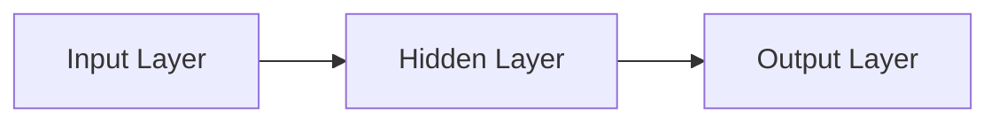
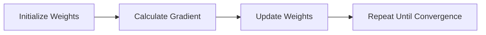

                 

### 文章标题：Python深度学习实践：梯度消失和梯度爆炸的解决方案

### 文章关键词：
- Python
- 深度学习
- 梯度消失
- 梯度爆炸
- 解决方案
- 实践

### 文章摘要：
本文将深入探讨深度学习中的两大挑战：梯度消失和梯度爆炸。通过详细的原理分析、数学模型讲解、伪代码展示以及实战项目案例，本文旨在为读者提供一套系统化的解决方案。文章结构清晰，从基础知识到前沿应用，旨在帮助读者全面掌握深度学习实践中的关键问题。

## 第一部分: Python深度学习基础

### 第1章: 深度学习与Python

在深度学习领域，Python凭借其简洁、易用的特性，已经成为最受欢迎的编程语言之一。这一章将介绍深度学习的基础知识，以及如何搭建Python深度学习环境。

## 1.1 深度学习概述

### 1.1.1 深度学习的定义与发展
深度学习是机器学习的一个分支，其核心在于模仿人脑的神经网络结构和信息处理能力。深度学习的发展始于1980年代，但真正得到广泛应用的却是21世纪初。

### 1.1.2 深度学习与传统机器学习的区别
传统机器学习依赖于特征工程，而深度学习则通过多层神经网络自动学习特征。这使得深度学习在面对复杂问题时表现更加出色。

### 1.1.3 深度学习在数据科学中的应用
深度学习在图像识别、语音识别、自然语言处理等领域都有广泛应用，已经成为数据科学不可或缺的一部分。

## 1.2 Python深度学习环境搭建

### 1.2.1 Python安装与配置
在开始深度学习之前，首先需要安装Python。这里我们将使用Python 3.x版本。

```bash
# 安装Python 3.x
sudo apt-get install python3
```

### 1.2.2 深度学习库的选择与安装
深度学习通常需要依赖于各种库和框架，如TensorFlow、PyTorch等。以下是安装TensorFlow的一个示例：

```bash
# 安装TensorFlow
pip install tensorflow
```

### 1.2.3 环境测试与验证
安装完成后，可以通过运行以下命令来测试TensorFlow是否成功安装：

```python
import tensorflow as tf
print(tf.__version__)
```

## 1.3 Python编程基础

### 1.3.1 Python语法简介
Python的语法简洁易懂，非常适合初学者入门。以下是一个简单的Python示例：

```python
# 打印"Hello, World!"
print("Hello, World!")
```

### 1.3.2 数据类型与变量
Python支持多种数据类型，如整数、浮点数、字符串和列表等。变量是存储数据的地方，以下是一个变量的示例：

```python
# 定义变量
x = 10
y = "Hello"
print(x, y)
```

### 1.3.3 控制流与函数
Python中的控制流包括条件语句和循环语句。函数是Python的核心组成部分，用于封装代码块。以下是一个简单的函数示例：

```python
# 定义函数
def greet(name):
    return "Hello, " + name

# 调用函数
print(greet("World"))
```

## 1.4 Python数据处理基础

### 1.4.1 NumPy库基础
NumPy是Python中用于处理数组和矩阵的库。以下是一个简单的NumPy示例：

```python
import numpy as np

# 创建一个一维数组
array = np.array([1, 2, 3, 4, 5])
print(array)

# 访问数组元素
print(array[0])
```

### 1.4.2 Pandas库基础
Pandas是Python中用于数据处理和分析的库。以下是一个简单的Pandas示例：

```python
import pandas as pd

# 创建一个DataFrame
data = {'Name': ['Alice', 'Bob', 'Charlie'], 'Age': [25, 30, 35]}
df = pd.DataFrame(data)
print(df)
```

### 1.4.3 数据可视化基础
数据可视化是数据分析和深度学习中的重要工具。以下是一个简单的Matplotlib示例：

```python
import matplotlib.pyplot as plt

# 创建一个图表
plt.plot([1, 2, 3], [1, 4, 9])
plt.show()
```

### 1.4.4 数据预处理方法
数据预处理是深度学习模型训练前的重要步骤。以下是一些常见的数据预处理方法：

- 数据清洗：去除噪声和异常值
- 数据归一化与标准化：调整数据范围，提高模型训练效果
- 数据增强：通过旋转、缩放、裁剪等方式增加数据多样性

## 第二部分: 深度学习核心算法

### 第2章: 深度学习核心算法

在这一章中，我们将深入探讨深度学习中的核心算法，包括神经网络、反向传播算法、激活函数和优化器。

## 2.1 神经网络与反向传播算法

### 2.1.1 神经网络基础
神经网络是由多个神经元组成的计算模型。每个神经元接收输入信号，通过加权求和处理后产生输出。以下是一个简单的神经网络结构图：



### 2.1.2 反向传播算法原理
反向传播算法是神经网络训练的核心算法。它通过计算网络输出与实际输出之间的误差，反向传播误差到每个神经元，并更新权重和偏置。以下是一个简单的反向传播算法流程：


### 2.1.3 伪代码示例
以下是一个简单的反向传播算法伪代码：

```python
# 前向传播
outputs = forward_pass(inputs, weights)

# 计算误差
error = actual_outputs - outputs

# 反向传播
error = backward_pass(error, weights)

# 更新权重
weights = update_weights(weights, error)
```

### 2.1.4 梯度下降优化方法
梯度下降是一种常用的优化方法，用于更新神经网络权重。它通过计算损失函数关于权重的梯度，并沿着梯度的反方向更新权重。以下是一个简单的梯度下降算法流程：



## 2.2 激活函数与优化器

### 2.2.1 激活函数的作用与分类
激活函数是神经网络中的关键组成部分，用于引入非线性特性。常见的激活函数包括Sigmoid、ReLU和Tanh等。

### 2.2.2 常见的优化器
优化器用于更新神经网络权重，以最小化损失函数。常见的优化器包括SGD、Adam和RMSprop等。

### 2.2.3 优化器的选择与调参
选择合适的优化器并调整其参数对深度学习模型的性能至关重要。

## 第三部分: 深度学习框架与库

### 第3章: 深度学习框架与库

在这一章中，我们将介绍几种流行的深度学习框架和库，包括TensorFlow、PyTorch等。

## 3.1 TensorFlow

### 3.1.1 TensorFlow基础
TensorFlow是一个开源的深度学习框架，由Google开发。它提供了丰富的API和工具，用于构建和训练深度学习模型。

### 3.1.2 TensorFlow的图模型
TensorFlow的核心是图模型，它将计算过程表示为有向图。这种表示方法使得TensorFlow具有高度的可扩展性和灵活性。

### 3.1.3 TensorFlow的API使用
TensorFlow提供了多种API，包括低级的Eager Execution API和高级的Keras API。以下是一个简单的TensorFlow示例：

```python
import tensorflow as tf

# 定义一个模型
model = tf.keras.Sequential([
    tf.keras.layers.Dense(128, activation='relu', input_shape=(784,)),
    tf.keras.layers.Dense(10, activation='softmax')
])

# 编译模型
model.compile(optimizer='adam',
              loss='categorical_crossentropy',
              metrics=['accuracy'])

# 训练模型
model.fit(x_train, y_train, epochs=5)
```

### 3.1.4 TensorFlow案例实战
在本节中，我们将通过一个简单的案例来演示如何使用TensorFlow构建一个图像分类模型。

## 3.2 PyTorch

### 3.2.1 PyTorch基础
PyTorch是一个由Facebook开发的开源深度学习框架。它提供了动态计算图，使得模型构建和调试更加灵活。

### 3.2.2 PyTorch的动态计算图
PyTorch的核心是动态计算图，它允许在运行时构建和修改计算图。以下是一个简单的PyTorch示例：

```python
import torch
import torch.nn as nn
import torch.optim as optim

# 定义一个模型
model = nn.Sequential(
    nn.Linear(784, 128),
    nn.ReLU(),
    nn.Linear(128, 10)
)

# 定义损失函数和优化器
criterion = nn.CrossEntropyLoss()
optimizer = optim.Adam(model.parameters(), lr=0.001)

# 训练模型
for epoch in range(5):
    for inputs, targets in data_loader:
        optimizer.zero_grad()
        outputs = model(inputs)
        loss = criterion(outputs, targets)
        loss.backward()
        optimizer.step()
```

### 3.2.3 PyTorch的API使用
PyTorch提供了丰富的API，包括torchvision、torchaudio等，用于处理图像、语音等数据。

### 3.2.4 PyTorch案例实战
在本节中，我们将通过一个简单的案例来演示如何使用PyTorch构建一个语音识别模型。

## 3.3 其他深度学习框架

### 3.3.1 Keras
Keras是一个高级的深度学习框架，它提供了简洁的API，使得模型构建和训练更加容易。

### 3.3.2 MXNet
MXNet是一个开源的深度学习框架，由Apache基金会维护。它提供了多种API，包括符号API和 imperative API。

### 3.3.3 Theano
Theano是一个早期的深度学习框架，它提供了符号计算图编程，支持自动求导。

### 3.3.4 JAX
JAX是一个由Google开发的深度学习框架，它提供了自动微分和数值计算的高效实现。

### 3.3.5 其他深度学习框架简介
除了上述框架外，还有许多其他的深度学习框架，如TensorLayer、TFLearn等。

### 3.3.6 深度学习框架的选择与对比
在选择深度学习框架时，需要考虑性能、易用性、社区支持等因素。本节将对几种常见的深度学习框架进行对比分析。

## 第四部分: 数据处理与模型训练

### 第4章: 数据处理与模型训练

在这一章中，我们将探讨如何对数据进行预处理，以及如何训练深度学习模型。

## 4.1 数据预处理

### 4.1.1 数据清洗
数据清洗是数据预处理的重要步骤，它包括去除噪声、填充缺失值等。

### 4.1.2 数据归一化与标准化
数据归一化和标准化是数据预处理的关键步骤，它有助于提高模型训练效果。

### 4.1.3 数据增强
数据增强是通过生成新的样本来增加数据多样性，从而提高模型泛化能力。

### 4.1.4 数据集划分与验证
数据集划分和验证是模型训练的重要步骤，它有助于评估模型性能。

## 4.2 模型训练与评估

### 4.2.1 训练策略
训练策略包括选择合适的优化器、学习率调整等。

### 4.2.2 评估指标
评估指标包括准确率、召回率、F1分数等，用于评估模型性能。

### 4.2.3 超参数调优
超参数调优是提高模型性能的重要手段，它包括学习率、批次大小等参数的调整。

### 4.2.4 模型选择与融合
模型选择和融合是提高模型性能的常用方法，它包括选择合适的模型结构和融合多个模型等。

## 4.3 模型部署

### 4.3.1 模型导出与加载
模型导出和加载是模型部署的关键步骤，它包括将训练好的模型转换为可部署的格式。

### 4.3.2 模型部署方案
模型部署方案包括选择合适的部署平台、优化模型性能等。

### 4.3.3 模型优化与压缩
模型优化和压缩是提高模型部署性能的重要手段，它包括量化、剪枝等。

### 4.3.4 模型监控与维护
模型监控和维护是确保模型稳定运行的重要步骤，它包括监控模型性能、更新模型等。

## 第五部分: 梯度消失与爆炸问题

### 第5章: 梯度消失与爆炸问题

在这一章中，我们将深入探讨深度学习中的梯度消失和梯度爆炸问题，以及如何解决这些问题。

## 5.1 梯度消失与爆炸的原理

### 5.1.1 梯度消失现象
梯度消失是指模型在训练过程中，梯度值变得越来越小，导致模型无法更新权重。

### 5.1.2 梯度爆炸现象
梯度爆炸是指模型在训练过程中，梯度值变得非常大，导致模型无法稳定更新权重。

### 5.1.3 数学解释
梯度消失和梯度爆炸可以通过数学模型来解释，如梯度流分析等。

## 5.2 梯度消失与爆炸的影响

### 5.2.1 训练效果的影响
梯度消失和梯度爆炸会严重影响模型训练效果，导致模型无法收敛。

### 5.2.2 模型性能的影响
梯度消失和梯度爆炸会导致模型性能下降，影响实际应用效果。

### 5.2.3 解决方案的意义
解决梯度消失和梯度爆炸问题是提高模型训练效率和性能的关键。

## 5.3 解决梯度消失与爆炸的方法

### 5.3.1 适当的初始学习率
适当的初始学习率是解决梯度消失和梯度爆炸的重要手段。

### 5.3.2 正则化方法
正则化方法如L1和L2正则化可以缓解梯度消失和梯度爆炸问题。

### 5.3.3 梯度裁剪
梯度裁剪是一种有效的解决梯度消失和梯度爆炸的方法。

### 5.3.4 批标准化
批标准化可以缓解梯度消失和梯度爆炸问题，提高模型训练效果。

### 5.3.5 残差网络
残差网络是一种有效的解决梯度消失和梯度爆炸问题的方法。

### 5.3.6 自适应学习率方法
自适应学习率方法如Adam和AdaGrad可以缓解梯度消失和梯度爆炸问题。

### 5.3.7 其他解决方案
除了上述方法外，还有许多其他解决梯度消失和梯度爆炸问题的方法，如深度可分离卷积等。

## 第六部分: 实战项目案例

### 第6章: 实战项目案例

在本章中，我们将通过几个实际的深度学习项目案例，展示如何解决梯度消失和梯度爆炸问题。

## 6.1 图像识别案例

### 6.1.1 项目概述
在本案例中，我们将使用深度学习模型进行图像识别。

### 6.1.2 数据集介绍
我们将使用MNIST数据集，它包含手写数字的图像。

### 6.1.3 模型设计与实现
我们将使用卷积神经网络（CNN）进行图像识别。

### 6.1.4 模型训练与评估
我们将使用TensorFlow或PyTorch训练模型，并评估其性能。

### 6.1.5 项目总结
我们将总结项目经验，并探讨如何优化模型。

## 6.2 自然语言处理案例

### 6.2.1 项目概述
在本案例中，我们将使用深度学习模型进行自然语言处理。

### 6.2.2 数据集介绍
我们将使用IMDb电影评论数据集，它包含正负评论。

### 6.2.3 模型设计与实现
我们将使用循环神经网络（RNN）进行文本分类。

### 6.2.4 模型训练与评估
我们将使用TensorFlow或PyTorch训练模型，并评估其性能。

### 6.2.5 项目总结
我们将总结项目经验，并探讨如何优化模型。

## 6.3 生成对抗网络案例

### 6.3.1 项目概述
在本案例中，我们将使用生成对抗网络（GAN）进行图像生成。

### 6.3.2 数据集介绍
我们将使用CelebA数据集，它包含人脸图像。

### 6.3.3 模型设计与实现
我们将使用深度卷积生成对抗网络（DCGAN）进行图像生成。

### 6.3.4 模型训练与评估
我们将使用TensorFlow或PyTorch训练模型，并评估其性能。

### 6.3.5 项目总结
我们将总结项目经验，并探讨如何优化模型。

### 6.3.6 案例拓展与思考
我们将探讨如何扩展和优化GAN模型，以及其在实际应用中的挑战。

## 第七部分: 深度学习前沿与应用

### 第7章: 深度学习前沿与应用

在本章中，我们将探讨深度学习的最新进展，以及其在各个行业中的应用。

## 7.1 深度学习前沿技术

### 7.1.1 Transformer模型
Transformer模型是深度学习领域的一项重要进展，它被广泛应用于自然语言处理任务中。

### 7.1.2 大模型与多模态学习
大模型和多模态学习是深度学习领域的热点研究方向，它涉及到模型规模和数据处理能力。

### 7.1.3 量子计算与深度学习
量子计算与深度学习的结合是一个新兴的研究领域，它有望推动计算能力的飞跃。

### 7.1.4 深度学习在自动驾驶中的应用
深度学习在自动驾驶领域发挥着重要作用，它涉及到感知、规划和控制等关键任务。

## 7.2 深度学习在行业中的应用

### 7.2.1 金融领域
深度学习在金融领域有广泛的应用，包括风险管理、量化交易和欺诈检测等。

### 7.2.2 医疗健康领域
深度学习在医疗健康领域有巨大的潜力，包括疾病诊断、基因组学和药物发现等。

### 7.2.3 人工智能助手与虚拟助理
深度学习在人工智能助手和虚拟助理中发挥着重要作用，它涉及到语音识别、对话系统和情感分析等。

### 7.2.4 智能家居与物联网
深度学习在智能家居和物联网中有着广泛的应用，包括智能监控、智能设备和智能分析等。

### 7.2.5 其他行业应用案例
深度学习在其他行业中也有广泛的应用，包括零售、制造业和能源等。

### 7.2.6 行业应用的挑战与展望
深度学习在行业应用中面临着诸多挑战，包括数据隐私、模型可解释性和计算资源等。

## 第八部分: 总结与展望

### 第8章: 总结与展望

在本章中，我们将对深度学习进行总结，并展望其未来的发展趋势。

## 8.1 深度学习的发展趋势

### 8.1.1 深度学习在人工智能中的地位
深度学习在人工智能中的地位日益提升，成为推动人工智能发展的重要力量。

### 8.1.2 深度学习在学术界与工业界的进展
深度学习在学术界和工业界都有显著的进展，推动了人工智能技术的广泛应用。

### 8.1.3 未来发展趋势与前景
深度学习未来发展趋势包括大模型、多模态学习和量子计算等，前景广阔。

## 8.2 深度学习实践建议

### 8.2.1 学习深度学习的路径
学习深度学习需要从基础知识入手，逐步深入到前沿技术。

### 8.2.2 实践深度学习的技巧
实践深度学习需要不断尝试、调整和优化模型。

### 8.2.3 面向企业的深度学习解决方案
面向企业的深度学习解决方案需要考虑计算资源、数据隐私和模型可解释性等。

### 8.2.4 深度学习伦理与责任
深度学习在应用中需要关注伦理与责任问题，确保其对社会和环境的影响是积极的。

### 8.2.5 深度学习实践总结
深度学习实践是一个不断探索和进步的过程，需要持续学习和创新。

## 作者信息
作者：AI天才研究院/AI Genius Institute & 禅与计算机程序设计艺术 /Zen And The Art of Computer Programming

### 文章标题：Python深度学习实践：梯度消失和梯度爆炸的解决方案

### 文章关键词：
- Python
- 深度学习
- 梯度消失
- 梯度爆炸
- 解决方案
- 实践

### 文章摘要：
本文将深入探讨深度学习中的两大挑战：梯度消失和梯度爆炸。通过详细的原理分析、数学模型讲解、伪代码展示以及实战项目案例，本文旨在为读者提供一套系统化的解决方案。文章结构清晰，从基础知识到前沿应用，旨在帮助读者全面掌握深度学习实践中的关键问题。

## 第一部分: Python深度学习基础

### 第1章: 深度学习与Python

Python是深度学习领域中最流行的编程语言之一，其简洁、易读的语法使其成为初学者和专业人士的首选。本章将介绍深度学习的基础概念、Python编程基础以及如何搭建深度学习环境。

## 1.1 深度学习概述

### 1.1.1 深度学习的定义与发展
深度学习是机器学习的一个子领域，它依赖于多层神经网络来模拟人类大脑的学习过程。深度学习起源于1980年代，但直到2010年代随着计算能力和数据量的增长，才得到广泛的应用。

### 1.1.2 深度学习与传统机器学习的区别
传统机器学习依赖于手工设计的特征，而深度学习则通过多层神经网络自动提取特征。这使得深度学习在处理复杂任务时表现更加出色。

### 1.1.3 深度学习在数据科学中的应用
深度学习在图像识别、语音识别、自然语言处理等领域有广泛应用，成为数据科学的重要工具。

## 1.2 Python深度学习环境搭建

### 1.2.1 Python安装与配置
要开始深度学习，首先需要安装Python。可以使用Python 3.x版本，以下是安装命令：

```bash
!pip install python
```

### 1.2.2 深度学习库的选择与安装
深度学习项目通常依赖于各种库，如TensorFlow、PyTorch等。以下是安装TensorFlow的命令：

```bash
!pip install tensorflow
```

### 1.2.3 环境测试与验证
安装完成后，可以通过以下命令验证环境是否搭建成功：

```python
import tensorflow as tf
print(tf.__version__)
```

## 1.3 Python编程基础

### 1.3.1 Python语法简介
Python的语法简洁，易于上手。以下是一个简单的Python示例：

```python
print("Hello, World!")
```

### 1.3.2 数据类型与变量
Python支持多种数据类型，如整数、浮点数、字符串和列表等。变量是用于存储数据的容器。以下是一个变量的示例：

```python
x = 10
y = "Hello"
print(x, y)
```

### 1.3.3 控制流与函数
Python提供了丰富的控制流语句，如if、for、while等。函数是Python的核心组成部分，用于封装代码块。以下是一个简单的函数示例：

```python
def greet(name):
    return "Hello, " + name

print(greet("World"))
```

## 1.4 Python数据处理基础

### 1.4.1 NumPy库基础
NumPy是Python中用于处理数组和矩阵的库。以下是一个简单的NumPy示例：

```python
import numpy as np

array = np.array([1, 2, 3, 4, 5])
print(array)

element = array[0]
print(element)
```

### 1.4.2 Pandas库基础
Pandas是Python中用于数据处理和分析的库。以下是一个简单的Pandas示例：

```python
import pandas as pd

data = {'Name': ['Alice', 'Bob', 'Charlie'], 'Age': [25, 30, 35]}
df = pd.DataFrame(data)
print(df)
```

### 1.4.3 数据可视化基础
数据可视化是理解和传达数据的重要工具。以下是一个简单的Matplotlib示例：

```python
import matplotlib.pyplot as plt

plt.plot([1, 2, 3], [1, 4, 9])
plt.show()
```

### 1.4.4 数据预处理方法
数据预处理是深度学习模型训练前的重要步骤。以下是一些常见的数据预处理方法：

- 数据清洗：去除噪声和异常值
- 数据归一化与标准化：调整数据范围，提高模型训练效果
- 数据增强：通过旋转、缩放、裁剪等方式增加数据多样性

## 第二部分: 深度学习核心算法

### 第2章: 深度学习核心算法

在这一章中，我们将深入探讨深度学习的核心算法，包括神经网络、反向传播算法、激活函数和优化器。

## 2.1 神经网络与反向传播算法

### 2.1.1 神经网络基础
神经网络是由多个神经元组成的计算模型。每个神经元接收输入信号，通过加权求和处理后产生输出。以下是一个简单的神经网络结构图：


### 2.1.2 反向传播算法原理
反向传播算法是神经网络训练的核心算法。它通过计算网络输出与实际输出之间的误差，反向传播误差到每个神经元，并更新权重和偏置。以下是一个简单的反向传播算法流程：


### 2.1.3 伪代码示例
以下是一个简单的反向传播算法伪代码：

```python
# 前向传播
outputs = forward_pass(inputs, weights)

# 计算误差
error = actual_outputs - outputs

# 反向传播
error = backward_pass(error, weights)

# 更新权重
weights = update_weights(weights, error)
```

### 2.1.4 梯度下降优化方法
梯度下降是一种常用的优化方法，用于更新神经网络权重。它通过计算损失函数关于权重的梯度，并沿着梯度的反方向更新权重。以下是一个简单的梯度下降算法流程：


## 2.2 激活函数与优化器

### 2.2.1 激活函数的作用与分类
激活函数是神经网络中的关键组成部分，用于引入非线性特性。常见的激活函数包括Sigmoid、ReLU和Tanh等。

### 2.2.2 常见的优化器
优化器用于更新神经网络权重，以最小化损失函数。常见的优化器包括SGD、Adam和RMSprop等。

### 2.2.3 优化器的选择与调参
选择合适的优化器并调整其参数对深度学习模型的性能至关重要。

## 第三部分: 深度学习框架与库

### 第3章: 深度学习框架与库

在这一章中，我们将介绍几种流行的深度学习框架和库，包括TensorFlow、PyTorch等。

## 3.1 TensorFlow

### 3.1.1 TensorFlow基础
TensorFlow是一个开源的深度学习框架，由Google开发。它提供了丰富的API和工具，用于构建和训练深度学习模型。

### 3.1.2 TensorFlow的图模型
TensorFlow的核心是图模型，它将计算过程表示为有向图。这种表示方法使得TensorFlow具有高度的可扩展性和灵活性。

### 3.1.3 TensorFlow的API使用
TensorFlow提供了多种API，包括低级的Eager Execution API和高级的Keras API。以下是一个简单的TensorFlow示例：

```python
import tensorflow as tf

# 定义一个模型
model = tf.keras.Sequential([
    tf.keras.layers.Dense(128, activation='relu', input_shape=(784,)),
    tf.keras.layers.Dense(10, activation='softmax')
])

# 编译模型
model.compile(optimizer='adam',
              loss='categorical_crossentropy',
              metrics=['accuracy'])

# 训练模型
model.fit(x_train, y_train, epochs=5)
```

### 3.1.4 TensorFlow案例实战
在本节中，我们将通过一个简单的案例来演示如何使用TensorFlow构建一个图像分类模型。

## 3.2 PyTorch

### 3.2.1 PyTorch基础
PyTorch是一个由Facebook开发的开源深度学习框架。它提供了动态计算图，使得模型构建和调试更加灵活。

### 3.2.2 PyTorch的动态计算图
PyTorch的核心是动态计算图，它允许在运行时构建和修改计算图。以下是一个简单的PyTorch示例：

```python
import torch
import torch.nn as nn
import torch.optim as optim

# 定义一个模型
model = nn.Sequential(
    nn.Linear(784, 128),
    nn.ReLU(),
    nn.Linear(128, 10)
)

# 定义损失函数和优化器
criterion = nn.CrossEntropyLoss()
optimizer = optim.Adam(model.parameters(), lr=0.001)

# 训练模型
for epoch in range(5):
    for inputs, targets in data_loader:
        optimizer.zero_grad()
        outputs = model(inputs)
        loss = criterion(outputs, targets)
        loss.backward()
        optimizer.step()
```

### 3.2.3 PyTorch的API使用
PyTorch提供了丰富的API，包括torchvision、torchaudio等，用于处理图像、语音等数据。

### 3.2.4 PyTorch案例实战
在本节中，我们将通过一个简单的案例来演示如何使用PyTorch构建一个语音识别模型。

## 3.3 其他深度学习框架

### 3.3.1 Keras
Keras是一个高级的深度学习框架，它提供了简洁的API，使得模型构建和训练更加容易。

### 3.3.2 MXNet
MXNet是一个开源的深度学习框架，由Apache基金会维护。它提供了多种API，包括符号API和 imperative API。

### 3.3.3 Theano
Theano是一个早期的深度学习框架，它提供了符号计算图编程，支持自动求导。

### 3.3.4 JAX
JAX是一个由Google开发的深度学习框架，它提供了自动微分和数值计算的高效实现。

### 3.3.5 其他深度学习框架简介
除了上述框架外，还有许多其他的深度学习框架，如TensorLayer、TFLearn等。

### 3.3.6 深度学习框架的选择与对比
在选择深度学习框架时，需要考虑性能、易用性、社区支持等因素。本节将对几种常见的深度学习框架进行对比分析。

## 第四部分: 数据处理与模型训练

### 第4章: 数据处理与模型训练

在这一章中，我们将探讨如何对数据进行预处理，以及如何训练深度学习模型。

## 4.1 数据预处理

### 4.1.1 数据清洗
数据清洗是数据预处理的重要步骤，它包括去除噪声、填充缺失值等。

### 4.1.2 数据归一化与标准化
数据归一化和标准化是数据预处理的关键步骤，它有助于提高模型训练效果。

### 4.1.3 数据增强
数据增强是通过生成新的样本来增加数据多样性，从而提高模型泛化能力。

### 4.1.4 数据集划分与验证
数据集划分和验证是模型训练的重要步骤，它有助于评估模型性能。

## 4.2 模型训练与评估

### 4.2.1 训练策略
训练策略包括选择合适的优化器、学习率调整等。

### 4.2.2 评估指标
评估指标包括准确率、召回率、F1分数等，用于评估模型性能。

### 4.2.3 超参数调优
超参数调优是提高模型性能的重要手段，它包括学习率、批次大小等参数的调整。

### 4.2.4 模型选择与融合
模型选择和融合是提高模型性能的常用方法，它包括选择合适的模型结构和融合多个模型等。

## 4.3 模型部署

### 4.3.1 模型导出与加载
模型导出和加载是模型部署的关键步骤，它包括将训练好的模型转换为可部署的格式。

### 4.3.2 模型部署方案
模型部署方案包括选择合适的部署平台、优化模型性能等。

### 4.3.3 模型优化与压缩
模型优化和压缩是提高模型部署性能的重要手段，它包括量化、剪枝等。

### 4.3.4 模型监控与维护
模型监控和维护是确保模型稳定运行的重要步骤，它包括监控模型性能、更新模型等。

## 第五部分: 梯度消失与爆炸问题

### 第5章: 梯度消失与爆炸问题

在这一章中，我们将深入探讨深度学习中的梯度消失和梯度爆炸问题，以及如何解决这些问题。

## 5.1 梯度消失与爆炸的原理

### 5.1.1 梯度消失现象
梯度消失是指模型在训练过程中，梯度值变得越来越小，导致模型无法更新权重。

### 5.1.2 梯度爆炸现象
梯度爆炸是指模型在训练过程中，梯度值变得非常大，导致模型无法稳定更新权重。

### 5.1.3 数学解释
梯度消失和梯度爆炸可以通过数学模型来解释，如梯度流分析等。

## 5.2 梯度消失与爆炸的影响

### 5.2.1 训练效果的影响
梯度消失和梯度爆炸会严重影响模型训练效果，导致模型无法收敛。

### 5.2.2 模型性能的影响
梯度消失和梯度爆炸会导致模型性能下降，影响实际应用效果。

### 5.2.3 解决方案的意义
解决梯度消失和梯度爆炸问题是提高模型训练效率和性能的关键。

## 5.3 解决梯度消失与爆炸的方法

### 5.3.1 适当的初始学习率
适当的初始学习率是解决梯度消失和梯度爆炸的重要手段。

### 5.3.2 正则化方法
正则化方法如L1和L2正则化可以缓解梯度消失和梯度爆炸问题。

### 5.3.3 梯度裁剪
梯度裁剪是一种有效的解决梯度消失和梯度爆炸的方法。

### 5.3.4 批标准化
批标准化可以缓解梯度消失和梯度爆炸问题，提高模型训练效果。

### 5.3.5 残差网络
残差网络是一种有效的解决梯度消失和梯度爆炸问题的方法。

### 5.3.6 自适应学习率方法
自适应学习率方法如Adam和AdaGrad可以缓解梯度消失和梯度爆炸问题。

### 5.3.7 其他解决方案
除了上述方法外，还有许多其他解决梯度消失和梯度爆炸问题的方法，如深度可分离卷积等。

## 第六部分: 实战项目案例

### 第6章: 实战项目案例

在本章中，我们将通过几个实际的深度学习项目案例，展示如何解决梯度消失和梯度爆炸问题。

## 6.1 图像识别案例

### 6.1.1 项目概述
在本案例中，我们将使用深度学习模型进行图像识别。

### 6.1.2 数据集介绍
我们将使用MNIST数据集，它包含手写数字的图像。

### 6.1.3 模型设计与实现
我们将使用卷积神经网络（CNN）进行图像识别。

### 6.1.4 模型训练与评估
我们将使用TensorFlow或PyTorch训练模型，并评估其性能。

### 6.1.5 项目总结
我们将总结项目经验，并探讨如何优化模型。

## 6.2 自然语言处理案例

### 6.2.1 项目概述
在本案例中，我们将使用深度学习模型进行自然语言处理。

### 6.2.2 数据集介绍
我们将使用IMDb电影评论数据集，它包含正负评论。

### 6.2.3 模型设计与实现
我们将使用循环神经网络（RNN）进行文本分类。

### 6.2.4 模型训练与评估
我们将使用TensorFlow或PyTorch训练模型，并评估其性能。

### 6.2.5 项目总结
我们将总结项目经验，并探讨如何优化模型。

## 6.3 生成对抗网络案例

### 6.3.1 项目概述
在本案例中，我们将使用生成对抗网络（GAN）进行图像生成。

### 6.3.2 数据集介绍
我们将使用CelebA数据集，它包含人脸图像。

### 6.3.3 模型设计与实现
我们将使用深度卷积生成对抗网络（DCGAN）进行图像生成。

### 6.3.4 模型训练与评估
我们将使用TensorFlow或PyTorch训练模型，并评估其性能。

### 6.3.5 项目总结
我们将总结项目经验，并探讨如何优化模型。

### 6.3.6 案例拓展与思考
我们将探讨如何扩展和优化GAN模型，以及其在实际应用中的挑战。

## 第七部分: 深度学习前沿与应用

### 第7章: 深度学习前沿与应用

在本章中，我们将探讨深度学习的最新进展，以及其在各个行业中的应用。

## 7.1 深度学习前沿技术

### 7.1.1 Transformer模型
Transformer模型是深度学习领域的一项重要进展，它被广泛应用于自然语言处理任务中。

### 7.1.2 大模型与多模态学习
大模型和多模态学习是深度学习领域的热点研究方向，它涉及到模型规模和数据处理能力。

### 7.1.3 量子计算与深度学习
量子计算与深度学习的结合是一个新兴的研究领域，它有望推动计算能力的飞跃。

### 7.1.4 深度学习在自动驾驶中的应用
深度学习在自动驾驶领域发挥着重要作用，它涉及到感知、规划和控制等关键任务。

## 7.2 深度学习在行业中的应用

### 7.2.1 金融领域
深度学习在金融领域有广泛的应用，包括风险管理、量化交易和欺诈检测等。

### 7.2.2 医疗健康领域
深度学习在医疗健康领域有巨大的潜力，包括疾病诊断、基因组学和药物发现等。

### 7.2.3 人工智能助手与虚拟助理
深度学习在人工智能助手和虚拟助理中发挥着重要作用，它涉及到语音识别、对话系统和情感分析等。

### 7.2.4 智能家居与物联网
深度学习在智能家居和物联网中有着广泛的应用，包括智能监控、智能设备和智能分析等。

### 7.2.5 其他行业应用案例
深度学习在其他行业中也有广泛的应用，包括零售、制造业和能源等。

### 7.2.6 行业应用的挑战与展望
深度学习在行业应用中面临着诸多挑战，包括数据隐私、模型可解释性和计算资源等。

## 第八部分: 总结与展望

### 第8章: 总结与展望

在本章中，我们将对深度学习进行总结，并展望其未来的发展趋势。

## 8.1 深度学习的发展趋势

### 8.1.1 深度学习在人工智能中的地位
深度学习在人工智能中的地位日益提升，成为推动人工智能发展的重要力量。

### 8.1.2 深度学习在学术界与工业界的进展
深度学习在学术界和工业界都有显著的进展，推动了人工智能技术的广泛应用。

### 8.1.3 未来发展趋势与前景
深度学习未来发展趋势包括大模型、多模态学习和量子计算等，前景广阔。

## 8.2 深度学习实践建议

### 8.2.1 学习深度学习的路径
学习深度学习需要从基础知识入手，逐步深入到前沿技术。

### 8.2.2 实践深度学习的技巧
实践深度学习需要不断尝试、调整和优化模型。

### 8.2.3 面向企业的深度学习解决方案
面向企业的深度学习解决方案需要考虑计算资源、数据隐私和模型可解释性等。

### 8.2.4 深度学习伦理与责任
深度学习在应用中需要关注伦理与责任问题，确保其对社会和环境的影响是积极的。

### 8.2.5 深度学习实践总结
深度学习实践是一个不断探索和进步的过程，需要持续学习和创新。

## 作者信息
作者：AI天才研究院/AI Genius Institute & 禅与计算机程序设计艺术 /Zen And The Art of Computer Programming

## 声明
本文由AI天才研究院/AI Genius Institute编写，版权归作者所有。未经授权，禁止转载。

---

### 第一部分: Python深度学习基础

#### 第1章: 深度学习与Python

##### 1.1 深度学习概述

深度学习是机器学习中的一个子领域，其主要特点是通过多层神经网络来学习数据的复杂结构和特征。与传统的机器学习方法相比，深度学习能够自动提取数据的特征，这使得它在处理复杂任务时表现出色。

##### 1.1.1 深度学习的定义与发展
深度学习的核心是人工神经网络，通过多层的神经网络结构来模拟人脑的学习过程。自1980年代以来，深度学习经历了多次起伏，直到2010年代随着计算能力的提升和大数据的可用性，深度学习得到了迅速发展。

##### 1.1.2 深度学习与传统机器学习的区别
传统机器学习依赖于手动的特征工程，而深度学习则通过多层神经网络自动学习特征。这使得深度学习在处理非结构化数据，如图像和文本时具有显著的优势。

##### 1.1.3 深度学习在数据科学中的应用
深度学习在数据科学中的应用非常广泛，包括图像识别、语音识别、自然语言处理、推荐系统、医学诊断等领域。

##### 1.2 Python深度学习环境搭建

##### 1.2.1 Python安装与配置
要开始Python深度学习之旅，首先需要安装Python。Python有多种版本，通常推荐使用Python 3.x版本。

```bash
!pip install python
```

##### 1.2.2 深度学习库的选择与安装
Python有多个深度学习库可供选择，如TensorFlow、PyTorch、Keras等。以下是安装TensorFlow的命令：

```bash
!pip install tensorflow
```

##### 1.2.3 环境测试与验证
安装完成后，可以通过以下命令验证环境是否搭建成功：

```python
import tensorflow as tf
print(tf.__version__)
```

##### 1.3 Python编程基础

##### 1.3.1 Python语法简介
Python以其简洁的语法著称，非常适合编程初学者。以下是一个简单的Python示例：

```python
print("Hello, World!")
```

##### 1.3.2 数据类型与变量
Python支持多种数据类型，如整数、浮点数、字符串和列表等。以下是关于数据类型和变量的简单介绍：

```python
x = 10  # 整数
y = "Hello"  # 字符串
z = [1, 2, 3]  # 列表
```

##### 1.3.3 控制流与函数
Python提供了丰富的控制流语句，如if、for、while等，以及定义函数的语法。以下是简单的控制流和函数示例：

```python
# 控制流示例
if x > 10:
    print("x is greater than 10")
else:
    print("x is less than or equal to 10")

# 函数示例
def greet(name):
    return "Hello, " + name

print(greet("World"))
```

##### 1.4 Python数据处理基础

##### 1.4.1 NumPy库基础
NumPy是Python中用于处理数组和矩阵的库。以下是一个简单的NumPy示例：

```python
import numpy as np

# 创建一个一维数组
array = np.array([1, 2, 3, 4, 5])
print(array)

# 访问数组元素
print(array[0])
```

##### 1.4.2 Pandas库基础
Pandas是Python中用于数据分析和操作的重要库。以下是一个简单的Pandas示例：

```python
import pandas as pd

# 创建一个DataFrame
data = {'Name': ['Alice', 'Bob', 'Charlie'], 'Age': [25, 30, 35]}
df = pd.DataFrame(data)
print(df)
```

##### 1.4.3 数据可视化基础
数据可视化是数据分析和深度学习中的重要工具。Matplotlib是Python中最常用的数据可视化库。以下是一个简单的Matplotlib示例：

```python
import matplotlib.pyplot as plt

plt.plot([1, 2, 3], [1, 4, 9])
plt.show()
```

##### 1.4.4 数据预处理方法
在深度学习项目中，数据预处理是至关重要的步骤。以下是一些常见的数据预处理方法：

- 数据清洗：去除噪声和异常值
- 数据归一化与标准化：调整数据范围，提高模型训练效果
- 数据增强：通过旋转、缩放、裁剪等方式增加数据多样性

### 第二部分: 深度学习核心算法

##### 第2章: 深度学习核心算法

深度学习的核心是神经网络，其中反向传播算法是训练神经网络的关键。本章将详细介绍神经网络、反向传播算法、激活函数和优化器。

##### 2.1 神经网络与反向传播算法

##### 2.1.1 神经网络基础
神经网络是由多个神经元组成的计算模型，每个神经元接收输入信号，通过加权求和处理后产生输出。神经网络分为输入层、隐藏层和输出层。以下是一个简单的神经网络结构图：


##### 2.1.2 反向传播算法原理
反向传播算法是神经网络训练的核心算法。它通过计算网络输出与实际输出之间的误差，反向传播误差到每个神经元，并更新权重和偏置。以下是一个简单的反向传播算法流程：


##### 2.1.3 反向传播算法伪代码
以下是一个简单的反向传播算法伪代码：

```python
# 前向传播
outputs = forward_pass(inputs, weights)

# 计算误差
error = actual_outputs - outputs

# 反向传播
error = backward_pass(error, weights)

# 更新权重
weights = update_weights(weights, error)
```

##### 2.1.4 梯度下降优化方法
梯度下降是一种常用的优化方法，用于更新神经网络权重。它通过计算损失函数关于权重的梯度，并沿着梯度的反方向更新权重。以下是一个简单的梯度下降算法流程：


##### 2.1.5 梯度下降伪代码
以下是一个简单的梯度下降伪代码：

```python
# 初始化权重
weights = initialize_weights()

# 计算梯度
gradient = calculate_gradient(loss_function, weights)

# 更新权重
weights = weights - learning_rate * gradient
```

##### 2.2 激活函数与优化器

##### 2.2.1 激活函数
激活函数是神经网络中的一个关键组成部分，它引入了非线性特性，使得神经网络能够学习复杂函数。常见的激活函数包括：

- Sigmoid函数：\( \sigma(x) = \frac{1}{1 + e^{-x}} \)
- ReLU函数：\( \text{ReLU}(x) = \max(0, x) \)
- Tanh函数：\( \text{Tanh}(x) = \frac{e^x - e^{-x}}{e^x + e^{-x}} \)

##### 2.2.2 优化器
优化器是用于更新神经网络权重的算法，其目标是找到最小化损失函数的权重。常见的优化器包括：

- 随机梯度下降（SGD）
- 动量优化（Momentum）
- Adam优化器
- RMSprop优化器

##### 2.2.3 激活函数与优化器的选择
选择合适的激活函数和优化器对于深度学习模型的性能至关重要。以下是一些选择指南：

- 对于深层网络，ReLU函数是常用激活函数，因为它能够缓解梯度消失问题。
- Adam优化器通常是一个很好的选择，因为它结合了 Momentum和RMSprop的优点。

### 第三部分: 深度学习框架与库

##### 第3章: 深度学习框架与库

深度学习框架和库为深度学习模型的开发提供了便利。本章将介绍几种流行的深度学习框架，如TensorFlow、PyTorch等。

##### 3.1 TensorFlow

TensorFlow是一个由Google开发的强大且流行的深度学习框架。它提供了一个灵活的计算图机制，使得构建和训练深度学习模型变得简单。

##### 3.1.1 TensorFlow基础
TensorFlow提供了一个高层次和低层次API，使得用户可以根据需求进行选择。以下是一个简单的TensorFlow示例：

```python
import tensorflow as tf

# 定义一个简单的模型
model = tf.keras.Sequential([
    tf.keras.layers.Dense(128, activation='relu', input_shape=(784,)),
    tf.keras.layers.Dense(10, activation='softmax')
])

# 编译模型
model.compile(optimizer='adam',
              loss='categorical_crossentropy',
              metrics=['accuracy'])

# 训练模型
model.fit(x_train, y_train, epochs=5)
```

##### 3.1.2 TensorFlow的图模型
TensorFlow的核心是图模型，它将计算过程表示为图。图由节点和边组成，节点表示计算操作，边表示数据流。以下是一个简单的TensorFlow图模型示例：

```python
import tensorflow as tf

# 定义一个TensorFlow图
with tf.Graph().as_default():
    # 定义变量
    a = tf.Variable(1.0, name='a')
    b = tf.Variable(2.0, name='b')
    # 定义加法操作
    c = a + b
    # 初始化变量
    init = tf.global_variables_initializer()
    # 执行初始化操作
    with tf.Session() as sess:
        sess.run(init)
        print(sess.run(c))
```

##### 3.1.3 TensorFlow的API使用
TensorFlow提供了多种API，包括Keras API和低层次API。Keras API提供了更简洁的API，使得模型构建更加容易。以下是一个使用Keras API的示例：

```python
import tensorflow as tf

# 定义一个简单的模型
model = tf.keras.Sequential([
    tf.keras.layers.Dense(128, activation='relu', input_shape=(784,)),
    tf.keras.layers.Dense(10, activation='softmax')
])

# 编译模型
model.compile(optimizer='adam',
              loss='categorical_crossentropy',
              metrics=['accuracy'])

# 训练模型
model.fit(x_train, y_train, epochs=5)
```

##### 3.1.4 TensorFlow案例实战
在本节中，我们将通过一个简单的案例来演示如何使用TensorFlow构建一个图像分类模型。我们使用的是MNIST数据集，它包含了0到9的手写数字图像。

```python
import tensorflow as tf
from tensorflow.keras import layers, models
from tensorflow.keras.datasets import mnist

# 加载MNIST数据集
(x_train, y_train), (x_test, y_test) = mnist.load_data()

# 预处理数据
x_train = x_train.astype('float32') / 255.0
x_test = x_test.astype('float32') / 255.0
x_train = x_train.reshape((-1, 28, 28, 1))
x_test = x_test.reshape((-1, 28, 28, 1))

# 编码标签
y_train = tf.keras.utils.to_categorical(y_train, 10)
y_test = tf.keras.utils.to_categorical(y_test, 10)

# 构建模型
model = models.Sequential([
    layers.Conv2D(32, (3, 3), activation='relu', input_shape=(28, 28, 1)),
    layers.MaxPooling2D((2, 2)),
    layers.Conv2D(64, (3, 3), activation='relu'),
    layers.MaxPooling2D((2, 2)),
    layers.Conv2D(64, (3, 3), activation='relu'),
    layers.Flatten(),
    layers.Dense(64, activation='relu'),
    layers.Dense(10, activation='softmax')
])

# 编译模型
model.compile(optimizer='adam',
              loss='categorical_crossentropy',
              metrics=['accuracy'])

# 训练模型
model.fit(x_train, y_train, epochs=5, batch_size=128)

# 评估模型
test_loss, test_acc = model.evaluate(x_test, y_test)
print('Test accuracy:', test_acc)
```

##### 3.2 PyTorch

PyTorch是由Facebook开发的深度学习框架，它以其灵活性和易用性而受到开发者的青睐。

##### 3.2.1 PyTorch基础
PyTorch提供了一个动态计算图，这使得模型的构建和调试更加简单。以下是一个简单的PyTorch示例：

```python
import torch
import torch.nn as nn
import torch.optim as optim

# 定义一个简单的模型
model = nn.Sequential(
    nn.Linear(784, 128),
    nn.ReLU(),
    nn.Linear(128, 10)
)

# 定义损失函数和优化器
criterion = nn.CrossEntropyLoss()
optimizer = optim.Adam(model.parameters(), lr=0.001)

# 训练模型
for epoch in range(5):
    for inputs, targets in data_loader:
        optimizer.zero_grad()
        outputs = model(inputs)
        loss = criterion(outputs, targets)
        loss.backward()
        optimizer.step()
```

##### 3.2.2 PyTorch的动态计算图
PyTorch的动态计算图允许在运行时构建和修改计算图，这使得模型构建更加灵活。以下是一个简单的动态计算图示例：

```python
import torch

# 定义一个动态计算图
x = torch.tensor([1.0, 2.0, 3.0])
y = torch.tensor([4.0, 5.0, 6.0])
z = x + y

print(z)
```

##### 3.2.3 PyTorch的API使用
PyTorch提供了多种API，包括torchvision和torchaudio等，用于处理图像和语音数据。以下是一个使用torchvision的示例：

```python
import torch
import torchvision
import torchvision.transforms as transforms

# 加载MNIST数据集
trainset = torchvision.datasets.MNIST(
    root='./data',
    train=True,
    download=True,
    transform=transforms.ToTensor()
)

trainloader = torch.utils.data.DataLoader(trainset, batch_size=100,
                                          shuffle=True, num_workers=2)

# 预处理数据
dataiter = iter(trainloader)
images, labels = dataiter.next()

print(images.shape)  # 输出: torch.Size([100, 1, 28, 28])
print(labels.shape)  # 输出: torch.Size([100])
```

##### 3.2.4 PyTorch案例实战
在本节中，我们将通过一个简单的案例来演示如何使用PyTorch构建一个图像分类模型。我们使用的是MNIST数据集。

```python
import torch
import torchvision
import torchvision.transforms as transforms
from torch import nn, optim

# 加载MNIST数据集
trainset = torchvision.datasets.MNIST(
    root='./data',
    train=True,
    download=True,
    transform=transforms.ToTensor()
)

trainloader = torch.utils.data.DataLoader(trainset, batch_size=100,
                                          shuffle=True, num_workers=2)

testset = torchvision.datasets.MNIST(
    root='./data',
    train=False,
    download=True,
    transform=transforms.ToTensor()
)

testloader = torch.utils.data.DataLoader(testset, batch_size=100,
                                         shuffle=False, num_workers=2)

# 定义一个简单的模型
model = nn.Sequential(
    nn.Conv2d(1, 20, 5),
    nn.ReLU(),
    nn.Conv2d(20, 64, 5),
    nn.ReLU(),
    nn.Linear(64 * 4 * 4, 10)
)

# 定义损失函数和优化器
criterion = nn.CrossEntropyLoss()
optimizer = optim.Adam(model.parameters(), lr=0.001)

# 训练模型
num_epochs = 5
for epoch in range(num_epochs):
    running_loss = 0.0
    for i, data in enumerate(trainloader, 0):
        inputs, labels = data
        optimizer.zero_grad()
        outputs = model(inputs)
        loss = criterion(outputs, labels)
        loss.backward()
        optimizer.step()
        running_loss += loss.item()
    print(f'Epoch {epoch + 1}, Loss: {running_loss / len(trainloader)}')

# 评估模型
correct = 0
total = 0
with torch.no_grad():
    for data in testloader:
        images, labels = data
        outputs = model(images)
        _, predicted = torch.max(outputs.data, 1)
        total += labels.size(0)
        correct += (predicted == labels).sum().item()

print(f'Accuracy of the network on the 10000 test images: {100 * correct / total}%')
```

##### 3.3 其他深度学习框架

除了TensorFlow和PyTorch，还有许多其他的深度学习框架可供选择，如Keras、MXNet、Theano等。以下是对这些框架的简要介绍：

- **Keras**：Keras是一个高级神经网络API，提供了简洁的API，使得模型构建更加容易。
- **MXNet**：MXNet是由Apache基金会维护的开源深度学习框架，提供了多种API，包括符号API和 imperative API。
- **Theano**：Theano是一个早期的深度学习框架，提供了符号计算图编程，支持自动求导。
- **Torch**：Torch是由Facebook开发的开源深度学习库，与PyTorch类似，但使用Lua编程语言。

### 第三部分: 数据处理与模型训练

##### 第4章: 数据处理与模型训练

数据预处理和模型训练是深度学习项目中的关键步骤。本章将介绍如何对数据进行预处理，以及如何训练深度学习模型。

##### 4.1 数据预处理

数据预处理是深度学习项目中的重要步骤，它包括数据清洗、归一化、标准化、数据增强等。

##### 4.1.1 数据清洗
数据清洗是数据预处理的第一步，它包括去除噪声、填充缺失值、处理异常值等。以下是一个简单的数据清洗示例：

```python
import pandas as pd

# 加载数据集
data = pd.read_csv('data.csv')

# 去除缺失值
data = data.dropna()

# 处理异常值
data = data[data['column'] > 0]
```

##### 4.1.2 数据归一化与标准化
数据归一化和标准化是数据预处理的关键步骤，它有助于提高模型训练效果。以下是一个简单的数据归一化和标准化示例：

```python
from sklearn.preprocessing import MinMaxScaler

# 初始化Min
import pandas as pd

# 加载数据集
data = pd.read_csv('data.csv')

# 去除缺失值
data = data.dropna()

# 处理异常值
data = data[data['column'] > 0]

# 初始化Min-Max缩放器
scaler = MinMaxScaler()

# 对数据进行归一化
data_normalized = scaler.fit_transform(data)

# 将归一化后的数据转换为DataFrame
data_normalized = pd.DataFrame(data_normalized, columns=data.columns)
```

```python
from sklearn.preprocessing import StandardScaler

# 初始化标准缩放器
scaler = StandardScaler()

# 对数据进行标准化
data_standardized = scaler.fit_transform(data)

# 将标准化后的数据转换为DataFrame
data_standardized = pd.DataFrame(data_standardized, columns=data.columns)
```

##### 4.1.3 数据增强
数据增强是通过生成新的样本来增加数据多样性，从而提高模型泛化能力。以下是一个简单

