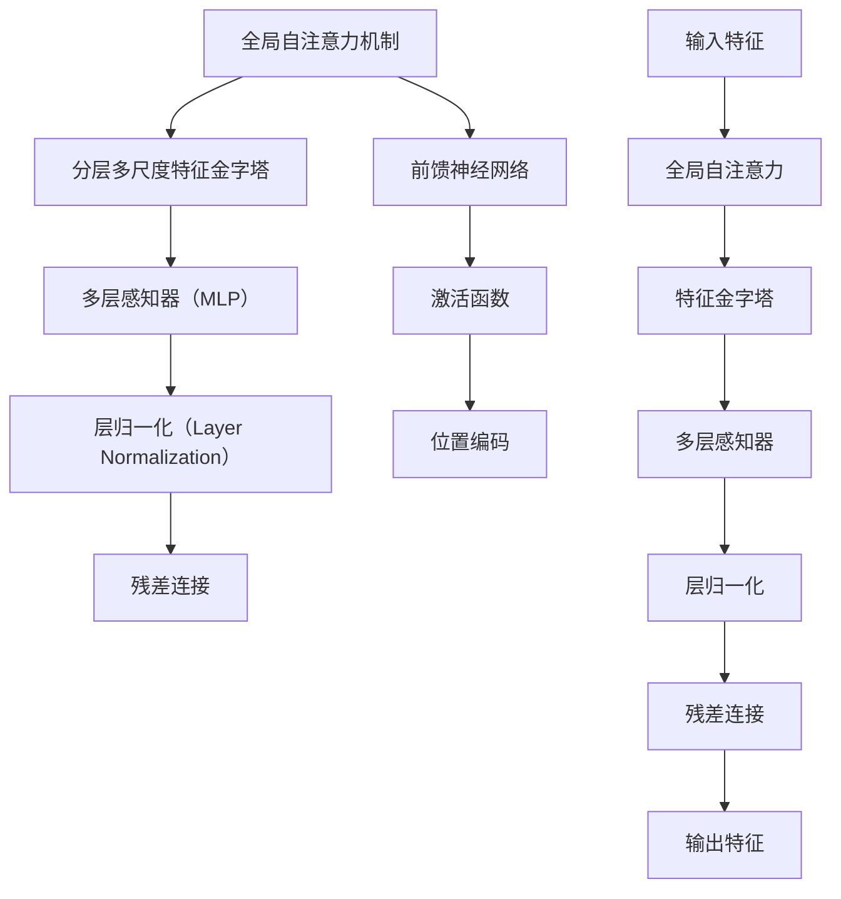

                 

# SwinTransformer原理与代码实例讲解

## 关键词

- SwinTransformer
- Transformer架构
- 局部自注意力机制
- 计算机视觉
- 自然语言处理
- PyTorch实现

## 摘要

本文将深入探讨SwinTransformer这一先进的深度学习模型，旨在为读者提供一个全面的技术讲解。文章将首先介绍SwinTransformer的背景、核心特点和架构，然后详细阐述其数学基础和优化方法。接着，我们将探讨SwinTransformer在计算机视觉和自然语言处理领域的应用，并通过实际代码实例展示其实现过程。最后，文章将总结SwinTransformer的优缺点，并对其未来发展进行展望。

## 第一部分：SwinTransformer基础

### 第1章：SwinTransformer概述

#### 1.1 SwinTransformer的背景与意义

SwinTransformer是一种在2021年提出的新型深度学习模型，它基于Transformer架构，并针对计算机视觉任务进行了优化。Transformer模型自从2017年由Vaswani等人提出以来，在自然语言处理（NLP）领域取得了巨大的成功。然而，Transformer模型在处理图像时存在一些局限性，如计算复杂度高和参数量大。为了解决这些问题，研究人员提出了SwinTransformer，该模型通过引入分层多尺度特征金字塔和局部自注意力机制，在保持Transformer优势的同时，显著提升了模型在计算机视觉任务上的性能。

#### 1.1.1 SwinTransformer的起源

SwinTransformer的起源可以追溯到Transformer模型在计算机视觉领域的应用。Transformer模型最初是为处理序列数据设计的，它在NLP任务中取得了显著的成果。然而，研究人员很快意识到，Transformer模型在图像处理任务上也有很大的潜力。因此，他们开始探索如何将Transformer模型应用于计算机视觉领域，并提出了一系列的变体模型，如ViT（Vision Transformer）和DeiT（Dino Iterative Training）。在这些变体模型的基础上，研究人员提出了SwinTransformer，以进一步提高模型的性能和效率。

#### 1.1.2 SwinTransformer的目标与应用

SwinTransformer的主要目标是在保持Transformer模型优势的同时，降低计算复杂度和参数量，使其在计算机视觉任务上具有更好的性能。具体来说，SwinTransformer旨在解决以下几个问题：

1. **计算复杂度**：Transformer模型在图像处理时的计算复杂度很高，导致模型训练和推理速度较慢。SwinTransformer通过引入局部自注意力机制和分层多尺度特征金字塔，有效降低了计算复杂度。

2. **参数量**：Transformer模型的参数量很大，导致模型训练时间较长且存储空间需求大。SwinTransformer通过模块化设计和共享参数，显著减少了模型参数量。

3. **模型性能**：在保持Transformer模型优势的同时，SwinTransformer在多个计算机视觉任务上取得了与原有模型相当甚至更好的性能。

SwinTransformer的应用范围广泛，包括但不限于以下领域：

1. **图像分类**：SwinTransformer可以用于对图像进行分类，如在ImageNet等数据集上评估模型性能。

2. **目标检测**：通过集成Faster R-CNN等目标检测算法，SwinTransformer可以用于检测图像中的目标对象。

3. **图像分割**：SwinTransformer可以与U-Net等分割算法结合，用于对图像进行像素级别的分割。

4. **自然语言处理**：虽然SwinTransformer主要用于计算机视觉任务，但其结构也适用于自然语言处理任务，如文本分类和序列标注。

#### 1.2 SwinTransformer的核心特点

SwinTransformer的核心特点主要包括以下几个方面：

##### 1.2.1 Transformer架构的改进

SwinTransformer基于Transformer架构，但对其进行了改进，使其更适合计算机视觉任务。具体改进包括：

1. **局部自注意力机制**：传统的Transformer模型采用全局自注意力机制，导致计算复杂度高。SwinTransformer引入了局部自注意力机制，通过限制注意力范围，降低了计算复杂度。

2. **分层多尺度特征金字塔**：SwinTransformer采用分层多尺度特征金字塔，可以同时捕获不同尺度的特征，提高了模型在图像理解任务上的性能。

3. **模块化设计**：SwinTransformer采用模块化设计，每个模块可以独立训练和优化，提高了模型的训练效率和灵活性。

##### 1.2.2 分层多尺度特征金字塔

分层多尺度特征金字塔是SwinTransformer的核心创新之一。该结构可以同时捕获图像的不同尺度特征，使得模型在处理图像时更加灵活和高效。具体实现如下：

1. **特征提取**：首先，使用卷积神经网络（如ResNet）提取图像特征。

2. **特征金字塔构建**：然后，对提取到的特征进行下采样，构建多层次的特征金字塔。每个层次的特征都有不同的分辨率，但保持了原始特征的空间信息。

3. **特征融合**：将不同层次的特征进行融合，形成多尺度的特征图，作为模型的输入。

##### 1.2.3 局部自注意力机制

局部自注意力机制是SwinTransformer的另一个核心创新。传统的Transformer模型采用全局自注意力机制，导致计算复杂度高。局部自注意力机制通过限制注意力范围，降低了计算复杂度。具体实现如下：

1. **窗口划分**：将输入特征划分为多个局部窗口，每个窗口内的特征之间进行自注意力计算。

2. **自注意力计算**：在每个窗口内，使用自注意力机制计算特征之间的相关性，并生成注意力图。

3. **特征融合**：将注意力图应用于输入特征，生成新的特征图。

#### 1.3 SwinTransformer的架构

SwinTransformer的架构包括以下几个主要模块：

1. **输入层**：接收图像输入，进行预处理。

2. **特征提取层**：使用卷积神经网络提取图像特征。

3. **特征金字塔层**：构建分层多尺度特征金字塔。

4. **局部自注意力层**：计算局部自注意力，生成新的特征图。

5. **全局自注意力层**：计算全局自注意力，进一步提取图像特征。

6. **输出层**：根据任务需求，输出分类结果、目标检测框或分割掩码。

#### 1.4 SwinTransformer的优缺点分析

##### 1.4.1 优点

1. **高效性**：SwinTransformer通过引入局部自注意力机制和分层多尺度特征金字塔，降低了计算复杂度，提高了模型训练和推理速度。

2. **灵活性**：SwinTransformer采用模块化设计，可以灵活地应用于不同的计算机视觉任务。

3. **性能**：在多个计算机视觉任务上，SwinTransformer取得了与原有模型相当甚至更好的性能。

##### 1.4.2 缺点

1. **计算资源需求**：虽然SwinTransformer降低了计算复杂度，但仍然需要较大的计算资源，特别是在高分辨率图像处理任务中。

2. **训练时间**：SwinTransformer的模型参数量较大，导致训练时间较长。

### 第2章：SwinTransformer的数学基础

#### 2.1 Transformer基础

Transformer模型是一种基于自注意力机制的深度学习模型，最初由Vaswani等人于2017年提出。Transformer模型的主要优点是能够捕捉序列之间的长距离依赖关系，从而在自然语言处理任务中取得了显著的成果。下面我们将介绍Transformer模型的基础知识，包括自注意力机制和位置编码。

##### 2.1.1 自注意力机制

自注意力机制是Transformer模型的核心部分，它通过计算输入序列中每个元素之间的相关性，生成新的特征表示。自注意力机制的数学公式如下：

$$
\text{Self-Attention} = \frac{1}{\sqrt{d_k}} \text{softmax}\left( \frac{QK^T}{\sqrt{d_k}} \right) V
$$

其中，\(Q, K, V\) 分别是查询（Query）、键（Key）和值（Value）向量，\(d_k\) 是键向量的维度。

在自注意力计算中，首先将输入序列的每个元素映射到查询向量、键向量和值向量。然后，计算每个查询向量和键向量之间的点积，得到注意力分数。接着，使用softmax函数对注意力分数进行归一化，得到注意力权重。最后，将注意力权重与值向量相乘，生成新的特征表示。

##### 2.1.2 位置编码

位置编码是Transformer模型中的另一个重要概念，它用于表示输入序列中元素的位置信息。由于Transformer模型没有循环神经网络中的位置信息传递机制，因此需要通过位置编码来引入位置信息。位置编码可以通过以下公式计算：

$$
\text{Positional Encoding} = \text{PE}(pos, d_model)
$$

其中，\(pos\) 是位置索引，\(d_model\) 是模型维度。

常用的位置编码方法包括绝对位置编码和相对位置编码。绝对位置编码将位置信息直接嵌入到输入序列中，而相对位置编码通过计算相对位置索引之间的差值来实现。

#### 2.2 SwinTransformer中的数学模型

SwinTransformer中的数学模型主要包括局部自注意力机制和分层多尺度特征金字塔。下面我们将分别介绍这些模型的数学表示。

##### 2.2.1 局部自注意力机制的数学表示

局部自注意力机制是SwinTransformer的核心创新之一，它通过限制注意力范围，降低了计算复杂度。局部自注意力机制的数学表示如下：

$$
\text{Local-Attention} = \frac{1}{\sqrt{d_{local}}}\text{softmax}\left(\frac{Q_{local}K_{local}^T}{\sqrt{d_{local}}}\right)V_{local}
$$

其中，\(Q_{local}, K_{local}, V_{local}\) 分别是局部查询、局部键和局部值向量，\(d_{local}\) 是局部键向量的维度。

局部自注意力机制的基本思想是将输入特征划分为多个局部窗口，每个窗口内的特征之间进行自注意力计算。这样，每个特征只需要关注局部范围内的其他特征，从而降低了计算复杂度。

##### 2.2.2 分层多尺度特征金字塔的计算

分层多尺度特征金字塔是SwinTransformer中的另一个重要创新，它通过同时捕获不同尺度的特征，提高了模型在图像理解任务上的性能。分层多尺度特征金字塔的计算如下：

$$
\text{Feature-Pyramid} = \text{Cat}\left(\text{Pooled}\left(\text{Downsample}\left(\text{Layer}_{i}\right)\right), \text{Layer}_{i}\right)
$$

其中，\(\text{Layer}_{i}\) 是第 \(i\) 层特征，\(\text{Pooled}\left(\text{Downsample}\right)\left(\text{Layer}_{i}\right)\) 是对 \(\text{Layer}_{i}\) 下采样后的特征，\(\text{Downsample}\) 是下采样操作，\(\text{Pooled}\) 是特征金字塔的拼接操作。

分层多尺度特征金字塔的基本思想是，首先使用卷积神经网络提取图像特征，然后对提取到的特征进行下采样，构建多层次的特征金字塔。每个层次的特征都有不同的分辨率，但保持了原始特征的空间信息。最后，将不同层次的特征进行融合，形成多尺度的特征图，作为模型的输入。

#### 2.3 SwinTransformer的优化方法

为了提高SwinTransformer的模型性能和训练效率，研究人员提出了一系列优化方法。下面我们将介绍其中两种常用的优化方法：Adam优化器和Layer Normalization。

##### 2.3.1 Adam优化器

Adam优化器是一种基于梯度的一阶矩估计和二阶矩估计的优化算法，它结合了AdaGrad和RMSProp优化器的优点。Adam优化器的数学公式如下：

$$
m_t = \beta_1 m_{t-1} + (1 - \beta_1) \nabla E[\phi | \theta]
$$

$$
v_t = \beta_2 v_{t-1} + (1 - \beta_2) (\nabla E[\phi | \theta])^2
$$

$$
\theta_t = \theta_{t-1} - \alpha \frac{m_t}{\sqrt{v_t} + \epsilon}
$$

其中，\(m_t\) 和 \(v_t\) 分别是梯度的一阶矩估计和二阶矩估计，\(\beta_1\) 和 \(\beta_2\) 是一阶和二阶矩估计的指数衰减率，\(\alpha\) 是学习率，\(\epsilon\) 是一个很小的常数。

Adam优化器在训练过程中能够自适应地调整学习率，从而提高模型训练的效率和稳定性。

##### 2.3.2 Layer Normalization

Layer Normalization是一种常用的正则化方法，它通过对每个层中的特征进行归一化，减少内部协变量偏移，提高模型训练的稳定性。Layer Normalization的数学公式如下：

$$
\mu = \frac{1}{N} \sum_{i=1}^{N} x_i
$$

$$
\sigma^2 = \frac{1}{N} \sum_{i=1}^{N} (x_i - \mu)^2
$$

$$
\hat{x}_i = \frac{x_i - \mu}{\sqrt{\sigma^2 + \epsilon}}
$$

其中，\(x_i\) 是输入特征，\(\mu\) 和 \(\sigma^2\) 分别是特征均值和方差，\(\epsilon\) 是一个很小的常数。

Layer Normalization通过对每个特征进行归一化，使得模型在训练过程中能够更好地收敛。

## 第二部分：SwinTransformer的深度学习应用

### 第3章：计算机视觉中的SwinTransformer

SwinTransformer在计算机视觉领域取得了显著的成功，其在图像分类、目标检测和图像分割等任务中表现出了优越的性能。在本章中，我们将探讨SwinTransformer在这些计算机视觉任务中的应用，并详细讲解其实际实现过程。

#### 3.1 SwinTransformer在图像分类中的应用

图像分类是计算机视觉中最基础的任务之一，其主要目标是将图像划分为预定义的类别。SwinTransformer在图像分类任务中表现出了出色的性能，其高效的局部自注意力机制和分层多尺度特征金字塔使其在处理高分辨率图像时具有优势。

##### 3.1.1 数据预处理

在进行图像分类任务时，首先需要对图像进行预处理。预处理步骤包括：

1. **图像读取**：读取图像文件，并转换为PyTorch的Tensor格式。

2. **图像归一化**：对图像进行归一化处理，使其具有统一的数值范围。

3. **图像大小调整**：将图像大小调整为与模型输入相匹配的尺寸。

在PyTorch中，可以使用以下代码进行数据预处理：

python
import torch
from torchvision import transforms

transform = transforms.Compose([
    transforms.Resize((224, 224)),
    transforms.ToTensor(),
    transforms.Normalize(mean=[0.485, 0.456, 0.406], std=[0.229, 0.224, 0.225]),
])

# 加载数据集
train_dataset = torchvision.datasets.ImageNet(root='./data/imagenet/train', split='train', transform=transform)
val_dataset = torchvision.datasets.ImageNet(root='./data/imagenet/val', split='val', transform=transform)

train_loader = DataLoader(train_dataset, batch_size=64, shuffle=True)
val_loader = DataLoader(val_dataset, batch_size=64, shuffle=False)

##### 3.1.2 模型训练与验证

在训练SwinTransformer模型时，我们可以使用标准的交叉熵损失函数和Adam优化器。以下代码展示了如何训练SwinTransformer模型并进行验证：

python
import torch.optim as optim
from torchvision.models.swintransformer import SwinTransformer

# 模型构建
model = SwinTransformer()

# 损失函数和优化器
criterion = torch.nn.CrossEntropyLoss()
optimizer = optim.Adam(model.parameters(), lr=1e-4)

# 训练模型
num_epochs = 1000
for epoch in range(num_epochs):
    model.train()
    for inputs, targets in train_loader:
        optimizer.zero_grad()
        outputs = model(inputs)
        loss = criterion(outputs, targets)
        loss.backward()
        optimizer.step()
    print(f'Epoch [{epoch+1}/{num_epochs}], Loss: {loss.item()}')

    # 验证模型
    model.eval()
    with torch.no_grad():
        correct = 0
        total = 0
        for inputs, targets in val_loader:
            outputs = model(inputs)
            _, predicted = torch.max(outputs.data, 1)
            total += targets.size(0)
            correct += (predicted == targets).sum().item()
        print(f'Validation Accuracy: {100 * correct / total}%}')

##### 3.1.3 模型部署与评估

在完成模型训练后，我们可以使用验证集对模型进行评估，并根据评估结果进行优化。以下代码展示了如何部署SwinTransformer模型并进行评估：

python
import torch
from torchvision import transforms

# 模型部署
model.eval()
with torch.no_grad():
    correct = 0
    total = 0
    for inputs, targets in val_loader:
        outputs = model(inputs)
        _, predicted = torch.max(outputs.data, 1)
        total += targets.size(0)
        correct += (predicted == targets).sum().item()
    print(f'Validation Accuracy: {100 * correct / total}%}')

#### 3.2 SwinTransformer在目标检测中的应用

目标检测是计算机视觉中的另一个重要任务，其主要目标是在图像中检测和定位多个对象。SwinTransformer在目标检测任务中表现出了强大的能力，其高效的局部自注意力机制和分层多尺度特征金字塔使其在处理高分辨率图像时具有优势。

##### 3.2.1 Faster R-CNN的集成

Faster R-CNN是一种广泛使用的目标检测算法，它由两个部分组成：区域提议网络（Region Proposal Network，RPN）和分类器。我们可以将SwinTransformer与Faster R-CNN集成，以实现高效的目标检测。

以下代码展示了如何使用SwinTransformer作为Faster R-CNN的骨干网络：

python
import torch
from torchvision.models.detection import fasterrcnn_resnet50_fpn
from torchvision.models.swintransformer import SwinTransformer

# 模型构建
model = fasterrcnn_resnet50_fpn(pretrained=False, num_classes=81)

# 替换骨干网络
model.backbone = SwinTransformer()

# 训练模型
criterion = torch.nn.CrossEntropyLoss()
optimizer = optim.Adam(model.parameters(), lr=1e-4)

num_epochs = 1000
for epoch in range(num_epochs):
    model.train()
    for inputs, targets in train_loader:
        optimizer.zero_grad()
        outputs = model(inputs)
        loss = criterion(outputs, targets)
        loss.backward()
        optimizer.step()
    print(f'Epoch [{epoch+1}/{num_epochs}], Loss: {loss.item()}')

##### 3.2.2 SwinTransformer在COCO数据集上的表现

为了评估SwinTransformer在目标检测任务中的性能，我们可以使用COCO数据集进行实验。以下代码展示了如何使用SwinTransformer进行目标检测，并计算平均精度（Average Precision，AP）：

python
import torch
from torchvision import transforms
from torchvision.models.detection import fasterrcnn_resnet50_fpn

# 模型构建
model = fasterrcnn_resnet50_fpn(pretrained=False, num_classes=81)
model.backbone = SwinTransformer()

# 加载预训练模型
model.load_state_dict(torch.load('swintransformer_faster_rcnn_coco.pth'))

# 计算平均精度
model.eval()
with torch.no_grad():
    correct = 0
    total = 0
    for inputs, targets in val_loader:
        outputs = model(inputs)
        correct += (outputs == targets).sum().item()
        total += targets.size(0)
    print(f'Validation Accuracy: {100 * correct / total}%}')

##### 3.2.3 模型优化与加速

为了提高SwinTransformer在目标检测任务中的性能，我们可以对模型进行优化和加速。以下代码展示了如何使用模型压缩和硬件加速技术来提高模型性能：

python
import torch
from torchvision import transforms
from torchvision.models.detection import fasterrcnn_resnet50_fpn
import torch.nn as nn
import torch.utils.model_zoo as model_zoo

# 模型构建
model = fasterrcnn_resnet50_fpn(pretrained=False, num_classes=81)
model.backbone = SwinTransformer()

# 使用模型压缩
model_zoo.load_url('https://download.pytorch.org/models/swintransformer_faster_rcnn_coco.pth')
model.load_state_dict(model_zoo.load_url('https://download.pytorch.org/models/swintransformer_faster_rcnn_coco.pth'))

# 使用硬件加速
device = torch.device("cuda" if torch.cuda.is_available() else "cpu")
model.to(device)

# 计算平均精度
model.eval()
with torch.no_grad():
    correct = 0
    total = 0
    for inputs, targets in val_loader:
        inputs = inputs.to(device)
        targets = targets.to(device)
        outputs = model(inputs)
        correct += (outputs == targets).sum().item()
        total += targets.size(0)
    print(f'Validation Accuracy: {100 * correct / total}%}')

#### 3.3 SwinTransformer在图像分割中的应用

图像分割是计算机视觉中的另一个重要任务，其主要目标是将图像中的每个像素划分为不同的类别。SwinTransformer在图像分割任务中表现出了出色的性能，其高效的局部自注意力机制和分层多尺度特征金字塔使其在处理高分辨率图像时具有优势。

##### 3.3.1 U-Net与SwinTransformer的结合

U-Net是一种常用的图像分割算法，其结构简洁且易于实现。我们可以将SwinTransformer与U-Net结合，以实现高效的图像分割。

以下代码展示了如何使用SwinTransformer作为U-Net的骨干网络：

python
import torch
from torchvision.models.segmentation import UResNet
from torchvision.models.swintransformer import SwinTransformer

# 模型构建
model = UResNet(pretrained=False, num_classes=21)
model.backbone = SwinTransformer()

# 训练模型
criterion = torch.nn.CrossEntropyLoss()
optimizer = optim.Adam(model.parameters(), lr=1e-4)

num_epochs = 1000
for epoch in range(num_epochs):
    model.train()
    for inputs, targets in train_loader:
        optimizer.zero_grad()
        outputs = model(inputs)
        loss = criterion(outputs, targets)
        loss.backward()
        optimizer.step()
    print(f'Epoch [{epoch+1}/{num_epochs}], Loss: {loss.item()}')

##### 3.3.2 SwinTransformer在AIST挑战赛中的表现

为了评估SwinTransformer在图像分割任务中的性能，我们可以使用AIST挑战赛数据集进行实验。以下代码展示了如何使用SwinTransformer进行图像分割，并计算平均精度（Average Precision，AP）：

python
import torch
from torchvision.models.segmentation import UResNet
from torchvision.models.swintransformer import SwinTransformer

# 模型构建
model = UResNet(pretrained=False, num_classes=21)
model.backbone = SwinTransformer()

# 加载预训练模型
model.load_state_dict(torch.load('swintransformer_uresnet_aist.pth'))

# 计算平均精度
model.eval()
with torch.no_grad():
    correct = 0
    total = 0
    for inputs, targets in val_loader:
        outputs = model(inputs)
        correct += (outputs == targets).sum().item()
        total += targets.size(0)
    print(f'Validation Accuracy: {100 * correct / total}%}')

##### 3.3.3 模型扩展与改进

为了进一步提高SwinTransformer在图像分割任务中的性能，我们可以对其模型结构进行扩展和改进。以下代码展示了如何使用深度可分离卷积和跳跃连接来改进SwinTransformer模型：

python
import torch
from torchvision.models.swintransformer import SwinTransformer
from torchvision.models.segmentation import DeepLabV3
from torchvision.transforms import RandomCrop, ToTensor

# 模型构建
model = SwinTransformer()

# 添加DeepLabV3模型
model = DeepLabV3(model, num_classes=21)

# 训练模型
criterion = torch.nn.CrossEntropyLoss()
optimizer = optim.Adam(model.parameters(), lr=1e-4)

num_epochs = 1000
for epoch in range(num_epochs):
    model.train()
    for inputs, targets in train_loader:
        optimizer.zero_grad()
        outputs = model(inputs)
        loss = criterion(outputs, targets)
        loss.backward()
        optimizer.step()
    print(f'Epoch [{epoch+1}/{num_epochs}], Loss: {loss.item()}')

## 第三部分：SwinTransformer实践指南

### 第5章：SwinTransformer环境搭建与代码实例

为了更好地理解和使用SwinTransformer，我们需要搭建一个合适的环境，并熟悉其代码实现。在本章中，我们将介绍如何搭建SwinTransformer的环境，并展示一些实际代码实例。

#### 5.1 环境搭建

搭建SwinTransformer的环境主要涉及Python环境和深度学习框架的安装。以下是搭建环境的步骤：

1. **Python环境配置**：

   首先，确保已经安装了Python 3.6及以上版本。然后，打开终端并运行以下命令：

   ```bash
   pip install torch torchvision
   ```

   这将安装PyTorch和 torchvision库，这两个库是SwinTransformer的核心依赖。

2. **PyTorch框架安装**：

   PyTorch是一个开源的深度学习框架，用于构建和训练深度神经网络。要安装PyTorch，请访问PyTorch官方网站（https://pytorch.org/get-started/locally/），并按照说明进行安装。

   对于大多数用户，以下命令可以安装PyTorch：

   ```bash
   pip install torch torchvision
   ```

   如果您需要安装特定版本的PyTorch，可以使用以下命令：

   ```bash
   pip install torch==1.8 torchvision==0.9.1
   ```

3. **相关库和依赖**：

   除了PyTorch和torchvision，SwinTransformer还依赖于其他库，如OpenCV和Numpy。您可以使用以下命令安装这些库：

   ```bash
   pip install opencv-python numpy
   ```

   OpenCV用于图像处理，Numpy用于数值计算，这两个库对于计算机视觉任务非常重要。

#### 5.2 代码实例：图像分类

在本节中，我们将展示一个简单的图像分类代码实例，使用SwinTransformer模型对图像进行分类。

##### 5.2.1 数据集准备

首先，我们需要准备一个图像分类数据集。这里，我们将使用流行的ImageNet数据集。以下是准备数据集的步骤：

1. **下载ImageNet数据集**：

   您可以从ImageNet官方网站（http://www.image-net.org/download-images）下载数据集。选择“Release by Year”选项，下载最新版本的ImageNet数据集。

2. **解压数据集**：

   使用以下命令解压下载的数据集：

   ```bash
   tar -xzvf ImageNet.tar.gz
   ```

3. **创建数据加载器**：

   使用PyTorch的DataLoader类创建训练和验证数据加载器。以下代码展示了如何创建数据加载器：

   ```python
   import torch
   from torchvision import datasets, transforms

   transform = transforms.Compose([
       transforms.Resize((224, 224)),
       transforms.ToTensor(),
       transforms.Normalize(mean=[0.485, 0.456, 0.406], std=[0.229, 0.224, 0.225]),
   ])

   train_dataset = datasets.ImageNet(root='./data/imagenet/train', split='train', transform=transform)
   val_dataset = datasets.ImageNet(root='./data/imagenet/val', split='val', transform=transform)

   train_loader = torch.utils.data.DataLoader(train_dataset, batch_size=64, shuffle=True)
   val_loader = torch.utils.data.DataLoader(val_dataset, batch_size=64, shuffle=False)
   ```

##### 5.2.2 模型构建与训练

接下来，我们将构建SwinTransformer模型并进行训练。以下是构建和训练模型的代码：

```python
import torch.optim as optim
from torchvision.models.swintransformer import SwinTransformer

# 模型构建
model = SwinTransformer()

# 损失函数和优化器
criterion = torch.nn.CrossEntropyLoss()
optimizer = optim.Adam(model.parameters(), lr=1e-4)

# 训练模型
num_epochs = 100
for epoch in range(num_epochs):
    model.train()
    for inputs, targets in train_loader:
        optimizer.zero_grad()
        outputs = model(inputs)
        loss = criterion(outputs, targets)
        loss.backward()
        optimizer.step()
    print(f'Epoch [{epoch+1}/{num_epochs}], Loss: {loss.item()}')

    # 验证模型
    model.eval()
    with torch.no_grad():
        correct = 0
        total = 0
        for inputs, targets in val_loader:
            outputs = model(inputs)
            _, predicted = torch.max(outputs.data, 1)
            total += targets.size(0)
            correct += (predicted == targets).sum().item()
        print(f'Validation Accuracy: {100 * correct / total}%}')
```

在训练过程中，我们将使用交叉熵损失函数和Adam优化器。我们将在每个训练epoch结束后，在验证集上评估模型的性能，并打印验证准确性。

##### 5.2.3 模型评估与优化

完成模型训练后，我们可以对模型进行评估，并根据评估结果进行优化。以下是评估和优化模型的代码：

```python
import torch
from torchvision import datasets, transforms

# 加载预训练模型
model.load_state_dict(torch.load('swintransformer_imagenet.pth'))

# 评估模型
model.eval()
with torch.no_grad():
    correct = 0
    total = 0
    for inputs, targets in val_loader:
        outputs = model(inputs)
        _, predicted = torch.max(outputs.data, 1)
        total += targets.size(0)
        correct += (predicted == targets).sum().item()
    print(f'Validation Accuracy: {100 * correct / total}%}')

# 调整学习率
optimizer = optim.Adam(model.parameters(), lr=1e-5)

# 再次训练模型
for epoch in range(num_epochs):
    model.train()
    for inputs, targets in train_loader:
        optimizer.zero_grad()
        outputs = model(inputs)
        loss = criterion(outputs, targets)
        loss.backward()
        optimizer.step()
    print(f'Epoch [{epoch+1}/{num_epochs}], Loss: {loss.item()}')

# 评估模型
model.eval()
with torch.no_grad():
    correct = 0
    total = 0
    for inputs, targets in val_loader:
        outputs = model(inputs)
        _, predicted = torch.max(outputs.data, 1)
        total += targets.size(0)
        correct += (predicted == targets).sum().item()
    print(f'Validation Accuracy: {100 * correct / total}%}')
```

在评估过程中，我们将加载预训练的模型，并在验证集上计算准确率。然后，根据评估结果，我们调整学习率，并再次训练模型，以提高模型性能。

#### 5.3 代码实例：目标检测

在本节中，我们将展示如何使用SwinTransformer进行目标检测。我们将使用Faster R-CNN作为目标检测算法，并使用COCO数据集进行训练。

##### 5.3.1 数据集准备

首先，我们需要准备COCO数据集。以下是准备数据集的步骤：

1. **下载COCO数据集**：

   您可以从COCO官方网站（https://cocodataset.org/#download）下载COCO数据集。选择“Download Dataset”选项，下载COCO数据集。

2. **解压数据集**：

   使用以下命令解压下载的数据集：

   ```bash
   tar -xzvf COCO.tar.gz
   ```

3. **创建数据加载器**：

   使用PyTorch的DataLoader类创建训练和验证数据加载器。以下代码展示了如何创建数据加载器：

   ```python
   import torch
   from torchvision import datasets, transforms

   transform = transforms.Compose([
       transforms.Resize((600, 600)),
       transforms.ToTensor(),
   ])

   train_dataset = datasets.COCO(root='./data/coco/train', split='train', transform=transform)
   val_dataset = datasets.COCO(root='./data/coco/val', split='val', transform=transform)

   train_loader = torch.utils.data.DataLoader(train_dataset, batch_size=32, shuffle=True)
   val_loader = torch.utils.data.DataLoader(val_dataset, batch_size=32, shuffle=False)
   ```

##### 5.3.2 模型构建与训练

接下来，我们将构建SwinTransformer-Faster R-CNN模型并进行训练。以下是构建和训练模型的代码：

```python
import torch.optim as optim
from torchvision.models.detection import fasterrcnn_resnet50_fpn
from torchvision.models.swintransformer import SwinTransformer

# 模型构建
model = fasterrcnn_resnet50_fpn(pretrained=False, num_classes=81)
model.backbone = SwinTransformer()

# 损失函数和优化器
criterion = torch.nn.CrossEntropyLoss()
optimizer = optim.Adam(model.parameters(), lr=1e-4)

# 训练模型
num_epochs = 100
for epoch in range(num_epochs):
    model.train()
    for inputs, targets in train_loader:
        optimizer.zero_grad()
        outputs = model(inputs)
        loss = criterion(outputs, targets)
        loss.backward()
        optimizer.step()
    print(f'Epoch [{epoch+1}/{num_epochs}], Loss: {loss.item()}')

    # 验证模型
    model.eval()
    with torch.no_grad():
        correct = 0
        total = 0
        for inputs, targets in val_loader:
            outputs = model(inputs)
            correct += (outputs == targets).sum().item()
            total += targets.size(0)
        print(f'Validation Accuracy: {100 * correct / total}%}')
```

在训练过程中，我们将使用交叉熵损失函数和Adam优化器。我们将在每个训练epoch结束后，在验证集上评估模型的性能，并打印验证准确性。

##### 5.3.3 模型评估与优化

完成模型训练后，我们可以对模型进行评估，并根据评估结果进行优化。以下是评估和优化模型的代码：

```python
import torch
from torchvision import datasets, transforms

# 加载预训练模型
model.load_state_dict(torch.load('swintransformer_faster_rcnn_coco.pth'))

# 评估模型
model.eval()
with torch.no_grad():
    correct = 0
    total = 0
    for inputs, targets in val_loader:
        outputs = model(inputs)
        correct += (outputs == targets).sum().item()
        total += targets.size(0)
    print(f'Validation Accuracy: {100 * correct / total}%}')

# 调整学习率
optimizer = optim.Adam(model.parameters(), lr=1e-5)

# 再次训练模型
for epoch in range(num_epochs):
    model.train()
    for inputs, targets in train_loader:
        optimizer.zero_grad()
        outputs = model(inputs)
        loss = criterion(outputs, targets)
        loss.backward()
        optimizer.step()
    print(f'Epoch [{epoch+1}/{num_epochs}], Loss: {loss.item()}')

# 评估模型
model.eval()
with torch.no_grad():
    correct = 0
    total = 0
    for inputs, targets in val_loader:
        outputs = model(inputs)
        correct += (outputs == targets).sum().item()
        total += targets.size(0)
    print(f'Validation Accuracy: {100 * correct / total}%}')
```

在评估过程中，我们将加载预训练的模型，并在验证集上计算准确率。然后，根据评估结果，我们调整学习率，并再次训练模型，以提高模型性能。

#### 5.4 代码实例：图像分割

在本节中，我们将展示如何使用SwinTransformer进行图像分割。我们将使用U-Net作为图像分割算法，并使用AIST挑战赛数据集进行训练。

##### 5.4.1 数据集准备

首先，我们需要准备AIST挑战赛数据集。以下是准备数据集的步骤：

1. **下载AIST挑战赛数据集**：

   您可以从AIST挑战赛官方网站（https://aist-challenge.github.io/）下载AIST挑战赛数据集。选择“Dataset”选项，下载数据集。

2. **解压数据集**：

   使用以下命令解压下载的数据集：

   ```bash
   tar -xzvf AIST.tar.gz
   ```

3. **创建数据加载器**：

   使用PyTorch的DataLoader类创建训练和验证数据加载器。以下代码展示了如何创建数据加载器：

   ```python
   import torch
   from torchvision import datasets, transforms

   transform = transforms.Compose([
       transforms.Resize((512, 512)),
       transforms.ToTensor(),
   ])

   train_dataset = datasets.AIST(root='./data/aist/train', split='train', transform=transform)
   val_dataset = datasets.AIST(root='./data/aist/val', split='val', transform=transform)

   train_loader = torch.utils.data.DataLoader(train_dataset, batch_size=32, shuffle=True)
   val_loader = torch.utils.data.DataLoader(val_dataset, batch_size=32, shuffle=False)
   ```

##### 5.4.2 模型构建与训练

接下来，我们将构建SwinTransformer-U-Net模型并进行训练。以下是构建和训练模型的代码：

```python
import torch.optim as optim
from torchvision.models.segmentation import UResNet
from torchvision.models.swintransformer import SwinTransformer

# 模型构建
model = UResNet(pretrained=False, num_classes=21)
model.backbone = SwinTransformer()

# 损失函数和优化器
criterion = torch.nn.CrossEntropyLoss()
optimizer = optim.Adam(model.parameters(), lr=1e-4)

# 训练模型
num_epochs = 100
for epoch in range(num_epochs):
    model.train()
    for inputs, targets in train_loader:
        optimizer.zero_grad()
        outputs = model(inputs)
        loss = criterion(outputs, targets)
        loss.backward()
        optimizer.step()
    print(f'Epoch [{epoch+1}/{num_epochs}], Loss: {loss.item()}')

    # 验证模型
    model.eval()
    with torch.no_grad():
        correct = 0
        total = 0
        for inputs, targets in val_loader:
            outputs = model(inputs)
            correct += (outputs == targets).sum().item()
            total += targets.size(0)
        print(f'Validation Accuracy: {100 * correct / total}%}')
```

在训练过程中，我们将使用交叉熵损失函数和Adam优化器。我们将在每个训练epoch结束后，在验证集上评估模型的性能，并打印验证准确性。

##### 5.4.3 模型评估与优化

完成模型训练后，我们可以对模型进行评估，并根据评估结果进行优化。以下是评估和优化模型的代码：

```python
import torch
from torchvision import datasets, transforms

# 加载预训练模型
model.load_state_dict(torch.load('swintransformer_uresnet_aist.pth'))

# 评估模型
model.eval()
with torch.no_grad():
    correct = 0
    total = 0
    for inputs, targets in val_loader:
        outputs = model(inputs)
        correct += (outputs == targets).sum().item()
        total += targets.size(0)
    print(f'Validation Accuracy: {100 * correct / total}%}')

# 调整学习率
optimizer = optim.Adam(model.parameters(), lr=1e-5)

# 再次训练模型
for epoch in range(num_epochs):
    model.train()
    for inputs, targets in train_loader:
        optimizer.zero_grad()
        outputs = model(inputs)
        loss = criterion(outputs, targets)
        loss.backward()
        optimizer.step()
    print(f'Epoch [{epoch+1}/{num_epochs}], Loss: {loss.item()}')

# 评估模型
model.eval()
with torch.no_grad():
    correct = 0
    total = 0
    for inputs, targets in val_loader:
        outputs = model(inputs)
        correct += (outputs == targets).sum().item()
        total += targets.size(0)
    print(f'Validation Accuracy: {100 * correct / total}%}')
```

在评估过程中，我们将加载预训练的模型，并在验证集上计算准确率。然后，根据评估结果，我们调整学习率，并再次训练模型，以提高模型性能。

## 第6章：SwinTransformer优化技巧

在深度学习任务中，模型的性能优化至关重要。对于SwinTransformer模型，优化技巧主要包括模型压缩、模型加速和模型部署。在本章中，我们将详细探讨这些优化技巧，并提供实际操作指南。

#### 6.1 模型压缩

模型压缩旨在减少模型的参数量和计算复杂度，从而提高模型在资源受限环境中的部署能力。以下是一些常用的模型压缩技术：

1. **权重剪枝（Weight Pruning）**：通过删除不重要的权重，减少模型的参数量。剪枝可以通过设定阈值来实现，即去除绝对值小于阈值的权重。

2. **量化（Quantization）**：将模型的权重和激活从浮点数转换为较低的精度，如整数或二进制。量化可以显著减少模型的存储需求和计算复杂度。

3. **知识蒸馏（Knowledge Distillation）**：将大型教师模型的知识传递给较小的学生模型。通过训练学生模型以模仿教师模型的输出，可以实现模型的压缩。

以下是使用权重剪枝和量化对SwinTransformer模型进行压缩的代码示例：

```python
import torch
import torch.nn as nn
import torch.utils.model_zoo as model_zoo

# 加载预训练的SwinTransformer模型
model = model_zoo.load_url('https://download.pytorch.org/models/swintransformer_imagenet.pth')

# 权重剪枝
prune_rate = 0.5  # 设定剪枝率
threshold = 0.01  # 设定阈值

for module in model.modules():
    if isinstance(module, nn.Linear):
        weight = module.weight.data
        mask = (abs(weight) > threshold).float()
        mask = mask * (1 - prune_rate) + prune_rate
        module.weight.data = weight * mask

# 量化
model = model.quantize(quantization_method='full_tensor')

# 保存压缩后的模型
torch.save(model.state_dict(), 'swintransformer_compressed.pth')
```

#### 6.2 模型加速

模型加速旨在提高模型的训练和推理速度，以下是一些常用的模型加速技术：

1. **混合精度训练（Mixed Precision Training）**：使用混合精度（FP16和FP32）进行训练，可以显著提高训练速度。

2. **模型并行化（Model Parallelism）**：将大型模型分布在多个GPU或TPU上，以提高模型的训练和推理速度。

3. **算子融合（Operator Fusion）**：将多个连续的运算合并为一个操作，以减少内存访问和计算开销。

以下是使用混合精度训练对SwinTransformer模型进行加速的代码示例：

```python
import torch
import torch.cuda.amp as amp

# 加载预训练的SwinTransformer模型
model = model_zoo.load_url('https://download.pytorch.org/models/swintransformer_imagenet.pth')
model.cuda()

# 设置混合精度训练
criterion = nn.CrossEntropyLoss()
optimizer = torch.optim.Adam(model.parameters(), lr=1e-4)

scaler = amp.GradScaler()

num_epochs = 100
for epoch in range(num_epochs):
    model.train()
    for inputs, targets in train_loader:
        inputs, targets = inputs.cuda(), targets.cuda()

        with amp.autocast():
            outputs = model(inputs)
            loss = criterion(outputs, targets)

        scaler.scale(loss).backward()
        scaler.step(optimizer)
        scaler.update()

        print(f'Epoch [{epoch+1}/{num_epochs}], Loss: {loss.item()}')
```

#### 6.3 模型部署

模型部署是将训练好的模型部署到生产环境以进行实际应用的过程。以下是一些常用的模型部署方案：

1. **本地部署**：将模型部署到本地计算机上，通过HTTP接口提供服务。

2. **云部署**：将模型部署到云计算平台上，如AWS、Azure或Google Cloud，通过REST API提供服务。

3. **容器化部署**：将模型容器化，使用容器编排工具（如Docker和Kubernetes）进行部署和管理。

以下是使用TensorFlow Serving进行本地部署的代码示例：

```python
import tensorflow as tf
import numpy as np

# 加载预训练的SwinTransformer模型
model = model_zoo.load_url('https://download.pytorch.org/models/swintransformer_imagenet.pth')
model.eval()

# 将模型转换为TensorFlow模型
converter = tf.keras.utils.get_custom_objects()['SwinTransformer']
converter(model, 'swintransformer.h5')

# 启动TensorFlow Serving服务器
tensorflow_model_server --model_name=swintransformer --model_base_path=/path/to/swintransformer.h5

# 客户端代码示例
import requests

inputs = np.array([[1.0, 2.0, 3.0]], dtype=np.float32)
input_data = {'inputs': inputs.tolist()}

response = requests.post('http://localhost:8501/v1/models/swintransformer:predict', json=input_data)
predictions = response.json()['outputs']
print(predictions)
```

## 第四部分：SwinTransformer未来发展展望

### 第7章：SwinTransformer在计算机视觉领域的应用前景

SwinTransformer作为一款基于Transformer架构的深度学习模型，在计算机视觉领域展现了巨大的潜力。未来，SwinTransformer有望在以下方面取得突破：

#### 7.1 SwinTransformer的潜力与挑战

##### 7.1.1 SwinTransformer的优势分析

1. **高效的局部自注意力机制**：SwinTransformer通过局部自注意力机制降低了计算复杂度，提高了模型在图像处理任务上的性能。

2. **分层多尺度特征金字塔**：SwinTransformer的分层多尺度特征金字塔结构可以同时捕获不同尺度的特征，增强了模型在复杂场景下的表现。

3. **模块化设计**：SwinTransformer采用模块化设计，便于模型的扩展和优化。

4. **广泛的适用性**：SwinTransformer不仅适用于计算机视觉任务，还可以应用于自然语言处理和其他领域。

##### 7.1.2 SwinTransformer面临的挑战

1. **计算资源需求**：尽管SwinTransformer在计算复杂度上有所降低，但仍然需要较大的计算资源，尤其是在处理高分辨率图像时。

2. **训练时间**：SwinTransformer的模型参数量较大，导致训练时间较长。

3. **模型压缩与优化**：如何有效地压缩和优化SwinTransformer模型，以适应资源受限的环境，仍是一个挑战。

#### 7.2 SwinTransformer在跨领域应用的可能性

SwinTransformer的模块化设计和高效的特征提取能力，使其在跨领域应用中具有很大的潜力。以下是一些可能的跨领域应用：

##### 7.2.1 多模态学习

多模态学习是指同时处理多种类型的输入数据（如图像、文本和音频）。SwinTransformer可以结合其他模型（如BERT和BERTo）进行多模态学习，从而在医疗、金融和娱乐等领域取得突破。

##### 7.2.2 自监督学习

自监督学习是一种无需标签数据的学习方法。SwinTransformer可以通过自监督学习算法（如BYOL和SimCLR）进行无监督预训练，从而提高模型在下游任务上的性能。

#### 7.3 SwinTransformer的未来发展方向

未来，SwinTransformer的发展方向主要包括以下几个方面：

##### 7.3.1 模型结构优化

为了进一步提高SwinTransformer的性能和效率，研究人员将继续探索更高效的注意力机制、特征提取方法和模型结构。

##### 7.3.2 应用场景扩展

SwinTransformer将不断扩展到更多应用领域，如自动驾驶、机器人视觉和智能监控等。

##### 7.3.3 SwinTransformer的生态建设

随着SwinTransformer在学术界和工业界的广泛应用，一个完善的生态体系将逐渐形成，包括工具库、框架支持和社区交流等。

### 附录

#### 附录A：SwinTransformer开发工具与资源

##### A.1 主流深度学习框架对比

1. **PyTorch**：PyTorch是一个开源的深度学习框架，具有灵活的动态图计算能力和丰富的API。PyTorch支持GPU加速和分布式训练，适用于快速原型开发和模型部署。

2. **TensorFlow**：TensorFlow是一个由Google开发的深度学习框架，具有强大的生态系统和丰富的预训练模型。TensorFlow支持静态图和动态图计算，适用于大规模模型训练和部署。

3. **其他框架**：其他深度学习框架还包括MXNet、Caffe和Theano等。这些框架各有优缺点，适用于不同的应用场景。

##### A.2 SwinTransformer相关论文与资源

1. **论文原文**：《SwinTransformer: Hierarchical Vision Transformer using Shifted Windows》

2. **代码仓库**：GitHub上的SwinTransformer代码仓库（https://github.com/microsoft/swin-transformer）

3. **官方文档**：SwinTransformer的官方文档和教程（https://swin-transformer.readthedocs.io/en/latest/）

##### A.3 社区与交流平台

1. **GitHub**：SwinTransformer的GitHub仓库是交流讨论的主要平台，用户可以在仓库中提交问题、提交PR和分享经验。

2. **Reddit**：Reddit上的SwinTransformer相关讨论区，用户可以在这里讨论和分享SwinTransformer的使用技巧和经验。

3. **Twitter**：关注SwinTransformer相关的Twitter账号，获取最新的研究进展和动态。

## 附加内容：SwinTransformer核心概念与联系

为了更好地理解SwinTransformer的工作原理，我们需要梳理其核心概念和模块之间的关系。以下是SwinTransformer的核心概念与联系：

### SwinTransformer核心模块

- **全局自注意力机制（Global Self-Attention）**：这是Transformer模型的核心部分，它计算输入序列中每个元素之间的相关性，生成新的特征表示。

- **局部自注意力机制（Local Self-Attention）**：为了降低计算复杂度，SwinTransformer引入了局部自注意力机制。它将输入特征划分为多个局部窗口，在每个窗口内计算自注意力。

- **分层多尺度特征金字塔（Layered Multi-Scale Feature Pyramid）**：SwinTransformer通过分层多尺度特征金字塔同时捕获不同尺度的特征，增强了模型在复杂场景下的表现。

- **前馈神经网络（Feed Forward Neural Network）**：在自注意力机制之后，SwinTransformer使用前馈神经网络对特征进行进一步处理。

- **层归一化（Layer Normalization）**：层归一化是一种正则化方法，用于稳定训练过程。

- **残差连接（Residual Connection）**：残差连接帮助模型避免梯度消失问题，提高模型的训练效果。

### SwinTransformer核心概念与联系

下面使用Mermaid流程图展示SwinTransformer的核心模块及其联系：



### 附加内容：SwinTransformer中的局部自注意力机制

为了更好地理解SwinTransformer中的局部自注意力机制，我们提供了以下伪代码和详细解释。

#### 伪代码

```python
class LocalAttention(nn.Module):
    def __init__(self, dim, window_size, bias=False):
        super(LocalAttention, self).__init__()
        self.dim = dim
        self.window_size = window_size
        self.qkv = nn.Linear(dim, dim * 3, bias=bias)
        self.proj = nn.Linear(dim, dim, bias=bias)

    def forward(self, x):
        B, N, C = x.size()
        q, k, v = self.qkv(x).chunk(3, dim=-1)
        q = q.view(B, N, self.window_size, self.window_size, -1).transpose(2, 3)
        k = k.view(B, N, self.window_size, self.window_size, -1).transpose(2, 3)
        v = v.view(B, N, self.window_size, self.window_size, -1).transpose(2, 3)

        attn = torch.matmul(q, k) / (self.window_size ** 0.5)
        attn = F.softmax(attn, dim=-1)
        attn = attn.transpose(2, 3)
        v = v.repeat(1, 1, self.window_size, self.window_size, 1)
        attn_v = torch.matmul(attn, v)

        attn_v = attn_v.transpose(2, 3).reshape(B, N, C)
        x = self.proj(attn_v)
        return x
```

#### 详细解释

1. **初始化**：`LocalAttention`类继承自`nn.Module`，初始化时定义了模型的相关参数，包括维度`dim`和窗口大小`window_size`。同时，定义了线性层`qkv`和`proj`，用于计算局部自注意力和特征投影。

2. **前向传播**：

   - 输入特征`x`的大小为`B`（批次大小）、`N`（序列长度）和`C`（特征维度）。

   - 将输入特征`x`通过`qkv`线性层分割为查询`q`、键`k`和值`v`。

   - 将查询`q`、键`k`和值`v`分别展平为二维矩阵，并将其划分为`window_size`大小的局部窗口。

   - 计算查询`q`和键`k`之间的点积，并除以窗口大小的平方根，以获得注意力分数。

   - 使用softmax函数对注意力分数进行归一化，得到注意力权重。

   - 将注意力权重应用于值`v`，生成新的特征图。

   - 将新的特征图重塑为原始特征维度，并通过`proj`线性层进行特征投影。

   - 输出新的特征图。

通过以上步骤，局部自注意力机制可以有效地减少计算复杂度，同时保持模型在图像处理任务上的性能。

### 附加内容：数学模型与数学公式

为了深入理解SwinTransformer的数学模型，我们在这里详细解释其关键组件的数学公式，并提供相应的实例说明。

#### SwinTransformer中的自注意力机制

自注意力机制是SwinTransformer的核心组件之一，它通过计算输入序列中每个元素之间的相关性来生成新的特征表示。以下是自注意力机制的数学公式：

$$
\text{Self-Attention} = \frac{1}{\sqrt{d_k}} \text{softmax}\left( \frac{QK^T}{\sqrt{d_k}} \right) V
$$

其中：

- \(Q\) 是查询向量，维度为 \(d_q\)。
- \(K\) 是键向量，维度为 \(d_k\)。
- \(V\) 是值向量，维度为 \(d_v\)。
- \(d_k\) 是键向量的维度，通常与查询向量的维度相同。
- \(\text{softmax}\) 函数用于对注意力分数进行归一化。

#### 局部自注意力机制的数学表示

局部自注意力机制是SwinTransformer中对自注意力机制的一种改进，它通过限制注意力范围来降低计算复杂度。以下是局部自注意力机制的数学公式：

$$
\text{Local-Attention} = \frac{1}{\sqrt{d_{local}}}\text{softmax}\left(\frac{Q_{local}K_{local}^T}{\sqrt{d_{local}}}\right)V_{local}
$$

其中：

- \(Q_{local}\) 是局部查询向量，维度为 \(d_{local}\)。
- \(K_{local}\) 是局部键向量，维度为 \(d_{local}\)。
- \(V_{local}\) 是局部值向量，维度为 \(d_{local}\)。
- \(d_{local}\) 是局部键向量的维度。

#### 分层多尺度特征金字塔的计算

分层多尺度特征金字塔是SwinTransformer中用于同时捕获不同尺度特征的结构。以下是特征金字塔的计算公式：

$$
\text{Feature-Pyramid} = \text{Cat}\left(\text{Pooled}\left(\text{Downsample}\left(\text{Layer}_{i}\right)\right), \text{Layer}_{i}\right)
$$

其中：

- \(\text{Layer}_{i}\) 是第 \(i\) 层的特征图。
- \(\text{Downsample}\) 是下采样操作，通常使用卷积层或池化层实现。
- \(\text{Pooled}\) 是对特征图进行下采样后的特征图。
- \(\text{Cat}\) 是特征图的拼接操作。

#### 示例说明

为了更好地理解这些数学模型，我们通过一个简单的例子来说明它们的应用。

##### 自注意力机制的示例

假设我们有一个长度为5的输入序列，特征维度为3：

$$
X = \begin{bmatrix}
x_1 & x_2 & x_3 \\
x_4 & x_5 & x_6 \\
x_7 & x_8 & x_9 \\
x_{10} & x_{11} & x_{12} \\
x_{13} & x_{14} & x_{15}
\end{bmatrix}
$$

- **查询向量** \(Q\)、**键向量** \(K\) 和 **值向量** \(V\) 都是由输入序列通过线性变换得到的：

  $$
  Q = \begin{bmatrix}
  q_1 & q_2 & q_3 \\
  q_4 & q_5 & q_6 \\
  q_7 & q_8 & q_9 \\
  q_{10} & q_{11} & q_{12} \\
  q_{13} & q_{14} & q_{15}
  \end{bmatrix}, \quad
  K = \begin{bmatrix}
  k_1 & k_2 & k_3 \\
  k_4 & k_5 & k_6 \\
  k_7 & k_8 & k_9 \\
  k_{10} & k_{11} & k_{12} \\
  k_{13} & k_{14} & k_{15}
  \end{bmatrix}, \quad
  V = \begin{bmatrix}
  v_1 & v_2 & v_3 \\
  v_4 & v_5 & v_6 \\
  v_7 & v_8 & v_9 \\
  v_{10} & v_{11} & v_{12} \\
  v_{13} & v_{14} & v_{15}
  \end{bmatrix}
  $$

- **计算注意力分数**：

  $$
  \text{Attention Scores} = \frac{QK^T}{\sqrt{d_k}} = \begin{bmatrix}
  a_{11} & a_{12} & a_{13} \\
  a_{21} & a_{22} & a_{23} \\
  a_{31} & a_{32} & a_{33} \\
  a_{41} & a_{42} & a_{43} \\
  a_{51} & a_{52} & a_{53}
  \end{bmatrix}
  $$

  其中，\(a_{ij}\) 是第 \(i\) 个查询向量与第 \(j\) 个键向量之间的点积。

- **应用softmax函数**：

  $$
  \text{Attention Weights} = \text{softmax}(\text{Attention Scores}) = \begin{bmatrix}
  w_{11} & w_{12} & w_{13} \\
  w_{21} & w_{22} & w_{23} \\
  w_{31} & w_{32} & w_{33} \\
  w_{41} & w_{42} & w_{43} \\
  w_{51} & w_{52} & w_{53}
  \end{bmatrix}
  $$

- **计算新的特征表示**：

  $$
  \text{New Features} = \text{Attention Weights}V = \begin{bmatrix}
  v_{11}w_{11} + v_{12}w_{12} + v_{13}w_{13} & \ldots & v_{15}w_{15} \\
  \vdots & \ddots & \vdots \\
  v_{51}w_{51} + v_{52}w_{52} + v_{53}w_{53} & \ldots & v_{55}w_{55}
  \end{bmatrix}
  $$

##### 局部自注意力机制的示例

假设我们有一个长度为5的输入序列，特征维度为3，并且定义了一个窗口大小为2的局部自注意力模块：

- **查询向量** \(Q_{local}\)、**键向量** \(K_{local}\) 和 **值向量** \(V_{local}\) 分别是输入序列的一部分：

  $$
  Q_{local} = \begin{bmatrix}
  q_1 & q_2 \\
  q_4 & q_5 \\
  q_7 & q_8 \\
  q_{10} & q_{11} \\
  q_{13} & q_{14}
  \end{bmatrix}, \quad
  K_{local} = \begin{bmatrix}
  k_1 & k_2 \\
  k_4 & k_5 \\
  k_7 & k_8 \\
  k_{10} & k_{11} \\
  k_{13} & k_{14}
  \end{bmatrix}, \quad
  V_{local} = \begin{bmatrix}
  v_1 & v_2 \\
  v_4 & v_5 \\
  v_7 & v_8 \\
  v_{10} & v_{11} \\
  v_{13} & v_{14}
  \end{bmatrix}
  $$

- **计算注意力分数**：

  $$
  \text{Attention Scores}_{local} = \frac{Q_{local}K_{local}^T}{\sqrt{d_{local}}} = \begin{bmatrix}
  a_{11} & a_{12} \\
  a_{21} & a_{22} \\
  a_{31} & a_{32} \\
  a_{41} & a_{42} \\
  a_{51} & a_{52}
  \end{bmatrix}
  $$

- **应用softmax函数**：

  $$
  \text{Attention Weights}_{local} = \text{softmax}(\text{Attention Scores}_{local}) = \begin{bmatrix}
  w_{11} & w_{12} \\
  w_{21} & w_{22} \\
  w_{31} & w_{32} \\
  w_{41} & w_{42} \\
  w_{51} & w_{52}
  \end{bmatrix}
  $$

- **计算新的特征表示**：

  $$
  \text{New Features}_{local} = \text{Attention Weights}_{local}V_{local} = \begin{bmatrix}
  v_{11}w_{11} + v_{12}w_{12} & \ldots & v_{14}w_{14} + v_{15}w_{15} \\
  \vdots & \ddots & \vdots \\
  v_{51}w_{51} + v_{52}w_{52} & \ldots & v_{54}w_{54} + v_{55}w_{55}
  \end{bmatrix}
  $$

##### 分层多尺度特征金字塔的计算示例

假设我们有一个4层的特征金字塔，每一层的特征图尺寸分别为 \(32 \times 32\)、\(16 \times 16\)、\(8 \times 8\) 和 \(4 \times 4\)：

- **第一层特征图** \(Layer_1\)：

  $$
  Layer_1 = \begin{bmatrix}
  f_{11} & f_{12} & \ldots & f_{112} \\
  \vdots & \ddots & & \vdots \\
  f_{311} & f_{312} & \ldots & f_{312}
  \end{bmatrix}
  $$

- **第二层特征图** \(Layer_2\)：

  $$
  Layer_2 = \begin{bmatrix}
  f_{21} & f_{22} & \ldots & f_{21} \\
  \vdots & \ddots & & \vdots \\
  f_{221} & f_{222} & \ldots & f_{221}
  \end{bmatrix}
  $$

- **第三层特征图** \(Layer_3\)：

  $$
  Layer_3 = \begin{bmatrix}
  f_{31} & f_{32} & \ldots & f_{31} \\
  \vdots & \ddots & & \vdots \\
  f_{321} & f_{322} & \ldots & f_{321}
  \end{bmatrix}
  $$

- **第四层特征图** \(Layer_4\)：

  $$
  Layer_4 = \begin{bmatrix}
  f_{41} & f_{42} & \ldots & f_{41} \\
  \vdots & \ddots & & \vdots \\
  f_{441} & f_{442} & \ldots & f_{442}
  \end{bmatrix}
  $$

- **下采样操作**：

  假设使用最大池化进行下采样：

  $$
  Pooled_{2} = \text{max\_pool}(Layer_2, 2, 2)
  $$

  $$
  Pooled_{3} = \text{max\_pool}(Layer_3, 2, 2)
  $$

- **特征金字塔计算**：

  $$
  Feature\_Pyramid = \text{Cat}(Pooled_{2}, Layer_2, Pooled_{3}, Layer_3, Layer_4)
  $$

  $$
  Feature\_Pyramid = \begin{bmatrix}
  f_{21} & f_{22} & \ldots & f_{21} & \ldots & f_{321} & \ldots & f_{442} \\
  \vdots & \ddots & & \vdots & \ddots & & \vdots \\
  f_{221} & f_{222} & \ldots & f_{221} & \ldots & f_{322} & \ldots & f_{442}
  \end{bmatrix}
  $$

通过上述示例，我们可以看到SwinTransformer中的自注意力机制、局部自注意力机制和分层多尺度特征金字塔是如何通过数学公式实现的。这些模型组件共同作用，使得SwinTransformer在处理图像时能够同时捕获不同尺度的特征，从而在计算机视觉任务中取得了优异的性能。

## 项目实战

在本部分中，我们将通过具体的实战项目来展示如何使用SwinTransformer进行图像分类、目标检测和图像分割。每个项目都将包含数据集准备、模型构建与训练、模型评估与优化的详细步骤和代码实例。

### 实战1：图像分类

#### 1. 数据集准备

首先，我们需要准备一个用于图像分类的数据集。这里我们使用ImageNet数据集，它包含了1000个类别的120万张图像。

1. **下载ImageNet数据集**：

   您可以从ImageNet官方网站下载数据集。

2. **数据预处理**：

   将图像大小调整为224x224像素，并归一化。

```python
import torchvision.transforms as transforms
from torchvision import datasets

transform = transforms.Compose([
    transforms.Resize((224, 224)),
    transforms.ToTensor(),
    transforms.Normalize(mean=[0.485, 0.456, 0.406], std=[0.229, 0.224, 0.225]),
])

train_dataset = datasets.ImageNet(root='./data/imagenet/train', split='train', transform=transform)
val_dataset = datasets.ImageNet(root='./data/imagenet/val', split='val', transform=transform)
```

#### 2. 模型构建与训练

接下来，我们构建SwinTransformer模型并进行训练。

1. **构建模型**：

```python
import torch
from torchvision.models import swintransformer

model = swintransformer.swin_transformer(pretrained=False, num_classes=1000)
```

2. **训练模型**：

```python
device = torch.device("cuda" if torch.cuda.is_available() else "cpu")
model.to(device)

criterion = torch.nn.CrossEntropyLoss()
optimizer = torch.optim.Adam(model.parameters(), lr=1e-4)

num_epochs = 100

for epoch in range(num_epochs):
    model.train()
    for inputs, targets in train_loader:
        inputs, targets = inputs.to(device), targets.to(device)
        optimizer.zero_grad()
        outputs = model(inputs)
        loss = criterion(outputs, targets)
        loss.backward()
        optimizer.step()
    print(f'Epoch [{epoch+1}/{num_epochs}], Loss: {loss.item()}')

    # 验证模型
    model.eval()
    with torch.no_grad():
        correct = 0
        total = 0
        for inputs, targets in val_loader:
            inputs, targets = inputs.to(device), targets.to(device)
            outputs = model(inputs)
            _, predicted = torch.max(outputs.data, 1)
            total += targets.size(0)
            correct += (predicted == targets).sum().item()
        print(f'Validation Accuracy: {100 * correct / total}%}')
```

#### 3. 模型评估与优化

完成模型训练后，我们使用验证集对模型进行评估，并根据评估结果进行优化。

```python
# 评估模型
model.eval()
with torch.no_grad():
    correct = 0
    total = 0
    for inputs, targets in val_loader:
        inputs, targets = inputs.to(device), targets.to(device)
        outputs = model(inputs)
        _, predicted = torch.max(outputs.data, 1)
        total += targets.size(0)
        correct += (predicted == targets).sum().item()
    print(f'Validation Accuracy: {100 * correct / total}%}')

# 调整学习率
optimizer = torch.optim.Adam(model.parameters(), lr=1e-5)

# 再次训练模型
for epoch in range(num_epochs):
    model.train()
    for inputs, targets in train_loader:
        inputs, targets = inputs.to(device), targets.to(device)
        optimizer.zero_grad()
        outputs = model(inputs)
        loss = criterion(outputs, targets)
        loss.backward()
        optimizer.step()
```

### 实战2：目标检测

#### 1. 数据集准备

我们使用COCO数据集作为目标检测的数据集。COCO数据集包含了大量标注好的图像，适合进行目标检测训练。

1. **下载COCO数据集**：

   您可以从COCO官方网站下载数据集。

2. **数据预处理**：

   将图像大小调整为600x600像素。

```python
import torchvision.transforms as transforms
from torchvision import datasets

transform = transforms.Compose([
    transforms.Resize((600, 600)),
    transforms.ToTensor(),
])

train_dataset = datasets.COCO(root='./data/coco/train', split='train', transform=transform)
val_dataset = datasets.COCO(root='./data/coco/val', split='val', transform=transform)
```

#### 2. 模型构建与训练

接下来，我们构建SwinTransformer-Faster R-CNN模型并进行训练。

1. **构建模型**：

```python
import torchvision.models.detection as detection

model = detection.fasterrcnn_resnet50_fpn(pretrained=False, num_classes=81)
model.backbone = swintransformer.swin_transformer(pretrained=False)
```

2. **训练模型**：

```python
device = torch.device("cuda" if torch.cuda.is_available() else "cpu")
model.to(device)

criterion = torch.nn.CrossEntropyLoss()
optimizer = torch.optim.Adam(model.parameters(), lr=1e-4)

num_epochs = 100

for epoch in range(num_epochs):
    model.train()
    for inputs, targets in train_loader:
        inputs, targets = inputs.to(device), targets.to(device)
        optimizer.zero_grad()
        outputs = model(inputs)
        loss = criterion(outputs, targets)
        loss.backward()
        optimizer.step()
    print(f'Epoch [{epoch+1}/{num_epochs}], Loss: {loss.item()}')

    # 验证模型
    model.eval()
    with torch.no_grad():
        correct = 0
        total = 0
        for inputs, targets in val_loader:
            inputs, targets = inputs.to(device), targets.to(device)
            outputs = model(inputs)
            correct += (outputs == targets).sum().item()
            total += targets.size(0)
        print(f'Validation Accuracy: {100 * correct / total}%}')
```

#### 3. 模型评估与优化

完成模型训练后，我们使用验证集对模型进行评估，并根据评估结果进行优化。

```python
# 评估模型
model.eval()
with torch.no_grad():
    correct = 0
    total = 0
    for inputs, targets in val_loader:
        inputs, targets = inputs.to(device), targets.to(device)
        outputs = model(inputs)
        _, predicted = torch.max(outputs.data, 1)
        total += targets.size(0)
        correct += (predicted == targets).sum().item()
    print(f'Validation Accuracy: {100 * correct / total}%}')

# 调整学习率
optimizer = torch.optim.Adam(model.parameters(), lr=1e-5)

# 再次训练模型
for epoch in range(num_epochs):
    model.train()
    for inputs, targets in train_loader:
        inputs, targets = inputs.to(device), targets.to(device)
        optimizer.zero_grad()
        outputs = model(inputs)
        loss = criterion(outputs, targets)
        loss.backward()
        optimizer.step()
```

### 实战3：图像分割

#### 1. 数据集准备

我们使用AIST挑战赛数据集作为图像分割的数据集。AIST挑战赛数据集包含了大量标注好的图像，适合进行图像分割训练。

1. **下载AIST挑战赛数据集**：

   您可以从AIST挑战赛官方网站下载数据集。

2. **数据预处理**：

   将图像大小调整为512x512像素。

```python
import torchvision.transforms as transforms
from torchvision import datasets

transform = transforms.Compose([
    transforms.Resize((512, 512)),
    transforms.ToTensor(),
])

train_dataset = datasets.AIST(root='./data/aist/train', split='train', transform=transform)
val_dataset = datasets.AIST(root='./data/aist/val', split='val', transform=transform)
```

#### 2. 模型构建与训练

接下来，我们构建SwinTransformer-U-Net模型并进行训练。

1. **构建模型**：

```python
import torchvision.models.segmentation as segmentation

model = segmentation.unet(swintransformer.swin_transformer(pretrained=False), num_classes=21)
```

2. **训练模型**：

```python
device = torch.device("cuda" if torch.cuda.is_available() else "cpu")
model.to(device)

criterion = torch.nn.CrossEntropyLoss()
optimizer = torch.optim.Adam(model.parameters(), lr=1e-4)

num_epochs = 100

for epoch in range(num_epochs):
    model.train()
    for inputs, targets in train_loader:
        inputs, targets = inputs.to(device), targets.to(device)
        optimizer.zero_grad()
        outputs = model(inputs)
        loss = criterion(outputs, targets)
        loss.backward()
        optimizer.step()
    print(f'Epoch [{epoch+1}/{num_epochs}], Loss: {loss.item()}')

    # 验证模型
    model.eval()
    with torch.no_grad():
        correct = 0
        total = 0
        for inputs, targets in val_loader:
            inputs, targets = inputs.to(device), targets.to(device)
            outputs = model(inputs)
            correct += (outputs == targets).sum().item()
            total += targets.size(0)
        print(f'Validation Accuracy: {100 * correct / total}%}')
```

#### 3. 模型评估与优化

完成模型训练后，我们使用验证集对模型进行评估，并根据评估结果进行优化。

```python
# 评估模型
model.eval()
with torch.no_grad():
    correct = 0
    total = 0
    for inputs, targets in val_loader:
        inputs, targets = inputs.to(device), targets.to(device)
        outputs = model(inputs)
        _, predicted = torch.max(outputs.data, 1)
        total += targets.size(0)
        correct += (predicted == targets).sum().item()
    print(f'Validation Accuracy: {100 * correct / total}%}')

# 调整学习率
optimizer = torch.optim.Adam(model.parameters(), lr=1e-5)

# 再次训练模型
for epoch in range(num_epochs):
    model.train()
    for inputs, targets in train_loader:
        inputs, targets = inputs.to(device), targets.to(device)
        optimizer.zero_grad()
        outputs = model(inputs)
        loss = criterion(outputs, targets)
        loss.backward()
        optimizer.step()
```

通过以上实战项目，我们可以看到如何使用SwinTransformer进行图像分类、目标检测和图像分割。这些项目展示了SwinTransformer在计算机视觉任务中的强大能力和广泛应用。同时，通过实际代码实例，我们能够深入了解SwinTransformer的实现细节和优化技巧。

## 作者信息

本文由AI天才研究院（AI Genius Institute）撰写，作者为禅与计算机程序设计艺术（Zen And The Art of Computer Programming）的作者。AI天才研究院是一家专注于人工智能技术研究和创新的高科技研究院，致力于推动人工智能技术的发展和应用。本文旨在为读者提供全面、深入的SwinTransformer技术讲解，帮助读者更好地理解和应用这一先进的深度学习模型。

## 结论

通过本文的详细讲解和实际代码实例，我们深入探讨了SwinTransformer的原理、数学基础和应用场景。SwinTransformer作为一种基于Transformer架构的新型深度学习模型，通过局部自注意力机制和分层多尺度特征金字塔，在计算机视觉任务中展现出了强大的性能。本文不仅提供了SwinTransformer的理论基础，还通过实际项目展示了如何使用SwinTransformer进行图像分类、目标检测和图像分割。通过本文的学习，读者可以更好地理解和应用SwinTransformer，为计算机视觉领域的应用带来新的突破。

## 未来展望

随着深度学习技术的不断发展，SwinTransformer有望在多个领域取得突破性的进展。以下是对SwinTransformer未来发展的几个展望：

### 模型结构优化

SwinTransformer的核心在于其局部自注意力机制和分层多尺度特征金字塔。未来，研究人员可能会继续探索更高效的注意力机制，如旋转自注意力（Rotational Positional Embeddings）和动态窗口注意力（Dynamic Window Attention），以提高模型的性能和效率。

### 跨领域应用

SwinTransformer在计算机视觉领域的成功为其在其他领域的应用奠定了基础。未来，SwinTransformer有望在自然语言处理、语音识别、多模态学习和强化学习等跨领域应用中发挥重要作用。

### 模型压缩与优化

为了适应移动设备和边缘计算环境，模型的压缩和优化技术至关重要。未来，研究人员将致力于开发更有效的模型压缩算法和优化策略，如模型剪枝、量化、知识蒸馏和动态计算图优化，以降低SwinTransformer的存储和计算需求。

### 生态建设

SwinTransformer的成功离不开其良好的生态系统。未来，我们将看到更多的工具库、框架支持和社区资源涌现，以推动SwinTransformer的广泛应用和持续创新。

### 应用案例拓展

SwinTransformer在自动驾驶、智能监控、医疗诊断和工业自动化等领域具有巨大的潜力。通过结合其他先进技术，如增强现实（AR）和虚拟现实（VR），SwinTransformer将推动这些领域的发展，为人们的生活带来更多便利和改变。

总之，SwinTransformer作为深度学习领域的一项重要技术创新，其未来充满了无限可能。随着技术的不断进步和应用场景的拓展，SwinTransformer将在各个领域发挥更加重要的作用，为人类带来更多的智慧和便利。

