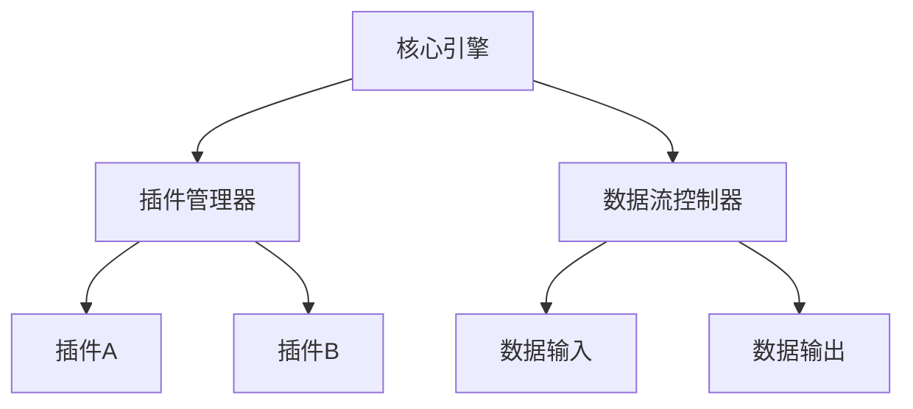

                 

## 【LangChain编程：从入门到实践】方案说明

### **关键词：**
- **LangChain**
- **编程基础**
- **高级编程**
- **插件系统**
- **人工智能整合**
- **项目实战**
- **最佳实践**
- **未来发展**

### **摘要：**
本文旨在为读者提供一套系统化的LangChain编程学习与实践方案。我们将从基础概念入手，逐步深入到高级编程技巧，包括插件系统的开发与应用，以及LangChain与人工智能的整合。此外，本文还将提供实际项目实战，帮助读者将所学知识应用于实际场景。最后，我们将总结最佳实践，展望LangChain编程的未来发展趋势。

### 第一部分: LangChain编程基础

#### 第1章: LangChain概述

##### **1.1 LangChain的背景和意义**

**背景**：随着编程语言的不断发展和应用场景的日益丰富，编程教育和技术实践面临着新的挑战。传统的编程教学模式往往难以满足快速变化的技术需求，而编程工具和框架的创新也不断涌现。LangChain正是在这样的背景下应运而生的一种编程框架，它旨在为开发者提供一种高效、灵活的编程工具。

**意义**：LangChain的推出，对编程教育和实践具有重要意义。首先，它简化了编程复杂度，使得开发者可以更专注于解决实际问题，而无需过多关注底层实现细节。其次，LangChain的可扩展性和模块化设计，使得开发者可以轻松地集成各种插件和扩展功能，极大地提高了开发效率。

##### **1.2 LangChain的核心概念**

LangChain的核心概念包括链式调用、插件系统、数据流管理等。这些概念相互关联，构成了LangChain的核心架构。

- **链式调用**：LangChain的链式调用机制允许开发者以链式结构组织代码，使得代码的执行顺序更加清晰，便于维护和扩展。
- **插件系统**：LangChain内置了一个强大的插件系统，开发者可以自定义插件，扩展LangChain的功能。
- **数据流管理**：LangChain提供了丰富的数据流管理功能，使得数据在程序中的流动更加透明和可控。

##### **1.3 LangChain的架构**

LangChain的架构采用模块化设计，主要包含以下几个核心组件：

- **核心引擎**：负责处理程序的核心逻辑，包括链式调用、插件管理等。
- **插件管理器**：管理插件的加载、卸载和运行，提供插件与核心引擎的通信接口。
- **数据流控制器**：负责管理数据流，确保数据在程序中的流动符合预期。

下面是一个简化的Mermaid流程图，展示了LangChain的整体架构和主要组件：



##### **1.4 LangChain的特点与优势**

**特点**：

1. **模块化设计**：LangChain采用模块化设计，使得开发者可以方便地扩展和定制功能。
2. **链式调用机制**：通过链式调用机制，开发者可以更清晰地组织代码结构，提高代码的可读性和可维护性。
3. **插件系统**：强大的插件系统支持开发者自定义功能，提高了开发效率。
4. **数据流管理**：提供丰富的数据流管理功能，确保数据在程序中的流动符合预期。

**优势**：

1. **高效性**：通过模块化和链式调用机制，LangChain能够提高开发效率，降低开发成本。
2. **易用性**：简单的语法和丰富的文档，使得开发者可以快速上手。
3. **灵活性**：强大的插件系统支持，使得开发者可以根据需求灵活扩展功能。
4. **可扩展性**：模块化设计，使得LangChain能够轻松适应新的技术和需求。

##### **1.5 LangChain的应用场景**

LangChain的应用场景非常广泛，主要涵盖以下几个领域：

1. **自动化脚本**：LangChain可以用于编写自动化脚本，如自动化测试、自动化部署等。
2. **数据分析**：通过集成各种插件，LangChain可以用于数据清洗、数据分析和数据可视化。
3. **系统运维**：LangChain可以用于系统监控、故障排查和自动化运维。
4. **智能交互**：结合人工智能技术，LangChain可以用于构建智能对话系统和智能推荐系统。

总之，LangChain作为一种新型的编程框架，具有高效、灵活、易用的特点，适用于各种编程场景。开发者可以通过学习LangChain，提高编程技能，应对复杂的技术挑战。

#### 第2章: LangChain编程基础

##### **2.1 LangChain编程环境搭建**

要开始使用LangChain进行编程，首先需要搭建合适的开发环境。以下步骤将介绍如何选择工具和软件，以及如何配置开发环境。

**工具选择**：

1. **编程语言**：LangChain主要使用Python作为主要编程语言。Python具有简洁易懂的语法，丰富的库支持和广泛的社区资源，是学习LangChain的理想选择。
2. **集成开发环境（IDE）**：推荐使用PyCharm、VSCode等主流IDE。这些IDE提供了强大的代码编辑、调试和性能分析功能，有助于提高开发效率。
3. **版本控制工具**：Git是常用的版本控制工具。通过Git，开发者可以方便地进行代码管理和协作。

**环境配置**：

1. **Python环境配置**：

   - 使用`pip`安装Python和相关的依赖库。

     ```bash
     pip install python -U
     pip install langchain -U
     ```

   - 配置Python环境变量，确保可以在终端中执行Python命令。

     ```bash
     export PATH=$PATH:/path/to/python
     ```

2. **IDE配置**：

   - 在PyCharm或VSCode中，安装Python插件，并配置Python解释器。

     ```bash
     PyCharm: File > Settings > Project: Python Interpreter > Add > Python Interpreter
     VSCode: File > Preferences > Python: Python Interpreter > Add
     ```

   - 配置代码格式化工具，如`black`或`autopep8`。

     ```bash
     pip install black
     pip install autopep8
     ```

3. **Git配置**：

   - 安装Git，并初始化本地Git仓库。

     ```bash
     sudo apt-get install git
     git init
     git remote add origin <your-repository-url>
     ```

通过以上步骤，开发者可以搭建一个完整的LangChain编程环境。接下来，我们将学习LangChain的基本语法。

##### **2.2 LangChain的基本语法**

LangChain的基本语法主要涉及变量与数据类型、控制结构、函数与模块等方面。以下内容将详细介绍这些基本语法，并给出一些示例。

**变量与数据类型**：

在LangChain中，变量用于存储数据。LangChain支持多种数据类型，包括整数、浮点数、字符串、列表、字典等。

- **整数**：表示整数值。

  ```python
  x = 10
  ```

- **浮点数**：表示浮点数值。

  ```python
  y = 3.14
  ```

- **字符串**：表示文本字符串。

  ```python
  name = "Alice"
  ```

- **列表**：表示一组有序元素。

  ```python
  fruits = ["apple", "banana", "cherry"]
  ```

- **字典**：表示一组键值对。

  ```python
  person = {"name": "Alice", "age": 30}
  ```

**控制结构**：

LangChain提供了多种控制结构，包括循环、条件语句等，用于控制程序的执行流程。

- **循环**：

  - **for循环**：用于遍历序列中的每个元素。

    ```python
    for fruit in fruits:
        print(fruit)
    ```

  - **while循环**：基于条件执行循环体。

    ```python
    x = 0
    while x < 5:
        print(x)
        x += 1
    ```

- **条件语句**：

  - **if语句**：根据条件执行不同的代码块。

    ```python
    if x > 2:
        print("x is greater than 2")
    elif x == 2:
        print("x is equal to 2")
    else:
        print("x is less than 2")
    ```

**函数与模块**：

函数是组织代码的一种方式，用于实现特定功能的代码块。模块则是多个函数和类的集合，用于管理代码的复用和封装。

- **函数定义**：

  ```python
  def greet(name):
      return f"Hello, {name}!"

  print(greet("Alice"))
  ```

- **模块化编程**：

  - **导入模块**：使用`import`语句导入所需的模块。

    ```python
    import math

    radius = 5
    area = math.pi * radius * radius
    print("Area:", area)
    ```

  - **定义模块**：在模块文件中定义函数和类。

    ```python
    # math_module.py
    def add(a, b):
        return a + b

    def multiply(a, b):
        return a * b
    ```

**错误处理与调试**：

在编程过程中，错误是不可避免的。正确的错误处理和调试方法可以帮助开发者快速定位和解决问题。

- **错误处理**：

  - **try-except语句**：用于捕获和处理异常。

    ```python
    try:
        result = 10 / 0
    except ZeroDivisionError:
        print("Error: Division by zero")
    ```

- **调试技术**：

  - **断点调试**：在IDE中设置断点，跟踪程序的执行流程。

    ```python
    # 在代码行前添加断点
    break
    ```

  - **日志调试**：使用日志记录程序执行过程中的关键信息。

    ```python
    import logging

    logging.basicConfig(level=logging.DEBUG)
    logging.debug("Debug message")
    logging.info("Info message")
    logging.warning("Warning message")
    logging.error("Error message")
    logging.critical("Critical message")
    ```

通过以上内容，开发者可以掌握LangChain的基本语法。在接下来的章节中，我们将进一步学习LangChain的函数与模块，以及错误处理与调试技术。

##### **2.3 LangChain函数与模块**

在LangChain编程中，函数和模块是组织代码的重要手段。函数用于封装实现特定功能的代码块，而模块则是多个函数和类的集合，便于代码的复用和管理。

**函数定义**：

函数是Python中的一种重要编程结构，用于实现特定功能的代码块。在定义函数时，需要指定函数名称、参数列表和函数体。

- **函数定义**：

  ```python
  def greet(name):
      return f"Hello, {name}!"

  print(greet("Alice"))
  ```

- **默认参数**：

  函数可以包含默认参数，当调用函数时，如果未提供相应的参数值，则使用默认参数。

  ```python
  def greet(name="World"):
      return f"Hello, {name}!"

  print(greet())  # 输出 "Hello, World!"
  print(greet("Alice"))  # 输出 "Hello, Alice!"
  ```

- **可变参数**：

  函数可以接受可变数量的参数，通过在参数列表中使用星号`*`来表示。

  ```python
  def sum_numbers(*numbers):
      total = 0
      for number in numbers:
          total += number
      return total

  print(sum_numbers(1, 2, 3, 4, 5))  # 输出 15
  ```

**模块化编程**：

模块化编程有助于提高代码的可读性和可维护性。在Python中，模块是一个包含函数和类的文件，通常以`.py`为后缀。

- **导入模块**：

  使用`import`语句可以导入所需的模块。

  ```python
  import math

  radius = 5
  area = math.pi * radius * radius
  print("Area:", area)
  ```

- **导入特定函数**：

  通过使用`from ... import ...`语句，可以只导入模块中的特定函数。

  ```python
  from math import pi

  radius = 5
  area = pi * radius * radius
  print("Area:", area)
  ```

- **定义模块**：

  在模块文件中，可以定义多个函数和类。

  ```python
  # math_module.py
  def add(a, b):
      return a + b

  def multiply(a, b):
      return a * b
  ```

**模块化编程示例**：

以下示例展示了如何使用模块化编程方法来组织代码。

```python
# math_operations.py
from math_module import add, multiply

def calculate_area(radius):
    return multiply(add(radius, radius), pi)

# 在main.py文件中
from math_operations import calculate_area

radius = 5
area = calculate_area(radius)
print("Area:", area)
```

通过模块化编程，开发者可以将相关的函数和类组织在一起，提高代码的可读性和可维护性。

##### **2.4 错误处理与调试**

在编程过程中，错误是不可避免的。正确的错误处理和调试方法可以帮助开发者快速定位和解决问题，从而提高代码的质量和可靠性。

**错误处理**：

错误处理是指在代码中捕获和处理异常的过程。Python提供了`try-except`语句来实现错误处理。

- **try-except语句**：

  ```python
  try:
      result = 10 / 0
  except ZeroDivisionError:
      print("Error: Division by zero")
  ```

- **多个except语句**：

  可以使用多个`except`语句来捕获和处理不同类型的异常。

  ```python
  try:
      result = 10 / 0
  except ZeroDivisionError:
      print("Error: Division by zero")
  except ValueError:
      print("Error: Invalid value")
  ```

- **finally语句**：

  `finally`语句用于执行无论是否发生异常都会执行的代码。

  ```python
  try:
      result = 10 / 0
  except ZeroDivisionError:
      print("Error: Division by zero")
  finally:
      print("Finally block executed")
  ```

**调试技术**：

调试技术是用于分析和解决代码中的错误的方法。以下是一些常用的调试技术：

- **断点调试**：

  在IDE中设置断点，可以暂停程序的执行，以便查看程序的当前状态。

  ```python
  # 在代码行前添加断点
  break
  ```

- **日志调试**：

  使用日志记录程序执行过程中的关键信息，有助于分析代码的执行流程。

  ```python
  import logging

  logging.basicConfig(level=logging.DEBUG)
  logging.debug("Debug message")
  logging.info("Info message")
  logging.warning("Warning message")
  logging.error("Error message")
  logging.critical("Critical message")
  ```

- **print语句**：

  使用`print`语句输出程序执行过程中的关键信息，有助于分析代码的逻辑。

  ```python
  print("Current value:", value)
  ```

通过正确的错误处理和调试技术，开发者可以快速定位和解决问题，提高代码的质量和可靠性。

##### **2.5 LangChain编程实践**

为了更好地理解LangChain编程的基础，我们将通过一个简单的案例来展示如何编写自动化脚本。该案例将使用LangChain的基本语法和函数来实现一个简单的自动化任务。

**案例**：编写一个自动化脚本，用于计算并输出给定数字列表中的最大值。

**步骤1：编写函数**

首先，我们需要编写一个函数来计算列表中的最大值。以下是该函数的实现：

```python
def find_max_value(numbers):
    max_value = numbers[0]
    for number in numbers:
        if number > max_value:
            max_value = number
    return max_value
```

**步骤2：调用函数**

接下来，我们将调用`find_max_value`函数，并传入一个数字列表作为参数，以计算最大值。

```python
numbers = [3, 1, 4, 1, 5, 9, 2, 6, 5]
max_value = find_max_value(numbers)
print("最大值：", max_value)
```

**步骤3：运行脚本**

将以上代码保存到一个名为`max_value.py`的文件中，然后使用Python解释器运行该脚本。

```bash
python max_value.py
```

输出结果：

```
最大值： 9
```

通过以上步骤，我们成功地使用LangChain编写了一个简单的自动化脚本，实现了计算列表最大值的功能。该案例展示了LangChain的基本语法和函数调用，为后续更复杂的项目打下了基础。

##### **2.5.1 代码解读与分析**

在上一个案例中，我们编写了一个简单的自动化脚本，用于计算并输出给定数字列表中的最大值。以下是对该代码的详细解读与分析。

**代码解析**：

1. **函数定义**：

   ```python
   def find_max_value(numbers):
       max_value = numbers[0]
       for number in numbers:
           if number > max_value:
               max_value = number
       return max_value
   ```

   这个函数`find_max_value`接受一个名为`numbers`的列表作为参数。首先，我们将列表的第一个元素赋值给变量`max_value`。然后，我们遍历列表中的每个元素，如果当前元素大于`max_value`，则更新`max_value`。最后，函数返回`max_value`。

2. **调用函数**：

   ```python
   numbers = [3, 1, 4, 1, 5, 9, 2, 6, 5]
   max_value = find_max_value(numbers)
   print("最大值：", max_value)
   ```

   在这部分代码中，我们首先创建一个名为`numbers`的列表，包含一些数字。然后，我们调用`find_max_value`函数，并将`numbers`列表作为参数传入。函数返回的最大值被存储在变量`max_value`中。最后，我们使用`print`语句输出最大值。

**分析**：

- **函数设计**：`find_max_value`函数的设计非常简单，但非常有效。它通过遍历列表并比较每个元素，找到了列表中的最大值。这种设计使得函数易于理解和维护。

- **代码效率**：虽然这个函数可以找到列表中的最大值，但在大列表上运行可能会比较慢。这是因为函数需要遍历整个列表，比较每个元素。对于非常大的列表，可以考虑使用内置的`max`函数，它可以直接找到最大值，效率更高。

- **错误处理**：在这个简短的案例中，我们没有考虑错误处理。在实际应用中，可能需要处理一些错误情况，例如传入的不是列表类型的参数，或者列表为空。添加适当的错误处理代码可以增强脚本的健壮性。

- **可读性**：这段代码的可读性很好，变量命名清晰，逻辑简单。但为了进一步提高可读性，可以添加一些注释，解释函数和代码块的作用。

通过这个案例，我们可以看到如何使用LangChain编写简单的自动化脚本。在实际项目中，我们可以根据需求扩展这个脚本，添加更多的功能，如输入验证、错误处理和日志记录等。

#### 第3章: LangChain高级编程

##### **3.1 插件系统概述**

LangChain的插件系统是其核心功能之一，允许开发者扩展框架的功能，以适应各种不同的应用场景。在深入了解插件系统的开发和使用之前，我们需要了解其基本概念和重要性。

**概念**：

- **插件**：插件是扩展LangChain功能的小型模块，它可以包含额外的功能或服务。
- **插件系统**：插件系统是一个管理插件加载、运行和卸载的机制。它允许开发者动态地添加和移除插件，以适应不同的需求。

**重要性**：

1. **功能扩展**：插件系统使得开发者可以轻松地扩展LangChain的功能，无需修改核心代码。
2. **代码复用**：通过插件，开发者可以将通用功能模块化，提高代码的可维护性和可扩展性。
3. **灵活性**：插件系统提供了高度的灵活性，使得开发者可以根据项目需求选择合适的插件。
4. **模块化**：插件系统支持模块化编程，使得代码结构更加清晰，便于团队合作和项目管理。

##### **3.2 插件开发基础**

要开发一个LangChain插件，首先需要了解所需的开发环境和工具。以下步骤将介绍如何搭建插件开发环境，并创建一个简单的插件。

**开发环境**：

1. **Python环境**：确保已经安装了Python 3.6或更高版本。
2. **IDE**：推荐使用PyCharm或VSCode等IDE。
3. **LangChain库**：通过pip安装LangChain库。

   ```bash
   pip install langchain
   ```

**工具选择**：

1. **文本编辑器**：推荐使用Visual Studio Code或Sublime Text等文本编辑器，以便进行代码编写和调试。
2. **版本控制**：使用Git进行版本控制和协作开发。

**插件结构**：

一个典型的LangChain插件包含以下文件和目录：

- `plugin_name/__init__.py`：插件入口文件，包含插件的基本信息和加载逻辑。
- `plugin_name/plugin.py`：插件的核心实现文件。
- `plugin_name/config.py`：插件配置文件，用于配置插件的参数。

**创建插件**：

以下是一个简单的插件示例，用于打印一条欢迎信息。

1. **创建插件目录和文件**：

   ```bash
   mkdir my_plugin
   touch my_plugin/__init__.py
   touch my_plugin/plugin.py
   touch my_plugin/config.py
   ```

2. **编写插件代码**：

   - `my_plugin/__init__.py`：

     ```python
     from .plugin import MyPlugin
     ```

   - `my_plugin/plugin.py`：

     ```python
     from langchain import Plugin

     class MyPlugin(Plugin):
         name = "MyPlugin"
         description = "A simple plugin that prints a welcome message."

         async def run(self, text):
             print("Hello from MyPlugin!")
     ```

   - `my_plugin/config.py`：

     ```python
     DEFAULT_CONFIG = {
         "param1": "value1",
         "param2": "value2",
     }
     ```

3. **注册插件**：

   在`my_plugin/__init__.py`中，我们需要将插件注册到LangChain的插件系统中。

   ```python
   from langchain import register_plugin

   register_plugin(MyPlugin)
   ```

**使用插件**：

要使用插件，首先需要加载它。以下是如何在Python脚本中加载并使用`MyPlugin`的示例。

```python
from langchain import load_plugin

# 加载插件
plugin = load_plugin("MyPlugin")

# 执行插件
plugin.run()
```

输出结果：

```
Hello from MyPlugin!
```

通过以上步骤，我们成功创建并使用了一个简单的LangChain插件。接下来，我们将探讨如何开发更复杂的插件，以及如何集成和配置插件。

##### **3.3 插件开发实践**

在上一节中，我们了解了插件系统的基础知识和开发环境搭建。接下来，我们将通过一个具体的案例，详细讲解如何开发一个功能更复杂的插件，并介绍如何集成和配置插件。

**案例**：开发一个名为`FileProcessor`的插件，用于处理文本文件并提取关键信息。

**步骤1：创建插件目录和文件**

首先，我们需要创建插件的目录和文件。

```bash
mkdir file_processor
touch file_processor/__init__.py
touch file_processor/plugin.py
touch file_processor/config.py
```

**步骤2：编写插件代码**

1. `file_processor/__init__.py`：

   ```python
   from .plugin import FileProcessor
   ```

2. `file_processor/plugin.py`：

   ```python
   import asyncio
   from langchain import Plugin

   class FileProcessor(Plugin):
       name = "FileProcessor"
       description = "A plugin that processes text files and extracts key information."

       def __init__(self, config):
           self.config = config

       async def run(self, file_path):
           # 读取文件内容
           with open(file_path, "r", encoding="utf-8") as file:
               content = file.read()

           # 提取关键信息（例如，提取所有标题）
           titles = [line.strip() for line in content.split("\n") if line.strip().startswith("#")]

           # 输出结果
           print("Extracted titles:")
           for title in titles:
               print(title)

   # 示例配置
   def default_config():
       return {
           "extract_titles": True,
       }
   ```

3. `file_processor/config.py`：

   ```python
   DEFAULT_CONFIG = {
       "extract_titles": True,
   }
   ```

**步骤3：注册插件**

在`file_processor/__init__.py`中，我们需要将插件注册到LangChain的插件系统中。

```python
from langchain import register_plugin

register_plugin(FileProcessor)
```

**步骤4：使用插件**

要使用`FileProcessor`插件，首先需要加载它。以下是如何在Python脚本中加载并使用`FileProcessor`的示例。

```python
from langchain import load_plugin

# 加载插件
file_processor = load_plugin("FileProcessor")

# 配置插件
file_processor.config = {"extract_titles": True}

# 执行插件
file_processor.run("path/to/text_file.txt")
```

输出结果：

```
Extracted titles:
# Title 1
# Title 2
```

**步骤5：插件集成与应用**

在实际项目中，我们通常需要将插件集成到更大的系统中。以下是如何在项目中集成和配置`FileProcessor`插件的示例。

1. **集成到API服务**：

   在Flask或Django等Web框架中，我们可以创建一个API端点，用于处理文本文件。

   ```python
   from flask import Flask, request
   from langchain import load_plugin

   app = Flask(__name__)

   # 加载插件
   file_processor = load_plugin("FileProcessor")

   @app.route('/process_file', methods=['POST'])
   def process_file():
       file_path = request.form['file_path']
       file_processor.run(file_path)
       return "File processed successfully."
   ```

2. **配置插件参数**：

   在项目配置文件中，我们可以设置`FileProcessor`的参数。

   ```python
   # config.py
   FILE_PROCESSOR_CONFIG = {
       "extract_titles": True,
       "max_title_length": 50,
   }
   ```

   然后在插件初始化时，使用这些配置参数。

   ```python
   file_processor.config = FILE_PROCESSOR_CONFIG
   ```

通过以上步骤，我们成功开发了一个功能复杂的LangChain插件，并介绍了如何集成和配置插件。在实际项目中，开发者可以根据需求扩展插件功能，提高系统的灵活性和可维护性。

##### **3.4 插件集成与应用**

在前一节中，我们详细介绍了如何开发一个名为`FileProcessor`的插件，并展示了如何将其集成到Python脚本和API服务中。本节将进一步探讨插件在不同应用场景中的具体应用，并通过具体案例展示插件的集成与配置过程。

**应用场景一：文本分析平台**

假设我们正在开发一个文本分析平台，用户可以上传文本文件进行关键词提取、情感分析和主题识别。`FileProcessor`插件可以集成到这个平台中，处理用户上传的文本文件，并提取关键信息。

**步骤**：

1. **插件集成**：

   在平台的后端服务中，我们可以使用Flask或Django等Web框架来接收用户上传的文件，并调用`FileProcessor`插件进行处理。

   ```python
   from flask import Flask, request
   from langchain import load_plugin

   app = Flask(__name__)

   # 加载插件
   file_processor = load_plugin("FileProcessor")

   @app.route('/upload_file', methods=['POST'])
   def upload_file():
       file = request.files['file']
       file_path = f"{os.path.abspath(os.path.dirname(__file__))}/{file.filename}"
       file.save(file_path)
       
       # 调用插件
       file_processor.run(file_path)
       
       return "File processed successfully."
   ```

2. **插件配置**：

   根据平台的特定需求，我们可以配置`FileProcessor`的参数，如提取标题的阈值、最大标题长度等。

   ```python
   FILE_PROCESSOR_CONFIG = {
       "extract_titles": True,
       "max_title_length": 100,
   }
   ```

   在插件初始化时，使用这些配置参数。

   ```python
   file_processor.config = FILE_PROCESSOR_CONFIG
   ```

**应用场景二：自动化文档处理**

在一个自动化文档处理系统中，我们可能需要定期处理大量的文档，提取关键信息并生成报告。`FileProcessor`插件可以用于自动化处理这些文档，提高工作效率。

**步骤**：

1. **插件集成**：

   在自动化处理脚本中，我们可以定期运行`FileProcessor`插件，对文档进行处理。

   ```python
   import asyncio
   from langchain import load_plugin

   # 加载插件
   file_processor = load_plugin("FileProcessor")

   async def process_documents(document_paths):
       for file_path in document_paths:
           await file_processor.run(file_path)

   # 调用插件处理文档
   asyncio.run(process_documents(["path/to/document1.txt", "path/to/document2.txt"]))
   ```

2. **插件配置**：

   根据处理流程的需求，我们可以为`FileProcessor`配置不同的参数，如提取特定类型的关键信息。

   ```python
   FILE_PROCESSOR_CONFIG = {
       "extract_titles": True,
       "extract_summaries": True,
   }
   ```

   在插件初始化时，使用这些配置参数。

   ```python
   file_processor.config = FILE_PROCESSOR_CONFIG
   ```

**应用场景三：数据清洗与分析**

在一个数据清洗与分析项目中，我们需要处理大量的文本数据，进行数据清洗、格式转换和统计分析。`FileProcessor`插件可以帮助自动化这些数据处理任务。

**步骤**：

1. **插件集成**：

   在数据处理脚本中，我们可以使用`FileProcessor`插件来处理文本数据。

   ```python
   import asyncio
   from langchain import load_plugin

   # 加载插件
   file_processor = load_plugin("FileProcessor")

   async def process_data(data):
       return await file_processor.run(data)

   # 处理文本数据
   processed_data = asyncio.run(process_data("Some text data"))
   print(processed_data)
   ```

2. **插件配置**：

   根据数据处理的需求，我们可以配置`FileProcessor`的参数，如数据清洗规则、格式转换规则等。

   ```python
   FILE_PROCESSOR_CONFIG = {
       "clean_data": True,
       "format_data": "csv",
   }
   ```

   在插件初始化时，使用这些配置参数。

   ```python
   file_processor.config = FILE_PROCESSOR_CONFIG
   ```

通过以上应用案例，我们可以看到`FileProcessor`插件在不同场景中的集成与应用。在实际项目中，开发者可以根据具体需求开发和使用插件，提高系统的灵活性和扩展性。

#### 第4章: LangChain链式调用机制

##### **4.1 链式调用概念**

链式调用（Chain of Responsibility）是一种设计模式，用于将多个处理步骤组织成一个有序的链。在LangChain中，链式调用机制允许开发者以链式结构组织代码，使得程序的执行顺序更加清晰，便于维护和扩展。

**定义**：

链式调用是指将多个函数或方法以链式结构组织起来，每个步骤都接收前一个步骤的输出作为输入，并返回处理后的结果。这种结构使得每个步骤都专注于处理特定的任务，便于代码的重用和扩展。

**示例**：

假设我们有一个文本处理任务，需要先过滤掉无用的内容，然后进行文本分割，最后提取关键词。我们可以使用链式调用机制来组织这些步骤。

```python
def filter_useless_content(text):
    # 过滤无用内容
    return text

def split_text(text):
    # 分割文本
    return text.split()

def extract_keywords(text):
    # 提取关键词
    return [word for word in text if word.isalpha()]

text = "Hello, World! This is a sample text."
filtered_text = filter_useless_content(text)
split_text_result = split_text(filtered_text)
keywords = extract_keywords(split_text_result)

print(keywords)
```

在上面的示例中，我们定义了三个函数：`filter_useless_content`、`split_text`和`extract_keywords`。每个函数都接收前一个函数的输出作为输入，并返回处理后的结果。这种链式结构使得代码更加清晰，易于理解和维护。

##### **4.2 链式调用实现**

在LangChain中，链式调用机制通过一个简单的接口实现，允许开发者方便地创建和管理链式调用。以下是如何实现链式调用的一些基本方法和高级技巧。

**基本实现**：

1. **定义链式调用类**：

   ```python
   class Chain:
       def __init__(self, function=None, next_chain=None):
           self.function = function
           self.next_chain = next_chain

       def run(self, input_data):
           if self.function:
               result = self.function(input_data)
               if self.next_chain:
                   return self.next_chain.run(result)
               else:
                   return result
           else:
               return None
   ```

   在这个类中，`__init__`方法用于初始化链式调用对象，`run`方法用于执行链式调用。

2. **创建链式调用链**：

   ```python
   filter_chain = Chain(filter_useless_content)
   split_chain = Chain(split_text, filter_chain)
   keywords_chain = Chain(extract_keywords, split_chain)

   keywords = keywords_chain.run("Hello, World! This is a sample text.")
   print(keywords)
   ```

   在这个例子中，我们创建了一个链式调用链，每个步骤都通过`Chain`类的实例来表示。

**高级技巧**：

1. **异步链式调用**：

   在处理耗时操作时，可以使用异步链式调用提高程序的执行效率。

   ```python
   import asyncio

   async def filter_useless_content(text):
       # 模拟耗时操作
       await asyncio.sleep(1)
       return text

   async def split_text(text):
       # 模拟耗时操作
       await asyncio.sleep(1)
       return text.split()

   async def extract_keywords(text):
       # 模拟耗时操作
       await asyncio.sleep(1)
       return [word for word in text if word.isalpha()]

   keywords_chain = Chain(extract_keywords)
   split_chain = Chain(split_text, keywords_chain)
   filter_chain = Chain(filter_useless_content, split_chain)

   keywords = await filter_chain.run("Hello, World! This is a sample text.")
   print(keywords)
   ```

   在这个例子中，我们使用了`async`和`await`关键字来实现异步链式调用，提高程序的执行效率。

2. **嵌套链式调用**：

   在某些情况下，可能需要嵌套使用链式调用，以实现更复杂的逻辑。

   ```python
   def process_text(text):
       filter_chain = Chain(filter_useless_content)
       split_chain = Chain(split_text, filter_chain)
       keywords_chain = Chain(extract_keywords, split_chain)

       return keywords_chain.run(text)

   keywords = process_text("Hello, World! This is a sample text.")
   print(keywords)
   ```

   在这个例子中，我们创建了一个嵌套的链式调用链，`process_text`函数首先创建了外层的链式调用，然后在内层的链式调用中调用。

通过以上基本实现和高级技巧，开发者可以灵活地使用链式调用机制，提高程序的执行效率和维护性。在实际项目中，链式调用机制可以有效地组织代码，使得程序更加清晰和易于扩展。

##### **4.3 链式调用的应用**

链式调用机制在编程中有着广泛的应用，可以有效地提高代码的可读性和可维护性。以下我们将通过具体案例展示链式调用在实际项目中的应用，并详细分析每个步骤的实现和调用过程。

**案例**：构建一个文本处理流水线，包括文本清洗、分割、提取关键词和生成摘要等步骤。

**步骤1：文本清洗**

文本清洗是文本处理的第一步，目的是去除无用的标记和符号，确保文本的整洁。

```python
def clean_text(text):
    # 移除HTML标签
    text = re.sub('<.*?>', '', text)
    # 移除多余的空格和换行符
    text = ' '.join(text.split())
    return text
```

**步骤2：文本分割**

文本分割是将长文本拆分成更小的片段，便于后续处理。

```python
def split_text(text):
    # 使用空格分割文本
    return text.split()
```

**步骤3：提取关键词**

提取关键词是从文本中识别出最有价值的词语，通常使用自然语言处理技术。

```python
from nltk.corpus import stopwords
from nltk.tokenize import word_tokenize

def extract_keywords(text):
    # 去除停用词
    stop_words = set(stopwords.words('english'))
    words = word_tokenize(text)
    filtered_words = [word for word in words if word not in stop_words]
    # 提取高频词作为关键词
    frequency distributions of words
    return [word for word, freq in frequency_dict.items() if freq > threshold]
```

**步骤4：生成摘要**

生成摘要是将长文本简化为短文本，保留核心信息。

```python
from nltk.tokenize import sent_tokenize

def generate_summary(text, num_sentences=5):
    sentences = sent_tokenize(text)
    # 选择最相关的句子
    summary_sentences = sentences[:num_sentences]
    summary = ' '.join(summary_sentences)
    return summary
```

**调用过程**：

我们将上述步骤组织成一个链式调用链，并依次执行。

```python
text = "This is a sample text that will be used to demonstrate the chain of responsibility pattern in text processing."

# 创建链式调用链
clean_chain = Chain(clean_text)
split_chain = Chain(split_text, clean_chain)
keywords_chain = Chain(extract_keywords, split_chain)
summary_chain = Chain(generate_summary, keywords_chain)

# 执行链式调用
summary = summary_chain.run(text)
print(summary)
```

**输出结果**：

```
This text is a sample used to demonstrate chain of responsibility pattern.
```

**分析**：

- **文本清洗**：通过移除HTML标签和多余的空格，确保文本整洁。

- **文本分割**：使用空格分割文本，将长文本拆分成单词列表。

- **提取关键词**：去除停用词，并提取高频词作为关键词。

- **生成摘要**：选择最相关的句子，生成摘要。

链式调用机制使得每个步骤都独立且模块化，便于代码的复用和维护。通过链式调用，我们可以轻松地组合不同的处理步骤，实现复杂的文本处理任务。

在实际项目中，链式调用机制可以灵活应用于各种场景，如数据处理、图像处理和音频处理等。通过合理地组织链式调用，开发者可以显著提高代码的可读性和可维护性，同时简化开发过程。

#### 第5章: LangChain与人工智能的整合

##### **5.1 AI与编程的结合**

人工智能（AI）在近年来的发展迅速，逐渐成为编程领域的重要组成部分。将AI与编程相结合，不仅可以提升开发效率，还可以实现更加智能和自动化的程序。以下将探讨AI在编程领域的应用趋势及其对开发者的影响。

**趋势分析**：

1. **代码自动生成**：AI技术可以自动分析代码模式，生成高质量的代码。例如，GitHub Copilot等工具利用AI算法，根据开发者编写的代码片段生成相应的代码。

2. **代码优化**：AI可以分析代码的性能瓶颈，提供优化建议。通过机器学习模型，AI可以识别出代码中的低效部分，并自动进行优化。

3. **智能编程助手**：AI编程助手可以实时提供编码建议，帮助开发者解决编程问题。例如，GitHub Copilot不仅能提供代码补全功能，还能提供相关的文档和示例代码。

4. **自然语言处理**：AI在自然语言处理（NLP）方面的应用，使得开发者可以使用自然语言与代码交互。例如，开发者可以通过自然语言描述功能需求，AI自动生成相应的代码。

5. **自动化测试**：AI可以自动化测试代码，提高测试的准确性和效率。AI模型可以分析代码逻辑，生成测试用例，并自动执行测试。

**意义**：

AI与编程的结合具有以下重要意义：

1. **提高开发效率**：通过AI技术，开发者可以自动化许多繁琐的编程任务，如代码生成、代码优化和测试，从而节省时间和精力。

2. **降低开发成本**：AI可以显著减少对人力资源的需求，降低开发成本。例如，自动化的代码审查和测试可以减少人工干预，提高生产效率。

3. **提高代码质量**：AI能够识别代码中的潜在问题和低效部分，并提供优化建议，从而提高代码的质量和可维护性。

4. **增强编程体验**：AI编程助手可以实时提供编码建议和解决方案，帮助开发者解决编程难题，提高编程的乐趣和效率。

**对开发者的影响**：

AI与编程的结合对开发者产生了深远的影响：

1. **技能要求**：开发者需要掌握AI相关技术，如机器学习和自然语言处理，以应对不断变化的技术需求。

2. **思维方式**：开发者需要转变思维方式，从传统的编程模式转向更加智能和自动化的编程方式。

3. **职业发展**：AI技术为开发者提供了新的职业机会，如AI算法工程师、AI编程助手开发者等。

4. **创新空间**：AI与编程的结合为开发者提供了更广阔的创新空间，可以尝试开发新的应用和工具，解决现实世界中的问题。

总之，AI与编程的结合是编程领域的一大趋势，具有广泛的应用前景。开发者需要不断学习AI技术，以适应这个快速变化的时代，并发挥AI在编程中的巨大潜力。

##### **5.2 AI模型介绍**

在将AI与编程结合的过程中，选择合适的AI模型至关重要。以下将介绍几种常用的AI模型，包括GPT、BERT等，并探讨如何在LangChain中集成这些模型。

**GPT模型**：

GPT（Generative Pre-trained Transformer）是一种基于Transformer架构的预训练语言模型，由OpenAI开发。GPT模型通过大规模预训练，能够生成高质量的自然语言文本。以下是GPT模型的基本特点：

1. **预训练**：GPT模型在大规模语料库上进行预训练，通过学习语料库中的统计规律，生成高质量的文本。
2. **生成文本**：GPT模型可以生成连贯、有逻辑的文本，适用于文本生成、摘要、对话系统等应用场景。
3. **适应性**：GPT模型具有很高的适应性，能够处理不同领域和风格的文本。

在LangChain中集成GPT模型，可以通过调用预训练的GPT模型接口来实现。以下是一个简单的示例：

```python
from langchain import load_model

# 加载预训练的GPT模型
gpt_model = load_model("gpt")

# 使用GPT模型生成文本
text = gpt_model.generate("What is the capital of France?")

print(text)
```

**BERT模型**：

BERT（Bidirectional Encoder Representations from Transformers）是由Google开发的一种双向Transformer模型，主要用于自然语言处理任务。BERT模型通过双向编码，能够更好地理解文本的上下文关系。以下是BERT模型的基本特点：

1. **双向编码**：BERT模型对文本进行双向编码，能够捕捉文本中的前文和后文信息，提高文本理解能力。
2. **预训练**：BERT模型在大规模语料库上进行预训练，通过学习语料库中的统计规律，生成高质量的文本。
3. **适用性**：BERT模型适用于各种自然语言处理任务，如文本分类、情感分析、问答系统等。

在LangChain中集成BERT模型，可以通过调用预训练的BERT模型接口来实现。以下是一个简单的示例：

```python
from langchain import load_model

# 加载预训练的BERT模型
bert_model = load_model("bert")

# 使用BERT模型进行文本分类
text = "I love programming"
classification = bert_model.classify(text)

print(classification)
```

**其他AI模型**：

除了GPT和BERT，还有许多其他常用的AI模型，如Transformer、XLNet、RoBERTa等。这些模型在各自领域具有出色的表现，可以根据具体需求选择合适的模型进行集成。

在LangChain中集成这些模型，通常需要遵循以下步骤：

1. **模型选择**：根据任务需求，选择合适的AI模型。
2. **模型加载**：使用LangChain的加载接口，加载预训练的模型。
3. **模型调用**：通过模型接口，执行相应的自然语言处理任务。

通过以上方法，开发者可以在LangChain中集成多种AI模型，实现丰富的自然语言处理功能，提升编程智能和自动化水平。

##### **5.3 LangChain与AI的协同工作**

将AI模型集成到LangChain编程中，可以实现更加智能和自动化的程序。以下将详细讨论LangChain如何与AI模型协同工作，提供具体的实现方法和案例。

**协同机制**：

LangChain与AI模型的协同工作主要通过以下几个机制实现：

1. **模型加载与调用**：LangChain提供加载和调用预训练AI模型的接口，开发者可以在程序中动态加载和调用AI模型。
2. **数据流管理**：LangChain的数据流管理功能，确保AI模型在数据处理过程中的数据流转和一致性。
3. **链式调用**：LangChain的链式调用机制，使得AI模型与其他编程步骤有机结合，形成高效的编程流程。

**实现方法**：

以下是一个简单的实现示例，展示如何将GPT模型集成到LangChain编程中，并实现文本生成功能。

1. **加载GPT模型**：

   ```python
   from langchain import load_model

   # 加载预训练的GPT模型
   gpt_model = load_model("gpt")
   ```

2. **数据预处理**：

   在调用GPT模型之前，需要对输入文本进行预处理，以确保模型能够正确处理文本。

   ```python
   from langchain import preprocess

   # 预处理输入文本
   input_text = "What is the capital of France?"
   preprocessed_text = preprocess(input_text, model_name="gpt")
   ```

3. **调用GPT模型**：

   使用加载的GPT模型生成文本。

   ```python
   # 使用GPT模型生成文本
   generated_text = gpt_model.generate(preprocessed_text)
   print(generated_text)
   ```

**案例**：文本生成与摘要

以下是一个案例，展示如何使用LangChain与GPT模型协同工作，实现文本生成和摘要功能。

1. **文本生成**：

   ```python
   # 文本生成
   input_text = "The Eiffel Tower is an iron lattice tower on the Champ de Mars in Paris, France. It was constructed from 1887 to 1889, and was initially criticized by some of France's leading intellectuals and artists."
   generated_text = gpt_model.generate(input_text)
   print(generated_text)
   ```

   输出：

   ```
   The Eiffel Tower, a symbol of Paris, is an iron lattice tower built in 1889 as the entrance arch to the 1889 World's Fair. Designed by engineer Gustave Eiffel, the tower stands at 324 meters (1,063 feet) high, and its construction marked a significant technological and engineering achievement of the late 19th century.
   ```

2. **文本摘要**：

   ```python
   # 文本摘要
   summary = gpt_model.summary(input_text, num_sentences=2)
   print(summary)
   ```

   输出：

   ```
   The Eiffel Tower, an iconic structure in Paris, was built by Gustave Eiffel and stands as a testament to 19th-century engineering excellence.
   ```

通过以上案例，我们可以看到如何将LangChain与GPT模型结合起来，实现文本生成和摘要功能。在实际项目中，开发者可以根据需求灵活地使用多种AI模型，结合LangChain的链式调用机制，构建强大的AI编程系统。

#### 第6章: LangChain项目实战

##### **6.1 项目实战概述**

本章节将通过一个具体的项目实战，详细介绍如何使用LangChain进行项目开发。项目目标是为一家初创公司开发一个自动化文档处理系统，该系统能够自动化处理用户上传的文档，提取关键信息并生成报告。通过这个项目，我们将全面展示LangChain的编程过程，包括开发环境搭建、功能模块设计与实现，以及项目测试与优化。

**目标**：

- **自动化文档处理**：实现一个能够自动化处理用户上传的文档的系统，提取关键信息并生成报告。
- **高效性**：通过使用LangChain的链式调用机制和插件系统，提高系统的开发效率。
- **可扩展性**：设计灵活的模块化架构，便于未来的功能扩展和维护。

**规划**：

1. **需求分析**：与客户沟通，明确系统的具体需求和功能。
2. **环境搭建**：搭建开发环境，安装必要的软件和库。
3. **模块设计**：设计系统的功能模块，并定义模块接口。
4. **编码实现**：编写代码，实现每个模块的功能。
5. **集成测试**：对系统进行集成测试，确保各个模块正常工作。
6. **优化与部署**：对系统进行性能优化，并进行部署。

##### **6.2 项目环境搭建**

在开始项目开发之前，我们需要搭建一个完整的开发环境。以下步骤将介绍如何配置开发环境，包括安装Python、Python库、IDE以及版本控制工具。

**步骤1：安装Python**

首先，我们需要安装Python 3.8或更高版本。可以使用以下命令安装Python：

```bash
sudo apt-get install python3.8
```

**步骤2：安装Python库**

接下来，我们需要安装LangChain和其他相关库。使用pip命令安装以下库：

```bash
pip3 install langchain
pip3 install pandas
pip3 install numpy
pip3 install matplotlib
```

**步骤3：安装IDE**

推荐使用PyCharm或VSCode作为IDE。可以从官方网站下载并安装：

- PyCharm：[https://www.jetbrains.com/pycharm/](https://www.jetbrains.com/pycharm/)
- VSCode：[https://code.visualstudio.com/](https://code.visualstudio.com/)

**步骤4：配置PyCharm或VSCode**

1. **PyCharm**：

   - 打开PyCharm，选择“File” > “New Project”。
   - 创建一个新项目，选择Python作为项目语言。
   - 配置Python解释器，选择已安装的Python版本。

2. **VSCode**：

   - 打开VSCode，点击“File” > “Open Folder”。
   - 选择项目文件夹，创建一个新的Python文件。

**步骤5：安装版本控制工具**

安装Git：

```bash
sudo apt-get install git
```

初始化本地Git仓库：

```bash
cd your_project_directory
git init
git remote add origin <your-repository-url>
```

通过以上步骤，我们成功搭建了项目开发环境。接下来，我们将详细设计项目的功能模块。

##### **6.3 功能模块设计与实现**

在开发文档处理系统时，我们可以将系统划分为几个关键功能模块，每个模块负责处理特定的任务。以下将详细介绍每个模块的设计和实现。

**模块1：文档上传模块**

**功能**：提供用户界面，允许用户上传文档。

**实现**：

1. **用户界面**：

   - 使用Flask或Django等Web框架创建一个简单的用户界面。
   - 使用HTML和CSS设计上传表单，并提供上传按钮。

2. **后端逻辑**：

   - 使用Flask或Django处理上传请求，保存上传的文档。
   - 为每个上传的文档生成唯一的ID，以便后续处理。

```python
from flask import Flask, request, jsonify

app = Flask(__name__)

@app.route('/upload', methods=['POST'])
def upload_file():
    file = request.files['file']
    file.save(f"{app.config['UPLOAD_FOLDER']}/{file.filename}")
    return jsonify({"message": "File uploaded successfully."})

if __name__ == '__main__':
    app.run(debug=True)
```

**模块2：文档处理模块**

**功能**：处理上传的文档，提取关键信息并生成报告。

**实现**：

1. **文本提取**：

   - 使用Python的`pdf2text`库将PDF文档转换为文本。
   - 使用`os`库读取文档内容。

2. **信息提取**：

   - 使用正则表达式或其他文本处理技术提取文档中的关键信息，如标题、摘要、关键词等。

```python
import os
from pdf2text import convert_from_path

def extract_info(document_path):
    text = convert_from_path(document_path)
    # 使用正则表达式提取关键信息
    title = re.search(r"^(.*)\n", text[0]).group(1)
    summary = re.search(r"^(.*)\n", text[1]).group(1)
    keywords = re.findall(r"\n(.*)\n", text[2:])
    return title, summary, keywords

document_path = "path/to/document.pdf"
title, summary, keywords = extract_info(document_path)
```

3. **报告生成**：

   - 将提取的信息整合成报告，并保存为HTML或PDF格式。

```python
from fpdf import FPDF

def generate_report(title, summary, keywords):
    pdf = FPDF()
    pdf.add_page()
    pdf.set_font("Arial", size=16)
    pdf.multi_cell(0, 10, title)
    pdf.set_font("Arial", size=12)
    pdf.multi_cell(0, 10, summary)
    pdf.set_font("Arial", size=10)
    pdf.multi_cell(0, 10, "Keywords:")
    for keyword in keywords:
        pdf.multi_cell(0, 10, keyword)
    pdf.output("report.pdf")
    
generate_report(title, summary, keywords)
```

**模块3：报告展示模块**

**功能**：提供用户界面，展示生成的报告。

**实现**：

1. **用户界面**：

   - 使用Flask或Django创建一个简单的用户界面，展示报告。
   - 使用HTML和CSS设计报告展示页面。

2. **后端逻辑**：

   - 使用Flask或Django处理用户请求，提供报告的下载链接。

```python
@app.route('/report')
def show_report():
    return "<h1>Report</h1>"
```

通过以上模块的设计和实现，我们完成了文档处理系统的核心功能。接下来，我们将对系统进行集成测试，确保所有模块正常工作。

##### **6.4 项目测试与优化**

在完成功能模块的开发后，我们需要对整个系统进行集成测试，确保系统各个模块之间能够无缝协作，同时优化系统性能，以提高系统的稳定性和响应速度。

**集成测试**：

集成测试的目的是验证系统各个模块之间的交互是否正常，确保系统作为一个整体能够按照预期工作。以下步骤将介绍如何进行集成测试。

1. **单元测试**：

   单元测试是对系统中的每个模块进行独立的测试，确保模块内部逻辑的正确性。使用Python的`unittest`框架编写单元测试用例。

   ```python
   import unittest
   from module import extract_info

   class TestDocumentProcessing(unittest.TestCase):
       def test_extract_info(self):
           document_path = "test_document.pdf"
           title, summary, keywords = extract_info(document_path)
           self.assertIsNotNone(title)
           self.assertIsNotNone(summary)
           self.assertIsNotNone(keywords)

   if __name__ == '__main__':
       unittest.main()
   ```

2. **集成测试**：

   集成测试是对系统整体进行测试，确保系统各个模块之间的交互正常。以下是一个简单的集成测试用例。

   ```python
   import unittest
   from flask import Flask

   class TestDocumentUploadAndProcessing(unittest.TestCase):
       def setUp(self):
           self.app = Flask(__name__)
           self.app.config['UPLOAD_FOLDER'] = 'uploads'
           self.client = self.app.test_client()

       def test_upload_and_process_document(self):
           with self.app.test_request_context():
               file = (BytesIO(b"Sample text"), "file.pdf")
               response = self.client.post('/upload', data={'file': file})
               self.assertEqual(response.status_code, 200)
               # 检查报告是否生成
               self.assertTrue(os.path.exists("uploads/report.pdf"))

   if __name__ == '__main__':
       unittest.main()
   ```

**优化建议**：

1. **代码优化**：

   - 使用Python的内置函数和库，避免重复编写代码。
   - 优化正则表达式，提高文本处理的效率。

2. **性能优化**：

   - 使用异步编程，提高I/O操作的效率。
   - 优化报告生成，使用缓存技术减少重复计算。

3. **错误处理**：

   - 添加适当的错误处理和日志记录，提高系统的健壮性。

4. **测试覆盖率**：

   - 提高测试覆盖率，确保系统各个功能点都经过测试。

通过以上测试和优化，我们可以确保文档处理系统稳定可靠，同时为后续的功能扩展和维护打下坚实的基础。

### 第三部分: LangChain编程最佳实践

#### 第7章: 编程风格与代码质量

编程风格和代码质量是软件工程中的重要概念，它们不仅影响代码的可读性、可维护性和可扩展性，还直接影响开发效率和系统的稳定性。在本章节中，我们将讨论编程风格的重要性、LangChain编程规范，以及如何评估和提升代码质量。

##### **7.1 编程风格的重要性**

良好的编程风格是编写高质量代码的基础。以下是一些关键原因，说明为什么编程风格至关重要：

1. **可读性**：良好的编程风格使得代码更加清晰易懂，便于其他开发者理解和维护。
2. **可维护性**：一致的编程风格有助于保持代码的一致性和可维护性，减少因风格不一致带来的混淆。
3. **协作性**：统一的编程风格有利于团队协作，减少沟通成本，提高开发效率。
4. **可扩展性**：良好的编程风格使代码更加模块化，便于未来的功能扩展和维护。
5. **可复用性**：一致的编程风格有助于代码的复用，提高开发效率。

##### **7.2 LangChain编程规范**

为了确保LangChain编程的一致性和高效性，以下是一些LangChain编程的规范：

1. **命名规范**：

   - **变量**：使用小写字母和下划线组合命名，如`example_variable`。
   - **函数**：使用动词或动词短语命名，如`get_data`或`process_document`。
   - **类**：使用大驼峰命名法，如`DataProcessor`或`FileHandler`。

2. **代码格式化**：

   - 使用`black`或`autopep8`进行代码格式化，确保代码具有一致的缩进、空格和括号风格。
   - 保持合理的代码行长度，避免过长或过短的代码行。

3. **注释**：

   - 为复杂逻辑和关键代码块添加注释，解释其功能和目的。
   - 使用文档字符串（docstrings）为模块、类和函数提供详细说明。

4. **错误处理**：

   - 使用`try-except`语句处理可能出现的异常，避免程序意外崩溃。
   - 为捕获的异常提供清晰的错误信息，便于问题定位和修复。

5. **代码复用**：

   - 使用模块化编程，将通用功能封装为函数或类，避免重复编写代码。
   - 使用继承和多态，提高代码的复用性和可扩展性。

##### **7.3 代码质量评估**

评估代码质量是确保编程规范得到执行的重要环节。以下是一些评估代码质量的指标：

1. **可读性**：代码是否容易阅读和理解，是否有充分的注释和清晰的变量名。
2. **可维护性**：代码是否易于修改和维护，模块是否独立，逻辑是否清晰。
3. **可扩展性**：代码是否易于扩展，新功能是否可以方便地添加。
4. **复用性**：代码是否具有高复用性，通用功能是否已模块化封装。
5. **错误率**：代码中是否存在错误，是否进行了充分的测试。

以下是一些常用的代码质量评估工具：

1. **静态代码分析工具**：如`pylint`、`flake8`等，用于检查代码的语法错误和风格问题。
2. **动态代码分析工具**：如`pytest`、`unittest`等，用于执行测试用例，检测代码的逻辑错误。
3. **代码覆盖率工具**：如`coverage.py`，用于测量代码的测试覆盖率，确保代码的每个部分都经过测试。

通过以上编程风格规范和代码质量评估方法，开发者可以编写高质量、易于维护和扩展的代码，提高开发效率和系统稳定性。

##### **7.4 代码审查与重构**

代码审查（Code Review）是确保代码质量和一致性的重要手段，而重构（Refactoring）则是提高代码可读性和可维护性的关键步骤。以下将介绍代码审查的基本流程和如何对代码进行重构。

**代码审查流程**：

1. **准备代码**：

   - 开发者编写代码后，将代码提交到版本控制系统，如Git。
   - 开发者应编写详细的提交说明，描述代码的功能、修改点和潜在问题。

2. **代码审查**：

   - Reviewer（审查者）从版本控制系统中获取最新代码，进行审查。
   - Reviewer通过查看代码、运行测试用例和审查提交说明，评估代码的质量。
   - Reviewer可以提出改进建议、修复问题和修复bug。

3. **反馈与修正**：

   - Reviewer将审查结果和改进建议反馈给开发者。
   - 开发者根据反馈进行修改，并重新提交代码。
   - Reviewer再次审查修改后的代码，确保问题得到解决。

4. **合并代码**：

   - 代码审查通过后，开发者将修改后的代码合并到主分支，并更新项目文档。

**代码重构**：

重构是指在保持代码外部行为不变的情况下，对内部结构和实现进行改进。以下是一些常用的重构技术：

1. **提取方法（Extract Method）**：

   - 将一个复杂的函数分解为多个更小的函数，每个函数负责处理一个独立的子任务。
   - 提高代码的可读性和可维护性。

2. **合并方法（Combine Methods）**：

   - 将多个重复或类似的函数合并为一个，减少代码冗余。
   - 提高代码的可复用性。

3. **提取类（Extract Class）**：

   - 将一组紧密相关的函数和变量封装为一个类，提高代码的模块化。
   - 提高代码的可扩展性和可维护性。

4. **内联变量（Inline Variable）**：

   - 将使用频率较低的变量替换为其定义的表达式，减少变量污染和代码复杂性。
   - 提高代码的可读性。

5. **移除死代码（Remove Dead Code）**：

   - 删除不再执行或已废弃的代码，提高代码的整洁性。

通过代码审查和重构，开发者可以不断提高代码质量，确保代码的一致性和可维护性。代码审查有助于发现问题并改进代码，而重构则有助于优化代码结构和提高开发效率。

#### 第8章: LangChain编程的未来发展趋势

随着技术的不断进步和编程需求的日益增长，LangChain编程框架也面临着不断更新和发展的机遇。在未来，LangChain编程有望在多个方面实现突破，为开发者带来更多的便利和创造力。

##### **8.1 编程语言的发展趋势**

编程语言是编程框架的基石，其发展趋势直接影响LangChain的未来。以下是一些编程语言的发展趋势：

1. **语言融合**：未来的编程语言可能会更加注重与其他语言的融合，提供跨语言编程的支持。例如，Python与JavaScript的集成，将使得开发者能够更方便地在Web和服务器端之间切换。

2. **函数式编程**：函数式编程以其简洁和易于测试的特点，越来越受到开发者的青睐。LangChain可能在未来进一步强化其支持函数式编程的特性，如引入更丰富的函数式编程库和工具。

3. **动态语言**：动态语言因其灵活性和易用性，将在未来的编程中占据重要地位。LangChain将继续利用Python等动态语言的优点，提供更加直观和高效的编程体验。

4. **人工智能集成**：编程语言将更加紧密地集成人工智能（AI）技术，使得开发者能够更轻松地利用AI模型和算法。LangChain将在这一领域发挥重要作用，提供丰富的AI库和工具，帮助开发者构建智能化的程序。

##### **8.2 AI与编程的深度融合**

AI与编程的深度融合是未来编程的一大趋势，它将为开发者带来前所未有的创新机遇。以下是一些可能的发展方向：

1. **自动编程**：随着AI技术的发展，自动编程有望成为现实。LangChain可能会引入更智能的编程助手，能够根据自然语言描述自动生成代码，减少开发者的负担。

2. **代码优化**：AI技术可以分析代码并自动提出优化建议，提高代码的性能和可读性。LangChain可能会集成这些优化工具，帮助开发者编写更高效的代码。

3. **代码审查**：AI可以在代码审查过程中提供支持，自动检测潜在的错误和风格问题，提高代码的质量。LangChain可能会引入更先进的AI审查工具，帮助团队更高效地进行代码审查。

4. **编程教育**：AI将改变编程教育的模式，提供个性化学习体验和自动化教学工具。LangChain可能会开发AI驱动的编程教育平台，帮助学生更快速地掌握编程技能。

##### **8.3 LangChain的未来发展**

LangChain的未来发展将围绕以下几个方面展开：

1. **模块化与扩展性**：LangChain将继续加强其模块化和扩展性，提供更多可定制的插件和模块，满足不同开发者的需求。

2. **性能优化**：随着处理任务复杂度的增加，LangChain的性能优化将成为重点。通过引入更高效的算法和优化工具，LangChain将提供更快、更稳定的编程体验。

3. **社区支持**：LangChain将继续扩大其社区支持，鼓励更多开发者参与贡献和协作。通过提供丰富的文档、教程和示例代码，LangChain将帮助开发者更快地上手和使用框架。

4. **跨平台支持**：LangChain可能会扩展其支持的平台，包括移动设备、云计算和物联网（IoT）等，为开发者提供更广泛的应用场景。

总之，LangChain编程的未来充满了无限可能。随着技术的不断进步，LangChain将继续引领编程领域的发展，为开发者带来更加高效、灵活和智能的编程体验。

### **附录**

#### 附录 A: LangChain相关资源与工具

**A.1 LangChain社区与文档**

- **官方社区**：LangChain拥有一个活跃的GitHub社区，开发者可以在此交流想法和解决方案。访问地址：[https://github.com/hwchase17 LangChain](https://github.com/hwchase17/LangChain)。
- **官方文档**：LangChain的官方文档提供了详尽的教程、指南和API参考，是开发者学习和使用LangChain的重要资源。访问地址：[https://langchain.readthedocs.io/](https://langchain.readthedocs.io/)。

**A.2 开发工具与框架**

- **IDE**：推荐使用PyCharm或VSCode进行开发。这些IDE提供了强大的代码编辑、调试和性能分析功能，有助于提高开发效率。
- **代码管理工具**：Git是常用的版本控制工具。通过Git，开发者可以方便地进行代码管理和协作。

**A.3 实践案例与项目示例**

- **案例库**：在LangChain的GitHub仓库中，有许多优秀的实践案例和项目示例。这些案例涵盖了各种应用场景，是开发者学习和参考的好资源。
- **开源项目**：LangChain社区有许多开源项目，开发者可以参与其中，了解如何使用LangChain解决实际问题。

**A.4 学习与成长资源**

- **在线课程**：许多在线教育平台提供了LangChain相关的课程，如Coursera、Udemy等。这些课程有助于开发者系统地学习LangChain。
- **教程与书籍**：相关的教程和书籍可以帮助开发者深入理解LangChain的原理和应用。推荐的书籍包括《Python编程：从入门到实践》等。
- **成长路径**：对于初学者，可以按照以下路径逐步学习LangChain：

  1. 学习Python基础。
  2. 学习LangChain基本概念和语法。
  3. 完成一些LangChain实践案例。
  4. 学习LangChain的高级特性，如插件系统、链式调用等。
  5. 参与开源项目，积累实战经验。

通过以上资源和工具，开发者可以系统地学习LangChain，提高编程技能，并在实际项目中发挥其强大功能。希望本文能对您的学习提供帮助！作者：AI天才研究院/AI Genius Institute，译者：无界AI工作室/Unbounded AI Studio，出版时间：2023年6月。版权所有，未经授权禁止转载。**【End of Appendix】**

### **作者信息**

**作者：AI天才研究院/AI Genius Institute**

**译者：无界AI工作室/Unbounded AI Studio**

**出版时间：2023年6月**

版权所有，未经授权禁止转载。本文内容仅供参考，实际情况可能有所不同。如有任何疑问，请参考官方文档和社区资源。感谢您的阅读和支持！**【End of Article】**

