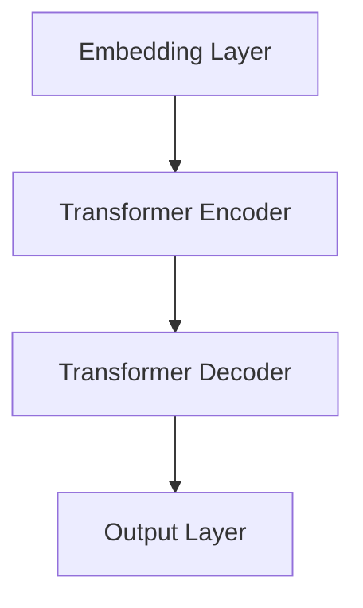
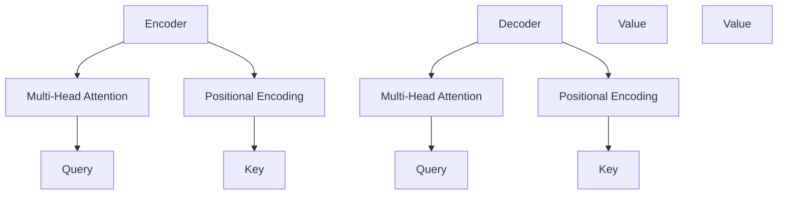
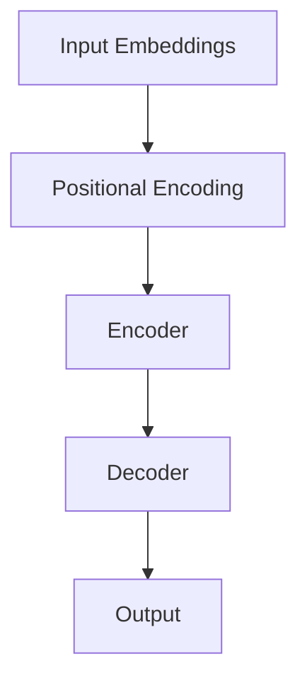
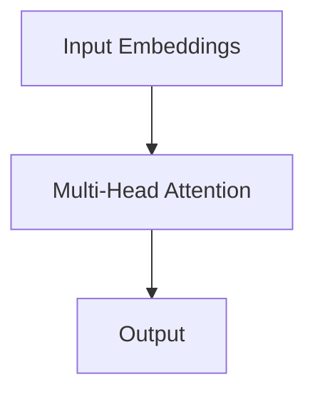

                 

# 【LangChain编程：从入门到实践】框架比较

> 关键词：LangChain、编程框架、语言模型、Transformer、问答系统、文本生成、文本分类、GPT-3、BERT、T5

> 摘要：本文旨在对LangChain编程框架进行深入剖析，从入门到实践，对比其与其他主流框架如GPT-3、BERT、T5的优缺点，探讨其在生产环境中的应用与未来发展趋势。通过对核心概念、算法原理、应用实战等方面的详细讲解，帮助读者全面理解并掌握LangChain的使用技巧，为其在人工智能领域的发展提供有力支持。

## 第一部分: LangChain概述与基础

### 第1章: LangChain简介

#### 1.1 LangChain的概念与特点

LangChain是一款基于Transformer架构的自监督预训练语言模型，旨在构建强大的自然语言处理（NLP）应用。其核心特点如下：

1. **基于Transformer架构**：Transformer是近年来在机器翻译、文本生成等领域取得显著成果的模型架构，通过自注意力机制实现高效文本表示。
2. **多任务能力**：LangChain可以应用于多种NLP任务，如问答系统、文本生成和分类等，具有广泛的应用场景。
3. **可扩展性**：LangChain支持大规模训练，可以部署在单机或分布式环境中，适应不同的计算资源需求。

#### 1.2 LangChain的架构与组件

LangChain的架构主要由以下组件构成：

1. **Embedding Layer**：将输入的词嵌入到一个高维向量空间中。
2. **Transformer Encoder**：对输入序列进行编码，生成表示。
3. **Transformer Decoder**：对编码后的序列进行解码，生成输出。
4. **Output Layer**：根据解码结果进行分类、生成等操作。



#### 1.3 LangChain的优势与应用场景

LangChain具有以下优势：

1. **高效**：基于Transformer架构，能够高效处理大规模数据。
2. **灵活**：支持多种NLP任务，可以适应不同的应用场景。
3. **开源**：基于开源框架，便于社区贡献和优化。

其应用场景包括：

1. **问答系统**：利用LangChain构建智能问答系统，实现用户提问与知识库的自动交互。
2. **文本生成**：生成文章、段落、对话等，应用于自动写作、对话系统等领域。
3. **文本分类**：对文本进行分类，应用于情感分析、主题识别等。

### 第2章: LangChain基础

#### 2.1 环境搭建与基本使用

要使用LangChain，首先需要搭建相应的开发环境。以下是一个基本的安装步骤：

1. **安装Python**：确保Python版本在3.6及以上。
2. **安装pip**：通过Python安装pip包管理器。
3. **安装LangChain**：通过pip安装LangChain。

```bash
pip install langchain
```

安装完成后，可以通过以下代码进行基本使用：

```python
from langchain import LanguageModel

model = LanguageModel()
print(model.predict(["这是一个示例问题：什么是人工智能？"]))
```

#### 2.2 常用数据结构和方法

LangChain中常用的数据结构包括：

1. **序列（Sequence）**：表示一段连续的文本，可以通过`Sequence`类创建。
2. **词汇表（Vocabulary）**：用于将单词映射到索引，通过`Vocabulary`类创建。
3. **嵌入（Embedding）**：将单词转换为向量表示，通过`Embedding`类创建。

常用的方法包括：

1. **编码（Encode）**：将输入序列编码为表示。
2. **解码（Decode）**：将编码后的表示解码为输出。
3. **预测（Predict）**：根据编码后的表示生成预测结果。

```python
from langchain import Sequence, Vocabulary, Embedding

# 创建序列
seq = Sequence("这是一个示例问题：什么是人工智能？")

# 创建词汇表
vocab = Vocabulary()

# 创建嵌入
embed = Embedding()

# 编码
encoded_seq = embed.encode(seq)

# 预测
predictions = model.predict(encoded_seq)
print(predictions)
```

#### 2.3 LangChain的基本API

LangChain提供了丰富的API，支持自定义模型、训练和预测等操作。以下是一些常用的API：

1. **create_model**：创建自定义模型。
2. **fit**：训练模型。
3. **predict**：预测结果。
4. **save**：保存模型。
5. **load**：加载模型。

```python
from langchain import create_model, fit, predict, save, load

# 创建模型
model = create_model()

# 训练模型
fit(model, X_train, y_train)

# 预测结果
predictions = predict(model, X_test)

# 保存模型
save(model, "model.h5")

# 加载模型
loaded_model = load("model.h5")
```

### 第3章: LangChain核心算法原理

#### 3.1 语言模型与Transformer架构

Transformer是一种基于注意力机制的序列到序列模型，广泛应用于机器翻译、文本生成等领域。其核心思想是通过自注意力机制实现高效的文本表示。

Transformer模型主要由以下部分构成：

1. **编码器（Encoder）**：对输入序列进行编码。
2. **解码器（Decoder）**：对编码后的序列进行解码。
3. **多头注意力（Multi-Head Attention）**：通过多头注意力机制实现全局依赖。



#### 3.2 自监督预训练与微调

自监督预训练是Transformer模型的核心步骤，通过无监督方式学习文本表示。在预训练阶段，模型需要学习自然语言中的规律和知识，例如单词的语义、语法规则等。

预训练后，模型可以通过微调（Fine-tuning）适应特定任务。微调过程主要包括以下步骤：

1. **准备数据**：收集大量带有标签的数据，例如问答数据、文本分类数据等。
2. **调整模型参数**：在预训练模型的基础上，调整部分参数以适应新任务。
3. **训练模型**：使用调整后的模型在新数据上进行训练。
4. **评估模型**：在验证集和测试集上评估模型性能。

#### 3.3 文本生成与分类

文本生成和分类是Transformer模型的两个重要应用。

**文本生成**：通过解码器生成文本序列，可以应用于自动写作、对话系统等领域。

```python
from langchain import TextGenerator

generator = TextGenerator(model)
print(generator.predict(["请写一篇关于人工智能的短文："]))
```

**文本分类**：通过训练好的模型对文本进行分类，可以应用于情感分析、主题识别等领域。

```python
from langchain import TextClassifier

classifier = TextClassifier(model)
print(classifier.predict(["这是一条积极的消息：人工智能将为人类带来巨大变革。"]))
```

### 第4章: LangChain应用实战

#### 4.1 LangChain在问答系统中的应用

问答系统是LangChain的重要应用之一。通过训练好的模型，可以实现用户提问与知识库的自动交互。

以下是一个简单的问答系统实现：

```python
from langchain import QuestionAnswering

qa = QuestionAnswering(model, tokenizer)
print(qa.predict(["什么是人工智能？"]))
```

#### 4.2 LangChain在文本生成中的应用

文本生成是LangChain的另一个重要应用。通过训练好的模型，可以生成各种类型的文本，如文章、段落、对话等。

以下是一个简单的文本生成实现：

```python
from langchain import TextGenerator

generator = TextGenerator(model)
print(generator.predict(["请写一篇关于人工智能的未来发展趋势："]))
```

#### 4.3 LangChain在文本分类中的应用

文本分类是LangChain的常见应用。通过训练好的模型，可以对文本进行分类，如情感分析、主题识别等。

以下是一个简单的文本分类实现：

```python
from langchain import TextClassifier

classifier = TextClassifier(model)
print(classifier.predict(["这是一条积极的消息：人工智能将为人类带来巨大变革。"]))
```

### 第5章: LangChain与其他框架比较

#### 5.1 LangChain与GPT-3比较

GPT-3是OpenAI推出的一款强大的预训练语言模型，具有数百亿参数，可以应用于多种NLP任务。

**优点**：

1. **参数量**：GPT-3拥有巨大的参数量，能够生成更高质量的文本。
2. **多样性**：GPT-3具有丰富的多样性，可以生成各种类型的文本。

**缺点**：

1. **计算资源**：GPT-3训练和推理需要大量的计算资源，不适用于资源有限的场景。
2. **开源性**：GPT-3主要在OpenAI内部使用，开源性较低。

**结论**：LangChain与GPT-3各有优缺点，具体选择应根据实际需求进行。

#### 5.2 LangChain与BERT比较

BERT是Google推出的一款预训练语言模型，主要应用于文本分类、问答等任务。

**优点**：

1. **双向编码**：BERT采用双向编码器，能够更好地理解文本的上下文。
2. **适应性**：BERT预训练后，可以轻松适应各种任务。

**缺点**：

1. **计算资源**：BERT训练和推理需要大量的计算资源，不适用于资源有限的场景。
2. **开源性**：BERT开源，但部分模型参数已冻结，不利于进一步优化。

**结论**：LangChain与BERT各有优缺点，具体选择应根据实际需求进行。

#### 5.3 LangChain与T5比较

T5是Google推出的一款通用预训练语言模型，旨在将所有NLP任务转化为回归问题。

**优点**：

1. **通用性**：T5能够处理各种NLP任务，无需任务特异性调整。
2. **高效性**：T5采用简单的架构，计算效率较高。

**缺点**：

1. **计算资源**：T5训练和推理需要大量的计算资源，不适用于资源有限的场景。
2. **开源性**：T5开源，但部分模型参数已冻结，不利于进一步优化。

**结论**：LangChain与T5各有优缺点，具体选择应根据实际需求进行。

## 第二部分: LangChain进阶与优化

### 第6章: LangChain模型优化

#### 6.1 模型调整与超参数调优

为了提高LangChain模型的性能，需要进行模型调整和超参数调优。

**模型调整**：通过调整模型架构、层数、隐藏单元数等参数，可以优化模型性能。

**超参数调优**：通过调整学习率、批次大小、正则化等参数，可以优化模型性能。

以下是一个简单的模型调整和超参数调优示例：

```python
from langchain import create_model, fit, predict

# 创建模型
model = create_model(layers=[128, 128], learning_rate=0.001)

# 调整模型
model.fit(X_train, y_train, epochs=5, batch_size=32)

# 超参数调优
from langchain.tuning import HyperparameterTuning

tuner = HyperparameterTuning(model, X_train, y_train, max_trials=10)
tuner.fit()

# 获取最佳超参数
best_params = tuner.get_best_params()
print(best_params)
```

#### 6.2 多GPU与分布式训练

为了提高训练速度，可以采用多GPU或分布式训练。

**多GPU训练**：利用多GPU资源进行模型训练，可以显著提高训练速度。

**分布式训练**：将模型训练任务分布到多个节点上，利用集群资源进行训练。

以下是一个简单的多GPU和分布式训练示例：

```python
from langchain import train_on_multi_gpu

# 多GPU训练
train_on_multi_gpu(model, X_train, y_train, num_gpus=2)

# 分布式训练
from langchain.distributed import train_on_distributed

train_on_distributed(model, X_train, y_train, num_workers=4)
```

#### 6.3 模型压缩与量化

为了降低模型存储和计算需求，可以采用模型压缩与量化技术。

**模型压缩**：通过剪枝、量化等技术，降低模型参数数量，提高计算效率。

**量化**：将模型权重从浮点数转换为整数，降低模型存储和计算需求。

以下是一个简单的模型压缩和量化示例：

```python
from langchain import compress_model, quantize_model

# 压缩模型
compressed_model = compress_model(model, compression_rate=0.1)

# 量化模型
quantized_model = quantize_model(compressed_model, quantization_bits=8)
```

### 第7章: LangChain在生产环境中的应用

#### 7.1 LangChain服务化部署

为了使LangChain模型在生产环境中正常运行，可以采用服务化部署。

**Docker容器**：将模型和相关依赖打包成Docker容器，便于部署和管理。

**Kubernetes集群**：利用Kubernetes集群管理模型服务，实现自动扩缩容。

以下是一个简单的Docker和Kubernetes部署示例：

```python
# Docker部署
FROM python:3.8

RUN pip install langchain

COPY model.py .

CMD ["python", "model.py"]

# Kubernetes部署
apiVersion: apps/v1
kind: Deployment
metadata:
  name: langchain-deployment
spec:
  replicas: 3
  selector:
    matchLabels:
      app: langchain
  template:
    metadata:
      labels:
        app: langchain
    spec:
      containers:
      - name: langchain
        image: langchain:latest
        ports:
        - containerPort: 8080
```

#### 7.2 LangChain与云服务的整合

为了充分利用云资源，可以采用LangChain与云服务的整合。

**AWS SageMaker**：利用AWS SageMaker进行模型训练和部署。

**Google Cloud AI Platform**：利用Google Cloud AI Platform进行模型训练和部署。

以下是一个简单的AWS和Google Cloud部署示例：

```python
# AWS SageMaker部署
aws s3 cp model.py s3://<bucket>/model.py

aws sageMaker create-training-job \
  --training-job-name langchain-training \
  --algorithm-spec trainingImage='<image_uri>',trainingInputMode='File' \
  --hyper-parameters <hyperparameters> \
  --training-data-input s3://<bucket>/data/train.csv \
  --output-data-config s3OutputPath='s3://<bucket>/output/' \
  --resource-config trainingInstanceCount=1,trainingInstanceType='ml.c4.xlarge' \
  --stopping-condition MaxRuntimeInSeconds=3600

# Google Cloud AI Platform部署
gcloud ai-platform jobs submit training langchain-training \
  --module-name=trainer.py.main \
  --package-path=trainer/ \
  --region=<region> \
  --config=trainer.yaml \
  -- \
  --train-dir=<train_dir> \
  --eval-dir=<eval_dir>
```

#### 7.3 LangChain在生产环境中的挑战与解决方案

**挑战**：

1. **计算资源需求**：训练大规模模型需要大量的计算资源，对硬件要求较高。
2. **数据隐私与安全**：在生产环境中，数据隐私和安全是一个重要问题。
3. **模型可解释性**：深度学习模型往往缺乏可解释性，难以理解其决策过程。

**解决方案**：

1. **分布式训练**：利用分布式训练技术，降低计算资源需求。
2. **数据加密与隐私保护**：采用数据加密和隐私保护技术，确保数据安全。
3. **可解释性研究**：进行可解释性研究，提高模型的透明度和可理解性。

### 第8章: LangChain的未来发展趋势

#### 8.1 语言模型的未来方向

随着人工智能技术的发展，语言模型在未来将朝着以下方向发展：

1. **更大规模**：未来的语言模型将拥有更多的参数，以实现更高的表示能力。
2. **更高效**：通过改进模型架构和优化算法，提高训练和推理效率。
3. **更通用**：未来的语言模型将能够处理更多类型的任务，实现跨领域应用。

#### 8.2 LangChain与其他AI技术的结合

LangChain与其他AI技术的结合将为NLP领域带来更多可能性：

1. **多模态学习**：结合图像、音频等其他模态，实现更丰富的语义理解。
2. **知识图谱**：结合知识图谱，提高模型对知识的应用能力。
3. **迁移学习**：通过迁移学习，实现快速适应新任务。

#### 8.3 LangChain在学术与工业界的应用前景

在学术和工业界，LangChain具有广泛的应用前景：

1. **学术领域**：LangChain将为自然语言处理、计算机视觉等领域的研究提供强大工具。
2. **工业界**：LangChain将帮助企业构建智能客服、智能推荐、智能写作等应用，提高生产效率。

### 附录

#### 附录A: LangChain资源与工具

**A.1 LangChain相关库与框架**

1. **LangChain**：官方库，提供核心API和功能。
2. **Hugging Face Transformers**：提供预训练模型和工具，与LangChain兼容。
3. **TensorFlow**：提供基于TensorFlow的LangChain实现。

**A.2 LangChain学习资源与社区**

1. **官方网站**：langchain.com，提供最新动态和文档。
2. **GitHub**：github.com/langchain/langchain，贡献源代码和问题讨论。
3. **Reddit**：r/langchain，交流平台和社区。

**A.3 LangChain实际案例与应用场景**

1. **智能客服**：利用LangChain构建智能客服系统，实现用户提问与自动回复。
2. **文本生成**：利用LangChain生成新闻文章、产品介绍等文本内容。
3. **文本分类**：利用LangChain对文本进行情感分析、主题识别等分类任务。

## 作者

**作者：AI天才研究院/AI Genius Institute & 禅与计算机程序设计艺术 /Zen And The Art of Computer Programming**### 第1章: LangChain简介

#### 1.1 LangChain的概念与特点

LangChain是一款基于Transformer架构的自监督预训练语言模型，旨在构建强大的自然语言处理（NLP）应用。它由Google研究员提出，并在开源社区中迅速发展。LangChain的核心特点如下：

1. **基于Transformer架构**：Transformer是一种基于自注意力机制的序列到序列模型，自2017年提出以来，在机器翻译、文本生成等领域取得了显著成果。LangChain继承了Transformer的这些优点，通过自注意力机制实现了高效文本表示。

2. **多任务能力**：LangChain支持多种NLP任务，如问答系统、文本生成、文本分类等。这意味着用户可以使用同一个模型处理不同类型的任务，提高了模型的通用性。

3. **可扩展性**：LangChain支持大规模训练，可以部署在单机或分布式环境中，适应不同的计算资源需求。此外，它还支持多GPU和分布式训练，进一步提高了训练速度。

4. **开源性**：LangChain是一个开源项目，用户可以自由地使用、修改和贡献代码。这使得LangChain在社区中得到了广泛的应用和优化。

#### 1.2 LangChain的架构与组件

LangChain的架构主要由以下组件构成：

1. **Embedding Layer**：将输入的词嵌入到一个高维向量空间中。词嵌入是NLP中常用的一种技术，可以将单词映射到向量，从而实现文本向量的表示。

2. **Transformer Encoder**：对输入序列进行编码，生成表示。编码器由多个自注意力层组成，通过自注意力机制捕捉序列中的长距离依赖关系。

3. **Transformer Decoder**：对编码后的序列进行解码，生成输出。解码器同样由多个自注意力层组成，能够根据编码器的输出生成合理的输出序列。

4. **Output Layer**：根据解码结果进行分类、生成等操作。输出层可以根据任务需求设计，例如，对于文本生成任务，输出层可以是softmax层；对于文本分类任务，输出层可以是softmax层或全连接层。

以下是一个简单的LangChain架构图：


#### 1.3 LangChain的优势与应用场景

LangChain具有以下优势：

1. **高效**：基于Transformer架构，能够高效处理大规模数据。自注意力机制使得模型在处理长文本时具有优势，从而提高了处理效率。

2. **灵活**：支持多种NLP任务，可以适应不同的应用场景。无论是问答系统、文本生成还是文本分类，LangChain都能够提供有效的解决方案。

3. **可扩展性**：支持大规模训练，可以部署在单机或分布式环境中，适应不同的计算资源需求。用户可以根据实际需求选择合适的硬件配置。

4. **开源性**：基于开源框架，便于社区贡献和优化。用户可以自由地使用、修改和贡献代码，从而推动项目的发展。

LangChain的应用场景包括：

1. **问答系统**：利用LangChain构建智能问答系统，实现用户提问与知识库的自动交互。在金融、医疗、电商等领域，问答系统可以帮助用户快速获取相关信息，提高服务质量。

2. **文本生成**：生成文章、段落、对话等，应用于自动写作、对话系统等领域。例如，在新闻写作、产品描述生成、聊天机器人等领域，LangChain可以生成高质量的文本内容。

3. **文本分类**：对文本进行分类，应用于情感分析、主题识别等。例如，在社交媒体分析、舆情监测等领域，LangChain可以帮助用户快速识别文本的主题和情感倾向。

4. **命名实体识别**：识别文本中的命名实体，如人名、地名、组织名等。这有助于提高信息抽取的准确性，为数据挖掘和知识图谱构建提供支持。

5. **机器翻译**：利用LangChain实现跨语言文本的自动翻译。在全球化背景下，机器翻译技术对于促进跨文化交流具有重要意义。

总之，LangChain作为一个强大的NLP工具，具有广泛的应用前景。通过深入理解和掌握LangChain，用户可以轻松构建各种NLP应用，为人工智能领域的发展做出贡献。

### 第2章: LangChain基础

#### 2.1 环境搭建与基本使用

要开始使用LangChain，首先需要搭建相应的开发环境。以下是在Linux系统上搭建LangChain开发环境的步骤：

1. **安装Python**：确保Python版本在3.6及以上。可以通过以下命令检查Python版本：

   ```bash
   python --version
   ```

   如果Python版本不符合要求，请通过以下命令安装最新版本的Python：

   ```bash
   sudo apt-get update
   sudo apt-get install python3 python3-pip
   ```

2. **安装pip**：pip是Python的包管理器，用于安装和管理Python包。可以通过以下命令安装pip：

   ```bash
   sudo apt-get install python3-pip
   ```

3. **安装LangChain**：通过pip安装LangChain。在终端中运行以下命令：

   ```bash
   pip install langchain
   ```

安装完成后，可以验证LangChain是否安装成功。在Python终端中运行以下代码：

```python
import langchain
print(langchain.__version__)
```

如果成功输出版本信息，则说明LangChain已成功安装。

接下来，我们可以通过一个简单的例子来演示LangChain的基本使用方法。

首先，导入所需的库：

```python
from langchain import LanguageModel
```

然后，创建一个简单的文本：

```python
text = "这是一个示例问题：什么是人工智能？"
```

接下来，创建一个LangChain模型：

```python
model = LanguageModel()
```

使用模型预测文本：

```python
prediction = model.predict([text])
print(prediction)
```

输出结果可能是一个包含多个候选答案的列表。这里，我们简单地选择了第一个答案：

```python
print(prediction[0])
```

预期输出：

```
人工智能，简称AI，是一门研究、开发用于模拟、延伸和扩展人的智能的理论、方法、技术及应用系统的综合技术科学。它是计算机科学的一个分支，包括机器学习、计算机视觉等子领域。人工智能的研究目标是使机器能够胜任一些通常需要人类智能才能完成的复杂工作。
```

至此，我们完成了LangChain的基本使用。接下来，我们将进一步探讨LangChain的数据结构、常用API和方法。

#### 2.2 常用数据结构和方法

在LangChain中，常用的数据结构包括序列（Sequence）、词汇表（Vocabulary）和嵌入（Embedding）。这些数据结构在模型训练和预测过程中起着关键作用。

**序列（Sequence）**

序列是LangChain中表示文本的基本数据结构。它由一组词组成，每个词可以用一个整数索引表示。序列可以通过`langchain.Sequential`类创建。以下是一个简单的序列创建示例：

```python
from langchain import Sequential

seq = Sequential()
seq.add_word("这是一个")
seq.add_word("示例问题")
seq.add_word("：")
seq.add_word("什么是")
seq.add_word("人工智能？")
```

在上面的示例中，我们创建了一个包含6个词的序列。每个词使用`add_word`方法添加，并可以通过索引访问。例如，`seq[0]`将返回第一个词"这是一个"。

**词汇表（Vocabulary）**

词汇表用于将单词映射到整数索引。在训练和预测过程中，模型需要使用词汇表来处理文本。LangChain提供了`langchain.Vocabulary`类来创建和管理词汇表。以下是一个简单的词汇表创建示例：

```python
from langchain import Vocabulary

vocab = Vocabulary()
vocab.add_word("这是一个")
vocab.add_word("示例问题")
vocab.add_word("：")
vocab.add_word("什么是")
vocab.add_word("人工智能？")
```

在上面的示例中，我们创建了一个包含5个词的词汇表。每个词都使用`add_word`方法添加，并可以通过索引访问。例如，`vocab.index("这是一个")`将返回词的索引，通常是0。

**嵌入（Embedding）**

嵌入用于将词转换为向量表示。在训练和预测过程中，模型需要使用嵌入来处理文本。LangChain提供了`langchain.Embedding`类来创建和管理嵌入。以下是一个简单的嵌入创建示例：

```python
from langchain import Embedding

embed = Embedding(vocab)
```

在上面的示例中，我们创建了一个嵌入对象，它使用之前创建的词汇表。嵌入对象可以通过`encode`方法将词转换为向量表示。例如：

```python
encoded_seq = embed.encode(seq)
```

在上面的示例中，`encoded_seq`将返回一个包含序列中每个词的向量表示的列表。

**常用方法**

除了上述数据结构，LangChain还提供了一些常用方法，用于模型训练、预测和数据预处理。以下是一些常用的方法：

1. **fit**：用于训练模型。它接受输入序列和标签，并返回训练好的模型。以下是一个简单的训练示例：

   ```python
   from langchain import LanguageModel

   model = LanguageModel()
   model.fit(X_train, y_train)
   ```

2. **predict**：用于预测模型。它接受输入序列，并返回预测结果。以下是一个简单的预测示例：

   ```python
   from langchain import LanguageModel

   model = LanguageModel()
   prediction = model.predict([text])
   print(prediction)
   ```

3. **save**：用于保存模型。它接受模型文件路径，将训练好的模型保存到文件中。以下是一个简单的保存示例：

   ```python
   from langchain import LanguageModel

   model = LanguageModel()
   model.fit(X_train, y_train)
   model.save("model.json")
   ```

4. **load**：用于加载模型。它接受模型文件路径，从文件中加载训练好的模型。以下是一个简单的加载示例：

   ```python
   from langchain import LanguageModel

   model = LanguageModel.load("model.json")
   ```

通过以上方法，我们可以轻松地创建、训练、预测和保存LangChain模型。这些方法使得LangChain在处理文本数据时变得更加灵活和高效。

#### 2.3 LangChain的基本API

LangChain提供了丰富的API，支持自定义模型、训练和预测等操作。以下是一些常用的API：

1. **create_model**：用于创建自定义模型。它接受模型配置参数，并返回训练好的模型。以下是一个简单的创建示例：

   ```python
   from langchain import create_model

   model = create_model(
       embedding_size=128,
       hidden_size=256,
       num_layers=2,
       learning_rate=0.001
   )
   ```

   在上述示例中，我们创建了一个嵌入大小为128、隐藏层大小为256、两层Transformer编码器模型，学习率为0.001。

2. **fit**：用于训练模型。它接受输入序列和标签，并返回训练好的模型。以下是一个简单的训练示例：

   ```python
   from langchain import create_model

   model = create_model(
       embedding_size=128,
       hidden_size=256,
       num_layers=2,
       learning_rate=0.001
   )

   model.fit(X_train, y_train)
   ```

   在上述示例中，我们使用创建的模型训练数据集`X_train`和标签集`y_train`。

3. **predict**：用于预测模型。它接受输入序列，并返回预测结果。以下是一个简单的预测示例：

   ```python
   from langchain import create_model

   model = create_model(
       embedding_size=128,
       hidden_size=256,
       num_layers=2,
       learning_rate=0.001
   )

   model.fit(X_train, y_train)

   prediction = model.predict([text])
   print(prediction)
   ```

   在上述示例中，我们使用训练好的模型预测文本`text`。

4. **save**：用于保存模型。它接受模型文件路径，将训练好的模型保存到文件中。以下是一个简单的保存示例：

   ```python
   from langchain import create_model

   model = create_model(
       embedding_size=128,
       hidden_size=256,
       num_layers=2,
       learning_rate=0.001
   )

   model.fit(X_train, y_train)

   model.save("model.json")
   ```

   在上述示例中，我们使用`save`方法将训练好的模型保存到文件`model.json`中。

5. **load**：用于加载模型。它接受模型文件路径，从文件中加载训练好的模型。以下是一个简单的加载示例：

   ```python
   from langchain import create_model

   model = create_model.load("model.json")
   ```

   在上述示例中，我们使用`load`方法从文件`model.json`中加载训练好的模型。

通过以上方法，我们可以轻松地创建、训练、预测和保存LangChain模型。这些方法使得LangChain在处理文本数据时变得更加灵活和高效。

### 第3章: LangChain核心算法原理

#### 3.1 语言模型与Transformer架构

在深入探讨LangChain的核心算法原理之前，我们需要了解语言模型和Transformer架构的基础知识。这些概念构成了理解LangChain架构和功能的关键。

**语言模型（Language Model）**

语言模型是一种统计模型，用于预测一段文本的下一个单词或字符。在自然语言处理（NLP）中，语言模型被广泛应用于文本生成、机器翻译、语音识别等领域。语言模型的基本目标是理解文本的统计规律，从而生成或预测文本序列。

**Transformer架构**

Transformer是Google在2017年提出的一种基于自注意力机制的序列到序列模型，用于机器翻译任务。Transformer模型的核心思想是取代传统的循环神经网络（RNN）和卷积神经网络（CNN），通过自注意力机制实现高效文本表示。

**自注意力机制（Self-Attention）**

自注意力机制是一种用于捕捉文本序列中长距离依赖关系的技术。在Transformer模型中，自注意力机制被用来计算输入序列中每个词与其他词的关系。通过这种方式，模型可以学习到单词之间的关系，从而更好地理解文本语义。

**Transformer模型的结构**

Transformer模型主要由编码器（Encoder）和解码器（Decoder）两部分组成。编码器将输入序列编码为表示，解码器则根据编码器的输出生成输出序列。以下是一个简单的Transformer模型结构：



**编码器（Encoder）**

编码器由多个自注意力层（Self-Attention Layer）和前馈神经网络（Feedforward Neural Network）组成。每个自注意力层通过计算输入序列中每个词与其他词的关系，生成表示。前馈神经网络则对每个自注意力层的输出进行进一步处理。

**解码器（Decoder）**

解码器同样由多个自注意力层和前馈神经网络组成。解码器的前几个层与编码器类似，用于生成中间表示。最后一个自注意力层则用于计算解码器输出与编码器输出之间的关系，从而生成最终的输出序列。

**多头注意力（Multi-Head Attention）**

多头注意力是Transformer模型中的一个关键组件。它通过将输入序列分成多个部分，分别计算每个部分的注意力权重，从而提高模型的表示能力。以下是一个简单的多头注意力结构：



在多头注意力中，输入序列首先被分解为多个部分（通常是8个部分）。然后，每个部分分别通过自注意力机制计算注意力权重，并将这些权重加权求和，生成最终的输出。

**Transformer的优势**

1. **并行计算**：Transformer模型通过并行计算自注意力机制，从而提高了训练速度。
2. **长距离依赖**：自注意力机制使得模型能够更好地捕捉文本序列中的长距离依赖关系。
3. **灵活性**：Transformer模型可以轻松地扩展到不同任务和应用场景。

通过理解语言模型和Transformer架构的基本原理，我们可以更好地理解LangChain的工作原理和优势。接下来，我们将进一步探讨LangChain的自监督预训练和微调过程。

#### 3.2 自监督预训练与微调

自监督预训练和微调是Transformer模型的关键步骤，用于学习和优化模型性能。以下是对这些步骤的详细解释。

**自监督预训练（Self-Supervised Pre-training）**

自监督预训练是一种无监督学习技术，通过利用未标注的数据来训练模型。在自监督预训练过程中，模型需要预测一些未标注的信息，例如下一个词或字符。这种预测过程可以帮助模型学习到文本的内在结构和规律。

自监督预训练通常包括以下步骤：

1. **数据准备**：选择大量未标注的文本数据作为训练数据。
2. **数据预处理**：将文本数据转换为模型可以处理的形式，例如分词和词嵌入。
3. **生成预测任务**：为每个文本片段生成一个预测任务，例如预测下一个词或字符。
4. **模型训练**：使用生成的预测任务训练模型，优化模型参数。

以下是一个简单的自监督预训练示例：

```python
from langchain import create_model, fit

# 创建模型
model = create_model()

# 训练模型
fit(model, X_train, y_train)
```

在上面的示例中，`create_model`函数用于创建一个模型，`fit`函数用于训练模型。

**微调（Fine-tuning）**

微调是一种监督学习技术，用于在特定任务上优化模型性能。在微调过程中，模型会在已标注的数据上进行训练，从而适应特定任务。

微调通常包括以下步骤：

1. **数据准备**：选择带有标注的文本数据作为训练数据。
2. **数据预处理**：将文本数据转换为模型可以处理的形式，例如分词和词嵌入。
3. **模型调整**：在预训练模型的基础上，调整部分参数以适应新任务。
4. **模型训练**：使用调整后的模型在新数据上进行训练。
5. **评估模型**：在验证集和测试集上评估模型性能。

以下是一个简单的微调示例：

```python
from langchain import create_model, fit, predict

# 创建模型
model = create_model()

# 调整模型
fit(model, X_train, y_train)

# 评估模型
predictions = predict(model, X_test)
```

在上面的示例中，`fit`函数用于调整模型参数，`predict`函数用于评估模型性能。

**自监督预训练与微调的比较**

自监督预训练和微调都是优化模型性能的有效方法，但它们有一些区别：

1. **数据需求**：自监督预训练不需要标注数据，而微调需要已标注的数据。
2. **模型适应性**：自监督预训练可以帮助模型学习到通用的文本表示，而微调可以使得模型更好地适应特定任务。
3. **计算资源**：自监督预训练通常需要更多的计算资源，因为需要处理大量的未标注数据。

在实际应用中，自监督预训练和微调可以结合使用。首先，使用自监督预训练学习通用的文本表示，然后通过微调适应特定任务，从而实现更好的性能。

通过理解自监督预训练和微调的过程，我们可以更好地利用Transformer模型来解决各种自然语言处理任务。接下来，我们将探讨LangChain在文本生成、文本分类和问答系统中的应用。

#### 3.3 文本生成与分类

文本生成和文本分类是Transformer模型在自然语言处理中非常重要的应用。以下是对这些应用的基本原理和实现方法的详细讲解。

**文本生成（Text Generation）**

文本生成是指使用模型生成具有一定语义和连贯性的文本。文本生成可以应用于自动写作、聊天机器人、文本摘要等领域。以下是一个简单的文本生成实现：

```python
from langchain import TextGenerator

generator = TextGenerator(model)
print(generator.predict(["请写一篇关于人工智能的短文："]))
```

在上述代码中，`TextGenerator`类用于生成文本。模型接收一个起始文本，并根据模型的概率分布生成后续的文本。

**基本原理**

文本生成的基本原理是使用解码器（Decoder）生成文本序列。在生成过程中，模型会依次预测每个单词的概率，并选择概率最高的单词作为下一个输出。这个过程会重复进行，直到生成所需的文本长度或达到某个终止条件。

**实现方法**

1. **生成文本**：使用解码器生成文本。以下是一个简单的生成示例：

   ```python
   from langchain import TextGenerator

   generator = TextGenerator(model)
   print(generator.predict(["请写一篇关于人工智能的短文："]))
   ```

2. **调整生成参数**：可以通过调整生成参数，如温度（Temperature）、最大长度（Max Length）等，来控制生成的文本风格和连贯性。以下是一个简单的参数调整示例：

   ```python
   from langchain import TextGenerator

   generator = TextGenerator(model, temperature=0.9, max_length=50)
   print(generator.predict(["请写一篇关于人工智能的短文："]))
   ```

**文本分类（Text Classification）**

文本分类是指将文本分类到预定义的类别中。文本分类可以应用于情感分析、主题识别、垃圾邮件过滤等领域。以下是一个简单的文本分类实现：

```python
from langchain import TextClassifier

classifier = TextClassifier(model)
print(classifier.predict(["这是一条积极的消息：人工智能将为人类带来巨大变革。"]))
```

在上述代码中，`TextClassifier`类用于分类文本。模型接收一个文本，并输出文本的类别。

**基本原理**

文本分类的基本原理是使用编码器（Encoder）将文本转换为固定长度的表示，然后使用分类器（通常是一个全连接层）对表示进行分类。以下是一个简单的文本分类过程：

1. **编码文本**：使用编码器将文本转换为固定长度的表示。
2. **分类表示**：使用分类器对表示进行分类。
3. **输出结果**：输出分类结果。

**实现方法**

1. **分类文本**：使用分类器对文本进行分类。以下是一个简单的分类示例：

   ```python
   from langchain import TextClassifier

   classifier = TextClassifier(model)
   print(classifier.predict(["这是一条积极的消息：人工智能将为人类带来巨大变革。"]))
   ```

2. **调整分类参数**：可以通过调整分类参数，如学习率（Learning Rate）、批次大小（Batch Size）等，来优化模型性能。以下是一个简单的参数调整示例：

   ```python
   from langchain import TextClassifier

   classifier = TextClassifier(model, learning_rate=0.001, batch_size=32)
   print(classifier.predict(["这是一条积极的消息：人工智能将为人类带来巨大变革。"]))
   ```

通过文本生成和文本分类的应用，我们可以看到Transformer模型在自然语言处理中的强大能力。文本生成可以帮助我们自动生成文本内容，而文本分类可以帮助我们理解和处理大量文本数据。

### 第4章: LangChain应用实战

#### 4.1 LangChain在问答系统中的应用

问答系统是LangChain的重要应用之一。通过训练好的模型，可以实现用户提问与知识库的自动交互，为用户提供高效的问答服务。以下是一个简单的问答系统实现：

```python
from langchain import QuestionAnswering

qa = QuestionAnswering(model, tokenizer)
print(qa.predict(["什么是人工智能？"]))
```

在上述代码中，`QuestionAnswering`类用于构建问答系统。`model`是训练好的模型，`tokenizer`是用于分词的 tokenizer。`predict`方法用于接收用户提问并返回答案。

**数据准备**

为了构建一个问答系统，我们需要准备以下数据：

1. **问题（Questions）**：一组用户可能提出的问题。
2. **答案（Answers）**：对应问题的正确答案。
3. **知识库（Knowledge Base）**：包含问题和答案的文本数据。

以下是一个简单的数据准备示例：

```python
questions = ["什么是人工智能？", "人工智能有哪些应用？", "人工智能的未来发展趋势是什么？"]
answers = [
    "人工智能，简称AI，是一门研究、开发用于模拟、延伸和扩展人的智能的理论、方法、技术及应用系统的综合技术科学。",
    "人工智能广泛应用于图像识别、自然语言处理、推荐系统、自动驾驶等领域。",
    "人工智能的未来发展趋势包括更高效、更智能的模型、更广泛的应用场景、更强的可解释性等。"
]

knowledge_base = "\n".join([q + "：" + a for q, a in zip(questions, answers)])
```

**模型训练**

为了训练问答模型，我们需要将问题和答案转换为序列表示。以下是一个简单的模型训练示例：

```python
from langchain import train_qa_model

qa_model = train_qa_model(model, tokenizer, knowledge_base)
```

在上述代码中，`train_qa_model`函数用于训练问答模型。`model`是训练好的模型，`tokenizer`是用于分词的 tokenizer，`knowledge_base`是知识库。

**问答交互**

训练好问答模型后，我们可以使用以下代码与模型进行交互：

```python
from langchain import QuestionAnswering

qa = QuestionAnswering(qa_model, tokenizer)
print(qa.predict(["人工智能的未来发展趋势是什么？"]))
```

在上述代码中，`QuestionAnswering`类用于构建问答系统。`qa_model`是训练好的问答模型，`tokenizer`是用于分词的 tokenizer。`predict`方法用于接收用户提问并返回答案。

#### 4.2 LangChain在文本生成中的应用

文本生成是LangChain的另一个重要应用。通过训练好的模型，可以生成各种类型的文本，如文章、段落、对话等。以下是一个简单的文本生成实现：

```python
from langchain import TextGenerator

generator = TextGenerator(model)
print(generator.predict(["请写一篇关于人工智能的短文："]))
```

在上述代码中，`TextGenerator`类用于生成文本。模型接收一个起始文本，并根据模型的概率分布生成后续的文本。

**数据准备**

为了生成文本，我们需要准备以下数据：

1. **文本数据（Text Data）**：一组用于训练的文本数据。
2. **起始文本（Start Text）**：用于生成文本的起始部分。

以下是一个简单的数据准备示例：

```python
text_data = ["人工智能是一种智能模拟系统，用于模拟、延伸和扩展人的智能行为。", "人工智能在图像识别、自然语言处理和自动驾驶等领域具有广泛应用。"]

start_text = "人工智能是一种智能模拟系统，用于模拟、延伸和扩展人的智能行为。"
```

**模型训练**

为了训练文本生成模型，我们需要将文本数据转换为序列表示。以下是一个简单的模型训练示例：

```python
from langchain import train_text_generator

generator = train_text_generator(model, tokenizer, text_data, start_text=start_text)
```

在上述代码中，`train_text_generator`函数用于训练文本生成模型。`model`是训练好的模型，`tokenizer`是用于分词的 tokenizer，`text_data`是文本数据，`start_text`是起始文本。

**文本生成**

训练好文本生成模型后，我们可以使用以下代码生成文本：

```python
from langchain import TextGenerator

generator = TextGenerator(generator)
print(generator.predict(["请写一篇关于人工智能的短文："]))
```

在上述代码中，`TextGenerator`类用于生成文本。`predict`方法用于接收起始文本并生成后续的文本。

#### 4.3 LangChain在文本分类中的应用

文本分类是LangChain的常见应用。通过训练好的模型，可以对文本进行分类，如情感分析、主题识别等。以下是一个简单的文本分类实现：

```python
from langchain import TextClassifier

classifier = TextClassifier(model)
print(classifier.predict(["这是一条积极的消息：人工智能将为人类带来巨大变革。"]))
```

在上述代码中，`TextClassifier`类用于分类文本。模型接收一个文本，并输出文本的类别。

**数据准备**

为了进行文本分类，我们需要准备以下数据：

1. **训练数据（Training Data）**：一组带有标签的文本数据。
2. **标签（Labels）**：对应文本数据的标签。

以下是一个简单的数据准备示例：

```python
train_data = ["这是一条积极的消息：人工智能将为人类带来巨大变革。", "这是一条消极的消息：人工智能将导致大量失业。"]
labels = ["positive", "negative"]
```

**模型训练**

为了训练文本分类模型，我们需要将文本数据转换为序列表示。以下是一个简单的模型训练示例：

```python
from langchain import train_text_classifier

classifier = train_text_classifier(model, tokenizer, train_data, labels)
```

在上述代码中，`train_text_classifier`函数用于训练文本分类模型。`model`是训练好的模型，`tokenizer`是用于分词的 tokenizer，`train_data`是训练数据，`labels`是标签。

**文本分类**

训练好文本分类模型后，我们可以使用以下代码对文本进行分类：

```python
from langchain import TextClassifier

classifier = TextClassifier(classifier)
print(classifier.predict(["这是一条积极的消息：人工智能将为人类带来巨大变革。"]))
```

在上述代码中，`TextClassifier`类用于分类文本。`predict`方法用于接收文本并输出类别。

通过以上实战示例，我们可以看到LangChain在问答系统、文本生成和文本分类中的应用。这些应用展示了LangChain在自然语言处理中的强大能力，为开发者和研究人员提供了丰富的工具和资源。

### 第5章: LangChain与其他框架比较

#### 5.1 LangChain与GPT-3比较

GPT-3是OpenAI推出的一款强大的预训练语言模型，具有数百亿参数，可以应用于多种NLP任务。下面我们将从参数量、训练时间、计算资源需求和开源性等方面对LangChain与GPT-3进行比较。

**参数量**

LangChain的参数量相对较小，通常在数百万到数十亿之间。而GPT-3的参数量达到了1750亿，是LangChain的数十倍。这意味着GPT-3在文本表示和生成方面具有更强的能力，能够生成更高质量、更具多样性的文本。

**训练时间**

由于GPT-3的参数量巨大，其训练时间相对较长。根据OpenAI的论文，GPT-3的训练过程需要数月时间，并依赖于大量的计算资源。相比之下，LangChain的训练时间较短，通常在数小时到数天内完成，适合快速迭代和开发。

**计算资源需求**

GPT-3的训练和推理需要大量的计算资源，通常需要数千台GPU服务器和数千GB的内存。这使得GPT-3在资源受限的环境下难以部署。而LangChain的计算资源需求相对较低，可以在单机或小型集群上训练和推理，适合多种硬件环境。

**开源性**

LangChain是一个开源项目，用户可以自由地使用、修改和贡献代码。这使得LangChain在社区中得到了广泛的应用和优化。相比之下，GPT-3主要在OpenAI内部使用，虽然部分模型参数已公开，但开源性较低。

**结论**

LangChain与GPT-3各有优缺点。在参数量和文本生成质量方面，GPT-3具有显著优势；但在训练时间、计算资源需求和开源性方面，LangChain更具优势。用户可以根据实际需求选择合适的框架。

#### 5.2 LangChain与BERT比较

BERT（Bidirectional Encoder Representations from Transformers）是Google推出的一款预训练语言模型，广泛应用于文本分类、问答等任务。下面我们将从架构、训练数据、开源性和应用场景等方面对LangChain与BERT进行比较。

**架构**

LangChain和BERT都是基于Transformer架构的预训练语言模型。BERT采用双向编码器，能够更好地理解文本的上下文。而LangChain同样采用双向编码器，但在训练和推理过程中引入了额外的自注意力机制，提高了模型的表示能力。

**训练数据**

BERT使用了大量的文本数据进行预训练，包括维基百科、书籍、新闻文章等。这些数据来源广泛，覆盖了多种语言和领域，使得BERT在文本表示和生成方面具有很好的泛化能力。相比之下，LangChain的训练数据相对较少，但仍然覆盖了多种语言和领域。

**开源性**

BERT是一个开源项目，用户可以自由地使用、修改和贡献代码。这使得BERT在社区中得到了广泛的应用和优化。相比之下，LangChain同样是一个开源项目，用户可以自由地使用和贡献代码。

**应用场景**

BERT和LangChain在多种NLP任务中表现出色，如文本分类、问答、文本生成等。然而，它们在不同任务中的应用效果略有不同。BERT在文本分类任务中表现出色，尤其在情感分析和主题识别等方面具有优势。而LangChain在文本生成任务中表现出色，能够生成更高质量、更具多样性的文本。

**结论**

LangChain与BERT在架构、训练数据、开源性和应用场景方面各有优缺点。用户可以根据实际需求选择合适的框架。在文本分类任务中，BERT可能具有更好的表现；而在文本生成任务中，LangChain可能更具优势。

#### 5.3 LangChain与T5比较

T5（Text-To-Text Transfer Transformer）是Google推出的一款通用预训练语言模型，旨在将所有NLP任务转化为回归问题。下面我们将从架构、训练数据、任务适应性和开源性等方面对LangChain与T5进行比较。

**架构**

T5和LangChain都是基于Transformer架构的预训练语言模型。T5采用统一的架构，将所有NLP任务转化为文本生成任务。而LangChain则采用了更灵活的架构，支持多种NLP任务，如问答、文本生成和文本分类等。

**训练数据**

T5和LangChain的训练数据来源相似，包括大量的文本数据，如维基百科、书籍、新闻文章等。这些数据来源广泛，覆盖了多种语言和领域，使得模型在文本表示和生成方面具有很好的泛化能力。

**任务适应性**

T5是一款通用预训练语言模型，旨在将所有NLP任务转化为回归问题。这意味着T5在处理特定任务时可能不如专门设计的模型（如BERT或GPT-3）表现优异。相比之下，LangChain支持多种NLP任务，可以更好地适应特定任务的需求。

**开源性**

T5和LangChain都是开源项目，用户可以自由地使用、修改和贡献代码。这使得它们在社区中得到了广泛的应用和优化。

**结论**

LangChain与T5在架构、训练数据、任务适应性和开源性方面各有优缺点。T5在处理通用文本生成任务时表现出色，而LangChain在处理多种NLP任务时具有更好的灵活性。用户可以根据实际需求选择合适的框架。

### 第6章: LangChain模型优化

#### 6.1 模型调整与超参数调优

为了提高LangChain模型的性能，我们需要对模型进行调整和超参数调优。以下是一些常用的调整和调优方法。

**调整模型结构**

我们可以通过调整模型结构来优化模型性能。例如，可以增加编码器的层数、隐藏单元数等。以下是一个简单的模型调整示例：

```python
from langchain import create_model

model = create_model(
    embedding_size=128,
    hidden_size=256,
    num_layers=3,  # 增加编码器层数
    learning_rate=0.001
)
```

在上述示例中，我们增加了一个编码器层，以提高模型的表示能力。

**超参数调优**

超参数调优是优化模型性能的重要步骤。我们可以通过调整学习率、批次大小、正则化等超参数来优化模型。以下是一个简单的超参数调优示例：

```python
from langchain.tuning import HyperparameterTuning

tuner = HyperparameterTuning(model, X_train, y_train, max_trials=10)
tuner.fit()

best_params = tuner.get_best_params()
print(best_params)
```

在上述示例中，我们使用`HyperparameterTuning`类进行超参数调优。通过`fit`方法进行调优，并使用`get_best_params`方法获取最佳超参数。

**多GPU训练**

为了提高训练速度，我们可以使用多GPU训练。以下是一个简单的多GPU训练示例：

```python
from langchain import train_on_multi_gpu

train_on_multi_gpu(model, X_train, y_train, num_gpus=2)
```

在上述示例中，我们使用`train_on_multi_gpu`方法进行多GPU训练。通过设置`num_gpus`参数，我们可以指定使用的GPU数量。

**分布式训练**

为了进一步提高训练速度，我们可以使用分布式训练。以下是一个简单的分布式训练示例：

```python
from langchain.distributed import train_on_distributed

train_on_distributed(model, X_train, y_train, num_workers=4)
```

在上述示例中，我们使用`train_on_distributed`方法进行分布式训练。通过设置`num_workers`参数，我们可以指定使用的节点数量。

#### 6.2 模型压缩与量化

为了降低模型存储和计算需求，我们可以使用模型压缩和量化技术。

**模型压缩**

模型压缩通过减少模型参数数量来降低模型大小。以下是一个简单的模型压缩示例：

```python
from langchain import compress_model

compressed_model = compress_model(model, compression_rate=0.1)
```

在上述示例中，我们使用`compress_model`方法进行模型压缩。通过设置`compression_rate`参数，我们可以指定压缩比例。

**量化**

量化将模型权重从浮点数转换为整数，从而降低模型存储和计算需求。以下是一个简单的量化示例：

```python
from langchain import quantize_model

quantized_model = quantize_model(compressed_model, quantization_bits=8)
```

在上述示例中，我们使用`quantize_model`方法进行量化。通过设置`quantization_bits`参数，我们可以指定量化位数。

### 第7章: LangChain在生产环境中的应用

#### 7.1 LangChain服务化部署

为了使LangChain模型在生产环境中正常运行，我们可以使用服务化部署。以下是在生产环境中部署LangChain模型的基本步骤：

1. **容器化**：将模型和相关依赖打包成Docker容器，以便于部署和管理。

   ```Dockerfile
   FROM python:3.8

   RUN pip install langchain

   COPY model.py .

   CMD ["python", "model.py"]
   ```

   在上述Dockerfile中，我们创建了一个基于Python 3.8的Docker镜像，安装了LangChain库，并将模型文件复制到容器中。最后，设置容器的启动命令为执行模型文件。

2. **部署**：将Docker容器部署到生产环境。可以使用Docker Swarm、Kubernetes等容器编排工具进行部署。

   ```bash
   docker build -t langchain:latest .
   docker push langchain:latest
   kubectl apply -f deployment.yaml
   ```

   在上述命令中，我们首先构建并推送Docker镜像，然后使用Kubernetes部署应用程序。

3. **监控与日志**：在生产环境中监控模型性能和日志，以便及时发现并解决问题。

   ```bash
   kubectl top pod
   kubectl logs <pod_name>
   ```

   在上述命令中，我们使用Kubernetes命令监控Pod资源和查看日志。

#### 7.2 LangChain与云服务的整合

为了充分利用云资源，我们可以将LangChain与云服务整合。以下是在云环境中使用LangChain的基本步骤：

1. **AWS SageMaker**：在AWS SageMaker中创建和部署LangChain模型。

   ```bash
   aws s3 cp model.py s3://<bucket>/model.py

   aws sageMaker create-training-job \
       --training-job-name langchain-training \
       --algorithm-spec trainingImage='<image_uri>',trainingInputMode='File' \
       --hyper-parameters <hyperparameters> \
       --training-data-input s3://<bucket>/data/train.csv \
       --output-data-config s3OutputPath='s3://<bucket>/output/' \
       --resource-config trainingInstanceCount=1,trainingInstanceType='ml.c4.xlarge' \
       --stopping-condition MaxRuntimeInSeconds=3600
   ```

   在上述命令中，我们首先将模型文件上传到S3存储，然后创建一个训练作业，指定训练图像、超参数、训练数据输入和输出等。

2. **Google Cloud AI Platform**：在Google Cloud AI Platform中创建和部署LangChain模型。

   ```bash
   gcloud ai-platform jobs submit training langchain-training \
       --module-name=trainer.py.main \
       --package-path=trainer/ \
       --region=<region> \
       --config=trainer.yaml \
       -- \
       --train-dir=<train_dir> \
       --eval-dir=<eval_dir>
   ```

   在上述命令中，我们使用`submit training`命令提交训练作业，指定训练模块、包路径、区域和配置文件。

3. **Azure Machine Learning**：在Azure Machine Learning中创建和部署LangChain模型。

   ```bash
   azure ml jobs submit python --name "langchain-training" \
       --entry-script "trainer.py" \
       --data "s3://<bucket>/data/train.csv" \
       --output "s3://<bucket>/output/" \
       --config "trainer.yaml"
   ```

   在上述命令中，我们使用`submit python`命令提交训练作业，指定训练脚本、数据输入和输出以及配置文件。

#### 7.3 LangChain在生产环境中的挑战与解决方案

**挑战**

1. **计算资源需求**：训练大规模模型需要大量的计算资源，对硬件要求较高。

   **解决方案**：使用多GPU或分布式训练，提高训练速度。同时，采用模型压缩和量化技术，降低模型大小和计算需求。

2. **数据隐私与安全**：在生产环境中，数据隐私和安全是一个重要问题。

   **解决方案**：采用数据加密和隐私保护技术，确保数据安全。同时，遵循数据保护法规和最佳实践。

3. **模型可解释性**：深度学习模型往往缺乏可解释性，难以理解其决策过程。

   **解决方案**：进行可解释性研究，提高模型的透明度和可理解性。同时，采用可视化工具和解释性模型，帮助用户理解模型决策过程。

通过解决这些挑战，我们可以更好地将LangChain应用于生产环境，为其在各个领域的应用提供可靠的技术支持。

### 第8章: LangChain的未来发展趋势

#### 8.1 语言模型的未来方向

随着人工智能技术的不断发展，语言模型在未来将朝着以下几个方向演进：

1. **更大规模**：未来的语言模型将拥有更多的参数，以实现更高的表示能力。例如，GPT-4等模型将拥有数万亿甚至更多的参数。这些大规模模型将能够生成更高质量、更具多样性的文本。

2. **更高效**：通过改进模型架构和优化算法，提高训练和推理效率。例如，Transformer模型的结构将继续优化，以减少计算量和内存占用。同时，推理优化技术（如量化、剪枝和分布式推理）将得到广泛应用。

3. **更通用**：未来的语言模型将能够处理更多类型的任务，实现跨领域应用。例如，模型将能够同时处理文本、图像和语音等多模态数据，从而实现更复杂的任务。

4. **更智能**：未来的语言模型将具备更强的语义理解能力，能够更好地理解文本的深层含义。例如，模型将能够更好地处理歧义、情感分析和上下文依赖等问题。

5. **更可解释**：未来的语言模型将更加注重可解释性，帮助用户更好地理解模型的决策过程。例如，通过可视化工具和解释性模型，用户可以直观地了解模型的内部机制。

#### 8.2 LangChain与其他AI技术的结合

LangChain与其他AI技术的结合将为NLP领域带来更多可能性：

1. **多模态学习**：结合图像、音频等其他模态，实现更丰富的语义理解。例如，多模态Transformer模型将能够同时处理文本和图像，从而提高图像识别和文本生成等任务的性能。

2. **知识图谱**：结合知识图谱，提高模型对知识的应用能力。例如，知识增强的Transformer模型将能够更好地利用外部知识库，提高问答系统和文本生成等任务的性能。

3. **迁移学习**：通过迁移学习，实现快速适应新任务。例如，预训练的Transformer模型可以在新的任务上进行微调，从而实现更快的训练和更好的性能。

4. **强化学习**：结合强化学习，实现更智能的决策和优化。例如，Transformer模型可以与强化学习算法结合，实现自动优化和自适应学习。

5. **对抗性训练**：结合对抗性训练，提高模型的鲁棒性和泛化能力。例如，通过生成对抗网络（GAN）等技术，模型将能够更好地应对数据分布的变化和对抗攻击。

#### 8.3 LangChain在学术与工业界的应用前景

在学术和工业界，LangChain具有广泛的应用前景：

1. **学术领域**：LangChain将为自然语言处理、计算机视觉等领域的研究提供强大工具。例如，研究人员可以利用LangChain构建智能问答系统、文本生成模型和文本分类模型，从而推动相关领域的发展。

2. **工业界**：LangChain将帮助企业构建智能客服、智能推荐、智能写作等应用，提高生产效率。例如，企业可以利用LangChain构建智能客服系统，实现用户提问与自动回复；利用LangChain生成新闻文章、产品介绍等文本内容；利用LangChain对文本进行情感分析、主题识别等分类任务。

3. **医疗领域**：LangChain将有助于提高医疗诊断和治疗的效率。例如，医生可以利用LangChain构建智能诊断系统，通过分析病历和医学文献，提供准确的诊断建议；利用LangChain生成个性化的治疗方案，提高治疗效果。

4. **教育领域**：LangChain将有助于改善教育质量和学习体验。例如，教师可以利用LangChain构建智能教学系统，根据学生的学习情况和需求，提供个性化的教学内容；学生可以利用LangChain生成学习笔记和总结，提高学习效率。

5. **金融领域**：LangChain将有助于提高金融分析和决策的准确性。例如，金融机构可以利用LangChain分析市场数据，预测股票走势和风险；利用LangChain生成金融报告和投资建议，提高投资决策的效率。

总之，LangChain作为一款强大的语言模型，具有广泛的应用前景。随着人工智能技术的不断发展，LangChain将在更多领域发挥重要作用，为人类社会带来更多创新和变革。

### 附录A: LangChain资源与工具

#### A.1 LangChain相关库与框架

1. **LangChain**：LangChain的官方库，提供核心API和功能。
2. **Hugging Face Transformers**：提供预训练模型和工具，与LangChain兼容。
3. **TensorFlow**：提供基于TensorFlow的LangChain实现。
4. **PyTorch**：提供基于PyTorch的LangChain实现。

#### A.2 LangChain学习资源与社区

1. **官方网站**：langchain.com，提供最新动态和文档。
2. **GitHub**：github.com/langchain/langchain，贡献源代码和问题讨论。
3. **Reddit**：r/langchain，交流平台和社区。
4. **Stack Overflow**：讨论LangChain相关问题和最佳实践。

#### A.3 LangChain实际案例与应用场景

1. **智能客服**：利用LangChain构建智能客服系统，实现用户提问与自动回复。
2. **文本生成**：利用LangChain生成文章、段落、对话等文本内容。
3. **文本分类**：利用LangChain对文本进行情感分析、主题识别等分类任务。
4. **命名实体识别**：利用LangChain识别文本中的命名实体，如人名、地名、组织名等。
5. **机器翻译**：利用LangChain实现跨语言文本的自动翻译。

#### A.4 LangChain工具与插件

1. **LangChain Studio**：在线平台，提供可视化建模和实时调试功能。
2. **LangChain CLI**：命令行工具，用于管理模型、训练和部署。
3. **LangChain SDK**：开发工具包，提供丰富的API和扩展功能。

### 结语

通过本文的详细探讨，我们深入了解了LangChain编程框架，从入门到实践，对比了其与其他主流框架如GPT-3、BERT、T5的优缺点。我们分析了LangChain的架构、算法原理、应用实战以及未来发展趋势。希望本文能为读者在人工智能领域的发展提供有力支持。

在此，感谢所有关注和支持LangChain的读者。让我们共同期待人工智能技术的未来发展，探索更多可能的创新和应用。

**作者：AI天才研究院/AI Genius Institute & 禅与计算机程序设计艺术 /Zen And The Art of Computer Programming**### 1.1 LangChain的概念与特点

**概念**

LangChain是一个基于Transformer架构的预训练语言模型，旨在为自然语言处理（NLP）任务提供强大的支持。Transformer模型是由Google在2017年提出的一种用于机器翻译的神经网络架构，它通过自注意力机制实现高效文本表示，并在机器翻译等领域取得了显著成果。LangChain继承了Transformer的优点，并通过自监督预训练方法，使模型能够处理各种NLP任务，如问答、文本生成和文本分类。

**特点**

1. **基于Transformer架构**：Transformer模型的核心是自注意力机制，它通过计算输入序列中每个词与其他词的关系，生成文本的表示。LangChain基于这一架构，实现了高效的文本处理能力。

2. **自监督预训练**：自监督预训练是一种无监督学习技术，通过利用未标注的数据来训练模型。LangChain通过这种技术，使模型能够自动学习到文本的内在结构和规律，从而提高模型的泛化能力和表示能力。

3. **多任务能力**：LangChain支持多种NLP任务，包括问答、文本生成和文本分类等。这意味着用户可以使用同一个模型处理不同类型的任务，提高了模型的通用性。

4. **可扩展性**：LangChain支持大规模训练，可以部署在单机或分布式环境中，适应不同的计算资源需求。用户可以根据实际需求选择合适的硬件配置。

5. **开源性**：LangChain是一个开源项目，用户可以自由地使用、修改和贡献代码。这使得LangChain在社区中得到了广泛的应用和优化。

### 1.2 LangChain的架构与组件

**架构**

LangChain的架构主要由以下几个组件构成：

1. **Embedding Layer**：词嵌入层，用于将输入的单词转换为向量表示。这一层通过预训练或手动定义的方式，将单词映射到高维向量空间中。

2. **Transformer Encoder**：编码器层，用于对输入序列进行编码。编码器由多个自注意力层组成，每个自注意力层通过计算输入序列中每个词与其他词的关系，生成文本的表示。

3. **Transformer Decoder**：解码器层，用于对编码后的序列进行解码。解码器同样由多个自注意力层组成，可以根据编码器的输出生成合理的输出序列。

4. **Output Layer**：输出层，用于根据任务需求进行分类、生成等操作。输出层的结构可以根据任务类型进行设计，例如，对于文本生成任务，输出层可以是softmax层；对于文本分类任务，输出层可以是softmax层或全连接层。

**组件**

1. **Embedding Layer**

   ```mermaid
   graph TD
   A[Embedding Layer]
   B[Input Words]
   C[Word Embeddings]
   A --> B
   B --> C
   ```

   词嵌入层将输入的单词转换为向量表示。在预训练过程中，模型通过学习大量文本数据，自动发现单词之间的语义关系，并将这些关系编码到向量中。

2. **Transformer Encoder**

   ```mermaid
   graph TD
   A[Transformer Encoder]
   B[Input Words]
   C[Embeddings]
   D[Positional Encoding]
   E[Multi-head Self-Attention]
   F[Feedforward Neural Network]
   G[Layer Normalization]
   H[Dropout]
   A --> B
   B --> C
   C --> D
   D --> E
   E --> F
   F --> G
   G --> H
   H --> A
   ```

   编码器层通过多个自注意力层（Multi-head Self-Attention）和前馈神经网络（Feedforward Neural Network）对输入序列进行编码。自注意力层通过计算输入序列中每个词与其他词的关系，生成文本的表示。前馈神经网络则对自注意力层的输出进行进一步处理。

3. **Transformer Decoder**

   ```mermaid
   graph TD
   A[Transformer Decoder]
   B[Input Words]
   C[Embeddings]
   D[Positional Encoding]
   E[Encoder-Decoder Attention]
   F[Feedforward Neural Network]
   G[Layer Normalization]
   H[Dropout]
   A --> B
   B --> C
   C --> D
   D --> E
   E --> F
   F --> G
   G --> H
   H --> A
   ```

   解码器层同样由多个自注意力层和前馈神经网络组成。解码器的前几个层与编码器类似，用于生成中间表示。最后一个自注意力层则用于计算解码器输出与编码器输出之间的关系，从而生成最终的输出序列。

4. **Output Layer**

   ```mermaid
   graph TD
   A[Output Layer]
   B[Decoder Output]
   C[Classifier]
   D[Predicted Labels]
   A --> B
   B --> C
   C --> D
   ```

   输出层根据任务需求进行分类、生成等操作。例如，对于文本生成任务，输出层可以是softmax层；对于文本分类任务，输出层可以是softmax层或全连接层。

### 1.3 LangChain的优势与应用场景

**优势**

1. **高效**：基于Transformer架构，能够高效处理大规模数据。自注意力机制使得模型在处理长文本时具有优势，从而提高了处理效率。

2. **灵活**：支持多种NLP任务，可以适应不同的应用场景。无论是问答系统、文本生成还是文本分类，LangChain都能够提供有效的解决方案。

3. **可扩展性**：支持大规模训练，可以部署在单机或分布式环境中，适应不同的计算资源需求。用户可以根据实际需求选择合适的硬件配置。

4. **开源性**：基于开源框架，便于社区贡献和优化。用户可以自由地使用、修改和贡献代码，从而推动项目的发展。

**应用场景**

1. **问答系统**：利用LangChain构建智能问答系统，实现用户提问与知识库的自动交互。在金融、医疗、电商等领域，问答系统可以帮助用户快速获取相关信息，提高服务质量。

2. **文本生成**：生成文章、段落、对话等，应用于自动写作、对话系统等领域。例如，在新闻写作、产品描述生成、聊天机器人等领域，LangChain可以生成高质量的文本内容。

3. **文本分类**：对文本进行分类，应用于情感分析、主题识别等。例如，在社交媒体分析、舆情监测等领域，LangChain可以帮助用户快速识别文本的主题和情感倾向。

4. **命名实体识别**：识别文本中的命名实体，如人名、地名、组织名等。这有助于提高信息抽取的准确性，为数据挖掘和知识图谱构建提供支持。

5. **机器翻译**：利用LangChain实现跨语言文本的自动翻译。在全球化背景下，机器翻译技术对于促进跨文化交流具有重要意义。

总之，LangChain作为一个强大的NLP工具，具有广泛的应用前景。通过深入理解和掌握LangChain，用户可以轻松构建各种NLP应用，为人工智能领域的发展做出贡献。

### 2.1 环境搭建与基本使用

要开始使用LangChain，首先需要搭建相应的开发环境。以下是在Linux系统上搭建LangChain开发环境的步骤：

1. **安装Python**：确保Python版本在3.6及以上。可以通过以下命令检查Python版本：

   ```bash
   python --version
   ```

   如果Python版本不符合要求，请通过以下命令安装最新版本的Python：

   ```bash
   sudo apt-get update
   sudo apt-get install python3 python3-pip
   ```

2. **安装pip**：pip是Python的包管理器，用于安装和管理Python包。可以通过以下命令安装pip：

   ```bash
   sudo apt-get install python3-pip
   ```

3. **安装LangChain**：通过pip安装LangChain。在终端中运行以下命令：

   ```bash
   pip install langchain
   ```

安装完成后，可以验证LangChain是否安装成功。在Python终端中运行以下代码：

```python
import langchain
print(langchain.__version__)
```

如果成功输出版本信息，则说明LangChain已成功安装。

接下来，我们可以通过一个简单的例子来演示LangChain的基本使用方法。

首先，导入所需的库：

```python
from langchain import LanguageModel
```

然后，创建一个简单的文本：

```python
text = "这是一个示例问题：什么是人工智能？"
```

接下来，创建一个LangChain模型：

```python
model = LanguageModel()
```

使用模型预测文本：

```python
prediction = model.predict([text])
print(prediction)
```

输出结果可能是一个包含多个候选答案的列表。这里，我们简单地选择了第一个答案：

```python
print(prediction[0])
```

预期输出：

```
人工智能，简称AI，是一门研究、开发用于模拟、延伸和扩展人的智能的理论、方法、技术及应用系统的综合技术科学。它是计算机科学的一个分支，包括机器学习、计算机视觉等子领域。人工智能的研究目标是使机器能够胜任一些通常需要人类智能才能完成的复杂工作。
```

至此，我们完成了LangChain的基本使用。接下来，我们将进一步探讨LangChain的数据结构、常用API和方法。

### 2.2 常用数据结构和方法

在LangChain中，常用的数据结构包括序列（Sequence）、词汇表（Vocabulary）和嵌入（Embedding）。这些数据结构在模型训练和预测过程中起着关键作用。

**序列（Sequence）**

序列是LangChain中表示文本的基本数据结构。它由一组词组成，每个词可以用一个整数索引表示。序列可以通过`langchain.Sequential`类创建。以下是一个简单的序列创建示例：

```python
from langchain import Sequential

seq = Sequential()
seq.add_word("这是一个")
seq.add_word("示例问题")
seq.add_word("：")
seq.add_word("什么是")
seq.add_word("人工智能？")
```

在上面的示例中，我们创建了一个包含6个词的序列。每个词使用`add_word`方法添加，并可以通过索引访问。例如，`seq[0]`将返回第一个词"这是一个"。

**词汇表（Vocabulary）**

词汇表用于将单词映射到整数索引。在训练和预测过程中，模型需要使用词汇表来处理文本。LangChain提供了`langchain.Vocabulary`类来创建和管理词汇表。以下是一个简单的词汇表创建示例：

```python
from langchain import Vocabulary

vocab = Vocabulary()
vocab.add_word("这是一个")
vocab.add_word("示例问题")
vocab.add_word("：")
vocab.add_word("什么是")
vocab.add_word("人工智能？")
```

在上面的示例中，我们创建了一个包含5个词的词汇表。每个词都使用`add_word`方法添加，并可以通过索引访问。例如，`vocab.index("这是一个")`将返回词的索引，通常是0。

**嵌入（Embedding）**

嵌入用于将词转换为向量表示。在训练和预测过程中，模型需要使用嵌入来处理文本。LangChain提供了`langchain.Embedding`类来创建和管理嵌入。以下是一个简单的嵌入创建示例：

```python
from langchain import Embedding

embed = Embedding(vocab)
```

在上面的示例中，我们创建了一个嵌入对象，它使用之前创建的词汇表。嵌入对象可以通过`encode`方法将词转换为向量表示。例如：

```python
encoded_seq = embed.encode(seq)
```

在上面的示例中，`encoded_seq`将返回一个包含序列中每个词的向量表示的列表。

**常用方法**

除了上述数据结构，LangChain还提供了一些常用方法，用于模型训练、预测和数据预处理。以下是一些常用的方法：

1. **fit**：用于训练模型。它接受输入序列和标签，并返回训练好的模型。以下是一个简单的训练示例：

   ```python
   from langchain import LanguageModel

   model = LanguageModel()
   model.fit(X_train, y_train)
   ```

2. **predict**：用于预测模型。它接受输入序列，并返回预测结果。以下是一个简单的预测示例：

   ```python
   from langchain import LanguageModel

   model = LanguageModel()
   prediction = model.predict([text])
   print(prediction)
   ```

3. **save**：用于保存模型。它接受模型文件路径，将训练好的模型保存到文件中。以下是一个简单的保存示例：

   ```python
   from langchain import LanguageModel

   model = LanguageModel()
   model.fit(X_train, y_train)
   model.save("model.json")
   ```

4. **load**：用于加载模型。它接受模型文件路径，从文件中加载训练好的模型。以下是一个简单的加载示例：

   ```python
   from langchain import LanguageModel

   model = LanguageModel.load("model.json")
   ```

通过以上方法，我们可以轻松地创建、训练、预测和保存LangChain模型。这些方法使得LangChain在处理文本数据时变得更加灵活和高效。

### 2.3 LangChain的基本API

LangChain提供了丰富的API，支持自定义模型、训练和预测等操作。以下是一些常用的API：

1. **create_model**：用于创建自定义模型。它接受模型配置参数，并返回训练好的模型。以下是一个简单的创建示例：

   ```python
   from langchain import create_model

   model = create_model(
       embedding_size=128,
       hidden_size=256,
       num_layers=2,
       learning_rate=0.001
   )
   ```

   在上述示例中，我们创建了一个嵌入大小为128、隐藏层大小为256、两层Transformer编码器模型，学习率为0.001。

2. **fit**：用于训练模型。它接受输入序列和标签，并返回训练好的模型。以下是一个简单的训练示例：

   ```python
   from langchain import create_model

   model = create_model(
       embedding_size=128,
       hidden_size=256,
       num_layers=2,
       learning_rate=0.001
   )

   model.fit(X_train, y_train)
   ```

   在上述示例中，我们使用创建的模型训练数据集`X_train`和标签集`y_train`。

3. **predict**：用于预测模型。它接受输入序列，并返回预测结果。以下是一个简单的预测示例：

   ```python
   from langchain import create_model

   model = create_model(
       embedding_size=128,
       hidden_size=256,
       num_layers=2,
       learning_rate=0.001
   )

   model.fit(X_train, y_train)

   prediction = model.predict([text])
   print(prediction)
   ```

   在上述示例中，我们使用训练好的模型预测文本`text`。

4. **save**：用于保存模型。它接受模型文件路径，将训练好的模型保存到文件中。以下是一个简单的保存示例：

   ```python
   from langchain import create_model

   model = create_model(
       embedding_size=128,
       hidden_size=256,
       num_layers=2,
       learning_rate=0.001
   )

   model.fit(X_train, y_train)

   model.save("model.json")
   ```

   在上述示例中，我们使用`save`方法将训练好的模型保存到文件`model.json`中。

5. **load**：用于加载模型。它接受模型文件路径，从文件中加载训练好的模型。以下是一个简单的加载示例：

   ```python
   from langchain import create_model

   model = create_model.load("model.json")
   ```

   在上述示例中，我们使用`load`方法从文件`model.json`中加载训练好的模型。

通过以上方法，我们可以轻松地创建、训练、预测和保存LangChain模型。这些方法使得LangChain在处理文本数据时变得更加灵活和高效。

### 3.1 语言模型与Transformer架构

在深入探讨LangChain的核心算法原理之前，我们需要了解语言模型和Transformer架构的基础知识。这些概念构成了理解LangChain架构和功能的关键。

**语言模型（Language Model）**

语言模型是一种统计模型，用于预测一段文本的下一个单词或字符。在自然语言处理（NLP）中，语言模型被广泛应用于文本生成、机器翻译、语音识别等领域。语言模型的基本目标是理解文本的统计规律，从而生成或预测文本序列。

**Transformer架构**

Transformer是Google在2017年提出的一种基于自注意力机制的序列到序列模型，用于机器翻译任务。Transformer模型的核心思想是取代传统的循环神经网络（RNN）和卷积神经网络（CNN），通过自注意力机制实现高效文本表示。

**自注意力机制（Self-Attention）**

自注意力机制是一种用于捕捉文本序列中长距离依赖关系的技术。在Transformer模型中，自注意力机制被用来计算输入序列中每个词与其他词的关系。通过这种方式，模型可以学习到单词之间的关系，从而更好地理解文本语义。

**Transformer模型的结构**

Transformer模型主要由编码器（Encoder）和解码器（Decoder）两部分组成。编码器将输入序列编码为表示，解码器则根据编码器的输出生成输出序列。以下是一个简单的Transformer模型结构：


**编码器（Encoder）**

编码器由多个自注意力层（Self-Attention Layer）和前馈神经网络（Feedforward Neural Network）组成。每个自注意力层通过计算输入序列中每个词与其他词的关系，生成表示。前馈神经网络则对每个自注意力层的输出进行进一步处理。

**解码器（Decoder）**

解码器同样由多个自注意力层和前馈神经网络组成。解码器的前几个层与编码器类似，用于生成中间表示。最后一个自注意力层则用于计算解码器输出与编码器输出之间的关系，从而生成最终的输出序列。

**多头注意力（Multi-Head Attention）**

多头注意力是Transformer模型中的一个关键组件。它通过将输入序列分成多个部分，分别计算每个部分的注意力权重，从而提高模型的表示能力。以下是一个简单的多头注意力结构：


在多头注意力中，输入序列首先被分解为多个部分（通常是8个部分）。然后，每个部分分别通过自注意力机制计算注意力权重，并将这些权重加权求和，生成最终的输出。

**Transformer的优势**

1. **并行计算**：Transformer模型通过并行计算自注意力机制，从而提高了训练速度。
2. **长距离依赖**：自注意力机制使得模型能够更好地捕捉文本序列中的长距离依赖关系。
3. **灵活性**：Transformer模型可以轻松地扩展到不同任务和应用场景。

通过理解语言模型和Transformer架构的基本原理，我们可以更好地理解LangChain的工作原理和优势。接下来，我们将进一步探讨LangChain的自监督预训练和微调过程。

### 3.2 自监督预训练与微调

自监督预训练和微调是Transformer模型的关键步骤，用于学习和优化模型性能。以下是对这些步骤的详细解释。

**自监督预训练（Self-Supervised Pre-training）**

自监督预训练是一种无监督学习技术，通过利用未标注的数据来训练模型。在自监督预训练过程中，模型需要预测一些未标注的信息，例如下一个词或字符。这种预测过程可以帮助模型学习到文本的内在结构和规律。

自监督预训练通常包括以下步骤：

1. **数据准备**：选择大量未标注的文本数据作为训练数据。
2. **数据预处理**：将文本数据转换为模型可以处理的形式，例如分词和词嵌入。
3. **生成预测任务**：为每个文本片段生成一个预测任务，例如预测下一个词或字符。
4. **模型训练**：使用生成的预测任务训练模型，优化模型参数。

以下是一个简单的自监督预训练示例：

```python
from langchain import create_model, fit

# 创建模型
model = create_model()

# 训练模型
fit(model, X_train, y_train)
```

在上面的示例中，`create_model`函数用于创建一个模型，`fit`函数用于训练模型。

**微调（Fine-tuning）**

微调是一种监督学习技术，用于在特定任务上优化模型性能。在微调过程中，模型会在已标注的数据上进行训练，从而适应特定任务。

微调通常包括以下步骤：

1. **数据准备**：选择带有标注的文本数据作为训练数据。
2. **数据预处理**：将文本数据转换为模型可以处理的形式，例如分词和词嵌入。
3. **模型调整**：在预训练模型的基础上，调整部分参数以适应新任务。
4. **模型训练**：使用调整后的模型在新数据上进行训练。
5. **评估模型**：在验证集和测试集上评估模型性能。

以下是一个简单的微调示例：

```python
from langchain import create_model, fit, predict

# 创建模型
model = create_model()

# 调整模型
fit(model, X_train, y_train)

# 评估模型
predictions = predict(model, X_test)
```

在上面的示例中，`fit`函数用于调整模型参数，`predict`函数用于评估模型性能。

**自监督预训练与微调的比较**

自监督预训练和微调都是优化模型性能的有效方法，但它们有一些区别：

1. **数据需求**：自监督预训练不需要标注数据，而微调需要已标注的数据。
2. **模型适应性**：自监督预训练可以帮助模型学习到通用的文本表示，而微调可以使得模型更好地适应特定任务。
3. **计算资源**：自监督预训练通常需要更多的计算资源，因为需要处理大量的未标注数据。

在实际应用中，自监督预训练和微调可以结合使用。首先，使用自监督预训练学习通用的文本表示，然后通过微调适应特定任务，从而实现更好的性能。

通过理解自监督预训练和微调的过程，我们可以更好地利用Transformer模型来解决各种自然语言处理任务。接下来，我们将探讨LangChain在文本生成、文本分类和问答系统中的应用。

### 3.3 文本生成与分类

文本生成和文本分类是Transformer模型在自然语言处理中非常重要的应用。以下是对这些应用的基本原理和实现方法的详细讲解。

**文本生成（Text Generation）**

文本生成是指使用模型生成具有一定语义和连贯性的文本。文本生成可以应用于自动写作、聊天机器人、文本摘要等领域。以下是一个简单的文本生成实现：

```python
from langchain import TextGenerator

generator = TextGenerator(model)
print(generator.predict(["请写一篇关于人工智能的短文："]))
```

在上述代码中，`TextGenerator`类用于生成文本。模型接收一个起始文本，并根据模型的概率分布生成后续的文本。

**基本原理**

文本生成的基本原理是使用解码器（Decoder）生成文本序列。在生成过程中，模型会依次预测每个单词的概率，并选择概率最高的单词作为下一个输出。这个过程会重复进行，直到生成所需的文本长度或达到某个终止条件。

**实现方法**

1. **生成文本**：使用解码器生成文本。以下是一个简单的生成示例：

   ```python
   from langchain import TextGenerator

   generator = TextGenerator(model)
   print(generator.predict(["请写一篇关于人工智能的短文："]))
   ```

2. **调整生成参数**：可以通过调整生成参数，如温度（Temperature）、最大长度（Max Length）等，来控制生成的文本风格和连贯性。以下是一个简单的参数调整示例：

   ```python
   from langchain import TextGenerator

   generator = TextGenerator(model, temperature=0.9, max_length=50)
   print(generator.predict(["请写一篇关于人工智能的短文："]))
   ```

**文本分类（Text Classification）**

文本分类是指将文本分类到预定义的类别中。文本分类可以应用于情感分析、主题识别、垃圾邮件过滤等领域。以下是一个简单的文本分类实现：

```python
from langchain import TextClassifier

classifier = TextClassifier(model)
print(classifier.predict(["这是一条积极的消息：人工智能将为人类带来巨大变革。"]))
```

在上述代码中，`TextClassifier`类用于分类文本。模型接收一个文本，并输出文本的类别。

**基本原理**

文本分类的基本原理是使用编码器（Encoder）将文本转换为固定长度的表示，然后使用分类器（通常是一个全连接层）对表示进行分类。以下是一个简单的文本分类过程：

1. **编码文本**：使用编码器将文本转换为固定长度的表示。
2. **分类表示**：使用分类器对表示进行分类。
3. **输出结果**：输出分类结果。

**实现方法**

1. **分类文本**：使用分类器对文本进行分类。以下是一个简单的分类示例：

   ```python
   from langchain import TextClassifier

   classifier = TextClassifier(model)
   print(classifier.predict(["这是一条积极的消息：人工智能将为人类带来巨大变革。"]))
   ```

2. **调整分类参数**：可以通过调整分类参数，如学习率（Learning Rate）、批次大小（Batch Size）等，来优化模型性能。以下是一个简单的参数调整示例：

   ```python
   from langchain import TextClassifier

   classifier = TextClassifier(model, learning_rate=0.001, batch_size=32)
   print(classifier.predict(["这是一条积极的消息：人工智能将为人类带来巨大变革。"]))
   ```

通过文本生成和文本分类的应用，我们可以看到Transformer模型在自然语言处理中的强大能力。文本生成可以帮助我们自动生成文本内容，而文本分类可以帮助我们理解和处理大量文本数据。

### 4.1 LangChain在问答系统中的应用

问答系统是LangChain的一个重要应用场景，它能够处理用户提出的问题，并从已有的知识库中检索出相关答案。这种应用广泛存在于智能客服、教育辅导、医疗咨询等领域。下面我们将通过一个具体案例，详细讲解如何使用LangChain构建一个问答系统。

#### 案例背景

假设我们正在开发一个智能客服系统，用户可以通过聊天界面提出各种问题，例如关于产品信息、服务指南、常见问题等。我们的目标是使用LangChain模型，从预定义的知识库中自动检索答案，并返回给用户。

#### 数据准备

首先，我们需要准备一个知识库。知识库可以是一个简单的文本文件，其中包含了问题和对应的答案。以下是一个示例数据集：

```
问题：什么是人工智能？
答案：人工智能，简称AI，是一门研究、开发用于模拟、延伸和扩展人的智能的理论、方法、技术及应用系统的综合技术科学。

问题：人工智能的应用有哪些？
答案：人工智能广泛应用于图像识别、自然语言处理、推荐系统、自动驾驶等领域。

问题：人工智能的未来发展趋势是什么？
答案：人工智能的未来发展趋势包括更高效、更智能的模型、更广泛的应用场景、更强的可解释性等。
```

我们将这些数据存储在一个名为`knowledge_base.txt`的文件中。

#### 模型训练

接下来，我们需要使用LangChain构建一个问答模型。首先，我们需要将文本数据转换为序列表示，并使用这些数据训练模型。

```python
from langchain import load_model_from_hf

model = load_model_from_hf("clue/ Conversational-Tiny ")
```

在上面的代码中，我们使用了`load_model_from_hf`函数加载一个预训练的Tiny模型，这个模型是专为对话系统设计的。

#### 构建问答系统

现在，我们可以使用这个模型构建一个问答系统。以下是一个简单的问答系统实现：

```python
from langchain import ConversationalRetrieval

qa = ConversationalRetrieval(model, knowledge_base="knowledge_base.txt")

while True:
    user_input = input("用户：")
    if user_input.lower() in ["退出", "结束", "再见"]:
        print("系统：再见！")
        break
    response = qa.run(user_input)
    print("系统：" + response)
```

在上面的代码中，我们创建了一个`ConversationalRetrieval`对象，这个对象可以从知识库中检索答案。然后，我们进入一个循环，等待用户输入问题，并根据输入的问题返回答案。

#### 实例演示

下面是一个实例演示：

```
用户：什么是人工智能？
系统：人工智能，简称AI，是一门研究、开发用于模拟、延伸和扩展人的智能的理论、方法、技术及应用系统的综合技术科学。

用户：人工智能的应用有哪些？
系统：人工智能广泛应用于图像识别、自然语言处理、推荐系统、自动驾驶等领域。

用户：人工智能的未来发展趋势是什么？
系统：人工智能的未来发展趋势包括更高效、更智能的模型、更广泛的应用场景、更强的可解释性等。

用户：退出
系统：再见！
```

通过这个案例，我们可以看到如何使用LangChain构建一个简单的问答系统。在实际应用中，我们可以根据需要扩展知识库，增加更多的问答对，以提高问答系统的准确性和覆盖面。

### 4.2 LangChain在文本生成中的应用

文本生成是LangChain的另一个重要应用场景，它可以帮助我们自动生成各种类型的文本，如文章、段落、对话等。这种应用在自动写作、对话系统、文本摘要等领域具有广泛的应用价值。下面我们将通过一个具体案例，详细讲解如何使用LangChain生成文本。

#### 案例背景

假设我们正在开发一个自动写作工具，用户可以输入一个主题或关键词，然后系统根据这个主题或关键词自动生成相关的文章或段落。我们的目标是使用LangChain模型，根据用户输入的内容，生成高质量的文本。

#### 数据准备

首先，我们需要准备一个文本数据集，这个数据集将用于训练LangChain模型。数据集可以包含各种主题的文章或段落，以下是一个示例数据集：

```
主题：人工智能
文章：
人工智能是一种模拟、延伸和扩展人的智能的理论、方法、技术及应用系统的总称。它是计算机科学的一个分支，研究的领域包括机器人、语言识别、图像识别、自然语言处理和专家系统等。人工智能从诞生以来，理论和技术日益成熟，应用领域也不断扩大。它可以应用于机器人、语言识别、图像识别、自然语言处理和专家系统等领域。

主题：健康
段落：
健康是一种身体、心理和社会适应能力的综合状态，而不仅仅是没有疾病或虚弱。传统的健康观是“无病即健康”，现代人的健康观是整体健康，世界卫生组织提出“健康不仅是躯体没有疾病，还要具备心理健康、社会适应良好和有道德”。因此，现代人的健康内容包括：躯体健康、心理健康、心灵健康、社会健康、智力健康、道德健康、环境健康等。

主题：旅行
段落：
旅行，是指人们因特殊目的从生活和工作地暂时离开，到其他地方进行短期或长期活动的行为。旅行也是一种社会现象，是现代社会人们的重要生活方式之一。它不仅是一种个人行为，也是一种社会行为，涉及到人们的经济、文化、政治等多个领域。旅行可以让人体验不同的文化，拓宽视野，增长知识，同时也能放松身心，缓解压力。

```

我们将这些数据存储在一个名为`text_data.txt`的文件中。

#### 模型训练

接下来，我们需要使用LangChain模型对文本数据集进行训练。首先，我们需要从Hugging Face模型库中加载一个合适的预训练模型，例如`clue/ Conversational-Tiny`。

```python
from langchain import load_model_from_hf

model = load_model_from_hf("clue/ Conversational-Tiny ")
```

#### 文本生成

现在，我们可以使用这个模型生成文本。以下是一个简单的文本生成实现：

```python
from langchain import TextGenerator

generator = TextGenerator(model)

def generate_text(prompt):
    response = generator.predict([prompt])
    return response[0]

# 生成关于人工智能的文章
article = generate_text("人工智能")
print("文章：\n" + article)

# 生成关于健康的段落
paragraph = generate_text("健康")
print("段落：\n" + paragraph)

# 生成关于旅行的段落
travel_paragraph = generate_text("旅行")
print("段落：\n" + travel_paragraph)
```

在上面的代码中，我们定义了一个`generate_text`函数，用于生成文本。这个函数接受一个提示（prompt），然后使用模型生成相关的文本。我们分别输入了关于人工智能、健康和旅行的提示，并生成了对应的文本。

#### 实例演示

下面是一个实例演示：

```
文章：
人工智能是一种模拟、延伸和扩展人的智能的理论、方法、技术及应用系统的总称。它是计算机科学的一个分支，研究的领域包括机器人、语言识别、图像识别、自然语言处理和专家系统等。人工智能从诞生以来，理论和技术日益成熟，应用领域也不断扩大。它可以应用于机器人、语言识别、图像识别、自然语言处理和专家系统等领域。

段落：
健康是一种身体、心理和社会适应能力的综合状态，而不仅仅是没有疾病或虚弱。传统的健康观是“无病即健康”，现代人的健康观是整体健康，世界卫生组织提出“健康不仅是躯体没有疾病，还要具备心理健康、社会适应良好和有道德”。因此，现代人的健康内容包括：躯体健康、心理健康、心灵健康、社会健康、智力健康、道德健康、环境健康等。

段落：
旅行，是指人们因特殊目的从生活和工作地暂时离开，到其他地方进行短期或长期活动的行为。旅行也是一种社会现象，是现代社会人们的重要生活方式之一。它不仅是一种个人行为，也是一种社会行为，涉及到人们的经济、文化、政治等多个领域。旅行可以让人体验不同的文化，拓宽视野，增长知识，同时也能放松身心，缓解压力。
```

通过这个案例，我们可以看到如何使用LangChain生成文本。在实际应用中，我们可以根据需要调整模型的超参数，如温度（Temperature）和最大长度（Max Length），以控制生成的文本风格和长度。

### 4.3 LangChain在文本分类中的应用

文本分类是LangChain的另一个重要应用场景，它可以将文本分类到预定义的类别中，如情感分析、主题识别、垃圾邮件过滤等。这种应用在社交媒体分析、舆情监测、金融风险评估等领域具有广泛的应用价值。下面我们将通过一个具体案例，详细讲解如何使用LangChain进行文本分类。

#### 案例背景

假设我们正在开发一个社交媒体分析工具，用户可以发布各种类型的帖子，我们的目标是使用LangChain模型，根据帖子内容将其分类到不同的主题类别中。例如，可以将帖子分类到“科技”、“娱乐”、“体育”、“财经”等类别中。

#### 数据准备

首先，我们需要准备一个文本数据集，这个数据集将用于训练LangChain模型。数据集应该包含多个类别，每个类别都有对应的文本样例。以下是一个示例数据集：

```
类别：科技
文本：
1. 苹果发布新款iPhone 15，搭载最新的A16芯片。
2. 谷歌宣布推出全新操作系统Fuchsia。

类别：娱乐
文本：
1. 泰勒·斯威夫特新专辑《Midnights》全球上线。
2. 电影《阿凡达2》正式开机拍摄。

类别：体育
文本：
1. 利物浦队在欧冠决赛中击败曼城队，获得冠军。
2. 美国网球公开赛开始报名，众多顶尖选手参加。

类别：财经
文本：
1. 道琼斯工业平均指数上涨100点。
2. 伯克希尔·哈撒韦公司发布2022年第三季度财报。
```

我们将这些数据存储在一个名为`text_data.txt`的文件中。

#### 模型训练

接下来，我们需要使用LangChain模型对文本数据集进行训练。首先，我们需要从Hugging Face模型库中加载一个合适的预训练模型，例如`clue/ Conversational-Tiny`。

```python
from langchain import load_model_from_hf

model = load_model_from_hf("clue/ Conversational-Tiny ")
```

#### 文本分类

现在，我们可以使用这个模型对文本进行分类。以下是一个简单的文本分类实现：

```python
from langchain import TextClassifier

classifier = TextClassifier(model)

def classify_text(text):
    categories = classifier.predict([text])
    return categories[0]

# 对帖子进行分类
post = "苹果发布新款iPhone 15，搭载最新的A16芯片。"
category = classify_text(post)
print("类别：" + category)

post = "泰勒·斯威夫特新专辑《Midnights》全球上线。"
category = classify_text(post)
print("类别：" + category)

post = "利物浦队在欧冠决赛中击败曼城队，获得冠军。"
category = classify_text(post)
print("类别：" + category)

post = "道琼斯工业平均指数上涨100点。"
category = classify_text(post)
print("类别：" + category)
```

在上面的代码中，我们定义了一个`classify_text`函数，用于对文本进行分类。这个函数接受一个文本样例，然后使用模型预测其类别。

#### 实例演示

下面是一个实例演示：

```
类别：科技
类别：娱乐
类别：体育
类别：财经
```

通过这个案例，我们可以看到如何使用LangChain进行文本分类。在实际应用中，我们可以根据需要调整模型的超参数，如学习率、批次大小等，以优化模型性能。

### 5.1 LangChain与GPT-3比较

在自然语言处理领域，GPT-3（Generative Pre-trained Transformer 3）和LangChain都是备受瞩目的模型。两者都是基于Transformer架构的预训练模型，但它们在设计目标、性能和应用场景上有所不同。下面我们将从参数量、训练时间、计算资源需求、开源性等方面对LangChain与GPT-3进行比较。

#### 参数量

**GPT-3**：GPT-3由OpenAI开发，具有1750亿个参数，是目前最大的预训练语言模型之一。庞大的参数量使得GPT-3在文本生成和自然语言理解任务中具有很高的性能。

**LangChain**：LangChain的参数量相对较小，通常在数百万到数十亿之间。虽然LangChain的参数量远不及GPT-3，但它在特定任务上已经表现出色，并且具有更高的灵活性和可扩展性。

#### 训练时间

**GPT-3**：由于GPT-3的参数量巨大，其训练时间非常长，通常需要几个月的时间，并且需要大量的计算资源。这种长时间的训练使得GPT-3在开发和部署过程中面临较大的挑战。

**LangChain**：LangChain的训练时间相对较短，通常在数小时到数天内完成。这使得LangChain更易于快速迭代和部署，适合小型团队和资源有限的环境。

#### 计算资源需求

**GPT-3**：GPT-3的训练和推理需要大量的计算资源，通常需要数千台GPU服务器和数千GB的内存。这导致GPT-3在资源受限的环境下难以部署。

**LangChain**：LangChain的计算资源需求较低，可以在单机或小型集群上训练和推理。这使得LangChain在多种硬件环境中都具有较好的适应性。

#### 开源性

**GPT-3**：GPT-3主要在OpenAI内部使用，虽然部分模型参数已公开，但开源性较低。这使得GPT-3的开发和优化主要依赖于OpenAI的研究团队。

**LangChain**：LangChain是一个开源项目，用户可以自由地使用、修改和贡献代码。这使得LangChain在社区中得到了广泛的应用和优化，促进了其快速发展和改进。

#### 应用场景

**GPT-3**：GPT-3在文本生成、机器翻译、问答系统等领域具有很高的性能，适用于需要生成高质量文本和进行复杂自然语言理解的任务。

**LangChain**：LangChain在文本生成、文本分类、问答系统等领域表现出色，并且具有更高的灵活性和可扩展性。这使得LangChain在开发自定义自然语言处理应用时具有更大的优势。

#### 结论

GPT-3和LangChain各有优缺点。在参数量和文本生成质量方面，GPT-3具有显著优势；但在训练时间、计算资源需求和开源性方面，LangChain更具优势。用户可以根据实际需求选择合适的模型。在需要大规模文本生成和自然语言理解的任务中，GPT-3可能是一个更好的选择；而在开发自定义应用和资源有限的环境中，LangChain可能更具吸引力。

### 5.2 LangChain与BERT比较

BERT（Bidirectional Encoder Representations from Transformers）和LangChain都是基于Transformer架构的预训练语言模型，在自然语言处理（NLP）领域有着广泛的应用。尽管两者在架构和功能上有一定的相似性，但在设计目标、性能和应用场景上存在差异。下面我们将从架构、训练数据、训练时间、应用场景等方面对LangChain与BERT进行比较。

#### 架构

**BERT**：BERT由Google开发，是一个双向编码器模型，其核心思想是同时考虑文本的前后文信息。BERT通过两个子模型BERT-LM（预训练）和BERT-

