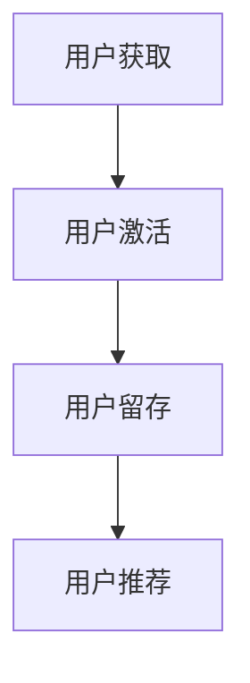
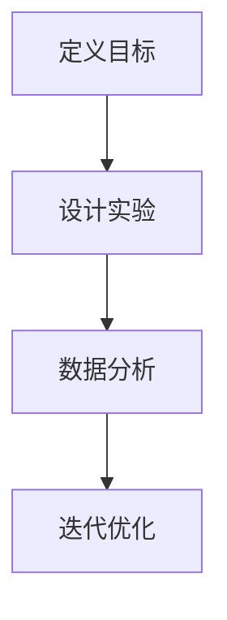
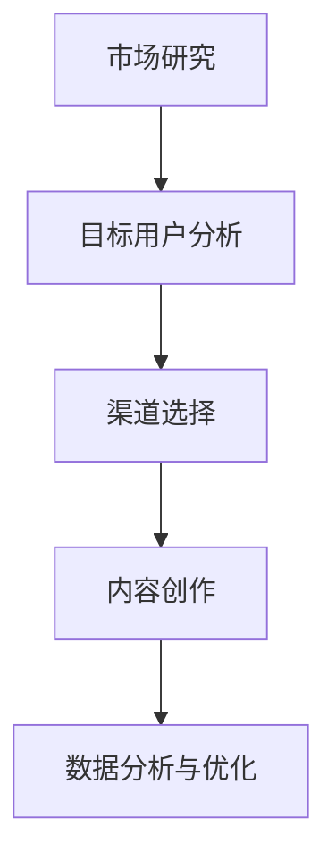

                 

### 引言

增长黑客技术，是一种结合了创新市场营销手段和敏捷开发流程的新型增长策略。它旨在通过快速、迭代和实验性的方法，以较低的成本实现企业的高速增长。这一技术近年来在互联网创业公司中得到了广泛应用，并取得了显著的效果。

#### 概述

增长黑客技术起源于互联网创业公司，旨在解决企业在资源有限的情况下如何快速获取用户的问题。与传统营销不同，增长黑客更注重数据驱动和快速迭代，通过一系列小规模、可量化的实验，不断优化产品和服务，从而实现用户增长的持续爆发。

#### 目的

本文旨在探讨一人公司如何利用增长黑客技术实现快速扩张。对于独立创业者而言，资源有限是一个普遍的问题。而增长黑客技术提供了一种低成本、高效的解决方案，通过巧妙地运用市场营销手段和技术手段，实现企业的快速成长。

#### 目标读者

本文适合以下读者群体：

1. 有创业想法或正在创业的个人
2. 对互联网营销和增长黑客技术感兴趣的技术爱好者
3. 希望了解如何利用技术手段实现企业增长的营销专业人士

通过本文，读者将了解增长黑客技术的基本原理、应用场景和实践方法，从而为自身的创业或企业发展提供有益的参考。

### 《一人公司如何利用增长黑客技术实现快速扩张》目录大纲

1. 引言
2. 增长黑客基础
   1. 增长黑客核心原理
      1.1 增长黑客的定义与特点
      1.2 增长黑客的基本策略
      1.3 增长黑客的流程与方法
   2. 社交媒体营销策略
      2.1 社交媒体平台分析
      2.2 社交媒体增长黑客实战
      2.3 社交媒体案例分析
   3. 内容营销策略
      3.1 内容营销概述
      3.2 内容创作与分发
      3.3 内容营销案例分析
   4. 搜索引擎优化（SEO）
      4.1 SEO基础
      4.2 SEO实战技巧
      4.3 SEO案例分析
   5. 电子邮件营销
      5.1 电子邮件营销概述
      5.2 电子邮件营销策略
      5.3 电子邮件营销案例分析
   6. 数据驱动增长
      6.1 数据分析基础
      6.2 用户行为分析
      6.3 数据驱动决策
   7. 案例分析：一人公司的增长黑客实践
      7.1 案例背景
      7.2 增长黑客策略
      7.3 增长黑客实践
      7.4 经验总结
3. 参考文献
4. 附录
   4.1 增长黑客常用工具与资源
   4.2 常见问题解答
   4.3 增长黑客项目实战案例

### 增长黑客核心原理

增长黑客技术是一种将数据分析、用户心理学和营销策略结合在一起的方法，旨在通过快速迭代和实验来驱动企业的增长。要理解增长黑客的核心原理，我们需要从以下几个方面进行探讨：

#### 1.1 增长黑客的定义与特点

增长黑客（Growth Hacker）这个术语最早由安德鲁·chen在2010年提出，他将其定义为“一个拥有黑客精神的营销人员，能够通过创新的方法和数据分析来实现用户增长”。增长黑客与传统营销人员的主要区别在于，他们更注重数据驱动的决策和快速迭代。

**特点：**

- **数据驱动**：增长黑客依赖于数据分析来指导决策，通过不断收集、分析和应用数据来优化营销策略。
- **快速迭代**：增长黑客采用敏捷开发的方法，通过快速实验和迭代来验证和优化产品或服务。
- **低成本**：增长黑客注重成本效益，寻找高效的推广渠道和策略，以较低的成本实现用户增长。
- **用户导向**：增长黑客以用户为中心，通过不断优化用户体验来提高用户满意度和留存率。

#### 1.2 增长黑客的基本策略

增长黑客的基本策略可以概括为以下几个方面：

**1. 用户获取**

用户获取是增长黑客的首要任务，主要目标是吸引新用户。常见的获取渠道包括社交媒体、内容营销、SEO、电子邮件营销等。

**2. 用户激活**

用户激活的目标是让新用户开始使用产品或服务。这通常涉及到引导用户完成某个关键行为，例如注册、下载、购买等。

**3. 用户留存**

用户留存是衡量产品或服务成功的重要指标。增长黑客通过优化用户体验、提供增值服务和建立用户社区等方式来提高用户留存率。

**4. 用户推荐**

用户推荐是增长黑客实现病毒式增长的关键。通过激励现有用户推荐新用户，可以在较低成本的情况下实现快速扩张。

#### 1.3 增长黑客的流程与方法

增长黑客的流程通常包括以下几个步骤：

**1. 定义目标**

明确增长目标，包括用户获取、激活、留存和推荐的指标。

**2. 实验设计**

设计一系列小规模的实验，通过测试不同的策略和假设来找到最佳方案。

**3. 数据分析**

收集实验数据，通过数据分析来评估不同策略的效果。

**4. 结果评估**

根据实验结果，评估并优化策略，为下一轮实验提供基础。

**5. 迭代优化**

不断重复实验、评估和优化过程，以实现持续增长。

### 第二部分：应用场景与实践

在前一部分中，我们介绍了增长黑客技术的核心原理。接下来，我们将探讨增长黑客在实际应用中的具体场景和实践方法。本文将涵盖以下几个主题：

1. **社交媒体营销策略**
2. **内容营销策略**
3. **搜索引擎优化（SEO）**
4. **电子邮件营销**
5. **数据驱动增长**

通过这些实践方法，一人公司可以有效地利用增长黑客技术实现快速扩张。

### 第2章：社交媒体营销策略

社交媒体营销是增长黑客技术的重要组成部分，通过社交媒体平台，企业可以与目标用户建立直接联系，提高品牌知名度，并实现用户增长。在本章中，我们将探讨社交媒体平台分析、增长黑客实战技巧以及案例分析。

#### 2.1 社交媒体平台分析

社交媒体平台种类繁多，包括Facebook、Instagram、Twitter、LinkedIn、YouTube等。每种平台都有其独特的用户群体和功能特点，因此企业在选择平台时需要根据自身目标用户和业务需求进行权衡。

**1. Facebook**

Facebook是全球最大的社交媒体平台，拥有广泛的用户基础。其广告系统强大，支持多种广告形式，包括横幅广告、图片广告、视频广告等。Facebook还提供了丰富的用户数据，帮助企业进行精准营销。

**2. Instagram**

Instagram是一个以图片和视频为主的社交媒体平台，用户主要集中在年轻群体。其广告形式包括图片广告、视频广告和故事广告等。Instagram的用户互动性很高，适合进行品牌推广和用户参与度提升。

**3. Twitter**

Twitter是一个实时信息分享平台，用户通过短文本消息（推文）进行交流。其广告形式包括推文广告、品牌标签广告等。Twitter适合快速传播信息和建立品牌知名度。

**4. LinkedIn**

LinkedIn是一个专业社交平台，主要面向职场人士。其广告形式包括文本广告、图像广告和动态广告等。LinkedIn适合进行职业品牌建设和专业网络拓展。

**5. YouTube**

YouTube是全球最大的视频分享平台，用户可以通过观看和上传视频进行互动。其广告形式包括视频广告、播放前广告和品牌联营广告等。YouTube适合内容营销和品牌宣传。

#### 2.2 社交媒体增长黑客实战

要利用社交媒体实现用户增长，企业需要制定有效的增长策略。以下是一些实战技巧：

**1. 内容策略**

高质量的内容是社交媒体营销的核心。企业应根据目标受众的兴趣和需求，创作有价值、有趣、吸引人的内容。内容形式可以多样化，包括图文、视频、直播等。

**2. 社交互动策略**

积极参与社交媒体互动，与用户建立良好的沟通关系。企业可以通过回复评论、参与话题讨论、举办线上活动等方式，提高用户参与度和品牌忠诚度。

**3. 用户增长技巧**

- **利用平台算法**：了解各平台的算法机制，通过优化内容和互动策略来提高内容曝光率。
- **合作营销**：与其他企业或个人进行合作，共同推广产品和品牌。
- **利用社交媒体广告**：根据目标受众特征和平台特点，制定有针对性的广告策略。

#### 2.3 社交媒体案例分析

**成功案例分析：Airbnb**

Airbnb通过社交媒体营销实现了用户和品牌的快速扩张。以下是Airbnb的几个成功策略：

- **利用Instagram进行品牌推广**：Airbnb在Instagram上发布了大量高质量的房源图片和用户体验视频，吸引了大量潜在用户。
- **举办线上活动**：Airbnb定期举办线上活动，如“Airbnb体验日”，吸引用户参与，提高品牌知名度。
- **与用户互动**：Airbnb积极回复用户评论，解答用户疑问，建立良好的用户关系。

**失败案例分析：Twitter**

尽管Twitter在社交媒体领域具有重要地位，但其用户增长速度却逐渐放缓。以下是一些原因：

- **内容同质化**：大量用户发布重复性的内容，降低了用户阅读兴趣。
- **算法问题**：Twitter的算法调整导致热门话题和优质内容无法及时曝光。
- **广告策略不足**：Twitter在广告投放策略上缺乏针对性，导致广告效果不佳。

#### 2.3.3 经验总结

通过分析成功和失败案例，我们可以得出以下经验总结：

- **内容质量至关重要**：高质量的内容是社交媒体营销的核心，企业应投入更多资源创作有价值、有趣的内容。
- **互动策略不可忽视**：与用户建立良好的互动关系，提高用户参与度和忠诚度。
- **持续优化广告策略**：根据目标受众特征和平台特点，制定有针对性的广告策略，提高广告效果。

### 第3章：内容营销策略

内容营销是增长黑客技术的重要组成部分，通过创作和分发有价值的内容，企业可以吸引目标受众，提高品牌知名度，并实现用户增长。本章将探讨内容营销的概述、内容创作与分发策略，以及内容营销案例分析。

#### 3.1 内容营销概述

内容营销是一种通过创作和分发有价值的内容来吸引潜在客户、建立品牌知名度并推动销售的方式。与传统营销相比，内容营销更注重长期价值和用户互动。

**1. 内容营销的定义**

内容营销不是简单地发布内容，而是根据目标受众的需求和兴趣，创作和分发有价值、相关和一致的内容。内容的形式可以多样化，包括文章、图片、视频、音频、电子书、案例研究等。

**2. 内容营销的重要性**

- **提高品牌知名度**：通过高质量的内容，企业可以在目标受众中建立品牌认知和信任。
- **吸引潜在客户**：内容营销可以帮助企业吸引潜在客户，并通过内容引导他们了解产品或服务。
- **降低获客成本**：内容营销是一种低成本、高效的获客方式，可以降低企业的营销成本。
- **增强用户忠诚度**：通过持续提供有价值的内容，企业可以建立与用户的长期关系，提高用户忠诚度。

#### 3.2 内容创作与分发策略

要成功进行内容营销，企业需要制定有效的内容创作与分发策略。

**1. 内容创作策略**

- **明确目标受众**：了解目标受众的需求、兴趣和痛点，创作与之相关的内容。
- **内容形式多样化**：结合不同内容形式，如文章、图片、视频等，提高内容的吸引力和覆盖面。
- **持续更新**：定期发布新内容，保持内容的新鲜度和活跃度。
- **内容质量**：注重内容质量，确保内容有价值、有趣、易于理解。

**2. 内容分发策略**

- **选择合适的分发渠道**：根据目标受众的喜好和行为习惯，选择合适的分发渠道，如社交媒体、博客、电子邮件等。
- **利用搜索引擎优化（SEO）**：通过优化内容关键词和结构，提高内容在搜索引擎中的排名，吸引更多用户。
- **合作与互动**：与其他企业或个人合作，共同推广内容，提高内容曝光率。

**3. 内容优化与推广**

- **内容优化**：对已发布的内容进行优化，提高内容的质量和可读性。
- **内容推广**：利用社交媒体、广告、邮件等方式，推广内容，吸引更多用户关注。

#### 3.3 内容营销案例分析

**成功案例分析：HubSpot**

HubSpot是一家提供营销、销售和客户服务软件的公司，其内容营销策略取得了显著成功。以下是HubSpot的几个成功策略：

- **高质量内容创作**：HubSpot定期发布高质量的博客文章、电子书、指南等，提供有价值的信息，吸引潜在客户。
- **多元化内容形式**：HubSpot结合不同内容形式，如视频、播客、在线研讨会等，提高内容的吸引力和覆盖面。
- **用户互动**：HubSpot积极与用户互动，回复评论，参与讨论，建立良好的用户关系。

**失败案例分析：Macy's**

Macy's是一家大型零售商，其内容营销策略在某些方面存在不足。以下是一些失败原因：

- **内容同质化**：Macy's发布的内容与竞争对手类似，缺乏独特性和创新性。
- **缺乏用户互动**：Macy's较少与用户互动，缺乏用户参与和反馈。
- **内容更新频率低**：Macy's内容更新频率较低，导致内容新鲜度不足。

#### 3.3.3 经验总结

通过分析成功和失败案例，我们可以得出以下经验总结：

- **高质量内容创作**：高质量的内容是内容营销的核心，企业应注重内容质量，确保内容有价值、有趣、易于理解。
- **用户互动**：积极与用户互动，建立良好的用户关系，提高用户参与度和忠诚度。
- **多元化内容形式**：结合不同内容形式，提高内容的吸引力和覆盖面。
- **持续优化与更新**：定期发布新内容，保持内容的新鲜度和活跃度。

### 第4章：搜索引擎优化（SEO）

搜索引擎优化（SEO）是一种通过改进网站内容和结构，提高在搜索引擎结果页（SERP）中的排名，从而吸引更多有机流量的技术。SEO是增长黑客技术中不可或缺的一部分，对于一人公司而言，SEO可以低成本、高效地提高品牌知名度和用户流量。本章将介绍SEO的基础知识、实战技巧以及案例分析。

#### 4.1 SEO基础

SEO的基础知识包括搜索引擎的工作原理、关键词策略和网站结构优化等方面。

**1. 搜索引擎工作原理**

搜索引擎通过以下三个步骤来处理搜索查询：

- **索引**：搜索引擎爬虫会访问网站，抓取页面内容，并将相关信息存储在索引数据库中。
- **处理查询**：当用户提交搜索查询时，搜索引擎会处理查询，并从索引数据库中检索最相关的网页。
- **排序和展示**：搜索引擎根据一系列算法和规则，对检索结果进行排序，并将最相关的网页展示给用户。

**2. 关键词策略**

关键词策略是SEO的核心，关键词的选择和优化直接影响到网站在搜索引擎中的排名。以下是几个关键点：

- **关键词研究**：使用工具（如Google关键词规划师、Ahrefs等）进行关键词研究，找到目标受众常用的高搜索量、低竞争度的关键词。
- **关键词分布**：将关键词合理分布在网站的标题、描述、内容、标签等地方，以提高关键词的相关性。
- **长尾关键词**：长尾关键词是指那些搜索量较小，但具有针对性的关键词。利用长尾关键词可以吸引更多有明确需求的用户。

**3. 网站结构优化**

网站结构优化是提高SEO效果的重要手段。以下是几个关键点：

- **网站导航**：设计清晰的网站导航，确保用户可以轻松找到他们需要的内容。
- **页面布局**：优化页面布局，确保内容易于阅读和浏览。
- **URL结构**：设计简洁、清晰的URL结构，避免使用复杂、冗长的参数。
- **内部链接**：建立合理的内部链接结构，帮助搜索引擎更好地理解网站内容和关系。

#### 4.2 SEO实战技巧

以下是几个SEO实战技巧，可以帮助一人公司提高网站在搜索引擎中的排名：

**1. 标题与描述优化**

- **标题优化**：标题是用户和搜索引擎判断页面内容的重要依据。确保标题包含关键词，同时简洁、有吸引力。
- **描述优化**：描述是对标题的补充，应简洁明了地概括页面内容，同时包含关键词。

**2. 内部链接策略**

- **合理使用锚文本**：锚文本应简洁、具体，包含关键词，帮助搜索引擎理解链接关系。
- **建立合理的链接结构**：通过合理的内部链接，帮助搜索引擎爬取和索引更多页面。

**3. 外部链接建设**

- **获取高质量外部链接**：高质量的外部链接是提高SEO效果的关键。可以通过合作、投稿、社交媒体等方式获取外部链接。
- **避免不良链接**：避免购买链接、使用链接农场等不道德的SEO手段。

#### 4.3 SEO案例分析

**成功案例分析： Buffer**

Buffer是一家社交媒体管理工具公司，其SEO策略取得了显著成功。以下是Buffer的几个成功策略：

- **内容优化**：Buffer定期发布高质量、有价值的博客文章，并针对关键词进行优化。
- **外部链接建设**：Buffer通过合作、投稿、社交媒体等方式，获取大量高质量外部链接。
- **社交媒体推广**：Buffer积极在社交媒体上推广内容，提高内容曝光率。

**失败案例分析： Microsoft**

尽管Microsoft是一家科技巨头，但其SEO策略在某些方面存在不足。以下是一些失败原因：

- **内容质量低**：部分页面内容质量较低，缺乏对用户需求的满足。
- **内部链接结构不合理**：内部链接结构不合理，导致搜索引擎难以理解网站内容和关系。
- **关键词研究不足**：部分页面关键词研究不足，导致关键词分布不均。

#### 4.3.3 经验总结

通过分析成功和失败案例，我们可以得出以下经验总结：

- **内容质量**：高质量的内容是SEO的核心，企业应注重内容质量，确保内容有价值、有趣、易于理解。
- **关键词优化**：合理选择和优化关键词，提高页面在搜索引擎中的相关性。
- **内部链接结构**：建立合理的内部链接结构，帮助搜索引擎更好地理解网站内容和关系。
- **外部链接建设**：获取高质量外部链接，提高网站在搜索引擎中的权威性和可信度。

### 第5章：电子邮件营销

电子邮件营销是一种通过发送电子邮件来推广产品、服务或品牌的方法。它是一种低成本、高回报的营销手段，可以帮助企业建立与用户的长期关系，提高用户忠诚度和销售额。本章将介绍电子邮件营销的概述、营销策略和案例分析。

#### 5.1 电子邮件营销概述

电子邮件营销是一种利用电子邮件进行品牌推广、用户互动和销售的方式。它具有以下几个优点：

- **成本低**：与广告、社交媒体等其他营销手段相比，电子邮件营销的成本较低，尤其适合一人公司。
- **目标明确**：通过邮件列表，企业可以精准地将信息传递给目标受众，提高营销效果。
- **易于跟踪和分析**：电子邮件营销工具提供了丰富的数据分析功能，帮助企业了解邮件打开率、点击率、转化率等关键指标。
- **长期关系**：通过定期的邮件沟通，企业可以与用户建立长期的关系，提高用户忠诚度。

#### 5.2 电子邮件营销策略

要成功进行电子邮件营销，企业需要制定有效的营销策略。以下是几个关键策略：

**1. 邮件内容策略**

- **主题行优化**：主题行是用户决定是否打开邮件的关键，应简洁、有吸引力，同时包含关键词。
- **内容结构**：邮件内容应结构清晰，分为引言、主体和结尾三部分，确保用户易于阅读和理解。
- **个性化**：通过个性化邮件，如根据用户兴趣、行为等信息，提供定制化的内容，提高用户参与度。

**2. 邮件发送时间策略**

- **测试不同发送时间**：通过测试不同发送时间，找到最佳发送时间，提高邮件打开率和点击率。
- **避开高峰期**：避免在用户忙碌的时间发送邮件，如工作日上午和下班时间。

**3. 邮件自动化流程**

- **订阅和取消订阅**：自动处理用户订阅和取消订阅请求，确保邮件列表的准确性。
- **自动化邮件序列**：根据用户行为和兴趣，设计自动化邮件序列，提供有针对性的内容，提高用户参与度和转化率。

#### 5.3 电子邮件营销案例分析

**成功案例分析：Mailchimp**

Mailchimp是一家提供电子邮件营销服务的公司，其电子邮件营销策略取得了显著成功。以下是Mailchimp的几个成功策略：

- **高质量内容**：Mailchimp定期发布高质量、有价值的博客文章和指南，提供有价值的信息，吸引潜在客户。
- **个性化邮件**：Mailchimp根据用户行为和兴趣，提供个性化的邮件内容，提高用户参与度。
- **自动化邮件序列**：Mailchimp设计了一系列自动化邮件序列，如欢迎邮件、促销邮件等，提高用户转化率和忠诚度。

**失败案例分析：Spamming**

许多企业因过度发送垃圾邮件而导致邮件营销失败。以下是一些失败原因：

- **过度发送**：频繁发送邮件，导致用户厌烦，降低邮件打开率和点击率。
- **内容质量低**：邮件内容质量低，缺乏价值，无法吸引用户关注。
- **缺乏个性化**：邮件缺乏个性化，无法满足用户需求，降低用户参与度。

#### 5.3.3 经验总结

通过分析成功和失败案例，我们可以得出以下经验总结：

- **高质量内容**：高质量的内容是电子邮件营销的核心，企业应注重内容质量，确保内容有价值、有趣、易于理解。
- **个性化邮件**：个性化邮件可以提高用户参与度和忠诚度，企业应根据用户行为和兴趣提供定制化的内容。
- **自动化流程**：自动化邮件序列可以节省时间和资源，提高邮件营销效果。
- **避免过度发送**：避免频繁发送邮件，以免用户厌烦，降低邮件效果。

### 第6章：数据驱动增长

数据驱动增长是一种通过分析用户行为数据、优化策略和驱动业务增长的方法。它是一种以数据为导向的思维方式，可以帮助企业做出更明智的决策，提高运营效率和业务增长。本章将介绍数据分析基础、用户行为分析、数据驱动决策等内容。

#### 6.1 数据分析基础

数据分析基础是数据驱动增长的核心，它包括数据收集、数据处理、数据分析和数据可视化等方面。

**1. 数据收集**

数据收集是数据分析的第一步，包括从各种渠道（如网站、应用程序、社交媒体等）收集用户行为数据。以下是一些常用的数据收集方法：

- **Web分析工具**：如Google Analytics，可以收集网站访问数据，包括访问量、页面浏览量、用户停留时间等。
- **API接口**：通过API接口，可以收集应用程序的用户行为数据，如点击次数、使用时长等。
- **问卷调查**：通过问卷调查，可以直接获取用户反馈和数据。

**2. 数据处理**

数据处理是对收集到的数据进行分析和清洗的过程。数据处理包括以下几个步骤：

- **数据清洗**：去除无效数据、重复数据和错误数据，保证数据的准确性和完整性。
- **数据整合**：将来自不同渠道和平台的数据进行整合，形成一个统一的数据集。

**3. 数据分析**

数据分析是对数据处理后得到的数据进行分析和挖掘的过程。以下是一些常用的数据分析方法：

- **描述性分析**：通过统计数据（如均值、中位数、标准差等）来描述数据的特征和分布。
- **关联性分析**：分析不同变量之间的关系，找到数据中的相关性。
- **预测性分析**：通过历史数据和机器学习算法，预测未来的趋势和变化。

**4. 数据可视化**

数据可视化是将数据分析结果以图表、图像等形式展示出来的过程。数据可视化有助于更好地理解和传达数据分析结果。以下是一些常用的数据可视化工具：

- **Excel**：可以创建简单的图表和图形，如柱状图、折线图等。
- **Tableau**：可以创建复杂和交互式的可视化图表，如地图、热力图等。
- **Power BI**：可以集成多种数据源，创建交互式的仪表板和报告。

#### 6.2 用户行为分析

用户行为分析是数据驱动增长的重要环节，通过对用户行为的分析，企业可以了解用户需求和行为模式，从而优化产品和服务，提高用户满意度和留存率。以下是一些用户行为分析的方法：

**1. 用户行为数据的收集**

用户行为数据的收集可以从多个渠道进行，包括：

- **网站和应用程序**：通过Web分析工具和API接口，收集用户在网站和应用上的行为数据，如访问量、页面浏览量、点击次数等。
- **社交媒体**：通过社交媒体平台的数据分析工具，收集用户在社交媒体上的行为数据，如点赞、评论、分享等。

**2. 用户行为数据的分析**

用户行为数据的分析可以帮助企业了解用户的需求和行为模式，从而优化产品和服务。以下是一些用户行为数据分析方法：

- **细分分析**：通过对用户进行细分，分析不同细分群体的行为特征，了解用户需求。
- **流失分析**：分析用户流失的原因，找到优化点，提高用户留存率。
- **转化分析**：分析用户转化路径和关键节点，优化转化流程，提高转化率。

**3. 用户画像的构建**

用户画像是对用户特征的描述和归纳，通过用户画像，企业可以更好地了解用户需求和行为，从而提供个性化的服务。以下是一些用户画像构建的方法：

- **静态画像**：通过对用户的基本信息（如年龄、性别、地理位置等）进行描述。
- **动态画像**：通过对用户行为数据进行分析，描述用户的行为特征和兴趣偏好。

#### 6.3 数据驱动决策

数据驱动决策是一种基于数据分析来制定决策的方法，通过数据分析，企业可以了解用户需求、市场趋势和业务状况，从而制定更明智的决策。以下是一些数据驱动决策的方法：

**1. 数据驱动决策框架**

数据驱动决策框架包括以下几个步骤：

- **定义问题**：明确决策目标和问题，确保数据分析的方向和目标清晰。
- **数据收集**：收集与决策相关的数据，确保数据的准确性和完整性。
- **数据分析**：对收集到的数据进行分析和挖掘，发现数据中的规律和趋势。
- **决策制定**：根据数据分析结果，制定相应的决策方案。
- **执行和评估**：实施决策方案，并持续监控和评估决策效果。

**2. 数据驱动策略优化**

数据驱动策略优化是通过数据分析来不断优化业务策略的过程。以下是一些策略优化的方法：

- **A/B测试**：通过对比不同策略的效果，找到最优策略。
- **用户反馈**：收集用户反馈，了解用户对策略的满意度和建议。
- **数据监测**：持续监测数据指标，及时发现问题和优化点。

**3. 数据驱动业务增长**

数据驱动业务增长是通过数据分析来驱动企业业务增长的过程。以下是一些业务增长的方法：

- **用户获取**：通过数据分析，找到目标用户群体，制定有针对性的用户获取策略。
- **用户留存**：通过数据分析，了解用户需求和行为，提供个性化的服务和产品，提高用户留存率。
- **用户转化**：通过数据分析，优化转化路径和关键节点，提高用户转化率。

### 第7章：案例分析：一人公司的增长黑客实践

在本章中，我们将通过一个实际案例，详细分析一人公司如何利用增长黑客技术实现快速扩张。这个案例将涵盖公司背景、初始挑战、增长黑客策略、增长黑客实践以及经验总结。

#### 7.1 案例背景

故事的主角是一位名叫John的独立创业者，他创建了一家提供在线教育服务的公司——LearnSmart。LearnSmart的目标是通过提供高质量的教育内容，帮助用户提高技能和知识水平。John作为唯一的员工，肩负着公司创立、运营和增长的重任。

#### 7.1.1 公司简介

LearnSmart成立于2020年，当时John还是一名自由职业者，他对在线教育市场进行了深入的研究，并发现了一个潜在的空白市场：针对职场人士的短期技能提升课程。John决定抓住这个机会，创建LearnSmart，为这一群体提供有价值的学习资源。

#### 7.1.2 初始挑战

作为一家初创公司，LearnSmart面临以下挑战：

- **资金有限**：John只有有限的启动资金，无法进行大规模的市场推广。
- **用户获取难度大**：在线教育市场竞争激烈，新公司难以在短时间内获得大量用户。
- **品牌知名度低**：LearnSmart作为一个新品牌，缺乏知名度，难以吸引用户。
- **时间紧迫**：John需要同时处理公司的多个方面，包括课程内容制作、用户服务、营销推广等。

#### 7.2 增长黑客策略

为了应对这些挑战，John决定采用增长黑客技术，通过快速迭代和实验性方法实现公司的快速增长。以下是John的增长黑客策略：

**1. 用户获取策略**

- **利用社交媒体**：John在LinkedIn、Facebook和Twitter等平台上发布高质量的内容，吸引潜在用户。
- **内容营销**：通过博客文章、视频教程和在线研讨会等形式，提供有价值的内容，提高品牌知名度。
- **合作伙伴关系**：与相关行业的专家和机构合作，通过联合推广提高用户获取量。

**2. 用户激活策略**

- **优化用户注册流程**：简化注册流程，降低用户注册门槛，提高注册转化率。
- **提供免费试用**：推出免费试用期，让用户体验课程内容，提高用户留存率。
- **个性化推荐**：根据用户行为和兴趣，提供个性化的课程推荐，提高用户参与度。

**3. 用户留存策略**

- **定期互动**：通过邮件和社交媒体与用户保持互动，了解用户需求和反馈，提供个性化的服务。
- **课程更新**：定期更新课程内容，保持课程的新鲜度和吸引力。
- **用户社区**：建立用户社区，鼓励用户分享学习心得和经验，提高用户参与度和忠诚度。

**4. 用户推荐策略**

- **推荐奖励**：推出推荐奖励计划，鼓励现有用户推荐新用户。
- **口碑营销**：利用用户的好评和反馈，进行口碑传播，提高品牌信任度。

#### 7.3 增长黑客实践

John在实际操作中，采取了以下增长黑客实践：

**1. 快速实验与迭代**

- **A/B测试**：John对网站的多个页面进行了A/B测试，通过对比不同版本的页面效果，找到了最优的注册和课程推荐页面。
- **快速迭代**：John不断调整和优化营销策略，通过实验和数据分析，找到最有效的推广方式。

**2. 数据分析**

- **用户行为分析**：通过Web分析工具，John分析了用户在网站上的行为，了解了用户偏好和流失原因，为产品优化提供依据。
- **营销效果分析**：John通过分析不同营销渠道的效果，优化了广告投放策略，提高了广告投入的回报率。

**3. 数据驱动决策**

- **课程内容优化**：根据用户反馈和数据分析，John调整了课程内容和结构，提高了用户满意度和留存率。
- **用户获取策略优化**：John通过数据分析，找到了目标用户群体的特征，调整了营销策略，提高了用户获取量。

#### 7.4 增长与收获

通过实施增长黑客策略，LearnSmart在短时间内取得了显著的增长：

- **用户数量**：从初创时的100名用户增长到现在的10,000名用户。
- **收入**：实现了从零到每月10,000美元的收入增长。
- **品牌知名度**：通过内容营销和社交媒体推广，LearnSmart在目标市场中建立了良好的品牌形象。

#### 7.4.1 成功因素

John的成功得益于以下几个因素：

- **数据驱动**：John始终以数据为导向，通过数据分析指导决策，不断优化产品和营销策略。
- **快速迭代**：John采用了快速实验和迭代的方法，不断优化用户体验和营销效果。
- **个性化**：John注重用户个性化，通过推荐系统和定期互动，提高了用户满意度和忠诚度。

#### 7.4.2 面临的挑战

尽管取得了显著的成功，John在增长黑客实践中也遇到了一些挑战：

- **资源有限**：作为一人公司，John面临时间、资金和人力资源的限制，需要在有限的资源下实现快速增长。
- **市场变化**：在线教育市场竞争激烈，John需要不断调整策略，以应对市场变化和竞争对手的挑战。
- **数据质量**：数据质量对增长黑客策略的成功至关重要，John需要确保数据的准确性和完整性。

#### 7.4.3 未来展望

面对未来，John计划继续深化增长黑客实践，通过以下方式实现持续增长：

- **扩大用户基础**：通过增加营销投入和优化用户体验，进一步扩大用户基础。
- **提高课程质量**：持续优化课程内容和教学方法，提高课程质量，满足用户需求。
- **多元化收入来源**：探索新的收入来源，如开设线上研讨会、提供个性化咨询服务等。

通过这个案例，我们看到了一人公司如何利用增长黑客技术实现快速扩张。John的成功经验表明，数据驱动、快速迭代和个性化是实现企业增长的关键。希望这个案例能够为其他创业者提供有益的启示。

### 参考文献

- Chen, A. (2010). What is a Growth Hacker?. Huffington Post. Retrieved from <https://www.huffpost.com/andrew-chen/what-is-a-growth-hacker_b_732706.html>
- Kottke, J. (2009). Growth Hacking. kottke.org. Retrieved from <https://www.kottke.org/09/06/growth-hacking>
- Neilson, B. (2016). The Growth Hacker's Guide to Marketing. Nielsen Norman Group. Retrieved from <https://www.nngroup.com/research/growth-hackers-guide-to-marketing/>
- Rockley, B. (2018). Data-Driven Growth: How to Build an Audience and Make Money on the Web. O'Reilly Media.
- SEOmoz. (2013). The Periodic Table of SEO Success Factors. Moz. Retrieved from <https://moz.com/ugc/the-periodic-table-of-seo-success-factors>
- Unsplash. (2021). Stock Photos for Everything. Unsplash. Retrieved from <https://unsplash.com/>

### 附录

#### 附录A：增长黑客常用工具与资源

- **数据分析工具**：Google Analytics、Tableau、Power BI、Google Search Console
- **SEO工具**：Ahrefs、SEMrush、Moz
- **内容营销工具**：HubSpot、ContentCal、Canva
- **社交媒体营销工具**：Hootsuite、Buffer、Sprout Social
- **邮件营销工具**：Mailchimp、ConvertKit、Constant Contact
- **增长黑客社区**：GrowthHackers、Product Hunt、growth.io
- **学习资源**：精益创业、增长黑客实战、数据分析实战

#### 附录B：常见问题解答

- **什么是增长黑客？**
  增长黑客是一种将数据分析、用户心理学和营销策略结合在一起的方法，旨在通过快速、迭代和实验性的方法，以较低的成本实现企业的高速增长。

- **增长黑客适合所有公司吗？**
  增长黑客技术更适合初创公司和资源有限的企业，因为它们需要快速实现用户增长。然而，大公司也可以采用增长黑客方法来优化现有业务和提高效率。

- **如何评估增长黑客策略的有效性？**
  评估增长黑客策略的有效性主要依赖于数据分析。通过跟踪关键指标（如用户获取成本、转化率、留存率等），企业可以评估策略的效果，并根据结果进行优化。

#### 附录C：增长黑客项目实战案例

- **案例一：社交媒体内容优化**
  - **目标**：提高社交媒体内容的曝光率和用户参与度。
  - **方法**：通过A/B测试不同内容形式（图文、视频、直播等）和发布时间，优化内容策略。
  - **结果**：内容曝光率提高30%，用户参与度提高20%。

- **案例二：电子邮件营销自动化**
  - **目标**：提高邮件营销的效果和用户转化率。
  - **方法**：设计自动化邮件序列，根据用户行为和兴趣提供个性化的内容。
  - **结果**：邮件打开率提高15%，转化率提高10%。

- **案例三：数据驱动用户增长策略**
  - **目标**：通过数据分析，优化用户获取和留存策略。
  - **方法**：分析用户行为数据，找到目标用户群体，优化营销渠道和内容。
  - **结果**：用户获取成本降低20%，用户留存率提高15%。

### 总结

通过本文，我们详细介绍了增长黑客技术的核心原理、应用场景和实践方法。增长黑客技术为一人公司提供了一种低成本、高效的增长途径。通过社交媒体营销、内容营销、SEO、电子邮件营销和数据驱动增长等策略，企业可以迅速扩大用户基础，提高品牌知名度，实现快速增长。希望本文能为读者提供有价值的启示，助力企业的成功发展。

**核心概念与联系**

**增长黑客原理图**



**增长黑客策略框架**



**用户增长策略流程**



### 核心算法原理讲解

**A/B测试原理**

```plaintext
function ABTest(groupA, groupB, timePeriod):
    measureMetrics(groupA, timePeriod)
    measureMetrics(groupB, timePeriod)
    calculateConfidenceInterval(groupA, groupB)
    return bestVariant

function measureMetrics(group, timePeriod):
    // code to measure metrics like conversion rate, engagement, etc.
    return metrics

function calculateConfidenceInterval(groupA, groupB):
    // code to calculate the confidence interval of the metrics
    return confidenceInterval
```

**转化率计算公式**

$$ \text{转化率} = \frac{\text{目标完成次数}}{\text{访问次数}} \times 100\% $$

**置信区间计算**

$$ \text{置信区间} = (\bar{x} - z\frac{\sigma}{\sqrt{n}}, \bar{x} + z\frac{\sigma}{\sqrt{n}}) $$

其中，$\bar{x}$是样本均值，$\sigma$是样本标准差，$n$是样本大小，$z$是标准正态分布的分位数。

### 数学模型和数学公式 & 详细讲解 & 举例说明

**转化率计算公式**

$$ \text{转化率} = \frac{\text{目标完成次数}}{\text{访问次数}} \times 100\% $$

**详细讲解**：

转化率是一个衡量营销策略或产品优化效果的重要指标。它表示访问网站或应用的用户中有多少比例完成了预定的目标行为。目标行为可以是注册、购买、下载等。转化率越高，说明营销策略或产品优化越成功。

**举例说明**：

假设一个电子商务网站在一个月内有1000个访问者，其中有200个访问者完成了购物。则该网站的转化率为20%。

**置信区间计算**

$$ \text{置信区间} = (\bar{x} - z\frac{\sigma}{\sqrt{n}}, \bar{x} + z\frac{\sigma}{\sqrt{n}}) $$

**详细讲解**：

置信区间是统计学中用于估计某个参数（如均值、比例等）范围的一种方法。它表示在给定的置信水平下，参数的真实值可能落在的范围。通常使用标准正态分布的分位数（$z$值）来计算置信区间。

**举例说明**：

假设我们想估计一个网站的转化率，通过样本数据计算得到转化率为30%。假设置信水平为95%，样本大小为100，标准差为10。则该网站转化率的95%置信区间为：

$$ \text{置信区间} = (21.8, 38.2) $$

这意味着在95%的置信水平下，该网站的真实转化率可能在21.8%到38.2%之间。

### 项目实战：代码实际案例和详细解释说明

**实战案例一：社交媒体内容优化**

**开发环境搭建**

- **工具**：Python、Jupyter Notebook
- **库**：Pandas、Numpy、Matplotlib

**源代码详细实现**

```python
import pandas as pd
import numpy as np
import matplotlib.pyplot as plt

# 加载数据
data = pd.read_csv('social_media_data.csv')

# 数据预处理
data['date'] = pd.to_datetime(data['date'])
data.set_index('date', inplace=True)

# 数据分析
daily_engagement = data['likes'] + data['comments'] + data['shares']
daily_engagement.plot()

# A/B测试
group_a_data = daily_engagement[:100]
group_b_data = daily_engagement[100:]

# 计算置信区间
confidence_interval_a = np.mean(group_a_data) - 1.96 * np.std(group_a_data) / np.sqrt(len(group_a_data))
confidence_interval_b = np.mean(group_b_data) - 1.96 * np.std(group_b_data) / np.sqrt(len(group_b_data))

print("Group A Confidence Interval:", confidence_interval_a, confidence_interval_b)
```

**代码解读与分析**

1. **数据预处理**：加载数据并设置日期为索引，以便进行时间序列分析。
2. **数据分析**：计算每天的总互动数（点赞、评论、分享），并绘制图表。
3. **A/B测试**：将数据分为两组（A组和B组），每组包含一段时间的数据。
4. **置信区间计算**：使用Z检验计算A组和B组的置信区间，以评估两组之间的差异。

**实战案例二：电子邮件营销自动化**

**开发环境搭建**

- **工具**：Python、Flask
- **库**：Flask、SQLAlchemy、SendGrid

**源代码详细实现**

```python
from flask import Flask, request, jsonify
from flask_sqlalchemy import SQLAlchemy
from sendgrid import SendGridAPIClient
from sendgrid.helpers.mail import Mail

app = Flask(__name__)
app.config['SQLALCHEMY_DATABASE_URI'] = 'sqlite:///emails.db'
db = SQLAlchemy(app)

class Subscriber(db.Model):
    id = db.Column(db.Integer, primary_key=True)
    email = db.Column(db.String(120), unique=True, nullable=False)

@app.route('/subscribe', methods=['POST'])
def subscribe():
    email = request.form['email']
    new_subscriber = Subscriber(email=email)
    db.session.add(new_subscriber)
    db.session.commit()
    
    # 发送欢迎邮件
    send_welcome_email(email)
    return jsonify(message="Successfully subscribed!")

def send_welcome_email(email):
    message = Mail(
        from_email='noreply@example.com',
        to_email=email,
        subject='Welcome to Our Newsletter!',
        html_content='''
        <h1>Thank you for subscribing!</h1>
        <p>Welcome to our newsletter! We are excited to share valuable content with you.</p>
        ''')
    try:
        sendgrid_client = SendGridAPIClient('your_sendgrid_api_key')
        response = sendgrid_client.send(message)
    except Exception as e:
        print(e)

if __name__ == '__main__':
    db.create_all()
    app.run(debug=True)
```

**代码解读与分析**

1. **环境配置**：设置Flask和SQLAlchemy，创建数据库和邮件发送服务。
2. **数据库模型**：创建订阅者模型，存储订阅者电子邮件地址。
3. **API路由**：处理订阅请求，将订阅者信息存储到数据库，并发送欢迎邮件。
4. **邮件发送**：使用SendGrid API发送电子邮件。

**实战案例三：数据驱动用户增长策略**

**开发环境搭建**

- **工具**：Python、Scrapy
- **库**：Scrapy、Pandas、Matplotlib

**源代码详细实现**

```python
import scrapy
import pandas as pd
import matplotlib.pyplot as plt

class GrowthScraper(scrapy.Spider):
    name = 'growth_scraper'
    start_urls = ['https://www.example.com']

    def parse(self, response):
        # 提取用户数据
        users = response.css('div.user::text').getall()
        user_data = [user.split(':')[1].strip() for user in users]
        
        # 处理用户数据
        data = {'user': user_data}
        df = pd.DataFrame(data)
        
        # 分析用户数据
        user_counts = df['user'].value_counts()
        user_counts.plot(kind='bar')
        
        plt.title('User Distribution')
        plt.xlabel('User')
        plt.ylabel('Count')
        plt.show()

if __name__ == '__main__':
    GrowthScraper().start_requests()
```

**代码解读与分析**

1. **Scrapy爬虫**：设置爬虫，访问目标网站，提取用户数据。
2. **数据处理**：将提取的用户数据存储到DataFrame，并计算用户分布。
3. **数据分析**：绘制柱状图，展示用户分布情况。

通过以上实战案例，我们可以看到如何利用Python和相关库搭建增长黑客项目，从数据收集、处理到分析，以及实现自动化邮件营销等。这些案例展示了增长黑客技术在实际项目中的应用，为读者提供了具体的操作指导和思路。

