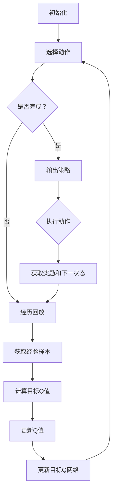

                 

### 引言

《一切皆是映射：AI深度Q网络DQN原理解析与基础》旨在深入剖析深度Q网络（Deep Q-Network，简称DQN）算法的原理和应用，为读者揭开人工智能领域中的这一重要技术面纱。本文将以逻辑清晰、结构紧凑、简单易懂的专业语言，逐步解读DQN的核心概念、算法原理、实战应用以及优化方法，帮助读者全面了解这一先进技术。

关键词：AI、深度学习、Q网络、DQN、映射理论

随着人工智能（Artificial Intelligence，简称AI）技术的飞速发展，深度学习（Deep Learning）已经成为当前AI领域的研究热点。在众多深度学习算法中，深度Q网络（DQN）因其强大的学习能力和广泛的适用性，备受关注。DQN是解决强化学习问题的一种重要方法，尤其在游戏AI、机器人控制和自动驾驶等领域表现突出。

本文将从以下几个方面展开讨论：

1. AI与映射理论概述
2. DQN算法的核心概念
3. DQN算法原理解析
4. DQN算法的实战应用
5. DQN算法的优化与改进
6. 结论与展望

通过本文的详细解析，读者将对DQN算法有一个全面、深刻的认识，从而更好地应用于实际项目中。

## 《一切皆是映射：AI深度Q网络DQN原理解析与基础》目录大纲

本文将围绕以下结构展开讨论：

### 第一部分：引言

- **1.1 AI与映射理论概述**
  - **1.1.1 AI的发展历程**
  - **1.1.2 映射理论的基本概念**
  - **1.1.3 DQN在映射理论中的应用**

- **1.2 DQN算法的核心概念**
  - **1.2.1 Q-learning算法介绍**
  - **1.2.2 DQN算法的特点与优势**
  - **1.2.3 DQN算法的基本框架**

### 第二部分：深度Q网络DQN算法原理

- **2.1 DQN算法的基本原理**
  - **2.1.1 离散状态空间下的Q值评估**
  - **2.1.2 Q值更新策略**
  - **2.1.3 体验回放与经验回放**

- **2.2 DQN算法的核心算法原理**
  - **2.2.1 Deep Q Network (DQN) 的架构**
  - **2.2.2 Deep Q Network (DQN) 的训练过程**
  - **2.2.3 DQN算法的优化策略**

- **2.3 DQN算法的数学模型与公式推导**
  - **2.3.1 Q值评估函数**
  - **2.3.2 Q值更新公式**
  - **2.3.3 目标Q值计算**

- **2.4 DQN算法的Mermaid流程图**
  - **2.4.1 DQN算法的总体流程**
  - **2.4.2 DQN算法的详细步骤**

### 第三部分：DQN算法的实战应用

- **3.1 DQN算法在游戏中的应用**
  - **3.1.1 游戏环境搭建**
  - **3.1.2 DQN算法在游戏中的实现**
  - **3.1.3 游戏策略的优化**

- **3.2 DQN算法在机器人控制中的应用**
  - **3.2.1 机器人控制环境搭建**
  - **3.2.2 DQN算法在机器人控制中的实现**
  - **3.2.3 机器人控制策略的优化**

- **3.3 DQN算法在自动驾驶中的应用**
  - **3.3.1 自动驾驶环境搭建**
  - **3.3.2 DQN算法在自动驾驶中的实现**
  - **3.3.3 自动驾驶策略的优化**

### 第四部分：DQN算法的优化与改进

- **4.1 DQN算法的优化方法**
  - **4.1.1 双Q网络**
  - **4.1.2 目标Q网络**
  - **4.1.3 环境随机化**

- **4.2 DQN算法的改进方法**
  - **4.2.1 深度确定性策略梯度（DDPG）**
  - **4.2.2 集成策略（A3C）**
  - **4.2.3 其他改进方法**

- **4.3 优化与改进的案例研究**
  - **4.3.1 双Q网络在Atari游戏中的应用**
  - **4.3.2 目标Q网络在机器人控制中的应用**
  - **4.3.3 DDPG在自动驾驶中的应用**

### 第五部分：结论与展望

- **5.1 DQN算法在AI领域的重要性**
  - **5.1.1 DQN算法在AI领域的应用前景**
  - **5.1.2 DQN算法面临的挑战与未来发展方向**

- **5.2 总结**
  - **5.2.1 本书的主要贡献**
  - **5.2.2 对DQN算法的理解与展望**

### 附录

- **附录A：DQN算法开发工具与环境配置**
- **附录B：DQN算法相关的开源代码与资源链接**
- **附录C：常见问题解答与FAQ**

通过上述目录结构，本文将系统地介绍DQN算法的各个方面，使读者能够全面了解和掌握这一关键技术。

### 第一部分：引言

#### 1.1 AI与映射理论概述

人工智能（Artificial Intelligence，简称AI）作为计算机科学的一个分支，旨在使计算机模拟人类的智能行为。自1956年达特茅斯会议以来，AI经历了多个发展阶段，从最初的规则系统到现代的深度学习算法，每一阶段都取得了显著的突破。

在这其中，映射理论（Mapping Theory）起到了至关重要的作用。映射理论是一种描述系统之间关系和相互作用的基本理论。在AI领域，映射理论被广泛应用于模型构建、问题求解和学习算法中。具体而言，映射理论将复杂问题转化为简单的数学模型，从而使得计算机能够更加高效地处理和解决这些问题。

#### 1.1.1 AI的发展历程

AI的发展历程可以分为以下几个阶段：

1. **规则系统时代**：最早的AI尝试主要依赖于规则系统，即通过编写一系列规则来模拟人类专家的决策过程。这种方法的局限性在于，当问题复杂度增加时，规则的编写和维护变得极为困难。

2. **知识表示与推理**：在20世纪80年代，基于知识表示与推理的方法逐渐兴起，旨在通过符号表示和推理规则来模拟人类的认知过程。这种方法虽然在一定程度上提高了AI的智能水平，但仍然存在效率和通用性方面的挑战。

3. **机器学习时代**：20世纪90年代以来，机器学习（Machine Learning）成为AI研究的主流方向。通过训练大量数据，机器学习算法能够自动发现数据中的模式和规律，从而实现高水平的自动化决策和预测。这一阶段的发展为AI的突破奠定了基础。

4. **深度学习时代**：深度学习（Deep Learning）是近年来AI领域的一大热点。基于神经网络的结构，深度学习算法能够处理大规模数据并自动提取复杂特征，从而在图像识别、语音识别、自然语言处理等领域取得了显著的成果。

#### 1.1.2 映射理论的基本概念

映射理论是指将一个系统（称为源系统）的状态和操作映射到另一个系统（称为目标系统）的过程。具体来说，映射理论包括以下几个基本概念：

1. **状态**：系统在某一时刻所处的特定情境或条件。

2. **操作**：系统能够执行的动作，这些动作可能导致系统状态的改变。

3. **状态转移**：系统从当前状态通过执行某一操作过渡到下一状态的过程。

4. **映射**：将源系统的一个状态和操作映射到目标系统的一个状态和操作。

通过映射理论，我们可以将复杂的实际问题转化为简单的数学模型，从而利用计算机的强大计算能力来解决这些问题。在AI领域，映射理论被广泛应用于问题建模、算法设计和系统优化。

#### 1.1.3 DQN在映射理论中的应用

深度Q网络（DQN）是强化学习（Reinforcement Learning）领域的一种重要算法，其在映射理论中的应用主要体现在以下几个方面：

1. **状态映射**：DQN将环境中的状态映射到神经网络中的高维空间，从而能够自动提取状态的特征和规律。

2. **动作映射**：DQN将环境中的动作映射到神经网络中的输出层，这些输出代表了在不同状态下执行不同动作的Q值。

3. **奖励映射**：DQN将环境反馈的奖励信号映射到Q值更新的过程中，通过学习奖励信号，DQN能够逐渐学会在复杂环境中做出最优决策。

通过这些映射，DQN能够从环境中不断学习和适应，从而实现智能体的自主学习和决策。DQN在游戏AI、机器人控制和自动驾驶等领域展现了强大的应用潜力，成为AI领域的一个重要研究方向。

#### 1.2 DQN算法的核心概念

在深入探讨深度Q网络（DQN）算法之前，有必要先了解其背后的核心概念和基础理论。DQN算法是强化学习领域的一种重要方法，它结合了深度学习的强大特征提取能力和Q-learning算法的在线学习特性，能够在复杂的环境中实现智能体的自主决策。

#### 1.2.1 Q-learning算法介绍

Q-learning算法是一种基于价值迭代的强化学习算法，由理查德·萨顿（Richard Sutton）和阿尔文·霍尔（Andrew Barto）在1988年提出。Q-learning的核心思想是通过不断更新Q值（即动作-状态值函数）来寻找最优策略。

1. **Q值**：Q值代表了在特定状态下执行特定动作所能获得的预期奖励。用公式表示为：

   \[ Q(s, a) = \sum_{s'} P(s' | s, a) \cdot R(s', a) + \gamma \cdot \max_{a'} Q(s', a') \]

   其中，\( s \) 表示状态，\( a \) 表示动作，\( s' \) 表示下一状态，\( R(s', a) \) 表示在状态\( s' \)执行动作\( a \)所获得的即时奖励，\( \gamma \) 是折扣因子，用于平衡即时奖励和长期奖励。

2. **价值迭代**：Q-learning算法通过迭代更新Q值，直到达到稳定状态。更新公式为：

   \[ Q(s, a) \leftarrow Q(s, a) + \alpha [R(s', a) + \gamma \cdot \max_{a'} Q(s', a') - Q(s, a)] \]

   其中，\( \alpha \) 是学习率，用于控制Q值更新的步长。

3. **策略**：通过Q值，可以定义策略 \( \pi(a|s) \)，即在状态 \( s \) 下采取动作 \( a \) 的概率。常见的策略有贪心策略 \( \pi(a|s) = \begin{cases} 1, & \text{if } a = \arg\max_a Q(s, a) \\ 0, & \text{otherwise} \end{cases} \) 和随机策略 \( \pi(a|s) = \frac{1}{|\mathcal{A}|} \)。

#### 1.2.2 DQN算法的特点与优势

DQN算法对Q-learning进行了重要的改进，特别是在处理高维状态空间和连续动作空间方面。以下是DQN算法的特点和优势：

1. **深度神经网络特征提取**：DQN使用深度神经网络（DNN）来近似Q值函数，从而能够自动提取高维状态的特征和规律。这种方法大大降低了手动设计特征的需求，提高了算法的泛化能力。

2. **经验回放**：DQN引入了经验回放机制，通过将过去的经验随机抽取进行更新，避免了样本偏差和序列相关性。经验回放使得DQN能够在不同状态下学习，增强了算法的稳定性和鲁棒性。

3. **目标Q网络**：DQN使用了一个目标Q网络来稳定Q值更新的过程。目标Q网络是一个冻结的Q网络，用于生成目标Q值。通过定期更新目标Q网络，DQN避免了梯度消失和梯度爆炸的问题，提高了算法的收敛速度。

4. **自适应探索策略**：DQN结合了ε-贪心策略，通过自适应调整探索率ε，在初期进行大量随机动作以探索环境，在后期减少随机动作以利用已有知识。这种策略平衡了探索和利用的关系，提高了学习效率。

#### 1.2.3 DQN算法的基本框架

DQN算法的基本框架包括以下几个关键组件：

1. **状态编码器**：将环境状态编码为张量形式，输入到深度神经网络中。

2. **深度神经网络**：用于近似Q值函数，输出每个动作的Q值。

3. **经验回放记忆**：用于存储和随机抽取过去的经验，避免样本偏差。

4. **目标Q网络**：用于生成目标Q值，定期更新以稳定Q值更新过程。

5. **ε-贪心策略**：用于平衡探索和利用，自适应调整探索率ε。

6. **Q值更新策略**：通过经验回放和目标Q网络，更新深度神经网络的Q值。

通过上述组件，DQN算法能够实现智能体在复杂环境中的自主学习和决策。DQN的这些特点和优势使其在游戏AI、机器人控制和自动驾驶等领域具有广泛的应用潜力。

### 第二部分：深度Q网络DQN算法原理

#### 2.1 DQN算法的基本原理

深度Q网络（DQN）是一种基于深度学习的强化学习算法，旨在通过学习值函数来最大化累计奖励。DQN的核心思想是通过深度神经网络（DNN）来近似Q值函数，从而实现智能体在复杂环境中的自主决策。以下是DQN算法的基本原理：

#### 2.1.1 离散状态空间下的Q值评估

在离散状态空间下，DQN通过训练一个深度神经网络来评估Q值。Q值函数表示在特定状态下采取特定动作的预期回报。DQN的Q值函数可以用以下公式表示：

\[ Q(s, a) = \sum_{s'} p(s'|s, a) \cdot [r + \gamma \cdot \max_a' Q(s', a')] \]

其中，\( s \) 是当前状态，\( a \) 是采取的动作，\( s' \) 是下一状态，\( r \) 是即时奖励，\( \gamma \) 是折扣因子，\( p(s'|s, a) \) 是状态转移概率，\( \max_a' Q(s', a') \) 是在下一状态\( s' \)下采取最优动作的Q值。

在训练过程中，DQN通过最大化Q值来优化神经网络参数。具体来说，DQN使用梯度下降法来更新神经网络的权重，使得Q值函数能够更好地预测未来的回报。这个过程可以用以下更新公式表示：

\[ \theta \leftarrow \theta - \alpha \cdot [r + \gamma \cdot \max_a' Q(s', a') - Q(s, a)] \]

其中，\( \theta \) 是神经网络参数，\( \alpha \) 是学习率。

#### 2.1.2 Q值更新策略

DQN的Q值更新策略主要包括两个关键步骤：经验回放和目标Q网络。

1. **经验回放**：为了防止样本偏差和序列相关性，DQN引入了经验回放机制。经验回放将智能体在过去一段时间内遇到的状态、动作和奖励存储在经验池中，然后从中随机抽取一批样本进行更新。这样，DQN能够在不同状态下学习，避免了过拟合问题。

2. **目标Q网络**：DQN使用了一个目标Q网络来稳定Q值更新的过程。目标Q网络是一个冻结的Q网络，其参数定期从主Q网络复制过来。通过定期更新目标Q网络，DQN避免了梯度消失和梯度爆炸的问题，提高了算法的收敛速度。目标Q网络的目标Q值可以用以下公式表示：

\[ Q'(s', a') = r + \gamma \cdot \max_a' Q(s', a') \]

在每次更新时，DQN使用目标Q网络计算目标Q值，并将其与实际Q值进行比较，从而更新主Q网络的参数。

#### 2.1.3 体验回放与经验回放

体验回放（Experience Replay）是DQN算法中的一个关键机制，其目的是解决样本偏差和序列相关性问题。在强化学习中，智能体的经验（状态、动作和奖励）对学习过程至关重要。然而，由于环境的动态性和智能体的有限记忆，直接使用即时经验进行更新可能会导致学习过程中的样本偏差和序列相关性，从而影响学习效果。

体验回放通过将智能体在一段时间内遇到的经验存储在经验池中，然后从中随机抽取样本进行更新，从而实现经验的多样性。这种机制可以有效地避免样本偏差和序列相关性，提高学习过程的稳定性和鲁棒性。

具体来说，体验回放的过程如下：

1. **经验存储**：智能体在环境中执行动作，遇到状态、动作和奖励，将这些经验存储在经验池中。经验池通常使用循环缓冲区实现，具有一定的容量限制。

2. **随机抽取**：在每次更新时，从经验池中随机抽取一批样本，包括状态、动作和奖励。

3. **样本更新**：使用随机抽取的样本更新Q值函数。在这个过程中，目标Q值使用目标Q网络计算。

通过体验回放，DQN能够利用过去的经验进行学习，避免了即时经验带来的偏差和序列相关性。同时，体验回放机制也使得DQN能够处理大量经验数据，提高了学习效率。

#### 2.2 DQN算法的核心算法原理

深度Q网络（DQN）的核心算法原理主要围绕如何构建和训练一个能够近似Q值函数的深度神经网络（DNN）展开。以下将详细探讨DQN的架构、训练过程以及优化策略。

##### 2.2.1 Deep Q Network (DQN) 的架构

DQN的架构主要由以下几个部分组成：

1. **输入层**：输入层接收环境状态的观测值。在离散状态空间中，状态可以表示为一位向量；在连续状态空间中，状态通常通过预处理（如标准化）后输入到神经网络中。

2. **隐藏层**：隐藏层用于提取状态的特征和模式。隐藏层的数量和神经元数量可以根据问题的复杂性进行选择。常用的神经网络架构包括全连接层、卷积层和循环层等。

3. **输出层**：输出层生成每个可能动作的Q值。在离散动作空间中，输出层通常是一个一维向量，其中每个元素对应一个动作的Q值；在连续动作空间中，输出层可以是一个多维向量，表示不同动作的概率分布。

4. **经验回放记忆**：经验回放记忆用于存储智能体在过去一段时间内遇到的状态、动作和奖励。这种机制可以防止样本偏差和序列相关性，提高学习过程的稳定性和鲁棒性。

5. **目标Q网络**：目标Q网络是一个冻结的Q网络，其参数定期从主Q网络复制过来。目标Q网络的目的是提供稳定的Q值目标，以稳定Q值更新的过程。

##### 2.2.2 Deep Q Network (DQN) 的训练过程

DQN的训练过程主要包括以下几个步骤：

1. **初始化**：初始化主Q网络和目标Q网络的权重。通常使用随机初始化或预训练的权重。

2. **经验收集**：智能体在环境中执行动作，收集状态、动作和奖励。这些经验将存储在经验回放记忆中。

3. **经验回放**：从经验回放记忆中随机抽取一批样本。这些样本包括状态、动作和奖励。

4. **Q值计算**：使用主Q网络计算当前状态的Q值。具体来说，Q值是每个动作的预期回报，计算公式为：

   \[ Q(s, a) = r + \gamma \cdot \max_{a'} Q(s', a') \]

   其中，\( s \) 是当前状态，\( a \) 是当前动作，\( r \) 是即时奖励，\( \gamma \) 是折扣因子，\( s' \) 是下一状态，\( a' \) 是下一动作。

5. **目标Q值计算**：使用目标Q网络计算下一状态的目标Q值。目标Q值的目的是提供一个稳定的Q值目标，以稳定Q值更新的过程。

6. **Q值更新**：使用计算得到的Q值和目标Q值更新主Q网络的权重。具体来说，Q值更新的计算公式为：

   \[ \theta \leftarrow \theta - \alpha \cdot [Q(s, a) - r - \gamma \cdot \max_{a'} Q(s', a')] \]

   其中，\( \theta \) 是主Q网络的权重，\( \alpha \) 是学习率。

7. **目标Q网络更新**：定期从主Q网络复制参数到目标Q网络，以保持目标Q网络的稳定性。

8. **策略更新**：根据主Q网络的Q值更新策略。常见的策略有ε-贪心策略和ε-贪婪策略，用于平衡探索和利用。

##### 2.2.3 DQN算法的优化策略

DQN算法的优化策略主要包括以下几个方面：

1. **ε-贪心策略**：ε-贪心策略是一种用于平衡探索和利用的贪婪策略。在训练初期，智能体会随机选择动作进行探索，以发现新的状态和动作；在训练后期，智能体会利用已有的知识进行选择，以提高学习效率。

2. **目标Q网络**：目标Q网络是一种用于提供稳定Q值目标的机制。通过定期更新目标Q网络的参数，DQN可以避免梯度消失和梯度爆炸的问题，提高学习过程的稳定性。

3. **经验回放**：经验回放是一种用于避免样本偏差和序列相关性的机制。通过将智能体在一段时间内遇到的经验存储在经验回放记忆中，并从中随机抽取样本进行更新，DQN可以更好地利用历史经验，提高学习效果。

4. **双Q网络**：双Q网络是一种用于防止Q值估计偏差的机制。在DQN中，主Q网络和目标Q网络交替工作，每个网络都独立计算Q值。这样可以防止单个网络对经验的偏差影响整个Q值函数。

5. **学习率衰减**：学习率衰减是一种用于控制学习过程收敛速度的机制。在训练过程中，学习率会逐渐减小，以防止Q值更新过程中的过度波动，提高学习效果。

通过这些优化策略，DQN算法能够在复杂的环境中实现智能体的自主学习和决策，从而在游戏AI、机器人控制和自动驾驶等领域具有广泛的应用潜力。

### 第二部分：深度Q网络DQN算法原理

#### 2.3 DQN算法的数学模型与公式推导

深度Q网络（DQN）的数学模型是理解其工作机制的关键。以下将详细探讨DQN的核心公式及其推导过程。

##### 2.3.1 Q值评估函数

DQN的核心是Q值评估函数，它用于预测在特定状态下采取特定动作所能获得的预期回报。Q值评估函数的数学表达式为：

\[ Q(s, a) = r + \gamma \cdot \max_{a'} Q(s', a') \]

其中，\( s \) 是当前状态，\( a \) 是采取的动作，\( s' \) 是下一状态，\( r \) 是即时奖励，\( \gamma \) 是折扣因子，通常取值在0到1之间。

该公式的推导基于以下假设：

1. **即时奖励**：\( r \) 是在当前状态下采取动作\( a \)所获得的即时奖励。
2. **未来回报**：\( \gamma \cdot \max_{a'} Q(s', a') \) 是在未来采取最优动作\( a' \)所能获得的预期回报。这里的\( \max_{a'} Q(s', a') \)表示在下一状态下采取最优动作的Q值，而\( \gamma \)则用于平衡即时回报和长期回报。

##### 2.3.2 Q值更新公式

Q值更新是DQN算法的核心步骤，用于根据新获得的即时奖励和下一状态来调整Q值。Q值更新的公式为：

\[ Q(s, a) \leftarrow Q(s, a) + \alpha [r + \gamma \cdot \max_{a'} Q(s', a') - Q(s, a)] \]

其中，\( \alpha \) 是学习率，用于控制Q值更新的步长。这个公式可以分解为以下几个部分：

1. **当前Q值**：\( Q(s, a) \) 是在当前状态下采取动作\( a \)的当前Q值。
2. **目标Q值**：\( r + \gamma \cdot \max_{a'} Q(s', a') \) 是基于当前状态和动作所期望获得的回报，其中\( \max_{a'} Q(s', a') \)是下一状态下的最优动作的Q值。
3. **Q值误差**：\( [r + \gamma \cdot \max_{a'} Q(s', a') - Q(s, a)] \) 是目标Q值与当前Q值之间的误差。
4. **Q值更新**：\( Q(s, a) \leftarrow Q(s, a) + \alpha [r + \gamma \cdot \max_{a'} Q(s', a') - Q(s, a)] \) 是Q值的更新过程，其中\( \alpha \)用于调整误差的大小。

##### 2.3.3 目标Q值计算

目标Q值（Target Q-value）是DQN算法中的一个重要概念，它用于提供稳定的Q值目标，以稳定Q值更新的过程。目标Q值的计算公式为：

\[ Q'(s', a') = r + \gamma \cdot \max_{a'} Q(s', a') \]

其中，\( Q'(s', a') \) 是目标Q值，用于更新主Q网络的参数。

目标Q值计算的推导基于以下假设：

1. **目标Q值**：目标Q值是基于当前状态和动作所期望获得的回报，它提供了一个稳定的参考点，以指导Q值更新。
2. **未来回报**：\( \gamma \cdot \max_{a'} Q(s', a') \) 是在未来采取最优动作\( a' \)所能获得的预期回报。

通过上述公式，我们可以看到DQN算法如何通过不断更新Q值来学习最优策略。这些数学模型和公式是理解DQN算法工作机制的基础，对于在实际应用中优化和改进DQN算法至关重要。

### 第二部分：深度Q网络DQN算法原理

#### 2.4 DQN算法的Mermaid流程图

为了更好地理解深度Q网络（DQN）算法的执行流程，我们可以使用Mermaid语言绘制其流程图。以下是一个简化的DQN算法的Mermaid流程图：

详细解释如下：

1. **初始化**：初始化主Q网络和目标Q网络的权重，同时初始化经验回放记忆。
2. **选择动作**：根据ε-贪心策略选择动作。
3. **是否完成？**：检查学习过程是否完成。如果完成，则输出策略；否则继续执行下一步骤。
4. **输出策略**：根据主Q网络的Q值输出策略。
5. **经历回放**：从经验回放记忆中随机抽取一批经验样本。
6. **获取经验样本**：执行动作并获取当前状态、动作、奖励和下一状态。
7. **计算目标Q值**：使用目标Q网络计算下一状态的目标Q值。
8. **更新Q值**：使用目标Q值和当前Q值之间的误差更新主Q网络的Q值。
9. **更新目标Q网络**：定期从主Q网络复制参数到目标Q网络，以保持其稳定性。

通过上述步骤，DQN算法能够不断学习和调整，最终找到最优策略。Mermaid流程图直观地展示了DQN算法的执行过程，有助于读者更好地理解其工作原理。

### 第三部分：DQN算法的实战应用

#### 3.1 DQN算法在游戏中的应用

深度Q网络（DQN）在游戏中的应用是其最具代表性的场景之一。通过DQN，智能体可以在没有预先编程规则的情况下学习复杂的游戏策略，从而实现自我博弈和自动策略优化。以下将详细探讨DQN在游戏中的应用步骤、实现方法和策略优化。

##### 3.1.1 游戏环境搭建

在DQN应用于游戏之前，首先需要搭建一个合适的环境。游戏环境通常包括状态空间、动作空间、奖励机制和游戏规则。一个典型的游戏环境示例是Atari游戏，如《太空侵略者》（Space Invaders）或《蒙特祖玛》（Montezuma's Revenge）。

1. **状态编码**：将游戏画面转换为状态编码。在Atari游戏中，每个画面被表示为灰度图像，然后通过像素值转换为状态向量。常用的方法是将图像分割成若干个区域，每个区域对应一个状态特征。
   
2. **动作编码**：定义游戏中的所有合法动作。在Atari游戏中，常见的动作包括上下左右移动、跳跃和射击等。

3. **奖励机制**：定义奖励函数，用于评估智能体在游戏中的表现。奖励可以是正的（如获得分数）或负的（如失去生命或时间消耗）。

4. **游戏规则**：定义游戏的基本规则，如游戏结束条件、游戏时间限制等。

##### 3.1.2 DQN算法在游戏中的实现

DQN算法在游戏中的实现主要包括以下几个步骤：

1. **初始化**：初始化主Q网络和目标Q网络的权重，同时初始化经验回放记忆。

2. **选择动作**：根据ε-贪心策略选择动作。在训练初期，智能体采用随机动作进行探索；随着训练的进行，智能体逐渐减少随机动作，增加基于Q值的贪婪动作。

3. **执行动作**：在游戏中执行所选动作，并观察游戏状态的变化。

4. **获取奖励**：根据游戏状态的变化和奖励机制，获取即时奖励。

5. **更新状态**：将下一游戏状态作为新的当前状态。

6. **经验回放**：将当前状态、动作、奖励和下一状态存储在经验回放记忆中。

7. **Q值更新**：从经验回放记忆中随机抽取经验样本，计算目标Q值，并更新主Q网络的Q值。

8. **目标Q网络更新**：定期从主Q网络复制参数到目标Q网络，以保持其稳定性。

##### 3.1.3 游戏策略的优化

在DQN应用于游戏的过程中，策略优化是关键的一步。以下是一些常见的策略优化方法：

1. **双Q网络**：通过使用两个Q网络（主Q网络和目标Q网络）来减少Q值估计的偏差。每次更新时，交替使用主Q网络和目标Q网络，以防止单一Q网络对经验数据的偏差。

2. **经验回放**：通过将过去的经验随机抽取进行更新，避免样本偏差和序列相关性。经验回放机制使得DQN能够利用大量的历史数据，提高学习效果。

3. **目标Q网络更新策略**：定期更新目标Q网络，以保持其稳定性和准确性。常用的更新策略包括固定间隔更新和在线更新。

4. **自适应探索策略**：结合ε-贪心策略和ε-贪婪策略，自适应调整探索率ε。在训练初期，智能体采用大量随机动作进行探索；随着训练的进行，智能体逐渐减少随机动作，增加基于Q值的贪婪动作，以提高学习效率。

5. **神经网络架构优化**：调整深度神经网络的架构，包括隐藏层数量、神经元数量和激活函数等，以提高特征提取能力和预测准确性。

通过上述优化方法，DQN算法在游戏中的应用效果可以得到显著提升，使得智能体能够学习复杂的游戏策略，实现自我博弈和自动策略优化。

#### 3.2 DQN算法在机器人控制中的应用

深度Q网络（DQN）在机器人控制中的应用是其重要且实际的应用场景之一。通过DQN，机器人可以在没有预先编程规则的情况下学习自主决策和动作规划，从而实现复杂的任务和环境适应。以下将详细探讨DQN在机器人控制中的应用步骤、实现方法和策略优化。

##### 3.2.1 机器人控制环境搭建

在DQN应用于机器人控制之前，需要搭建一个合适的环境，这包括状态空间、动作空间、奖励机制和机器人控制规则。

1. **状态编码**：将机器人周围的环境信息编码为状态向量。状态可以包括机器人自身的位置、速度、方向以及环境中的障碍物位置等。

2. **动作编码**：定义机器人的所有合法动作。常见的动作包括向前、向后、向左、向右移动，以及旋转等。

3. **奖励机制**：定义奖励函数，用于评估机器人在执行动作后的表现。奖励可以是正的（如接近目标）、负的（如碰撞障碍物）或零（如未发生任何事件）。

4. **机器人控制规则**：定义机器人的基本控制规则，如最大速度、最小速度、最大旋转速度等。

##### 3.2.2 DQN算法在机器人控制中的实现

DQN算法在机器人控制中的实现主要包括以下几个步骤：

1. **初始化**：初始化主Q网络和目标Q网络的权重，同时初始化经验回放记忆。

2. **选择动作**：根据ε-贪心策略选择动作。在训练初期，机器人采用随机动作进行探索；随着训练的进行，机器人逐渐减少随机动作，增加基于Q值的贪婪动作。

3. **执行动作**：在机器人控制系统中执行所选动作，并观察状态的变化。

4. **获取奖励**：根据机器人状态的变化和奖励机制，获取即时奖励。

5. **更新状态**：将下一状态作为新的当前状态。

6. **经验回放**：将当前状态、动作、奖励和下一状态存储在经验回放记忆中。

7. **Q值更新**：从经验回放记忆中随机抽取经验样本，计算目标Q值，并更新主Q网络的Q值。

8. **目标Q网络更新**：定期从主Q网络复制参数到目标Q网络，以保持其稳定性。

##### 3.2.3 机器人控制策略的优化

在DQN应用于机器人控制的过程中，策略优化是关键的一步。以下是一些常见的策略优化方法：

1. **双Q网络**：通过使用两个Q网络（主Q网络和目标Q网络）来减少Q值估计的偏差。每次更新时，交替使用主Q网络和目标Q网络，以防止单一Q网络对经验数据的偏差。

2. **经验回放**：通过将过去的经验随机抽取进行更新，避免样本偏差和序列相关性。经验回放机制使得DQN能够利用大量的历史数据，提高学习效果。

3. **目标Q网络更新策略**：定期更新目标Q网络，以保持其稳定性和准确性。常用的更新策略包括固定间隔更新和在线更新。

4. **自适应探索策略**：结合ε-贪心策略和ε-贪婪策略，自适应调整探索率ε。在训练初期，机器人采用大量随机动作进行探索；随着训练的进行，机器人逐渐减少随机动作，增加基于Q值的贪婪动作，以提高学习效率。

5. **神经网络架构优化**：调整深度神经网络的架构，包括隐藏层数量、神经元数量和激活函数等，以提高特征提取能力和预测准确性。

6. **模型融合**：结合其他强化学习算法（如深度确定性策略梯度DDPG、异步策略梯度A3C等）的优势，进一步提高控制策略的鲁棒性和适应性。

通过上述优化方法，DQN算法在机器人控制中的应用效果可以得到显著提升，使得机器人能够学习复杂的控制策略，实现自主决策和任务执行。

#### 3.3 DQN算法在自动驾驶中的应用

深度Q网络（DQN）在自动驾驶中的应用是其现代人工智能研究中的一个重要方向。通过DQN，自动驾驶系统可以在复杂的交通环境中学习自我决策和路径规划，从而提高驾驶的安全性和效率。以下将详细探讨DQN在自动驾驶中的应用步骤、实现方法和策略优化。

##### 3.3.1 自动驾驶环境搭建

在DQN应用于自动驾驶之前，需要搭建一个合适的自动驾驶环境。自动驾驶环境通常包括传感器数据、状态空间、动作空间、奖励机制和交通规则。

1. **传感器数据**：自动驾驶系统通过多种传感器获取周围环境的信息，包括激光雷达、摄像头、GPS和雷达等。传感器数据将被预处理并转换为状态编码。

2. **状态编码**：将传感器数据编码为状态向量。状态可以包括车辆的位置、速度、方向、周围车辆的位置和速度、道路信息等。

3. **动作编码**：定义自动驾驶系统的所有合法动作。常见的动作包括加速、减速、转向和保持当前状态等。

4. **奖励机制**：定义奖励函数，用于评估自动驾驶系统的表现。奖励可以是正的（如接近目标、避免碰撞）、负的（如违反交通规则、发生事故）或零（如未发生任何事件）。

5. **交通规则**：定义自动驾驶系统在交通中的基本规则，如限速、停车、转弯和避让等。

##### 3.3.2 DQN算法在自动驾驶中的实现

DQN算法在自动驾驶中的实现主要包括以下几个步骤：

1. **初始化**：初始化主Q网络和目标Q网络的权重，同时初始化经验回放记忆。

2. **选择动作**：根据ε-贪心策略选择动作。在训练初期，自动驾驶系统采用随机动作进行探索；随着训练的进行，自动驾驶系统逐渐减少随机动作，增加基于Q值的贪婪动作。

3. **执行动作**：在自动驾驶系统中执行所选动作，并观察状态的变化。

4. **获取奖励**：根据自动驾驶系统状态的变化和奖励机制，获取即时奖励。

5. **更新状态**：将下一状态作为新的当前状态。

6. **经验回放**：将当前状态、动作、奖励和下一状态存储在经验回放记忆中。

7. **Q值更新**：从经验回放记忆中随机抽取经验样本，计算目标Q值，并更新主Q网络的Q值。

8. **目标Q网络更新**：定期从主Q网络复制参数到目标Q网络，以保持其稳定性。

##### 3.3.3 自动驾驶策略的优化

在DQN应用于自动驾驶的过程中，策略优化是关键的一步。以下是一些常见的策略优化方法：

1. **双Q网络**：通过使用两个Q网络（主Q网络和目标Q网络）来减少Q值估计的偏差。每次更新时，交替使用主Q网络和目标Q网络，以防止单一Q网络对经验数据的偏差。

2. **经验回放**：通过将过去的经验随机抽取进行更新，避免样本偏差和序列相关性。经验回放机制使得DQN能够利用大量的历史数据，提高学习效果。

3. **目标Q网络更新策略**：定期更新目标Q网络，以保持其稳定性和准确性。常用的更新策略包括固定间隔更新和在线更新。

4. **自适应探索策略**：结合ε-贪心策略和ε-贪婪策略，自适应调整探索率ε。在训练初期，自动驾驶系统采用大量随机动作进行探索；随着训练的进行，自动驾驶系统逐渐减少随机动作，增加基于Q值的贪婪动作，以提高学习效率。

5. **神经网络架构优化**：调整深度神经网络的架构，包括隐藏层数量、神经元数量和激活函数等，以提高特征提取能力和预测准确性。

6. **多任务学习**：结合其他强化学习算法（如深度确定性策略梯度DDPG、异步策略梯度A3C等）的优势，进一步优化自动驾驶策略，提高系统在复杂交通环境中的适应能力。

7. **仿真与实车测试**：在仿真环境中训练DQN模型，并在实车上进行测试和验证，确保自动驾驶系统的稳定性和可靠性。

通过上述优化方法，DQN算法在自动驾驶中的应用效果可以得到显著提升，使得自动驾驶系统能够在复杂的交通环境中安全、高效地运行，为未来智能交通系统的实现奠定基础。

### 第四部分：DQN算法的优化与改进

#### 4.1 DQN算法的优化方法

深度Q网络（DQN）在解决强化学习问题时表现出色，但仍然存在一些局限性，例如收敛速度慢、不稳定和易过拟合等问题。为了克服这些局限性，研究人员提出了一系列优化方法，以下将详细介绍其中几种常用的优化方法。

##### 4.1.1 双Q网络

双Q网络（Dueling Double Q-learning）是一种改进的DQN算法，旨在解决DQN中Q值估计偏差的问题。在DQN中，由于每次更新只使用一个Q网络，可能导致Q值估计的不稳定。双Q网络通过使用两个独立的Q网络（主Q网络和目标Q网络）来减少估计偏差。

双Q网络的工作原理如下：

1. **主Q网络**：负责在线更新Q值，通过经验回放和Q值更新公式进行学习。

2. **目标Q网络**：用于生成目标Q值，其参数定期从主Q网络复制。目标Q网络的目的是提供一个稳定的Q值目标，以减少Q值更新的波动。

3. **Q值计算**：双Q网络通过两个独立的Q网络计算动作值，然后计算两者的差值作为最终的Q值。具体公式为：

   \[ V(s, a) = \frac{1}{2} \left[ Q(s, a) - \frac{1}{N} \sum_{a'} Q(s, a') \right] \]

   其中，\( V(s, a) \) 是动作值，\( Q(s, a) \) 是主Q网络的Q值，\( N \) 是动作数量。

通过这种方式，双Q网络能够减少Q值估计的偏差，提高算法的稳定性和收敛速度。

##### 4.1.2 目标Q网络

目标Q网络（Target Q-network）是DQN算法中的一个关键组件，用于生成稳定的Q值目标，以稳定Q值更新的过程。目标Q网络的原理如下：

1. **参数复制**：目标Q网络的参数定期从主Q网络复制。这种复制操作使得目标Q网络保持相对稳定，从而为Q值更新提供稳定的目标。

2. **Q值计算**：目标Q网络使用相同的输入和动作，计算目标Q值。目标Q值的公式与主Q网络相同，但使用目标Q网络的参数。

3. **Q值更新**：主Q网络使用目标Q值进行Q值更新，从而使得Q值更新更加稳定。具体公式为：

   \[ Q(s, a) \leftarrow Q(s, a) + \alpha [r + \gamma \cdot \max_{a'} Q'(s', a') - Q(s, a)] \]

   其中，\( Q'(s', a') \) 是目标Q值。

通过这种方式，目标Q网络能够减少Q值更新的波动，提高算法的稳定性和收敛速度。

##### 4.1.3 环境随机化

环境随机化是一种简单但有效的方法，用于提高DQN算法的泛化能力和鲁棒性。环境随机化的原理如下：

1. **随机初始化**：在训练开始时，对环境进行随机初始化。这包括随机设置初始状态、随机生成障碍物和随机调整目标的初始位置。

2. **随机动作**：在智能体的动作选择过程中，引入一定的随机性。这可以通过在ε-贪心策略中加入随机扰动实现。

3. **奖励调整**：对奖励信号进行随机调整，以反映环境变化和智能体行为的多样性。

通过环境随机化，DQN算法能够更好地适应不同的环境和情况，提高算法的泛化能力和鲁棒性。

#### 4.2 DQN算法的改进方法

除了上述优化方法外，研究人员还提出了一系列DQN的改进方法，以进一步提高算法的性能和适用性。以下将详细介绍几种常用的改进方法。

##### 4.2.1 深度确定性策略梯度（DDPG）

深度确定性策略梯度（Deep Deterministic Policy Gradient，简称DDPG）是一种基于确定性策略的强化学习算法，旨在解决DQN在连续动作空间中的应用问题。DDPG的主要特点如下：

1. **确定性策略**：DDPG使用确定性策略，即智能体在每个状态下只采取一个最优动作。这种策略在连续动作空间中表现更好，因为确定性策略避免了大量的随机性。

2. **演员-评论家架构**：DDPG采用演员-评论家架构，即一个演员网络用于生成动作，一个评论家网络用于评估动作的质量。演员网络和评论家网络都是深度神经网络。

3. **目标策略**：DDPG使用一个目标策略网络，用于生成目标动作。目标策略网络的参数定期从演员网络复制，以保持目标策略的稳定性。

4. **经验回放**：DDPG同样使用经验回放机制，以防止样本偏差和序列相关性。

通过这些改进，DDPG能够在连续动作空间中实现高效的智能体学习和决策，从而在机器人控制、自动驾驶等应用中表现出色。

##### 4.2.2 集成策略（A3C）

异步策略梯度（Asynchronous Advantage Actor-Critic，简称A3C）是一种基于异步学习的强化学习算法，旨在提高DQN的收敛速度和扩展性。A3C的主要特点如下：

1. **异步学习**：A3C允许多个智能体并行学习，每个智能体在不同的环境中独立学习，然后共享经验。这种异步学习方式大大提高了学习效率。

2. **优势函数**：A3C引入了优势函数（Advantage Function），用于分离价值函数和策略函数。优势函数表示在特定状态下执行特定动作的预期回报与最优动作的预期回报之差。

3. **多线程学习**：A3C使用多线程并行学习，每个线程代表一个智能体，独立执行动作并更新策略和值函数。这种多线程学习方式使得A3C能够在短时间内收敛。

4. **共享网络**：A3C使用共享的网络架构，即所有智能体共享相同的神经网络参数。这种共享方式减少了计算成本，提高了学习效率。

通过这些改进，A3C能够在复杂环境中实现高效的智能体学习和决策，从而在游戏AI、机器人控制等领域具有广泛的应用潜力。

##### 4.2.3 其他改进方法

除了DDPG和A3C外，还有许多其他改进方法对DQN算法进行了优化和扩展。以下介绍几种常用的方法：

1. **优先经验回放**：优先经验回放（Prioritized Experience Replay）是对DQN算法的一种改进，旨在提高经验回放的质量和效率。优先经验回放通过为每个经验样本分配优先级，然后按照优先级进行回放，从而确保高质量的经验在训练过程中得到充分利用。

2. **自适应学习率**：自适应学习率（Adaptive Learning Rate）是一种通过动态调整学习率的方法，以提高DQN算法的收敛速度和稳定性。自适应学习率可以根据训练过程的性能动态调整学习率，从而避免过早的收敛和过拟合。

3. **去噪自编码器**：去噪自编码器（Den

