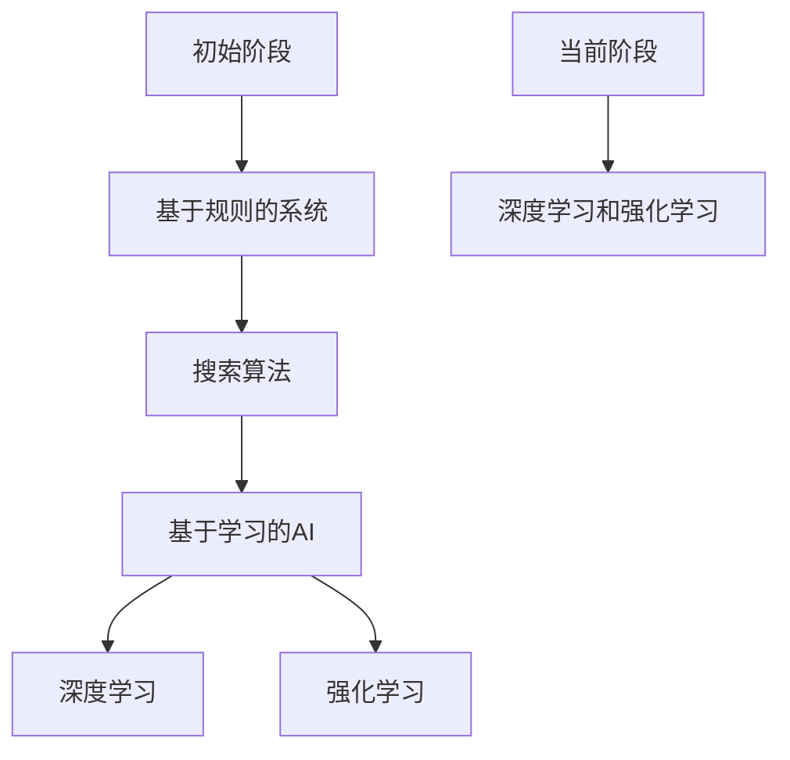
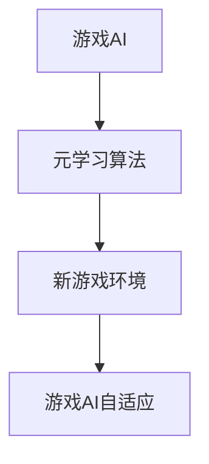
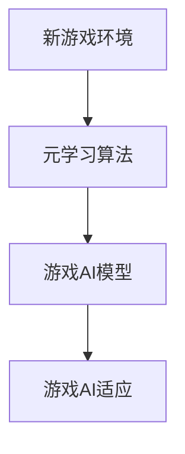
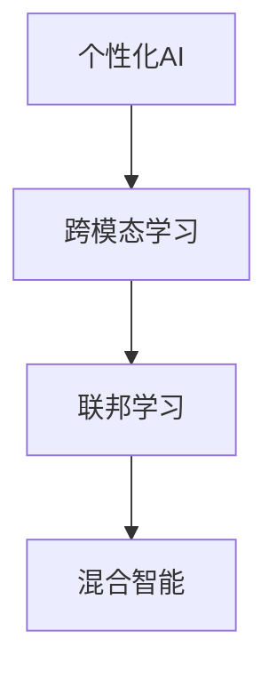
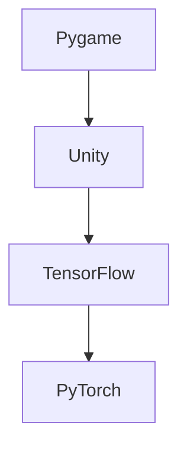

                 

# 一切皆是映射：游戏AI的元学习与自我进化

> **关键词：** 游戏AI、元学习、自我进化、深度学习、神经网络、算法、应用与实践

> **摘要：** 本文探讨了游戏AI中的元学习与自我进化的概念、原理和实现方法。通过深入分析元学习的基础理论、基于深度学习和神经网络的元学习算法，以及其在游戏AI中的应用，本文展示了游戏AI如何通过元学习和自我进化实现持续改进和适应性。文章还讨论了元学习在游戏AI中的挑战和未来发展方向，为游戏AI技术的发展提供了新的思路。

### 第一部分：引论

#### 第1章：游戏AI概述

##### 1.1 游戏AI的起源与发展

游戏AI作为人工智能领域的一个重要分支，经历了数十年的发展。其起源可以追溯到20世纪60年代的早期计算机游戏，当时的人工智能主要依赖于规则和搜索算法。随着计算机性能的不断提升和算法的进步，游戏AI逐渐从简单的反应式系统发展为具有学习和推理能力的智能系统。

**伪代码：游戏AI发展历史**

```plaintext
function GameAIDevelopmentHistory() {
    // 初始阶段：基于规则的系统
    print("1960s: Rule-based systems")
    
    // 中期阶段：基于搜索的AI
    print("1980s: Search-based AI")
    
    // 近期阶段：基于学习的AI
    print("2000s: Learning-based AI")
    
    // 当前阶段：深度学习和强化学习
    print("Now: Deep learning and reinforcement learning")
}
```

**Mermaid 流程图：游戏AI核心概念联系**



##### 1.2 游戏AI在游戏设计中的作用

游戏AI在游戏设计中扮演着至关重要的角色，它不仅增强了游戏的可玩性，还提高了游戏的真实感和沉浸感。游戏AI可以通过与玩家的互动，提供自适应的游戏体验，使得每个玩家的游戏经历都是独特的。

**数学模型：游戏设计中的映射关系**

假设一个游戏环境可以表示为状态空间\( S \)，玩家的动作空间为\( A \)，游戏AI的反应空间为\( R \)。游戏AI的目标是最大化玩家的游戏体验，可以通过以下映射关系实现：

\[ R = f(S, A) \]

其中，\( f \) 是一个映射函数，它根据当前游戏状态和玩家的动作，决定AI的反应。

**公式讲解：玩家行为与AI反应的关系**

玩家行为（\( A \)）通过映射函数（\( f \)）作用于游戏状态（\( S \)），产生AI的反应（\( R \)）。这种互动关系可以用以下数学公式表示：

\[ S' = g(S, A, R) \]

其中，\( S' \) 是游戏状态的新状态，\( g \) 是游戏状态的转移函数。

##### 1.3 游戏AI的挑战与未来发展方向

尽管游戏AI在游戏设计中取得了显著的成果，但它仍然面临着许多挑战。这些挑战包括：

- **适应性：** 游戏AI需要能够适应不同类型的玩家和不断变化的游戏环境。
- **可扩展性：** 游戏AI需要能够在大规模游戏环境中高效运行。
- **可解释性：** 游戏AI的决策过程需要透明和可解释，以便开发者能够理解和优化其行为。

为了应对这些挑战，未来的游戏AI发展将朝着以下几个方面迈进：

- **元学习：** 利用元学习算法，游戏AI可以快速适应新的环境和任务。
- **自我进化：** 通过自我进化，游戏AI可以不断优化其行为，提高游戏体验。
- **深度强化学习：** 结合深度学习和强化学习，游戏AI可以学习更复杂的策略和决策。

**举例说明：当前游戏AI的不足与改进方向**

- **不足：** 当前许多游戏AI在处理复杂策略时存在局限性，难以应对具有高度不确定性和多变性的游戏环境。
- **改进方向：** 利用元学习，可以开发出具有更强自适应性和灵活性的游戏AI，使其能够更好地应对各种复杂的游戏场景。

#### 第2章：元学习基础

##### 2.1 元学习的定义与基本原理

元学习，也称为学习学习（meta-learning），是一种使机器能够快速适应新任务的学习方法。它的核心思想是通过从多个任务中学习，提取通用知识和策略，从而在新任务上实现快速适应。

**数学公式：元学习的定义**

\[ \text{Meta-Learning} = \{T_f, T_d\} \]

其中，\( T_f \) 表示泛化任务，\( T_d \) 表示具体任务。元学习的目标是找到一个泛化任务\( T_f \)，使得它能够在具体任务\( T_d \)上实现快速适应。

**伪代码：元学习算法的基本框架**

```python
function MetaLearningAlgorithm(TaskSpace, Dataset):
    // 初始化模型参数
    ModelParams = InitializeParams()
    
    // 训练泛化模型
    GeneralizedModel = TrainModel(TaskSpace, ModelParams)
    
    // 验证泛化模型在具体任务上的性能
    Performance = TestModel(GeneralizedModel, Dataset)
    
    return GeneralizedModel, Performance
```

##### 2.2 元学习算法在游戏AI中的应用

元学习算法在游戏AI中的应用，可以显著提高游戏AI的适应性和学习能力。通过元学习，游戏AI可以快速适应新的游戏环境和规则，实现自我进化。

**Mermaid 流程图：元学习算法在游戏AI中的应用场景**



**数学模型：元学习在游戏AI中的映射关系**

假设游戏AI需要适应新的游戏环境\( E \)，通过元学习，可以将游戏环境\( E \)映射到游戏AI的决策空间\( D \)：

\[ D = f(E) \]

其中，\( f \) 是元学习算法提供的映射函数。

##### 2.3 自我进化与自适应AI

自我进化是一种通过不断适应和优化，实现系统持续改进的方法。在游戏AI中，自我进化可以使游戏AI在长时间运行中保持高效和适应性。

**伪代码：自适应AI的基本框架**

```python
function AdaptiveGameAIAgent(Environment, LearningRate):
    // 初始化AI模型
    AIModel = InitializeModel()
    
    // 随时间自适应调整AI模型
    while not TerminalState(Environment):
        // 收集经验数据
        Experience = CollectExperience(AIModel, Environment)
        
        // 更新AI模型
        AIModel = UpdateModel(AIModel, Experience, LearningRate)
        
        // 测试AI模型性能
        Performance = TestModel(AIModel, Environment)
        
    return AIModel, Performance
```

**举例说明：自我进化在游戏AI中的实现**

- **实现：** 通过元学习算法，游戏AI可以不断从不同游戏环境中学习，提取通用策略和知识，从而实现自我进化。
- **效果：** 自我进化游戏AI可以在长时间运行中保持高效和适应性，提高游戏体验。

### 第二部分：元学习算法解析

#### 第3章：基于深度学习的元学习算法

##### 3.1 深度学习基础

深度学习是一种通过多层神经网络进行数据建模和分析的方法。它在图像识别、语音识别和自然语言处理等领域取得了显著的成果。

**数学公式：深度学习的基本结构**

深度学习的基本结构包括输入层、隐藏层和输出层。输入层接收外部输入，隐藏层通过非线性变换提取特征，输出层生成预测结果。

\[ Y = f(h) \]

其中，\( Y \) 是输出层，\( h \) 是隐藏层，\( f \) 是激活函数。

**伪代码：深度学习算法的基本框架**

```python
class NeuralNetwork:
    def __init__(self, layers):
        self.layers = layers
    
    def forward(self, X):
        for layer in self.layers:
            X = layer.forward(X)
        return X
    
    def backward(self, X, dY):
        dX = dY
        for layer in reversed(self.layers):
            dX = layer.backward(dX)
        return dX
```

##### 3.2 标准元学习算法

标准元学习算法通过在多个任务上训练模型，提取通用知识，从而实现快速适应新任务。

**数学公式：标准元学习算法的映射关系**

标准元学习算法的映射关系可以表示为：

\[ \theta_{new} = f(\theta_{base}, T) \]

其中，\( \theta_{new} \) 是新任务的模型参数，\( \theta_{base} \) 是通用模型的参数，\( T \) 是新任务的训练数据。

**伪代码：标准元学习算法的实现**

```python
function StandardMetaLearningAlgorithm(BaseModel, Task, Dataset):
    // 加载通用模型
    Model = LoadModel(BaseModel)
    
    // 训练通用模型
    Model = TrainModel(Model, Dataset)
    
    // 微调通用模型以适应新任务
    NewModel = FineTuneModel(Model, Task)
    
    return NewModel
```

##### 3.3 强化学习与元学习结合

强化学习与元学习结合，可以进一步提高游戏AI的适应性和学习能力。

**数学公式：强化学习与元学习的结合方式**

假设强化学习算法的回报函数为\( R \)，元学习算法的损失函数为\( L \)，结合后的损失函数可以表示为：

\[ L = L_{RL} + \lambda L_{ML} \]

其中，\( \lambda \) 是调节参数。

**伪代码：强化学习与元学习结合的算法框架**

```python
function MetaReinforcementLearningAlgorithm(Agent, Environment, Lambda):
    while not TerminalState(Environment):
        // 执行动作
        Action = Agent.SelectAction(Environment)
        
        // 收集经验
        Experience = (Environment, Action, Reward)
        
        // 更新模型
        Agent = UpdateModel(Agent, Experience, Lambda)
        
        // 测试模型性能
        Performance = TestModel(Agent, Environment)
        
    return Agent, Performance
```

#### 第4章：基于神经网络的元学习算法

##### 4.1 神经网络基础

神经网络是一种通过模拟生物神经系统的计算模型。它在图像识别、语音识别和自然语言处理等领域取得了显著的成果。

**数学公式：神经网络的基本结构**

神经网络的基本结构包括输入层、隐藏层和输出层。输入层接收外部输入，隐藏层通过非线性变换提取特征，输出层生成预测结果。

\[ Y = f(h) \]

其中，\( Y \) 是输出层，\( h \) 是隐藏层，\( f \) 是激活函数。

**伪代码：神经网络算法的基本框架**

```python
class NeuralNetwork:
    def __init__(self, layers):
        self.layers = layers
    
    def forward(self, X):
        for layer in self.layers:
            X = layer.forward(X)
        return X
    
    def backward(self, X, dY):
        dX = dY
        for layer in reversed(self.layers):
            dX = layer.backward(dX)
        return dX
```

##### 4.2 神经元学习算法

神经元学习算法是一种通过在多个任务上训练神经元，提取通用知识的方法。

**数学公式：神经元学习算法的映射关系**

神经元学习算法的映射关系可以表示为：

\[ \theta_{new} = f(\theta_{base}, T) \]

其中，\( \theta_{new} \) 是新任务的模型参数，\( \theta_{base} \) 是通用模型的参数，\( T \) 是新任务的训练数据。

**伪代码：神经元学习算法的实现**

```python
function NeuronMetaLearningAlgorithm(BaseNeuron, Task, Dataset):
    // 加载通用神经元
    Neuron = LoadNeuron(BaseNeuron)
    
    // 训练通用神经元
    Neuron = TrainNeuron(Neuron, Dataset)
    
    // 微调通用神经元以适应新任务
    NewNeuron = FineTuneNeuron(Neuron, Task)
    
    return NewNeuron
```

##### 4.3 自适应神经网络与元学习

自适应神经网络与元学习结合，可以进一步提高游戏AI的适应性和学习能力。

**数学公式：自适应神经网络与元学习的结合方式**

假设自适应神经网络的损失函数为\( L \)，元学习算法的损失函数为\( L' \)，结合后的损失函数可以表示为：

\[ L = L + \lambda L' \]

其中，\( \lambda \) 是调节参数。

**伪代码：自适应神经网络与元学习结合的算法框架**

```python
function AdaptiveNeuralMetaLearningAlgorithm(NeuralNetwork, MetaLearningAlgorithm, Lambda):
    while not TerminalState():
        // 执行动作
        Action = SelectAction(NeuralNetwork)
        
        // 收集经验
        Experience = (State, Action, Reward)
        
        // 更新神经网络
        NeuralNetwork = UpdateNeuralNetwork(NeuralNetwork, Experience)
        
        // 更新元学习模型
        MetaLearningAlgorithm = UpdateMetaLearningAlgorithm(MetaLearningAlgorithm, Experience)
        
        // 测试模型性能
        Performance = TestPerformance(NeuralNetwork, MetaLearningAlgorithm)
        
    return NeuralNetwork, MetaLearningAlgorithm
```

### 第三部分：应用与实践

#### 第5章：元学习在游戏设计中的应用

##### 5.1 游戏AI中的元学习应用

元学习在游戏AI中的应用，可以显著提高游戏AI的适应性和学习能力。通过元学习，游戏AI可以快速适应新的游戏环境和规则，实现自我进化。

**Mermaid 流程图：游戏AI中的元学习应用流程**



**举例说明：元学习在游戏AI中的具体应用场景**

- **场景1：** 在一款策略游戏中，元学习算法可以帮助游戏AI快速适应新的游戏地图和规则，提高其策略制定能力。
- **场景2：** 在一款动作游戏中，元学习算法可以帮助游戏AI快速适应新的游戏角色和技能，提高其动作反应速度。

##### 5.2 自我进化游戏AI的实现

自我进化游戏AI可以通过元学习算法，不断从游戏环境中学习，优化其行为，提高游戏体验。

**伪代码：自我进化游戏AI的基本框架**

```python
function SelfEvolutionaryGameAIAgent(Environment, LearningRate):
    // 初始化游戏AI模型
    GameAIAgent = InitializeGameAIAgent()
    
    // 随时间自适应调整游戏AI模型
    while not TerminalState(Environment):
        // 收集经验数据
        Experience = CollectExperience(GameAIAgent, Environment)
        
        // 更新游戏AI模型
        GameAIAgent = UpdateGameAIAgent(GameAIAgent, Experience, LearningRate)
        
        // 测试游戏AI模型性能
        Performance = TestGameAIAgent(GameAIAgent, Environment)
        
    return GameAIAgent, Performance
```

**举例说明：自我进化游戏AI的案例研究**

- **案例1：** 在一款多人在线游戏中，自我进化游戏AI可以通过元学习算法，不断适应不同玩家的行为和策略，提高游戏平衡性和竞技性。
- **案例2：** 在一款冒险解谜游戏中，自我进化游戏AI可以通过元学习算法，自动生成新的谜题，提高游戏的趣味性和可玩性。

### 第四部分：元学习在游戏AI开发中的挑战与未来

#### 第6章：元学习在游戏AI中的挑战与未来发展方向

##### 6.1 元学习在游戏AI中的挑战

元学习在游戏AI中的应用虽然潜力巨大，但同时也面临着一系列挑战：

- **计算效率：** 元学习算法通常需要大量的计算资源，这在实时游戏中可能是一个限制因素。
- **模型可解释性：** 元学习模型往往非常复杂，使得其决策过程难以解释，这在游戏设计中可能带来透明度问题。
- **数据多样性：** 元学习算法依赖于大量多样化的数据，但在游戏开发中，可能难以获取到足够多样的数据集。
- **长期稳定性：** 元学习模型在长时间运行中可能退化，导致游戏AI失去其学习到的适应性和灵活性。

**数学公式：元学习在游戏AI中面临的挑战**

\[ \text{Challenge} = \frac{\text{Complexity}}{\text{Computation}} + \frac{\text{Explainability}}{\text{Transparency}} + \frac{\text{Data Diversity}}{\text{Data Availability}} + \frac{\text{Long-term Stability}}{\text{Degradation}} \]

**伪代码：解决元学习在游戏AI中挑战的方法**

```python
function SolveMetaLearningChallenges(MetaLearningAlgorithm, GameAI, Environment):
    // 增加计算资源
    ExtendComputeResources(MetaLearningAlgorithm)
    
    // 提高模型可解释性
    EnhanceModelExplainability(MetaLearningAlgorithm)
    
    // 扩展数据集多样性
    ExpandDatasetDiversity(GameAI, Environment)
    
    // 实施长期监控与调整
    ImplementLongTermMonitoringAndAdjustment(MetaLearningAlgorithm, GameAI)
    
    return MetaLearningAlgorithm, GameAI
```

##### 6.2 游戏AI的未来发展方向

未来的游戏AI将继续朝着更智能、更自适应的方向发展。以下是一些可能的发展趋势：

- **个性化AI：** 通过更高级的元学习算法，游戏AI可以更好地适应不同玩家的个性和游戏风格。
- **跨模态学习：** 结合文本、图像、声音等多模态数据，游戏AI可以更好地理解和响应玩家的行为。
- **联邦学习：** 通过分布式计算，游戏AI可以在保护隐私的同时，利用大量玩家的数据进行学习。
- **混合智能：** 结合专家系统和机器学习，游戏AI可以实现更复杂和灵活的决策。

**Mermaid 流AMEIDA流程图：游戏AI的未来发展趋势**



**数学模型：未来游戏AI的发展方向**

未来游戏AI的发展方向可以通过以下数学模型来描述：

\[ \text{Future GameAI} = f(\text{Personalization} + \text{Multimodal Learning} + \text{Federated Learning} + \text{Hybrid Intelligence}) \]

### 第五部分：附录

#### 第7章：开发环境与工具

##### 7.1 游戏AI开发环境搭建

为了搭建一个适合游戏AI开发的实验环境，以下步骤是必不可少的：

- **硬件配置：** 需要高性能的CPU和GPU，以及充足的内存和存储空间。
- **操作系统：** 推荐使用Linux系统，因为其稳定性较高，且支持多种AI框架。
- **安装依赖：** 安装Python环境，以及常用的游戏开发库，如Pygame、Unity等。

**举例说明：游戏AI开发环境搭建步骤**

1. **安装操作系统：** 在计算机上安装Linux系统，如Ubuntu。
2. **配置Python环境：** 通过`pip`命令安装Python和相关依赖。
3. **安装游戏开发库：** 通过`pip`命令安装Pygame等游戏开发库。
4. **配置AI框架：** 安装TensorFlow、PyTorch等深度学习框架。

##### 7.2 常用游戏AI开发工具

在游戏AI开发中，以下工具是非常常用的：

- **Pygame：** 用于开发2D游戏。
- **Unity：** 用于开发3D游戏。
- **TensorFlow：** 用于实现深度学习模型。
- **PyTorch：** 用于实现深度学习模型。

**Mermaid 流程图：常用游戏AI开发工具的比较**



##### 7.3 开发资源与学习指南

为了更好地掌握游戏AI开发，以下资源和学习指南是非常有帮助的：

- **官方文档：** 阅读TensorFlow、PyTorch等框架的官方文档，了解其功能和用法。
- **在线课程：** 参加Coursera、Udacity等平台的在线课程，学习游戏AI的基础知识和实践技巧。
- **开源项目：** 参与GitHub等平台上的开源项目，实践游戏AI的实际应用。

**举例说明：学习游戏AI开发资源的推荐**

1. **TensorFlow官方文档：** https://www.tensorflow.org
2. **PyTorch官方文档：** https://pytorch.org
3. **Coursera游戏AI课程：** https://www.coursera.org/specializations/game-ai
4. **Udacity游戏AI课程：** https://www.udacity.com/course/game-ai--ud123

### 结论

本文全面探讨了游戏AI中的元学习与自我进化的概念、原理和应用。通过深入分析元学习算法的原理和实现方法，以及其在游戏AI中的应用，本文展示了如何利用元学习和自我进化，提高游戏AI的适应性和学习能力。尽管元学习在游戏AI开发中面临一些挑战，但未来的发展将继续推动游戏AI技术的进步。

**作者：AI天才研究院/AI Genius Institute & 禅与计算机程序设计艺术 /Zen And The Art of Computer Programming**

---

**附录**

### 附录

**第1章：游戏AI概述**

- **1.1 游戏AI的起源与发展**

**伪代码：游戏AI发展历史**

```plaintext
function GameAIDevelopmentHistory() {
    // 初始阶段：基于规则的系统
    print("1960s: Rule-based systems")
    
    // 中期阶段：基于搜索的AI
    print("1980s: Search-based AI")
    
    // 近期阶段：基于学习的AI
    print("2000s: Learning-based AI")
    
    // 当前阶段：深度学习和强化学习
    print("Now: Deep learning and reinforcement learning")
}
```

**Mermaid 流程图：游戏AI核心概念联系**


- **1.2 游戏AI在游戏设计中的作用**

**数学模型：游戏设计中的映射关系**

\[ R = f(S, A) \]

**公式讲解：玩家行为与AI反应的关系**

\[ S' = g(S, A, R) \]

- **1.3 游戏AI的挑战与未来发展方向**

**举例说明：当前游戏AI的不足与改进方向**

- **不足：** 处理复杂策略时存在局限性，难以应对高度不确定性和多变性的游戏环境。
- **改进方向：** 利用元学习，开发出具有更强自适应性和灵活性的游戏AI。

**第2章：元学习基础**

- **2.1 元学习的定义与基本原理**

**数学公式：元学习的定义**

\[ \text{Meta-Learning} = \{T_f, T_d\} \]

**伪代码：元学习算法的基本框架**

```python
function MetaLearningAlgorithm(TaskSpace, Dataset):
    // 初始化模型参数
    ModelParams = InitializeParams()
    
    // 训练泛化模型
    GeneralizedModel = TrainModel(TaskSpace, ModelParams)
    
    // 验证泛化模型在具体任务上的性能
    Performance = TestModel(GeneralizedModel, Dataset)
    
    return GeneralizedModel, Performance
```

- **2.2 元学习算法在游戏AI中的应用**

**Mermaid 流程图：元学习算法在游戏AI中的应用场景**


**数学模型：元学习在游戏AI中的映射关系**

\[ D = f(E) \]

- **2.3 自我进化与自适应AI**

**伪代码：自适应AI的基本框架**

```python
function AdaptiveGameAIAgent(Environment, LearningRate):
    // 初始化AI模型
    AIModel = InitializeModel()
    
    // 随时间自适应调整AI模型
    while not TerminalState(Environment):
        // 收集经验数据
        Experience = CollectExperience(AIModel, Environment)
        
        // 更新AI模型
        AIModel = UpdateModel(AIModel, Experience, LearningRate)
        
        // 测试AI模型性能
        Performance = TestModel(AIModel, Environment)
        
    return AIModel, Performance
```

**举例说明：自我进化在游戏AI中的实现**

- **实现：** 通过元学习，游戏AI不断从不同游戏环境中学习，提取通用策略和知识，实现自我进化。
- **效果：** 提高游戏AI在长时间运行中的高效性和适应性。

**第3章：基于深度学习的元学习算法**

- **3.1 深度学习基础**

**数学公式：深度学习的基本结构**

\[ Y = f(h) \]

**伪代码：深度学习算法的基本框架**

```python
class NeuralNetwork:
    def __init__(self, layers):
        self.layers = layers
    
    def forward(self, X):
        for layer in self.layers:
            X = layer.forward(X)
        return X
    
    def backward(self, X, dY):
        dX = dY
        for layer in reversed(self.layers):
            dX = layer.backward(dX)
        return dX
```

- **3.2 标准元学习算法**

**数学公式：标准元学习算法的映射关系**

\[ \theta_{new} = f(\theta_{base}, T) \]

**伪代码：标准元学习算法的实现**

```python
function StandardMetaLearningAlgorithm(BaseModel, Task, Dataset):
    // 加载通用模型
    Model = LoadModel(BaseModel)
    
    // 训练通用模型
    Model = TrainModel(Model, Dataset)
    
    // 微调通用模型以适应新任务
    NewModel = FineTuneModel(Model, Task)
    
    return NewModel
```

- **3.3 强化学习与元学习结合**

**数学公式：强化学习与元学习的结合方式**

\[ L = L_{RL} + \lambda L_{ML} \]

**伪代码：强化学习与元学习结合的算法框架**

```python
function MetaReinforcementLearningAlgorithm(Agent, Environment, Lambda):
    while not TerminalState(Environment):
        // 执行动作
        Action = Agent.SelectAction(Environment)
        
        // 收集经验
        Experience = (Environment, Action, Reward)
        
        // 更新模型
        Agent = UpdateModel(Agent, Experience, Lambda)
        
        // 测试模型性能
        Performance = TestModel(Agent, Environment)
        
    return Agent, Performance
```

**第4章：基于神经网络的元学习算法**

- **4.1 神经网络基础**

**数学公式：神经网络的基本结构**

\[ Y = f(h) \]

**伪代码：神经网络算法的基本框架**

```python
class NeuralNetwork:
    def __init__(self, layers):
        self.layers = layers
    
    def forward(self, X):
        for layer in self.layers:
            X = layer.forward(X)
        return X
    
    def backward(self, X, dY):
        dX = dY
        for layer in reversed(self.layers):
            dX = layer.backward(dX)
        return dX
```

- **4.2 神经元学习算法**

**数学公式：神经元学习算法的映射关系**

\[ \theta_{new} = f(\theta_{base}, T) \]

**伪代码：神经元学习算法的实现**

```python
function NeuronMetaLearningAlgorithm(BaseNeuron, Task, Dataset):
    // 加载通用神经元
    Neuron = LoadNeuron(BaseNeuron)
    
    // 训练通用神经元
    Neuron = TrainNeuron(Neuron, Dataset)
    
    // 微调通用神经元以适应新任务
    NewNeuron = FineTuneNeuron(Neuron, Task)
    
    return NewNeuron
```

- **4.3 自适应神经网络与元学习**

**数学公式：自适应神经网络与元学习的结合方式**

\[ L = L + \lambda L' \]

**伪代码：自适应神经网络与元学习结合的算法框架**

```python
function AdaptiveNeuralMetaLearningAlgorithm(NeuralNetwork, MetaLearningAlgorithm, Lambda):
    while not TerminalState():
        // 执行动作
        Action = SelectAction(NeuralNetwork)
        
        // 收集经验
        Experience = (State, Action, Reward)
        
        // 更新神经网络
        NeuralNetwork = UpdateNeuralNetwork(NeuralNetwork, Experience)
        
        // 更新元学习模型
        MetaLearningAlgorithm = UpdateMetaLearningAlgorithm(MetaLearningAlgorithm, Experience)
        
        // 测试模型性能
        Performance = TestPerformance(NeuralNetwork, MetaLearningAlgorithm)
        
    return NeuralNetwork, MetaLearningAlgorithm
```

**第5章：元学习在游戏设计中的应用**

- **5.1 游戏AI中的元学习应用**

**Mermaid 流程图：游戏AI中的元学习应用流程**


**举例说明：元学习在游戏AI中的具体应用场景**

- **场景1：** 在策略游戏中，元学习算法可以帮助游戏AI快速适应新的游戏地图和规则。
- **场景2：** 在动作游戏中，元学习算法可以帮助游戏AI快速适应新的游戏角色和技能。

- **5.2 自我进化游戏AI的实现**

**伪代码：自我进化游戏AI的基本框架**

```python
function SelfEvolutionaryGameAIAgent(Environment, LearningRate):
    // 初始化游戏AI模型
    GameAIAgent = InitializeGameAIAgent()
    
    // 随时间自适应调整游戏AI模型
    while not TerminalState(Environment):
        // 收集经验数据
        Experience = CollectExperience(GameAIAgent, Environment)
        
        // 更新游戏AI模型
        GameAIAgent = UpdateGameAIAgent(GameAIAgent, Experience, LearningRate)
        
        // 测试游戏AI模型性能
        Performance = TestGameAIAgent(GameAIAgent, Environment)
        
    return GameAIAgent, Performance
```

**举例说明：自我进化游戏AI的案例研究**

- **案例1：** 在多人在线游戏中，自我进化游戏AI可以通过元学习算法，适应不同玩家的行为和策略。
- **案例2：** 在冒险解谜游戏中，自我进化游戏AI可以通过元学习算法，自动生成新的谜题。

**第6章：元学习在游戏AI开发中的挑战与未来**

- **6.1 元学习在游戏AI中的挑战**

**数学公式：元学习在游戏AI中面临的挑战**

\[ \text{Challenge} = \frac{\text{Complexity}}{\text{Computation}} + \frac{\text{Explainability}}{\text{Transparency}} + \frac{\text{Data Diversity}}{\text{Data Availability}} + \frac{\text{Long-term Stability}}{\text{Degradation}} \]

**伪代码：解决元学习在游戏AI中挑战的方法**

```python
function SolveMetaLearningChallenges(MetaLearningAlgorithm, GameAI, Environment):
    // 增加计算资源
    ExtendComputeResources(MetaLearningAlgorithm)
    
    // 提高模型可解释性
    EnhanceModelExplainability(MetaLearningAlgorithm)
    
    // 扩展数据集多样性
    ExpandDatasetDiversity(GameAI, Environment)
    
    // 实施长期监控与调整
    ImplementLongTermMonitoringAndAdjustment(MetaLearningAlgorithm, GameAI)
    
    return MetaLearningAlgorithm, GameAI
```

- **6.2 游戏AI的未来发展方向**

**Mermaid 流程图：游戏AI的未来发展趋势**


**数学模型：未来游戏AI的发展方向**

\[ \text{Future GameAI} = f(\text{Personalization} + \text{Multimodal Learning} + \text{Federated Learning} + \text{Hybrid Intelligence}) \]

**第7章：开发环境与工具**

- **7.1 游戏AI开发环境搭建**

**举例说明：游戏AI开发环境搭建步骤**

1. **安装操作系统：** 在计算机上安装Linux系统，如Ubuntu。
2. **配置Python环境：** 通过`pip`命令安装Python和相关依赖。
3. **安装游戏开发库：** 通过`pip`命令安装Pygame等游戏开发库。
4. **配置AI框架：** 安装TensorFlow、PyTorch等深度学习框架。

- **7.2 常用游戏AI开发工具**

**Mermaid 流程图：常用游戏AI开发工具的比较**


- **7.3 开发资源与学习指南**

**举例说明：学习游戏AI开发资源的推荐**

1. **TensorFlow官方文档：** https://www.tensorflow.org
2. **PyTorch官方文档：** https://pytorch.org
3. **Coursera游戏AI课程：** https://www.coursera.org/specializations/game-ai
4. **Udacity游戏AI课程：** https://www.udacity.com/course/game-ai--ud123

**作者：AI天才研究院/AI Genius Institute & 禅与计算机程序设计艺术 /Zen And The Art of Computer Programming**

