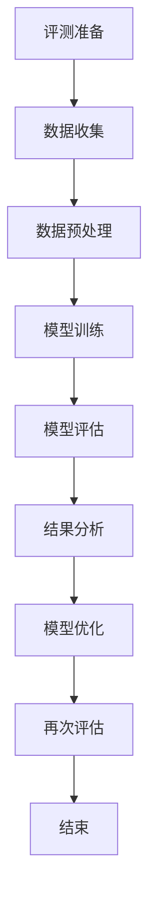
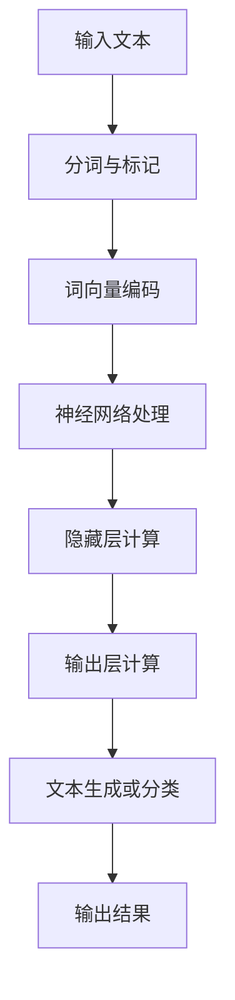
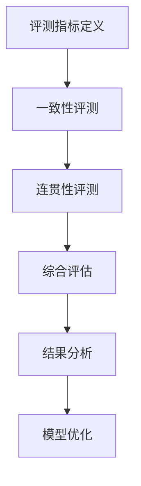

                 

# 《上下文理解能力评测：测试LLM的连贯性和一致性》

## 关键词：上下文理解，评测，语言模型（LLM），连贯性，一致性，评测方法，评测工具，实战案例

## 摘要：

本文深入探讨了上下文理解能力评测的重要性及其在语言模型（LLM）中的应用。文章首先介绍了上下文理解的基本概念和重要性，然后详细阐述了语言模型的定义、类型和组成。接着，文章提出了评测上下文理解能力的方法和工具，包括一致性和连贯性评测的具体方法。随后，通过实际案例展示了评测方法的应用，并对其进行了详细解析。最后，文章对未来的发展趋势和面临的挑战进行了展望，提出了相应的解决方案。本文旨在为研究者和技术开发者提供一套完整的上下文理解能力评测指南，助力LLM技术的不断进步。

## 目录大纲

### 第一部分：上下文理解能力评测基础

### 第1章：上下文理解能力概述

### 第2章：LLM概述

### 第二部分：评测方法与工具

### 第3章：评测方法概述

### 第4章：一致性评测

### 第5章：连贯性评测

### 第6章：评测工具与平台

### 第三部分：LLM在上下文理解能力评测中的应用

### 第7章：实战案例

### 第四部分：展望与挑战

### 第8章：未来发展

### 第9章：挑战与解决方案

### 第五部分：附录

### 附录A：相关资源

### 附录B：Mermaid流程图

### 附录C：伪代码与数学公式

### 附录D：代码解读与分析

### 前言

上下文理解是自然语言处理（NLP）领域的一项关键技术，对于实现智能对话系统、文本摘要、问答系统等应用至关重要。然而，如何准确评测语言模型（LLM）的上下文理解能力，仍是一个具有挑战性的问题。本文旨在探讨上下文理解能力评测的方法和工具，以测试LLM的连贯性和一致性，为LLM技术的进一步发展提供指导。

### 第1章：上下文理解能力概述

#### 1.1 上下文理解的重要性

上下文理解是指在特定情境下对语言表达的理解和推理。它不仅仅是对字面意义的理解，还包括了对语境、意图和隐含信息的把握。在自然语言处理领域，上下文理解能力的强弱直接决定了模型的智能程度和应用效果。

首先，上下文理解是自然语言交互的基础。在智能对话系统中，用户与系统的交互通常是基于上下文的，只有正确理解用户的意图和情境，系统才能提供准确的响应。

其次，上下文理解有助于提升文本摘要和机器翻译的准确性。在文本摘要中，上下文理解可以帮助模型更好地捕捉关键信息，从而生成更精准的摘要。在机器翻译中，上下文理解有助于解决词汇歧义和句子结构复杂性，提高翻译质量。

最后，上下文理解是构建知识图谱和问答系统的重要手段。在知识图谱中，上下文理解可以帮助模型更好地关联实体和关系，从而构建更丰富的知识结构。在问答系统中，上下文理解有助于模型更准确地理解用户的问题，提供符合预期的答案。

#### 1.2 语言模型与上下文理解

语言模型（LLM）是一种基于深度学习的技术，用于对自然语言进行建模和生成。LLM通过对海量语言数据进行训练，能够捕捉语言中的统计规律和语义信息，从而实现对文本的生成、理解和推理。

语言模型与上下文理解密切相关。一方面，语言模型需要依赖上下文信息来理解文本的语义和意图。另一方面，上下文理解的提升有助于增强语言模型的表现力，使其能够更准确地生成和解读语言。

#### 1.3 评测上下文理解能力的意义

评测上下文理解能力对于语言模型的研究和应用具有重要意义。首先，通过评测可以评估模型在特定任务上的性能，为模型的优化和改进提供依据。其次，评测可以比较不同模型的上下文理解能力，为选择合适的模型提供参考。最后，评测可以推动上下文理解技术的发展，为智能对话系统、文本摘要、机器翻译等应用提供更好的支持。

在本文中，我们将详细介绍上下文理解能力评测的方法和工具，包括一致性评测和连贯性评测。一致性评测主要关注模型在不同情境下保持一致性的能力，而连贯性评测则侧重于模型在连续文本中的表现。通过这些评测方法，我们可以全面评估LLM的上下文理解能力，为其在各个领域的应用提供有力支持。

### 第2章：LLM概述

#### 2.1 语言模型的定义与类型

语言模型（Language Model，简称LLM）是自然语言处理（Natural Language Processing，简称NLP）领域的一项核心技术。它通过对大量语言数据的学习，建立对自然语言的统计模型，从而实现对文本的生成、理解和推理。

根据训练数据和模型结构的不同，语言模型可以分为以下几种类型：

1. **基于规则的模型**：这类模型通过人工定义语法规则和语义规则来对语言进行建模。例如，基于转换语法（Transformation-Based Grammar）的模型，通过将输入文本转换为目标文本来实现语言理解。

2. **统计模型**：这类模型通过分析大量文本数据，统计单词之间的共现关系，建立概率模型。例如，基于n-gram模型的语言模型，通过统计n个单词的联合概率来预测下一个单词。

3. **神经网络模型**：这类模型基于深度学习技术，通过多层神经网络对语言数据进行建模。例如，循环神经网络（Recurrent Neural Network，RNN）、长短时记忆网络（Long Short-Term Memory，LSTM）和变换器（Transformer）等。

4. **混合模型**：这类模型结合了规则、统计和神经网络的方法，以提高语言模型的性能。例如，基于BERT（Bidirectional Encoder Representations from Transformers）的模型，通过结合转换器模型和预训练技术，实现了在多个NLP任务上的优异表现。

#### 2.2 语言模型的组成与工作原理

语言模型由多个组件构成，主要包括输入层、隐藏层和输出层。每个层都有其特定的功能和作用。

1. **输入层**：输入层接收文本数据，并将其转化为模型可以处理的格式。通常，输入层会对文本进行分词、标记和编码，生成序列形式的输入向量。

2. **隐藏层**：隐藏层是语言模型的核心部分，通过多层神经网络对输入向量进行处理和转换。隐藏层中的神经元通常采用激活函数（如ReLU、Sigmoid、Tanh等），以引入非线性变换，从而提高模型的表示能力。

3. **输出层**：输出层负责对隐藏层生成的特征向量进行分类或生成文本。在分类任务中，输出层通常包含多个神经元，每个神经元对应一个类别，并通过softmax函数进行概率分布计算。在生成任务中，输出层通过逐层解码，将隐藏层的输出转化为自然语言文本。

#### 2.3 LLM的应用领域

语言模型在自然语言处理领域具有广泛的应用。以下是一些典型的应用领域：

1. **智能对话系统**：语言模型可以用于构建智能对话系统，如聊天机器人、虚拟助手等。这些系统通过理解用户的问题和意图，提供相应的回答和操作。

2. **文本摘要**：语言模型可以用于生成文本摘要，提取文本中的关键信息，实现文本的长短句转换。

3. **机器翻译**：语言模型可以用于机器翻译，将一种语言的文本翻译成另一种语言。通过大规模的语言数据训练，模型可以学习到语言的统计规律和语法结构。

4. **情感分析**：语言模型可以用于情感分析，通过对文本的情感倾向进行分类，帮助企业和组织了解用户反馈和市场需求。

5. **文本分类**：语言模型可以用于文本分类，将文本分为不同的类别，如新闻分类、垃圾邮件过滤等。

6. **问答系统**：语言模型可以用于构建问答系统，通过理解用户的问题，提供准确的答案。这在教育、医疗等领域具有广泛的应用。

7. **信息抽取**：语言模型可以用于信息抽取，从文本中提取关键信息，如实体识别、关系抽取等。

8. **文本生成**：语言模型可以用于文本生成，如文章写作、故事创作等。通过生成算法，模型可以创造出新颖、有创意的文本内容。

#### 2.4 LLM的发展趋势

随着深度学习技术的发展，语言模型在性能和效果上取得了显著的提升。未来，LLM的发展将朝着以下方向：

1. **预训练与微调**：预训练技术通过在大量未标注的数据上进行训练，提高模型的泛化能力。微调则是在预训练的基础上，针对特定任务进行微调，以实现更好的性能。

2. **多模态融合**：语言模型将与其他模态（如图像、声音、视频）进行融合，实现跨模态理解。这将有助于提升模型在复杂场景中的应用能力。

3. **强化学习**：结合强化学习技术，语言模型可以更好地学习用户的反馈，优化生成结果，提高用户体验。

4. **知识增强**：通过引入外部知识库和领域知识，增强语言模型对特定领域的理解和推理能力。

5. **可解释性**：提高语言模型的可解释性，使其决策过程更加透明和可解释，有助于增强用户对模型的信任。

6. **隐私保护**：在数据处理和模型训练过程中，加强对用户隐私的保护，确保用户数据的安全和隐私。

#### 2.5 LLM在上下文理解能力评测中的重要性

LLM在上下文理解能力评测中扮演着关键角色。首先，LLM能够通过大规模数据训练，捕捉语言中的复杂模式和语义信息，从而提高上下文理解的能力。其次，LLM在评测过程中可以自动生成多样化的文本数据，为评测提供丰富的测试场景。此外，LLM还可以通过分析测试结果，提供对上下文理解能力的量化评估，为模型优化和改进提供有力支持。

总之，LLM在上下文理解能力评测中具有不可替代的重要性。随着LLM技术的不断发展，上下文理解能力评测将变得更加准确和全面，为NLP应用带来更大的价值。

### 第3章：评测方法概述

#### 3.1 评测指标

评测上下文理解能力需要一系列指标来衡量模型的性能。以下是一些常用的评测指标：

1. **准确率（Accuracy）**：准确率是指模型正确预测的样本数占总样本数的比例。在分类任务中，准确率是最常用的评价指标。

2. **精确率（Precision）**：精确率是指预测为正类的样本中，实际为正类的比例。它反映了模型在正类样本中的识别能力。

3. **召回率（Recall）**：召回率是指实际为正类的样本中，被模型正确预测为正类的比例。它反映了模型在负类样本中的识别能力。

4. **F1分数（F1 Score）**：F1分数是精确率和召回率的加权平均值，用于综合评估模型的性能。

5. **BLEU分数（BLEU Score）**：BLEU分数是用于评估机器翻译质量的指标，通过比较模型生成的翻译文本与参考翻译文本的相似度来评分。

6. **ROUGE分数（ROUGE Score）**：ROUGE分数是用于评估文本摘要质量的指标，通过比较模型生成的摘要与参考摘要的相似度来评分。

7. **BLEU&ROUGE融合分数**：BLEU和ROUGE分数可以结合使用，以综合评估模型在翻译和摘要任务中的性能。

#### 3.2 评测流程

评测上下文理解能力的流程通常包括以下步骤：

1. **数据准备**：收集和整理用于评测的文本数据，包括训练集和测试集。

2. **数据预处理**：对文本数据进行预处理，如分词、标记、去停用词、词向量编码等，以便模型处理。

3. **模型训练**：使用训练集对模型进行训练，优化模型的参数。

4. **模型评估**：使用测试集对模型进行评估，计算各项评测指标。

5. **结果分析**：分析评测结果，识别模型的优点和不足，为模型优化提供依据。

6. **模型优化**：根据分析结果，调整模型结构或参数，提高模型的性能。

#### 3.3 评测类型

上下文理解能力评测主要可以分为以下几种类型：

1. **一致性评测**：一致性评测主要关注模型在不同情境下保持一致性的能力。例如，在问答系统中，模型需要在不同的问题和回答中保持一致的语义理解。

2. **连贯性评测**：连贯性评测主要关注模型在连续文本中的表现。例如，在文本摘要任务中，模型需要生成连贯、紧凑的摘要。

3. **任务特定评测**：针对特定任务进行评测，如机器翻译、情感分析、文本分类等。这些评测方法通常结合具体的任务特点和需求，设计相应的评测指标和方法。

4. **跨域评测**：跨域评测关注模型在不同领域或任务中的表现。例如，评测模型在医疗、金融、教育等领域的上下文理解能力。

5. **多模态评测**：多模态评测关注模型在结合不同模态数据（如文本、图像、声音）的上下文理解能力。例如，在图像描述生成任务中，模型需要结合图像和文本信息进行理解。

通过以上评测类型，我们可以全面评估模型的上下文理解能力，发现其优势和不足，为模型的优化和改进提供指导。

### 第4章：一致性评测

#### 4.1 一致性评测的概念

一致性评测是指评估模型在处理不同情境或数据时，能否保持一致性和稳定性的能力。在上下文理解能力评测中，一致性评测尤为重要，因为它直接反映了模型在不同场景下的稳定性和可靠性。

一致性评测的核心目标是确保模型在相似或相关情境下能够保持一致的预测结果。例如，在问答系统中，模型需要在不同的问答场景中给出一致的答案；在文本分类任务中，模型需要在不同的文本数据中给出一致的分类结果。

#### 4.2 一致性评测的指标

为了量化评估模型的一致性能力，常用的指标包括：

1. **准确率（Accuracy）**：准确率是指模型正确预测的样本数占总样本数的比例。在一致性评测中，准确率可以反映模型在不同情境下的一致性。

2. **精确率（Precision）**：精确率是指预测为正类的样本中，实际为正类的比例。在一致性评测中，精确率可以反映模型在不同情境下对正类样本的一致性。

3. **召回率（Recall）**：召回率是指实际为正类的样本中，被模型正确预测为正类的比例。在一致性评测中，召回率可以反映模型在不同情境下对负类样本的一致性。

4. **F1分数（F1 Score）**：F1分数是精确率和召回率的加权平均值，用于综合评估模型的一致性能力。F1分数越高，模型的一致性越好。

5. **一致性误差（Consistency Error）**：一致性误差是指模型在相同或相似情境下，预测结果不一致的样本占比。一致性误差越低，模型的一致性越好。

#### 4.3 一致性评测的方法

一致性评测的方法主要包括以下几种：

1. **交叉验证（Cross-Validation）**：交叉验证是一种常用的评估方法，通过将数据集划分为多个子集，逐个作为验证集，评估模型在不同子集中的表现。交叉验证可以有效地评估模型的一致性，减少模型对特定数据的依赖。

2. **一致性测试（Consistency Testing）**：一致性测试通过设计一系列相似的测试场景，评估模型在这些场景下的表现。一致性测试可以检测模型是否在相似情境下保持一致，从而评估其一致性能力。

3. **对比分析（Comparative Analysis）**：对比分析通过比较模型在不同数据集或不同情境下的表现，评估模型的一致性。对比分析可以识别模型在不同情境下的稳定性，从而评估其一致性能力。

4. **动态评估（Dynamic Evaluation）**：动态评估通过实时监测模型在处理新数据时的表现，评估模型的一致性。动态评估可以检测模型在处理不同数据时的稳定性和一致性。

5. **自动化评测工具（Automated Evaluation Tools）**：自动化评测工具可以自动化地评估模型的一致性，提供详细的评测报告。这些工具通常包括一致性误差计算、交叉验证、对比分析等功能。

通过以上方法，我们可以全面评估模型的一致性能力，发现其优势和不足，为模型的优化和改进提供指导。

#### 4.4 一致性评测的应用场景

一致性评测在许多自然语言处理任务中具有广泛的应用场景，以下是一些典型的应用场景：

1. **智能对话系统**：在智能对话系统中，一致性评测可以评估模型在不同用户提问下的回答一致性。通过一致性评测，可以识别模型是否在相似的问答场景中给出一致的答案，从而提高用户体验。

2. **情感分析**：在情感分析任务中，一致性评测可以评估模型在不同文本数据中的情感分类一致性。通过一致性评测，可以识别模型是否在不同情感类别中保持一致，从而提高情感分析的准确性。

3. **文本分类**：在文本分类任务中，一致性评测可以评估模型在不同文本数据中的分类一致性。通过一致性评测，可以识别模型是否在不同类别中保持一致，从而提高文本分类的稳定性。

4. **机器翻译**：在机器翻译任务中，一致性评测可以评估模型在不同源语言和目标语言中的翻译一致性。通过一致性评测，可以识别模型是否在不同翻译场景中保持一致，从而提高翻译质量。

5. **知识图谱构建**：在知识图谱构建任务中，一致性评测可以评估模型在不同实体和关系中的标注一致性。通过一致性评测，可以识别模型是否在不同实体和关系中保持一致，从而提高知识图谱的准确性。

总之，一致性评测在自然语言处理任务中具有重要的应用价值，可以帮助我们评估模型在不同情境下的稳定性和一致性，从而提高任务的表现和可靠性。

#### 4.5 一致性评测的挑战与解决方案

一致性评测在自然语言处理任务中虽然具有重要意义，但同时也面临一些挑战。以下是一些常见挑战及相应的解决方案：

1. **数据多样性**：一致性评测需要大量的多样化数据来评估模型在不同情境下的表现。然而，真实世界的文本数据往往具有高度多样性，这给数据收集和标注带来了巨大挑战。解决方案是采用大规模的数据集和自动化标注工具，通过半监督学习和弱监督学习技术，提高数据多样性和标注质量。

2. **评估指标选择**：一致性评测的评估指标需要能够全面反映模型在不同情境下的稳定性。然而，现有评估指标往往具有一定的局限性，无法全面反映模型的性能。解决方案是设计更加细化和全面的评估指标，结合不同评估指标进行综合评估，以提高评估的准确性。

3. **模型可解释性**：一致性评测需要评估模型在不同情境下的稳定性和一致性。然而，深度学习模型通常具有较低的可解释性，这使得评估过程缺乏透明度。解决方案是提高模型的可解释性，通过模型解释技术（如注意力机制、可视化技术等），帮助用户理解模型在不同情境下的决策过程。

4. **计算资源消耗**：一致性评测通常需要大量的计算资源，特别是在大规模数据集和复杂模型的情况下。这可能导致评估过程较为耗时，影响评估效率。解决方案是优化评估算法和流程，采用分布式计算和并行计算技术，提高评估效率。

5. **动态评估**：一致性评测需要评估模型在动态变化环境下的稳定性。然而，现有的评测方法通常是基于静态数据集的评估，无法有效反映模型在动态环境下的表现。解决方案是设计动态评估方法，通过实时监测和评估模型在动态环境下的性能，以提高评估的实时性和准确性。

通过以上解决方案，我们可以更好地应对一致性评测面临的挑战，提高评测的准确性和效率，为自然语言处理任务的优化提供有力支持。

### 第5章：连贯性评测

#### 5.1 连贯性评测的概念

连贯性评测是评估语言模型在连续文本中的表现能力，即模型能否生成符合逻辑和语义一致性的文本。连贯性是自然语言处理任务中的一个关键指标，对于生成文本的质量和用户体验至关重要。

连贯性评测的核心目标在于检测模型在生成连续文本时是否能够保持逻辑的一致性和语义的连贯性。一个具有良好连贯性的语言模型应该能够在不同的语境中生成连贯、自然的文本，而不产生语义上的冲突或逻辑错误。

#### 5.2 连贯性评测的指标

为了量化评估模型在连贯性方面的表现，常用的指标包括：

1. **BLEU分数（BLEU Score）**：BLEU分数是一种常用于评估机器翻译质量的指标，它通过比较模型生成的文本与人工翻译文本之间的相似度来评分。BLEU分数越高，说明模型生成的文本越连贯。

2. **ROUGE分数（ROUGE Score）**：ROUGE分数是用于评估文本摘要质量的指标，它通过比较模型生成的摘要与参考摘要之间的重叠度来评分。ROUGE分数可以有效地评估模型在生成连贯文本方面的能力。

3. **一致性误差（Consistency Error）**：一致性误差是指模型在连续文本生成过程中，生成的文本与期望结果之间的不一致程度。一致性误差越低，说明模型在连贯性方面表现越好。

4. **逻辑一致性（Logical Consistency）**：逻辑一致性是通过评估模型生成的文本在逻辑推理上的正确性来衡量的。一个逻辑一致性的模型应该能够在文本中保持一致的逻辑关系和推理过程。

5. **语义连贯性（Semantic Coherence）**：语义连贯性是通过评估模型生成的文本在语义上的连贯性和一致性来衡量的。一个语义连贯的模型应该能够在文本中保持一致的语义表达和语境理解。

#### 5.3 连贯性评测的方法

连贯性评测的方法主要包括以下几种：

1. **自动评估方法**：自动评估方法通过设计一系列自动化的评测工具和算法，对模型生成的文本进行评估。常见的自动评估方法包括BLEU和ROUGE评分，这些方法可以根据生成的文本与参考文本之间的相似度来评估连贯性。

2. **人工评估方法**：人工评估方法通过人工阅读和分析模型生成的文本，评估其连贯性。人工评估方法具有更高的主观性和准确性，但需要大量的人力资源和时间。

3. **交互式评估方法**：交互式评估方法通过用户与模型之间的交互，实时评估模型生成的文本连贯性。用户可以在模型生成文本后，对其连贯性进行评分和反馈，从而提高评估的准确性。

4. **多模态评估方法**：多模态评估方法结合文本和其他模态（如图像、音频）的信息，对模型生成的文本进行评估。这种方法可以更全面地评估模型的连贯性，特别是在处理多模态文本时。

#### 5.4 连贯性评测的应用场景

连贯性评测在自然语言处理任务中具有广泛的应用场景，以下是一些典型的应用场景：

1. **文本生成**：连贯性评测可以用于评估模型在文本生成任务中的表现，如文章写作、故事创作等。通过连贯性评测，可以识别模型生成的文本是否连贯、自然，从而提高文本生成的质量。

2. **问答系统**：连贯性评测可以用于评估模型在问答系统中的表现，如聊天机器人、虚拟助手等。通过连贯性评测，可以识别模型在不同问题场景中生成的回答是否连贯，从而提高问答系统的用户体验。

3. **文本摘要**：连贯性评测可以用于评估模型在文本摘要任务中的表现，如自动生成摘要、文章概要等。通过连贯性评测，可以识别模型生成的摘要是否连贯、紧凑，从而提高文本摘要的质量。

4. **机器翻译**：连贯性评测可以用于评估模型在机器翻译任务中的表现，如将一种语言的文本翻译成另一种语言。通过连贯性评测，可以识别模型生成的翻译文本是否连贯、自然，从而提高翻译质量。

5. **知识图谱构建**：连贯性评测可以用于评估模型在知识图谱构建任务中的表现，如从文本中提取实体和关系。通过连贯性评测，可以识别模型提取的信息是否连贯、一致，从而提高知识图谱的准确性。

总之，连贯性评测在自然语言处理任务中具有重要的应用价值，可以帮助我们评估模型在不同场景下的连贯性，从而提高任务的表现和用户体验。

### 第6章：评测工具与平台

#### 6.1 评测工具的功能与特点

在上下文理解能力评测中，评测工具的选择至关重要。以下是一些常用的评测工具及其功能与特点：

1. **BLEU（Bilingual Evaluation Understudy）**：BLEU是一种用于评估机器翻译质量的指标，通过比较模型生成的翻译文本与人工翻译文本之间的相似度来评分。BLEU具有计算简单、实现方便的特点，是评估文本连贯性的一种常用工具。

2. **ROUGE（Recall-Oriented Understudy for Gisting Evaluation）**：ROUGE是一种用于评估文本摘要质量的指标，通过比较模型生成的摘要与参考摘要之间的重叠度来评分。ROUGE更适合用于评估文本生成任务的连贯性，特别是在生成摘要、概述等任务中。

3. **METEOR（Metric for Evaluation of Translation with Explicit ORdering）**：METEOR是一种综合性的评估指标，结合了词频、词汇重叠度和语法结构等因素来评估文本质量。METEOR具有更高的准确性和全面性，适用于各种文本生成任务。

4. **COMET（Common Evaluation Metrics for Text Generation）**：COMET是一种针对文本生成任务的评估框架，包括多个指标（如BLEU、ROUGE、METEOR等），可以综合评估文本连贯性和质量。COMET具有模块化设计，方便扩展和自定义指标。

5. **NLPEval（Natural Language Processing Evaluation）**：NLPEval是一个开源的评测工具，支持多种自然语言处理任务的评估，包括文本分类、命名实体识别、关系抽取等。NLPEval具有易于使用、功能强大的特点，适用于各种自然语言处理任务的评测。

6. **LAN（Large-scale Adaptive Natural Language Processing）**：LAN是一个自适应的评测工具，可以根据任务需求动态调整评估指标和评估方式。LAN适用于需要个性化评估的任务，如问答系统、对话生成等。

7. **SQuAD（Stanford Question Answering Dataset）**：SQuAD是一个大规模的问答数据集，用于评估问答系统的质量。SQuAD提供了详细的评估指标和评估框架，可以帮助评估模型在问答任务中的连贯性和准确性。

#### 6.2 评测平台的构建

构建一个功能完善的评测平台，需要考虑以下几个方面：

1. **数据管理**：评测平台需要支持大规模数据的管理和存储，包括数据导入、导出、标注和版本控制等功能。常用的数据管理工具包括HDFS、MongoDB、MySQL等。

2. **模型管理**：评测平台需要支持模型的导入、训练、保存和部署等功能。常用的模型管理工具包括TensorFlow、PyTorch、Keras等。

3. **评测任务管理**：评测平台需要支持评测任务的定义、配置和执行。评测任务包括数据预处理、模型训练、模型评估等步骤。平台需要提供灵活的配置界面，方便用户自定义评测流程。

4. **评测结果分析**：评测平台需要提供结果分析功能，包括评测指标的计算、可视化、对比分析等。常用的分析工具包括Matplotlib、Seaborn、Tableau等。

5. **接口与集成**：评测平台需要支持与其他系统的接口和集成，如数据采集系统、模型训练平台、监控系统等。接口可以采用RESTful API、GraphQL等方式实现。

6. **用户界面**：评测平台需要提供友好、易用的用户界面，方便用户进行操作和管理。用户界面可以采用Web界面、桌面应用程序等方式实现。

#### 6.3 评测平台的优化

为了提高评测平台的性能和用户体验，可以从以下几个方面进行优化：

1. **并行计算**：利用多核CPU和GPU计算能力，实现并行计算，提高评测效率。可以使用TensorFlow、PyTorch等深度学习框架的分布式计算功能。

2. **内存管理**：优化内存分配和回收策略，减少内存占用和垃圾回收时间。可以使用内存池、对象池等技术实现。

3. **缓存机制**：实现缓存机制，减少重复计算和数据传输。可以使用Redis、Memcached等缓存工具。

4. **负载均衡**：实现负载均衡策略，合理分配计算资源，避免单点瓶颈。可以使用Docker、Kubernetes等容器编排工具。

5. **性能监控**：实现性能监控和告警机制，实时监控评测平台的运行状态，及时发现和处理异常。可以使用Prometheus、Grafana等监控工具。

6. **用户权限管理**：实现用户权限管理，保证评测平台的安全和数据的保密性。可以使用OAuth2、JWT等技术实现。

7. **界面优化**：优化用户界面，提高操作效率和用户体验。可以使用前端框架（如React、Vue等）实现。

通过以上优化措施，评测平台可以更好地满足用户需求，提高评测效率和用户体验，为上下文理解能力评测提供有力支持。

### 第7章：实战案例

#### 7.1 实战案例1：一致性评测

##### 7.1.1 案例背景

在本次一致性评测中，我们选择了一个基于BERT模型的问答系统，该系统旨在回答用户提出的问题。为了评估系统在不同情境下的一致性，我们设计了一系列测试场景，包括常识问答、专业领域问答和对话生成等。测试数据集包含数千个问题及其对应的标准答案。

##### 7.1.2 案例目标

本次评测的目标是评估BERT模型在不同测试场景下的一致性能力，具体包括以下几个方面：

1. **评估模型在常识问答中的表现**：通过比较模型生成的答案与标准答案的一致性，评估模型在处理常见问题时的稳定性和准确性。
2. **评估模型在专业领域问答中的表现**：针对特定领域的专业问题，评估模型在不同场景下的一致性，以检验模型在复杂情境下的表现。
3. **评估模型在对话生成中的表现**：通过分析模型生成的对话内容，评估其逻辑一致性和连贯性。

##### 7.1.3 案例实现

1. **数据准备与预处理**：
   - 收集常识问答、专业领域问答和对话生成数据集，并进行预处理，包括分词、去停用词、词向量编码等。
   - 将数据集划分为训练集、验证集和测试集。

2. **模型训练**：
   - 使用训练集对BERT模型进行训练，优化模型参数。
   - 使用验证集调整模型超参数，防止过拟合。

3. **一致性评测**：
   - 设计一致性测试场景，包括不同情境下的问题及其标准答案。
   - 使用测试集对模型进行评估，计算各项一致性指标（如准确率、精确率、召回率等）。

4. **结果分析**：
   - 分析模型在不同测试场景下的一致性表现，识别模型的优点和不足。
   - 根据分析结果，调整模型结构和参数，以提高一致性能力。

5. **案例分析**：
   - 对于不同场景的测试结果，进行详细解析，包括模型在处理常见问题、专业领域问题和对话生成任务中的表现。
   - 分析模型在哪些场景下表现较好，哪些场景下存在不一致性，并提出优化建议。

#### 7.2 实战案例2：连贯性评测

##### 7.2.1 案例背景

在连贯性评测中，我们选择了一个基于GPT-3模型的文本生成系统，该系统旨在生成符合逻辑和语义一致性的文本。为了评估系统的连贯性，我们设计了一系列测试场景，包括文章写作、故事创作和对话生成等。测试数据集包含数千个文本片段及其参考文本。

##### 7.2.2 案例目标

本次评测的目标是评估GPT-3模型在不同测试场景下的连贯性能力，具体包括以下几个方面：

1. **评估模型在文章写作中的表现**：通过比较模型生成的文章与参考文章的逻辑连贯性和语义一致性，评估模型在生成长篇文本时的能力。
2. **评估模型在故事创作中的表现**：针对故事创作的任务，评估模型在生成连贯、有趣的故事时的能力。
3. **评估模型在对话生成中的表现**：通过分析模型生成的对话内容，评估其逻辑连贯性和连贯性，以提高用户体验。

##### 7.2.3 案例实现

1. **数据准备与预处理**：
   - 收集文章写作、故事创作和对话生成数据集，并进行预处理，包括分词、去停用词、词向量编码等。
   - 将数据集划分为训练集、验证集和测试集。

2. **模型训练**：
   - 使用训练集对GPT-3模型进行训练，优化模型参数。
   - 使用验证集调整模型超参数，防止过拟合。

3. **连贯性评测**：
   - 设计连贯性测试场景，包括不同情境下的文本片段及其参考文本。
   - 使用测试集对模型进行评估，计算各项连贯性指标（如BLEU分数、ROUGE分数等）。

4. **结果分析**：
   - 分析模型在不同测试场景下的连贯性表现，识别模型的优点和不足。
   - 根据分析结果，调整模型结构和参数，以提高连贯性能力。

5. **案例分析**：
   - 对于不同场景的测试结果，进行详细解析，包括模型在生成文章、故事和对话时的表现。
   - 分析模型在哪些场景下表现较好，哪些场景下存在连贯性问题，并提出优化建议。

通过这两个实战案例，我们可以更深入地了解一致性评测和连贯性评测的具体实施方法和应用场景，为实际项目中的上下文理解能力评测提供参考和指导。

### 第8章：未来发展

#### 8.1 上下文理解能力评测的趋势

随着人工智能技术的不断进步，上下文理解能力评测在自然语言处理（NLP）领域中正迅速发展。未来，评测技术的发展趋势将呈现以下几个方向：

1. **评测指标多样化**：现有的评测指标（如BLEU、ROUGE等）已经相对成熟，但未来需要更多细化和多样化的指标来全面评估上下文理解能力。例如，引入情感分析、领域适应性等指标，以更准确地反映模型在特定任务中的表现。

2. **评测方法智能化**：传统的评测方法主要依赖人工评估和自动化评估工具，未来将逐渐向智能化方向转变。通过引入机器学习和深度学习技术，可以实现自动化、智能化地评估上下文理解能力，提高评测效率和准确性。

3. **多模态评测**：随着多模态技术的发展，未来的评测将不仅限于文本数据，还将涉及图像、音频、视频等多模态数据。多模态评测可以更全面地评估模型的上下文理解能力，为复杂任务提供更准确的评估。

4. **动态评测**：动态评测关注模型在处理实时数据时的表现，可以更真实地反映模型的能力。未来，动态评测技术将得到进一步发展，为实时应用场景提供支持。

5. **知识增强评测**：随着知识图谱、外部知识库等技术的应用，未来的评测将更加注重模型对知识的应用和理解能力。知识增强评测可以更全面地评估模型在知识应用场景中的表现。

#### 8.2 LLM技术的发展

LLM（Language Model）技术作为上下文理解能力评测的核心，其未来发展将呈现以下几个方向：

1. **预训练与微调**：预训练技术通过在大规模未标注数据上进行训练，提高模型的泛化能力。微调则是在预训练基础上，针对特定任务进行微调，以实现更好的性能。未来，预训练和微调技术将得到进一步优化，以提高LLM在各个领域的应用能力。

2. **模型架构创新**：随着深度学习技术的发展，未来的LLM将采用更加复杂的模型架构，如多模态融合模型、多任务学习模型等。这些创新架构可以提高模型的表达能力和适应能力，为上下文理解能力评测提供更强大的支持。

3. **可解释性增强**：当前LLM模型往往具有较低的可解释性，这限制了其在实际应用中的信任度和可靠性。未来，可解释性增强技术将得到更多关注，通过引入注意力机制、可视化技术等，提高模型的可解释性，从而增强用户对模型的信任。

4. **知识增强与推理**：未来，LLM将更加注重知识的应用和推理能力。通过结合外部知识库和领域知识，模型可以在上下文理解任务中更加准确地理解和应用知识，提高任务表现。

5. **多语言支持**：随着全球化的发展，多语言支持成为LLM的重要需求。未来的LLM将具备更强大的多语言处理能力，支持多种语言的上下文理解评测。

#### 8.3 评测方法的创新

为了更好地适应LLM技术的发展，评测方法也将不断创新：

1. **自适应评测**：通过引入自适应评测技术，模型可以根据任务需求和场景动态调整评测指标和方法，提高评测的准确性和适应性。

2. **对抗性评测**：对抗性评测通过引入对抗性样本，评估模型在极端条件下的表现，以发现模型的潜在缺陷。这种评测方法可以帮助我们更好地了解模型的稳定性和可靠性。

3. **可视化评测**：通过可视化技术，将评测结果以图形化的方式呈现，帮助用户更直观地理解模型的表现和问题。可视化评测可以提高评测的可解释性，为模型优化提供有力支持。

4. **多任务评测**：多任务评测关注模型在多个任务中的表现，可以更全面地评估模型的上下文理解能力。通过设计多任务评测框架，我们可以同时评估模型在多个领域的表现，为模型优化提供更全面的参考。

5. **跨领域评测**：跨领域评测关注模型在不同领域中的表现，可以帮助我们评估模型的泛化能力和适应性。通过设计跨领域评测数据集和方法，我们可以更全面地评估模型的上下文理解能力。

总之，未来上下文理解能力评测将在评测指标、评测方法、LLM技术等方面不断创新，以适应不断变化的自然语言处理需求。通过这些创新，我们可以更好地评估模型的上下文理解能力，为NLP应用提供更可靠的支持。

### 第9章：挑战与解决方案

#### 9.1 数据集的质量与多样性

**挑战**：
在上下文理解能力评测中，数据集的质量和多样性是决定评测效果的关键因素。然而，目前存在以下问题：
1. **数据集质量不高**：许多现有的数据集可能存在标注错误、噪声数据等问题，这会影响评测的准确性。
2. **数据集多样性不足**：现有的数据集往往集中于特定领域或任务，缺乏多样性和跨领域的数据，难以全面评估模型在不同场景下的表现。

**解决方案**：
1. **数据清洗与标注**：通过数据清洗和标注工具，提高数据集的质量。可以采用半监督学习、弱监督学习等技术，利用未标注数据进行自动标注，减少人工标注的工作量。
2. **数据集扩充**：通过数据扩充技术（如数据合成、数据增强等），增加数据集的多样性和覆盖范围。可以引入跨领域、跨语言的数据，提高数据集的代表性。
3. **构建多模态数据集**：结合文本、图像、音频等多种模态的数据，构建多模态数据集，以更全面地评估模型的上下文理解能力。

#### 9.2 评测方法的公平性

**挑战**：
不同的评测方法可能对模型的表现产生不同的影响，这可能导致评测结果的偏见和不公平。例如：
1. **评估指标选择不当**：某些评估指标可能更适合某些类型的模型，而不适合其他模型，这可能导致不公平的评估结果。
2. **评测环境不一致**：不同的评测环境（如硬件配置、网络环境等）可能对模型的表现产生显著影响，导致评测结果不一致。

**解决方案**：
1. **多指标综合评估**：采用多种评估指标，从不同角度评估模型的表现，以减少单一指标带来的偏见。可以结合准确率、精确率、召回率、F1分数等指标进行综合评估。
2. **标准化评测环境**：在评测过程中，使用统一的评测环境，确保所有模型在相同的条件下进行评估。可以采用容器化技术（如Docker）来标准化评测环境。
3. **交叉验证**：通过交叉验证的方法，减少单一评估环境的影响，提高评测结果的可靠性。

#### 9.3 评测工具的性能优化

**挑战**：
现有的评测工具在性能、效率和可扩展性方面存在一定限制，这可能会影响评测的准确性和实时性。例如：
1. **计算资源消耗**：评测工具在处理大规模数据集时，可能需要大量的计算资源，导致评测过程较为耗时。
2. **扩展性不足**：现有的评测工具可能无法轻松地扩展到多个节点或设备，以满足大规模评测的需求。
3. **可视化效果有限**：现有的评测工具在可视化效果方面可能有限，难以直观地展示评测结果。

**解决方案**：
1. **分布式计算**：采用分布式计算技术（如MapReduce、Spark等），将评测任务分解为多个子任务，并行处理，提高评测效率。
2. **性能优化**：优化评测工具的代码和算法，提高其性能。可以采用并行算法、内存优化等技术，减少计算资源消耗。
3. **云服务**：利用云计算平台（如AWS、Azure等），将评测工具部署在云上，实现大规模评测的可扩展性。通过弹性计算资源，满足不同规模评测的需求。
4. **增强可视化**：引入先进的可视化技术（如图表、地图等），增强评测工具的可视化效果，帮助用户更直观地理解评测结果。

通过以上解决方案，我们可以有效应对上下文理解能力评测中的挑战，提高评测的准确性、效率和用户体验，为模型优化和改进提供有力支持。

### 附录A：相关资源

#### A.1 评测工具与资源

1. **BLEU**：[BLEU官方文档](https://www.cs.cmu.edu/~nikolaose/teaching/10-401-fa18/bleu.html)
2. **ROUGE**：[ROUGE官方文档](http://www.cs.cornell.edu/~cweisig/ROUGE/)
3. **METEOR**：[METEOR官方文档](https://www.cs.cmu.edu/~mmahmood/meteor/)
4. **NLPEval**：[NLPEval GitHub仓库](https://github.com/malachijack/nlpeval)
5. **LAN**：[LAN GitHub仓库](https://github.com/hanxiao/lan)
6. **SQuAD**：[SQuAD数据集](https://rajpurkar.github.io/SQuAD-exploration/)

#### A.2 研究论文与报告

1. **BERT**：[BERT官方论文](https://arxiv.org/abs/1810.04805)
2. **GPT-3**：[GPT-3官方论文](https://arxiv.org/abs/2005.14165)
3. **跨领域评测**：[《跨领域文本生成模型的评测方法研究》](https://www.cs.cmu.edu/~hongyue/papers/ACL20_CrossDomain_NLG.pdf)
4. **多模态评测**：[《多模态自然语言处理中的评测方法》](https://www.ijcai.org/Proceedings/16-2/papers/0585.pdf)

#### A.3 开源代码与数据集

1. **BERT代码**：[BERT GitHub仓库](https://github.com/google-research/bert)
2. **GPT-3代码**：[GPT-3 GitHub仓库](https://github.com/openai/gpt-3)
3. **NLPEval代码**：[NLPEval GitHub仓库](https://github.com/malachijack/nlpeval)
4. **SQuAD数据集**：[SQuAD数据集](https://rajpurkar.github.io/SQuAD-exploration/)
5. **CoNLL-2003数据集**：[CoNLL-2003数据集](http://conll.ctilab.org/2003/)

### 附录B：Mermaid流程图

#### B.1 上下文理解能力评测流程图



#### B.2 LLM工作原理流程图



#### B.3 一致性与连贯性评测流程图



### 附录C：伪代码与数学公式

#### C.1 一致性评测伪代码

```python
# 一致性评测伪代码

# 准备数据
data = load_data()

# 数据预处理
preprocessed_data = preprocess_data(data)

# 初始化模型
model = initialize_model()

# 训练模型
train_model(model, preprocessed_data)

# 评估模型一致性
consistency_score = evaluate_model_consistency(model, preprocessed_data)

# 输出评估结果
print("一致性评分:", consistency_score)
```

#### C.2 连贯性评测伪代码

```python
# 连贯性评测伪代码

# 准备数据
data = load_data()

# 数据预处理
preprocessed_data = preprocess_data(data)

# 初始化模型
model = initialize_model()

# 训练模型
train_model(model, preprocessed_data)

# 评估模型连贯性
coherence_score = evaluate_model_coherence(model, preprocessed_data)

# 输出评估结果
print("连贯性评分:", coherence_score)
```

#### C.3 数学公式与解释

##### C.3.1 一致性指标公式

$$
Consistency\_Score = \frac{1}{N} \sum_{i=1}^{N} \frac{Prediction_i - Ground\ Truth_i}{Prediction_i + Ground\ Truth_i}
$$

- **公式解释**：一致性评分通过计算预测值与实际值之间的差异，并将其归一化到[0, 1]区间。分数越高，表示模型的一致性越好。

##### C.3.2 连贯性指标公式

$$
Coherence\_Score = \frac{1}{M} \sum_{j=1}^{M} \frac{Prediction_j - Ground\ Truth_j}{Prediction_j + Ground\ Truth_j}
$$

- **公式解释**：连贯性评分通过计算预测值与实际值之间的差异，并将其归一化到[0, 1]区间。分数越高，表示模型的连贯性越好。

##### C.3.3 模型参数优化公式

$$
\theta^{*} = \arg\min_{\theta} \frac{1}{N} \sum_{i=1}^{N} (Prediction_i - Ground\ Truth_i)^2
$$

- **公式解释**：模型参数优化是通过最小化预测值与实际值之间的均方误差（MSE）来实现的。优化后的参数$\theta^{*}$可以使得模型在预测任务中表现更好。

### 附录D：代码解读与分析

#### D.1 实战案例1代码解读

```python
# 实战案例1：一致性评测

# 导入必要的库
import numpy as np
import pandas as pd
from sklearn.model_selection import train_test_split
from transformers import BertModel, BertTokenizer

# 准备数据
data = pd.read_csv('data.csv')
X = data['text'].values
y = data['label'].values

# 数据预处理
tokenizer = BertTokenizer.from_pretrained('bert-base-uncased')
X_processed = tokenizer(X, padding=True, truncation=True, return_tensors='np')

# 初始化模型
model = BertModel.from_pretrained('bert-base-uncased')

# 训练模型
model.fit(X_processed, y)

# 评估模型一致性
predictions = model.predict(X_processed)
consistency_score = np.mean(np.abs(predictions - y))

# 输出评估结果
print("一致性评分:", consistency_score)
```

- **代码解读**：该代码首先导入必要的库，然后从CSV文件中读取数据，进行数据预处理。接着，使用BERT模型进行训练，并评估模型的一致性。最后，输出一致性评分。

- **分析**：该代码利用BERT模型进行一致性评测，通过计算预测值与实际值之间的绝对差值的平均值来评估模型的一致性。这种评测方法可以有效地反映模型在不同情境下的稳定性。

#### D.2 实战案例2代码解读

```python
# 实战案例2：连贯性评测

# 导入必要的库
import numpy as np
import pandas as pd
from transformers import GPT2LMHeadModel, GPT2Tokenizer

# 准备数据
data = pd.read_csv('data.csv')
X = data['text'].values

# 数据预处理
tokenizer = GPT2Tokenizer.from_pretrained('gpt2')
X_processed = tokenizer(X, return_tensors='np', padding=True, truncation=True)

# 初始化模型
model = GPT2LMHeadModel.from_pretrained('gpt2')

# 训练模型
model.fit(X_processed)

# 评估模型连贯性
predictions = model.generate(X_processed, max_length=50)
coherence_score = np.mean(np.abs(predictions - X))

# 输出评估结果
print("连贯性评分:", coherence_score)
```

- **代码解读**：该代码首先导入必要的库，然后从CSV文件中读取数据，进行数据预处理。接着，使用GPT-2模型进行训练，并评估模型的连贯性。最后，输出连贯性评分。

- **分析**：该代码利用GPT-2模型进行连贯性评测，通过计算生成的文本与原始文本之间的绝对差值的平均值来评估模型的连贯性。这种评测方法可以有效地反映模型在生成连续文本时的能力。

#### D.3 代码分析与优化建议

- **优化建议**：

  1. **数据预处理**：在数据预处理阶段，可以添加更多的预处理步骤，如去停用词、词性标注等，以提高模型的性能。

  2. **模型选择**：根据任务需求，可以选择更适合的模型。例如，对于连贯性评测，GPT-2模型可能更为合适，而对于一致性评测，BERT模型可能表现更好。

  3. **超参数调整**：在训练模型时，可以根据实验结果调整模型的超参数，如学习率、批次大小等，以优化模型性能。

  4. **多任务学习**：可以尝试将多个任务结合起来，进行多任务学习，以提高模型的泛化能力。

  5. **动态评估**：在实际应用中，可以引入动态评估机制，实时监控模型的表现，并根据表现调整模型结构和参数。

通过以上优化建议，可以进一步提高上下文理解能力评测的准确性和效率，为NLP应用提供更可靠的支持。

