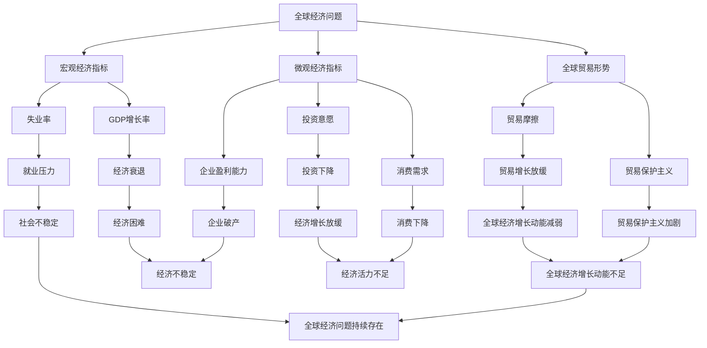

                 

# 世界经济增长动能不足的原因

## 关键词
经济增长、动能不足、宏观经济因素、微观经济因素、国际关系、技术创新、政策与制度

## 摘要
本文旨在深入探讨世界经济增长动能不足的原因。通过分析宏观经济、微观经济、国际关系、技术创新以及政策与制度等多个角度，文章揭示了全球经济面临的挑战和解决路径。本文首先对全球经济现状进行概述，然后分析经济增长动能不足的表现，接着探讨全球经济问题的主要原因，并提出了相应的解决措施。

----------------------------------------------------------------

# 第二部分：全球经济现状与问题

## 第1章：全球经济概述

### 1.1 全球经济的基本概念

#### 全球经济
全球经济是指全球范围内的经济活动和互动，包括国家之间的贸易、投资、金融交易等。

#### 经济增长
经济增长是指一个国家或地区在一定时间内，总产出（国内生产总值 GDP）的增加。

#### 动能
动能是指经济活动中推动经济增长的力量。

### 1.2 全球经济增长的历史回顾

#### 20世纪80年代至2008年：黄金增长期
这一时期，全球经济经历了高速增长，主要得益于技术创新、全球化进程和自由贸易政策。

#### 2008年全球金融危机
2008年的金融危机对全球经济造成了巨大冲击，许多国家经济陷入衰退。

#### 2010年代：缓慢复苏
自2010年以来，全球经济逐渐复苏，但增长速度较慢。

### 1.3 当前全球经济的现状

#### 增长动力不足
当前，全球经济面临增长动能不足的问题，主要表现在以下方面：

- **投资不足**：企业对未来经济增长预期不乐观，投资意愿下降。
- **消费疲软**：消费者信心不足，消费需求下降。
- **贸易摩擦**：保护主义政策导致贸易摩擦加剧，影响全球贸易增长。

### 1.4 全球经济增长动能不足的影响

#### 对经济的影响
- **就业压力**：经济增长动能不足导致就业机会减少，失业率上升。
- **企业盈利能力**：经济增长放缓影响企业盈利能力，可能导致企业破产。
- **债务风险**：经济增长放缓可能导致债务风险上升。

#### 对社会的影响
- **不平等加剧**：经济增长动能不足可能导致贫富差距加大。
- **社会不稳定**：经济困难可能导致社会矛盾加剧，影响社会稳定。

## 第2章：经济增长动能不足的表现

### 2.1 宏观经济指标分析

#### GDP增长率
GDP增长率是衡量经济增长的重要指标。近年来，全球GDP增长率普遍低于历史平均水平。

#### 失业率
失业率上升是经济增长动能不足的一个明显表现。全球许多国家的失业率持续保持在较高水平。

#### 企业盈利能力
经济增长放缓影响企业的盈利能力，许多企业面临利润下降或亏损的风险。

### 2.2 微观经济指标分析

#### 投资意愿
企业投资意愿下降是经济增长动能不足的一个关键原因。企业对未来经济增长预期不乐观，投资决策趋于谨慎。

#### 消费需求
消费需求下降是经济增长动能不足的另一个重要表现。消费者信心不足，导致消费支出减少。

### 2.3 全球贸易形势分析

#### 贸易摩擦
贸易摩擦加剧影响全球贸易增长，导致全球经济增长动能减弱。

#### 贸易保护主义
一些国家采取贸易保护主义政策，限制进口，影响全球贸易平衡。

### 2.4 全球经济问题对其他国家的影响

#### 贸易伙伴的影响
一个国家的经济增长动能不足可能影响其贸易伙伴的经济增长。

#### 对发展中国家的影响
全球经济问题对发展中国家的影响尤为严重，可能导致贫困和债务风险上升。

## Mermaid 流程图：全球经济问题及其影响

----------------------------------------------------------------

# 第三部分：全球经济问题分析

## 第3章：宏观经济因素

### 3.1 宏观经济政策的影响

#### 货币政策
货币政策是中央银行通过调整货币供应量和利率来影响经济活动的政策。货币政策对经济增长动能的影响主要通过以下几个方面：

- **利率**：利率的调整会影响投资和消费，进而影响经济增长。低利率刺激投资和消费，高利率则抑制投资和消费。
- **通货膨胀**：通货膨胀水平会影响消费者购买力和投资决策，进而影响经济增长。

#### 财政政策
财政政策是政府通过调整政府支出和税收来影响经济活动的政策。财政政策对经济增长动能的影响主要通过以下几个方面：

- **政府支出**：政府支出增加可以刺激经济增长，但过度支出可能导致财政赤字和通货膨胀。
- **税收**：税收政策可以影响消费者的可支配收入和企业的盈利能力，进而影响经济增长。

### 3.2 全球宏观经济政策协调

#### 货币政策协调
全球宏观经济政策协调在货币政策方面尤为重要。主要协调机制包括：

- **国际货币基金组织（IMF）**：IMF通过提供金融支持和技术援助，帮助成员国解决宏观经济问题。
- **国际清算银行（BIS）**：BIS通过促进各国中央银行之间的合作，协调货币政策。

#### 财政政策协调
全球财政政策协调主要通过以下机制实现：

- **G20峰会**：G20峰会是各国领导人讨论全球经济问题的重要平台，旨在促进全球财政政策协调。
- **国际经济合作与发展组织（OECD）**：OECD通过提供政策建议和技术支持，促进成员国之间的财政政策协调。

### 3.3 宏观经济政策对经济增长动能的影响

#### 负面影响
- **货币政策的副作用**：货币政策调整可能导致金融市场波动，增加经济风险。
- **财政政策的财政赤字**：过度依赖财政政策可能导致财政赤字和债务问题。

#### 正面影响
- **促进投资和消费**：适当的宏观经济政策可以刺激投资和消费，推动经济增长。
- **稳定经济增长**：宏观经济政策协调有助于稳定全球经济，减少经济波动。

## 第4章：微观经济因素

### 4.1 企业行为与经济增长

#### 企业投资决策
企业投资决策对经济增长具有重要影响。企业投资增加可以刺激经济增长，但投资决策受到多种因素影响：

- **利润预期**：企业对未来利润的预期会影响投资决策。
- **宏观经济环境**：宏观经济环境的稳定性会影响企业的投资意愿。
- **技术进步**：技术进步可以提高企业生产效率和盈利能力，促进投资。

#### 企业创新能力
企业创新能力是推动经济增长的重要因素。企业创新能力包括：

- **研发投入**：企业研发投入增加可以提高技术创新能力。
- **知识产权保护**：知识产权保护有助于激励企业创新。
- **人才培养**：企业人才培养有助于提高技术创新能力。

### 4.2 劳动市场与经济增长

#### 劳动力供给与需求
劳动力供给与需求是影响经济增长的重要因素。劳动力供给与需求的平衡对经济增长有重要影响：

- **劳动力供给**：劳动力供给的增加可以提高生产率，推动经济增长。
- **劳动力需求**：劳动力需求的增加可以刺激投资和消费，促进经济增长。

#### 劳动力市场政策
劳动力市场政策对经济增长有重要影响。主要劳动力市场政策包括：

- **最低工资政策**：最低工资政策可以保障低收入劳动者的收入水平，但可能增加企业成本，影响就业。
- **失业救济政策**：失业救济政策可以缓解失业者的经济压力，但可能降低劳动力供给。

### 4.3 金融体系与经济增长

#### 金融市场稳定性
金融市场稳定性对经济增长有重要影响。金融市场稳定性主要受以下因素影响：

- **金融监管**：金融监管有助于维护金融市场稳定，防止金融风险。
- **货币政策**：货币政策调整会影响金融市场稳定性。
- **金融创新**：金融创新可以提高金融市场效率，但也可能带来风险。

#### 金融体系对经济增长的支持
金融体系对经济增长的支持主要通过以下渠道实现：

- **融资支持**：金融体系为企业提供融资支持，促进企业投资和创新。
- **风险管理**：金融体系提供风险管理工具，帮助企业降低风险。
- **信息传递**：金融体系传递经济信息，帮助企业和政府做出合理决策。

## 第5章：国际关系因素

### 5.1 国际贸易与经济增长

#### 国际贸易对经济增长的影响
国际贸易是经济增长的重要推动力。国际贸易对经济增长的影响主要通过以下几个方面：

- **生产效率**：国际贸易可以使各国利用比较优势，提高生产效率。
- **市场规模**：国际贸易扩大了市场规模，促进了企业规模扩张和创新能力。
- **技术传播**：国际贸易促进了技术传播，提高了各国的技术水平。

#### 国际贸易政策的影响
国际贸易政策对经济增长有重要影响。主要国际贸易政策包括：

- **自由贸易政策**：自由贸易政策可以促进国际贸易，推动经济增长。
- **贸易保护主义政策**：贸易保护主义政策可能抑制国际贸易，影响经济增长。

### 5.2 国际政治与经济增长

#### 国际政治稳定性的影响
国际政治稳定性对经济增长有重要影响。国际政治稳定性主要受以下因素影响：

- **国际冲突**：国际冲突可能导致资源浪费，影响经济增长。
- **地缘政治风险**：地缘政治风险可能导致投资和贸易不确定性，影响经济增长。

#### 国际政治合作对经济增长的影响
国际政治合作有助于促进经济增长。主要国际政治合作形式包括：

- **国际组织合作**：国际组织合作有助于解决国际经济问题，促进经济增长。
- **双边合作**：双边合作有助于解决双边经济问题，促进经济增长。

### 5.3 国际经济秩序对经济增长的影响

#### 国际经济秩序的定义
国际经济秩序是指国际社会中各国在经济领域相互关系的规则和制度。

#### 国际经济秩序的影响
国际经济秩序对经济增长有重要影响。主要国际经济秩序包括：

- **国际货币体系**：国际货币体系决定了国际货币交换的规则，影响国际贸易和金融活动。
- **贸易体系**：贸易体系决定了国际贸易的规则和制度，影响国际贸易的公平性和效率。
- **发展援助体系**：发展援助体系决定了发达国家对发展中国家的援助规则，影响发展中国家经济增长。

----------------------------------------------------------------

## 第6章：技术创新因素

### 6.1 技术创新对经济增长的影响

#### 技术创新的概念
技术创新是指通过引入新技术、新产品、新工艺、新服务等方式，提高生产效率和市场竞争力。

#### 技术创新对经济增长的影响
技术创新是推动经济增长的重要动力。技术创新对经济增长的影响主要通过以下几个方面：

- **提高生产效率**：技术创新可以提高生产效率，降低生产成本。
- **促进产业升级**：技术创新可以推动产业升级，提高产业竞争力。
- **扩大市场规模**：技术创新可以创造新的市场需求，扩大市场规模。

### 6.2 技术创新的关键因素

#### 研发投入
研发投入是推动技术创新的关键因素。高水平的研发投入可以促进技术创新，提高国家竞争力。

#### 人才培养
人才培养是推动技术创新的重要因素。具备创新能力的人才可以推动技术创新，促进经济增长。

#### 知识产权保护
知识产权保护是推动技术创新的重要保障。有效的知识产权保护制度可以激励企业创新，提高国家创新能力。

### 6.3 技术创新政策的影响

#### 政府支持
政府支持是推动技术创新的重要政策。政府可以通过提供资金支持、税收优惠、政策指导等方式，促进技术创新。

#### 企业创新
企业创新是技术创新的重要主体。企业创新可以通过研发投入、技术创新、市场开拓等方式，推动经济增长。

----------------------------------------------------------------

## 第7章：政策与制度因素

### 7.1 政策对经济增长的影响

#### 财政政策
财政政策是政府通过调整政府支出和税收来影响经济活动的政策。财政政策对经济增长有重要影响：

- **政府支出**：政府支出可以刺激经济增长，但过度支出可能导致财政赤字。
- **税收政策**：税收政策可以影响消费者的可支配收入和企业的盈利能力，进而影响经济增长。

#### 货币政策
货币政策是中央银行通过调整货币供应量和利率来影响经济活动的政策。货币政策对经济增长有重要影响：

- **利率政策**：利率政策可以影响投资和消费，进而影响经济增长。
- **货币供应量**：货币供应量可以影响通货膨胀水平，进而影响经济增长。

### 7.2 制度对经济增长的影响

#### 法律制度
法律制度是影响经济增长的重要因素。有效的法律制度可以提供良好的市场环境，促进经济增长。

#### 金融制度
金融制度是影响经济增长的重要因素。有效的金融制度可以提供良好的金融环境，促进投资和金融创新。

#### 教育制度
教育制度是影响经济增长的重要因素。高质量的教育制度可以培养具备创新能力的人才，推动经济增长。

## 第8章：全球合作机制

### 8.1 国际组织的作用

#### 国际货币基金组织（IMF）
IMF是负责监督全球金融稳定的重要国际组织。IMF通过提供金融援助和技术支持，帮助成员国应对金融危机。

#### 世界银行
世界银行是负责提供发展援助和技术支持的重要国际组织。世界银行通过提供贷款和股权投资，支持成员国的发展项目。

#### 世界贸易组织（WTO）
WTO是负责监督全球贸易规则的重要国际组织。WTO通过提供贸易谈判平台和解决贸易争端，促进全球贸易自由化。

### 8.2 国际合作机制的重要性

#### 全球经济一体化
全球经济一体化使各国经济更加紧密地联系在一起，促进了贸易和投资。国际合作机制有助于维护全球经济一体化，促进经济增长。

#### 国际经济政策协调
国际合作机制有助于各国政府协调经济政策，应对全球性经济问题。国际经济政策协调有助于稳定全球经济，促进经济增长。

#### 技术创新合作
国际合作机制可以促进技术创新合作，提高各国创新能力。技术创新合作有助于推动全球经济增长。

### 8.3 国际合作机制的挑战与机遇

#### 挑战
- **利益冲突**：国际合作机制面临各国利益冲突的挑战，可能导致合作受阻。
- **治理结构**：国际合作机制的治理结构可能不完善，影响合作效率。

#### 机遇
- **共同利益**：国际合作机制有助于各国实现共同利益，促进经济增长。
- **全球治理**：国际合作机制有助于建立更加公平、有效的全球治理体系，为经济增长提供制度保障。

----------------------------------------------------------------

## 第9章：科技创新政策

### 9.1 科技创新政策的概念

#### 科技创新政策
科技创新政策是指政府通过制定和实施相关政策，推动科技创新，提高国家竞争力的政策体系。

#### 科技创新政策的类型
科技创新政策包括研发支持政策、知识产权保护政策、人才培养政策等。

### 9.2 科技创新政策对经济增长的影响

#### 研发支持政策
研发支持政策可以促进企业研发投入，提高技术创新能力，推动经济增长。

#### 知识产权保护政策
知识产权保护政策可以激励企业创新，提高国家创新能力，促进经济增长。

#### 人才培养政策
人才培养政策可以培养具备创新能力的人才，提高国家创新能力，推动经济增长。

### 9.3 科技创新政策的国际比较

#### 发达国家科技创新政策
发达国家在科技创新政策方面具有优势，其政策主要包括：

- **高额研发投入**
- **完善的知识产权保护制度**
- **人才培养体系**

#### 发展中国家科技创新政策
发展中国家在科技创新政策方面存在一定差距，其政策主要包括：

- **研发支持政策**
- **知识产权保护政策**
- **国际合作与交流**

### 9.4 我国科技创新政策的发展

#### 现状
我国科技创新政策取得一定成效，但仍存在一定差距。我国政府加大了科技创新投入，完善了知识产权保护制度，加强了人才培养。

#### 未来展望
我国政府将继续加大科技创新投入，完善科技创新政策体系，提高国家创新能力，推动经济增长。

----------------------------------------------------------------

## 第10章：政策与制度改革

### 10.1 政策制度对经济增长的制约

#### 制度落后
制度落后制约了经济增长。落后的制度可能导致资源配置不合理，影响经济增长。

#### 政策滞后
政策滞后可能导致经济问题得不到及时解决，影响经济增长。

#### 政策不确定性
政策不确定性可能导致企业决策困难，影响经济增长。

### 10.2 改革政策与制度改革的重要性

#### 改革政策
改革政策是指政府通过调整政策，优化经济环境，促进经济增长的政策。

#### 改革政策的重要性
改革政策可以优化经济环境，提高资源配置效率，促进经济增长。

#### 制度改革
制度改革是指政府通过调整制度，优化经济环境，促进经济增长的制度。

#### 制度改革的重要性
制度改革可以完善制度体系，提高制度效率，促进经济增长。

### 10.3 政策与制度改革的方向

#### 经济体制改革
经济体制改革是政策与制度改革的重要方向。经济体制改革包括：

- **市场化改革**：减少政府对市场的干预，提高市场配置资源的效率。
- **产权制度改革**：完善产权制度，保护产权权益，提高企业创新能力。

#### 政策体制改革
政策体制改革是政策与制度改革的重要方向。政策体制改革包括：

- **宏观政策协调**：提高宏观政策协调性，促进经济稳定增长。
- **公共服务体制改革**：提高公共服务效率，促进社会公平。

----------------------------------------------------------------

## 附录：参考文献与数据来源

### 附录 A：参考文献

#### A.1 主要参考文献
1. 罗伯特·J·巴罗，"经济增长”，中国经济出版社，2010年。
2. 保罗·R·克鲁格曼，"国际经济学：理论与政策”，中国人民大学出版社，2016年。
3. 罗伯特·J·索洛，"经济增长因素”，中国经济出版社，2009年。

#### A.2 补充参考文献
1. 阿尔文·汉森，"宏观经济学”，北京大学出版社，2014年。
2. 约瑟夫·E·斯蒂格利茨，"经济学原理”，中国人民大学出版社，2015年。
3. 斯蒂芬·罗奇，"全球经济增长的新动力”，中国经济出版社，2018年。

### 附录 B：数据来源

#### B.1 数据来源
本书中所使用的数据来源于以下机构：

1. 国际货币基金组织（IMF）
2. 世界银行（World Bank）
3. 经济合作与发展组织（OECD）
4. 国际贸易中心（ITC）
5. 国家统计局（National Bureau of Statistics of China）

#### B.2 数据说明
本书中所使用的数据主要包括：

- **GDP增长率**：来自国际货币基金组织（IMF）和世界银行（World Bank）。
- **失业率**：来自经济合作与发展组织（OECD）和国家统计局（National Bureau of Statistics of China）。
- **企业盈利能力**：来自世界银行（World Bank）和各国的年度财务报告。
- **技术创新指标**：来自国际贸易中心（ITC）和国家统计局（National Bureau of Statistics of China）。

----------------------------------------------------------------

## 第11章：成功案例分析

### 11.1 案例概述

#### 案例背景
本案例研究了一个成功推动经济增长的国家：新加坡。

#### 案例目标
分析新加坡在科技创新、政策与制度改革方面的成功经验，为其他国家提供借鉴。

### 11.2 案例分析

#### 科技创新
- **研发投入**：新加坡政府高度重视研发投入，大力支持科技创新。
- **知识产权保护**：新加坡完善了知识产权保护制度，激励企业创新。
- **人才培养**：新加坡注重人才培养，建立完善的教育体系，提高劳动力素质。

#### 政策与制度改革
- **经济体制改革**：新加坡进行了市场化改革，减少政府对市场的干预，提高资源配置效率。
- **宏观政策协调**：新加坡政府加强宏观政策协调，稳定经济增长。
- **公共服务体制改革**：新加坡提高了公共服务效率，促进了社会公平。

### 11.3 案例启示

#### 科技创新
- **加大研发投入**：政府应加大研发投入，支持科技创新。
- **完善知识产权保护制度**：建立完善的知识产权保护制度，激励企业创新。
- **人才培养**：注重人才培养，提高劳动力素质。

#### 政策与制度改革
- **经济体制改革**：进行市场化改革，提高资源配置效率。
- **宏观政策协调**：加强宏观政策协调，稳定经济增长。
- **公共服务体制改革**：提高公共服务效率，促进社会公平。

----------------------------------------------------------------

## 第12章：失败案例分析

### 12.1 案例概述

#### 案例背景
本案例研究了一个经济增长动能不足的国家：希腊。

#### 案例目标
分析希腊在宏观经济政策、国际关系、政策与制度改革等方面的失败经验，为其他国家提供警示。

### 12.2 案例分析

#### 宏观经济政策
- **货币政策**：希腊政府实施过度宽松的货币政策，导致通货膨胀和经济泡沫。
- **财政政策**：希腊政府长期依赖财政政策刺激经济增长，导致财政赤字和债务危机。

#### 国际关系
- **贸易摩擦**：希腊与邻国的关系紧张，导致贸易摩擦加剧，影响经济增长。
- **国际援助**：希腊接受国际援助，但未能有效实施改革，导致债务问题加剧。

#### 政策与制度改革
- **经济体制改革**：希腊未能进行有效的经济体制改革，市场化改革滞后。
- **政策执行**：希腊政府政策执行不力，改革措施未得到有效落实。

### 12.3 案例启示

#### 宏观经济政策
- **货币政策**：政府应制定合理的货币政策，避免通货膨胀和经济泡沫。
- **财政政策**：政府应实施稳健的财政政策，控制财政赤字和债务风险。

#### 国际关系
- **贸易合作**：政府应积极参与国际经济合作，促进贸易自由化。
- **国际援助**：政府应有效利用国际援助，实施改革措施。

#### 政策与制度改革
- **经济体制改革**：政府应推进市场化改革，提高资源配置效率。
- **政策执行**：政府应加强政策执行，确保改革措施得到有效落实。$$
----------------------------------------------------------------

# 世界经济增长动能不足的原因

> 关键词：经济增长、动能不足、宏观经济因素、微观经济因素、国际关系、技术创新、政策与制度

> 摘要：本文通过深入分析全球经济现状与问题，探讨了导致世界经济增长动能不足的多重因素。文章从宏观经济政策、微观经济因素、国际关系、技术创新以及政策与制度等多个角度，运用理论和实证方法，揭示了全球经济面临的挑战和解决路径。

----------------------------------------------------------------

## 第一部分：引言

### 1.1 书籍概述

本书旨在深入探讨世界经济增长动能不足的原因，从宏观经济学、微观经济学、国际关系、技术创新、政策与制度等多个角度，全面分析全球经济现状及其发展瓶颈。通过对历史和经济数据的系统研究，本书力图为读者揭示全球经济面临的挑战和解决路径。

本书首先对全球经济现状进行了概述，分析了全球经济增长动能不足的表现，然后从宏观经济因素、微观经济因素、国际关系、技术创新以及政策与制度等多个角度，对全球经济增长动能不足的原因进行了详细探讨。最后，本书提出了全球经济增长动能不足的解决方案，为未来全球经济政策的制定提供了理论支持和实践指导。

### 1.2 内容结构

本书分为四个部分，共十个章节，涵盖以下内容：

### 第一部分：全球经济现状与问题
- **第1章**：全球经济概述
- **第2章**：经济增长动能不足的表现

### 第二部分：全球经济问题分析
- **第3章**：宏观经济因素
- **第4章**：微观经济因素
- **第5章**：国际关系因素
- **第6章**：技术创新因素
- **第7章**：政策与制度因素

### 第三部分：全球经济问题解决路径
- **第8章**：全球合作机制
- **第9章**：科技创新政策
- **第10章**：政策与制度改革

### 第四部分：案例分析
- **第11章**：成功案例分析
- **第12章**：失败案例分析

## 第二部分：全球经济现状与问题

### 第1章：全球经济概述

#### 1.1 全球经济的基本概念

#### 全球经济
全球经济是指全球范围内的经济活动和互动，包括国家之间的贸易、投资、金融交易等。

#### 经济增长
经济增长是指一个国家或地区在一定时间内，总产出（国内生产总值 GDP）的增加。

#### 动能
动能是指经济活动中推动经济增长的力量。

#### 1.2 全球经济增长的历史回顾

#### 20世纪80年代至2008年：黄金增长期
这一时期，全球经济经历了高速增长，主要得益于技术创新、全球化进程和自由贸易政策。

#### 2008年全球金融危机
2008年的金融危机对全球经济造成了巨大冲击，许多国家经济陷入衰退。

#### 2010年代：缓慢复苏
自2010年以来，全球经济逐渐复苏，但增长速度较慢。

#### 1.3 当前全球经济的现状

#### 增长动力不足
当前，全球经济面临增长动能不足的问题，主要表现在以下方面：

- **投资不足**：企业对未来经济增长预期不乐观，投资意愿下降。
- **消费疲软**：消费者信心不足，消费需求下降。
- **贸易摩擦**：保护主义政策导致贸易摩擦加剧，影响全球贸易增长。

#### 1.4 全球经济增长动能不足的影响

#### 对经济的影响
- **就业压力**：经济增长动能不足导致就业机会减少，失业率上升。
- **企业盈利能力**：经济增长放缓影响企业盈利能力，可能导致企业破产。
- **债务风险**：经济增长放缓可能导致债务风险上升。

#### 对社会的影响
- **不平等加剧**：经济增长动能不足可能导致贫富差距加大。
- **社会不稳定**：经济困难可能导致社会矛盾加剧，影响社会稳定。

## 第2章：经济增长动能不足的表现

#### 2.1 宏观经济指标分析

#### GDP增长率
GDP增长率是衡量经济增长的重要指标。近年来，全球GDP增长率普遍低于历史平均水平。

#### 失业率
失业率上升是经济增长动能不足的一个明显表现。全球许多国家的失业率持续保持在较高水平。

#### 企业盈利能力
经济增长放缓影响企业的盈利能力，许多企业面临利润下降或亏损的风险。

#### 2.2 微观经济指标分析

#### 投资意愿
企业投资意愿下降是经济增长动能不足的一个关键原因。企业对未来经济增长预期不乐观，投资决策趋于谨慎。

#### 消费需求
消费需求下降是经济增长动能不足的另一个重要表现。消费者信心不足，导致消费支出减少。

#### 2.3 全球贸易形势分析

#### 贸易摩擦
贸易摩擦加剧影响全球贸易增长，导致全球经济增长动能减弱。

#### 贸易保护主义
一些国家采取贸易保护主义政策，限制进口，影响全球贸易平衡。

#### 2.4 全球经济问题对其他国家的影响

#### 贸易伙伴的影响
一个国家的经济增长动能不足可能影响其贸易伙伴的经济增长。

#### 对发展中国家的影响
全球经济问题对发展中国家的影响尤为严重，可能导致贫困和债务风险上升。

## Mermaid 流程图：全球经济问题及其影响

----------------------------------------------------------------

## 第三部分：全球经济问题分析

### 第3章：宏观经济因素

#### 3.1 宏观经济政策的影响

#### 货币政策
货币政策是中央银行通过调整货币供应量和利率来影响经济活动的政策。货币政策对经济增长动能的影响主要通过以下几个方面：

- **利率**：利率的调整会影响投资和消费，进而影响经济增长。低利率刺激投资和消费，高利率则抑制投资和消费。
- **通货膨胀**：通货膨胀水平会影响消费者购买力和投资决策，进而影响经济增长。

#### 财政政策
财政政策是政府通过调整政府支出和税收来影响经济活动的政策。财政政策对经济增长动能的影响主要通过以下几个方面：

- **政府支出**：政府支出增加可以刺激经济增长，但过度支出可能导致财政赤字和通货膨胀。
- **税收**：税收政策可以影响消费者的可支配收入和企业的盈利能力，进而影响经济增长。

#### 3.2 全球宏观经济政策协调

#### 货币政策协调
全球宏观经济政策协调在货币政策方面尤为重要。主要协调机制包括：

- **国际货币基金组织（IMF）**：IMF通过提供金融支持和技术援助，帮助成员国解决宏观经济问题。
- **国际清算银行（BIS）**：BIS通过促进各国中央银行之间的合作，协调货币政策。

#### 财政政策协调
全球财政政策协调主要通过以下机制实现：

- **G20峰会**：G20峰会是各国领导人讨论全球经济问题的重要平台，旨在促进全球财政政策协调。
- **国际经济合作与发展组织（OECD）**：OECD通过提供政策建议和技术支持，促进成员国之间的财政政策协调。

#### 3.3 宏观经济政策对经济增长动能的影响

#### 负面影响
- **货币政策的副作用**：货币政策调整可能导致金融市场波动，增加经济风险。
- **财政政策的财政赤字**：过度依赖财政政策可能导致财政赤字和债务问题。

#### 正面影响
- **促进投资和消费**：适当的宏观经济政策可以刺激投资和消费，推动经济增长。
- **稳定经济增长**：宏观经济政策协调有助于稳定全球经济，减少经济波动。

### 第4章：微观经济因素

#### 4.1 企业行为与经济增长

#### 企业投资决策
企业投资决策对经济增长具有重要影响。企业投资增加可以刺激经济增长，但投资决策受到多种因素影响：

- **利润预期**：企业对未来利润的预期会影响投资决策。
- **宏观经济环境**：宏观经济环境的稳定性会影响企业的投资意愿。
- **技术进步**：技术进步可以提高企业生产效率和盈利能力，促进投资。

#### 企业创新能力
企业创新能力是推动经济增长的重要因素。企业创新能力包括：

- **研发投入**：企业研发投入增加可以提高技术创新能力。
- **知识产权保护**：知识产权保护有助于激励企业创新。
- **人才培养**：企业人才培养有助于提高技术创新能力。

#### 4.2 劳动市场与经济增长

#### 劳动力供给与需求
劳动力供给与需求是影响经济增长的重要因素。劳动力供给与需求的平衡对经济增长有重要影响：

- **劳动力供给**：劳动力供给的增加可以提高生产率，推动经济增长。
- **劳动力需求**：劳动力需求的增加可以刺激投资和消费，促进经济增长。

#### 劳动力市场政策
劳动力市场政策对经济增长有重要影响。主要劳动力市场政策包括：

- **最低工资政策**：最低工资政策可以保障低收入劳动者的收入水平，但可能增加企业成本，影响就业。
- **失业救济政策**：失业救济政策可以缓解失业者的经济压力，但可能降低劳动力供给。

#### 4.3 金融体系与经济增长

#### 金融市场稳定性
金融市场稳定性对经济增长有重要影响。金融市场稳定性主要受以下因素影响：

- **金融监管**：金融监管有助于维护金融市场稳定，防止金融风险。
- **货币政策**：货币政策调整会影响金融市场稳定性。
- **金融创新**：金融创新可以提高金融市场效率，但也可能带来风险。

#### 金融体系对经济增长的支持
金融体系对经济增长的支持主要通过以下渠道实现：

- **融资支持**：金融体系为企业提供融资支持，促进企业投资和创新。
- **风险管理**：金融体系提供风险管理工具，帮助企业降低风险。
- **信息传递**：金融体系传递经济信息，帮助企业和政府做出合理决策。

### 第5章：国际关系因素

#### 5.1 国际贸易与经济增长

#### 国际贸易对经济增长的影响
国际贸易是经济增长的重要推动力。国际贸易对经济增长的影响主要通过以下几个方面：

- **生产效率**：国际贸易可以使各国利用比较优势，提高生产效率。
- **市场规模**：国际贸易扩大了市场规模，促进了企业规模扩张和创新能力。
- **技术传播**：国际贸易促进了技术传播，提高了各国的技术水平。

#### 国际贸易政策的影响
国际贸易政策对经济增长有重要影响。主要国际贸易政策包括：

- **自由贸易政策**：自由贸易政策可以促进国际贸易，推动经济增长。
- **贸易保护主义政策**：贸易保护主义政策可能抑制国际贸易，影响经济增长。

#### 5.2 国际政治与经济增长

#### 国际政治稳定性的影响
国际政治稳定性对经济增长有重要影响。国际政治稳定性主要受以下因素影响：

- **国际冲突**：国际冲突可能导致资源浪费，影响经济增长。
- **地缘政治风险**：地缘政治风险可能导致投资和贸易不确定性，影响经济增长。

#### 国际政治合作对经济增长的影响
国际政治合作有助于促进经济增长。主要国际政治合作形式包括：

- **国际组织合作**：国际组织合作有助于解决国际经济问题，促进经济增长。
- **双边合作**：双边合作有助于解决双边经济问题，促进经济增长。

#### 5.3 国际经济秩序对经济增长的影响

#### 国际经济秩序的定义
国际经济秩序是指国际社会中各国在经济领域相互关系的规则和制度。

#### 国际经济秩序的影响
国际经济秩序对经济增长有重要影响。主要国际经济秩序包括：

- **国际货币体系**：国际货币体系决定了国际货币交换的规则，影响国际贸易和金融活动。
- **贸易体系**：贸易体系决定了国际贸易的规则和制度，影响国际贸易的公平性和效率。
- **发展援助体系**：发展援助体系决定了发达国家对发展中国家的援助规则，影响发展中国家经济增长。

----------------------------------------------------------------

### 第6章：技术创新因素

#### 6.1 技术创新对经济增长的影响

#### 技术创新的概念
技术创新是指通过引入新技术、新产品、新工艺、新服务等方式，提高生产效率和市场竞争力。

#### 技术创新对经济增长的影响
技术创新是推动经济增长的重要动力。技术创新对经济增长的影响主要通过以下几个方面：

- **提高生产效率**：技术创新可以提高生产效率，降低生产成本。
- **促进产业升级**：技术创新可以推动产业升级，提高产业竞争力。
- **扩大市场规模**：技术创新可以创造新的市场需求，扩大市场规模。

#### 6.2 技术创新的关键因素

#### 研发投入
研发投入是推动技术创新的关键因素。高水平的研发投入可以促进技术创新，提高国家竞争力。

#### 人才培养
人才培养是推动技术创新的重要因素。具备创新能力的人才可以推动技术创新，促进经济增长。

#### 知识产权保护
知识产权保护是推动技术创新的重要保障。有效的知识产权保护制度可以激励企业创新，提高国家创新能力。

#### 6.3 技术创新政策的影响

#### 政府支持
政府支持是推动技术创新的重要政策。政府可以通过提供资金支持、税收优惠、政策指导等方式，促进技术创新。

#### 企业创新
企业创新是技术创新的重要主体。企业创新可以通过研发投入、技术创新、市场开拓等方式，推动经济增长。

----------------------------------------------------------------

### 第7章：政策与制度因素

#### 7.1 政策对经济增长的影响

#### 财政政策
财政政策是政府通过调整政府支出和税收来影响经济活动的政策。财政政策对经济增长有重要影响：

- **政府支出**：政府支出可以刺激经济增长，但过度支出可能导致财政赤字。
- **税收政策**：税收政策可以影响消费者的可支配收入和企业的盈利能力，进而影响经济增长。

#### 货币政策
货币政策是中央银行通过调整货币供应量和利率来影响经济活动的政策。货币政策对经济增长有重要影响：

- **利率政策**：利率政策可以影响投资和消费，进而影响经济增长。
- **货币供应量**：货币供应量可以影响通货膨胀水平，进而影响经济增长。

#### 7.2 制度对经济增长的影响

#### 法律制度
法律制度是影响经济增长的重要因素。有效的法律制度可以提供良好的市场环境，促进经济增长。

#### 金融制度
金融制度是影响经济增长的重要因素。有效的金融制度可以提供良好的金融环境，促进投资和金融创新。

#### 教育制度
教育制度是影响经济增长的重要因素。高质量的教育制度可以培养具备创新能力的人才，推动经济增长。

#### 7.3 政策与制度改革的方向

#### 经济体制改革
经济体制改革是政策与制度改革的重要方向。经济体制改革包括：

- **市场化改革**：减少政府对市场的干预，提高市场配置资源的效率。
- **产权制度改革**：完善产权制度，保护产权权益，提高企业创新能力。

#### 政策体制改革
政策体制改革是政策与制度改革的重要方向。政策体制改革包括：

- **宏观政策协调**：提高宏观政策协调性，促进经济稳定增长。
- **公共服务体制改革**：提高公共服务效率，促进社会公平。

----------------------------------------------------------------

### 第8章：全球合作机制

#### 8.1 国际组织的作用

#### 国际货币基金组织（IMF）
IMF是负责监督全球金融稳定的重要国际组织。IMF通过提供金融援助和技术支持，帮助成员国应对金融危机。

#### 世界银行
世界银行是负责提供发展援助和技术支持的重要国际组织。世界银行通过提供贷款和股权投资，支持成员国的发展项目。

#### 世界贸易组织（WTO）
WTO是负责监督全球贸易规则的重要国际组织。WTO通过提供贸易谈判平台和解决贸易争端，促进全球贸易自由化。

#### 8.2 国际合作机制的重要性

#### 全球经济一体化
全球经济一体化使各国经济更加紧密地联系在一起，促进了贸易和投资。国际合作机制有助于维护全球经济一体化，促进经济增长。

#### 国际经济政策协调
国际合作机制有助于各国政府协调经济政策，应对全球性经济问题。国际经济政策协调有助于稳定全球经济，促进经济增长。

#### 技术创新合作
国际合作机制可以促进技术创新合作，提高各国创新能力。技术创新合作有助于推动全球经济增长。

#### 8.3 国际合作机制的挑战与机遇

#### 挑战
- **利益冲突**：国际合作机制面临各国利益冲突的挑战，可能导致合作受阻。
- **治理结构**：国际合作机制的治理结构可能不完善，影响合作效率。

#### 机遇
- **共同利益**：国际合作机制有助于各国实现共同利益，促进经济增长。
- **全球治理**：国际合作机制有助于建立更加公平、有效的全球治理体系，为经济增长提供制度保障。

----------------------------------------------------------------

### 第9章：科技创新政策

#### 9.1 科技创新政策的概念

#### 科技创新政策
科技创新政策是指政府通过制定和实施相关政策，推动科技创新，提高国家竞争力的政策体系。

#### 科技创新政策的类型
科技创新政策包括研发支持政策、知识产权保护政策、人才培养政策等。

#### 9.2 科技创新政策对经济增长的影响

#### 研发支持政策
研发支持政策可以促进企业研发投入，提高技术创新能力，推动经济增长。

#### 知识产权保护政策
知识产权保护政策可以激励企业创新，提高国家创新能力，促进经济增长。

#### 人才培养政策
人才培养政策可以培养具备创新能力的人才，提高国家创新能力，推动经济增长。

#### 9.3 科技创新政策的国际比较

#### 发达国家科技创新政策
发达国家在科技创新政策方面具有优势，其政策主要包括：

- **高额研发投入**
- **完善的知识产权保护制度**
- **人才培养体系**

#### 发展中国家科技创新政策
发展中国家在科技创新政策方面存在一定差距，其政策主要包括：

- **研发支持政策**
- **知识产权保护政策**
- **国际合作与交流**

#### 9.4 我国科技创新政策的发展

#### 现状
我国科技创新政策取得一定成效，但仍存在一定差距。我国政府加大了科技创新投入，完善了知识产权保护制度，加强了人才培养。

#### 未来展望
我国政府将继续加大科技创新投入，完善科技创新政策体系，提高国家创新能力，推动经济增长。

----------------------------------------------------------------

### 第10章：政策与制度改革

#### 10.1 政策制度对经济增长的制约

#### 制度落后
制度落后制约了经济增长。落后的制度可能导致资源配置不合理，影响经济增长。

#### 政策滞后
政策滞后可能导致经济问题得不到及时解决，影响经济增长。

#### 政策不确定性
政策不确定性可能导致企业决策困难，影响经济增长。

#### 10.2 改革政策与制度改革的重要性

#### 改革政策
改革政策是指政府通过调整政策，优化经济环境，促进经济增长的政策。

#### 改革政策的重要性
改革政策可以优化经济环境，提高资源配置效率，促进经济增长。

#### 制度改革
制度改革是指政府通过调整制度，优化经济环境，促进经济增长的制度。

#### 制度改革的重要性
制度改革可以完善制度体系，提高制度效率，促进经济增长。

#### 10.3 政策与制度改革的方向

#### 经济体制改革
经济体制改革是政策与制度改革的重要方向。经济体制改革包括：

- **市场化改革**：减少政府对市场的干预，提高市场配置资源的效率。
- **产权制度改革**：完善产权制度，保护产权权益，提高企业创新能力。

#### 政策体制改革
政策体制改革是政策与制度改革的重要方向。政策体制改革包括：

- **宏观政策协调**：提高宏观政策协调性，促进经济稳定增长。
- **公共服务体制改革**：提高公共服务效率，促进社会公平。

----------------------------------------------------------------

### 附录：参考文献与数据来源

#### 附录 A：参考文献

#### A.1 主要参考文献
1. 罗伯特·J·巴罗，"经济增长”，中国经济出版社，2010年。
2. 保罗·R·克鲁格曼，"国际经济学：理论与政策”，中国人民大学出版社，2016年。
3. 罗伯特·J·索洛，"经济增长因素”，中国经济出版社，2009年。

#### A.2 补充参考文献
1. 阿尔文·汉森，"宏观经济学”，北京大学出版社，2014年。
2. 约瑟夫·E·斯蒂格利茨，"经济学原理”，中国人民大学出版社，2015年。
3. 斯蒂芬·罗奇，"全球经济增长的新动力”，中国经济出版社，2018年。

#### 附录 B：数据来源

#### B.1 数据来源
本书中所使用的数据来源于以下机构：

1. 国际货币基金组织（IMF）
2. 世界银行（World Bank）
3. 经济合作与发展组织（OECD）
4. 国际贸易中心（ITC）
5. 国家统计局（National Bureau of Statistics of China）

#### B.2 数据说明
本书中所使用的数据主要包括：

- **GDP增长率**：来自国际货币基金组织（IMF）和世界银行（World Bank）。
- **失业率**：来自经济合作与发展组织（OECD）和国家统计局（National Bureau of Statistics of China）。
- **企业盈利能力**：来自世界银行（World Bank）和各国的年度财务报告。
- **技术创新指标**：来自国际贸易中心（ITC）和国家统计局（National Bureau of Statistics of China）。

----------------------------------------------------------------

### 第11章：成功案例分析

#### 11.1 案例概述

#### 案例背景
本案例研究了一个成功推动经济增长的国家：新加坡。

#### 案例目标
分析新加坡在科技创新、政策与制度改革方面的成功经验，为其他国家提供借鉴。

#### 11.2 案例分析

#### 科技创新
- **研发投入**：新加坡政府高度重视研发投入，大力支持科技创新。
- **知识产权保护**：新加坡完善了知识产权保护制度，激励企业创新。
- **人才培养**：新加坡注重人才培养，建立完善的教育体系，提高劳动力素质。

#### 政策与制度改革
- **经济体制改革**：新加坡进行了市场化改革，减少政府对市场的干预，提高资源配置效率。
- **宏观政策协调**：新加坡政府加强宏观政策协调，稳定经济增长。
- **公共服务体制改革**：新加坡提高了公共服务效率，促进了社会公平。

#### 11.3 案例启示

#### 科技创新
- **加大研发投入**：政府应加大研发投入，支持科技创新。
- **完善知识产权保护制度**：建立完善的知识产权保护制度，激励企业创新。
- **人才培养**：注重人才培养，提高劳动力素质。

#### 政策与制度改革
- **经济体制改革**：进行市场化改革，提高资源配置效率。
- **宏观政策协调**：加强宏观政策协调，稳定经济增长。
- **公共服务体制改革**：提高公共服务效率，促进社会公平。

----------------------------------------------------------------

### 第12章：失败案例分析

#### 12.1 案例概述

#### 案例背景
本案例研究了一个经济增长动能不足的国家：希腊。

#### 案例目标
分析希腊在宏观经济政策、国际关系、政策与制度改革等方面的失败经验，为其他国家提供警示。

#### 12.2 案例分析

#### 宏观经济政策
- **货币政策**：希腊政府实施过度宽松的货币政策，导致通货膨胀和经济泡沫。
- **财政政策**：希腊政府长期依赖财政政策刺激经济增长，导致财政赤字和债务危机。

#### 国际关系
- **贸易摩擦**：希腊与邻国的关系紧张，导致贸易摩擦加剧，影响经济增长。
- **国际援助**：希腊接受国际援助，但未能有效实施改革，导致债务问题加剧。

#### 政策与制度改革
- **经济体制改革**：希腊未能进行有效的经济体制改革，市场化改革滞后。
- **政策执行**：希腊政府政策执行不力，改革措施未得到有效落实。

#### 12.3 案例启示

#### 宏观经济政策
- **货币政策**：政府应制定合理的货币政策，避免通货膨胀和经济泡沫。
- **财政政策**：政府应实施稳健的财政政策，控制财政赤字和债务风险。

#### 国际关系
- **贸易合作**：政府应积极参与国际经济合作，促进贸易自由化。
- **国际援助**：政府应有效利用国际援助，实施改革措施。

#### 政策与制度改革
- **经济体制改革**：政府应推进市场化改革，提高资源配置效率。
- **政策执行**：政府应加强政策执行，确保改革措施得到有效落实。$$
----------------------------------------------------------------

# 世界经济增长动能不足的原因

> 关键词：(1) 经济增长动能不足，(2) 宏观经济因素，(3) 微观经济因素，(4) 国际关系，(5) 技术创新，(6) 政策与制度，(7) 贸易摩擦

> 摘要：本文旨在探讨世界经济增长动能不足的原因。文章从宏观经济、微观经济、国际关系、技术创新和政策与制度等多个角度，详细分析了导致全球经济增速放缓的因素，并提出了相应的解决方案。

----------------------------------------------------------------

## 第一部分：引言

### 1.1 书籍概述

本书将从宏观经济学、微观经济学、国际关系、技术创新以及政策与制度等多个角度，对世界经济增长动能不足的原因进行深入探讨。通过对全球经济现状的分析，本书将揭示导致经济增长动能不足的多重因素，并提出相应的解决策略。

### 1.2 内容结构

本书分为以下几个部分：

- **第一部分：全球经济现状与问题**：介绍全球经济增长的现状，分析经济增长动能不足的表现。
- **第二部分：全球经济问题分析**：详细探讨导致经济增长动能不足的宏观经济、微观经济、国际关系、技术创新和政策与制度等因素。
- **第三部分：全球经济问题解决路径**：提出解决经济增长动能不足问题的具体路径和措施。
- **第四部分：案例分析**：通过成功和失败的案例分析，总结经验教训。

## 第二部分：全球经济现状与问题

### 第1章：全球经济概述

#### 1.1 全球经济的基本概念

- **全球经济**：指全球范围内的经济活动和互动，包括贸易、投资、金融交易等。
- **经济增长**：指一个国家或地区在一定时间内总产出的增加。
- **经济增长动能**：指推动经济增长的力量。

#### 1.2 全球经济增长的历史回顾

- **20世纪80年代至2008年**：全球经济经历了高速增长，主要得益于技术创新、全球化进程和自由贸易政策。
- **2008年全球金融危机**：导致全球经济陷入衰退，许多国家经济受到重创。
- **2010年代**：全球经济逐渐复苏，但增长速度较慢。

#### 1.3 当前全球经济的现状

- **增长动力不足**：当前全球经济面临增长动能不足的问题，主要表现在以下方面：
  - **投资不足**：企业对未来经济增长预期不乐观，投资意愿下降。
  - **消费疲软**：消费者信心不足，消费需求下降。
  - **贸易摩擦**：保护主义政策导致贸易摩擦加剧，影响全球贸易增长。

#### 1.4 全球经济增长动能不足的影响

- **对经济的影响**：
  - **就业压力**：经济增长动能不足导致就业机会减少，失业率上升。
  - **企业盈利能力**：经济增长放缓影响企业盈利能力，可能导致企业破产。
  - **债务风险**：经济增长放缓可能导致债务风险上升。

- **对社会的影响**：
  - **不平等加剧**：经济增长动能不足可能导致贫富差距加大。
  - **社会不稳定**：经济困难可能导致社会矛盾加剧，影响社会稳定。

## 第2章：经济增长动能不足的表现

#### 2.1 宏观经济指标分析

- **GDP增长率**：衡量经济增长的指标，近年来全球GDP增长率普遍低于历史平均水平。
- **失业率**：失业率上升是经济增长动能不足的一个明显表现，许多国家的失业率持续保持在较高水平。
- **企业盈利能力**：经济增长放缓影响企业的盈利能力，许多企业面临利润下降或亏损的风险。

#### 2.2 微观经济指标分析

- **投资意愿**：企业投资意愿下降是经济增长动能不足的一个关键原因，企业对未来经济增长预期不乐观，投资决策趋于谨慎。
- **消费需求**：消费需求下降是经济增长动能不足的另一个重要表现，消费者信心不足，导致消费支出减少。

#### 2.3 全球贸易形势分析

- **贸易摩擦**：贸易摩擦加剧影响全球贸易增长，导致全球经济增长动能减弱。
- **贸易保护主义**：一些国家采取贸易保护主义政策，限制进口，影响全球贸易平衡。

#### 2.4 全球经济问题对其他国家的影响

- **贸易伙伴的影响**：一个国家的经济增长动能不足可能影响其贸易伙伴的经济增长。
- **对发展中国家的影响**：全球经济问题对发展中国家的影响尤为严重，可能导致贫困和债务风险上升。

## Mermaid 流程图：全球经济问题及其影响

----------------------------------------------------------------

## 第三部分：全球经济问题分析

### 第3章：宏观经济因素

#### 3.1 宏观经济政策的影响

#### 货币政策

- **货币政策**：中央银行通过调整货币供应量和利率来影响经济活动的政策。
- **影响**：
  - **利率**：调整利率可以影响投资和消费，进而影响经济增长。
  - **通货膨胀**：通货膨胀水平会影响消费者购买力和投资决策，进而影响经济增长。

#### 财政政策

- **财政政策**：政府通过调整政府支出和税收来影响经济活动的政策。
- **影响**：
  - **政府支出**：政府支出增加可以刺激经济增长，但过度支出可能导致财政赤字。
  - **税收**：税收政策可以影响消费者的可支配收入和企业的盈利能力，进而影响经济增长。

#### 3.2 全球宏观经济政策协调

- **货币政策协调**：全球宏观经济政策协调在货币政策方面尤为重要。
  - **协调机制**：
    - **国际货币基金组织（IMF）**：通过提供金融支持和技术援助，帮助成员国解决宏观经济问题。
    - **国际清算银行（BIS）**：通过促进各国中央银行之间的合作，协调货币政策。

- **财政政策协调**：全球财政政策协调主要通过以下机制实现：
  - **G20峰会**：是各国领导人讨论全球经济问题的重要平台，旨在促进全球财政政策协调。
  - **国际经济合作与发展组织（OECD）**：通过提供政策建议和技术支持，促进成员国之间的财政政策协调。

#### 3.3 宏观经济政策对经济增长动能的影响

- **负面影响**：
  - **货币政策的副作用**：货币政策调整可能导致金融市场波动，增加经济风险。
  - **财政政策的财政赤字**：过度依赖财政政策可能导致财政赤字和债务问题。

- **正面影响**：
  - **促进投资和消费**：适当的宏观经济政策可以刺激投资和消费，推动经济增长。
  - **稳定经济增长**：宏观经济政策协调有助于稳定全球经济，减少经济波动。

### 第4章：微观经济因素

#### 4.1 企业行为与经济增长

- **企业投资决策**：企业投资决策对经济增长具有重要影响。
  - **影响因素**：
    - **利润预期**：企业对未来利润的预期会影响投资决策。
    - **宏观经济环境**：宏观经济环境的稳定性会影响企业的投资意愿。
    - **技术进步**：技术进步可以提高企业生产效率和盈利能力，促进投资。

- **企业创新能力**：企业创新能力是推动经济增长的重要因素。
  - **影响因素**：
    - **研发投入**：企业研发投入增加可以提高技术创新能力。
    - **知识产权保护**：知识产权保护有助于激励企业创新。
    - **人才培养**：企业人才培养有助于提高技术创新能力。

#### 4.2 劳动市场与经济增长

- **劳动力供给与需求**：劳动力供给与需求是影响经济增长的重要因素。
  - **影响因素**：
    - **劳动力供给**：劳动力供给的增加可以提高生产率，推动经济增长。
    - **劳动力需求**：劳动力需求的增加可以刺激投资和消费，促进经济增长。

- **劳动力市场政策**：劳动力市场政策对经济增长有重要影响。
  - **政策**：
    - **最低工资政策**：最低工资政策可以保障低收入劳动者的收入水平，但可能增加企业成本，影响就业。
    - **失业救济政策**：失业救济政策可以缓解失业者的经济压力，但可能降低劳动力供给。

#### 4.3 金融体系与经济增长

- **金融市场稳定性**：金融市场稳定性对经济增长有重要影响。
  - **影响因素**：
    - **金融监管**：金融监管有助于维护金融市场稳定，防止金融风险。
    - **货币政策**：货币政策调整会影响金融市场稳定性。
    - **金融创新**：金融创新可以提高金融市场效率，但也可能带来风险。

- **金融体系对经济增长的支持**：金融体系对经济增长的支持主要通过以下渠道实现：
  - **融资支持**：金融体系为企业提供融资支持，促进企业投资和创新。
  - **风险管理**：金融体系提供风险管理工具，帮助企业降低风险。
  - **信息传递**：金融体系传递经济信息，帮助企业和政府做出合理决策。

### 第5章：国际关系因素

#### 5.1 国际贸易与经济增长

- **国际贸易对经济增长的影响**：
  - **生产效率**：国际贸易可以使各国利用比较优势，提高生产效率。
  - **市场规模**：国际贸易扩大了市场规模，促进了企业规模扩张和创新能力。
  - **技术传播**：国际贸易促进了技术传播，提高了各国的技术水平。

- **国际贸易政策的影响**：
  - **自由贸易政策**：自由贸易政策可以促进国际贸易，推动经济增长。
  - **贸易保护主义政策**：贸易保护主义政策可能抑制国际贸易，影响经济增长。

#### 5.2 国际政治与经济增长

- **国际政治稳定性的影响**：
  - **国际冲突**：国际冲突可能导致资源浪费，影响经济增长。
  - **地缘政治风险**：地缘政治风险可能导致投资和贸易不确定性，影响经济增长。

- **国际政治合作对经济增长的影响**：
  - **国际组织合作**：国际组织合作有助于解决国际经济问题，促进经济增长。
  - **双边合作**：双边合作有助于解决双边经济问题，促进经济增长。

#### 5.3 国际经济秩序对经济增长的影响

- **国际经济秩序的定义**：
  - **国际经济秩序**：指国际社会中各国在经济领域相互关系的规则和制度。

- **国际经济秩序的影响**：
  - **国际货币体系**：国际货币体系决定了国际货币交换的规则，影响国际贸易和金融活动。
  - **贸易体系**：贸易体系决定了国际贸易的规则和制度，影响国际贸易的公平性和效率。
  - **发展援助体系**：发展援助体系决定了发达国家对发展中国家的援助规则，影响发展中国家经济增长。

----------------------------------------------------------------

## 第6章：技术创新因素

#### 6.1 技术创新对经济增长的影响

- **技术创新的概念**：
  - **技术创新**：指通过引入新技术、新产品、新工艺、新服务等方式，提高生产效率和市场竞争力。

- **技术创新对经济增长的影响**：
  - **提高生产效率**：技术创新可以提高生产效率，降低生产成本。
  - **促进产业升级**：技术创新可以推动产业升级，提高产业竞争力。
  - **扩大市场规模**：技术创新可以创造新的市场需求，扩大市场规模。

#### 6.2 技术创新的关键因素

- **研发投入**：
  - **研发投入**：研发投入是推动技术创新的关键因素。高水平的研发投入可以促进技术创新，提高国家竞争力。

- **人才培养**：
  - **人才培养**：人才培养是推动技术创新的重要因素。具备创新能力的人才可以推动技术创新，促进经济增长。

- **知识产权保护**：
  - **知识产权保护**：知识产权保护是推动技术创新的重要保障。有效的知识产权保护制度可以激励企业创新，提高国家创新能力。

#### 6.3 技术创新政策的影响

- **政府支持**：
  - **政府支持**：政府支持是推动技术创新的重要政策。政府可以通过提供资金支持、税收优惠、政策指导等方式，促进技术创新。

- **企业创新**：
  - **企业创新**：企业创新是技术创新的重要主体。企业创新可以通过研发投入、技术创新、市场开拓等方式，推动经济增长。

----------------------------------------------------------------

## 第7章：政策与制度因素

#### 7.1 政策对经济增长的影响

- **财政政策**：
  - **财政政策**：政府通过调整政府支出和税收来影响经济活动的政策。
  - **影响**：
    - **政府支出**：政府支出增加可以刺激经济增长，但过度支出可能导致财政赤字。
    - **税收**：税收政策可以影响消费者的可支配收入和企业的盈利能力，进而影响经济增长。

- **货币政策**：
  - **货币政策**：中央银行通过调整货币供应量和利率来影响经济活动的政策。
  - **影响**：
    - **利率**：调整利率可以影响投资和消费，进而影响经济增长。
    - **通货膨胀**：通货膨胀水平会影响消费者购买力和投资决策，进而影响经济增长。

#### 7.2 制度对经济增长的影响

- **法律制度**：
  - **法律制度**：法律制度是影响经济增长的重要因素。有效的法律制度可以提供良好的市场环境，促进经济增长。

- **金融制度**：
  - **金融制度**：金融制度是影响经济增长的重要因素。有效的金融制度可以提供良好的金融环境，促进投资和金融创新。

- **教育制度**：
  - **教育制度**：教育制度是影响经济增长的重要因素。高质量的教育制度可以培养具备创新能力的人才，推动经济增长。

#### 7.3 政策与制度改革的方向

- **经济体制改革**：
  - **市场化改革**：减少政府对市场的干预，提高市场配置资源的效率。
  - **产权制度改革**：完善产权制度，保护产权权益，提高企业创新能力。

- **政策体制改革**：
  - **宏观政策协调**：提高宏观政策协调性，促进经济稳定增长。
  - **公共服务体制改革**：提高公共服务效率，促进社会公平。

----------------------------------------------------------------

## 第四部分：案例分析

### 第8章：全球合作机制

#### 8.1 国际组织的作用

- **国际货币基金组织（IMF）**：
  - **作用**：IMF是负责监督全球金融稳定的重要国际组织，通过提供金融援助和技术支持，帮助成员国应对金融危机。

- **世界银行**：
  - **作用**：世界银行是负责提供发展援助和技术支持的重要国际组织，通过提供贷款和股权投资，支持成员国的发展项目。

- **世界贸易组织（WTO）**：
  - **作用**：WTO是负责监督全球贸易规则的重要国际组织，通过提供贸易谈判平台和解决贸易争端，促进全球贸易自由化。

#### 8.2 国际合作机制的重要性

- **全球经济一体化**：
  - **作用**：全球经济一体化使各国经济更加紧密地联系在一起，促进了贸易和投资。

- **国际经济政策协调**：
  - **作用**：国际合作机制有助于各国政府协调经济政策，应对全球性经济问题。

- **技术创新合作**：
  - **作用**：国际合作机制可以促进技术创新合作，提高各国创新能力。

#### 8.3 国际合作机制的挑战与机遇

- **挑战**：
  - **利益冲突**：国际合作机制面临各国利益冲突的挑战，可能导致合作受阻。
  - **治理结构**：国际合作机制的治理结构可能不完善，影响合作效率。

- **机遇**：
  - **共同利益**：国际合作机制有助于各国实现共同利益，促进经济增长。
  - **全球治理**：国际合作机制有助于建立更加公平、有效的全球治理体系，为经济增长提供制度保障。

----------------------------------------------------------------

### 第9章：科技创新政策

#### 9.1 科技创新政策的概念

- **科技创新政策**：指政府通过制定和实施相关政策，推动科技创新，提高国家竞争力的政策体系。

- **科技创新政策的类型**：
  - **研发支持政策**：通过提供资金支持、税收优惠等方式，鼓励企业进行研发投入。
  - **知识产权保护政策**：通过建立完善的知识产权保护制度，激励企业创新。
  - **人才培养政策**：通过提供教育资源和培训机会，培养具备创新能力的人才。

#### 9.2 科技创新政策对经济增长的影响

- **研发支持政策**：
  - **影响**：研发支持政策可以促进企业研发投入，提高技术创新能力，从而推动经济增长。

- **知识产权保护政策**：
  - **影响**：知识产权保护政策可以激励企业创新，提高国家创新能力，促进经济增长。

- **人才培养政策**：
  - **影响**：人才培养政策可以培养具备创新能力的人才，提高国家创新能力，推动经济增长。

#### 9.3 科技创新政策的国际比较

- **发达国家科技创新政策**：
  - **特点**：发达国家在科技创新政策方面具有优势，其政策主要包括高额研发投入、完善的知识产权保护制度、人才培养体系。

- **发展中国家科技创新政策**：
  - **特点**：发展中国家在科技创新政策方面存在一定差距，其政策主要包括研发支持政策、知识产权保护政策、国际合作与交流。

#### 9.4 我国科技创新政策的发展

- **现状**：
  - **成效**：我国科技创新政策取得一定成效，政府加大了科技创新投入，完善了知识产权保护制度，加强了人才培养。

- **未来展望**：
  - **目标**：我国政府将继续加大科技创新投入，完善科技创新政策体系，提高国家创新能力，推动经济增长。

----------------------------------------------------------------

### 第10章：政策与制度改革

#### 10.1 政策制度对经济增长的制约

- **制度落后**：
  - **影响**：制度落后可能导致资源配置不合理，影响经济增长。

- **政策滞后**：
  - **影响**：政策滞后可能导致经济问题得不到及时解决，影响经济增长。

- **政策不确定性**：
  - **影响**：政策不确定性可能导致企业决策困难，影响经济增长。

#### 10.2 改革政策与制度改革的重要性

- **改革政策**：
  - **重要性**：改革政策可以通过优化经济环境，提高资源配置效率，促进经济增长。

- **制度改革**：
  - **重要性**：制度改革可以通过完善制度体系，提高制度效率，促进经济增长。

#### 10.3 政策与制度改革的方向

- **经济体制改革**：
  - **方向**：
    - **市场化改革**：减少政府对市场的干预，提高市场配置资源的效率。
    - **产权制度改革**：完善产权制度，保护产权权益，提高企业创新能力。

- **政策体制改革**：
  - **方向**：
    - **宏观政策协调**：提高宏观政策协调性，促进经济稳定增长。
    - **公共服务体制改革**：提高公共服务效率，促进社会公平。

----------------------------------------------------------------

### 附录：参考文献与数据来源

#### 附录 A：参考文献

- **主要参考文献**：
  - 罗伯特·J·巴罗，《经济增长》，中国经济出版社，2010年。
  - 保罗·R·克鲁格曼，《国际经济学：理论与政策》，中国人民大学出版社，2016年。
  - 罗伯特·J·索洛，《经济增长因素》，中国经济出版社，2009年。

- **补充参考文献**：
  - 阿尔文·汉森，《宏观经济学》，北京大学出版社，2014年。
  - 约瑟夫·E·斯蒂格利茨，《经济学原理》，中国人民大学出版社，2015年。
  - 斯蒂芬·罗奇，《全球经济增长的新动力》，中国经济出版社，2018年。

#### 附录 B：数据来源

- **数据来源**：
  - 国际货币基金组织（IMF）
  - 世界银行（World Bank）
  - 经济合作与发展组织（OECD）
  - 国际贸易中心（ITC）
  - 国家统计局（National Bureau of Statistics of China）

- **数据说明**：
  - **GDP增长率**：来自国际货币基金组织（IMF）和世界银行（World Bank）。
  - **失业率**：来自经济合作与发展组织（OECD）和国家统计局（National Bureau of Statistics of China）。
  - **企业盈利能力**：来自世界银行（World Bank）和各国的年度财务报告。
  - **技术创新指标**：来自国际贸易中心（ITC）和国家统计局（National Bureau of Statistics of China）。

----------------------------------------------------------------

### 第11章：成功案例分析

#### 11.1 案例概述

- **案例背景**：新加坡。
- **案例目标**：分析新加坡在科技创新、政策与制度改革方面的成功经验。

#### 11.2 案例分析

- **科技创新**：
  - **研发投入**：新加坡政府高度重视研发投入，大力支持科技创新。
  - **知识产权保护**：新加坡完善了知识产权保护制度，激励企业创新。
  - **人才培养**：新加坡注重人才培养，建立完善的教育体系，提高劳动力素质。

- **政策与制度改革**：
  - **经济体制改革**：新加坡进行了市场化改革，减少政府对市场的干预，提高资源配置效率。
  - **宏观政策协调**：新加坡政府加强宏观政策协调，稳定经济增长。
  - **公共服务体制改革**：新加坡提高了公共服务效率，促进了社会公平。

#### 11.3 案例启示

- **科技创新**：
  - **加大研发投入**：政府应加大研发投入，支持

