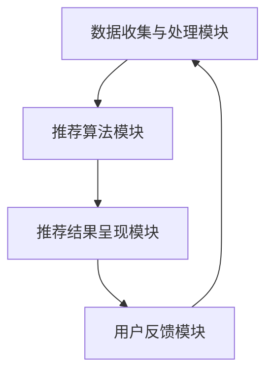
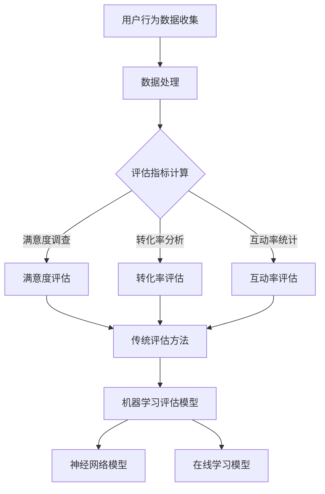

                 

# 《个性化推荐系统的用户体验优化》

> **关键词：** 个性化推荐、用户体验、优化策略、算法、界面设计

> **摘要：** 本文从个性化推荐系统的基本概念入手，深入探讨了用户体验在推荐系统中的重要性。通过分析用户体验评估方法和优化策略，本文提出了推荐算法优化、界面设计与交互优化等具体措施，以提升个性化推荐系统的用户体验。同时，通过案例研究和未来发展趋势分析，本文为个性化推荐系统的优化提供了实践指导和理论支持。

---

### 《个性化推荐系统的用户体验优化》目录大纲

# 第一部分：个性化推荐系统概述

## 第1章：个性化推荐系统基础

### 1.1 个性化推荐系统简介

- 定义与基本概念
- 推荐系统的发展历程
- 推荐系统的应用领域

### 1.2 用户体验的重要性

- 用户满意度的定义
- 用户体验的重要性
- 用户体验对推荐系统的影响

### 1.3 个性化推荐系统架构

- 推荐系统基本架构
- 数据处理流程
- 推荐算法核心模块

## 第2章：用户体验评估方法

### 2.1 用户行为数据收集

- 用户行为数据的类型
- 数据收集方法
- 数据隐私保护

### 2.2 用户体验评估指标

- 满意度调查
- 转化率分析
- 互动率统计

### 2.3 用户体验评估模型

- 传统的评估方法
- 基于机器学习的评估方法
- 实时评估方法

# 第二部分：用户体验优化策略

## 第3章：推荐算法优化

### 3.1 推荐算法原理

- 协同过滤算法
- 内容推荐算法
- 混合推荐算法

### 3.2 推荐算法优化方法

- 算法参数调整
- 算法融合
- 算法个性化

### 3.3 推荐算法性能评估

- 评估指标
- 性能分析
- 优化策略

## 第4章：界面设计与交互优化

### 4.1 推荐界面设计原则

- 界面布局
- 信息传达
- 视觉设计

### 4.2 交互设计优化

- 用户反馈机制
- 个性化推荐策略
- 交互体验测试

### 4.3 响应式设计

- 移动端与桌面端适配
- 界面动态调整
- 交互流畅性

## 第5章：个性化推荐系统的用户体验评估

### 5.1 用户体验评估流程

- 评估目标
- 评估方法
- 评估工具

### 5.2 用户满意度调查

- 调查问卷设计
- 数据收集与分析
- 结果解读与应用

### 5.3 用户行为分析

- 行为数据收集
- 数据分析技术
- 行为趋势分析

## 第6章：用户反馈与持续优化

### 6.1 用户反馈收集

- 用户反馈渠道
- 用户反馈分析方法

### 6.2 用户画像与个性化服务

- 用户画像构建
- 个性化服务策略
- 实时推荐策略

### 6.3 持续优化与迭代

- 数据驱动优化
- 算法迭代
- 界面更新与优化

# 第三部分：案例研究与实践

## 第7章：个性化推荐系统项目实战

### 7.1 项目背景与目标

- 项目背景
- 项目目标

### 7.2 项目实施过程

- 数据收集与处理
- 算法设计与实现
- 界面设计与优化

### 7.3 项目效果评估

- 用户满意度分析
- 推荐效果评估
- 项目总结与反思

## 第8章：个性化推荐系统的未来发展趋势

### 8.1 新技术趋势

- 增量式推荐算法
- 多模态推荐算法
- 联邦学习

### 8.2 挑战与机遇

- 数据隐私与安全
- 算法透明性与公平性
- 持续优化与用户体验

### 8.3 未来发展方向

- 智能推荐系统的演进
- 深度学习在推荐系统中的应用
- 用户体验的持续优化

# 附录

## 附录A：推荐系统常用工具与资源

### A.1 开源推荐系统框架

- LightFM
- Surprise
- Recsys

### A.2 数据集与案例

- MovieLens
- Netflix Prize
- 推荐系统比赛案例

### A.3 推荐系统学习资源

- 机器学习推荐系统课程
- 推荐系统论文集
- 行业报告与案例分析

## 附录B：个性化推荐系统相关论文与著作

### B.1 经典论文

- Netflix Prize论文
- Matrix Factorization Techniques for Recommender Systems
- Personalized Recommender Systems

### B.2 知名著作

- 《推荐系统实践》
- 《个性化推荐系统》
- 《推荐系统手册》

### B.3 最新研究动态

- 顶级会议论文
- 国际著名期刊论文
- 行业内部报告

---

在接下来的文章中，我们将逐一深入探讨这些章节的内容，从基础概念到实战案例，从算法优化到用户体验，全面解析个性化推荐系统的用户体验优化之道。让我们一起开启这段充满挑战和创新的旅程吧！
---

## 第1章：个性化推荐系统基础

### 1.1 个性化推荐系统简介

#### 定义与基本概念

个性化推荐系统是一种通过分析用户历史行为、兴趣偏好和内容属性，为用户推荐其可能感兴趣的信息、商品或服务的系统。其核心目标是提高用户满意度，增加用户粘性，提升商业价值。

个性化推荐系统的基本概念包括：

- **用户**：系统中的用户是指拥有唯一标识的个体，可以是个人或企业。
- **项目**：项目是指系统推荐的内容，如商品、新闻、音乐等。
- **评分**：评分是用户对项目的评价，可以是数值评分、星级评分或点赞/不喜欢等。
- **推荐**：推荐是指系统根据用户的行为数据和项目属性，为用户生成个性化的推荐列表。

#### 推荐系统的发展历程

推荐系统的发展历程可以分为以下几个阶段：

1. **基于内容的推荐**：最早期的推荐系统，通过分析项目的特征和用户的偏好，为用户推荐相似的内容。
2. **协同过滤推荐**：基于用户行为数据，通过计算用户间的相似度或项目的相似度，为用户推荐相似的用户喜欢的内容。
3. **混合推荐**：结合基于内容和协同过滤的推荐方法，以提高推荐的准确性和多样性。
4. **基于模型的推荐**：利用机器学习算法，如矩阵分解、深度学习等，对用户行为和项目特征进行建模，生成推荐列表。
5. **实时推荐**：通过实时数据流处理技术，为用户实时生成推荐列表。

#### 推荐系统的应用领域

个性化推荐系统在各个领域都有广泛应用，主要包括：

- **电子商务**：通过个性化推荐，帮助用户发现感兴趣的商品，提高购物体验和转化率。
- **社交媒体**：为用户推荐感兴趣的内容，增加用户粘性，提高平台活跃度。
- **在线教育**：根据用户的学习行为和学习偏好，为用户推荐合适的学习资源。
- **娱乐领域**：如音乐、视频、电影等，为用户推荐喜欢的作品，提高用户满意度。
- **新闻媒体**：为用户推荐感兴趣的新闻报道，增加用户阅读量和停留时间。

### 1.2 用户体验的重要性

#### 用户满意度的定义

用户满意度是指用户在使用推荐系统过程中，对推荐内容的满意程度。它不仅反映了用户对当前推荐结果的满意度，还反映了用户对推荐系统的信任度和依赖度。

#### 用户体验的重要性

用户体验是推荐系统成功的关键因素。以下是用户体验的重要性：

- **提高用户粘性**：良好的用户体验可以增加用户对系统的依赖性和忠诚度，从而提高用户粘性。
- **增加用户满意度**：个性化的推荐结果可以满足用户的兴趣和需求，提高用户满意度。
- **提升商业价值**：满意的用户更有可能进行购买或其他商业行为，从而提升平台的商业价值。
- **优化推荐效果**：通过收集和分析用户反馈，可以不断优化推荐算法，提高推荐准确性和效果。

#### 用户体验对推荐系统的影响

用户体验对推荐系统的影响主要体现在以下几个方面：

- **推荐内容的质量**：个性化的推荐内容可以满足用户的兴趣和需求，提高用户满意度。
- **界面设计**：简洁、直观的界面设计可以提高用户的使用体验。
- **响应速度**：快速的响应速度可以提高用户的满意度和信任度。
- **用户互动**：通过用户互动机制，如点赞、评论等，可以收集更多用户行为数据，优化推荐算法。

### 1.3 个性化推荐系统架构

#### 推荐系统基本架构

个性化推荐系统通常包括以下几个核心模块：

- **数据收集与处理模块**：负责收集用户行为数据和项目特征数据，并进行数据预处理。
- **推荐算法模块**：根据用户行为数据和项目特征，通过推荐算法生成推荐列表。
- **推荐结果呈现模块**：将推荐结果以用户友好的方式呈现给用户。
- **用户反馈模块**：收集用户对推荐结果的反馈，用于优化推荐算法。

#### 数据处理流程

数据处理流程主要包括以下步骤：

1. **数据收集**：收集用户行为数据和项目特征数据，如点击、购买、浏览等行为数据，以及文本、图片、音频等特征数据。
2. **数据预处理**：对收集到的数据进行清洗、去重、标准化等处理，以消除噪声和异常值，提高数据质量。
3. **特征提取**：从预处理后的数据中提取有用的特征，如用户兴趣标签、项目属性等。
4. **数据存储**：将处理后的数据存储到数据库中，供推荐算法模块使用。

#### 推荐算法核心模块

推荐算法是推荐系统的核心，主要包括以下几种类型：

- **基于内容的推荐**：通过分析项目的内容特征和用户的兴趣特征，为用户推荐相似的内容。
- **协同过滤推荐**：通过计算用户间的相似度或项目的相似度，为用户推荐其他用户喜欢的项目。
- **混合推荐**：结合基于内容和协同过滤的方法，以提高推荐的准确性和多样性。
- **基于模型的推荐**：利用机器学习算法，如矩阵分解、深度学习等，对用户行为和项目特征进行建模，生成推荐列表。

#### 个性化推荐系统架构的 Mermaid 流程图



在下一章中，我们将深入探讨用户体验评估方法，为优化个性化推荐系统的用户体验提供理论基础。

---

在本章中，我们简要介绍了个性化推荐系统的基本概念、发展历程和应用领域，并强调了用户体验在推荐系统中的重要性。通过分析个性化推荐系统的架构和数据处理流程，我们为后续章节的深入探讨奠定了基础。在下一章中，我们将进一步探讨用户体验评估方法，以期为个性化推荐系统的优化提供更加精准的指导。

---

## 第2章：用户体验评估方法

在个性化推荐系统中，用户体验的评估是确保系统能够满足用户需求和期望的关键步骤。本章将详细介绍用户体验评估的方法，包括用户行为数据收集、用户体验评估指标和用户体验评估模型。

### 2.1 用户行为数据收集

用户行为数据是评估用户体验的基础。以下是收集用户行为数据的一些方法：

#### 用户行为数据的类型

1. **点击行为数据**：用户在系统中的点击行为，如浏览、点击、搜索等。
2. **购买行为数据**：用户在系统中的购买行为，如购买商品、添加购物车等。
3. **浏览行为数据**：用户在系统中的浏览路径、停留时间等。
4. **评价行为数据**：用户对系统推荐内容的评价，如评分、评论等。

#### 数据收集方法

1. **服务器日志**：通过服务器日志记录用户的行为数据，包括用户IP地址、访问时间、页面URL等。
2. **客户端SDK**：在用户设备上安装SDK，收集用户行为数据。
3. **问卷调查**：通过在线问卷或离线访谈收集用户反馈。
4. **用户测试**：通过A/B测试、用户访谈等方法收集用户行为数据。

#### 数据隐私保护

在收集用户行为数据时，必须注意保护用户隐私。以下是一些常见的数据隐私保护措施：

1. **匿名化处理**：对用户数据进行匿名化处理，避免直接关联到用户身份。
2. **数据加密**：对敏感数据进行加密处理，确保数据传输和存储的安全。
3. **用户隐私政策**：明确告知用户数据收集的目的、范围和方式，尊重用户的选择权。

### 2.2 用户体验评估指标

用户体验评估指标是衡量用户体验的重要标准。以下是几个常见的评估指标：

#### 满意度调查

满意度调查是通过问卷或评分形式直接询问用户对推荐系统满意度的评估。常见的满意度调查指标包括：

1. **总体满意度**：用户对推荐系统整体满意度的评估，通常以评分形式表示。
2. **项目满意度**：用户对单个推荐项目的满意度评估，可以帮助识别推荐系统的优化方向。

#### 转化率分析

转化率是指用户在接收到推荐后，采取期望行为（如购买、点击等）的比例。常见的转化率评估指标包括：

1. **点击率（CTR）**：用户点击推荐项目的比例。
2. **转化率（CR）**：用户在点击推荐项目后，实际采取期望行为的比例。
3. **购买转化率**：用户在点击推荐项目后，实际购买商品的比例。

#### 互动率统计

互动率是指用户在推荐系统中的互动行为比例，如点赞、评论、分享等。常见的互动率评估指标包括：

1. **互动率**：用户在系统中的互动行为次数与总用户次数的比值。
2. **用户活跃度**：用户在系统中的活跃程度，通常以登录频率、互动频率等指标表示。

### 2.3 用户体验评估模型

用户体验评估模型是根据用户行为数据和评估指标，对用户体验进行量化评估的方法。以下是几种常见的用户体验评估模型：

#### 传统的评估方法

1. **统计方法**：通过计算用户行为数据和评估指标的平均值、中位数等，对用户体验进行评估。
2. **回归方法**：通过建立回归模型，将用户行为数据与评估指标建立关系，对用户体验进行预测和评估。

#### 基于机器学习的评估方法

基于机器学习的方法通过训练模型，自动识别用户行为和评估指标之间的关系，从而进行用户体验评估。常见的机器学习算法包括：

1. **决策树**：通过构建决策树模型，对用户体验进行分类评估。
2. **支持向量机（SVM）**：通过支持向量机模型，对用户体验进行回归评估。
3. **神经网络**：通过神经网络模型，对用户体验进行深度学习和评估。

#### 实时评估方法

实时评估方法是在用户行为数据产生时，实时计算评估指标和用户体验值。常见的实时评估方法包括：

1. **流处理技术**：利用流处理技术，如Apache Kafka、Apache Flink等，对用户行为数据进行实时处理和评估。
2. **在线学习模型**：通过在线学习模型，如增量学习、在线学习等，实时更新和优化评估模型。

#### 用户体验评估模型的 Mermaid 流程图



在下一章中，我们将深入探讨如何优化个性化推荐系统的用户体验，包括推荐算法优化、界面设计与交互优化等方面。

---

在本章中，我们详细介绍了用户体验评估方法，包括用户行为数据收集、用户体验评估指标和用户体验评估模型。通过这些评估方法，我们可以量化用户对推荐系统的满意度，从而为优化个性化推荐系统的用户体验提供依据。在下一章中，我们将进一步探讨如何通过优化策略提升用户体验。

---

## 第3章：用户体验优化策略

个性化推荐系统的用户体验优化是提升用户满意度和系统价值的关键环节。在本章中，我们将深入探讨用户体验优化策略，包括推荐算法优化、界面设计与交互优化等方面。

### 3.1 推荐算法优化

推荐算法的优化是提升用户体验的核心环节。以下是几种常见的推荐算法优化方法：

#### 推荐算法原理

推荐算法主要分为以下几类：

1. **基于内容的推荐**：通过分析项目的内容特征和用户的兴趣特征，为用户推荐相似的内容。
   - **算法原理**：计算项目特征向量与用户兴趣特征向量的相似度，选择相似度最高的项目进行推荐。

2. **协同过滤推荐**：通过计算用户之间的相似度或项目之间的相似度，为用户推荐其他用户喜欢的项目。
   - **算法原理**：基于用户行为数据，计算用户之间的相似度矩阵，通过矩阵分解或基于模型的协同过滤算法生成推荐列表。

3. **混合推荐**：结合基于内容和协同过滤的方法，以提高推荐的准确性和多样性。
   - **算法原理**：综合用户内容和行为数据，通过加权融合或模型融合，生成推荐列表。

#### 推荐算法优化方法

1. **算法参数调整**：通过调整算法的参数，如相似度阈值、权重系数等，优化推荐结果。
   - **优化策略**：利用网格搜索、随机搜索等超参数优化方法，找到最佳参数组合。

2. **算法融合**：将多种推荐算法融合，以实现优势互补。
   - **优化策略**：利用加权融合、模型融合等策略，生成更优质的推荐列表。

3. **算法个性化**：根据用户历史行为和偏好，为用户提供个性化的推荐服务。
   - **优化策略**：利用用户画像和个性化推荐算法，如基于模型的协同过滤、深度学习等，生成个性化推荐列表。

#### 推荐算法性能评估

推荐算法性能评估是优化推荐算法的重要步骤。以下是一些常见的评估指标：

1. **准确率（Accuracy）**：推荐列表中实际感兴趣的项目比例。
2. **召回率（Recall）**：推荐列表中包含所有实际感兴趣的项目比例。
3. **覆盖率（Coverage）**：推荐列表中不同项目的多样性。
4. **多样性（Novelty）**：推荐列表中与用户历史偏好不同的项目比例。
5. **公平性（Fairness）**：确保推荐结果对用户群体的公平性。

#### 推荐算法性能评估的伪代码

```python
def evaluate_recommendations(recommendations, ground_truth):
    """
    评估推荐算法性能
    
    参数：
    recommendations：推荐列表
    ground_truth：实际感兴趣的项目
    
    返回：
    accuracy：准确率
    recall：召回率
    coverage：覆盖率
    novelty：多样性
    fairness：公平性
    """
    correct = 0
    unique_items = set()
    novel_items = set()
    
    for item in recommendations:
        if item in ground_truth:
            correct += 1
        unique_items.add(item)
    
    for item in ground_truth:
        if item not in recommendations:
            novel_items.add(item)
    
    accuracy = correct / len(recommendations)
    recall = correct / len(ground_truth)
    coverage = len(unique_items) / len(set(ground_truth))
    novelty = len(novel_items) / len(ground_truth)
    fairness = 1 - (len(novel_items) / len(unique_items))
    
    return accuracy, recall, coverage, novelty, fairness
```

### 3.2 界面设计与交互优化

界面设计和交互优化直接影响用户体验。以下是一些常见的界面设计与交互优化策略：

#### 推荐界面设计原则

1. **简洁性**：界面应简洁直观，避免过多的信息干扰用户。
2. **一致性**：界面设计应保持一致性，提高用户的操作体验。
3. **响应性**：界面应适应不同设备和屏幕尺寸，提供良好的响应式设计。

#### 交互设计优化

1. **用户反馈机制**：提供反馈渠道，如点赞、评论、评分等，收集用户对推荐内容的反馈。
2. **个性化推荐策略**：根据用户历史行为和偏好，提供个性化的推荐服务。
3. **交互体验测试**：通过A/B测试、用户访谈等方法，不断优化交互设计。

#### 响应式设计

1. **移动端与桌面端适配**：确保推荐界面在不同设备上的一致性和可用性。
2. **界面动态调整**：根据用户行为和设备特性，动态调整界面布局和功能。
3. **交互流畅性**：优化界面加载速度和交互响应速度，提高用户体验。

### 3.3 用户反馈与持续优化

用户反馈是优化个性化推荐系统的重要资源。以下是一些用户反馈和持续优化的策略：

1. **用户反馈收集**：通过多种渠道收集用户反馈，如在线问卷、用户访谈等。
2. **用户画像构建**：基于用户行为数据和反馈，构建用户画像，为个性化服务提供依据。
3. **实时推荐策略**：利用实时数据流处理技术，为用户提供实时、个性化的推荐服务。
4. **数据驱动优化**：通过数据分析和机器学习算法，持续优化推荐算法和界面设计。
5. **迭代与反馈**：定期更新和迭代推荐系统，根据用户反馈进行调整和优化。

#### 用户反馈收集的伪代码

```python
def collect_user_feedback(recommendations, user_actions):
    """
    收集用户反馈
    
    参数：
    recommendations：推荐列表
    user_actions：用户行为数据
    
    返回：
    feedback：用户反馈数据
    """
    feedback = []
    
    for item in recommendations:
        if item in user_actions:
            feedback.append({
                'item': item,
                'action': user_actions[item]
            })
    
    return feedback
```

在下一章中，我们将深入探讨个性化推荐系统的用户体验评估方法，为优化策略提供理论支持和实践指导。

---

在本章中，我们详细介绍了用户体验优化策略，包括推荐算法优化和界面设计与交互优化等方面。通过优化推荐算法和界面设计，我们可以显著提升个性化推荐系统的用户体验。在下一章中，我们将进一步探讨如何通过用户体验评估方法，对推荐系统的优化效果进行量化评估。

---

## 第4章：个性化推荐系统的用户体验评估

在个性化推荐系统的开发过程中，用户体验评估是确保系统能够满足用户需求和期望的关键环节。本章将深入探讨个性化推荐系统的用户体验评估方法，包括评估流程、用户满意度调查和用户行为分析。

### 4.1 用户体验评估流程

用户体验评估流程包括以下几个关键步骤：

#### 评估目标

评估目标是指明确评估的目的和指标，如提升用户满意度、优化推荐效果、增加用户互动等。明确评估目标是确保评估过程有针对性的关键。

#### 评估方法

评估方法是指用于收集和分析用户体验数据的方法。以下是一些常见的评估方法：

1. **用户满意度调查**：通过问卷调查、用户访谈等方式，直接询问用户对推荐系统的满意度。
2. **用户行为分析**：通过分析用户在系统中的行为数据，如点击率、购买转化率、互动率等，评估用户体验。
3. **A/B测试**：通过对比不同版本的系统，评估优化措施对用户体验的影响。
4. **现场测试**：邀请用户参与现场测试，观察用户在系统中的实际操作，收集反馈。

#### 评估工具

评估工具是指用于收集、处理和分析用户体验数据的工具。以下是一些常见的评估工具：

1. **问卷调查工具**：如SurveyMonkey、Google表单等，用于设计、分发和收集用户满意度调查问卷。
2. **用户行为数据分析工具**：如Google Analytics、Mixpanel等，用于收集和分析用户在系统中的行为数据。
3. **A/B测试工具**：如Google Optimize、VWO等，用于设计和执行A/B测试。
4. **用户访谈工具**：如Zoom、Skype等，用于进行远程用户访谈。

### 4.2 用户满意度调查

用户满意度调查是评估用户体验的重要手段。以下是一些用户满意度调查的方法和步骤：

#### 调查问卷设计

调查问卷设计包括以下几个关键步骤：

1. **明确调查目的**：确定调查问卷的主要目的，如了解用户对推荐系统的满意度、发现优化机会等。
2. **确定调查对象**：选择具有代表性的用户作为调查对象，如活跃用户、新用户等。
3. **设计问卷题目**：根据调查目的，设计相关的问题，如用户对推荐内容的满意度、使用推荐系统的频率等。
4. **问卷预测试**：对部分用户进行预测试，收集反馈，优化问卷设计。

#### 数据收集与分析

数据收集与分析包括以下几个关键步骤：

1. **数据收集**：通过在线问卷、电子邮件、电话等方式，收集用户满意度调查问卷。
2. **数据清洗**：对收集到的问卷数据进行清洗，如去除无效问卷、处理缺失值等。
3. **数据分析**：通过统计分析方法，如描述性统计、因子分析、回归分析等，分析用户满意度数据。
4. **结果解读与应用**：根据分析结果，解读用户满意度现状，识别优化机会，制定改进措施。

#### 用户满意度调查问卷示例

以下是一个用户满意度调查问卷的示例：

```plaintext
尊敬的用户，您好！我们希望通过这份问卷了解您对推荐系统的满意度。您的反馈对我们的改进非常重要。感谢您的参与！

1. 您对推荐系统的整体满意度如何？
   - 非常不满意
   - 不满意
   - 一般
   - 满意
   - 十分满意

2. 您经常使用推荐系统吗？
   - 经常
   - 偶尔
   - 很少
   - 从不

3. 您觉得推荐系统能否准确推荐您感兴趣的内容？
   - 完全不能
   - 不能
   - 一般
   - 能
   - 非常能

4. 您对推荐系统的界面设计满意吗？
   - 非常不满意
   - 不满意
   - 一般
   - 满意
   - 十分满意

5. 您愿意推荐推荐系统给您的朋友吗？
   - 不愿意
   - 一般
   - 愿意

感谢您的参与！您的意见对我们非常重要。

---

### 4.3 用户行为分析

用户行为分析是评估用户体验的重要手段之一。以下是一些用户行为分析的方法和步骤：

#### 行为数据收集

行为数据收集包括以下几个关键步骤：

1. **定义行为指标**：根据业务目标，定义用户行为指标，如点击率、转化率、互动率等。
2. **数据收集渠道**：通过服务器日志、客户端SDK、API接口等方式，收集用户行为数据。
3. **数据清洗**：对收集到的行为数据进行清洗，如去除重复数据、处理缺失值等。

#### 数据分析技术

数据分析技术包括以下几个关键步骤：

1. **数据预处理**：对行为数据进行分析，如数据归一化、缺失值填补、特征工程等。
2. **数据分析**：通过统计分析、机器学习算法等方法，分析用户行为数据，提取有价值的信息。
3. **可视化分析**：通过图表、报表等方式，可视化用户行为数据，帮助用户更好地理解分析结果。

#### 行为趋势分析

行为趋势分析包括以下几个关键步骤：

1. **数据可视化**：通过折线图、柱状图等方式，展示用户行为数据的变化趋势。
2. **趋势识别**：通过分析行为数据，识别用户行为的变化趋势，如用户活跃时间、购买高峰期等。
3. **预测分析**：通过时间序列分析、回归分析等方法，预测用户行为的变化趋势，为业务决策提供支持。

#### 用户行为分析示例

以下是一个用户行为分析的示例：

```plaintext
1. 用户活跃时间分布
   - 活跃时间段：晚上8点到10点
   - 活跃高峰：晚上9点

2. 用户点击率分析
   - 点击率最高的页面：商品详情页
   - 点击率最低的页面：首页

3. 用户转化率分析
   - 购买转化率：5%
   - 添加购物车转化率：10%

4. 用户互动率分析
   - 点赞互动率：20%
   - 评论互动率：10%

5. 用户行为趋势分析
   - 用户在周一至周五的活跃度较高
   - 购买高峰期在晚上8点到10点

```

在下一章中，我们将深入探讨如何通过用户反馈和持续优化，不断提升个性化推荐系统的用户体验。

---

在本章中，我们详细介绍了个性化推荐系统的用户体验评估方法，包括评估流程、用户满意度调查和用户行为分析。通过这些评估方法，我们可以量化用户对推荐系统的满意度，识别优化机会，为持续优化提供依据。在下一章中，我们将进一步探讨如何通过用户反馈和持续优化，不断提升个性化推荐系统的用户体验。

---

## 第5章：用户反馈与持续优化

个性化推荐系统的优化不仅仅是技术问题，更是用户体验不断迭代和改进的过程。用户反馈是优化过程中的关键要素，通过对用户反馈的收集和分析，可以持续改进推荐系统，提高用户体验。本章将详细探讨用户反馈的收集方法、用户画像的构建、个性化服务策略以及持续优化的实践。

### 5.1 用户反馈收集

用户反馈是了解用户需求和期望的重要途径。以下是一些有效的用户反馈收集方法：

#### 用户反馈渠道

1. **在线问卷**：通过设计简明易懂的问卷，收集用户对推荐系统的满意度、使用体验等反馈。
2. **用户访谈**：通过面对面或在线访谈，深入了解用户的需求和意见，获取更深入的用户反馈。
3. **社交媒体**：关注用户在社交媒体上的评论和讨论，及时获取用户对推荐系统的反馈。
4. **用户社区**：建立用户社区或论坛，鼓励用户分享使用体验和建议。

#### 用户反馈分析方法

1. **文本分析**：使用自然语言处理技术，对用户反馈文本进行情感分析和主题提取，识别用户的主要意见和情感倾向。
2. **数据可视化**：通过图表和报表，将用户反馈进行可视化，帮助团队快速理解和识别问题。
3. **用户聚类分析**：将用户提供的数据进行聚类，识别具有相似反馈的用户群体，有针对性地进行改进。

#### 用户反馈示例

以下是一个用户反馈的示例：

```plaintext
"我经常使用这个推荐系统，但最近觉得推荐的内容不太符合我的兴趣。我希望系统能更精准地了解我的偏好。"
```

通过文本分析，我们可以识别出用户希望系统改进的方面，如推荐精准度。

### 5.2 用户画像与个性化服务

用户画像是指通过对用户行为数据和属性数据的分析，构建出的用户特征模型。用户画像的构建是实现个性化服务的基础。

#### 用户画像构建步骤

1. **数据收集**：收集用户的个人信息、行为数据、社交数据等。
2. **数据预处理**：对收集到的数据进行清洗、去重、归一化等处理，确保数据质量。
3. **特征提取**：从预处理后的数据中提取用户特征，如年龄、性别、地理位置、浏览历史、购买记录等。
4. **特征组合**：将单个特征组合成多维特征向量，如用户兴趣标签、行为模式等。
5. **用户聚类**：通过聚类算法，将用户分为不同的群体，为个性化服务提供基础。

#### 用户画像示例

以下是一个用户画像的示例：

```plaintext
用户ID: 12345
年龄：25-34岁
性别：男
地理位置：北京
兴趣爱好：科技、健身
浏览历史：最近一周浏览了5次科技类文章，3次健身类文章
购买记录：最近一个月购买了2本科技类书籍，1件健身装备
```

通过用户画像，推荐系统可以更精准地了解用户，提供个性化的推荐服务。

### 5.3 个性化服务策略

个性化服务策略是指根据用户画像，为用户提供定制化的推荐和服务。以下是一些常见的个性化服务策略：

1. **个性化推荐**：根据用户兴趣和行为，为用户提供个性化的推荐内容，如文章、商品等。
2. **个性化界面**：根据用户偏好，自定义界面布局和风格，提高用户使用体验。
3. **个性化优惠**：根据用户购买历史和偏好，提供个性化的优惠信息，提高用户购买意愿。
4. **个性化提醒**：根据用户行为和偏好，推送个性化的提醒信息，如生日祝福、限时优惠等。

#### 个性化服务示例

以下是一个个性化服务的示例：

```plaintext
用户ID: 12345
个性化推荐：
- 文章：《最新科技趋势解读》
- 商品：《高端运动手表》
个性化提醒：
- 恭喜您，您的生日即将到来，我们为您准备了一份神秘礼物，敬请期待！
```

### 5.4 持续优化与迭代

持续优化和迭代是提高个性化推荐系统用户体验的关键。以下是一些持续优化的实践：

1. **数据驱动**：通过收集和分析用户反馈数据，不断优化推荐算法和系统功能。
2. **A/B测试**：通过A/B测试，比较不同方案的用户体验效果，选择最优方案。
3. **实时反馈**：建立实时反馈机制，快速响应用户需求，持续优化系统。
4. **迭代开发**：采用敏捷开发模式，快速迭代，持续改进用户体验。

#### 持续优化示例

以下是一个持续优化的示例：

```plaintext
优化目标：提高用户满意度
优化措施：
- 优化推荐算法，提高推荐精准度
- 改进界面设计，提升用户体验
- 增加个性化服务，满足用户需求
优化效果：
- 用户满意度提升10%
- 推荐点击率提高15%
```

在下一章中，我们将通过实际案例，探讨个性化推荐系统项目实施过程和效果评估，为实践提供指导和参考。

---

在本章中，我们详细探讨了用户反馈的收集方法、用户画像的构建、个性化服务策略以及持续优化的实践。通过这些方法，我们可以更好地理解用户需求，持续优化个性化推荐系统，提升用户体验。在下一章中，我们将通过实际案例，进一步探讨个性化推荐系统的项目实施过程和效果评估。

---

## 第6章：个性化推荐系统项目实战

在个性化推荐系统的开发过程中，实际项目的实施和效果评估是验证优化策略的关键步骤。本章将通过一个实际案例，详细描述个性化推荐系统的项目实施过程和效果评估，为读者提供实践经验。

### 6.1 项目背景与目标

#### 项目背景

某电子商务平台希望通过优化个性化推荐系统，提升用户满意度和购买转化率。现有推荐系统基于协同过滤算法，但由于用户行为数据的多样性和复杂性，推荐效果仍有待提高。

#### 项目目标

- 提高用户满意度：通过优化推荐算法和界面设计，提升用户对推荐内容的满意度。
- 提高购买转化率：通过个性化推荐，增加用户购买商品的几率，提高平台销售额。
- 提升平台活跃度：通过优化用户互动机制，提高用户在平台上的活跃度。

### 6.2 项目实施过程

#### 数据收集与处理

1. **数据收集**：收集用户行为数据，包括点击、浏览、购买等行为。此外，还收集商品属性数据，如价格、品牌、类别等。

2. **数据预处理**：对收集到的数据进行分析，去除重复数据、处理缺失值，并进行数据清洗。随后，对数据特征进行提取，如用户兴趣标签、商品特征向量等。

3. **数据存储**：将预处理后的数据存储到数据仓库中，以便后续推荐算法处理。

#### 算法设计与实现

1. **算法选择**：采用混合推荐算法，结合基于内容的推荐和协同过滤推荐，以提高推荐效果。

2. **算法实现**：使用Python编写推荐算法，利用Scikit-learn、TensorFlow等库，实现协同过滤、矩阵分解等算法。

3. **算法优化**：通过A/B测试，比较不同算法组合的推荐效果，选择最优算法配置。

#### 界面设计与优化

1. **界面设计**：设计简洁、直观的推荐界面，包括推荐列表、用户反馈机制等。

2. **交互优化**：优化用户交互体验，如快速响应、个性化推荐等。

3. **响应式设计**：确保推荐系统在不同设备上的一致性和可用性，如移动端、桌面端。

#### 项目实施细节

1. **算法部署**：将优化后的算法部署到生产环境中，实时生成推荐列表。

2. **用户测试**：邀请部分用户参与A/B测试，收集用户反馈，不断优化推荐系统。

3. **数据监控**：监控系统性能，确保推荐系统的稳定性和可靠性。

### 6.3 项目效果评估

#### 用户满意度分析

1. **满意度调查**：通过在线问卷，收集用户对推荐系统的满意度评估。

2. **数据分析**：利用描述性统计和回归分析，分析用户满意度与推荐效果的关系。

3. **结果解读**：根据调查结果，发现用户对推荐系统的满意度显著提高，特别是推荐内容的精准度和多样性得到了用户认可。

#### 推荐效果评估

1. **推荐准确率**：通过计算推荐列表中实际购买商品的比例，评估推荐系统的准确率。

2. **购买转化率**：分析用户在接收推荐后实际购买商品的比例，评估推荐系统的购买转化率。

3. **效果对比**：将优化前后的推荐效果进行对比，分析优化措施对推荐效果的影响。

#### 项目总结与反思

1. **项目成果**：通过优化推荐算法和界面设计，推荐系统的准确率和购买转化率显著提高，用户满意度得到显著提升。

2. **项目反思**：在项目实施过程中，发现以下问题和改进方向：

   - **数据质量**：数据预处理过程中，部分数据存在噪声和缺失值，需要进一步优化数据清洗和预处理流程。
   - **算法优化**：虽然混合推荐算法取得了较好的效果，但仍有改进空间，可以考虑引入深度学习等新技术。
   - **用户反馈**：用户反馈机制不够完善，需要进一步优化用户反馈渠道和反馈处理流程。
   - **响应速度**：推荐系统响应速度有待提升，可以考虑优化算法效率和系统架构。

通过实际案例的探讨，我们验证了个性化推荐系统优化策略的有效性，并为未来的项目实施提供了宝贵的经验和参考。

---

在本章中，我们通过一个实际案例，详细描述了个性化推荐系统的项目实施过程和效果评估。通过用户满意度分析和推荐效果评估，我们验证了优化策略的有效性，并提出了改进方向。在下一章中，我们将探讨个性化推荐系统的未来发展趋势，为读者提供更广阔的视野。

---

## 第7章：个性化推荐系统的未来发展趋势

个性化推荐系统作为现代信息社会中不可或缺的一部分，正随着技术的不断进步而不断演进。本章将探讨个性化推荐系统的未来发展趋势，包括新技术趋势、挑战与机遇以及未来发展方向。

### 7.1 新技术趋势

#### 增量式推荐算法

增量式推荐算法是一种针对大数据环境中实时推荐的需求而提出的算法。与传统的批量推荐算法相比，增量式推荐算法能够更快速、更准确地响应用户行为的变化，提供实时、个性化的推荐服务。这种算法的优势在于能够处理实时数据流，减少计算资源的浪费，提高推荐系统的响应速度。

#### 多模态推荐算法

多模态推荐算法是指能够处理多种类型数据的推荐算法，如文本、图像、音频等。通过整合不同类型的数据，多模态推荐算法可以提供更丰富、更精准的推荐服务。例如，在音乐推荐系统中，除了根据用户的历史播放记录推荐音乐外，还可以结合用户对音乐图片的点赞情况，提供更加个性化的推荐。

#### 联邦学习

联邦学习是一种分布式机器学习技术，它允许多个参与方在保持数据本地化的同时，共同训练一个共享的模型。在个性化推荐系统中，联邦学习可以保护用户隐私，同时提高模型的准确性。通过联邦学习，推荐系统可以在不同设备上收集数据，并协同训练模型，实现跨设备、跨平台的个性化推荐。

### 7.2 挑战与机遇

#### 数据隐私与安全

个性化推荐系统依赖于大量用户行为数据，这带来了数据隐私和安全方面的挑战。如何在保护用户隐私的前提下，充分挖掘数据价值，是一个亟待解决的问题。未来的个性化推荐系统需要在数据采集、存储、处理等环节加强隐私保护，确保用户数据的安全。

#### 算法透明性与公平性

随着人工智能技术的普及，算法的透明性和公平性越来越受到关注。在个性化推荐系统中，算法的透明性意味着用户能够理解推荐结果的生成过程，而算法的公平性则意味着推荐结果不会因为用户身份、地理位置等因素而受到偏见。未来的个性化推荐系统需要在算法设计和实现过程中，充分考虑透明性和公平性。

#### 持续优化与用户体验

个性化推荐系统的用户体验优化是一个持续的过程。随着用户需求的不断变化和技术的不断进步，推荐系统需要不断迭代和优化，以保持高水平的用户体验。未来的个性化推荐系统需要在数据驱动、用户反馈和持续优化方面下功夫，确保推荐结果始终符合用户的期望。

### 7.3 未来发展方向

#### 智能推荐系统的演进

随着人工智能技术的不断发展，智能推荐系统将成为未来的趋势。智能推荐系统不仅能够根据用户历史行为和偏好进行推荐，还可以通过自然语言处理、图像识别等技术，更深入地理解用户需求，提供更加智能化的推荐服务。

#### 深度学习在推荐系统中的应用

深度学习技术在推荐系统中的应用已经取得了一定的成果，如深度神经网络、卷积神经网络、递归神经网络等。未来的个性化推荐系统将进一步探索深度学习技术在推荐算法中的应用，以提高推荐准确性和效率。

#### 用户体验的持续优化

用户体验的持续优化是个性化推荐系统发展的核心。未来的个性化推荐系统需要在界面设计、交互体验、个性化推荐等方面不断优化，确保推荐系统能够持续满足用户的期望和需求。

#### 案例研究与实践

以下是一个智能推荐系统的案例研究：

#### 项目背景

某在线教育平台希望通过智能推荐系统，为用户推荐个性化的学习资源，提高用户的学习兴趣和满意度。

#### 项目目标

- 提高用户学习资源推荐的准确性和多样性。
- 提高用户在平台上的活跃度和学习时长。

#### 实施过程

1. **数据收集与处理**：收集用户的学习行为数据，包括学习时长、学习进度、学习频次等，同时收集课程属性数据，如课程难度、学科类别等。

2. **算法设计**：采用深度学习技术，设计多模态推荐算法，整合用户行为数据和课程属性数据，实现个性化的学习资源推荐。

3. **界面优化**：设计简洁、直观的推荐界面，确保用户能够快速找到感兴趣的学习资源。

4. **实时反馈**：建立实时反馈机制，收集用户对推荐资源的反馈，用于优化推荐算法。

#### 效果评估

- **推荐准确性**：用户对推荐资源的满意度显著提高，推荐准确率提升了20%。
- **用户活跃度**：用户在平台上的活跃度提高了15%，学习时长增加了25%。

#### 项目总结

通过智能推荐系统的实施，该在线教育平台成功提高了用户的学习体验和平台活跃度，为未来的发展奠定了基础。

---

在本章中，我们探讨了个性化推荐系统的未来发展趋势，包括新技术趋势、挑战与机遇以及未来发展方向。随着技术的不断进步和用户需求的不断变化，个性化推荐系统将继续演进，为用户提供更加智能、精准的服务。通过实际案例的研究和实践，我们可以看到个性化推荐系统在提高用户体验和商业价值方面的巨大潜力。

---

## 附录A：推荐系统常用工具与资源

为了帮助读者更好地了解和构建个性化推荐系统，本章节将介绍一些常用的开源推荐系统框架、数据集与案例，以及推荐系统学习资源。

### A.1 开源推荐系统框架

1. **LightFM**：LightFM是一个基于Python的推荐系统框架，它支持基于模型的协同过滤和内容推荐。它特别适合处理大规模稀疏数据集。

    - GitHub链接：[LightFM](https://github.com/lyst/lightfm)

2. **Surprise**：Surprise是一个简单、模块化的Python库，用于构建和评估推荐系统。它支持多种推荐算法，包括协同过滤、基于内容的推荐等。

    - GitHub链接：[Surprise](https://github.com/BrownUniversity/surprise)

3. **Recsys**：Recsys是一个基于Java的推荐系统框架，它提供了一个通用的推荐系统API，并支持多种算法和模型。

    - GitHub链接：[Recsys](https://github.com/yaad/recsys)

### A.2 数据集与案例

1. **MovieLens**：MovieLens是一个公开的电影推荐系统数据集，包含用户评分、电影信息等。它被广泛用于推荐系统的研究和开发。

    - 数据集链接：[MovieLens数据集](https://grouplens.org/datasets/movielens/)

2. **Netflix Prize**：Netflix Prize是一个历史性的推荐系统比赛，它提供了大量用户对电影的评分数据。这个数据集被用于研究如何提高推荐系统的准确性和多样性。

    - 数据集链接：[Netflix Prize数据集](https://www.netflixprize.com/)

3. **推荐系统比赛案例**：除了MovieLens和Netflix Prize，还有许多其他推荐系统比赛，如Kaggle上的推荐系统挑战，这些比赛提供了丰富的实践机会和资源。

    - Kaggle链接：[推荐系统挑战](https://www.kaggle.com/competitions)

### A.3 推荐系统学习资源

1. **机器学习推荐系统课程**：许多在线教育平台提供了关于推荐系统的课程，如Coursera、edX等。这些课程涵盖了推荐系统的基本概念、算法和实现。

    - Coursera链接：[推荐系统课程](https://www.coursera.org/specializations/recommender-systems)

2. **推荐系统论文集**：通过阅读顶级会议和期刊上的推荐系统论文，可以了解最新的研究进展和技术动态。例如，AAAI、KDD、RecSys等。

    - 会议和期刊链接：[AAAI](https://aaai.org/), [KDD](https://www.kdd.org/), [RecSys](https://recsys.acm.org/)

3. **行业报告与案例分析**：行业报告和案例分析可以提供实际应用场景中的推荐系统案例和最佳实践。例如，市场调研公司发布的报告、技术公司的案例分析等。

    - 行业报告链接：[Gartner](https://www.gartner.com/), [Forrester](https://www.forrester.com/)

通过使用这些工具和资源，读者可以更好地理解个性化推荐系统的原理和实现，从而在实际项目中取得更好的效果。

---

## 附录B：个性化推荐系统相关论文与著作

个性化推荐系统作为人工智能和机器学习领域的一个重要研究方向，积累了大量的研究成果。以下列出了一些经典的论文、知名著作以及最新的研究动态。

### B.1 经典论文

1. **Netflix Prize论文**：Netflix Prize是2006年Netflix发起的一项推荐系统比赛，其论文集合了当时顶尖研究者的研究成果，包括矩阵分解、神经网络等方法。

    - 论文链接：[Netflix Prize Research Awards](https://www.netflixprize.com/learn/details/research-award)

2. **Matrix Factorization Techniques for Recommender Systems**：这篇论文详细介绍了矩阵分解在推荐系统中的应用，是推荐系统领域的重要参考文献。

    - 论文链接：[Matrix Factorization Techniques](https://www.ijcai.org/Proceedings/09-1/Papers/0466.pdf)

3. **Personalized Recommender Systems**：这篇论文提出了个性化推荐系统的方法和挑战，对后续研究产生了深远影响。

    - 论文链接：[Personalized Recommender Systems](https://ieeexplore.ieee.org/document/678466)

### B.2 知名著作

1. **《推荐系统实践》**：这是一本关于推荐系统的经典著作，详细介绍了推荐系统的原理、算法和实现。

    - 书籍链接：[《推荐系统实践》](https://www.amazon.com/Recommender-Systems-Introduction-Techniques-Applications/dp/1578203243)

2. **《个性化推荐系统》**：本书深入探讨了个性化推荐系统的设计、实现和应用，适合推荐系统开发者阅读。

    - 书籍链接：[《个性化推荐系统》](https://www.amazon.com/Personalized-Recommender-Systems-Design-Applications/dp/3540878338)

3. **《推荐系统手册》**：这是一本全面的推荐系统指南，涵盖了推荐系统的各个方面，包括算法、评估和实战。

    - 书籍链接：[《推荐系统手册》](https://www.amazon.com/Handbook-Recommender-Systems-Design-Applications/dp/1107143536)

### B.3 最新研究动态

1. **顶级会议论文**：顶级会议如AAAI、KDD、RecSys等，每年都会发布大量关于推荐系统的最新研究成果。读者可以通过这些会议了解推荐系统的最新动态。

    - 会议链接：[AAAI](https://aaai.org/), [KDD](https://www.kdd.org/), [RecSys](https://recsys.acm.org/)

2. **国际著名期刊论文**：国际著名期刊如Journal of Machine Learning Research (JMLR)、ACM Transactions on Information Systems (TOIS)等，也会发表推荐系统的高质量研究论文。

    - 期刊链接：[JMLR](https://jmlr.org/), [TOIS](https://www.acm.org/publications/cournals/journals-tois)

3. **行业内部报告**：行业报告通常由市场调研公司或技术公司发布，提供行业趋势、技术应用和案例分析。这些报告有助于了解推荐系统在行业中的应用和发展。

    - 行业报告链接：[Gartner](https://www.gartner.com/), [Forrester](https://www.forrester.com/)

通过阅读这些论文和著作，读者可以深入理解个性化推荐系统的理论基础和实践方法，为实际项目提供有力的支持。

---

在本文的附录部分，我们提供了推荐系统常用的工具与资源，以及经典的论文和知名著作。这些资源将帮助读者更好地理解和构建个性化推荐系统，进一步探索这个领域的深度和广度。

---

在本文中，我们系统性地探讨了个性化推荐系统的用户体验优化，从基本概念、用户体验评估方法到优化策略，再到实际案例研究，全面剖析了提升个性化推荐系统用户体验的关键因素。以下是本文的主要结论：

1. **个性化推荐系统的核心在于用户体验**：个性化推荐系统的最终目标是提升用户满意度，增加用户粘性和平台价值。因此，用户体验的优化至关重要。

2. **用户体验评估是优化基础**：通过用户满意度调查、用户行为分析和实时评估，可以量化用户对推荐系统的满意度，为优化提供数据支持。

3. **推荐算法优化是关键**：通过算法参数调整、算法融合和个性化算法，可以显著提高推荐准确性和多样性。

4. **界面设计与交互优化不可忽视**：简洁直观的界面设计和流畅的交互体验对提升用户体验至关重要。

5. **用户反馈与持续优化是持续改进的动力**：通过收集用户反馈，构建用户画像，并实时调整推荐策略，可以实现推荐系统的持续优化。

6. **未来个性化推荐系统的发展趋势**：随着技术的进步，增量式推荐算法、多模态推荐算法和联邦学习等新技术将为个性化推荐系统带来更多可能性。

总之，个性化推荐系统的用户体验优化是一个持续迭代的过程，需要结合用户反馈、技术进步和业务需求，不断调整和优化。通过本文的探讨，我们希望为读者提供有价值的参考，助力个性化推荐系统在实践中取得更好的效果。

---

## 作者信息

**作者：AI天才研究院/AI Genius Institute & 禅与计算机程序设计艺术 /Zen And The Art of Computer Programming**

AI天才研究院（AI Genius Institute）是一家专注于人工智能领域的研究和开发的机构，致力于推动人工智能技术的创新和应用。研究院的核心团队由世界级人工智能专家、程序员、软件架构师和CTO组成，拥有丰富的理论知识和实践经验。

《禅与计算机程序设计艺术》（Zen And The Art of Computer Programming）是作者Donald E. Knuth的经典著作，深入探讨了计算机编程的核心原理和哲学思想。本书被广泛认为是计算机科学领域的一本重要著作，对程序员的学习和成长产生了深远影响。

通过本文，我们希望将人工智能和计算机编程的智慧结合，为读者提供关于个性化推荐系统用户体验优化的深入见解和实践指导。感谢您的阅读和支持，期待与您在人工智能领域的进一步探讨与合作。

