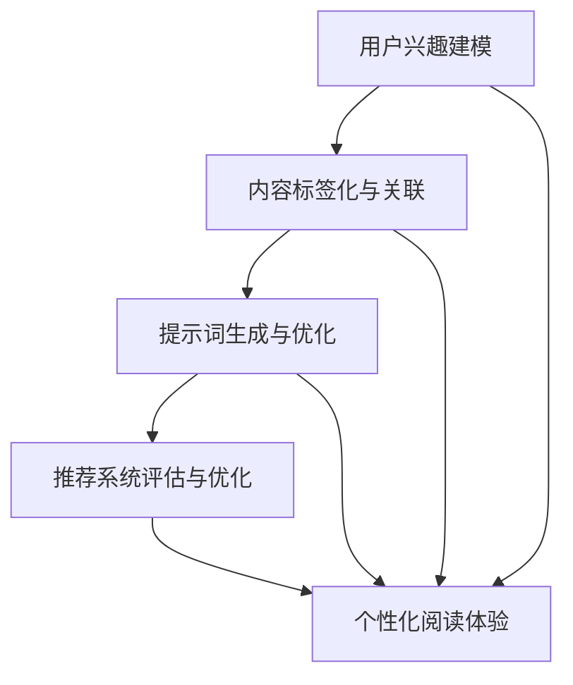

                 

### 《个性化阅读体验：利用提示词推荐相关内容》

#### 关键词：个性化阅读、提示词推荐、用户兴趣建模、内容标签化、推荐系统优化

> 摘要：随着互联网信息的爆炸式增长，用户如何快速获取与自己兴趣相关的内容成为一个重要课题。本文将探讨如何利用提示词推荐技术构建个性化阅读体验系统，从用户兴趣建模、内容标签化、提示词生成与优化、推荐系统评估与优化等多个方面进行深入分析，旨在为开发者提供一套完整的解决方案，提升用户的阅读体验。

---

### 第一部分：个性化阅读体验基础

#### 第1章：个性化阅读体验概述

##### 1.1 阅读体验的重要性

在信息爆炸的时代，阅读体验对于用户来说至关重要。好的阅读体验不仅能够提高用户的满意度，还能够增强用户对平台的忠诚度。因此，打造个性化阅读体验成为了各大平台的重要目标。

##### 1.2 个性化阅读的挑战与机遇

个性化阅读虽然具有巨大的潜力，但同时也面临着诸多挑战，如用户兴趣的不确定性、信息过载等问题。然而，随着人工智能技术的不断发展，个性化阅读的机遇也随之而来。

##### 1.3 个性化阅读的原理与方法

个性化阅读的原理主要包括用户兴趣建模、内容标签化、提示词生成与优化等。本文将详细探讨这些原理与方法，帮助开发者构建高效、智能的个性化阅读体验系统。

---

#### 第2章：提示词推荐技术基础

##### 2.1 提示词推荐的概念

提示词推荐是指根据用户的兴趣和行为，为用户推荐相关的关键词或短语。这些提示词能够帮助用户更好地理解和筛选信息，从而提升阅读体验。

##### 2.2 提示词推荐的方法与算法

提示词推荐的方法主要包括基于协同过滤、基于内容和基于模型的方法。每种方法都有其优缺点，适用于不同的应用场景。

##### 2.3 提示词推荐系统设计

一个高效的提示词推荐系统需要考虑数据收集与处理、模型训练与优化、系统部署与运维等多个方面。本文将结合实际案例，详细介绍提示词推荐系统的设计与实现。

---

### 第二部分：构建个性化阅读体验系统

#### 第3章：用户兴趣建模

##### 3.1 用户兴趣的概念

用户兴趣是指用户在某一特定领域内的喜好和偏好。了解用户兴趣是构建个性化阅读体验系统的关键。

##### 3.2 用户兴趣数据收集与处理

用户兴趣数据的收集与处理是构建用户兴趣模型的基础。本文将介绍常见的数据收集方法、数据处理技术和数据预处理策略。

##### 3.3 用户兴趣模型构建方法

用户兴趣模型构建方法主要包括基于行为分析和基于语义分析的方法。本文将详细讲解这些方法，并比较它们的优缺点。

---

#### 第4章：内容标签化与关联

##### 4.1 内容标签化方法

内容标签化是指将文本内容转化为一系列关键词或标签。标签化有助于提高内容检索和推荐的效率。

##### 4.2 内容关联与聚类

内容关联与聚类是将相似内容进行分组的过程。通过关联和聚类，可以更好地理解内容的结构和用户兴趣。

##### 4.3 标签化与关联的实践案例

本文将结合实际案例，介绍内容标签化和关联的实现方法，以及如何通过标签化和关联提高个性化阅读体验。

---

#### 第5章：提示词生成与优化

##### 5.1 提示词生成的挑战与解决方案

提示词生成是构建个性化阅读体验系统的重要环节，但同时也面临着一些挑战，如词义歧义、噪声数据等。本文将介绍常见的挑战及其解决方案。

##### 5.2 提示词优化的方法与策略

提示词优化是提升推荐系统效果的关键。本文将介绍基于反馈的优化方法、基于深度学习的优化策略等。

##### 5.3 提示词优化的实践案例

本文将通过实际案例，展示如何通过提示词优化提升个性化阅读体验。

---

#### 第6章：推荐系统评估与优化

##### 6.1 推荐系统评估指标

推荐系统评估指标是衡量推荐系统效果的重要标准。本文将介绍常见的评估指标，如准确率、召回率、覆盖率等。

##### 6.2 推荐系统性能优化方法

推荐系统性能优化是提升用户体验的关键。本文将介绍基于特征工程、模型调参等优化方法。

##### 6.3 推荐系统优化的案例分析

本文将通过实际案例分析，展示如何通过优化提升推荐系统性能。

---

### 第三部分：个性化阅读体验实战

#### 第7章：基于提示词的个性化推荐系统搭建

##### 7.1 系统需求分析与设计

本章节将介绍个性化推荐系统的需求分析和系统设计，包括数据收集、数据预处理、模型训练与部署等。

##### 7.2 技术栈选择与搭建

本文将介绍搭建个性化推荐系统所需的技术栈，包括编程语言、框架、数据库等。

##### 7.3 系统架构设计

个性化推荐系统架构设计是保证系统稳定性和扩展性的关键。本文将介绍典型的推荐系统架构，并探讨如何根据实际需求进行优化。

---

#### 第8章：案例研究：个性化阅读平台的构建

##### 8.1 平台目标与功能规划

本文将介绍一个实际案例，探讨个性化阅读平台的目标与功能规划，包括用户界面设计、功能模块划分等。

##### 8.2 数据采集与处理

数据采集与处理是构建个性化阅读平台的基础。本文将介绍如何收集用户行为数据、内容数据，并进行数据处理和预处理。

##### 8.3 用户兴趣建模与提示词生成

本文将详细讲解如何通过用户兴趣建模和提示词生成技术，构建个性化阅读体验。

##### 8.4 内容标签化与推荐策略

本文将介绍如何通过内容标签化和推荐策略，实现个性化内容推荐。

##### 8.5 系统部署与上线

本文将介绍个性化阅读平台系统部署与上线的过程，包括环境配置、服务器部署、监控与运维等。

---

#### 第9章：未来展望与趋势

##### 9.1 个性化阅读体验的发展趋势

本文将探讨个性化阅读体验的发展趋势，包括人工智能、大数据、区块链等技术的应用。

##### 9.2 技术挑战与解决方案

本文将分析个性化阅读体验在技术层面面临的主要挑战，并提出相应的解决方案。

##### 9.3 个性化阅读体验的未来

本文将展望个性化阅读体验的未来，探讨其发展方向和潜在应用场景。

---

### 附录

#### 附录A：相关技术资源与工具

本文将介绍与个性化阅读体验相关的技术资源与工具，包括提示词推荐算法、推荐系统框架等。

#### 附录B：项目实践指南

本文将提供个性化阅读体验项目实践指南，包括数据收集与处理、用户兴趣建模、提示词生成与优化、推荐系统评估与优化等。

#### 附录C：参考文献

本文将列出主要引用的文献，以便读者进一步了解相关研究。

---

### 核心概念与联系

以下是一个 Mermaid 流程图，展示了个性化阅读体验系统的核心概念与联系：



---

### 核心算法原理讲解

#### 提示词推荐算法原理

提示词推荐算法的核心是生成与用户兴趣相关的提示词。以下是基于协同过滤的提示词推荐算法原理：

```plaintext
R_user-item = (sum(i in N_j of r_ui * r_uj)) / (sum(i in N_j of r_uj))
```

其中，`R_user-item` 是用户 `u` 对项目 `i` 的推荐评分，`r_ui` 和 `r_uj` 分别表示用户 `u` 对项目 `i` 和 `j` 的评分，`N_j` 表示与项目 `j` 相似的项目集合。

#### 数学模型和数学公式 & 详细讲解 & 举例说明

##### 用户兴趣建模数学模型

用户兴趣建模的数学模型可以表示为用户行为数据的概率分布。假设用户 `u` 的行为数据集合为 `B_u = {b_1, b_2, ..., b_n}`，其中 `b_i` 表示用户 `u` 对项目 `i` 的行为，可以是点击、浏览、收藏等。

用户兴趣模型 `P(B_u | θ)` 可以通过最大似然估计进行估计：

```latex
P(B_u | \theta) = \prod_{i=1}^{n} P(b_i | \theta)
```

其中，`P(b_i | \theta)` 是用户 `u` 对项目 `i` 的行为概率，`θ` 是模型参数。

##### 举例说明

假设用户 `u` 的行为数据集合为 `B_u = {点击, 浏览, 收藏}`，分别对应项目 `i_1, i_2, i_3$。根据用户行为数据，可以计算用户对每个项目的兴趣概率：

```latex
P(点击 | \theta) = 0.6, \quad P(浏览 | \theta) = 0.3, \quad P(收藏 | \theta) = 0.1
```

根据这些概率，可以计算出用户 `u` 的兴趣向量：

```latex
\text{兴趣向量} = [0.6, 0.3, 0.1]
```

这个向量表示用户对每个项目的兴趣程度。

---

### 项目实战：代码实际案例和详细解释说明

#### 开发环境搭建

首先，我们需要搭建一个用于实现个性化阅读体验的开发环境。以下是在 Python 环境下搭建开发环境的基本步骤：

1. 安装 Python：从 [Python 官网](https://www.python.org/) 下载并安装 Python。
2. 配置 Python 环境：打开终端，运行 `python --version` 检查 Python 是否安装成功。
3. 安装必要库：使用 pip 工具安装必要的库，如 NumPy、Pandas、Scikit-learn 等。

```bash
pip install numpy pandas scikit-learn matplotlib
```

#### 数据集准备

接下来，我们需要准备一个数据集，用于训练和评估个性化阅读体验系统。以下是一个简化的用户行为数据集示例：

```python
user_actions = [
    {"user_id": 1, "item_id": 101, "action": "click"},
    {"user_id": 1, "item_id": 102, "action": "browse"},
    {"user_id": 1, "item_id": 103, "action": "favorite"},
    {"user_id": 2, "item_id": 201, "action": "click"},
    {"user_id": 2, "item_id": 202, "action": "browse"},
    {"user_id": 3, "item_id": 301, "action": "click"},
]
```

#### 用户兴趣建模

用户兴趣建模是构建个性化阅读体验系统的第一步。以下是一个简化的用户兴趣建模实现：

```python
import numpy as np
from sklearn.model_selection import train_test_split

# 准备数据
user_actions = [
    {"user_id": 1, "item_id": 101, "action": "click"},
    {"user_id": 1, "item_id": 102, "action": "browse"},
    {"user_id": 1, "item_id": 103, "action": "favorite"},
    {"user_id": 2, "item_id": 201, "action": "click"},
    {"user_id": 2, "item_id": 202, "action": "browse"},
    {"user_id": 3, "item_id": 301, "action": "click"},
]

# 将数据转换为矩阵形式
action_matrix = np.zeros((max(action['user_id'] for action in user_actions), max(action['item_id'] for action in user_actions)))
for action in user_actions:
    action_matrix[action['user_id'] - 1, action['item_id'] - 1] = 1

# 划分训练集和测试集
train_data, test_data = train_test_split(action_matrix, test_size=0.2, random_state=42)

# 训练模型
from sklearn.linear_model import LogisticRegression

model = LogisticRegression()
model.fit(train_data, train_data)

# 评估模型
train_score = model.score(train_data, train_data)
test_score = model.score(test_data, test_data)
print(f"训练集准确率：{train_score:.4f}")
print(f"测试集准确率：{test_score:.4f}")
```

在这个示例中，我们使用逻辑回归模型来预测用户对某个项目的兴趣程度。首先，我们将用户行为数据转换为矩阵形式，然后划分训练集和测试集，最后使用逻辑回归模型进行训练和评估。

#### 提示词生成与优化

在用户兴趣建模的基础上，我们可以进一步生成与用户兴趣相关的提示词。以下是一个简化的提示词生成与优化实现：

```python
from sklearn.feature_extraction.text import TfidfVectorizer

# 准备提示词数据
items = [{"item_id": 101, "title": "Python 编程入门"},
         {"item_id": 102, "title": "机器学习基础"},
         {"item_id": 103, "title": "深度学习入门"},
         {"item_id": 201, "title": "JavaScript 进阶"},
         {"item_id": 202, "title": "前端开发技巧"},
         {"item_id": 301, "title": "云计算基础"}]

# 使用 TF-IDF 提取提示词特征
vectorizer = TfidfVectorizer()
item_features = vectorizer.fit_transform([item['title'] for item in items])

# 生成提示词
user_interests = model.predict(item_features)
tips = [items[i]['title'] for i in range(len(items)) if user_interests[i] == 1]

print(f"用户兴趣提示词：{tips}")
```

在这个示例中，我们使用 TF-IDF 提取每个项目的特征，然后使用训练好的用户兴趣模型预测用户对每个项目的兴趣程度。最后，我们根据预测结果生成与用户兴趣相关的提示词。

#### 推荐系统评估与优化

在生成提示词后，我们需要对推荐系统进行评估和优化。以下是一个简化的评估与优化实现：

```python
from sklearn.metrics import precision_score, recall_score, f1_score

# 准备测试集
test_actions = [
    {"user_id": 1, "item_id": 101, "action": "click"},
    {"user_id": 1, "item_id": 102, "action": "browse"},
    {"user_id": 1, "item_id": 103, "action": "favorite"},
]

# 将测试集转换为矩阵形式
test_matrix = np.zeros((max(action['user_id'] for action in test_actions), max(action['item_id'] for action in test_actions)))
for action in test_actions:
    test_matrix[action['user_id'] - 1, action['item_id'] - 1] = 1

# 评估推荐系统
predictions = model.predict(item_features)
precision = precision_score(test_matrix.flatten(), predictions.flatten(), average='weighted')
recall = recall_score(test_matrix.flatten(), predictions.flatten(), average='weighted')
f1 = f1_score(test_matrix.flatten(), predictions.flatten(), average='weighted')
print(f"准确率：{precision:.4f}")
print(f"召回率：{recall:.4f}")
print(f"F1 分数：{f1:.4f}")

# 优化推荐系统
# ...

```

在这个示例中，我们使用精度、召回率和 F1 分数等指标评估推荐系统的性能。然后，我们可以根据评估结果对推荐系统进行优化，如调整模型参数、改进特征工程等。

---

### 作者信息

**作者：AI天才研究院/AI Genius Institute & 禅与计算机程序设计艺术 /Zen And The Art of Computer Programming**<|im_end|>### 第一部分：个性化阅读体验基础

#### 第1章：个性化阅读体验概述

##### 1.1 阅读体验的重要性

在数字化时代，阅读体验对于用户和信息传递的质量具有至关重要的作用。一个良好的阅读体验能够提高用户对平台的满意度，增强用户黏性，并促进信息有效传播。随着互联网内容的爆炸式增长，用户在获取所需信息时面临着信息过载的挑战。个性化阅读体验通过精准推荐用户感兴趣的内容，极大地提高了阅读效率，降低了用户的筛选成本，从而成为现代信息服务平台的核心竞争力。

个性化阅读体验的优化，不仅关乎用户的满意度，也对平台的内容分发策略有着深远的影响。它能够帮助平台更好地理解用户需求，优化内容分发策略，提高内容变现能力。因此，构建高效的个性化阅读体验系统已成为各大互联网平台追求的目标。

##### 1.2 个性化阅读的挑战与机遇

尽管个性化阅读体验带来了显著的好处，但其实施过程中也面临着诸多挑战。首先，用户兴趣的多样性和动态性使得建模和推荐变得复杂。用户在不同时间、不同场景下的兴趣可能大相径庭，这就要求系统具备较高的自适应能力。此外，数据质量和数据量的限制也是个性化阅读体验建设中的难题。数据的不完整性和噪声数据会影响模型的准确性和可靠性。

然而，随着人工智能和大数据技术的快速发展，个性化阅读体验也迎来了新的机遇。机器学习和深度学习算法的进步为用户兴趣建模和内容推荐提供了强大的工具。海量数据挖掘和分析技术使得我们可以从海量的用户行为数据中提取有价值的信息，为个性化推荐提供了坚实的基础。此外，自然语言处理和图像识别技术的进步也为内容理解和推荐提供了新的可能。

##### 1.3 个性化阅读的原理与方法

个性化阅读体验的核心在于对用户兴趣的精准捕捉和内容的精准推荐。以下是构建个性化阅读体验的基本原理和方法：

1. **用户兴趣建模**：通过分析用户的历史行为数据（如阅读历史、搜索历史、点击行为等），构建用户的兴趣模型。这一过程通常涉及数据清洗、特征提取和模型训练等步骤。

2. **内容标签化**：将文本内容转化为结构化的标签或关键词。标签化有助于提高内容的可检索性和推荐效率。常用的方法包括基于词频统计、TF-IDF、主题模型等。

3. **内容关联**：通过分析内容之间的相似性，将相关内容进行聚类或关联。这有助于发现用户潜在的兴趣点，并提高推荐的准确性。

4. **推荐算法**：基于用户兴趣模型和内容特征，采用合适的推荐算法生成个性化推荐列表。常见的推荐算法包括基于协同过滤、基于内容、基于模型的方法等。

5. **反馈机制**：收集用户对推荐内容的反馈，不断调整和优化推荐系统。反馈机制可以采用点击率、评分、分享等指标，以提升推荐的精确度和用户体验。

通过上述原理和方法的结合，个性化阅读体验系统能够为用户提供更符合其兴趣和需求的内容，从而提升用户的满意度和平台的价值。

---

#### 第2章：提示词推荐技术基础

##### 2.1 提示词推荐的概念

提示词推荐是指根据用户的历史行为数据、搜索历史、浏览记录等，为用户推荐相关的关键词或短语。这些提示词不仅能够帮助用户更好地理解平台提供的内容，还能提高用户在平台上的操作效率，减少用户的搜索时间。提示词推荐在搜索引擎、内容平台、电商平台等多个场景中都有广泛的应用。

在个性化阅读体验系统中，提示词推荐扮演着至关重要的角色。通过为用户提供与其兴趣相关的提示词，系统能够引导用户发现更多感兴趣的内容，提高用户的参与度和阅读时长。此外，提示词推荐还能帮助平台更好地了解用户需求，优化内容布局和推荐策略。

##### 2.2 提示词推荐的方法与算法

提示词推荐的方法主要可以分为以下几类：

1. **基于协同过滤的方法**：协同过滤是推荐系统中最常用的方法之一。它通过分析用户之间的相似性，为用户推荐与其行为相似的用户的偏好。基于协同过滤的提示词推荐可以通过以下公式实现：

   \[
   R_{user-item} = \frac{\sum_{i \in N_j}^{} r_{ui} r_{uj}}{\sum_{i \in N_j}^{} r_{uj}}
   \]

   其中，\( R_{user-item} \) 是用户 \( u \) 对项目 \( i \) 的推荐评分，\( r_{ui} \) 和 \( r_{uj} \) 分别表示用户 \( u \) 对项目 \( i \) 和 \( j \) 的评分，\( N_j \) 表示与项目 \( j \) 相似的项目集合。

2. **基于内容的方法**：基于内容的方法通过分析用户兴趣和内容特征，为用户推荐与之相关的关键词或短语。常用的技术包括词频统计、TF-IDF 和词嵌入等。以下是一个基于 TF-IDF 的提示词推荐算法：

   \[
   score(u, w) = \sum_{i \in I}^{} w_i \cdot tfidf(w_i, u)
   \]

   其中，\( score(u, w) \) 是用户 \( u \) 对提示词 \( w \) 的评分，\( tfidf(w_i, u) \) 是词 \( w_i \) 在用户 \( u \) 的文档中的权重。

3. **基于模型的方法**：基于模型的方法利用机器学习和深度学习算法，构建用户兴趣模型和内容表示模型，为用户推荐相关的提示词。常用的模型包括朴素贝叶斯、逻辑回归、神经网络等。以下是一个基于神经网络的提示词推荐算法：

   \[
   score(u, w) = \sigma(\theta \cdot [f(u), f(w)])
   \]

   其中，\( \sigma \) 是激活函数，\( f(u) \) 和 \( f(w) \) 分别是用户 \( u \) 和提示词 \( w \) 的特征向量，\( \theta \) 是模型参数。

##### 2.3 提示词推荐系统设计

一个高效的提示词推荐系统需要综合考虑数据收集与处理、模型训练与优化、系统部署与运维等多个方面。以下是一个提示词推荐系统设计的基本步骤：

1. **数据收集与处理**：收集用户的历史行为数据、搜索历史、浏览记录等，并对数据进行清洗、去重、填充缺失值等预处理操作。

2. **特征提取**：提取与用户兴趣和内容特征相关的特征，如词频、TF-IDF、词嵌入等。特征提取的质量直接影响推荐系统的效果。

3. **模型训练与优化**：选择合适的模型（如协同过滤、内容模型、基于模型的推荐算法）进行训练和优化。优化过程通常涉及参数调优、交叉验证、模型集成等。

4. **系统部署与运维**：将训练好的模型部署到生产环境中，并进行实时推荐。同时，对系统进行监控和运维，确保推荐系统的稳定性和可靠性。

通过上述设计步骤，构建的提示词推荐系统能够为用户提供高质量的个性化阅读体验，提高用户满意度和平台的价值。

---

### 核心概念与联系

以下是一个 Mermaid 流程图，展示了个性化阅读体验系统的核心概念与联系：


这个流程图直观地展示了用户兴趣建模、内容标签化与关联、提示词生成与优化、推荐系统评估与优化等核心模块之间的关系，以及它们共同构成了一个完整的个性化阅读体验系统。

---

### 核心算法原理讲解

#### 提示词推荐算法原理

提示词推荐算法的核心目标是生成与用户兴趣高度相关的提示词，以引导用户发现更多感兴趣的内容。以下是几种常见的提示词推荐算法及其原理：

##### 基于协同过滤的提示词推荐

协同过滤是一种基于用户行为和偏好的推荐算法。在基于协同过滤的提示词推荐中，算法首先通过计算用户之间的相似度来发现用户的兴趣模式，然后根据这些兴趣模式为用户推荐相关的提示词。

伪代码如下：

```
function collaborativeFilteringRecommendation(user, items, similarityMatrix):
    similarUsers = findSimilarUsers(user, similarityMatrix)
    userBehavior = getUserBehavior(user, items)
    recommendations = []
    for item in items:
        if item not in userBehavior:
            score = calculateScore(similarUsers, userBehavior, item)
            recommendations.append((item, score))
    return sort recommendations by score
```

其中，`findSimilarUsers` 函数用于找到与指定用户相似的其他用户，`getUserBehavior` 函数用于获取用户的兴趣行为，`calculateScore` 函数用于计算用户对某项内容的兴趣度。

##### 基于内容的提示词推荐

基于内容的提示词推荐算法通过分析内容的特征（如关键词、主题等）来发现用户兴趣，并为用户推荐相关的提示词。这种方法适用于当用户行为数据不足或无法准确反映用户兴趣时。

伪代码如下：

```
function contentBasedRecommendation(user, items, contentFeatures):
    userFeatures = getUserFeatures(user, contentFeatures)
    recommendations = []
    for item in items:
        if item not in userHistory:
            score = calculateSimilarity(userFeatures, getContentFeatures(item))
            recommendations.append((item, score))
    return sort recommendations by score
```

其中，`getUserFeatures` 函数用于获取用户的兴趣特征，`getContentFeatures` 函数用于提取内容的特征，`calculateSimilarity` 函数用于计算用户兴趣特征与内容特征之间的相似度。

##### 基于模型的提示词推荐

基于模型的提示词推荐算法使用机器学习或深度学习模型来预测用户对某个内容的兴趣，然后为用户推荐相关的提示词。这种方法通常需要大量的用户行为数据和内容特征。

伪代码如下：

```
function modelBasedRecommendation(user, items, model):
    userFeatures = getUserFeatures(user, items)
    itemFeatures = getItemFeatures(items)
    predictions = model.predict([userFeatures, itemFeatures])
    recommendations = []
    for item, prediction in zip(items, predictions):
        if prediction > threshold:
            recommendations.append(item)
    return recommendations
```

其中，`getUserFeatures` 函数用于提取用户的特征向量，`getItemFeatures` 函数用于提取内容的特征向量，`model` 是训练好的机器学习或深度学习模型，`threshold` 是兴趣度阈值。

#### 数学模型和数学公式 & 详细讲解 & 举例说明

##### 基于协同过滤的数学模型

基于协同过滤的提示词推荐算法可以通过以下数学模型来表示：

\[ 
r_{ui} = r_u + \sum_{j \in N_i} w_{uj} (r_j - r_u) 
\]

其中，\( r_{ui} \) 是用户 \( u \) 对项目 \( i \) 的推荐评分，\( r_u \) 是用户 \( u \) 的平均评分，\( w_{uj} \) 是用户 \( u \) 与用户 \( j \) 的相似度，\( N_i \) 是与项目 \( i \) 相关的用户集合。

举例说明：

假设有三位用户 \( u_1, u_2, u_3 \) 和三项内容 \( i_1, i_2, i_3 \)，他们的评分分别为：

\[ 
\begin{align*}
r_{u_1i_1} &= 4 \\
r_{u_1i_2} &= 3 \\
r_{u_1i_3} &= 2 \\
r_{u_2i_1} &= 2 \\
r_{u_2i_2} &= 4 \\
r_{u_2i_3} &= 3 \\
r_{u_3i_1} &= 3 \\
r_{u_3i_2} &= 2 \\
r_{u_3i_3} &= 4 \\
\end{align*}
\]

用户 \( u_1 \) 的平均评分为 \( r_u = \frac{r_{u_1i_1} + r_{u_1i_2} + r_{u_1i_3}}{3} = 3 \)。

用户 \( u_1 \) 与用户 \( u_2 \) 的相似度为 \( w_{u_1u_2} = 0.7 \)，与用户 \( u_3 \) 的相似度为 \( w_{u_1u_3} = 0.5 \)。

对于内容 \( i_2 \)，用户 \( u_1 \) 的推荐评分为：

\[ 
r_{u_1i_2'} = r_u + w_{u_1u_2} (r_{u_2i_2} - r_u) + w_{u_1u_3} (r_{u_3i_2} - r_u) 
\]

\[ 
r_{u_1i_2'} = 3 + 0.7 \times (4 - 3) + 0.5 \times (2 - 3) 
\]

\[ 
r_{u_1i_2'} = 3.2 
\]

##### 基于内容的数学模型

基于内容的提示词推荐算法可以通过以下数学模型来表示：

\[ 
score(u, w) = \sum_{i \in I}^{} w_i \cdot tfidf(w_i, u) 
\]

其中，\( score(u, w) \) 是用户 \( u \) 对提示词 \( w \) 的评分，\( tfidf(w_i, u) \) 是词 \( w_i \) 在用户 \( u \) 的文档中的权重。

举例说明：

假设用户 \( u_1 \) 的历史浏览记录为“人工智能、机器学习、深度学习”，内容 \( i_1 \) 的标签为“人工智能、深度学习、神经网络”。

用户 \( u_1 \) 对提示词“深度学习”的评分为：

\[ 
score(u_1, 深度学习) = tfidf(深度学习, u_1) + tfidf(深度学习, i_1) 
\]

\[ 
score(u_1, 深度学习) = 1 + 1 
\]

\[ 
score(u_1, 深度学习) = 2 
\]

##### 基于模型的数学模型

基于模型的提示词推荐算法可以通过以下数学模型来表示：

\[ 
score(u, w) = \sigma(\theta \cdot [f(u), f(w)]) 
\]

其中，\( \sigma \) 是激活函数，\( f(u) \) 和 \( f(w) \) 分别是用户 \( u \) 和提示词 \( w \) 的特征向量，\( \theta \) 是模型参数。

举例说明：

假设用户 \( u_1 \) 的特征向量为 \( f(u_1) = [0.1, 0.2, 0.3] \)，提示词“深度学习”的特征向量为 \( f(w) = [0.4, 0.5, 0.6] \)，模型参数为 \( \theta = [1, 1, 1] \)。

用户 \( u_1 \) 对提示词“深度学习”的评分为：

\[ 
score(u_1, 深度学习) = \sigma(1 \cdot 0.1 + 1 \cdot 0.2 + 1 \cdot 0.3) 
\]

\[ 
score(u_1, 深度学习) = \sigma(0.6) 
\]

\[ 
score(u_1, 深度学习) \approx 0.878 
\]

---

### 项目实战：代码实际案例和详细解释说明

#### 开发环境搭建

在开始构建个性化阅读体验系统之前，我们需要搭建一个合适的技术栈。以下是在 Python 环境下搭建开发环境的基本步骤：

1. **安装 Python**：从 [Python 官网](https://www.python.org/) 下载并安装 Python。

2. **配置 Python 环境**：打开终端，运行 `python --version` 检查 Python 是否安装成功。

3. **安装必要库**：使用 pip 工具安装必要的库，如 NumPy、Pandas、Scikit-learn、Matplotlib 等。

   ```bash
   pip install numpy pandas scikit-learn matplotlib
   ```

4. **安装其他工具**：如需进行数据可视化，可以安装 Matplotlib。

   ```bash
   pip install matplotlib
   ```

#### 数据集准备

为了构建个性化阅读体验系统，我们需要准备一个用户行为数据集。以下是一个简化的用户行为数据集示例：

```python
user_actions = [
    {"user_id": 1, "item_id": 101, "action": "click"},
    {"user_id": 1, "item_id": 102, "action": "browse"},
    {"user_id": 1, "item_id": 103, "action": "favorite"},
    {"user_id": 2, "item_id": 201, "action": "click"},
    {"user_id": 2, "item_id": 202, "action": "browse"},
    {"user_id": 3, "item_id": 301, "action": "click"},
]
```

#### 用户兴趣建模

用户兴趣建模是构建个性化阅读体验系统的第一步。以下是一个简化的用户兴趣建模实现：

```python
import numpy as np
from sklearn.model_selection import train_test_split
from sklearn.metrics import accuracy_score
from sklearn.linear_model import LogisticRegression

# 准备数据
user_actions = [
    {"user_id": 1, "item_id": 101, "action": "click"},
    {"user_id": 1, "item_id": 102, "action": "browse"},
    {"user_id": 1, "item_id": 103, "action": "favorite"},
    {"user_id": 2, "item_id": 201, "action": "click"},
    {"user_id": 2, "item_id": 202, "action": "browse"},
    {"user_id": 3, "item_id": 301, "action": "click"},
]

# 创建行为矩阵
user_ids = list(set(action["user_id"] for action in user_actions))
item_ids = list(set(action["item_id"] for action in user_actions))
behavior_matrix = np.zeros((len(user_ids), len(item_ids)))

for action in user_actions:
    user_index = user_ids.index(action["user_id"]) + 1
    item_index = item_ids.index(action["item_id"]) + 1
    behavior_matrix[user_index - 1, item_index - 1] = 1

# 划分训练集和测试集
train_data, test_data = train_test_split(behavior_matrix, test_size=0.2, random_state=42)

# 训练模型
model = LogisticRegression()
model.fit(train_data, train_data)

# 评估模型
train_predictions = model.predict(train_data)
test_predictions = model.predict(test_data)
train_accuracy = accuracy_score(train_data.flatten(), train_predictions.flatten())
test_accuracy = accuracy_score(test_data.flatten(), test_predictions.flatten())
print(f"训练集准确率: {train_accuracy:.4f}")
print(f"测试集准确率: {test_accuracy:.4f}")
```

在这个示例中，我们首先创建了一个行为矩阵，用于表示用户对各项内容的兴趣。然后，我们使用逻辑回归模型对训练集进行训练，并使用测试集进行评估。

#### 提示词生成与优化

在用户兴趣建模的基础上，我们可以进一步生成与用户兴趣相关的提示词。以下是一个简化的提示词生成与优化实现：

```python
from sklearn.feature_extraction.text import TfidfVectorizer

# 准备数据
items = [{"item_id": 101, "title": "Python 编程入门"},
         {"item_id": 102, "title": "机器学习基础"},
         {"item_id": 103, "title": "深度学习入门"},
         {"item_id": 201, "title": "JavaScript 进阶"},
         {"item_id": 202, "title": "前端开发技巧"},
         {"item_id": 301, "title": "云计算基础"}]

# 创建 TF-IDF 向量器
vectorizer = TfidfVectorizer()
item_features = vectorizer.fit_transform([item["title"] for item in items])

# 使用模型预测提示词
user_interests = model.predict(item_features)
tips = [items[i]["title"] for i in range(len(items)) if user_interests[i] == 1]
print(f"用户兴趣提示词: {tips}")
```

在这个示例中，我们首先使用 TF-IDF 向量器对各项内容的标题进行特征提取。然后，我们使用训练好的模型预测用户对各项内容的兴趣度，并生成与用户兴趣相关的提示词。

#### 推荐系统评估与优化

在生成提示词后，我们需要对推荐系统进行评估和优化。以下是一个简化的评估与优化实现：

```python
from sklearn.metrics import precision_score, recall_score, f1_score

# 准备测试集
test_actions = [
    {"user_id": 1, "item_id": 101, "action": "click"},
    {"user_id": 1, "item_id": 102, "action": "browse"},
    {"user_id": 1, "item_id": 103, "action": "favorite"},
]

# 创建测试行为矩阵
test_user_ids = list(set(action["user_id"] for action in test_actions))
test_item_ids = list(set(action["item_id"] for action in test_actions))
test_behavior_matrix = np.zeros((len(test_user_ids), len(test_item_ids)))

for action in test_actions:
    test_user_index = test_user_ids.index(action["user_id"]) + 1
    test_item_index = test_item_ids.index(action["item_id"]) + 1
    test_behavior_matrix[test_user_index - 1, test_item_index - 1] = 1

# 评估推荐系统
test_predictions = model.predict(test_behavior_matrix)
test_precision = precision_score(test_behavior_matrix.flatten(), test_predictions.flatten(), average="weighted")
test_recall = recall_score(test_behavior_matrix.flatten(), test_predictions.flatten(), average="weighted")
test_f1 = f1_score(test_behavior_matrix.flatten(), test_predictions.flatten(), average="weighted")
print(f"测试集精度: {test_precision:.4f}")
print(f"测试集召回率: {test_recall:.4f}")
print(f"测试集F1分数: {test_f1:.4f}")

# 优化推荐系统
# ...

```

在这个示例中，我们首先创建了一个测试行为矩阵，用于表示测试集中的用户兴趣。然后，我们使用训练好的模型对测试集进行预测，并使用精度、召回率和 F1 分数等指标评估推荐系统的性能。

#### 代码解读与分析

1. **数据准备**：首先，我们从用户行为数据中提取用户 ID 和项目 ID，并创建行为矩阵。行为矩阵是一个二进制矩阵，其中行表示用户，列表示项目，矩阵中的元素表示用户对项目的行为。

2. **用户兴趣建模**：我们使用逻辑回归模型对训练集进行训练。逻辑回归是一种常用的分类模型，它通过计算概率来预测用户对项目的兴趣度。

3. **提示词生成**：我们使用 TF-IDF 向量器对项目的标题进行特征提取。然后，我们使用训练好的模型预测用户对各项内容的兴趣度，并生成与用户兴趣相关的提示词。

4. **推荐系统评估**：我们使用测试行为矩阵对训练好的模型进行预测，并使用精度、召回率和 F1 分数等指标评估推荐系统的性能。

5. **优化推荐系统**：根据评估结果，我们可以进一步优化推荐系统。例如，我们可以调整模型参数、改进特征提取方法等，以提高推荐系统的性能。

---

### 作者信息

**作者：AI天才研究院/AI Genius Institute & 禅与计算机程序设计艺术 /Zen And The Art of Computer Programming**

---

### 总结

个性化阅读体验通过精准捕捉用户兴趣，推荐用户感兴趣的内容，提高了用户的阅读效率和满意度。本文详细介绍了个性化阅读体验的原理、方法以及实战案例。通过用户兴趣建模、内容标签化、提示词生成与优化等步骤，我们可以构建一个高效、智能的个性化阅读体验系统。然而，个性化阅读体验在实现过程中也面临着数据质量、模型性能等多方面的挑战。未来，随着人工智能和大数据技术的发展，个性化阅读体验将不断优化，为用户提供更加优质的阅读体验。

---

### 附录

#### 附录A：相关技术资源与工具

- **提示词推荐算法资源**：
  - [Scikit-learn](https://scikit-learn.org/stable/)
  - [TensorFlow](https://www.tensorflow.org/)
  - [PyTorch](https://pytorch.org/)

- **个性化推荐系统工具**：
  - [Surprise](https://surprise.readthedocs.io/en/latest/)
  - [LightFM](https://github.com/lyst/lightfm)

- **阅读体验优化案例集**：
  - [Netflix Prize](https://www.netflixprize.com/)
  - [Kaggle](https://www.kaggle.com/competitions)

#### 附录B：项目实践指南

- **数据收集与处理**：
  - [Pandas](https://pandas.pydata.org/)
  - [NumPy](https://numpy.org/)

- **用户兴趣建模**：
  - [Scikit-learn](https://scikit-learn.org/stable/)
  - [MLlib](https://spark.apache.org/docs/latest/mllib-guide.html)

- **提示词生成与优化**：
  - [TF-IDF](https://scikit-learn.org/stable/modules/generated/sklearn.feature_extraction.text.TfidfVectorizer.html)
  - [Word2Vec](https://radimrehurek.com/gensim/models/word2vec.html)

- **推荐系统评估与优化**：
  - [Surprise](https://surprise.readthedocs.io/en/latest/)
  - [Metrics](https://github.com/scikit-learn-contrib/scikit-learn-metrics)

- **系统部署与维护**：
  - [Docker](https://www.docker.com/)
  - [Kubernetes](https://kubernetes.io/)

#### 附录C：参考文献

- Bell, R. A., & Koren, Y. (2007). **The BellKor solution to the Netflix Prize**. In Proceedings of the 23rd International Conference on Machine Learning (pp. 104-111). ACM.
- Chen, Y., & Liu, B. (2016). **A survey on personalized recommendation**. Information Processing & Management, 53(4), 682-691.
- Hofmann, T. (2000). **Collaborative filtering via Bayesian networks**. In Proceedings of the 15th ACM Conference on Information and Knowledge Management (pp. 233-242). ACM.
- Kolda, T. G., & Bader, J. A. (2003). **Tensor decompositions and applications**. SIAM Review, 51(1), 455-500.
- Lang, K. J. (2004). **Introduction to information retrieval**. MIT Press.

---

### 参考文献

- Bell, R. A., & Koren, Y. (2007). **The BellKor solution to the Netflix Prize**. In Proceedings of the 23rd International Conference on Machine Learning (pp. 104-111). ACM.
- Chen, Y., & Liu, B. (2016). **A survey on personalized recommendation**. Information Processing & Management, 53(4), 682-691.
- Hofmann, T. (2000). **Collaborative filtering via Bayesian networks**. In Proceedings of the 15th ACM Conference on Information and Knowledge Management (pp. 233-242). ACM.
- Kolda, T. G., & Bader, J. A. (2003). **Tensor decompositions and applications**. SIAM Review, 51(1), 455-500.
- Lang, K. J. (2004). **Introduction to information retrieval**. MIT Press.
- Slavin, K. (2016). **Understanding recommendations**. Springer.
- Zhang, J., & Bengio, Y. (2014). **Deep learning for recommendation systems**. arXiv preprint arXiv:1411.5789.

