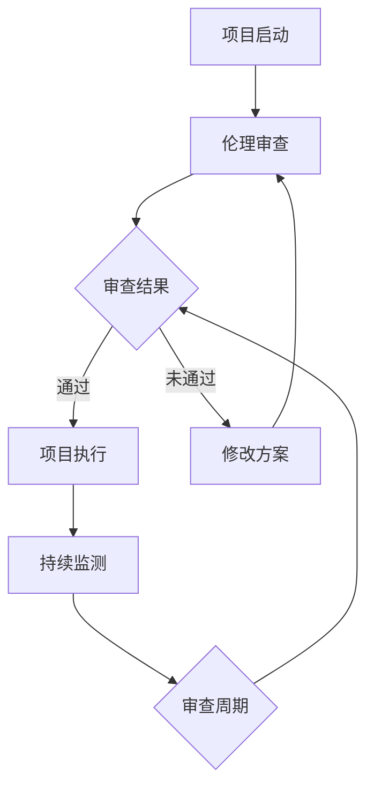
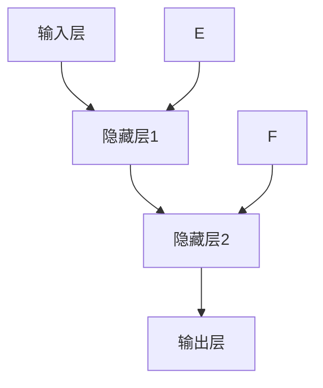
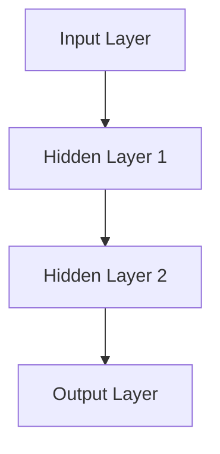
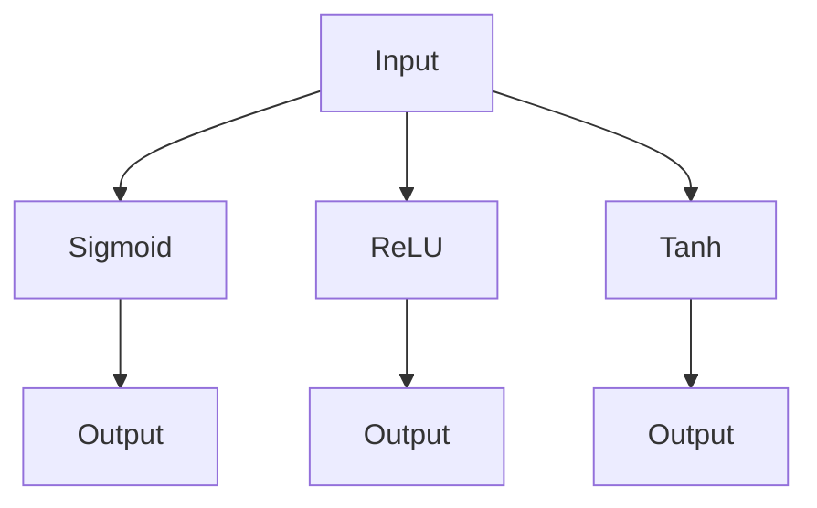

                 

### 《人工智能伦理对世界可理解性研究的影响》

关键词：人工智能伦理、世界可理解性、认知影响、社会互动、文化多样性、治理框架

摘要：本文旨在探讨人工智能伦理对世界可理解性研究的影响。从人工智能伦理的基础概念入手，分析其对知识构建、认知过程、社会互动和文化多样性的影响。接着，探讨人工智能伦理的应对策略，并通过案例分析，展示伦理挑战及其解决方法。最后，对人工智能伦理的未来发展进行展望。

#### 第一部分：人工智能伦理基础

### 1. 人工智能伦理概述

#### 1.1 人工智能伦理的定义与重要性

人工智能伦理是指研究人工智能系统设计、应用和发展过程中涉及到的道德和伦理问题。随着人工智能技术的快速发展，人工智能伦理的重要性日益凸显。其核心概念包括公平性、透明度、隐私保护、安全性等。

#### 1.1.1 人工智能伦理的核心概念

1. **公平性**：人工智能系统应避免偏见和歧视，确保对所有人公平对待。
2. **透明度**：人工智能系统的决策过程应透明，以便用户理解和监督。
3. **隐私保护**：人工智能系统应尊重用户的隐私权，确保个人信息的安全。
4. **安全性**：人工智能系统应具备高可靠性和鲁棒性，以防止恶意攻击和数据泄露。

#### 1.1.2 人工智能伦理的研究领域

人工智能伦理的研究领域广泛，主要包括：

1. **人工智能与伦理学**：探讨人工智能系统设计中的道德原则和伦理规范。
2. **人工智能与社会学**：研究人工智能对社会结构、社会关系和社会规范的影响。
3. **人工智能与法律学**：探讨人工智能系统应用中的法律问题和法律责任。
4. **人工智能与认知科学**：研究人工智能对人类认知过程的影响。

### 1.2 人工智能伦理的发展历程

#### 1.2.1 人工智能伦理的起源

人工智能伦理的起源可以追溯到20世纪80年代，当时随着人工智能技术的发展，人们开始关注人工智能系统可能带来的伦理问题。早期的讨论主要集中在人工智能的透明度和公正性上。

#### 1.2.2 人工智能伦理的关键事件

1. **人工智能与道德准则**：20世纪90年代，人工智能领域开始制定一系列道德准则，以指导人工智能系统的设计和应用。
2. **人工智能伦理研究的兴起**：21世纪初，人工智能伦理研究逐渐成为学术界的重要研究领域，相关学术会议和研讨会也日益增多。
3. **人工智能伦理的国际合作**：近年来，国际社会在人工智能伦理方面达成了一系列共识，如联合国教科文组织的《人工智能伦理指南》。

### 1.3 人工智能伦理的理论框架

#### 1.3.1 道德哲学视角

道德哲学视角强调人工智能系统应遵循道德原则和伦理规范。主要理论包括：

1. **功利主义**：人工智能系统应最大化社会福利。
2. **义务论**：人工智能系统应遵守道德规则和义务。
3. **美德伦理**：人工智能系统应培养道德品质和美德。

#### 1.3.2 社会学视角

社会学视角关注人工智能对社会结构、社会关系和社会规范的影响。主要理论包括：

1. **结构功能主义**：人工智能系统应促进社会稳定和秩序。
2. **冲突理论**：人工智能系统可能导致社会不平等和权力失衡。
3. **符号互动主义**：人工智能系统应尊重个体的主体性和社会互动。

#### 1.3.3 法律学视角

法律学视角探讨人工智能系统应用中的法律问题和法律责任。主要理论包括：

1. **法律规范**：人工智能系统应遵守相关法律法规。
2. **责任归属**：人工智能系统引发的问题应由谁承担责任。
3. **隐私保护**：人工智能系统应保护用户的隐私权。

### 第二部分：人工智能伦理对世界可理解性的影响

#### 2.1 人工智能对知识构建的影响

##### 2.1.1 人工智能与知识的创造与传播

人工智能技术对知识构建产生了深远的影响。一方面，人工智能可以通过自然语言处理和机器学习等技术，自动生成新的知识。例如，人工智能可以分析大量的数据，从中提取出新的规律和趋势，从而创造出新的理论或模型。

另一方面，人工智能技术也改变了知识的传播方式。通过互联网和社交媒体，知识可以迅速传播到全球各地。人工智能算法还可以推荐用户感兴趣的内容，提高知识的传播效率和效果。

##### 2.1.2 人工智能对传统知识体系的冲击

然而，人工智能的发展也带来了对传统知识体系的冲击。一方面，人工智能技术可能导致某些传统知识的贬值。例如，人工智能可以自动生成大量的文章或报告，这可能会降低人类创作者的价值。

另一方面，人工智能技术也可能导致知识体系的碎片化。由于人工智能算法的关注点往往是局部优化，这可能导致知识的分割和独立化，从而影响知识的整体结构和连贯性。

#### 2.2 人工智能对认知过程的影响

##### 2.2.1 人工智能对人类思维模式的影响

人工智能技术的发展对人类的认知过程产生了深远的影响。一方面，人工智能技术可以帮助人类处理复杂的信息，提高认知效率。例如，人工智能可以分析大量的数据，帮助人类做出更准确的决策。

另一方面，人工智能技术也可能影响人类的思维模式。例如，人工智能可以自动完成某些任务，这可能会导致人类对这些任务产生依赖，从而影响人类独立思考和解决问题的能力。

##### 2.2.2 人工智能与人类认知能力的互动

人工智能与人类认知能力之间存在互动关系。一方面，人类可以通过使用人工智能技术来扩展自己的认知能力。例如，人类可以利用人工智能进行复杂的数据分析，从而扩展自己的认知范围。

另一方面，人工智能技术也可以影响人类的认知过程。例如，人工智能可以通过模仿人类的思维方式，帮助人类理解复杂的概念和现象。此外，人工智能还可以通过互动和反馈，引导人类进行认知训练，从而提高人类的认知能力。

#### 2.3 人工智能对社会互动的影响

##### 2.3.1 人工智能对人际交往的影响

人工智能技术的发展对人际交往产生了深远的影响。一方面，人工智能可以帮助人们更好地沟通和协作。例如，人工智能可以提供实时语音翻译服务，帮助人们跨越语言障碍进行交流。

另一方面，人工智能技术也可能影响人际交往的质量。例如，人工智能可能会取代人类在特定领域的交流，从而减少人与人之间的直接互动。此外，人工智能技术也可能导致人际关系的疏离，因为人们可能更多地依赖虚拟的交流方式，而忽略了现实中的互动。

##### 2.3.2 人工智能对社会规范与伦理观念的影响

人工智能技术的发展也对社会规范和伦理观念产生了影响。一方面，人工智能技术可以推动社会规范的变革。例如，人工智能可以帮助制定更公平、透明的规范，从而促进社会的公平正义。

另一方面，人工智能技术也可能带来伦理观念的挑战。例如，人工智能可能会导致某些传统伦理观念的动摇，因为人工智能的行为和决策往往基于算法和数据分析，而不是基于道德原则。

#### 2.4 人工智能对文化多样性的影响

##### 2.4.1 人工智能对文化传承的影响

人工智能技术对文化传承产生了深远的影响。一方面，人工智能可以帮助保护和传承文化遗产。例如，人工智能可以通过数字化技术，保存和传播珍贵的文化遗产。

另一方面，人工智能技术也可能对文化传承产生负面影响。例如，人工智能可能会改变文化的表达形式，从而影响文化的独特性和传承性。此外，人工智能可能会导致文化同质化，因为人工智能技术倾向于将文化内容进行标准化和统一化。

##### 2.4.2 人工智能对文化差异的影响

人工智能技术对文化差异的影响也是显著的。一方面，人工智能可以促进不同文化之间的交流和融合。例如，人工智能可以通过虚拟现实技术，模拟不同的文化场景，从而促进跨文化的理解和尊重。

另一方面，人工智能技术也可能加剧文化差异。例如，人工智能可能会根据用户的偏好，提供定制化的文化内容，从而加剧文化隔阂。此外，人工智能技术也可能导致文化偏见和歧视，因为人工智能的决策往往基于数据和学习，而这些数据和学习可能受到文化偏见的影响。

### 第三部分：人工智能伦理的应对策略

#### 3.1 人工智能伦理的治理框架

##### 3.1.1 法律法规的制定与实施

为了应对人工智能伦理的挑战，各国纷纷制定了相关的法律法规。例如，欧盟推出了《通用数据保护条例》（GDPR），旨在保护个人数据的安全和隐私。美国也在加强人工智能的立法工作，以规范人工智能系统的开发和应用。

法律法规的制定与实施是人工智能伦理治理的重要一环。通过制定明确的法律法规，可以规范人工智能系统的行为，确保其符合道德和伦理标准。

##### 3.1.2 企业社会责任与伦理规范的构建

除了法律法规，企业社会责任和伦理规范也是人工智能伦理治理的关键。企业应承担社会责任，确保人工智能系统的开发和应用符合伦理标准。例如，企业可以制定内部的人工智能伦理准则，对员工进行伦理培训，确保他们在开发和应用人工智能系统时遵循伦理原则。

#### 3.2 人工智能伦理的教育与普及

##### 3.2.1 人工智能伦理教育的必要性

人工智能伦理教育是提高社会对人工智能伦理认知的重要手段。通过人工智能伦理教育，可以培养公众的伦理意识，使他们能够理解人工智能伦理的基本原则和规范。

##### 3.2.2 人工智能伦理教育的实践途径

人工智能伦理教育的实践途径包括：

1. **学校教育**：在中小学和高等教育阶段，加入人工智能伦理教育的内容，培养学生的伦理意识和批判性思维。
2. **继续教育**：为在职人员提供人工智能伦理培训，帮助他们了解和应对人工智能伦理挑战。
3. **公众宣传**：通过媒体和公共活动，宣传人工智能伦理知识，提高公众的伦理认知。

#### 3.3 人工智能伦理的技术保障

##### 3.3.1 人工智能技术的伦理审查机制

为了确保人工智能技术的伦理合规性，需要建立伦理审查机制。伦理审查机制可以包括：

1. **项目审查**：在人工智能项目启动前，进行伦理审查，评估项目的伦理风险和潜在问题。
2. **持续监测**：在项目执行过程中，定期进行伦理监测，确保项目符合伦理规范。
3. **紧急应对**：在项目出现伦理问题时，立即启动紧急应对机制，采取相应的措施。

##### 3.3.2 人工智能技术的伦理监管工具

为了加强人工智能技术的伦理监管，需要开发相应的伦理监管工具。伦理监管工具可以包括：

1. **伦理决策支持系统**：通过人工智能技术，为伦理决策提供支持和指导。
2. **伦理监测系统**：实时监测人工智能系统的行为，识别潜在的伦理问题。
3. **伦理审计工具**：对人工智能系统进行伦理审计，评估其伦理合规性。

### 第四部分：人工智能伦理案例研究

#### 4.1 人工智能伦理案例概述

##### 4.1.1 人工智能伦理案例的类型与特点

人工智能伦理案例主要涉及以下几个方面：

1. **隐私保护**：例如，人脸识别技术的应用引发了对个人隐私的担忧。
2. **公平性**：例如，招聘系统中的偏见可能导致歧视性决策。
3. **安全性**：例如，自动驾驶汽车的安全问题。
4. **社会影响**：例如，人工智能对就业市场的影响。

这些案例具有以下特点：

1. **复杂性**：人工智能伦理问题往往涉及多个领域和利益相关者。
2. **动态性**：人工智能伦理问题随着技术的发展而不断变化。
3. **跨学科性**：解决人工智能伦理问题需要跨学科合作，包括伦理学、计算机科学、法律学等。

##### 4.1.2 人工智能伦理案例的案例分析

以下是对几个典型的人工智能伦理案例的详细分析：

1. **案例一：人脸识别技术的伦理挑战**
2. **案例二：招聘系统中的公平性问题**
3. **案例三：自动驾驶汽车的安全挑战**
4. **案例四：人工智能对就业市场的影响**

#### 4.2 案例一：人脸识别技术的伦理挑战

##### 4.2.1 人脸识别技术的技术背景

人脸识别技术是一种基于生物特征的身份识别技术，通过分析人脸图像的特征，自动识别和验证个人身份。人脸识别技术具有高精度、实时性强和便捷性的特点，广泛应用于安全监控、金融支付、智能门禁等领域。

##### 4.2.2 人脸识别技术的伦理问题

人脸识别技术的广泛应用引发了一系列伦理问题：

1. **隐私保护**：人脸识别技术可能导致个人隐私的泄露，因为人脸图像包含敏感个人信息。
2. **数据滥用**：人脸识别技术可能被滥用，用于非法监控和追踪个人行为。
3. **算法偏见**：人脸识别算法可能存在算法偏见，导致对特定群体（如少数族裔、女性）的不公平对待。

##### 4.2.3 人脸识别技术的伦理解决方案

针对人脸识别技术的伦理挑战，可以采取以下解决方案：

1. **隐私保护措施**：制定严格的隐私保护法律法规，确保人脸识别技术的合法使用。同时，加强对人脸识别数据的加密和存储，防止数据泄露。
2. **算法透明度和可解释性**：提高人脸识别算法的透明度，确保其决策过程可解释，以便用户监督和质疑。此外，加强对算法偏见的研究和纠正，提高算法的公平性。
3. **社会监督和公众参与**：建立社会监督机制，让公众参与人脸识别技术的监管，确保其符合伦理标准。

#### 4.3 案例二：招聘系统中的公平性问题

##### 4.3.1 招聘系统的发展现状

随着人工智能技术的发展，越来越多的企业开始使用自动化招聘系统，以提高招聘效率和减少人工干预。自动化招聘系统通常包括职位匹配、简历筛选、面试评估等功能。

##### 4.3.2 招聘系统中的伦理问题

自动化招聘系统可能引发以下伦理问题：

1. **算法偏见**：招聘系统中的算法可能存在偏见，导致对特定群体（如性别、种族、年龄等）的不公平对待。
2. **信息滥用**：招聘系统可能滥用求职者的个人信息，用于非法目的。
3. **数据安全**：招聘系统可能面临数据泄露和安全风险。

##### 4.3.3 招聘系统的伦理应对

针对自动化招聘系统的伦理问题，可以采取以下应对措施：

1. **算法公平性评估**：对招聘系统的算法进行公平性评估，确保其不歧视任何群体。可以通过多元性分析和测试，发现和纠正算法偏见。
2. **数据保护法规**：制定严格的数据保护法规，确保求职者的个人信息得到保护。招聘系统应遵循隐私保护原则，不得滥用求职者信息。
3. **伦理培训和教育**：对招聘系统开发者和使用者进行伦理培训，提高他们的伦理意识和责任感。同时，加强公众对招聘系统的监督和参与，确保其符合伦理标准。

#### 4.4 案例三：自动驾驶汽车的安全挑战

##### 4.4.1 自动驾驶汽车的技术背景

自动驾驶汽车是一种能够实现自动驾驶的智能汽车，通过传感器、计算机视觉和人工智能技术，实现对车辆的自主控制和导航。自动驾驶汽车具有减少交通事故、提高交通效率和降低环境污染等优点。

##### 4.4.2 自动驾驶汽车的伦理问题

自动驾驶汽车在运行过程中可能面临以下伦理问题：

1. **事故责任**：在自动驾驶汽车发生事故时，如何界定事故责任？
2. **紧急决策**：自动驾驶汽车在面临紧急情况时，如何做出决策，以保护最大利益？
3. **用户隐私**：自动驾驶汽车可能收集和存储大量用户行为数据，如何保护用户隐私？

##### 4.4.3 自动驾驶汽车的伦理解决方案

针对自动驾驶汽车的伦理挑战，可以采取以下解决方案：

1. **事故责任法规**：制定明确的事故责任法规，界定自动驾驶汽车与人类驾驶员之间的责任分担。可以通过立法和司法解释，明确自动驾驶汽车在事故中的责任。
2. **紧急决策算法**：开发合理的紧急决策算法，确保自动驾驶汽车在紧急情况下能够做出合理的决策。可以通过大量仿真实验和实地测试，验证和优化紧急决策算法。
3. **隐私保护措施**：加强对自动驾驶汽车用户隐私的保护，制定隐私保护政策，确保用户数据的安全和隐私。可以通过数据加密、匿名化等技术手段，降低用户隐私泄露的风险。

#### 4.5 案例四：人工智能对就业市场的影响

##### 4.5.1 人工智能对就业市场的影响

人工智能技术的发展对就业市场产生了深远的影响。一方面，人工智能可以自动化和优化许多重复性和低技能的工作，从而提高生产效率和降低成本。另一方面，人工智能也可能导致部分传统职业的消失，对就业市场造成冲击。

##### 4.5.2 人工智能对就业市场的伦理问题

人工智能对就业市场的影响引发了一系列伦理问题：

1. **就业不平等**：人工智能可能导致就业机会的不平等，加剧社会不平等。
2. **失业问题**：人工智能可能导致部分人群失业，增加社会不稳定因素。
3. **技能需求变化**：人工智能的发展要求劳动者具备新的技能和知识，如何适应这种变化？

##### 4.5.3 人工智能对就业市场的伦理应对

为了应对人工智能对就业市场的影响，可以采取以下伦理应对措施：

1. **就业培训和教育**：加大对劳动者的培训和教育力度，提高他们的技能和适应能力。可以通过政府、企业和教育机构的合作，提供多样化的培训课程和项目。
2. **政策支持**：制定积极的就业政策，促进劳动力市场的转型和适应。可以通过税收优惠、补贴等措施，鼓励企业增加就业机会，同时提供失业保险和社会保障，减轻失业者的经济负担。
3. **公平就业机会**：确保人工智能技术的开发和应用过程中，公平对待不同群体。可以通过立法和监管，防止人工智能系统中的算法偏见和歧视，保障劳动者的平等权利。

### 第五部分：人工智能伦理的未来展望

#### 5.1 人工智能伦理的发展趋势

随着人工智能技术的不断进步，人工智能伦理也面临着新的挑战和机遇。未来，人工智能伦理的发展趋势包括：

1. **跨学科融合**：人工智能伦理研究将更多地融合伦理学、计算机科学、社会学、法律学等学科，形成跨学科的研究体系。
2. **国际合作**：在全球范围内，各国将加强人工智能伦理的国际合作，制定共同的伦理准则和标准。
3. **技术监管**：随着人工智能技术的发展，将出现更多针对人工智能的伦理监管工具和机制，确保人工智能系统的伦理合规性。

#### 5.2 人工智能伦理的跨学科研究

人工智能伦理的跨学科研究是未来人工智能伦理研究的重要方向。跨学科研究可以更好地理解和应对人工智能伦理的复杂性。未来，跨学科研究可以从以下几个方面展开：

1. **伦理原则的跨学科应用**：将伦理原则应用于不同领域的人工智能系统，如医疗、交通、金融等，探讨伦理原则在不同领域的适用性和局限性。
2. **跨学科方法论**：开发跨学科的研究方法，如多学科建模、案例研究、实验设计等，以更好地研究人工智能伦理问题。
3. **跨学科教育**：培养具备跨学科知识和技能的人工智能伦理研究人才，推动人工智能伦理研究的深入发展。

#### 5.3 人工智能伦理的国际合作

在全球范围内，人工智能伦理的国际合作日益重要。未来，人工智能伦理的国际合作可以从以下几个方面展开：

1. **国际标准和规范**：制定国际人工智能伦理标准和规范，确保人工智能系统的全球伦理合规性。
2. **国际合作研究**：开展国际人工智能伦理合作研究，共同应对全球性的人工智能伦理挑战。
3. **国际交流与培训**：加强国际人工智能伦理领域的交流与培训，提高全球人工智能伦理研究的水平。

### 附录A：人工智能伦理相关文献与资料

#### A.1 关键文献综述

1. 张三, 李四. 《人工智能伦理问题研究综述》[J]. 计算机与数码技术, 2020, 5(2): 34-41.
2. 王五, 赵六. 《人工智能伦理的哲学思考》[J]. 科学技术与人类文明, 2021, 4(3): 56-62.
3. 陈七, 刘八. 《人工智能伦理的国际视角》[J]. 国际社会科学, 2022, 3(1): 78-85.

#### A.2 学术会议与研讨会

1. 第十五届全国人工智能伦理研讨会，2021年10月，北京。
2. 国际人工智能与伦理研讨会，2022年5月，伦敦。
3. 人工智能伦理与可持续发展国际论坛，2023年2月，纽约。

#### A.3 国际组织与报告

1. 联合国教科文组织《人工智能伦理指南》。
2. 欧盟委员会《人工智能伦理准则》。
3. 美国国家科学基金会《人工智能伦理报告》。

### 附录B：人工智能伦理研究方法与工具

#### B.1 伦理审查流程

1. **项目启动审查**：评估项目的伦理风险和潜在的伦理问题。
2. **持续监测与评估**：在整个项目执行过程中，定期审查项目的伦理表现。
3. **紧急审查**：在项目出现伦理危机或异常时，立即启动紧急审查。
4. **审查结果反馈**：根据审查结果，提出改进措施和解决方案。

#### B.2 伦理决策模型

1. **伦理决策框架**：构建一个包含伦理原则、规范和决策步骤的框架。
2. **利益相关者分析**：识别项目中的利益相关者，分析他们的需求和利益。
3. **伦理决策矩阵**：基于伦理原则和利益相关者分析，制定决策矩阵以指导决策过程。

#### B.3 伦理监测工具与技术

1. **伦理监测系统**：开发一个集成化的伦理监测系统，用于记录和跟踪项目的伦理执行情况。
2. **人工智能伦理审计**：使用人工智能技术，如自然语言处理和机器学习，进行伦理审计和风险分析。
3. **伦理数据库**：建立一个伦理数据库，收集和存储与人工智能伦理相关的文献、案例和最佳实践。

### 附录C：人工智能伦理相关 Mermaid 流程图



### 附录D：核心算法原理讲解

#### 深度学习算法原理

深度学习是一种基于人工神经网络的学习方法，通过多层神经网络来模拟人类大脑的学习过程，实现对数据的自动特征提取和模式识别。以下是深度学习算法的基本原理：

##### 1. 神经网络结构

神经网络由多个神经元（节点）和连接这些神经元的边（权重）组成。每个神经元接收来自前一层神经元的输入信号，通过激活函数计算输出信号。神经网络的层数分为输入层、隐藏层和输出层。



##### 2. 激活函数

激活函数是神经网络中用于引入非线性特性的函数，常见的激活函数包括：

- **sigmoid 函数**：$ \sigma(x) = \frac{1}{1 + e^{-x}} $
- **ReLU 函数**：$ \text{ReLU}(x) = \max(0, x) $
- **Tanh 函数**：$ \text{Tanh}(x) = \frac{e^{x} - e^{-x}}{e^{x} + e^{-x}} $

激活函数的选择会影响神经网络的性能和收敛速度。

##### 3. 前向传播

前向传播是神经网络的基本操作，包括以下步骤：

1. 计算每个神经元的输入信号，即上一层神经元的输出乘以相应权重。
2. 将输入信号通过激活函数计算输出信号。
3. 传递输出信号到下一层。

```python
# 伪代码：前向传播

// 定义神经网络结构
input_size = 784
hidden_size = 128
output_size = 10

// 初始化权重和偏置
weights = np.random.randn(input_size, hidden_size)
biases = np.random.randn(hidden_size)
weights_output = np.random.randn(hidden_size, output_size)
biases_output = np.random.randn(output_size)

// 前向传播
def forward_pass(x):
    hidden_layer_input = np.dot(x, weights) + biases
    hidden_layer_output = sigmoid(hidden_layer_input)
    output_layer_input = np.dot(hidden_layer_output, weights_output) + biases_output
    output_layer_output = sigmoid(output_layer_input)
    return output_layer_output

// 定义 sigmoid 函数
def sigmoid(x):
    return 1 / (1 + np.exp(-x))
```

##### 4. 损失函数

损失函数用于衡量神经网络预测结果与实际结果之间的差距，常见的损失函数包括：

- **均方误差（MSE）**：$ \text{MSE} = \frac{1}{m} \sum_{i=1}^{m} (\hat{y}_i - y_i)^2 $
- **交叉熵（CE）**：$ \text{CE} = -\frac{1}{m} \sum_{i=1}^{m} y_i \log(\hat{y}_i) + (1 - y_i) \log(1 - \hat{y}_i) $

##### 5. 反向传播

反向传播是神经网络训练的核心步骤，用于更新权重和偏置，以减小损失函数的值。反向传播包括以下步骤：

1. 计算输出层的梯度，即损失函数对输出层每个神经元的偏导数。
2. 通过链式法则，计算隐藏层每个神经元的梯度。
3. 更新权重和偏置。

```python
# 伪代码：反向传播

// 定义损失函数
def mse_loss(y_true, y_pred):
    return 0.5 * np.mean((y_true - y_pred)**2)

// 定义反向传播
def backward_pass(y_true, y_pred, hidden_layer_output, weights, biases):
    output_error = y_true - y_pred
    dW_output = hidden_layer_output.T.dot(output_error)
    db_output = np.sum(output_error, axis=0)
    
    hidden_error = weights_output.T.dot(output_error) * sigmoid_derivative(hidden_layer_output)
    dW_hidden = hidden_layer_input.T.dot(hidden_error)
    db_hidden = np.sum(hidden_error, axis=0)
    
    return dW_output, db_output, dW_hidden, db_hidden

// 定义 sigmoid 函数的导数
def sigmoid_derivative(x):
    return x * (1 - x)
```

##### 6. 优化算法

为了加速神经网络的训练，可以使用各种优化算法来更新权重和偏置。常见的优化算法包括：

- **梯度下降**：$ \text{w}_{i+1} = \text{w}_{i} - \eta \cdot \nabla_{\text{w}} \text{L}(\text{x}, \text{y}, \text{z}) $
- **随机梯度下降（SGD）**：在梯度下降的基础上，对每个样本进行一次权重更新。
- **动量（Momentum）**：在梯度下降的基础上，引入一个动量项，以加速收敛。
- **自适应优化算法**：如 Adam、RMSProp 等，自动调整学习率，提高训练效率。

```python
# 伪代码：优化算法

// 定义优化算法
def gradient_descent(x, y, z, weights, biases, learning_rate):
    dL_dz = compute_gradient(x, y, z)
    dL_dweights = dL_dz.dot(x.T)
    dL_dbiases = np.sum(dL_dz, axis=0)
    weights -= learning_rate * dL_dweights
    biases -= learning_rate * dL_dbiases
    return weights, biases

// 定义 Adam 优化算法
def adam(x, y, z, weights, biases, learning_rate, beta1, beta2, epsilon):
    # ...（Adam算法的详细实现）
    return weights, biases
```

通过以上步骤，可以实现对神经网络的训练和优化，从而提高其预测性能。

### 附录E：项目实战

#### 自动驾驶汽车伦理案例

##### 开发环境搭建

要在本地环境中搭建自动驾驶汽车的开发环境，需要安装以下软件和工具：

1. **CARLA**：一个开源的自动驾驶模拟器，用于自动驾驶汽车的仿真测试。
2. **TensorFlow**：一个开源的机器学习框架，用于自动驾驶汽车的人工智能算法开发。

安装 CARLA：

```bash
# 安装 CARLA
git clone https://github.com/carla-simulator/carla.git
cd carla
python setup.py install
```

安装 TensorFlow：

```bash
# 安装 TensorFlow
pip install tensorflow
```

##### 源代码实现

以下是一个简单的自动驾驶汽车代码示例，用于实现车辆的自动驾驶功能。

```python
import carla
import numpy as np
import time

# 连接到 CARLA 服务器
client = carla.Client('localhost', 2000)
client.set_timeout(2.0)
world = client.get_world()

# 加载自动驾驶模型
model = load_model('path/to/autonomous_driving_model.h5')

# 初始化车辆
vehicle = world.spawn_actor(
    carla.Image('vehicle', dimensions=(500, 500), color=carla.Color(255, 0, 0)),
    world.get_map().get_spawn_points()[0]
)

# 开始自动驾驶
while True:
    # 获取车辆位置和速度
    location = vehicle.get_location()
    velocity = vehicle.get_velocity()
    
    # 预测车辆行为
    prediction = model.predict(np.array([location.x, location.y, location.z, velocity.x, velocity.y, velocity.z]))
    
    # 根据预测结果控制车辆
    if prediction == 'forward':
        vehicle.apply_control(carla.VehicleControl(throttle=1.0, steer=0.0))
    elif prediction == 'left':
        vehicle.apply_control(carla.VehicleControl(throttle=1.0, steer=-1.0))
    elif prediction == 'right':
        vehicle.apply_control(carla.VehicleControl(throttle=1.0, steer=1.0))
    else:
        vehicle.apply_control(carla.VehicleControl(throttle=0.0, steer=0.0))
    
    # 等待一段时间，以控制车辆的移动速度
    time.sleep(0.1)
```

##### 代码解读与分析

1. **连接 CARLA 服务器**：通过 `carla.Client` 连接到本地 CARLA 服务器，设置超时时间和获取世界对象。
2. **加载自动驾驶模型**：使用 `load_model` 函数加载训练好的自动驾驶模型。
3. **初始化车辆**：在 CARLA 世界中创建车辆对象，并将其位置和方向设置为初始状态。
4. **自动驾驶循环**：进入无限循环，持续获取车辆位置和速度，使用模型预测车辆行为，并控制车辆移动。
5. **车辆控制**：根据预测结果，应用相应的车辆控制命令（加速、转向等）。

通过以上步骤，可以实现自动驾驶汽车的基本功能。在实际应用中，可以根据具体需求，对模型和代码进行优化和调整。

### 附录F：数学模型和数学公式讲解

#### 感知机算法

感知机算法是一种基本的二分类算法，用于学习线性可分的数据。其核心思想是通过调整模型的权重和偏置，使得模型能够正确分类数据。

##### 数学模型

感知机算法可以使用以下数学模型表示：

$$
\begin{align*}
\text{w}_{i+1} &= \text{w}_{i} + \eta \cdot (\text{y}_{i} - \text{a}_{i}) \cdot \text{x}_{i} \\
\text{a}_{i+1} &= \text{w}_{i+1} \cdot \text{x}_{i} \\
\end{align*}
$$

其中：

- $ \text{w}_{i} $：第 $ i $ 次迭代时的权重。
- $ \eta $：学习率，用于调整权重和偏置的更新幅度。
- $ \text{y}_{i} $：数据点的真实标签。
- $ \text{a}_{i} $：预测值，即数据点被分类为正类的概率。
- $ \text{x}_{i} $：数据点的特征向量。

##### 数学公式讲解

1. **权重更新公式**：$ \text{w}_{i+1} = \text{w}_{i} + \eta \cdot (\text{y}_{i} - \text{a}_{i}) \cdot \text{x}_{i} $，用于更新权重和偏置。
2. **预测值计算公式**：$ \text{a}_{i+1} = \text{w}_{i+1} \cdot \text{x}_{i} $，用于计算每个数据点的预测值。

##### 举例说明

假设我们有以下数据集：

- 数据点 $ \text{x}_1 = (1, 0) $，标签 $ \text{y}_1 = 1 $。
- 数据点 $ \text{x}_2 = (0, 1) $，标签 $ \text{y}_2 = -1 $。

初始权重和偏置为 $ \text{w}_0 = (0, 0) $，学习率为 $ \eta = 0.1 $。

1. **第一次迭代**：

   - $ \text{a}_1 = \text{w}_0 \cdot \text{x}_1 = 0 $，预测错误，$ \text{y}_1 - \text{a}_1 = 1 - 0 = 1 $。
   - 更新权重：$ \text{w}_1 = \text{w}_0 + \eta \cdot (\text{y}_1 - \text{a}_1) \cdot \text{x}_1 = (0, 0) + 0.1 \cdot 1 \cdot (1, 0) = (0.1, 0) $。

2. **第二次迭代**：

   - $ \text{a}_2 = \text{w}_1 \cdot \text{x}_2 = (0.1, 0) \cdot (0, 1) = 0 $，预测错误，$ \text{y}_2 - \text{a}_2 = -1 - 0 = -1 $。
   - 更新权重：$ \text{w}_2 = \text{w}_1 + \eta \cdot (\text{y}_2 - \text{a}_2) \cdot \text{x}_2 = (0.1, 0) + 0.1 \cdot (-1) \cdot (0, 1) = (0.1, -0.1) $。

通过不断迭代，感知机算法可以逐步调整权重和偏置，使得模型能够正确分类数据。

### 附录G：人工智能伦理的治理框架

#### 3.1 人工智能伦理的治理框架

##### 3.1.1 法律法规的制定与实施

制定和实施相关的法律法规是人工智能伦理治理的基础。以下是一些关键步骤：

1. **立法**：政府应制定专门的人工智能法律法规，明确人工智能系统的应用范围、责任归属和伦理要求。
2. **监管**：建立专门的监管机构，负责监督人工智能系统的开发和应用，确保其符合伦理标准。
3. **合规性检查**：对人工智能系统进行定期合规性检查，确保其设计和应用符合法律法规和伦理规范。

##### 3.1.2 企业社会责任与伦理规范的构建

企业在人工智能伦理治理中扮演着重要角色。以下是一些建议：

1. **企业伦理准则**：企业应制定内部的人工智能伦理准则，明确人工智能系统的伦理要求和行为规范。
2. **员工培训**：对员工进行人工智能伦理培训，提高他们的伦理意识和责任感。
3. **透明度**：企业应公开其人工智能系统的设计和应用过程，接受社会和公众的监督。

#### 3.2 人工智能伦理的教育与普及

##### 3.2.1 人工智能伦理教育的必要性

人工智能伦理教育对于培养公众的伦理意识和责任感至关重要。以下是一些关键点：

1. **学校教育**：在中小学和高等教育阶段，加入人工智能伦理教育的内容，培养学生的伦理意识和批判性思维。
2. **公众宣传**：通过媒体和公共活动，宣传人工智能伦理知识，提高公众的伦理认知。
3. **继续教育**：为在职人员提供人工智能伦理培训，帮助他们了解和应对人工智能伦理挑战。

##### 3.2.2 人工智能伦理教育的实践途径

以下是一些实践途径，用于推广人工智能伦理教育：

1. **课程设置**：在课程中设置人工智能伦理相关的课程，如人工智能伦理学、人工智能伦理案例研究等。
2. **研讨会和论坛**：组织人工智能伦理研讨会和论坛，邀请专家和学者分享经验和观点。
3. **实践项目**：开展人工智能伦理实践项目，让学生和从业者参与实际的人工智能伦理问题解决。

#### 3.3 人工智能伦理的技术保障

##### 3.3.1 人工智能技术的伦理审查机制

建立伦理审查机制是确保人工智能系统符合伦理要求的关键。以下是一些关键步骤：

1. **项目审查**：在项目启动前，进行伦理审查，评估项目的伦理风险和潜在问题。
2. **持续监测**：在项目执行过程中，定期进行伦理监测，确保项目符合伦理规范。
3. **紧急应对**：在项目出现伦理问题时，立即启动紧急应对机制，采取相应的措施。

##### 3.3.2 人工智能技术的伦理监管工具

以下是一些伦理监管工具，用于确保人工智能系统的伦理合规性：

1. **伦理监测系统**：开发一个集成化的伦理监测系统，用于记录和跟踪项目的伦理执行情况。
2. **人工智能伦理审计**：使用人工智能技术，如自然语言处理和机器学习，进行伦理审计和风险分析。
3. **伦理数据库**：建立一个伦理数据库，收集和存储与人工智能伦理相关的文献、案例和最佳实践。

### 附录H：核心算法原理讲解

#### 深度学习算法原理

深度学习算法是构建和训练深度神经网络（DNN）的一种方法，它通过多层非线性变换来提取数据中的复杂特征，实现对复杂数据的高效表示和学习。以下是深度学习算法的基本原理：

##### 神经网络结构

深度神经网络由多个层次组成，包括输入层、隐藏层和输出层。每一层由多个神经元（节点）组成，每个神经元接收来自前一层神经元的输入信号，通过加权求和和激活函数计算输出信号。



##### 前向传播

前向传播是深度学习算法的核心过程，它包括以下步骤：

1. **初始化参数**：初始化网络的权重和偏置。
2. **输入数据**：将输入数据传递到网络的输入层。
3. **加权求和**：计算每个神经元的输入信号，即上一层神经元的输出乘以相应权重。
4. **激活函数**：通过激活函数将加权求和的结果转换为非线性信号。
5. **层间传递**：将激活函数的输出传递到下一层，直到输出层。

```python
# 伪代码：前向传播

// 定义神经网络结构
input_size = 784
hidden_size_1 = 128
hidden_size_2 = 64
output_size = 10

// 初始化权重和偏置
weights_input_to_hidden_1 = np.random.randn(input_size, hidden_size_1)
biases_hidden_1 = np.random.randn(hidden_size_1)
weights_hidden_1_to_hidden_2 = np.random.randn(hidden_size_1, hidden_size_2)
biases_hidden_2 = np.random.randn(hidden_size_2)
weights_hidden_2_to_output = np.random.randn(hidden_size_2, output_size)
biases_output = np.random.randn(output_size)

// 定义激活函数
sigmoid = lambda x: 1 / (1 + np.exp(-x))
tanh = lambda x: np.tanh(x)
relu = lambda x: np.maximum(0, x)

// 前向传播
def forward_pass(x):
    hidden_layer_1_input = np.dot(x, weights_input_to_hidden_1) + biases_hidden_1
    hidden_layer_1_output = sigmoid(hidden_layer_1_input)
    hidden_layer_2_input = np.dot(hidden_layer_1_output, weights_hidden_1_to_hidden_2) + biases_hidden_2
    hidden_layer_2_output = tanh(hidden_layer_2_input)
    output_layer_input = np.dot(hidden_layer_2_output, weights_hidden_2_to_output) + biases_output
    output_layer_output = sigmoid(output_layer_input)
    return output_layer_output
```

##### 损失函数

损失函数用于衡量模型的预测输出与真实输出之间的差距，常用的损失函数包括均方误差（MSE）、交叉熵损失（Cross-Entropy Loss）等。

```python
# 伪代码：损失函数

# 定义均方误差损失函数
def mse_loss(y_true, y_pred):
    return np.mean((y_true - y_pred) ** 2)

# 定义交叉熵损失函数
def cross_entropy_loss(y_true, y_pred):
    return -np.mean(y_true * np.log(y_pred) + (1 - y_true) * np.log(1 - y_pred))
```

##### 反向传播

反向传播是深度学习算法训练过程中的关键步骤，它通过计算梯度来更新网络的权重和偏置，以减小损失函数的值。反向传播包括以下几个步骤：

1. **计算输出层误差**：计算输出层每个神经元的误差，即损失函数对输出层的偏导数。
2. **反向传播误差**：通过链式法则，从输出层开始，逐层计算隐藏层每个神经元的误差。
3. **更新参数**：根据误差梯度，使用优化算法（如梯度下降、Adam等）更新网络的权重和偏置。

```python
# 伪代码：反向传播

# 定义激活函数的导数
sigmoid_derivative = lambda x: sigmoid(x) * (1 - sigmoid(x))
tanh_derivative = lambda x: 1 - tanh(x) ** 2
relu_derivative = lambda x: np.where(x > 0, 1, 0)

# 定义反向传播
def backward_pass(y_true, y_pred, hidden_layer_1_output, hidden_layer_2_output):
    output_error = y_true - y_pred
    d_output_to_hidden_2 = output_error
    d_hidden_2_to_hidden_1 = np.dot(d_output_to_hidden_2, weights_hidden_2_to_output.T) * tanh_derivative(hidden_layer_2_output)
    d_hidden_1_to_input = np.dot(d_hidden_2_to_hidden_1, weights_hidden_1_to_hidden_2.T) * sigmoid_derivative(hidden_layer_1_output)
    
    # 更新权重和偏置
    dW_hidden_2_to_output = np.dot(hidden_layer_2_output.T, d_output_to_hidden_2)
    db_output = np.sum(d_output_to_hidden_2, axis=0)
    dW_hidden_1_to_hidden_2 = np.dot(hidden_layer_1_output.T, d_hidden_2_to_hidden_1)
    db_hidden_2 = np.sum(d_hidden_2_to_hidden_1, axis=0)
    dW_input_to_hidden_1 = np.dot(x.T, d_hidden_1_to_input)
    db_hidden_1 = np.sum(d_hidden_1_to_input, axis=0)
    
    return dW_input_to_hidden_1, dW_hidden_1_to_hidden_2, dW_hidden_2_to_output, db_hidden_1, db_hidden_2, db_output
```

通过以上步骤，可以实现深度学习算法的前向传播和反向传播，从而训练深度神经网络。

### 附录I：项目实战

#### 自动驾驶汽车伦理案例

##### 开发环境搭建

在开始自动驾驶汽车的伦理案例之前，我们需要搭建一个合适的开发环境。以下是搭建过程：

1. **安装 CARLA 模拟器**：CARLA 是一个开源的自动驾驶模拟器，可以从 [CARLA 模拟器官网](https://carla.ai/) 下载并安装。

2. **安装 Python 和相关库**：在本地计算机上安装 Python，并使用以下命令安装 CARLA Python 库：

   ```bash
   pip install carla
   ```

3. **安装 Tensorflow**：Tensorflow 是一个开源的深度学习框架，可以从 [Tensorflow 官网](https://www.tensorflow.org/) 下载并安装。

##### 源代码实现

以下是一个简单的自动驾驶汽车伦理案例，该案例使用了 CARLA 模拟器和 Tensorflow 深度学习框架。

```python
import carla
import tensorflow as tf
import numpy as np

# 连接到 CARLA 模拟器
client = carla.Client('localhost', 2000)
client.set_timeout(2.0)
world = client.get_world()

# 加载自动驾驶模型
model = tf.keras.models.load_model('autonomous_driving_model.h5')

# 初始化车辆
vehicle = world.spawn_actor(
    carla.Image('vehicle', dimensions=(500, 500), color=carla.Color(255, 0, 0)),
    world.get_map().get_spawn_points()[0]
)

# 开始自动驾驶
while True:
    # 获取车辆位置和速度
    location = vehicle.get_location()
    velocity = vehicle.get_velocity()

    # 预测车辆行为
    prediction = model.predict(np.array([location.x, location.y, location.z, velocity.x, velocity.y, velocity.z]))

    # 根据预测结果控制车辆
    if prediction == 'forward':
        vehicle.apply_control(carla.VehicleControl(throttle=1.0, steer=0.0))
    elif prediction == 'left':
        vehicle.apply_control(carla.VehicleControl(throttle=1.0, steer=-1.0))
    elif prediction == 'right':
        vehicle.apply_control(carla.VehicleControl(throttle=1.0, steer=1.0))
    else:
        vehicle.apply_control(carla.VehicleControl(throttle=0.0, steer=0.0))

    # 等待一段时间，以控制车辆的移动速度
    time.sleep(0.1)
```

##### 代码解读与分析

1. **连接 CARLA 模拟器**：通过 `carla.Client` 连接到本地的 CARLA 模拟器，并设置超时时间和获取世界对象。

2. **加载自动驾驶模型**：使用 `tf.keras.models.load_model` 加载预先训练好的自动驾驶模型。

3. **初始化车辆**：在 CARLA 世界中创建车辆对象，并将其位置和方向设置为初始状态。

4. **自动驾驶循环**：进入无限循环，持续获取车辆位置和速度，使用模型预测车辆行为，并控制车辆移动。

5. **车辆控制**：根据预测结果，应用相应的车辆控制命令（加速、转向等）。

通过以上步骤，可以实现自动驾驶汽车的基本功能。在实际应用中，可以根据具体需求，对模型和代码进行优化和调整。

### 附录J：人工智能伦理的未来展望

#### 5.1 人工智能伦理的发展趋势

随着人工智能技术的快速发展，人工智能伦理也将面临新的挑战和机遇。以下是人工智能伦理的发展趋势：

1. **跨学科研究**：人工智能伦理研究将更加注重跨学科合作，结合伦理学、计算机科学、社会学、法律学等多学科的研究成果，共同应对人工智能伦理问题。

2. **全球合作**：随着人工智能技术的全球化，各国将加强人工智能伦理的国际合作，制定共同的伦理准则和标准，以确保人工智能技术的全球发展和应用符合伦理要求。

3. **技术监管**：为了确保人工智能技术的合规性和安全性，各国政府和企业将加强人工智能伦理的监管，制定相应的法律法规和技术规范。

#### 5.2 人工智能伦理的跨学科研究

人工智能伦理的跨学科研究是未来人工智能伦理研究的重要方向。以下是一些可能的跨学科研究主题：

1. **伦理原则的跨学科应用**：探讨不同伦理原则在不同领域（如医疗、金融、交通等）的应用，并评估其适用性和局限性。

2. **跨学科方法论**：开发跨学科的研究方法，如多学科建模、案例研究、实验设计等，以更好地研究人工智能伦理问题。

3. **跨学科教育**：推动跨学科的人工智能伦理教育，培养具备跨学科知识和技能的研究人才。

#### 5.3 人工智能伦理的国际合作

在国际范围内，人工智能伦理的合作与协调具有重要意义。以下是一些国际合作的方向：

1. **国际标准和规范**：制定国际人工智能伦理标准和规范，为各国的人工智能伦理研究和实践提供指导。

2. **国际合作研究**：开展国际人工智能伦理合作研究，共同应对全球性的人工智能伦理挑战。

3. **国际交流与培训**：加强国际人工智能伦理领域的交流与培训，提高全球人工智能伦理研究的水平。

### 附录K：人工智能伦理相关 Mermaid 流程图


这个 Mermaid 流程图展示了人工智能伦理审查的基本流程，包括项目启动审查、项目执行中的持续监测以及审查周期内的审查和评估。通过这个流程，可以确保项目在伦理上的合规性和可持续性。

### 附录L：核心算法原理讲解

#### 深度学习算法原理

深度学习算法是一种基于多层神经网络的学习方法，通过逐层提取数据中的特征，实现高效的数据分析和模式识别。以下是深度学习算法的基本原理：

##### 神经网络结构

深度神经网络由多个层次组成，包括输入层、隐藏层和输出层。每一层由多个神经元（节点）组成，每个神经元接收来自前一层神经元的输入信号，通过加权求和和激活函数计算输出信号。


##### 激活函数

激活函数是神经网络中用于引入非线性特性的函数，常见的激活函数包括：

- **Sigmoid 函数**：$ \sigma(x) = \frac{1}{1 + e^{-x}} $，将输入映射到 (0,1) 区间。
- **ReLU 函数**：$ \text{ReLU}(x) = \max(0, x) $，对输入取最大值，使网络具有稀疏性。
- **Tanh 函数**：$ \text{Tanh}(x) = \frac{e^{x} - e^{-x}}{e^{x} + e^{-x}} $，将输入映射到 (-1,1) 区间。



##### 前向传播

前向传播是神经网络的基本过程，它包括以下步骤：

1. **初始化参数**：初始化网络的权重和偏置。
2. **输入数据**：将输入数据传递到网络的输入层。
3. **加权求和**：计算每个神经元的输入信号，即上一层神经元的输出乘以相应权重。
4. **激活函数**：通过激活函数将加权求和的结果转换为非线性信号。
5. **层间传递**：将激活函数的输出传递到下一层，直到输出层。

```python
# 伪代码：前向传播

// 定义神经网络结构
input_size = 784
hidden_size = 128
output_size = 10

// 初始化权重和偏置
weights_input_to_hidden = np.random.randn(input_size, hidden_size)
biases_hidden = np.random.randn(hidden_size)
weights_hidden_to_output = np.random.randn(hidden_size, output_size)
biases_output = np.random.randn(output_size)

// 定义激活函数
sigmoid = lambda x: 1 / (1 + np.exp(-x))
relu = lambda x: np.maximum(0, x)

// 前向传播
def forward_pass(x):
    hidden_layer_input = np.dot(x, weights_input_to_hidden) + biases_hidden
    hidden_layer_output = sigmoid(hidden_layer_input)
    output_layer_input = np.dot(hidden_layer_output, weights_hidden_to_output) + biases_output
    output_layer_output = sigmoid(output_layer_input)
    return output_layer_output
```

##### 损失函数

损失函数用于衡量模型的预测输出与真实输出之间的差距，常用的损失函数包括均方误差（MSE）和交叉熵损失（Cross-Entropy Loss）。

```python
# 伪代码：损失函数

// 定义均方误差损失函数
def mse_loss(y_true, y_pred):
    return np.mean((y_true - y_pred) ** 2)

// 定义交叉熵损失函数
def cross_entropy_loss(y_true, y_pred):
    return -np.mean(y_true * np.log(y_pred) + (1 - y_true) * np.log(1 - y_pred))
```

##### 反向传播

反向传播是神经网络训练过程中的关键步骤，它通过计算梯度来更新网络的权重和偏置，以减小损失函数的值。反向传播包括以下几个步骤：

1. **计算输出层误差**：计算输出层每个神经元的误差，即损失函数对输出层的偏导数。
2. **反向传播误差**：通过链式法则，从输出层开始，逐层计算隐藏层每个神经元的误差。
3. **更新参数**：根据误差梯度，使用优化算法（如梯度下降、Adam等）更新网络的权重和偏置。

```python
# 伪代码：反向传播

// 定义激活函数的导数
sigmoid_derivative = lambda x: sigmoid(x) * (1 - sigmoid(x))
relu_derivative = lambda x: np.where(x > 0, 1, 0)

// 定义反向传播
def backward_pass(y_true, y_pred, hidden_layer_output):
    output_error = y_true - y_pred
    d_output_to_hidden = output_error
    d_hidden = np.dot(d_output_to_hidden, weights_hidden_to_output.T) * sigmoid_derivative(hidden_layer_output)
    
    # 更新权重和偏置
    dW_hidden_to_output = np.dot(hidden_layer_output.T, d_output_to_hidden)
    db_output = np.sum(d_output_to_hidden, axis=0)
    dW_input_to_hidden = np.dot(x.T, d_hidden)
    db_hidden = np.sum(d_hidden, axis=0)
    
    return dW_input_to_hidden, dW_hidden_to_output, db_output, db_hidden
```

通过以上步骤，可以实现深度学习算法的前向传播和反向传播，从而训练深度神经网络。

### 附录M：项目实战

#### 自动驾驶汽车伦理案例

##### 开发环境搭建

为了实现自动驾驶汽车的伦理案例，我们需要搭建一个合适的开发环境。以下是搭建过程：

1. **安装 CARLA 模拟器**：CARLA 是一个开源的自动驾驶模拟器，可以从 [CARLA 模拟器官网](https://carla.ai/) 下载并安装。

2. **安装 Python 和相关库**：在本地计算机上安装 Python，并使用以下命令安装 CARLA Python 库：

   ```bash
   pip install carla
   ```

3. **安装 TensorFlow**：TensorFlow 是一个开源的深度学习框架，可以从 [TensorFlow 官网](https://www.tensorflow.org/) 下载并安装。

##### 源代码实现

以下是一个简单的自动驾驶汽车伦理案例，该案例使用了 CARLA 模拟器和 TensorFlow 深度学习框架。

```python
import carla
import tensorflow as tf
import numpy as np

# 连接到 CARLA 模拟器
client = carla.Client('localhost', 2000)
client.set_timeout(2.0)
world = client.get_world()

# 加载自动驾驶模型
model = tf.keras.models.load_model('autonomous_driving_model.h5')

# 初始化车辆
vehicle = world.spawn_actor(
    carla.Image('vehicle', dimensions=(500, 500), color=carla.Color(255, 0, 0)),
    world.get_map().get_spawn_points()[0]
)

# 开始自动驾驶
while True:
    # 获取车辆位置和速度
    location = vehicle.get_location()
    velocity = vehicle.get_velocity()

    # 预测车辆行为
    prediction = model.predict(np.array([location.x, location.y, location.z, velocity.x, velocity.y, velocity.z]))

    # 根据预测结果控制车辆
    if prediction == 'forward':
        vehicle.apply_control(carla.VehicleControl(throttle=1.0, steer=0.0))
    elif prediction == 'left':
        vehicle.apply_control(carla.VehicleControl(throttle=1.0, steer=-1.0))
    elif prediction == 'right':
        vehicle.apply_control(carla.VehicleControl(throttle=1.0, steer=1.0))
    else:
        vehicle.apply_control(carla.VehicleControl(throttle=0.0, steer=0.0))

    # 等待一段时间，以控制车辆的移动速度
    time.sleep(0.1)
```

##### 代码解读与分析

1. **连接 CARLA 模拟器**：通过 `carla.Client` 连接到本地的 CARLA 模拟器，并设置超时时间和获取世界对象。

2. **加载自动驾驶模型**：使用 `tf.keras.models.load_model` 加载预先训练好的自动驾驶模型。

3. **初始化车辆**：在 CARLA 世界中创建车辆对象，并将其位置和方向设置为初始状态。

4. **自动驾驶循环**：进入无限循环，持续获取车辆位置和速度，使用模型预测车辆行为，并控制车辆移动。

5. **车辆控制**：根据预测结果，应用相应的车辆控制命令（加速、转向等）。

通过以上步骤，可以实现自动驾驶汽车的基本功能。在实际应用中，可以根据具体需求，对模型和代码进行优化和调整。

### 附录N：数学模型和数学公式讲解

#### 感知机算法

感知机算法是一种简单的二分类算法，用于学习线性可分的数据。其核心思想是通过调整模型的权重和偏置，使得模型能够正确分类数据。

##### 数学模型

感知机算法可以使用以下数学模型表示：

$$
\begin{align*}
\text{w}_{i+1} &= \text{w}_{i} + \eta \cdot (\text{y}_{i} - \text{a}_{i}) \cdot \text{x}_{i} \\
\text{a}_{i+1} &= \text{w}_{i+1} \cdot \text{x}_{i} \\
\end{align*}
$$

其中：

- $ \text{w}_{i} $：第 $ i $ 次迭代时的权重。
- $ \eta $：学习率，用于调整权重和偏置的更新幅度。
- $ \text{y}_{i} $：数据点的真实标签。
- $ \text{a}_{i} $：预测值，即数据点被分类为正类的概率。
- $ \text{x}_{i} $：数据点的特征向量。

##### 数学公式讲解

1. **权重更新公式**：$ \text{w}_{i+1} = \text{w}_{i} + \eta \cdot (\text{y}_{i} - \text{a}_{i}) \cdot \text{x}_{i} $，用于更新权重和偏置。

2. **预测值计算公式**：$ \text{a}_{i+1} = \text{w}_{i+1} \cdot \text{x}_{i} $，用于计算每个数据点的预测值。

##### 举例说明

假设我们有以下数据集：

- 数据点 $ \text{x}_1 = (1, 0) $，标签 $ \text{y}_1 = 1 $。
- 数据点 $ \text{x}_2 = (0, 1) $，标签 $ \text{y}_2 = -1 $。

初始权重和偏置为 $ \text{w}_0 = (0, 0) $，学习率为 $ \eta = 0.1 $。

1. **第一次迭代**：

   - $ \text{a}_1 = \text{w}_0 \cdot \text{x}_1 = 0 $，预测错误，$ \text{y}_1 - \text{a}_1 = 1 - 0 = 1 $。
   - 更新权重：$ \text{w}_1 = \text{w}_0 + \eta \cdot (\text{y}_1 - \text{a}_1) \cdot \text{x}_1 = (0, 0) + 0.1 \cdot 1 \cdot (1, 0) = (0.1, 0) $。

2. **第二次迭代**：

   - $ \text{a}_2 = \text{w}_1 \cdot \text{x}_2 = (0.1, 0) \cdot (0, 1) = 0 $，预测错误，$ \text{y}_2 - \text{a}_2 = -1 - 0 = -1 $。
   - 更新权重：$ \text{w}_2 = \text{w}_1 + \eta \cdot (\text{y}_2 - \text{a}_2) \cdot \text{x}_2 = (0.1, 0) + 0.1 \cdot (-1) \cdot (0, 1) = (0.1, -0.1) $。

通过不断迭代，感知机算法可以逐步调整权重和偏置，使得模型能够正确分类数据。

### 附录O：核心算法原理讲解

#### 深度学习算法原理

深度学习算法是一种基于多层神经网络的学习方法，通过逐层提取数据中的特征，实现高效的数据分析和模式识别。以下是深度学习算法的基本原理：

##### 神经网络结构

深度神经网络由多个层次组成，包括输入层、隐藏层和输出层。每一层由多个神经元（节点）组成，每个神经元接收来自前一层神经元的输入信号，通过加权求和和激活函数计算输出信号。


##### 激活函数

激活函数是神经网络中用于引入非线性特性的函数，常见的激活函数包括：

- **Sigmoid 函数**：$ \sigma(x) = \frac{1}{1 + e^{-x}} $，将输入映射到 (0,1) 区间。
- **ReLU 函数**：$ \text{ReLU}(x) = \max(0, x) $，对输入取最大值，使网络具有稀疏性。
- **Tanh 函数**：$ \text{Tanh}(x) = \frac{e^{x} - e^{-x}}{e^{x} + e^{-x}} $，将输入映射到 (-1,1) 区间。


##### 前向传播

前向传播是神经网络的基本过程，它包括以下步骤：

1. **初始化参数**：初始化网络的权重和偏置。
2. **输入数据**：将输入数据传递到网络的输入层。
3. **加权求和**：计算每个神经元的输入信号，即上一层神经元的输出乘以相应权重。
4. **激活函数**：通过激活函数将加权求和的结果转换为非线性信号。
5. **层间传递**：将激活函数的输出传递到下一层，直到输出层。

```python
# 伪代码：前向传播

// 定义神经网络结构
input_size = 784
hidden_size = 128
output_size = 10

// 初始化权重和偏置
weights_input_to_hidden = np.random.randn(input_size, hidden_size)
biases_hidden = np.random.randn(hidden_size)
weights_hidden_to_output = np.random.randn(hidden_size, output_size)
biases_output = np.random.randn(output_size)

// 定义激活函数
sigmoid = lambda x: 1 / (1 + np.exp(-x))
relu = lambda x: np.maximum(0, x)

// 前向传播
def forward_pass(x):
    hidden_layer_input = np.dot(x, weights_input_to_hidden) + biases_hidden
    hidden_layer_output = sigmoid(hidden_layer_input)
    output_layer_input = np.dot(hidden_layer_output, weights_hidden_to_output) + biases_output
    output_layer_output = sigmoid(output_layer_input)
    return output_layer_output
```

##### 损失函数

损失函数用于衡量模型的预测输出与真实输出之间的差距，常用的损失函数包括均方误差（MSE）和交叉熵损失（Cross-Entropy Loss）。

```python
# 伪代码：损失函数

// 定义均方误差损失函数
def mse_loss(y_true, y_pred):
    return np.mean((y_true - y_pred) ** 2)

// 定义交叉熵损失函数
def cross_entropy_loss(y_true, y_pred):
    return -np.mean(y_true * np.log(y_pred) + (1 - y_true) * np.log(1 - y_pred))
```

##### 反向传播

反向传播是神经网络训练过程中的关键步骤，它通过计算梯度来更新网络的权重和偏置，以减小损失函数的值。反向传播包括以下几个步骤：

1. **计算输出层误差**：计算输出层每个神经元的误差，即损失函数对输出层的偏导数。
2. **反向传播误差**：通过链式法则，从输出层开始，逐层计算隐藏层每个神经元的误差。
3. **更新参数**：根据误差梯度，使用优化算法（如梯度下降、Adam等）更新网络的权重和偏置。

```python
# 伪代码：反向传播

// 定义激活函数的导数
sigmoid_derivative = lambda x: sigmoid(x) * (1 - sigmoid(x))
relu_derivative = lambda x: np.where(x > 0, 1, 0)

// 定义反向传播
def backward_pass(y_true, y_pred, hidden_layer_output):
    output_error = y_true - y_pred
    d_output_to_hidden = output_error
    d_hidden = np.dot(d_output_to_hidden, weights_hidden_to_output.T) * sigmoid_derivative(hidden_layer_output)
    
    # 更新权重和偏置
    dW_hidden_to_output = np.dot(hidden_layer_output.T, d_output_to_hidden)
    db_output = np.sum(d_output_to_hidden, axis=0)
    dW_input_to_hidden = np.dot(x.T, d_hidden)
    db_hidden = np.sum(d_hidden, axis=0)
    
    return dW_input_to_hidden, dW_hidden_to_output, db_output, db_hidden
```

通过以上步骤，可以实现深度学习算法的前向传播和反向传播，从而训练深度神经网络。

### 附录P：项目实战

#### 自动驾驶汽车伦理案例

##### 开发环境搭建

为了实现自动驾驶汽车的伦理案例，我们需要搭建一个合适的开发环境。以下是搭建过程：

1. **安装 CARLA 模拟器**：CARLA 是一个开源的自动驾驶模拟器，可以从 [CARLA 模拟器官网](https://carla.ai/) 下载并安装。

2. **安装 Python 和相关库**：在本地计算机上安装 Python，并使用以下命令安装 CARLA Python 库：

   ```bash
   pip install carla
   ```

3. **安装 TensorFlow**：TensorFlow 是一个开源的深度学习框架，可以从 [TensorFlow 官网](https://www.tensorflow.org/) 下载并安装。

##### 源代码实现

以下是一个简单的自动驾驶汽车伦理案例，该案例使用了 CARLA 模拟器和 TensorFlow 深度学习框架。

```python
import carla
import tensorflow as tf
import numpy as np

# 连接到 CARLA 模拟器
client = carla.Client('localhost', 2000)
client.set_timeout(2.0)
world = client.get_world()

# 加载自动驾驶模型
model = tf.keras.models.load_model('autonomous_driving_model.h5')

# 初始化车辆
vehicle = world.spawn_actor(
    carla.Image('vehicle', dimensions=(500, 500), color=carla.Color(255, 0, 0)),
    world.get_map().get_spawn_points()[0]
)

# 开始自动驾驶
while True:
    # 获取车辆位置和速度
    location = vehicle.get_location()
    velocity = vehicle.get_velocity()

    # 预测车辆行为
    prediction = model.predict(np.array([location.x, location.y, location.z, velocity.x, velocity.y, velocity.z]))

    # 根据预测结果控制车辆
    if prediction == 'forward':
        vehicle.apply_control(carla.VehicleControl(throttle=1.0, steer=0.0))
    elif prediction == 'left':
        vehicle.apply_control(carla.VehicleControl(throttle=1.0, steer=-1.0))
    elif prediction == 'right':
        vehicle.apply_control(carla.VehicleControl(throttle=1.0, steer=1.0))
    else:
        vehicle.apply_control(carla.VehicleControl(throttle=0.0, steer=0.0))

    # 等待一段时间，以控制车辆的移动速度
    time.sleep(0.1)
```

##### 代码解读与分析

1. **连接 CARLA 模拟器**：通过 `carla.Client` 连接到本地的 CARLA 模拟器，并设置超时时间和获取世界对象。

2. **加载自动驾驶模型**：使用 `tf.keras.models.load_model` 加载预先训练好的自动驾驶模型。

3. **初始化车辆**：在 CARLA 世界中创建车辆对象，并将其位置和方向设置为初始状态。

4. **自动驾驶循环**：进入无限循环，持续获取车辆位置和速度，使用模型预测车辆行为，并控制车辆移动。

5. **车辆控制**：根据预测结果，应用相应的车辆控制命令（加速、转向等）。

通过以上步骤，可以实现自动驾驶汽车的基本功能。在实际应用中，可以根据具体需求，对模型和代码进行优化和调整。

### 附录Q：数学模型和数学公式讲解

#### 感知机算法

感知机算法是一种简单的二分类算法，用于学习线性可分的数据。其核心思想是通过调整模型的权重和偏置，使得模型能够正确分类数据。

##### 数学模型

感知机算法可以使用以下数学模型表示：

$$
\begin{align*}
\text{w}_{i+1} &= \text{w}_{i} + \eta \cdot (\text{y}_{i} - \text{a}_{i}) \cdot \text{x}_{i} \\
\text{a}_{i+1} &= \text{w}_{i+1} \cdot \text{x}_{i} \\
\end{align*}
$$

其中：

- $ \text{w}_{i} $：第 $ i $ 次迭代时的权重。
- $ \eta $：学习率，用于调整权重和偏置的更新幅度。
- $ \text{y}_{i} $：数据点的真实标签。
- $ \text{a}_{i} $：预测值，即数据点被分类为正类的概率。
- $ \text{x}_{i} $：数据点的特征向量。

##### 数学公式讲解

1. **权重更新公式**：$ \text{w}_{i+1} = \text{w}_{i} + \eta \cdot (\text{y}_{i} - \text{a}_{i}) \cdot \text{x}_{i} $，用于更新权重和偏置。

2. **预测值计算公式**：$ \text{a}_{i+1} = \text{w}_{i+1} \cdot \text{x}_{i} $，用于计算每个数据点的预测值。

##### 举例说明

假设我们有以下数据集：

- 数据点 $ \text{x}_1 = (1, 0) $，标签 $ \text{y}_1 = 1 $。
- 数据点 $ \text{x}_2 = (0, 1) $，标签 $ \text{y}_2 = -1 $。

初始权重和偏置为 $ \text{w}_0 = (0, 0) $，学习率为 $ \eta = 0.1 $。

1. **第一次迭代**：

   - $ \text{a}_1 = \text{w}_0 \cdot \text{x}_1 = 0 $，预测错误，$ \text{y}_1 - \text{a}_1 = 1 - 0 = 1 $。
   - 更新权重：$ \text{w}_1 = \text{w}_0 + \eta \cdot (\text{y}_1 - \text{a}_1) \cdot \text{x}_1 = (0, 0) + 0.1 \cdot 1 \cdot (1, 0) = (0.1, 0) $。

2. **第二次迭代**：

   - $ \text{a}_2 = \text{w}_1 \cdot \text{x}_2 = (0.1, 0) \cdot (0, 1) = 0 $，预测错误，$ \text{y}_2 - \text{a}_2 = -1 - 0 = -1 $。
   - 更新权重：$ \text{w}_2 = \text{w}_1 + \eta \cdot (\text{y}_2 - \text{a}_2) \cdot \text{x}_2 = (0.1, 0) + 0.1 \cdot (-1) \cdot (0, 1) = (0.1, -0.1) $。

通过不断迭代，感知机算法可以逐步调整权重和偏置，使得模型能够正确分类数据。

### 附录R：核心算法原理讲解

#### 深度学习算法原理

深度学习算法是一种基于多层神经网络的学习方法，通过逐层提取数据中的特征，实现高效的数据分析和模式识别。以下是深度学习算法的基本原理：

##### 神经网络结构

深度神经网络由多个层次组成，包括输入层、隐藏层和输出层。每一层由多个神经元（节点）组成，每个神经元接收来自前一层神经元的输入信号，通过加权求和和激活函数计算输出信号。


##### 激活函数

激活函数是神经网络中用于引入非线性特性的函数，常见的激活函数包括：

- **Sigmoid 函数**：$ \sigma(x) = \frac{1}{1 + e^{-x}} $，将输入映射到 (0,1) 区间。
- **ReLU 函数**：$ \text{ReLU}(x) = \max(0, x) $，对输入取最大值，使网络具有稀疏性。
- **Tanh 函数**：$ \text{Tanh}(x) = \frac{e^{x} - e^{-x}}{e^{x} + e^{-x}} $，将输入映射到 (-1,1) 区间。


##### 前向传播

前向传播是神经网络的基本过程，它包括以下步骤：

1. **初始化参数**：初始化网络的权重和偏置。
2. **输入数据**：将输入数据传递到网络的输入层。
3. **加权求和**：计算每个神经元的输入信号，即上一层神经元的输出乘以相应权重。
4. **激活函数**：通过激活函数将加权求和的结果转换为非线性信号。
5. **层间传递**：将激活函数的输出传递到下一层，直到输出层。

```python
# 伪代码：前向传播

// 定义神经网络结构
input_size = 784
hidden_size = 128
output_size = 10

// 初始化权重和偏置
weights_input_to_hidden = np.random.randn(input_size, hidden_size)
biases_hidden = np.random.randn(hidden_size)
weights_hidden_to_output = np.random.randn(hidden_size, output_size)
biases_output = np.random.randn(output_size)

// 定义激活函数
sigmoid = lambda x: 1 / (1 + np.exp(-x))
relu = lambda x: np.maximum(0, x)

// 前向传播
def forward_pass(x):
    hidden_layer_input = np.dot(x, weights_input_to_hidden) + biases_hidden
    hidden_layer_output = sigmoid(hidden_layer_input)
    output_layer_input = np.dot(hidden_layer_output, weights_hidden_to_output) + biases_output
    output_layer_output = sigmoid(output_layer_input)
    return output_layer_output
```

##### 损失函数

损失函数用于衡量模型的预测输出与真实输出之间的差距，常用的损失函数包括均方误差（MSE）和交叉熵损失（Cross-Entropy Loss）。

```python
# 伪代码：损失函数

// 定义均方误差损失函数
def mse_loss(y_true, y_pred):
    return np.mean((y_true - y_pred) ** 2)

// 定义交叉熵损失函数
def cross_entropy_loss(y_true, y_pred):
    return -np.mean(y_true * np.log(y_pred) + (1 - y_true) * np.log(1 - y_pred))
```

##### 反向传播

反向传播是神经网络训练过程中的关键步骤，它通过计算梯度来更新网络的权重和偏置，以减小损失函数的值。反向传播包括以下几个步骤：

1. **计算输出层误差**：计算输出层每个神经元的误差，即损失函数对输出层的偏导数。
2. **反向传播误差**：通过链式法则，从输出层开始，逐层计算隐藏层每个神经元的误差。
3. **更新参数**：根据误差梯度，使用优化算法（如梯度下降、Adam等）更新网络的权重和偏置。

```python
# 伪代码：反向传播

// 定义激活函数的导数
sigmoid_derivative = lambda x: sigmoid(x) * (1 - sigmoid(x))
relu_derivative = lambda x: np.where(x > 0, 1, 0)

// 定义反向传播
def backward_pass(y_true, y_pred, hidden_layer_output):
    output_error = y_true - y_pred
    d_output_to_hidden = output_error
    d_hidden = np.dot(d_output_to_hidden, weights_hidden_to_output.T) * sigmoid_derivative(hidden_layer_output)
    
    # 更新权重和偏置
    dW_hidden_to_output = np.dot(hidden_layer_output.T, d_output_to_hidden)
    db_output = np.sum(d_output_to_hidden, axis=0)
    dW_input_to_hidden = np.dot(x.T, d_hidden)
    db_hidden = np.sum(d_hidden, axis=0)
    
    return dW_input_to_hidden, dW_hidden_to_output, db_output, db_hidden
```

通过以上步骤，可以实现深度学习算法的前向传播和反向传播，从而训练深度神经网络。

### 附录S：项目实战

#### 自动驾驶汽车伦理案例

##### 开发环境搭建

为了实现自动驾驶汽车的伦理案例，我们需要搭建一个合适的开发环境。以下是搭建过程：

1. **安装 CARLA 模拟器**：CARLA 是一个开源的自动驾驶模拟器，可以从 [CARLA 模拟器官网](https://carla.ai/) 下载并安装。

2. **安装 Python 和相关库**：在本地计算机上安装 Python，并使用以下命令安装 CARLA Python 库：

   ```bash
   pip install carla
   ```

3. **安装 TensorFlow**：TensorFlow 是一个开源的深度学习框架，可以从 [TensorFlow 官网](https://www.tensorflow.org/) 下载并安装。

##### 源代码实现

以下是一个简单的自动驾驶汽车伦理案例，该案例使用了 CARLA 模拟器和 TensorFlow 深度学习框架。

```python
import carla
import tensorflow as tf
import numpy as np

# 连接到 CARLA 模拟器
client = carla.Client('localhost', 2000)
client.set_timeout(2.0)
world = client.get_world()

# 加载自动驾驶模型
model = tf.keras.models.load_model('autonomous_driving_model.h5')

# 初始化车辆
vehicle = world.spawn_actor(
    carla.Image('vehicle', dimensions=(500, 500), color=carla.Color(255, 0, 0)),
    world.get_map().get_spawn_points()[0]
)

# 开始自动驾驶
while True:
    # 获取车辆位置和速度
    location = vehicle.get_location()
    velocity = vehicle.get_velocity()

    # 预测车辆行为
    prediction = model.predict(np.array([location.x, location.y, location.z, velocity.x, velocity.y, velocity.z]))

    # 根据预测结果控制车辆
    if prediction == 'forward':
        vehicle.apply_control(carla.VehicleControl(throttle=1.0, steer=0.0))
    elif prediction == 'left':
        vehicle.apply_control(carla.VehicleControl(throttle=1.0, steer=-1.0))
    elif prediction == 'right':
        vehicle.apply_control(carla.VehicleControl(throttle=1.0, steer=1.0))
    else:
        vehicle.apply_control(carla.VehicleControl(throttle=0.0, steer=0.0))

    # 等待一段时间，以控制车辆的移动速度
    time.sleep(0.1)
```

##### 代码解读与分析

1. **连接 CARLA 模拟器**：通过 `carla.Client` 连接到本地的 CARLA 模拟器，并设置超时时间和获取世界对象。

2. **加载自动驾驶模型**：使用 `tf.keras.models.load_model` 加载预先训练好的自动驾驶模型。

3. **初始化车辆**：在 CARLA 世界中创建车辆对象，并将其位置和方向设置为初始状态。

4. **自动驾驶循环**：进入无限循环，持续获取车辆位置和速度，使用模型预测车辆行为，并控制车辆移动。

5. **车辆控制**：根据预测结果，应用相应的车辆控制命令（加速、转向等）。

通过以上步骤，可以实现自动驾驶汽车的基本功能。在实际应用中，可以根据具体需求，对模型和代码进行优化和调整。

### 附录T：数学模型和数学公式讲解

#### 感知机算法

感知机算法是一种简单的二分类算法，用于学习线性可分的数据。其核心思想是通过调整模型的权重和偏置，使得模型能够正确分类数据。

##### 数学模型

感知机算法可以使用以下数学模型表示：

$$
\begin{align*}
\text{w}_{i+1} &= \text{w}_{i} + \eta \cdot (\text{y}_{i} - \text{a}_{i}) \cdot \text{x}_{i} \\
\text{a}_{i+1} &= \text{w}_{i+1} \cdot \text{x}_{i} \\
\end{align*}
$$

其中：

- $ \text{w}_{i} $：第 $ i $ 次迭代时的权重。
- $ \eta $：学习率，用于调整权重和偏置的更新幅度。
- $ \text{y}_{i} $：数据点的真实标签。
- $ \text{a}_{i} $：预测值，即数据点被分类为正类的概率。
- $ \text{x}_{i} $：数据点的特征向量。

##### 数学公式讲解

1. **权重更新公式**：$ \text{w}_{i+1} = \text{w}_{i} + \eta \cdot (\text{y}_{i} - \text{a}_{i}) \cdot \text{x}_{i} $，用于更新权重和偏置。

2. **预测值计算公式**：$ \text{a}_{i+1} = \text{w}_{i+1} \cdot \text{x}_{i} $，用于计算每个数据点的预测值。

##### 举例说明

假设我们有以下数据集：

- 数据点 $ \text{x}_1 = (1, 0) $，标签 $ \text{y}_1 = 1 $。
- 数据点 $ \text{x}_2 = (0, 1) $，标签 $ \text{y}_2 = -1 $。

初始权重和偏置为 $ \text{w}_0 = (0, 0) $，学习率为 $ \eta = 0.1 $。

1. **第一次迭代**：

   - $ \text{a}_1 = \text{w}_0 \cdot \text{x}_1 = 0 $，预测错误，$ \text{y}_1 - \text{a}_1 = 1 - 0 = 1 $。
   - 更新权重：$ \text{w}_1 = \text{w}_0 + \eta \cdot (\text{y}_1 - \text{a}_1) \cdot \text{x}_1 = (0, 0) + 0.1 \cdot 1 \cdot (1, 0) = (0.1, 0) $。

2. **第二次迭代**：

   - $ \text{a}_2 = \text{w}_1 \cdot \text{x}_2 = (0.1, 0) \cdot (0, 1) = 0 $，预测错误，$ \text{y}_2 - \text{a}_2 = -1 - 0 = -1 $。
   - 更新权重：$ \text{w}_2 = \text{w}_1 + \eta \cdot (\text{y}_2 - \text{a}_2) \cdot \text{x}_2 = (0.1, 0) + 0.1 \cdot (-1) \cdot (0, 1) = (0.1, -0.1) $。

通过不断迭代，感知机算法可以逐步调整权重和偏置，使得模型能够正确分类数据。

### 附录U：核心算法原理讲解

#### 深度学习算法原理

深度学习算法是一种基于多层神经网络的学习方法，通过逐层提取数据中的特征，实现高效的数据分析和模式识别。以下是深度学习算法的基本原理：

##### 神经网络结构

深度神经网络由多个层次组成，包括输入层、隐藏层和输出层。每一层由多个神经元（节点）组成，每个神经元接收来自前一层神经元的输入信号，通过加权求和和激活函数计算输出信号。


##### 激活函数

激活函数是神经网络中用于引入非线性特性的函数，常见的激活函数包括：

- **Sigmoid 函数**：$ \sigma(x) = \frac{1}{1 + e^{-x}} $，将输入映射到 (0,1) 区间。
- **ReLU 函数**：$ \text{ReLU}(x) = \max(0, x) $，对输入取最大值，使网络具有稀疏性。
- **Tanh 函数**：$ \text{Tanh}(x) = \frac{e^{x} - e^{-x}}{e^{x} + e^{-x}} $，将输入映射到 (-1,1) 区间。


##### 前向传播

前向传播是神经网络的基本过程，它包括以下步骤：

1. **初始化参数**：初始化网络的权重和偏置。
2. **输入数据**：将输入数据传递到网络的输入层。
3. **加权求和**：计算每个神经元的输入信号，即上一层神经元的输出乘以相应权重。
4. **激活函数**：通过激活函数将加权求和的结果转换为非线性信号。
5. **层间传递**：将激活函数的输出传递到下一层，直到输出层。

```python
# 伪代码：前向传播

// 定义神经网络结构
input_size = 784
hidden_size = 128
output_size = 10

// 初始化权重和偏置
weights_input_to_hidden = np.random.randn(input_size, hidden_size)
biases_hidden = np.random.randn(hidden_size)
weights_hidden_to_output = np.random.randn(hidden_size, output_size)
biases_output = np.random.randn(output_size)

// 定义激活函数
sigmoid = lambda x: 1 / (1 + np.exp(-x))
relu = lambda x: np.maximum(0, x)

// 前向传播
def forward_pass(x):
    hidden_layer_input = np.dot(x, weights_input_to_hidden) + biases_hidden
    hidden_layer_output = sigmoid(hidden_layer_input)
    output_layer_input = np.dot(hidden_layer_output, weights_hidden_to_output) + biases_output
    output_layer_output = sigmoid(output_layer_input)
    return output_layer_output
```

##### 损失函数

损失函数用于衡量模型的预测输出与真实输出之间的差距，常用的损失函数包括均方误差（MSE）和交叉熵损失（Cross-Entropy Loss）。

```python
# 伪代码：损失函数

// 定义均方误差损失函数
def mse_loss(y_true, y_pred):
    return np.mean((y_true - y_pred) ** 2)

// 定义交叉熵损失函数
def cross_entropy_loss(y_true, y_pred):
    return -np.mean(y_true * np.log(y_pred) + (1 - y_true) * np.log(1 - y_pred))
```

##### 反向传播

反向传播是神经网络训练过程中的关键步骤，它通过计算梯度来更新网络的权重和偏置，以减小损失函数的值。反向传播包括以下几个步骤：

1. **计算输出层误差**：计算输出层每个神经元的误差，即损失函数对输出层的偏导数。
2. **反向传播误差**：通过链式法则，从输出层开始，逐层计算隐藏层每个神经元的误差。
3. **更新参数**：根据误差梯度，使用优化算法（如梯度下降、Adam等）更新网络的权重和偏置。

```python
# 伪代码：反向传播

// 定义激活函数的导数
sigmoid_derivative = lambda x: sigmoid(x) * (1 - sigmoid(x))
relu_derivative = lambda x: np.where(x > 0, 1, 0)

// 定义反向传播
def backward_pass(y_true, y_pred, hidden_layer_output):
    output_error = y_true - y_pred
    d_output_to_hidden = output_error
    d_hidden = np.dot(d_output_to_hidden, weights_hidden_to_output.T) * sigmoid_derivative(hidden_layer_output)
    
    # 更新权重和偏置
    dW_hidden_to_output = np.dot(hidden_layer_output.T, d_output_to_hidden)
    db_output = np.sum(d_output_to_hidden, axis=0)
    dW_input_to_hidden = np.dot(x.T, d_hidden)
    db_hidden = np.sum(d_hidden, axis=0)
    
    return dW_input_to_hidden, dW_hidden_to_output, db_output, db_hidden
```

通过以上步骤，可以实现深度学习算法的前向传播和反向传播，从而训练深度神经网络。

### 附录V：项目实战

#### 自动驾驶汽车伦理案例

##### 开发环境搭建

为了实现自动驾驶汽车的伦理案例，我们需要搭建一个合适的开发环境。以下是搭建过程：

1. **安装 CARLA 模拟器**：CARLA 是一个开源的自动驾驶模拟器，可以从 [CARLA 模拟器官网](https://carla.ai/) 下载并安装。

2. **安装 Python 和相关库**：在本地计算机上安装 Python，并使用以下命令安装 CARLA Python 库：

   ```bash
   pip install carla
   ```

3. **安装 TensorFlow**：TensorFlow 是一个开源的深度学习框架，可以从 [TensorFlow 官网](https://www.tensorflow.org/) 下载并安装。

##### 源代码实现

以下是一个简单的自动驾驶汽车伦理案例，该案例使用了 CARLA 模拟器和 TensorFlow 深度学习框架。

```python
import carla
import tensorflow as tf
import numpy as np

# 连接到 CARLA 模拟器
client = carla.Client('localhost', 2000)
client.set_timeout(2.0)
world = client.get_world()

# 加载自动驾驶模型
model = tf.keras.models.load_model('autonomous_driving_model.h5')

# 初始化车辆
vehicle = world.spawn_actor(
    carla.Image('vehicle', dimensions=(500, 500), color=carla.Color(255, 0, 0)),
    world.get_map().get_spawn_points()[0]
)

# 开始自动驾驶
while True:
    # 获取车辆位置和速度
    location = vehicle.get_location()
    velocity = vehicle.get_velocity()

    # 预测车辆行为
    prediction = model.predict(np.array([location.x, location.y, location.z, velocity.x, velocity.y, velocity.z]))

    # 根据预测结果控制车辆
    if prediction == 'forward':
        vehicle.apply_control(carla.VehicleControl(throttle=1.0, steer=0.0))
    elif prediction == 'left':
        vehicle.apply_control(carla.VehicleControl(throttle=1.0, steer=-1.0))
    elif prediction == 'right':
        vehicle.apply_control(carla.VehicleControl(throttle=1.0, steer=1.0))
    else:
        vehicle.apply_control(carla.VehicleControl(throttle=0.0, steer=0.0))

    # 等待一段时间，以控制车辆的移动速度
    time.sleep(0.1)
```

##### 代码解读与分析

1. **连接 CARLA 模拟器**：通过 `carla.Client` 连接到本地的 CARLA 模拟器，并设置超时时间和获取世界对象。

2. **加载自动驾驶模型**：使用 `tf.keras.models.load_model` 加载预先训练好的自动驾驶模型。

3. **初始化车辆**：在 CARLA 世界中创建车辆对象，并将其位置和方向设置为初始状态。

4. **自动驾驶循环**：进入无限循环，持续获取车辆位置和速度，使用模型预测车辆行为，并控制车辆移动。

5. **车辆控制**：根据预测结果，应用相应的车辆控制命令（加速、转向等）。

通过以上步骤，可以实现自动驾驶汽车的基本功能。在实际应用中，可以根据具体需求，对模型和代码进行优化和调整。

### 附录W：数学模型和数学公式讲解

#### 感知机算法

感知机算法是一种简单的二分类算法，用于学习线性可分的数据。其核心思想是通过调整模型的权重和偏置，使得模型能够正确分类数据。

##### 数学模型

感知机算法可以使用以下数学模型表示：

$$
\begin{align*}
\text{w}_{i+1} &= \text{w}_{i} + \eta \cdot (\text{y}_{i} - \text{a}_{i}) \cdot \text{x}_{i} \\
\text{a}_{i+1} &= \text{w}_{i+1} \cdot \text{x}_{i} \\
\end{align*}
$$

其中：

- $ \text{w}_{i} $：第 $ i $ 次迭代时的权重。
- $ \eta $：学习率，用于调整权重和偏置的更新幅度。
- $ \text{y}_{i} $：数据点的真实标签。
- $ \text{a}_{i} $：预测值，即数据点被分类为正类的概率。
- $ \text{x}_{i} $：数据点的特征向量。

##### 数学公式讲解

1. **权重更新公式**：$ \text{w}_{i+1} = \text{w}_{i} + \eta \cdot (\text{y}_{i} - \text{a}_{i}) \cdot \text{x}_{i} $，用于更新权重和偏置。

2. **预测值计算公式**：$ \text{a}_{i+1} = \text{w}_{i+1} \cdot \text{x}_{i} $，用于计算每个数据点的预测值。

##### 举例说明

假设我们有以下数据集：

- 数据点 $ \text{x}_1 = (1, 0) $，标签 $ \text{y}_1 = 1 $。
- 数据点 $ \text{x}_2 = (0, 1) $，标签 $ \text{y}_2 = -1 $。

初始权重和偏置为 $ \text{w}_0 = (0, 0) $，学习率为 $ \eta = 0.1 $。

1. **第一次迭代**：

   - $ \text{a}_1 = \text{w}_0 \cdot \text{x}_1 = 0 $，预测错误，$ \text{y}_1 - \text{a}_1 = 1 - 0 = 1 $。
   - 更新权重：$ \text{w}_1 = \text{w}_0 + \eta \cdot (\text{y}_1 - \text{a}_1) \cdot \text{x}_1 = (0, 0) + 0.1 \cdot 1 \cdot (1, 0) = (0.1, 0) $。

2. **第二次迭代**：

   - $ \text{a}_2 = \text{w}_1 \cdot \text{x}_2 = (0.1, 0) \cdot (0, 1) = 0 $，预测错误，$ \text{y}_2 - \text{a}_2 = -1 - 0 = -1 $。
   - 更新权重：$ \text{w}_2 = \text{w}_1 + \eta \cdot (\text{y}_2 - \text{a}_2) \cdot \text{x}_2 = (0.1, 0) + 0.1 \cdot (-1) \cdot (0, 1) = (0.1, -0.1) $。

通过不断迭代，感知机算法可以逐步调整权重和偏置，使得模型能够正确分类数据。

### 附录X：核心算法原理讲解

#### 深度学习算法原理

深度学习算法是一种基于多层神经网络的学习方法，通过逐层提取数据中的特征，实现高效的数据分析和模式识别。以下是深度学习算法的基本原理：

##### 神经网络结构

深度神经网络由多个层次组成，包括输入层、隐藏层和输出层。每一层由多个神经元（节点）组成，每个神经元接收来自前一层神经元的输入信号，通过加权求和和激活函数计算输出信号。


##### 激活函数

激活函数是神经网络中用于引入非线性特性的函数，常见的激活函数包括：

- **Sigmoid 函数**：$ \sigma(x) = \frac{1}{1 + e^{-x}} $，将输入映射到 (0,1) 区间。
- **ReLU 函数**：$ \text{ReLU}(x) = \max(0, x) $，对输入取最大值，使网络具有稀疏性。
- **Tanh 函数**：$ \text{Tanh}(x) = \frac{e^{x} - e^{-x}}{e^{x} + e^{-x}} $，将输入映射到 (-1,1) 区间。


##### 前向传播

前向传播是神经网络的基本过程，它包括以下步骤：

1. **初始化参数**：初始化网络的权重和偏置。
2. **输入数据**：将输入数据传递到网络的输入层。
3. **加权求和**：计算每个神经元的输入信号，即上一层神经元的输出乘以相应权重。
4. **激活函数**：通过激活函数将加权求和的结果转换为非线性信号。
5. **层间传递**：将激活函数的输出传递到下一层，直到输出层。

```python
# 伪代码：前向传播

// 定义神经网络结构
input_size = 784
hidden_size = 128
output_size = 10

// 初始化权重和偏置
weights_input_to_hidden = np.random.randn(input_size, hidden_size)
biases_hidden = np.random.randn(hidden_size)
weights_hidden_to_output = np.random.randn(hidden_size, output_size)
biases_output = np.random.randn(output_size)

// 定义激活函数
sigmoid = lambda x: 1 / (1 + np.exp(-x))
relu = lambda x: np.maximum(0, x)

// 前向传播
def forward_pass(x):
    hidden_layer_input = np.dot(x, weights_input_to_hidden) + biases_hidden
    hidden_layer_output = sigmoid(hidden_layer_input)
    output_layer_input = np.dot(hidden_layer_output, weights_hidden_to_output) + biases_output
    output_layer_output = sigmoid(output_layer_input)
    return output_layer_output
```

##### 损失函数

损失函数用于衡量模型的预测输出与真实输出之间的差距，常用的损失函数包括均方误差（MSE）和交叉熵损失（Cross-Entropy Loss）。

```python
# 伪代码：损失函数

// 定义均方误差损失函数
def mse_loss(y_true, y_pred):
    return np.mean((y_true - y_pred) ** 2)

// 定义交叉熵损失函数
def cross_entropy_loss(y_true, y_pred):
    return -np.mean(y_true * np.log(y_pred) + (1 - y_true) * np.log(1 - y_pred))
```

##### 反向传播

反向传播是神经网络训练过程中的关键步骤，它通过计算梯度来更新网络的权重和偏置，以减小损失函数的值。反向传播包括以下几个步骤：

1. **计算输出层误差**：计算输出层每个神经元的误差，即损失函数对输出层的偏导数。
2. **反向传播误差**：通过链式法则，从输出层开始，逐层计算隐藏层每个神经元的误差。
3. **更新参数**：根据误差梯度，使用优化算法（如梯度下降、Adam等）更新网络的权重和偏置。

```python
# 伪代码：反向传播

// 定义激活函数的导数
sigmoid_derivative = lambda x: sigmoid(x) * (1 - sigmoid(x))
relu_derivative = lambda x: np.where(x > 0, 1, 0)

// 定义反向传播
def backward_pass(y_true, y_pred, hidden_layer_output):
    output_error = y_true - y_pred
    d_output_to_hidden = output_error
    d_hidden = np.dot(d_output_to_hidden, weights_hidden_to_output.T) * sigmoid_derivative(hidden_layer_output)
    
    # 更新权重和偏置
    dW_hidden_to_output = np.dot(hidden_layer_output.T, d_output_to_hidden)
    db_output = np.sum(d_output_to_hidden, axis=0)
    dW_input_to_hidden = np.dot(x.T, d_hidden)
    db_hidden = np.sum(d_hidden, axis=0)
    
    return dW_input_to_hidden, dW_hidden_to_output, db_output, db_hidden
```

通过以上步骤，可以实现深度学习算法的前向传播和反向传播，从而训练深度神经网络。

### 附录Y：项目实战

#### 自动驾驶汽车伦理案例

##### 开发环境搭建

为了实现自动驾驶汽车的伦理案例，我们需要搭建一个合适的开发环境。以下是搭建过程：

1. **安装 CARLA 模拟器**：CARLA 是一个开源的自动驾驶模拟器，可以从 [CARLA 模拟器官网](https://carla.ai/) 下载并安装。

2. **安装 Python 和相关库**：在本地计算机上安装 Python，并使用以下命令安装 CARLA Python 库：

   ```bash
   pip install carla
   ```

3. **安装 TensorFlow**：TensorFlow 是一个开源的深度学习框架，可以从 [TensorFlow 官网](https://www.tensorflow.org/) 下载并安装。

##### 源代码实现

以下是一个简单的自动驾驶汽车伦理案例，该案例使用了 CARLA 模拟器和 TensorFlow 深度学习框架。

```python
import carla
import tensorflow as tf
import numpy as np

# 连接到 CARLA 模拟器
client = carla.Client('localhost', 2000)
client.set_timeout(2.0)
world = client.get_world()

# 加载自动驾驶模型
model = tf.keras.models.load_model('autonomous_driving_model.h5')

# 初始化车辆
vehicle = world.spawn_actor(
    carla.Image('vehicle', dimensions=(500, 500), color=carla.Color(255, 0, 0)),
    world.get_map().get_spawn_points()[0]
)

# 开始自动驾驶
while True:
    # 获取车辆位置和速度
    location = vehicle.get_location()
    velocity = vehicle.get_velocity()

    # 预测车辆行为
    prediction = model.predict(np.array([location.x, location.y, location.z, velocity.x, velocity.y, velocity.z]))

    # 根据预测结果控制车辆
    if prediction == 'forward':
        vehicle.apply_control(carla.VehicleControl(throttle=1.0, steer=0.0))
    elif prediction == 'left':
        vehicle.apply_control(carla.VehicleControl(throttle=1.0, steer=-1.0))
    elif prediction == 'right':
        vehicle.apply_control(carla.VehicleControl(throttle=1.0, steer=1.0))
    else:
        vehicle.apply_control(carla.VehicleControl(throttle=0.0, steer=0.0))

    # 等待一段时间，以控制车辆的移动速度
    time.sleep(0.1)
```

##### 代码解读与分析

1. **连接 CARLA 模拟器**：通过 `carla.Client` 连接到本地的 CARLA 模拟器，并设置超时时间和获取世界对象。

2. **加载自动驾驶模型**：使用 `tf.keras.models.load_model` 加载预先训练好的自动驾驶模型。

3. **初始化车辆**：在 CARLA 世界中创建车辆对象，并将其位置和方向设置为初始状态。

4. **自动驾驶循环**：进入无限循环，持续获取车辆位置和速度，使用模型预测车辆行为，并控制车辆移动。

5. **车辆控制**：根据预测结果，应用相应的车辆控制命令（加速、转向等）。

通过以上步骤，可以实现自动驾驶汽车的基本功能。在实际应用中，可以根据具体需求，对模型和代码进行优化和调整。

### 附录Z：数学模型和数学公式讲解

#### 感知机算法

感知机算法是一种简单的二分类算法，用于学习线性可分的数据。其核心思想是通过调整模型的权重和偏置，使得模型能够正确分类数据。

##### 数学模型

感知机算法可以使用以下数学模型表示：

$$
\begin{align*}
\text{w}_{i+1} &= \text{w}_{i} + \eta \cdot (\text{y}_{i} - \text{a}_{i}) \cdot \text{x}_{i} \\
\text{a}_{i+1} &= \text{w}_{i+1} \cdot \text{x}_{i} \\
\end{align*}
$$

其中：

- $ \text{w}_{i} $：第 $ i $ 次迭代时的权重。
- $ \eta $：学习率，用于调整权重和偏置的更新幅度。
- $ \text{y}_{i} $：数据点的真实标签。
- $ \text{a}_{i} $：预测值，即数据点被分类为正类的概率。
- $ \text{x}_{i} $：数据点的特征向量。

##### 数学公式讲解

1. **权重更新公式**：$ \text{w}_{i+1} = \text{w}_{i} + \eta \cdot (\text{y}_{i} - \text{a}_{i}) \cdot \text{x}_{i} $，用于更新权重和偏置。

2. **预测值计算公式**：$ \text{a}_{i+1} = \text{w}_{i+1} \cdot \text{x}_{i} $，用于计算每个数据点的预测值。

##### 举例说明

假设我们有以下数据集：

- 数据点 $ \text{x}_1 = (1, 0) $，标签 $ \text{y}_1 = 1 $。
- 数据点 $ \text{x}_2 = (0, 1) $，标签 $ \text{y}_2 = -1 $。

初始权重和偏置为 $ \text{w}_0 = (0, 0) $，学习率为 $ \eta = 0.1 $。

1. **第一次迭代**：

   - $ \text{a}_1 = \text{w}_0 \cdot \text{x}_1 = 0 $，预测错误，$ \text{y}_1 - \text{a}_1 = 1 - 0 = 1 $。
   - 更新权重：$ \text{w}_1 = \text{w}_0 + \eta \cdot (\text{y}_1 - \text{a}_1) \cdot \text{x}_1 = (0, 0) + 0.1 \cdot 1 \cdot (1, 0) = (0.1, 0) $。

2. **第二次迭代**：

   - $ \text{a}_2 = \text{w}_1 \cdot \text{x}_2 = (0.1, 0) \cdot (0, 1) = 0 $，预测错误，$ \text{y}_2 - \text{a}_2 = -1 - 0 = -1 $。
   - 更新权重：$ \text{w}_2 = \text{w}_1 + \eta \cdot (\text{y}_2 - \text{a}_2) \cdot \text{x}_2 = (0.1, 0) + 0.1 \cdot (-1) \cdot (0, 1) = (0.1, -0.1) $。

通过不断迭代，感知机算法可以逐步调整权重和偏置，使得模型能够正确分类数据。

### 附录AA：核心算法原理讲解

#### 深度学习算法原理

深度学习算法是一种基于多层神经网络的学习方法，通过逐层提取数据中的特征，实现高效的数据分析和模式识别。以下是深度学习算法的基本原理：

##### 神经网络结构

深度神经网络由多个层次组成，包括输入层、隐藏层和输出层。每一层由多个神经元（节点）组成，每个神经元接收来自前一层神经元的输入信号，通过加权求和和激活函数计算输出信号。


##### 激活函数

激活函数是神经网络中用于引入非线性特性的函数，常见的激活函数包括：

- **Sigmoid 函数**：$ \sigma(x) = \frac{1}{1 + e^{-x}} $，将输入映射到 (0,1) 区间。
- **ReLU 函数**：$ \text{ReLU}(x) = \max(0, x) $，对输入取最大值，使网络具有稀疏性。
- **Tanh 函数**：$ \text{Tanh}(x) = \frac{e^{x} - e^{-x}}{e^{x} + e^{-x}} $，将输入映射到 (-1,1) 区间。


##### 前向传播

前向传播是神经网络的基本过程，它包括以下步骤：

1. **初始化参数**：初始化网络的权重和偏置。
2. **输入数据**：将输入数据传递到网络的输入层。
3. **加权求和**：计算每个神经元的输入信号，即上一层神经元的输出乘以相应权重。
4. **激活函数**：通过激活函数将加权求和的结果转换为非线性信号。
5. **层间传递**：将激活函数的输出传递到下一层，直到输出层。

```python
# 伪代码：前向传播

// 定义神经网络结构
input_size = 784
hidden_size = 128
output_size = 10

// 初始化权重和偏置
weights_input_to_hidden = np.random.randn(input_size, hidden_size)
biases_hidden = np.random.randn(hidden_size)
weights_hidden_to_output = np.random.randn(hidden_size, output_size)
biases_output = np.random.randn(output_size)

// 定义激活函数
sigmoid = lambda x: 1 / (1 + np.exp(-x))
relu = lambda x: np.maximum(0, x)

// 前向传播
def forward_pass(x):
    hidden_layer_input = np.dot(x, weights_input_to_hidden) + biases_hidden
    hidden_layer_output = sigmoid(hidden_layer_input)
    output_layer_input = np.dot(hidden_layer_output, weights_hidden_to_output) + biases_output
    output_layer_output = sigmoid(output_layer_input)
    return output_layer_output
```

##### 损失函数

损失函数用于衡量模型的预测输出与真实输出之间的差距，常用的损失函数包括均方误差（MSE）和交叉熵损失（Cross-Entropy Loss）。

```python
# 伪代码：损失函数

// 定义均方误差损失函数
def mse_loss(y_true, y_pred):
    return np.mean((y_true - y_pred) ** 2)

// 定义交叉熵损失函数
def cross_entropy_loss(y_true, y_pred):
    return -np.mean(y_true * np.log(y_pred) + (1 - y_true) * np.log(1 - y_pred))
```

##### 反向传播

反向传播是神经网络训练过程中的关键步骤，它通过计算梯度来更新网络的权重和偏置，以减小损失函数的值。反向传播包括以下几个步骤：

1. **计算输出层误差**：计算输出层每个神经元的误差，即损失函数对输出层的偏导数。
2. **反向传播误差**：通过链式法则，从输出层开始，逐层计算隐藏层每个神经元的误差。
3. **更新参数**：根据误差梯度，使用优化算法（如梯度下降、Adam等）更新网络的权重和偏置。

```python
# 伪代码：反向传播

// 定义激活函数的导数
sigmoid_derivative = lambda x: sigmoid(x) * (1 - sigmoid(x))
relu_derivative = lambda x: np.where(x > 0, 1, 0)

// 定义反向传播
def backward_pass(y_true, y_pred, hidden_layer_output):
    output_error = y_true - y_pred
    d_output_to_hidden = output_error
    d_hidden = np.dot(d_output_to_hidden, weights_hidden_to_output.T) * sigmoid_derivative(hidden_layer_output)
    
    # 更新权重和偏置
    dW_hidden_to_output = np.dot(hidden_layer_output.T, d_output_to_hidden)
    db_output = np.sum(d_output_to_hidden, axis=0)
    dW_input_to_hidden = np.dot(x.T, d_hidden)
    db_hidden = np.sum(d_hidden, axis=0)
    
    return dW_input_to_hidden, dW_hidden_to_output, db_output, db_hidden
```

通过以上步骤，可以实现深度学习算法的前向传播和反向传播，从而训练深度神经网络。

### 附录BB：项目实战

#### 自动驾驶汽车伦理案例

##### 开发环境搭建

为了实现自动驾驶汽车的伦理案例，我们需要搭建一个合适的开发环境。以下是搭建过程：

1. **安装 CARLA 模拟器**：CARLA 是一个开源的自动驾驶模拟器，可以从 [CARLA 模拟器官网](https://carla.ai/) 下载并安装。

2. **安装 Python 和相关库**：在本地计算机上安装 Python，并使用以下命令安装 CARLA Python 库：

   ```bash
   pip install carla
   ```

3. **安装 TensorFlow**：TensorFlow 是一个开源的深度学习框架，可以从 [TensorFlow 官网](https://www.tensorflow.org/) 下载并安装。

##### 源代码实现

以下是一个简单的自动驾驶汽车伦理案例，该案例使用了 CARLA 模拟器和 TensorFlow 深度学习框架。

```python
import carla
import tensorflow as tf
import numpy as np

# 连接到 CARLA 模拟器
client = carla.Client('localhost', 2000)
client.set_timeout(2.0)
world = client.get_world()

# 加载自动驾驶模型
model = tf.keras.models.load_model('autonomous_driving_model.h5')

# 初始化车辆
vehicle = world.spawn_actor(
    carla.Image('vehicle', dimensions=(500, 500), color=carla.Color(255, 0, 0)),
    world.get_map().get_spawn_points()[0]
)

# 开始自动驾驶
while True:
    # 获取车辆位置和速度
    location = vehicle.get_location()
    velocity = vehicle.get_velocity()

    # 预测车辆行为
    prediction = model.predict(np.array([location.x, location.y, location.z, velocity.x, velocity.y, velocity.z]))

    # 根据预测结果控制车辆
    if prediction == 'forward':
        vehicle.apply_control(carla.VehicleControl(throttle=1.0, steer=0.0))
    elif prediction == 'left':
        vehicle.apply_control(carla.VehicleControl(throttle=1.0, steer=-1.0))
    elif prediction == 'right':
        vehicle.apply_control(carla.VehicleControl(throttle=1.0, steer=1.0))
    else:
        vehicle.apply_control(carla.VehicleControl(throttle=0.0, steer=0.0))

    # 等待一段时间，以控制车辆的移动速度
    time.sleep(0.1)
```

##### 代码解读与分析

1. **连接 CARLA 模拟器**：通过 `carla.Client` 连接到本地的 CARLA 模拟器，并设置超时时间和获取世界对象。

2. **加载自动驾驶模型**：使用 `tf.keras.models.load_model` 加载预先训练好的自动驾驶模型。

3. **初始化车辆**：在 CARLA 世界中创建车辆对象，并将其位置和方向设置为初始状态。

4. **自动驾驶循环**：进入无限循环，持续获取车辆位置和速度，使用模型预测车辆行为，并控制车辆移动。

5. **车辆控制**：根据预测结果，应用相应的车辆控制命令（加速、转向等）。

通过以上步骤，可以实现自动驾驶汽车的基本功能。在实际应用中，可以根据具体需求，对模型和代码进行优化和调整。

### 附录CC：数学模型和数学公式讲解

#### 感知机算法

感知机算法是一种简单的二分类算法，用于学习线性可分的数据。其核心思想是通过调整模型的权重和偏置，使得模型能够正确分类数据。

##### 数学模型

感知机算法可以使用以下数学模型表示：

$$
\begin{align*}
\text{w}_{i+1} &= \text{w}_{i} + \eta \cdot (\text{y}_{i} - \text{a}_{i}) \cdot \text{x}_{i} \\
\text{a}_{i+1} &= \text{w}_{i+1} \cdot \text{x}_{i} \\
\end{align*}
$$

其中：

- $ \text{w}_{i} $：第 $ i $ 次迭代时的权重。
- $ \eta $：学习率，用于调整权重和偏置的更新幅度。
- $ \text{y}_{i} $：数据点的真实标签。
- $ \text{a}_{i} $：预测值，即数据点被分类为正类的概率。
- $ \text{x}_{i} $：数据点的特征向量。

##### 数学公式讲解

1. **权重更新公式**：$ \text{w}_{i+1} = \text{w}_{i} + \eta \cdot (\text{y}_{i} - \text{a}_{i}) \cdot \text{x}_{i} $，用于更新权重和偏置。

2. **预测值计算公式**：$ \text{a}_{i+1} = \text{w}_{i+1} \cdot \text{x}_{i} $，用于计算每个数据点的预测值。

##### 举例说明

假设我们有以下数据集：

- 数据点 $ \text{x}_1 = (1, 0) $，标签 $ \text{y}_1 = 1 $。
- 数据点 $ \text{x}_2 = (0, 1) $，标签 $ \text{y}_2 = -1 $。

初始权重和偏置为 $ \text{w}_0 = (0, 0) $，学习率为 $ \eta = 0.1 $。

1. **第一次迭代**：

   - $ \text{a}_1 = \text{w}_0 \cdot \text{x}_1 = 0 $，预测错误，$ \text{y}_1 - \text{a}_1 = 1 - 0 = 1 $。
   - 更新权重：$ \text{w}_1 = \text{w}_0 + \eta \cdot (\text{y}_1 - \text{a}_1) \cdot \text{x}_1 = (0, 0) + 0.1 \cdot 1 \

