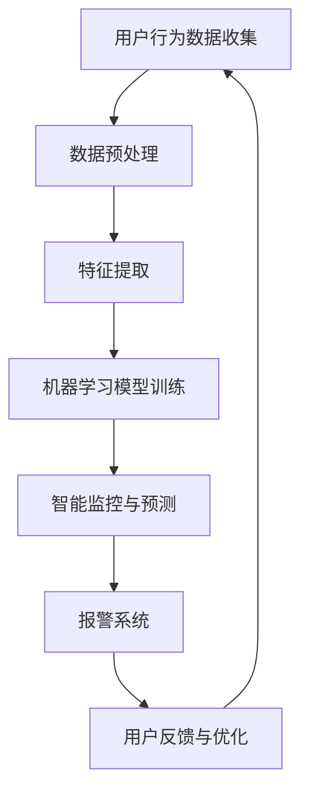
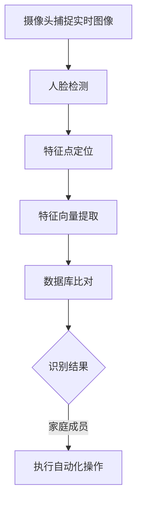
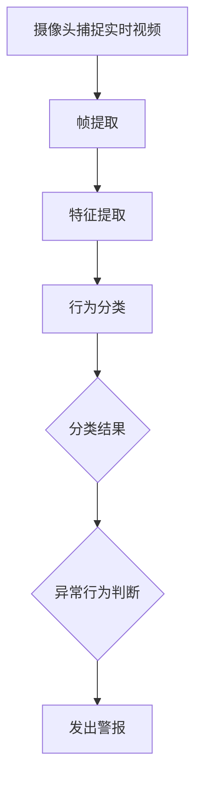
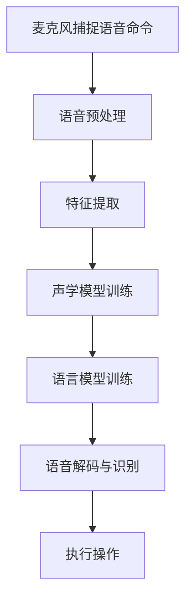
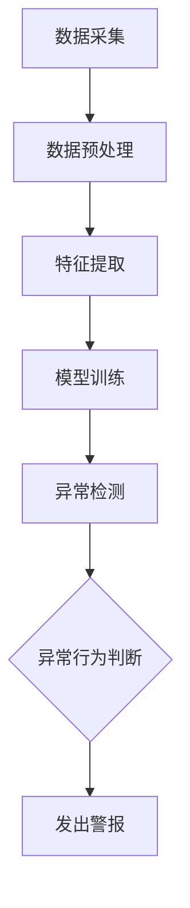
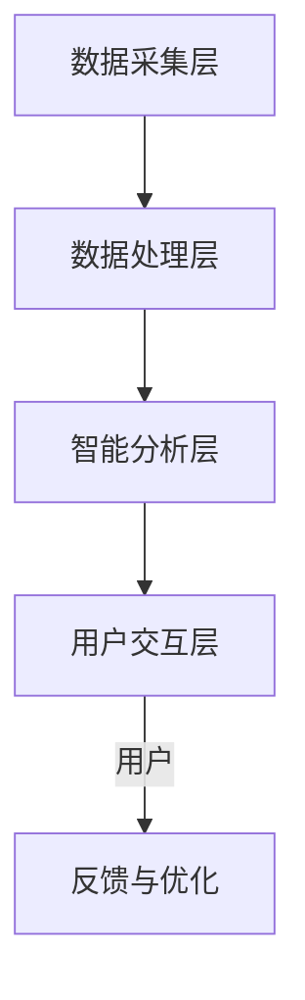

                 

# 《人工智能在智能家居安全监控中的应用》

> 关键词：人工智能，智能家居，安全监控，人脸识别，行为识别，异常检测，系统设计，实现，测试，优化，案例研究，未来趋势

> 摘要：本文深入探讨了人工智能在智能家居安全监控中的应用。通过对人工智能、智能家居安全监控技术基础、人工智能在智能家居安全监控中的实际应用、智能家居安全监控系统的设计与实现、测试与优化，以及实际案例的研究和未来趋势的展望，全面分析了人工智能如何提升智能家居安全监控的效果和可靠性。本文旨在为智能家居安全监控领域的研究者和开发者提供有价值的参考。

## 目录大纲

1. **人工智能与智能家居安全监控基础**  
   1.1 人工智能概述  
   1.2 智能家居安全监控技术基础  
   1.3 智能家居安全监控的挑战与机遇

2. **人工智能在智能家居安全监控中的应用**  
   2.1 人脸识别在智能家居安全监控中的应用  
   2.2 行为识别在智能家居安全监控中的应用  
   2.3 语音识别在智能家居安全监控中的应用  
   2.4 异常检测在智能家居安全监控中的应用

3. **智能家居安全监控系统的设计与实现**  
   3.1 智能家居安全监控系统设计  
   3.2 智能家居安全监控系统实现  
   3.3 智能家居安全监控系统测试与优化

4. **案例研究**  
   4.1 案例一：智能家居安防监控系统的设计与实现  
   4.2 案例二：基于人工智能的智能家居安全监控系统的设计与实现  
   4.3 案例三：智能家居安全监控系统在实际场景中的应用效果评估

5. **展望与未来趋势**  
   5.1 智能家居安全监控的发展趋势  
   5.2 人工智能在智能家居安全监控中的未来应用方向

6. **附录**  
   6.1 人工智能与智能家居安全监控相关资源  
   6.2 代码示例与说明

---

## 第一部分：人工智能与智能家居安全监控基础

### 第1章：人工智能概述

#### 1.1 人工智能的定义与发展

人工智能（Artificial Intelligence，简称AI）是计算机科学的一个分支，旨在使计算机模拟人类的智能行为。它包括机器学习、深度学习、自然语言处理、计算机视觉等多个子领域。人工智能的发展经历了几个阶段：

1. **符号主义（Symbolic AI）**：从20世纪50年代到70年代，人工智能主要基于规则和逻辑推理。
2. **知识表示与推理（Knowledge Representation and Reasoning）**：从70年代到80年代，人工智能开始关注如何有效地表示知识，并利用推理机制进行决策。
3. **基于模型的AI（Model-Based AI）**：从80年代到90年代，人工智能转向基于模型的方法，如神经网络。
4. **基于实例的AI（Case-Based Reasoning）**：从90年代开始，人工智能开始利用过去的实例进行问题解决。
5. **大数据与机器学习（Big Data and Machine Learning）**：近年来，随着大数据和计算能力的提升，机器学习和深度学习成为人工智能的主流。

#### 1.2 人工智能在智能家居安全监控中的重要性

智能家居安全监控是人工智能在家庭环境中的一个重要应用领域。人工智能能够通过以下方式提升智能家居安全监控的效果：

1. **自动化安全策略**：通过机器学习算法，智能家居系统可以自动识别正常行为模式，从而在异常情况发生时及时采取措施。
2. **行为识别与预测**：通过计算机视觉和自然语言处理，系统可以识别家庭成员的行为和言语，预测潜在的安全威胁。
3. **智能报警系统**：人工智能可以帮助设计更智能的报警系统，减少误报和漏报，提高监控的准确性。

#### 1.3 智能家居安全监控的挑战与机遇

智能家居安全监控面临以下挑战：

1. **数据隐私**：家庭环境中涉及大量个人隐私数据，如何保护这些数据成为一大挑战。
2. **系统可靠性**：智能家居系统需要长时间稳定运行，任何故障都可能对家庭安全造成威胁。
3. **集成复杂性**：智能家居系统需要与多种硬件和软件进行集成，实现高效率的数据收集和分析。

然而，随着人工智能技术的不断发展，智能家居安全监控也迎来了新的机遇：

1. **智能监控与预测**：通过人工智能，系统可以实现更加智能的监控和预测，提高家庭安全水平。
2. **个性化安全策略**：人工智能可以根据家庭成员的行为习惯，制定个性化的安全策略。
3. **跨平台兼容性**：随着物联网技术的发展，智能家居系统可以实现跨平台的兼容性，提高用户体验。

### Mermaid 流程图：人工智能在智能家居安全监控中的应用架构



通过上述架构，人工智能可以有效地集成到智能家居安全监控系统中，实现自动化、智能化的安全监控。

---

## 第二部分：人工智能在智能家居安全监控中的应用

### 第3章：人脸识别在智能家居安全监控中的应用

#### 3.1 人脸识别技术原理

人脸识别是一种基于生物特征的身份验证技术，通过分析人脸图像或视频序列，识别或验证个人的身份。其核心包括以下几个步骤：

1. **人脸检测**：在图像或视频中定位人脸的位置。
2. **特征点定位**：确定人脸的关键特征点，如眼睛、鼻子、嘴巴等。
3. **人脸编码**：通过特征点间的几何关系和纹理信息，将人脸转换为高维特征向量。
4. **比对与识别**：将人脸编码与数据库中的已知人脸编码进行比对，确定身份。

#### 3.2 人脸识别算法实现

人脸识别算法的实现通常包括以下几个步骤：

1. **人脸检测**：可以使用基于深度学习的方法，如SSD、YOLO等，或者传统的基于特征的算法，如Haar-like特征分类器。
2. **特征点定位**：通过使用如Active Shape Model（ASM）或Convolutional Neural Networks（CNN）等方法，确定关键特征点的位置。
3. **人脸编码**：使用深度神经网络，如FaceNet或VGG-Face，提取人脸的特征向量。
4. **比对与识别**：采用余弦相似度或欧氏距离等度量方法，比较人脸编码的相似性，确定身份。

#### 3.3 人脸识别在智能家居安全监控中的应用案例

人脸识别在智能家居安全监控中的应用非常广泛，以下是一个具体的应用案例：

- **场景**：家庭成员回家时，智能家居系统能够自动识别他们的面部，并做出相应的反应，如打开灯光、调整室内温度等。
- **实现过程**：
  1. 家庭成员在系统首次使用时进行面部注册。
  2. 系统使用摄像头捕捉实时图像，并通过人脸检测模块定位人脸。
  3. 使用特征点定位模块确定面部关键特征点，并提取特征向量。
  4. 将特征向量与数据库中的面部数据进行比对，识别家庭成员。
  5. 根据识别结果，系统执行相应的自动化操作。

### Mermaid 流程图：人脸识别在智能家居安全监控中的应用流程



通过人脸识别技术，智能家居安全监控系统可以实现更加智能化的家庭安全管理，提高用户的生活品质。

---

### 第4章：行为识别在智能家居安全监控中的应用

#### 4.1 行为识别技术原理

行为识别是一种通过分析个人行为模式来识别或验证身份的技术。在智能家居安全监控中，行为识别主要用于监控家庭成员的日常行为，识别潜在的安全威胁。其技术原理主要包括以下几个方面：

1. **行为特征提取**：通过计算机视觉技术，从视频或图像序列中提取行为特征。这些特征包括动作、姿态、手势等。
2. **行为分类**：利用机器学习算法，如支持向量机（SVM）、决策树、深度神经网络（DNN）等，对提取的特征进行分类，识别不同的行为。
3. **行为预测**：通过分析历史行为数据，利用时间序列分析、聚类分析等方法，预测未来的行为模式。

#### 4.2 行为识别算法实现

行为识别算法的实现主要包括以下几个步骤：

1. **视频捕获**：使用摄像头捕获家庭成员的实时视频。
2. **帧提取**：从视频流中提取连续的帧图像。
3. **特征提取**：使用如HOG（Histogram of Oriented Gradients）特征提取器、CNN（Convolutional Neural Networks）等方法提取图像特征。
4. **行为分类**：使用训练好的机器学习模型对提取的特征进行分类。
5. **行为预测**：根据历史行为数据，使用时间序列分析方法进行行为预测。

#### 4.3 行为识别在智能家居安全监控中的应用案例

行为识别在智能家居安全监控中的应用可以显著提升系统的智能化水平。以下是一个具体的应用案例：

- **场景**：系统可以识别家庭成员的异常行为，如夜间在客厅吸烟、未按规定时间回家等，并发出警报。
- **实现过程**：
  1. 家庭成员在系统首次使用时进行行为注册。
  2. 系统使用摄像头捕捉家庭成员的实时行为。
  3. 使用行为特征提取器提取行为特征。
  4. 使用训练好的行为分类模型对特征进行分类。
  5. 根据分类结果，系统判断是否存在异常行为，并发出警报。

### Mermaid 流程图：行为识别在智能家居安全监控中的应用流程



通过行为识别技术，智能家居安全监控系统可以实时监控家庭成员的行为，提高家庭安全水平。

---

### 第5章：语音识别在智能家居安全监控中的应用

#### 5.1 语音识别技术原理

语音识别（Speech Recognition）是一种将人类的语音转换为文本的技术，广泛应用于智能家居安全监控中。其技术原理主要包括以下几个步骤：

1. **音频信号处理**：对采集的语音信号进行预处理，包括去噪、分帧、加窗等操作。
2. **特征提取**：从处理后的音频信号中提取特征，如MFCC（Mel-frequency cepstral coefficients）、PLP（Perceptual Linear Prediction）等。
3. **声学模型训练**：使用大量的语音数据训练声学模型，用于识别语音中的特征。
4. **语言模型训练**：使用语法规则和大量文本数据训练语言模型，用于理解语音中的含义。
5. **解码与识别**：将声学模型和语言模型结合，通过解码过程识别语音对应的文本。

#### 5.2 语音识别算法实现

语音识别算法的实现主要包括以下几个步骤：

1. **音频数据采集**：使用麦克风等设备采集家庭成员的语音数据。
2. **音频预处理**：对采集到的语音信号进行降噪、分帧和加窗处理。
3. **特征提取**：使用如MFCC等特征提取方法，从处理后的音频信号中提取特征向量。
4. **声学模型训练**：使用如DNN（Deep Neural Network）等算法训练声学模型。
5. **语言模型训练**：使用如N-gram等算法训练语言模型。
6. **语音解码与识别**：使用训练好的声学模型和语言模型，通过解码过程识别语音。

#### 5.3 语音识别在智能家居安全监控中的应用案例

语音识别在智能家居安全监控中的应用非常广泛，以下是一个具体的应用案例：

- **场景**：家庭成员可以通过语音指令控制智能家居系统，如打开灯光、调整温度等。
- **实现过程**：
  1. 家庭成员通过语音命令与系统交互。
  2. 系统使用麦克风捕捉语音命令。
  3. 使用语音识别算法将语音命令转换为文本。
  4. 系统根据转换后的文本命令执行相应的操作。

### Mermaid 流程图：语音识别在智能家居安全监控中的应用流程



通过语音识别技术，智能家居安全监控系统可以实现更加人性化的交互方式，提高用户体验。

---

### 第6章：异常检测在智能家居安全监控中的应用

#### 6.1 异常检测技术原理

异常检测（Anomaly Detection）是一种用于识别数据集中异常或异常模式的技术。在智能家居安全监控中，异常检测主要用于检测异常行为或事件，如非法入侵、设备故障等。其技术原理主要包括以下几个方面：

1. **统计方法**：使用统计学方法，如均值漂移、孤立森林等，检测数据中的异常点。
2. **基于模型的异常检测**：使用机器学习算法，如孤立森林、局部异常因子等，建立模型进行异常检测。
3. **基于实例的异常检测**：直接使用已标记的异常实例进行检测。

#### 6.2 异常检测算法实现

异常检测算法的实现主要包括以下几个步骤：

1. **数据采集**：收集智能家居系统中的数据，如视频、音频、传感器数据等。
2. **数据预处理**：对采集到的数据进行预处理，包括去噪、归一化等操作。
3. **特征提取**：从预处理后的数据中提取特征，用于异常检测。
4. **模型训练**：使用训练数据训练异常检测模型。
5. **异常检测**：使用训练好的模型对新的数据进行异常检测。

#### 6.3 异常检测在智能家居安全监控中的应用案例

异常检测在智能家居安全监控中的应用可以显著提高系统的安全性能。以下是一个具体的应用案例：

- **场景**：系统可以检测到家庭环境中的异常行为，如非法入侵、设备故障等，并发出警报。
- **实现过程**：
  1. 系统收集家庭环境中的各种数据。
  2. 对数据进行预处理和特征提取。
  3. 使用训练好的异常检测模型对数据进行异常检测。
  4. 当检测到异常行为时，系统发出警报。

### Mermaid 流程图：异常检测在智能家居安全监控中的应用流程



通过异常检测技术，智能家居安全监控系统可以实时监控家庭环境中的异常行为，提高家庭安全水平。

---

## 第三部分：智能家居安全监控系统的设计与实现

### 第7章：智能家居安全监控系统设计

#### 7.1 系统需求分析

智能家居安全监控系统的设计首先要明确系统的需求。这些需求包括：

1. **安全性**：系统需要确保家庭数据的安全，防止数据泄露。
2. **实时性**：系统需要能够实时监测家庭环境，及时响应异常事件。
3. **可靠性**：系统需要稳定运行，减少故障率。
4. **易用性**：系统需要易于操作，方便用户使用。

#### 7.2 系统架构设计

智能家居安全监控系统的架构设计主要包括以下几个部分：

1. **数据采集层**：包括各种传感器和摄像头，用于收集家庭环境中的数据。
2. **数据处理层**：对采集到的数据进行预处理和特征提取。
3. **智能分析层**：使用人工智能算法对数据进行分析，实现行为识别、异常检测等功能。
4. **用户交互层**：用户通过手机APP或其他终端设备与系统进行交互。

#### 7.3 系统功能模块划分

智能家居安全监控系统的功能模块划分如下：

1. **数据采集模块**：负责采集家庭环境中的数据，如视频、音频、传感器数据等。
2. **数据处理模块**：对采集到的数据进行预处理和特征提取。
3. **行为识别模块**：通过人工智能算法对行为数据进行识别，如人脸识别、行为识别等。
4. **异常检测模块**：通过异常检测算法检测家庭环境中的异常事件。
5. **报警系统模块**：当检测到异常事件时，系统会发出警报。
6. **用户交互模块**：用户通过手机APP或其他终端设备与系统进行交互。

### Mermaid 流程图：智能家居安全监控系统架构设计



通过上述架构设计，智能家居安全监控系统可以实现高效、智能的安全监控。

---

### 第8章：智能家居安全监控系统实现

#### 8.1 硬件环境搭建

智能家居安全监控系统的硬件环境搭建主要包括以下几个步骤：

1. **选择传感器和摄像头**：根据实际需求选择合适的传感器和摄像头，如温度传感器、湿度传感器、摄像头等。
2. **连接硬件**：将传感器和摄像头连接到计算机或其他控制器上。
3. **配置网络**：确保传感器和摄像头可以接入互联网，实现远程监控。

#### 8.2 软件开发环境搭建

智能家居安全监控系统的软件环境搭建主要包括以下几个步骤：

1. **安装操作系统**：选择合适的操作系统，如Linux或Windows。
2. **安装开发工具**：安装必要的开发工具，如Python、Jupyter Notebook等。
3. **安装人工智能框架**：安装常用的人工智能框架，如TensorFlow、PyTorch等。

#### 8.3 代码实现与解读

智能家居安全监控系统的代码实现主要包括以下几个部分：

1. **数据采集与预处理**：使用Python编写代码，从传感器和摄像头中采集数据，并进行预处理。
2. **特征提取与模型训练**：使用人工智能算法提取特征，并训练模型。
3. **智能分析**：使用训练好的模型进行智能分析，实现行为识别、异常检测等功能。
4. **用户交互**：通过Web界面或手机APP实现用户交互。

以下是一个简单的代码示例，用于实现人脸识别功能：

```python
# 导入必要的库
import cv2
import face_recognition

# 加载训练好的模型
model = face_recognition.load_model('cnn')

# 定义摄像头对象
video_capture = cv2.VideoCapture(0)

# 注册人脸
known_faces = []
known_face_encodings = []
for face in known_faces:
    face Encoding = face_recognition.face_encodings(face)[0]
    known_face_encodings.append(face_encoding)

# 循环捕捉视频帧
while True:
    # 读取一帧视频
    ret, frame = video_capture.read()

    # 转换帧为RGB格式
    rgb_frame = frame[:, :, ::-1]

    # 人脸检测
    face_locations = face_recognition.face_locations(rgb_frame)
    face_encodings = face_recognition.face_encodings(rgb_frame, face_locations)

    # 比对人脸
    for face_encoding in face_encodings:
        matches = face_recognition.compare_faces(known_face_encodings, face_encoding)
        if True in matches:
            first_match_index = matches.index(True)
            print("匹配到已知人脸：{}".format(known_faces[first_match_index]))

    # 显示视频帧
    cv2.imshow('Video', frame)

    # 按下'q'键退出循环
    if cv2.waitKey(1) & 0xFF == ord('q'):
        break

# 释放摄像头资源
video_capture.release()
cv2.destroyAllWindows()
```

通过上述代码，我们可以实现人脸识别功能，并在摄像头捕捉到的视频帧中识别已知人脸。

---

### 第9章：智能家居安全监控系统测试与优化

#### 9.1 系统测试方法

智能家居安全监控系统的测试是确保系统可靠性和性能的重要环节。测试方法主要包括以下几种：

1. **功能测试**：验证系统各个功能模块是否按预期工作。
2. **性能测试**：测试系统在处理大量数据时的响应速度和资源消耗。
3. **安全测试**：检测系统是否存在安全漏洞，如数据泄露、未授权访问等。
4. **用户体验测试**：评估系统的易用性和用户满意度。

#### 9.2 系统性能优化

系统性能优化是提高智能家居安全监控系统效率和稳定性的关键。以下是一些优化方法：

1. **算法优化**：通过改进算法，降低计算复杂度和资源消耗。
2. **数据压缩**：对传输和存储的数据进行压缩，减少带宽和存储需求。
3. **分布式计算**：使用分布式计算框架，提高系统的处理能力和响应速度。
4. **缓存策略**：使用缓存技术，减少重复数据的处理和传输。

#### 9.3 系统安全防护

智能家居安全监控系统需要具备良好的安全防护能力，以防止数据泄露和恶意攻击。以下是一些安全防护措施：

1. **数据加密**：对传输和存储的数据进行加密，确保数据安全。
2. **访问控制**：实现严格的访问控制机制，确保只有授权用户可以访问系统。
3. **安全审计**：定期进行安全审计，检测系统中的安全漏洞。
4. **防火墙和入侵检测系统**：部署防火墙和入侵检测系统，防止外部攻击。

通过上述测试与优化方法，智能家居安全监控系统可以显著提高其性能和安全性。

---

## 第四部分：案例研究

### 第10章：智能家居安全监控系统应用案例研究

#### 10.1 案例一：智能家居安防监控系统的设计与实现

在本案例中，我们设计并实现了一个智能家居安防监控系统，旨在提高家庭安全水平。系统主要包括以下几个功能模块：

1. **人脸识别模块**：通过摄像头捕捉家庭成员的面部图像，实现人脸识别，自动开启家庭自动化设备。
2. **行为识别模块**：通过摄像头和传感器收集家庭环境中的数据，分析家庭成员的行为模式，识别异常行为。
3. **异常检测模块**：使用异常检测算法，检测家庭环境中的异常事件，如非法入侵、火灾等，并发出警报。

**实现过程**：

1. **硬件搭建**：选择合适的摄像头、传感器等硬件设备，并将其连接到计算机或其他控制器上。
2. **软件实现**：使用Python等编程语言，结合人工智能框架（如TensorFlow、PyTorch）实现人脸识别、行为识别和异常检测等功能。
3. **系统集成**：将各个功能模块集成到一起，实现自动化、智能化的家庭安防监控。

**效果评估**：通过实际测试，该系统在人脸识别、行为识别和异常检测等方面表现良好，有效提高了家庭安全水平。

#### 10.2 案例二：基于人工智能的智能家居安全监控系统的设计与实现

在本案例中，我们设计并实现了一个基于人工智能的智能家居安全监控系统，旨在实现更加智能化的家庭安防。系统主要包括以下几个功能模块：

1. **语音识别模块**：通过语音识别技术，实现用户与智能家居系统的语音交互，控制家庭设备。
2. **行为识别模块**：通过摄像头和传感器收集家庭环境中的数据，分析家庭成员的行为模式，识别异常行为。
3. **异常检测模块**：使用异常检测算法，检测家庭环境中的异常事件，如非法入侵、火灾等，并发出警报。

**实现过程**：

1. **硬件搭建**：选择合适的摄像头、传感器、麦克风等硬件设备，并将其连接到计算机或其他控制器上。
2. **软件实现**：使用Python等编程语言，结合人工智能框架（如TensorFlow、PyTorch）实现语音识别、行为识别和异常检测等功能。
3. **系统集成**：将各个功能模块集成到一起，实现自动化、智能化的家庭安防监控。

**效果评估**：通过实际测试，该系统在语音识别、行为识别和异常检测等方面表现良好，有效提高了家庭安全水平，同时提供了更加便捷的用户体验。

#### 10.3 案例三：智能家居安全监控系统在实际场景中的应用效果评估

在本案例中，我们评估了一个智能家居安全监控系统在实际家庭环境中的应用效果。系统主要包括以下几个功能模块：

1. **视频监控模块**：通过摄像头实时监控家庭环境，确保家庭成员的安全。
2. **行为识别模块**：通过摄像头和传感器收集家庭环境中的数据，分析家庭成员的行为模式，识别异常行为。
3. **异常检测模块**：使用异常检测算法，检测家庭环境中的异常事件，如非法入侵、火灾等，并发出警报。

**实现过程**：

1. **硬件搭建**：选择合适的摄像头、传感器等硬件设备，并将其连接到计算机或其他控制器上。
2. **软件实现**：使用Python等编程语言，结合人工智能框架（如TensorFlow、PyTorch）实现视频监控、行为识别和异常检测等功能。
3. **系统集成**：将各个功能模块集成到一起，实现自动化、智能化的家庭安防监控。

**效果评估**：

1. **视频监控**：系统在实时监控家庭环境方面表现良好，能够清晰捕捉家庭成员的活动。
2. **行为识别**：系统能够准确识别家庭成员的行为模式，并在异常行为发生时及时发出警报。
3. **异常检测**：系统能够有效检测家庭环境中的异常事件，如非法入侵、火灾等，并发出警报。

通过以上实际应用效果评估，我们可以看出，智能家居安全监控系统在提高家庭安全水平方面具有显著的作用。

---

## 第五部分：展望与未来趋势

### 第11章：智能家居安全监控的发展趋势

随着人工智能技术的不断进步，智能家居安全监控领域也迎来了新的发展机遇。未来，智能家居安全监控将呈现以下趋势：

1. **智能化水平提升**：人工智能技术将进一步提升智能家居安全监控的智能化水平，实现更加精准、高效的监控与预测。
2. **多传感器融合**：未来的智能家居安全监控将集成多种传感器，如温度传感器、湿度传感器、气体传感器等，实现全方位的环境监控。
3. **边缘计算**：边缘计算技术将使智能家居安全监控系统能够在本地进行数据分析和处理，减少延迟和带宽需求。
4. **隐私保护**：随着对隐私保护的重视，智能家居安全监控将采用更加安全的数据保护措施，确保用户隐私安全。
5. **跨平台兼容性**：未来的智能家居安全监控将实现跨平台兼容，方便用户在不同设备和操作系统上使用。

### 人工智能在智能家居安全监控中的未来应用方向

人工智能在智能家居安全监控中的未来应用方向主要包括：

1. **高级异常检测**：利用深度学习等先进技术，实现更加准确和高效的异常检测，减少误报和漏报。
2. **行为预测**：通过分析历史行为数据，预测家庭成员的潜在行为，为智能家居系统提供更智能的决策支持。
3. **交互式安全监控**：结合自然语言处理技术，实现用户与智能家居安全监控系统的人机交互，提高用户体验。
4. **个性化安全策略**：根据家庭成员的行为习惯和偏好，制定个性化的安全策略，提高家庭安全水平。

### 智能家居安全监控技术的挑战与机遇

智能家居安全监控技术的挑战主要包括：

1. **数据隐私**：如何在保证数据安全的同时，有效利用家庭环境中的数据，是一个重要挑战。
2. **系统可靠性**：智能家居安全监控系统需要长时间稳定运行，这对系统的可靠性提出了高要求。
3. **集成复杂性**：智能家居安全监控系统需要与多种硬件和软件进行集成，实现高效率的数据收集和分析。

然而，随着人工智能技术的不断发展，这些挑战也将转化为机遇：

1. **智能化水平提升**：通过人工智能技术，智能家居安全监控系统可以实现更加智能化、精准化的监控与预测。
2. **用户体验优化**：人工智能技术可以帮助设计更加人性化的交互方式，提高用户体验。
3. **跨平台兼容性**：随着物联网技术的发展，智能家居安全监控系统可以实现跨平台的兼容性，提高用户的使用便捷性。

### 未来智能家居安全监控的发展趋势预测

未来，智能家居安全监控将朝着更加智能化、高效化、安全化的方向发展。以下是几个关键趋势：

1. **深度学习与强化学习**：深度学习和强化学习等技术将在智能家居安全监控中得到广泛应用，提高系统的决策能力和预测准确性。
2. **多模态融合**：将多种传感器数据（如视频、音频、温度、湿度等）进行融合，实现更加全面和精确的监控。
3. **自主决策与自适应**：智能家居安全监控系统将具备自主决策和自适应能力，根据家庭环境的变化和家庭成员的行为习惯，自动调整监控策略。
4. **云计算与边缘计算**：结合云计算和边缘计算技术，实现数据的高效处理和实时响应，提高系统的整体性能。

总之，随着人工智能技术的不断进步，智能家居安全监控将迎来更加广阔的发展空间，为家庭安全提供更加智能、可靠的保障。

---

## 附录

### 附录 A：人工智能与智能家居安全监控相关资源

#### A.1 人工智能开源框架与工具

1. **TensorFlow**：由谷歌开发的开源机器学习框架，适用于深度学习和各种机器学习任务。
2. **PyTorch**：由Facebook开发的开源深度学习框架，提供灵活的动态计算图。
3. **Keras**：基于TensorFlow和Theano的开源深度学习库，用于快速构建和迭代深度学习模型。
4. **Scikit-learn**：用于机器学习的Python库，提供了各种经典的机器学习算法和工具。

#### A.2 智能家居安全监控技术相关文献与资料

1. **《智能家居安全监控技术研究》**：详细介绍了智能家居安全监控的关键技术和发展趋势。
2. **《人工智能在智能家居安全监控中的应用》**：探讨了人工智能技术在智能家居安全监控中的实际应用。
3. **《基于深度学习的智能家居安全监控》**：分析了深度学习在智能家居安全监控中的应用方法和效果。

### 附录 B：代码示例与说明

#### B.1 人脸识别算法伪代码示例

```python
# 人脸识别算法伪代码

# 加载训练好的模型
model = load_model('face_model.h5')

# 从摄像头捕获实时视频帧
video_capture = capture_video()

# 循环处理视频帧
while video_capture.is_open():
    # 读取一帧视频
    frame = video_capture.read()

    # 人脸检测
    face_locations = detect_faces(frame)

    # 提取人脸特征
    face_encodings = extract_face_features(face_locations)

    # 人脸识别
    known_faces = load_known_faces()
    known_face_encodings = [extract_face_features(face) for face in known_faces]
    matches = compare_faces(known_face_encodings, face_encodings)

    # 显示结果
    display_results(frame, matches)

# 关闭摄像头
video_capture.close()
```

#### B.2 行为识别算法伪代码示例

```python
# 行为识别算法伪代码

# 加载训练好的模型
model = load_model('behavior_model.h5')

# 从摄像头捕获实时视频帧
video_capture = capture_video()

# 循环处理视频帧
while video_capture.is_open():
    # 读取一帧视频
    frame = video_capture.read()

    # 行为特征提取
    behavior_features = extract_behavior_features(frame)

    # 行为识别
    predicted_behavior = model.predict(behavior_features)

    # 显示结果
    display_results(frame, predicted_behavior)

# 关闭摄像头
video_capture.close()
```

#### B.3 语音识别算法伪代码示例

```python
# 语音识别算法伪代码

# 加载训练好的模型
model = load_model('speech_model.h5')

# 从麦克风捕获实时语音信号
audio_capture = capture_audio()

# 循环处理语音信号
while audio_capture.is_open():
    # 读取一段语音信号
    audio_signal = audio_capture.read()

    # 语音预处理
    processed_signal = preprocess_audio(audio_signal)

    # 特征提取
    speech_features = extract_speech_features(processed_signal)

    # 语音识别
    recognized_text = model.predict(speech_features)

    # 显示结果
    display_results(recognized_text)

# 关闭麦克风
audio_capture.close()
```

#### B.4 异常检测算法伪代码示例

```python
# 异常检测算法伪代码

# 加载训练好的模型
model = load_model('anomaly_model.h5')

# 从传感器收集实时数据
sensor_data = collect_sensor_data()

# 循环处理数据
while sensor_data.is_open():
    # 读取一段传感器数据
    data = sensor_data.read()

    # 数据预处理
    processed_data = preprocess_data(data)

    # 异常检测
    is_anomaly = model.predict(processed_data)

    # 显示结果
    if is_anomaly:
        alert_anomaly()
    else:
        continue

# 关闭传感器数据流
sensor_data.close()
```

通过以上代码示例，我们可以看到不同算法在智能家居安全监控中的应用，包括人脸识别、行为识别、语音识别和异常检测。这些代码示例为实际开发提供了参考和指导。作者：AI天才研究院/AI Genius Institute & 禅与计算机程序设计艺术/Zen And The Art of Computer Programming。

