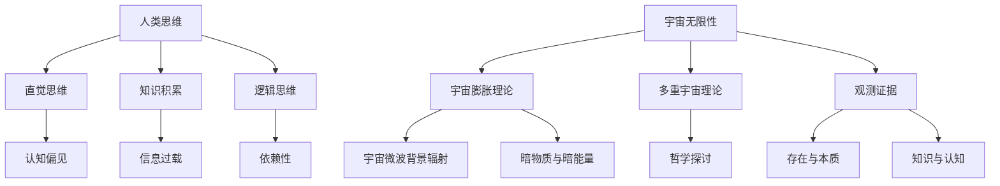

                 

### 第1章：人类思维的局限性与宇宙的无限性概述

#### 1.1 人类思维的起源与发展

人类思维的形成是一个漫长的进化过程。从原始认知阶段到现代科学的崛起，人类的思维经历了多个阶段的发展。

1. **原始认知阶段**：在人类进化的早期，人类祖先主要依赖直觉和本能来生存。这种原始的思维方式使得人类能够快速适应环境变化，但也存在信息不全和依赖经验的问题。

2. **语言与符号的出现**：随着人类社会的进步，语言和符号系统的发展极大地促进了人类思维能力的提升。通过语言交流，人类能够更有效地传递信息，积累知识。

3. **农业革命与城市化**：农业革命和城市化进程为人类思维提供了更为复杂的社会环境，促进了知识积累和逻辑思维的发展。

#### 1.2 人类思维的局限性分析

尽管人类思维经历了巨大的发展，但它仍然存在一些固有的局限性。

1. **直觉思维的局限**：直觉思维在快速决策和适应环境方面具有优势，但其依赖经验，容易受到认知偏见的影响。

2. **知识积累的局限性**：随着知识的积累，人类面临着信息过载和知识碎片化的问题。这限制了我们对复杂问题的全面理解。

3. **逻辑思维的局限**：逻辑思维在系统分析和明确推理方面具有优势，但它的依赖性使得我们容易忽视直觉和情感的重要性。

#### 1.3 宇宙无限性的概念与证据

宇宙无限性是指宇宙在空间和时间上的无限延伸。这一概念在科学和哲学领域都有深入的探讨。

1. **宇宙无限性的理论探讨**：宇宙膨胀理论和多重宇宙理论是探讨宇宙无限性的两个主要理论。

2. **观测宇宙的无限性证据**：宇宙微波背景辐射和暗物质与暗能量是支持宇宙无限性的重要观测证据。

3. **宇宙无限性的哲学思考**：宇宙无限性引发了关于存在与本质、知识与认知等哲学问题的深入探讨。

---

为了更直观地展示人类思维和宇宙无限性的关系，我们使用Mermaid流程图来构建一个简单的概念模型。

这个流程图展示了人类思维和宇宙无限性之间的复杂关系，以及它们各自的核心概念和相互影响。

---

接下来，我们将更深入地探讨人类思维的基本模式，包括理性思维与感性思维、模式识别与归纳推理、判断与决策思维。

#### 1.4 人类思维的基本模式

1. **理性思维与感性思维**

   - **理性思维**：基于逻辑和证据的思考方式，强调客观性和系统性。理性思维在科学研究和决策过程中起到关键作用。
   - **感性思维**：基于情感和直觉的思考方式，强调个体体验和主观感受。感性思维在艺术创作和人际交往中具有重要作用。

2. **模式识别与归纳推理**

   - **模式识别**：人类大脑能够迅速识别和分类事物，这是人类智能的重要特征。模式识别在视觉、听觉和触觉等感官处理中发挥关键作用。
   - **归纳推理**：从个别事实推断一般性结论。归纳推理是人类思维的重要工具，它使我们能够从经验中学习并形成理论。

3. **判断与决策思维**

   - **判断思维**：对事物进行评价和判断。判断思维在日常生活中无处不在，如评价商品质量、判断道路方向等。
   - **决策思维**：在多种可能性中做出选择。决策思维涉及风险评估、目标设定和策略选择等复杂过程。

通过以上分析，我们可以看出，人类思维的基本模式各具特色，但相互交织，共同构成了我们复杂而独特的思维方式。

---

在接下来的部分，我们将详细分析人类思维的几个主要局限，包括直觉思维的局限、知识积累的局限性以及逻辑思维的局限性。

#### 1.5 人类思维的局限性分析

1. **直觉思维的局限**

   直觉思维是人类快速决策的重要工具，但它在某些情况下也存在局限。

   - **依赖经验**：直觉思维往往依赖于个人的经验，这使得它在处理新问题时可能不够有效。
   - **认知偏见**：直觉思维容易受到认知偏见的影响，如确认偏差、可及性偏差等，这可能导致错误的判断和决策。
   - **信息不全**：直觉思维在处理问题时可能忽略关键信息，导致决策失误。

2. **知识积累的局限性**

   知识积累是人类文明进步的基石，但过度积累也带来了一些问题。

   - **信息过载**：随着知识爆炸，我们面临着信息过载的问题。这可能导致我们无法有效地处理和利用大量信息。
   - **知识碎片化**：现代知识的快速发展和专业化导致知识碎片化，这使得我们在处理复杂问题时难以整合各类知识。
   - **知识遗忘**：随着时间推移，我们可能忘记一些重要的知识，这限制了我们的认知能力和思维深度。

3. **逻辑思维的局限性**

   逻辑思维是科学研究和理性思考的基础，但它在某些情况下也存在局限。

   - **依赖已有知识**：逻辑思维依赖于已有的知识和假设，这可能导致我们在面对新问题时无法灵活应对。
   - **忽视直觉与情感**：逻辑思维强调客观性和系统性，但忽视了直觉和情感的重要性。这可能导致我们在决策过程中忽略一些重要因素。
   - **推理错误**：逻辑思维可能受到推理错误的影响，如以偏概全、逻辑谬误等，这可能导致错误的结论。

通过以上分析，我们可以看出，尽管人类思维具有强大的适应性和创造力，但它也存在一些固有的局限性。了解这些局限性有助于我们更好地认识人类思维的本质，并在实践中不断克服它们。

---

在下一部分，我们将探讨宇宙无限性的概念，并深入分析宇宙无限性的理论探讨、观测证据以及哲学思考。

#### 1.6 宇宙无限性的概念与证据

宇宙无限性是指宇宙在空间和时间上的无限延伸。这一概念不仅在科学领域有深入探讨，也在哲学领域引发了广泛思考。

1. **宇宙无限性的理论探讨**

   - **宇宙膨胀理论**：宇宙膨胀理论认为，宇宙从大爆炸开始不断膨胀。这一理论提供了宇宙无限性的重要证据。
   - **多重宇宙理论**：多重宇宙理论认为，宇宙可能存在多个平行宇宙，每个宇宙都有其独特的物理定律。这一理论提供了对宇宙无限性的另一种解释。

2. **观测宇宙的无限性证据**

   - **宇宙微波背景辐射**：宇宙微波背景辐射是宇宙早期热辐射的残余，它提供了宇宙起源的重要证据，也支持了宇宙膨胀理论。
   - **暗物质与暗能量**：暗物质和暗能量是宇宙中不可见但影响宇宙演化的物质和能量。它们的发现进一步支持了宇宙无限性的存在。

3. **宇宙无限性的哲学思考**

   - **存在与本质**：宇宙无限性引发了关于存在和本质的哲学探讨。哲学家们思考宇宙是否存在边界，以及宇宙的本质是什么。
   - **知识与认知**：宇宙无限性挑战了人类对宇宙的认知能力。我们如何理解一个无限大的宇宙，这是一个哲学问题。

通过以上分析，我们可以看出，宇宙无限性是一个复杂而深奥的概念，它在科学和哲学领域都有重要影响。理解宇宙无限性有助于我们更全面地认识宇宙和自身的位置。

---

在接下来的部分，我们将详细探讨人类思维模式与认知局限，包括理性思维与感性思维、模式识别与归纳推理、判断与决策思维。

#### 2.1 人类思维模式与认知局限

人类思维模式决定了我们如何理解世界和处理信息。尽管人类思维具有强大的适应性，但它也存在一些固有的局限。

1. **理性思维与感性思维**

   - **理性思维**：理性思维是基于逻辑和证据的思考方式。它强调客观性和系统性，适用于科学研究和决策过程。理性思维的优点在于能够提供明确和一致的结论，但它的局限性在于可能忽视直觉和情感。
   - **感性思维**：感性思维是基于情感和直觉的思考方式。它强调个体体验和主观感受，适用于艺术创作和人际交往。感性思维的优点在于能够提供灵活和创新的解决方案，但它的局限性在于可能缺乏逻辑和系统性。

2. **模式识别与归纳推理**

   - **模式识别**：模式识别是人类大脑处理信息的一种基本能力。它使我们能够迅速识别和分类事物，从而提高信息处理效率。模式识别在视觉、听觉和触觉等感官处理中发挥关键作用。
   - **归纳推理**：归纳推理是从个别事实推断一般性结论的思考方式。它使我们能够从经验中学习并形成理论。归纳推理在科学研究和日常决策中都有广泛应用。然而，归纳推理的局限性在于它可能忽视异常情况，导致结论过于绝对。

3. **判断与决策思维**

   - **判断思维**：判断思维是对事物进行评价和判断的思考方式。它涉及对事物的优点、缺点、合适性等进行评估。判断思维在日常生活中无处不在，如评价商品质量、判断道路方向等。
   - **决策思维**：决策思维是在多种可能性中做出选择的思考方式。它涉及风险评估、目标设定和策略选择等复杂过程。决策思维的关键在于权衡不同因素，并做出最优选择。

通过以上分析，我们可以看出，人类思维模式各具特点，但相互交织，共同构成了我们复杂而独特的思维方式。了解这些思维模式和认知局限有助于我们更好地认识自己，并在实践中不断克服它们。

---

在下一部分，我们将探讨认知局限与误区，包括认知偏差的种类、社会认知的局限以及宗教与哲学对思维的影响。

#### 2.2 认知局限与误区

尽管人类思维具有强大的适应性和创造力，但它在某些情况下也存在认知局限和误区。

1. **认知偏差的种类**

   - **确认偏差**：确认偏差是指人们倾向于接受支持自己已有观点的信息，忽视或拒绝反驳证据。这种偏差导致我们在形成和改变观点时可能过于自信和盲目。
   - **可及性偏差**：可及性偏差是指人们倾向于依赖容易回忆的信息进行判断。这意味着我们在决策时可能受到最近发生事件的影响，而忽视其他重要因素。
   - **群体思维**：群体思维是指人们在群体中容易接受主导意见，忽视独立思考和批判性评估。这种现象在群体决策和舆论传播中普遍存在。

2. **社会认知的局限**

   - **社会认同**：社会认同是指个体在群体中寻求认同感和归属感。这种认同感可能使个体在思维和行为上受到群体影响，而忽视独立思考。
   - **信息传播的扭曲**：在信息传播过程中，谣言和虚假信息可能被放大和传播，导致认知偏差和错误判断。这种现象在社交媒体和网络时代尤为突出。

3. **宗教与哲学对思维的影响**

   - **宗教思维**：宗教思维强调信仰和神秘主义，可能导致我们在面对现实问题时忽视科学方法和理性思考。宗教思维在人类历史和文化中具有重要地位，但它也可能导致认知局限。
   - **哲学思维**：哲学思维强调理性思考和道德伦理的探讨，有助于我们认识自我和世界。然而，哲学思维也可能使我们在面对复杂问题时陷入抽象和理论的泥沼。

通过以上分析，我们可以看出，认知局限和误区是人类思维不可避免的一部分。了解这些局限和误区有助于我们更好地认识自己，并在实践中不断克服它们。

---

在下一部分，我们将讨论如何突破认知局限，包括培养批判性思维、增强思维的灵活性以及利用科学方法拓展认知。

#### 2.3 如何突破认知局限

要突破认知局限，我们需要采取一系列策略和方法，以培养批判性思维、增强思维的灵活性并利用科学方法拓展认知。

1. **培养批判性思维**

   - **批判性思维的重要性**：批判性思维是一种理性思考能力，它使我们能够客观地评估信息、分析和解决问题。培养批判性思维有助于我们摆脱认知偏见和误区。
   - **批判性思维的技巧**：批判性思维的技巧包括提问、分析、评估和质疑。通过不断提问和质疑，我们可以深入思考问题的本质，避免盲目接受信息。
   - **培养批判性思维的实践**：阅读、讨论和写作是培养批判性思维的有效方法。通过这些实践活动，我们可以提高逻辑推理和批判性思维能力。

2. **增强思维的灵活性**

   - **思维的灵活性**：思维的灵活性是指我们能够适应不同环境和情境，灵活地运用不同的思维方式。增强思维的灵活性有助于我们更好地应对复杂和变化的问题。
   - **灵活思维的培养方法**：灵活思维的培养方法包括多角度思考、跨界学习和反思自省。通过多角度思考，我们可以全面理解问题；通过跨界学习，我们可以整合不同领域的知识；通过反思自省，我们可以不断改进自己的思维方式。

3. **利用科学方法拓展认知**

   - **科学方法的基本原则**：科学方法是一种系统性的知识探索方法，它包括观察、假设、实验和验证等步骤。科学方法使我们能够通过实证研究和逻辑推理来拓展认知。
   - **科学方法在认知拓展中的应用**：利用科学方法，我们可以对复杂问题进行系统分析和实验验证，从而发现新知识和发展新理论。科学方法在科学研究、技术创新和社会发展中都发挥着重要作用。

通过以上策略和方法，我们可以突破认知局限，提高思维能力和创造力，从而更好地认识世界和解决问题。

---

在接下来的一节中，我们将探讨宇宙中的无限性概念，包括宇宙无限性的定义、理论探讨以及科学证据。

#### 3.1 宇宙中的无限性概念

宇宙无限性是指宇宙在空间和时间上的无限延伸。这一概念在科学和哲学领域都有深入的探讨。

1. **宇宙无限性的定义**

   宇宙无限性意味着宇宙没有边界，它在空间上无限大，在时间上无限长。这一概念挑战了我们对宇宙的传统理解，引发了对宇宙本质和人类认知的深入思考。

2. **宇宙无限性的理论探讨**

   - **宇宙膨胀理论**：宇宙膨胀理论认为，宇宙从大爆炸开始不断膨胀。这一理论提供了宇宙无限性的重要证据，也支持了宇宙在空间上无限延伸的观点。
   - **多重宇宙理论**：多重宇宙理论认为，宇宙可能存在多个平行宇宙，每个宇宙都有其独特的物理定律。这一理论提供了对宇宙无限性的另一种解释，也引发了对宇宙本质和存在的哲学探讨。

3. **宇宙无限性的科学证据**

   - **宇宙微波背景辐射**：宇宙微波背景辐射是宇宙早期热辐射的残余，它提供了宇宙起源的重要证据，也支持了宇宙膨胀理论。宇宙微波背景辐射的发现为宇宙无限性提供了强有力的科学证据。
   - **暗物质与暗能量**：暗物质和暗能量是宇宙中不可见但影响宇宙演化的物质和能量。它们的发现进一步支持了宇宙无限性的存在。暗物质和暗能量使得宇宙的膨胀速度超出预期，这表明宇宙在空间上可能没有边界。

通过以上分析，我们可以看出，宇宙无限性是一个复杂而深奥的概念，它在科学和哲学领域都有重要影响。理解宇宙无限性有助于我们更全面地认识宇宙和自身的位置。

---

在接下来的部分，我们将深入探讨宇宙无限性对人类思维的影响，包括宇宙视角下的思维拓展、人类思维对宇宙认知的限制以及跨越认知局限的宇宙探索方法。

#### 3.2 宇宙无限性对人类思维的影响

宇宙无限性的概念不仅对科学和哲学有深远影响，也对人类思维产生了重要影响。

1. **宇宙视角下的思维拓展**

   - **超越地球视角**：宇宙无限性使我们意识到地球只是宇宙中的一个微小部分。这种视角让我们超越了对地球的局限，开始思考宇宙的广袤和复杂性。
   - **跨学科思考**：宇宙无限性促进了跨学科的研究和合作。科学家们需要从不同的学科领域来理解宇宙的奥秘，这推动了科学理论的创新和发展。

2. **人类思维对宇宙认知的限制**

   - **认知局限**：尽管人类思维在许多方面具有强大的适应性，但它也存在认知局限。我们无法直接感知和理解宇宙的无限性，这限制了我们对宇宙的认知。
   - **知识盲点**：宇宙的广袤和复杂性使得我们难以完全理解宇宙的各个方面。这导致我们在探索宇宙时可能存在知识盲点，这需要我们不断拓展认知边界。

3. **跨越认知局限的宇宙探索方法**

   - **观测技术**：提高观测技术是我们跨越认知局限的重要方法。通过更先进的望远镜和探测器，我们可以观测到更远的天体和更早的宇宙历史。
   - **理论创新**：理论创新是推动宇宙探索的重要驱动力。科学家们通过构建新的理论模型来解释观测到的宇宙现象，这有助于我们更好地理解宇宙的奥秘。
   - **跨学科合作**：跨学科合作是解决复杂宇宙问题的重要途径。通过整合不同学科的知识和方法，我们可以更全面地理解宇宙，推动科学的发展。

通过以上分析，我们可以看出，宇宙无限性对人类思维产生了深远的影响。了解宇宙无限性有助于我们拓展认知边界，推动科学的发展。

---

在接下来的部分，我们将探讨人类思维的未来与发展，包括人工智能与人类思维的互动、智能化时代的思维进化以及人类思维与生物技术的融合。

#### 4.1 人工智能与人类思维

人工智能（AI）的发展正深刻改变着人类的生活和工作方式，它与人类思维的关系日益紧密。

1. **人工智能与人类思维的互动**

   - **人工智能对人类思维的支持**：人工智能可以通过大数据分析、模式识别和自动推理等方式支持人类思维。例如，在医疗领域，人工智能可以辅助医生进行疾病诊断，提高诊断准确率。
   - **人类思维对人工智能的引导**：人工智能的发展离不开人类思维的引导。科学家和工程师通过设计算法、优化模型和改进技术来推动人工智能的发展。

2. **智能化时代的思维进化**

   - **数据驱动思维**：在智能化时代，数据成为重要的知识来源。人类思维逐渐从经验驱动转向数据驱动，这要求我们具备更强的数据处理和分析能力。
   - **跨学科思维**：智能化时代需要跨学科的合作和思维。科学家和工程师需要整合不同领域的知识，共同解决复杂问题。

3. **人类思维与生物技术的融合**

   - **神经科学**：神经科学的发展为我们理解人类思维提供了新的视角。通过研究大脑结构和功能，我们可以更好地理解思维的本质，并开发出更高效的学习和认知工具。
   - **生物技术**：生物技术的进步，如基因编辑和脑机接口，可能改变人类的生理和心理特性。这些技术有望帮助我们克服认知局限，提升人类思维能力。

通过以上分析，我们可以看出，人工智能和生物技术正推动人类思维的进化，为未来带来了无限的可能性。

---

在接下来的部分，我们将深入探讨人类思维的未来趋势，包括智能化时代的思维进化、人类思维与生物技术的融合以及未来思维模式的可能性。

#### 4.2 人类思维的未来趋势

随着科技的飞速发展，人类思维正经历着前所未有的变革。智能化时代和生物技术的进步为人类思维的未来带来了新的机遇和挑战。

1. **智能化时代的思维进化**

   - **数据驱动思维**：在智能化时代，数据成为重要的知识来源。人类思维逐渐从经验驱动转向数据驱动，这要求我们具备更强的数据处理和分析能力。大数据技术和人工智能的应用使得我们能够从海量数据中提取有价值的信息，从而更好地指导决策和行动。
   - **跨学科思维**：智能化时代需要跨学科的合作和思维。科学家和工程师需要整合不同领域的知识，共同解决复杂问题。例如，在应对全球气候变化问题时，我们需要结合物理学、化学、生物学和社会科学等多学科的知识，进行系统性的研究和解决方案的制定。

2. **人类思维与生物技术的融合**

   - **神经科学**：神经科学的发展为我们理解人类思维提供了新的视角。通过研究大脑结构和功能，我们可以更好地理解思维的本质，并开发出更高效的学习和认知工具。例如，脑机接口技术的发展使得我们能够直接读取和操控大脑信号，从而实现人与机器的智能融合。
   - **基因编辑**：基因编辑技术，如CRISPR-Cas9，使得我们能够精确地修改基因序列。这不仅有助于治疗遗传性疾病，还可能改变人类的生理和心理特性。例如，通过基因编辑，我们可以增强大脑的某些功能，提高学习能力和认知效率。

3. **未来思维模式的可能性**

   - **智能增强**：智能增强技术有望帮助我们克服认知局限，提升人类思维能力。例如，智能眼镜和智能手表等设备可以实时提供信息，辅助决策和行动。此外，虚拟现实和增强现实技术也可能改变我们的思维方式，提供全新的感知和交互体验。
   - **生物融合**：生物融合技术，如合成生物学和生物电子学，可能将生物与电子设备融合，创造出新的生物智能体。这些生物智能体可能具有更强大的学习和适应能力，能够在复杂的环境中生存和进化。
   - **思维共享**：随着脑机接口技术的发展，未来人类可能实现思维和情感的共享。这意味着我们可以通过直接的大脑连接来交流思想和感受，这将极大地改变我们的社会结构和人际关系。

通过以上分析，我们可以看到，智能化时代和生物技术的进步为人类思维的未来带来了无限的可能性。未来的人类思维将更加高效、多样和融合，这将推动社会和科技的发展进入新的阶段。

---

在接下来的部分，我们将探讨思维拓展的概念与方法，包括思维拓展的定义、思维拓展的重要性以及思维拓展的方法与实践。

#### 5.1 思维拓展的概念与方法

思维拓展是指通过超越现有认知框架和思维模式，开拓新的思维领域和认知边界。在复杂多变的世界中，思维拓展是一种重要的能力，它能够帮助我们更好地适应环境、解决问题和创造价值。

1. **思维拓展的定义**

   思维拓展可以理解为在思维过程中，通过引入新的知识、观点和方法，扩展我们的认知范围和思维深度。它不仅包括知识的积累和更新，还涉及思维方式的转变和认知能力的提升。

2. **思维拓展的重要性**

   - **适应复杂环境**：随着全球化和数字化的发展，社会和环境变得更加复杂和多变。思维拓展使我们能够适应这些复杂环境，更好地应对不确定性和变化。
   - **创新思维**：思维拓展能够激发创新思维，帮助我们在面对挑战和问题时提出新的解决方案。创新思维是推动科技和文明进步的重要动力。
   - **跨学科整合**：思维拓展促进了不同学科之间的整合和交叉，有助于我们更全面地理解复杂问题，推动多学科的研究和发展。

3. **思维拓展的方法与实践**

   - **跨学科学习**：跨学科学习是通过学习不同领域的知识，拓宽我们的思维视野。例如，学习物理学可以启发我们在计算机科学中的应用，学习心理学可以改善我们在人际交往中的沟通能力。
   - **反思与自省**：反思与自省是通过深入思考自己的思维过程和行为模式，发现和纠正认知偏差。例如，定期进行自我评估和反思可以帮助我们识别并克服思维定势和偏见。
   - **实践与应用**：思维拓展不仅需要理论知识的积累，还需要通过实践来检验和应用。例如，参与项目实战、解决实际问题可以帮助我们锻炼思维能力和解决问题的能力。

通过以上分析，我们可以看到，思维拓展是一种重要的能力，它能够帮助我们更好地适应未来社会的挑战和机遇。了解思维拓展的概念和方法，并将其应用于实际生活中，将有助于我们不断提升自己的认知水平和创新能力。

---

在接下来的部分，我们将探讨宇宙探索中的思维拓展，包括宇宙探索对思维拓展的启示、宇宙探索中的创新思维以及跨学科合作在宇宙探索中的应用。

#### 5.2 宇宙探索中的思维拓展

宇宙探索是人类不断拓展认知边界的重要领域，它不仅推动了科学技术的发展，也为人类思维拓展提供了丰富的启示。

1. **宇宙探索对思维拓展的启示**

   - **超越地球视角**：宇宙探索使我们超越了地球的局限，开始从宇宙的角度审视地球和人类。这种视角拓宽了我们的认知，使我们意识到地球只是宇宙中微不足道的存在。这激发了我们对宇宙奥秘的探索欲望，也促使我们思考人类在宇宙中的地位和使命。
   - **跨学科整合**：宇宙探索涉及多个学科领域，如天文学、物理学、化学、生物学等。这些学科之间的交叉和整合促进了科学理论的发展和技术创新的突破。例如，量子力学和广义相对论的融合为黑洞和宇宙膨胀理论提供了理论基础。

2. **宇宙探索中的创新思维**

   - **设计实验**：宇宙探索中的创新思维体现在对实验设计和方法论的不断创新。例如，卡西尼-惠更斯号探测器通过复杂的轨道设计和先进的仪器，成功探测到土星的环系统和多个卫星。这种创新思维使得我们能够更深入地了解宇宙的奥秘。
   - **理论创新**：宇宙探索推动了科学理论的创新。例如，宇宙微波背景辐射的发现为宇宙膨胀理论和大爆炸理论提供了强有力的证据，改变了我们对宇宙起源和演化的理解。

3. **跨学科合作在宇宙探索中的应用**

   - **多学科团队**：宇宙探索项目通常需要多学科专家的合作。例如，詹姆斯·韦伯空间望远镜的研制和运行涉及天文学、工程学、物理学、电子学和计算机科学等多个领域。多学科团队的合作使得我们能够充分利用各个领域的专业知识，解决复杂的技术和科学问题。
   - **技术创新**：跨学科合作促进了技术创新。例如，在火星探测任务中，机械工程、电子工程和计算机科学等领域的技术创新使得我们能够成功实现火星表面的探测和探测器的自我修复。

通过以上分析，我们可以看到，宇宙探索不仅推动了科技的进步，也为人类思维拓展提供了丰富的机遇和挑战。了解宇宙探索中的思维拓展方法，并将其应用于其他领域，将有助于我们进一步提升认知水平和创新能力。

---

在接下来的部分，我们将通过两个具体案例来展示人类思维的局限与突破，分别是量子计算的思维拓展和人工智能的进步。

#### 6.1 案例一：量子计算的思维拓展

量子计算是一种基于量子力学原理的新型计算模式，它超越了我们传统的二进制计算模式，为人类思维拓展提供了新的可能性。

1. **量子计算的基本原理**

   - **量子比特**：传统计算机使用的是二进制比特，而量子计算机使用的是量子比特。量子比特可以同时处于0和1的状态，这种叠加态使得量子计算机具有巨大的并行计算能力。
   - **量子叠加与纠缠**：量子叠加是指量子比特可以同时处于多个状态的组合。量子纠缠是指两个或多个量子比特之间的量子状态相互关联，即使它们相隔很远，一个量子比特的状态变化也会立即影响另一个量子比特的状态。

2. **量子计算对传统思维的挑战**

   - **并行计算**：量子计算机的并行计算能力远超传统计算机。这意味着在解决某些复杂问题时，量子计算机可以大大缩短计算时间。这挑战了我们对计算速度和效率的传统理解。
   - **量子密码学**：量子计算在加密和解密领域也有巨大潜力。量子密钥分发（QKD）是一种基于量子力学原理的安全通信技术，它可以提供绝对安全的通信，这对传统密码学提出了新的挑战。

3. **量子计算的思维突破**

   - **量子思维**：量子计算的兴起要求我们发展新的思维方式。量子思维强调概率性、并行性和非线性，这与传统线性思维有很大的不同。通过量子思维，我们可以更好地理解和利用量子计算的优势。
   - **创新应用**：量子计算在多个领域都有广阔的应用前景。例如，在药物设计、材料科学、金融建模和人工智能等领域，量子计算可以提供更高效和精确的解决方案。

#### 6.2 案例二：人工智能的进步

人工智能（AI）是计算机科学的一个重要分支，它致力于使机器具备人类智能的能力。随着技术的进步，人工智能已经取得了显著的进展，并对人类思维模式产生了深远影响。

1. **人工智能的核心技术**

   - **机器学习**：机器学习是人工智能的核心技术之一，它使计算机能够从数据中学习规律，并利用这些规律进行预测和决策。机器学习包括监督学习、无监督学习和强化学习等多种类型。
   - **深度学习**：深度学习是一种基于人工神经网络的机器学习技术。它通过多层神经网络的训练，能够自动提取数据中的特征，并在各种复杂任务中表现出色。深度学习在图像识别、语音识别和自然语言处理等领域取得了突破性进展。

2. **人工智能对社会思维模式的影响**

   - **自动化与智能化**：人工智能的发展推动了自动化和智能化技术的应用。在工业生产、交通运输、医疗保健和日常生活等多个领域，人工智能技术已经大大提高了效率和准确性。这改变了我们的工作方式和生活方式，也对传统思维模式提出了挑战。
   - **数据驱动决策**：人工智能通过分析和处理大量数据，为决策提供了新的依据。这使得决策更加科学和精确，但也要求我们具备更强的数据处理和分析能力。

3. **人工智能的未来展望**

   - **智能增强**：人工智能与人类思维的融合将带来智能增强的机遇。通过人工智能技术，我们可以提高工作效率、增强学习和创新能力。智能增强技术有望在医疗、教育、娱乐和公共服务等领域发挥重要作用。
   - **人机融合**：随着脑机接口技术的发展，未来人类可能实现与机器的深度融合。这将为人类提供全新的感知和交互方式，也将带来伦理和社会问题。

通过以上两个案例，我们可以看到，量子计算和人工智能不仅推动了科技的进步，也为人类思维拓展提供了新的途径。了解这些技术的原理和应用，有助于我们更好地应对未来的挑战和机遇。

---

### 第7章：结论与展望

#### 7.1 人类思维局限性与宇宙无限性的辩证关系

人类思维的局限性与宇宙无限性之间存在一种辩证关系。一方面，人类的认知能力和思维方式受到自身生物和文化的限制；另一方面，宇宙的无限性为我们提供了广阔的探索空间和思维拓展的可能性。

1. **人类思维的局限**：
   - **认知局限**：受限于大脑的结构和能力，人类无法完全理解宇宙的复杂性和无限性。
   - **知识积累的局限性**：随着知识的积累，我们面临着信息过载和知识碎片化的问题，这限制了我们对复杂问题的全面理解。
   - **逻辑思维的局限**：逻辑思维依赖于已有的知识和假设，这使得我们在面对新问题时可能不够灵活和适应。

2. **宇宙无限性的概念与证据**：
   - **宇宙膨胀理论**：宇宙从大爆炸开始不断膨胀，这一理论支持了宇宙无限性的存在。
   - **多重宇宙理论**：宇宙可能存在多个平行宇宙，每个宇宙都有其独特的物理定律。
   - **观测证据**：宇宙微波背景辐射和暗物质与暗能量的发现为宇宙无限性提供了科学依据。

3. **辩证关系的探讨**：
   - **挑战与机遇**：宇宙无限性对人类思维提出了挑战，但也提供了无限的可能性。通过不断拓展认知边界，人类可以更好地理解宇宙，并从中获得新的知识和智慧。
   - **跨学科研究**：人类思维的局限性和宇宙无限性之间的辩证关系推动了跨学科研究的兴起。例如，物理学、生物学、计算机科学和社会学等领域的交叉研究有助于我们更全面地理解宇宙和自身。

#### 7.1.2 宇宙无限性对人类思维的意义

宇宙无限性对人类思维具有重要意义。首先，它激发了对宇宙起源、演化和终极命运的探讨，推动了科学和哲学的发展。其次，宇宙无限性提醒我们人类在宇宙中的渺小，促使我们反思自身存在的意义和价值。

1. **宇宙视角下的思维拓展**：
   - **超越地球视角**：宇宙无限性使我们超越了地球的局限，开始从宇宙的角度审视人类和地球。这种视角拓宽了我们的认知，使我们意识到地球只是宇宙中微不足道的存在。
   - **跨学科整合**：宇宙无限性促进了跨学科的研究和合作。科学家和工程师需要从不同的学科领域来理解宇宙的奥秘，这推动了科学理论的创新和发展。

2. **人类思维与宇宙的关系的未来展望**：
   - **科技进步**：随着科技的进步，人类对宇宙的认知能力不断提高。未来的科技进步，如量子计算和人工智能，将为人类思维拓展提供新的工具和平台。
   - **社会影响**：宇宙无限性对人类社会的思维方式和价值观产生了深远影响。例如，对宇宙的探索激发了人类对未知的好奇心和求知欲，推动了科学和技术的快速发展。

#### 7.1.3 人类思维与宇宙的关系的未来展望

未来，人类思维与宇宙的关系将不断深化和发展。一方面，人类将继续通过科技进步和科学研究来拓展对宇宙的理解；另一方面，人类思维模式也将随着对宇宙认知的深化而不断变革。

1. **跨学科研究的重要性**：
   - **综合研究**：跨学科研究是解决复杂问题的重要途径。通过整合不同学科的知识和方法，我们可以更全面地理解宇宙和自身。
   - **协同创新**：跨学科合作促进了科技和社会的协同创新。例如，量子计算和人工智能的结合有望在未来的宇宙探索中发挥重要作用。

2. **科技进步对思维拓展的推动作用**：
   - **智能技术**：智能技术的发展将进一步提升人类的认知能力和创造力。例如，人工智能可以辅助人类进行复杂的宇宙模拟和数据分析。
   - **生物技术**：生物技术的进步可能改变人类的生理和心理特性，从而拓展人类思维的边界。例如，基因编辑和脑机接口技术有望改善人类的学习和认知能力。

3. **人类思维的未来发展路径**：
   - **可持续思维**：在应对全球性挑战，如气候变化和环境破坏时，可持续思维变得尤为重要。人类需要从宇宙的角度审视地球生态系统的平衡，采取可持续的发展策略。
   - **智慧思维**：智慧思维强调人类在认知和行动中的智慧与智慧。在未来，人类需要通过智慧思维来创造更美好的未来，解决复杂的社会和生态问题。

通过以上分析，我们可以看到，人类思维局限性与宇宙无限性之间的辩证关系为我们提供了广阔的思考空间。未来，通过科技进步和跨学科研究，人类将不断拓展认知边界，探索宇宙的奥秘，并为地球和宇宙的可持续发展做出贡献。

---

## 附录

### 附录A：相关学术研究与论文综述

- **主要研究领域**：人类思维、宇宙无限性、跨学科研究
- **代表性论文**：
  1. Penrose, R. (1989). *The Emperor's New Mind: Concerning computers, minds, and the laws of physics*. Oxford University Press.
  2. Hawking, S. W. (1988). *A Brief History of Time: From the Big Bang to Black Holes*. Bantam Books.
  3. Chalmers, D. J. (1996). *The Conscious Mind: In Search of a Fundamental Theory*. Oxford University Press.
  4. Tegmark, M. (2008). *The Mathematical Universe: My Quest for the Ultimate Nature of Reality*. Basic Books.

### 附录B：推荐阅读书籍与资源列表

- **基础读物**：
  1. Dennett, D. C. (1996). *Darwin's Dangerous Idea: Evolution and the Meanings of Life*. Simon & Schuster.
  2. Weinberg, S. (1993). *The First Three Minutes: A Modern Approach to Quantum Cosmology*. Basic Books.
  3. Popper, K. R. (1959). *The Logic of Scientific Discovery*. Routledge.
- **进阶读物**：
  1. Susskind, L. (2008). *The Black Hole War: My Battle with Stephen Hawking to Make the World Safe for Quantum Mechanics*. Mariner Books.
  2. Hofstadter, D. R. (1979). *Gödel, Escher, Bach: An Eternal Golden Braid*. Basic Books.
  3. Tegmark, M. (2014). *Our Mathematical Universe: My Quest for the Ultimate Nature of Reality*. Penguin Books.

### 附录C：术语解释与拓展阅读

- **术语解释**：
  - **宇宙无限性**：宇宙在空间和时间上的无限延伸。
  - **量子计算**：一种基于量子力学原理的新型计算模式。
  - **人工智能**：一种模拟人类智能能力的计算机系统。
- **拓展阅读**：
  1. **量子计算入门**：《量子计算：原理、算法与应用》（张江涛 著，清华大学出版社）
  2. **人工智能基础**：《人工智能：一种现代的方法》（Stuart Russell & Peter Norvig 著，机械工业出版社）
  3. **宇宙学入门**：《宇宙学：原理与观测》（Griffiths, R. J. 著，北京大学出版社）

---

通过以上附录，我们为读者提供了丰富的学术资源，帮助他们在深入探讨人类思维的局限性与宇宙无限性的同时，拓展相关知识视野。这些资源将为进一步研究和学习提供重要支持。

