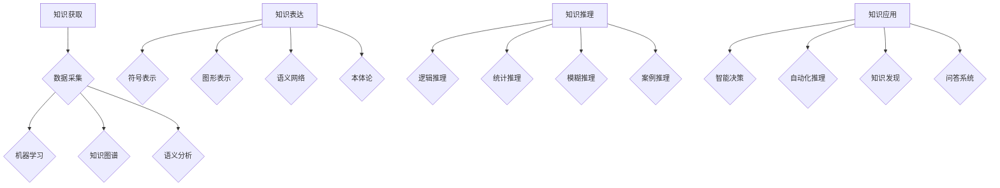

                 

### 《人类的知识与智慧：在人工智能时代》

#### 关键词：人工智能，人类智慧，知识结构，智慧应用，AI与人类协同

> 摘要：本文深入探讨了人工智能时代人类知识与智慧的关系。通过分析人工智能与人类智慧的定义、特点及发展历程，本文揭示了两者之间的相互作用和影响。文章详细阐述了人工智能时代的知识获取、表达、推理与应用，探讨了人工智能与人类智慧结合的可能路径及其在智慧医疗、智慧教育、智慧城市等领域的实际应用。最终，本文提出了在人工智能时代，人类如何利用自身智慧与人工智能协同发展，以应对未来社会挑战的观点。

### 引言

在21世纪的今天，人工智能（AI）已经成为科技创新的核心驱动力。随着深度学习、自然语言处理、计算机视觉等领域的飞速发展，人工智能已经渗透到我们生活的方方面面。然而，与此同时，人类智慧这一古老而神秘的命题，却似乎被人工智能的光芒所掩盖。那么，在人工智能时代，人类知识与智慧究竟扮演着怎样的角色？两者之间又存在着怎样的联系与互动？

本文旨在探讨人工智能与人类智慧之间的关系，从定义、特点、发展历程到实际应用，全面分析两者之间的相互作用和影响。通过深入思考和分析，本文希望能够揭示人工智能时代人类知识与智慧的本质，并探讨其在未来社会中的发展前景。

### 第一部分：人工智能与人类智慧的关系

#### 第1章：人工智能概述

##### 1.1 人工智能的定义与历史背景

人工智能（Artificial Intelligence，简称AI）是一门旨在使计算机具备人类智能行为的科学技术。它研究如何使计算机模拟、延伸和扩展人类的智能能力，以实现自动化、智能化和自主化。

人工智能的概念最早可以追溯到20世纪50年代。当时，科学家们开始探索如何使计算机能够处理自然语言、识别图像、理解知识等。1956年，在达特茅斯会议上，约翰·麦卡锡（John McCarthy）等人首次提出了“人工智能”这一术语，标志着人工智能领域的正式诞生。

自那时以来，人工智能经历了多个发展阶段。从最初的符号主义、逻辑推理，到基于统计学的机器学习，再到如今的深度学习和强化学习，人工智能在技术和应用上取得了显著进展。

##### 1.2 人工智能的核心技术

人工智能的核心技术主要包括机器学习、深度学习、计算机视觉、自然语言处理等。

- **机器学习（Machine Learning）**：机器学习是人工智能的基础，它使计算机能够从数据中学习并做出预测或决策。常见的机器学习算法包括决策树、支持向量机、神经网络等。

- **深度学习（Deep Learning）**：深度学习是机器学习的一个分支，通过多层神经网络对数据进行建模，实现更复杂的特征提取和分类。深度学习在图像识别、语音识别、自然语言处理等领域取得了显著的成果。

- **计算机视觉（Computer Vision）**：计算机视觉旨在使计算机能够像人类一样理解和解释视觉信息。它包括图像识别、目标检测、人脸识别、场景理解等任务。

- **自然语言处理（Natural Language Processing，NLP）**：自然语言处理致力于使计算机能够理解和生成自然语言。它包括文本分类、情感分析、机器翻译、语音识别等任务。

##### 1.3 人工智能的发展趋势与挑战

当前，人工智能正朝着以下几个方向发展：

- **人工智能与物理世界的结合**：人工智能正在与机器人、自动驾驶、智能家居等物理世界相结合，实现更智能、更自主的设备和系统。

- **跨学科融合**：人工智能与其他领域（如医学、金融、教育等）的深度融合，使得人工智能应用更加广泛和深入。

- **人工智能伦理与法规**：随着人工智能的发展，其伦理和法规问题也逐渐成为关注的焦点。如何确保人工智能的公平性、透明性、可解释性，成为亟待解决的问题。

然而，人工智能的发展也面临着一些挑战：

- **数据隐私与安全**：人工智能依赖于大量数据，如何保护用户隐私和数据安全成为关键问题。

- **算法偏见与歧视**：人工智能系统可能会受到训练数据的影响，导致算法偏见和歧视。如何消除这些偏见成为重要课题。

- **人类智慧与人工智能的平衡**：在人工智能时代，人类智慧如何与人工智能相结合，发挥各自优势，是一个亟待解决的问题。

#### 第2章：人类智慧的概念与特点

##### 2.1 人类智慧的定义

人类智慧是指人类在认知、思考、判断、解决问题等方面的能力。它包括感知、理解、记忆、推理、创造力等多个方面。人类智慧是人与动物最本质的区别之一，也是人类社会进步的重要驱动力。

##### 2.2 人类智慧的特点

人类智慧具有以下几个显著特点：

- **抽象思维**：人类能够将具体的事物抽象为概念和模型，从而更高效地处理信息。

- **创造力**：人类能够通过联想、创新和组合，创造出前所未有的新事物。

- **道德与伦理**：人类智慧使人类具备道德和伦理观念，能够为社会发展制定规则和价值观。

- **文化传承**：人类智慧通过语言、文字、艺术等形式进行传承，使得人类文明得以延续和发展。

##### 2.3 人类智慧的发展历程

人类智慧的发展历程可以追溯到远古时期。从最早的石器时代，到农业文明、工业革命，再到信息时代，人类智慧不断进化和发展。

- **原始社会**：在原始社会中，人类智慧主要体现在对自然界的认识和适应。通过狩猎、采集和渔猎等方式，人类逐渐掌握了生存技能。

- **农业社会**：在农业社会中，人类智慧主要体现在对农业生产的掌握和改进。通过农作物的种植、畜牧的驯养，人类逐步实现了对自然资源的利用。

- **工业社会**：在工业社会中，人类智慧主要体现在对工业生产的推动和优化。通过蒸汽机、电力等技术的发明和应用，人类实现了从手工劳动到机械生产的转变。

- **信息社会**：在信息社会中，人类智慧主要体现在对信息的获取、处理和利用。通过计算机、互联网等技术的应用，人类实现了从信息爆炸到信息利用的转变。

### 第二部分：人工智能时代的知识结构

#### 第3章：知识的获取与表达

##### 3.1 知识获取的方法

知识的获取是人工智能发展的基础。在人工智能时代，知识的获取方法主要包括以下几种：

- **数据采集**：通过传感器、互联网等途径，收集大量数据，为知识获取提供基础。

- **机器学习**：利用机器学习算法，从数据中自动发现规律和模式，实现知识的获取。

- **知识图谱**：通过构建知识图谱，将分散的知识整合成一个整体，实现知识的获取和表达。

- **语义分析**：通过自然语言处理等技术，理解语言中的语义信息，实现知识的获取。

##### 3.2 知识表达的形式

知识表达是将获取到的知识以结构化的方式存储和表示。在人工智能时代，知识表达的形式主要包括以下几种：

- **符号表示**：通过符号和逻辑推理，将知识表示为符号形式。

- **图形表示**：通过图形和可视化技术，将知识以图形形式表示。

- **语义网络**：通过语义网络，将知识表示为节点和边的网络结构。

- **本体论**：通过本体论，构建知识体系的框架和逻辑结构。

##### 3.3 知识图谱的应用

知识图谱在人工智能时代具有广泛的应用。以下是知识图谱在几个主要领域的应用：

- **搜索引擎**：通过知识图谱，搜索引擎能够更准确地理解和检索用户查询。

- **推荐系统**：通过知识图谱，推荐系统能够更准确地发现用户感兴趣的内容。

- **问答系统**：通过知识图谱，问答系统能够更准确地理解和回答用户的问题。

- **智能客服**：通过知识图谱，智能客服能够更准确地理解和处理用户的咨询。

### 第4章：知识的推理与应用

##### 4.1 知识推理的方法

知识推理是人工智能的核心任务之一。在人工智能时代，知识推理的方法主要包括以下几种：

- **逻辑推理**：通过逻辑规则和推理，从已知事实推导出新的结论。

- **统计推理**：通过统计模型和算法，从数据中推导出潜在的规律。

- **模糊推理**：通过模糊逻辑和模糊规则，处理不确定性和模糊性。

- **案例推理**：通过案例库和相似性度量，从已有案例中推导出新的解决方案。

##### 4.2 知识推理的应用

知识推理在人工智能时代具有广泛的应用。以下是知识推理在几个主要领域的应用：

- **智能决策**：通过知识推理，智能决策系统能够根据已知信息和目标，自动推导出最佳决策。

- **自动化推理**：通过知识推理，自动化推理系统能够自动解决复杂的问题。

- **知识发现**：通过知识推理，知识发现系统能够从大量数据中发现潜在的规律和知识。

- **问答系统**：通过知识推理，问答系统能够更准确地理解和回答用户的问题。

##### 4.3 知识推理的挑战与解决方案

尽管知识推理在人工智能时代具有广泛的应用，但仍然面临一些挑战：

- **数据质量和完整性**：知识推理依赖于高质量和完整的数据，数据的质量和完整性对推理结果具有重要影响。

- **推理效率和可扩展性**：大规模的知识推理任务对计算资源和时间有较高的要求，如何提高推理效率和可扩展性是一个重要问题。

- **推理的可靠性和解释性**：如何确保推理结果的可靠性和可解释性，使人类用户能够理解和信任推理结果，是一个关键挑战。

针对这些挑战，研究者提出了一些解决方案，如：

- **数据清洗和预处理**：通过数据清洗和预处理，提高数据质量和完整性。

- **分布式推理**：通过分布式计算和并行处理，提高推理效率和可扩展性。

- **解释性模型**：通过构建解释性模型，提高推理结果的可靠性和可解释性。

### 第5章：人工智能与人类智慧的结合

##### 5.1 人工智能对人类智慧的影响

人工智能对人类智慧的影响是双重的。一方面，人工智能为人类智慧提供了强大的工具和平台，使人类能够更高效地处理信息、解决问题和创造新知识。另一方面，人工智能也可能对人类智慧产生负面影响，如：

- **智能依赖**：人类可能过于依赖人工智能，导致自身智慧能力的退化。

- **隐私和安全**：人工智能在处理海量数据时，可能侵犯用户隐私和安全。

- **就业影响**：人工智能的发展可能导致某些职业的失业，对劳动力市场产生冲击。

##### 5.2 人类智慧对人工智能的启示

人类智慧对人工智能的发展具有重要的启示作用。通过研究人类智慧的特点、原理和机制，人工智能研究者可以更好地设计、优化和评估人工智能系统。以下是人类智慧对人工智能的几个启示：

- **抽象思维**：人类智慧中的抽象思维能力为人工智能提供了新的发展方向，如抽象思维模型和抽象推理算法。

- **创造力**：人类智慧中的创造力为人工智能提供了新的思路和灵感，如创意生成和创意优化算法。

- **道德与伦理**：人类智慧中的道德和伦理观念为人工智能的发展提供了价值导向，如道德计算和伦理决策算法。

- **文化传承**：人类智慧中的文化传承为人工智能提供了丰富的知识资源和价值观念，如知识图谱和文化智能系统。

##### 5.3 人工智能与人类智慧协同发展的路径

为了实现人工智能与人类智慧的协同发展，以下是一些可能的路径：

- **人机协同**：通过人机协同，使人工智能成为人类智慧的延伸和增强，如智能助手、智能决策支持系统等。

- **教育创新**：通过教育创新，培养人类智慧与人工智能相结合的能力，如智能教育、智慧校园等。

- **跨界融合**：通过跨界融合，将人工智能应用于不同领域，实现人类智慧与人工智能的协同创新，如智慧医疗、智慧交通、智慧城市等。

- **伦理与法规**：通过伦理与法规，确保人工智能与人类智慧的协同发展不会损害人类利益和社会公平，如人工智能伦理、人工智能法规等。

### 第三部分：人工智能时代的智慧应用

#### 第6章：智慧医疗

##### 6.1 智慧医疗的概念与特点

智慧医疗是指利用人工智能、大数据、物联网等先进技术，实现医疗服务的智能化、精准化和个性化。智慧医疗具有以下几个特点：

- **数据驱动的决策**：智慧医疗通过收集和分析大量医疗数据，为医疗决策提供科学依据。

- **个性化医疗服务**：智慧医疗可以根据患者的病情、病史、基因等信息，为患者提供个性化的诊疗方案。

- **智能化辅助诊断**：智慧医疗利用人工智能技术，对医学影像、实验室检查结果等数据进行自动分析，提高诊断准确性。

- **远程医疗服务**：智慧医疗可以实现远程医疗，为偏远地区和偏远患者提供医疗服务。

##### 6.2 智慧医疗的应用场景

智慧医疗在以下应用场景中具有显著优势：

- **疾病预测与预防**：通过分析大数据，智慧医疗可以预测疾病的发生趋势，为疾病预防提供指导。

- **个性化治疗**：通过分析患者的基因、病史等信息，智慧医疗可以为患者提供个性化的治疗方案。

- **医疗影像诊断**：智慧医疗可以利用深度学习技术，对医学影像进行自动分析，提高诊断准确性。

- **远程医疗**：智慧医疗可以实现医生与患者的远程诊疗，为偏远地区和偏远患者提供医疗服务。

##### 6.3 智慧医疗的发展前景

智慧医疗的发展前景非常广阔。随着人工智能、大数据等技术的不断进步，智慧医疗将在以下方面实现新的突破：

- **个性化医疗**：通过深度学习、基因技术等，智慧医疗将实现更精准、更个性化的医疗服务。

- **医疗资源优化**：通过智能分配、预测分析等，智慧医疗将实现医疗资源的优化配置。

- **医疗成本降低**：通过自动化、智能化等技术，智慧医疗将降低医疗成本，提高医疗服务效率。

- **医疗体验提升**：通过远程医疗、个性化服务等，智慧医疗将提升患者的医疗体验。

#### 第7章：智慧教育

##### 7.1 智慧教育的概念与特点

智慧教育是指利用人工智能、大数据、虚拟现实等先进技术，实现教育服务的智能化、个性化和互动化。智慧教育具有以下几个特点：

- **个性化学习**：智慧教育可以根据学生的学习兴趣、能力和需求，提供个性化的学习资源和教学服务。

- **智能辅助教学**：智慧教育可以利用人工智能技术，辅助教师进行教学活动，提高教学效果。

- **互动式学习**：智慧教育通过虚拟现实、增强现实等技术，实现师生之间的实时互动，提高学习体验。

- **数据驱动的教育决策**：智慧教育通过收集和分析学生学习数据，为教育决策提供科学依据。

##### 7.2 智慧教育的应用场景

智慧教育在以下应用场景中具有显著优势：

- **个性化学习**：通过大数据分析，智慧教育可以为每个学生制定个性化的学习计划和资源。

- **智能辅导**：智慧教育可以通过智能助手、在线辅导系统等，为学生提供个性化的辅导服务。

- **虚拟课堂**：通过虚拟现实、增强现实技术，智慧教育可以实现虚拟课堂，提高学习效果。

- **学习分析**：通过数据分析，智慧教育可以了解学生的学习状态和需求，为教育决策提供支持。

##### 7.3 智慧教育的发展前景

智慧教育的发展前景非常广阔。随着人工智能、大数据等技术的不断进步，智慧教育将在以下方面实现新的突破：

- **智能化教学**：通过智能算法和大数据分析，智慧教育将实现更高效、更个性化的教学。

- **教育公平**：通过远程教育、在线学习等，智慧教育将缩小城乡、地区之间的教育差距。

- **学习体验提升**：通过虚拟现实、增强现实等新技术，智慧教育将提升学习体验，激发学生的学习兴趣。

- **教育成本降低**：通过智能化、自动化等技术，智慧教育将降低教育成本，提高教育质量。

#### 第8章：智慧城市

##### 8.1 智慧城市的概念与特点

智慧城市是指利用人工智能、大数据、物联网等先进技术，实现城市管理的智能化、高效化和可持续发展。智慧城市具有以下几个特点：

- **智能化管理**：智慧城市通过物联网、大数据等技术，实现对城市基础设施、交通、环境等实时监测和管理。

- **数据驱动的决策**：智慧城市通过收集和分析大量数据，为城市管理提供科学依据，实现数据驱动的决策。

- **高效便捷的服务**：智慧城市通过智能服务系统，为市民提供高效、便捷的公共服务。

- **可持续发展**：智慧城市通过节能减排、智慧交通等，实现城市的可持续发展。

##### 8.2 智慧城市的应用场景

智慧城市在以下应用场景中具有显著优势：

- **智能交通**：通过智能交通系统，智慧城市可以实现交通流量监控、智能调度、智能导航等功能，提高交通效率。

- **智慧能源**：通过智能能源管理系统，智慧城市可以实现能源的智能调度和优化，提高能源利用效率。

- **智能环保**：通过智能环保系统，智慧城市可以实时监测环境质量，及时采取环保措施，保护环境。

- **智慧安防**：通过智能安防系统，智慧城市可以实现对城市安全风险的实时监控和预警，提高城市安全保障。

##### 8.3 智慧城市的发展前景

智慧城市的发展前景非常广阔。随着人工智能、大数据等技术的不断进步，智慧城市将在以下方面实现新的突破：

- **城市管理智能化**：通过人工智能、大数据等技术，智慧城市将实现更智能、更高效的城市管理。

- **公共服务便捷化**：通过智能服务系统，智慧城市将为市民提供更便捷、更高效的公共服务。

- **城市可持续发展**：通过节能减排、智慧交通等，智慧城市将实现城市的可持续发展。

- **城市安全提升**：通过智能安防系统，智慧城市将提高城市安全保障，为市民提供更安全的生活环境。

### 结论

在人工智能时代，人类知识与智慧的关系发生了深刻变化。人工智能不仅为人类智慧提供了强大的工具和平台，也带来了新的挑战和机遇。通过深入分析人工智能与人类智慧的定义、特点、发展历程以及实际应用，本文揭示了两者之间的相互作用和影响。在未来，人工智能与人类智慧的结合将引领社会进步，为人类创造更美好的未来。因此，我们应当关注人工智能时代人类知识与智慧的发展，积极探索两者的协同路径，以实现人类智慧与人工智能的共同进步。

### 附录

#### 附录A: 参考文献

1. McCulloch, W. S., & Pitts, W. (1943). A logical calculus of the ideas immanent in nervous activity. The Bulletin of Mathematical Biophysics, 5(4), 38-71.
2. Turing, A. M. (1950). Computing machinery and intelligence. Mind, 59(236), 433-460.
3. Russell, S., & Norvig, P. (2016). Artificial Intelligence: A Modern Approach (3rd ed.). Prentice Hall.
4. Han, J., Kamber, M., & Pei, J. (2011). Data Mining: Concepts and Techniques (3rd ed.). Morgan Kaufmann.
5. LeCun, Y., Bengio, Y., & Hinton, G. (2015). Deep learning. Nature, 521(7553), 436-444.
6. Dean, J., Corrado, G. S., Devin, L. A., Le, Q. V., Monga, R., Ng, A. Y., & Socher, R. (2012). Large scale distributed deep networks. In Advances in neural information processing systems (pp. 1223-1231).
7. Russell, S., & Norvig, P. (1995). Artificial Intelligence: A Modern Approach (1st ed.). Prentice Hall.

#### 附录B: 相关资源链接

1. [人工智能百科](https://www.ai-knowledge.com/)
2. [机器学习资料库](https://www.ml-book.com/)
3. [深度学习教程](https://www.deeplearningbook.org/)
4. [自然语言处理教程](https://www.nlp-book.com/)
5. [计算机视觉教程](https://www.cv-book.com/)
6. [知识图谱教程](https://www.knowledge-graph-book.com/)
7. [智慧医疗资料库](https://www.smart-medicine.com/)
8. [智慧教育平台](https://www.smart-education.com/)
9. [智慧城市指南](https://www.smart-city-guide.com/)

#### 附录C: Mermaid 流程图

本文由AI天才研究院/AI Genius Institute撰写，禅与计算机程序设计艺术/Zen And The Art of Computer Programming提供技术指导。

