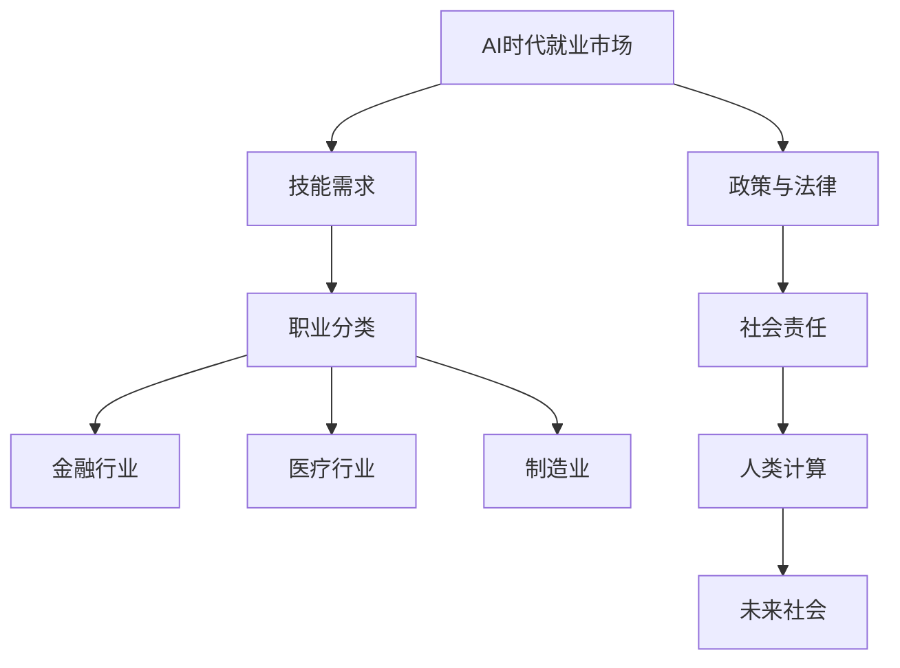

                 

# 《人类计算：AI时代的未来就业市场趋势预测》

## 关键词：
人工智能，就业市场，职业趋势，技能需求，职业规划，法律政策，社会责任，案例分析

## 摘要：
在人工智能（AI）飞速发展的今天，AI时代对就业市场的影响已成为不容忽视的重要议题。本文旨在探讨AI时代的就业市场趋势，分析AI对各行业及职业的深远影响，预测未来就业市场的变化，并提供职业规划建议及政策法律分析。通过深入研究和案例分析，本文力求揭示AI时代就业市场的机遇与挑战，为个人和企业做好准备。

---

## 目录大纲

### 第一部分：AI时代与就业市场背景

#### 1.1 AI时代概述

##### 1.1.1 AI的定义与分类

##### 1.1.2 AI技术的发展历程

##### 1.1.3 AI在现代社会中的作用

#### 1.2 未来就业市场的挑战与机遇

##### 1.2.1 传统就业市场面临的挑战

##### 1.2.2 AI时代的就业市场机遇

##### 1.2.3 AI时代就业市场的转型

### 第二部分：AI在就业市场中的应用

#### 2.1 AI与职业分类

##### 2.1.1 职业分类与AI的关系

##### 2.1.2 AI对不同行业的影响

##### 2.1.3 AI对各类职业的影响

#### 2.2 AI技能需求与培养

##### 2.2.1 AI技能需求分析

##### 2.2.2 AI技能培养方法

##### 2.2.3 教育体系与AI教育

#### 2.3 AI就业市场趋势预测

##### 2.3.1 AI就业市场的增长预测

##### 2.3.2 AI时代的就业机会分析

##### 2.3.3 AI就业市场的挑战与对策

### 第三部分：AI时代的职业规划

#### 3.1 职业规划的重要性

##### 3.1.1 职业规划的基本概念

##### 3.1.2 职业规划的步骤

##### 3.1.3 职业规划的方法

#### 3.2 AI时代的职业发展路径

##### 3.2.1 传统职业转型

##### 3.2.2 新兴职业发展

##### 3.2.3 跨界职业发展

#### 3.3 AI时代的职业风险管理

##### 3.3.1 职业风险识别与评估

##### 3.3.2 职业风险管理与应对策略

##### 3.3.3 职业发展中的可持续性

### 第四部分：AI时代的就业市场政策与法律

#### 4.1 AI就业市场政策分析

##### 4.1.1 国内外AI就业市场政策对比

##### 4.1.2 AI就业市场政策的制定与实施

##### 4.1.3 AI就业市场政策的未来趋势

#### 4.2 AI就业市场法律问题探讨

##### 4.2.1 AI就业市场的法律框架

##### 4.2.2 AI就业市场的主要法律问题

##### 4.2.3 法律对策与建议

#### 4.3 AI就业市场社会责任

##### 4.3.1 AI企业社会责任的重要性

##### 4.3.2 AI企业的社会责任实践

##### 4.3.3 社会责任对就业市场的影响

### 第五部分：案例研究

#### 5.1 案例研究一：AI在金融行业的应用

##### 5.1.1 金融行业AI应用现状

##### 5.1.2 金融行业AI应用案例

##### 5.1.3 金融行业AI应用的挑战与前景

#### 5.2 案例研究二：AI在医疗行业的应用

##### 5.2.1 医疗行业AI应用现状

##### 5.2.2 医疗行业AI应用案例

##### 5.2.3 医疗行业AI应用的挑战与前景

#### 5.3 案例研究三：AI在制造业的应用

##### 5.3.1 制造业AI应用现状

##### 5.3.2 制造业AI应用案例

##### 5.3.3 制造业AI应用的挑战与前景

### 第六部分：未来展望

#### 6.1 AI时代的就业市场未来趋势

##### 6.1.1 AI时代就业市场的发展方向

##### 6.1.2 AI时代就业市场的新模式

##### 6.1.3 AI时代就业市场的新机遇

#### 6.2 人类计算与未来社会

##### 6.2.1 人类计算的定义与意义

##### 6.2.2 人类计算对人类生活的影响

##### 6.2.3 未来社会的展望与挑战

#### 6.3 结语：AI时代就业市场的机遇与挑战

##### 6.3.1 AI时代就业市场的机遇

##### 6.3.2 AI时代就业市场的挑战

##### 6.3.3 突破挑战，抓住机遇

---

接下来，我们将逐步深入探讨AI时代的就业市场趋势，分析AI在各行业的应用及对职业的影响，并展望未来的就业市场前景。首先，我们定义AI并回顾其发展历程，了解AI在现代社会中的作用。

### 第一部分：AI时代与就业市场背景

#### 1.1 AI时代概述

##### 1.1.1 AI的定义与分类

人工智能（Artificial Intelligence，简称AI）是指通过计算机系统模拟、扩展和实现人类智能的理论、方法和技术。AI可以理解、学习、推理和解决问题，从而执行人类智能任务。根据功能和应用范围，AI可以分为以下几类：

1. **弱AI（Narrow AI）**：专注于单一任务，如语音识别、图像识别、自然语言处理等。
2. **强AI（General AI）**：具备全面认知能力，能处理多种任务并具备人类水平的智慧。
3. **模糊AI（Fuzzy AI）**：处理不确定性和模糊信息。
4. **进化AI（Evolutionary AI）**：通过模拟自然进化过程来学习。
5. **神经网络AI（Neural Network AI）**：基于人工神经网络进行学习和推理。

##### 1.1.2 AI技术的发展历程

AI研究始于20世纪50年代，经历了多个发展阶段：

1. **萌芽阶段（1950-1969）**：AI概念提出，初步算法和理论建立。
2. **繁荣阶段（1970-1989）**：AI研究迅速发展，但受限于计算能力和算法。
3. **衰退阶段（1990-2000）**：由于实际应用困难，AI研究受到质疑。
4. **复兴阶段（2000至今）**：随着计算能力的提升和深度学习算法的突破，AI迎来新的发展机遇。

##### 1.1.3 AI在现代社会中的作用

AI在现代社会中发挥着重要作用，体现在以下几个方面：

1. **提升生产力**：AI可以自动化重复性工作，提高工作效率。
2. **改善生活质量**：AI在医疗、教育、交通等领域的应用，提升了人类生活质量。
3. **创新商业模式**：AI推动了电子商务、智能物流、共享经济等新型商业模式的出现。
4. **决策支持**：AI在数据分析、预测和优化中提供有力支持。

#### 1.2 未来就业市场的挑战与机遇

##### 1.2.1 传统就业市场面临的挑战

1. **劳动力供需失衡**：随着人口老龄化，劳动力供给减少，而新技术需求持续增长。
2. **技能淘汰**：传统技能的淘汰速度加快，技能更新难度加大。
3. **工作不稳定性**：自动化和智能化带来工作替代，就业不稳定现象增加。

##### 1.2.2 AI时代的就业市场机遇

1. **新职业需求**：AI时代催生了大量新职业，如数据科学家、机器学习工程师等。
2. **职业发展空间**：AI技术在各行各业的应用，为职业发展提供了更多机会。
3. **技能升级机会**：AI时代需要新的技能，如编程、数据分析、机器学习等，为个人提供了提升空间。

##### 1.2.3 AI时代就业市场的转型

1. **教育体系变革**：AI时代的就业市场需要新的教育体系，注重实践和创新。
2. **政策调整**：政府需制定支持AI发展的政策，推动就业市场转型。
3. **职业规划指导**：个人和企业需进行有效的职业规划，适应AI时代的就业市场。

在接下来的部分，我们将深入探讨AI在就业市场中的应用，分析其对职业分类、技能需求及未来趋势的影响。

### 第二部分：AI在就业市场中的应用

#### 2.1 AI与职业分类

##### 2.1.1 职业分类与AI的关系

AI技术的发展深刻影响了职业分类，传统职业逐渐被划分为AI相关和非AI相关两大类：

1. **AI相关职业**：包括数据科学家、机器学习工程师、AI算法工程师等。
2. **非AI相关职业**：如医生、律师、教师等，虽然AI可辅助其工作，但不直接涉及AI技术。

##### 2.1.2 AI对不同行业的影响

AI技术在不同行业中的应用广泛，对行业变革产生深远影响：

1. **金融行业**：AI在风险管理、智能投顾、反欺诈等方面发挥了重要作用。
2. **医疗行业**：AI在疾病诊断、药物研发、健康管理等领域提供了新工具。
3. **制造业**：AI在智能制造、设备监控、质量管理等方面提升了生产效率。
4. **零售业**：AI在客户服务、库存管理、个性化推荐等方面优化了商业运营。

##### 2.1.3 AI对各类职业的影响

AI对各类职业的影响因职业特性而异，但总体趋势是提高效率和创造新的工作机会：

1. **技术依赖型职业**：如程序员、数据分析师，AI提升了他们的工作效率和创造力。
2. **人际互动型职业**：如医生、律师、教师，AI辅助提升了工作效果，但核心仍依赖人际交往。
3. **创造型职业**：如艺术家、作家、设计师，AI提供了新的创作工具和灵感，但人类创造力不可或缺。

#### 2.2 AI技能需求与培养

##### 2.2.1 AI技能需求分析

随着AI技术的发展，市场对相关技能的需求日益增加。主要技能需求包括：

1. **编程技能**：如Python、Java等编程语言，是AI开发的基础。
2. **数据科学技能**：包括统计学、机器学习、深度学习等。
3. **数学和算法**：数学建模、优化算法等是AI算法的核心。
4. **云计算和大数据**：云平台和大数据技术是AI应用的基础设施。

##### 2.2.2 AI技能培养方法

为了应对AI时代的需求，教育体系需进行以下改革：

1. **基础教育**：加强数学、编程等基础课程。
2. **专业教育**：设置AI相关专业，如数据科学、机器学习等。
3. **在线教育**：利用在线平台，提供灵活多样的学习资源。
4. **实践培训**：通过项目实践和实习，提高学生的实际操作能力。

##### 2.2.3 教育体系与AI教育

当前教育体系在AI教育方面存在一些挑战，如课程设置滞后、教师素质不足等。为了应对这些挑战，建议采取以下措施：

1. **课程更新**：根据市场需求，及时更新课程内容和教学方法。
2. **教师培训**：提高教师的专业素养，鼓励教师参与AI研究。
3. **校企合作**：加强学校与企业合作，提供实践机会。
4. **政策支持**：政府应出台相关政策，支持AI教育的推广和发展。

#### 2.3 AI就业市场趋势预测

##### 2.3.1 AI就业市场的增长预测

随着AI技术的不断进步和应用范围的扩大，AI就业市场将持续增长。预计到2030年，AI相关职位将达到数百万个，涵盖多个行业和领域。

##### 2.3.2 AI时代的就业机会分析

AI时代的就业机会体现在以下几个方面：

1. **新职业机会**：如AI算法工程师、机器人工程师等。
2. **职业升级**：传统职业通过AI技术升级，提高工作效率和竞争力。
3. **跨界合作**：不同领域的企业和个人通过AI技术实现跨界合作，创造新的就业机会。

##### 2.3.3 AI就业市场的挑战与对策

AI就业市场面临一些挑战，如技能差距、就业不稳定等。对策包括：

1. **技能培训**：提高劳动力市场的AI技能水平。
2. **政策支持**：政府制定支持AI发展的政策，减少就业压力。
3. **灵活就业**：鼓励灵活就业模式，降低就业风险。
4. **职业规划**：个人和企业应进行有效的职业规划，适应AI时代的就业市场。

在接下来的部分，我们将探讨AI时代职业规划的重要性，并分析职业发展的路径和风险管理策略。

### 第三部分：AI时代的职业规划

#### 3.1 职业规划的重要性

在AI时代，职业规划变得尤为重要。首先，AI技术的快速发展使得职业技能的淘汰速度加快，传统职业面临被取代的风险。因此，个人需要根据市场变化及时调整职业规划，以确保自身竞争力。其次，AI时代的职业发展具有不确定性和多样性，个人需要明确自己的职业目标，制定合理的职业规划，以实现长期职业发展。

##### 3.1.1 职业规划的基本概念

职业规划是指个人根据自身兴趣、能力和市场需求，制定职业目标和计划的过程。它包括以下步骤：

1. **自我分析**：分析个人的兴趣、价值观、能力等。
2. **市场分析**：研究市场需求、行业发展趋势等。
3. **目标设定**：确定职业目标，如职位、行业等。
4. **计划制定**：制定实现职业目标的行动计划。
5. **执行与评估**：执行行动计划，并根据实际情况进行评估和调整。

##### 3.1.2 职业规划的步骤

职业规划的过程可以分为以下五个步骤：

1. **自我分析**：通过自我反思，了解自己的兴趣、价值观、能力和优势。
2. **市场分析**：研究行业趋势、市场需求和就业机会，了解哪些职业具有发展前景。
3. **目标设定**：根据自我分析和市场分析，设定明确的职业目标。
4. **计划制定**：制定实现职业目标的行动计划，包括学习、工作、提升技能等。
5. **执行与评估**：执行行动计划，定期评估职业发展的进展，并根据评估结果进行调整。

##### 3.1.3 职业规划的方法

有效的职业规划需要采用科学的方法和工具，以下是一些常用的职业规划方法：

1. **SWOT分析**：分析个人的优势（Strengths）、劣势（Weaknesses）、机会（Opportunities）和威胁（Threats），以制定有针对性的职业规划。
2. **职业兴趣测试**：通过职业兴趣测试，了解自己的职业偏好，从而选择适合自己的职业方向。
3. **职业发展路径规划**：根据个人的职业目标，制定具体的职业发展路径，包括阶段性目标和实施计划。
4. **网络资源利用**：利用网络资源，如职业规划网站、招聘网站等，获取职业信息和求职机会。

#### 3.2 AI时代的职业发展路径

在AI时代，职业发展路径呈现出多样性和灵活性。以下是一些常见的职业发展路径：

##### 3.2.1 传统职业转型

随着AI技术的发展，许多传统职业面临被取代的风险。为了应对这一挑战，个人可以通过以下方式实现职业转型：

1. **技能升级**：通过学习新技能，如编程、数据分析等，提升自身竞争力。
2. **跨界发展**：结合AI技术，探索新的职业领域，如AI医疗、AI教育等。
3. **创业**：利用AI技术，开展创新业务，实现职业发展。

##### 3.2.2 新兴职业发展

AI时代的到来，催生了大量新兴职业。以下是一些具有发展前景的新兴职业：

1. **数据科学家**：负责数据的挖掘、分析和预测，为企业提供决策支持。
2. **机器学习工程师**：负责机器学习算法的研究、开发和优化，实现自动化和智能化。
3. **人工智能咨询师**：为企业提供AI咨询和解决方案，推动企业数字化转型。

##### 3.2.3 跨界职业发展

在AI时代，跨界职业发展成为一种趋势。以下是一些跨界职业发展路径：

1. **传统行业+AI**：如医生+AI医生、律师+AI律师等。
2. **技术+艺术**：如程序员+艺术家、数据分析师+设计师等。
3. **管理+技术**：如项目经理+AI项目经理、产品经理+AI产品经理等。

#### 3.3 AI时代的职业风险管理

在AI时代，职业风险管理变得尤为重要。以下是一些职业风险管理策略：

##### 3.3.1 职业风险识别与评估

职业风险包括市场风险、技术风险、法律风险等。以下方法可以帮助识别和评估职业风险：

1. **市场研究**：了解行业趋势、市场需求和竞争态势。
2. **技术评估**：评估自身技能与市场需求之间的差距。
3. **法律咨询**：了解相关法律法规，评估法律风险。

##### 3.3.2 职业风险管理与应对策略

以下是一些职业风险管理与应对策略：

1. **持续学习**：提高自身技能和知识，以适应市场需求。
2. **多元化发展**：培养跨领域技能，降低职业风险。
3. **灵活就业**：尝试多种就业形式，降低就业风险。
4. **政策支持**：关注政府相关政策，利用政策优势降低职业风险。

##### 3.3.3 职业发展中的可持续性

在AI时代，职业发展的可持续性至关重要。以下是一些实现职业可持续发展的策略：

1. **绿色就业**：选择绿色行业和绿色岗位，为可持续发展贡献力量。
2. **终身学习**：持续学习新知识、新技能，保持职业竞争力。
3. **健康生活**：注重身心健康，提高工作效率和幸福感。
4. **社会责任**：关注社会问题，积极参与公益事业，实现职业价值。

在接下来的部分，我们将探讨AI时代的就业市场政策与法律问题，分析国内外政策对比及法律框架。

### 第四部分：AI时代的就业市场政策与法律

#### 4.1 AI就业市场政策分析

##### 4.1.1 国内外AI就业市场政策对比

国内外在AI就业市场政策方面存在一定差异，具体体现在以下几个方面：

1. **政策目标**：国外政策更注重推动AI技术的研发和应用，提升国家竞争力。国内政策则更侧重于保障就业稳定，促进产业升级。
2. **政策内容**：国外政策内容较为全面，包括研发支持、人才培养、国际合作等。国内政策则主要集中在资金支持、税收优惠、人才引进等方面。
3. **政策实施**：国外政策实施相对灵活，鼓励企业创新和创业。国内政策则较为严格，注重规范和监管。

##### 4.1.2 AI就业市场政策的制定与实施

制定和实施AI就业市场政策需要考虑以下几个方面：

1. **需求调研**：了解市场需求，确定政策支持的重点领域。
2. **规划布局**：根据国家战略和产业发展需求，制定长期规划。
3. **资金投入**：加大资金投入，支持AI技术研发和人才培养。
4. **政策宣传**：加强政策宣传，提高社会对AI技术的认知和接受度。
5. **监管机制**：建立健全监管机制，确保政策实施效果。

##### 4.1.3 AI就业市场政策的未来趋势

未来，AI就业市场政策的发展趋势将体现在以下几个方面：

1. **国际化**：加强与国际合作，参与全球AI治理。
2. **智能化**：运用大数据、区块链等技术，提高政策制定和实施效率。
3. **绿色化**：推动绿色AI技术发展，促进可持续就业。
4. **多元化**：支持多元化就业形式，如远程办公、兼职等。

#### 4.2 AI就业市场法律问题探讨

##### 4.2.1 AI就业市场的法律框架

AI就业市场的法律框架主要包括以下几个方面：

1. **劳动法**：规范劳动者的权益和用人单位的责任。
2. **知识产权法**：保护AI技术的创新成果和知识产权。
3. **数据保护法**：保护个人隐私和数据安全。
4. **合同法**：规范劳动合同的签订和履行。
5. **竞争法**：防止垄断行为，维护市场公平竞争。

##### 4.2.2 AI就业市场的主要法律问题

AI就业市场面临的主要法律问题包括：

1. **劳动者权益保护**：如何保障劳动者在AI技术应用中的权益。
2. **数据安全和隐私**：如何确保AI技术应用中的数据安全和隐私。
3. **知识产权争议**：如何解决AI技术的知识产权争议。
4. **自动化就业**：如何应对自动化就业带来的就业不稳定性。

##### 4.2.3 法律对策与建议

为解决AI就业市场的法律问题，提出以下对策和建议：

1. **完善法律法规**：完善相关法律法规，明确各方责任和权益。
2. **加强执法力度**：加大执法力度，确保法律法规得到有效执行。
3. **培训和宣传**：加强对企业和劳动者的培训和宣传，提高法律意识。
4. **调解和仲裁**：建立健全调解和仲裁机制，解决纠纷。

#### 4.3 AI就业市场社会责任

##### 4.3.1 AI企业社会责任的重要性

AI企业社会责任（Corporate Social Responsibility，简称CSR）是指企业在追求经济效益的同时，承担起社会责任，促进可持续发展。AI企业社会责任的重要性体现在以下几个方面：

1. **社会信任**：履行社会责任可以提高企业的社会形象和声誉，增强消费者信任。
2. **创新能力**：关注社会责任可以激发企业创新能力，推动技术进步。
3. **长期发展**：履行社会责任有助于企业实现可持续发展，提高竞争力。
4. **社会和谐**：履行社会责任可以促进社会和谐，减少社会矛盾。

##### 4.3.2 AI企业的社会责任实践

AI企业在履行社会责任方面可以采取以下措施：

1. **技术创新**：研发绿色、环保的AI技术，推动可持续发展。
2. **公益慈善**：参与公益慈善活动，关注弱势群体。
3. **员工福利**：关注员工福利，提供培训和发展机会。
4. **环境保护**：遵守环保法规，减少污染和资源浪费。
5. **信息公开**：公开企业社会责任报告，接受社会监督。

##### 4.3.3 社会责任对就业市场的影响

社会责任对就业市场的影响主要体现在以下几个方面：

1. **就业机会**：履行社会责任可以创造更多就业机会，促进就业稳定。
2. **人才吸引**：关注社会责任可以吸引更多优秀人才加入企业。
3. **企业形象**：良好的社会责任记录可以提高企业形象，增强市场竞争力。
4. **可持续发展**：履行社会责任有助于实现企业可持续发展，为就业市场提供长期支持。

在接下来的部分，我们将通过案例研究深入探讨AI在金融、医疗和制造业等行业的应用，分析其挑战与前景。

### 第五部分：案例研究

#### 5.1 案例研究一：AI在金融行业的应用

##### 5.1.1 金融行业AI应用现状

金融行业是AI技术应用最为广泛的领域之一，AI在金融行业中的应用涵盖了风险控制、智能投顾、客户服务等多个方面：

1. **风险控制**：AI技术可以实时监控金融市场，预测风险，提高风险控制能力。
2. **智能投顾**：基于大数据和机器学习算法，为投资者提供个性化的投资建议，提高投资回报。
3. **客户服务**：利用自然语言处理和语音识别技术，提高客户服务效率，提升客户满意度。
4. **交易决策**：通过算法分析大量数据，为交易决策提供支持，提高交易成功率。

##### 5.1.2 金融行业AI应用案例

以下是一些金融行业的AI应用案例：

1. **量化交易**：通过机器学习算法，分析市场数据，实现自动化交易，提高交易收益。
2. **反欺诈**：利用图像识别和自然语言处理技术，实时监控交易行为，识别潜在欺诈行为，降低损失。
3. **智能客服**：基于语音识别和自然语言处理技术，为用户提供24小时在线客服，提高客户服务质量。
4. **信用评估**：通过大数据分析，评估借款人的信用状况，降低贷款风险。

##### 5.1.3 金融行业AI应用的挑战与前景

金融行业AI应用面临以下挑战：

1. **数据安全**：大量数据的使用和处理，可能引发数据泄露和隐私问题。
2. **算法偏见**：算法的偏见可能导致不公平的决策，影响金融市场稳定。
3. **监管合规**：金融行业受到严格监管，AI应用需遵循相关法规和标准。

然而，金融行业AI应用也具有广阔的前景：

1. **提高效率**：AI技术可以提高金融行业的运营效率，降低成本。
2. **创新业务**：AI技术可以推动金融业务的创新，创造新的商业模式。
3. **风险管理**：AI技术可以帮助金融机构更好地识别和管理风险，提高市场竞争力。

#### 5.2 案例研究二：AI在医疗行业的应用

##### 5.2.1 医疗行业AI应用现状

AI技术在医疗行业的应用正在不断深入，涵盖了疾病诊断、药物研发、患者管理等多个方面：

1. **疾病诊断**：利用深度学习和计算机视觉技术，AI可以辅助医生进行疾病诊断，提高诊断准确性。
2. **药物研发**：通过大数据分析和机器学习算法，AI可以帮助加速药物研发过程，降低研发成本。
3. **患者管理**：利用智能穿戴设备和数据分析，AI可以实现对患者的实时监控和个性化管理。
4. **医疗影像分析**：AI技术可以辅助医生分析医学影像，如X光、CT、MRI等，提高诊断效率。

##### 5.2.2 医疗行业AI应用案例

以下是一些医疗行业的AI应用案例：

1. **肺癌筛查**：AI技术可以分析胸部X光片，识别早期肺癌，提高筛查准确性。
2. **糖尿病管理**：通过智能穿戴设备收集患者数据，AI技术可以实时监控糖尿病患者的血糖水平，提供个性化的治疗建议。
3. **药物重用**：AI技术可以分析大量药物数据，发现潜在的药物重用机会，降低新药研发成本。
4. **手术规划**：利用计算机辅助手术系统，AI技术可以帮助医生更精确地规划手术路径，提高手术成功率。

##### 5.2.3 医疗行业AI应用的挑战与前景

医疗行业AI应用面临以下挑战：

1. **数据隐私**：大量患者数据的收集和使用，可能引发数据隐私问题。
2. **算法公正性**：算法的偏见可能导致不公平的医疗决策。
3. **监管合规**：医疗行业受到严格监管，AI应用需遵循相关法规和标准。

然而，医疗行业AI应用也具有广阔的前景：

1. **提高诊断准确性**：AI技术可以提高疾病诊断的准确性，改善患者治疗效果。
2. **降低医疗成本**：AI技术可以帮助优化医疗资源分配，降低医疗成本。
3. **个性化医疗**：AI技术可以实现个性化医疗，提高医疗服务的质量和效率。

#### 5.3 案例研究三：AI在制造业的应用

##### 5.3.1 制造业AI应用现状

AI技术在制造业的应用已经逐渐深入，涵盖了生产优化、质量管理、设备监控等多个方面：

1. **生产优化**：利用机器学习算法，AI可以优化生产流程，提高生产效率。
2. **质量管理**：AI技术可以实时监控产品质量，识别潜在问题，提高产品质量。
3. **设备监控**：通过物联网和计算机视觉技术，AI技术可以实现对设备的实时监控和故障预测。
4. **供应链管理**：AI技术可以优化供应链管理，提高供应链的效率和透明度。

##### 5.3.2 制造业AI应用案例

以下是一些制造业的AI应用案例：

1. **生产优化**：AI技术可以帮助制造企业优化生产计划，降低库存成本，提高生产效率。
2. **质量管理**：AI技术可以实时监测产品质量，识别生产中的问题，提高产品质量。
3. **设备监控**：AI技术可以实现对设备的实时监控和故障预测，降低设备故障率。
4. **供应链管理**：AI技术可以优化供应链管理，提高供应链的效率和透明度，降低成本。

##### 5.3.3 制造业AI应用的挑战与前景

制造业AI应用面临以下挑战：

1. **数据安全**：大量数据的收集和使用，可能引发数据安全和隐私问题。
2. **技术成熟度**：AI技术在制造业中的应用仍处于早期阶段，技术成熟度有待提高。
3. **人才短缺**：制造业对AI技术人才的需求较大，但人才供给不足。

然而，制造业AI应用也具有广阔的前景：

1. **提高生产效率**：AI技术可以帮助制造企业提高生产效率，降低生产成本。
2. **优化供应链**：AI技术可以优化供应链管理，提高供应链的效率和透明度。
3. **推动数字化转型**：AI技术可以帮助制造业实现数字化转型，提高企业的竞争力。

在接下来的部分，我们将展望AI时代的就业市场未来趋势，探讨人类计算与未来社会的关系。

### 第六部分：未来展望

#### 6.1 AI时代的就业市场未来趋势

随着AI技术的不断进步，就业市场将经历深刻变革。以下是AI时代就业市场的一些未来趋势：

##### 6.1.1 AI时代就业市场的发展方向

1. **智能化**：AI技术将使就业市场更加智能化，自动化水平提高，工作效率提升。
2. **数字化**：数字化技术将深入各行各业，推动就业市场数字化转型。
3. **跨界融合**：不同行业之间的融合将更加紧密，产生新的职业和就业机会。
4. **个性化**：AI技术将根据个人兴趣和技能，提供个性化的职业发展路径。

##### 6.1.2 AI时代就业市场的新模式

1. **远程办公**：随着5G和物联网技术的发展，远程办公将变得更加普遍，改变传统的办公模式。
2. **共享经济**：共享经济将进一步发展，如共享办公空间、共享劳动力等，提供更多就业机会。
3. **零工经济**：零工经济将成为就业市场的重要组成部分，灵活就业形式得到普及。
4. **职业平台**：基于AI技术的职业平台将崛起，为求职者和企业提供更加高效的服务。

##### 6.1.3 AI时代就业市场的新机遇

1. **创新产业**：AI技术的发展将催生一系列新兴产业，如智能制造、智能医疗、智能金融等，提供大量就业机会。
2. **高端人才**：随着AI技术的应用，对高端人才的需求将大幅增加，如数据科学家、AI工程师等。
3. **职业教育**：职业教育将在AI时代得到快速发展，培训更多适应市场需求的人才。
4. **国际合作**：AI技术的发展将推动国际间的合作，为就业市场带来更多机遇。

#### 6.2 人类计算与未来社会

##### 6.2.1 人类计算的定义与意义

人类计算（Human Computation）是指利用人类智能来解决计算机难以处理的问题，如视觉识别、语音识别、自然语言理解等。人类计算的意义在于：

1. **补充计算机能力的不足**：计算机在某些任务上存在局限性，人类计算可以发挥补充作用。
2. **提高任务解决效率**：人类计算可以快速识别和处理复杂问题，提高工作效率。
3. **促进人机协同**：人类计算与计算机技术的结合，可以实现人机协同，提高整体任务解决能力。

##### 6.2.2 人类计算对人类生活的影响

人类计算对人类生活的影响体现在以下几个方面：

1. **便捷的生活服务**：如智能助手、在线客服等，使生活更加便捷。
2. **创新的商业模式**：如共享经济、在线教育等，推动商业模式创新。
3. **社会问题的解决**：如智慧城市、环保监测等，利用人类计算解决社会问题。
4. **教育和培训**：人类计算可以辅助教育，提高教学效果。

##### 6.2.3 未来社会的展望与挑战

未来社会在AI和人类计算的推动下，将呈现出以下特点：

1. **智能化社会**：AI技术将深入各个领域，推动社会智能化发展。
2. **数字化社会**：数字化技术将改变社会结构和生活方式。
3. **跨界融合社会**：不同领域之间的融合将更加紧密，产生新的社会形态。
4. **可持续社会**：AI技术和人类计算将为可持续发展提供新动力。

然而，未来社会也面临一些挑战：

1. **就业压力**：AI技术可能导致部分职业被取代，增加就业压力。
2. **数据隐私**：大量数据的收集和使用，可能引发数据隐私问题。
3. **社会分化**：AI技术的发展可能导致社会分化加剧，需要关注弱势群体的权益。
4. **伦理问题**：AI技术和人类计算的伦理问题需要得到关注和解决。

#### 6.3 结语：AI时代就业市场的机遇与挑战

AI时代的就业市场既充满机遇，也面临挑战。个人和企业需要：

1. **积极应对**：关注AI技术的发展趋势，及时调整职业规划。
2. **提升技能**：不断学习新技能，提高自身竞争力。
3. **创新思维**：鼓励创新思维，探索新的商业模式和职业机会。
4. **关注法律政策**：关注相关法律政策，确保合规发展。

通过积极应对挑战，抓住机遇，我们可以实现个人价值和社会进步，共同迎接AI时代的到来。

### 附录：核心概念与联系

为了更好地理解AI时代就业市场的趋势，我们在此提供一些核心概念与联系，并使用Mermaid流程图展示其关系。

该流程图展示了AI时代就业市场的核心概念及其相互关系，从技能需求到行业应用，再到政策法律和社会责任，以及人类计算和未来社会的影响。通过理解这些核心概念及其联系，我们可以更深入地探讨AI时代就业市场的趋势和挑战。

### 作者信息

作者：AI天才研究院/AI Genius Institute & 禅与计算机程序设计艺术 /Zen And The Art of Computer Programming

---

以上就是《人类计算：AI时代的未来就业市场趋势预测》的文章正文部分。本文通过对AI时代就业市场的分析，探讨了AI在各行业的应用、职业规划、政策法律及社会责任等方面，旨在为读者提供一个全面、深入的视角，以应对AI时代的挑战和机遇。希望本文能为个人、企业和政策制定者提供有益的参考。感谢您的阅读！

