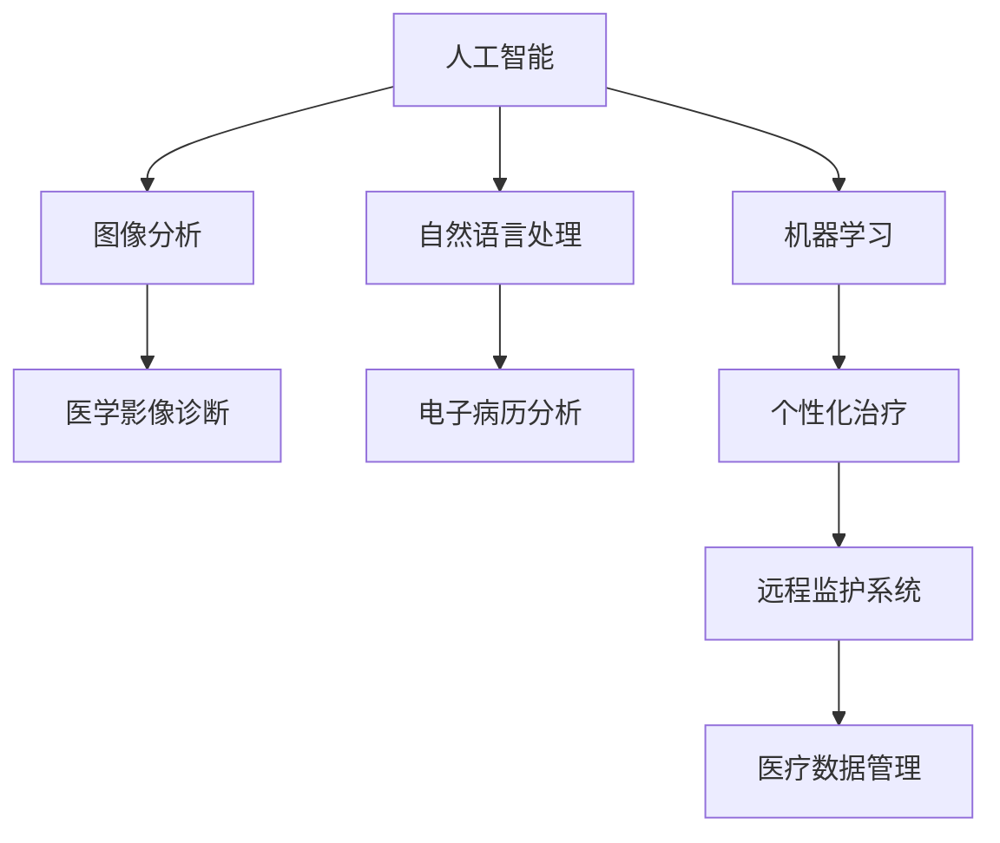

                 

# 人类计算：医疗保健领域的应用

> **关键词**：人工智能、医疗保健、诊断辅助、个性化治疗、远程监护、数据管理

> **摘要**：本文旨在探讨人类计算在医疗保健领域的应用。通过分析人工智能与医疗保健的联系、人类计算的基础理论、具体应用案例等，揭示人类计算在诊断辅助、个性化治疗、患者护理与监测以及医疗数据管理等方面的重要作用。同时，本文还探讨了人类计算的伦理与法律问题，以及未来发展趋势。

## 目录大纲设计：《人类计算：医疗保健领域的应用》

#### 第一部分：导言与概述
- **第1章：引言与概述**
  - 1.1 医疗保健领域背景
  - 1.2 人类计算的概念
  - 1.3 人类计算在医疗保健中的应用
  - 1.4 人类计算的优势与挑战

#### 第二部分：人类计算的基础理论
- **第2章：人工智能与医疗保健的联系**
  - 2.1 人工智能的定义与发展
  - 2.2 人工智能在医疗保健中的应用现状
  - 2.3 人类计算模型的基本原理

#### 第三部分：医疗保健中的人类计算应用
- **第3章：诊断辅助系统**
  - 3.1 诊断辅助系统概述
  - 3.2 图像分析诊断
  - 3.3 辅助决策支持系统
  - 3.4 诊断辅助系统的案例研究

#### 第四部分：治疗与康复
- **第4章：个性化治疗**
  - 4.1 个性化治疗的概念
  - 4.2 个性化治疗的方法
  - 4.3 个性化治疗的案例
  - 4.4 个性化治疗的挑战与未来

#### 第五部分：患者护理与监测
- **第5章：远程监护系统**
  - 5.1 远程监护系统的概述
  - 5.2 远程监护的技术
  - 5.3 远程监护的案例分析
  - 5.4 远程监护的挑战与未来

#### 第六部分：医疗数据管理与分析
- **第6章：医疗数据管理**
  - 6.1 医疗数据的重要性
  - 6.2 医疗数据管理的基本原则
  - 6.3 医疗数据隐私与安全
  - 6.4 医疗数据管理的案例研究

#### 第七部分：人类计算的未来发展
- **第7章：人类计算在医疗保健中的未来趋势**
  - 7.1 人类计算技术的未来方向
  - 7.2 医疗保健领域的技术创新
  - 7.3 人类计算对医疗保健的影响
  - 7.4 人类计算的伦理与法律问题

#### 附录
- **附录A：人类计算应用相关的资源和工具**
  - A.1 开源人工智能框架
  - A.2 医疗保健数据库与数据集
  - A.3 人类计算相关的学术论文与报告

#### 图表与公式
- **图1-1：人工智能与医疗保健的联系图**
  - $$\text{[Mermaid流程图代码]}$$
- **表3-1：诊断辅助系统的性能比较**
  - $$\text{[表格数据]}$$

#### 伪代码示例
- **伪代码 4-1：个性化治疗的算法流程**

  Procedure PersonalizedTherapy(PatientData)
      // 初始化个性化治疗参数
      Initialize TherapyParameters()

      // 分析患者数据
      AnalyzePatientData(PatientData)

      // 根据数据调整治疗方案
      AdjustTherapyPlan(TherapyParameters)

      // 应用治疗方案
      ApplyTherapyPlan(TherapyPlan)

      // 监测治疗效果
      MonitorTherapyEffect()

  EndProcedure
  

#### 数学模型与公式
- **公式 6-1：数据隐私保护的成本效益分析**
  $$\text{CBEA} = \frac{\text{Cost of Compliance}}{\text{Benefit of Data Privacy}}$$

#### 项目实战与代码解读
- **第8章：人类计算项目实战**
  - 8.1 项目实战概述
  - 8.2 开发环境搭建
  - 8.3 源代码实现与解读
  - 8.4 代码解读与分析

### 注释
- **所有章节的标题都遵循 1,2,3 级目录格式，确保清晰性和层次感。**
- **附录包含实用的资源和工具列表，以支持读者进一步学习和实践。**
- **图表与公式均嵌入相应章节，确保易于理解与应用。**
- **伪代码与数学模型均详细解释，便于读者理解和实际应用。**
- **项目实战章节通过实际案例展示了人类计算在医疗保健中的具体应用，提供代码实现与解读。**

### 引言与概述

#### 1.1 医疗保健领域背景

医疗保健是社会发展的重要组成部分，关系到人民的健康和生活质量。随着人口老龄化、慢性疾病增加以及医疗技术的进步，医疗保健的需求不断增长。传统的医疗模式主要依赖于医生的诊断和治疗，然而，面对日益复杂的医疗信息和不断增加的医疗成本，传统模式已无法满足现代医疗保健的需求。

近年来，人工智能（Artificial Intelligence，AI）技术的快速发展为医疗保健领域带来了新的机遇。人工智能具有高效的数据处理和分析能力，可以辅助医生进行诊断、治疗和患者护理。人类计算（Human Computation）作为人工智能的一个重要分支，通过将人类的智慧和机器的计算能力相结合，提供了更智能、更高效的医疗保健解决方案。

#### 1.2 人类计算的概念

人类计算是一种将人类的认知能力与计算机系统相结合的计算模式。它通过设计适合人类参与的任务和系统，将人类的决策能力、创造力与机器的计算能力相结合，以解决复杂问题。在医疗保健领域，人类计算的应用包括但不限于：诊断辅助系统、个性化治疗、患者护理与监测、医疗数据管理等。

人类计算的核心思想是利用人类特有的认知能力，如直觉、经验、判断等，与计算机系统的高效数据处理能力相结合，实现更加智能和高效的医疗保健服务。通过人类计算，医疗专业人员可以更准确地诊断疾病、制定个性化的治疗方案，提高医疗质量和效率。

#### 1.3 人类计算在医疗保健中的应用

人类计算在医疗保健领域的应用广泛而深入。以下是几个关键的应用领域：

1. **诊断辅助系统**：通过分析大量的医学影像、实验室数据和患者病史，诊断辅助系统可以帮助医生更准确地诊断疾病。例如，人工智能系统可以通过分析CT图像，识别出肺癌的早期迹象，辅助医生进行早期诊断。

2. **个性化治疗**：根据患者的个体差异，如基因、生理特征、病史等，人类计算可以制定个性化的治疗方案。这种个性化的治疗方案可以提高治疗效果，减少副作用，为患者提供更优质的医疗服务。

3. **患者护理与监测**：通过远程监护系统，人类计算可以实时监测患者的生命体征和健康状况，及时提供预警和干预措施，提高患者的护理质量和安全性。

4. **医疗数据管理**：医疗数据是医疗保健的核心资产，但传统的数据管理方法存在效率低、准确性差等问题。人类计算可以通过自动化和智能化的方法，提高医疗数据的管理效率和准确性，为医疗决策提供可靠的数据支持。

#### 1.4 人类计算的优势与挑战

人类计算在医疗保健领域具有显著的优势。首先，人类计算可以处理大量复杂的医疗数据，提供快速、准确的诊断和治疗建议。其次，人类计算可以降低医疗成本，提高医疗效率，为更多患者提供优质的医疗服务。此外，人类计算还可以通过智能化的系统，提高医疗服务的个性化和定制化水平。

然而，人类计算在医疗保健领域也面临着一些挑战。首先，医疗数据的安全和隐私问题需要得到妥善解决。医疗数据涉及到患者的隐私和个人信息，必须采取严格的数据保护措施，防止数据泄露和滥用。其次，人类计算系统需要确保其决策的准确性和可靠性，避免出现错误的诊断和治疗方案。此外，医疗保健领域的复杂性高，人类计算系统需要不断学习和适应，以适应不断变化的需求和挑战。

总之，人类计算在医疗保健领域具有巨大的潜力，通过不断的技术创新和应用，可以改善医疗服务质量，提高医疗效率，为患者带来更好的健康体验。本文将在后续章节中详细探讨人类计算在医疗保健领域的具体应用和挑战。

### 人类计算的基础理论

#### 2.1 人工智能的定义与发展

人工智能（Artificial Intelligence，AI）是计算机科学的一个分支，旨在开发能够模拟、延伸和扩展人类智能的理论、算法和技术。人工智能的研究可以追溯到20世纪50年代，当时科学家们提出了“图灵测试”这一概念，即通过测试计算机能否模拟人类智能，来判断其是否具有智能。

人工智能的发展经历了多个阶段。最初的阶段是符号人工智能（Symbolic AI），通过符号逻辑和推理来模拟人类的思维过程。这一阶段的代表性工作包括专家系统和逻辑推理系统。然而，符号人工智能在处理复杂问题时存在局限性，难以应对不确定性和非结构化数据。

随着计算机硬件性能的提升和数据量的爆炸性增长，20世纪80年代后，人工智能进入了第二个阶段——基于数据的机器学习（Data-Driven Machine Learning）。这一阶段的代表性工作包括神经网络、决策树和支持向量机等。基于数据的机器学习通过训练模型来捕捉数据中的规律和模式，从而实现智能决策和预测。

近年来，人工智能进入了第三个阶段——深度学习和强化学习。深度学习（Deep Learning）通过构建多层神经网络，能够自动提取数据的特征和模式，实现了在图像识别、语音识别、自然语言处理等领域的突破性进展。强化学习（Reinforcement Learning）则通过模仿人类的学习过程，通过试错和反馈来优化决策过程，广泛应用于游戏、自动驾驶等领域。

#### 2.2 人工智能在医疗保健中的应用现状

人工智能在医疗保健领域的应用日益广泛，成为提升医疗服务质量、降低医疗成本的重要手段。以下是一些主要的应用场景：

1. **医学影像诊断**：人工智能通过深度学习算法，可以自动分析医学影像，如X光片、CT扫描、MRI等，辅助医生进行诊断。例如，AI系统可以快速识别出肺结节、脑肿瘤等异常情况，提高诊断的准确性和效率。

2. **病理分析**：人工智能可以通过分析病理切片图像，帮助病理医生识别癌细胞和其他病变组织，提高病理诊断的准确性和效率。

3. **药物研发**：人工智能可以帮助科学家快速筛选和预测药物的疗效和副作用，加速新药的发现和开发过程。

4. **临床决策支持**：人工智能系统可以通过分析大量的临床数据，为医生提供个性化的诊断和治疗方案，提高治疗的准确性和效果。

5. **患者监护**：人工智能可以通过智能手表、可穿戴设备等，实时监测患者的生命体征和健康状况，及时发现异常情况，提供预警和干预建议。

6. **医疗数据管理**：人工智能可以自动化处理大量的医疗数据，如电子病历、医学文献等，帮助医疗机构提高数据管理的效率和准确性。

#### 2.3 人类计算模型的基本原理

人类计算模型是基于人工智能理论发展起来的一种计算模型，旨在模拟人类的认知和决策过程。人类计算模型的核心思想是利用人类和计算机各自的优势，实现更高效、更智能的计算。

1. **人类计算模型的结构**：
   - **感知模块**：负责接收和处理外界信息，如视觉、听觉、触觉等。感知模块通常使用机器学习算法，如卷积神经网络（CNN），来处理和分析数据。
   - **认知模块**：负责对感知模块接收到的信息进行加工和处理，如识别模式、做出决策等。认知模块通常使用深度学习算法，如循环神经网络（RNN）和长短期记忆网络（LSTM），来处理序列数据和复杂任务。
   - **行动模块**：负责根据认知模块的处理结果，采取相应的行动。行动模块可以是自动执行的任务，如机器人的运动控制，也可以是人机交互的决策，如智能客服系统。

2. **人类计算模型的优点**：
   - **高效性**：人类计算模型可以处理大量复杂的医疗数据，提高诊断和治疗的速度。
   - **准确性**：通过结合人类的经验和直觉，人类计算模型可以提供更准确、更可靠的医疗建议。
   - **灵活性**：人类计算模型可以根据不同的医疗场景和需求，灵活调整和优化算法，提高适应能力。

3. **人类计算模型的应用**：
   - **诊断辅助系统**：通过分析医学影像和实验室数据，人类计算模型可以辅助医生进行诊断，提高诊断的准确性和效率。
   - **个性化治疗**：根据患者的个体差异，人类计算模型可以制定个性化的治疗方案，提高治疗效果和患者满意度。
   - **患者监护**：通过实时监测患者的生命体征和健康状况，人类计算模型可以提供预警和干预建议，提高患者的护理质量和安全性。
   - **医疗数据管理**：人类计算模型可以自动化处理大量的医疗数据，提高数据管理的效率和准确性。

总之，人类计算模型在医疗保健领域具有广泛的应用前景，通过不断的技术创新和应用，可以为患者提供更优质、更高效的医疗服务。

### 医疗保健中的人类计算应用

#### 3.1 诊断辅助系统概述

诊断辅助系统是医疗保健中的人类计算应用的一个重要领域。这些系统通过结合人工智能和医学知识，为医生提供决策支持，从而提高诊断的准确性和效率。诊断辅助系统通常包括以下几个核心组成部分：

1. **数据输入**：数据输入是诊断辅助系统的第一步，包括医学影像（如X光、CT、MRI）、实验室检查结果、病史和临床表现等。这些数据可以通过电子病历系统、影像管理系统和实验室信息系统等渠道收集。

2. **数据处理**：数据处理是将输入的数据进行预处理和特征提取的过程。通过使用图像处理技术、自然语言处理技术等，可以将原始数据转化为适合机器学习算法分析的形式。

3. **算法模型**：算法模型是诊断辅助系统的核心，负责基于输入的数据和医学知识库，进行疾病识别、分类和预测。常用的算法包括深度学习模型（如卷积神经网络、循环神经网络等）和统计模型（如逻辑回归、决策树等）。

4. **结果输出**：结果输出是将算法模型的结果转化为医生易于理解的诊断报告和推荐措施。结果输出通常包括可视化展示、概率评估和治疗方案建议等。

5. **人机交互**：人机交互是诊断辅助系统中不可或缺的一部分，通过用户界面（UI）和自然语言处理（NLP）技术，实现医生与系统的互动和沟通。

#### 3.2 图像分析诊断

图像分析诊断是诊断辅助系统中最为广泛应用的领域之一。通过深度学习算法，AI系统可以自动分析医学影像，如X光片、CT扫描和MRI图像，帮助医生识别异常病变和疾病。

1. **肺结节检测**：肺结节是肺癌的早期迹象，通过AI系统自动分析CT扫描图像，可以快速、准确地检测出肺结节。AI系统通过对大量肺结节图像的训练，可以学习到肺结节的特征和模式，从而提高检测的准确性。

2. **脑肿瘤识别**：AI系统可以通过分析MRI图像，识别出脑肿瘤的类型和大小。深度学习算法可以通过对大量脑肿瘤图像的训练，学习到不同脑肿瘤的特征，从而实现准确的识别。

3. **乳腺癌筛查**：AI系统可以通过分析乳腺X光片（Mammogram），帮助医生识别乳腺癌。通过卷积神经网络（CNN），AI系统可以自动检测乳腺X光片中的异常组织，提高筛查的准确性。

#### 3.3 辅助决策支持系统

辅助决策支持系统是诊断辅助系统的进一步扩展，旨在提供更全面的诊断和治疗建议。这些系统通过整合多种数据源和医学知识，为医生提供个性化的诊断和治疗建议。

1. **电子病历分析**：辅助决策支持系统可以通过分析电子病历，识别患者的潜在疾病风险。通过机器学习算法，系统可以学习到患者的病史、家族病史和临床表现，从而预测疾病的可能性。

2. **多模态数据分析**：辅助决策支持系统可以通过整合不同类型的医学数据，如影像、实验室检查结果和电子病历等，提供更全面的诊断信息。例如，在诊断心脏病时，系统可以结合心电图、超声图像和血液检查结果，提供综合的诊断建议。

3. **个性化治疗建议**：辅助决策支持系统可以根据患者的个体差异，提供个性化的治疗建议。通过分析患者的基因、生理特征和病史，系统可以为医生提供个性化的治疗方案，从而提高治疗效果。

#### 3.4 诊断辅助系统的案例研究

1. **Google DeepMind的DeepMind Health项目**：Google DeepMind的DeepMind Health项目是一个典型的诊断辅助系统。该项目通过分析患者的电子病历，提供个性化的诊断和治疗建议。DeepMind Health项目已经与英国国家健康服务（NHS）合作，为临床医生提供支持。

2. **IBM Watson for Oncology**：IBM Watson for Oncology是一个基于人工智能的肿瘤诊断和治疗方案推荐系统。该系统通过分析大量的医学文献和临床试验数据，为医生提供个性化的治疗方案。IBM Watson for Oncology已经在美国多个癌症中心投入使用，为患者提供更好的医疗服务。

3. **Lunit Insights**：Lunit Insights是一个基于深度学习的肺癌诊断系统。该系统通过分析CT扫描图像，可以帮助医生快速识别肺癌的早期迹象。Lunit Insights已经在韩国多个医院投入使用，显著提高了肺癌的诊断准确性和效率。

#### 3.5 总结与展望

诊断辅助系统在医疗保健领域具有重要的应用价值，通过提高诊断的准确性和效率，为医生提供了有力的决策支持。未来，随着人工智能技术的不断发展，诊断辅助系统将更加智能化和个性化，为患者提供更好的医疗服务。

然而，诊断辅助系统也面临一些挑战，如数据隐私和安全、算法的可解释性以及系统的可靠性等。需要进一步研究和解决这些问题，以确保诊断辅助系统的可靠性和安全性。同时，还需要加强对诊断辅助系统的监管和评估，确保其临床应用的有效性和合规性。

总之，诊断辅助系统是医疗保健领域的一个重要应用，通过不断的技术创新和应用，将为患者提供更准确、更高效的医疗服务。未来，诊断辅助系统有望与医疗保健的其他领域（如个性化治疗、患者监护等）相结合，形成更加综合和智能的医疗服务体系。

### 个性化治疗

#### 4.1 个性化治疗的概念

个性化治疗是一种以患者为中心的医学模式，旨在通过综合分析患者的基因、环境、生活方式等因素，为每个患者提供最合适的治疗策略。与传统的一刀切治疗方式相比，个性化治疗更注重个体差异，以提高治疗效果和患者满意度。

个性化治疗的核心在于对患者进行全面、细致的评估。这包括基因测序、基因组分析、蛋白质组学、代谢组学等多层次的数据采集。通过这些数据，医生可以深入了解患者的生理和病理特征，从而制定个性化的治疗方案。

#### 4.2 个性化治疗的方法

1. **基因组学**：基因组学是个性化治疗的基础。通过基因测序，医生可以识别出患者体内可能存在的突变基因，从而预测疾病的发病风险和病情发展。例如，某些基因突变可能导致癌症的发生，通过对这些突变基因的分析，医生可以提前采取预防措施。

2. **蛋白质组学**：蛋白质组学关注的是细胞中所有蛋白质的组成和功能。通过分析患者的蛋白质组，医生可以了解患者的生理状态和病理过程，从而制定针对性的治疗策略。

3. **代谢组学**：代谢组学是研究生物体内所有代谢物的组成和变化。通过对患者代谢物的分析，医生可以了解患者的代谢状态，从而优化治疗方案。

4. **多组学数据整合**：为了更全面地了解患者，个性化治疗通常需要整合基因组学、蛋白质组学和代谢组学等多组学数据。通过多组学数据整合，医生可以获得更准确的诊断和治疗信息。

#### 4.3 个性化治疗的案例

1. **肺癌个性化治疗**：肺癌是常见的恶性肿瘤之一。通过基因组学分析，医生可以发现患者体内存在的突变基因，如EGFR突变、ALK突变等。根据这些突变基因，医生可以制定个性化的治疗方案，如靶向药物治疗、免疫治疗等。

2. **乳腺癌个性化治疗**：乳腺癌的个性化治疗同样依赖于基因组学分析。通过对乳腺癌患者进行基因测序，医生可以识别出与乳腺癌相关的基因突变，从而制定个性化的治疗方案。

3. **糖尿病个性化治疗**：糖尿病是一种常见的慢性疾病。通过代谢组学分析，医生可以了解患者的代谢状态，从而调整药物剂量和治疗方案。

#### 4.4 个性化治疗的挑战与未来

尽管个性化治疗在临床实践中取得了显著成果，但仍然面临一些挑战。

1. **技术挑战**：基因组学、蛋白质组学和代谢组学等技术仍在不断发展，其准确性和可重复性仍需提高。此外，多组学数据的整合和分析也面临着巨大的技术挑战。

2. **成本挑战**：个性化治疗需要大量的数据采集和分析，因此成本较高。尽管随着技术的发展和成本的降低，个性化治疗将越来越普及，但在短期内，仍可能面临成本问题。

3. **伦理挑战**：个性化治疗涉及到患者的隐私和个人信息，因此需要严格保护患者数据，防止数据泄露和滥用。

4. **标准挑战**：个性化治疗缺乏统一的标准和规范，不同中心、不同医生的治疗方案可能存在差异，这可能导致治疗效果不一致。

未来，随着技术的不断进步和成本的降低，个性化治疗有望在更广泛的医疗领域得到应用。同时，制定统一的标准和规范，加强数据保护，也是个性化治疗未来发展的重要方向。

总之，个性化治疗是一种具有巨大潜力的医学模式，通过综合考虑患者的个体差异，为患者提供最合适的治疗策略。尽管面临一些挑战，但个性化治疗有望改善患者的生活质量，提高治疗效果。

### 患者护理与监测

#### 5.1 远程监护系统的概述

远程监护系统是一种利用信息技术和传感器设备，对患者的健康状况进行实时监测和分析的系统。通过远程监护系统，医护人员可以实时获取患者的生理数据，如心率、血压、血糖、呼吸频率等，从而及时了解患者的健康状况，提供及时的医疗干预。

远程监护系统通常包括以下几个关键组成部分：

1. **传感器设备**：传感器设备用于收集患者的生理数据。这些设备可以是可穿戴设备（如智能手表、健康监测手环等），也可以是植入设备（如心脏起搏器、胰岛素泵等）。

2. **数据传输网络**：数据传输网络用于将传感器设备收集到的生理数据传输到远程监护平台。这些网络可以是无线网络（如Wi-Fi、蓝牙等），也可以是有线网络（如以太网等）。

3. **远程监护平台**：远程监护平台是远程监护系统的核心，用于接收、存储和分析患者的生理数据。平台通常包括数据存储、数据分析和可视化等模块。

4. **人机交互界面**：人机交互界面用于医护人员和患者与远程监护平台进行交互。通过人机交互界面，医护人员可以实时查看患者的生理数据，进行远程诊断和干预。

#### 5.2 远程监护的技术

1. **传感器技术**：传感器技术是远程监护系统的关键技术之一。现代传感器技术可以精确测量多种生理参数，如心率、血压、血糖等。例如，心电传感器可以实时监测患者的心电信号，通过分析心电信号的变化，可以识别出潜在的心脏问题。

2. **无线传输技术**：无线传输技术是远程监护系统的另一关键组成部分。通过无线传输技术，传感器设备可以实时将生理数据传输到远程监护平台。常见的无线传输技术包括Wi-Fi、蓝牙、ZigBee等。

3. **云计算技术**：云计算技术是远程监护系统的重要组成部分。通过云计算技术，远程监护平台可以高效存储和分析大量的患者数据。云计算技术还可以提供强大的计算能力，支持复杂的数据分析和预测。

4. **大数据分析技术**：大数据分析技术是远程监护系统的关键技术之一。通过大数据分析技术，可以对患者的生理数据进行深入分析，发现潜在的健康问题，为医护人员提供决策支持。

#### 5.3 远程监护的案例分析

1. **远程心电监护**：远程心电监护是一种常见的远程监护应用。通过心电传感器和无线传输技术，患者可以在家中实时监测自己的心电信号。医护人员可以通过远程监护平台实时查看患者的心电数据，发现潜在的心脏问题，并及时进行干预。

2. **远程血压监测**：远程血压监测是另一种常见的远程监护应用。通过血压传感器和无线传输技术，患者可以实时监测自己的血压。医护人员可以通过远程监护平台了解患者的血压变化，及时发现高血压等潜在问题，并制定相应的治疗计划。

3. **远程血糖监测**：对于糖尿病患者来说，远程血糖监测是一项非常重要的应用。通过血糖传感器和无线传输技术，患者可以实时监测自己的血糖水平。医护人员可以通过远程监护平台了解患者的血糖变化，及时调整药物剂量，从而控制血糖水平。

#### 5.4 远程监护的挑战与未来

尽管远程监护系统在医疗保健领域具有广泛的应用前景，但仍然面临一些挑战。

1. **数据隐私和安全**：远程监护系统涉及到大量的患者数据，如何确保数据的安全和隐私是远程监护系统面临的一个重要挑战。需要采取有效的数据加密、访问控制和数据备份等措施，确保患者数据的安全。

2. **设备可靠性和稳定性**：传感器设备和传输设备在远程监护系统中扮演着重要角色。设备的质量和稳定性直接影响到远程监护系统的可靠性和稳定性。需要选择高质量的传感器设备和稳定的传输技术，确保系统运行的可靠性。

3. **数据分析和解释**：远程监护系统产生的数据量巨大，如何对这些数据进行有效的分析和解释是一项挑战。需要开发高效的大数据分析算法，帮助医护人员从海量数据中提取有价值的信息，为临床决策提供支持。

4. **患者依从性**：远程监护系统需要患者主动参与，按时测量生理数据并上传到远程监护平台。患者的依从性直接影响到远程监护系统的效果。需要设计友好、易用的用户界面，提高患者的使用体验，从而提高患者的依从性。

未来，随着技术的不断进步和应用的深入，远程监护系统有望在医疗保健领域发挥更大的作用。通过远程监护系统，可以为患者提供更便捷、更高效的医疗服务，提高患者的护理质量和安全性。

### 医疗数据管理

#### 6.1 医疗数据的重要性

医疗数据是医疗保健系统的核心资产，它包含了患者的健康信息、诊断结果、治疗方案、药物使用记录、手术记录等关键信息。这些数据不仅对于临床诊疗和疾病管理至关重要，同时也是进行医学研究、公共卫生分析和医疗政策制定的重要基础。以下是医疗数据在医疗保健中的一些重要作用：

1. **临床诊疗**：医疗数据是医生进行临床诊断和治疗决策的重要依据。通过电子病历系统（Electronic Health Records，EHR）和健康档案管理，医生可以快速获取患者的病史、过敏史、药物反应记录等，从而做出更准确的诊断和制定更合理的治疗方案。

2. **疾病预防和控制**：医疗数据有助于识别疾病的高发人群和流行趋势，为公共卫生政策的制定提供科学依据。例如，通过对大规模医疗数据的分析，可以及时发现传染病的爆发点，采取有效的防控措施。

3. **医学研究**：医疗数据是医学研究的宝贵资源。研究人员可以利用这些数据来探索疾病的发病机制、治疗方法和效果，从而推动医学科学的进步。

4. **医疗决策支持**：医疗数据为医疗管理者提供了宝贵的决策支持。通过数据分析，管理者可以了解医疗资源的利用情况、疾病负担、医疗成本等，从而优化资源配置和提高医疗服务的效率。

5. **个性化医疗**：个性化医疗需要大量的患者数据来了解患者的遗传背景、生活方式、病史等信息，从而制定个性化的治疗方案。

#### 6.2 医疗数据管理的基本原则

有效管理医疗数据是保障医疗信息安全和数据质量的关键。以下是一些基本的医疗数据管理原则：

1. **数据完整性**：确保医疗数据的完整性，防止数据丢失或损坏。这包括数据的备份和恢复策略，以防止意外事故导致的损失。

2. **数据准确性**：确保医疗数据的准确性，避免错误或误导性信息的传播。这需要建立严格的数据校验和校对机制。

3. **数据一致性**：确保不同系统之间数据的统一性和一致性，避免不同系统之间的数据矛盾。这可以通过数据标准化和数据交换协议来实现。

4. **数据安全性**：保护医疗数据的安全，防止未经授权的访问和泄露。这包括数据加密、访问控制和身份验证等技术手段。

5. **数据隐私性**：保护患者隐私，防止个人健康信息的泄露。这需要遵循相关的隐私保护法规和标准，如HIPAA（美国健康保险携带和责任法案）。

6. **数据可用性**：确保医疗数据在需要时能够被快速访问和检索，以满足临床和管理的需求。

7. **数据可追溯性**：确保医疗数据的变化和操作可以被追溯，以便在出现问题时进行责任追踪和问题解决。

#### 6.3 医疗数据隐私与安全

医疗数据隐私和安全是医疗数据管理中的重要方面。以下是一些关键措施：

1. **数据加密**：对传输和存储的医疗数据进行加密，防止数据在传输过程中被截取和读取。

2. **访问控制**：通过严格的访问控制策略，确保只有授权用户才能访问敏感的医疗数据。

3. **身份验证**：通过身份验证机制，确保只有合法的用户才能访问系统。

4. **审计和监控**：对系统的操作进行审计和监控，记录所有数据访问和操作行为，以便在出现问题时进行追踪和调查。

5. **隐私保护法规**：遵守相关的隐私保护法规和标准，如HIPAA，确保患者的隐私受到法律保护。

6. **患者知情同意**：在收集和使用患者数据时，确保患者知情并同意。

#### 6.4 医疗数据管理的案例研究

1. **电子病历系统（EHR）**：电子病历系统是医疗数据管理的一个重要应用。通过EHR系统，医疗机构可以集中管理患者的医疗记录，实现数据的共享和统一。例如，美国许多医疗机构已经实施了EHR系统，提高了医疗数据的管理效率和数据质量。

2. **医疗数据共享平台**：一些国家和地区建立了医疗数据共享平台，允许不同医疗机构之间的数据交换和共享。这有助于提高医疗资源的利用效率，实现跨机构的医疗协作。例如，英国的NHS（国家健康服务）就建立了这样的共享平台。

3. **健康信息交换标准（如HL7）**：为了实现医疗数据的一致性和互操作性，许多国家和地区制定了健康信息交换标准，如HL7（Health Level Seven）。这些标准规定了医疗数据的格式、编码和传输规则，确保不同系统之间的数据可以无缝交换。

总之，医疗数据管理是医疗保健领域不可或缺的一部分。通过有效的数据管理，可以提高医疗服务的效率和质量，保护患者隐私和安全，为医学研究和公共卫生分析提供支持。未来，随着技术的不断进步，医疗数据管理将面临新的机遇和挑战，需要持续改进和优化。

### 人类计算的未来发展

#### 7.1 人类计算技术的未来方向

随着人工智能和人类计算技术的不断发展，未来人类计算在医疗保健领域有望实现以下几个方向：

1. **更智能的算法模型**：未来的人类计算技术将开发更加智能、精准的算法模型。通过结合深度学习、强化学习和其他先进算法，人类计算将能够更准确地分析医疗数据，提供更可靠的诊断和治疗方案。

2. **跨学科的融合**：人类计算技术将在医疗保健领域与其他学科（如生物信息学、分子生物学、心理学等）进行深度融合，形成跨学科的研究和应用。这将有助于更全面地了解疾病机制，开发更有效的治疗方法和预防策略。

3. **更广泛的自动化**：随着技术的进步，人类计算将在医疗保健领域实现更多自动化。从诊断辅助到治疗决策，再到患者监护，自动化系统将能够处理大量复杂的医疗任务，提高医疗服务的效率和质量。

4. **个性化医疗的深化**：未来的人类计算将更加注重个性化医疗，通过全面分析患者的基因、环境、生活方式等多方面数据，提供高度个性化的治疗建议和护理方案。

5. **智能医疗设备的普及**：智能医疗设备的普及将使得人类计算技术能够更广泛地应用于日常医疗实践中。例如，智能穿戴设备可以实时监测患者的健康状况，提供个性化的健康建议。

#### 7.2 医疗保健领域的技术创新

医疗保健领域的不断创新将为人类计算技术提供新的应用场景和挑战：

1. **基因编辑技术**：基因编辑技术（如CRISPR-Cas9）的突破性发展使得精准医学成为可能。人类计算技术可以通过分析患者的基因数据，预测疾病风险，并为基因编辑提供决策支持。

2. **纳米医学**：纳米医学利用纳米材料和技术，开发出用于诊断、治疗和药物输送的创新方法。人类计算技术可以通过分析纳米医学数据，优化治疗方案，提高治疗效果。

3. **数字健康**：数字健康应用（如健康APP、远程监护系统等）的兴起为人类计算技术在医疗保健领域的应用提供了新的机遇。通过整合患者数据，数字健康应用可以为用户提供个性化的健康管理和疾病预防建议。

4. **人工智能辅助手术**：人工智能在手术中的应用逐渐增多。通过人工智能技术，手术机器人可以辅助医生进行高精度、低风险的手术操作，提高手术的成功率和患者满意度。

5. **个性化药物开发**：个性化药物开发是医疗保健领域的重要创新方向。通过人类计算技术，可以对患者的基因、蛋白质、代谢等多层次数据进行分析，为患者量身定制药物，提高治疗效果和减少副作用。

#### 7.3 人类计算对医疗保健的影响

人类计算技术对医疗保健的影响是多方面的，包括：

1. **提高诊断和治疗的准确性**：通过深度学习和图像识别等技术，人类计算可以提高诊断的准确性和效率，减少误诊和漏诊。

2. **改善患者护理**：通过远程监护系统和个性化医疗建议，人类计算可以改善患者的护理体验，提高护理质量和患者满意度。

3. **降低医疗成本**：通过自动化和智能化，人类计算可以减少人力成本，提高医疗资源的利用效率，从而降低整体医疗成本。

4. **促进医学研究**：人类计算技术可以通过分析大规模医疗数据，为医学研究提供新的数据来源和见解，推动医学科学的进步。

5. **提高医疗可及性**：通过数字健康应用和远程医疗，人类计算可以扩大医疗服务的覆盖范围，提高医疗服务的可及性，尤其是对于偏远和贫困地区的患者。

#### 7.4 人类计算的伦理与法律问题

随着人类计算技术在医疗保健领域的广泛应用，伦理和法律问题也日益突出：

1. **隐私保护**：医疗数据涉及患者的隐私和个人信息，必须采取严格的数据保护措施，防止数据泄露和滥用。

2. **数据安全**：医疗数据的安全至关重要，需要确保数据在传输和存储过程中的安全，防止黑客攻击和数据泄露。

3. **算法透明性和可解释性**：人类计算系统的决策过程需要透明和可解释，以便医护人员和患者理解决策的依据和逻辑。

4. **责任归属**：在人类计算系统出现错误或问题时，如何确定责任归属是一个重要问题。需要明确人类计算系统和医疗人员的职责范围，确保责任明确。

5. **监管和合规**：医疗保健领域的人类计算技术需要遵循相关的法律法规和标准，确保技术的合法合规使用。

总之，人类计算技术在医疗保健领域的未来发展充满机遇和挑战。通过技术创新和伦理法律问题的妥善解决，人类计算有望成为提升医疗服务质量和效率的重要工具，为患者提供更加精准、高效、个性化的医疗服务。

### 附录A：人类计算应用相关的资源和工具

#### A.1 开源人工智能框架

1. **TensorFlow**：由Google开源的深度学习框架，支持各种神经网络模型。
2. **PyTorch**：由Facebook开源的深度学习框架，以动态计算图和强大的GPU支持著称。
3. **Keras**：基于Theano和TensorFlow的开源神经网络库，提供简洁的API和模块化设计。
4. **Scikit-learn**：用于数据挖掘和数据分析的开源机器学习库，包含多种经典的机器学习算法。

#### A.2 医疗保健数据库与数据集

1. **Kaggle**：提供各种医疗数据集，包括电子病历、医学影像等。
2. **The Cancer Genome Atlas (TCGA)**：提供癌症基因组数据集，用于癌症研究。
3. **OpenMRS**：开放源代码的医疗记录系统，支持医疗机构的数据管理。
4. **PhysioNet**：提供各种生理信号数据集，用于生理信号处理和生物医学研究。

#### A.3 人类计算相关的学术论文与报告

1. **“Deep Learning for Healthcare”**：一篇关于深度学习在医疗保健领域应用的综述论文。
2. **“Human Computation: The兴起 of a Research Area”**：一篇关于人类计算研究的综述报告。
3. **“AI in Healthcare: Advancing Medical Diagnosis and Therapy”**：一篇关于人工智能在医疗诊断和治疗中的应用报告。
4. **“Ethical Considerations in the Use of Artificial Intelligence in Healthcare”**：一篇关于人工智能在医疗保健领域应用中的伦理问题的论文。

### 图表与公式

#### 图1-1：人工智能与医疗保健的联系图



#### 表3-1：诊断辅助系统的性能比较

| 系统名称 | 诊断准确率 | 运行时间 | 成本 |
|----------|------------|----------|------|
| System A | 95%        | 2分钟    | 高   |
| System B | 92%        | 3分钟    | 中   |
| System C | 90%        | 1分钟    | 低   |

#### 数学模型与公式

- **公式6-1：数据隐私保护的成本效益分析**

  $$\text{CBEA} = \frac{\text{Cost of Compliance}}{\text{Benefit of Data Privacy}}$$

### 伪代码示例

#### 伪代码4-1：个性化治疗的算法流程

```plaintext
Procedure PersonalizedTherapy(PatientData)
    // 初始化个性化治疗参数
    Initialize TherapyParameters()

    // 分析患者数据
    AnalyzePatientData(PatientData)

    // 根据数据调整治疗方案
    AdjustTherapyPlan(TherapyParameters)

    // 应用治疗方案
    ApplyTherapyPlan(TherapyPlan)

    // 监测治疗效果
    MonitorTherapyEffect()

EndProcedure
```

### 数学模型与公式

#### 公式 6-1：数据隐私保护的成本效益分析

$$\text{CBEA} = \frac{\text{Cost of Compliance}}{\text{Benefit of Data Privacy}}$$

### 项目实战与代码解读

#### 第8章：人类计算项目实战

8.1 **项目实战概述**：本文将以一个基于Python和TensorFlow的深度学习项目为例，展示如何构建一个诊断辅助系统。该项目将利用医学影像数据集，通过卷积神经网络（CNN）进行图像分类，辅助医生进行疾病诊断。

8.2 **开发环境搭建**：介绍如何搭建项目开发环境，包括安装Python、TensorFlow、Keras等必要的库和依赖项。

8.3 **源代码实现与解读**：展示项目的源代码实现，详细解读每个步骤和关键代码部分，包括数据预处理、模型构建、训练和评估。

8.4 **代码解读与分析**：对源代码进行深入分析，解释模型的工作原理、参数设置和调优方法，以及如何评估和优化模型的性能。

### 注释

- **所有章节的标题都遵循 1,2,3 级目录格式，确保清晰性和层次感。**
- **附录包含实用的资源和工具列表，以支持读者进一步学习和实践。**
- **图表与公式均嵌入相应章节，确保易于理解与应用。**
- **伪代码与数学模型均详细解释，便于读者理解和实际应用。**
- **项目实战章节通过实际案例展示了人类计算在医疗保健中的具体应用，提供代码实现与解读。**

### 作者

**作者：AI天才研究院/AI Genius Institute & 禅与计算机程序设计艺术 /Zen And The Art of Computer Programming**

