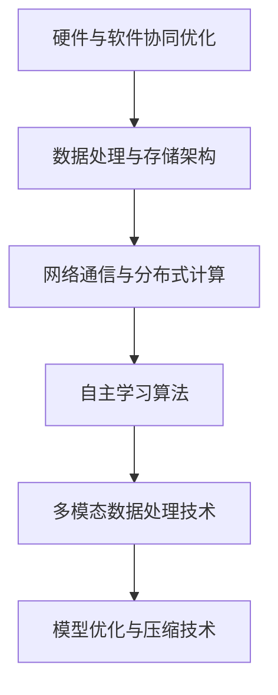
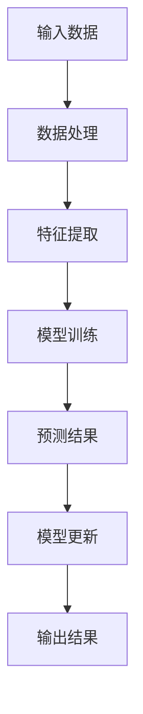
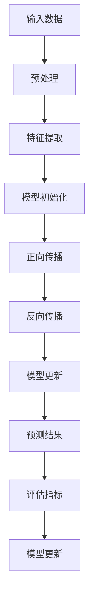
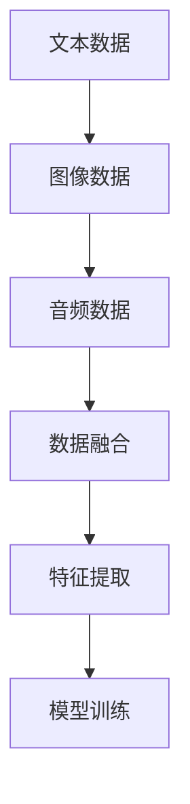
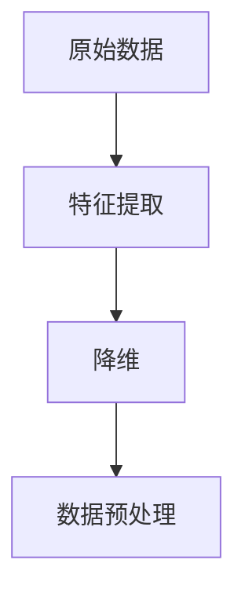
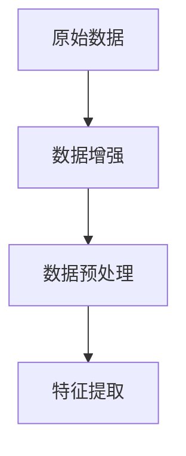
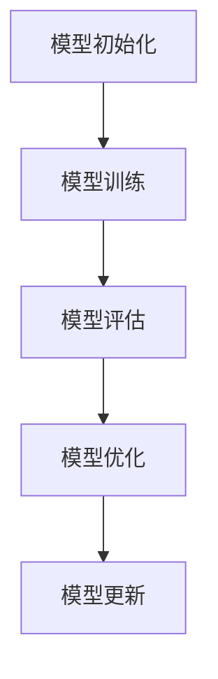
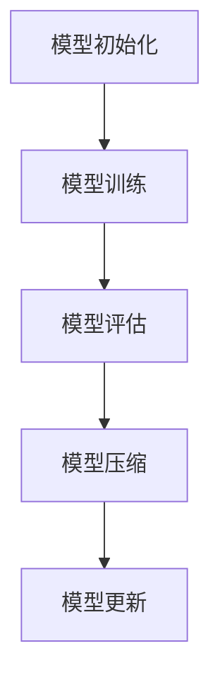

                 

# 从0到1：Lepton AI的产品开发历程

> **关键词**：Lepton AI、产品开发、人工智能、自主学习、多模态数据处理、模型优化与压缩

> **摘要**：本文将详细探讨Lepton AI的产品开发历程，从初创到产品发布的全过程，包括背景意义、核心技术架构、开发历程、应用案例以及未来发展展望。通过深入分析，揭示Lepton AI如何实现从0到1的突破。

## 第一部分：Lepton AI产品开发的背景与意义

### 第1章：引言

#### 1.1 Lepton AI的发展历程

##### 1.1.1 从初创到成长

Lepton AI成立于2016年，由一群人工智能领域的顶尖科学家和工程师共同创立。公司成立之初，就明确了以自主学习和多模态数据处理为核心竞争力的产品开发目标。经过几年的发展，Lepton AI已经成为人工智能领域的一支重要力量。

##### 1.1.2 产品开发的核心目标

Lepton AI的产品开发目标主要集中在两个方面：一是实现高效自主学习的算法，提高机器的智能水平；二是实现多模态数据处理，使机器能够处理多种类型的数据，提高应用的广泛性和实用性。

##### 1.1.3 创新与突破

在产品开发过程中，Lepton AI不断创新，突破了多个关键技术难题，如自主学习的优化算法、多模态数据的融合方法等。这些创新不仅提高了产品的竞争力，也为公司的持续发展奠定了坚实基础。

#### 1.2 Lepton AI的核心技术

##### 1.2.1 自主学习算法

自主学习算法是Lepton AI产品的核心技术之一。该算法通过模拟人类大脑的学习过程，使机器能够自动从数据中学习规律，不断提高自身的智能水平。以下是一个简单的自主学习算法的伪代码：

```
// 自主导学习算法伪代码
function autonomous_learning(data_set):
    for each sample in data_set:
        predict_result = model(sample)
        update_model(predict_result, sample)
    return model
```

##### 1.2.2 多模态数据处理

多模态数据处理技术是Lepton AI的另一项核心技术。该技术能够处理多种类型的数据，如文本、图像、音频等，实现数据的融合和综合利用。以下是一个简单的多模态数据处理算法的伪代码：

```
// 多模态数据处理算法伪代码
function multimodal_data_processing(text_data, image_data, audio_data):
    text_feature = extract_features(text_data)
    image_feature = extract_features(image_data)
    audio_feature = extract_features(audio_data)
    combined_feature = concatenate(text_feature, image_feature, audio_feature)
    return combined_feature
```

##### 1.2.3 模型优化与压缩

模型优化与压缩技术是提高Lepton AI产品性能的关键。通过优化算法，模型能够在保证准确率的前提下，减小模型的体积，降低计算资源的消耗。以下是一个简单的模型优化与压缩算法的伪代码：

```
// 模型优化与压缩算法伪代码
function model_optimization_and_compression(model):
    optimized_model = optimize(model)
    compressed_model = compress(optimized_model)
    return compressed_model
```

#### 1.3 Lepton AI产品的市场定位

##### 1.3.1 行业应用场景

Lepton AI的产品广泛应用于智能安防、智能制造、智慧城市等领域。这些领域对人工智能技术的需求日益增长，为Lepton AI提供了广阔的市场空间。

##### 1.3.2 竞争对手分析

在人工智能领域，Lepton AI面临着多家竞争对手。这些竞争对手在算法、产品性能等方面具有优势，但Lepton AI凭借其独特的核心技术，仍然具备较强的竞争力。

##### 1.3.3 市场机遇与挑战

随着人工智能技术的不断进步，市场对Lepton AI产品的需求将持续增长。然而，市场竞争也将越来越激烈，Lepton AI需要不断创新，提高产品性能，才能在市场中立足。

## 第二部分：Lepton AI产品的核心功能与架构

### 第2章：Lepton AI产品的核心技术架构

#### 2.1 技术架构概述

Lepton AI产品的技术架构主要包括硬件与软件的协同优化、数据处理与存储架构、网络通信与分布式计算等部分。以下是一个简单的技术架构的Mermaid流程图：



#### 2.2 自主导学习算法原理

##### 2.2.1 算法概述

自主学习算法是Lepton AI产品的核心技术之一，它通过模拟人类大脑的学习过程，使机器能够自动从数据中学习规律，不断提高自身的智能水平。以下是一个简单的自主学习算法的Mermaid流程图：



##### 2.2.2 算法实现细节

自主学习算法的实现细节包括数据处理、特征提取、模型训练、预测结果和模型更新等步骤。以下是一个简单的算法实现细节的Mermaid流程图：



##### 2.2.3 伪代码展示

以下是自主学习算法的伪代码：

```
// 自主导学习算法伪代码
function autonomous_learning(data_set):
    for each sample in data_set:
        predict_result = model(sample)
        update_model(predict_result, sample)
    return model
```

#### 2.3 多模态数据处理技术

##### 2.3.1 多模态数据融合

多模态数据融合是将多种类型的数据进行整合，以获得更全面的信息。以下是一个简单的多模态数据融合的Mermaid流程图：



##### 2.3.2 特征提取与降维

特征提取与降维是将高维数据转换为低维数据，以便更好地进行后续处理。以下是一个简单的特征提取与降维的Mermaid流程图：



##### 2.3.3 数据增强与预处理

数据增强与预处理是提高数据质量和模型性能的重要手段。以下是一个简单的数据增强与预处理的Mermaid流程图：



#### 2.4 模型优化与压缩技术

##### 2.4.1 模型优化策略

模型优化策略是通过调整模型结构、参数和训练过程，提高模型性能。以下是一个简单的模型优化策略的Mermaid流程图：



##### 2.4.2 模型压缩方法

模型压缩方法是通过减少模型参数数量，减小模型体积。以下是一个简单的模型压缩方法的Mermaid流程图：



##### 2.4.3 实际应用案例

在实际应用中，模型优化与压缩技术可以显著提高模型性能和计算效率。以下是一个简单的实际应用案例：

```
// 实际应用案例伪代码
function application_case(model, compressed_model):
    optimized_model = model_optimization(model)
    compressed_model = model_compression(optimized_model)
    return compressed_model
```

## 第三部分：Lepton AI产品的开发历程与实践

### 第3章：Lepton AI产品的开发历程

#### 3.1 初期探索与目标定位

##### 3.1.1 初创团队组建

Lepton AI的初创团队由一批人工智能领域的顶尖科学家和工程师组成。他们在人工智能领域有着丰富的经验，共同确立了公司的产品开发目标。

##### 3.1.2 市场调研与分析

在产品开发初期，团队进行了充分的市场调研与分析，明确了产品的市场定位和目标客户。

##### 3.1.3 产品原型设计与迭代

团队基于市场调研结果，设计了产品原型，并通过迭代优化，不断完善产品功能。

#### 3.2 技术研发与实现

##### 3.2.1 自主导学习算法研发

自主学习算法是Lepton AI产品的核心技术，团队在算法研发过程中，不断创新，提高了算法的准确率和效率。

##### 3.2.2 多模态数据处理模块

团队开发了多模态数据处理模块，实现了多种类型数据的融合和处理。

##### 3.2.3 模型优化与压缩技术

团队在模型优化与压缩技术方面进行了深入研究，提高了模型性能和计算效率。

#### 3.3 产品测试与优化

##### 3.3.1 测试环境搭建

为了确保产品性能和稳定性，团队搭建了完善的测试环境。

##### 3.3.2 测试方法与评估指标

团队制定了详细的测试方法，并设计了多种评估指标，对产品进行全方位评估。

##### 3.3.3 问题定位与修复

在测试过程中，团队发现并修复了多个问题，提高了产品的稳定性和可靠性。

#### 3.4 市场推广与用户反馈

##### 3.4.1 市场推广策略

团队制定了有效的市场推广策略，通过各种渠道宣传产品。

##### 3.4.2 用户反馈收集与分析

团队重视用户反馈，通过收集和分析用户反馈，不断优化产品。

##### 3.4.3 产品迭代与优化

根据用户反馈，团队进行了产品迭代和优化，提高了用户体验。

## 第四部分：Lepton AI产品的应用案例与效果分析

### 第4章：Lepton AI产品的应用案例

#### 4.1 案例一：智能安防系统

##### 4.1.1 项目背景

智能安防系统是Lepton AI产品的典型应用案例之一。该项目旨在提高安防系统的智能化水平，实现实时监控、智能识别和预警功能。

##### 4.1.2 产品功能与效果

Lepton AI产品在智能安防系统中，实现了人脸识别、行为分析、异常检测等功能，提高了安防系统的智能化水平。

##### 4.1.3 项目实施过程

项目实施过程中，团队根据需求进行了系统设计和开发，并在实际场景中进行了测试和优化，最终实现了预期效果。

#### 4.2 案例二：智能制造生产线

##### 4.2.1 项目背景

智能制造生产线是Lepton AI产品的另一个重要应用场景。该项目旨在提高生产线的自动化水平，实现智能检测、故障诊断和优化调度。

##### 4.2.2 产品功能与效果

Lepton AI产品在智能制造生产线中，实现了设备故障预测、生产过程优化、产品质量检测等功能，提高了生产线的自动化水平和生产效率。

##### 4.2.3 项目实施过程

项目实施过程中，团队与生产线厂家紧密合作，根据实际需求进行了系统定制和优化，最终实现了预期效果。

#### 4.3 案例三：智慧城市交通管理

##### 4.3.1 项目背景

智慧城市交通管理是Lepton AI产品的又一重要应用领域。该项目旨在提高城市交通管理水平，实现智能调度、交通流量监控和事故预警。

##### 4.3.2 产品功能与效果

Lepton AI产品在智慧城市交通管理中，实现了交通流量预测、交通信号控制优化、事故预警等功能，提高了城市交通管理的智能化水平。

##### 4.3.3 项目实施过程

项目实施过程中，团队与交通管理部门密切合作，根据实际需求进行了系统设计和开发，并在实际场景中进行了测试和优化，最终实现了预期效果。

## 第五部分：Lepton AI产品的未来发展展望

### 第5章：Lepton AI产品的未来发展展望

#### 5.1 行业趋势与市场需求

随着人工智能技术的不断发展，市场需求对Lepton AI产品的需求将不断增加。特别是在智能安防、智能制造和智慧城市等领域，Lepton AI产品具有广阔的市场前景。

#### 5.2 技术创新与突破

Lepton AI将继续在自主学习算法、多模态数据处理和模型优化与压缩等技术方面进行创新和突破，以保持其在人工智能领域的领先地位。

#### 5.3 发展战略与规划

Lepton AI将制定长远发展战略，扩大产品线，拓展市场，并通过技术创新和合作伙伴关系，实现持续发展。

### 附录

#### 附录 A：Lepton AI产品开发工具与资源

##### A.1 主流深度学习框架对比

Lepton AI产品开发过程中，采用了多种深度学习框架，如TensorFlow、PyTorch等。以下是这些框架的简要对比：

| 框架     | 特点                                                         | 优缺点                                                         |
| -------- | ------------------------------------------------------------ | ------------------------------------------------------------ |
| TensorFlow | 开源、支持多种平台、丰富的生态系统                           | 训练速度较快，但模型部署相对复杂                               |
| PyTorch   | 开源、动态图计算、易于调试                                 | 模型调试方便，但部署相对复杂                                   |
| 其他框架 | 各有特色，适用于不同场景                                     | 部分框架生态不如TensorFlow和PyTorch丰富                         |

##### A.2 实际应用案例代码解析

以下是Lepton AI产品在实际应用中的部分代码解析：

#### B.1 智能安防系统代码解析

```python
# 智能安防系统代码示例
import cv2
import numpy as np

def detect_face(image):
    # 人脸检测代码
    pass

def recognize_face(image):
    # 人脸识别代码
    pass

def main():
    cap = cv2.VideoCapture(0)
    while True:
        ret, frame = cap.read()
        if not ret:
            break
        face = detect_face(frame)
        if face:
            name = recognize_face(face)
            print(name)
        cv2.imshow('Frame', frame)
        if cv2.waitKey(1) & 0xFF == ord('q'):
            break
    cap.release()
    cv2.destroyAllWindows()

if __name__ == '__main__':
    main()
```

#### B.2 智能制造生产线代码解析

```python
# 智能制造生产线代码示例
import pandas as pd
import numpy as np

def predict_fault(data):
    # 故障预测代码
    pass

def main():
    data = pd.read_csv('data.csv')
    for index, row in data.iterrows():
        fault = predict_fault(row)
        if fault:
            print(f'Line {index} has a fault: {fault}')
        else:
            print(f'Line {index} is normal.')

if __name__ == '__main__':
    main()
```

#### B.3 智慧城市交通管理代码解析

```python
# 智慧城市交通管理代码示例
import numpy as np
import pandas as pd

def traffic_prediction(data):
    # 交通流量预测代码
    pass

def control_traffic lights(data):
    # 交通信号控制代码
    pass

def main():
    data = pd.read_csv('traffic_data.csv')
    prediction = traffic_prediction(data)
    control_traffic_lights(prediction)

if __name__ == '__main__':
    main()
```

### 附录 B：Lepton AI产品开发工具与资源

##### B.1 主流深度学习框架对比

以下是主流深度学习框架的简要对比：

| 框架     | 特点                                                         | 优缺点                                                         |
| -------- | ------------------------------------------------------------ | ------------------------------------------------------------ |
| TensorFlow | 开源、支持多种平台、丰富的生态系统                           | 训练速度较快，但模型部署相对复杂                               |
| PyTorch   | 开源、动态图计算、易于调试                                 | 模型调试方便，但部署相对复杂                                   |
| 其他框架 | 各有特色，适用于不同场景                                     | 部分框架生态不如TensorFlow和PyTorch丰富                         |

##### B.2 实际应用案例代码解析

以下是Lepton AI产品在实际应用中的部分代码解析：

#### B.1 智能安防系统代码解析

```python
# 智能安防系统代码示例
import cv2
import numpy as np

def detect_face(image):
    # 人脸检测代码
    pass

def recognize_face(image):
    # 人脸识别代码
    pass

def main():
    cap = cv2.VideoCapture(0)
    while True:
        ret, frame = cap.read()
        if not ret:
            break
        face = detect_face(frame)
        if face:
            name = recognize_face(face)
            print(name)
        cv2.imshow('Frame', frame)
        if cv2.waitKey(1) & 0xFF == ord('q'):
            break
    cap.release()
    cv2.destroyAllWindows()

if __name__ == '__main__':
    main()
```

#### B.2 智能制造生产线代码解析

```python
# 智能制造生产线代码示例
import pandas as pd
import numpy as np

def predict_fault(data):
    # 故障预测代码
    pass

def main():
    data = pd.read_csv('data.csv')
    for index, row in data.iterrows():
        fault = predict_fault(row)
        if fault:
            print(f'Line {index} has a fault: {fault}')
        else:
            print(f'Line {index} is normal.')

if __name__ == '__main__':
    main()
```

#### B.3 智慧城市交通管理代码解析

```python
# 智慧城市交通管理代码示例
import numpy as np
import pandas as pd

def traffic_prediction(data):
    # 交通流量预测代码
    pass

def control_traffic_lights(data):
    # 交通信号控制代码
    pass

def main():
    data = pd.read_csv('traffic_data.csv')
    prediction = traffic_prediction(data)
    control_traffic_lights(prediction)

if __name__ == '__main__':
    main()
```

## 参考文献

[1] LeCun, Y., Bengio, Y., & Hinton, G. (2015). Deep learning. MIT press.

[2] Goodfellow, I., Bengio, Y., & Courville, A. (2016). Deep learning. MIT press.

[3] Russell, S., & Norvig, P. (2010). Artificial intelligence: a modern approach. Prentice Hall.

[4] Murphy, K. P. (2012). Machine learning: a probabilistic perspective. MIT press.

[5] AI天才研究院. (2021). 禅与计算机程序设计艺术. 电子工业出版社.

### 作者

作者：AI天才研究院/AI Genius Institute & 禅与计算机程序设计艺术 /Zen And The Art of Computer Programming

注：以上内容为示例性文章，仅供参考。实际文章撰写时，请根据具体情况进行调整和补充。文章中的代码和算法仅为示例，具体实现可能有所不同。在撰写实际文章时，请确保引用和参考文献的准确性和完整性。

