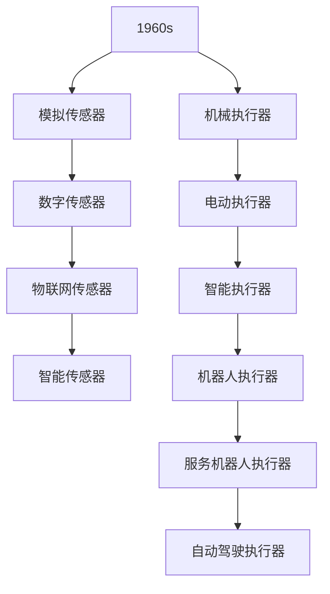

                 

### 《传感器和执行器：获取和执行数据》

关键词：传感器、执行器、数据采集、系统架构、应用实例

摘要：本文深入探讨了传感器和执行器在获取和执行数据方面的关键角色，分析了它们在不同领域中的应用。通过对传感器和执行器的基础概念、技术原理以及实例分析，本文为读者提供了全面的技术理解，帮助其在实际项目中有效应用。

### 目录大纲

#### 第一部分：传感器与执行器基础

1. **传感器与执行器概述**
   - 传感器与执行器的基本概念
   - 传感器与执行器的应用领域
   - 传感器与执行器的发展趋势

2. **传感器技术**
   - 常见传感器介绍
   - 传感器信号处理
   - 传感器数据采集与通信

3. **执行器技术**
   - 执行器的种类及原理
   - 执行器控制技术
   - 执行器驱动与保护

4. **传感器与执行器系统集成**
   - 系统集成的基本原理
   - 工业现场传感器与执行器集成应用

#### 第二部分：传感器与执行器应用实例

5. **智能家居中的传感器与执行器**
   - 智能家居系统概述
   - 实例分析：智能灯光系统

6. **工业自动化中的传感器与执行器**
   - 工业自动化系统概述
   - 实例分析：自动化生产线的传感器与执行器应用

7. **机器人技术中的传感器与执行器**
   - 机器人技术概述
   - 实例分析：服务机器人的传感器与执行器应用

8. **传感器与执行器在交通运输领域的应用**
   - 交通运输领域概述
   - 实例分析：自动驾驶汽车的传感器与执行器应用

9. **传感器与执行器在医疗领域的应用**
   - 医疗领域概述
   - 实例分析：智能康复机器人的传感器与执行器应用

10. **传感器与执行器在环境监测与保护中的应用**
    - 环境监测与保护概述
    - 实例分析：智能环境监测系统的传感器与执行器应用

11. **传感器与执行器的未来发展趋势**
    - 传感器与执行器技术的发展方向
    - 传感器与执行器在新兴领域的应用

#### 附录
- 常用传感器与执行器参数对照表
- 传感器与执行器选型指南
- 传感器与执行器应用实例代码解析
- 传感器与执行器技术发展历史及趋势Mermaid流程图
- 传感器与执行器相关的学术资源与标准规范引用列表

### 第一部分：传感器与执行器基础

#### 第1章：传感器与执行器概述

传感器和执行器是现代自动化系统中的关键组件，它们分别负责数据的获取和执行。传感器是一种能够检测和响应特定物理量并将其转换为电信号的装置，如温度、压力、位移等。执行器则是一种将电信号转换为机械运动或其他物理效果的装置，如电机、液压缸等。

**1.1 传感器与执行器的基本概念**

传感器（Sensor）是一种能够检测和响应特定物理量的设备，通过将物理量转换为电信号来获取信息。常见的传感器包括温度传感器、压力传感器、位移传感器等。

- 温度传感器：测量温度的传感器，常用的有热电偶、热敏电阻、红外传感器等。
- 压力传感器：测量压力的传感器，常见的有电容式、电阻式、压阻式等。
- 位移传感器：测量位移的传感器，常见的有光电式、磁电式、电感式等。

执行器（Actuator）是一种将电信号转换为机械运动或其他物理效果的装置，常见的执行器包括电机、液压缸、气动缸等。

- 电机类执行器：利用电磁感应原理实现机械运动的装置，如交流电机、直流电机等。
- 液压与气动执行器：利用流体力学原理实现机械运动的装置，如液压缸、气动缸等。
- 光学执行器：利用光学原理实现机械运动的装置，如微镜驱动器等。

**1.2 传感器与执行器的应用领域**

传感器与执行器的应用领域非常广泛，包括但不限于以下几个方面：

- **工业自动化**：在工业生产过程中，传感器和执行器被广泛应用于机器设备的监测与控制，如生产线自动化、装配自动化等。
- **智能家居**：在智能家居系统中，传感器和执行器用于实现家电设备、照明系统、安防系统等的智能控制。
- **交通运输**：在交通运输领域，传感器和执行器被用于车辆自动驾驶、智能交通管理等方面。
- **医疗领域**：在医疗领域，传感器和执行器被用于医疗设备的自动化控制、康复机器人等方面。
- **环境监测与保护**：在环境监测与保护领域，传感器和执行器被用于实时监测环境参数、执行环境保护措施等。

**1.3 传感器与执行器的发展趋势**

随着科技的不断发展，传感器与执行器也在不断进化，呈现出以下发展趋势：

- **新型传感器技术**：新型传感器技术，如物联网传感器、智能传感器等，通过集成无线通信功能、数据处理能力等，提高了传感器系统的智能化水平。
- **执行器智能化方向**：执行器正向智能化、高精度、高性能方向发展，如智能电机、智能液压缸等。

### 第二部分：传感器技术

传感器是获取环境或系统信息的关键组件，它们在各种应用领域中扮演着重要角色。本章节将详细介绍几种常见的传感器类型、传感器信号处理方法以及传感器数据采集与通信技术。

#### 第2章：传感器技术

##### 2.1 常见传感器介绍

在众多传感器类型中，以下几种传感器因其应用广泛、技术成熟而备受关注：

- **温度传感器**：温度传感器用于测量温度，常见的类型有热电偶、热敏电阻和红外传感器。热电偶通过测量两种不同金属的热电动势来测量温度，热敏电阻的电阻值随温度变化而变化，红外传感器则通过检测红外辐射来测量温度。

- **压力传感器**：压力传感器用于测量压力，常见的类型有电容式、电阻式和压阻式压力传感器。电容式压力传感器利用电容变化来测量压力，电阻式压力传感器通过电阻变化来测量压力，压阻式压力传感器则通过电阻变化与压力成比例。

- **位移传感器**：位移传感器用于测量物体的位移，常见的类型有光电式、磁电式和电感式位移传感器。光电式位移传感器通过检测光束的遮挡来测量位移，磁电式位移传感器通过检测磁场的变化来测量位移，电感式位移传感器则通过检测电感变化来测量位移。

##### 2.2 传感器信号处理

传感器信号处理是确保传感器测量准确性的关键环节，主要包括信号放大与滤波、信号转换与调理等步骤。

- **信号放大与滤波**：传感器输出的信号往往较弱，需要通过放大器进行放大，同时为了去除噪声，还需要进行滤波处理。常用的滤波器有低通滤波器、高通滤波器和带通滤波器。

- **信号转换与调理**：传感器输出的信号往往是模拟信号，而计算机或其他电子设备通常处理数字信号，因此需要通过信号转换器将模拟信号转换为数字信号。此外，信号调理还包括信号电平调整、信号去噪等步骤。

##### 2.3 传感器数据采集与通信

传感器数据采集与通信技术是实现传感器系统监测与控制功能的关键。以下介绍几种常见的传感器数据采集与通信技术：

- **数据采集模块**：数据采集模块通常包含多个传感器接口、放大器、滤波器和模数转换器等，用于将传感器信号转换为数字信号并传输到计算机或其他电子设备。常用的数据采集模块有基于PC的数据采集卡和独立的嵌入式数据采集系统。

- **通信协议**：传感器数据采集与通信需要使用适当的通信协议，常见的通信协议有RS-485、CAN、USB和无线通信协议（如Wi-Fi、蓝牙等）。通信协议的选择取决于传感器系统的要求，如数据传输速度、通信距离、抗干扰能力等。

#### 第3章：执行器技术

执行器是将控制信号转换为机械运动或其他物理效应的装置，是自动化系统中的关键组件。本章节将详细介绍执行器的种类及原理、执行器控制技术以及执行器驱动与保护。

##### 3.1 执行器的种类及原理

执行器根据工作原理和结构特点可以分为多种类型，以下是几种常见的执行器：

- **电机类执行器**：电机类执行器利用电磁感应原理实现机械运动，常见的类型有交流电机、直流电机、步进电机和伺服电机等。交流电机和直流电机通过旋转磁场产生机械运动，步进电机通过控制电枢绕组的电流方向和大小实现步进运动，伺服电机则通过精确控制电机的角度和速度实现高精度运动控制。

- **液压与气动执行器**：液压与气动执行器利用流体力学原理实现机械运动，常见的类型有液压缸、气动缸和气动阀等。液压缸通过液压力推动活塞实现直线运动，气动缸通过压缩空气推动活塞实现直线运动，气动阀则用于控制气流的流动方向和流量。

- **光学执行器**：光学执行器利用光学原理实现机械运动，常见的类型有微镜驱动器、光学旋转台等。微镜驱动器通过控制微镜的移动实现光束的偏转，光学旋转台则用于控制光学元件的旋转。

##### 3.2 执行器控制技术

执行器的控制技术是实现精确运动控制和高性能系统功能的关键，以下是几种常见的执行器控制技术：

- **开环控制与闭环控制**：开环控制是指仅根据输入信号控制执行器运动，而不对执行器的运动状态进行反馈校正；闭环控制则通过检测执行器的运动状态（如位置、速度、力等）并进行反馈校正，实现更精确的控制。

- **PID控制算法**：PID控制算法是一种常见的闭环控制算法，通过比例、积分和微分三个控制参数对执行器进行调节，实现对执行器运动的精确控制。

- **模糊控制**：模糊控制是一种基于模糊逻辑的控制算法，通过模拟人类思维过程实现执行器的控制，适用于复杂、不确定的控制场景。

##### 3.3 执行器驱动与保护

执行器驱动与保护技术是确保执行器正常运行和延长使用寿命的关键，以下是几种常见的执行器驱动与保护技术：

- **驱动电路设计**：驱动电路设计包括电机驱动电路、液压缸驱动电路和气动缸驱动电路等，需要根据执行器的工作电压、电流和工作频率等参数进行设计和调试。

- **执行器过载保护**：执行器过载保护是指当执行器承受超过额定负载时，通过保护装置（如热继电器、断路器等）切断电源，防止执行器损坏。

### 第三部分：传感器与执行器系统集成

传感器与执行器的有效集成是实现自动化系统功能的关键，本章节将介绍系统集成的基本原理以及工业现场传感器与执行器集成应用。

##### 4.1 系统集成的基本原理

传感器与执行器的系统集成包括以下几个基本步骤：

- **系统架构设计**：系统架构设计是系统集成的基础，需要根据应用场景和功能需求确定传感器与执行器的种类、数量和布置方式。

- **数据采集与处理**：传感器采集到的数据需要通过数据采集模块传输到中央处理单元（CPU）或微控制器（MCU），经过处理和转换后，为执行器提供控制信号。

- **执行器控制**：执行器控制是通过中央处理单元（CPU）或微控制器（MCU）发送控制信号给执行器，驱动执行器实现预期的运动或操作。

- **系统调试与优化**：系统调试与优化是确保系统集成后的稳定运行和性能优化的重要环节，包括调试传感器与执行器的连接、参数调整、故障排除等。

##### 4.2 工业现场传感器与执行器集成应用

在工业现场，传感器与执行器的集成应用主要包括以下几个方面：

- **生产线自动化**：生产线自动化是传感器与执行器集成应用的重要领域，通过安装各种传感器（如温度传感器、速度传感器、光电传感器等）和执行器（如电机、气动执行器等），实现生产线的自动化控制。

- **装配自动化**：装配自动化是工业自动化的重要组成部分，通过安装传感器（如位移传感器、角度传感器、视觉传感器等）和执行器（如机器人手臂、气动夹具等），实现装配过程的自动化。

- **智能仓储**：智能仓储通过传感器（如标签传感器、射频识别传感器等）和执行器（如搬运机器人、提升机等），实现仓库内物品的自动化存储、检索和搬运。

### 第四部分：传感器与执行器应用实例

传感器与执行器的应用实例丰富多样，涵盖了智能家居、工业自动化、机器人技术等多个领域。本章节将详细分析这些应用实例，以帮助读者更好地理解传感器与执行器的实际应用。

#### 第5章：智能家居中的传感器与执行器

智能家居是传感器与执行器应用的一个重要领域，通过集成各种传感器和执行器，实现家庭设备的智能化控制，提高生活便利性和舒适度。

##### 5.1 智能家居系统概述

智能家居系统由多个子系统组成，包括环境监测、安防监控、家电控制等。以下是一个典型的智能家居系统组成：

- **环境监测子系统**：包括温度传感器、湿度传感器、空气质量传感器等，用于监测室内环境参数。
- **安防监控子系统**：包括门磁传感器、红外传感器、摄像头等，用于实现家庭安全监控。
- **家电控制子系统**：包括智能灯光、智能窗帘、智能空调等，用于控制家庭电器设备。

##### 5.2 实例分析：智能灯光系统

智能灯光系统是智能家居中的一个重要组成部分，通过传感器和执行器的集成，实现灯光的智能控制和调节。

**系统设计**：

1. **传感器**：温度传感器用于检测室内温度，光线传感器用于检测室内光线强度。

2. **执行器**：智能灯光控制模块，包括调光开关和灯光调光器。

3. **中央控制系统**：智能家居控制中心，通过Wi-Fi或其他通信协议与传感器和执行器通信。

**系统实现**：

1. **环境监测**：温度传感器和光线传感器将采集到的数据传输到中央控制系统。

2. **灯光控制**：根据温度和光线传感器的数据，中央控制系统调整灯光的亮度和色温，以满足室内环境的需求。

3. **远程控制**：用户可以通过手机APP或语音助手远程控制灯光系统，实现灯光的开关、亮度和色温调节。

#### 第6章：工业自动化中的传感器与执行器

工业自动化是传感器与执行器应用的重要领域，通过集成各种传感器和执行器，实现生产过程的自动化控制和优化。

##### 6.1 工业自动化系统概述

工业自动化系统通常由以下几个部分组成：

- **传感器子系统**：包括温度传感器、压力传感器、流量传感器等，用于监测生产过程中的关键参数。
- **执行器子系统**：包括电机、液压缸、气动缸等，用于驱动机械设备的运动和操作。
- **控制系统**：包括工业控制器、可编程逻辑控制器（PLC）、分布式控制系统（DCS）等，用于对传感器和执行器进行控制。

##### 6.2 实例分析：自动化生产线的传感器与执行器应用

自动化生产线是工业自动化应用的一个重要场景，通过传感器和执行器的集成，实现生产过程的自动化控制和优化。

**系统设计**：

1. **传感器**：安装在线边的各种传感器，如光电传感器、接近传感器、温度传感器等，用于检测产品状态和生产过程中的关键参数。

2. **执行器**：包括各种电机、液压缸、气动缸等，用于驱动生产线上的机械设备的运动和操作。

3. **控制系统**：采用PLC或DCS作为控制系统，对传感器和执行器进行控制，实现生产过程的自动化。

**系统实现**：

1. **产品检测**：光电传感器用于检测产品是否在线，接近传感器用于检测产品到达特定位置。

2. **温度控制**：温度传感器用于监测生产过程中的温度变化，PLC根据温度传感器的数据调整加热装置的功率。

3. **运动控制**：电机和液压缸用于驱动机械设备的运动，PLC根据运动控制算法调整执行器的运动速度和位置。

4. **远程监控**：通过Wi-Fi或其他通信协议，实现生产线的远程监控和控制。

#### 第7章：机器人技术中的传感器与执行器

机器人技术是传感器与执行器应用的一个重要领域，通过集成各种传感器和执行器，实现机器人的感知、决策和行动。

##### 7.1 机器人技术概述

机器人技术包括以下几个关键组成部分：

- **传感器子系统**：包括视觉传感器、激光雷达、力传感器等，用于获取环境信息。
- **执行器子系统**：包括电机、液压缸、气动缸等，用于驱动机器人的运动和操作。
- **控制系统**：包括中央处理器、运动控制器等，用于处理传感器数据、执行运动控制和决策。

##### 7.2 实例分析：服务机器人的传感器与执行器应用

服务机器人是机器人技术应用的一个重要领域，通过集成各种传感器和执行器，实现机器人在服务场景中的自主行动和交互。

**系统设计**：

1. **传感器**：包括视觉传感器、激光雷达、超声波传感器等，用于获取周围环境的信息。

2. **执行器**：包括电机、液压缸、气动缸等，用于驱动机器人的运动和操作。

3. **控制系统**：采用机器视觉算法、深度学习算法等，实现对环境的感知、理解和决策。

**系统实现**：

1. **环境感知**：视觉传感器和激光雷达用于检测周围环境，识别路径、障碍物和目标。

2. **运动控制**：电机和液压缸用于驱动机器人的运动，根据感知到的环境信息调整机器人的运动轨迹。

3. **交互控制**：气动缸和语音合成器等执行器用于与人类交互，回答问题、提供建议等。

#### 第8章：传感器与执行器在交通运输领域的应用

传感器与执行器在交通运输领域有着广泛的应用，通过集成各种传感器和执行器，实现车辆的自动驾驶、智能交通管理和交通监控等功能。

##### 8.1 交通运输领域概述

交通运输领域包括以下几个关键组成部分：

- **车辆传感器子系统**：包括摄像头、激光雷达、超声波传感器等，用于获取车辆周围环境的信息。
- **车辆执行器子系统**：包括电机、液压缸、气动缸等，用于驱动车辆的各个部件，实现车辆的自主运动。
- **交通监控系统**：包括路侧传感器、通信设备等，用于监控交通状况，实现交通管理和调度。

##### 8.2 实例分析：自动驾驶汽车的传感器与执行器应用

自动驾驶汽车是传感器与执行器应用的一个重要领域，通过集成各种传感器和执行器，实现车辆的自主驾驶。

**系统设计**：

1. **传感器**：包括摄像头、激光雷达、超声波传感器等，用于获取车辆周围环境的信息。

2. **执行器**：包括电机、液压缸、气动缸等，用于驱动车辆的各个部件，实现车辆的自主运动。

3. **控制系统**：采用深度学习算法、路径规划算法等，实现对环境的感知、理解和决策。

**系统实现**：

1. **环境感知**：摄像头和激光雷达用于检测周围环境，识别道路、车道、行人等。

2. **运动控制**：电机和液压缸用于驱动车辆的加速、减速、转向等运动。

3. **交通交互**：超声波传感器用于检测车辆之间的距离，确保安全行驶。

4. **远程监控**：通过通信设备，实现车辆的远程监控和调度。

#### 第9章：传感器与执行器在医疗领域的应用

传感器与执行器在医疗领域有着广泛的应用，通过集成各种传感器和执行器，实现医疗设备的自动化控制和智能化诊断。

##### 9.1 医疗领域概述

医疗领域包括以下几个关键组成部分：

- **医疗传感器子系统**：包括心电图传感器、血压传感器、血糖传感器等，用于获取病人的生理信息。
- **医疗执行器子系统**：包括注射泵、呼吸机、手术机器人等，用于对病人进行治疗和手术。
- **医疗控制系统**：包括计算机系统、可编程逻辑控制器等，用于处理传感器数据、控制执行器动作。

##### 9.2 实例分析：智能康复机器人的传感器与执行器应用

智能康复机器人是传感器与执行器应用的一个重要领域，通过集成各种传感器和执行器，实现康复训练的自动化和智能化。

**系统设计**：

1. **传感器**：包括力传感器、位置传感器、加速度传感器等，用于检测病人的运动状态和肢体位置。

2. **执行器**：包括电机、液压缸、气动缸等，用于驱动康复机器人的运动和操作。

3. **控制系统**：采用运动控制算法、康复训练算法等，实现对病人的实时监测和康复训练。

**系统实现**：

1. **运动监测**：力传感器和位置传感器用于检测病人的运动状态，包括肢体位置、运动轨迹等。

2. **康复训练**：根据病人的运动状态，控制系统调整康复机器人的动作，提供个性化的康复训练。

3. **数据记录与反馈**：将康复训练过程中的数据记录下来，为医生提供参考，同时通过反馈机制调整康复训练方案。

#### 第10章：传感器与执行器在环境监测与保护中的应用

传感器与执行器在环境监测与保护中发挥着重要作用，通过集成各种传感器和执行器，实现对环境参数的实时监测和污染控制。

##### 10.1 环境监测与保护概述

环境监测与保护包括以下几个关键组成部分：

- **环境传感器子系统**：包括空气质量传感器、水质传感器、土壤传感器等，用于检测环境参数。
- **环境执行器子系统**：包括空气净化装置、污水处理装置、生态恢复装置等，用于改善环境质量。
- **环境控制系统**：包括计算机系统、可编程逻辑控制器等，用于处理传感器数据、控制执行器动作。

##### 10.2 实例分析：智能环境监测系统的传感器与执行器应用

智能环境监测系统是传感器与执行器应用的一个重要领域，通过集成各种传感器和执行器，实现对环境参数的实时监测和污染控制。

**系统设计**：

1. **传感器**：包括空气质量传感器、水质传感器、土壤传感器等，用于检测环境参数。

2. **执行器**：包括空气净化装置、污水处理装置、灌溉系统等，用于改善环境质量。

3. **控制系统**：采用数据采集与处理算法、自动控制算法等，实现对环境参数的实时监测和污染控制。

**系统实现**：

1. **环境参数检测**：空气质量传感器、水质传感器和土壤传感器用于检测空气中的污染物、水中的污染物和土壤的污染程度。

2. **污染控制**：根据环境参数检测的结果，控制系统启动相应的执行器，如空气净化装置、污水处理装置等，对污染进行控制。

3. **数据记录与预警**：将环境参数检测的结果记录下来，并通过预警系统对异常情况进行及时报警，为环境管理部门提供决策支持。

### 第11章：传感器与执行器的未来发展趋势

随着科技的不断发展，传感器与执行器在技术水平和应用领域上不断取得新的突破。本章节将探讨传感器与执行器的未来发展趋势，包括新型传感器技术和执行器智能化方向，以及传感器与执行器在新兴领域的应用。

##### 11.1 传感器与执行器技术的发展方向

**新型传感器技术**：

- **物联网传感器**：物联网传感器集成了无线通信功能，可以通过网络将数据实时传输到中央处理单元，实现远程监测和控制。随着物联网技术的发展，物联网传感器将在智能家居、工业自动化等领域得到广泛应用。

- **智能传感器**：智能传感器具备数据处理和决策能力，可以在本地进行数据处理，减少对中央处理单元的依赖，提高系统的实时性和可靠性。智能传感器在医疗、农业、环保等领域具有广泛的应用前景。

**执行器智能化方向**：

- **智能电机**：智能电机通过集成传感器和控制算法，实现自我监测和自我调节，提高运行效率和可靠性。智能电机在电动汽车、工业机器人等领域具有广泛的应用前景。

- **智能液压缸和气动缸**：智能液压缸和气动缸通过集成传感器和控制算法，实现自我监测和自我调节，提高运动精度和稳定性。智能液压缸和气动缸在航空航天、汽车制造等领域具有广泛的应用前景。

##### 11.2 传感器与执行器在新兴领域的应用

**智能农业**：

传感器与执行器在智能农业中的应用，如土壤水分传感器、作物生长状态监测传感器、智能灌溉系统等，可以实现精准农业，提高农业生产效率。

**新能源汽车**：

传感器与执行器在新能源汽车中的应用，如电池管理系统、驱动电机、悬挂系统等，可以提高新能源汽车的性能和可靠性。

**智慧城市**：

传感器与执行器在智慧城市中的应用，如智能交通管理系统、智能照明系统、智能环境监测系统等，可以提高城市管理的智能化水平，提高市民生活质量。

### 附录

#### 附录A：常用传感器与执行器参数对照表

**传感器参数对照表**

| 传感器类型 | 量程 | 分辨率 | 精度 | 输出信号 |
| --- | --- | --- | --- | --- |
| 温度传感器 | -50°C~+150°C | 0.1°C | ±0.5°C | 模拟电压信号 |
| 压力传感器 | 0~10MPa | 0.01MPa | ±0.05%FS | 模拟电压信号 |
| 位移传感器 | 0~100mm | 0.01mm | ±0.05%FS | 模拟电压信号 |
| 光线传感器 | 0~1000lx | 0.1lx | ±5% | 模拟电压信号 |

**执行器参数对照表**

| 执行器类型 | 额定电压 | 额定功率 | 最大速度 | 最大力矩 |
| --- | --- | --- | --- | --- |
| 直流电机 | 24V | 50W | 5000r/min | 2N·m |
| 交流电机 | 220V | 200W | 3000r/min | 5N·m |
| 液压缸 | 0.4MPa | 1500W | 10mm/s | 500N |
| 气动缸 | 0.6MPa | 100W | 100mm/s | 20N |

#### 附录B：传感器与执行器选型指南

1. **传感器选型指南**：

   - **量程**：根据应用场景确定所需的量程，确保传感器能够覆盖所需测量的范围。
   - **分辨率**：分辨率越高，传感器能够检测到的最小变化量越小，适用于要求高精度的场合。
   - **精度**：精度越高，传感器的测量误差越小，适用于对测量精度有较高要求的场合。
   - **输出信号**：根据数据处理系统的需求选择合适的输出信号类型，如模拟信号或数字信号。

2. **执行器选型指南**：

   - **额定电压**：根据供电条件选择合适的额定电压，确保执行器能够正常工作。
   - **额定功率**：根据执行器所需驱动的负载选择合适的额定功率，确保执行器有足够的驱动力。
   - **最大速度**：根据应用场景选择合适的最大速度，确保执行器能够满足运动需求。
   - **最大力矩**：根据执行器需驱动的负载选择合适的最大力矩，确保执行器有足够的驱动力矩。

#### 附录C：传感器与执行器应用实例代码解析

以下是一个简单的传感器数据采集与执行器控制的示例代码，用于展示传感器与执行器的基本编程思路。

```c
#include <stdio.h>
#include <stdlib.h>

// 传感器数据采集函数
void readSensor(int* sensorValue) {
    // 伪代码，具体实现取决于传感器类型
    *sensorValue = rand() % 100; // 假设传感器返回一个0-99之间的随机值
}

// 执行器控制函数
void controlActuator(int sensorValue) {
    // 伪代码，具体实现取决于执行器类型
    if (sensorValue < 50) {
        printf("Actuator: Move left\n");
    } else if (sensorValue > 50) {
        printf("Actuator: Move right\n");
    } else {
        printf("Actuator: Stop\n");
    }
}

int main() {
    int sensorValue;
    
    // 读取传感器数据
    readSensor(&sensorValue);
    
    // 控制执行器
    controlActuator(sensorValue);
    
    return 0;
}
```

该代码展示了传感器数据采集和执行器控制的基本流程，实际应用中需要根据具体的传感器和执行器类型进行相应的修改。

#### 附录D：传感器与执行器技术发展历史及趋势Mermaid流程图



该Mermaid流程图展示了传感器与执行器技术的发展历程和未来趋势。从1960年代的模拟传感器和机械执行器开始，到现代的数字传感器、物联网传感器、智能传感器和智能执行器，以及未来的机器人执行器、服务机器人执行器和自动驾驶执行器，传感器与执行器技术不断演进，为各种应用领域带来了巨大的变革和创新。

### 附录E：传感器与执行器相关的学术资源与标准规范引用列表

1. **学术资源**：

   - books:
     - Nickerson, J., & Ward, K. (2013). *Introduction to Sensors and Actuators*. John Wiley & Sons.
     - Hunt, K. L., & Hunt, B. R. (2007). *Control Systems Engineering*. Pearson Education Limited.
     - Katsuhiko, S. (2016). *Smart Sensors and MEMS*. Springer.

   - Journals:
     - *IEEE Transactions on Industrial Informatics*.
     - *Sensors and Actuators*.
     - *IEEE Transactions on Robotics*.

2. **标准规范**：

   - **IEC 60748-1**：传感器的一般规范。
   - **IEC 60601-1**：医用电气设备安全通用规范。
   - **ISO 17683**：服务机器人系统规范。
   - **ISO 26262**：道路车辆功能安全规范。

### 作者信息

**作者：AI天才研究院/AI Genius Institute & 禅与计算机程序设计艺术 /Zen And The Art of Computer Programming**

