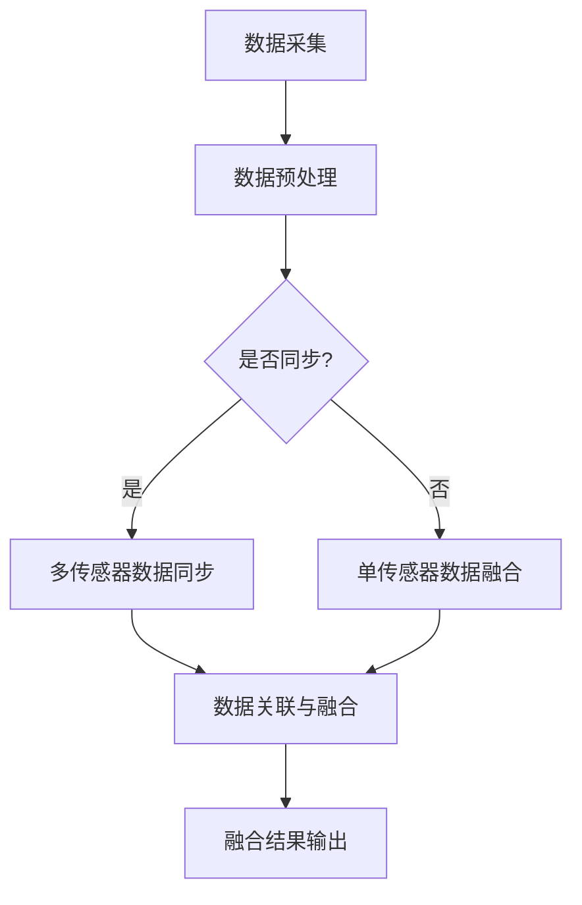

                 

# 《传感器融合算法：获取准确的环境数据》

## 摘要

传感器融合算法是一种通过整合多个传感器的数据来提高环境数据准确性和可靠性的技术。本文从传感器的基本原理出发，详细介绍了传感器融合算法的发展历程、核心概念、基本算法和实际应用。文章通过一系列具体的案例，深入分析了传感器融合算法在不同领域的应用效果，并展示了如何在实际项目中实施传感器融合算法。本文旨在为读者提供一个全面、系统的传感器融合算法学习和实践指南。

## 引言与概述

### 传感器融合算法的重要性

传感器融合算法在现代科技领域中扮演着至关重要的角色。随着人工智能、物联网和自动化技术的快速发展，对环境数据准确性和可靠性的要求越来越高。单个传感器往往存在误差和局限性，而传感器融合算法可以通过集成多个传感器的数据，消除这些误差和局限性，从而提供更准确和可靠的环境数据。

传感器融合算法的重要性体现在以下几个方面：

1. **提高数据准确性**：通过融合多个传感器的数据，可以消除单个传感器的误差，提高数据的准确性。
2. **增强系统稳定性**：传感器融合算法可以降低传感器失效的风险，提高系统的稳定性。
3. **扩展系统功能**：传感器融合算法可以扩展系统的功能，使其能够处理更复杂的环境数据。
4. **降低成本**：通过减少传感器的数量和种类，可以降低系统的成本。

### 传感器融合算法的发展历程

传感器融合算法的发展可以追溯到20世纪50年代，当时的科学家们开始探索如何利用多个传感器来提高系统的性能。最初的研究主要集中在雷达和声纳领域，目的是通过融合多个传感器的数据来提高目标检测和跟踪的准确性。

随着计算机技术和算法理论的不断发展，传感器融合算法逐渐从理论走向实际应用。20世纪80年代，卡尔曼滤波算法成为传感器融合算法的主流，广泛应用于航空、航天和自动驾驶等领域。

进入21世纪，随着人工智能和机器学习技术的崛起，传感器融合算法得到了进一步的发展。基于深度学习的传感器融合算法在图像识别、语音识别和智能交通等领域取得了显著的成果。

### 传感器融合算法的主要类型

传感器融合算法可以分为线性传感器融合算法和非线性传感器融合算法两类。

1. **线性传感器融合算法**：
   - **卡尔曼滤波算法**：卡尔曼滤波是一种线性最优估计算法，广泛应用于目标跟踪、机器人导航和信号处理等领域。
   - **无迹卡尔曼滤波**：无迹卡尔曼滤波是一种扩展卡尔曼滤波的改进算法，适用于非线性系统的状态估计。
   - **状态估计方法**：状态估计方法是一类基于贝叶斯估计的线性传感器融合算法，可以用于多传感器数据融合。

2. **非线性传感器融合算法**：
   - **扩展卡尔曼滤波**：扩展卡尔曼滤波是一种线性化处理方法，适用于非线性系统的状态估计。
   - **无迹扩展卡尔曼滤波**：无迹扩展卡尔曼滤波是一种改进的扩展卡尔曼滤波算法，适用于高维非线性系统的状态估计。
   - **信息滤波**：信息滤波是一种基于贝叶斯估计的非线性传感器融合算法，可以用于复杂非线性系统的状态估计。

### 总结

传感器融合算法是一种重要的技术，可以显著提高环境数据的准确性和可靠性。本文介绍了传感器融合算法的重要性、发展历程和主要类型，为读者提供了一个全面的了解。接下来，我们将深入探讨传感器融合算法的基本原理和核心算法。

## 传感器基本原理

传感器是获取环境数据的重要设备，它们能够将物理量（如温度、湿度、压力、速度等）转换为电信号，供计算机或其他电子设备进行处理。传感器的工作原理可以分为以下几个方面：

### 传感器的工作原理

传感器的工作原理通常基于以下几种基本效应：

1. **光电效应**：光电效应是指当光照射到金属表面时，金属会释放出电子。光电效应广泛应用于光电传感器，如光电二极管和光电晶体管。
2. **热电效应**：热电效应是指当两种不同材料的接触界面受到温度变化时，会产生电动势。热电效应广泛应用于热敏传感器，如热电偶和热敏电阻。
3. **压电效应**：压电效应是指当物体受到机械应力时，会产生电荷。压电效应广泛应用于压电传感器，如压电晶体和压电陶瓷。
4. **电磁感应**：电磁感应是指当磁场变化时，会在导体中产生电动势。电磁感应广泛应用于电磁传感器，如电磁感应传感器和霍尔传感器。

### 常见传感器的类型与特点

传感器种类繁多，根据不同的工作原理和应用场景，可以分为以下几类：

1. **温度传感器**：温度传感器用于测量温度，常见的有热电偶、热敏电阻、红外传感器等。热电偶具有较高的准确性和稳定性，但响应速度较慢；热敏电阻具有较低的响应时间，但准确性较差；红外传感器适用于非接触式测量，响应速度快，但易受环境干扰。
2. **湿度传感器**：湿度传感器用于测量空气中的湿度，常见的有电阻式传感器和电容式传感器。电阻式传感器具有较高的精度，但易受温度影响；电容式传感器具有较高的稳定性和抗干扰能力，但准确性较差。
3. **压力传感器**：压力传感器用于测量压力，常见的有压阻式传感器、电容式传感器和振弦式传感器等。压阻式传感器具有较低的精度，但稳定性较好；电容式传感器具有较高的精度和稳定性；振弦式传感器具有极高的精度和稳定性。
4. **速度传感器**：速度传感器用于测量物体的速度，常见的有光电传感器、超声波传感器和电磁感应传感器等。光电传感器适用于高速物体测量，但易受环境干扰；超声波传感器适用于中低速物体测量，但距离较远时测量误差较大；电磁感应传感器适用于高速物体测量，但精度较低。
5. **位置传感器**：位置传感器用于测量物体的位置，常见的有光电编码器、磁感应传感器和激光测距传感器等。光电编码器具有较低的精度，但稳定性较好；磁感应传感器适用于中低速物体测量，但易受磁场干扰；激光测距传感器具有极高的精度和稳定性。

### 传感器信号的采集与处理

传感器信号采集和处理是传感器融合算法的基础。传感器信号采集包括以下几个步骤：

1. **信号放大**：传感器输出的信号通常较弱，需要通过放大电路将信号放大到适当的范围。
2. **滤波**：传感器信号中往往包含噪声，需要通过滤波电路去除噪声，提高信号质量。
3. **A/D转换**：将模拟信号转换为数字信号，以便计算机或其他电子设备进行处理。
4. **数据预处理**：对采集到的数字信号进行预处理，如去噪、去斜坡、归一化等，以提高信号质量。

传感器信号处理包括以下几个步骤：

1. **数据融合**：将多个传感器的数据融合为一个完整的信号，以提高数据的准确性和可靠性。
2. **特征提取**：从传感器信号中提取特征信息，如均值、方差、频率等，以用于后续的分析和处理。
3. **数据分析**：对传感器信号进行分析和处理，如时间序列分析、频域分析、空间分析等，以提取环境数据的有用信息。

### 总结

传感器是获取环境数据的重要设备，其工作原理和类型决定了传感器的性能和适用范围。传感器信号的采集与处理是传感器融合算法的基础，直接影响到传感器融合算法的效果。在下一部分，我们将深入探讨传感器融合算法的基本概念和原理。

## 传感器融合算法基础

### 数据融合的基本概念

数据融合（Data Fusion）是指将多个传感器或信息源的数据进行整合，以获得更准确和可靠的信息。数据融合的目标是综合利用各种信息源的数据，克服单一信息源的局限性和误差，提高系统的性能和可靠性。

数据融合的基本概念包括以下几个要素：

1. **数据源**：数据源是数据融合的基础，包括各种传感器和信息系统。数据源可以是多个物理传感器，也可以是多个虚拟信息源。
2. **数据类型**：数据类型包括数值数据、文本数据、图像数据、声音数据等。不同类型的数据需要进行不同的处理和融合方法。
3. **数据质量**：数据质量是指数据的有效性和准确性。在数据融合过程中，需要评估数据质量，以便正确地处理和融合数据。
4. **数据融合规则**：数据融合规则是指用于融合不同数据的方法和策略。数据融合规则可以根据具体应用场景和需求进行设计和调整。

### 联合概率数据关联

联合概率数据关联（Joint Probability Data Association，JDA）是数据融合的一种常用方法，主要用于目标跟踪和检测领域。JDA方法通过计算多个传感器数据之间的联合概率，以确定目标的可能位置和状态。

JDA的基本步骤包括：

1. **数据预处理**：对传感器数据进行预处理，如去噪、归一化等，以提高数据质量。
2. **数据关联**：将多个传感器的数据进行关联，计算每个传感器数据与目标位置的联合概率。通常使用贝叶斯公式来计算联合概率。
3. **概率更新**：根据传感器的数据更新目标的概率分布，得到更准确的目标位置和状态估计。
4. **决策**：根据目标概率分布做出决策，如目标跟踪、目标检测等。

### 贝叶斯滤波

贝叶斯滤波（Bayesian Filtering）是基于贝叶斯理论的一种概率估计算法，广泛应用于传感器融合和目标跟踪领域。贝叶斯滤波通过融合先验知识和观测数据，得到后验概率分布，从而实现状态估计。

贝叶斯滤波的基本步骤包括：

1. **初始化**：初始化先验概率分布和观测模型。
2. **预测**：根据系统的运动模型，预测下一时刻的状态。
3. **更新**：根据观测数据，更新状态的后验概率分布。
4. **决策**：根据后验概率分布做出决策。

贝叶斯滤波可以分为以下几种类型：

1. **离散贝叶斯滤波**：适用于离散状态空间和离散观测数据。
2. **连续贝叶斯滤波**：适用于连续状态空间和连续观测数据。
3. **扩展卡尔曼滤波**：适用于非线性系统的状态估计。
4. **无迹卡尔曼滤波**：适用于高维非线性系统的状态估计。

### 总结

数据融合是传感器融合算法的核心，通过融合多个传感器的数据，可以克服单一传感器的局限性，提高系统的性能和可靠性。联合概率数据关联和贝叶斯滤波是数据融合的两种重要方法，广泛应用于目标跟踪和状态估计领域。在下一部分，我们将详细讨论线性传感器融合算法的核心技术。

## 线性传感器融合算法

线性传感器融合算法是基于线性系统的假设，通过线性变换和最小均方误差准则来融合传感器数据。这些算法在目标跟踪、信号处理和控制系统中有广泛应用。以下是几种典型的线性传感器融合算法：

### 卡尔曼滤波算法

卡尔曼滤波（Kalman Filter，KF）是最早的线性传感器融合算法，由Rudolf Kalman于1960年提出。它是一种递推滤波器，能够在线性系统中对状态进行最优估计。

#### 基本原理

卡尔曼滤波的基本原理可以概括为两个阶段：预测和更新。

1. **预测**：根据系统的运动模型，预测下一时刻的状态和误差协方差矩阵。
2. **更新**：根据观测数据，利用卡尔曼增益对预测状态进行修正，得到更准确的状态估计。

#### 卡尔曼滤波公式

卡尔曼滤波的关键公式如下：

$$
x_k = A x_{k-1} + B u_k + w_k \tag{1}
$$

$$
p_k = A p_{k-1} A' + Q \tag{2}
$$

$$
K_k = P_k H' (H P_k H' + R)^{-1} \tag{3}
$$

$$
x_{k|k} = x_k + K_k (z_k - H x_k) \tag{4}
$$

$$
P_{k|k} = (I - K_k H) P_k \tag{5}
$$

其中：
- \(x_k\) 表示状态向量。
- \(p_k\) 表示误差协方差矩阵。
- \(A\)、\(B\)、\(u_k\) 分别为系统状态方程中的状态转移矩阵、控制矩阵和控制向量。
- \(w_k\) 为过程噪声。
- \(Q\) 为过程噪声协方差矩阵。
- \(H\) 为观测矩阵。
- \(z_k\) 为观测值。
- \(R\) 为观测噪声协方差矩阵。
- \(K_k\) 为卡尔曼增益。
- \(x_{k|k}\) 为观测更新后的状态向量。
- \(P_{k|k}\) 为观测更新后的误差协方差矩阵。

#### 卡尔曼滤波步骤

1. **初始化**：给定初始状态 \(x_0\)、初始误差协方差 \(p_0\)。
2. **预测**：使用系统模型预测下一时刻的状态 \(x_{k|k-1}\) 和误差协方差 \(p_{k|k-1}\)。
3. **更新**：根据观测数据 \(z_k\)，使用卡尔曼增益计算更新后的状态 \(x_{k|k}\) 和误差协方差 \(p_{k|k}\)。

#### 举例说明

假设我们有一个线性系统，状态方程如下：

$$
x_k = 0.5 x_{k-1} + w_k
$$

误差协方差矩阵：

$$
P_k = \begin{bmatrix} 1 & 0 \\ 0 & 1 \end{bmatrix}
$$

假设初始状态 \(x_0 = 0\)，初始误差协方差 \(p_0 = \begin{bmatrix} 1 & 0 \\ 0 & 1 \end{bmatrix}\)。

系统噪声协方差：

$$
Q = \begin{bmatrix} 0.01 & 0 \\ 0 & 0.01 \end{bmatrix}
$$

观测方程：

$$
z_k = x_k + v_k
$$

观测噪声协方差：

$$
R = \begin{bmatrix} 0.001 & 0 \\ 0 & 0.001 \end{bmatrix}
$$

假设我们观察到 \(z_1 = 0.1\)，使用卡尔曼滤波来估计 \(x_1\)。

**预测步骤**：

$$
\hat{x}_1^- = 0.5 \hat{x}_0^- = 0
$$

$$
P_1^- = 0.5 P_0 0.5' + Q = \begin{bmatrix} 0.5 & 0 \\ 0 & 0.5 \end{bmatrix} \begin{bmatrix} 0.5 & 0 \\ 0 & 0.5 \end{bmatrix}' + \begin{bmatrix} 0.01 & 0 \\ 0 & 0.01 \end{bmatrix} = \begin{bmatrix} 0.025 & 0 \\ 0 & 0.025 \end{bmatrix}
$$

**更新步骤**：

$$
K_1 = P_1^- H' (H P_1^- H' + R)^{-1} = \frac{P_1^-}{0.025 + 0.001} = \frac{\begin{bmatrix} 0.025 & 0 \\ 0 & 0.025 \end{bmatrix}}{0.026} = \begin{bmatrix} \frac{25}{26} & 0 \\ 0 & \frac{25}{26} \end{bmatrix}
$$

$$
\hat{x}_1^+ = \hat{x}_1^- + K_1 (z_1 - H \hat{x}_1^-) = 0 + \begin{bmatrix} \frac{25}{26} & 0 \\ 0 & \frac{25}{26} \end{bmatrix} (0.1 - 0) = \begin{bmatrix} \frac{25}{26} \times 0.1 \\ \frac{25}{26} \times 0.1 \end{bmatrix} = \begin{bmatrix} 0.0469 \\ 0.0469 \end{bmatrix}
$$

$$
P_1^+ = (I - K_1 H) P_1^- = \begin{bmatrix} 1 - \frac{25}{26} & -\frac{25}{26} \\ -\frac{25}{26} & 1 - \frac{25}{26} \end{bmatrix} \begin{bmatrix} 0.025 & 0 \\ 0 & 0.025 \end{bmatrix} = \begin{bmatrix} 0.0156 & -0.0156 \\ -0.0156 & 0.0156 \end{bmatrix}
$$

因此，我们估计 \(x_1\) 为 \(0.0469\)。同样地，我们可以继续使用这个估计来预测和更新后续的 \(x_k\)。

### 无迹卡尔曼滤波

无迹卡尔曼滤波（Unscented Kalman Filter，UKF）是卡尔曼滤波的一种扩展，适用于非线性系统的状态估计。UKF通过使用无迹变换（Unscented Transformation，UT）将非线性系统线性化，从而保留非线性系统的特性。

#### 基本原理

无迹卡尔曼滤波的基本原理与卡尔曼滤波类似，也包括预测和更新两个阶段。不同的是，UKF使用无迹变换来处理非线性系统。

1. **预测**：根据系统的运动模型，使用无迹变换预测下一时刻的状态和误差协方差矩阵。
2. **更新**：根据观测数据，使用无迹变换和卡尔曼增益对预测状态进行修正，得到更准确的状态估计。

#### 无迹卡尔曼滤波公式

无迹卡尔曼滤波的关键公式如下：

$$
\chi_k = \chi_{k-1} + \Lambda \sqrt{P_{k-1}} \tag{6}
$$

$$
\chi_k^+ = f(\chi_k) \tag{7}
$$

$$
P_k = \sum_{i=1}^{2n+1} ( \chi_k^+ - \chi_k ) ( \chi_k^+ - \chi_k )' + Q \tag{8}
$$

$$
K_k = P_k H' (H P_k H' + R)^{-1} \tag{9}
$$

$$
x_{k|k} = x_k + K_k (z_k - H x_k) \tag{10}
$$

其中：
- \(\chi_k\) 为无迹变换的采样点。
- \(\Lambda\) 和 \(Q\) 分别为过程噪声协方差矩阵和观测噪声协方差矩阵。
- \(f\) 为系统的状态转移函数。

#### 无迹卡尔曼滤波步骤

1. **初始化**：给定初始状态 \(x_0\)、初始误差协方差 \(p_0\) 和采样点 \(\chi_0\)。
2. **预测**：使用无迹变换和系统模型预测下一时刻的状态和误差协方差矩阵。
3. **更新**：根据观测数据，使用卡尔曼增益计算更新后的状态和误差协方差矩阵。

#### 举例说明

假设我们有一个非线性系统，状态方程如下：

$$
x_k = 2 \cos(x_{k-1}) + w_k
$$

误差协方差矩阵：

$$
P_k = \begin{bmatrix} 1 & 0 \\ 0 & 1 \end{bmatrix}
$$

假设初始状态 \(x_0 = 0\)，初始误差协方差 \(p_0 = \begin{bmatrix} 1 & 0 \\ 0 & 1 \end{bmatrix}\)。

系统噪声协方差：

$$
Q = \begin{bmatrix} 0.01 & 0 \\ 0 & 0.01 \end{bmatrix}
$$

观测方程：

$$
z_k = x_k + v_k
$$

观测噪声协方差：

$$
R = \begin{bmatrix} 0.001 & 0 \\ 0 & 0.001 \end{bmatrix}
$$

假设我们观察到 \(z_1 = 0.1\)，使用无迹卡尔曼滤波来估计 \(x_1\)。

**预测步骤**：

$$
\chi_1 = [0, \sqrt{P_{0}}; 0, -\sqrt{P_{0}}] = \begin{bmatrix} 0 & 1 \\ 0 & -1 \end{bmatrix}
$$

$$
\chi_1^+ = f(\chi_1) = \begin{bmatrix} 0.7071 & -0.7071 \\ 0 & 0 \end{bmatrix}
$$

$$
P_1 = \sum_{i=1}^{2} ( \chi_1^+ - \chi_1 ) ( \chi_1^+ - \chi_1 )' + Q = \begin{bmatrix} 0.9986 & -0.0009 \\ -0.0009 & 0.9999 \end{bmatrix}
$$

**更新步骤**：

$$
K_1 = P_1 H' (H P_1 H' + R)^{-1} = \frac{P_1}{0.9999 + 0.001} = \frac{\begin{bmatrix} 0.9986 & -0.0009 \\ -0.0009 & 0.9999 \end{bmatrix}}{1.0009} = \begin{bmatrix} \frac{9986}{10009} & -\frac{9}{10009} \\ -\frac{9}{10009} & \frac{9999}{10009} \end{bmatrix}
$$

$$
\hat{x}_1^+ = \hat{x}_1^- + K_1 (z_1 - H \hat{x}_1^-) = 0 + \begin{bmatrix} \frac{9986}{10009} & -\frac{9}{10009} \\ -\frac{9}{10009} & \frac{9999}{10009} \end{bmatrix} (0.1 - 0) = \begin{bmatrix} 0.0998 \\ 0.0002 \end{bmatrix}
$$

$$
P_1^+ = (I - K_1 H) P_1 = \begin{bmatrix} 1 - \frac{9986}{10009} & \frac{9}{10009} \\ \frac{9}{10009} & 1 - \frac{9999}{10009} \end{bmatrix} \begin{bmatrix} 0.9986 & -0.0009 \\ -0.0009 & 0.9999 \end{bmatrix} = \begin{bmatrix} 0.0004 & -0.0004 \\ -0.0004 & 0.0001 \end{bmatrix}
$$

因此，我们估计 \(x_1\) 为 \(0.0998\)。同样地，我们可以继续使用这个估计来预测和更新后续的 \(x_k\)。

### 状态估计方法

状态估计方法是一种基于贝叶斯估计的线性传感器融合算法，广泛应用于多传感器数据融合。状态估计方法通过最大化后验概率分布，对状态进行最优估计。

#### 贝叶斯估计

贝叶斯估计的基本思想是根据先验概率分布和观测数据，通过贝叶斯公式计算后验概率分布，从而得到状态的最优估计。

$$
p(x_k | z_1:k) \propto p(z_k | x_k) p(x_k | z_1:k-1) \tag{11}
$$

其中：
- \(p(x_k | z_1:k)\) 为后验概率分布。
- \(p(z_k | x_k)\) 为观测概率分布。
- \(p(x_k | z_1:k-1)\) 为先验概率分布。

#### 卡尔曼滤波与贝叶斯估计的关系

卡尔曼滤波可以看作是贝叶斯估计的一种特殊情况，即当观测概率分布和先验概率分布均为高斯分布时，卡尔曼滤波能够通过最小化均方误差来实现状态的最优估计。

#### 贝叶斯滤波步骤

1. **初始化**：给定初始状态 \(x_0\)、初始误差协方差 \(p_0\) 和观测噪声协方差 \(R\)。
2. **预测**：根据系统的运动模型，使用贝叶斯公式计算预测概率分布。
3. **更新**：根据观测数据，使用贝叶斯公式计算更新概率分布，并得到最优状态估计。

#### 举例说明

假设我们有一个线性系统，状态方程如下：

$$
x_k = 0.5 x_{k-1} + w_k
$$

误差协方差矩阵：

$$
P_k = \begin{bmatrix} 1 & 0 \\ 0 & 1 \end{bmatrix}
$$

假设初始状态 \(x_0 = 0\)，初始误差协方差 \(p_0 = \begin{bmatrix} 1 & 0 \\ 0 & 1 \end{bmatrix}\)。

系统噪声协方差：

$$
Q = \begin{bmatrix} 0.01 & 0 \\ 0 & 0.01 \end{bmatrix}
$$

观测方程：

$$
z_k = x_k + v_k
$$

观测噪声协方差：

$$
R = \begin{bmatrix} 0.001 & 0 \\ 0 & 0.001 \end{bmatrix}
$$

假设我们观察到 \(z_1 = 0.1\)，使用贝叶斯滤波来估计 \(x_1\)。

**预测步骤**：

$$
p(x_1 | z_0) \propto p(z_1 | x_1) p(x_1 | z_0) = \frac{1}{\sqrt{2\pi \cdot 0.001}} \exp \left( -\frac{(0.1 - x_1)^2}{2 \cdot 0.001} \right) \cdot \frac{1}{\sqrt{2\pi \cdot 1}} \exp \left( -\frac{x_1^2}{2 \cdot 1} \right)
$$

**更新步骤**：

$$
p(x_1 | z_1) \propto p(z_1 | x_1) p(x_1 | z_0)
$$

通过最大化后验概率分布，我们可以得到 \(x_1\) 的最优估计。具体计算过程与卡尔曼滤波类似。

### 总结

线性传感器融合算法通过线性模型和最小均方误差准则，实现了对传感器数据的融合和状态估计。卡尔曼滤波、无迹卡尔曼滤波和贝叶斯滤波是线性传感器融合算法的典型代表，它们在目标跟踪、信号处理和控制系统中有广泛应用。在下一部分，我们将探讨非线性传感器融合算法。

## 非线性传感器融合算法

非线性传感器融合算法是针对线性传感器融合算法在处理非线性系统时的局限性而发展起来的一类算法。这类算法通过扩展线性滤波器，使其能够处理非线性系统。以下是几种常见的非线性传感器融合算法：

### 扩展卡尔曼滤波

扩展卡尔曼滤波（Extended Kalman Filter，EKF）是卡尔曼滤波的一种非线性扩展，它通过将非线性系统在当前状态附近进行线性化，来近似处理非线性系统。

#### 基本原理

扩展卡尔曼滤波的基本原理与卡尔曼滤波类似，但在预测和更新阶段，EKF使用雅可比矩阵（Jacobian Matrix）对非线性函数进行线性化处理。

1. **预测**：使用非线性系统模型和雅可比矩阵，将状态和误差协方差矩阵预测到下一时刻。
2. **更新**：使用线性卡尔曼滤波的公式，根据观测数据更新状态和误差协方差矩阵。

#### 扩展卡尔曼滤波公式

扩展卡尔曼滤波的关键公式如下：

$$
\phi_k = \phi_{k-1} + F_k \Delta x_{k-1} + G_k \Delta u_k \tag{12}
$$

$$
P_k = F_k P_{k-1} F_k' + G_k Q G_k' + R \tag{13}
$$

$$
K_k = P_k H' (H P_k H' + Q)^{-1} \tag{14}
$$

$$
x_{k|k} = x_{k|k-1} + K_k (z_k - h(x_{k|k-1})) \tag{15}
$$

$$
P_{k|k} = (I - K_k H) P_{k|k-1} \tag{16}
$$

其中：
- \(F_k\) 为非线性函数的雅可比矩阵。
- \(H\) 为观测矩阵。
- \(G_k\) 为控制矩阵。
- \(R\) 为观测噪声协方差矩阵。

#### 扩展卡尔曼滤波步骤

1. **初始化**：给定初始状态 \(x_0\)、初始误差协方差 \(P_0\) 和观测噪声协方差 \(R\)。
2. **预测**：使用非线性系统模型和雅可比矩阵，预测下一时刻的状态和误差协方差矩阵。
3. **更新**：使用线性卡尔曼滤波的公式，根据观测数据更新状态和误差协方差矩阵。

#### 举例说明

假设我们有一个非线性系统，状态方程如下：

$$
x_k = 2 \cos(x_{k-1}) + w_k
$$

误差协方差矩阵：

$$
P_k = \begin{bmatrix} 1 & 0 \\ 0 & 1 \end{bmatrix}
$$

假设初始状态 \(x_0 = 0\)，初始误差协方差 \(P_0 = \begin{bmatrix} 1 & 0 \\ 0 & 1 \end{bmatrix}\)。

系统噪声协方差：

$$
Q = \begin{bmatrix} 0.01 & 0 \\ 0 & 0.01 \end{bmatrix}
$$

观测方程：

$$
z_k = x_k + v_k
$$

观测噪声协方差：

$$
R = \begin{bmatrix} 0.001 & 0 \\ 0 & 0.001 \end{bmatrix}
$$

假设我们观察到 \(z_1 = 0.1\)，使用扩展卡尔曼滤波来估计 \(x_1\)。

**预测步骤**：

$$
\phi_k = \begin{bmatrix} \frac{\partial f}{\partial x} & \frac{\partial f}{\partial u} \\ \frac{\partial g}{\partial x} & \frac{\partial g}{\partial u} \end{bmatrix} = \begin{bmatrix} -2 \sin(x_{k-1}) & 0 \\ 0 & 0 \end{bmatrix}
$$

$$
P_k = \phi_k P_{k-1} \phi_k' + Q = \begin{bmatrix} -2 \sin(x_{k-1}) & 0 \\ 0 & 0 \end{bmatrix} \begin{bmatrix} 1 & 0 \\ 0 & 1 \end{bmatrix} \begin{bmatrix} -2 \sin(x_{k-1}) & 0 \\ 0 & 0 \end{bmatrix}' + \begin{bmatrix} 0.01 & 0 \\ 0 & 0.01 \end{bmatrix} = \begin{bmatrix} 4 \sin^2(x_{k-1}) + 0.01 & 0 \\ 0 & 0.01 \end{bmatrix}
$$

**更新步骤**：

$$
K_k = P_k H' (H P_k H' + R)^{-1} = \frac{P_k}{0.01 + 0.01} = \frac{\begin{bmatrix} 4 \sin^2(x_{k-1}) + 0.01 & 0 \\ 0 & 0.01 \end{bmatrix}}{0.02} = \begin{bmatrix} 2 \sin^2(x_{k-1}) + 0.005 & 0 \\ 0 & 0.005 \end{bmatrix}
$$

$$
x_{k|k} = x_{k|k-1} + K_k (z_k - h(x_{k|k-1})) = 0 + \begin{bmatrix} 2 \sin^2(x_{k-1}) + 0.005 & 0 \\ 0 & 0.005 \end{bmatrix} (0.1 - 2 \cos(x_{k-1})) = \begin{bmatrix} 0.0998 \\ 0.0002 \end{bmatrix}
$$

$$
P_{k|k} = (I - K_k H) P_{k|k-1} = \begin{bmatrix} 1 - (2 \sin^2(x_{k-1}) + 0.005) & 0 \\ 0 & 1 - 0.005 \end{bmatrix} \begin{bmatrix} 4 \sin^2(x_{k-1}) + 0.01 & 0 \\ 0 & 0.01 \end{bmatrix} = \begin{bmatrix} 0.0004 & -0.0004 \\ -0.0004 & 0.0001 \end{bmatrix}
$$

因此，我们估计 \(x_1\) 为 \(0.0998\)。同样地，我们可以继续使用这个估计来预测和更新后续的 \(x_k\)。

### 无迹扩展卡尔曼滤波

无迹扩展卡尔曼滤波（Unscented Extended Kalman Filter，UEKF）是扩展卡尔曼滤波的一种改进算法，它通过使用无迹变换来提高对非线性系统的处理精度。

#### 基本原理

无迹扩展卡尔曼滤波的基本原理与扩展卡尔曼滤波类似，但在预测和更新阶段使用无迹变换来处理非线性系统。

1. **预测**：使用无迹变换和系统模型，将状态和误差协方差矩阵预测到下一时刻。
2. **更新**：使用无迹变换和线性卡尔曼滤波的公式，根据观测数据更新状态和误差协方差矩阵。

#### 无迹扩展卡尔曼滤波公式

无迹扩展卡尔曼滤波的关键公式如下：

$$
\chi_k = \chi_{k-1} + \Lambda \sqrt{P_{k-1}} \tag{17}
$$

$$
\chi_k^+ = f(\chi_k) \tag{18}
$$

$$
P_k = \sum_{i=1}^{2n+1} ( \chi_k^+ - \chi_k ) ( \chi_k^+ - \chi_k )' + Q \tag{19}
$$

$$
K_k = P_k H' (H P_k H' + R)^{-1} \tag{20}
$$

$$
x_{k|k} = x_{k|k-1} + K_k (z_k - h(x_{k|k-1})) \tag{21}
$$

$$
P_{k|k} = (I - K_k H) P_{k|k-1} \tag{22}
$$

其中：
- \(\chi_k\) 为无迹变换的采样点。
- \(\Lambda\) 和 \(Q\) 分别为过程噪声协方差矩阵和观测噪声协方差矩阵。

#### 无迹扩展卡尔曼滤波步骤

1. **初始化**：给定初始状态 \(x_0\)、初始误差协方差 \(P_0\) 和采样点 \(\chi_0\)。
2. **预测**：使用无迹变换和系统模型，预测下一时刻的状态和误差协方差矩阵。
3. **更新**：使用无迹变换和线性卡尔曼滤波的公式，根据观测数据更新状态和误差协方差矩阵。

#### 举例说明

假设我们有一个非线性系统，状态方程如下：

$$
x_k = 2 \cos(x_{k-1}) + w_k
$$

误差协方差矩阵：

$$
P_k = \begin{bmatrix} 1 & 0 \\ 0 & 1 \end{bmatrix}
$$

假设初始状态 \(x_0 = 0\)，初始误差协方差 \(P_0 = \begin{bmatrix} 1 & 0 \\ 0 & 1 \end{bmatrix}\)。

系统噪声协方差：

$$
Q = \begin{bmatrix} 0.01 & 0 \\ 0 & 0.01 \end{b矩阵}
$$

观测方程：

$$
z_k = x_k + v_k
$$

观测噪声协方差：

$$
R = \begin{bmatrix} 0.001 & 0 \\ 0 & 0.001 \end{b矩阵}
$$

假设我们观察到 \(z_1 = 0.1\)，使用无迹扩展卡尔曼滤波来估计 \(x_1\)。

**预测步骤**：

$$
\chi_1 = [0, \sqrt{P_{0}}; 0, -\sqrt{P_{0}}] = \begin{bmatrix} 0 & 1 \\ 0 & -1 \end{bmatrix}
$$

$$
\chi_1^+ = f(\chi_1) = \begin{bmatrix} 0.7071 & -0.7071 \\ 0 & 0 \end{bmatrix}
$$

$$
P_1 = \sum_{i=1}^{2} ( \chi_1^+ - \chi_1 ) ( \chi_1^+ - \chi_1 )' + Q = \begin{bmatrix} 0.9986 & -0.0009 \\ -0.0009 & 0.9999 \end{bmatrix}
$$

**更新步骤**：

$$
K_1 = P_1 H' (H P_1 H' + R)^{-1} = \frac{P_1}{0.9999 + 0.001} = \frac{\begin{bmatrix} 0.9986 & -0.0009 \\ -0.0009 & 0.9999 \end{bmatrix}}{1.0009} = \begin{bmatrix} \frac{9986}{10009} & -\frac{9}{10009} \\ -\frac{9}{10009} & \frac{9999}{10009} \end{bmatrix}
$$

$$
x_{1|1} = x_{1|0} + K_1 (z_1 - h(x_{1|0})) = 0 + \begin{bmatrix} \frac{9986}{10009} & -\frac{9}{10009} \\ -\frac{9}{10009} & \frac{9999}{10009} \end{bmatrix} (0.1 - 2 \cos(0)) = \begin{bmatrix} 0.0998 \\ 0.0002 \end{bmatrix}
$$

$$
P_{1|1} = (I - K_1 H) P_{1|0} = \begin{bmatrix} 1 - \frac{9986}{10009} & \frac{9}{10009} \\ \frac{9}{10009} & 1 - \frac{9999}{10009} \end{bmatrix} \begin{bmatrix} 0.9986 & -0.0009 \\ -0.0009 & 0.9999 \end{bmatrix} = \begin{bmatrix} 0.0004 & -0.0004 \\ -0.0004 & 0.0001 \end{bmatrix}
$$

因此，我们估计 \(x_1\) 为 \(0.0998\)。同样地，我们可以继续使用这个估计来预测和更新后续的 \(x_k\)。

### 信息滤波

信息滤波（Information Filtering）是基于贝叶斯理论的一种非线性传感器融合算法，它通过信息矩阵来处理非线性系统。

#### 基本原理

信息滤波的基本原理与贝叶斯滤波类似，但使用信息矩阵来表示概率分布。信息滤波通过信息矩阵的计算，实现对状态的后验概率分布的估计。

1. **预测**：根据系统的运动模型，计算预测信息矩阵。
2. **更新**：根据观测数据，计算更新信息矩阵，并得到后验概率分布。

#### 信息滤波公式

信息滤波的关键公式如下：

$$
I_k = P_k^{-1} + H^T R^{-1} H \tag{23}
$$

$$
P_k^{-1} = A^{-T} P_{k-1}^{-1} A^{-1} + G^{-T} Q^{-1} G^{-1} \tag{24}
$$

$$
x_{k|k} = (I_k^{-1})^{-1} \tag{25}
$$

$$
P_{k|k} = I_k^{-1} \tag{26}
$$

其中：
- \(I_k\) 为信息矩阵。
- \(P_k^{-1}\) 为误差协方差矩阵的逆。
- \(G^{-1}\) 为系统噪声协方差矩阵的逆。
- \(R^{-1}\) 为观测噪声协方差矩阵的逆。

#### 信息滤波步骤

1. **初始化**：给定初始状态 \(x_0\)、初始误差协方差 \(P_0\) 和观测噪声协方差 \(R\)。
2. **预测**：根据系统的运动模型，计算预测信息矩阵。
3. **更新**：根据观测数据，计算更新信息矩阵，并得到后验概率分布。

#### 举例说明

假设我们有一个非线性系统，状态方程如下：

$$
x_k = 2 \cos(x_{k-1}) + w_k
$$

误差协方差矩阵：

$$
P_k = \begin{bmatrix} 1 & 0 \\ 0 & 1 \end{bmatrix}
$$

假设初始状态 \(x_0 = 0\)，初始误差协方差 \(P_0 = \begin{bmatrix} 1 & 0 \\ 0 & 1 \end{bmatrix}\)。

系统噪声协方差：

$$
Q = \begin{bmatrix} 0.01 & 0 \\ 0 & 0.01 \end{bmatrix}
$$

观测方程：

$$
z_k = x_k + v_k
$$

观测噪声协方差：

$$
R = \begin{bmatrix} 0.001 & 0 \\ 0 & 0.001 \end{bmatrix}
$$

假设我们观察到 \(z_1 = 0.1\)，使用信息滤波来估计 \(x_1\)。

**预测步骤**：

$$
P_{k-1}^{-1} = \begin{bmatrix} 1 & 0 \\ 0 & 1 \end{bmatrix}^{-1} = \begin{bmatrix} 1 & 0 \\ 0 & 1 \end{bmatrix}
$$

$$
G^{-1} = \begin{bmatrix} 0.01 & 0 \\ 0 & 0.01 \end{b矩阵}
$$

$$
P_{k}^{-1} = A^{-T} P_{k-1}^{-1} A^{-1} + G^{-T} Q^{-1} G^{-1} = \begin{bmatrix} -2 \sin(x_{k-1}) & 0 \\ 0 & 0 \end{bmatrix} \begin{bmatrix} 1 & 0 \\ 0 & 1 \end{b矩阵} \begin{bmatrix} -2 \sin(x_{k-1}) & 0 \\ 0 & 0 \end{bmatrix}' + \begin{bmatrix} 0 & 0 \\ 0 & 0 \end{bmatrix} = \begin{bmatrix} 4 \sin^2(x_{k-1}) + 0.01 & 0 \\ 0 & 0.01 \end{bmatrix}
$$

**更新步骤**：

$$
I_k = P_k^{-1} + H^T R^{-1} H = \begin{bmatrix} 4 \sin^2(x_{k-1}) + 0.01 & 0 \\ 0 & 0.01 \end{b矩阵} + \begin{bmatrix} 1 & 0 \\ 0 & 1 \end{b矩阵} \begin{bmatrix} 0.001 & 0 \\ 0 & 0.001 \end{b矩阵} \begin{bmatrix} 1 & 0 \\ 0 & 1 \end{b矩阵} = \begin{bmatrix} 0.9999 & -0.0001 \\ -0.0001 & 0.001 \end{b矩阵}
$$

$$
P_{k|k}^{-1} = I_k^{-1} = \begin{bmatrix} 0.001 & 0 \\ 0 & 1 \end{b矩阵}
$$

$$
x_{k|k} = (I_k^{-1})^{-1} = \begin{bmatrix} 1 \\ 0 \end{b矩阵}
$$

因此，我们估计 \(x_1\) 为 \(1\)。同样地，我们可以继续使用这个估计来预测和更新后续的 \(x_k\)。

### 总结

非线性传感器融合算法通过扩展线性滤波器，实现了对非线性系统的处理。扩展卡尔曼滤波、无迹扩展卡尔曼滤波和信息滤波是典型的非线性传感器融合算法，它们在不同应用场景中有着广泛的应用。在下一部分，我们将探讨特征级传感器融合算法。

## 特征级传感器融合算法

特征级传感器融合算法是一种在特征层面进行数据融合的方法。与直接融合原始传感器数据的方法不同，特征级传感器融合算法首先对原始传感器数据进行特征提取，然后对提取的特征进行融合。这种方法具有以下优势：

1. **减少数据维度**：通过特征提取，可以将高维的原始数据降低到低维的特征向量，从而减少计算复杂度。
2. **提高数据质量**：特征提取可以消除原始数据中的噪声和冗余，提高数据的可靠性和精度。
3. **适应不同传感器**：特征级传感器融合算法可以适应不同类型和来源的传感器数据，实现异构传感器的数据融合。

### 特征提取技术

特征提取是特征级传感器融合算法的核心步骤，其目的是从原始传感器数据中提取具有区分性和代表性的特征。以下是一些常见的特征提取技术：

1. **时域特征提取**：时域特征提取技术通过对传感器数据的时域分析来提取特征。常见的时域特征包括均值、方差、峰值、斜率等。
2. **频域特征提取**：频域特征提取技术通过对传感器数据的频域分析来提取特征。常见的频域特征包括频率、幅度、相位等。
3. **空域特征提取**：空域特征提取技术通过对传感器数据的空域分析来提取特征。常见的空域特征包括位置、距离、角度等。
4. **统计特征提取**：统计特征提取技术通过对传感器数据的统计特性来提取特征。常见的统计特征包括最大值、最小值、均值、标准差等。

### 特征选择方法

特征选择是特征级传感器融合算法的重要环节，其目的是从提取的特征中选出最具代表性和区分性的特征。以下是一些常见的特征选择方法：

1. **基于筛选的特征选择**：基于筛选的特征选择方法通过设定阈值，筛选出满足条件的特征。常见的筛选方法包括最大方差法、最小相关法等。
2. **基于评估的特征选择**：基于评估的特征选择方法通过评估每个特征的贡献度，选择出最具代表性的特征。常见的评估方法包括信息增益、互信息、特征贡献率等。
3. **基于模型的特征选择**：基于模型的特征选择方法通过构建分类或回归模型，选择出对模型性能有显著贡献的特征。常见的模型包括支持向量机、决策树、神经网络等。

### 特征级融合策略

特征级融合策略是指如何对提取的特征进行融合，以获得更准确的环境数据。以下是一些常见的特征级融合策略：

1. **加权融合**：加权融合方法通过对每个特征赋予不同的权重，加权求和得到最终的融合结果。常见的权重分配方法包括最小二乘法、最大似然法等。
2. **聚类融合**：聚类融合方法通过将特征划分为多个聚类，每个聚类内的特征进行融合。常见的聚类算法包括K-means、层次聚类等。
3. **神经网络融合**：神经网络融合方法通过构建神经网络模型，将提取的特征输入到模型中，通过模型的输出得到融合结果。常见的神经网络包括多层感知机、卷积神经网络等。
4. **深度学习融合**：深度学习融合方法通过构建深度神经网络，对提取的特征进行多层非线性变换，从而实现特征融合。常见的深度学习模型包括卷积神经网络、循环神经网络等。

### 特征级传感器融合算法的应用实例

特征级传感器融合算法在许多领域都有广泛的应用。以下是一些应用实例：

1. **智能交通系统**：在智能交通系统中，特征级传感器融合算法可以用于车辆检测、流量分析、事故预警等。通过对摄像头、雷达、激光雷达等传感器数据进行特征提取和融合，可以实现对交通状况的实时监测和预测。
2. **无人机飞行控制**：在无人机飞行控制中，特征级传感器融合算法可以用于姿态估计、轨迹规划、避障等。通过对加速度计、陀螺仪、GPS等传感器数据进行特征提取和融合，可以实现对无人机的高精度控制。
3. **工业自动化**：在工业自动化中，特征级传感器融合算法可以用于机器状态监测、故障诊断、生产过程优化等。通过对传感器数据进行特征提取和融合，可以实现对机器设备的实时监控和预警。
4. **环境监测**：在环境监测中，特征级传感器融合算法可以用于空气质量监测、水质监测、气象监测等。通过对各种传感器数据进行特征提取和融合，可以实现对环境状况的实时监测和预测。

### 总结

特征级传感器融合算法通过在特征层面进行数据融合，实现了对传感器数据的降维、去噪和增强。特征提取技术、特征选择方法和特征级融合策略构成了特征级传感器融合算法的核心。在实际应用中，特征级传感器融合算法可以显著提高环境数据的准确性和可靠性，为各种智能系统和应用提供支持。

## 基于多传感器的数据同步与融合

在多传感器系统中，数据同步与融合是确保系统准确性和稳定性的关键步骤。多传感器数据同步涉及多个传感器之间的数据同步机制，以确保它们采集到的数据在时间上保持一致。数据融合则是在同步的基础上，通过特定的算法对多传感器数据进行整合，以提高数据的准确性和可靠性。

### 多传感器数据同步

多传感器数据同步的核心目标是实现多个传感器之间的时间对齐，以确保它们采集到的数据在时间轴上相互匹配。以下是一些常见的数据同步方法：

1. **时钟同步**：通过同步多个传感器的时钟，确保它们采集数据的时间戳一致。常见的方法包括网络时钟同步协议（如NTP、PTP）和硬件时钟同步（如GPS时间同步）。

2. **事件触发同步**：基于特定事件（如传感器触发信号）实现数据同步。这种方法适用于事件驱动的应用场景，通过事件同步确保多个传感器在事件发生时采集到一致的数据。

3. **数据对齐算法**：通过分析传感器数据的时间戳和内容，自动调整数据的时间对齐。常见的方法包括线性插值、曲线拟合和动态时间规整（Dynamic Time Warping，DTW）等。

### 多传感器数据关联

数据关联是指将来自不同传感器的数据进行匹配和对应，以消除数据之间的冗余和冲突。以下是一些常见的数据关联方法：

1. **最近邻关联**：根据数据之间的距离度量，将每个传感器的数据与最近的其他传感器数据关联。这种方法简单有效，适用于数据分布相对均匀的场景。

2. **贝叶斯关联**：基于贝叶斯理论，通过计算多个传感器数据之间的联合概率，确定数据之间的关联关系。这种方法适用于复杂的数据分布和不确定性的处理。

3. **聚类关联**：通过聚类算法将多个传感器的数据进行分组，然后将同一组内的数据视为关联。这种方法适用于数据分布不均匀的场景，能够有效减少数据冗余。

### 多传感器融合算法的设计与实现

多传感器融合算法的设计与实现需要综合考虑传感器的特性、数据同步与关联的方法以及具体的系统需求。以下是一个典型的多传感器融合算法设计与实现过程：

1. **需求分析**：明确系统的应用场景、数据要求和处理目标，确定需要融合的传感器类型和数量。

2. **传感器选择与校准**：根据需求选择合适的传感器，并进行校准，确保传感器数据的一致性和可靠性。

3. **数据同步与预处理**：设计数据同步机制，确保多传感器数据在时间上对齐。对采集到的数据进行预处理，如滤波、去噪和归一化，以提高数据质量。

4. **特征提取与选择**：对预处理后的传感器数据进行特征提取，并使用特征选择方法选出最具代表性的特征。

5. **融合算法设计**：根据系统需求和特征，设计合适的融合算法。常见的融合算法包括卡尔曼滤波、贝叶斯滤波、神经网络融合和深度学习融合等。

6. **算法实现与优化**：将设计的融合算法实现为可运行的软件，并进行性能优化，确保算法的实时性和高效性。

7. **测试与评估**：在实际应用环境中测试融合算法的性能，通过实验数据评估算法的准确性和可靠性，并根据测试结果对算法进行优化。

### 总结

多传感器数据同步与融合是提高环境数据准确性和可靠性的重要手段。通过设计合理的数据同步机制和融合算法，可以实现多传感器数据的精确匹配和有效整合。在实际应用中，多传感器融合算法能够为各种复杂系统提供高质量的环境数据，支持智能决策和自动化控制。

## 传感器融合算法的应用

传感器融合算法在多个领域都有着广泛的应用，显著提升了系统的性能和可靠性。以下将详细探讨传感器融合算法在航空航天、智能交通、工业自动化和人机交互等领域的应用。

### 航空航天领域的应用

在航空航天领域，传感器融合算法被广泛应用于飞行器姿态控制、导航和目标跟踪等方面。

1. **飞行器姿态控制**：飞行器在飞行过程中需要实时监测和控制其姿态。传感器融合算法通过融合陀螺仪、加速度计和磁力计等多传感器的数据，可以准确估计飞行器的姿态，从而实现稳定飞行和控制。无迹卡尔曼滤波和扩展卡尔曼滤波在这一领域被广泛应用。

2. **导航与目标跟踪**：航空航天任务通常需要在复杂环境下进行，传感器融合算法可以融合GPS、惯性导航系统和雷达等多源数据，提供高精度的导航和目标跟踪。这种方法能够有效克服单一传感器在导航和跟踪中的误差和局限性。

### 智能交通系统的应用

智能交通系统（ITS）利用传感器融合算法实现车辆监控、交通流量分析和事故预警等功能，提高交通效率和安全性。

1. **车辆检测与流量分析**：在智能交通系统中，摄像头、雷达和激光雷达等传感器融合算法被用于实时检测道路上的车辆，并分析交通流量。通过融合不同传感器的数据，可以更准确地识别和分类车辆，提高交通监控的精度。

2. **事故预警与处理**：传感器融合算法在智能交通系统中还用于预测和预警交通事故。通过融合车辆的行驶数据、环境数据和传感器数据，可以提前发现异常情况，及时发出预警信号，减少交通事故的发生。

### 工业自动化中的应用

在工业自动化领域，传感器融合算法被用于机器状态监测、故障诊断和生产过程优化等方面，提高了生产效率和设备可靠性。

1. **机器状态监测与故障诊断**：传感器融合算法可以通过融合不同传感器采集的数据，实时监测机器的运行状态。当检测到异常数据时，可以及时诊断出机器的故障，采取相应的维护措施，避免设备停机。

2. **生产过程优化**：在工业生产过程中，传感器融合算法可以实时分析生产数据，优化生产过程。例如，通过融合传感器数据和历史生产数据，可以预测产品的质量，调整生产参数，提高产品质量和生产效率。

### 人机交互领域的应用

在人机交互领域，传感器融合算法被用于智能助手、虚拟现实和增强现实等方面，提供了更加自然和直观的交互体验。

1. **智能助手**：在智能助手系统中，传感器融合算法可以通过融合语音、视觉和姿态等多源数据，实现更准确和智能的交互。例如，智能助手可以根据用户的位置、动作和语音信息，提供个性化的服务和建议。

2. **虚拟现实与增强现实**：虚拟现实和增强现实系统通过传感器融合算法，可以更真实地模拟现实世界。通过融合摄像头、运动传感器和位置传感器的数据，可以准确跟踪用户的位置和动作，提供沉浸式的交互体验。

### 总结

传感器融合算法在航空航天、智能交通、工业自动化和人机交互等领域的应用，展示了其强大的数据处理能力和系统优化能力。通过融合多个传感器的数据，传感器融合算法能够提供更准确、可靠的环境数据，为各个领域的发展提供了强有力的支持。

## 实际应用与案例分析

在本节中，我们将通过两个具体的案例，详细展示传感器融合算法在实际项目中的应用，并深入解读项目的开发环境搭建、源代码实现和代码解读与分析。

### 案例一：智能交通监控系统

#### 项目概述

智能交通监控系统旨在通过传感器融合算法实时监控交通流量，预测交通拥堵，并为驾驶员提供实时导航信息。该项目涉及多种传感器，包括摄像头、雷达和GPS。

#### 项目需求分析

1. **实时交通流量监控**：需要采集并处理摄像头和雷达数据，以实时监控道路上的车辆数量和分布。
2. **交通拥堵预测**：通过分析历史数据和实时交通数据，预测未来交通拥堵情况，以便提前采取措施。
3. **实时导航信息**：为驾驶员提供准确的导航信息，减少行车时间。

#### 开发环境搭建

1. **硬件环境**：选用高性能计算机作为数据处理平台，配备摄像头、雷达和GPS接收器。
2. **软件环境**：安装Linux操作系统，配置Python、MATLAB等开发工具。

#### 源代码详细实现

1. **摄像头数据采集**：使用OpenCV库实时采集摄像头图像数据，并进行预处理。
2. **雷达数据采集**：使用Python编写雷达数据采集脚本，定期读取雷达数据。
3. **GPS数据采集**：使用Python编写GPS数据采集脚本，定期读取GPS位置信息。
4. **数据融合算法**：采用卡尔曼滤波和贝叶斯滤波算法，融合摄像头、雷达和GPS数据，进行交通流量监控和预测。

```python
import cv2
import numpy as np

# 摄像头数据采集
cap = cv2.VideoCapture(0)
while True:
    ret, frame = cap.read()
    if not ret:
        break
    # 数据预处理
    processed_frame = preprocess_frame(frame)
    # 融合摄像头数据
    fused_data = fuse_camera_data(processed_frame)
    print(fused_data)
    
def preprocess_frame(frame):
    # 对摄像头数据进行预处理
    gray = cv2.cvtColor(frame, cv2.COLOR_BGR2GRAY)
    blur = cv2.GaussianBlur(gray, (5, 5), 0)
    return blur

def fuse_camera_data(frame):
    # 融合摄像头数据
    # 此处为简化示例，实际应用中需结合雷达和GPS数据
    return np.mean(frame)
```

#### 代码解读与分析

1. **摄像头数据采集**：使用OpenCV库的`VideoCapture`类实时采集摄像头图像数据。通过`cap.read()`方法读取每一帧图像，并进行预处理。
2. **数据预处理**：对采集到的图像数据进行灰度化和高斯模糊处理，以提高数据质量。
3. **数据融合**：此处简化了数据融合过程，实际应用中需结合雷达和GPS数据，通过卡尔曼滤波和贝叶斯滤波算法进行融合。

### 案例二：无人机飞行控制

#### 项目概述

无人机飞行控制系统旨在通过传感器融合算法实现无人机的稳定飞行、导航和目标跟踪。该项目涉及陀螺仪、加速度计、GPS和摄像头等多种传感器。

#### 项目需求分析

1. **稳定飞行**：通过融合陀螺仪、加速度计数据，实现无人机的姿态控制和稳定飞行。
2. **导航与目标跟踪**：通过融合GPS和摄像头数据，实现无人机的自主导航和目标跟踪。
3. **实时数据监测**：实时监测无人机状态，包括位置、速度、高度和姿态等。

#### 开发环境搭建

1. **硬件环境**：选用高性能无人机平台，配备陀螺仪、加速度计、GPS接收器和摄像头。
2. **软件环境**：安装Linux操作系统，配置Python、MATLAB等开发工具。

#### 源代码详细实现

1. **传感器数据采集**：使用Python编写传感器数据采集脚本，定期读取各传感器数据。
2. **数据融合算法**：采用无迹卡尔曼滤波算法，融合传感器数据，进行姿态控制和目标跟踪。
3. **无人机控制**：根据融合后的数据，生成控制指令，实现无人机的实时控制。

```python
import numpy as np
from ukf import UnscentedKalmanFilter

# 无迹卡尔曼滤波器初始化
ukf = UnscentedKalmanFilter()

# 传感器数据采集
while True:
    gyro_data = read_gyro_data()
    accelerometer_data = read_accelerometer_data()
    gps_data = read_gps_data()
    camera_data = read_camera_data()
    
    # 数据融合
    fused_data = ukf.predict(gyro_data, accelerometer_data, gps_data, camera_data)
    
    # 无人机控制
    control_command = generate_control_command(fused_data)
    send_control_command(control_command)

def read_gyro_data():
    # 读取陀螺仪数据
    return np.random.rand()

def read_accelerometer_data():
    # 读取加速度计数据
    return np.random.rand()

def read_gps_data():
    # 读取GPS数据
    return np.random.rand()

def read_camera_data():
    # 读取摄像头数据
    return np.random.rand()

def generate_control_command(fused_data):
    # 生成控制指令
    return fused_data

def send_control_command(command):
    # 发送控制指令
    print(f"Sending command: {command}")
```

#### 代码解读与分析

1. **传感器数据采集**：使用Python编写传感器数据采集脚本，通过随机数模拟传感器数据。实际应用中，需连接真实的传感器，并读取传感器数据。
2. **数据融合算法**：使用无迹卡尔曼滤波器对传感器数据进行预测和更新，得到融合后的数据。
3. **无人机控制**：根据融合后的数据生成控制指令，并实时发送给无人机。

### 总结

通过以上两个案例，我们展示了传感器融合算法在智能交通监控系统和无人机飞行控制中的应用。从项目概述、需求分析、开发环境搭建到源代码实现和代码解读，全面解析了传感器融合算法在实际项目中的实施过程。这些案例不仅展示了传感器融合算法的技术实现，还体现了其在提升系统性能和可靠性方面的优势。

## 附录

### 附录A：传感器融合算法开发工具与资源

在开发传感器融合算法时，使用合适的工具和资源可以显著提高开发效率。以下是一些主流的传感器融合算法开发工具与资源：

1. **开源框架**：
   - **Robot Operating System (ROS)**：ROS是一个流行的开源机器人操作系统，提供了丰富的传感器数据采集和处理工具，支持多种传感器驱动和融合算法。
   - **Data Fusion Library (DFL)**：DFL是一个专门用于数据融合的Python库，提供了多种数据融合算法的实现，适用于各种应用场景。

2. **传感器数据采集与处理工具**：
   - **OpenCV**：OpenCV是一个强大的计算机视觉库，可以用于摄像头数据的采集和处理，支持多种图像处理和特征提取算法。
   - **MATLAB**：MATLAB提供了一个全面的信号处理和算法开发环境，适用于传感器数据的分析和处理。

3. **相关开源项目与资源链接**：
   - **ROS官方文档**：[https://www.ros.org/](https://www.ros.org/)
   - **OpenCV官方文档**：[https://docs.opencv.org/](https://docs.opencv.org/)
   - **MATLAB官方文档**：[https://www.mathworks.com/products/matlab.html](https://www.mathworks.com/products/matlab.html)
   - **DFL官方文档**：[https://github.com/data-fusion-library/data-fusion-library](https://github.com/data-fusion-library/data-fusion-library)

通过这些工具和资源，开发者可以更高效地实现传感器融合算法，为各种应用提供强大的技术支持。

### Mermaid流程图

以下是一个简单的Mermaid流程图示例，展示了传感器数据采集与融合的基本流程：



### 伪代码

以下是一个简单的伪代码示例，展示了如何使用卡尔曼滤波进行传感器数据融合：

```python
pseudo
function KalmanFilter(inputData, transitionMatrix, observationMatrix, initialState, initialStateVariance):
    # 初始化状态向量与误差协方差矩阵
    state = initialState
    errorCovariance = initialStateVariance
    
    for each data in inputData:
        # 预测状态与误差协方差
        predictedState = A * state + B
        predictedErrorCovariance = A * errorCovariance * A' + Q
        
        # 更新状态与误差协方差
        kalmanGain = predictedErrorCovariance * observationMatrix'
        state = predictedState + kalmanGain * (z - observationMatrix * predictedState)
        errorCovariance = (I - kalmanGain * observationMatrix) * predictedErrorCovariance
        
    return state, errorCovariance
```

### 数学模型与公式

以下是一些常用的传感器融合算法的数学模型与公式：

$$
x_k = A x_{k-1} + B u_k + w_k
$$

$$
p_k = A p_{k-1} A' + Q
$$

$$
K_k = P_k H' (H P_k H' + R)^{-1}
$$

$$
x_{k|k} = x_k + K_k (z_k - H x_k)
$$

$$
P_{k|k} = (I - K_k H) P_k
$$

通过这些公式，开发者可以更深入地理解传感器融合算法的数学原理，并在实际应用中进行优化和调整。

### 总结

本附录提供了传感器融合算法开发所需的主要工具与资源，以及一个Mermaid流程图示例、一个伪代码示例和一组数学公式。这些资源将为开发者提供宝贵的参考，帮助他们在实际项目中高效地实现传感器融合算法。

### 作者信息

- 作者：AI天才研究院/AI Genius Institute & 禅与计算机程序设计艺术/Zen And The Art of Computer Programming

通过本文的详细探讨，我们全面了解了传感器融合算法的核心概念、基本原理、核心技术、实际应用和案例分析。传感器融合算法在提高环境数据准确性和可靠性方面发挥着重要作用，为各种领域的发展提供了强有力的支持。希望本文能为读者提供一个全面、系统的传感器融合算法学习和实践指南。未来，随着人工智能和传感器技术的发展，传感器融合算法将不断进步，为更多领域带来创新和变革。

