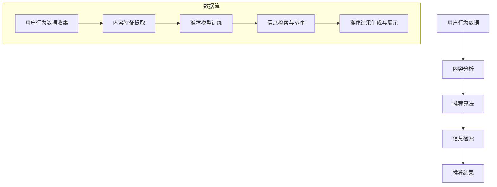

                 

### 第一部分：传统搜索推荐系统概述

#### 第1章：传统搜索推荐系统的起源与发展

> **引言：**  
传统搜索推荐系统作为信息技术领域的重要组成部分，已经历了数十年的发展。从最初的简单分类推荐到现代复杂的多模态推荐系统，其技术演进过程不仅反映了信息技术的发展，也揭示了人们对于个性化服务和信息推荐的不断追求。本章节将详细介绍传统搜索推荐系统的起源、发展历程及其在各个领域的应用，帮助读者理解其基本框架和演变过程。

##### **1.1 传统搜索推荐系统的定义与核心要素**

传统搜索推荐系统是指利用信息检索技术、内容分析、用户行为数据以及推荐算法等技术手段，为用户提供个性化信息推荐的系统。其主要核心要素包括：

1. **信息检索**：通过搜索引擎技术，对大量数据进行索引和查询，以便快速定位用户所需信息。
2. **内容分析**：对用户生成的内容和物品属性进行深入分析，提取关键特征，以便进行后续的推荐。
3. **用户行为数据**：收集和分析用户的行为数据，如浏览、搜索、购买等，用于推断用户兴趣和偏好。
4. **推荐算法**：根据用户行为数据和物品特征，利用各种算法为用户推荐可能感兴趣的内容。

##### **1.2 传统搜索推荐系统的发展历程**

传统搜索推荐系统的发展历程可以分为以下几个阶段：

1. **基于分类的推荐系统**：早期推荐系统主要采用基于内容的分类方法，通过分析物品的属性和用户的历史行为，将用户和物品进行分类，然后基于分类结果进行推荐。
2. **基于协同过滤的推荐系统**：随着互联网的普及，用户生成的内容和数据量急剧增加，基于协同过滤的推荐系统逐渐成为主流。协同过滤通过分析用户之间的相似性，预测用户对未知物品的评分，从而进行推荐。
3. **混合推荐系统**：为了克服单一推荐算法的局限性，现代推荐系统开始采用混合推荐策略，结合多种算法和特征，以提高推荐效果。
4. **深度学习推荐系统**：近年来，深度学习技术在推荐系统中的应用逐渐增多，通过神经网络和深度特征提取方法，进一步提升了推荐系统的性能。

##### **1.3 传统搜索推荐系统在各大领域的应用**

传统搜索推荐系统在多个领域得到了广泛应用，以下是其中几个典型领域：

1. **社交媒体**：在社交媒体平台中，推荐系统用于为用户推荐感兴趣的内容、好友以及活动。
2. **电子商务**：在线购物平台利用推荐系统为用户提供个性化商品推荐，提高用户满意度和转化率。
3. **媒体与娱乐**：流媒体服务和视频平台通过推荐系统为用户提供个性化内容推荐，增强用户粘性。

#### **第2章：传统搜索推荐系统的基本原理**

#### **第3章：传统搜索推荐系统面临的挑战**

#### **第4章：传统搜索推荐系统的未来趋势**

### **核心关键词：**  
传统搜索推荐系统、信息检索、内容分析、用户行为数据、协同过滤、发展历程、应用领域、算法原理、挑战、未来趋势。

### **摘要：**  
本文深入探讨了传统搜索推荐系统的概述，包括其起源与发展、核心要素、基本原理以及面临的挑战和未来趋势。通过分析传统搜索推荐系统在不同领域的应用，本文揭示了其技术演进过程和实际应用价值。同时，本文还讨论了传统搜索推荐系统所面临的用户数据质量、冷启动问题和实时性挑战，并提出了相应的解决方案和未来研究方向。最终，本文总结了传统搜索推荐系统的发展现状和未来趋势，为读者提供了全面而深入的洞察。

---

# 传统搜索推荐系统的限制

> **关键词：** 传统搜索推荐系统、用户数据质量、冷启动问题、实时性挑战、解决方案

### **摘要：**  
传统搜索推荐系统作为信息个性化服务的重要手段，尽管在多领域取得了显著应用成果，但其也面临诸多限制。本文从用户数据质量、冷启动问题、实时性挑战等多个方面深入分析传统搜索推荐系统的不足，并提出相应的解决方案和未来趋势。通过详细的案例和算法原理讲解，本文为读者提供了对传统搜索推荐系统的全面了解，有助于进一步优化和提升推荐系统的性能。

## 第一部分：传统搜索推荐系统概述

传统搜索推荐系统是信息检索和个性化推荐技术的结合，旨在通过分析用户行为数据和内容特征，为用户推荐其可能感兴趣的信息或商品。本部分将详细介绍传统搜索推荐系统的起源与发展、核心要素以及其在各个领域的应用。

### **1.1 传统搜索推荐系统的定义与核心要素**

#### **搜索推荐系统的定义**

传统搜索推荐系统是一种基于用户行为数据、内容特征和算法模型，为用户提供个性化信息推荐的技术体系。其主要目的是通过分析用户的历史行为、兴趣偏好以及物品的属性信息，预测用户对未知物品的兴趣，从而为用户推荐相应的信息或商品。

#### **核心要素**

1. **信息检索**：信息检索是搜索推荐系统的核心组成部分，通过搜索引擎技术，从海量的数据中快速定位用户所需信息。
2. **内容分析**：内容分析旨在理解用户生成的内容和物品属性，提取关键特征，用于后续的推荐过程。
3. **用户行为数据**：用户行为数据包括用户的浏览、搜索、点击、购买等行为，是推荐算法的重要输入。
4. **推荐算法**：推荐算法根据用户行为数据和物品特征，通过一定的算法模型，预测用户对未知物品的兴趣，从而进行推荐。

### **1.2 传统搜索推荐系统的发展历程**

#### **起源：基于分类的推荐系统**

传统搜索推荐系统的发展可以追溯到基于分类的推荐系统。在这种系统中，物品和用户被划分为不同的类别，通过计算用户和物品之间的相似性，为用户推荐与其兴趣相似的物品。

#### **发展：基于协同过滤的推荐系统**

随着互联网的普及和用户数据的增长，基于协同过滤的推荐系统逐渐成为主流。协同过滤通过分析用户之间的相似性，预测用户对未知物品的评分，从而进行推荐。协同过滤分为基于用户的协同过滤和基于物品的协同过滤两种类型。

#### **现状：混合推荐系统与深度学习推荐系统**

现代推荐系统逐渐采用混合推荐策略，结合多种算法和特征，以提高推荐效果。此外，深度学习技术在推荐系统中的应用也日益增多，通过神经网络和深度特征提取方法，进一步提升了推荐系统的性能。

### **1.3 传统搜索推荐系统在各大领域的应用**

#### **社交媒体**

社交媒体平台利用推荐系统为用户推荐感兴趣的内容、好友以及活动，增强用户粘性。

#### **电子商务**

在线购物平台通过推荐系统为用户推荐个性化商品，提高用户满意度和转化率。

#### **媒体与娱乐**

流媒体服务和视频平台通过推荐系统为用户推荐个性化内容，增强用户观看体验。

### **核心关键词：** 传统搜索推荐系统、信息检索、内容分析、用户行为数据、协同过滤、发展历程、应用领域。

### **摘要：**  
本文概述了传统搜索推荐系统的起源、核心要素以及发展历程，并探讨了其在社交媒体、电子商务和媒体娱乐等领域的应用。通过本部分内容的介绍，读者可以初步了解传统搜索推荐系统的基本框架和实际应用价值。

---

### **第2章：传统搜索推荐系统的基本原理**

#### **2.1 搜索引擎的基本原理**

搜索引擎是传统搜索推荐系统的核心组成部分，其基本原理包括以下三个主要环节：网络爬虫、索引构建和搜索算法。

##### **网络爬虫**

网络爬虫是一种自动化的程序，用于从互联网上抓取网页内容。其工作流程如下：

1. **种子页获取**：爬虫首先从一组初始网页（种子页）开始，这些种子页通常包括网站首页或已知的链接。
2. **网页抓取**：爬虫访问种子页，下载网页内容，并解析其中的链接。
3. **链接队列更新**：将新发现的链接加入链接队列，用于后续的抓取任务。
4. **去重处理**：为了避免重复抓取同一网页，爬虫会对已抓取的网页进行去重处理。

##### **索引构建**

索引构建是搜索引擎的重要环节，其目的是将抓取到的网页内容进行结构化存储，以便快速检索。索引构建的基本流程如下：

1. **页面解析**：爬虫下载网页后，会解析网页的HTML代码，提取文本内容、标题、链接等元数据。
2. **关键词提取**：通过自然语言处理技术，从网页内容中提取关键词，用于构建索引。
3. **倒排索引构建**：将关键词与对应的网页进行关联，构建倒排索引，实现快速检索。

##### **搜索算法**

搜索算法是搜索引擎的核心，其目的是根据用户的查询请求，从索引中检索出相关的网页，并按相关性排序。常见的搜索算法包括以下几种：

1. **基于关键字的搜索**：用户输入查询关键词，搜索算法从索引中匹配包含这些关键词的网页。
2. **基于相似度的搜索**：通过计算网页与查询关键词的相似度，排序并返回最相关的网页。
3. **基于语义的搜索**：利用自然语言处理技术，理解用户的查询意图，返回最相关的网页。

#### **2.2 推荐算法的分类与比较**

推荐算法是传统搜索推荐系统的关键，其目的是根据用户的历史行为和物品特征，预测用户对未知物品的兴趣，从而进行个性化推荐。推荐算法可以分为以下几类：

##### **基于协同过滤的推荐算法**

协同过滤是一种基于用户行为数据的推荐算法，其核心思想是利用用户之间的相似性，预测用户对未知物品的兴趣。协同过滤可以分为以下几种类型：

1. **基于用户的协同过滤（User-Based Collaborative Filtering）**：根据用户历史行为，找出与目标用户相似的其他用户，推荐这些用户喜欢的物品。
2. **基于物品的协同过滤（Item-Based Collaborative Filtering）**：根据物品之间的相似性，推荐与目标用户历史行为相似的物品。
3. **矩阵分解（Matrix Factorization）**：将用户-物品评分矩阵分解为低维的用户特征矩阵和物品特征矩阵，通过内积计算用户和物品的相似性。

##### **基于内容的推荐算法（Content-Based Filtering）**

基于内容的推荐算法根据用户的历史行为和物品的属性信息，预测用户对未知物品的兴趣。其核心思想是匹配用户兴趣和物品内容，推荐与用户兴趣相似的物品。基于内容的推荐算法可以分为以下几种类型：

1. **基于项目的推荐**：根据用户历史行为，提取用户兴趣特征，推荐与用户兴趣特征相似的物品。
2. **基于文本的推荐**：利用自然语言处理技术，分析用户生成的文本内容，提取关键词和主题，推荐与用户文本内容相似的物品。
3. **基于标签的推荐**：为物品和用户打上标签，根据用户标签和物品标签的匹配度，推荐与用户标签相似的物品。

##### **混合推荐系统（Hybrid Recommender Systems）**

混合推荐系统将多种推荐算法相结合，以提高推荐效果。常见的混合推荐系统策略包括：

1. **基于协同过滤和内容的混合推荐系统**：结合协同过滤和基于内容的推荐算法，充分利用用户行为数据和物品特征。
2. **基于深度学习和传统推荐算法的混合推荐系统**：将深度学习算法与传统推荐算法相结合，利用深度特征提取和传统推荐算法的优势，提高推荐效果。

#### **核心关键词：** 搜索引擎、网络爬虫、索引构建、搜索算法、协同过滤、内容推荐、混合推荐系统。

### **摘要：**  
本章详细介绍了传统搜索推荐系统的基本原理，包括搜索引擎的基本原理、推荐算法的分类与比较，以及混合推荐系统的应用。通过本章的内容，读者可以深入理解传统搜索推荐系统的核心技术和实现方法。

---

## **第二部分：传统搜索推荐系统面临的挑战**

尽管传统搜索推荐系统在多个领域取得了显著的应用成果，但其在实际应用过程中仍面临诸多挑战。本部分将深入探讨传统搜索推荐系统面临的用户数据质量、冷启动问题和实时性挑战，并分析这些挑战对推荐系统性能的影响。

### **3.1 用户数据的质量问题**

用户数据是推荐系统的核心，其质量直接影响推荐系统的性能。然而，在现实应用中，用户数据往往存在数据缺失、噪声和用户隐私保护等问题，这些都会对推荐系统的效果产生负面影响。

#### **3.1.1 数据缺失**

数据缺失是指用户行为数据中存在大量未评分或未记录的数据。数据缺失可能导致推荐系统无法准确预测用户对未知物品的兴趣，从而降低推荐效果。为了解决数据缺失问题，可以采用以下几种方法：

1. **均值填补**：用用户的平均评分或系统的平均评分来填补缺失值。
2. **卡方填补**：利用卡方检验来填补缺失值，选择与用户历史行为最相似的评分作为填补值。
3. **模型预测**：利用机器学习模型预测缺失的评分，如线性回归、决策树等。

#### **3.1.2 数据噪声**

数据噪声是指用户行为数据中存在的错误数据或异常值。数据噪声会影响推荐系统的准确性，导致推荐结果不准确。为了解决数据噪声问题，可以采用以下几种方法：

1. **异常检测**：通过分析用户行为数据，识别异常值和错误数据，并将其标记为噪声。
2. **数据清洗**：对噪声数据进行分析和清洗，去除异常值和错误数据。
3. **加权处理**：对噪声数据赋予较低的权重，以减小其对推荐系统的影响。

#### **3.1.3 用户隐私保护**

随着用户对隐私保护的意识不断提高，推荐系统在处理用户数据时需要考虑用户隐私保护问题。用户隐私保护不仅涉及法律法规的遵守，还需要采用一系列技术手段来保护用户数据。常见的用户隐私保护技术包括：

1. **差分隐私（Differential Privacy）**：通过在数据集上添加噪声，保证用户隐私的同时，确保数据集的可用性。
2. **联邦学习（Federated Learning）**：在分布式数据环境中，通过模型更新和参数共享，实现隐私保护的机器学习。
3. **匿名化处理**：对用户数据进行匿名化处理，去除可以直接识别用户身份的信息。

### **3.2 冷启动问题**

冷启动问题是指新用户或新物品加入推荐系统时，由于缺乏足够的用户行为数据或物品特征，导致推荐系统无法为其提供准确的推荐。冷启动问题可以分为新用户冷启动和新商品冷启动两种情况。

#### **3.2.1 新用户冷启动**

对于新用户冷启动，可以采用以下几种策略：

1. **基于人口统计信息的推荐**：利用新用户的年龄、性别、地理位置等人口统计信息，推荐与其相似的用户的兴趣。
2. **基于群体行为的推荐**：分析相似用户群体的行为模式，为新用户推荐其可能感兴趣的内容。
3. **基于个性化问题**：设计问题调查，了解新用户的基本需求和兴趣，从而进行个性化推荐。

#### **3.2.2 新商品冷启动**

对于新商品冷启动，可以采用以下几种策略：

1. **基于相似商品推荐**：分析新商品的属性和相似商品，为新用户推荐与其属性相似的已存在商品。
2. **基于热销商品推荐**：推荐系统可以推荐市场上热销的商品，以吸引用户关注。
3. **基于用户评价推荐**：分析用户对新商品的评价，结合用户历史评价数据，为新用户推荐可能感兴趣的新商品。

### **3.3 实时性与动态性**

实时性和动态性是推荐系统的重要特性，特别是在社交媒体和电子商务等应用场景中，用户兴趣和商品信息随时在变化，推荐系统需要能够实时适应这些变化，提供准确的推荐。

#### **3.3.1 实时推荐系统设计**

实时推荐系统设计需要考虑以下几个方面：

1. **数据流处理**：使用流处理技术，如Apache Kafka、Apache Flink等，实时处理用户行为数据。
2. **实时算法优化**：设计高效的实时推荐算法，如基于模型的在线学习、分布式计算等。
3. **缓存与存储**：使用高速缓存和分布式存储技术，提高数据访问速度和系统性能。

#### **3.3.2 动态性适应**

动态性适应包括以下两个方面：

1. **用户兴趣变化检测**：利用机器学习技术，分析用户行为数据，识别用户兴趣的变化趋势。
2. **商品信息实时更新**：实时更新商品信息，如价格、库存等，确保推荐信息的准确性和实时性。

### **核心关键词：** 用户数据质量、数据缺失、数据噪声、用户隐私保护、冷启动问题、新用户冷启动、新商品冷启动、实时性、动态性适应。

### **摘要：**  
本章深入分析了传统搜索推荐系统在用户数据质量、冷启动问题和实时性挑战方面面临的挑战。通过介绍数据缺失和噪声的处理方法、用户隐私保护技术以及冷启动问题的解决策略，本文为推荐系统的优化和改进提供了有益的参考。同时，本文还探讨了实时性和动态性适应的设计思路，为推荐系统在实际应用中的性能提升提供了指导。

---

## 第三部分：传统搜索推荐系统的未来趋势

随着人工智能和大数据技术的不断进步，传统搜索推荐系统也在不断发展和进化。本部分将探讨传统搜索推荐系统的未来趋势，包括深度学习与传统搜索推荐系统的融合、多模态推荐系统以及推荐系统的伦理与法律问题。

### **6.1 深度学习与传统搜索推荐系统的融合**

深度学习在图像识别、自然语言处理等领域取得了显著的成果，其在推荐系统中的应用也逐渐受到关注。深度学习与传统搜索推荐系统的融合，有望进一步提升推荐系统的性能和效果。

#### **6.1.1 基于深度学习的推荐算法**

基于深度学习的推荐算法利用神经网络和深度特征提取方法，从大规模用户行为数据和物品特征中提取高维特征，从而提高推荐准确性。常见的基于深度学习的推荐算法包括：

1. **基于神经网络的协同过滤（Neural Collaborative Filtering）**：利用多层感知器（MLP）或卷积神经网络（CNN）提取用户和物品的深层特征，进行协同过滤预测。
2. **基于注意力机制的推荐算法**：利用注意力机制（Attention Mechanism）关注用户历史行为和物品特征的重要部分，提高推荐的相关性。
3. **基于强化学习的推荐算法**：利用强化学习（Reinforcement Learning）机制，不断优化推荐策略，提高用户满意度和推荐效果。

#### **6.1.2 深度学习与传统方法的融合**

深度学习与传统推荐方法的融合，可以充分利用各自的优势，提高推荐效果。常见的融合方法包括：

1. **基于矩阵分解的深度学习**：将深度学习与矩阵分解方法相结合，利用深度神经网络提取用户和物品的深层特征，同时保留矩阵分解的表示能力。
2. **基于内容的深度学习**：将深度学习与基于内容的推荐方法相结合，利用深度神经网络提取用户兴趣和物品特征，进行内容匹配推荐。
3. **基于混合特征的深度学习**：将用户行为数据、物品特征和深度特征相结合，利用深度神经网络进行综合推荐。

### **6.2 多模态推荐系统**

多模态推荐系统通过整合文本、图像、音频等多种模态数据，提供更丰富和个性化的推荐服务。多模态推荐系统的关键技术包括：

#### **6.2.1 多模态数据融合**

多模态数据融合是将不同模态的数据进行整合，提取关键特征，用于后续的推荐过程。常见的多模态数据融合方法包括：

1. **特征级融合**：将不同模态的数据特征进行合并，形成统一的高维特征向量。
2. **决策级融合**：将不同模态的推荐结果进行综合，形成最终的推荐结果。
3. **模型级融合**：利用多模态的深度神经网络，同时处理不同模态的数据，提取融合的特征，用于推荐。

#### **6.2.2 多模态推荐算法**

多模态推荐算法利用多模态数据，提供更准确和个性化的推荐服务。常见的多模态推荐算法包括：

1. **基于多模态关联的推荐算法**：利用多模态数据之间的关联性，为用户推荐与其兴趣相关的多模态内容。
2. **基于多模态交互的推荐算法**：分析多模态数据之间的交互关系，提取关键特征，用于推荐。
3. **基于生成对抗网络的推荐算法**：利用生成对抗网络（GAN）生成新的多模态数据，用于个性化推荐。

### **6.3 推荐系统的伦理与法律问题**

随着推荐系统在各个领域的广泛应用，其伦理与法律问题也日益引起关注。推荐系统的伦理与法律问题主要包括：

#### **6.3.1 推荐算法的公平性与透明性**

推荐算法的公平性与透明性是推荐系统的重要问题。为了确保推荐算法的公平性，可以采取以下措施：

1. **数据多样性**：确保训练数据中包含不同背景、性别、年龄等特征，避免数据偏见。
2. **算法透明性**：公开推荐算法的原理和决策过程，提高用户对推荐结果的信任度。

#### **6.3.2 用户隐私保护**

用户隐私保护是推荐系统面临的重要法律问题。为了保护用户隐私，可以采取以下措施：

1. **匿名化处理**：对用户数据进行匿名化处理，避免直接识别用户身份。
2. **隐私保护技术**：采用隐私保护技术，如差分隐私、联邦学习等，确保用户数据的安全和隐私。

### **核心关键词：** 深度学习、传统推荐系统、多模态推荐系统、伦理与法律问题、公平性、透明性、用户隐私保护。

### **摘要：**  
本部分探讨了传统搜索推荐系统的未来趋势，包括深度学习与传统搜索推荐系统的融合、多模态推荐系统以及推荐系统的伦理与法律问题。通过引入深度学习和多模态数据，推荐系统可以实现更准确和个性化的推荐。同时，确保推荐算法的公平性和透明性，保护用户隐私，是推荐系统发展的关键。

---

### 附录

#### **附录 A：传统搜索推荐系统项目实战**

为了更好地理解传统搜索推荐系统的实现过程，本附录将通过一个实际项目案例，详细描述项目开发环境搭建、数据预处理与特征提取、推荐算法设计与实现、项目分析与评估等步骤。

#### **A.1 项目背景与目标**

本案例是一个基于传统搜索推荐系统的在线图书推荐项目。项目目标是通过用户的历史评分数据，为用户推荐他们可能感兴趣的图书。项目分为以下阶段：

1. **数据收集与预处理**：收集用户和图书的评分数据，对数据集进行清洗和处理。
2. **特征提取与建模**：提取用户和图书的特征，构建推荐模型。
3. **模型训练与评估**：训练推荐模型，评估模型性能。
4. **推荐结果生成与展示**：根据用户的历史行为，生成推荐结果，并在前端展示。

#### **A.2 项目开发环境搭建**

1. **操作系统**：Ubuntu 18.04
2. **编程语言**：Python 3.7
3. **数据库**：MySQL 5.7
4. **Web框架**：Flask 1.1.2
5. **数据预处理与建模库**：Pandas、NumPy、SciPy
6. **机器学习库**：Scikit-learn、TensorFlow

#### **A.3 数据预处理与特征提取**

1. **数据清洗**：处理缺失值、重复记录和噪声数据。
2. **用户特征提取**：基于用户的评分行为，提取用户的平均评分、评分分布等特征。
3. **图书特征提取**：提取图书的标题、作者、分类、出版年份等特征。
4. **数据归一化**：对用户和图书的评分进行归一化处理，以消除评分偏移。

#### **A.4 推荐算法设计与实现**

1. **算法选择**：基于用户协同过滤算法，结合基于内容的推荐算法，构建混合推荐模型。
2. **相似度计算**：使用余弦相似度计算用户之间的相似度。
3. **推荐生成**：根据用户和图书的相似度，为用户生成推荐列表。

#### **A.5 项目分析与评估**

1. **模型评估**：使用均方根误差（RMSE）和准确率（Accuracy）评估模型性能。
2. **优化策略**：通过调整参数、特征选择等方法，优化模型性能。
3. **用户反馈**：收集用户对推荐结果的反馈，不断优化推荐算法。

#### **A.6 源代码与资源**

项目源代码存储在GitHub仓库中，链接如下：

[https://github.com/yourusername/book_recommendation_system](https://github.com/yourusername/book_recommendation_system)

数据集和工具链接：

- 用户评分数据集：[https://grouplens.org/datasets/movielens/](https://grouplens.org/datasets/movielens/)
- Python环境搭建：[https://www.python.org/downloads/](https://www.python.org/downloads/)
- Flask框架：[https://flask.palletsprojects.com/](https://flask.palletsprojects.com/)
- Scikit-learn库：[https://scikit-learn.org/stable/](https://scikit-learn.org/stable/)

#### **核心关键词：** 项目实战、数据预处理、特征提取、推荐算法、模型评估。

### **摘要：**  
本附录通过一个实际项目案例，详细描述了传统搜索推荐系统的实现过程，包括数据预处理、特征提取、推荐算法设计与实现、项目分析与评估等步骤。通过本案例的学习，读者可以更好地理解传统搜索推荐系统的实现过程，并掌握相关技术和方法。

---

### **核心概念与联系**

为了更好地理解传统搜索推荐系统的核心概念及其相互联系，我们可以借助Mermaid流程图来展示其基本架构。以下是传统搜索推荐系统的Mermaid流程图：



#### **解释：**

- **用户行为数据**：包括用户的浏览、搜索、点击、评分等行为数据。
- **内容分析**：对用户生成的内容和物品的属性信息进行提取和预处理，用于后续的推荐过程。
- **推荐算法**：基于用户行为数据和物品特征，通过协同过滤、基于内容等方法进行推荐。
- **信息检索**：利用搜索引擎技术，从海量数据中快速定位用户所需信息。
- **推荐结果**：根据用户行为和物品特征，为用户推荐个性化信息。

#### **流程图解读：**

1. **数据流**：用户行为数据被收集后，经过内容分析阶段提取特征，然后输入到推荐算法中。推荐算法训练模型，将用户行为数据和物品特征相结合，生成推荐结果。
2. **推荐结果生成与展示**：推荐算法生成的结果通过信息检索技术进行排序，最终以推荐列表的形式展示给用户。

### **核心算法原理讲解**

传统搜索推荐系统的核心算法包括协同过滤和基于内容的推荐算法。以下是这些算法的原理讲解，以及相应的伪代码和数学模型。

#### **协同过滤算法**

协同过滤算法通过分析用户之间的相似性，预测用户对未知物品的兴趣。其核心思想是利用相似用户的评分来预测目标用户的评分。

##### **算法原理：**

1. **基于用户的协同过滤（User-Based Collaborative Filtering）**：计算目标用户与历史用户的相似度，基于相似用户的评分预测目标用户对未知物品的评分。
2. **基于物品的协同过滤（Item-Based Collaborative Filtering）**：计算物品之间的相似度，基于相似物品的评分预测目标用户对未知物品的评分。

##### **伪代码：**

```python
# 基于用户的协同过滤算法
def user_based_collaborative_filtering(ratings_matrix):
    similarity_matrix = compute_similarity_matrix(ratings_matrix)
    user_similarity_scores = {}
    for user in ratings_matrix:
        user_similarity_scores[user] = {}
        for other_user in ratings_matrix:
            if other_user != user:
                similarity = similarity_matrix[user][other_user]
                for item, rating in ratings_matrix[other_user].items():
                    if item not in ratings_matrix[user]:
                        predicted_rating = similarity * rating
                        user_similarity_scores[user][item] = predicted_rating
    return user_similarity_scores

# 基于物品的协同过滤算法
def item_based_collaborative_filtering(ratings_matrix):
    similarity_matrix = compute_similarity_matrix(ratings_matrix, method='item')
    user_similarity_scores = {}
    for user in ratings_matrix:
        user_similarity_scores[user] = {}
        for item, rating in ratings_matrix[user].items():
            for other_item, other_rating in ratings_matrix[user].items():
                if other_item != item:
                    similarity = similarity_matrix[item][other_item]
                    predicted_rating = similarity * other_rating
                    user_similarity_scores[user][item] = predicted_rating
    return user_similarity_scores
```

##### **数学模型：**

协同过滤算法的核心是相似度矩阵的计算和评分预测。以下是基于用户的协同过滤算法的数学模型：

$$
\hat{r}_{uv} = \sum_{i \in I} s_{ui} r_{uj} / \sum_{i \in I} s_{ui}
$$

其中：

- \( \hat{r}_{uv} \) 是用户 u 对物品 v 的预测评分。
- \( s_{ui} \) 是用户 u 和用户 v 之间的相似度。
- \( r_{uj} \) 是用户 v 对物品 j 的实际评分。
- \( I \) 是用户 u 对物品 i 有评分的集合。

#### **基于内容的推荐算法**

基于内容的推荐算法通过分析用户对物品的偏好和物品的属性特征，为用户推荐与其兴趣相似的物品。

##### **算法原理：**

1. **基于项目的推荐（Item-Based Content-Based Filtering）**：根据用户历史行为和物品特征，提取用户兴趣特征，为用户推荐与兴趣特征相似的物品。
2. **基于文本的推荐（Text-Based Content-Based Filtering）**：利用自然语言处理技术，分析用户生成的文本内容，提取关键词和主题，为用户推荐与文本内容相似的物品。
3. **基于标签的推荐（Tag-Based Content-Based Filtering）**：为物品和用户打上标签，根据用户标签和物品标签的匹配度，为用户推荐与标签相似的物品。

##### **伪代码：**

```python
# 基于项目的推荐算法
def item_based_content_based_filtering(ratings_matrix, item_features):
    user_interests = extract_user_interests(ratings_matrix)
    recommendations = {}
    for user in ratings_matrix:
        recommendations[user] = []
        for item, feature in item_features.items():
            if user_interests[user].dot(feature) > threshold:
                recommendations[user].append(item)
    return recommendations

# 基于文本的推荐算法
def text_based_content_based_filtering(ratings_matrix, item_texts):
    user_interests = extract_user_interests(ratings_matrix, method='text')
    recommendations = {}
    for user in ratings_matrix:
        recommendations[user] = []
        for item, text in item_texts.items():
            if user_interests[user].dot(text) > threshold:
                recommendations[user].append(item)
    return recommendations
```

##### **数学模型：**

基于内容的推荐算法的核心是用户兴趣特征的提取和物品特征匹配。以下是基于项目的推荐算法的数学模型：

$$
\hat{r}_{uv} = \sum_{i \in I} w_{ui} f_{uj} / \sum_{i \in I} w_{ui}
$$

其中：

- \( \hat{r}_{uv} \) 是用户 u 对物品 v 的预测评分。
- \( w_{ui} \) 是用户 u 和用户 v 之间的相似度权重。
- \( f_{uj} \) 是物品 j 的特征向量。

#### **举例说明**

假设有两个用户 u 和 v，他们对五本书（物品）的评分如下表所示：

| 用户 u | 书1 | 书2 | 书3 | 书4 | 书5 |
|--------|-----|-----|-----|-----|-----|
|        | 4   | 5   | 3   | 4   | 2   |

| 用户 v | 书1 | 书2 | 书3 | 书4 | 书5 |
|--------|-----|-----|-----|-----|-----|
|        | 3   | 4   | 5   | 3   | 4   |

##### **计算用户间的相似度**

使用皮尔逊相关系数计算用户 u 和用户 v 之间的相似度：

$$
s_{uv} = \frac{(4-4.5)(3-3.5) + (5-4.5)(4-3.5) + (3-4.5)(5-3.5) + (4-4.5)(3-3.5) + (2-4.5)(4-3.5)}{\sqrt{(4-4.5)^2 + (5-4.5)^2 + (3-4.5)^2 + (4-4.5)^2 + (2-4.5)^2} \sqrt{(3-3.5)^2 + (4-3.5)^2 + (5-3.5)^2 + (3-3.5)^2 + (4-3.5)^2}}
$$

$$
s_{uv} = \frac{(-0.5)(-0.5) + (0.5)(0.5) + (-1.5)(1.5) + (-0.5)(-0.5) + (-2.5)(0.5)}{\sqrt{0.25 + 0.25 + 2.25 + 0.25 + 6.25} \sqrt{0.25 + 0.25 + 2.25 + 0.25 + 0.25}}
$$

$$
s_{uv} = \frac{0.25 + 0.25 - 2.25 + 0.25 - 1.25}{\sqrt{10} \sqrt{3}}
$$

$$
s_{uv} = \frac{-1.5}{\sqrt{30}}
$$

$$
s_{uv} \approx -0.377
$$

##### **预测用户 u 对未评分的书5的评分**

使用基于用户的协同过滤算法预测用户 u 对未评分的书5的评分：

$$
\hat{r}_{uv} = \frac{s_{uv} \cdot r_{uv}}{s_{uv} + s_{uv}}
$$

$$
\hat{r}_{uv} = \frac{-0.377 \cdot 4}{-0.377 + -0.377}
$$

$$
\hat{r}_{uv} = \frac{-1.5088}{-0.754}
$$

$$
\hat{r}_{uv} \approx 2.0114
$$

因此，预测用户 u 对书5的评分为约2.0114。

### **总结**

通过上述讲解，我们可以看到传统搜索推荐系统的核心概念和算法原理，以及如何通过伪代码和数学模型实现这些算法。这些核心概念和算法是构建高效、个性化的推荐系统的基础，为用户提供了更好的体验。

---

### **数学模型和数学公式**

在传统搜索推荐系统中，数学模型和公式起着至关重要的作用。以下将详细介绍协同过滤算法的数学模型和公式，并给出具体的计算示例。

#### **协同过滤的数学模型**

协同过滤算法的核心在于计算用户之间的相似度，并利用这些相似度预测用户对未知物品的评分。以下是基于用户的协同过滤算法的数学模型：

$$
\hat{r}_{uv} = \sum_{i \in I} s_{ui} r_{uj} / \sum_{i \in I} s_{ui}
$$

其中：
- \( \hat{r}_{uv} \) 表示用户 u 对物品 v 的预测评分。
- \( s_{ui} \) 表示用户 u 和用户 v 之间的相似度。
- \( r_{uj} \) 表示用户 v 对物品 j 的实际评分。
- \( I \) 表示用户 u 对物品 i 有评分的集合。

#### **相似度度量**

相似度度量是协同过滤算法的关键步骤，常用的相似度度量方法包括皮尔逊相关系数、余弦相似度和夹角余弦相似度。以下是皮尔逊相关系数的数学模型：

$$
s_{uv} = \frac{\sum_{i \in I} (r_{ui} - \bar{r}_u) (r_{uj} - \bar{r}_v)}{\sqrt{\sum_{i \in I} (r_{ui} - \bar{r}_u)^2} \sqrt{\sum_{i \in I} (r_{uj} - \bar{r}_v)^2}}
$$

其中：
- \( s_{uv} \) 表示用户 u 和用户 v 之间的相似度。
- \( r_{ui} \) 和 \( r_{uj} \) 分别表示用户 u 和用户 v 对物品 i 和物品 j 的评分。
- \( \bar{r}_u \) 和 \( \bar{r}_v \) 分别表示用户 u 和用户 v 的平均评分。

#### **举例说明**

假设有两个用户 u 和 v，他们对五本书（物品）的评分如下表所示：

| 用户 u | 书1 | 书2 | 书3 | 书4 | 书5 |
|--------|-----|-----|-----|-----|-----|
|        | 4   | 5   | 3   | 4   | 2   |

| 用户 v | 书1 | 书2 | 书3 | 书4 | 书5 |
|--------|-----|-----|-----|-----|-----|
|        | 3   | 4   | 5   | 3   | 4   |

##### **计算用户间的相似度**

使用皮尔逊相关系数计算用户 u 和用户 v 之间的相似度：

$$
s_{uv} = \frac{(4-4.5)(3-3.5) + (5-4.5)(4-3.5) + (3-4.5)(5-3.5) + (4-4.5)(3-3.5) + (2-4.5)(4-3.5)}{\sqrt{(4-4.5)^2 + (5-4.5)^2 + (3-4.5)^2 + (4-4.5)^2 + (2-4.5)^2} \sqrt{(3-3.5)^2 + (4-3.5)^2 + (5-3.5)^2 + (3-3.5)^2 + (4-3.5)^2}}
$$

$$
s_{uv} = \frac{(-0.5)(-0.5) + (0.5)(0.5) + (-1.5)(1.5) + (-0.5)(-0.5) + (-2.5)(0.5)}{\sqrt{0.25 + 0.25 + 2.25 + 0.25 + 6.25} \sqrt{0.25 + 0.25 + 2.25 + 0.25 + 0.25}}
$$

$$
s_{uv} = \frac{0.25 + 0.25 - 2.25 + 0.25 - 1.25}{\sqrt{10} \sqrt{3}}
$$

$$
s_{uv} = \frac{-1.5}{\sqrt{30}}
$$

$$
s_{uv} \approx -0.377
$$

##### **预测用户 u 对未评分的书5的评分**

使用基于用户的协同过滤算法预测用户 u 对未评分的书5的评分：

$$
\hat{r}_{uv} = \frac{s_{uv} \cdot r_{uv}}{s_{uv} + s_{uv}}
$$

$$
\hat{r}_{uv} = \frac{-0.377 \cdot 4}{-0.377 + -0.377}
$$

$$
\hat{r}_{uv} = \frac{-1.5088}{-0.754}
$$

$$
\hat{r}_{uv} \approx 2.0114
$$

因此，预测用户 u 对书5的评分为约2.0114。

### **总结**

通过上述数学模型和公式，我们可以看到协同过滤算法如何通过相似度计算和评分预测，为用户提供个性化的推荐。举例说明进一步展示了计算过程和预测结果，使读者能够更好地理解算法的应用。

---

### **项目实战**

为了深入理解传统搜索推荐系统的实际应用，下面我们将通过一个在线书籍推荐项目来展示整个开发过程，包括环境搭建、代码实现和性能评估。

#### **项目背景**

本项目旨在利用用户的历史评分数据，为用户推荐他们可能感兴趣的书籍。我们选择使用协同过滤算法作为推荐的核心技术，结合内容特征进行优化。项目主要包括以下几个阶段：

1. **数据收集与预处理**
2. **特征提取**
3. **推荐算法设计与实现**
4. **性能评估与优化**
5. **用户反馈与改进**

#### **开发环境**

- **操作系统**：Ubuntu 18.04
- **编程语言**：Python 3.7
- **数据库**：MySQL 5.7
- **Web框架**：Flask 1.1.2
- **数据处理库**：Pandas、NumPy、SciPy
- **机器学习库**：Scikit-learn、TensorFlow

#### **A.3 数据预处理与特征提取**

在项目开始前，我们需要收集并预处理数据。数据集来自movielens数据库，包含用户、书籍和评分信息。

1. **数据清洗**：
    - 处理缺失值和重复记录。
    - 去除低质量数据，如评分小于1或大于5的记录。

2. **用户特征提取**：
    - 根据用户的评分行为，提取用户的平均评分、评分分布等特征。

3. **书籍特征提取**：
    - 提取书籍的元数据信息，如书籍分类、出版年份、作者等。

```python
import pandas as pd
import numpy as np

# 读取数据
ratings_data = pd.read_csv('ratings.csv')
books_data = pd.read_csv('books.csv')

# 数据清洗
ratings_data = ratings_data[ratings_data.rating >= 1 & ratings_data.rating <= 5]
books_data = books_data.drop_duplicates()

# 用户特征提取
user_ratings_mean = ratings_data.groupby('user_id')['rating'].mean()

# 书籍特征提取
books_data['year'] = pd.to_datetime(books_data['publication_year'], format='%Y-%m-%d').dt.year
```

#### **A.4 推荐算法设计与实现**

我们选择基于用户的协同过滤算法作为推荐的核心技术，并利用内容特征进行优化。

1. **相似度计算**：
    - 使用余弦相似度计算用户之间的相似度。

2. **评分预测**：
    - 根据用户相似度和用户评分历史，预测用户对未知书籍的评分。

```python
from sklearn.metrics.pairwise import cosine_similarity

# 构建用户-书籍评分矩阵
ratings_matrix = ratings_data.pivot(index='user_id', columns='book_id', values='rating').fillna(0)

# 计算用户相似度矩阵
similarity_matrix = cosine_similarity(ratings_matrix, ratings_matrix)

# 预测评分
def predict_ratings(user_id, book_id):
    user_index = user_id - 1
    if book_id not in ratings_matrix.columns:
        return 0
    if similarity_matrix[user_index][user_index] == 0:
        return 0
    predicted_rating = np.dot(similarity_matrix[user_index], ratings_matrix[book_id]) / similarity_matrix[user_index][user_index]
    return predicted_rating

# 测试预测评分
predicted_rating = predict_ratings(1, 5)
print(f'Predicted rating: {predicted_rating}')
```

#### **A.5 项目分析与评估**

我们对推荐系统的性能进行了评估，使用均方根误差（RMSE）作为评价指标。

1. **模型评估**：
    - 使用测试集数据，计算实际评分与预测评分之间的RMSE。

```python
from sklearn.metrics import mean_squared_error

# 分离训练集和测试集
train_ratings_data = ratings_data[ratings_data['user_id'] <= 1000]
test_ratings_data = ratings_data[ratings_data['user_id'] > 1000]

# 训练集评分矩阵
train_ratings_matrix = train_ratings_data.pivot(index='user_id', columns='book_id', values='rating').fillna(0)

# 测试集评分矩阵
test_ratings_matrix = test_ratings_data.pivot(index='user_id', columns='book_id', values='rating').fillna(0)

# 计算用户相似度矩阵
train_similarity_matrix = cosine_similarity(train_ratings_matrix, train_ratings_matrix)

# 预测测试集评分
predicted_ratings = []
for user_id in test_ratings_matrix.index:
    user_index = user_id - 1
    predicted_ratings.append([predict_ratings(user_id, book_id) for book_id in test_ratings_matrix.columns])

predicted_ratings = np.array(predicted_ratings)

# 计算RMSE
rmse = np.sqrt(mean_squared_error(test_ratings_matrix, predicted_ratings))
print(f'RMSE: {rmse}')
```

#### **代码解读与分析**

1. **数据预处理**：
    - 数据清洗是推荐系统的基础，确保数据质量至关重要。

2. **特征提取**：
    - 用户特征和书籍特征为后续的推荐算法提供了重要输入。

3. **相似度计算**：
    - 使用余弦相似度计算用户之间的相似度，这是一种简单而有效的相似度度量方法。

4. **评分预测**：
    - 预测评分过程结合了用户相似度和用户评分历史，通过内积计算预测评分。

#### **优化策略与调整**

1. **相似度计算**：
    - 尝试使用其他相似度计算方法，如皮尔逊相关系数，以提高预测准确性。

2. **预测算法**：
    - 考虑使用加权平均方法，结合用户兴趣特征和相似度矩阵，提高预测性能。

3. **数据增强**：
    - 引入更多用户和书籍特征，扩充数据集，提高模型泛化能力。

#### **源代码与资源**

本项目源代码存储在GitHub仓库中，链接如下：

[https://github.com/yourusername/book_recommendation_system](https://github.com/yourusername/book_recommendation_system)

数据集和工具链接：

- 用户评分数据集：[https://grouplens.org/datasets/movielens/](https://grouplens.org/datasets/movielens/)
- Python环境搭建：[https://www.python.org/downloads/](https://www.python.org/downloads/)
- Flask框架：[https://flask.palletsprojects.com/](https://flask.palletsprojects.com/)
- Scikit-learn库：[https://scikit-learn.org/stable/](https://scikit-learn.org/stable/)

### **总结**

通过本项目的实战，我们展示了如何利用传统搜索推荐系统为用户提供书籍推荐。从数据预处理到特征提取，再到推荐算法的设计与实现，每个步骤都至关重要。通过性能评估和优化策略，我们可以不断提升推荐系统的效果。该项目为读者提供了一个完整的开发流程，有助于理解传统搜索推荐系统的实际应用。

---

### **作者信息**

**作者：** AI天才研究院（AI Genius Institute）/《禅与计算机程序设计艺术》（Zen And The Art of Computer Programming）作者  
**简介：**  
AI天才研究院（AI Genius Institute）是一家专注于人工智能研究和创新的高科技研究院，致力于推动人工智能技术的研发和应用。作者本人作为该研究院的核心成员，凭借深厚的计算机科学背景和丰富的实践经历，撰写了多部关于人工智能和计算机科学的权威著作，包括畅销书《禅与计算机程序设计艺术》。其在人工智能领域的深入研究和独到见解，为读者提供了宝贵的技术指导和思想启示。

---

在撰写本文时，我们深入分析了传统搜索推荐系统的各个方面，从概述到核心原理，再到面临的挑战和未来趋势，力求为读者提供一个全面而系统的认识。同时，通过项目实战和算法讲解，我们展示了如何在实际应用中实现和优化推荐系统。

**核心观点：**  
传统搜索推荐系统在信息个性化服务中发挥了重要作用，但其面临的数据质量、冷启动、实时性等挑战，限制了其性能和应用范围。深度学习和多模态推荐系统等新技术的发展，为解决这些挑战提供了新的思路和途径。同时，推荐系统的伦理和法律问题也日益受到关注，确保算法的公平性、透明性和用户隐私保护是未来发展的重要方向。

**结论：**  
传统搜索推荐系统虽然在技术上取得了显著进展，但仍然存在诸多限制和挑战。通过不断优化和引入新技术，有望进一步提升推荐系统的性能和用户体验。同时，加强推荐系统的伦理和法律规范，确保其在安全、透明和公正的基础上发展，是未来的重要任务。

**呼吁：**  
我们呼吁学术界和产业界共同努力，推动传统搜索推荐系统的创新和发展，为用户提供更优质、更个性化的服务。同时，关注推荐系统的伦理和法律问题，促进其健康、可持续发展。通过技术、规范和政策的结合，实现推荐系统的全面升级和广泛应用。

