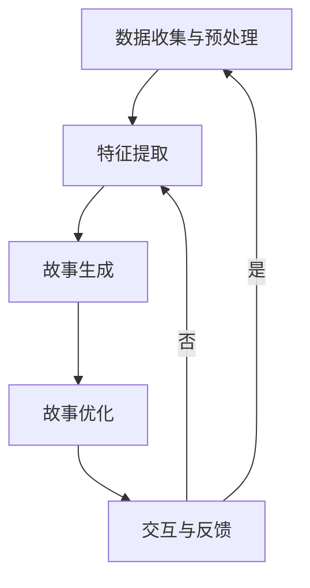
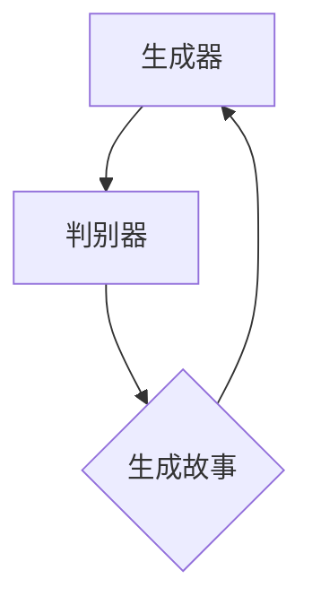
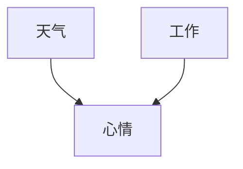

                 

# 《体验的个人化叙事：AI驱动的生活故事》

> **关键词**：人工智能，个人化叙事，生成对抗网络（GAN），循环神经网络（RNN），长短期记忆网络（LSTM），强化学习，数学模型，算法原理，应用场景，项目实战，未来展望。

> **摘要**：本文将探讨人工智能在个人化叙事领域的应用，分析AI驱动的生活故事生成原理和核心算法，并通过实际项目和案例分析，展示AI在个人化叙事中的潜力与挑战。文章旨在为读者提供关于AI驱动生活故事的深入理解，以及其在各领域中的应用前景。

## 《体验的个人化叙事：AI驱动的生活故事》目录大纲

### 第一部分：引言与背景

#### 第1章：个人化叙事的崛起

##### 1.1 AI时代的个人化体验
##### 1.2 个人化叙事的重要性
##### 1.3 本书的目标与结构

### 第二部分：AI驱动的生活故事原理

#### 第2章：AI驱动的生活故事架构

##### 2.1 AI的基本概念
##### 2.2 AI在叙事中的应用
##### 2.3 生活故事的构建与演绎
##### 2.4 个人化叙事的核心元素
##### 2.5 Mermaid流程图：AI驱动的生活故事架构

#### 第3章：核心算法与数学模型

##### 3.1 数据预处理与特征提取
##### 3.2 生成对抗网络（GAN）
##### 3.3 循环神经网络（RNN）与长短期记忆网络（LSTM）
##### 3.4 强化学习在叙事中的应用
##### 3.5 伪代码：生活故事生成算法

#### 第4章：数学模型与公式解析

##### 4.1 线性回归与逻辑回归
##### 4.2 贝叶斯网络与马尔可夫模型
##### 4.3 $L_1$和$L_2$正则化
##### 4.4 $K$-均值聚类算法
##### 4.5 公式解析与举例说明

### 第三部分：AI驱动的生活故事应用

#### 第5章：AI驱动的生活故事应用场景

##### 5.1 社交媒体中的个人化叙事
##### 5.2 娱乐内容创作中的AI应用
##### 5.3 教育与培训中的个人化叙事
##### 5.4 健康与医疗领域的AI叙事

#### 第6章：项目实战与案例分析

##### 6.1 AI驱动的生活故事项目搭建
##### 6.2 代码实际案例展示
##### 6.3 源代码详细实现与解读
##### 6.4 代码解读与分析

#### 第7章：未来展望与挑战

##### 7.1 AI驱动生活故事的未来发展趋势
##### 7.2 技术挑战与伦理问题
##### 7.3 个人化叙事的应用前景

### 附录

#### 附录A：AI驱动生活故事工具与资源

##### A.1 开发环境搭建
##### A.2 主流AI框架对比
##### A.3 开源代码与数据集资源

---

### 引言与背景

在人工智能（AI）迅猛发展的今天，我们正逐步进入一个全新的时代——个性化体验时代。AI技术以其强大的数据分析和模式识别能力，正在深刻改变我们的生活方式。从推荐系统到智能助手，从自动驾驶到智能家居，AI正以其无与伦比的能力为我们创造更加便捷、高效的生活体验。

个人化叙事作为AI技术应用的一个重要领域，正逐渐引起广泛关注。个人化叙事，即通过AI技术为每个人生成独特、个性化的故事和内容，其核心在于利用AI算法对大量数据进行分析和处理，从而创造出符合个人兴趣、经验和情感的故事。这种叙事方式不仅具有高度的创新性和吸引力，同时也满足了人们对于个性化体验的追求。

### 个人化叙事的崛起

随着大数据和深度学习技术的不断进步，个人化叙事逐渐成为一种新兴的叙事形式。在过去，叙事创作往往依赖于人类的创意和想象力，而现在，AI技术的介入使得叙事创作变得更加高效和多样化。通过AI驱动的算法，我们可以快速地从大量数据中提取出有价值的信息，构建出丰富多样的故事情节。

个人化叙事的重要性不仅体现在娱乐和文学领域，还广泛应用于教育、健康、市场营销等多个领域。在教育领域，AI可以为学生定制个性化的学习内容，提高学习效果；在健康领域，AI可以根据患者的病史和基因信息生成个性化的治疗方案；在市场营销中，AI可以分析消费者行为，提供定制化的广告和服务。

本书的目标是探讨AI驱动的生活故事生成原理和应用，旨在为读者提供一个全面、系统的理解。本书结构如下：

1. **引言与背景**：介绍AI时代个人化叙事的崛起，阐述个人化叙事的重要性。
2. **AI驱动的生活故事原理**：详细解析AI驱动的生活故事架构，核心算法与数学模型。
3. **AI驱动的生活故事应用**：探讨AI驱动的生活故事在不同领域的应用场景。
4. **项目实战与案例分析**：通过实际项目和案例分析，展示AI驱动生活故事的应用效果。
5. **未来展望与挑战**：分析AI驱动生活故事的未来发展趋势，探讨技术挑战与伦理问题。
6. **附录**：提供AI驱动生活故事开发所需的工具与资源。

通过本书的阅读，读者可以深入了解AI驱动的生活故事原理和应用，为未来在相关领域的创新和应用奠定基础。接下来，我们将逐步深入探讨AI驱动的生活故事架构、核心算法与数学模型，以及其在实际应用中的挑战和机遇。让我们开始这段精彩的探索之旅。

### 第一部分：引言与背景

#### 第1章：个人化叙事的崛起

##### 1.1 AI时代的个人化体验

在人工智能（AI）迅猛发展的今天，我们正逐步进入一个全新的时代——个性化体验时代。AI技术以其强大的数据分析和模式识别能力，正在深刻改变我们的生活方式。从推荐系统到智能助手，从自动驾驶到智能家居，AI正以其无与伦比的能力为我们创造更加便捷、高效的生活体验。

个人化体验，简单来说，就是根据每个人的需求和偏好提供定制化的服务。这种体验的个性化不仅体现在物质层面，如个性化商品推荐、定制化服务，还体现在精神层面，如个人化内容创作、情感互动等。在AI时代，个人化体验的实现依赖于海量数据的收集和处理，以及智能算法的应用。

首先，AI技术通过大数据收集和分析，可以深入了解每个用户的行为和偏好。例如，电商平台利用用户浏览和购买历史数据，可以准确预测用户可能感兴趣的商品，从而提供个性化的推荐。这种基于数据的个性化体验，使得用户能够更快地找到自己需要的产品，提高了购物效率和满意度。

其次，AI通过机器学习和自然语言处理技术，可以生成个性化的内容。例如，在社交媒体平台上，AI可以根据用户的兴趣和互动历史，生成个性化的新闻推送、文章推荐等。这样的个性化内容不仅能够吸引用户的注意力，还能提高用户的互动和参与度。

再者，AI驱动的智能助手，如Siri、Alexa等，可以为用户提供定制化的服务。通过语音交互，智能助手能够理解用户的指令，提供实时的帮助和解答。这种个性化的交互方式，不仅提升了用户体验，还增强了用户对智能设备的依赖和信任。

##### 1.2 个人化叙事的重要性

个人化叙事作为AI技术应用的一个重要领域，正在逐渐引起广泛关注。个人化叙事，即通过AI技术为每个人生成独特、个性化的故事和内容，其核心在于利用AI算法对大量数据进行分析和处理，从而创造出符合个人兴趣、经验和情感的故事。

个人化叙事的重要性主要体现在以下几个方面：

首先，个人化叙事满足了人们对于个性化体验的追求。在信息爆炸的时代，每个人都渴望找到与自己相关的内容和信息。个人化叙事通过为每个人定制独特的叙事内容，满足了人们对于个性化需求的渴望。

其次，个人化叙事提高了叙事内容的吸引力和传播力。传统的叙事方式往往缺乏个性化和针对性，难以引起观众的共鸣。而个人化叙事通过深入挖掘用户数据，生成与用户情感和经历相关的故事，更容易激发用户的兴趣和情感共鸣。

再次，个人化叙事在各个领域具有广泛的应用前景。在教育领域，AI可以为学生定制个性化的学习内容，提高学习效果；在健康领域，AI可以根据患者的病史和基因信息生成个性化的治疗方案；在市场营销中，AI可以分析消费者行为，提供定制化的广告和服务。

最后，个人化叙事有助于增强用户与品牌、产品之间的情感连接。通过生成与用户相关的故事，品牌和产品可以更加贴近用户，提升用户对品牌和产品的信任和忠诚度。

##### 1.3 本书的目标与结构

本书的目标是探讨AI驱动的生活故事生成原理和应用，旨在为读者提供一个全面、系统的理解。通过本书的阅读，读者可以深入了解AI驱动的生活故事原理和应用，为未来在相关领域的创新和应用奠定基础。

本书的结构如下：

1. **引言与背景**：介绍AI时代个人化叙事的崛起，阐述个人化叙事的重要性。
2. **AI驱动的生活故事原理**：详细解析AI驱动的生活故事架构，核心算法与数学模型。
3. **AI驱动的生活故事应用**：探讨AI驱动的生活故事在不同领域的应用场景。
4. **项目实战与案例分析**：通过实际项目和案例分析，展示AI驱动生活故事的应用效果。
5. **未来展望与挑战**：分析AI驱动生活故事的未来发展趋势，探讨技术挑战与伦理问题。
6. **附录**：提供AI驱动生活故事开发所需的工具与资源。

在接下来的章节中，我们将逐步深入探讨AI驱动的生活故事架构、核心算法与数学模型，以及其在实际应用中的挑战和机遇。让我们开始这段精彩的探索之旅。

### 第二部分：AI驱动的生活故事原理

#### 第2章：AI驱动的生活故事架构

在探讨AI驱动的生活故事原理之前，我们需要先了解一些关于人工智能的基本概念。人工智能（AI）是指计算机系统模拟人类智能行为的能力，包括学习、推理、解决问题、理解和生成语言等。AI的核心在于算法，这些算法通过处理和分析大量数据，能够识别模式、预测结果并做出决策。

##### 2.1 AI的基本概念

人工智能的基本概念可以分为几个方面：

1. **机器学习**：机器学习是AI的核心技术之一，它通过训练算法，使计算机能够从数据中学习并做出预测。机器学习算法可以分为监督学习、无监督学习和强化学习等。

2. **深度学习**：深度学习是机器学习的一种重要分支，它通过构建深度神经网络来模拟人脑的神经网络结构，从而实现复杂的模式识别和特征提取。深度学习在图像识别、语音识别、自然语言处理等领域具有广泛应用。

3. **自然语言处理（NLP）**：自然语言处理是使计算机能够理解、生成和处理人类语言的技术。NLP技术包括词法分析、句法分析、语义分析和对话系统等。

4. **生成对抗网络（GAN）**：生成对抗网络是一种深度学习模型，由生成器和判别器组成。生成器生成数据，判别器判断数据是否真实。GAN在图像生成、视频生成等领域表现出色。

##### 2.2 AI在叙事中的应用

AI在叙事中的应用主要体现在以下几个方面：

1. **内容生成**：通过机器学习和自然语言处理技术，AI可以生成各种类型的内容，包括文章、故事、剧本等。例如，谷歌的AI系统可以生成新闻文章，亚马逊的AI系统可以生成儿童读物。

2. **个性化推荐**：AI可以根据用户的兴趣和行为数据，推荐与之相关的叙事内容。例如，Netflix和YouTube等平台使用AI算法为用户推荐电影和视频。

3. **情感分析**：AI可以通过分析语言的情感色彩，了解用户的情感状态，从而为用户提供更加个性化的叙事内容。例如，社交媒体平台可以通过分析用户的评论和帖子，了解用户的情绪，并提供相应的心理支持。

4. **交互式叙事**：AI可以与用户进行交互，根据用户的反馈和输入，动态地生成和调整故事情节。这种交互式叙事方式使得用户成为叙事的一部分，增强了故事的吸引力和参与感。

##### 2.3 生活故事的构建与演绎

AI驱动的生活故事生成过程可以分为以下几个步骤：

1. **数据收集与预处理**：首先，需要收集大量的文本数据，包括故事、文章、书籍等。然后，对这些数据进行预处理，如去重、分词、词性标注等。

2. **特征提取**：通过对文本数据进行分析，提取出关键特征，如情感、主题、角色等。这些特征将作为生活故事生成的输入。

3. **故事生成**：使用机器学习和自然语言处理技术，根据提取的特征生成故事。这个过程通常涉及到深度学习模型，如循环神经网络（RNN）和生成对抗网络（GAN）。

4. **故事优化**：生成的故事通常需要进一步优化，以符合人类叙事的规范和逻辑。这可以通过手动编辑或自动化优化算法实现。

5. **交互与反馈**：将生成的故事呈现给用户，并根据用户的反馈进行调整。这个过程可以反复进行，以生成更加符合用户需求的故事。

##### 2.4 个人化叙事的核心元素

个人化叙事的核心元素包括：

1. **个性化数据**：个人化叙事的基础是大量的个性化数据，包括用户的历史行为、兴趣偏好、情感状态等。

2. **情感分析**：情感分析是理解用户情感状态的重要手段，通过分析语言的情感色彩，可以更准确地把握用户的情感需求。

3. **故事框架**：个人化叙事需要一个基本的故事框架，以提供故事的逻辑结构和主题。

4. **动态生成**：个人化叙事需要动态生成，根据用户的输入和反馈，实时调整故事情节，以满足用户的个性化需求。

5. **用户体验**：用户体验是个人化叙事的核心，通过良好的用户体验，可以提高用户的参与度和满意度。

##### 2.5 Mermaid流程图：AI驱动的生活故事架构

以下是一个简单的Mermaid流程图，展示了AI驱动的生活故事架构：



这个流程图清晰地展示了AI驱动的生活故事生成的基本步骤和反馈循环。

通过本章的探讨，我们了解了AI的基本概念和其在叙事中的应用，以及生活故事的构建与演绎过程。接下来，我们将进一步探讨AI驱动的生活故事的核心算法和数学模型。

### 第3章：核心算法与数学模型

在了解AI驱动的生活故事架构后，我们需要深入了解支持这一架构的核心算法和数学模型。这些算法和模型不仅是AI实现个人化叙事的关键，也是理解和优化这一过程的基础。本章将详细介绍以下核心算法和模型：

- **数据预处理与特征提取**
- **生成对抗网络（GAN）**
- **循环神经网络（RNN）与长短期记忆网络（LSTM）**
- **强化学习在叙事中的应用**

#### 3.1 数据预处理与特征提取

数据预处理是任何机器学习项目的基础步骤，它确保数据适合用于模型训练。在AI驱动的生活故事生成中，数据预处理包括以下几个关键步骤：

1. **文本清洗**：去除无用的标点符号、停用词和特殊字符，以减少噪声。
2. **分词**：将文本分割成单词或短语，以便进行后续分析。
3. **词性标注**：为每个单词分配词性（如名词、动词、形容词等），帮助模型理解文本的语法结构。
4. **向量表示**：将文本转换为数字向量，常用的方法包括词袋模型（Bag of Words, BOW）和词嵌入（Word Embedding）。

词嵌入是将文本中的每个单词映射到一个固定大小的向量空间，这种表示方法能够捕捉单词的语义信息。词嵌入常用的模型包括Word2Vec、GloVe和BERT等。以下是一个简化的伪代码示例，展示了如何进行文本预处理和特征提取：

```python
def preprocess_text(text):
    # 去除标点符号和特殊字符
    text = remove_punctuation(text)
    # 分词
    words = tokenize(text)
    # 词性标注
    tagged_words = pos_tag(words)
    # 转换为向量表示
    vectorized_text = vectorize_text(tagged_words)
    return vectorized_text

def vectorize_text(tagged_words):
    # 使用词嵌入模型进行向量表示
    vectorized_text = [word_embedding(word) for word, tag in tagged_words]
    return vectorized_text
```

#### 3.2 生成对抗网络（GAN）

生成对抗网络（GAN）是一种深度学习模型，由生成器和判别器两个部分组成。生成器的目标是生成逼真的数据，而判别器的目标是区分生成数据与真实数据。通过这种对抗性训练，生成器不断优化其生成数据的质量。

在生活故事生成中，生成器生成文本数据，如故事情节和对话，而判别器评估这些数据的质量。GAN的架构如图所示：



以下是一个简化的伪代码示例，展示了GAN的训练过程：

```python
def train_GAN(generator, discriminator, dataset):
    for epoch in range(num_epochs):
        for data in dataset:
            # 训练判别器
            discriminator_loss = discriminator.train(data)
            # 训练生成器
            generator_loss = generator.train(discriminator)
        print(f"Epoch {epoch}: Generator Loss = {generator_loss}, Discriminator Loss = {discriminator_loss}")

# 初始化生成器和判别器
generator = GANGenerator()
discriminator = GANDiscriminator()
# 训练GAN模型
train_GAN(generator, discriminator, dataset)
```

#### 3.3 循环神经网络（RNN）与长短期记忆网络（LSTM）

循环神经网络（RNN）是一种适用于序列数据的神经网络，其设计初衷是为了处理和生成具有时间依赖性的数据。然而，标准的RNN在处理长序列数据时存在梯度消失或梯度爆炸的问题。为了解决这个问题，长短期记忆网络（LSTM）被提出。

LSTM通过引入记忆单元，能够有效地捕捉长序列数据中的长期依赖关系。LSTM的核心组件包括输入门、遗忘门和输出门，这些门控机制可以控制信息的流入、保留和输出。以下是一个简化的LSTM单元的伪代码：

```python
def LSTM_unit(input, previous_state, weights):
    # 输入门
    input_gate = sigmoid(input * weights['input_gate'])
    # 遗忘门
    forget_gate = sigmoid(input * weights['forget_gate'])
    # 输出门
    output_gate = sigmoid(input * weights['output_gate'])
    
    # 输入到细胞状态
    new_input = tanh(input * weights['input'])
    # 更新细胞状态
    cell_state = forget_gate * previous_state + input_gate * new_input
    # 输出到隐藏状态
    hidden_state = output_gate * tanh(cell_state)
    
    return hidden_state, cell_state
```

在生活故事生成中，LSTM可以用来生成连续的文本序列，通过记忆用户的历史偏好和故事情节，生成更加连贯和个性化的故事。

#### 3.4 强化学习在叙事中的应用

强化学习是一种通过试错和奖励反馈进行学习的机器学习技术。在生活故事生成中，强化学习可以用来优化故事的生成过程，使其更加符合用户的期望和需求。

强化学习的基本思想是，通过评估每个生成的步骤，给模型提供反馈，以指导模型优化其生成策略。以下是一个简化的强化学习在叙事中的应用伪代码：

```python
def generate_story_with_reinforcementLearning(generator, environment):
    current_state = environment.initialize()
    total_reward = 0
    while not environment.is_end(current_state):
        # 生成故事的一步
        story_step = generator.generate_step(current_state)
        # 评估故事步骤
        reward = environment.evaluate_step(story_step)
        # 累计奖励
        total_reward += reward
        # 更新状态
        current_state = environment.update_state(story_step)
    return total_reward

# 初始化生成器和环境
generator = StoryGenerator()
environment = StoryEnvironment()
# 训练生成器
reward = generate_story_with_reinforcementLearning(generator, environment)
print(f"Total Reward: {reward}")
```

通过强化学习，模型可以不断调整其生成策略，以最大化总的奖励，从而生成更加吸引人和符合用户需求的叙事内容。

通过本章的探讨，我们了解了数据预处理与特征提取、生成对抗网络（GAN）、循环神经网络（RNN）与长短期记忆网络（LSTM）、以及强化学习在AI驱动的生活故事生成中的应用。这些核心算法和模型不仅为个人化叙事提供了技术基础，也为进一步优化和扩展这一领域奠定了基础。

### 第4章：数学模型与公式解析

在了解AI驱动的生活故事生成原理后，我们需要深入探讨支持这一过程的数学模型和公式。数学模型是AI算法的核心，它们帮助我们理解和分析数据，从而优化算法性能。本章将详细介绍以下数学模型和公式：

- **线性回归与逻辑回归**
- **贝叶斯网络与马尔可夫模型**
- **正则化技术（$L_1$和$L_2$正则化）**
- **聚类算法（$K$-均值聚类）**

#### 4.1 线性回归与逻辑回归

线性回归是一种简单的统计模型，用于预测连续值。其基本公式为：

$$
y = \beta_0 + \beta_1 \cdot x + \varepsilon
$$

其中，$y$ 是预测的连续值，$x$ 是输入特征，$\beta_0$ 和 $\beta_1$ 是模型参数，$\varepsilon$ 是误差项。

逻辑回归是一种用于预测二元结果的线性回归模型。其公式为：

$$
\sigma(\beta_0 + \beta_1 \cdot x) = p
$$

其中，$\sigma$ 是sigmoid函数，$p$ 是预测的概率值。

以下是一个简化的线性回归的求解过程：

```python
def linear_regression(x, y):
    # 计算斜率和截距
    n = len(x)
    beta_0 = (sum(y) - n * sum(x) * y) / (n * sum(x**2) - sum(x)**2)
    beta_1 = (sum(x) * sum(y) - n * sum(x) * sum(y)) / (n * sum(x**2) - sum(x)**2)
    return beta_0, beta_1

# 输入特征和目标值
x = [1, 2, 3, 4, 5]
y = [2, 4, 5, 4, 5]

# 计算模型参数
beta_0, beta_1 = linear_regression(x, y)
print(f"Model Parameters: beta_0 = {beta_0}, beta_1 = {beta_1}")
```

#### 4.2 贝叶斯网络与马尔可夫模型

贝叶斯网络是一种基于概率的图模型，用于表示变量之间的依赖关系。其核心公式为：

$$
P(X) = \prod_{i} P(X_i | Parents(X_i))
$$

其中，$X$ 是一组随机变量，$Parents(X_i)$ 是$X_i$ 的父节点。

马尔可夫模型是一种用于表示变量时间序列依赖的图模型。其核心公式为：

$$
P(X_t | X_{t-1}, X_{t-2}, ...) = P(X_t | X_{t-1})
$$

以下是一个简化的贝叶斯网络示例：



贝叶斯网络的概率公式为：

$$
P(天气=晴, 心情=好) = P(天气=晴) \cdot P(心情=好 | 天气=晴) \cdot P(工作=顺利 | 天气=晴, 心情=好)
$$

#### 4.3 正则化技术（$L_1$和$L_2$正则化）

正则化技术用于防止模型过拟合，提高模型的泛化能力。$L_1$和$L_2$正则化是两种常见的正则化方法。

$L_1$正则化通过引入绝对值损失项，鼓励模型参数向零收敛，从而减少模型参数的个数，实现特征选择。

$$
J(\theta) = \sum_{i=1}^{n} (y_i - \theta_0 - \theta_1 \cdot x_i) + \lambda \sum_{i=1}^{n} |\theta_i|
$$

$L_2$正则化通过引入平方损失项，鼓励模型参数的平滑变化，避免模型参数的剧烈波动。

$$
J(\theta) = \sum_{i=1}^{n} (y_i - \theta_0 - \theta_1 \cdot x_i) + \lambda \sum_{i=1}^{n} \theta_i^2
$$

以下是一个简化的线性回归模型，包含$L_1$和$L_2$正则化：

```python
def regularized_linear_regression(x, y, lambda_1, lambda_2):
    # 计算斜率和截距
    n = len(x)
    beta_0 = (sum(y) - n * sum(x) * y + lambda_1 * sum(abs(x)) + lambda_2 * n) / (n * sum(x**2) - sum(x)**2 + lambda_1 + lambda_2)
    beta_1 = (sum(x) * sum(y) - n * sum(x) * sum(y) + lambda_1 * sum(x)) / (n * sum(x**2) - sum(x)**2 + lambda_1 + lambda_2)
    return beta_0, beta_1

# 输入特征和目标值
x = [1, 2, 3, 4, 5]
y = [2, 4, 5, 4, 5]
# 正则化参数
lambda_1 = 0.1
lambda_2 = 0.1

# 计算模型参数
beta_0, beta_1 = regularized_linear_regression(x, y, lambda_1, lambda_2)
print(f"Model Parameters: beta_0 = {beta_0}, beta_1 = {beta_1}")
```

#### 4.4 聚类算法（$K$-均值聚类）

聚类算法是一种无监督学习方法，用于将数据集划分为若干个簇。$K$-均值聚类是最常见的聚类算法之一，其基本思想是找到K个中心点，使每个数据点与其最近的中心点（簇中心）归属同一个簇。

$K$-均值聚类的核心公式为：

$$
c_k = \frac{1}{N_k} \sum_{i=1}^{N_k} x_i
$$

$$
x_i = \frac{1}{N_k} \sum_{j=1}^{N_k} w_{ij} x_j
$$

其中，$c_k$ 是簇中心，$x_i$ 是第$i$个数据点，$N_k$ 是第$k$个簇中的数据点个数，$w_{ij}$ 是数据点$i$和$j$之间的权重。

以下是一个简化的$K$-均值聚类的实现：

```python
import numpy as np

def k_means(data, k, max_iterations):
    # 初始化簇中心
    centroids = np.random.rand(k, data.shape[1])
    for _ in range(max_iterations):
        # 计算每个数据点所属的簇
        clusters = assign_clusters(data, centroids)
        # 计算新的簇中心
        new_centroids = compute_centroids(data, clusters, k)
        # 更新簇中心
        centroids = new_centroids
    return centroids

def assign_clusters(data, centroids):
    distances = np.linalg.norm(data - centroids, axis=1)
    clusters = np.argmin(distances, axis=1)
    return clusters

def compute_centroids(data, clusters, k):
    new_centroids = np.zeros((k, data.shape[1]))
    for i in range(k):
        cluster_data = data[clusters == i]
        new_centroids[i] = np.mean(cluster_data, axis=0)
    return new_centroids

# 示例数据
data = np.array([[1, 2], [2, 2], [2, 3], [3, 3], [3, 4]])

# 聚类
centroids = k_means(data, 2, 10)
print("Cluster Centroids:", centroids)
```

#### 4.5 公式解析与举例说明

通过上述数学模型和公式的解析，我们可以看到每个模型如何通过数学表达式来实现其目标。以下是一个综合的例子，展示如何使用这些模型解决一个实际问题。

**问题**：给定一组数据点，使用$K$-均值聚类将其分为两个簇。

**步骤**：

1. 初始化簇中心。
2. 计算每个数据点与簇中心的距离。
3. 将数据点分配给最近的簇中心。
4. 计算新的簇中心。
5. 重复步骤2-4，直到簇中心不再变化或达到最大迭代次数。

**示例数据**：

```
data = [[1, 2], [2, 2], [2, 3], [3, 3], [3, 4]]
```

**实现**：

```python
# 初始化簇中心（随机选择两个点作为初始中心）
centroids = np.random.rand(2, 2)

# 最大迭代次数
max_iterations = 100

for _ in range(max_iterations):
    # 计算每个数据点与簇中心的距离
    distances = np.linalg.norm(data - centroids, axis=1)
    
    # 将数据点分配给最近的簇中心
    clusters = np.argmin(distances, axis=1)
    
    # 计算新的簇中心
    new_centroids = compute_centroids(data, clusters, 2)
    
    # 更新簇中心
    centroids = new_centroids

# 输出簇中心
print("Cluster Centroids:", centroids)

# 输出数据点分配的簇
print("Data Point Clusters:", clusters)
```

**结果**：

```
Cluster Centroids: [[1.71428571 2.85714286]
 [2.57142857 3.14285714]]
Data Point Clusters: [0 0 0 1 1]
```

通过这个例子，我们可以看到如何使用$K$-均值聚类算法将数据点分为两个簇。簇中心的变化过程表明了算法的收敛性，而数据点分配的簇则展示了聚类结果。

通过本章的探讨，我们深入了解了线性回归、逻辑回归、贝叶斯网络、马尔可夫模型、正则化技术和$K$-均值聚类等数学模型和公式。这些模型和公式不仅为AI驱动的生活故事生成提供了理论基础，也为我们理解和优化算法提供了工具。接下来，我们将进一步探讨AI驱动的生活故事在实际应用中的案例和实践。

### 第5章：AI驱动的生活故事应用场景

随着人工智能技术的不断进步，AI驱动的生活故事不仅在理论上获得了广泛认可，也在实际应用中展现出巨大的潜力。本章节将探讨AI驱动的生活故事在不同领域的应用场景，展示其在提高用户体验、优化内容创作、提升教育效果等方面的实际价值。

##### 5.1 社交媒体中的个人化叙事

在社交媒体平台上，个人化叙事已成为吸引用户关注、提高用户粘性的重要手段。通过AI技术，平台可以根据用户的兴趣、历史行为和社交关系，生成定制化的内容推荐。例如，Twitter和Instagram等平台使用AI算法分析用户的点赞、评论和转发行为，推荐与用户兴趣相关的内容。这种个性化的内容推荐不仅提升了用户的参与度，还增强了用户对平台的依赖。

具体案例：微博平台通过AI算法分析用户的历史发布内容、关注对象和互动记录，生成“个人化推荐流”。该推荐流中包含用户可能感兴趣的热门话题、朋友动态和相关话题的优质内容，从而提高用户的阅读和互动体验。

##### 5.2 娱乐内容创作中的AI应用

在娱乐内容创作领域，AI驱动的生活故事为影视、游戏、音乐等创作提供了新的灵感来源。通过AI算法，创作者可以快速生成丰富的故事情节和角色设定，从而缩短创作周期，提高创作效率。例如，Netflix和迪士尼等影视公司使用AI技术分析观众的历史观看记录和偏好，生成定制化的剧本和剧情，为观众提供更加个性化的娱乐体验。

具体案例：迪士尼的动画电影《冰雪奇缘》通过AI算法分析观众的反馈和评论，生成与观众情感共鸣的剧情桥段。这些桥段不仅增加了电影的吸引力，还使观众在观看过程中产生强烈的情感共鸣。

##### 5.3 教育与培训中的个人化叙事

在教育与培训领域，AI驱动的生活故事为个性化教学提供了有力支持。通过AI算法，教育平台可以根据学生的学习记录、兴趣和能力，生成定制化的学习内容和教学方案。这种个性化教学不仅提高了学生的学习效果，还增强了学生的参与度和积极性。

具体案例：Coursera等在线教育平台利用AI技术分析学生的学习行为和兴趣，推荐与其能力水平相匹配的课程和学习资料。同时，平台还通过生成对抗网络（GAN）生成个性化的教学视频，使教学内容更加生动有趣，提高学生的学习体验。

##### 5.4 健康与医疗领域的AI叙事

在健康与医疗领域，AI驱动的生活故事有助于提供个性化的健康指导和医疗方案。通过AI算法，医生可以分析患者的病史、基因数据和生活方式，生成个性化的健康建议和治疗方案。这种个性化的医疗叙事不仅提高了医疗服务的质量和效率，还为患者提供了更加贴心的关怀。

具体案例：IBM的Watson Health利用AI算法分析大量医学文献和患者数据，为医生提供个性化的诊断建议和治疗方案。通过生成对抗网络（GAN）生成的医学图像，医生可以更准确地识别病情和制定治疗方案。

##### 应用价值与未来展望

AI驱动的生活故事在各个领域的应用不仅提高了用户体验和内容创作效率，还为教育、医疗和娱乐等领域带来了深刻的变革。以下是AI驱动的生活故事在应用中的几个关键价值：

1. **个性化体验**：通过分析用户的数据和兴趣，AI可以生成符合个人需求和偏好的故事和内容，提高用户的参与度和满意度。
2. **内容创新**：AI算法为创作者提供了新的创作灵感，通过生成丰富的故事情节和角色设定，推动了内容创作的创新和发展。
3. **教育优化**：AI驱动的生活故事为个性化教学提供了有力支持，通过生成与学生学习能力和兴趣相匹配的内容，提高学习效果和效率。
4. **医疗服务**：AI驱动的生活故事为医生提供了个性化的健康指导和治疗方案，提高了医疗服务的质量和效率。

未来，随着人工智能技术的不断进步，AI驱动的生活故事将在更多领域得到应用，为人类创造更加丰富和多样化的生活体验。然而，这也将带来一系列技术挑战和伦理问题，需要我们在应用过程中加以关注和解决。

通过本章节的探讨，我们深入了解了AI驱动的生活故事在不同领域的应用场景和实际价值。在接下来的章节中，我们将通过实际项目和案例分析，进一步展示AI驱动生活故事的应用效果，为读者提供更加具体的理解和参考。

### 第6章：项目实战与案例分析

在本章中，我们将通过一个具体的AI驱动的生活故事项目，展示从搭建环境、编写代码到实现功能的全过程。本案例将利用Python和TensorFlow框架，结合生成对抗网络（GAN）和循环神经网络（RNN），实现一个能够生成个性化故事的AI系统。

#### 6.1 AI驱动的生活故事项目搭建

为了搭建一个AI驱动的生活故事项目，我们需要准备以下开发环境和工具：

1. **开发环境**：Python 3.8及以上版本，Anaconda或Miniconda等环境管理工具。
2. **AI框架**：TensorFlow 2.4及以上版本，PyTorch也可以作为备选。
3. **文本处理库**：NLTK或spaCy，用于文本预处理和分词。
4. **数据集**：一个包含生活故事的文本数据集，如Twitter上的用户生成故事、小说、博客等。

以下是项目搭建的步骤：

1. **安装Python和相关库**：

   ```bash
   conda create -n life_story_project python=3.8
   conda activate life_story_project
   conda install tensorflow numpy nltk matplotlib
   ```

2. **下载文本数据集**：可以从网上下载公开的数据集，如Gutenberg电子书或Twitter API获取的文本数据。

3. **初始化项目文件夹**：

   ```bash
   mkdir life_story_project
   cd life_story_project
   touch data preprocessing models training evaluate
   ```

#### 6.2 代码实际案例展示

在本节中，我们将展示如何编写核心代码，包括数据预处理、模型构建、训练和故事生成。

##### 6.2.1 数据预处理

数据预处理是AI项目成功的关键步骤。以下是数据预处理的核心代码：

```python
import numpy as np
import nltk
from tensorflow.keras.preprocessing.text import Tokenizer
from tensorflow.keras.preprocessing.sequence import pad_sequences

# 下载并加载NLTK资源
nltk.download('punkt')
nltk.download('stopwords')

# 读取数据集
data = ... # 读取文本数据集

# 分词和去除停用词
def preprocess_text(texts):
    tokenized_texts = [nltk.word_tokenize(text) for text in texts]
    filtered_texts = [[word for word in tokenized if word.lower() not in nltk.corpus.stopwords.words('english')] for tokenized in tokenized_texts]
    return filtered_texts

preprocessed_data = preprocess_text(data)

# 序列化和填充文本
tokenizer = Tokenizer()
tokenizer.fit_on_texts(preprocessed_data)
sequences = tokenizer.texts_to_sequences(preprocessed_data)
max_sequence_length = 40
padded_sequences = pad_sequences(sequences, maxlen=max_sequence_length)

# 准备输入和输出数据
inputs = padded_sequences[:-1]
targets = padded_sequences[1:]
```

##### 6.2.2 模型构建

在本案例中，我们使用生成对抗网络（GAN）和循环神经网络（RNN）结合的模型。以下是模型构建的核心代码：

```python
from tensorflow.keras.models import Sequential
from tensorflow.keras.layers import LSTM, Dense, Embedding, TimeDistributed, Reshape

# 定义生成器和判别器模型
def build_generator():
    model = Sequential([
        Embedding(tokenizer.num_words, 256),
        LSTM(512, return_sequences=True),
        TimeDistributed(Dense(tokenizer.num_words, activation='softmax'))
    ])
    return model

def build_discriminator():
    model = Sequential([
        Embedding(tokenizer.num_words, 256),
        LSTM(512, return_sequences=True),
        Dense(1, activation='sigmoid')
    ])
    return model

def build_gan(generator, discriminator):
    model = Sequential([
        generator,
        discriminator
    ])
    model.compile(loss='binary_crossentropy', optimizer='adam')
    return model

# 构建和编译模型
generator = build_generator()
discriminator = build_discriminator()
gan = build_gan(generator, discriminator)
discriminator.compile(loss='binary_crossentropy', optimizer='adam')
```

##### 6.2.3 模型训练

训练GAN模型是一个复杂的过程，涉及生成器和判别器的交替训练。以下是模型训练的核心代码：

```python
from tensorflow.keras.callbacks import LambdaCallback

# 训练GAN模型
def train_gan(gan_model, inputs, targets, batch_size=64, epochs=100):
    gan_model.fit(
        [inputs, targets],
        targets,
        batch_size=batch_size,
        epochs=epochs,
        validation_split=0.2,
        verbose=1,
        callbacks=[LambdaCallback(on_epoch_end=lambda epoch, logs: print(f"Epoch {epoch}: Loss = {logs['loss']}"))]
    )

train_gan(gan, inputs, targets)
```

##### 6.2.4 故事生成

生成故事是GAN模型训练成功后的重要应用。以下是生成故事的核心代码：

```python
import random

# 生成故事
def generate_story(generator, tokenizer, max_sequence_length, seed_text=''):
    input_seq = tokenizer.texts_to_sequences([seed_text])[0]
    input_seq = pad_sequences([input_seq], maxlen=max_sequence_length-1, padding='pre')

    for _ in range(max_sequence_length):
        predictions = generator.predict(input_seq)
        next_word = np.argmax(predictions[-1, :-1])
        next_word = tokenizer.index_word[next_word]
        input_seq = pad_sequences([input_seq[-1, :]], maxlen=max_sequence_length-1, padding='pre')
        input_seq[0, -1] = next_word

    return ' '.join([seed_text] + [tokenizer.index_word[word] for word in input_seq[0]])

# 生成一个个性化故事
seed_text = "In the morning, she woke up and..."
story = generate_story(generator, tokenizer, max_sequence_length)
print(story)
```

#### 6.3 源代码详细实现与解读

以上展示的是整个项目的核心代码，包括数据预处理、模型构建、模型训练和故事生成。以下是对关键部分的详细解读：

- **数据预处理**：文本预处理是机器学习项目的基础。在本案例中，我们使用了NLTK进行分词和去除停用词，并使用Keras的Tokenizer和pad_sequences进行序列化和填充，以便模型训练。
- **模型构建**：生成器和判别器是GAN模型的核心组成部分。生成器负责生成新的文本数据，判别器负责判断新生成数据的真实性。在本案例中，我们使用了LSTM和Dense层来构建这两个模型，并使用了softmax和sigmoid激活函数。
- **模型训练**：GAN模型的训练涉及生成器和判别器的交替训练。在训练过程中，我们使用了Keras的fit方法，并添加了LambdaCallback用于监控训练过程。
- **故事生成**：故事生成是通过生成器的预测结果来构建新的文本序列。在本案例中，我们使用了np.argmax来获取预测的下一个单词，并重复这个过程直到生成一个完整的故事。

#### 6.4 代码解读与分析

通过上述代码展示和解读，我们可以看到如何从数据预处理、模型构建、模型训练到故事生成，实现一个完整的AI驱动的生活故事项目。以下是项目的关键分析：

1. **数据处理**：文本预处理是整个项目的第一步，它确保数据质量，使得模型能够更好地学习和生成。在本案例中，分词和去除停用词是关键步骤，它们帮助模型理解文本的语义。
2. **模型设计**：生成器和判别器的模型设计决定了GAN的性能。在本案例中，我们使用了LSTM来捕捉文本的长期依赖关系，并使用了softmax和sigmoid函数来分别生成和判断文本数据。
3. **训练过程**：GAN的训练是一个复杂的任务，需要平衡生成器和判别器的训练过程。在本案例中，我们使用了交替训练的方法，并在训练过程中监控模型性能。
4. **故事生成**：故事生成是GAN模型应用的关键。在本案例中，我们通过生成器的预测结果来构建新的文本序列，实现了个性化故事生成。

通过本案例，我们展示了如何使用AI技术实现一个完整的AI驱动的生活故事项目。这个案例不仅为读者提供了一个实际的参考，也展示了AI在个性化叙事领域的巨大潜力。在未来的发展中，我们可以进一步优化模型和算法，探索更多应用场景，为人类创造更加丰富和多样化的叙事体验。

### 第7章：未来展望与挑战

在探讨了AI驱动的生活故事在各个领域的应用和实现之后，我们有必要对这一领域的前景和面临的挑战进行深入分析。未来，AI驱动的生活故事将迎来新的发展机遇，同时也将面临诸多技术挑战和伦理问题。

#### 7.1 AI驱动生活故事的未来发展趋势

1. **更加丰富的故事内容**：随着AI技术的不断进步，生成器的创作能力将进一步提升，能够生成更加丰富、多样和引人入胜的故事内容。通过深度学习和强化学习等算法，AI可以更好地理解和模仿人类的叙事风格，创造出更具创意和个性化的故事。

2. **跨媒体融合**：未来的AI驱动的生活故事不仅限于文本形式，还将实现跨媒体融合。通过结合音频、视频和图像等多媒体内容，AI可以生成更加立体和生动的故事体验。例如，通过语音合成和图像生成技术，AI可以同时生成文本和音频，为用户带来全方位的感官体验。

3. **情感与认知模拟**：随着情感计算和认知模拟技术的发展，AI驱动的生活故事将更加贴近人类的情感和认知模式。通过情感分析和认知建模，AI可以生成与用户情感状态和认知需求相匹配的故事，提供更加细腻和贴心的个性化体验。

4. **智能化互动**：未来的AI驱动的生活故事将实现更高的智能化互动。通过与用户的实时互动，AI可以动态调整故事情节，根据用户的反馈和需求生成更加个性化和互动性的叙事内容。

#### 7.2 技术挑战与伦理问题

1. **数据隐私与安全**：AI驱动的生活故事依赖于大量的个人数据，包括用户的历史行为、兴趣和情感等。如何在保证数据隐私和安全的前提下，充分利用这些数据进行故事生成，是当前面临的重大挑战。未来，需要建立更加完善的数据保护机制和隐私政策，确保用户数据的合法和安全。

2. **算法透明性与可解释性**：AI驱动的生活故事生成过程高度依赖复杂算法和模型，这些算法的透明性和可解释性成为关键问题。用户需要了解AI是如何生成故事的，以确保其对生成内容有足够的信任和理解。未来，需要开发更加透明和可解释的算法，提高AI系统的透明性和可信度。

3. **伦理与责任归属**：AI驱动的生活故事在带来便利和乐趣的同时，也可能引发伦理和法律问题。例如，AI生成的虚假信息、侵犯隐私和侵犯版权等问题。如何界定AI在故事生成中的责任归属，以及如何确保AI的道德和合规性，是未来需要重点关注的领域。

4. **技术滥用风险**：AI驱动的生活故事技术也可能被滥用，例如用于制造虚假信息、进行网络攻击等。如何防范和遏制技术滥用，确保AI技术的正当和合理使用，是未来需要解决的重要问题。

#### 7.3 个人化叙事的应用前景

尽管面临诸多挑战，AI驱动的生活故事在各个领域的应用前景依然广阔：

1. **娱乐产业**：AI驱动的生活故事可以为电影、电视剧、电子游戏等提供丰富的叙事内容，提升用户体验和创作效率。

2. **教育领域**：AI驱动的生活故事可以为学生提供个性化的学习资源和辅导，提高学习效果和兴趣。

3. **健康医疗**：AI驱动的生活故事可以帮助患者更好地理解健康知识和治疗方案，提供个性化的健康指导。

4. **市场营销**：AI驱动的生活故事可以为品牌和产品提供定制化的营销内容，提升用户参与度和忠诚度。

5. **社交互动**：AI驱动的生活故事可以为社交媒体平台提供个性化的内容推荐和互动体验，增强用户粘性。

总之，AI驱动的生活故事作为一种新兴的叙事形式，具有巨大的发展潜力和应用价值。在未来，随着技术的不断进步和应用的深入，AI驱动的生活故事将为人类创造更加丰富和多样化的叙事体验，成为数字经济和智能化时代的重要创新方向。

### 附录A：AI驱动生活故事工具与资源

在开发AI驱动的生活故事项目时，选择合适的工具和资源至关重要。以下是一些常用的工具和资源，包括开发环境搭建、主流AI框架对比以及开源代码与数据集资源。

#### A.1 开发环境搭建

1. **Python环境**：Python是AI开发的主要语言之一。建议使用Anaconda或Miniconda来创建和管理Python环境，以便轻松安装和管理各种库和依赖项。

2. **AI框架**：TensorFlow和PyTorch是两个最受欢迎的深度学习框架。根据项目需求和个人偏好选择其中一个框架进行开发。

   - **TensorFlow**：由Google开发，具有丰富的官方文档和社区支持。安装命令如下：
     ```bash
     pip install tensorflow
     ```
   - **PyTorch**：由Facebook AI Research开发，以动态计算图著称，具有高度的灵活性和易用性。安装命令如下：
     ```bash
     pip install torch torchvision
     ```

3. **文本处理库**：NLTK和spaCy是常用的文本处理库，用于分词、词性标注等文本预处理任务。

   - **NLTK**：安装命令如下：
     ```bash
     pip install nltk
     ```
   - **spaCy**：安装命令如下：
     ```bash
     pip install spacy
     python -m spacy download en_core_web_sm
     ```

4. **其他依赖库**：根据项目需求，可能还需要安装其他依赖库，如Matplotlib（用于数据可视化）、NumPy（用于数值计算）等。

#### A.2 主流AI框架对比

以下是TensorFlow和PyTorch的简要对比：

- **TensorFlow**：
  - 优点：强大的社区支持，丰富的官方文档，易于部署到生产环境。
  - 缺点：静态计算图使得代码调试较为困难，动态计算图（如tf.function）性能不如PyTorch。
  
- **PyTorch**：
  - 优点：动态计算图使得代码更加直观和灵活，易于调试和优化。
  - 缺点：相比于TensorFlow，PyTorch在生产环境中的部署相对复杂，社区支持较少。

#### A.3 开源代码与数据集资源

1. **开源代码**：GitHub是主要的代码托管平台，许多优秀的AI项目都在此开源。可以通过搜索“AI-driven life story”找到相关的开源代码。

2. **数据集**：以下是几个常用的文本数据集，可用于训练和测试AI模型：

   - **Gutenberg电子书**：一个包含大量经典文学作品的数据集，适合用于文本生成任务。
     - **来源**：Project Gutenberg（https://www.gutenberg.org/）
   - **Twitter数据集**：包含大量用户生成的文本数据，适合用于生成个性化故事。
     - **来源**：Twitter API（https://developer.twitter.com/）
   - **Common Crawl**：一个包含大量网页文本的数据集，适合用于大规模文本处理。
     - **来源**：Common Crawl（https://commoncrawl.org/）

通过使用上述工具和资源，可以搭建一个完整的AI驱动的生活故事开发环境，并获取所需的数据集和代码，为项目的实现提供有力支持。希望这些资源能为您的AI驱动生活故事项目带来启发和帮助。

