                 

### 《供应链风险管理提升电商稳定性》

关键词：供应链风险管理、电商稳定性、风险识别、风险评估、风险控制策略、供应链协同、信息共享、供应链弹性管理、供应链智能化升级、供应链数字化转型、供应链库存优化、供应链运输优化、供应链仓储优化、供应链可持续性与社会责任

摘要：本文旨在深入探讨供应链风险管理在提升电商稳定性方面的作用。通过分析供应链风险管理的核心概念、架构和方法，结合电商供应链的特殊性，提出了相应的风险识别、评估和控制策略。同时，通过具体案例分析，展示了供应链风险管理在电商实践中的应用效果，并提出了提升供应链稳定性的策略和实践。文章还强调了供应链管理的可持续性和社会责任，为电商供应链的长期稳定发展提供了有益的参考。

### 《供应链风险管理提升电商稳定性》目录大纲

#### 第一部分：供应链风险管理基础

- **第1章：供应链风险管理的核心概念与架构**

  - 1.1.1 供应链风险管理的定义与重要性  
  - 1.1.2 供应链风险管理的主要框架  
  - 1.1.3 供应链风险管理的关键角色和职责

- **第2章：供应链风险识别与分析方法**

  - 2.1.1 供应链风险的分类  
  - 2.1.2 供应链风险识别的方法  
  - 2.1.3 供应链风险评估的方法

- **第3章：供应链风险管理策略与措施**

  - 3.1.1 供应链风险预防措施  
  - 3.1.2 供应链风险应对措施  
  - 3.1.3 供应链风险缓解策略

#### 第二部分：电商供应链风险管理实践

- **第4章：电商供应链风险管理的特点与挑战**

  - 4.1.1 电商供应链的特点  
  - 4.1.2 电商供应链风险管理面临的挑战

- **第5章：电商供应链风险识别与评估**

  - 5.1.1 电商供应链风险识别的方法  
  - 5.1.2 电商供应链风险评估的步骤  
  - 5.1.3 电商供应链风险评级体系

- **第6章：电商供应链风险控制策略**

  - 6.1.1 供应链中断风险控制策略  
  - 6.1.2 供应链延迟风险控制策略  
  - 6.1.3 供应链成本风险控制策略

- **第7章：电商供应链风险管理案例分析**

  - 7.1.1 案例背景与分析  
  - 7.1.2 风险管理措施及效果评估  
  - 7.1.3 案例启示与经验总结

#### 第三部分：提升电商供应链稳定性的策略与实践

- **第8章：提升供应链稳定性的策略**

  - 8.1.1 供应链协同与信息共享策略  
  - 8.1.2 供应链弹性管理策略  
  - 8.1.3 供应链智能化升级策略

- **第9章：供应链管理创新实践**

  - 9.1.1 供应链金融创新  
  - 9.1.2 供应链绿色管理实践  
  - 9.1.3 供应链数字化转型实践

- **第10章：电商供应链全链路优化**

  - 10.1.1 供应链库存优化  
  - 10.1.2 供应链运输优化  
  - 10.1.3 供应链仓储优化

- **第11章：供应链管理中的可持续性与社会责任**

  - 11.1.1 供应链管理的可持续性  
  - 11.1.2 供应链中的社会责任  
  - 11.1.3 可持续供应链实践案例分析

#### 附录

- **附录A：供应链风险管理常用工具与资源**

  - A.1 供应链风险管理软件  
  - A.2 供应链风险管理文献资料  
  - A.3 供应链风险管理在线资源

### 第一部分：供应链风险管理基础

#### 第1章：供应链风险管理的核心概念与架构

供应链风险管理是企业管理中至关重要的一部分，尤其在电商行业，供应链的复杂性和重要性日益凸显。本章将深入探讨供应链风险管理的核心概念、架构及其重要性。

##### 1.1.1 供应链风险管理的定义与重要性

供应链风险管理（Supply Chain Risk Management，简称SCRM）是指通过对供应链中潜在的风险进行识别、评估、应对和监控，以确保供应链的稳定性和持续性。具体来说，SCRM包括以下几个方面：

1. **风险识别**：识别供应链中可能存在的各种风险，如自然灾害、人为错误、市场变化等。
2. **风险评估**：对识别出的风险进行评估，确定其可能造成的损失程度和发生概率。
3. **风险应对**：制定和实施应对措施，以降低风险发生的概率和影响。
4. **风险监控**：持续监控供应链的运行状况，及时调整风险管理策略。

供应链风险管理在电商行业中具有重要意义。首先，电商行业的运营高度依赖于供应链的稳定性，供应链的风险管理直接关系到电商平台的运营效率和用户满意度。其次，随着电商行业的快速发展，供应链的复杂性和不确定性也在不断增加，有效的供应链风险管理有助于企业应对各种挑战，保持竞争优势。最后，供应链风险管理有助于提高企业的抗风险能力，降低潜在损失，实现可持续发展。

##### 1.1.2 供应链风险管理的主要框架

供应链风险管理的主要框架包括以下几个方面：

1. **组织架构**：建立专门的供应链风险管理团队，明确各级人员的职责和权限。
2. **风险管理流程**：制定系统化的风险管理流程，确保风险识别、评估、应对和监控的有序进行。
3. **风险识别与评估方法**：采用科学的方法识别和评估供应链风险，如问卷调查、专家评审、数据挖掘等。
4. **风险应对策略**：根据风险评估结果，制定相应的风险应对策略，如风险预防、风险转移、风险缓解等。
5. **风险监控与反馈机制**：建立持续的风险监控与反馈机制，及时发现和处理风险问题。

以下是一个简化的供应链风险管理框架的Mermaid流程图：

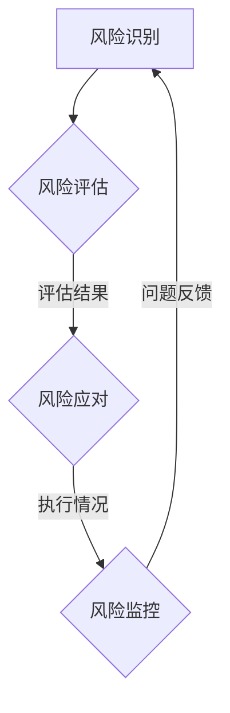

##### 1.1.3 供应链风险管理的关键角色和职责

在供应链风险管理中，不同角色承担着不同的职责：

1. **供应链经理**：负责制定供应链风险管理策略，协调各部门的供应链风险管理活动。
2. **风险管理团队**：负责风险识别、评估和应对工作，提供专业的风险管理建议。
3. **采购部门**：负责供应商选择、合同管理和采购流程中的风险管理。
4. **生产部门**：负责生产过程中的风险管理，确保生产计划的稳定和高效。
5. **物流部门**：负责物流过程中的风险管理，确保物流运输的顺畅和准时。
6. **财务部门**：负责资金流动的风险管理，确保财务状况的稳健和风险可控。

明确各角色的职责和权限，有助于提高供应链风险管理的效率和质量。

### 第一部分：供应链风险管理基础

#### 第2章：供应链风险识别与分析方法

供应链风险管理的第一步是风险识别，即识别供应链中可能存在的各种风险。有效的风险识别方法有助于全面了解供应链的风险状况，为后续的风险评估和应对提供基础。本章将介绍供应链风险识别与分析的方法。

##### 2.1.1 供应链风险的分类

供应链风险可以按不同的标准进行分类，常见的分类方法包括以下几种：

1. **按风险源分类**：
   - **自然风险**：如自然灾害、气候变化等。
   - **人为风险**：如员工错误、欺诈行为、供应链中断等。
   - **市场风险**：如市场需求波动、价格波动等。
   - **操作风险**：如生产故障、物流延误等。

2. **按风险影响分类**：
   - **战略风险**：影响企业的长期发展。
   - **运营风险**：影响日常运营的效率和质量。
   - **财务风险**：影响企业的资金流动和财务状况。

3. **按风险主体分类**：
   - **供应商风险**：如供应商质量不稳定、供应能力不足等。
   - **生产风险**：如生产设备故障、生产计划延误等。
   - **物流风险**：如物流延误、物流成本增加等。

##### 2.1.2 供应链风险识别的方法

有效的风险识别方法有助于全面了解供应链的风险状况，常见的风险识别方法包括以下几种：

1. **问卷调查法**：通过设计问卷，收集供应链各个环节的风险信息，从而识别潜在的风险。

2. **专家评审法**：邀请供应链管理专家进行评审，分析供应链中的潜在风险。

3. **数据挖掘法**：利用大数据分析技术，从历史数据中挖掘出潜在的风险。

4. **头脑风暴法**：组织相关部门和人员，通过讨论和交流，识别供应链中的潜在风险。

以下是一个利用问卷调查法识别供应链风险的示例：

**供应链风险识别问卷**

1. 您认为供应链中最突出的风险是什么？
   - 自然灾害
   - 人为错误
   - 市场需求波动
   - 生产故障

2. 您认为供应链中哪些环节最可能发生风险？
   - 采购环节
   - 生产环节
   - 物流环节
   - 财务环节

3. 您对供应链风险的应对措施有哪些？
   - 增加库存
   - 多元化供应商
   - 提高生产效率
   - 建立应急响应机制

通过问卷调查，可以收集到大量的风险信息，为后续的风险评估和应对提供依据。

##### 2.1.3 供应链风险评估的方法

风险识别后，需要对识别出的风险进行评估，以确定其可能造成的损失程度和发生概率。常见的风险评估方法包括以下几种：

1. **定性评估法**：
   - 专家评审法：通过专家的意见，对风险的影响程度和发生概率进行定性评估。
   - 故障树分析法：通过建立故障树模型，分析风险的可能原因和影响。

2. **定量评估法**：
   - 风险矩阵法：通过建立风险矩阵，对风险的影响程度和发生概率进行定量评估。
   - 模拟分析法：通过建立模拟模型，分析风险的可能影响和发生概率。

以下是一个利用风险矩阵法进行风险评估的示例：

**风险矩阵**

| 风险类别 | 影响程度 | 发生概率 | 风险等级 |
| :--: | :--: | :--: | :--: |
| 自然灾害 | 高 | 中 | 高 |
| 人为错误 | 中 | 高 | 中 |
| 市场需求波动 | 高 | 低 | 中 |
| 生产故障 | 中 | 高 | 中 |

通过风险矩阵，可以直观地了解供应链中的主要风险及其等级，为后续的风险应对提供依据。

### 第一部分：供应链风险管理基础

#### 第3章：供应链风险管理策略与措施

在了解了供应链风险的识别与分析方法后，接下来需要制定有效的供应链风险管理策略与措施。本章将介绍供应链风险预防、应对和缓解策略，以及在实际操作中可能采用的一些具体措施。

##### 3.1.1 供应链风险预防措施

供应链风险预防是风险管理的基础，目的是降低风险发生的概率和影响。以下是一些常见的供应链风险预防措施：

1. **建立多元化供应商体系**：避免对单一供应商过度依赖，通过多元化供应商体系，降低因供应商问题导致的供应链中断风险。

2. **制定严格的采购流程**：确保采购环节的规范和透明，避免因采购问题导致的供应链风险。

3. **建立应急响应机制**：制定应急预案，确保在风险发生时能够迅速响应和应对。

4. **加强供应链信息共享**：通过建立供应链信息共享平台，提高供应链各环节的信息透明度，降低信息不对称带来的风险。

5. **定期进行风险评估**：定期对供应链风险进行评估，及时发现潜在风险并采取预防措施。

6. **加强员工培训**：提高员工的风险意识和应对能力，减少人为错误导致的风险。

7. **优化供应链流程**：通过流程优化，提高供应链的效率和灵活性，降低风险发生的概率。

以下是一个供应链风险预防措施的Mermaid流程图：

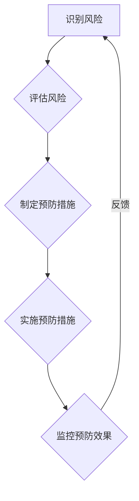

##### 3.1.2 供应链风险应对措施

在风险发生时，需要迅速采取应对措施，以降低风险的影响。以下是一些常见的供应链风险应对措施：

1. **风险转移**：通过购买保险、签订风险转移合同等方式，将风险转移给第三方。

2. **风险规避**：通过调整供应链策略，避免进入高风险领域。

3. **风险减轻**：通过采取技术手段和管理措施，降低风险的影响程度。

4. **风险接受**：对于无法避免或转移的风险，采取接受的态度，制定相应的应对策略。

5. **风险分散**：通过多元化供应链布局，降低单一供应链风险的影响。

6. **建立应急储备**：建立物资储备、资金储备等，以应对突发事件。

7. **加强与供应商的合作**：加强与供应商的合作，共同应对供应链风险。

8. **加强供应链监控**：通过实时监控，及时发现和处理风险。

以下是一个供应链风险应对措施的Mermaid流程图：

##### 3.1.3 供应链风险缓解策略

供应链风险缓解策略旨在降低风险发生的概率和影响。以下是一些常见的供应链风险缓解策略：

1. **供应链多元化**：通过多元化供应商、产品线和市场，降低供应链单一性带来的风险。

2. **供应链弹性管理**：提高供应链的灵活性，快速响应市场需求变化。

3. **供应链协同**：加强与供应链各环节的协同，提高供应链的整体效率。

4. **供应链智能化升级**：利用大数据、人工智能等新技术，提高供应链的智能化水平。

5. **供应链数字化转型**：通过数字化转型，提高供应链的效率和透明度。

6. **供应链绿色管理**：注重环保，降低供应链对环境的影响。

7. **供应链金融创新**：通过供应链金融创新，降低供应链成本，提高供应链效率。

以下是一个供应链风险缓解策略的Mermaid流程图：

通过以上供应链风险管理策略与措施，可以有效降低供应链风险，提高供应链的稳定性和可靠性，为企业的长期发展提供保障。

### 第二部分：电商供应链风险管理实践

#### 第4章：电商供应链风险管理的特点与挑战

电商供应链具有独特的特点和挑战，这决定了其风险管理方法与传统供应链有所不同。本章将分析电商供应链的特点和面临的挑战，以期为电商供应链风险管理提供理论基础和实践指导。

##### 4.1.1 电商供应链的特点

1. **高度数字化**：电商供应链依赖于电子商务平台和信息系统，从采购、生产到物流和客户服务，各个环节都高度数字化。

2. **跨地域性**：电商企业往往涉及全球范围内的供应链，这增加了物流、货币兑换、法规遵守等方面的复杂性。

3. **动态性**：电商供应链的订单和库存变化非常快，需求波动大，库存管理难度高。

4. **透明度高**：电商平台的交易和物流信息对消费者透明，消费者对供应链的任何延误或问题都非常敏感。

5. **信息不对称**：供应商和电商平台之间可能存在信息不对称，这可能导致供应链管理上的盲点。

##### 4.1.2 电商供应链风险管理面临的挑战

1. **物流风险**：电商供应链的物流环节复杂，涉及多个环节和多个物流公司，物流延误、运输错误等问题频发。

2. **供应链中断**：由于自然灾害、社会动荡等原因，电商供应链可能面临中断风险。

3. **库存管理**：电商库存管理难度大，库存过多可能导致资金占用，库存不足则可能错失销售机会。

4. **数据安全**：电商交易涉及大量敏感数据，数据泄露和黑客攻击风险高。

5. **合规性**：电商企业需遵守各国法律法规，跨国交易的合规性要求更高。

6. **市场波动**：市场需求变化快，电商供应链难以预测和应对市场波动带来的风险。

#### 第5章：电商供应链风险识别与评估

有效识别和评估电商供应链风险是进行风险管理的基础。本章将详细介绍电商供应链风险识别和评估的方法、步骤以及风险评级体系。

##### 5.1.1 电商供应链风险识别的方法

1. **问卷调查法**：通过设计问卷，收集供应链各个环节的风险信息，识别潜在风险。

2. **专家评审法**：邀请供应链管理专家进行评审，分析供应链中的潜在风险。

3. **SWOT分析法**：通过分析供应链的优劣势、机会和威胁，识别潜在风险。

4. **流程图分析法**：通过绘制供应链流程图，识别各个环节可能存在的风险点。

5. **历史数据分析**：通过对历史数据的分析，识别出可能存在的风险模式。

以下是一个基于问卷调查法识别电商供应链风险的示例：

**电商供应链风险识别问卷**

1. 您认为电商供应链中最突出的风险是什么？
   - 物流延误
   - 供应链中断
   - 数据安全
   - 市场需求波动

2. 您认为电商供应链中哪些环节最可能发生风险？
   - 采购环节
   - 生产环节
   - 物流环节
   - 客户服务环节

3. 您对电商供应链风险的应对措施有哪些？
   - 建立应急响应机制
   - 增加库存
   - 加强供应链信息共享
   - 提高生产效率

通过问卷调查，可以收集到大量的风险信息，为后续的风险评估和应对提供依据。

##### 5.1.2 电商供应链风险评估的步骤

1. **风险识别**：通过问卷调查、专家评审等方法，识别出供应链中可能存在的风险。

2. **风险分类**：根据风险的性质和影响程度，对识别出的风险进行分类。

3. **风险量化**：对识别出的风险进行量化，评估其可能造成的损失程度和发生概率。

4. **风险评估**：根据量化结果，对风险进行评估，确定其等级。

5. **风险评级**：建立风险评级体系，将风险分为不同的等级，以便采取相应的风险管理措施。

以下是一个基于风险矩阵法进行电商供应链风险评估的步骤：

1. **识别风险**：通过问卷调查和专家评审，识别出供应链中可能存在的风险。

2. **分类风险**：将风险分为供应链中断、物流风险、库存风险、数据安全风险等类别。

3. **量化风险**：根据风险的影响程度和发生概率，为每个风险打分。

4. **评估风险**：建立风险矩阵，根据打分结果，评估每个风险的风险等级。

5. **评级风险**：将风险分为高、中、低三个等级，以便采取相应的风险管理措施。

##### 5.1.3 电商供应链风险评级体系

电商供应链风险评级体系是评估和管理供应链风险的重要工具。以下是一个简化的电商供应链风险评级体系：

| 风险等级 | 影响程度 | 发生概率 | 风险等级 |
| :--: | :--: | :--: | :--: |
| 高 | 高 | 高 | 高 |
| 中 | 中 | 中 | 中 |
| 低 | 低 | 低 | 低 |

通过建立风险评级体系，可以直观地了解供应链中的主要风险及其等级，为后续的风险应对提供依据。

### 第二部分：电商供应链风险管理实践

#### 第6章：电商供应链风险控制策略

在识别和评估电商供应链风险后，下一步是制定和实施风险控制策略，以降低风险发生的概率和影响。本章将介绍电商供应链中断风险、延迟风险和成本风险的识别与控制策略。

##### 6.1.1 供应链中断风险控制策略

供应链中断风险是指由于各种原因导致供应链无法正常运作，从而影响企业的生产和销售。以下是一些常见的供应链中断风险控制策略：

1. **多元化供应商策略**：避免对单一供应商的过度依赖，通过引入多个供应商，分散供应链风险。

2. **建立应急响应机制**：制定应急预案，确保在供应链中断时能够迅速响应和应对。

3. **建立备用供应链**：在关键环节建立备用供应链，以备不时之需。

4. **加强供应链协同**：提高供应链各环节的协同性，确保信息共享和资源调配的顺畅。

5. **供应链保险**：购买供应链保险，将风险转移给保险公司。

6. **供应链可视化**：通过建立供应链可视化系统，实时监控供应链运行状况，及时发现和解决问题。

以下是一个供应链中断风险控制策略的Mermaid流程图：

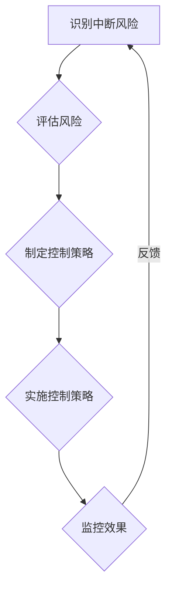

##### 6.1.2 供应链延迟风险控制策略

供应链延迟风险是指由于各种原因导致供应链延迟，从而影响订单交付和客户满意度。以下是一些常见的供应链延迟风险控制策略：

1. **优化物流流程**：通过优化物流流程，提高物流效率，减少延迟风险。

2. **实时监控与预警**：通过建立实时监控和预警系统，及时发现和处理延迟问题。

3. **提前交付**：在确保质量的前提下，提前交付订单，减少延迟风险。

4. **与供应商紧密合作**：加强与供应商的合作，共同应对延迟风险。

5. **库存管理优化**：通过优化库存管理，确保库存水平的合理性，减少延迟风险。

6. **多渠道交付**：建立多渠道交付系统，确保订单能够及时交付。

以下是一个供应链延迟风险控制策略的Mermaid流程图：

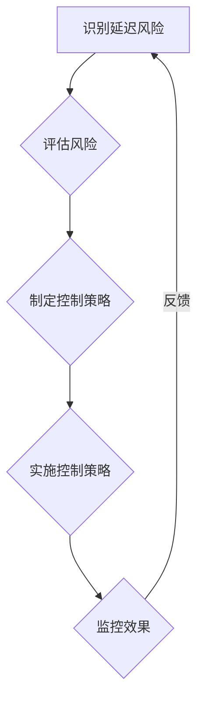

##### 6.1.3 供应链成本风险控制策略

供应链成本风险是指由于供应链运营和管理问题导致的成本增加。以下是一些常见的供应链成本风险控制策略：

1. **成本分析**：对供应链各环节进行成本分析，找出成本过高的环节。

2. **成本控制**：通过制定成本控制措施，降低供应链成本。

3. **采购优化**：通过优化采购流程，降低采购成本。

4. **物流优化**：通过优化物流流程，降低物流成本。

5. **库存管理优化**：通过优化库存管理，降低库存成本。

6. **供应链金融**：通过供应链金融手段，降低供应链成本。

7. **技术升级**：通过技术升级，提高供应链运营效率，降低成本。

以下是一个供应链成本风险控制策略的Mermaid流程图：

通过以上供应链风险控制策略，可以有效降低电商供应链的风险，提高供应链的稳定性和可靠性，从而提升电商平台的运营效率和客户满意度。

### 第二部分：电商供应链风险管理实践

#### 第7章：电商供应链风险管理案例分析

为了更好地理解电商供应链风险管理在实际操作中的应用，本章将通过具体案例进行分析，展示风险管理措施及其效果，并总结案例中的启示与经验。

##### 7.1.1 案例背景与分析

案例公司是一家全球知名的电商平台，其业务涵盖了服装、电子产品、家居用品等多个领域。随着公司业务的不断扩大，供应链管理的复杂性也日益增加。某次，由于供应链中某个供应商出现问题，导致公司多个订单无法按时交付，客户满意度急剧下降，公司声誉受损。为此，公司决定对此次供应链中断事件进行深入分析，并采取有效的风险管理措施。

1. **问题原因分析**：
   - 供应商质量不稳定：供应商生产的产品质量出现问题，导致生产延误。
   - 供应链信息不畅：供应商与电商平台之间的信息沟通不畅，导致问题无法及时发现和解决。
   - 采购流程不完善：采购环节存在一定的漏洞，导致供应商选择不当。

2. **影响评估**：
   - 客户满意度下降：订单延迟交付导致客户体验不佳，客户投诉率上升。
   - 市场竞争力下降：竞争对手趁机抢占市场份额，公司业务受到影响。
   - 财务损失：库存积压、销售减少，导致公司财务状况受到影响。

##### 7.1.2 风险管理措施及效果评估

针对上述问题，公司采取了一系列风险管理措施，并进行了效果评估：

1. **优化供应商选择**：
   - 建立严格的供应商评估体系，通过多维度评估供应商的资质和信誉。
   - 与优质供应商建立长期合作关系，避免对单一供应商过度依赖。
   - 定期对供应商进行质量审核，确保供应商持续满足质量要求。

2. **加强供应链信息共享**：
   - 建立供应链信息共享平台，确保供应链各环节的信息透明和实时更新。
   - 定期召开供应链会议，加强供应链各环节的沟通和协作。
   - 推广电子化采购和物流管理，提高信息传递效率。

3. **完善采购流程**：
   - 制定详细的采购流程和标准操作程序，确保采购环节的规范和透明。
   - 加强采购人员的培训，提高采购决策的准确性和专业性。
   - 建立采购绩效考核机制，激励采购人员提高采购效率和质量。

4. **建立应急响应机制**：
   - 制定应急预案，确保在供应链中断时能够迅速响应和应对。
   - 建立备用供应链，确保关键物资的供应。
   - 定期进行应急演练，提高员工的应急处理能力。

5. **优化库存管理**：
   - 实施科学的库存管理策略，确保库存水平的合理性和流动性。
   - 采用先进的库存管理系统，提高库存管理的准确性和实时性。
   - 建立库存预警机制，提前发现库存积压或不足的问题。

经过一段时间的实施，上述措施取得了显著的成效：

- 客户满意度得到显著提升，订单延迟交付问题基本解决。
- 供应链各环节的信息透明度提高，沟通和协作更加顺畅。
- 采购流程的规范性和透明度增强，采购效率和质量得到提高。
- 供应链中断事件的发生频率和影响程度显著降低。
- 库存管理水平提高，库存积压和不足的问题得到有效控制。

##### 7.1.3 案例启示与经验总结

通过本案例，我们可以得到以下启示与经验：

1. **重视供应商管理**：供应商是供应链的重要组成部分，有效的供应商管理能够降低供应链风险。企业应建立严格的供应商评估体系，确保供应商的质量和信誉。

2. **加强信息共享**：供应链信息共享是提高供应链协同性和响应速度的关键。企业应建立供应链信息共享平台，确保供应链各环节的信息透明和实时更新。

3. **优化采购流程**：采购流程的规范和透明对于降低采购风险和提高采购效率至关重要。企业应制定详细的采购流程和标准操作程序，并加强采购人员的培训。

4. **建立应急响应机制**：供应链中断事件不可避免，但通过建立应急响应机制，可以降低事件的影响程度。企业应制定应急预案，建立备用供应链，并定期进行应急演练。

5. **优化库存管理**：科学的库存管理策略能够降低库存成本和风险。企业应实施科学的库存管理策略，采用先进的库存管理系统，并建立库存预警机制。

总之，电商供应链风险管理是一个系统性、持续性的过程。通过本案例的分析，我们可以看到，有效的风险管理措施能够显著降低供应链风险，提高企业的运营效率和客户满意度。企业应结合自身实际情况，不断优化和完善供应链风险管理措施，以应对不断变化的市场环境和挑战。

### 第三部分：提升电商供应链稳定性的策略与实践

#### 第8章：提升供应链稳定性的策略

提升电商供应链稳定性是确保企业长期发展的关键。本章将介绍提升供应链稳定性的策略，包括供应链协同与信息共享、供应链弹性管理、供应链智能化升级等方面。

##### 8.1.1 供应链协同与信息共享策略

供应链协同与信息共享是提升供应链稳定性的基础。通过实现供应链各环节的信息透明和实时更新，可以有效降低信息不对称，提高供应链的整体效率。

1. **建立供应链信息共享平台**：通过建立供应链信息共享平台，实现供应链上下游企业之间的信息共享，提高信息传递效率。

2. **实时监控与预警系统**：建立实时监控与预警系统，对供应链运行状况进行实时监控，及时发现潜在问题并预警。

3. **协同规划与决策**：通过供应链协同规划与决策，实现供应链各环节的协同，提高供应链的整体运作效率。

4. **标准化数据接口**：建立统一的数据接口标准，确保供应链各环节的数据兼容性和一致性。

以下是一个供应链协同与信息共享策略的Mermaid流程图：

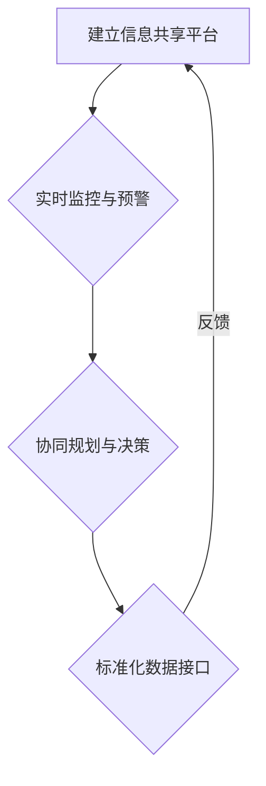

##### 8.1.2 供应链弹性管理策略

供应链弹性管理是提升供应链稳定性的重要策略。通过提高供应链的灵活性和适应性，可以有效应对市场需求波动和供应链中断风险。

1. **多元化供应商策略**：通过引入多个供应商，降低对单一供应商的依赖，提高供应链的弹性。

2. **建立备用供应链**：在关键环节建立备用供应链，确保在主供应链出现问题时，可以迅速切换到备用供应链。

3. **提高供应链透明度**：通过提高供应链透明度，实时了解供应链各环节的运行状况，提高供应链的响应速度。

4. **优化库存管理**：通过科学的库存管理策略，确保库存水平的合理性和流动性，提高供应链的弹性。

以下是一个供应链弹性管理策略的Mermaid流程图：

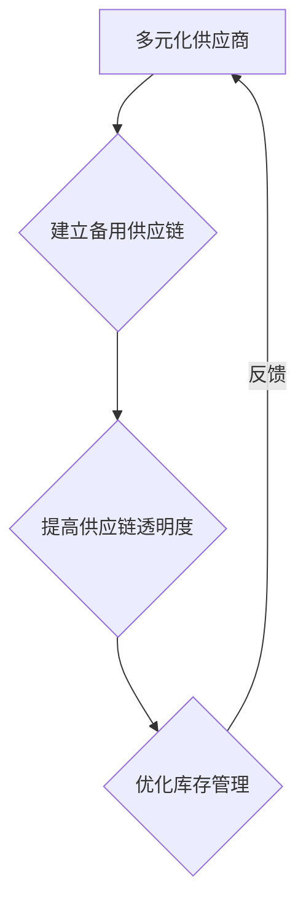

##### 8.1.3 供应链智能化升级策略

供应链智能化升级是提升供应链稳定性的重要手段。通过引入大数据、人工智能等先进技术，可以提高供应链的智能化水平，提高供应链的效率和稳定性。

1. **大数据分析**：通过大数据分析，实时了解供应链的运行状况，预测市场需求，优化供应链规划。

2. **人工智能应用**：通过人工智能技术，实现供应链的自动化和智能化，提高供应链的响应速度和准确性。

3. **物联网技术**：通过物联网技术，实现供应链各环节的实时监控和远程管理，提高供应链的透明度和协同性。

4. **区块链技术**：通过区块链技术，实现供应链信息的不可篡改和透明，提高供应链的可信度和安全性。

以下是一个供应链智能化升级策略的Mermaid流程图：

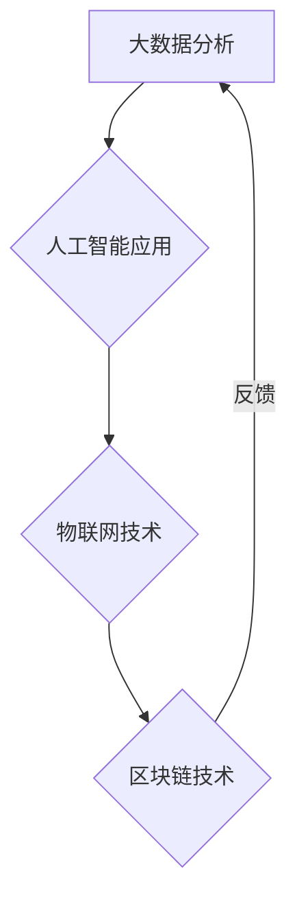

通过以上供应链稳定性的提升策略，可以有效降低供应链风险，提高供应链的稳定性和可靠性，从而提升电商平台的运营效率和客户满意度。

### 第三部分：提升电商供应链稳定性的策略与实践

#### 第9章：供应链管理创新实践

在电商供应链管理中，创新实践是提升供应链稳定性和效率的重要手段。本章将介绍供应链管理中的创新实践，包括供应链金融创新、供应链绿色管理实践以及供应链数字化转型实践。

##### 9.1.1 供应链金融创新

供应链金融创新是提升供应链稳定性的有效手段，通过金融手段为供应链上的企业提供融资支持，降低融资成本，提高资金利用效率。

1. **应收账款融资**：企业可以通过应收账款融资，将未到期的应收账款转化为即时资金，缓解资金压力。

2. **订单融资**：企业可以通过订单融资，以订单作为担保，获得金融机构的贷款支持，加快资金流转。

3. **供应链保理**：企业可以通过供应链保理，将应收账款转让给金融机构，获得即时的融资。

4. **供应链融资平台**：建立供应链融资平台，整合金融机构和企业资源，提供一站式供应链金融服务。

以下是一个供应链金融创新实践的Mermaid流程图：

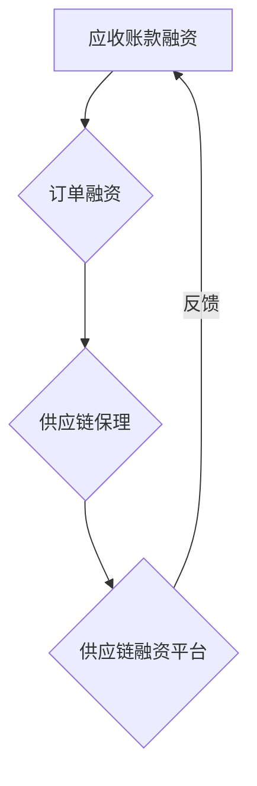

##### 9.1.2 供应链绿色管理实践

随着可持续发展理念的普及，供应链绿色管理成为企业提升竞争力的重要方向。通过绿色管理实践，企业可以实现环保目标，降低运营成本，提高企业形象。

1. **绿色采购**：优先采购环保材料和产品，减少供应链对环境的影响。

2. **节能减排**：通过采用节能技术和设备，降低能源消耗和碳排放。

3. **循环利用**：推动供应链各环节的废弃物循环利用，减少废弃物排放。

4. **绿色物流**：优化物流路线和运输方式，降低物流过程中的碳排放。

以下是一个供应链绿色管理实践的Mermaid流程图：

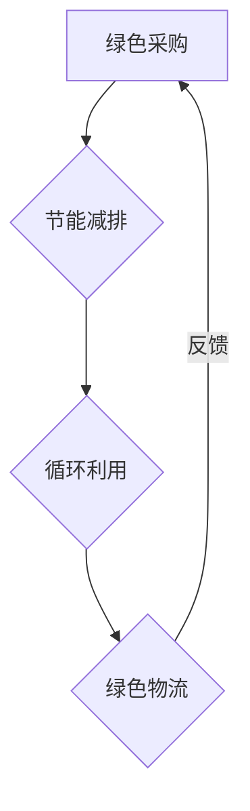

##### 9.1.3 供应链数字化转型实践

数字化转型是提升供应链管理效率和稳定性的关键。通过引入新技术和数字化工具，企业可以实现供应链的智能化、自动化和精细化。

1. **大数据应用**：通过大数据分析，实现供应链预测、优化和决策。

2. **人工智能应用**：利用人工智能技术，实现供应链的自动化和智能化管理。

3. **物联网应用**：通过物联网技术，实现供应链各环节的实时监控和远程管理。

4. **区块链应用**：通过区块链技术，实现供应链信息的透明、安全和管理。

以下是一个供应链数字化转型实践的Mermaid流程图：

通过以上供应链管理创新实践，企业可以提升供应链的稳定性、效率和竞争力，为电商业务的长期发展提供有力支持。

### 第三部分：提升电商供应链稳定性的策略与实践

#### 第10章：电商供应链全链路优化

电商供应链的全链路优化是提升供应链稳定性和效率的关键。本章将详细介绍电商供应链库存优化、运输优化和仓储优化的策略与实践。

##### 10.1.1 供应链库存优化

库存优化是电商供应链管理中的重要环节，通过科学的库存管理策略，可以降低库存成本，提高资金利用效率。

1. **需求预测**：利用大数据和人工智能技术，对市场需求进行准确预测，制定合理的库存计划。

2. **库存模型**：建立科学的库存模型，如ABC分析法、EOQ模型等，优化库存水平和库存结构。

3. **动态库存管理**：通过实时监控库存情况，动态调整库存水平，确保库存与市场需求匹配。

4. **供应链协同**：与供应商和客户建立紧密的协同关系，实现库存信息的共享和实时更新。

以下是一个供应链库存优化策略的Mermaid流程图：

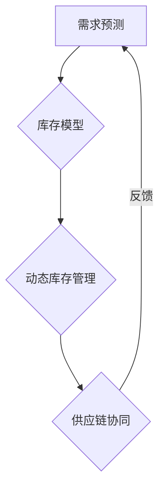

##### 10.1.2 供应链运输优化

运输优化是提高供应链效率的重要手段，通过优化运输路线、运输方式和运输工具，可以降低运输成本，提高运输效率。

1. **运输路线优化**：利用路径规划算法，设计最优的运输路线，减少运输时间和成本。

2. **运输方式优化**：根据货物的性质和运输距离，选择最合适的运输方式，如公路、铁路、航空等。

3. **运输工具优化**：采用先进的运输工具和技术，如智能货车、自动驾驶技术等，提高运输效率和安全性。

4. **运输计划优化**：通过科学的运输计划，合理安排运输任务，提高运输资源利用率。

以下是一个供应链运输优化策略的Mermaid流程图：

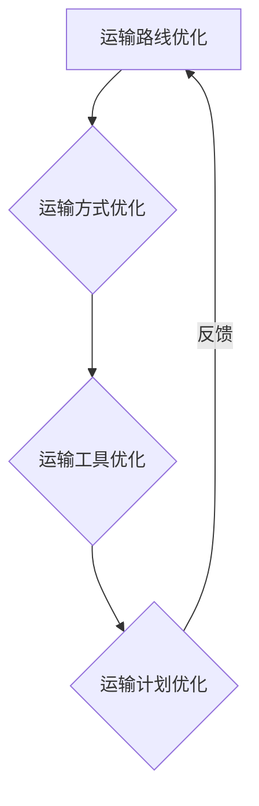

##### 10.1.3 供应链仓储优化

仓储优化是提升供应链效率和降低成本的关键，通过优化仓储布局、仓储管理和仓储技术，可以提高仓储效率和服务质量。

1. **仓储布局优化**：根据货物的存储需求和作业效率，设计合理的仓储布局，提高仓储空间的利用率。

2. **仓储管理优化**：采用先进的仓储管理系统，实现仓储作业的自动化和智能化，提高仓储效率。

3. **仓储技术优化**：引入仓储机器人、自动化设备等技术，提高仓储作业的效率和准确性。

4. **供应链协同**：与供应链上下游企业建立紧密的协同关系，实现仓储信息的共享和实时更新。

以下是一个供应链仓储优化策略的Mermaid流程图：

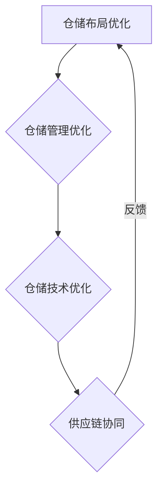

通过以上供应链全链路优化策略，企业可以显著提高供应链的稳定性、效率和竞争力，为电商业务的长期发展提供有力支持。

### 第三部分：提升电商供应链稳定性的策略与实践

#### 第11章：供应链管理中的可持续性与社会责任

在当今全球化的商业环境中，供应链管理不仅关注效率和成本，还越来越注重可持续性和社会责任。可持续性和社会责任在供应链管理中的重要性日益凸显，它们不仅影响企业的长期竞争力，也关系到社会和环境的健康与和谐。本章将探讨供应链管理的可持续性、社会责任以及可持续供应链实践。

##### 11.1.1 供应链管理的可持续性

供应链管理的可持续性指的是企业在供应链的各个环节中，通过采取环保、节能、减废等措施，实现经济效益、社会效益和环境效益的协调统一。以下是供应链管理可持续性的几个关键方面：

1. **环境保护**：通过减少资源消耗、减少废弃物排放、使用环保材料等手段，降低供应链对环境的影响。

2. **资源利用**：提高资源的利用效率，通过优化产品设计、生产流程和物流管理，减少资源浪费。

3. **能源效率**：采用节能技术和设备，提高能源使用效率，减少能源消耗。

4. **社会责任**：关注供应链各环节员工的权益保护，推动公平、公正和透明的供应链管理。

以下是一个供应链管理可持续性的Mermaid流程图：

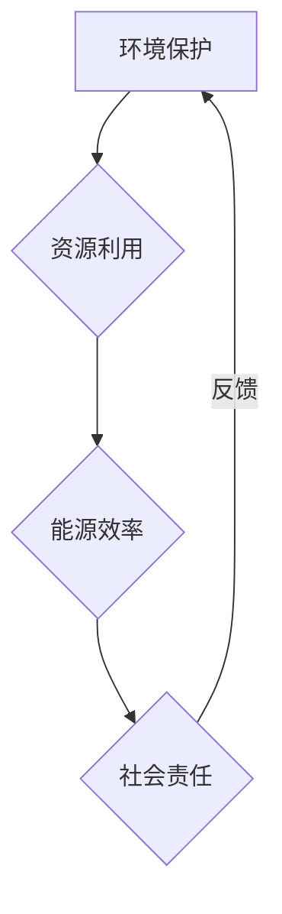

##### 11.1.2 供应链中的社会责任

供应链中的社会责任（Supply Chain Social Responsibility，简称SCSR）指的是企业在供应链管理中，遵守法律和道德规范，尊重和保护供应链各环节人员的权益，推动社会和谐与发展的责任。以下是供应链中的社会责任的关键方面：

1. **员工权益**：保障员工的劳动权益，包括合理的工作时间、合理的薪酬、健康安全的工作环境等。

2. **供应链透明度**：提高供应链的透明度，确保供应链各环节的运营活动公开、公正、透明。

3. **社区参与**：积极参与社区活动，支持社区的发展，为当地社区带来实际利益。

4. **合规性**：遵守各国法律法规，确保供应链运营的合规性。

以下是一个供应链中的社会责任的Mermaid流程图：

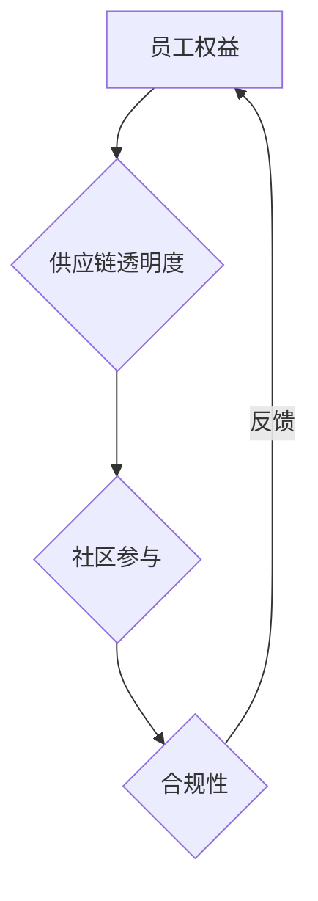

##### 11.1.3 可持续供应链实践案例分析

为了更好地理解可持续供应链实践的重要性，以下是一个具体的案例分析：

**案例：某大型电商企业的可持续供应链实践**

某大型电商平台在供应链管理中，实施了多项可持续性和社会责任措施，取得了显著成效：

1. **环保包装**：该电商平台推出环保包装政策，使用可降解、可循环利用的包装材料，减少塑料包装的使用，降低对环境的影响。

2. **绿色物流**：与物流合作伙伴合作，推广绿色物流模式，如采用电动车辆、优化物流路线等，减少碳排放。

3. **员工培训**：为供应链各环节的员工提供培训，提高他们的环保意识和技能，确保环保措施得到有效执行。

4. **供应链透明**：建立供应链透明平台，向公众公开供应链信息，包括环保、节能等数据，提高供应链的透明度和公信力。

5. **社会责任基金**：设立社会责任基金，用于支持社区发展、环保项目等，推动供应链的可持续发展。

通过实施这些可持续性和社会责任措施，该电商平台不仅提升了企业形象，也实现了供应链的绿色化和可持续发展，为行业的可持续发展树立了榜样。

**案例启示**：

- **可持续性和社会责任是供应链管理的重要组成部分**，企业应将其纳入供应链战略和日常运营中。
- **实施可持续性和社会责任措施，不仅有利于环境保护和社会和谐，也能提升企业的竞争力和品牌价值**。
- **通过建立供应链透明平台，可以提高供应链的透明度和公信力，增强企业与供应链各环节的信任**。

总之，可持续性和社会责任在供应链管理中的重要性日益凸显，企业应积极采取行动，推动供应链的可持续发展，实现经济、社会和环境的协调统一。

### 附录A：供应链风险管理常用工具与资源

为了帮助供应链管理人员更好地进行风险管理，以下列出了一些常用的供应链风险管理工具和资源。

#### A.1 供应链风险管理软件

1. **Gartner**：提供供应链风险管理软件的市场分析和评估报告。
2. **KION**：提供供应链风险管理解决方案，包括供应链可视化、风险分析和决策支持。
3. **Celonis**：提供供应链自动化和风险管理解决方案，通过人工智能和大数据分析优化供应链。
4. **INFOR**：提供供应链风险管理软件，包括供应链风险分析、合规性和财务管理。

#### A.2 供应链风险管理文献资料

1. **《供应链风险管理》**：该书籍详细介绍了供应链风险管理的概念、框架和实施方法。
2. **《供应链风险管理实践》**：该书提供了大量供应链风险管理案例，分享了最佳实践和经验。
3. **《供应链风险管理指南》**：由国际供应链管理协会（CSCMP）编写，提供了供应链风险管理的基本原则和步骤。

#### A.3 供应链风险管理在线资源

1. **ISM（美国供应链管理协会）**：提供供应链风险管理的相关资料、案例研究和在线课程。
2. **APICS**：提供供应链风险管理资源，包括研究报告、白皮书和在线学习课程。
3. **SCM World**：提供供应链风险管理动态、博客和行业报告。
4. **LinkedIn Learning**：提供供应链风险管理相关的在线培训课程。

通过利用这些工具和资源，供应链管理人员可以更有效地识别、评估和控制供应链风险，提升供应链的稳定性和可靠性。

### 总结

本文从供应链风险管理的核心概念与架构、风险识别与分析方法、风险管理策略与措施，到电商供应链风险管理的特点与挑战、识别与评估、风险控制策略，以及提升电商供应链稳定性的策略与实践，全面系统地探讨了供应链风险管理在电商领域的重要性。同时，通过案例分析、创新实践和供应链全链路优化，展示了如何在实际操作中有效实施供应链风险管理。

供应链风险管理不仅关乎企业的运营效率，更影响到企业的长期发展。随着电商行业的快速发展，供应链的复杂性和不确定性也在增加，因此，有效的供应链风险管理显得尤为重要。本文提供的策略和实践，有助于电商企业提高供应链稳定性，降低风险，提升客户满意度，实现可持续发展。

然而，供应链风险管理是一个动态的过程，需要企业持续关注市场变化、技术进步和法规更新，不断优化和完善风险管理措施。未来，随着人工智能、大数据和区块链等新技术的应用，供应链风险管理将更加智能化、精准化，为企业提供更有效的风险管理工具和方法。

最后，感谢读者对本文的阅读。我们希望本文能为您提供有价值的参考，助力您的企业在供应链风险管理方面取得更好的成果。如果您有任何建议或意见，欢迎在评论区留言，我们将会认真听取并持续改进。

### 作者信息

作者：AI天才研究院/AI Genius Institute & 禅与计算机程序设计艺术 /Zen And The Art of Computer Programming

联系方式：[联系邮箱](mailto:contact@ai-genius-institute.com)

版权声明：本文版权归AI天才研究院所有，未经授权不得转载或使用。如需转载，请联系授权。本文内容仅供参考，不构成具体投资建议。AI天才研究院对本文内容保留最终解释权。

