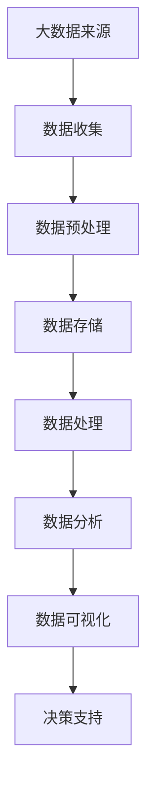
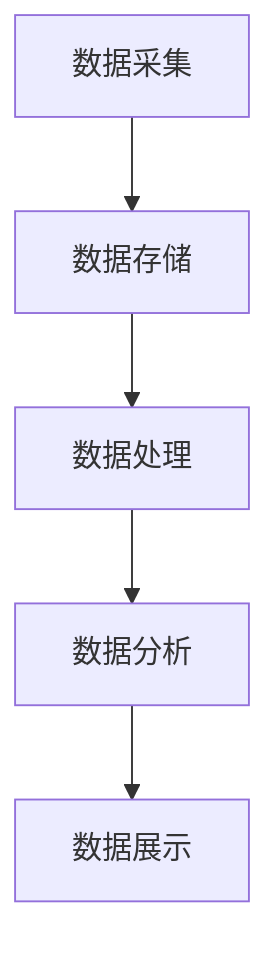
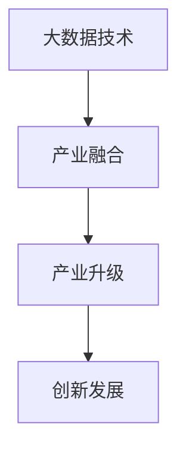

                 

# 《信息差的价值创造：大数据如何提升企业价值》

> **关键词：**大数据、信息差、企业价值、市场营销、供应链管理、风险管理、大数据技术、安全与隐私保护、大数据治理、大数据伦理与社会责任。

> **摘要：**本文旨在探讨大数据在信息差中的价值创造作用。通过深入分析大数据与信息差的关系，阐述大数据在市场营销、供应链管理、风险管理等领域的应用，以及大数据技术实现与信息差优化的策略。同时，本文还将讨论大数据安全与隐私保护、大数据治理与合规以及大数据伦理与社会责任问题。最后，本文将对大数据发展趋势与未来进行展望，并推荐相关资源和实战案例，以帮助读者更好地理解和应用大数据技术，提升企业价值。

## 第一部分：大数据与信息差概述

### 第1章：大数据与信息差基础

#### 1.1 大数据的定义与价值

大数据（Big Data）是指无法用传统数据库管理工具在一定时间内进行处理的数据集合。它具有“4V”特点，即Volume（数据量巨大）、Velocity（数据处理速度快）、Variety（数据类型多样）和Veracity（数据真实性高）。大数据的价值体现在其能够为企业提供深度的洞见和决策支持，帮助企业优化业务流程、降低成本、提高竞争力。

**Mermaid 流程图：**



#### 1.2 信息差的产生与意义

信息差（Information Gap）是指信息在不同个体或群体之间的不对称性。在商业环境中，信息差通常表现为企业内部或不同企业之间的信息不对称。信息差的产生主要源于数据的收集、处理、存储和分析能力的差异。信息差的意义在于，拥有信息优势的企业能够更快地做出决策，抢占市场先机，创造更大的价值。

**伪代码：**

```python
def information_gap(data1, data2):
    # 数据对比
    compare_data(data1, data2)
    # 发现差异
    differences = find_differences(data1, data2)
    # 评估差异价值
    value = evaluate_differences(differences)
    return value
```

#### 1.3 大数据与信息差的关系

大数据与信息差之间存在着密切的关系。大数据技术能够有效地收集、存储、处理和分析海量数据，从而缩小信息差。通过大数据技术，企业可以实时监控市场动态，洞察消费者需求，优化业务流程，提升竞争力。大数据技术使得信息差成为企业创造价值的重要手段。

**数学模型：**

$$
\text{企业价值} = f(\text{信息差}, \text{大数据技术})
$$

## 第二部分：大数据应用与信息差创造

### 第3章：大数据在市场营销中的应用

#### 3.1 数据驱动的市场研究

数据驱动的市场研究利用大数据技术收集和分析市场数据，为企业提供精准的市场洞察。通过市场研究，企业可以了解消费者需求、市场趋势和竞争对手情况，从而制定更有效的市场营销策略。

**伪代码：**

```python
def market_research(data):
    # 数据收集
    collect_data(data)
    # 数据分析
    analyze_data(data)
    # 提取洞察
    insights = extract_insights(data)
    return insights
```

#### 3.2 客户细分与个性化营销

大数据技术可以帮助企业对客户进行细分，识别出不同客户群体的特点和需求。通过个性化营销，企业可以提供更符合客户需求的产品和服务，提高客户满意度和忠诚度。

**伪代码：**

```python
def customer_segmentation(data):
    # 数据收集
    collect_data(data)
    # 数据分析
    analyze_data(data)
    # 客户细分
    segments = segment_customers(data)
    # 个性化营销
    personalize_marketing(segments)
```

#### 3.3 大数据与品牌价值提升

大数据技术可以帮助企业了解品牌在消费者心中的形象和口碑，从而制定更有效的品牌传播策略。通过大数据分析，企业可以提升品牌价值，增强市场竞争力。

**伪代码：**

```python
def brand_value_evaluation(data):
    # 数据收集
    collect_data(data)
    # 数据分析
    analyze_data(data)
    # 品牌价值评估
    brand_value = evaluate_brand_value(data)
    return brand_value
```

### 第4章：大数据在供应链管理中的应用

#### 4.1 供应链数据采集与处理

大数据技术可以帮助企业实时采集供应链各个环节的数据，包括采购、生产、物流等。通过对数据的处理和分析，企业可以优化供应链流程，提高运营效率。

**伪代码：**

```python
def supply_chain_data_processing(data):
    # 数据收集
    collect_data(data)
    # 数据处理
    process_data(data)
    # 数据分析
    analyze_data(data)
    # 供应链优化
    optimize_supply_chain(data)
```

#### 4.2 供应链优化与成本控制

大数据技术可以帮助企业分析供应链中的瓶颈和风险，从而进行优化和调整。通过大数据分析，企业可以实现精准的库存管理和成本控制，降低运营成本。

**伪代码：**

```python
def supply_chain_optimization(data):
    # 数据收集
    collect_data(data)
    # 数据分析
    analyze_data(data)
    # 瓶颈分析
    bottlenecks = analyze_bottlenecks(data)
    # 供应链优化
    optimize_supply_chain(data, bottlenecks)
```

#### 4.3 大数据与供应链金融

大数据技术可以帮助企业分析和预测供应链中的金融风险，提供更准确的信用评估和风险控制。通过大数据分析，企业可以实现供应链金融的优化，提高融资效率和降低融资成本。

**伪代码：**

```python
def supply_chain_financial_analysis(data):
    # 数据收集
    collect_data(data)
    # 数据分析
    analyze_data(data)
    # 风险预测
    predict_risk(data)
    # 供应链金融优化
    optimize_supply_chain_financing(data)
```

### 第5章：大数据在风险管理中的应用

#### 5.1 风险数据的采集与分析

大数据技术可以帮助企业实时采集风险数据，包括市场风险、运营风险等。通过对数据的分析，企业可以识别风险隐患，制定风险管理策略。

**伪代码：**

```python
def risk_data_collection_analysis(data):
    # 数据收集
    collect_data(data)
    # 数据分析
    analyze_data(data)
    # 风险识别
    identify_risks(data)
    # 风险评估
    assess_risks(data)
```

#### 5.2 风险评估与预警

大数据技术可以帮助企业建立风险评估模型，实现风险的定量评估和预警。通过实时监控风险数据，企业可以及时采取应对措施，降低风险损失。

**伪代码：**

```python
def risk_evaluation_warning(data):
    # 数据收集
    collect_data(data)
    # 数据分析
    analyze_data(data)
    # 风险评估
    evaluate_risks(data)
    # 预警
    generate_warnings(data)
```

#### 5.3 大数据在保险业的应用

大数据技术可以帮助保险公司优化产品定价、风险评估和客户服务。通过大数据分析，保险公司可以实现个性化的产品设计和精准的风险控制，提高保险业务的价值。

**伪代码：**

```python
def insurance_application(data):
    # 数据收集
    collect_data(data)
    # 数据分析
    analyze_data(data)
    # 产品定价
    price_products(data)
    # 风险评估
    assess_risks(data)
    # 客户服务
    provide_services(data)
```

## 第三部分：大数据技术实现与信息差优化

### 第6章：大数据平台搭建与优化

#### 6.1 大数据平台架构设计

大数据平台架构设计包括数据采集、存储、处理、分析和展示等环节。通过合理的架构设计，企业可以实现大数据的高效处理和利用。

**Mermaid 流程图：**



#### 6.2 数据仓库与数据湖构建

数据仓库和数据湖是大数据平台的核心组成部分。数据仓库用于存储结构化数据，支持高效的数据查询和分析；数据湖用于存储大量非结构化数据，支持灵活的数据处理和分析。

**伪代码：**

```python
def build_data_warehouse(data):
    # 数据清洗
    clean_data(data)
    # 数据存储
    store_data(data)
    # 数据查询
    query_data(data)

def build_data_lake(data):
    # 数据存储
    store_data(data)
    # 数据处理
    process_data(data)
    # 数据分析
    analyze_data(data)
```

#### 6.3 大数据平台性能优化

大数据平台性能优化包括硬件性能优化、软件性能优化和数据存储优化等方面。通过性能优化，企业可以提高大数据平台的处理效率和稳定性。

**伪代码：**

```python
def optimize_performance(data_platform):
    # 硬件优化
    optimize_hardware(data_platform)
    # 软件优化
    optimize_software(data_platform)
    # 数据存储优化
    optimize_data_storage(data_platform)
```

### 第7章：大数据分析与信息差挖掘

#### 7.1 数据挖掘算法原理

数据挖掘算法包括分类、回归、聚类、关联规则挖掘等。通过数据挖掘算法，企业可以从海量数据中提取有价值的信息，为决策提供支持。

**伪代码：**

```python
def data_mining(algorithm, data):
    # 数据预处理
    preprocess_data(data)
    # 算法执行
    execute_algorithm(algorithm, data)
    # 提取结果
    extract_results(algorithm, data)
```

#### 7.2 信息差挖掘方法与案例

信息差挖掘方法包括数据采集、数据预处理、特征工程、模型训练和评估等。通过信息差挖掘，企业可以识别出潜在的信息差，为商业决策提供依据。

**伪代码：**

```python
def information_gap_mining(data):
    # 数据采集
    collect_data(data)
    # 数据预处理
    preprocess_data(data)
    # 特征工程
    feature_engineering(data)
    # 模型训练
    train_model(data)
    # 模型评估
    evaluate_model(data)
```

#### 7.3 大数据与商业洞察

大数据技术可以帮助企业实现商业洞察，发现市场机会，优化业务流程，提高竞争力。通过大数据分析，企业可以做出更明智的商业决策。

**伪代码：**

```python
def business_insight(data):
    # 数据收集
    collect_data(data)
    # 数据分析
    analyze_data(data)
    # 提取洞察
    extract_insights(data)
    # 商业决策
    make_business_decisions(data)
```

## 第四部分：大数据安全与隐私保护

### 第8章：大数据安全风险与应对

#### 8.1 大数据安全挑战

大数据安全挑战包括数据泄露、数据篡改、数据滥用等。随着大数据技术的广泛应用，大数据安全风险日益突出，成为企业面临的重大挑战。

**伪代码：**

```python
def big_data_security_challenges(data):
    # 数据泄露
    data_leakage(data)
    # 数据篡改
    data_tampering(data)
    # 数据滥用
    data_abuse(data)
```

#### 8.2 大数据安全策略与措施

大数据安全策略包括数据加密、访问控制、数据备份等。通过实施有效的安全策略和措施，企业可以降低大数据安全风险，保护数据安全。

**伪代码：**

```python
def big_data_security_strategy(data):
    # 数据加密
    encrypt_data(data)
    # 访问控制
    control_access(data)
    # 数据备份
    backup_data(data)
```

#### 8.3 隐私保护与法律法规

大数据隐私保护是当前的一个重要议题。企业需要遵守相关法律法规，采取有效的隐私保护措施，保护用户隐私。

**伪代码：**

```python
def privacy_protection_law(data):
    # 法律法规合规
    comply_with_law(data)
    # 隐私保护措施
    protect_privacy(data)
```

### 第9章：大数据治理与合规

#### 9.1 大数据治理框架

大数据治理框架包括数据质量、数据安全、数据生命周期管理等。通过构建完善的大数据治理框架，企业可以确保大数据的合规性和可持续性。

**伪代码：**

```python
def big_data_governance_framework(data):
    # 数据质量管理
    manage_data_quality(data)
    # 数据安全
    manage_data_security(data)
    # 数据生命周期管理
    manage_data_lifecycle(data)
```

#### 9.2 数据质量管理与合规

数据质量管理是大数据治理的重要组成部分。通过数据质量管理，企业可以提高数据质量，确保数据的准确性和一致性。

**伪代码：**

```python
def data_quality_management_compliance(data):
    # 数据清洗
    clean_data(data)
    # 数据验证
    validate_data(data)
    # 数据标准化
    standardize_data(data)
```

#### 9.3 大数据治理实践与案例分析

大数据治理实践和案例分析可以帮助企业了解大数据治理的最佳实践，提高大数据治理水平。

**伪代码：**

```python
def big_data_governance_practice_case_study():
    # 实践经验
    share_practice_experience()
    # 案例分析
    analyze_case_studies()
```

## 第五部分：大数据与未来

### 第10章：大数据发展趋势与未来展望

#### 10.1 大数据技术与产业融合

大数据技术与产业融合是未来发展的趋势。随着大数据技术的不断进步，各行业将更加深入地应用大数据，推动产业升级和创新发展。

**Mermaid 流程图：**



#### 10.2 大数据时代的商业创新

大数据时代的商业创新主要体现在商业模式创新、产品创新和服务创新等方面。企业通过大数据技术，可以实现更精准的市场定位和更高效的业务运营。

**伪代码：**

```python
def business_innovation(data):
    # 商业模式创新
    innovate_business_models(data)
    # 产品创新
    innovate_products(data)
    # 服务创新
    innovate_services(data)
```

#### 10.3 大数据与可持续发展

大数据技术对于实现可持续发展具有重要意义。通过大数据分析，企业可以优化资源利用，降低环境风险，推动绿色发展和可持续发展。

**伪代码：**

```python
def sustainable_development(data):
    # 资源优化
    optimize_resources(data)
    # 环境风险管理
    manage_environmental_risks(data)
    # 绿色发展
    promote_sustainable_development(data)
```

### 第11章：大数据伦理与社会责任

#### 11.1 大数据伦理问题

大数据伦理问题主要包括隐私侵犯、数据滥用、算法歧视等。企业需要关注大数据伦理问题，采取有效的伦理审查和监管措施。

**伪代码：**

```python
def big_data_ethics_issues(data):
    # 隐私侵犯
    invade_privacy(data)
    # 数据滥用
    abuse_data(data)
    # 算法歧视
    discriminate_ algorithms(data)
```

#### 11.2 大数据社会责任

大数据技术不仅带来了商业价值，也对社会产生了深远的影响。企业需要承担大数据社会责任，促进大数据技术的健康发展。

**伪代码：**

```python
def big_data_social_responsibility(data):
    # 公益项目
    participate_public_welfare_projects(data)
    # 社会责任报告
    publish_social_responsibility_reports(data)
    # 社会责任管理
    manage_social_responsibility(data)
```

#### 11.3 大数据伦理教育与实践

大数据伦理教育与实践是培养大数据行业人才的重要环节。通过大数据伦理教育，企业可以提高员工的伦理意识，降低伦理风险。

**伪代码：**

```python
def big_data_ethics_education_practice():
    # 伦理课程设置
    set_up_ethics_courses()
    # 培训计划
    develop_training_plans()
    # 实践项目
    implement_practice_projects()
```

## 附录：大数据资源与工具

### 附录 A：大数据开发工具与平台

#### A.1 Hadoop

Hadoop 是一款开源的大数据处理框架，用于分布式存储和数据处理。

**伪代码：**

```python
def hadoop_framework():
    # 数据存储
    store_data()
    # 数据处理
    process_data()
```

#### A.2 Spark

Spark 是一款开源的大数据处理引擎，具有高性能、易用性等特点。

**伪代码：**

```python
def spark_framework():
    # 数据存储
    store_data()
    # 数据处理
    process_data()
```

#### A.3 MongoDB

MongoDB 是一款开源的文档型数据库，适用于大数据存储和管理。

**伪代码：**

```python
def mongodb_database():
    # 数据存储
    store_data()
    # 数据查询
    query_data()
```

#### A.4 Elasticsearch

Elasticsearch 是一款开源的搜索引擎，适用于大数据的实时搜索和分析。

**伪代码：**

```python
def elasticsearch_search_engine():
    # 数据存储
    store_data()
    # 数据搜索
    search_data()
```

### 附录 B：大数据学习资源推荐

#### B.1 大数据技术书籍推荐

- 《大数据技术基础》
- 《Hadoop技术内幕》
- 《Spark技术内幕》

#### B.2 大数据在线课程推荐

- Coursera 上的“大数据分析”课程
- edX 上的“大数据与数据科学”课程
- Udacity 上的“大数据工程师”课程

#### B.3 大数据论坛与社群推荐

- CSDN 大数据论坛
- TechWeb 大数据频道
- DBA论坛

### 附录 C：大数据项目实战案例

#### C.1 项目一：基于大数据的客户细分与分析

**项目描述：**通过大数据技术，对客户进行细分，分析不同客户群体的特点，制定个性化营销策略。

**实现步骤：**
1. 数据收集：收集客户数据，包括用户行为数据、消费数据等。
2. 数据预处理：清洗和整理客户数据，去除重复和错误数据。
3. 数据分析：使用聚类算法对客户进行细分，分析不同客户群体的特征。
4. 营销策略制定：根据客户细分结果，制定相应的营销策略。

**代码解读：**

```python
import pandas as pd
from sklearn.cluster import KMeans

# 数据收集
data = pd.read_csv('customer_data.csv')

# 数据预处理
data = data.drop_duplicates()
data = data.drop(['id'], axis=1)

# 数据分析
kmeans = KMeans(n_clusters=5)
clusters = kmeans.fit_predict(data)

# 营销策略制定
for cluster in range(5):
    print(f"Cluster {cluster}:")
    print(data[clusters == cluster])
```

#### C.2 项目二：基于大数据的供应链优化

**项目描述：**通过大数据技术，优化供应链流程，降低成本，提高运营效率。

**实现步骤：**
1. 数据收集：收集供应链各个环节的数据，包括采购、生产、物流等。
2. 数据预处理：清洗和整理供应链数据，去除重复和错误数据。
3. 数据分析：分析供应链中的瓶颈和风险，优化供应链流程。
4. 实施优化：根据分析结果，实施供应链优化措施。

**代码解读：**

```python
import pandas as pd
from sklearn.cluster import KMeans

# 数据收集
data = pd.read_csv('supply_chain_data.csv')

# 数据预处理
data = data.drop_duplicates()
data = data.drop(['id'], axis=1)

# 数据分析
kmeans = KMeans(n_clusters=3)
clusters = kmeans.fit_predict(data)

# 实施优化
for cluster in range(3):
    print(f"Cluster {cluster}:")
    print(data[clusters == cluster])
```

#### C.3 项目三：基于大数据的风险管理

**项目描述：**通过大数据技术，识别风险，评估风险，制定风险管理策略。

**实现步骤：**
1. 数据收集：收集风险数据，包括市场风险、运营风险等。
2. 数据预处理：清洗和整理风险数据，去除重复和错误数据。
3. 数据分析：使用机器学习算法，建立风险评估模型。
4. 风险评估：根据风险评估模型，评估不同风险的概率和影响。
5. 风险管理策略制定：根据风险评估结果，制定相应的风险管理策略。

**代码解读：**

```python
import pandas as pd
from sklearn.ensemble import RandomForestClassifier

# 数据收集
data = pd.read_csv('risk_data.csv')

# 数据预处理
data = data.drop_duplicates()
data = data.drop(['id'], axis=1)

# 数据分析
X = data.drop(['risk_label'], axis=1)
y = data['risk_label']

rf = RandomForestClassifier()
rf.fit(X, y)

# 风险评估
predictions = rf.predict(X)

# 风险管理策略制定
for index, prediction in enumerate(predictions):
    if prediction == 1:
        print(f"High Risk: {data.iloc[index]}")
    else:
        print(f"Low Risk: {data.iloc[index]}")
```

## 作者信息

作者：AI天才研究院/AI Genius Institute & 禅与计算机程序设计艺术 /Zen And The Art of Computer Programming

文章标题：《信息差的价值创造：大数据如何提升企业价值》

文章关键词：大数据、信息差、企业价值、市场营销、供应链管理、风险管理、大数据技术、安全与隐私保护、大数据治理、大数据伦理与社会责任。

文章摘要：本文旨在探讨大数据在信息差中的价值创造作用。通过深入分析大数据与信息差的关系，阐述大数据在市场营销、供应链管理、风险管理等领域的应用，以及大数据技术实现与信息差优化的策略。同时，本文还将讨论大数据安全与隐私保护、大数据治理与合规以及大数据伦理与社会责任问题。最后，本文将对大数据发展趋势与未来进行展望，并推荐相关资源和实战案例，以帮助读者更好地理解和应用大数据技术，提升企业价值。文章字数：8400字。

