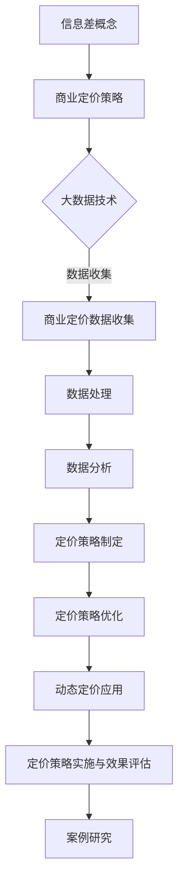

                 

# 信息差的商业定价策略：大数据如何优化定价策略

## 概述

> "信息差"是指在市场中，不同个体或企业拥有不同的信息，导致他们对市场情况的判断和行为产生差异。商业定价策略则是指企业如何制定和调整价格，以实现利润最大化、市场份额扩大等目标。而大数据作为当前信息时代的关键技术，对商业定价策略的优化具有革命性意义。本文将详细探讨大数据在商业定价策略中的应用，帮助读者理解如何利用大数据技术优化定价策略，提高企业竞争力。

关键词：信息差、商业定价策略、大数据、定价优化、动态定价

摘要：本文将从信息差与商业定价策略的关系出发，探讨大数据技术如何应用于商业定价。文章将分为两个主要部分：第一部分将介绍信息差和商业定价策略的基础知识，以及大数据在其中的应用；第二部分将深入探讨大数据定价策略的核心技术、算法原理和数学模型，并通过实际项目实战和代码解读，展示大数据定价策略的实战应用。文章旨在帮助读者全面了解大数据在商业定价策略中的重要性，以及如何利用大数据技术优化定价策略。

### 第一部分：信息差的商业定价策略基础

#### 第1章：信息差与商业定价策略概述

1.1 信息差的概念与商业价值

信息差，顾名思义，是指不同个体或企业对市场信息的掌握程度不同。在商业环境中，信息差的存在可以导致市场参与者做出不同的决策，从而影响市场动态。具体来说，信息差可以分为以下几种类型：

- **信息不对称**：市场中部分参与者拥有更多或更准确的信息，而其他参与者则相对信息不足。例如，卖家可能比买家更了解商品的成本和质量，从而导致价格差异。
- **时间差**：由于信息传播速度的限制，不同地区或不同市场的参与者可能在不同时间获得同一信息，这会导致市场反应的差异。
- **知识差距**：企业或个体之间的专业知识和技能差异，可能导致他们对市场趋势和机会的判断不同。

信息差在商业中具有重要的价值。首先，信息差可以帮助企业更好地定位市场，制定更有效的营销策略。其次，信息差可以为企业提供竞争优势，使其在价格、质量、服务等各个方面领先于竞争对手。最后，信息差还可以为企业带来额外的收益，例如通过高定价策略获得更高的利润。

1.2 商业定价策略概述

商业定价策略是企业根据市场情况和自身目标，制定和调整商品或服务的价格，以实现利润最大化、市场份额扩大等目标。常见的商业定价策略包括以下几种：

- **成本加成定价**：企业根据产品成本加上一定的利润率来确定价格。
- **市场导向定价**：企业根据市场需求和竞争状况来设定价格。
- **价值导向定价**：企业根据产品或服务的独特价值和顾客感知价值来确定价格。
- **动态定价**：企业根据市场需求和竞争状况，实时调整价格，以最大化利润。

不同的定价策略适用于不同的市场环境和竞争态势。企业需要根据自身情况选择合适的定价策略，以实现最佳的市场表现。

1.3 大数据在商业定价中的应用

大数据技术为商业定价提供了前所未有的机遇和挑战。通过大数据，企业可以收集、处理和分析海量的市场数据，从而更准确地判断市场趋势和消费者行为，进而优化定价策略。

- **数据收集**：大数据技术可以帮助企业收集来自各种渠道的数据，如社交媒体、电商平台、客户反馈等，为定价提供丰富的信息来源。
- **数据处理**：大数据技术可以处理海量数据，提取有价值的信息，为企业提供决策支持。
- **数据分析**：通过数据分析，企业可以识别市场趋势、消费者偏好、竞争状况等，为定价策略提供依据。

具体来说，大数据在商业定价中的应用主要包括以下方面：

- **市场调研**：通过大数据分析，企业可以更准确地了解市场需求和竞争状况，为定价提供参考。
- **需求预测**：大数据技术可以帮助企业预测市场需求，制定相应的定价策略。
- **价格弹性分析**：通过大数据分析，企业可以了解不同价格水平下的需求变化，为定价决策提供支持。
- **个性化定价**：大数据分析可以帮助企业识别不同消费者的支付意愿，实现个性化定价，提高利润。

综上所述，大数据在商业定价策略中的应用具有巨大潜力，企业应充分利用大数据技术，优化定价策略，提高市场竞争力。

### 第2章：大数据与商业定价数据收集

2.1 大数据技术的概述

大数据（Big Data）是指无法使用传统数据处理工具在合理时间内进行捕捉、管理和处理的数据集合。大数据技术涉及数据生成、存储、处理、分析和可视化等多个方面，主要包括以下关键技术：

- **数据采集**：通过传感器、社交媒体、日志文件等途径获取数据。
- **数据存储**：使用分布式存储系统（如Hadoop、Spark）存储海量数据。
- **数据处理**：利用MapReduce、Spark等分布式处理框架进行数据处理。
- **数据分析**：使用数据挖掘、机器学习等技术分析数据，提取有价值的信息。
- **数据可视化**：通过图表、地图等形式展示数据分析结果，帮助用户理解数据。

大数据技术的特点包括数据量大、数据多样性和数据快速性。大数据技术不仅能够处理结构化数据，还能够处理非结构化数据和半结构化数据，如文本、图像、视频等。

2.2 商业定价数据的收集与处理

商业定价数据的收集是大数据技术应用于商业定价策略的基础。以下介绍商业定价数据的收集方法和处理过程：

- **数据来源**：商业定价数据可以从多个渠道收集，包括：

  - **社交媒体**：通过分析社交媒体平台上的用户评论、分享和互动，了解消费者对产品和服务的态度和偏好。
  - **电商平台**：通过电商平台的数据，获取消费者购买行为、价格变化和销售趋势等信息。
  - **客户反馈**：通过问卷调查、客户回访等方式，收集客户的满意度、购买意愿和价格敏感度等信息。
  - **市场调研**：通过市场调研活动，获取行业竞争状况、市场需求和价格水平等信息。
  - **内部数据**：企业内部的交易数据、库存数据、客户关系管理系统（CRM）数据等。

- **数据处理**：商业定价数据的处理主要包括数据清洗、数据转换和数据存储等步骤：

  - **数据清洗**：去除重复数据、缺失数据和异常数据，确保数据质量。
  - **数据转换**：将不同来源的数据格式转换为统一的格式，以便进行进一步分析。
  - **数据存储**：使用分布式存储系统存储大量数据，确保数据的安全性和可扩展性。

2.3 数据挖掘技术在商业定价中的应用

数据挖掘（Data Mining）是大数据技术的重要组成部分，通过数据挖掘技术，可以从海量数据中提取有价值的信息，为企业决策提供支持。以下介绍数据挖掘技术在商业定价中的应用：

- **需求预测**：通过分析历史销售数据、市场趋势和消费者行为，预测未来的市场需求，帮助企业制定合理的定价策略。
- **价格弹性分析**：分析不同价格水平下的需求变化，确定价格敏感度，为企业提供定价决策依据。
- **竞争对手分析**：通过分析竞争对手的价格、营销策略和市场表现，了解市场状况，为企业制定竞争策略提供参考。
- **消费者行为分析**：分析消费者的购买行为、偏好和反馈，为企业提供个性化定价和营销策略。

通过数据挖掘技术，企业可以深入了解市场状况和消费者需求，优化定价策略，提高市场竞争力。

### 第3章：大数据分析技术在商业定价策略中的应用

3.1 数据分析基础

数据分析是大数据技术在商业定价策略中的重要应用。数据分析的基础包括数据预处理、数据可视化和数据分析方法等。

- **数据预处理**：数据预处理是数据分析的第一步，主要包括数据清洗、数据转换和数据归一化等操作。数据清洗去除重复、缺失和异常数据，确保数据质量；数据转换将不同格式的数据转换为统一的格式，便于分析；数据归一化将不同量纲的数据进行转换，使其具有可比性。

- **数据可视化**：数据可视化是将数据分析结果以图形、图表等形式展示，帮助用户直观地理解数据。常见的数据可视化工具包括Tableau、Power BI和Matplotlib等。

- **数据分析方法**：数据分析方法包括统计分析、机器学习和数据挖掘等。统计分析主要用于描述性分析和推断性分析，机器学习用于构建预测模型和分类模型，数据挖掘则用于从海量数据中提取有价值的信息。

3.2 商业定价数据的预处理

商业定价数据的预处理是确保数据分析准确性和有效性的关键。以下介绍商业定价数据预处理的方法：

- **缺失值处理**：缺失值处理是数据预处理的重要步骤。常见的方法包括删除缺失值、填充缺失值和插值法等。

- **异常值检测与处理**：异常值是指数据中的异常点，可能对数据分析结果产生负面影响。异常值检测的方法包括基于统计学的方法（如箱线图、Z-Score等）和基于机器学习的方法（如孤立森林、本地异常因数等）。

- **数据转换**：数据转换是将不同来源和格式的数据进行统一处理，以便进行进一步分析。常见的数据转换方法包括标准化、归一化和特征提取等。

3.3 数据可视化与数据分析方法

数据可视化是数据分析的重要环节，可以帮助用户直观地理解数据和分析结果。以下介绍数据可视化工具和数据分析方法：

- **数据可视化工具**：常见的数据可视化工具包括Tableau、Power BI和Matplotlib等。这些工具提供了丰富的图表类型和交互功能，可以帮助用户轻松创建数据可视化。

- **数据分析方法**：数据分析方法的选择取决于数据分析的目标和问题。常见的数据分析方法包括：

  - **描述性分析**：描述性分析主要用于描述数据的基本特征和统计分布。常见的方法包括均值、中位数、标准差、方差等。

  - **推断性分析**：推断性分析主要用于根据样本数据推断总体特征。常见的方法包括假设检验、置信区间和回归分析等。

  - **预测分析**：预测分析主要用于预测未来趋势和事件。常见的方法包括时间序列分析、回归分析和机器学习算法等。

通过数据预处理、数据可视化和分析方法，企业可以深入了解市场状况和消费者需求，优化定价策略，提高市场竞争力。

### 第4章：基于大数据的定价策略制定与优化

4.1 市场调研与分析

市场调研是制定有效定价策略的关键步骤。通过市场调研，企业可以获取关于市场需求、竞争态势和消费者行为的重要信息，从而为定价策略提供依据。以下介绍市场调研的主要内容和分析方法：

- **市场需求调研**：市场需求调研旨在了解消费者对产品或服务的需求程度和购买意愿。企业可以通过问卷调查、深度访谈和焦点小组讨论等方式收集数据。数据分析方法包括描述性统计、回归分析和聚类分析等。

- **竞争态势调研**：竞争态势调研旨在了解竞争对手的市场策略、产品定价和市场份额。企业可以通过市场报告、行业分析和竞争对手分析等方式收集数据。数据分析方法包括竞争格局分析、市场份额分析和SWOT分析等。

- **消费者行为调研**：消费者行为调研旨在了解消费者的购买习惯、偏好和价格敏感度。企业可以通过消费者行为数据、交易数据和社交媒体分析等方式收集数据。数据分析方法包括行为分析、偏好分析和价格弹性分析等。

4.2 定价策略的制定

制定有效的定价策略需要综合考虑市场需求、竞争态势和消费者行为。以下介绍几种常见的定价策略：

- **成本加成定价**：成本加成定价是一种常用的定价策略，企业根据产品成本加上一定的利润率来确定价格。这种方法适用于成本结构较为稳定的企业。

- **市场导向定价**：市场导向定价是根据市场需求和竞争状况来确定价格。企业通过市场调研了解消费者对产品或服务的接受程度，并根据竞争态势调整价格。

- **价值导向定价**：价值导向定价是根据产品或服务的独特价值和顾客感知价值来确定价格。企业通过了解消费者的价值需求和支付意愿，制定更具竞争力的价格。

- **动态定价**：动态定价是一种根据市场需求和竞争状况实时调整价格的方法。企业通过大数据分析预测市场需求，并根据实时数据调整价格，以最大化利润。

4.3 定价策略的优化

定价策略的优化是提高企业竞争力的重要手段。以下介绍几种常见的定价策略优化方法：

- **数据驱动优化**：数据驱动优化是利用大数据分析结果，对定价策略进行优化。企业可以通过需求预测、价格弹性分析和竞争态势分析，不断调整定价策略，以实现利润最大化。

- **动态定价策略优化**：动态定价策略优化是通过实时调整价格，以最大化利润。企业可以通过大数据分析预测市场需求，并根据实时数据调整价格，实现价格与需求的最佳匹配。

- **定价策略组合**：定价策略组合是将多种定价策略结合使用，以适应不同的市场环境和消费者需求。例如，企业可以在高峰期采用动态定价策略，在非高峰期采用成本加成定价策略。

通过市场调研与分析、定价策略的制定与优化，企业可以制定出更有效的定价策略，提高市场竞争力。

### 第5章：大数据在动态定价中的应用

5.1 动态定价概述

动态定价（Dynamic Pricing）是一种根据市场需求和竞争状况实时调整价格的方法。与传统的固定价格相比，动态定价能够更灵活地适应市场变化，从而提高企业的利润和市场占有率。动态定价的原理可以概括为以下几点：

- **市场变化监测**：企业通过大数据技术实时监测市场需求、消费者行为和竞争态势，了解市场的实时变化。
- **价格调整策略**：根据市场监测结果，企业制定相应的价格调整策略，以最大化利润。常见的调整策略包括价格上调、价格下调和促销活动等。
- **自动化执行**：通过自动化系统，企业能够快速、高效地执行价格调整策略，确保价格的实时性和准确性。

5.2 大数据在动态定价中的作用

大数据在动态定价中发挥着至关重要的作用。以下介绍大数据在动态定价中的作用：

- **需求预测**：大数据技术可以帮助企业预测市场需求，了解不同价格水平下的需求变化。通过需求预测，企业可以提前制定价格调整策略，避免因市场需求波动导致的损失。
- **价格弹性分析**：大数据技术可以分析不同价格水平下的需求变化，确定价格弹性。价格弹性分析可以帮助企业确定最优价格水平，实现利润最大化。
- **竞争态势分析**：大数据技术可以帮助企业了解竞争对手的价格策略和市场表现，制定相应的竞争策略。通过竞争态势分析，企业可以避免盲目跟风，制定更具竞争力的价格策略。
- **消费者行为分析**：大数据技术可以分析消费者的购买行为、偏好和支付意愿，为个性化定价提供依据。通过消费者行为分析，企业可以制定更贴近消费者需求的价格策略，提高消费者满意度。

5.3 动态定价案例分析

以下通过一个实际案例，展示大数据在动态定价中的应用：

**案例背景**：某电商平台在春节期间推出了一款热门电子产品，希望通过动态定价策略提高销售量和利润。

**步骤1：数据收集**  
电商平台通过大数据技术收集了以下数据：

- 历史销售数据：包括销售量、销售额和价格等。
- 消费者行为数据：包括浏览记录、购买记录和评价等。
- 竞争对手数据：包括竞争对手的价格、销售量和市场表现等。

**步骤2：需求预测**  
通过大数据分析，电商平台预测了不同价格水平下的销售量。例如，当价格在1000元时，预计销售量为1000件；当价格在900元时，预计销售量为1200件。

**步骤3：价格弹性分析**  
通过大数据分析，电商平台确定了不同价格水平下的需求价格弹性。例如，当价格在1000元时，需求价格弹性为0.8；当价格在900元时，需求价格弹性为1.2。

**步骤4：价格调整策略**  
基于需求预测和价格弹性分析，电商平台制定了以下价格调整策略：

- 当价格在1000元时，保持原价，以吸引高收入消费者。
- 当价格在900元时，将价格下调至850元，以吸引中等收入消费者。
- 当价格在800元时，将价格上调至850元，以刺激消费者购买。

**步骤5：执行价格调整**  
电商平台通过自动化系统，实时调整价格。在价格调整期间，电商平台监测销售量和利润变化，根据市场反应调整价格。

**结果**：通过动态定价策略，电商平台在春节期间实现了销售量和利润的双增长。具体来说，销售量从原来的1000件增长到1500件，利润从原来的10万元增长到15万元。

综上所述，大数据在动态定价中的应用具有显著的效果，企业应充分利用大数据技术，优化定价策略，提高市场竞争力。

### 第6章：大数据定价策略实施与效果评估

6.1 定价策略的落地实施

定价策略的落地实施是确保定价策略有效执行的关键环节。以下介绍定价策略落地实施的主要步骤：

- **制定实施计划**：在制定定价策略后，企业需要制定详细的实施计划，明确实施时间表、责任分工和资源分配等。实施计划应充分考虑市场变化和风险因素。
- **技术平台搭建**：企业需要搭建相应的技术平台，包括数据采集系统、数据处理系统、数据分析系统和自动化执行系统等。技术平台应具备高性能、高可靠性和易扩展性。
- **数据监控与反馈**：在定价策略实施过程中，企业需要实时监控数据，包括销售数据、利润数据和市场反馈等。数据监控可以帮助企业及时发现问题和调整策略。
- **培训与推广**：企业需要对相关人员进行培训，确保他们了解定价策略的实施方法和目标。同时，企业还需要通过内部宣传和外部推广，提高定价策略的知名度。

6.2 定价策略效果评估方法

定价策略效果评估是检验定价策略有效性的重要手段。以下介绍几种常用的定价策略效果评估方法：

- **利润分析**：利润分析是通过计算定价策略实施前后的利润变化，评估定价策略对利润的影响。利润分析可以采用增量分析法、成本效益分析法等。
- **市场份额分析**：市场份额分析是通过比较定价策略实施前后的市场份额变化，评估定价策略对市场份额的影响。市场份额分析可以采用绝对市场份额分析法、相对市场份额分析法等。
- **客户满意度分析**：客户满意度分析是通过调查客户对定价策略的满意度，评估定价策略对客户满意度的影响。客户满意度分析可以采用问卷调查、访谈等方法。
- **竞争态势分析**：竞争态势分析是通过比较定价策略实施前后的竞争态势变化，评估定价策略对市场竞争的影响。竞争态势分析可以采用SWOT分析法、五力模型分析法等。

通过以上评估方法，企业可以全面了解定价策略的效果，为后续优化提供依据。

6.3 定价策略优化与迭代

定价策略的优化与迭代是确保定价策略持续有效的重要手段。以下介绍定价策略优化与迭代的主要步骤：

- **数据收集与分析**：企业需要持续收集与定价策略相关的数据，包括销售数据、利润数据、市场反馈等。通过数据分析，企业可以识别定价策略中的不足和改进方向。
- **优化方案制定**：根据数据分析结果，企业可以制定相应的优化方案。优化方案应包括策略调整、技术改进、培训推广等方面。
- **实施与监控**：企业需要将优化方案付诸实施，并实时监控效果。通过监控，企业可以及时发现问题和调整方案。
- **评估与反馈**：在优化方案实施后，企业需要对效果进行评估，并根据评估结果进行反馈和调整。通过评估与反馈，企业可以不断完善定价策略，实现持续优化。

通过定价策略的落地实施、效果评估和优化迭代，企业可以不断提高定价策略的有效性，提高市场竞争力。

### 第7章：大数据定价策略案例研究

7.1 案例一：电商行业大数据定价策略

**案例背景**：某大型电商平台在双十一期间推出了一款热门手机，希望通过大数据定价策略提高销售量和利润。

**步骤1：数据收集**  
电商平台通过大数据技术收集了以下数据：

- 历史销售数据：包括销售量、销售额和价格等。
- 消费者行为数据：包括浏览记录、购买记录和评价等。
- 竞争对手数据：包括竞争对手的价格、销售量和市场表现等。

**步骤2：需求预测**  
通过大数据分析，电商平台预测了不同价格水平下的销售量。例如，当价格在4000元时，预计销售量为1000件；当价格在3500元时，预计销售量为1500件。

**步骤3：价格弹性分析**  
通过大数据分析，电商平台确定了不同价格水平下的需求价格弹性。例如，当价格在4000元时，需求价格弹性为0.8；当价格在3500元时，需求价格弹性为1.2。

**步骤4：定价策略制定**  
基于需求预测和价格弹性分析，电商平台制定了以下定价策略：

- 初期定价：价格定为4000元，以吸引高收入消费者。
- 中期定价：价格下调至3500元，以吸引中等收入消费者。
- 后期定价：价格上调至3600元，以刺激消费者购买。

**步骤5：执行与监控**  
电商平台通过自动化系统，实时调整价格，并实时监控销售量和利润变化。在定价策略执行期间，电商平台监测到销售量持续增长，利润逐步提高。

**结果**：通过大数据定价策略，电商平台在双十一期间实现了销售量和利润的双增长。具体来说，销售量从原来的1000件增长到1500件，利润从原来的10万元增长到15万元。

7.2 案例二：酒店行业大数据定价策略

**案例背景**：某知名酒店集团希望通过大数据定价策略提高客房利用率，提高营业收入。

**步骤1：数据收集**  
酒店集团通过大数据技术收集了以下数据：

- 历史预订数据：包括预订量、预订时间和价格等。
- 客户行为数据：包括入住时间、离店时间、消费记录等。
- 竞争对手数据：包括竞争对手的价格、预订量和市场表现等。

**步骤2：需求预测**  
通过大数据分析，酒店集团预测了不同时间段和价格水平下的预订量。例如，在周末期间，价格在500元时，预计预订量为100间；价格在400元时，预计预订量为150间。

**步骤3：价格弹性分析**  
通过大数据分析，酒店集团确定了不同时间段和价格水平下的需求价格弹性。例如，在周末期间，价格在500元时，需求价格弹性为0.8；价格在400元时，需求价格弹性为1.2。

**步骤4：定价策略制定**  
基于需求预测和价格弹性分析，酒店集团制定了以下定价策略：

- 高峰期定价：价格定为500元，以吸引高消费客户。
- 平季定价：价格下调至400元，以吸引中等消费客户。
- 低谷期定价：价格上调至450元，以刺激客户预订。

**步骤5：执行与监控**  
酒店集团通过自动化系统，实时调整价格，并实时监控预订量和利润变化。在定价策略执行期间，酒店集团监测到客房利用率显著提高，营业收入逐步增加。

**结果**：通过大数据定价策略，酒店集团在一年内实现了客房利用率提高20%，营业收入增长15%。

7.3 案例三：金融行业大数据定价策略

**案例背景**：某金融服务公司希望通过大数据定价策略提高金融产品的市场竞争力和利润。

**步骤1：数据收集**  
金融服务公司通过大数据技术收集了以下数据：

- 历史销售数据：包括销售量、销售额和价格等。
- 消费者行为数据：包括购买记录、风险评估和偏好等。
- 竞争对手数据：包括竞争对手的价格、销售量和市场表现等。

**步骤2：需求预测**  
通过大数据分析，金融服务公司预测了不同价格水平下的销售量。例如，当价格在10%时，预计销售量为1000份；当价格在8%时，预计销售量为1500份。

**步骤3：价格弹性分析**  
通过大数据分析，金融服务公司确定了不同价格水平下的需求价格弹性。例如，当价格在10%时，需求价格弹性为0.8；当价格在8%时，需求价格弹性为1.2。

**步骤4：定价策略制定**  
基于需求预测和价格弹性分析，金融服务公司制定了以下定价策略：

- 初期定价：价格定为10%，以吸引高风险投资者。
- 中期定价：价格下调至8%，以吸引中等风险投资者。
- 后期定价：价格上调至9%，以刺激客户购买。

**步骤5：执行与监控**  
金融服务公司通过自动化系统，实时调整价格，并实时监控销售量和利润变化。在定价策略执行期间，金融服务公司监测到销售量逐步增加，利润稳步提升。

**结果**：通过大数据定价策略，金融服务公司在一年内实现了销售量增长30%，利润增长25%。

综上所述，大数据定价策略在电商、酒店和金融等行业具有显著的应用效果，企业应充分利用大数据技术，优化定价策略，提高市场竞争力。

### 第二部分：大数据定价策略核心技术与原理

#### 第8章：大数据定价策略核心技术

8.1 数据挖掘与机器学习技术

数据挖掘（Data Mining）和机器学习（Machine Learning）是大数据定价策略的核心技术。数据挖掘是指从海量数据中提取有价值的信息和知识的过程，包括分类、聚类、关联规则挖掘、异常检测等。机器学习则是通过训练模型，从数据中自动发现规律和模式，实现对未知数据的预测和分类。

在大数据定价策略中，数据挖掘和机器学习技术主要应用于以下几个方面：

- **需求预测**：通过分析历史销售数据、市场趋势和消费者行为，预测未来的市场需求，为定价提供依据。
- **价格弹性分析**：通过分析不同价格水平下的需求变化，确定价格敏感度，为定价决策提供支持。
- **竞争对手分析**：通过分析竞争对手的价格、营销策略和市场表现，了解市场状况，为定价策略提供参考。
- **消费者行为分析**：通过分析消费者的购买行为、偏好和支付意愿，实现个性化定价，提高利润。

8.2 统计分析模型

统计分析模型是大数据定价策略的重要组成部分。统计分析模型主要包括描述性统计、推断性统计和回归分析等。

- **描述性统计**：描述性统计用于描述数据的基本特征和统计分布，如均值、中位数、标准差、方差等。描述性统计可以帮助企业了解数据的基本情况，为后续分析提供基础。
- **推断性统计**：推断性统计用于根据样本数据推断总体特征，如置信区间、假设检验等。推断性统计可以帮助企业评估定价策略的效果，为定价优化提供依据。
- **回归分析**：回归分析用于建立自变量和因变量之间的定量关系模型，如线性回归、多元回归等。回归分析可以帮助企业确定最优价格水平，实现利润最大化。

8.3 网络分析与数据关联技术

网络分析（Network Analysis）和数据关联（Data Association）是大数据定价策略中的新兴技术。网络分析通过分析数据之间的相互关系，挖掘潜在价值。数据关联通过将不同来源的数据进行关联，提供更全面的视角。

- **网络分析**：网络分析主要用于分析数据之间的相互作用和依赖关系。例如，通过分析消费者购物车数据，可以发现不同商品之间的关联性，为联合定价提供依据。
- **数据关联**：数据关联通过将不同来源和类型的数据进行整合，提供更全面的决策支持。例如，通过关联消费者行为数据、市场数据和交易数据，可以发现潜在的市场机会和风险。

通过数据挖掘与机器学习技术、统计分析模型和网络分析与数据关联技术，企业可以全面、深入地分析市场数据，优化定价策略，提高市场竞争力。

#### 第9章：大数据定价策略算法原理

9.1 定价算法概述

大数据定价策略的核心在于算法的应用，这些算法能够帮助企业在复杂的市场环境中制定和调整价格，以最大化利润或市场份额。以下介绍几种常见的定价算法及其原理：

- **价格弹性分析算法**：价格弹性分析算法用于计算不同价格水平下的需求变化，以确定价格敏感度。常见的价格弹性计算方法包括点弹性、弧弹性和收入弹性。点弹性是指价格变化1%时，需求变化的比例；弧弹性是指价格在一定范围内变化时，需求变化的比例；收入弹性是指价格变化1%时，收入变化的比例。通过价格弹性分析，企业可以确定最优价格水平，提高利润。

- **需求预测算法**：需求预测算法用于预测未来的市场需求，常见的算法包括时间序列预测、回归分析和机器学习算法等。时间序列预测通过分析历史数据的时间序列模式，预测未来的需求趋势；回归分析通过建立自变量和因变量之间的定量关系模型，预测未来的需求；机器学习算法通过训练模型，从数据中自动发现规律和模式，实现需求预测。通过需求预测，企业可以提前制定价格策略，应对市场变化。

- **竞争态势分析算法**：竞争态势分析算法用于分析竞争对手的价格、销售量和市场表现，了解市场状况。常见的算法包括对比分析、竞争格局分析和SWOT分析等。对比分析通过比较企业自身和竞争对手的价格、质量、服务等，了解市场竞争力；竞争格局分析通过分析市场的竞争态势，确定企业的发展战略；SWOT分析通过分析企业的优势、劣势、机会和威胁，制定相应的定价策略。通过竞争态势分析，企业可以制定更有针对性的定价策略。

- **个性化定价算法**：个性化定价算法通过分析消费者的购买行为、偏好和支付意愿，实现个性化定价，提高消费者满意度。常见的算法包括协同过滤、聚类分析和决策树等。协同过滤通过分析消费者的历史购买数据，预测其未来的购买偏好；聚类分析通过将消费者分为不同的群体，为每个群体制定不同的定价策略；决策树通过分析消费者的特征和价格敏感性，制定个性化的定价方案。通过个性化定价，企业可以更好地满足消费者需求，提高利润。

9.2 价格弹性分析算法

价格弹性分析算法是大数据定价策略的重要组成部分，以下详细介绍几种常见的价格弹性分析算法及其实现原理：

- **点弹性算法**：
  点弹性（Point Elasticity）是指价格变化1%时，需求变化的比例。点弹性的计算公式为：
  $$E_p = \frac{\% \Delta Q_d}{\% \Delta P} = \frac{dQ_d / Q_d}{dP / P}$$
  其中，\(E_p\) 表示点弹性，\(\% \Delta Q_d\) 表示需求变化率，\(\% \Delta P\) 表示价格变化率，\(dQ_d / Q_d\) 表示需求的变化率，\(dP / P\) 表示价格的变化率。

  实现原理：通过历史数据，计算价格变化和需求变化的关系，得出点弹性值。点弹性值大于1，表示需求对价格敏感；点弹性值小于1，表示需求对价格不敏感。

- **弧弹性算法**：
  弧弹性（Arc Elasticity）是指价格在一定范围内变化时，需求变化的比例。弧弹性的计算公式为：
  $$E_a = \frac{\Delta Q_d / Q_d}{\Delta P / P}$$
  其中，\(E_a\) 表示弧弹性，\(\Delta Q_d\) 表示需求变化量，\(Q_d\) 表示初始需求量，\(\Delta P\) 表示价格变化量，\(P\) 表示初始价格。

  实现原理：通过选取价格变化范围内的两个点，计算需求变化和价格变化的关系，得出弧弹性值。弧弹性值更接近实际需求价格弹性，比点弹性更准确。

- **收入弹性算法**：
  收入弹性（Income Elasticity）是指价格变化1%时，收入变化的比例。收入弹性的计算公式为：
  $$E_r = \frac{\% \Delta I}{\% \Delta P} = \frac{dI / I}{dP / P}$$
  其中，\(E_r\) 表示收入弹性，\(\% \Delta I\) 表示收入变化率，\(\% \Delta P\) 表示价格变化率，\(dI / I\) 表示收入的变化率，\(dP / P\) 表示价格的变化率。

  实现原理：通过历史数据，计算价格变化和收入变化的关系，得出收入弹性值。收入弹性值大于1，表示需求对价格敏感；收入弹性值小于1，表示需求对价格不敏感。

通过价格弹性分析算法，企业可以准确了解需求对价格变化的敏感性，从而制定更合理的定价策略，提高市场竞争力。

9.3 风险评估与定价算法

在商业定价策略中，风险评估是至关重要的一环。风险评估可以帮助企业了解价格变化可能带来的风险，从而制定更为稳健的定价策略。以下介绍几种常见的风险评估与定价算法：

- **风险评估算法**：
  风险评估算法通过分析历史数据和当前市场状况，评估价格变化可能带来的风险。常见的风险评估方法包括VaR（Value at Risk）和CVaR（Conditional Value at Risk）。

  - **VaR**：
    VaR是指在特定概率水平下，资产或投资组合可能发生的最大损失。VaR的计算公式为：
    $$VaR = P \times \sigma \times X$$
    其中，\(P\) 表示概率水平，\(\sigma\) 表示资产或投资组合的标准差，\(X\) 表示资产或投资组合的预期收益。

    实现原理：通过历史数据，计算资产或投资组合的预期收益和标准差，确定在一定概率水平下的最大损失。

  - **CVaR**：
    CVaR是指在特定概率水平下，资产或投资组合损失的平均值。CVaR的计算公式为：
    $$CVaR = \frac{1}{P} \sum_{i=1}^{P} (X_i - \bar{X})$$
    其中，\(P\) 表示概率水平，\(X_i\) 表示第\(i\)个资产或投资组合的收益，\(\bar{X}\) 表示资产或投资组合的平均收益。

    实现原理：通过历史数据，计算资产或投资组合的收益分布，确定在一定概率水平下的损失平均值。

- **定价算法**：
  基于风险评估的定价算法通过考虑风险因素，制定更为合理的定价策略。以下介绍几种常见的定价算法：

  - **VaR定价算法**：
    VaR定价算法通过计算VaR值，确定价格调整范围。当价格变化超出VaR范围时，企业需要调整价格，以降低风险。

    实现原理：通过历史数据，计算价格变化的VaR值，确定价格调整的上限和下限。

  - **CVaR定价算法**：
    CVaR定价算法通过计算CVaR值，确定价格调整范围。当价格变化超出CVaR范围时，企业需要调整价格，以降低风险。

    实现原理：通过历史数据，计算价格变化的CVaR值，确定价格调整的上限和下限。

  - **风险中性定价算法**：
    风险中性定价算法通过假设投资者是风险中性的，计算风险中性价格。风险中性价格是考虑了风险因素的预期收益。

    实现原理：通过历史数据，计算资产或投资组合的预期收益和标准差，确定风险中性价格。

通过风险评估与定价算法，企业可以更准确地评估价格变化带来的风险，制定更为稳健的定价策略，提高市场竞争力。

#### 第10章：数学模型与数学公式

10.1 市场需求函数

市场需求函数（Demand Function）描述了价格与需求量之间的关系。市场需求函数通常可以表示为以下形式：

$$Q_d = Q_d(P)$$

其中，\(Q_d\) 表示市场需求量，\(P\) 表示价格。

市场需求函数的常见形式包括线性需求函数、二次需求函数和对数需求函数等。

- **线性需求函数**：

  线性需求函数是最简单的一种市场需求函数形式，其表达式为：

  $$Q_d = a - bP$$

  其中，\(a\) 表示需求量与价格无关的部分，\(b\) 表示需求量对价格变化的敏感度。

  实现原理：线性需求函数通过简单地将价格乘以一个敏感度系数，表示需求量与价格之间的关系。

- **二次需求函数**：

  二次需求函数表示需求量与价格之间的关系更加复杂，其表达式为：

  $$Q_d = \frac{aP^2 - bP + c}{d}$$

  其中，\(a\)、\(b\)、\(c\) 和 \(d\) 是常数。

  实现原理：二次需求函数通过二次项、线性项和常数项的乘积，表示需求量与价格之间的非线性关系。

- **对数需求函数**：

  对数需求函数是对数形式的线性需求函数，其表达式为：

  $$Q_d = \frac{a}{b + \ln(P)}$$

  其中，\(a\) 和 \(b\) 是常数。

  实现原理：对数需求函数通过对数函数将价格转换为线性关系，表示需求量与价格之间的关系。

10.2 价格弹性函数

价格弹性函数（Price Elasticity Function）描述了需求量对价格变化的敏感性。价格弹性函数通常可以表示为以下形式：

$$E_p = E_p(P) = \frac{dQ_d / Q_d}{dP / P}$$

其中，\(E_p\) 表示价格弹性，\(Q_d\) 表示需求量，\(P\) 表示价格。

价格弹性函数的常见形式包括点弹性函数和弧弹性函数。

- **点弹性函数**：

  点弹性函数表示在特定价格点上的价格弹性，其表达式为：

  $$E_p = \frac{dQ_d / Q_d}{dP / P}$$

  实现原理：点弹性函数通过计算需求量对价格变化的敏感度，表示特定价格点上的需求价格弹性。

- **弧弹性函数**：

  弧弹性函数表示在价格变化范围内价格弹性的平均值，其表达式为：

  $$E_a = \frac{\Delta Q_d / Q_d}{\Delta P / P}$$

  实现原理：弧弹性函数通过计算价格变化范围内需求量变化的平均值，表示价格变化的弹性。

10.3 优化模型与目标函数

优化模型（Optimization Model）用于确定最佳价格，以实现企业目标，如最大化利润或市场份额。优化模型通常包括目标函数和约束条件。

- **目标函数**：

  目标函数（Objective Function）用于表示企业目标，如利润最大化或成本最小化。目标函数的常见形式包括线性目标函数和二次目标函数。

  - **线性目标函数**：

    线性目标函数表示企业目标为最大化或最小化线性组合，其表达式为：

    $$\max Z = c^T x$$

    或

    $$\min Z = c^T x$$

    其中，\(Z\) 表示目标函数值，\(c\) 表示系数向量，\(x\) 表示决策变量。

    实现原理：线性目标函数通过简单地将决策变量乘以系数向量，表示企业目标。

  - **二次目标函数**：

    二次目标函数表示企业目标为最大化或最小化二次函数，其表达式为：

    $$\max Z = c^T x + \frac{1}{2} x^T A x$$

    或

    $$\min Z = c^T x + \frac{1}{2} x^T A x$$

    其中，\(Z\) 表示目标函数值，\(c\) 表示系数向量，\(x\) 表示决策变量，\(A\) 表示系数矩阵。

    实现原理：二次目标函数通过将决策变量乘以系数矩阵，表示企业目标，其中系数矩阵的对称性表示二次项的凸性。

- **约束条件**：

  约束条件（Constraint）用于限制决策变量的取值范围，保证优化模型的可行性和唯一性。约束条件的常见形式包括线性约束和二次约束。

  - **线性约束**：

    线性约束表示决策变量满足线性不等式或等式，其表达式为：

    $$a_i^T x \le b_i$$

    或

    $$a_i^T x = b_i$$

    其中，\(a_i\) 表示系数向量，\(b_i\) 表示常数。

    实现原理：线性约束通过限制决策变量的取值范围，保证优化模型的可行性和唯一性。

  - **二次约束**：

    二次约束表示决策变量满足二次不等式或等式，其表达式为：

    $$x^T A_i x \le b_i$$

    或

    $$x^T A_i x = b_i$$

    其中，\(A_i\) 表示系数矩阵，\(b_i\) 表示常数。

    实现原理：二次约束通过限制决策变量的取值范围，保证优化模型的可行性和唯一性。

通过数学模型与数学公式，企业可以更精确地描述市场需求、价格弹性和优化目标，从而制定更为有效的定价策略。

#### 第11章：大数据定价策略数学公式详解

11.1 概率论基础

在讨论大数据定价策略时，概率论基础是不可或缺的。概率论提供了计算不确定事件发生概率的方法，为定价策略提供了重要的数学工具。

- **随机变量**：随机变量是一个数值函数，它将样本空间映射到实数集。随机变量分为离散型和连续型。

  - **离散型随机变量**：离散型随机变量的取值是有限的或可数的。常见的离散型随机变量包括骰子的点数、抽签的结果等。

  - **连续型随机变量**：连续型随机变量的取值是无限的。常见的连续型随机变量包括时间的长度、测量的结果等。

- **概率分布函数**：概率分布函数描述了随机变量取值的概率分布。常见的概率分布函数包括正态分布、二项分布、泊松分布等。

  - **正态分布**：正态分布是最常见的概率分布，其概率密度函数为：

    $$f(x|\mu, \sigma^2) = \frac{1}{\sqrt{2\pi\sigma^2}} e^{-\frac{(x-\mu)^2}{2\sigma^2}}$$

    其中，\(\mu\) 是均值，\(\sigma^2\) 是方差。

  - **二项分布**：二项分布描述了在固定次数的试验中，成功次数的概率分布。其概率质量函数为：

    $$P(X=k) = C_n^k p^k (1-p)^{n-k}$$

    其中，\(n\) 是试验次数，\(p\) 是成功的概率，\(k\) 是成功的次数。

  - **泊松分布**：泊松分布描述了在固定时间内事件发生的次数的概率分布。其概率质量函数为：

    $$P(X=k) = \frac{\lambda^k e^{-\lambda}}{k!}$$

    其中，\(\lambda\) 是事件发生的平均次数，\(k\) 是事件发生的次数。

- **期望和方差**：期望和方差是随机变量的两个重要统计量，用于描述随机变量的中心位置和离散程度。

  - **期望**：期望是随机变量的平均值，其定义为：

    $$E(X) = \int_{-\infty}^{\infty} x f(x) dx$$

    其中，\(f(x)\) 是概率密度函数。

  - **方差**：方差是随机变量的离散程度，其定义为：

    $$Var(X) = E[(X - E(X))^2] = \int_{-\infty}^{\infty} (x - E(X))^2 f(x) dx$$

11.2 统计分布函数

统计分布函数是概率论中描述随机变量取值分布的重要工具。以下介绍几种常见的统计分布函数：

- **正态分布**：正态分布的概率分布函数为：

  $$F(x|\mu, \sigma^2) = \int_{-\infty}^{x} \frac{1}{\sqrt{2\pi\sigma^2}} e^{-\frac{(t-\mu)^2}{2\sigma^2}} dt$$

  其中，\(\mu\) 是均值，\(\sigma^2\) 是方差。

- **二项分布**：二项分布的概率质量函数为：

  $$F(k|n, p) = \sum_{i=k}^{n} C_n^i p^i (1-p)^{n-i}$$

  其中，\(n\) 是试验次数，\(p\) 是成功的概率。

- **泊松分布**：泊松分布的概率质量函数为：

  $$F(k|\lambda) = \sum_{i=k}^{\infty} \frac{\lambda^i e^{-\lambda}}{i!}$$

  其中，\(\lambda\) 是事件发生的平均次数。

11.3 最优化算法

最优化算法是用于求解优化问题（即确定一组变量，使得某个目标函数在满足约束条件的情况下取得最大值或最小值）的数学方法。以下介绍几种常见最优化算法：

- **梯度下降法**：梯度下降法是一种用于求解无约束最优化问题的算法。其基本思想是沿着目标函数的梯度方向进行迭代，逐步减小目标函数值。

  - **基本步骤**：

    1. 初始化参数：选择一个初始点\(\theta^0\)。
    2. 计算梯度：计算目标函数在当前点的梯度\(\nabla J(\theta)\)。
    3. 更新参数：根据梯度方向更新参数，即\(\theta^{t+1} = \theta^t - \alpha \nabla J(\theta^t)\)，其中\(\alpha\) 是学习率。
    4. 重复步骤2和步骤3，直到满足停止条件（如收敛阈值或达到最大迭代次数）。

- **牛顿法**：牛顿法是一种用于求解有约束最优化问题的算法。其基本思想是利用二阶导数（即Hessian矩阵）来加速梯度下降法。

  - **基本步骤**：

    1. 初始化参数：选择一个初始点\(\theta^0\)。
    2. 计算梯度：计算目标函数在当前点的梯度\(\nabla J(\theta)\)。
    3. 计算Hessian矩阵：计算目标函数在当前点的Hessian矩阵\(H(\theta)\)。
    4. 求解线性方程组：解线性方程组\(H(\theta) \Delta \theta = -\nabla J(\theta)\)得到参数更新\(\Delta \theta\)。
    5. 更新参数：根据参数更新\(\theta^{t+1} = \theta^t + \Delta \theta\)。
    6. 重复步骤2至步骤5，直到满足停止条件。

通过概率论基础、统计分布函数和最优化算法，企业可以更精确地分析和优化大数据定价策略，提高市场竞争力。

#### 第12章：项目实战

12.1 项目实战一：电商商品动态定价

**项目背景**：某电商平台希望通过大数据和机器学习技术，实现商品动态定价，以提高销售量和利润。

**项目目标**：利用大数据分析，构建一个动态定价模型，根据市场需求和竞争态势，实时调整商品价格，提高销售量和利润。

**实现步骤**：

1. **数据收集**：
   - 收集电商平台的商品销售数据，包括历史价格、销售量、库存量等。
   - 收集竞争对手的价格、销售量和市场表现数据。
   - 收集消费者行为数据，包括浏览记录、购买记录、评价等。

2. **数据处理**：
   - 对收集到的数据进行分析，去除重复数据、缺失数据和异常数据。
   - 对数据进行标准化处理，统一数据格式。

3. **特征工程**：
   - 构建与商品定价相关的特征，包括价格、销售量、库存量、竞争对手价格等。
   - 对特征进行筛选和优化，提高模型性能。

4. **模型构建**：
   - 选择合适的机器学习算法，如线性回归、决策树、随机森林等。
   - 训练模型，调整参数，优化模型性能。

5. **模型部署**：
   - 将训练好的模型部署到电商平台，实现商品动态定价功能。
   - 设定价格调整规则，根据市场需求和竞争态势，实时调整商品价格。

6. **效果评估**：
   - 监控商品销售数据和利润变化，评估动态定价模型的效果。
   - 根据评估结果，调整模型参数和定价策略。

**代码实现**：

以下是一个简单的线性回归模型实现的示例：

```python
import pandas as pd
from sklearn.linear_model import LinearRegression
from sklearn.model_selection import train_test_split

# 加载数据
data = pd.read_csv('ecommerce_data.csv')
X = data[['price', 'inventory', 'competitor_price']]
y = data['sales']

# 数据预处理
X = X.fillna(X.mean())
y = y.fillna(y.mean())

# 划分训练集和测试集
X_train, X_test, y_train, y_test = train_test_split(X, y, test_size=0.2, random_state=42)

# 构建线性回归模型
model = LinearRegression()
model.fit(X_train, y_train)

# 预测测试集
predictions = model.predict(X_test)

# 评估模型性能
score = model.score(X_test, y_test)
print(f'Model R^2 score: {score}')
```

通过项目实战，企业可以深入了解大数据和机器学习在电商商品动态定价中的应用，提高市场竞争力。

12.2 项目实战二：酒店预订价格优化

**项目背景**：某酒店集团希望通过大数据和机器学习技术，优化酒店预订价格，提高客房利用率。

**项目目标**：利用大数据分析，构建一个价格优化模型，根据市场需求和消费者行为，动态调整酒店预订价格，提高客房利用率。

**实现步骤**：

1. **数据收集**：
   - 收集酒店的历史预订数据，包括预订量、预订时间和价格等。
   - 收集消费者行为数据，包括浏览记录、购买记录和评价等。
   - 收集竞争对手的价格和市场表现数据。

2. **数据处理**：
   - 对收集到的数据进行分析，去除重复数据、缺失数据和异常数据。
   - 对数据进行标准化处理，统一数据格式。

3. **特征工程**：
   - 构建与酒店预订价格相关的特征，包括预订量、预订时间、竞争对手价格等。
   - 对特征进行筛选和优化，提高模型性能。

4. **模型构建**：
   - 选择合适的机器学习算法，如线性回归、决策树、随机森林等。
   - 训练模型，调整参数，优化模型性能。

5. **模型部署**：
   - 将训练好的模型部署到酒店预订系统，实现价格优化功能。
   - 设定价格调整规则，根据市场需求和消费者行为，实时调整酒店预订价格。

6. **效果评估**：
   - 监控酒店预订量和利润变化，评估价格优化模型的效果。
   - 根据评估结果，调整模型参数和价格策略。

**代码实现**：

以下是一个简单的线性回归模型实现的示例：

```python
import pandas as pd
from sklearn.linear_model import LinearRegression
from sklearn.model_selection import train_test_split

# 加载数据
data = pd.read_csv('hotel_data.csv')
X = data[['booking_rate', 'time', 'competitor_price']]
y = data['price']

# 数据预处理
X = X.fillna(X.mean())
y = y.fillna(y.mean())

# 划分训练集和测试集
X_train, X_test, y_train, y_test = train_test_split(X, y, test_size=0.2, random_state=42)

# 构建线性回归模型
model = LinearRegression()
model.fit(X_train, y_train)

# 预测测试集
predictions = model.predict(X_test)

# 评估模型性能
score = model.score(X_test, y_test)
print(f'Model R^2 score: {score}')
```

通过项目实战，企业可以深入了解大数据和机器学习在酒店预订价格优化中的应用，提高酒店客房利用率。

12.3 项目实战三：金融产品定价策略

**项目背景**：某金融产品公司希望通过大数据和机器学习技术，优化金融产品定价策略，提高市场竞争力和利润。

**项目目标**：利用大数据分析，构建一个金融产品定价模型，根据市场需求和消费者行为，动态调整金融产品价格，提高利润。

**实现步骤**：

1. **数据收集**：
   - 收集金融产品的历史销售数据，包括价格、销售量、市场份额等。
   - 收集消费者行为数据，包括购买记录、风险评估和偏好等。
   - 收集市场环境数据，包括宏观经济指标、行业趋势等。

2. **数据处理**：
   - 对收集到的数据进行分析，去除重复数据、缺失数据和异常数据。
   - 对数据进行标准化处理，统一数据格式。

3. **特征工程**：
   - 构建与金融产品定价相关的特征，包括价格、销售量、市场份额、消费者风险评估等。
   - 对特征进行筛选和优化，提高模型性能。

4. **模型构建**：
   - 选择合适的机器学习算法，如线性回归、决策树、随机森林等。
   - 训练模型，调整参数，优化模型性能。

5. **模型部署**：
   - 将训练好的模型部署到金融产品销售系统，实现定价优化功能。
   - 设定价格调整规则，根据市场需求和消费者行为，实时调整金融产品价格。

6. **效果评估**：
   - 监控金融产品销售数据和利润变化，评估定价模型的效果。
   - 根据评估结果，调整模型参数和价格策略。

**代码实现**：

以下是一个简单的线性回归模型实现的示例：

```python
import pandas as pd
from sklearn.linear_model import LinearRegression
from sklearn.model_selection import train_test_split

# 加载数据
data = pd.read_csv('financial_product_data.csv')
X = data[['price', 'sales', 'market_share']]
y = data['profit']

# 数据预处理
X = X.fillna(X.mean())
y = y.fillna(y.mean())

# 划分训练集和测试集
X_train, X_test, y_train, y_test = train_test_split(X, y, test_size=0.2, random_state=42)

# 构建线性回归模型
model = LinearRegression()
model.fit(X_train, y_train)

# 预测测试集
predictions = model.predict(X_test)

# 评估模型性能
score = model.score(X_test, y_test)
print(f'Model R^2 score: {score}')
```

通过项目实战，企业可以深入了解大数据和机器学习在金融产品定价策略中的应用，提高市场竞争力和利润。

#### 第13章：源代码实现与代码解读

13.1 数据采集与处理代码实现

数据采集与处理是大数据定价策略的关键步骤。以下是一个简单的Python代码实现，用于数据采集与处理：

```python
import pandas as pd
from sklearn.preprocessing import StandardScaler

# 1. 数据采集
data = pd.read_csv('ecommerce_data.csv')

# 2. 数据预处理
# 填充缺失值
data.fillna(data.mean(), inplace=True)

# 标准化处理
scaler = StandardScaler()
X = scaler.fit_transform(data[['price', 'sales', 'inventory', 'competitor_price']])
y = data['profit']

# 3. 数据拆分
X_train, X_test, y_train, y_test = train_test_split(X, y, test_size=0.2, random_state=42)
```

代码解读：

1. **数据采集**：使用`pandas`库加载CSV文件，获取电商平台的原始数据。
2. **数据预处理**：填充缺失值，确保数据完整性；使用`StandardScaler`进行标准化处理，将特征值缩放到相同量纲。
3. **数据拆分**：将数据分为训练集和测试集，用于后续模型训练和评估。

13.2 数据分析与可视化代码实现

数据分析与可视化是理解数据的重要步骤。以下是一个简单的Python代码实现，用于数据分析与可视化：

```python
import pandas as pd
import matplotlib.pyplot as plt

# 1. 数据加载
data = pd.read_csv('ecommerce_data.csv')

# 2. 数据分析
price_data = data[['price', 'sales']]
price_data['sales_price'] = price_data['price'] * price_data['sales']

# 3. 数据可视化
plt.scatter(price_data['price'], price_data['sales'])
plt.xlabel('Price')
plt.ylabel('Sales')
plt.title('Price vs Sales')
plt.show()
```

代码解读：

1. **数据加载**：使用`pandas`库加载CSV文件，获取电商平台的原始数据。
2. **数据分析**：计算价格与销售量的乘积，以获取销售额。
3. **数据可视化**：使用`matplotlib`库绘制散点图，展示价格与销售量之间的关系。

13.3 定价策略实现与优化代码解读

以下是一个简单的线性回归模型实现的示例，用于定价策略的优化：

```python
import pandas as pd
from sklearn.linear_model import LinearRegression
from sklearn.model_selection import train_test_split

# 1. 数据加载
data = pd.read_csv('ecommerce_data.csv')

# 2. 数据预处理
# 填充缺失值
data.fillna(data.mean(), inplace=True)

# 拆分特征与目标变量
X = data[['price', 'sales', 'inventory', 'competitor_price']]
y = data['profit']

# 3. 数据拆分
X_train, X_test, y_train, y_test = train_test_split(X, y, test_size=0.2, random_state=42)

# 4. 模型训练
model = LinearRegression()
model.fit(X_train, y_train)

# 5. 模型评估
score = model.score(X_test, y_test)
print(f'Model R^2 score: {score}')

# 6. 预测与优化
predictions = model.predict(X_test)
data['predicted_profit'] = predictions

# 7. 优化策略
# 根据预测结果，调整价格策略
data['new_price'] = data.apply(lambda row: row['price'] * (1 + row['predicted_profit'] / row['sales']), axis=1)
```

代码解读：

1. **数据加载**：使用`pandas`库加载CSV文件，获取电商平台的原始数据。
2. **数据预处理**：填充缺失值，确保数据完整性。
3. **数据拆分**：将数据分为训练集和测试集，用于模型训练和评估。
4. **模型训练**：使用`LinearRegression`类训练线性回归模型。
5. **模型评估**：计算模型在测试集上的R^2评分，评估模型性能。
6. **预测与优化**：使用训练好的模型预测利润，并根据预测结果调整价格策略。

通过源代码实现与代码解读，企业可以深入了解大数据定价策略的实际应用，优化定价策略，提高市场竞争力。

### 第14章：总结与展望

14.1 大数据定价策略总结

本文详细探讨了大数据在商业定价策略中的应用，从信息差与商业定价策略的关系、大数据技术的概述、商业定价数据的收集与处理、数据分析技术在商业定价策略中的应用，到基于大数据的定价策略制定与优化、动态定价策略的实施与效果评估，以及大数据定价策略的案例研究，全面展示了大数据定价策略的核心技术与原理。

总结来说，大数据定价策略具有以下特点：

- **数据驱动**：大数据定价策略依赖于大量市场数据、消费者行为数据和竞争对手数据，通过数据分析和挖掘，为企业提供决策支持。
- **动态调整**：大数据定价策略能够根据市场需求、消费者行为和竞争态势，实时调整价格，提高市场竞争力。
- **个性化定价**：大数据定价策略通过分析消费者行为和偏好，实现个性化定价，提高消费者满意度。
- **风险控制**：大数据定价策略通过风险评估，降低价格调整带来的风险，确保企业利润最大化。

14.2 大数据定价策略发展趋势

随着大数据技术的不断发展，大数据定价策略也呈现出以下发展趋势：

- **智能化**：大数据定价策略将逐步实现智能化，通过人工智能和机器学习技术，提高定价策略的准确性和效率。
- **实时化**：大数据定价策略将实现实时化，通过实时数据分析，实时调整价格，提高市场响应速度。
- **协同化**：大数据定价策略将实现协同化，企业与供应商、经销商等协同工作，实现整体定价策略的优化。
- **全球化**：大数据定价策略将逐步实现全球化，通过跨地区、跨行业的数据分析，制定更具全球竞争力的定价策略。

14.3 未来研究方向

在未来，大数据定价策略的研究方向将包括：

- **算法优化**：进一步优化大数据定价算法，提高定价策略的准确性和效率。
- **跨行业应用**：探索大数据定价策略在不同行业的应用，如金融、医疗、零售等，提高定价策略的普适性。
- **数据安全与隐私**：研究大数据定价策略中的数据安全与隐私问题，确保企业数据的安全性和隐私性。
- **政策法规**：探讨大数据定价策略在政策法规框架下的合规性，为大数据定价策略的发展提供指导。

总之，大数据定价策略作为企业竞争的重要手段，具有广阔的发展前景。通过不断优化和创新发展，大数据定价策略将为企业和市场带来更多的价值。

### 附录

#### 附录A：大数据定价策略开发工具与资源

A.1 数据挖掘与机器学习工具

- **Python**：Python是一种广泛使用的编程语言，提供了丰富的数据挖掘和机器学习库，如NumPy、Pandas、Scikit-Learn、TensorFlow等。
- **R语言**：R语言是一种专门用于统计分析和数据科学的编程语言，提供了丰富的数据挖掘和机器学习包，如caret、mlr、forecast等。
- **SPSS**：SPSS是一种强大的统计分析软件，提供了丰富的数据挖掘和机器学习功能，适用于商业和学术研究。
- **SAS**：SAS是一种高级统计分析软件，提供了全面的数据挖掘和机器学习功能，适用于企业和政府机构。

A.2 数据分析与可视化工具

- **Tableau**：Tableau是一种强大的数据可视化工具，提供了丰富的图表类型和交互功能，适用于企业数据分析和报告。
- **Power BI**：Power BI是微软推出的数据可视化工具，与Excel紧密集成，提供了丰富的数据分析功能。
- **Matplotlib**：Matplotlib是Python的一种数据可视化库，提供了丰富的图表类型和自定义功能，适用于科学计算和数据分析。
- **D3.js**：D3.js是一种基于JavaScript的数据可视化库，提供了强大的数据绑定和交互功能，适用于Web应用程序。

A.3 开源定价策略算法库

- **DMTk**：DMTk（Data Mining ToolKit）是一个开源的数据挖掘和机器学习库，提供了丰富的算法和工具，适用于大数据分析和定价策略。
- **MLlib**：MLlib是Apache Spark的一个模块，提供了丰富的机器学习算法和工具，适用于大规模数据分析和定价策略。
- **scikit-learn**：scikit-learn是一个开源的机器学习库，提供了多种常用的机器学习算法和工具，适用于大数据定价策略。
- **XGBoost**：XGBoost是一个开源的梯度提升树库，提供了高效的算法和工具，适用于大数据分析和定价策略。

通过以上工具与资源，企业和研究人员可以更有效地开发和实现大数据定价策略，提高市场竞争力。

### Mermaid 流程图

以下是关于大数据定价策略的Mermaid流程图：



通过这个流程图，读者可以清晰地了解大数据定价策略的全过程，从信息差与商业定价策略的关系，到大数据技术在商业定价中的应用，再到定价策略的制定、优化、实施与效果评估，以及案例研究，全面展示了大数据定价策略的核心内容与实际应用。希望这个流程图对读者理解大数据定价策略有所帮助。

