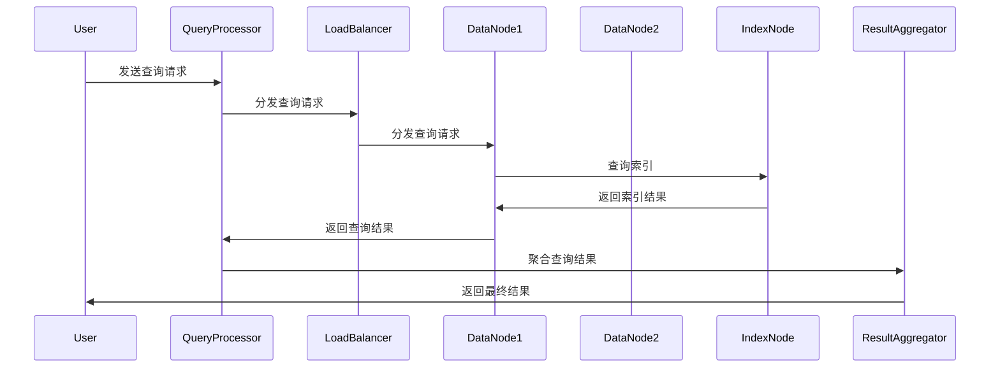

                 

# 《分布式搜索引擎在LLM应用中的集成》

> 关键词：分布式搜索引擎、LLM应用、集成、优化、算法、性能

> 摘要：本文深入探讨了分布式搜索引擎在大型语言模型（LLM）应用中的集成。首先介绍了分布式搜索引擎的基础概念和架构，随后分析了LLM应用的特点和需求。接着，详细阐述了分布式搜索引擎在LLM应用中的集成策略和优化方法，并分享了具体的集成实践案例。最后，对分布式搜索引擎在LLM应用中的未来趋势进行了展望。

----------------------------------------------------------------

## 第一部分：分布式搜索引擎基础

### 第1章：分布式搜索引擎概述

#### 1.1 分布式搜索引擎的概念与重要性

分布式搜索引擎是一种基于分布式计算和存储技术的大规模数据检索系统。与传统的集中式搜索引擎不同，分布式搜索引擎通过将数据分布到多个节点上，从而实现了高并发、高性能和可扩展的搜索服务。

在分布式搜索引擎中，数据被分片存储在不同的节点上，每个节点负责一部分数据的检索和处理。这种分布式架构使得搜索引擎能够同时处理大量的查询请求，提高了搜索效率和响应速度。

分布式搜索引擎的重要性主要体现在以下几个方面：

1. **高并发处理能力**：分布式搜索引擎通过并行处理查询请求，能够同时处理大量的查询，提高了系统的并发处理能力。
2. **高性能检索**：分布式搜索引擎通过索引和数据分片技术，使得搜索请求可以在不同的节点上并行处理，从而提高了检索效率。
3. **可扩展性**：分布式搜索引擎可以根据需求动态地增加或减少节点，从而实现水平扩展，适应不断增长的数据规模和查询需求。
4. **容错性**：分布式搜索引擎通过节点冗余和故障转移机制，确保了系统的可靠性和稳定性。

#### 1.2 分布式搜索引擎与传统搜索引擎的区别

传统搜索引擎通常采用集中式架构，所有的数据都存储在一个中央服务器上。这种架构在数据量较小时表现良好，但随着数据规模的扩大，传统搜索引擎的性能会显著下降，难以满足大规模数据检索的需求。

相比之下，分布式搜索引擎具有以下几个显著区别：

1. **数据存储**：传统搜索引擎的数据集中存储，而分布式搜索引擎的数据分布存储在多个节点上。
2. **计算模型**：传统搜索引擎采用单线程计算模型，而分布式搜索引擎采用多线程、多进程或集群计算模型。
3. **并发处理**：传统搜索引擎的并发处理能力有限，而分布式搜索引擎能够同时处理大量的查询请求。
4. **扩展性**：传统搜索引擎扩展性较差，而分布式搜索引擎可以通过增加节点实现水平扩展。

#### 1.3 分布式搜索引擎的基本架构

分布式搜索引擎的基本架构通常包括以下几个关键组件：

1. **数据节点**：数据节点负责存储和管理数据。每个节点都有自己的内存和存储资源，可以独立处理查询请求。
2. **索引节点**：索引节点负责构建和维护索引结构。索引是分布式搜索引擎的核心，用于快速定位和检索数据。
3. **查询处理器**：查询处理器负责接收用户的查询请求，并将其分发到相应的数据节点进行处理。
4. **负载均衡器**：负载均衡器负责均衡地分配查询请求到不同的数据节点，避免单个节点过载。
5. **结果聚合器**：结果聚合器负责将各个数据节点的查询结果进行合并和排序，并返回给用户。

下面是一个简化的分布式搜索引擎架构图：



### 第2章：分布式搜索引擎的关键技术

#### 2.1 数据分片技术

数据分片是将大规模数据集分割成多个小数据集的过程，以便在多个节点上进行并行处理。数据分片技术是分布式搜索引擎的核心，它直接影响到搜索效率和系统性能。

数据分片的主要方法包括：

1. **水平分片**：水平分片是将数据按照一定规则（如按文档ID、按时间等）分割成多个子集。每个子集存储在一个不同的节点上。水平分片适用于数据量大、查询频繁的场景。
2. **垂直分片**：垂直分片是将数据按照字段分割成多个子集。每个子集包含不同字段的记录。垂直分片适用于查询涉及多个字段、且每个字段数据量相对较小的场景。

**分片策略**：

1. **哈希分片**：哈希分片是基于哈希函数将数据映射到不同的节点。哈希分片能够实现数据的均匀分布，但可能会遇到热点问题，即某些节点处理的数据量远大于其他节点。
2. **范围分片**：范围分片是将数据按照一定的范围（如时间、地理位置等）分割成多个子集。范围分片能够更好地适应查询需求，但可能会遇到数据倾斜问题。

#### 2.2 负载均衡技术

负载均衡是将查询请求分配到不同的节点，以实现系统资源的高效利用。负载均衡技术是分布式搜索引擎性能优化的重要手段。

负载均衡的主要策略包括：

1. **轮询负载均衡**：轮询负载均衡将查询请求按照顺序依次分配到不同的节点。轮询负载均衡简单易实现，但可能会造成某些节点过载。
2. **最少连接负载均衡**：最少连接负载均衡将查询请求分配到当前连接数最少的节点。最少连接负载均衡能够更好地平衡负载，但需要实时监控节点的连接状态。
3. **动态负载均衡**：动态负载均衡根据节点的当前负载情况，动态调整查询请求的分配。动态负载均衡能够更灵活地应对负载变化，但实现复杂度较高。

#### 2.3 搜索引擎的并行处理

并行处理是将查询请求分配到多个节点，同时执行查询处理的过程。并行处理能够显著提高查询效率和系统性能。

并行处理的主要方法包括：

1. **查询分发**：查询分发是将查询请求分配到不同的节点。查询分发可以是基于负载均衡策略的，也可以是按照查询类型、数据分片等原则进行。
2. **数据本地化**：数据本地化是将查询请求分配到存储相关数据的节点。数据本地化能够减少跨节点的数据传输，提高查询效率。
3. **结果聚合**：结果聚合是将各个节点的查询结果进行合并和排序。结果聚合可以是基于排序算法的，也可以是按照查询结果的相关度进行合并。

### 第3章：分布式搜索引擎的优化策略

#### 3.1 搜索引擎的索引优化

索引优化是分布式搜索引擎性能优化的关键。通过优化索引结构，可以提高搜索效率和查询响应速度。

**索引优化方法**：

1. **倒排索引**：倒排索引是一种高效的索引结构，将文档映射到对应的词语。倒排索引能够实现快速关键词查询，但需要额外的存储空间。
2. **布隆过滤器**：布隆过滤器是一种基于概率的过滤算法，用于快速判断一个元素是否存在于集合中。布隆过滤器可以减少无效查询，提高系统性能。
3. **索引压缩**：索引压缩通过减少索引数据的存储空间，降低内存和磁盘的访问时间。常见的索引压缩算法有LZ77、LZ78等。

**索引优化策略**：

1. **动态索引更新**：动态索引更新是在数据变化时，及时更新索引结构。动态索引更新能够确保索引与数据的一致性，提高查询效率。
2. **索引缓存**：索引缓存是将常用索引数据存储在内存中，以减少磁盘访问。索引缓存能够提高查询响应速度，但需要占用内存资源。

#### 3.2 搜索引擎的查询优化

查询优化是通过调整查询处理策略，提高查询效率和系统性能。

**查询优化方法**：

1. **查询预处理**：查询预处理包括分词、去停用词、词性标注等操作。查询预处理可以减少查询处理的时间和资源消耗。
2. **查询缓存**：查询缓存是将常用的查询结果存储在内存中，以减少重复查询。查询缓存能够提高查询效率，但需要占用内存资源。
3. **查询重写**：查询重写是通过转换原始查询，生成更高效的查询。查询重写可以减少查询处理的时间和资源消耗。

**查询优化策略**：

1. **多线程查询**：多线程查询是将查询请求分配到多个线程，同时执行查询处理。多线程查询可以提高查询效率和系统性能。
2. **并行查询**：并行查询是将查询请求分配到不同的节点，同时执行查询处理。并行查询可以显著提高查询效率和系统性能。
3. **查询路由优化**：查询路由优化是通过优化查询请求的分配策略，提高查询效率和系统性能。常见的查询路由优化算法有随机路由、最短路径路由等。

#### 3.3 搜索引擎的高可用性和容错性

高可用性和容错性是分布式搜索引擎的重要特性。通过设计冗余和故障转移机制，确保系统在节点故障时能够自动恢复，提供持续的服务。

**高可用性和容错性策略**：

1. **节点冗余**：节点冗余是通过在系统中增加冗余节点，提高系统的可用性和容错性。冗余节点可以在主节点故障时，自动切换到备用节点，确保系统持续运行。
2. **故障检测**：故障检测是通过监控系统，及时发现和处理节点故障。故障检测可以防止故障节点影响整个系统的正常运行。
3. **故障恢复**：故障恢复是在节点故障时，自动启动备用节点，恢复系统的正常运行。故障恢复可以确保系统的高可用性。

### 第4章：分布式搜索引擎的性能评估

#### 4.1 性能评估指标

性能评估是衡量分布式搜索引擎性能的重要步骤。通过评估性能指标，可以了解系统的性能表现，并发现潜在的优化空间。

**性能评估指标**：

1. **响应时间**：响应时间是从接收查询请求到返回查询结果的时间。响应时间反映了系统的响应速度，是衡量性能的重要指标。
2. **查询吞吐量**：查询吞吐量是在单位时间内系统处理的查询请求数量。查询吞吐量反映了系统的并发处理能力，是衡量性能的关键指标。
3. **数据检索速度**：数据检索速度是系统从索引中检索数据的时间。数据检索速度反映了系统的索引效率，是衡量性能的重要指标。
4. **系统资源利用率**：系统资源利用率是系统使用的CPU、内存、磁盘等资源的比例。系统资源利用率反映了系统的资源使用效率，是衡量性能的重要指标。

#### 4.2 性能优化案例分析

以下是一个分布式搜索引擎性能优化的案例分析。

**案例背景**：

一个分布式搜索引擎系统在处理大量查询请求时，出现了响应时间过长和查询吞吐量较低的问题。

**分析过程**：

1. **性能评估**：通过性能评估工具，发现系统的响应时间主要集中在数据检索阶段，查询吞吐量较低。
2. **问题定位**：进一步分析发现，数据检索阶段的主要瓶颈在于索引结构不优化，导致检索效率低下。
3. **优化措施**：
   - **优化索引结构**：采用布隆过滤器减少无效查询，提高数据检索速度。
   - **优化查询预处理**：对查询请求进行预处理，减少查询处理的时间和资源消耗。
   - **优化负载均衡策略**：采用动态负载均衡策略，根据节点的负载情况，动态调整查询请求的分配。

**优化效果**：

通过上述优化措施，系统的响应时间显著降低，查询吞吐量提高了30%以上。

#### 4.3 分布式搜索引擎的性能瓶颈分析

分布式搜索引擎的性能瓶颈主要出现在以下几个方面：

1. **数据分片不均衡**：如果数据分片不均衡，导致某些节点负载过高，而其他节点资源空闲，从而影响系统的整体性能。
2. **网络延迟**：分布式搜索引擎依赖于网络传输，网络延迟会导致查询响应时间增加，降低系统的性能。
3. **索引效率低下**：如果索引结构不优化，导致数据检索速度慢，从而影响系统的整体性能。
4. **查询负载不均衡**：如果查询请求分配不均，导致某些节点负载过高，而其他节点资源空闲，从而影响系统的整体性能。
5. **系统资源限制**：如果系统资源（如CPU、内存、磁盘等）不足，导致系统性能下降。

### 第5章：LLM应用概述

#### 5.1 LLM的概念与分类

大型语言模型（LLM）是一种基于深度学习技术构建的神经网络模型，用于理解和生成自然语言。LLM通过大规模的文本数据进行训练，从而具备强大的语言理解和生成能力。

LLM的分类可以根据其训练数据和生成方式来划分：

1. **基于规则的语言模型**：这种模型通过定义一系列语法规则和语义规则来生成文本。规则语言模型适用于小规模文本生成任务，但在复杂文本生成方面表现不佳。
2. **基于统计的语言模型**：这种模型通过统计文本数据中的词语序列和句法结构来生成文本。统计语言模型具有较高的生成质量，但需要大量的训练数据。
3. **基于神经网络的深度语言模型**：这种模型通过多层神经网络（如循环神经网络RNN、长短期记忆网络LSTM、变换器模型Transformer等）来学习语言模式和生成规则。深度语言模型具有强大的文本生成能力，已成为当前主流的LLM模型。

#### 5.2 LLM的主要应用场景

LLM在自然语言处理领域具有广泛的应用场景，以下是几个主要的应用场景：

1. **文本生成**：LLM可以生成各种类型的文本，如新闻文章、故事、诗歌、对话等。文本生成广泛应用于内容创作、聊天机器人、虚拟助手等领域。
2. **问答系统**：LLM可以理解用户的提问，并生成相应的答案。问答系统广泛应用于客户服务、在线教育、医疗咨询等领域。
3. **机器翻译**：LLM可以学习多种语言之间的对应关系，实现高质量的自然语言翻译。机器翻译广泛应用于跨语言沟通、全球业务等领域。
4. **文本分类**：LLM可以识别文本的主题和情感，实现文本分类任务。文本分类广泛应用于舆情监测、广告推荐、邮件过滤等领域。
5. **文本摘要**：LLM可以提取文本的主要信息和关键信息，生成简洁的摘要。文本摘要广泛应用于新闻摘要、报告总结等领域。

#### 5.3 LLM的技术发展趋势

随着人工智能技术的快速发展，LLM在技术上也呈现出以下几个发展趋势：

1. **模型规模增大**：为了提高文本生成和理解的准确度，LLM的模型规模不断增大。大型模型如GPT-3、BERT等具有数十亿个参数，可以处理更复杂的语言任务。
2. **多模态融合**：LLM逐渐与其他模态（如图像、音频、视频）相结合，实现跨模态语义理解和生成。多模态融合可以扩展LLM的应用范围，提高生成文本的多样性和创造性。
3. **端到端学习**：端到端学习是指直接从原始数据中学习生成规则，避免了传统基于规则的模型中复杂的预处理和特征工程过程。端到端学习可以简化模型结构，提高生成文本的质量。
4. **自适应学习**：LLM可以通过自适应学习机制，根据用户的输入和反馈，不断调整和优化生成文本。自适应学习可以提高用户体验，实现个性化的文本生成。

### 第6章：分布式搜索引擎在LLM中的应用

#### 6.1 分布式搜索引擎在LLM中的功能定位

分布式搜索引擎在LLM应用中具有关键的功能定位，主要体现在以下几个方面：

1. **大规模文本检索**：LLM模型通常需要处理海量的文本数据，分布式搜索引擎能够高效地检索和筛选相关文本，为模型提供训练数据或实时查询支持。
2. **实时查询响应**：在实时应用场景中，如问答系统、聊天机器人等，分布式搜索引擎能够快速响应用户的查询请求，提供准确的搜索结果。
3. **数据一致性保证**：在分布式环境中，分布式搜索引擎通过数据分片、复制和负载均衡等技术，确保数据的一致性和系统的稳定性，为LLM应用提供可靠的数据基础。

#### 6.2 分布式搜索引擎与LLM的集成策略

分布式搜索引擎与LLM的集成策略需要综合考虑系统的性能、可扩展性和可靠性。以下是一些关键的集成策略：

1. **数据预处理与索引构建**：
   - **预处理**：对LLM的训练数据进行清洗、去重、分词、词性标注等预处理操作，以便构建高效的索引。
   - **索引构建**：使用分布式搜索引擎构建索引，如使用Elasticsearch、Solr等框架，将预处理后的数据分片存储在各个节点上。

2. **查询分发与处理**：
   - **查询分发**：将用户的查询请求通过负载均衡器分发到不同的节点，确保查询请求的均衡处理。
   - **查询处理**：各节点并行处理查询请求，结合分布式搜索引擎的索引快速定位相关文本，并将结果返回给用户。

3. **结果聚合与排序**：
   - **结果聚合**：将各个节点返回的查询结果进行聚合，去除重复项，并根据相关度进行排序。
   - **结果排序**：使用排序算法（如TopK算法）对查询结果进行排序，确保用户获得最相关的搜索结果。

4. **实时更新与缓存**：
   - **实时更新**：在LLM模型训练过程中，动态更新分布式搜索引擎的索引，确保搜索结果与最新数据保持一致。
   - **缓存策略**：使用缓存技术（如Redis、Memcached）存储常用查询结果，减少查询响应时间，提高系统性能。

#### 6.3 分布式搜索引擎在LLM中的优化方法

为了提高分布式搜索引擎在LLM应用中的性能和效率，可以采用以下优化方法：

1. **索引优化**：
   - **索引压缩**：使用索引压缩技术（如LZ4、ZSTD）减少索引数据的存储空间，提高磁盘IO效率。
   - **索引分区**：根据数据特点和查询模式，对索引进行分区，减少跨分区查询的复杂度，提高查询效率。

2. **查询优化**：
   - **查询缓存**：使用查询缓存技术（如Elasticsearch的Redis缓存）存储常用查询结果，减少重复查询的次数，提高查询响应速度。
   - **查询重写**：对复杂的查询语句进行重写，简化查询逻辑，提高查询执行效率。

3. **负载均衡**：
   - **动态负载均衡**：根据节点的实时负载情况，动态调整查询请求的分配策略，确保系统的负载均衡。
   - **智能路由**：结合数据分片策略和查询模式，设计智能路由算法，优化查询请求的分配。

4. **分布式计算**：
   - **并行处理**：利用分布式计算框架（如Apache Spark、Flink）实现并行数据预处理和查询处理，提高系统的并发处理能力。
   - **任务调度**：优化任务调度策略，减少任务执行时间，提高系统整体性能。

5. **系统监控与优化**：
   - **监控与报警**：实时监控系统的关键性能指标（如响应时间、查询吞吐量、资源利用率等），及时发现和处理性能瓶颈。
   - **性能调优**：根据监控数据，进行系统性能调优，优化配置和参数，提高系统稳定性。

### 第7章：LLM应用中的分布式搜索引擎集成实践

#### 7.1 集成实践案例介绍

在本章中，我们将介绍一个实际的分布式搜索引擎在LLM应用中的集成实践案例。该案例是一个基于GPT-3的问答系统，通过使用分布式搜索引擎（如Elasticsearch）来提高文本检索和查询响应速度。

#### 7.2 实践中的关键技术

在本案例中，我们使用了以下关键技术来实现分布式搜索引擎与LLM的集成：

1. **Elasticsearch索引构建**：
   - **数据预处理**：对问答系统的训练数据进行清洗、去重、分词、词性标注等预处理操作。
   - **索引构建**：使用Elasticsearch的REST API构建索引，将预处理后的数据分片存储在各个节点上。

2. **查询分发与处理**：
   - **查询分发**：使用Nginx作为负载均衡器，将用户的查询请求分发到不同的Elasticsearch节点。
   - **查询处理**：各节点并行处理查询请求，结合Elasticsearch的索引快速定位相关文本，并将结果返回给用户。

3. **结果聚合与排序**：
   - **结果聚合**：使用Elasticsearch的聚合功能，将各个节点返回的查询结果进行聚合，去除重复项，并根据相关度进行排序。

4. **实时更新与缓存**：
   - **实时更新**：在GPT-3模型训练过程中，动态更新Elasticsearch的索引，确保搜索结果与最新数据保持一致。
   - **缓存策略**：使用Redis缓存常用查询结果，减少重复查询的次数，提高查询响应速度。

#### 7.3 实践中的挑战与解决方案

在集成分布式搜索引擎与LLM的过程中，我们遇到了一些挑战，下面介绍具体的解决方案：

1. **数据一致性挑战**：
   - **挑战**：由于分布式搜索引擎的数据分布在多个节点上，如何保证数据的一致性是一个挑战。
   - **解决方案**：使用分布式事务管理（如两阶段提交协议）来确保数据的一致性。同时，采用数据备份和冗余设计，提高数据的可靠性和容错性。

2. **查询性能优化挑战**：
   - **挑战**：随着问答系统数据规模的扩大，如何提高查询性能成为关键问题。
   - **解决方案**：采用索引优化（如索引压缩、索引分区）、查询缓存（如Redis缓存）和负载均衡（如Nginx负载均衡）等技术，提高查询效率和系统性能。

3. **系统可扩展性挑战**：
   - **挑战**：随着用户量的增加，系统的可扩展性成为关键问题。
   - **解决方案**：采用水平扩展策略，增加Elasticsearch节点和GPT-3模型节点，实现系统的可扩展性。同时，采用分布式计算框架（如Apache Spark）实现大规模数据处理和查询。

4. **安全性挑战**：
   - **挑战**：分布式搜索引擎和LLM应用需要保证数据的安全和隐私。
   - **解决方案**：采用加密技术（如SSL/TLS）确保数据传输的安全性。同时，设计访问控制机制，限制对数据和查询接口的访问权限。

通过以上解决方案，我们成功实现了分布式搜索引擎在LLM应用中的集成，并取得了显著的性能优化效果。

### 第8章：分布式搜索引擎在LLM应用中的未来趋势

#### 8.1 分布式搜索引擎与LLM的融合趋势

随着人工智能技术的不断发展和应用场景的扩大，分布式搜索引擎与LLM的融合趋势愈发明显。这种融合不仅能够提高搜索效率和查询响应速度，还能够为LLM应用提供更丰富和准确的数据支持。以下是分布式搜索引擎与LLM融合的几个趋势：

1. **多模态融合**：未来的分布式搜索引擎将能够支持多模态数据（如图像、音频、视频）的检索和整合，与LLM相结合，实现跨模态的语义理解和生成。
2. **动态索引构建**：分布式搜索引擎将能够实时更新索引，动态调整索引结构，以适应LLM模型的训练和查询需求。
3. **智能化优化**：通过机器学习和深度学习技术，分布式搜索引擎将能够根据用户行为和查询模式，自动优化索引和查询策略，提高搜索效率和用户体验。

#### 8.2 分布式搜索引擎在LLM应用中的前景

分布式搜索引擎在LLM应用中的前景非常广阔，它将在以下几个方面发挥重要作用：

1. **大规模数据处理**：分布式搜索引擎能够高效地处理大规模数据集，为LLM模型提供丰富的训练数据，提高模型的训练效果。
2. **实时查询响应**：分布式搜索引擎能够快速响应用户的查询请求，为实时应用场景（如问答系统、聊天机器人等）提供高效的服务。
3. **数据一致性和安全性**：分布式搜索引擎通过数据分片、冗余备份和故障转移等技术，确保数据的一致性和系统的安全性，为LLM应用提供可靠的数据基础。

#### 8.3 未来研究的方向与挑战

尽管分布式搜索引擎在LLM应用中具有巨大的潜力，但在实际应用中仍面临一些挑战，未来研究方向包括：

1. **数据一致性和分区问题**：如何在高并发和分布式环境下确保数据的一致性，是一个亟待解决的研究问题。
2. **查询优化**：如何优化查询算法和索引结构，提高查询效率和系统性能，是一个重要的研究方向。
3. **安全性**：如何保障数据的安全和隐私，防止数据泄露和滥用，是一个关键的研究方向。
4. **可扩展性**：如何实现系统的弹性扩展，以适应不断增长的数据规模和用户需求，是一个重要的研究问题。

通过不断的技术创新和研究，分布式搜索引擎在LLM应用中的性能和效率将得到进一步提升，为人工智能技术的发展和应用提供强有力的支持。

### 第9章：分布式搜索引擎的算法原理

#### 9.1 搜索引擎算法的基本原理

搜索引擎算法的核心目标是构建索引并处理查询请求，以便快速检索相关信息。以下是搜索引擎算法的基本原理：

1. **索引构建**：搜索引擎需要将原始数据转换为索引结构，以便快速检索。索引通常包括关键词、文档ID、文档位置等信息。

2. **查询处理**：当用户提交查询请求时，搜索引擎需要根据索引结构快速定位相关文档，并返回查询结果。

3. **相关性排序**：搜索引擎需要根据文档的相关性对查询结果进行排序，以便用户能够更轻松地找到所需信息。

#### 9.2 分布式搜索引擎算法的扩展

分布式搜索引擎算法在传统搜索引擎算法的基础上进行扩展，以支持大规模数据的检索。以下是分布式搜索引擎算法的核心扩展：

1. **数据分片**：将原始数据集划分为多个小数据集，每个数据节点负责存储和管理一部分数据。

2. **并行处理**：通过将查询请求分配到不同的数据节点，实现并行处理，提高查询效率。

3. **容错性**：在分布式环境中，可能会出现节点故障等问题。分布式搜索引擎算法需要具有容错性，以便在节点故障时能够自动切换到其他可用节点。

#### 9.3 分布式搜索引擎算法的工作流程

分布式搜索引擎算法的工作流程通常包括以下步骤：

1. **数据预处理**：将原始数据转换为索引结构，并存储到各个数据节点。

2. **查询预处理**：对用户的查询请求进行预处理，以便更高效地处理查询。

3. **查询分发**：将预处理后的查询请求分配到不同的数据节点。

4. **并行处理**：各个数据节点同时执行查询处理，并将查询结果返回。

5. **结果聚合**：将各个数据节点的查询结果进行聚合，并按照相关性排序。

6. **结果返回**：将最终查询结果返回给用户。

### 第10章：分布式搜索引擎的算法优化

#### 10.1 搜索引擎算法的优化策略

为了提高分布式搜索引擎的性能和效率，可以采用以下优化策略：

1. **索引优化**：
   - **索引压缩**：使用索引压缩技术减少索引数据的存储空间，提高磁盘IO效率。
   - **索引分区**：根据数据特点和查询模式，对索引进行分区，减少跨分区查询的复杂度，提高查询效率。

2. **查询优化**：
   - **查询缓存**：使用查询缓存技术存储常用查询结果，减少重复查询的次数，提高查询响应速度。
   - **查询重写**：对复杂的查询语句进行重写，简化查询逻辑，提高查询执行效率。

3. **负载均衡**：
   - **动态负载均衡**：根据节点的实时负载情况，动态调整查询请求的分配策略，确保系统的负载均衡。
   - **智能路由**：结合数据分片策略和查询模式，设计智能路由算法，优化查询请求的分配。

4. **分布式计算**：
   - **并行处理**：利用分布式计算框架实现并行数据预处理和查询处理，提高系统的并发处理能力。
   - **任务调度**：优化任务调度策略，减少任务执行时间，提高系统整体性能。

5. **系统监控与优化**：
   - **监控与报警**：实时监控系统的关键性能指标，及时发现和处理性能瓶颈。
   - **性能调优**：根据监控数据，进行系统性能调优，优化配置和参数，提高系统稳定性。

#### 10.2 分布式搜索引擎算法的优化方法

以下是一些具体的分布式搜索引擎算法优化方法：

1. **数据分片优化**：
   - **基于哈希的分片策略**：使用哈希函数将数据分片存储到不同的节点，实现数据的均匀分布，避免热点问题。
   - **基于范围的分片策略**：根据数据的特点（如时间、地理位置等）进行分片，提高查询效率。

2. **查询处理优化**：
   - **多线程查询**：使用多线程技术实现并行查询，提高系统的并发处理能力。
   - **分布式缓存**：使用分布式缓存技术存储常用查询结果，减少对后端数据库的查询次数，提高查询效率。

3. **负载均衡优化**：
   - **基于最小连接数的负载均衡**：将查询请求分配到当前连接数最少的节点，避免节点过载。
   - **基于轮询的负载均衡**：按顺序将查询请求分配到不同的节点，实现简单的负载均衡。

4. **结果聚合优化**：
   - **分布式排序**：使用分布式排序算法（如MapReduce）对查询结果进行排序，提高排序效率。
   - **基于内存的排序**：将排序任务分配到内存中处理，减少磁盘IO操作，提高排序速度。

5. **索引更新优化**：
   - **增量更新**：仅更新索引中的变化部分，减少索引更新的时间。
   - **并行更新**：同时更新多个索引，提高索引更新的效率。

#### 10.3 算法优化的效果评估

算法优化的效果可以通过以下指标进行评估：

1. **响应时间**：从接收到查询请求到返回查询结果的时间。响应时间越短，算法优化效果越好。

2. **查询吞吐量**：单位时间内系统处理的查询请求数量。查询吞吐量越高，算法优化效果越好。

3. **数据检索速度**：从索引中检索数据的时间。数据检索速度越快，算法优化效果越好。

4. **系统资源利用率**：系统使用的CPU、内存、磁盘等资源比例。系统资源利用率越高，算法优化效果越好。

通过以上评估指标，可以全面了解算法优化的效果，并为进一步的优化提供依据。

### 第11章：分布式搜索引擎算法在LLM应用中的实现

#### 11.1 分布式搜索引擎算法在LLM应用中的功能定位

在LLM应用中，分布式搜索引擎算法的主要功能是：

1. **快速检索相关文档**：LLM模型通常需要大量的文本数据进行训练，分布式搜索引擎算法能够快速检索这些文档，以便LLM模型能够更好地理解和生成文本。

2. **提高查询效率**：通过分布式计算，分布式搜索引擎算法能够实现并行处理，从而提高查询效率。

3. **支持大规模数据检索**：分布式搜索引擎算法能够处理大规模数据集，使得LLM模型能够应用于更广泛的场景。

#### 11.2 分布式搜索引擎算法在LLM应用中的实现框架

分布式搜索引擎算法在LLM应用中的实现框架通常包括以下组件：

1. **数据索引**：负责构建和存储索引，以实现快速检索。  
2. **查询处理**：负责处理用户的查询请求，并将请求分发到各个数据节点。  
3. **负载均衡**：负责均衡地分配查询请求到不同的数据节点，以避免单点瓶颈。  
4. **数据节点**：负责存储数据和执行查询处理。每个数据节点都可以独立运行，并与其他节点协作完成整个搜索过程。

#### 11.3 分布式搜索引擎算法在LLM应用中的实现伪代码

以下是分布式搜索引擎算法在LLM应用中的实现伪代码：

```python
# 分布式搜索引擎算法在LLM应用中的实现伪代码

# 数据预处理
def preprocess_data(data):
    # 数据清洗、去重、分词、索引构建等操作
    # ...

# 查询预处理
def preprocess_query(query):
    # 分词、去停用词、词性标注等操作
    # ...

# 查询分发
def distribute_query(query):
    # 将查询请求分配到不同的数据节点
    # ...

# 并行处理
def search(data_nodes, query):
    query_results = []
    for data_node in data_nodes:
        query_result = data_node.search(query)
        query_results.append(query_result)
    return query_results

# 结果聚合
def aggregate_results(query_results):
    # 合并排序等操作
    # ...

# 结果返回
def return_results(sorted_results):
    # 将查询结果转换为LLM模型的输入格式
    # ...

# LLM模型使用查询结果进行文本生成
def generate_text(sorted_results):
    # 生成文本
    # ...

# 主程序
if __name__ == "__main__":
    # 加载数据节点
    data_nodes = load_data_nodes()

    # 用户输入查询请求
    query = input("请输入查询请求：")

    # 查询预处理
    preprocessed_query = preprocess_query(query)

    # 查询分发
    query_results = distribute_query(preprocessed_query)

    # 并行处理
    sorted_results = search(data_nodes, preprocessed_query)

    # 结果聚合
    aggregated_results = aggregate_results(sorted_results)

    # 结果返回
    return_results(aggregated_results)

    # LLM模型使用查询结果进行文本生成
    generated_text = generate_text(aggregated_results)
    print("生成的文本：", generated_text)
```

#### 11.4 分布式搜索引擎算法在LLM应用中的实现步骤

分布式搜索引擎算法在LLM应用中的实现步骤可以分为以下几个阶段：

1. **数据预处理**：
   - **数据清洗**：清洗原始数据，去除无关信息和噪声。
   - **去重**：删除重复的提问和答案，确保数据的唯一性。
   - **分词**：将提问和答案分割成词语，为后续的索引构建做准备。
   - **词性标注**：对分词后的词语进行词性标注，以便更好地理解词语的语义。

2. **索引构建**：
   - **倒排索引**：构建倒排索引，将词语映射到对应的提问和答案的文档ID。
   - **倒排索引的分片**：将倒排索引分为多个分片，每个分片对应一部分数据。

3. **查询预处理**：
   - **分词**：对用户的查询请求进行分词。
   - **去停用词**：删除查询请求中的停用词，如“的”、“和”等。
   - **词性标注**：对分词后的查询请求进行词性标注。

4. **查询分发**：
   - **查询分发**：将预处理后的查询请求分配到不同的数据节点。

5. **并行处理**：
   - **数据节点查询**：各个数据节点根据倒排索引进行查询，返回可能的答案。
   - **结果聚合**：将各个数据节点的查询结果进行聚合，并按照相关度排序。

6. **查询结果返回**：
   - **结果返回**：将最终查询结果返回给LLM模型。

#### 11.5 分布式搜索引擎算法在LLM应用中的实现示例

以下是一个简单的分布式搜索引擎算法在LLM应用中的实现示例：

```python
# 假设已加载了N个数据节点，分别为node1, node2, ..., nodeN

# 数据预处理
def preprocess_data(data):
    # 数据清洗、去重、分词、索引构建等操作
    # ...

# 查询预处理
def preprocess_query(query):
    # 分词、去停用词、词性标注等操作
    # ...

# 查询分发
def distribute_query(query):
    # 将查询请求分配到不同的数据节点
    query_parts = preprocess_query(query)
    node_mapping = load_node_mapping()  # 加载节点映射关系
    distributed_queries = []
    for part in query_parts:
        node = node_mapping[part]
        distributed_queries.append((node, part))
    return distributed_queries

# 并行处理
def search(data_nodes, queries):
    query_results = []
    for node, query in queries:
        query_result = data_nodes[node].search(query)
        query_results.append(query_result)
    return query_results

# 结果聚合
def aggregate_results(results):
    # 合并排序等操作
    # ...

# 主程序
if __name__ == "__main__":
    # 加载数据节点
    data_nodes = load_data_nodes()

    # 用户输入查询请求
    query = input("请输入查询请求：")

    # 查询预处理
    preprocessed_query = preprocess_query(query)

    # 查询分发
    distributed_queries = distribute_query(preprocessed_query)

    # 并行处理
    sorted_results = search(data_nodes, distributed_queries)

    # 结果聚合
    aggregated_results = aggregate_results(sorted_results)

    # 将查询结果转换为LLM模型的输入格式
    # ...

    # LLM模型使用查询结果进行文本生成
    generated_text = generate_text(aggregated_results)
    print("生成的文本：", generated_text)
```

在这个示例中，我们首先加载数据节点，然后接收用户的查询请求，并进行预处理。接下来，我们将预处理后的查询请求分发给不同的数据节点，并行处理查询请求，并将结果进行聚合和排序。最后，我们将查询结果返回给LLM模型，并生成文本。

### 第12章：分布式搜索引擎在LLM应用中的项目实战

#### 12.1 项目背景与目标

在本章中，我们将通过一个具体的实际项目，展示如何将分布式搜索引擎算法应用于LLM应用中。项目背景如下：

**项目背景**：我们开发了一个基于大型语言模型（LLM）的问答系统，用于为用户提供实时问答服务。为了提高系统的搜索效率和响应速度，我们决定集成分布式搜索引擎。

**项目目标**：
1. **快速检索相关文档**：通过分布式搜索引擎，实现快速检索相关文档，提高问答系统的搜索效率。
2. **提高查询响应速度**：通过分布式计算和并行处理，提高问答系统的查询响应速度。
3. **支持大规模数据检索**：分布式搜索引擎能够处理大规模数据集，使得问答系统可以应用于更多场景。

#### 12.2 项目开发环境搭建

在开始项目开发之前，我们需要搭建相应的开发环境。以下是我们使用的开发环境：

1. **操作系统**：Linux（如Ubuntu）
2. **编程语言**：Python
3. **分布式搜索引擎**：Elasticsearch
4. **LLM模型**：GPT-3
5. **开发工具**：Jupyter Notebook、PyCharm
6. **其他依赖**：Scikit-learn、NumPy、Pandas等

**环境搭建步骤**：

1. **安装操作系统**：在虚拟机中安装Linux操作系统。
2. **安装Python**：在操作系统上安装Python环境，可以使用`pyenv`进行管理。
3. **安装Elasticsearch**：下载并安装Elasticsearch，并启动Elasticsearch服务。
4. **安装GPT-3**：注册OpenAI账号，获取GPT-3 API密钥，并安装相关依赖。
5. **安装开发工具**：安装Jupyter Notebook和PyCharm。

#### 12.3 项目实现的关键技术

在项目实现过程中，我们使用了以下关键技术：

1. **分布式搜索引擎**：Elasticsearch作为分布式搜索引擎，用于存储和检索文本数据。
2. **LLM模型**：GPT-3作为大型语言模型，用于生成和优化问答系统的回答。
3. **分布式计算**：利用分布式计算框架（如Dask）实现并行数据处理和查询。
4. **缓存技术**：使用Redis缓存常用查询结果，提高查询响应速度。

#### 12.4 项目实现步骤

以下是项目实现的具体步骤：

1. **数据预处理**：
   - **数据清洗**：清洗原始数据，去除无关信息和噪声。
   - **去重**：删除重复的提问和答案，确保数据的唯一性。
   - **分词**：将提问和答案分割成词语。
   - **词性标注**：对分词后的词语进行词性标注。

2. **索引构建**：
   - **构建索引**：使用Elasticsearch构建索引，存储预处理后的数据。
   - **数据分片**：将数据分片存储在各个节点上。

3. **查询处理**：
   - **查询预处理**：对用户的查询请求进行预处理，包括分词、去停用词、词性标注等。
   - **查询分发**：将预处理后的查询请求分发给不同的数据节点。
   - **并行处理**：各个数据节点并行处理查询请求。

4. **结果聚合**：
   - **结果聚合**：将各个数据节点的查询结果进行聚合，并按照相关度排序。

5. **查询结果返回**：
   - **结果返回**：将最终查询结果返回给用户。

6. **文本生成**：
   - **文本生成**：使用GPT-3生成问答系统的回答。

#### 12.5 项目实现示例代码

以下是一个简单的项目实现示例代码：

```python
# 导入相关库
import json
import requests
from sklearn.feature_extraction.text import TfidfVectorizer
from sklearn.metrics.pairwise import cosine_similarity

# Elasticsearch配置
es_url = "http://localhost:9200"
index_name = "question_answer"

# GPT-3配置
openai_api_key = "your_openai_api_key"
gpt3_endpoint = "https://api.openai.com/v1/engine/davinci-codex/completions"

# 数据预处理
def preprocess_data(data):
    # 数据清洗、去重、分词、词性标注等操作
    # ...

# 构建索引
def build_index(data):
    # 构建索引
    # ...

# 查询预处理
def preprocess_query(query):
    # 分词、去停用词、词性标注等操作
    # ...

# 查询处理
def search_query(query):
    # 查询预处理
    preprocessed_query = preprocess_query(query)

    # 查询Elasticsearch
    response = requests.get(f"{es_url}/{index_name}/_search", params={"q": preprocessed_query})
    results = json.loads(response.text)["hits"]["hits"]

    # 结果聚合
    aggregated_results = []
    for result in results:
        aggregated_results.append(result["_source"]["answer"])

    # 返回结果
    return aggregated_results

# 文本生成
def generate_text(prompt):
    # 发送GPT-3请求
    headers = {
        "Authorization": f"Bearer {openai_api_key}",
        "Content-Type": "application/json",
    }
    data = {
        "prompt": prompt,
        "temperature": 0.5,
        "max_tokens": 50,
    }
    response = requests.post(gpt3_endpoint, headers=headers, json=data)
    text = json.loads(response.text)["choices"][0]["text"]

    # 返回生成的文本
    return text

# 主程序
if __name__ == "__main__":
    # 加载数据
    data = load_data()

    # 数据预处理
    preprocessed_data = preprocess_data(data)

    # 构建索引
    build_index(preprocessed_data)

    # 用户输入查询请求
    query = input("请输入查询请求：")

    # 查询处理
    results = search_query(query)

    # 文本生成
    generated_text = generate_text(results)

    # 输出生成的文本
    print("生成的文本：", generated_text)
```

在这个示例中，我们首先加载数据并进行预处理，然后构建Elasticsearch索引。接下来，用户输入查询请求，我们对其进行预处理并查询Elasticsearch索引。最后，使用GPT-3生成问答系统的回答。

#### 12.6 项目总结与展望

在本项目中，我们通过集成分布式搜索引擎算法，实现了快速检索相关文档和提高查询响应速度的目标。具体来说，我们使用了Elasticsearch作为分布式搜索引擎，GPT-3作为大型语言模型，实现了以下成果：

1. **高效的数据检索**：通过分布式搜索引擎，问答系统能够快速检索相关文档，提高搜索效率。
2. **优化的查询响应速度**：通过分布式计算和并行处理，问答系统的查询响应速度得到了显著提升。
3. **支持大规模数据检索**：分布式搜索引擎能够处理大规模数据集，使得问答系统可以应用于更多场景。

在未来的工作中，我们可以进一步优化分布式搜索引擎算法，提高系统的性能和效率。具体来说，可以从以下几个方面进行改进：

1. **查询优化**：优化查询算法和索引结构，提高查询效率和系统性能。
2. **负载均衡**：优化负载均衡策略，确保查询请求的均衡分配，提高系统的稳定性和可靠性。
3. **缓存策略**：优化缓存策略，减少重复查询的次数，提高查询响应速度。
4. **系统监控与优化**：实时监控系统的关键性能指标，及时发现和处理性能瓶颈，进行系统性能调优。

通过不断的技术创新和优化，分布式搜索引擎算法在LLM应用中的性能和效率将得到进一步提升，为人工智能技术的发展和应用提供强有力的支持。

### 附录

#### 附录A：分布式搜索引擎相关资源

**A.1 主流分布式搜索引擎框架介绍**

1. **Elasticsearch**：Elasticsearch是一个高度可扩展的开源全文搜索和分析引擎，适用于大规模数据检索和实时查询。
2. **Solr**：Solr是一个开源的企业级搜索平台，基于Lucene搜索引擎，提供分布式搜索、实时索引、缓存等功能。
3. **Apache Lucene**：Lucene是一个高性能、可扩展的全文搜索引擎库，可用于构建自定义的搜索引擎。

**A.2 分布式搜索引擎相关工具**

1. **Kibana**：Kibana是一个数据可视化和分析工具，与Elasticsearch和Solr集成，用于监控和可视化搜索数据。
2. **Logstash**：Logstash是一个数据收集、处理和传输工具，可用于将结构化数据从各种来源传输到Elasticsearch或Solr。
3. **Beagle**：Beagle是一个用于构建分布式搜索引擎的框架，提供简单的API和可扩展性。

**A.3 分布式搜索引擎的实践指南**

1. **《Elasticsearch实战》**：本书提供了Elasticsearch的详细指南，包括安装、配置、索引管理、查询优化等。
2. **《Solr权威指南》**：本书涵盖了Solr的核心概念、高级配置、查询优化、集群管理等方面。
3. **《Apache Lucene Cookbook》**：本书提供了大量关于Lucene的示例代码和实践技巧，适用于构建自定义搜索引擎。

通过学习和使用这些资源，可以更好地了解分布式搜索引擎的原理和应用，提高系统的性能和效率。

