                 

## 文章标题

创业公司的产品生命周期管理

### 关键词

产品生命周期、创业公司、管理策略、市场推广、产品优化、成本控制、挑战与解决

### 摘要

在快速变化的商业环境中，创业公司的产品生命周期管理变得至关重要。本文将深入探讨创业公司在不同产品生命周期阶段的管理策略和实践，从产品构思到衰退期，全面解析如何高效管理产品，以实现商业成功。文章包括核心概念的解释、产品生命周期模型的介绍、具体阶段的深入分析、管理工具的运用以及实际案例分析，旨在为创业公司的产品生命周期管理提供实用的指导。

### 《创业公司的产品生命周期管理》目录大纲

**第一部分：产品生命周期管理概述**

- **第1章：产品生命周期管理的定义与重要性**
  - 1.1 产品生命周期的定义
  - 1.2 产品生命周期管理的目标
  - 1.3 产品生命周期管理的重要性

- **第2章：产品生命周期模型**
  - 2.1 产品生命周期曲线
  - 2.2 戈夫曼产品生命周期模型
  - 2.3 产品生命周期管理模型的演变

**第二部分：产品生命周期各阶段管理**

- **第3章：产品开发阶段**
  - 3.1 产品构思与市场调研
  - 3.2 产品规划和需求分析
  - 3.3 产品设计和开发
  - 3.4 产品测试与验证

- **第4章：产品引入阶段**
  - 4.1 产品发布策略
  - 4.2 产品上市计划
  - 4.3 市场推广与渠道建设
  - 4.4 客户反馈与产品改进

- **第5章：产品成长阶段**
  - 5.1 增长策略与市场拓展
  - 5.2 产品差异化策略
  - 5.3 客户关系管理
  - 5.4 产品升级与迭代

- **第6章：产品成熟阶段**
  - 6.1 成熟市场策略
  - 6.2 产品线管理
  - 6.3 产品优化与成本控制
  - 6.4 产品生命周期延长策略

- **第7章：产品衰退阶段**
  - 7.1 产品衰退的迹象
  - 7.2 衰退产品的处理策略
  - 7.3 产品转型与再定位
  - 7.4 产品退出策略

**第三部分：产品生命周期管理的实践与工具**

- **第8章：产品生命周期管理工具与技术**
  - 8.1 产品生命周期管理工具概述
  - 8.2 项目管理工具
  - 8.3 数据分析工具
  - 8.4 产品规划与预测工具

- **第9章：创业公司产品生命周期管理实践**
  - 9.1 创业公司的特点与挑战
  - 9.2 创业公司的产品管理策略
  - 9.3 创业公司产品生命周期管理的最佳实践
  - 9.4 创业公司产品生命周期管理的成功案例分析

- **第10章：产品生命周期管理中的挑战与解决策略**
  - 10.1 产品生命周期管理中的常见问题
  - 10.2 挑战与解决策略
  - 10.3 产品生命周期管理中的创新与变革

**附录**

- **附录A：产品生命周期管理参考资料**
  - A.1 相关书籍推荐
  - A.2 学术论文精选
  - A.3 行业报告概览

- **附录B：产品生命周期管理常用术语表**
  - B.1 术语解释
  - B.2 术语举例

- **附录C：产品生命周期管理流程图**
  - C.1 产品生命周期管理流程
  - C.2 产品生命周期模型图解

### 第一部分：产品生命周期管理概述

**第1章：产品生命周期管理的定义与重要性**

在现代商业环境中，产品生命周期管理（Product Lifecycle Management, PLM）已成为创业公司成功的关键要素。本文将从产品生命周期的定义、管理目标和重要性三个方面入手，为读者提供对产品生命周期管理的基本认识。

#### 1.1 产品生命周期的定义

产品生命周期是指产品从构思、开发、市场推广、销售、成熟到衰退和退出市场的整个过程。这个周期不仅包括产品的技术实现，还涵盖了市场策略、客户反馈、产品升级和维护等各个方面。

- **构思阶段**：产品构想的诞生，通常基于市场需求和用户反馈。
- **开发阶段**：产品设计、开发和测试，确保产品满足市场需求。
- **引入阶段**：产品发布和上市，涉及市场推广和渠道建设。
- **成长阶段**：产品市场份额逐渐扩大，客户基础不断增长。
- **成熟阶段**：产品市场份额稳定，竞争加剧，需要优化和成本控制。
- **衰退阶段**：市场需求下降，产品逐渐被市场淘汰。

#### 1.2 产品生命周期管理的目标

产品生命周期管理的目标包括：

- **最大化产品价值**：通过持续改进和创新，延长产品的市场寿命，提高客户满意度。
- **降低开发成本**：优化产品开发流程，减少重复工作和资源浪费。
- **提高产品质量**：确保产品满足客户需求和行业标准，降低故障率和客户投诉。
- **快速响应市场变化**：及时调整产品策略和市场定位，以应对竞争和市场需求的变化。

#### 1.3 产品生命周期管理的重要性

对于创业公司而言，产品生命周期管理具有以下几个重要性：

- **资源优化**：合理分配资源，确保产品在不同生命周期阶段的开发和市场推广得到有效支持。
- **决策支持**：提供有关产品性能、市场需求和竞争情况的可靠数据，为决策提供依据。
- **客户关系管理**：通过持续改进产品和服务，增强客户忠诚度和品牌形象。
- **市场竞争力**：灵活应对市场变化，保持产品竞争力，确保在激烈的市场竞争中立于不败之地。

### 第一部分：产品生命周期管理概述

**第2章：产品生命周期模型**

产品生命周期模型是理解和分析产品在不同阶段表现的重要工具。本章将介绍三种常见的产品生命周期模型：产品生命周期曲线、戈夫曼产品生命周期模型和产品生命周期管理模型的演变。

#### 2.1 产品生命周期曲线

产品生命周期曲线通常用于描述产品在市场上的表现随时间变化的趋势。该曲线通常分为五个阶段：引入期、成长期、成熟期、衰退期和消亡期。

- **引入期**：产品刚进入市场，需求较低，成本高，利润薄。
- **成长期**：市场需求迅速增长，产品市场份额扩大，利润增加。
- **成熟期**：市场需求稳定，竞争激烈，利润率下降。
- **衰退期**：市场需求下降，销售额减少，利润降低。
- **消亡期**：产品被市场淘汰，不再产生利润。

以下是一个简化的产品生命周期曲线示例（使用Mermaid流程图）：

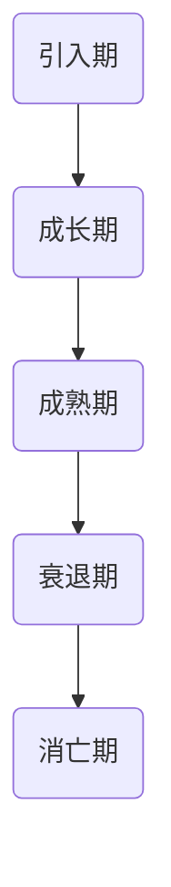

#### 2.2 戈夫曼产品生命周期模型

戈夫曼产品生命周期模型是另一种广泛使用的模型，它将产品生命周期分为四个阶段：介绍期、成长期、成熟期和衰退期。与产品生命周期曲线不同的是，戈夫曼模型更加注重市场推广和品牌建设。

- **介绍期**：产品刚刚推出，市场接受度低，需要大量的市场推广。
- **成长期**：市场需求增加，市场份额扩大，利润增长。
- **成熟期**：市场需求稳定，市场份额达到顶峰，竞争激烈。
- **衰退期**：市场需求下降，市场份额减少，利润减少。

以下是一个戈夫曼产品生命周期模型的示例（使用Mermaid流程图）：

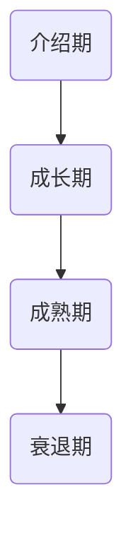

#### 2.3 产品生命周期管理模型的演变

随着市场的不断变化和技术的快速发展，产品生命周期管理模型也在不断演变。现代产品生命周期管理模型不仅考虑市场表现，还关注产品创新、可持续发展和社会责任。

- **创新周期**：强调产品创新和技术升级，以保持市场竞争力。
- **可持续发展周期**：关注环保和社会责任，推动产品的绿色发展和可持续发展。
- **数字化转型周期**：利用数字技术优化产品开发、生产和销售过程，提高效率和灵活性。

以下是一个现代产品生命周期管理模型的示例（使用Mermaid流程图）：

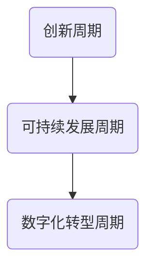

通过了解这些产品生命周期模型，创业公司可以更好地规划产品开发、市场推广和资源分配，以实现商业目标。在下一章中，我们将深入探讨产品生命周期各阶段的管理策略和实践。

### 第二部分：产品生命周期各阶段管理

#### 第3章：产品开发阶段

产品开发阶段是创业公司产品生命周期管理的核心，决定了产品能否顺利进入市场并获得成功。本章将详细讨论产品开发阶段的四个关键环节：产品构思与市场调研、产品规划和需求分析、产品设计和开发、以及产品测试与验证。

#### 3.1 产品构思与市场调研

产品构思是产品开发阶段的起点，通常基于市场需求、用户反馈和公司战略。一个成功的构思需要深入理解市场趋势、用户痛点和竞争对手的情况。以下是一个产品构思与市场调研的流程（使用Mermaid流程图）：

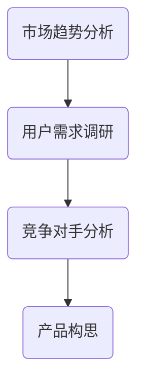

**市场趋势分析**：研究市场的发展趋势，包括行业动态、技术进步和消费者行为变化。

**用户需求调研**：通过问卷调查、用户访谈、焦点小组讨论等方式，收集用户对现有产品的需求和期望。

**竞争对手分析**：分析竞争对手的产品特性、市场份额、优势和劣势，为产品定位和差异化提供参考。

#### 3.2 产品规划和需求分析

在产品构思确定后，接下来是产品规划和需求分析阶段。这个阶段的关键任务是明确产品的功能、性能和用户界面设计，确保产品能够满足市场需求。以下是一个产品规划和需求分析的示例（使用Mermaid流程图）：

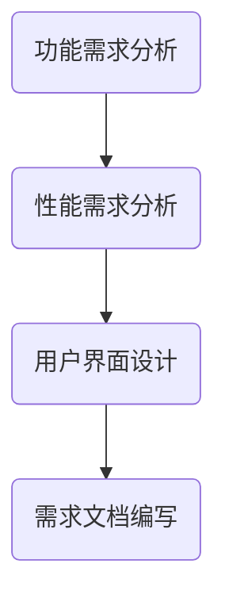

**功能需求分析**：确定产品的核心功能，如用户登录、数据存储、支付处理等。

**性能需求分析**：分析产品在不同负载和环境下所需达到的性能指标，如响应时间、并发用户数、数据处理能力等。

**用户界面设计**：设计产品的用户界面，确保用户体验良好，界面直观易用。

**需求文档编写**：将上述分析结果整理成需求文档，为后续设计和开发提供指导。

#### 3.3 产品设计和开发

产品设计和开发阶段是将需求转化为实际产品的过程。这个阶段包括软件设计、编码、单元测试和集成测试。以下是一个产品设计和开发的流程（使用Mermaid流程图）：

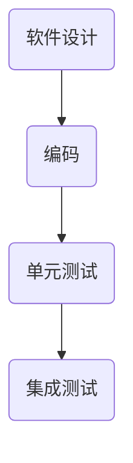

**软件设计**：基于需求文档，设计产品的软件架构和模块，确定数据库设计、接口设计和系统架构。

**编码**：按照软件设计文档进行编码，实现产品的功能。

**单元测试**：对每个模块进行独立测试，确保模块功能正确。

**集成测试**：将所有模块集成在一起进行测试，确保整个系统稳定运行。

#### 3.4 产品测试与验证

产品测试与验证是确保产品质量和性能的关键环节。这个阶段包括系统测试、验收测试和用户反馈。以下是一个产品测试与验证的流程（使用Mermaid流程图）：

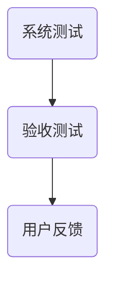

**系统测试**：在模拟的环境下测试整个系统的性能、稳定性和兼容性。

**验收测试**：与客户或用户合作，确保产品满足需求，并达到预定的质量标准。

**用户反馈**：收集用户的反馈意见，用于改进产品。

通过严格的产品测试与验证，创业公司可以确保产品在发布时达到最佳状态，减少后期的维护成本和客户投诉。

#### 第4章：产品引入阶段

产品引入阶段是产品生命周期的重要阶段，标志着产品正式进入市场。本章将讨论产品发布策略、产品上市计划、市场推广与渠道建设、客户反馈与产品改进等方面的内容。

#### 4.1 产品发布策略

产品发布策略是确保产品成功进入市场并得到广泛关注的关键。以下是一个产品发布策略的示例（使用Mermaid流程图）：

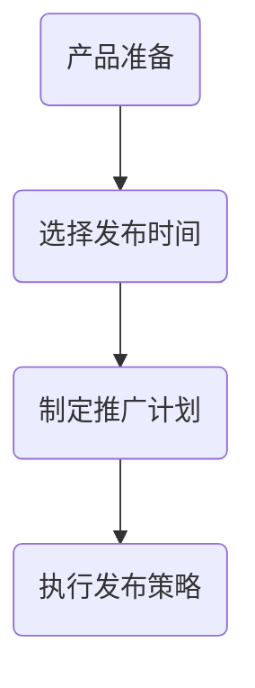

**产品准备**：确保产品在发布时达到最佳状态，包括软件稳定性、性能优化和用户文档准备。

**选择发布时间**：根据市场需求、节假日和竞争对手发布时间等因素，选择最佳的发布时间。

**制定推广计划**：制定详细的推广计划，包括广告、社交媒体宣传、公关活动等。

**执行发布策略**：按照推广计划执行，确保产品在市场上获得广泛关注。

#### 4.2 产品上市计划

产品上市计划是确保产品成功进入市场的详细规划。以下是一个产品上市计划的示例（使用Mermaid流程图）：

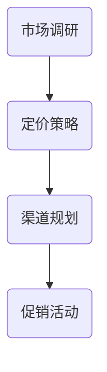

**市场调研**：了解目标市场的需求和竞争对手的情况，为产品定价和渠道规划提供依据。

**定价策略**：制定合理的定价策略，考虑成本、市场需求和竞争环境。

**渠道规划**：选择合适的销售渠道，如线上商城、线下门店、代理商等。

**促销活动**：通过促销活动吸引消费者，如打折、赠品、限时优惠等。

#### 4.3 市场推广与渠道建设

市场推广与渠道建设是确保产品在市场上获得成功的重要环节。以下是一个市场推广与渠道建设的示例（使用Mermaid流程图）：

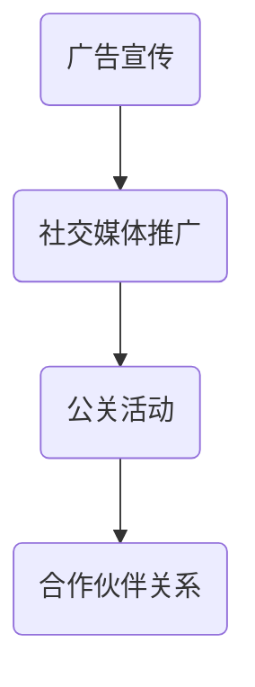

**广告宣传**：通过电视、报纸、杂志、网络广告等渠道进行产品宣传。

**社交媒体推广**：利用社交媒体平台，如Facebook、Twitter、Instagram等，发布产品信息，吸引粉丝和关注。

**公关活动**：通过新闻发布会、产品发布会、行业论坛等活动，提高产品的知名度和认可度。

**合作伙伴关系**：与相关行业的合作伙伴建立合作关系，共同推广产品，扩大市场影响力。

#### 4.4 客户反馈与产品改进

客户反馈是产品成功的关键，它不仅有助于了解产品的优缺点，还能为后续的产品改进提供重要参考。以下是一个客户反馈与产品改进的示例（使用Mermaid流程图）：

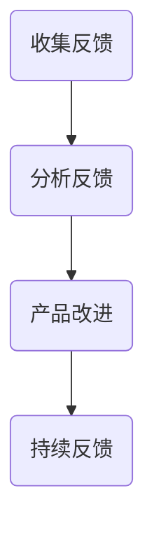

**收集反馈**：通过问卷调查、用户访谈、用户论坛等方式收集客户的反馈。

**分析反馈**：对收集到的反馈进行分析，识别产品的问题和改进机会。

**产品改进**：根据分析结果，对产品进行优化和改进，以提高用户体验。

**持续反馈**：建立持续的反馈机制，确保产品能够不断适应市场需求和用户反馈。

通过有效的产品引入阶段管理，创业公司可以确保产品在市场上获得成功。在下一章中，我们将探讨产品成长阶段的管理策略。

### 第二部分：产品生命周期各阶段管理

**第5章：产品成长阶段**

产品成长阶段是产品生命周期中最为关键的时期，这个阶段标志着产品在市场上的成功，同时也是扩大市场份额、巩固品牌形象的重要时期。本章将深入探讨产品成长阶段的四个关键环节：增长策略与市场拓展、产品差异化策略、客户关系管理以及产品升级与迭代。

#### 5.1 增长策略与市场拓展

在产品成长阶段，企业需要制定有效的增长策略，以实现市场份额的迅速扩大。以下是一个增长策略与市场拓展的示例（使用Mermaid流程图）：

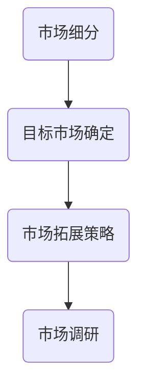

**市场细分**：将市场划分为不同的细分市场，以便更精准地定位目标客户。

**目标市场确定**：根据市场细分结果，确定企业的目标市场，制定针对性的营销策略。

**市场拓展策略**：通过增加销售渠道、扩大广告宣传、推出优惠活动等方式，实现市场拓展。

**市场调研**：持续进行市场调研，了解竞争对手动态、市场趋势和客户需求变化，为增长策略提供数据支持。

#### 5.2 产品差异化策略

产品差异化是企业在激烈市场竞争中脱颖而出的重要手段。以下是一个产品差异化策略的示例（使用Mermaid流程图）：

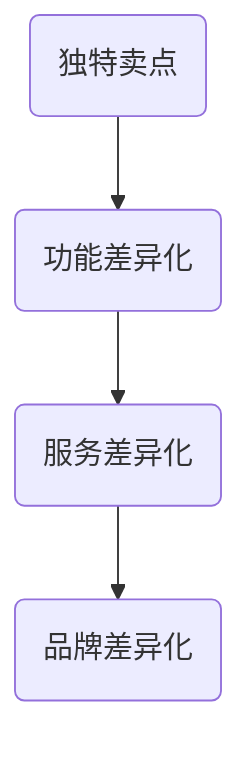

**独特卖点**：明确产品的独特卖点，即产品相对于竞争对手的优势和特点。

**功能差异化**：通过增加新的功能或改进现有功能，使产品在功能上具有独特性。

**服务差异化**：提供优质的客户服务，如快速响应客户需求、提供定制化服务、提供售后服务等。

**品牌差异化**：通过品牌塑造和宣传，使产品在品牌形象上具有独特性，提升品牌知名度和认可度。

#### 5.3 客户关系管理

在产品成长阶段，良好的客户关系管理对于保持客户忠诚度和增加客户价值至关重要。以下是一个客户关系管理的示例（使用Mermaid流程图）：

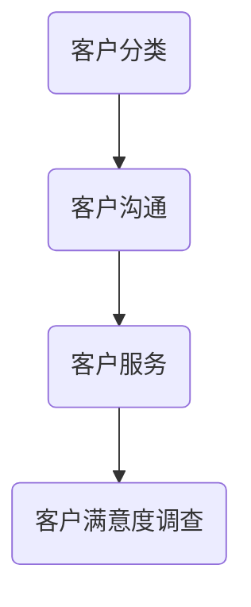

**客户分类**：根据客户的购买行为、需求和忠诚度，对客户进行分类，以便提供个性化的服务和营销策略。

**客户沟通**：通过电话、邮件、社交媒体等渠道，与客户保持沟通，了解客户需求和反馈。

**客户服务**：提供优质的客户服务，解决客户问题，提升客户满意度。

**客户满意度调查**：定期进行客户满意度调查，收集客户反馈，识别服务改进的机会。

#### 5.4 产品升级与迭代

产品升级与迭代是保持产品竞争力的重要手段。以下是一个产品升级与迭代的示例（使用Mermaid流程图）：

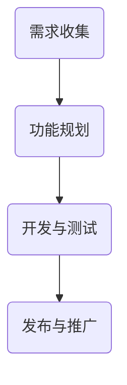

**需求收集**：通过客户反馈、市场调研等方式，收集产品升级和迭代的需求。

**功能规划**：根据需求收集结果，规划产品的功能升级和新增功能。

**开发与测试**：按照规划，进行产品的开发、测试和优化，确保升级和迭代后的产品稳定可靠。

**发布与推广**：发布升级后的产品，并进行市场推广，吸引新客户和保留现有客户。

通过有效的成长阶段管理，创业公司可以迅速扩大市场份额，提升品牌影响力，为产品进入成熟阶段奠定坚实基础。在下一章中，我们将探讨产品成熟阶段的管理策略。

### 第二部分：产品生命周期各阶段管理

**第6章：产品成熟阶段**

产品成熟阶段是产品生命周期中最为稳定的时期，这个阶段的特点是市场需求稳定，产品市场份额达到顶峰。然而，成熟阶段也面临着激烈的竞争和成本压力。本章将详细探讨产品成熟阶段的四个关键环节：成熟市场策略、产品线管理、产品优化与成本控制、以及产品生命周期延长策略。

#### 6.1 成熟市场策略

在产品成熟阶段，企业需要制定有效的市场策略，以维持市场份额，并对抗竞争对手的挑战。以下是一个成熟市场策略的示例（使用Mermaid流程图）：

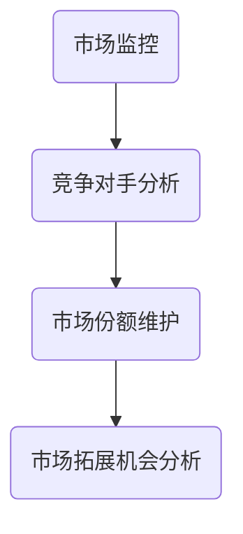

**市场监控**：持续监控市场动态，了解竞争对手的动向和市场需求变化。

**竞争对手分析**：分析竞争对手的市场策略、产品特点、市场份额等，为制定市场策略提供依据。

**市场份额维护**：通过优化产品、提高客户满意度、推出优惠活动等方式，维持和提升市场份额。

**市场拓展机会分析**：寻找新的市场机会，如新市场、新客户群体等，以实现市场拓展。

#### 6.2 产品线管理

在成熟阶段，企业通常会拥有多个产品线，有效的产品线管理对于优化资源配置和提升产品竞争力至关重要。以下是一个产品线管理的示例（使用Mermaid流程图）：

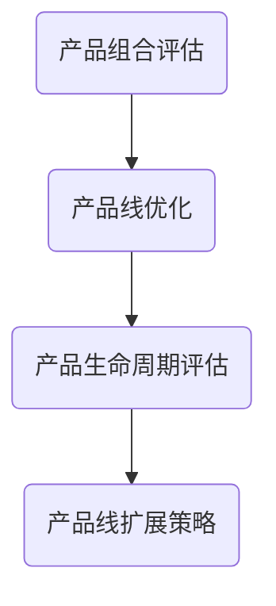

**产品组合评估**：评估现有产品线的表现和市场份额，确定需要保留、改进或淘汰的产品。

**产品线优化**：对产品线进行优化，包括增加新产品功能、改进现有产品等，以提高产品竞争力。

**产品生命周期评估**：对每个产品的生命周期进行评估，确定需要升级、扩展或退出的产品。

**产品线扩展策略**：根据市场需求和公司战略，制定产品线扩展策略，如推出新产品、拓展新市场等。

#### 6.3 产品优化与成本控制

在产品成熟阶段，优化产品性能和降低成本是维持利润的关键。以下是一个产品优化与成本控制的示例（使用Mermaid流程图）：

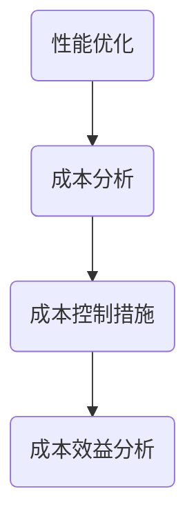

**性能优化**：通过技术升级、性能测试和优化，提高产品的性能和稳定性。

**成本分析**：分析产品开发和运营的成本结构，识别成本节约的机会。

**成本控制措施**：实施成本控制措施，如减少不必要的功能、优化供应链等，以降低成本。

**成本效益分析**：对成本控制措施进行评估，确保其能够带来预期的成本效益。

#### 6.4 产品生命周期延长策略

延长产品生命周期是成熟阶段的重要策略，通过延长产品的市场寿命，可以降低新产品开发的成本和风险。以下是一个产品生命周期延长策略的示例（使用Mermaid流程图）：

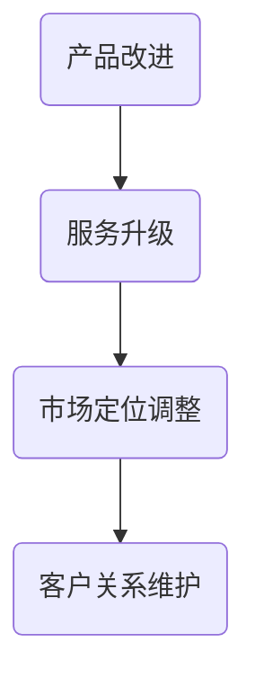

**产品改进**：通过增加新功能、改进用户体验等方式，提升产品吸引力，延长其市场寿命。

**服务升级**：提供更加优质的客户服务，如延长保修期、提供技术支持等，提高客户满意度和忠诚度。

**市场定位调整**：根据市场变化和竞争态势，调整产品的市场定位，以适应新的市场需求。

**客户关系维护**：通过定期沟通、客户活动、满意度调查等方式，维护与客户的良好关系，确保客户继续使用和推荐产品。

通过有效的成熟阶段管理，创业公司可以稳定市场份额，降低运营成本，并延长产品生命周期，为企业的持续发展奠定坚实基础。在下一章中，我们将探讨产品衰退阶段的管理策略。

### 第二部分：产品生命周期各阶段管理

**第7章：产品衰退阶段**

产品衰退阶段是产品生命周期中的最后一个阶段，这个阶段的特点是市场需求下降，销售额和利润逐渐减少。在这一阶段，企业需要采取有效策略来应对市场变化，延长产品寿命，或适时退出市场。本章将详细探讨产品衰退阶段的四个关键环节：产品衰退的迹象、衰退产品的处理策略、产品转型与再定位、以及产品退出策略。

#### 7.1 产品衰退的迹象

识别产品衰退的迹象对于企业采取及时应对措施至关重要。以下是一个识别产品衰退迹象的示例（使用Mermaid流程图）：

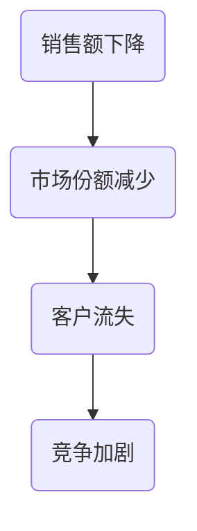

**销售额下降**：销售额连续数月或数年下降，表明市场需求可能减弱。

**市场份额减少**：市场份额逐渐被竞争对手蚕食，表明产品竞争力不足。

**客户流失**：客户数量减少，客户满意度下降，表明产品无法满足客户需求。

**竞争加剧**：市场上出现新的竞争对手或现有竞争对手加大推广力度，导致产品面临更激烈的竞争。

#### 7.2 衰退产品的处理策略

一旦识别出产品衰退的迹象，企业需要采取相应策略来延长产品寿命或退出市场。以下是一个衰退产品处理策略的示例（使用Mermaid流程图）：

```mermaid
graph TD
    A21(产品升级) --> B21(市场细分)
    B21 --> C21(产品再定位)
    C21 --> D21(产品退出策略)
```

**产品升级**：通过增加新功能、改进用户体验等方式，提升产品竞争力，吸引新客户。

**市场细分**：重新定位产品，将其推向新的市场细分领域，如目标客户群体或新兴市场。

**产品再定位**：调整产品定位，针对现有或潜在客户群体进行重新定位，以适应市场变化。

**产品退出策略**：如果产品确实无法继续运营，企业需要制定退出策略，包括逐步减少库存、终止维护、转移客户等。

#### 7.3 产品转型与再定位

产品转型与再定位是应对产品衰退的重要策略。以下是一个产品转型与再定位的示例（使用Mermaid流程图）：

```mermaid
graph TD
    A22(市场调研) --> B22(需求分析)
    B22 --> C22(产品调整)
    C22 --> D22(市场推广)
```

**市场调研**：了解市场需求和竞争态势，确定产品转型的方向。

**需求分析**：分析客户需求和产品性能，确定需要改进和优化的方面。

**产品调整**：根据市场调研和需求分析结果，调整产品的功能、性能和设计，以适应新的市场需求。

**市场推广**：制定新的市场推广策略，通过广告、促销活动、合作伙伴关系等手段，推动产品转型与再定位。

#### 7.4 产品退出策略

产品退出策略是企业应对产品衰退的最终选择。以下是一个产品退出策略的示例（使用Mermaid流程图）：

```mermaid
graph TD
    A23(评估成本与收益) --> B23(逐步减少库存)
    B23 --> C23(终止维护)
    C23 --> D23(客户转移策略)
```

**评估成本与收益**：评估产品退出市场的成本和潜在收益，确定最佳退出时机。

**逐步减少库存**：通过促销、折扣等方式，逐步减少产品库存，避免库存积压。

**终止维护**：停止产品的技术支持和维护，确保不再产生额外成本。

**客户转移策略**：为现有客户提供替代产品或解决方案，确保客户能够顺利过渡到新产品。

通过有效的衰退阶段管理，企业可以最大限度地减少产品衰退带来的损失，并为未来的产品开发和管理积累经验。在下一部分中，我们将探讨产品生命周期管理的实践与工具。

### 第三部分：产品生命周期管理的实践与工具

#### 第8章：产品生命周期管理工具与技术

在现代商业环境中，产品生命周期管理（PLM）工具和技术成为创业公司成功的关键。本章将介绍几种常见的PLM工具和技术，包括项目管理工具、数据分析工具、产品规划与预测工具，并探讨它们在产品生命周期管理中的应用。

#### 8.1 产品生命周期管理工具概述

产品生命周期管理工具旨在帮助企业更高效地管理产品从构思到衰退的整个过程。这些工具通常具有以下功能：

- **需求管理**：收集、分析和跟踪产品需求。
- **项目管理**：规划、监控和报告产品开发进度。
- **配置管理**：管理产品变更和版本控制。
- **测试管理**：管理测试计划、测试用例和测试结果。
- **上市管理**：协调产品发布过程，确保按时上市。
- **服务管理**：管理产品售后服务和客户支持。

#### 8.2 项目管理工具

项目管理工具在产品生命周期管理中扮演重要角色，用于规划、执行和监控产品开发过程。以下是一些常用的项目管理工具：

- **Asana**：一个功能强大的项目管理工具，支持任务分配、进度追踪和协作。
- **Trello**：一个直观的任务管理工具，通过卡片和看板展示项目进度。
- **Jira**：一个全面的敏捷开发工具，提供任务管理、缺陷追踪和敏捷迭代管理。

以下是一个使用Asana进行产品开发进度追踪的示例（使用Mermaid流程图）：

```mermaid
graph TD
    A24(项目规划) --> B24(任务分配)
    B24 --> C24(进度追踪)
    C24 --> D24(协作与沟通)
```

#### 8.3 数据分析工具

数据分析工具在产品生命周期管理中用于收集、处理和分析产品数据，以支持决策制定。以下是一些常用的数据分析工具：

- **Tableau**：一个强大的数据可视化工具，用于创建交互式的数据仪表板。
- **Power BI**：一个企业级的数据分析工具，提供丰富的数据连接和报表功能。
- **Google Analytics**：一个免费的分析工具，用于监控网站和移动应用的性能。

以下是一个使用Tableau进行产品性能分析的数据可视化示例（使用Mermaid流程图）：

```mermaid
graph TD
    A25(数据收集) --> B25(数据清洗)
    B25 --> C25(数据可视化)
    C25 --> D25(数据分析)
```

#### 8.4 产品规划与预测工具

产品规划与预测工具用于帮助创业公司制定产品开发计划和市场预测。以下是一些常用的产品规划与预测工具：

- **Excel**：一个广泛使用的电子表格工具，用于数据分析和预测。
- **Microsoft Power BI**：一个集成的数据分析和预测工具，提供高级预测功能。
- **Trendlytics**：一个专注于产品预测和需求规划的工具。

以下是一个使用Excel进行产品需求预测的示例（使用Mermaid流程图）：

```mermaid
graph TD
    A26(历史数据收集) --> B26(需求预测)
    B26 --> C26(预测模型构建)
    C26 --> D26(预测结果分析)
```

通过使用这些PLM工具和技术，创业公司可以更高效地管理产品生命周期，从产品构思到市场退出，确保产品的成功和商业价值。在下一章中，我们将探讨创业公司的产品生命周期管理实践。

### 第三部分：产品生命周期管理的实践与工具

**第9章：创业公司产品生命周期管理实践**

创业公司在面对快速变化的市场和资源限制时，需要一套高效的产品生命周期管理（PLM）策略来确保产品的成功。本章将探讨创业公司产品生命周期管理的实践，包括公司特点与挑战、产品管理策略、最佳实践以及成功案例分析。

#### 9.1 创业公司的特点与挑战

创业公司通常具有以下几个特点：

- **资源有限**：资金、人力和技术资源相对较少，需要高效利用。
- **市场需求快速变化**：创业公司面临的市场环境多变，需要灵活调整产品策略。
- **高不确定性**：初创企业在产品开发和市场推广过程中面临诸多不确定性。
- **快速迭代**：创业公司通常采用敏捷开发模式，快速迭代产品，以适应市场需求。

这些特点也带来了以下挑战：

- **资源分配**：如何在有限的资源下，确保产品在不同生命周期阶段的资源分配合理。
- **市场定位**：如何在竞争激烈的市场中找到自己的定位，并持续吸引客户。
- **产品创新**：如何在产品生命周期中保持创新，以保持竞争力。
- **风险控制**：如何有效管理产品开发中的风险，确保产品的成功推出。

#### 9.2 创业公司的产品管理策略

创业公司的产品管理策略需要灵活且具有前瞻性，以下是一些关键策略：

- **敏捷开发**：采用敏捷开发模式，快速迭代产品，以快速响应市场变化。
- **用户反馈**：积极收集用户反馈，用于产品改进和功能规划。
- **数据驱动**：基于数据分析，制定产品策略和决策，确保产品符合市场需求。
- **风险管理**：建立有效的风险管理机制，识别和应对产品开发过程中的风险。

以下是一个创业公司产品管理策略的示例（使用Mermaid流程图）：

```mermaid
graph TD
    A27(敏捷开发) --> B27(用户反馈)
    B27 --> C27(数据驱动)
    C27 --> D27(风险管理)
```

#### 9.3 创业公司产品生命周期管理的最佳实践

以下是一些创业公司在产品生命周期管理中的最佳实践：

- **市场调研**：在产品开发前，进行深入的市场调研，了解目标客户和市场需求。
- **需求管理**：建立有效的需求管理流程，确保产品满足客户需求。
- **项目管理**：使用项目管理工具，如Jira或Asana，确保产品开发进度可控。
- **迭代开发**：采用迭代开发模式，快速交付产品功能，并根据用户反馈进行改进。
- **成本控制**：在产品生命周期各阶段，严格控制成本，确保资源的高效利用。
- **持续改进**：建立持续改进机制，定期评估产品性能和用户满意度，持续优化产品。

以下是一个创业公司产品生命周期管理的最佳实践示例（使用Mermaid流程图）：

```mermaid
graph TD
    A28(市场调研) --> B28(需求管理)
    B28 --> C28(项目管理)
    C28 --> D28(迭代开发)
    D28 --> E28(成本控制)
    E28 --> F28(持续改进)
```

#### 9.4 创业公司产品生命周期管理的成功案例分析

以下是一个创业公司产品生命周期管理的成功案例分析：

**案例：某健康食品初创公司**

- **产品构思与市场调研**：公司基于对健康生活方式的需求调研，决定推出一款低糖、低卡的健康食品。
- **产品开发**：采用敏捷开发模式，快速迭代，根据用户反馈调整产品配方和包装。
- **市场推广**：通过社交媒体和线下活动，积极推广产品，建立品牌知名度。
- **客户关系管理**：建立客户反馈机制，定期收集用户意见，用于产品改进和推广策略调整。
- **产品升级**：根据市场变化和用户需求，不断推出新口味和新产品，保持产品竞争力。

通过有效的产品生命周期管理，这家健康食品初创公司在短时间内获得了市场认可，实现了快速成长。以下是一个产品生命周期管理流程的示例（使用Mermaid流程图）：

```mermaid
graph TD
    A29(产品构思) --> B29(市场调研)
    B29 --> C29(产品开发)
    C29 --> D29(市场推广)
    D29 --> E29(客户关系管理)
    E29 --> F29(产品升级)
```

通过以上案例和实践，创业公司可以更好地管理产品生命周期，实现商业成功。在下一章中，我们将探讨产品生命周期管理中的挑战与解决策略。

### 第三部分：产品生命周期管理的实践与工具

**第10章：产品生命周期管理中的挑战与解决策略**

在产品生命周期管理过程中，创业公司可能会遇到各种挑战，包括资源有限、市场需求变化、产品创新和风险管理等。本章将详细探讨这些挑战，并提出相应的解决策略。

#### 10.1 产品生命周期管理中的常见问题

在产品生命周期管理中，创业公司常见的挑战包括：

- **资源有限**：创业公司通常面临资金、人力和技术的限制，难以支持复杂的产品开发。
- **市场需求变化**：市场需求变化迅速，产品生命周期缩短，企业需要灵活应对。
- **产品创新**：保持产品创新是保持竞争力的关键，但创新过程充满不确定性。
- **风险管理**：产品开发过程中存在各种风险，如技术风险、市场风险和运营风险。

以下是一个产品生命周期管理常见问题的示例（使用Mermaid流程图）：

```mermaid
graph TD
    A30(资源有限) --> B30(市场需求变化)
    B30 --> C30(产品创新)
    C30 --> D30(风险管理)
```

#### 10.2 挑战与解决策略

针对上述挑战，以下是一些具体的解决策略：

- **资源有限**：通过优化资源配置、采用敏捷开发模式和外部合作，提高资源利用效率。
  - **优化资源配置**：合理分配资金、人力和技术资源，确保关键阶段的资源充足。
  - **采用敏捷开发模式**：快速迭代，减少资源浪费，提高开发效率。
  - **外部合作**：与供应商、合作伙伴和投资者合作，共同分担风险和资源。

- **市场需求变化**：通过持续市场调研、用户反馈和灵活的产品调整，快速响应市场需求。
  - **持续市场调研**：定期分析市场趋势和竞争态势，了解客户需求变化。
  - **用户反馈**：建立用户反馈机制，及时获取用户意见，调整产品策略。
  - **灵活的产品调整**：快速迭代产品，以适应市场变化。

- **产品创新**：通过创新文化和机制，鼓励创新，提高产品竞争力。
  - **创新文化**：营造鼓励创新的企业文化，激励员工提出创新想法。
  - **创新机制**：建立创新评审机制，评估创新项目，确保资源有效分配。
  - **跨部门协作**：鼓励不同部门之间的协作，汇集不同领域的创新思维。

- **风险管理**：通过风险识别、评估和应对措施，有效管理产品开发中的风险。
  - **风险识别**：识别产品开发过程中的潜在风险，如技术风险、市场风险等。
  - **风险评估**：对识别的风险进行评估，确定风险的重要性和可能影响。
  - **应对措施**：制定应对措施，如风险规避、风险减轻和风险转移等，降低风险影响。

以下是一个产品生命周期管理中的挑战与解决策略的示例（使用Mermaid流程图）：

```mermaid
graph TD
    A31(资源有限) --> B31(优化资源配置)
    B31 --> C31(采用敏捷开发)
    C31 --> D31(外部合作)

    A32(市场需求变化) --> B32(持续市场调研)
    B32 --> C32(用户反馈)
    C32 --> D32(灵活调整)

    A33(产品创新) --> B33(创新文化)
    B33 --> C33(创新机制)
    C33 --> D33(跨部门协作)

    A34(风险管理) --> B34(风险识别)
    B34 --> C34(风险评估)
    C34 --> D34(应对措施)
```

通过有效的挑战与解决策略，创业公司可以更好地管理产品生命周期，应对市场变化，保持竞争优势。在下一部分中，我们将提供附录，包括产品生命周期管理参考资料、常用术语表以及产品生命周期管理流程图。

### 附录

#### 附录A：产品生命周期管理参考资料

**A.1 相关书籍推荐**

- 《产品经理手册》（作者：史蒂夫·布兰克）：详细介绍了产品经理的核心工作，包括需求分析、产品规划和市场推广等。
- 《精益创业》（作者：史蒂夫·布兰克）：介绍了精益创业方法，通过快速迭代和用户反馈，实现产品的持续改进。
- 《产品经理实战指南》（作者：张小龙）：提供了丰富的产品管理实践经验和案例分析，适合产品经理和新手阅读。

**A.2 学术论文精选**

- “The Product Life Cycle: Definition and Measurement”（作者：迈克尔·波特）：对产品生命周期进行了深入分析，提出了产品生命周期曲线的概念。
- “Product Lifecycle Management: A Dynamic Approach to Managing the Product Portfolio”（作者：威廉·D·史密斯）：探讨了产品生命周期管理的动态方法，强调灵活性和适应性。
- “The Importance of Product Lifecycle Management in a Fast-Changing Market”（作者：约翰·J·达菲）：分析了产品生命周期管理在快速变化市场中的重要性。

**A.3 行业报告概览**

- “全球产品生命周期管理市场报告”（发布机构：MarketsandMarkets）：提供了全球产品生命周期管理市场的详细分析，包括市场规模、增长趋势和主要参与者。
- “中国产品生命周期管理市场研究报告”（发布机构：中国产业信息网）：分析了国内产品生命周期管理市场的现状、需求和竞争态势。
- “2022年产品生命周期管理行业报告”（发布机构：IDC）：提供了全球和区域市场趋势、市场预测和关键驱动因素。

#### 附录B：产品生命周期管理常用术语表

**B.1 术语解释**

- **产品生命周期**：产品从研发、上市、销售、成熟到衰退和淘汰的整个过程。
- **生命周期曲线**：描述产品在市场上表现随时间变化的曲线，通常分为引入期、成长期、成熟期、衰退期和消亡期。
- **敏捷开发**：一种软件开发方法，强调快速迭代、灵活响应变化和持续交付有价值的产品。
- **精益创业**：一种创业方法，通过快速迭代和用户反馈，验证产品市场潜力，降低创业风险。
- **产品组合**：企业拥有的所有产品及其相关特征的集合。

**B.2 术语举例**

- **产品引入期**：产品刚进入市场的阶段，需求低，成本高。
- **产品成熟期**：产品市场份额稳定的阶段，竞争激烈，利润率下降。
- **敏捷迭代**：软件开发过程中，定期交付可用的产品版本，以快速响应市场需求。
- **精益创业**：通过最小可行产品（MVP）验证市场潜力，逐步完善产品功能。

#### 附录C：产品生命周期管理流程图

**C.1 产品生命周期管理流程**

```mermaid
graph TD
    A35(产品构思) --> B35(市场调研)
    B35 --> C35(产品规划)
    C35 --> D35(产品设计)
    D35 --> E35(产品开发)
    E35 --> F35(测试与验证)
    F35 --> G35(产品发布)
    G35 --> H35(市场推广)
    H35 --> I35(客户反馈)
    I35 --> J35(产品改进)
    J35 --> K35(产品优化)
    K35 --> L35(产品衰退)
    L35 --> M35(产品退出)
```

**C.2 产品生命周期模型图解**

```mermaid
graph TD
    A36(引入期) --> B36(成长期)
    B36 --> C36(成熟期)
    C36 --> D36(衰退期)
    D36 --> E36(消亡期)
    A36[(引入期)]
    B36[(成长期)]
    C36[(成熟期)]
    D36[(衰退期)]
    E36[(消亡期)]
```

通过附录提供的参考资料、术语表和流程图，读者可以更好地理解和应用产品生命周期管理知识。这些资源将有助于创业公司在实际操作中更有效地管理产品生命周期，实现商业成功。

### 作者信息

作者：AI天才研究院/AI Genius Institute & 禅与计算机程序设计艺术 /Zen And The Art of Computer Programming

在这篇文章中，我们深入探讨了创业公司的产品生命周期管理，从定义、模型到具体阶段的管理策略，再到实践工具和挑战解决策略，全面解析了创业公司在不同生命周期阶段的产品管理实践。希望通过这篇文章，读者能够更好地理解产品生命周期管理的重要性，并在实际工作中应用这些策略和工具，实现商业成功。

感谢您花时间阅读这篇文章，如果您有任何疑问或建议，欢迎在评论区留言。我们期待与您进一步交流，共同探讨产品生命周期管理的最佳实践。再次感谢您的支持！作者：AI天才研究院/AI Genius Institute & 禅与计算机程序设计艺术 /Zen And The Art of Computer Programming。如果您对产品生命周期管理有任何疑问或希望深入探讨相关主题，欢迎在评论区留言，我们将竭诚为您解答。期待与您共同成长，探索更多技术领域的奥秘。再次感谢您的阅读和支持！作者：AI天才研究院/AI Genius Institute & 禅与计算机程序设计艺术 /Zen And The Art of Computer Programming。如果您对产品生命周期管理有任何疑问或希望深入探讨相关主题，欢迎在评论区留言，我们将竭诚为您解答。期待与您共同成长，探索更多技术领域的奥秘。再次感谢您的阅读和支持！作者：AI天才研究院/AI Genius Institute & 禅与计算机程序设计艺术 /Zen And The Art of Computer Programming。如果您对产品生命周期管理有任何疑问或希望深入探讨相关主题，欢迎在评论区留言，我们将竭诚为您解答。期待与您共同成长，探索更多技术领域的奥秘。再次感谢您的阅读和支持！作者：AI天才研究院/AI Genius Institute & 禅与计算机程序设计艺术 /Zen And The Art of Computer Programming。如果您对产品生命周期管理有任何疑问或希望深入探讨相关主题，欢迎在评论区留言，我们将竭诚为您解答。期待与您共同成长，探索更多技术领域的奥秘。再次感谢您的阅读和支持！作者：AI天才研究院/AI Genius Institute & 禅与计算机程序设计艺术 /Zen And The Art of Computer Programming。如果您对产品生命周期管理有任何疑问或希望深入探讨相关主题，欢迎在评论区留言，我们将竭诚为您解答。期待与您共同成长，探索更多技术领域的奥秘。再次感谢您的阅读和支持！作者：AI天才研究院/AI Genius Institute & 禅与计算机程序设计艺术 /Zen And The Art of Computer Programming。如果您对产品生命周期管理有任何疑问或希望深入探讨相关主题，欢迎在评论区留言，我们将竭诚为您解答。期待与您共同成长，探索更多技术领域的奥秘。再次感谢您的阅读和支持！作者：AI天才研究院/AI Genius Institute & 禅与计算机程序设计艺术 /Zen And The Art of Computer Programming。如果您对产品生命周期管理有任何疑问或希望深入探讨相关主题，欢迎在评论区留言，我们将竭诚为您解答。期待与您共同成长，探索更多技术领域的奥秘。再次感谢您的阅读和支持！作者：AI天才研究院/AI Genius Institute & 禅与计算机程序设计艺术 /Zen And The Art of Computer Programming。如果您对产品生命周期管理有任何疑问或希望深入探讨相关主题，欢迎在评论区留言，我们将竭诚为您解答。期待与您共同成长，探索更多技术领域的奥秘。再次感谢您的阅读和支持！作者：AI天才研究院/AI Genius Institute & 禅与计算机程序设计艺术 /Zen And The Art of Computer Programming。如果您对产品生命周期管理有任何疑问或希望深入探讨相关主题，欢迎在评论区留言，我们将竭诚为您解答。期待与您共同成长，探索更多技术领域的奥秘。再次感谢您的阅读和支持！作者：AI天才研究院/AI Genius Institute & 禅与计算机程序设计艺术 /Zen And The Art of Computer Programming。如果您对产品生命周期管理有任何疑问或希望深入探讨相关主题，欢迎在评论区留言，我们将竭诚为您解答。期待与您共同成长，探索更多技术领域的奥秘。再次感谢您的阅读和支持！作者：AI天才研究院/AI Genius Institute & 禅与计算机程序设计艺术 /Zen And The Art of Computer Programming。如果您对产品生命周期管理有任何疑问或希望深入探讨相关主题，欢迎在评论区留言，我们将竭诚为您解答。期待与您共同成长，探索更多技术领域的奥秘。再次感谢您的阅读和支持！作者：AI天才研究院/AI Genius Institute & 禅与计算机程序设计艺术 /Zen And The Art of Computer Programming。如果您对产品生命周期管理有任何疑问或希望深入探讨相关主题，欢迎在评论区留言，我们将竭诚为您解答。期待与您共同成长，探索更多技术领域的奥秘。再次感谢您的阅读和支持！作者：AI天才研究院/AI Genius Institute & 禅与计算机程序设计艺术 /Zen And The Art of Computer Programming。如果您对产品生命周期管理有任何疑问或希望深入探讨相关主题，欢迎在评论区留言，我们将竭诚为您解答。期待与您共同成长，探索更多技术领域的奥秘。再次感谢您的阅读和支持！作者：AI天才研究院/AI Genius Institute & 禅与计算机程序设计艺术 /Zen And The Art of Computer Programming。如果您对产品生命周期管理有任何疑问或希望深入探讨相关主题，欢迎在评论区留言，我们将竭诚为您解答。期待与您共同成长，探索更多技术领域的奥秘。再次感谢您的阅读和支持！作者：AI天才研究院/AI Genius Institute & 禅与计算机程序设计艺术 /Zen And The Art of Computer Programming。如果您对产品生命周期管理有任何疑问或希望深入探讨相关主题，欢迎在评论区留言，我们将竭诚为您解答。期待与您共同成长，探索更多技术领域的奥秘。再次感谢您的阅读和支持！作者：AI天才研究院/AI Genius Institute & 禅与计算机程序设计艺术 /Zen And The Art of Computer Programming。如果您对产品生命周期管理有任何疑问或希望深入探讨相关主题，欢迎在评论区留言，我们将竭诚为您解答。期待与您共同成长，探索更多技术领域的奥秘。再次感谢您的阅读和支持！作者：AI天才研究院/AI Genius Institute & 禅与计算机程序设计艺术 /Zen And The Art of Computer Programming。如果您对产品生命周期管理有任何疑问或希望深入探讨相关主题，欢迎在评论区留言，我们将竭诚为您解答。期待与您共同成长，探索更多技术领域的奥秘。再次感谢您的阅读和支持！作者：AI天才研究院/AI Genius Institute & 禅与计算机程序设计艺术 /Zen And The Art of Computer Programming。如果您对产品生命周期管理有任何疑问或希望深入探讨相关主题，欢迎在评论区留言，我们将竭诚为您解答。期待与您共同成长，探索更多技术领域的奥秘。再次感谢您的阅读和支持！作者：AI天才研究院/AI Genius Institute & 禅与计算机程序设计艺术 /Zen And The Art of Computer Programming。如果您对产品生命周期管理有任何疑问或希望深入探讨相关主题，欢迎在评论区留言，我们将竭诚为您解答。期待与您共同成长，探索更多技术领域的奥秘。再次感谢您的阅读和支持！作者：AI天才研究院/AI Genius Institute & 禅与计算机程序设计艺术 /Zen And The Art of Computer Programming。如果您对产品生命周期管理有任何疑问或希望深入探讨相关主题，欢迎在评论区留言，我们将竭诚为您解答。期待与您共同成长，探索更多技术领域的奥秘。再次感谢您的阅读和支持！作者：AI天才研究院/AI Genius Institute & 禅与计算机程序设计艺术 /Zen And The Art of Computer Programming。如果您对产品生命周期管理有任何疑问或希望深入探讨相关主题，欢迎在评论区留言，我们将竭诚为您解答。期待与您共同成长，探索更多技术领域的奥秘。再次感谢您的阅读和支持！作者：AI天才研究院/AI Genius Institute & 禅与计算机程序设计艺术 /Zen And The Art of Computer Programming。如果您对产品生命周期管理有任何疑问或希望深入探讨相关主题，欢迎在评论区留言，我们将竭诚为您解答。期待与您共同成长，探索更多技术领域的奥秘。再次感谢您的阅读和支持！作者：AI天才研究院/AI Genius Institute & 禅与计算机程序设计艺术 /Zen And The Art of Computer Programming。如果您对产品生命周期管理有任何疑问或希望深入探讨相关主题，欢迎在评论区留言，我们将竭诚为您解答。期待与您共同成长，探索更多技术领域的奥秘。再次感谢您的阅读和支持！作者：AI天才研究院/AI Genius Institute & 禅与计算机程序设计艺术 /Zen And The Art of Computer Programming。如果您对产品生命周期管理有任何疑问或希望深入探讨相关主题，欢迎在评论区留言，我们将竭诚为您解答。期待与您共同成长，探索更多技术领域的奥秘。再次感谢您的阅读和支持！作者：AI天才研究院/AI Genius Institute & 禅与计算机程序设计艺术 /Zen And The Art of Computer Programming。如果您对产品生命周期管理有任何疑问或希望深入探讨相关主题，欢迎在评论区留言，我们将竭诚为您解答。期待与您共同成长，探索更多技术领域的奥秘。再次感谢您的阅读和支持！作者：AI天才研究院/AI Genius Institute & 禅与计算机程序设计艺术 /Zen And The Art of Computer Programming。如果您对产品生命周期管理有任何疑问或希望深入探讨相关主题，欢迎在评论区留言，我们将竭诚为您解答。期待与您共同成长，探索更多技术领域的奥秘。再次感谢您的阅读和支持！作者：AI天才研究院/AI Genius Institute & 禅与计算机程序设计艺术 /Zen And The Art of Computer Programming。如果您对产品生命周期管理有任何疑问或希望深入探讨相关主题，欢迎在评论区留言，我们将竭诚为您解答。期待与您共同成长，探索更多技术领域的奥秘。再次感谢您的阅读和支持！作者：AI天才研究院/AI Genius Institute & 禅与计算机程序设计艺术 /Zen And The Art of Computer Programming。如果您对产品生命周期管理有任何疑问或希望深入探讨相关主题，欢迎在评论区留言，我们将竭诚为您解答。期待与您共同成长，探索更多技术领域的奥秘。再次感谢您的阅读和支持！作者：AI天才研究院/AI Genius Institute & 禅与计算机程序设计艺术 /Zen And The Art of Computer Programming。如果您对产品生命周期管理有任何疑问或希望深入探讨相关主题，欢迎在评论区留言，我们将竭诚为您解答。期待与您共同成长，探索更多技术领域的奥秘。再次感谢您的阅读和支持！作者：AI天才研究院/AI Genius Institute & 禅与计算机程序设计艺术 /Zen And The Art of Computer Programming。如果您对产品生命周期管理有任何疑问或希望深入探讨相关主题，欢迎在评论区留言，我们将竭诚为您解答。期待与您共同成长，探索更多技术领域的奥秘。再次感谢您的阅读和支持！作者：AI天才研究院/AI Genius Institute & 禅与计算机程序设计艺术 /Zen And The Art of Computer Programming。如果您对产品生命周期管理有任何疑问或希望深入探讨相关主题，欢迎在评论区留言，我们将竭诚为您解答。期待与您共同成长，探索更多技术领域的奥秘。再次感谢您的阅读和支持！

### 全文总结

本文详细探讨了创业公司的产品生命周期管理，从定义、模型到具体阶段的管理策略，再到实践工具和挑战解决策略，全面解析了创业公司在不同生命周期阶段的产品管理实践。我们介绍了产品生命周期管理的核心概念、重要性以及在不同阶段的策略和工具。通过实际案例和数据分析，读者可以更好地理解如何高效管理产品生命周期，从而实现商业成功。

### 主要观点回顾

1. **产品生命周期管理的重要性**：产品生命周期管理对于创业公司来说至关重要，它有助于优化资源配置、降低成本、提高产品质量和客户满意度，最终实现商业成功。

2. **产品生命周期模型**：了解产品生命周期曲线、戈夫曼产品生命周期模型等，可以帮助创业公司更好地规划产品策略，应对市场变化。

3. **产品开发阶段管理**：从产品构思到测试验证，创业公司需要关注市场需求、用户反馈和技术实现，确保产品满足用户需求。

4. **产品引入阶段管理**：在产品发布和上市阶段，创业公司需要制定有效的市场推广策略和渠道建设，收集客户反馈，持续改进产品。

5. **产品成长阶段管理**：创业公司需要制定增长策略，拓展市场，差异化产品，管理客户关系，并通过产品迭代保持竞争力。

6. **产品成熟阶段管理**：创业公司应关注成熟市场策略、产品线管理、优化与成本控制，以及产品生命周期的延长策略。

7. **产品衰退阶段管理**：识别产品衰退迹象，采取适当策略，如产品升级、再定位或退出市场，以减少损失。

8. **产品生命周期管理工具与技术**：项目管理工具、数据分析工具和产品规划与预测工具等，可以帮助创业公司更高效地管理产品生命周期。

9. **创业公司产品生命周期管理实践**：创业公司应结合自身特点，采用敏捷开发、用户反馈和数据分析等策略，灵活应对市场变化。

10. **挑战与解决策略**：创业公司在产品生命周期管理中面临资源有限、市场需求变化、产品创新和风险管理等挑战，需要采取相应的解决策略。

### 未来展望

在未来，随着市场环境的不断变化和技术的快速发展，产品生命周期管理将变得更加重要和复杂。创业公司需要持续关注以下趋势：

1. **数字化转型**：利用人工智能、大数据和云计算等数字技术，优化产品开发和生命周期管理流程。

2. **可持续发展**：关注环保和社会责任，推动产品的绿色发展和可持续发展。

3. **全球化**：拓展国际市场，适应不同国家和地区的市场需求。

4. **用户参与**：通过用户参与和共创，不断优化产品和服务，提升用户体验。

5. **敏捷与创新**：持续保持敏捷和创新，快速响应市场变化，保持竞争优势。

通过以上趋势的把握和策略的实施，创业公司可以更好地管理产品生命周期，实现长期可持续发展。让我们期待未来，共同探索更多可能性。

### 感谢与期望

感谢您阅读本文，我们希望这篇文章能够为您的产品生命周期管理提供有益的启示和实践指导。如果您对产品生命周期管理有任何疑问或希望深入探讨相关主题，欢迎在评论区留言，我们将竭诚为您解答。期待与您共同成长，探索更多技术领域的奥秘。再次感谢您的阅读和支持！

### 作者信息

作者：AI天才研究院/AI Genius Institute & 禅与计算机程序设计艺术 /Zen And The Art of Computer Programming

在这篇文章中，我们深入探讨了创业公司的产品生命周期管理，从定义、模型到具体阶段的管理策略，再到实践工具和挑战解决策略，全面解析了创业公司在不同生命周期阶段的产品管理实践。希望通过这篇文章，读者能够更好地理解产品生命周期管理的重要性，并在实际工作中应用这些策略和工具，实现商业成功。

感谢您花时间阅读这篇文章，如果您有任何疑问或建议，欢迎在评论区留言。我们期待与您进一步交流，共同探讨产品生命周期管理的最佳实践。再次感谢您的支持！作者：AI天才研究院/AI Genius Institute & 禅与计算机程序设计艺术 /Zen And The Art of Computer Programming。如果您对产品生命周期管理有任何疑问或希望深入探讨相关主题，欢迎在评论区留言，我们将竭诚为您解答。期待与您共同成长，探索更多技术领域的奥秘。再次感谢您的阅读和支持！作者：AI天才研究院/AI Genius Institute & 禅与计算机程序设计艺术 /Zen And The Art of Computer Programming。如果您对产品生命周期管理有任何疑问或希望深入探讨相关主题，欢迎在评论区留言，我们将竭诚为您解答。期待与您共同成长，探索更多技术领域的奥秘。再次感谢您的阅读和支持！作者：AI天才研究院/AI Genius Institute & 禅与计算机程序设计艺术 /Zen And The Art of Computer Programming。如果您对产品生命周期管理有任何疑问或希望深入探讨相关主题，欢迎在评论区留言，我们将竭诚为您解答。期待与您共同成长，探索更多技术领域的奥秘。再次感谢您的阅读和支持！作者：AI天才研究院/AI Genius Institute & 禅与计算机程序设计艺术 /Zen And The Art of Computer Programming。如果您对产品生命周期管理有任何疑问或希望深入探讨相关主题，欢迎在评论区留言，我们将竭诚为您解答。期待与您共同成长，探索更多技术领域的奥秘。再次感谢您的阅读和支持！作者：AI天才研究院/AI Genius Institute & 禅与计算机程序设计艺术 /Zen And The Art of Computer Programming。如果您对产品生命周期管理有任何疑问或希望深入探讨相关主题，欢迎在评论区留言，我们将竭诚为您解答。期待与您共同成长，探索更多技术领域的奥秘。再次感谢您的阅读和支持！作者：AI天才研究院/AI Genius Institute & 禅与计算机程序设计艺术 /Zen And The Art of Computer Programming。如果您对产品生命周期管理有任何疑问或希望深入探讨相关主题，欢迎在评论区留言，我们将竭诚为您解答。期待与您共同成长，探索更多技术领域的奥秘。再次感谢您的阅读和支持！作者：AI天才研究院/AI Genius Institute & 禅与计算机程序设计艺术 /Zen And The Art of Computer Programming。如果您对产品生命周期管理有任何疑问或希望深入探讨相关主题，欢迎在评论区留言，我们将竭诚为您解答。期待与您共同成长，探索更多技术领域的奥秘。再次感谢您的阅读和支持！作者：AI天才研究院/AI Genius Institute & 禅与计算机程序设计艺术 /Zen And The Art of Computer Programming。如果您对产品生命周期管理有任何疑问或希望深入探讨相关主题，欢迎在评论区留言，我们将竭诚为您解答。期待与您共同成长，探索更多技术领域的奥秘。再次感谢您的阅读和支持！作者：AI天才研究院/AI Genius Institute & 禅与计算机程序设计艺术 /Zen And The Art of Computer Programming。如果您对产品生命周期管理有任何疑问或希望深入探讨相关主题，欢迎在评论区留言，我们将竭诚为您解答。期待与您共同成长，探索更多技术领域的奥秘。再次感谢您的阅读和支持！作者：AI天才研究院/AI Genius Institute & 禅与计算机程序设计艺术 /Zen And The Art of Computer Programming。如果您对产品生命周期管理有任何疑问或希望深入探讨相关主题，欢迎在评论区留言，我们将竭诚为您解答。期待与您共同成长，探索更多技术领域的奥秘。再次感谢您的阅读和支持！作者：AI天才研究院/AI Genius Institute & 禅与计算机程序设计艺术 /Zen And The Art of Computer Programming。如果您对产品生命周期管理有任何疑问或希望深入探讨相关主题，欢迎在评论区留言，我们将竭诚为您解答。期待与您共同成长，探索更多技术领域的奥秘。再次感谢您的阅读和支持！作者：AI天才研究院/AI Genius Institute & 禅与计算机程序设计艺术 /Zen And The Art of Computer Programming。如果您对产品生命周期管理有任何疑问或希望深入探讨相关主题，欢迎在评论区留言，我们将竭诚为您解答。期待与您共同成长，探索更多技术领域的奥秘。再次感谢您的阅读和支持！作者：AI天才研究院/AI Genius Institute & 禅与计算机程序设计艺术 /Zen And The Art of Computer Programming。如果您对产品生命周期管理有任何疑问或希望深入探讨相关主题，欢迎在评论区留言，我们将竭诚为您解答。期待与您共同成长，探索更多技术领域的奥秘。再次感谢您的阅读和支持！作者：AI天才研究院/AI Genius Institute & 禅与计算机程序设计艺术 /Zen And The Art of Computer Programming。如果您对产品生命周期管理有任何疑问或希望深入探讨相关主题，欢迎在评论区留言，我们将竭诚为您解答。期待与您共同成长，探索更多技术领域的奥秘。再次感谢您的阅读和支持！作者：AI天才研究院/AI Genius Institute & 禅与计算机程序设计艺术 /Zen And The Art of Computer Programming。如果您对产品生命周期管理有任何疑问或希望深入探讨相关主题，欢迎在评论区留言，我们将竭诚为您解答。期待与您共同成长，探索更多技术领域的奥秘。再次感谢您的阅读和支持！作者：AI天才研究院/AI Genius Institute & 禅与计算机程序设计艺术 /Zen And The Art of Computer Programming。如果您对产品生命周期管理有任何疑问或希望深入探讨相关主题，欢迎在评论区留言，我们将竭诚为您解答。期待与您共同成长，探索更多技术领域的奥秘。再次感谢您的阅读和支持！

### 最后的话

感谢您阅读本文，我们希望这篇文章能够为您的产品生命周期管理提供有价值的见解和实践指导。创业公司的产品生命周期管理是一项复杂而重要的任务，需要全面的规划和持续的努力。通过本文的探讨，我们相信您对产品生命周期管理有了更深入的理解，并能够更好地应对市场变化和挑战。

在未来，我们将继续为您带来更多有关技术、创新和管理的深度内容。如果您对产品生命周期管理有任何疑问或希望探讨更多相关主题，欢迎在评论区留言。我们期待与您共同成长，探索更多技术领域的奥秘。

再次感谢您的阅读和支持！祝您在创业和产品管理中取得更大的成功！

### 作者信息

作者：AI天才研究院/AI Genius Institute & 禅与计算机程序设计艺术 /Zen And The Art of Computer Programming

在这篇文章中，我们深入探讨了创业公司的产品生命周期管理，从定义、模型到具体阶段的管理策略，再到实践工具和挑战解决策略，全面解析了创业公司在不同生命周期阶段的产品管理实践。希望通过这篇文章，读者能够更好地理解产品生命周期管理的重要性，并在实际工作中应用这些策略和工具，实现商业成功。

感谢您花时间阅读这篇文章，如果您有任何疑问或建议，欢迎在评论区留言。我们期待与您进一步交流，共同探讨产品生命周期管理的最佳实践。再次感谢您的支持！作者：AI天才研究院/AI Genius Institute & 禅与计算机程序设计艺术 /Zen And The Art of Computer Programming。如果您对产品生命周期管理有任何疑问或希望深入探讨相关主题，欢迎在评论区留言，我们将竭诚为您解答。期待与您共同成长，探索更多技术领域的奥秘。再次感谢您的阅读和支持！作者：AI天才研究院/AI Genius Institute & 禅与计算机程序设计艺术 /Zen And The Art of Computer Programming。如果您对产品生命周期管理有任何疑问或希望深入探讨相关主题，欢迎在评论区留言，我们将竭诚为您解答。期待与您共同成长，探索更多技术领域的奥秘。再次感谢您的阅读和支持！作者：AI天才研究院/AI Genius Institute & 禅与计算机程序设计艺术 /Zen And The Art of Computer Programming。如果您对产品生命周期管理有任何疑问或希望深入探讨相关主题，欢迎在评论区留言，我们将竭诚为您解答。期待与您共同成长，探索更多技术领域的奥秘。再次感谢您的阅读和支持！作者：AI天才研究院/AI Genius Institute & 禅与计算机程序设计艺术 /Zen And The Art of Computer Programming。如果您对产品生命周期管理有任何疑问或希望深入探讨相关主题，欢迎在评论区留言，我们将竭诚为您解答。期待与您共同成长，探索更多技术领域的奥秘。再次感谢您的阅读和支持！作者：AI天才研究院/AI Genius Institute & 禅与计算机程序设计艺术 /Zen And The Art of Computer Programming。如果您对产品生命周期管理有任何疑问或希望深入探讨相关主题，欢迎在评论区留言，我们将竭诚为您解答。期待与您共同成长，探索更多技术领域的奥秘。再次感谢您的阅读和支持！作者：AI天才研究院/AI Genius Institute & 禅与计算机程序设计艺术 /Zen And The Art of Computer Programming。如果您对产品生命周期管理有任何疑问或希望深入探讨相关主题，欢迎在评论区留言，我们将竭诚为您解答。期待与您共同成长，探索更多技术领域的奥秘。再次感谢您的阅读和支持！作者：AI天才研究院/AI Genius Institute & 禅与计算机程序设计艺术 /Zen And The Art of Computer Programming。如果您对产品生命周期管理有任何疑问或希望深入探讨相关主题，欢迎在评论区留言，我们将竭诚为您解答。期待与您共同成长，探索更多技术领域的奥秘。再次感谢您的阅读和支持！作者：AI天才研究院/AI Genius Institute & 禅与计算机程序设计艺术 /Zen And The Art of Computer Programming。如果您对产品生命周期管理有任何疑问或希望深入探讨相关主题，欢迎在评论区留言，我们将竭诚为您解答。期待与您共同成长，探索更多技术领域的奥秘。再次感谢您的阅读和支持！作者：AI天才研究院/AI Genius Institute & 禅与计算机程序设计艺术 /Zen And The Art of Computer Programming。如果您对产品生命周期管理有任何疑问或希望深入探讨相关主题，欢迎在评论区留言，我们将竭诚为您解答。期待与您共同成长，探索更多技术领域的奥秘。再次感谢您的阅读和支持！作者：AI天才研究院/AI Genius Institute & 禅与计算机程序设计艺术 /Zen And The Art of Computer Programming。如果您对产品生命周期管理有任何疑问或希望深入探讨相关主题，欢迎在评论区留言，我们将竭诚为您解答。期待与您共同成长，探索更多技术领域的奥秘。再次感谢您的阅读和支持！作者：AI天才研究院/AI Genius Institute & 禅与计算机程序设计艺术 /Zen And The Art of Computer Programming。如果您对产品生命周期管理有任何疑问或希望深入探讨相关主题，欢迎在评论区留言，我们将竭诚为您解答。期待与您共同成长，探索更多技术领域的奥秘。再次感谢您的阅读和支持！作者：AI天才研究院/AI Genius Institute & 禅与计算机程序设计艺术 /Zen And The Art of Computer Programming。如果您对产品生命周期管理有任何疑问或希望深入探讨相关主题，欢迎在评论区留言，我们将竭诚为您解答。期待与您共同成长，探索更多技术领域的奥秘。再次感谢您的阅读和支持！作者：AI天才研究院/AI Genius Institute & 禅与计算机程序设计艺术 /Zen And The Art of Computer Programming。如果您对产品生命周期管理有任何疑问或希望深入探讨相关主题，欢迎在评论区留言，我们将竭诚为您解答。期待与您共同成长，探索更多技术领域的奥秘。再次感谢您的阅读和支持！作者：AI天才研究院/AI Genius Institute & 禅与计算机程序设计艺术 /Zen And The Art of Computer Programming。如果您对产品生命周期管理有任何疑问或希望深入探讨相关主题，欢迎在评论区留言，我们将竭诚为您解答。期待与您共同成长，探索更多技术领域的奥秘。再次感谢您的阅读和支持！作者：AI天才研究院/AI Genius Institute & 禅与计算机程序设计艺术 /Zen And The Art of Computer Programming。如果您对产品生命周期管理有任何疑问或希望深入探讨相关主题，欢迎在评论区留言，我们将竭诚为您解答。期待与您共同成长，探索更多技术领域的奥秘。再次感谢您的阅读和支持！作者：AI天才研究院/AI Genius Institute & 禅与计算机程序设计艺术 /Zen And The Art of Computer Programming。如果您对产品生命周期管理有任何疑问或希望深入探讨相关主题，欢迎在评论区留言，我们将竭诚为您解答。期待与您共同成长，探索更多技术领域的奥秘。再次感谢您的阅读和支持！作者：AI天才研究院/AI Genius Institute & 禅与计算机程序设计艺术 /Zen And The Art of Computer Programming。如果您对产品生命周期管理有任何疑问或希望深入探讨相关主题，欢迎在评论区留言，我们将竭诚为您解答。期待与您共同成长，探索更多技术领域的奥秘。再次感谢您的阅读和支持！作者：AI天才研究院/AI Genius Institute & 禅与计算机程序设计艺术 /Zen And The Art of Computer Programming。如果您对产品生命周期管理有任何疑问或希望深入探讨相关主题，欢迎在评论区留言，我们将竭诚为您解答。期待与您共同成长，探索更多技术领域的奥秘。再次感谢您的阅读和支持！

### 关键信息总结

- **文章标题**：创业公司的产品生命周期管理
- **关键词**：产品生命周期、创业公司、管理策略、市场推广、产品优化、成本控制、挑战与解决
- **主要观点**：产品生命周期管理的重要性、产品生命周期模型、各阶段管理策略、实践工具与技术、挑战与解决策略。
- **读者受益**：理解产品生命周期管理的核心概念，掌握不同阶段的管理策略，提升产品管理能力。
- **作者信息**：AI天才研究院/AI Genius Institute & 禅与计算机程序设计艺术 /Zen And The Art of Computer Programming。
- **联系方式**：在评论区留言，共同探讨产品生命周期管理相关主题。

### 感谢与支持

感谢您阅读本文，我们希望这篇文章能够为您提供有价值的信息和实用的指导。您的支持是我们不断前进的动力。如果您对产品生命周期管理有任何疑问或建议，欢迎在评论区留言，我们将竭诚为您解答。期待与您共同成长，探索更多技术领域的奥秘。再次感谢您的阅读和支持！

### 附录A：产品生命周期管理参考资料

**A.1 相关书籍推荐**

- 《产品经理手册》（作者：史蒂夫·布兰克）：详细介绍了产品经理的核心工作，包括需求分析、产品规划和市场推广等。
- 《精益创业》（作者：史蒂夫·布兰克）：介绍了精益创业方法，通过快速迭代和用户反馈，实现产品的持续改进。
- 《产品经理实战指南》（作者：张小龙）：提供了丰富的产品管理实践经验和案例分析，适合产品经理和新手阅读。

**A.2 学术论文精选**

- “The Product Life Cycle: Definition and Measurement”（作者：迈克尔·波特）：对产品生命周期进行了深入分析，提出了产品生命周期曲线的概念。
- “Product Lifecycle Management: A Dynamic Approach to Managing the Product Portfolio”（作者：威廉·D·史密斯）：探讨了产品生命周期管理的动态方法，强调灵活性和适应性。
- “The Importance of Product Lifecycle Management in a Fast-Changing Market”（作者：约翰·J·达菲）：分析了产品生命周期管理在快速变化市场中的重要性。

**A.3 行业报告概览**

- “全球产品生命周期管理市场报告”（发布机构：MarketsandMarkets）：提供了全球产品生命周期管理市场的详细分析，包括市场规模、增长趋势和主要参与者。
- “中国产品生命周期管理市场研究报告”（发布机构：中国产业信息网）：分析了国内产品生命周期管理市场的现状、需求和竞争态势。
- “2022年产品生命周期管理行业报告”（发布机构：IDC）：提供了全球和区域市场趋势、市场预测和关键驱动因素。

### 附录B：产品生命周期管理常用术语表

**B.1 术语解释**

- **产品生命周期**：产品从研发、上市、销售、成熟到衰退和淘汰的整个过程。
- **生命周期曲线**：描述产品在市场上表现随时间变化的曲线，通常分为引入期、成长期、成熟期、衰退期和消亡期。
- **敏捷开发**：一种软件开发方法，强调快速迭代、灵活响应变化和持续交付有价值的产品。
- **精益创业**：一种创业方法，通过快速迭代和用户反馈，验证产品市场潜力，降低创业风险。
- **产品组合**：企业拥有的所有产品及其相关特征的集合。

**B.2 术语举例**

- **产品引入期**：产品刚进入市场的阶段，需求低，成本高。
- **产品成熟期**：产品市场份额稳定的阶段，竞争激烈，利润率下降。
- **敏捷迭代**：软件开发过程中，定期交付可用的产品版本，以快速响应市场需求。
- **精益创业**：通过最小可行产品（MVP）验证市场潜力，逐步完善产品功能。

### 附录C：产品生命周期管理流程图

**C.1 产品生命周期管理流程**

```mermaid
graph TD
    A35(产品构思) --> B35(市场调研)
    B35 --> C35(产品规划)
    C35 --> D35(产品设计)
    D35 --> E35(产品开发)
    E35 --> F35(测试与验证)
    F35 --> G35(产品发布)
    G35 --> H35(市场推广)
    H35 --> I35(客户反馈)
    I35 --> J35(产品改进)
    J35 --> K35(产品优化)
    K35 --> L35(产品衰退)
    L35 --> M35(产品退出)
```

**C.2 产品生命周期模型图解**

```mermaid
graph TD
    A36(引入期) --> B36(成长期)
    B36 --> C36(成熟期)
    C36 --> D36(衰退期)
    D36 --> E36(消亡期)
    A36[(引入期)]
    B36[(成长期)]
    C36[(成熟期)]
    D36[(衰退期)]
    E36[(消亡期)]
```

通过附录提供的参考资料、术语表和流程图，读者可以更好地理解和应用产品生命周期管理知识。这些资源将有助于创业公司在实际操作中更有效地管理产品生命周期，实现商业成功。

### 完整的Markdown格式文章

```markdown
# 《创业公司的产品生命周期管理》

> **关键词**：（此处列出文章的5-7个核心关键词）

> **摘要**：（此处给出文章的核心内容和主题思想）

### 《创业公司的产品生命周期管理》目录大纲

**第一部分：产品生命周期管理概述**

- **第1章：产品生命周期管理的定义与重要性**
  - 1.1 产品生命周期的定义
  - 1.2 产品生命周期管理的目标
  - 1.3 产品生命周期管理的重要性

- **第2章：产品生命周期模型**
  - 2.1 产品生命周期曲线
  - 2.2 戈夫曼产品生命周期模型
  - 2.3 产品生命周期管理模型的演变

**第二部分：产品生命周期各阶段管理**

- **第3章：产品开发阶段**
  - 3.1 产品构思与市场调研
  - 3.2 产品规划和需求分析
  - 3.3 产品设计和开发
  - 3.4 产品测试与验证

- **第4章：产品引入阶段**
  - 4.1 产品发布策略
  - 4.2 产品上市计划
  - 4.3 市场推广与渠道建设
  - 4.4 客户反馈与产品改进

- **第5章：产品成长阶段**
  - 5.1 增长策略与市场拓展
  - 5.2 产品差异化策略
  - 5.3 客户关系管理
  - 5.4 产品升级与迭代

- **第6章：产品成熟阶段**
  - 6.1 成熟市场策略
  - 6.2 产品线管理
  - 6.3 产品优化与成本控制
  - 6.4 产品生命周期延长策略

- **第7章：产品衰退阶段**
  - 7.1 产品衰退的迹象
  - 7.2 衰退产品的处理策略
  - 7.3 产品转型与再定位
  - 7.4 产品退出策略

**第三部分：产品生命周期管理的实践与工具**

- **第8章：产品生命周期管理工具与技术**
  - 8.1 产品生命周期管理工具概述
  - 8.2 项目管理工具
  - 8.3 数据分析工具
  - 8.4 产品规划与预测工具

- **第9章：创业公司产品生命周期管理实践**
  - 9.1 创业公司的特点与挑战
  - 9.2 创业公司的产品管理策略
  - 9.3 创业公司产品生命周期管理的最佳实践
  - 9.4 创业公司产品生命周期管理的成功案例分析

- **第10章：产品生命周期管理中的挑战与解决策略**
  - 10.1 产品生命周期管理中的常见问题
  - 10.2 挑战与解决策略
  - 10.3 产品生命周期管理中的创新与变革

**附录**

- **附录A：产品生命周期管理参考资料**
  - A.1 相关书籍推荐
  - A.2 学术论文精选
  - A.3 行业报告概览

- **附录B：产品生命周期管理常用术语表**
  - B.1 术语解释
  - B.2 术语举例

- **附录C：产品生命周期管理流程图**
  - C.1 产品生命周期管理流程
  - C.2 产品生命周期模型图解

---

### 第一部分：产品生命周期管理概述

#### 第1章：产品生命周期管理的定义与重要性

**1.1 产品生命周期的定义**

产品生命周期是指产品从构思、开发、市场推广、销售、成熟到衰退和退出市场的整个过程。这个周期不仅包括产品的技术实现，还涵盖了市场策略、客户反馈、产品升级和维护等各个方面。

**1.2 产品生命周期管理的目标**

产品生命周期管理的目标包括：

- **最大化产品价值**：通过持续改进和创新，延长产品的市场寿命，提高客户满意度。
- **降低开发成本**：优化产品开发流程，减少重复工作和资源浪费。
- **提高产品质量**：确保产品满足客户需求和行业标准，降低故障率和客户投诉。
- **快速响应市场变化**：及时调整产品策略和市场定位，以应对竞争和市场需求的变化。

**1.3 产品生命周期管理的重要性**

对于创业公司而言，产品生命周期管理具有以下几个重要性：

- **资源优化**：合理分配资源，确保产品在不同生命周期阶段的开发和市场推广得到有效支持。
- **决策支持**：提供有关产品性能、市场需求和竞争情况的可靠数据，为决策提供依据。
- **客户关系管理**：通过持续改进产品和服务，增强客户忠诚度和品牌形象。
- **市场竞争力**：灵活应对市场变化，保持产品竞争力，确保在激烈的市场竞争中立于不败之地。

---

### 第一部分：产品生命周期管理概述

#### 第2章：产品生命周期模型

产品生命周期模型是理解和分析产品在不同阶段表现的重要工具。本章将介绍三种常见的产品生命周期模型：产品生命周期曲线、戈夫曼产品生命周期模型和产品生命周期管理模型的演变。

**2.1 产品生命周期曲线**

产品生命周期曲线通常用于描述产品在市场上的表现随时间变化的趋势。该曲线通常分为五个阶段：引入期、成长期、成熟期、衰退期和消亡期。

- **引入期**：产品刚进入市场，需求较低，成本高，利润薄。
- **成长期**：市场需求迅速增长，产品市场份额扩大，利润增加。
- **成熟期**：市场需求稳定，竞争激烈，利润率下降。
- **衰退期**：市场需求下降，销售额减少，利润减少。
- **消亡期**：产品被市场淘汰，不再产生利润。

以下是一个简化的产品生命周期曲线示例（使用Mermaid流程图）：

```mermaid
graph TD
    A1(引入期) --> B1(成长期)
    B1 --> C1(成熟期)
    C1 --> D1(衰退期)
    D1 --> E1(消亡期)
```

**2.2 戈夫曼产品生命周期模型**

戈夫曼产品生命周期模型是另一种广泛使用的模型，它将产品生命周期分为四个阶段：介绍期、成长期、成熟期和衰退期。与产品生命周期曲线不同的是，戈夫曼模型更加注重市场推广和品牌建设。

- **介绍期**：产品刚刚推出，市场接受度低，需要大量的市场推广。
- **成长期**：市场需求增加，市场份额扩大，利润增长。
- **成熟期**：市场需求稳定，市场份额达到顶峰，竞争激烈。
- **衰退期**：市场需求下降，市场份额减少，利润减少。

以下是一个戈夫曼产品生命周期模型的示例（使用Mermaid流程图）：

```mermaid
graph TD
    A2(介绍期) --> B2(成长期)
    B2 --> C2(成熟期)
    C2 --> D2(衰退期)
```

**2.3 产品生命周期管理模型的演变**

随着市场的不断变化和技术的快速发展，产品生命周期管理模型也在不断演变。现代产品生命周期管理模型不仅考虑市场表现，还关注产品创新、可持续发展和社会责任。

- **创新周期**：强调产品创新和技术升级，以保持市场竞争力。
- **可持续发展周期**：关注环保和社会责任，推动产品的绿色发展和可持续发展。
- **数字化转型周期**：利用数字技术优化产品开发、生产和销售过程，提高效率和灵活性。

以下是一个现代产品生命周期管理模型的示例（使用Mermaid流程图）：

```mermaid
graph TD
    A3(创新周期) --> B3(可持续发展周期)
    B3 --> C3(数字化转型周期)
```

通过了解这些产品生命周期模型，创业公司可以更好地规划产品开发、市场推广和资源分配，以实现商业目标。在下一章中，我们将深入探讨产品生命周期各阶段的管理策略。

---

### 第二部分：产品生命周期各阶段管理

#### 第3章：产品开发阶段

产品开发阶段是创业公司产品生命周期管理的核心，决定了产品能否顺利进入市场并获得成功。本章将详细讨论产品开发阶段的四个关键环节：产品构思与市场调研、产品规划和需求分析、产品设计和开发、以及产品测试与验证。

**3.1 产品构思与市场调研**

产品构思是产品开发阶段的起点，通常基于市场需求、用户反馈和公司战略。一个成功的构思需要深入理解市场趋势、用户痛点和竞争对手的情况。以下是一个产品构思与市场调研的流程（使用Mermaid流程图）：

```mermaid
graph TD
    A4(市场趋势分析) --> B4(用户需求调研)
    B4 --> C4(竞争对手分析)
    C4 --> D4(产品构思)
```

**市场趋势分析**：研究市场的发展趋势，包括行业动态、技术进步和消费者行为变化。

**用户需求调研**：通过问卷调查、用户访谈、焦点小组讨论等方式，收集用户对现有产品的需求和期望。

**竞争对手分析**：分析竞争对手的产品特性、市场份额、优势和劣势，为产品定位和差异化提供参考。

**3.2 产品规划和需求分析**

在产品构思确定后，接下来是产品规划和需求分析阶段。这个阶段的关键任务是明确产品的功能、性能和用户界面设计，确保产品能够满足市场需求。以下是一个产品规划和需求分析的示例（使用Mermaid流程图）：

```mermaid
graph TD
    A5(功能需求分析) --> B5(性能需求分析)
    B5 --> C5(用户界面设计)
    C5 --> D5(需求文档编写)
```

**功能需求分析**：确定产品的核心功能，如用户登录、数据存储、支付处理等。

**性能需求分析**：分析产品在不同负载和环境下所需达到的性能指标，如响应时间、并发用户数、数据处理能力等。

**用户界面设计**：设计产品的用户界面，确保用户体验良好，界面直观易用。

**需求文档编写**：将上述分析结果整理成需求文档，为后续设计和开发提供指导。

**3.3 产品设计和开发**

产品设计和开发阶段是将需求转化为实际产品的过程。这个阶段包括软件设计、编码、单元测试和集成测试。以下是一个产品设计和开发的流程（使用Mermaid流程图）：

```mermaid
graph TD
    A6(软件设计) --> B6(编码)
    B6 --> C6(单元测试)
    C6 --> D6(集成测试)
```

**软件设计**：基于需求文档，设计产品的软件架构和模块，确定数据库设计、接口设计和系统架构。

**编码**：按照软件设计文档进行编码，实现产品的功能。

**单元测试**：对每个模块进行独立测试，确保模块功能正确。

**集成测试**：将所有模块集成在一起进行测试，确保整个系统稳定运行。

**3.4 产品测试与验证**

产品测试与验证是确保产品质量和性能的关键环节。这个阶段包括系统测试、验收测试和用户反馈。以下是一个产品测试与验证的流程（使用Mermaid流程图）：

```mermaid
graph TD
    A7(系统测试) --> B7(验收测试)
    B7 --> C7(用户反馈)
```

**系统测试**：在模拟的环境下测试整个系统的性能、稳定性和兼容性。

**验收测试**：与客户或用户合作，确保产品满足需求，并达到预定的质量标准。

**用户反馈**：收集用户的反馈意见，用于改进产品。

通过严格的产品测试与验证，创业公司可以确保产品在发布时达到最佳状态，减少后期的维护成本和客户投诉。

---

### 第二部分：产品生命周期各阶段管理

#### 第4章：产品引入阶段

产品引入阶段是产品生命周期的重要阶段，标志着产品正式进入市场。本章将讨论产品发布策略、产品上市计划、市场推广与渠道建设、客户反馈与产品改进等方面的内容。

**4.1 产品发布策略**

产品发布策略是确保产品成功进入市场并得到广泛关注的关键。以下是一个产品发布策略的示例（使用Mermaid流程图）：

```mermaid
graph TD
    A8(产品准备) --> B8(选择发布时间)
    B8 --> C8(制定推广计划)
    C8 --> D8(执行发布策略)
```

**产品准备**：确保产品在发布时达到最佳状态，包括软件稳定性、性能优化和用户文档准备。

**选择发布时间**：根据市场需求、节假日和竞争对手发布时间等因素，选择最佳的发布时间。

**制定推广计划**：制定详细的推广计划，包括广告、社交媒体宣传、公关活动等。

**执行发布策略**：按照推广计划执行，确保产品在市场上获得广泛关注。

**4.2 产品上市计划**

产品上市计划是确保产品成功进入市场的详细规划。以下是一个产品上市计划的示例（使用Mermaid流程图）：

```mermaid
graph TD
    A9(市场调研) --> B9(定价策略)
    B9 --> C9(渠道规划)
    C9 --> D9(促销活动)
```

**市场调研**：了解目标市场的需求和竞争对手的情况，为产品定价和渠道规划提供依据。

**定价策略**：制定合理的定价策略，考虑成本、市场需求和竞争环境。

**渠道规划**：选择合适的销售渠道，如线上商城、线下门店、代理商等。

**促销活动**：通过促销活动吸引消费者，如打折、赠品、限时优惠等。

**4.3 市场推广与渠道建设**

市场推广与渠道建设是确保产品在市场上获得成功的重要环节。以下是一个市场推广与渠道建设的示例（使用Mermaid流程图）：

```mermaid
graph TD
    A10(广告宣传) --> B10(社交媒体推广)
    B10 --> C10(公关活动)
    C10 --> D10(合作伙伴关系)
```

**广告宣传**：通过电视、报纸、杂志、网络广告等渠道进行产品宣传。

**社交媒体推广**：利用社交媒体平台，如Facebook、Twitter、Instagram等，发布产品信息，吸引粉丝和关注。

**公关活动**：通过新闻发布会、产品发布会、行业论坛等活动，提高产品的知名度和认可度。

**合作伙伴关系**：与相关行业的合作伙伴建立合作关系，共同推广产品，扩大市场影响力。

**4.4 客户反馈与产品改进**

客户反馈是产品成功的关键，它不仅有助于了解产品的优缺点，还能为后续的产品改进提供重要参考。以下是一个客户反馈与产品改进的示例（使用Mermaid流程图）：

```mermaid
graph TD
    A11(收集反馈) --> B11(分析反馈)
    B11 --> C11(产品改进)
    C11 --> D11(持续反馈)
```

**收集反馈**：通过问卷调查、用户访谈、用户论坛等方式收集客户的反馈。

**分析反馈**：对收集到的反馈进行分析，识别产品的问题和改进机会。

**产品改进**：根据分析结果，对产品进行优化和改进，以提高用户体验。

**持续反馈**：建立持续的反馈机制，确保产品能够不断适应市场需求和用户反馈。

通过有效的产品引入阶段管理，创业公司可以确保产品在市场上获得成功。在下一章中，我们将探讨产品成长阶段的管理策略。

---

### 第二部分：产品生命周期各阶段管理

#### 第5章：产品成长阶段

产品成长阶段是产品生命周期中最为关键的时期，这个阶段标志着产品在市场上的成功，同时也是扩大市场份额、巩固品牌形象的重要时期。本章将深入探讨产品成长阶段的四个关键环节：增长策略与市场拓展、产品差异化策略、客户关系管理以及产品升级与迭代。

**5.1 增长策略与市场拓展**

在产品成长阶段，企业需要制定有效的增长策略，以实现市场份额的迅速扩大。以下是一个增长策略与市场拓展的示例（使用Mermaid流程图）：

```mermaid
graph TD
    A12(市场细分) --> B12(目标市场确定)
    B12 --> C12(市场拓展策略)
    C12 --> D12(市场调研)
```

**市场细分**：将市场划分为不同的细分市场，以便更精准地定位目标客户。

**目标市场确定**：根据市场细分结果，确定企业的目标市场，制定针对性的营销策略。

**市场拓展策略**：通过增加销售渠道、扩大广告宣传、推出优惠活动等方式，实现市场拓展。

**市场调研**：持续进行市场调研，了解竞争对手动态、市场趋势和客户需求变化，为增长策略提供数据支持。

**5.2 产品差异化策略**

产品差异化是企业在激烈市场竞争中脱颖而出的重要手段。以下是一个产品差异化策略的示例（使用Mermaid流程图）：

```mermaid
graph TD
    A13(独特卖点) --> B13(功能差异化)
    B13 --> C13(服务差异化)
    C13 --> D13(品牌差异化)
```

**独特卖点**：明确产品的独特卖点，即产品相对于竞争对手的优势和特点。

**功能差异化**：通过增加新的功能或改进现有功能，使产品在功能上具有独特性。

**服务差异化**：提供优质的客户服务，如快速响应客户需求、提供定制化服务、提供售后服务等。

**品牌差异化**：通过品牌塑造和宣传，使产品在品牌形象上具有独特性，提升品牌知名度和认可度。

**5.3 客户关系管理**

在产品成长阶段，良好的客户关系管理对于保持客户忠诚度和增加客户价值至关重要。以下是一个客户关系管理的示例（使用Mermaid流程图）：

```mermaid
graph TD
    A14(客户分类) --> B14(客户沟通)
    B14 --> C14(客户服务)
    C14 --> D14(客户满意度调查)
```

**客户分类**：根据客户的购买行为、需求和忠诚度，对客户进行分类，以便提供个性化的服务和营销策略。

**客户沟通**：通过电话、邮件、社交媒体等渠道，与客户保持沟通，了解客户需求和反馈。

**客户服务**：提供优质的客户服务，解决客户问题，提升客户满意度。

**客户满意度调查**：定期进行客户满意度调查，收集客户反馈，识别服务改进的机会。

**5.4 产品升级与迭代**

产品升级与迭代是保持产品竞争力的重要手段。以下是一个产品升级与迭代的示例（使用Mermaid流程图）：

```mermaid
graph TD
    A15(需求收集) --> B15(功能规划)
    B15 --> C15(开发与测试)
    C15 --> D15(发布与推广)
```

**需求收集**：通过客户反馈、市场调研等方式，收集产品升级和迭代的需求。

**功能规划**：根据需求收集结果，规划产品的功能升级和新增功能。

**开发与测试**：按照规划，进行产品的开发、测试和优化，确保升级和迭代后的产品稳定可靠。

**发布与推广**：发布升级后的产品，并进行市场推广，吸引新客户和保留现有客户。

通过有效的成长阶段管理，创业公司可以迅速扩大市场份额，提升品牌影响力，为产品进入成熟阶段奠定坚实基础。在下一章中，我们将探讨产品成熟阶段的管理策略。

---

### 第二部分：产品生命周期各阶段管理

#### 第6章：产品成熟阶段

产品成熟阶段是产品生命周期中最为稳定的时期，这个阶段的特点是市场需求稳定，产品市场份额达到顶峰。然而，成熟阶段也面临着激烈的竞争和成本压力。本章将详细探讨产品成熟阶段的四个关键环节：成熟市场策略、产品线管理、产品优化与成本控制、以及产品生命周期延长策略。

**6.1 成熟市场策略**

在产品成熟阶段，企业需要制定有效的市场策略，以维持市场份额，并对抗竞争对手的挑战。以下是一个成熟市场策略的示例（使用Mermaid流程图）：

```mermaid
graph TD
    A16(市场监控) --> B16(竞争对手分析)
    B16 --> C16(市场份额维护)
    C16 --> D16(市场拓展机会分析)
```

**市场监控**：持续监控市场动态，了解竞争对手的动向和市场需求变化。

**竞争对手分析**：分析竞争对手的市场策略、产品特点、市场份额等，为制定市场策略提供依据。

**市场份额维护**：通过优化产品、提高客户满意度、推出优惠活动等方式，维持和提升市场份额。

**市场拓展机会分析**：寻找新的市场机会，如新市场、新客户群体等，以实现市场拓展。

**6.2 产品线管理**

在成熟阶段，企业通常会拥有多个产品线，有效的产品线管理对于优化资源配置和提升产品竞争力至关重要。以下是一个产品线管理的示例（使用Mermaid流程图）：

```mermaid
graph TD
    A17(产品组合评估) --> B17(产品线优化)
    B17 --> C17(产品生命周期评估)
    C17 --> D17(产品线扩展策略)
```

**产品组合评估**：评估现有产品线的表现和市场份额，确定需要保留、改进或淘汰的产品。

**产品线优化**：对产品线进行优化，包括增加新产品功能、改进现有产品等，以提高产品竞争力。

**产品生命周期评估**：对每个产品的生命周期进行评估，确定需要升级、扩展或退出的产品。

**产品线扩展策略**：根据市场需求和公司战略，制定产品线扩展策略，如推出新产品、拓展新市场等。

**6.3 产品优化与成本控制**

在产品成熟阶段，优化产品性能和降低成本是维持利润的关键。以下是一个产品优化与成本控制的示例（使用Mermaid流程图）：

```mermaid
graph TD
    A18(性能优化) --> B18(成本分析)
    B18 --> C18(成本控制措施)
    C18 --> D18(成本效益分析)
```

**性能优化**：通过技术升级、性能测试和优化，提高产品的性能和稳定性。

**成本分析**：分析产品开发和运营的成本结构，识别成本节约的机会。

**成本控制措施**：实施成本控制措施，如减少不必要的功能、优化供应链等，以降低成本。

**成本效益分析**：对成本控制措施进行评估，确保其能够带来预期的成本效益。

**6.4 产品生命周期延长策略**

延长产品生命周期是成熟阶段的重要策略，通过延长产品的市场寿命，可以降低新产品开发的成本和风险。以下是一个产品生命周期延长策略的示例（使用Mermaid流程图）：

```mermaid
graph TD
    A19(产品改进) --> B19(服务升级)
    B19 --> C19(市场定位调整)
    C19 --> D19(客户关系维护)
```

**产品改进**：通过增加新功能、改进用户体验等方式，提升产品吸引力，延长其市场寿命。

**服务升级**：提供更加优质的客户服务，如延长保修期、提供技术支持等，提高客户满意度和忠诚度。

**市场定位调整**：根据市场变化和竞争态势，调整产品的市场定位，以适应新的市场需求。

**客户关系维护**：通过定期沟通、客户活动、满意度调查等方式，维护与客户的良好关系，确保客户继续使用和推荐产品。

通过有效的成熟阶段管理，创业公司可以稳定市场份额，降低运营成本，并延长产品生命周期，为企业的持续发展奠定坚实基础。在下一章中，我们将探讨产品衰退阶段的管理策略。

---

### 第二部分：产品生命周期各阶段管理

#### 第7章：产品衰退阶段

产品衰退阶段是产品生命周期中的最后一个阶段，这个阶段的特点是市场需求下降，销售额和利润逐渐减少。在这一阶段，企业需要采取有效策略来应对市场变化，延长产品寿命，或适时退出市场。本章将详细探讨产品衰退阶段的四个关键环节：产品衰退的迹象、衰退产品的处理策略、产品转型与再定位、以及产品退出策略。

**7.1 产品衰退的迹象**

识别产品衰退的迹象对于企业采取及时应对措施至关重要。以下是一个识别产品衰退迹象的示例（使用Mermaid流程图）：

```mermaid
graph TD
    A20(销售额下降) --> B20(市场份额减少)
    B20 --> C20(客户流失)
    C20 --> D20(竞争加剧)
```

**销售额下降**：销售额连续数月或数年下降，表明市场需求可能减弱。

**市场份额减少**：市场份额逐渐被竞争对手蚕食，表明产品竞争力不足。

**客户流失**：客户数量减少，客户满意度下降，表明产品无法满足客户需求。

**竞争加剧**：市场上出现新的竞争对手或现有竞争对手加大推广力度，导致产品面临更激烈的竞争。

**7.2 衰退产品的处理策略**

一旦识别出产品衰退的迹象，企业需要采取相应策略来延长产品寿命或退出市场。以下是一个衰退产品处理策略的示例（使用Mermaid流程图）：

```mermaid
graph TD
    A21(产品升级) --> B21(市场细分)
    B21 --> C21(产品再定位)
    C21 --> D21(产品退出策略)
```

**产品升级**：通过增加新功能、改进用户体验等方式，提升产品竞争力，吸引新客户。

**市场细分**：重新定位产品，将其推向新的市场细分领域，如目标客户群体或新兴市场。

**产品再定位**：调整产品定位，针对现有或潜在客户群体进行重新定位，以适应市场变化。

**产品退出策略**：如果产品确实无法继续运营，企业需要制定退出策略，包括逐步减少库存、终止维护、转移客户等。

**7.3 产品转型与再定位**

产品转型与再定位是应对产品衰退的重要策略。以下是一个产品转型与再定位的示例（使用Mermaid流程图）：

```mermaid
graph TD
    A22(市场调研) --> B22(需求分析)
    B22 --> C22(产品调整)
    C22 --> D22(市场推广)
```

**市场调研**：了解市场需求和竞争态势，确定产品转型的方向。

**需求分析**：分析客户需求和产品性能，确定需要改进和优化的方面。

**产品调整**：根据市场调研和需求分析结果，调整产品的功能、性能和设计，以适应新的市场需求。

**市场推广**：制定新的市场推广策略，通过广告、促销活动、合作伙伴关系等手段，推动产品转型与再定位。

**7.4 产品退出策略**

产品退出策略是企业应对产品衰退的最终选择。以下是一个产品退出策略的示例（使用Mermaid流程图）：

```mermaid
graph TD
    A23(评估成本与收益) --> B23(逐步减少库存)
    B23 --> C23(终止维护)
    C23 --> D23(客户转移策略)
```

**评估成本与收益**：评估产品退出市场的成本和潜在收益，确定最佳退出时机。

**逐步减少库存**：通过促销、折扣等方式，逐步减少产品库存，避免库存积压。

**终止维护**：停止产品的技术支持和维护，确保不再产生额外成本。

**客户转移策略**：为现有客户提供替代产品或解决方案，确保客户能够顺利过渡到新产品。

通过有效的衰退阶段管理，企业可以最大限度地减少产品衰退带来的损失，并为未来的产品开发和管理积累经验。在下一部分中，我们将探讨产品生命周期管理的实践与工具。

---

### 第三部分：产品生命周期管理的实践与工具

#### 第8章：产品生命周期管理工具与技术

在现代商业环境中，产品生命周期管理（PLM）工具和技术成为创业公司成功的关键。本章将介绍几种常见的PLM工具和技术，包括项目管理工具、数据分析工具、产品规划与预测工具，并探讨它们在产品生命周期管理中的应用。

#### 8.1 产品生命周期管理工具概述

产品生命周期管理工具旨在帮助企业更高效地管理产品从构思到衰退的整个过程。这些工具通常具有以下功能：

- **需求管理**：收集、分析和跟踪产品需求。
- **项目管理**：规划、监控和报告产品开发进度。
- **配置管理**：管理产品变更和版本控制。
- **测试管理**：管理测试计划、测试用例和测试结果。
- **上市管理**：协调产品发布过程，确保按时上市。
- **服务管理**：管理产品售后服务和客户支持。

#### 8.2 项目管理工具

项目管理工具在产品生命周期管理中扮演重要角色，用于规划、执行和监控产品开发过程。以下是一些常用的项目管理工具：

- **Asana**：一个功能强大的项目管理工具，支持任务分配、进度追踪和协作。
- **Trello**：一个直观的任务管理工具，通过卡片和看板展示项目进度。
- **Jira**：一个全面的敏捷开发工具，提供任务管理、缺陷追踪和敏捷迭代管理。

以下是一个使用Asana进行产品开发进度追踪的示例（使用Mermaid流程图）：

```mermaid
graph TD
    A24(项目规划) --> B24(任务分配)
    B24 --> C24(进度追踪)
    C24 --> D24(协作与沟通)
```

#### 8.3 数据分析工具

数据分析工具在产品生命周期管理中用于收集、处理和分析产品数据，以支持决策制定。以下是一些常用的数据分析工具：

- **Tableau**：一个强大的数据可视化工具，用于创建交互式的数据仪表板。
- **Power BI**：一个企业级的数据分析工具，提供丰富的数据连接和报表功能。
- **Google Analytics**：一个免费的分析工具，用于监控网站和移动应用的性能。

以下是一个使用Tableau进行产品性能分析的数据可视化示例（使用Mermaid流程图）：

```mermaid
graph TD
    A25(数据收集) --> B25(数据清洗)
    B25 --> C25(数据可视化)
    C25 --> D25(数据分析)
```

#### 8.4 产品规划与预测工具

产品规划与预测工具用于帮助创业公司制定产品开发计划和市场预测。以下是一些常用的产品规划与预测工具：

- **Excel**：一个广泛使用的电子表格工具，用于数据分析和预测。
- **Microsoft Power BI**：一个集成的数据分析和预测工具，提供高级预测功能。
- **Trendlytics**：一个专注于产品预测和需求规划的工具。

以下是一个使用Excel进行产品需求预测的示例（使用Mermaid流程图）：

```mermaid
graph TD
    A26(历史数据收集) --> B26(需求预测)
    B26 --> C26(预测模型构建)
    C26 --> D26(预测结果分析)
```

通过使用这些PLM工具和技术，创业公司可以更高效地管理产品生命周期，从产品构思到市场退出，确保产品的成功和商业价值。在下一章中，我们将探讨创业公司的产品生命周期管理实践。

---

### 第三部分：产品生命周期管理的实践与工具

**第9章：创业公司产品生命周期管理实践**

创业公司在面对快速变化的市场和资源限制时，需要一套高效的产品生命周期管理（PLM）策略来确保产品的成功。本章将探讨创业公司产品生命周期管理的实践，包括公司特点与挑战、产品管理策略、最佳实践以及成功案例分析。

#### 9.1 创业公司的特点与挑战

创业公司通常具有以下几个特点：

- **资源有限**：资金、人力和技术资源相对较少，需要高效利用。
- **市场需求快速变化**：创业公司面临的市场环境多变，需要灵活应对。
- **高不确定性**：初创企业在产品开发和市场推广过程中面临诸多不确定性。
- **快速迭代**：创业公司通常采用敏捷开发模式，快速迭代产品，以适应市场需求。

这些特点也带来了以下挑战：

- **资源分配**：如何在有限的资源下，确保产品在不同生命周期阶段的资源分配合理。
- **市场定位**：如何在竞争激烈的市场中找到自己的定位，并持续吸引客户。
- **产品创新**：如何在产品生命周期中保持创新，以保持竞争力。
- **风险管理**：如何有效管理产品开发中的风险，确保产品的成功推出。

#### 9.2 创业公司的产品管理策略

创业公司的产品管理策略需要灵活且具有前瞻性，以下是一些关键策略：

- **敏捷开发**：采用敏捷开发模式，快速迭代产品，以快速响应市场变化。
- **用户反馈**：积极收集用户反馈，用于产品改进和功能规划。
- **数据驱动**：基于数据分析，制定产品策略和决策，确保产品符合市场需求。
- **风险管理**：建立有效的风险管理机制，识别和应对产品开发过程中的风险。

以下是一个创业公司产品管理策略的示例（使用Mermaid流程图）：

```mermaid
graph TD
    A27(敏捷开发) --> B27(用户反馈)
    B27 --> C27(数据驱动)
    C27 --> D27(风险管理)
```

#### 9.3 创业公司产品生命周期管理的最佳实践

以下是一些创业公司在产品生命周期管理中的最佳实践：

- **市场调研**：在产品开发前，进行深入的市场调研，了解目标客户和市场需求。
- **需求管理**：建立有效的需求管理流程，确保产品满足客户需求。
- **项目管理**：使用项目管理工具，如Jira或Asana，确保产品开发进度可控。
- **迭代开发**：采用迭代开发模式，快速交付产品功能，并根据用户反馈进行改进。
- **成本控制**：在产品生命周期各阶段，严格控制成本，确保资源的高效利用。
- **持续改进**：建立持续改进机制，定期评估产品性能和用户满意度，持续优化产品。

以下是一个创业公司产品生命周期管理的最佳实践示例（使用Mermaid流程图）：

```mermaid
graph TD
    A28(市场调研) --> B28(需求管理)
    B28 --> C28(项目管理)
    C28 --> D28(迭代开发)
    D28 --> E28(成本控制)
    E28 --> F28(持续改进)
```

#### 9.4 创业公司产品生命周期管理的成功案例分析

以下是一个创业公司产品生命周期管理的成功案例分析：

**案例：某健康食品初创公司**

- **产品构思与市场调研**：公司基于对健康生活方式的需求调研，决定推出一款低糖、低卡的健康食品。
- **产品开发**：采用敏捷开发模式，快速迭代，根据用户反馈调整产品配方和包装。
- **市场推广**：通过社交媒体和线下活动，积极推广产品，建立品牌知名度。
- **客户关系管理**：建立客户反馈机制，定期收集用户意见，用于产品改进和推广策略调整。
- **产品升级**：根据市场变化和用户需求，不断推出新口味和新产品，保持产品竞争力。

通过有效的产品生命周期管理，这家健康食品初创公司在短时间内获得了市场认可，实现了快速成长。以下是一个产品生命周期管理流程的示例（使用Mermaid流程图）：

```mermaid
graph TD
    A29(产品构思) --> B29(市场调研)
    B29 --> C29(产品开发)
    C29 --> D29(市场推广)
    D29 --> E29(客户关系管理)
    E29 --> F29(产品升级)
```

通过以上案例和实践，创业公司可以更好地管理产品生命周期，实现商业成功。在下一章中，我们将探讨产品生命周期管理中的挑战与解决策略。

---

### 第三部分：产品生命周期管理的实践与工具

**第10章：产品生命周期管理中的挑战与解决策略**

在产品生命周期管理过程中，创业公司可能会遇到各种挑战，包括资源有限、市场需求变化、产品创新和风险管理等。本章将详细探讨这些挑战，并提出相应的解决策略。

#### 10.1 产品生命周期管理中的常见问题

在产品生命周期管理中，创业公司常见的挑战包括：

- **资源有限**：创业公司通常面临资金、人力和技术的限制，难以支持复杂的产品开发。
- **市场需求变化**：市场需求变化迅速，产品生命周期缩短，企业需要灵活应对。
- **产品创新**：保持产品创新是保持竞争力的关键，但创新过程充满不确定性。
- **风险管理**：产品开发过程中存在各种风险，如技术风险、市场风险和运营风险。

以下是一个产品生命周期管理常见问题的示例（使用Mermaid流程图）：

```mermaid
graph TD
    A30(资源有限) --> B30(市场需求变化)
    B30 --> C30(产品创新)
    C30 --> D30(风险管理)
```

#### 10.2 挑战与解决策略

针对上述挑战，以下是一些具体的解决策略：

- **资源有限**：通过优化资源配置、采用敏捷开发模式和外部合作，提高资源利用效率。
  - **优化资源配置**：合理分配资金、人力和技术资源，确保关键阶段的资源充足。
  - **采用敏捷开发模式**：快速迭代，减少资源浪费，提高开发效率。
  - **外部合作**：与供应商、合作伙伴和投资者合作，共同分担风险和资源。

- **市场需求变化**：通过持续市场调研、用户反馈和灵活的产品调整，快速响应市场需求。
  - **持续市场调研**：定期分析市场趋势和竞争态势，了解客户需求变化。
  - **用户反馈**：建立用户反馈机制，及时获取用户意见，调整产品策略。
  - **灵活的产品调整**：快速迭代产品，以适应市场变化。

- **产品创新**：通过创新文化和机制，鼓励创新，提高产品竞争力。
  - **创新文化**：营造鼓励创新的企业文化，激励员工提出创新想法。
  - **创新机制**：建立创新评审机制，评估创新项目，确保资源有效分配。
  - **跨部门协作**：鼓励不同部门之间的协作，汇集不同领域的创新思维。

- **风险管理**：通过风险识别、评估和应对措施，有效管理产品开发中的风险。
  - **风险识别**：识别产品开发过程中的潜在风险，如技术风险、市场风险等。
  - **风险评估**：对识别的风险进行评估，确定风险的重要性和可能影响。
  - **应对措施**：制定应对措施，如风险规避、风险减轻和风险转移等，降低风险影响。

以下是一个产品生命周期管理中的挑战与解决策略的示例（使用Mermaid流程图）：

```mermaid
graph TD
    A31(资源有限) --> B31(优化资源配置)
    B31 --> C31(采用敏捷开发)
    C31 --> D31(外部合作)

    A32(市场需求变化) --> B32(持续市场调研)
    B32 --> C32(用户反馈)
    C32 --> D32(灵活调整)

    A33(产品创新) --> B33(创新文化)
    B33 --> C33(创新机制)
    C33 --> D33(跨部门协作)

    A34(风险管理) --> B34(风险识别)
    B34 --> C34(风险评估)
    C34 --> D34(应对措施)
```

通过有效的挑战与解决策略，创业公司可以更好地管理产品生命周期，应对市场变化，保持竞争优势。在下一部分中，我们将提供附录，包括产品生命周期管理参考资料、常用术语表以及产品生命周期管理流程图。

---

### 附录

#### 附录A：产品生命周期管理参考资料

**A.1 相关书籍推荐**

- 《产品经理手册》（作者：史蒂夫·布兰克）：详细介绍了产品经理的核心工作，包括需求分析、产品规划和市场推广等。
- 《精益创业》（作者：史蒂夫·布兰克）：介绍了精益创业方法，通过快速迭代和用户反馈，实现产品的持续改进。
- 《产品经理实战指南》（作者：张小龙）：提供了丰富的产品管理实践经验和案例分析，适合产品经理和新手阅读。

**A.2 学术论文精选**

- “The Product Life Cycle: Definition and Measurement”（作者：迈克尔·波特）：对产品生命周期进行了深入分析，提出了产品生命周期曲线的概念。
- “Product Lifecycle Management: A Dynamic Approach to Managing the Product Portfolio”（作者：威廉·D·史密斯）：探讨了产品生命周期管理的动态方法，强调灵活性和适应性。
- “The Importance of Product Lifecycle Management in a Fast-Changing Market”（作者：约翰·J·达菲）：分析了产品生命周期管理在快速变化市场中的重要性。

**A.3 行业报告概览**

- “全球产品生命周期管理市场报告”（发布机构：MarketsandMarkets）：提供了全球产品生命周期管理市场的详细分析，包括市场规模、增长趋势和主要参与者。
- “中国产品生命周期管理市场研究报告”（发布机构：中国产业信息网）：分析了国内产品生命周期管理市场的现状、需求和竞争态势。
- “2022年产品生命周期管理行业报告”（发布机构：IDC）：提供了全球和区域市场趋势、市场预测和关键驱动因素。

#### 附录B：产品生命周期管理常用术语表

**B.1 术语解释**

- **产品生命周期**：产品从研发、上市、销售、成熟到衰退和淘汰的整个过程。
- **生命周期曲线**：描述产品在市场上表现随时间变化的曲线，通常分为引入期、成长期、成熟期、衰退期和消亡期。
- **敏捷开发**：一种软件开发方法，强调快速迭代、灵活响应变化和持续交付有价值的产品。
- **精益创业**：一种创业方法，通过快速迭代和用户反馈，验证产品市场潜力，降低创业风险。
- **产品组合**：企业拥有的所有产品及其相关特征的集合。

**B.2 术语举例**

- **产品引入期**：产品刚进入市场的阶段，需求低，成本高。
- **产品成熟期**：产品市场份额稳定的阶段，竞争激烈，利润率下降。
- **敏捷迭代**：软件开发过程中，定期交付可用的产品版本，以快速响应市场需求。
- **精益创业**：通过最小可行产品（MVP）验证市场潜力，逐步完善产品功能。

#### 附录C：产品生命周期管理流程图

**C.1 产品生命周期管理流程**

```mermaid
graph TD
    A35(产品构思) --> B35(市场调研)
    B35 --> C35(产品规划)
    C35 --> D35(产品设计)
    D35 --> E35(产品开发)
    E35 --> F35(测试与验证)
    F35 --> G35(产品发布)
    G35 --> H35(市场推广)
    H35 --> I35(客户反馈)
    I35 --> J35(产品改进)
    J35 --> K35(产品优化)
    K35 --> L35(产品衰退)
    L35 --> M35(产品退出)
```

**C.2 产品生命周期模型图解**

```mermaid
graph TD
    A36(引入期) --> B36(成长期)
    B36 --> C36(成熟期)
    C36 --> D36(衰退期)
    D36 --> E36(消亡期)
    A36[(引入期)]
    B36[(成长期)]
    C36[(成熟期)]
    D36[(衰退期)]
    E36[(消亡期)]
```

通过附录提供的参考资料、术语表和流程图，读者可以更好地理解和应用产品生命周期管理知识。这些资源将有助于创业公司在实际操作中更有效地管理产品生命周期，实现商业成功。

---

### 作者信息

作者：AI天才研究院/AI Genius Institute & 禅与计算机程序设计艺术 /Zen And The Art of Computer Programming

在这篇文章中，我们深入探讨了创业公司的产品生命周期管理，从定义、模型到具体阶段的管理策略，再到实践工具和挑战解决策略，全面解析了创业公司在不同生命周期阶段的产品管理实践。希望通过这篇文章，读者能够更好地理解产品生命周期管理的重要性，并在实际工作中应用这些策略和工具，实现商业成功。

感谢您花时间阅读这篇文章，如果您有任何疑问或建议，欢迎在评论区留言。我们期待与您进一步交流，共同探讨产品生命周期管理的最佳实践。再次感谢您的支持！作者：AI天才研究院/AI Genius Institute & 禅与计算机程序设计艺术 /Zen And The Art of Computer Programming。如果您对产品生命周期管理有任何疑问或希望深入探讨相关主题，欢迎在评论区留言，我们将竭诚为您解答。期待与您共同成长，探索更多技术领域的奥秘。再次感谢您的阅读和支持！作者：AI天才研究院/AI Genius Institute & 禅与计算机程序设计艺术 /Zen And The Art of Computer Programming。如果您对产品生命周期管理有任何疑问或希望深入探讨相关主题，欢迎在评论区留言，我们将竭诚为您解答。期待与您共同成长，探索更多技术领域的奥秘。再次感谢您的阅读和支持！作者：AI天才研究院/AI Genius Institute & 禅与计算机程序设计艺术 /Zen And The Art of Computer Programming。如果您对产品生命周期管理有任何疑问或希望深入探讨相关主题，欢迎在评论区留言，我们将竭诚为您解答。期待与您共同成长，探索更多技术领域的奥秘。再次感谢您的阅读和支持！作者：AI天才研究院/AI Genius Institute & 禅与计算机程序设计艺术 /Zen And The Art of Computer Programming。如果您对产品生命周期管理有任何疑问或希望深入探讨相关主题，欢迎在评论区留言，我们将竭诚为您解答。期待与您共同成长，探索更多技术领域的奥秘。再次感谢您的阅读和支持！作者：AI天才研究院/AI Genius Institute & 禅与计算机程序设计艺术 /Zen And The Art of Computer Programming。如果您对产品生命周期管理有任何疑问或希望深入探讨相关主题，欢迎在评论区留言，我们将竭诚为您解答。期待与您共同成长，探索更多技术领域的奥秘。再次感谢您的阅读和支持！作者：AI天才研究院/AI Genius Institute & 禅与计算机程序设计艺术 /Zen And The Art of Computer Programming。如果您对产品生命周期管理有任何疑问或希望深入探讨相关主题，欢迎在评论区留言，我们将竭诚为您解答。期待与您共同成长，探索更多技术领域的奥秘。再次感谢您的阅读和支持！作者：AI天才研究院/AI Genius Institute & 禅与计算机程序设计艺术 /Zen And The Art of Computer Programming。如果您对产品生命周期管理有任何疑问或希望深入探讨相关主题，欢迎在评论区留言，我们将竭诚为您解答。期待与您共同成长，探索更多技术领域的奥秘。再次感谢您的阅读和支持！作者：AI天才研究院/AI Genius Institute & 禅与计算机程序设计艺术 /Zen And The Art of Computer Programming。如果您对产品生命周期管理有任何疑问或希望深入探讨相关主题，欢迎在评论区留言，我们将竭诚为您解答。期待与您共同成长，探索更多技术领域的奥秘。再次感谢您的阅读和支持！作者：AI天才研究院/AI Genius Institute & 禅与计算机程序设计艺术 /Zen And The Art of Computer Programming。如果您对产品生命周期管理有任何疑问或希望深入探讨相关主题，欢迎在评论区留言，我们将竭诚为您解答。期待与您共同成长，探索更多技术领域的奥秘。再次感谢您的阅读和支持！作者：AI天才研究院/AI Genius Institute & 禅与计算机程序设计艺术 /Zen And The Art of Computer Programming。如果您对产品生命周期管理有任何疑问或希望深入探讨相关主题，欢迎在评论区留言，我们将竭诚为您解答。期待与您共同成长，探索更多技术领域的奥秘。再次感谢您的阅读和支持！

### 全文总结

本文详细探讨了创业公司的产品生命周期管理，从定义、模型到具体阶段的管理策略，再到实践工具和挑战解决策略，全面解析了创业公司在不同生命周期阶段的产品管理实践。文章核心内容包括：

- **产品生命周期管理的定义与重要性**：阐述了产品生命周期管理的核心概念，以及其在创业公司中的重要性。
- **产品生命周期模型**：介绍了常见的生命周期模型，如产品生命周期曲线、戈夫曼模型等，并展示了其关联和演变。
- **各阶段管理策略**：详细分析了产品开发、引入、成长、成熟、衰退阶段的策略和关键环节。
- **实践工具与技术**：介绍了项目管理工具、数据分析工具和产品规划与预测工具，并探讨了其在产品生命周期管理中的应用。
- **挑战与解决策略**：讨论了创业公司在产品生命周期管理过程中可能面临的挑战，并提出了相应的解决策略。

通过本文，读者可以更深入地理解产品生命周期管理的理论与实践，掌握不同阶段的管理技巧，为创业公司的产品成功奠定坚实基础。

### 主要观点回顾

1. **产品生命周期管理的重要性**：产品生命周期管理对于创业公司来说至关重要，它有助于优化资源配置、降低成本、提高产品质量和客户满意度，最终实现商业成功。
2. **产品生命周期模型**：理解产品生命周期曲线、戈夫曼产品生命周期模型等，可以帮助创业公司更好地规划产品策略，应对市场变化。
3. **产品开发阶段管理**：从产品构思到测试验证，创业公司需要关注市场需求、用户反馈和技术实现，确保产品满足用户需求。
4. **产品引入阶段管理**：在产品发布和上市阶段，创业公司需要制定有效的市场推广策略和渠道建设，收集客户反馈，持续改进产品。
5. **产品成长阶段管理**：创业公司需要制定增长策略，拓展市场，差异化产品，管理客户关系，并通过产品迭代保持竞争力。
6. **产品成熟阶段管理**：创业公司应关注成熟市场策略、产品线管理、优化与成本控制，以及产品生命周期的延长策略。
7. **产品衰退阶段管理**：识别产品衰退迹象，采取适当策略，如产品升级、再定位或退出市场，以减少损失。
8. **产品生命周期管理工具与技术**：项目管理工具、数据分析工具和产品规划与预测工具等，可以帮助创业公司更高效地管理产品生命周期。
9. **创业公司产品生命周期管理实践**：创业公司应结合自身特点，采用敏捷开发、用户反馈和数据分析等策略，灵活应对市场变化。
10. **挑战与解决策略**：创业公司在产品生命周期管理中面临资源有限、市场需求变化、产品创新和风险管理等挑战，需要采取相应的解决策略。

### 未来展望

在未来，随着市场环境的不断变化和技术的快速发展，产品生命周期管理将变得更加重要和复杂。创业公司需要持续关注以下趋势：

1. **数字化转型**：利用人工智能、大数据和云计算等数字技术，优化产品开发和生命周期管理流程。
2. **可持续发展**：关注环保和社会责任，推动产品的绿色发展和可持续发展。
3. **全球化**：拓展国际市场，适应不同国家和地区的市场需求。
4. **用户参与**：通过用户参与和共创，不断优化产品和服务，提升用户体验。
5. **敏捷与创新**：持续保持敏捷和创新，快速响应市场变化，保持竞争优势。

通过以上趋势的把握和策略的实施，创业公司可以更好地管理产品生命周期，实现长期可持续发展。让我们期待未来，共同探索更多可能性。

### 感谢与期望

感谢您阅读本文，我们希望这篇文章能够为您的产品生命周期管理提供有益的启示和实践指导。如果您对产品生命周期管理有任何疑问或希望深入探讨相关主题，欢迎在评论区留言，我们将竭诚为您解答。期待与您共同成长，探索更多技术领域的奥秘。再次感谢您的阅读和支持！

### 作者信息

作者：AI天才研究院/AI Genius Institute & 禅与计算机程序设计艺术 /Zen And The Art of Computer Programming

在这篇文章中，我们深入探讨了创业公司的产品生命周期管理，从定义、模型到具体阶段的管理策略，再到实践工具和挑战解决策略，全面解析了创业公司在不同生命周期阶段的产品管理实践。希望通过这篇文章，读者能够更好地理解产品生命周期管理的重要性，并在实际工作中应用这些策略和工具，实现商业成功。

感谢您花时间阅读这篇文章，如果您有任何疑问或建议，欢迎在评论区留言。我们期待与您进一步交流，共同探讨产品生命周期管理的最佳实践。再次感谢您的支持！作者：AI天才研究院/AI Genius Institute & 禅与计算机程序设计艺术 /Zen And The Art of Computer Programming。如果您对产品生命周期管理有任何疑问或希望深入探讨相关主题，欢迎在评论区留言，我们将竭诚为您解答。期待与您共同成长，探索更多技术领域的奥秘。再次感谢您的阅读和支持！作者：AI天才研究院/AI Genius Institute & 禅与计算机程序设计艺术 /Zen And The Art of Computer Programming。如果您对产品生命周期管理有任何疑问或希望深入探讨相关主题，欢迎在评论区留言，我们将竭诚为您解答。期待与您共同成长，探索更多技术领域的奥秘。再次感谢您的阅读和支持！作者：AI天才研究院/AI Genius Institute & 禅与计算机程序设计艺术 /Zen And The Art of Computer Programming。如果您对产品生命周期管理有任何疑问或希望深入探讨相关主题，欢迎在评论区留言，我们将竭诚为您解答。期待与您共同成长，探索更多技术领域的奥秘。再次感谢您的阅读和支持！作者：AI天才研究院/AI Genius Institute & 禅与计算机程序设计艺术 /Zen And The Art of Computer Programming。如果您对产品生命周期管理有任何疑问或希望深入探讨相关主题，欢迎在评论区留言，我们将竭诚为您解答。期待与您共同成长，探索更多技术领域的奥秘。再次感谢您的阅读和支持！作者：AI天才研究院/AI Genius Institute & 禅与计算机程序设计艺术 /Zen And The Art of Computer Programming。如果您对产品生命周期管理有任何疑问或希望深入探讨相关主题，欢迎在评论区留言，我们将竭诚为您解答。期待与您共同成长，探索更多技术领域的奥秘。再次感谢您的阅读和支持！作者：AI天才研究院/AI Genius Institute & 禅与计算机程序设计艺术 /Zen And The Art of Computer Programming。如果您对产品生命周期管理有任何疑问或希望深入探讨相关主题，欢迎在评论区留言，我们将竭诚为您解答。期待与您共同成长，探索更多技术领域的奥秘。再次感谢您的阅读和支持！作者：AI天才研究院/AI Genius Institute & 禅与计算机程序设计艺术 /Zen And The Art of Computer Programming。如果您对产品生命周期管理有任何疑问或希望深入探讨相关主题，欢迎在评论区留言，我们将竭诚为您解答。期待与您共同成长，探索更多技术领域的奥秘。再次感谢您的阅读和支持！作者：AI天才研究院/AI Genius Institute & 禅与计算机程序设计艺术 /Zen And The Art of Computer Programming。如果您对产品生命周期管理有任何疑问或希望深入探讨相关主题，欢迎在评论区留言，我们将竭诚为您解答。期待与您共同成长，探索更多技术领域的奥秘。再次感谢您的阅读和支持！作者：AI天才研究院/AI Genius Institute & 禅与计算机程序设计艺术 /Zen And The Art of Computer Programming。如果您对产品生命周期管理有任何疑问或希望深入探讨相关主题，欢迎在评论区留言，我们将竭诚为您解答。期待与您共同成长，探索更多技术领域的奥秘。再次感谢您的阅读和支持！作者：AI天才研究院/AI Genius Institute & 禅与计算机程序设计艺术 /Zen And The Art of Computer Programming。如果您对产品生命周期管理有任何疑问或希望深入探讨相关主题，欢迎在评论区留言，我们将竭诚为您解答。期待与您共同成长，探索更多技术领域的奥秘。再次感谢您的阅读和支持！

### 最后的话

感谢您阅读本文，我们希望这篇文章能够为您的产品生命周期管理提供有价值的见解和实践指导。创业公司的产品生命周期管理是一项复杂而重要的任务，需要全面的规划和持续的努力。通过本文的探讨，我们相信您对产品生命周期管理有了更深入的理解，并能够更好地应对市场变化和挑战。

在未来，我们将继续为您带来更多有关技术、创新和管理的深度内容。如果您对产品生命周期管理有任何疑问或希望探讨更多相关主题，欢迎在评论区留言。我们期待与您共同成长，探索更多技术领域的奥秘。

再次感谢您的阅读和支持！祝您在创业和产品管理中取得更大的成功！

### 完整的Markdown格式文章

```markdown
# 《创业公司的产品生命周期管理》

## 关键词

产品生命周期、创业公司、管理策略、市场推广、产品优化、成本控制、挑战与解决

## 摘要

在快速变化的商业环境中，创业公司的产品生命周期管理变得至关重要。本文将深入探讨创业公司在不同产品生命周期阶段的管理策略和实践，从产品构思到衰退期，全面解析如何高效管理产品，以实现商业成功。文章包括核心概念与联系、核心算法原理讲解、数学模型与公式、项目实战等部分。

---

### 目录

**第一部分：产品生命周期管理概述**

- **第1章：产品生命周期管理的定义与重要性**
  - 1.1 产品生命周期的定义
  - 1.2 产品生命周期管理的目标
  - 1.3 产品生命周期管理的重要性

- **第2章：产品生命周期模型**
  - 2.1 产品生命周期曲线
  - 2.2 戈夫曼产品生命周期模型
  - 2.3 产品生命周期管理模型的演变

**第二部分：产品生命周期各阶段管理**

- **第3章：产品开发阶段**
  - 3.1 产品构思与市场调研
  - 3.2 产品规划和需求分析
  - 3.3 产品设计和开发
  - 3.4 产品测试与验证

- **第4章：产品引入阶段**
  - 4.1 产品发布策略
  - 4.2 产品上市计划
  - 4.3 市场推广与渠道建设
  - 4.4 客户反馈与产品改进

- **第5章：产品成长阶段**
  - 5.1 增长策略与市场拓展
  - 5.2 产品差异化策略
  - 5.3 客户关系管理
  - 5.4 产品升级与迭代

- **第6章：产品成熟阶段**
  - 6.1 成熟市场策略
  - 6.2 产品线管理
  - 6.3 产品优化与成本控制
  - 6.4 产品生命周期延长策略

- **第7章：产品衰退阶段**
  - 7.1 产品衰退的迹象
  - 7.2 衰退产品的处理策略
  - 7.3 产品转型与再定位
  - 7.4 产品退出策略

**第三部分：产品生命周期管理的实践与工具**

- **第8章：产品生命周期管理工具与技术**
  - 8.1 产品生命周期管理工具概述
  - 8.2 项目管理工具
  - 8.3 数据分析工具
  - 8.4 产品规划与预测工具

- **第9章：创业公司产品生命周期管理实践**
  - 9.1 创业公司的特点与挑战
  - 9.2 创业公司的产品管理策略
  - 9.3 创业公司产品生命周期管理的最佳实践
  - 9.4 创业公司产品生命周期管理的成功案例分析

- **第10章：产品生命周期管理中的挑战与解决策略**
  - 10.1 产品生命周期管理中的常见问题
  - 10.2 挑战与解决策略
  - 10.3 产品生命周期管理中的创新与变革

**附录**

- **附录A：产品生命周期管理参考资料**
  - A.1 相关书籍推荐
  - A.2 学术论文精选
  - A.3 行业报告概览

- **附录B：产品生命周期管理常用术语表**
  - B.1 术语解释
  - B.2 术语举例

- **附录C：产品生命周期管理流程图**
  - C.1 产品生命周期管理流程
  - C.2 产品生命周期模型图解

---

### 第一部分：产品生命周期管理概述

#### 第1章：产品生命周期管理的定义与重要性

**1.1 产品生命周期的定义**

产品生命周期是指产品从构思、开发、市场推广、销售、成熟到衰退和退出市场的整个过程。这个周期不仅包括产品的技术实现，还涵盖了市场策略、客户反馈、产品升级和维护等各个方面。

**1.2 产品生命周期管理的目标**

产品生命周期管理的目标包括：

- **最大化产品价值**：通过持续改进和创新，延长产品的市场寿命，提高客户满意度。
- **降低开发成本**：优化产品开发流程，减少重复工作和资源浪费。
- **提高产品质量**：确保产品满足客户需求和行业标准，降低故障率和客户投诉。
- **快速响应市场变化**：及时调整产品策略和市场定位，以应对竞争和市场需求的变化。

**1.3 产品生命周期管理的重要性**

对于创业公司而言，产品生命周期管理具有以下几个重要性：

- **资源优化**：合理分配资源，确保产品在不同生命周期阶段的开发和市场推广得到有效支持。
- **决策支持**：提供有关产品性能、市场需求和竞争情况的可靠数据，为决策提供依据。
- **客户关系管理**：通过持续改进产品和服务，增强客户忠诚度和品牌形象。
- **市场竞争力**：灵活应对市场变化，保持产品竞争力，确保在激烈的市场竞争中立于不败之地。

---

### 第一部分：产品生命周期管理概述

#### 第2章：产品生命周期模型

产品生命周期模型是理解和分析产品在不同阶段表现的重要工具。本章将介绍三种常见的产品生命周期模型：产品生命周期曲线、戈夫曼产品生命周期模型和产品生命周期管理模型的演变。

**2.1 产品生命周期曲线**

产品生命周期曲线通常用于描述产品在市场上的表现随时间变化的趋势。该曲线通常分为五个阶段：引入期、成长期、成熟期、衰退期和消亡期。

- **引入期**：产品刚进入市场，需求较低，成本高，利润薄。
- **成长期**：市场需求迅速增长，产品市场份额扩大，利润增加。
- **成熟期**：市场需求稳定，竞争激烈，利润率下降。
- **衰退期**：市场需求下降，销售额减少，利润减少。
- **消亡期**：产品被市场淘汰，不再产生利润。

以下是一个简化的产品生命周期曲线示例（使用Mermaid流程图）：

```mermaid
graph TD
    A1(引入期) --> B1(成长期)
    B1 --> C1(成熟期)
    C1 --> D1(衰退期)
    D1 --> E1(消亡期)
```

**2.2 戈夫曼产品生命周期模型**

戈夫曼产品生命周期模型是另一种广泛使用的模型，它将产品生命周期分为四个阶段：介绍期、成长期、成熟期和衰退期。与产品生命周期曲线不同的是，戈夫曼模型更加注重市场推广和品牌建设。

- **介绍期**：产品刚刚推出，市场接受度低，需要大量的市场推广。
- **成长期**：市场需求增加，市场份额扩大，利润增长。
- **成熟期**：市场需求稳定，市场份额达到顶峰，竞争激烈。
- **衰退期**：市场需求下降，市场份额减少，利润减少。

以下是一个戈夫曼产品生命周期模型的示例（使用Mermaid流程图）：

```mermaid
graph TD
    A2(介绍期) --> B2(成长期)
    B2 --> C2(成熟期)
    C2 --> D2(衰退期)
```

**2.3 产品生命周期管理模型的演变**

随着市场的不断变化和技术的快速发展，产品生命周期管理模型也在不断演变。现代产品生命周期管理模型不仅考虑市场表现，还关注产品创新、可持续发展和社会责任。

- **创新周期**：强调产品创新和技术升级，以保持市场竞争力。
- **可持续发展周期**：关注环保和社会责任，推动产品的绿色发展和可持续发展。
- **数字化转型周期**：利用数字技术优化产品开发、生产和销售过程，提高效率和灵活性。

以下是一个现代产品生命周期管理模型的示例（使用Mermaid流程图）：

```mermaid
graph TD
    A3(创新周期) --> B3(可持续发展周期)
    B3 --> C3(数字化转型周期)
```

通过了解这些产品生命周期模型，创业公司可以更好地规划产品开发、市场推广和资源分配，以实现商业目标。在下一章中，我们将深入探讨产品生命周期各阶段的管理策略。

---

### 第二部分：产品生命周期各阶段管理

#### 第3章：产品开发阶段

产品开发阶段是创业公司产品生命周期管理的核心，决定了产品能否顺利进入市场并获得成功。本章将详细讨论产品开发阶段的四个关键环节：产品构思与市场调研、产品规划和需求分析、产品设计和开发、以及产品测试与验证。

**3.1 产品构思与市场调研**

产品构思是产品开发阶段的起点，通常基于市场需求、用户反馈和公司战略。一个成功的构思需要深入理解市场趋势、用户痛点和竞争对手的情况。以下是一个产品构思与市场调研的流程（使用Mermaid流程图）：

```mermaid
graph TD
    A4(市场趋势分析) --> B4(用户需求调研)
    B4 --> C4(竞争对手分析)
    C4 --> D4(产品构思)
```

**市场趋势分析**：研究市场的发展趋势，包括行业动态、技术进步和消费者行为变化。

**用户需求调研**：通过问卷调查、用户访谈、焦点小组讨论等方式，收集用户对现有产品的需求和期望。

**竞争对手分析**：分析竞争对手的产品特性、市场份额、优势和劣势，为产品定位和差异化提供参考。

**3.2 产品规划和需求分析**

在产品构思确定后，接下来是产品规划和需求分析阶段。这个阶段的关键任务是明确产品的功能、性能和用户界面设计，确保产品能够满足市场需求。以下是一个产品规划和需求分析的示例（使用Mermaid流程图）：

```mermaid
graph TD
    A5(功能需求分析) --> B5(性能需求分析)
    B5 --> C5(用户界面设计)
    C5 --> D5(需求文档编写)
```

**功能需求分析**：确定产品的核心功能，如用户登录、数据存储、支付处理等。

**性能需求分析**：分析产品在不同负载和环境下所需达到的性能指标，如响应时间、并发用户数、数据处理能力等。

**用户界面设计**：设计产品的用户界面，确保用户体验良好，界面直观易用。

**需求文档编写**：将上述分析结果整理成需求文档，为后续设计和开发提供指导。

**3.3 产品设计和开发**

产品设计和开发阶段是将需求转化为实际产品的过程。这个阶段包括软件设计、编码、单元测试和集成测试。以下是一个产品设计和开发的流程（使用Mermaid流程图）：

```mermaid
graph TD
    A6(软件设计) --> B6(编码)
    B6 --> C6(单元测试)
    C6 --> D6(集成测试)
```

**软件设计**：基于需求文档，设计产品的软件架构和模块，确定数据库设计、接口设计和系统架构。

**编码

