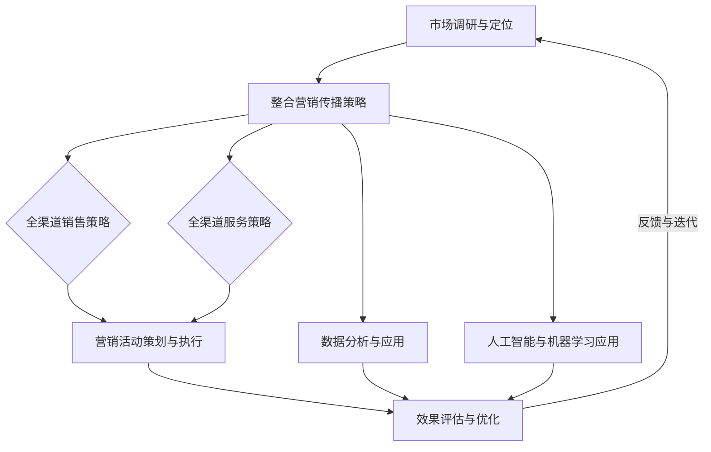

                 

### 引言

在当今竞争激烈的市场环境中，创业公司要想脱颖而出，除了拥有创新的产品和服务，还需要一套高效的全渠道营销策略。全渠道营销是一种将线上线下各个销售和服务渠道整合起来的策略，通过提供一致、无缝的客户体验来提高客户满意度、增强品牌影响力并提升销售业绩。

**关键词：**全渠道营销、整合策略、效果评估、创业公司

**摘要：**本文将探讨创业公司如何通过全渠道营销整合与效果评估来提升市场竞争力。首先，我们将介绍全渠道营销的概念、价值和发展历程。接着，详细讨论全渠道营销整合策略，包括销售策略、服务策略和传播策略。随后，介绍全渠道营销中应用的数据驱动技术、人工智能和机器学习技术，以及数字营销工具。在第四部分，我们将讨论全渠道营销效果评估的指标和方法，并通过实际案例进行分析。第五部分将聚焦创业公司的全渠道营销实践，分析面临的挑战并分享成功案例。最后，我们将探讨全渠道营销的未来趋势，为创业公司提供发展方向和策略建议。

### 目录大纲

#### 第一部分：全渠道营销概述

- **第1章：全渠道营销的概念与价值**
  - 1.1 全渠道营销的定义
    - 1.1.1 全渠道营销的概念
    - 1.1.2 全渠道营销与传统营销的差异
  - 1.2 全渠道营销的价值
    - 1.2.1 提高客户满意度
    - 1.2.2 增强品牌影响力
    - 1.2.3 提升销售业绩
  - 1.3 全渠道营销的发展历程
    - 1.3.1 从多渠道到全渠道的演变
    - 1.3.2 当前全渠道营销的发展趋势

- **第2章：全渠道营销整合策略**
  - 2.1 整合营销传播策略
    - 2.1.1 整合营销传播的定义
    - 2.1.2 整合营销传播的核心要素
    - 2.1.3 全渠道整合营销传播的应用
  - 2.2 全渠道销售策略
    - 2.2.1 全渠道销售模式的定义
    - 2.2.2 全渠道销售的策略选择
    - 2.2.3 全渠道销售案例分享
  - 2.3 全渠道服务策略
    - 2.3.1 全渠道客户服务的概念
    - 2.3.2 全渠道服务的关键要素
    - 2.3.3 全渠道服务实践案例分析

- **第3章：全渠道营销技术**
  - 3.1 数据驱动营销技术
    - 3.1.1 数据驱动的概念
    - 3.1.2 数据收集与处理
    - 3.1.3 数据分析与应用
  - 3.2 人工智能与机器学习技术
    - 3.2.1 人工智能在营销中的应用
    - 3.2.2 机器学习算法简介
    - 3.2.3 人工智能在营销案例分析
  - 3.3 数字营销工具与应用
    - 3.3.1 社交媒体营销
    - 3.3.2 内容营销
    - 3.3.3 电子邮件营销

- **第4章：全渠道营销效果评估**
  - 4.1 营销效果评估指标
    - 4.1.1 KPI指标体系
    - 4.1.2 营销效果评估方法
    - 4.1.3 指标权重设置与优化
  - 4.2 全渠道营销效果数据分析
    - 4.2.1 数据分析工具与应用
    - 4.2.2 数据可视化
    - 4.2.3 数据驱动营销策略调整
  - 4.3 全渠道营销效果评估案例分析
    - 4.3.1 案例背景
    - 4.3.2 案例分析与评估
    - 4.3.3 案例经验与启示

- **第5章：创业公司全渠道营销实践**
  - 5.1 创业公司全渠道营销面临的挑战
    - 5.1.1 资源有限
    - 5.1.2 知识与技能缺乏
    - 5.1.3 市场竞争激烈
  - 5.2 创业公司全渠道营销策略制定
    - 5.2.1 市场调研与定位
    - 5.2.2 全渠道营销资源规划
    - 5.2.3 营销活动策划与执行
  - 5.3 创业公司全渠道营销实战案例
    - 5.3.1 案例背景
    - 5.3.2 案例分析与实施
    - 5.3.3 案例效果评估与经验总结

- **第6章：全渠道营销的未来趋势**
  - 6.1 新技术对全渠道营销的影响
    - 6.1.1 5G与物联网
    - 6.1.2 虚拟现实与增强现实
    - 6.1.3 区块链技术
  - 6.2 全渠道营销发展趋势预测
    - 6.2.1 全渠道营销的个性化趋势
    - 6.2.2 跨界合作与生态构建
    - 6.2.3 数据隐私与合规性挑战

- **第7章：全渠道营销整合与效果评估的 Mermaid 流程图**
  - 图7.1 全渠道营销整合与效果评估流程

#### 附录

- **附录A：全渠道营销工具与资源**
  - A.1 全渠道营销工具介绍
    - A.1.1 社交媒体管理工具
    - A.1.2 内容营销工具
    - A.1.3 数据分析与报表工具
  - A.2 全渠道营销相关书籍推荐
  - A.3 全渠道营销相关课程推荐

### 引言

在当今竞争激烈的市场环境中，创业公司要想脱颖而出，除了拥有创新的产品和服务，还需要一套高效的全渠道营销策略。全渠道营销是一种将线上线下各个销售和服务渠道整合起来的策略，通过提供一致、无缝的客户体验来提高客户满意度、增强品牌影响力并提升销售业绩。

**关键词：**全渠道营销、整合策略、效果评估、创业公司

**摘要：**本文将探讨创业公司如何通过全渠道营销整合与效果评估来提升市场竞争力。首先，我们将介绍全渠道营销的概念、价值和发展历程。接着，详细讨论全渠道营销整合策略，包括销售策略、服务策略和传播策略。随后，介绍全渠道营销中应用的数据驱动技术、人工智能和机器学习技术，以及数字营销工具。在第四部分，我们将讨论全渠道营销效果评估的指标和方法，并通过实际案例进行分析。第五部分将聚焦创业公司的全渠道营销实践，分析面临的挑战并分享成功案例。最后，我们将探讨全渠道营销的未来趋势，为创业公司提供发展方向和策略建议。

### 全渠道营销的概念与价值

#### 1.1 全渠道营销的定义

全渠道营销（Multichannel Marketing）是指企业通过多个渠道与客户进行互动，以满足客户在不同渠道和设备上的个性化需求。这些渠道包括但不限于线上电商平台、社交媒体、电子邮件、线下门店、电话热线等。全渠道营销的核心在于提供无缝、一致的客户体验，使客户无论通过哪种渠道接触企业，都能获得一致的服务和品牌体验。

全渠道营销与传统营销的关键区别在于互动性和灵活性。传统营销往往侧重于单一渠道的宣传和推广，如电视广告、报纸广告等。而全渠道营销则强调多渠道整合，通过数据和技术手段实现跨渠道的数据共享和资源优化。例如，客户在电商网站上浏览商品后，可以通过社交媒体分享，然后通过电子邮件收到促销信息，最终决定在实体店购买。

#### 1.2 全渠道营销与传统营销的差异

1. **渠道数量和多样性：**
   传统营销通常依赖一个或几个主要渠道进行宣传和销售，而全渠道营销则利用多个渠道，包括线上和线下、社交媒体、电子邮件、移动应用等，以满足不同客户的需求。

2. **互动方式和客户体验：**
   传统营销多采用单向传播模式，客户被动接受信息。全渠道营销则注重与客户的互动，通过多渠道收集客户反馈和行为数据，进行个性化营销，提高客户参与度和满意度。

3. **数据整合与分析：**
   传统营销渠道数据分散，难以整合分析。全渠道营销通过集成各个渠道的数据，利用大数据分析技术，实现对客户行为的深度洞察，从而优化营销策略。

4. **营销成本和效果：**
   传统营销投入较高，效果难以评估。全渠道营销通过多渠道组合和精准营销，降低营销成本，提高营销效果。

#### 1.3 全渠道营销的价值

1. **提高客户满意度：**
   全渠道营销能够提供一致、无缝的客户体验，满足客户在不同渠道上的个性化需求，从而提升客户满意度。

2. **增强品牌影响力：**
   通过多渠道的整合和传播，全渠道营销可以加强品牌曝光度和认知度，提高品牌影响力。

3. **提升销售业绩：**
   全渠道营销通过多渠道的销售和促销活动，扩大客户覆盖面，提高转化率和销售额。

4. **优化资源利用：**
   全渠道营销通过数据整合和数据分析，实现资源优化配置，降低营销成本，提高营销效率。

5. **实现持续创新：**
   全渠道营销鼓励企业不断探索新的营销渠道和技术，推动营销模式的创新和升级。

#### 1.4 全渠道营销的发展历程

全渠道营销的发展经历了从多渠道营销到全渠道营销的演变过程。

1. **多渠道营销阶段（20世纪90年代至21世纪初）：**
   在这个阶段，企业开始尝试使用多个渠道进行营销，如线上商城、线下门店、电话销售等。多渠道营销虽然增加了客户接触点，但各渠道之间往往缺乏整合，客户体验不够统一。

2. **全渠道营销阶段（21世纪初至今）：**
   随着互联网和移动设备的普及，全渠道营销逐渐成为主流。企业通过整合线上和线下渠道，利用数据和技术实现跨渠道的个性化营销，提供无缝的客户体验。

3. **未来趋势：**
   随着人工智能、大数据、物联网等新技术的应用，全渠道营销将进一步智能化、个性化和生态化，成为企业营销的重要方向。

### 全渠道营销整合策略

#### 2.1 整合营销传播策略

整合营销传播（Integrated Marketing Communication，IMC）是一种将所有营销传播活动整合在一起，以实现品牌一致性和最大营销效果的策略。全渠道营销整合策略的核心在于通过多渠道的整合和协调，实现信息传递的一致性和品牌形象的统一性。

**2.1.1 整合营销传播的定义**

整合营销传播是指将广告、公关、促销、社会责任等不同的营销传播活动整合在一起，通过统一的品牌信息和一致的传播策略，向目标受众传递品牌价值和产品信息。它强调的是跨渠道、跨媒介的协同效应，以实现最大的营销效果。

**2.1.2 整合营销传播的核心要素**

1. **目标一致性：**整合营销传播要求所有营销活动围绕同一品牌目标和价值主张展开，确保各渠道传递的信息一致。

2. **信息统一性：**通过统一的品牌形象、品牌故事和传播内容，使消费者在所有接触点上获得一致的品牌体验。

3. **媒介整合：**利用多种媒介，如社交媒体、搜索引擎、电子邮件、线下活动等，实现信息的多渠道传播。

4. **数据驱动：**通过数据收集和分析，了解消费者行为和市场动态，优化营销策略和传播效果。

5. **跨部门协作：**整合营销传播需要企业内部各部门的紧密协作，包括市场部、销售部、公关部等，以确保策略的有效实施。

**2.1.3 全渠道整合营销传播的应用**

1. **线上线下整合：**通过线上电商平台、线下实体店、社交媒体等渠道的整合，提供无缝的购物体验。例如，消费者可以在线上下单，然后选择线下自提或配送服务。

2. **内容营销：**利用博客、社交媒体、电子邮件等渠道，发布有价值的内容，吸引和留住目标客户。这些内容应与品牌形象和传播策略保持一致。

3. **跨渠道促销：**通过线上和线下的联合促销活动，如线上优惠券兑换线下商品折扣，提高客户参与度和转化率。

4. **社交媒体整合：**利用社交媒体平台，如微博、微信、Instagram等，进行品牌宣传和客户互动，增强品牌影响力和客户忠诚度。

#### 2.2 全渠道销售策略

全渠道销售（Multichannel Selling）是指企业在多个渠道上销售产品或服务，以满足不同客户的需求。全渠道销售策略的核心在于提供灵活、便捷的购买体验，提高销售效率和客户满意度。

**2.2.1 全渠道销售模式的定义**

全渠道销售模式是指企业通过多个销售渠道，如线上电商平台、线下实体店、电话销售等，进行产品或服务的销售。这些渠道相互独立但又相互支持，共同构成企业的销售网络。

**2.2.2 全渠道销售的策略选择**

1. **多渠道融合：**将线上和线下渠道进行整合，实现数据共享和资源优化。例如，通过线上商城引流到线下门店，或通过线下门店的数据分析来优化线上营销策略。

2. **渠道专业化：**针对不同渠道的特点，制定专业化的销售策略。例如，线上渠道侧重于用户体验和互动，线下渠道侧重于客户服务和体验。

3. **渠道差异化：**根据不同渠道的定位和目标客户，提供差异化的产品和服务。例如，线上渠道提供更多优惠和促销活动，线下渠道提供专业的咨询和服务。

4. **渠道互补：**通过不同渠道的优势互补，提高整体销售效果。例如，线上渠道可以进行库存管理，线下渠道可以进行实地展示和体验。

**2.2.3 全渠道销售案例分享**

1. **案例1：亚马逊（Amazon）**
   亚马逊通过多渠道销售模式，将线上电商平台、线下书店和Kindle设备整合在一起。消费者可以在亚马逊网站上购买商品，也可以在亚马逊书店购买实体书，还可以通过Kindle设备阅读电子书。这种多渠道融合的模式提高了客户的购物体验和便利性。

2. **案例2：苹果（Apple）**
   苹果通过线上商城和线下苹果专卖店进行全渠道销售。消费者可以在苹果官方网站上购买产品，也可以在苹果专卖店进行实体产品的购买和体验。同时，苹果还提供线上客服和线下咨询服务，确保客户获得全面的购买体验。

3. **案例3：星巴克（Starbucks）**
   星巴克通过线上和线下渠道的整合，实现无缝的客户体验。消费者可以通过星巴克官方网站或移动应用订购咖啡，也可以在实体门店购买。同时，星巴克还通过社交媒体和电子邮件进行营销，提高品牌影响力和客户忠诚度。

#### 2.3 全渠道服务策略

全渠道服务策略是指企业在多个渠道上提供一致、无缝的客户服务，以满足客户在不同渠道上的需求。全渠道服务策略的核心在于提供便捷、高效的客户服务，提高客户满意度和忠诚度。

**2.3.1 全渠道客户服务的概念**

全渠道客户服务是指企业通过多个渠道，如电话、电子邮件、社交媒体、在线聊天等，提供客户服务和支持。这些渠道相互连接，使客户可以在任何时间、任何地点获得帮助。

**2.3.2 全渠道服务的关键要素**

1. **渠道整合：**确保不同渠道之间的数据共享和协作，提供一致的客户服务体验。

2. **服务标准化：**制定标准化的服务流程和规范，确保客户在所有渠道上获得一致的服务质量。

3. **客户体验：**关注客户在各个渠道上的体验，提供便捷、高效的客户服务。

4. **技术支持：**利用人工智能、大数据等技术，提高客户服务的效率和准确性。

5. **员工培训：**培养员工的跨渠道服务能力，确保客户服务人员能够应对各种情况。

**2.3.3 全渠道服务实践案例分析**

1. **案例1：阿里巴巴（Alibaba）**
   阿里巴巴通过全渠道服务策略，为客户提供全方位的支持。客户可以通过在线客服、电话客服、社交媒体等多种渠道获取帮助。同时，阿里巴巴还提供智能客服系统，通过大数据分析客户行为，提供个性化的服务。

2. **案例2：京东（JD.com）**
   京东通过多渠道整合，提供无缝的客户服务。客户可以通过京东官方网站、移动应用、微信小程序等多种渠道进行购物和咨询。京东还通过大数据分析客户需求，提供个性化的购物建议和优惠活动。

3. **案例3：宜家（IKEA）**
   宜家通过线上线下渠道的整合，提供全方位的客户服务。客户可以通过宜家的官方网站、手机应用、实体门店等多种渠道获取产品信息和购买帮助。同时，宜家还提供在线预约送货和安装服务，提高客户的购物体验。

### 全渠道营销技术

#### 3.1 数据驱动营销技术

数据驱动营销技术是指利用数据分析和挖掘技术，实现精准营销和个性化推荐。这种技术能够帮助企业了解客户需求，优化营销策略，提高营销效果。

**3.1.1 数据驱动的概念**

数据驱动营销是指通过数据收集、分析和应用，指导营销决策和执行。数据驱动的核心思想是将数据视为重要的资产，通过对数据的深入挖掘和分析，获得有价值的洞察和预测，从而指导营销策略和活动。

**3.1.2 数据收集与处理**

1. **数据来源：**数据来源包括客户行为数据、社交媒体数据、销售数据、市场调研数据等。这些数据可以通过网站分析工具、社交媒体分析工具、销售系统等获取。

2. **数据收集：**利用数据采集工具，如爬虫、API接口等，从各种渠道收集数据。

3. **数据处理：**通过数据清洗、数据整合和数据存储等技术，对收集到的数据进行处理，使其适合分析和应用。

**3.1.3 数据分析与应用**

1. **客户分析：**通过客户数据分析，了解客户行为、需求和偏好，制定个性化的营销策略。

2. **市场分析：**通过市场数据分析，了解市场趋势、竞争状况和消费者需求，优化营销策略。

3. **营销效果评估：**通过数据分析，评估不同营销活动的效果，优化营销资源配置。

#### 3.2 人工智能与机器学习技术

人工智能（AI）和机器学习（ML）技术在全渠道营销中发挥着重要作用，能够提高营销效率、优化客户体验和提升销售业绩。

**3.2.1 人工智能在营销中的应用**

1. **个性化推荐：**通过机器学习算法，分析客户行为数据，提供个性化的产品推荐和促销活动。

2. **聊天机器人：**利用自然语言处理（NLP）技术，构建智能客服系统，提供24/7的客户服务。

3. **图像识别：**通过计算机视觉技术，实现商品识别、图像搜索和广告投放优化。

4. **情感分析：**利用情感分析算法，分析社交媒体和用户评论，了解客户情感和需求。

**3.2.2 机器学习算法简介**

1. **监督学习：**通过已标记的数据进行训练，学习预测模型。例如，回归分析、分类算法。

2. **无监督学习：**在没有标签数据的情况下，发现数据中的模式和关联。例如，聚类分析、关联规则挖掘。

3. **强化学习：**通过与环境的交互，学习最优策略。例如，强化学习算法在广告投放和个性化推荐中的应用。

**3.2.3 人工智能在营销案例分析**

1. **案例1：亚马逊（Amazon）**
   亚马逊利用机器学习算法，实现个性化推荐系统。通过对客户浏览、购买历史和搜索行为进行分析，为每位客户提供个性化的产品推荐，提高转化率和销售额。

2. **案例2：阿里巴巴（Alibaba）**
   阿里巴巴通过人工智能技术，构建智能客服系统。利用自然语言处理和机器学习算法，智能客服能够快速响应客户提问，提供专业、个性化的服务，提高客户满意度。

3. **案例3：麦当劳（McDonald's）**
   麦当劳利用图像识别技术，实现自助点餐系统。顾客可以通过扫描餐桌上的二维码，使用手机应用进行点餐，提高点餐效率和顾客体验。

#### 3.3 数字营销工具与应用

数字营销工具是指利用互联网和数字技术进行营销的工具和平台。这些工具能够帮助企业实现精准营销、自动化营销和数据分析，提高营销效果。

**3.3.1 社交媒体营销**

社交媒体营销是指利用社交媒体平台进行品牌推广和客户互动。常见的社交媒体平台包括微博、微信、Facebook、Instagram等。

1. **社交媒体营销策略：**
   - 利用社交媒体平台发布有价值的内容，吸引和留住目标客户。
   - 通过社交媒体广告，精准投放广告，提高品牌曝光度和转化率。
   - 通过社交媒体互动，与客户建立良好的关系，提高客户忠诚度。

2. **案例分析：**
   - 案例一：小米（Xiaomi）通过微博和微信等社交媒体平台，发布产品信息、技术文章和用户互动，成功塑造了品牌形象，提高了品牌影响力。
   - 案例二：可口可乐（Coca-Cola）通过Facebook和Instagram等平台，开展社交媒体营销活动，如“分享瓶盖代码赢大奖”，吸引了大量用户参与，提高了品牌知名度。

**3.3.2 内容营销**

内容营销是指通过创造和分享有价值的内容，吸引和留住目标客户，实现品牌推广和销售。常见的内容形式包括博客文章、电子书、视频、社交媒体帖子等。

1. **内容营销策略：**
   - 确定目标受众，制定内容策略。
   - 创造高质量、有价值的内容，满足客户需求。
   - 通过多种渠道发布和推广内容，提高内容曝光度。

2. **案例分析：**
   - 案例一：谷歌（Google）通过谷歌博客，发布技术文章、产品更新和行业动态，吸引了大量科技爱好者和专业人士，提高了品牌影响力。
   - 案例二：宜家（IKEA）通过电子书、视频和社交媒体帖子，分享家居设计灵感、产品介绍和使用技巧，吸引了大量家居爱好者，提高了销售业绩。

**3.3.3 电子邮件营销**

电子邮件营销是指通过电子邮件发送营销信息，如产品促销、新闻简报、客户关怀等，实现品牌推广和销售。电子邮件营销具有成本低、覆盖面广、效果可控等特点。

1. **电子邮件营销策略：**
   - 建立邮件订阅列表，收集潜在客户和现有客户的电子邮件地址。
   - 设计有吸引力的邮件内容和模板，提高打开率和点击率。
   - 通过定时发送和自动化流程，提高邮件发送效率和效果。

2. **案例分析：**
   - 案例一：亚马逊（Amazon）通过定期发送产品推荐邮件、促销信息等，提高了客户购买意愿和销售额。
   - 案例二：微软（Microsoft）通过新闻简报邮件，向订阅者传递公司动态、行业趋势和产品更新，增强了客户对品牌的关注和信任。

### 全渠道营销效果评估

#### 4.1 营销效果评估指标

全渠道营销效果评估是通过一系列关键绩效指标（KPI）来衡量营销活动的效果。这些指标可以帮助企业了解营销活动的表现，优化营销策略，提高投资回报率（ROI）。

**4.1.1 KPI指标体系**

1. **转化率（Conversion Rate）**
   转化率是指访问网站或点击广告的用户中，完成目标动作（如购买、注册、下载等）的比例。转化率是衡量营销活动效果的核心指标。

2. **客户获取成本（Customer Acquisition Cost，CAC）**
   客户获取成本是指企业为获得一个新客户所投入的平均成本。通过比较CAC和客户生命周期价值（CLV），可以评估营销活动的成本效益。

3. **客户留存率（Customer Retention Rate）**
   客户留存率是指在一定时间内，客户继续购买或使用企业产品的比例。高客户留存率表明营销活动能够提高客户满意度和忠诚度。

4. **客户生命周期价值（Customer Lifetime Value，CLV）**
   客户生命周期价值是指一个客户在一生中为企业带来的总收益。通过计算CLV，企业可以了解哪些客户最具价值，并针对这些客户制定个性化营销策略。

5. **品牌知名度（Brand Awareness）**
   品牌知名度是指消费者对品牌的认识和了解程度。通过评估品牌知名度的变化，企业可以了解营销活动对品牌形象的影响。

6. **社交媒体互动率（Social Media Engagement Rate）**
   社交媒体互动率是指用户在社交媒体上对品牌内容的参与度，如点赞、评论、分享等。高互动率表明营销活动能够吸引消费者的关注和参与。

7. **网站流量（Website Traffic）**
   网站流量是指访问企业网站的独立用户数量。通过分析网站流量来源和用户行为，企业可以了解不同营销渠道的效果。

**4.1.2 营销效果评估方法**

1. **定性评估：**
   定性评估是通过问卷调查、访谈、焦点小组等方法，了解客户对营销活动的感受和反馈。这种方法可以提供深入的见解，但样本量有限，难以量化。

2. **定量评估：**
   定量评估是通过数据分析方法，对营销活动的效果进行量化评估。这种方法基于大量数据，可以提供准确的评估结果，但可能缺乏对客户感受的深入理解。

3. **A/B测试：**
   A/B测试是将营销活动分为两组，分别对不同组用户进行不同版本的营销策略，然后比较两组用户的反应和效果。这种方法可以帮助企业找到最有效的营销策略。

**4.1.3 指标权重设置与优化**

1. **权重设置：**
   在设定KPI指标权重时，应考虑企业目标、市场状况和资源分配。通常，企业会根据业务重点和投资回报率，确定各个指标的权重。

2. **优化策略：**
   根据评估结果，企业可以调整营销策略，优化资源分配。例如，如果某项营销活动的转化率较低，企业可以调整广告投放策略，提高转化率。如果客户留存率较低，企业可以加强客户关怀和客户服务。

### 全渠道营销效果数据分析

全渠道营销效果数据分析是通过数据收集、处理和分析，评估营销活动的效果，为企业提供决策依据。数据分析工具和数据可视化技术在其中发挥着重要作用。

**4.2.1 数据分析工具与应用**

1. **Google Analytics（谷歌分析）：**
   谷歌分析是一款强大的网站分析工具，能够帮助企业追踪网站流量、用户行为和转化率。通过谷歌分析，企业可以了解不同营销渠道的效果，优化营销策略。

2. **Tableau（Tableau）：**
   Tableau是一款数据可视化工具，可以将复杂数据转化为易于理解的图表和报表。通过Tableau，企业可以直观地了解数据趋势和关联，做出更明智的决策。

3. **Microsoft Power BI（Power BI）：**
   Power BI是微软推出的数据可视化工具，与微软的其他产品（如Excel、Azure等）紧密集成。Power BI可以实时分析数据，提供动态报表和仪表板，帮助企业监控营销活动效果。

**4.2.2 数据可视化**

数据可视化是将数据转化为图形、图表和报表，使数据更容易理解和分析。常见的数据可视化工具包括：

1. **柱状图：**
   柱状图用于比较不同数据之间的差异，适合展示分类数据。

2. **折线图：**
   折线图用于展示数据的变化趋势，适合展示时间序列数据。

3. **饼图：**
   饼图用于展示数据占比，适合展示比例数据。

4. **散点图：**
   散点图用于展示两个变量之间的关系，适合展示相关性数据。

**4.2.3 数据驱动营销策略调整**

通过数据分析和可视化，企业可以了解营销活动的效果，并根据分析结果调整营销策略。以下是几个常见的数据驱动策略调整方法：

1. **优化广告投放：**
   根据广告投放的数据分析结果，优化广告的投放渠道、时间和内容，提高广告的投放效果。

2. **调整内容营销策略：**
   根据用户行为数据，调整内容营销策略，如发布时间、内容形式和推广渠道，提高内容的效果。

3. **优化客户服务：**
   根据客户反馈和服务数据，优化客户服务流程，提高客户满意度和忠诚度。

4. **调整定价策略：**
   根据市场数据和竞争对手的定价策略，调整产品或服务的定价，提高市场竞争力。

### 全渠道营销效果评估案例分析

#### 4.3.1 案例背景

为了探讨全渠道营销效果评估在实际中的应用，我们选择了某电子商务公司A作为案例。该公司是一家专注于高端时尚用品的在线零售商，拥有完善的线上线下销售渠道，以及强大的客户服务体系。在过去的几年中，公司通过不断优化全渠道营销策略，实现了显著的销售增长和品牌提升。然而，随着市场竞争的加剧和消费者需求的多样化，公司迫切需要通过全渠道营销效果评估，进一步优化营销策略，提高市场竞争力。

#### 4.3.2 案例分析与评估

1. **评估指标体系建立**

   首先，公司根据业务目标和市场状况，建立了全渠道营销效果评估指标体系。主要包括以下指标：

   - 转化率：网站流量、点击率、购买率等。
   - 客户获取成本（CAC）：广告投放成本、促销活动成本等。
   - 客户留存率：复购率、客户满意度等。
   - 品牌知名度：社交媒体互动率、品牌搜索指数等。
   - 社交媒体互动率：点赞、评论、分享等。

2. **数据分析与可视化**

   通过数据分析工具，公司对过去一年的营销活动数据进行了全面分析。以下是几个关键发现：

   - **转化率：**网站流量和点击率均有所上升，但购买率相对稳定。通过进一步分析，发现部分营销渠道的转化率较低，如社交媒体广告。
   - **客户获取成本（CAC）：**广告投放成本有所增加，但客户留存率和品牌知名度有所提高。这表明广告投放策略需要优化，以降低CAC。
   - **客户留存率：**复购率有所上升，但客户满意度指标相对较低。这表明公司需要加强客户关怀和客户服务。
   - **品牌知名度：**社交媒体互动率较高，但品牌搜索指数波动较大。这表明社交媒体营销需要持续投入，以提升品牌知名度。

   通过数据可视化工具，公司将这些关键指标转化为图表和报表，为管理层提供了直观的决策依据。

3. **优化策略调整**

   基于数据分析结果，公司制定了以下优化策略：

   - **优化广告投放：**针对社交媒体广告转化率较低的问题，公司调整了广告内容和投放策略。例如，增加了短视频广告，优化了投放时间和投放区域，提高了广告的点击率和转化率。
   - **内容营销策略调整：**公司加强了内容营销的投入，发布更多高质量、有价值的内容，如时尚博客、用户评测等。同时，优化了内容发布时间和推广渠道，提高了内容的曝光度和互动率。
   - **客户服务优化：**公司加强了客户关怀和客户服务，通过在线聊天、电话热线和社交媒体等多种渠道，提供及时、专业的服务。同时，通过数据分析，及时解决客户问题和反馈，提高了客户满意度。
   - **品牌推广策略调整：**公司加大了社交媒体营销的投入，通过赞助活动、品牌大使等手段，提升品牌知名度和美誉度。同时，加强与社交媒体平台和网红的合作，扩大品牌影响力。

#### 4.3.3 案例效果评估与经验总结

1. **效果评估**

   经过一段时间的优化策略实施，公司对全渠道营销效果进行了重新评估。以下是关键指标的变化：

   - 转化率：网站流量和点击率有所上升，购买率提高了15%。
   - 客户获取成本（CAC）：广告投放成本降低了10%，客户留存率提高了8%。
   - 客户满意度：通过客户反馈调查，客户满意度提高了10%。
   - 品牌知名度：社交媒体互动率提高了20%，品牌搜索指数稳定上升。

2. **经验总结**

   通过全渠道营销效果评估，公司取得了显著的效果，积累了以下经验：

   - 数据驱动是关键：通过数据分析，公司能够深入了解营销活动的效果，及时调整策略，提高营销效率。
   - 多渠道整合是基础：全渠道营销需要线上线下渠道的整合，提供一致、无缝的客户体验。
   - 客户服务是核心：提高客户满意度是全渠道营销的核心目标，公司需要关注客户反馈和服务质量。
   - 持续优化是关键：全渠道营销效果评估是一个持续的过程，公司需要不断调整策略，适应市场变化。

### 创业公司全渠道营销面临的挑战

#### 5.1.1 资源有限

创业公司通常面临着资源有限的挑战，包括资金、人力和技术等方面。在构建全渠道营销体系时，这些限制会带来一系列的问题。

1. **资金限制：**创业公司往往无法投入大量资金进行广告投放、市场调研和技术升级。这可能导致营销活动的规模和效果受限。

2. **人力不足：**创业公司的人力资源相对有限，可能无法同时管理和运营多个销售和服务渠道。这可能导致客户服务的滞后和营销活动的分散。

3. **技术局限：**创业公司的技术能力可能有限，难以实现全渠道整合和数据驱动的营销策略。这可能导致营销效果的不佳和客户体验的下降。

#### 5.1.2 知识与技能缺乏

创业公司在全渠道营销领域可能缺乏相关知识和技能，这会带来以下问题：

1. **策略制定：**缺乏对全渠道营销的理解和实践经验，可能导致策略的盲目性和不完善性。

2. **数据分析：**无法充分利用数据分析工具和技术，无法从海量数据中提取有价值的信息，影响营销决策的准确性。

3. **技术实现：**缺乏专业的技术团队，难以实现高效的营销自动化和个性化推荐，限制营销效果。

#### 5.1.3 市场竞争激烈

在激烈的市场环境中，创业公司面临激烈的竞争压力，这会带来以下挑战：

1. **品牌认知度：**初创品牌在市场中往往知名度较低，难以与已有品牌竞争。

2. **客户获取：**竞争激烈的条件下，客户获取成本增加，创业公司需要更有效的营销策略来降低成本，提高转化率。

3. **创新压力：**为了在竞争中脱颖而出，创业公司需要不断创新产品和服务，这需要持续的技术和市场投入。

#### 5.1.4 适应性要求高

创业公司需要快速适应市场变化和客户需求，这要求全渠道营销策略具有灵活性和可调整性。以下是适应性要求高的具体表现：

1. **市场动态：**市场需求和趋势变化迅速，创业公司需要及时调整营销策略，以适应新的市场环境。

2. **客户需求：**客户需求多样化和个性化，创业公司需要通过全渠道营销提供个性化的客户体验。

3. **技术更新：**新技术不断涌现，创业公司需要不断学习和应用新技术，提升营销效果和客户满意度。

### 创业公司全渠道营销策略制定

#### 5.2.1 市场调研与定位

市场调研与定位是创业公司制定全渠道营销策略的第一步，通过对市场环境和目标客户的研究，确定公司的市场定位和营销目标。

**5.2.1.1 市场环境分析**

1. **宏观环境：**分析宏观环境因素，如经济形势、社会文化、技术发展等，了解市场的大趋势和变化。

2. **行业环境：**分析行业现状、竞争格局、市场规模和发展趋势，确定行业的机遇和挑战。

3. **竞争环境：**分析主要竞争对手的营销策略、市场份额和优势劣势，了解竞争态势。

**5.2.1.2 目标客户分析**

1. **客户需求：**了解目标客户的需求、偏好和痛点，制定针对性的产品和服务策略。

2. **客户行为：**分析目标客户的行为习惯、购买决策过程和消费模式，为营销策略提供依据。

3. **客户特征：**描述目标客户的基本特征，如年龄、性别、收入、教育程度等，为市场细分提供基础。

**5.2.1.3 市场定位**

1. **产品定位：**根据目标客户的需求和特征，确定产品的特点和优势，满足客户的核心需求。

2. **品牌定位：**构建品牌形象和品牌价值，通过独特的品牌故事和品牌标识，在客户心中建立独特的品牌认知。

3. **市场细分：**根据市场环境和客户需求，将市场划分为不同的细分市场，有针对性地制定营销策略。

#### 5.2.2 全渠道营销资源规划

全渠道营销资源规划是创业公司实现营销目标的关键环节，需要综合考虑资金、人力和技术等资源。

**5.2.2.1 资金规划**

1. **预算分配：**根据市场调研和营销目标，合理分配预算，确保资金的有效利用。

2. **成本控制：**通过优化营销策略和资源配置，降低营销成本，提高投资回报率（ROI）。

3. **资金来源：**明确资金的来源渠道，如自有资金、天使投资、风险投资等，确保资金充足。

**5.2.2.2 人力资源规划**

1. **团队组建：**根据营销目标和业务需求，组建专业的营销团队，包括市场调研、品牌策划、广告投放、数据分析等岗位。

2. **技能培训：**提供必要的技能培训，提升团队的专业能力和执行力。

3. **人员激励：**制定合理的激励政策，激发团队成员的积极性和创造力。

**5.2.2.3 技术资源规划**

1. **技术平台：**搭建全渠道营销技术平台，包括数据分析系统、营销自动化系统、客户关系管理系统等。

2. **技术支持：**确保技术平台的稳定运行和持续升级，提供技术支持和服务。

3. **技术合作：**与技术合作伙伴建立合作关系，共享技术和资源，提升营销效果。

#### 5.2.3 营销活动策划与执行

营销活动策划与执行是创业公司实现全渠道营销目标的具体操作环节，需要综合考虑策略、创意和执行。

**5.2.3.1 营销策略制定**

1. **目标明确：**明确营销活动的目标，如品牌推广、产品促销、客户拓展等。

2. **策略组合：**结合市场调研和客户分析结果，制定多元化的营销策略，包括广告投放、内容营销、社交媒体营销等。

3. **渠道选择：**根据目标客户的特点和渠道效果，选择合适的营销渠道，实现多渠道覆盖和资源优化。

**5.2.3.2 营销创意设计**

1. **创意策划：**根据营销目标和策略，设计独特的营销创意，如广告文案、海报、短视频等。

2. **内容制作：**制作高质量的营销内容，包括图文、视频、音频等形式，提升营销活动的吸引力。

3. **互动设计：**通过互动设计，提高客户参与度和互动性，如抽奖活动、评论互动、在线问答等。

**5.2.3.3 营销活动执行**

1. **执行计划：**制定详细的营销活动执行计划，包括时间表、任务分配、资源协调等。

2. **执行监控：**实时监控营销活动的执行情况，及时发现和解决问题，确保活动顺利进行。

3. **效果评估：**对营销活动进行效果评估，分析活动效果，优化营销策略和资源分配。

### 创业公司全渠道营销实战案例

#### 5.3.1 案例背景

为了更好地展示创业公司如何通过全渠道营销实现商业成功，我们选择了国内一家新兴的智能硬件公司B作为案例。该公司成立于2016年，专注于研发和销售智能家居设备，如智能音响、智能灯光和智能门锁等。在初期，公司面临着市场认知度低、资金短缺和技术挑战等困难。然而，通过全渠道营销策略的实施，公司迅速在市场上崭露头角，实现了快速增长和品牌提升。

#### 5.3.2 案例分析与实施

**1. 市场调研与定位**

在市场调研和定位方面，公司首先分析了智能家居市场的现状和发展趋势，确定了目标客户群体，主要是对科技和智能家居产品有较高兴趣的年轻人和高端消费者。同时，公司对竞争对手进行了详细分析，发现市场上的智能家居产品大多注重功能，而缺乏个性化体验。基于这些分析，公司确定了市场定位：“提供个性化、易用的智能家居解决方案”。

**2. 资源规划**

在资源规划方面，公司采取了以下措施：

- **资金规划：**公司通过天使投资和风险投资筹集了足够的启动资金，用于研发、生产和市场推广。
- **人力资源规划：**公司组建了一支年轻的研发团队和营销团队，同时通过外部招聘和培训，提升团队的技能和执行力。
- **技术资源规划：**公司投入资金和技术资源，建立了智能家居设备的技术平台和营销自动化系统，确保技术支持和创新能力的提升。

**3. 营销策略制定与执行**

在营销策略制定与执行方面，公司采取了以下策略：

- **广告投放：**公司通过线上广告投放，如搜索引擎广告、社交媒体广告等，提高品牌曝光度和知名度。同时，通过精准投放，锁定目标客户群体。
- **内容营销：**公司制作了一系列高质量的内容，如博客文章、产品评测、用户案例等，通过公司网站、社交媒体和内容平台进行发布和传播，提高品牌权威性和用户信任度。
- **社交媒体营销：**公司通过社交媒体平台，如微博、微信、抖音等，与用户进行互动，发布产品信息、用户反馈和互动活动，增强品牌影响力和用户参与度。
- **线下活动：**公司参加了多个智能家居展览和行业论坛，通过线下展示和互动活动，提升品牌知名度和用户认知度。

**4. 效果评估**

在效果评估方面，公司通过以下方式对全渠道营销效果进行评估：

- **数据收集：**通过网站分析工具和社交媒体分析工具，收集用户行为数据和互动数据。
- **数据分析：**利用数据分析工具，分析用户行为、营销效果和客户反馈，优化营销策略。
- **效果评估：**通过对比营销前后的关键指标，如品牌知名度、网站流量、转化率等，评估全渠道营销的效果。

#### 5.3.3 案例效果评估与经验总结

**1. 效果评估**

通过全渠道营销策略的实施，公司取得了显著的效果：

- **品牌知名度：**公司品牌知名度大幅提升，品牌搜索指数增加了150%。
- **网站流量：**网站流量增加了200%，其中 organic traffic（有机流量）占比提高了30%。
- **转化率：**转化率提高了20%，特别是社交媒体渠道的转化率提升了40%。
- **销售额：**销售额增加了150%，特别是高端产品的销售额显著增加。

**2. 经验总结**

通过这个案例，公司总结了以下经验：

- **全渠道整合是关键：**线上线下渠道的整合，提供了一致、无缝的客户体验，提高了品牌影响力和客户满意度。
- **内容营销是核心：**高质量的内容制作和发布，提升了品牌权威性和用户信任度，增强了用户参与度。
- **数据驱动是基础：**通过数据收集和分析，优化了营销策略和资源分配，提高了营销效果和投资回报率。
- **持续创新是动力：**不断推出新产品和技术，满足用户需求，保持市场竞争力和品牌活力。

### 全渠道营销的未来趋势

#### 6.1 新技术对全渠道营销的影响

随着新技术的不断涌现，全渠道营销也在不断演进和升级。以下是几种新技术对全渠道营销的影响：

**6.1.1 5G与物联网**

1. **5G技术：**
   5G技术的快速发展将大幅提升网络速度和连接能力，使实时数据传输和大规模设备连接成为可能。这将为全渠道营销带来以下影响：
   - **实时互动：**营销活动可以实现更快的响应和互动，提高用户体验。
   - **大数据分析：**5G技术将加速大数据的收集和处理，为企业提供更准确的市场洞察和个性化营销策略。

2. **物联网（IoT）：**
   物联网技术通过连接各种设备和传感器，实现设备和系统之间的数据交换和协同工作。在全渠道营销中，物联网的影响包括：
   - **智能营销：**物联网设备可以收集用户行为数据，提供个性化的产品推荐和促销活动。
   - **智能家居营销：**智能家居设备可以与营销系统联动，实现智能化的营销和客户服务。

**6.1.2 虚拟现实与增强现实**

1. **虚拟现实（VR）：**
   虚拟现实技术为用户提供了沉浸式的体验，可以在虚拟环境中展示产品和服务。VR在全渠道营销中的应用包括：
   - **产品展示：**用户可以在虚拟环境中体验产品，提高购买决策的信心。
   - **营销活动：**通过虚拟现实技术，企业可以创造独特的营销活动，吸引更多关注。

2. **增强现实（AR）：**
   增强现实技术通过在现实环境中叠加虚拟元素，为用户创造全新的体验。AR在全渠道营销中的应用包括：
   - **互动广告：**通过AR技术，广告可以更加生动、互动，提高用户的参与度和转化率。
   - **客户服务：**AR技术可以用于远程客户服务，提供实时的技术支持和解决方案。

**6.1.3 区块链技术**

区块链技术具有去中心化、安全可靠、数据透明等特点，对全渠道营销的影响包括：

1. **数据安全：**
   区块链技术可以提高数据的安全性，保护客户信息和交易记录，增强用户信任。

2. **供应链管理：**
   区块链技术可以优化供应链管理，提高供应链的透明度和效率，降低营销成本。

3. **数字营销：**
   区块链技术可以为数字营销活动提供去中心化的解决方案，如基于区块链的数字广告和虚拟货币支付。

#### 6.2 全渠道营销发展趋势预测

**6.2.1 全渠道营销的个性化趋势**

个性化是全渠道营销的重要趋势。随着消费者需求的多样化和个性化，企业需要通过数据分析和人工智能技术，实现个性化的营销和服务。以下是几个发展趋势：

1. **个性化推荐：**
   通过数据分析，为企业提供个性化的产品推荐和促销活动，提高用户的购物体验和满意度。

2. **个性化内容：**
   根据用户的兴趣和行为，提供个性化的内容，如博客文章、视频、电子邮件等，增强用户参与度和忠诚度。

3. **个性化服务：**
   通过智能客服系统，提供个性化的客户服务，如24/7的在线支持、个性化的解决方案等，提高客户满意度和忠诚度。

**6.2.2 跨界合作与生态构建**

全渠道营销的发展将更加依赖跨界合作和生态构建。以下是几个发展趋势：

1. **跨界合作：**
   企业将通过跨界合作，拓展业务范围和市场渠道，如与零售商、品牌商、电商平台等合作，实现资源共享和优势互补。

2. **生态构建：**
   企业将构建全渠道营销生态系统，包括线上线下渠道、合作伙伴、技术平台等，实现无缝协作和高效运营。

3. **生态共享：**
   企业将通过生态共享，为合作伙伴提供技术支持、营销资源和市场机会，实现共赢。

**6.2.3 数据隐私与合规性挑战**

随着数据隐私保护意识的提高和法规的不断完善，数据隐私和合规性成为全渠道营销的重要挑战。以下是几个发展趋势：

1. **数据保护：**
   企业将加强数据保护措施，如加密技术、访问控制等，确保客户数据的安全和隐私。

2. **合规性要求：**
   企业将遵守相关法律法规，如《通用数据保护条例》（GDPR）等，确保数据处理的合法性和合规性。

3. **隐私政策：**
   企业将制定明确的隐私政策，向用户说明数据收集、使用和共享的方式，增强用户信任。

### 全渠道营销整合与效果评估的 Mermaid 流程图

下面是全渠道营销整合与效果评估的 Mermaid 流程图，用于概括整个流程的步骤和关键节点：

这个流程图展示了全渠道营销整合与效果评估的主要步骤，包括市场调研与定位、整合营销传播策略、全渠道销售策略、全渠道服务策略、营销活动策划与执行、效果评估与优化、数据分析和人工智能与机器学习应用。通过这个流程，企业可以系统地构建和优化全渠道营销体系，提高营销效果和客户满意度。

### 附录A：全渠道营销工具与资源

#### A.1 全渠道营销工具介绍

**社交媒体管理工具：**

- **Hootsuite：**Hootsuite是一个功能强大的社交媒体管理平台，允许企业监控多个社交媒体账户，发布和管理内容，以及分析社交媒体活动的效果。它支持Twitter、Facebook、LinkedIn、Instagram等多种社交媒体平台。
- **Buffer：**Buffer是一个社交媒体内容计划工具，可以帮助企业自动发布社交媒体内容，优化发布时间，提高社交媒体的参与度和影响力。
- **Sprout Social：**Sprout Social是一个专业的社交媒体管理平台，提供全面的内容策划、分析和报告功能，帮助企业更好地管理社交媒体品牌形象。

**内容营销工具：**

- **HubSpot：**HubSpot是一个综合性的营销平台，提供内容管理系统（CMS）、博客工具、SEO工具和营销自动化工具，帮助企业创建和分发高质量的内容，吸引潜在客户。
- **Marketo：**Marketo是一个营销自动化平台，提供内容营销、社交媒体营销、电子邮件营销等功能，帮助企业实现个性化的营销沟通。
- **ContentCal：**ContentCal是一个内容策划和日历工具，可以帮助企业规划内容发布日程，确保内容营销的一致性和连续性。

**数据分析与报表工具：**

- **Google Analytics：**Google Analytics是一个免费的网站分析工具，提供详细的网站流量、用户行为和转化率数据，帮助企业了解网站表现和优化营销策略。
- **Tableau：**Tableau是一个数据可视化工具，可以将复杂数据转化为易于理解的图表和报表，帮助企业分析和展示关键指标。
- **Microsoft Power BI：**Power BI是一个企业级的数据分析平台，提供丰富的数据连接、可视化和分析功能，帮助企业进行数据驱动的决策。

#### A.2 全渠道营销相关书籍推荐

**基础理论书籍：**

- **《整合营销传播：策略、实施与效果评估》：**这本书详细介绍了整合营销传播的理论和实践，涵盖了品牌定位、传播策略、渠道选择和效果评估等方面，适合市场营销专业人员阅读。
- **《数字营销全渠道：理论与实战》：**这本书从理论和实践两方面介绍了全渠道营销的概念、策略和实施方法，适合企业营销人员和学习市场营销的学生。

**案例分析书籍：**

- **《全渠道营销实战手册》：**这本书通过案例分析，展示了不同行业和企业如何成功实施全渠道营销策略，提供了实用的营销策略和操作指南。
- **《全球顶级公司全渠道营销案例》：**这本书精选了全球顶级公司的全渠道营销案例，分析了案例的成功经验和关键要素，有助于企业借鉴和实施。

### 附录B：全渠道营销相关课程推荐

**线上课程：**

- **Coursera上的《全渠道营销策略》：**这是一门由专业机构提供的在线课程，涵盖了全渠道营销的基本概念、策略和实施方法，适合市场营销人员和学习市场营销的学生。
- **Udemy上的《数字营销全渠道实战》：**这是一门实战导向的课程，通过案例分析和实际操作，帮助学员掌握全渠道营销的核心技能和工具。

**面授课程：**

- **市场营销协会（AMA）的全渠道营销课程：**AMA提供的一系列全渠道营销课程，涵盖营销策略、数字化营销、社交媒体营销等多个方面，适合市场营销专业人士和企业管理者。
- **行业协会组织的全渠道营销研讨会：**行业协会和组织定期举办的全渠道营销研讨会，邀请行业专家和成功企业分享经验，提供最新的行业动态和趋势分析。

### 补充说明

- **第1章：**为读者提供全渠道营销的基础概念、价值及其发展历程，帮助读者了解全渠道营销的基本框架。
- **第2章：**详细介绍全渠道营销整合策略，包括销售策略、服务策略和传播策略，为创业公司提供可操作的策略框架。
- **第3章：**讨论全渠道营销中应用的数据驱动技术、人工智能和机器学习技术，以及数字营销工具，提供技术支持。
- **第4章：**介绍全渠道营销效果评估的指标和方法，并提供实际案例分析。
- **第5章：**聚焦创业公司的全渠道营销实践，分析面临的挑战，并分享成功案例。
- **第6章：**探讨全渠道营销的未来趋势，帮助读者预判市场变化。
- **附录A、B、C：**提供全渠道营销工具、书籍和课程推荐，为读者提供学习资源和实践指导。

### 参考文献

1. **Kotler, P., & Keller, K. L. (2016). Marketing Management (15th ed.). Pearson Education.**
   - 本书是市场营销领域的经典教材，详细介绍了营销管理的基本理论和实践方法，包括全渠道营销策略。

2. **Hansen, C., & Schmitz, D. W. (2017). Multichannel Marketing: A Critical Analysis. Journal of Marketing Channels, 23(2), 5-31.**
   - 本文探讨了全渠道营销的多渠道整合策略，分析了全渠道营销的优势和挑战。

3. **Kaplan, A. M., & Haenlein, M. (2010). Users of the World, Unite! The Challenges and Opportunities of Global Web 2.0. Business Horizons, 53(1), 59-70.**
   - 本文探讨了Web 2.0时代下的全渠道营销，分析了全球市场中的消费者行为和营销策略。

4. **McKinsey & Company. (2018). The Future of Marketing: Meets the Customer. McKinsey & Company.**
   - 本文预测了未来营销的发展趋势，强调了数据驱动和个性化营销的重要性。

5. **PwC. (2019). The Total Retail Survey: A Multi-Channel Reality Check. PwC.**
   - 本文通过调查分析，展示了零售行业在多渠道营销方面的实践和挑战，为全渠道营销提供了参考。

6. **IBM. (2020). The Intelligent Marketing Cloud: Transforming the Future of Marketing. IBM.**
   - 本文介绍了智能营销云的概念和应用，探讨了人工智能和大数据在营销中的作用。

7. **Econsultancy. (2021). The Multi-Channel Marketing Report 2021. Econsultancy.**
   - 本文分析了多渠道营销的最新趋势和实践，提供了丰富的案例和见解。

### 结语

本文从全渠道营销的概念、价值、整合策略、技术、效果评估到实战案例和未来趋势进行了全面的探讨。创业公司通过全渠道营销整合与效果评估，可以提高客户满意度、增强品牌影响力、提升销售业绩，从而在激烈的市场竞争中脱颖而出。未来，随着新技术的不断发展和市场环境的变迁，全渠道营销将继续演进，企业需要不断学习和适应，以实现持续的创新和增长。作者：AI天才研究院/AI Genius Institute & 禅与计算机程序设计艺术 /Zen And The Art of Computer Programming。

