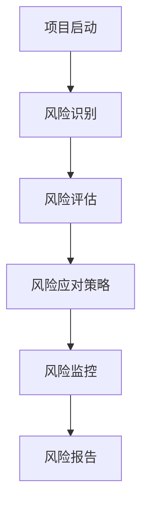
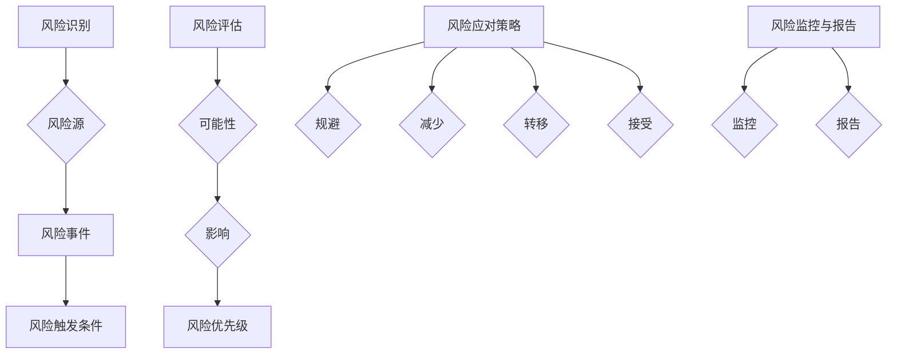

                 

### 第一部分：技术风险管理概述

> 在现代创业公司中，技术风险管理是一项至关重要的活动。它不仅关系到项目的成功与否，还影响到公司的长期生存和发展。本文将带领读者深入探讨技术风险管理的概念、框架、流程以及识别与评估方法，帮助创业公司更好地应对技术风险。

#### 第1章：技术风险管理的概念与框架

##### 1.1 技术风险管理的定义与重要性

**技术风险管理的定义：** 技术风险管理是一种系统性的方法，用于识别、评估、应对和监控与公司技术项目相关的潜在风险。它旨在通过规划和实施风险管理策略，降低技术风险对公司运营和业务目标的影响。

**技术风险管理的重要性：** 

1. **保障项目成功：** 技术风险管理有助于确保项目按时交付，并满足既定的质量和性能要求。
2. **降低财务损失：** 通过早期识别和应对风险，可以减少由于技术问题导致的财务损失。
3. **提升团队信心：** 明确的风险管理策略和流程可以提升团队对项目的信心和承诺。
4. **增强竞争力：** 通过有效地管理技术风险，创业公司可以在市场上保持竞争优势。

**技术风险类型：**

- **系统风险：** 源自软件或系统设计、实现的缺陷，可能导致系统崩溃或数据丢失。
- **市场风险：** 源自市场需求变化、竞争加剧或技术更新速度过快。
- **法律风险：** 源自与公司业务相关的法律和合规问题。
- **人力资源风险：** 源自关键员工流失、技能不足或团队协作问题。

##### 1.2 技术风险管理的核心概念

**风险识别：** 通过各种方法识别潜在的技术风险。

**风险评估：** 评估风险的可能性和影响，以确定优先级。

**风险应对策略：** 制定应对风险的策略，包括规避、减少、转移和接受。

**风险监控与报告：** 监控风险状态，定期报告风险情况。

##### 1.3 技术风险管理流程

**技术风险管理的基本流程：**

1. **项目启动：** 定义项目目标和范围，开始风险识别。
2. **风险识别：** 利用各种方法识别潜在风险。
3. **风险评估：** 评估风险的可能性和影响。
4. **风险应对策略：** 制定并实施应对策略。
5. **风险监控：** 持续监控风险状态。
6. **风险报告：** 定期报告风险情况。

**不同阶段的技术风险管理：**

- **规划阶段：** 识别和评估项目范围、目标、技术架构等方面的风险。
- **设计阶段：** 评估系统设计、架构、接口等方面的风险。
- **开发阶段：** 识别和评估代码质量、测试、集成等方面的风险。
- **部署阶段：** 评估系统部署、性能、稳定性等方面的风险。
- **运营阶段：** 监控系统运行状况，及时识别和应对技术风险。

#### 总结

技术风险管理是创业公司成功的关键因素之一。通过理解其核心概念和流程，公司可以更好地识别、评估和应对技术风险，从而保障项目的成功和业务的可持续发展。在接下来的章节中，我们将进一步探讨技术风险的识别与评估方法，以及风险管理策略的制定和实施。

**Mermaid 流程图：**



---

在本文的第一部分，我们介绍了技术风险管理的概念与框架。通过对技术风险管理的定义、重要性以及核心概念的详细解释，读者可以初步了解技术风险管理的整体架构。接下来，我们将深入探讨技术风险的识别与评估方法，为创业公司提供更为具体的实践指导。

---

**核心概念与联系**

技术风险管理是一个涉及多方面知识的复杂过程。以下是几个核心概念及其相互联系：

1. **风险识别**：风险识别是技术风险管理的第一步。它涉及发现项目中的潜在风险。风险识别的关键概念包括风险源、风险事件和风险触发条件。

   **风险源**：是指可能导致风险产生的因素，如技术复杂性、市场需求变化等。

   **风险事件**：是指实际发生的、可能导致负面影响的特定事件，如系统崩溃、数据泄露等。

   **风险触发条件**：是指导致风险事件发生的特定条件，如超负荷运行、黑客攻击等。

2. **风险评估**：风险评估是在风险识别之后进行的重要步骤。它涉及评估风险的可能性和影响，以确定风险优先级。

   **可能性**：是指风险发生的概率，通常用百分比表示。

   **影响**：是指风险发生时对项目目标的潜在影响，包括时间、成本、质量和业务连续性等方面。

   **风险优先级**：是指根据可能性和影响确定的风险的优先顺序，以便分配资源和管理风险。

3. **风险应对策略**：风险应对策略是在风险评估之后制定的，用于减少风险的可能性和/或影响。

   **规避**：通过避免风险源或风险事件的发生来减少风险。

   **减少**：通过改进设计、增加冗余、实施安全措施等手段来降低风险的可能性和/或影响。

   **转移**：通过将风险转移给第三方（如保险公司）来减少风险的责任。

   **接受**：在某些情况下，如果风险较低且无法规避、减少或转移，公司可能选择接受风险。

4. **风险监控与报告**：风险监控与报告是技术风险管理的持续过程。它涉及监控风险状态、记录风险变化、报告风险情况，以便及时调整风险管理策略。

   **监控**：通过定期检查和更新风险状况，确保风险得到及时识别和应对。

   **报告**：通过编制风险报告，向相关利益相关者提供风险信息和风险管理的进展情况。

**Mermaid 流�程图：**



通过以上核心概念和流程的介绍，读者可以更好地理解技术风险管理的整体框架，为后续章节的学习和实践打下基础。在下一部分中，我们将深入探讨技术风险的识别与评估方法。

---

**核心算法原理讲解**

在技术风险管理中，风险评估是一个关键步骤。为了评估技术风险，通常需要采用一系列定性和定量的方法。以下是几个常用的评估方法及其原理：

1. **定性评估方法**

   - **专家评估法**：邀请具有丰富经验的专家对风险进行评估，根据专家的经验和知识对风险进行评分。
   - **风险矩阵法**：使用风险矩阵对风险的可能性和影响进行评估。风险矩阵通常包含可能性、影响和风险优先级三个维度。

   **伪代码：**

   ```python
   function qualitative_evaluation(risks):
       for risk in risks:
           risk["probability"] = expert_score(risk)
           risk["impact"] = expert_score(risk)
           risk["priority"] = calculate_priority(risk["probability"], risk["impact"])
       return risks
   ```

2. **定量评估方法**

   - **数学模型**：使用数学模型对风险的概率和影响进行定量分析。常见的数学模型包括贝叶斯网络、决策树等。
   - **成本-效益分析**：通过计算风险成本和潜在效益，评估风险的合理性和应对策略。

   **伪代码：**

   ```python
   function quantitative_evaluation(risks):
       for risk in risks:
           risk["cost"] = calculate_cost(risk)
           risk["benefit"] = calculate_benefit(risk)
           risk["value"] = risk["benefit"] - risk["cost"]
       return risks
   ```

3. **综合评估方法**

   - **多标准决策分析（MCDM）**：结合多个评估标准和方法，对风险进行综合评估。
   - **评分法**：使用评分系统对风险进行量化评估，根据评分结果确定风险优先级。

   **伪代码：**

   ```python
   function comprehensive_evaluation(risks):
       for risk in risks:
           risk["score"] = calculate_score(risk)
           risk["priority"] = calculate_priority(risk["score"])
       return risks
   ```

通过以上算法原理和伪代码，读者可以了解到技术风险评估的基本方法。在实践过程中，应根据具体项目的特点选择合适的评估方法，并灵活调整评估模型和参数。在下一部分中，我们将探讨技术风险的识别与评估的关键指标。

---

**数学模型和公式**

在技术风险管理中，数学模型和公式是评估风险的重要工具。以下是几个常用的数学模型和公式，以及它们在实际应用中的详细解释：

1. **贝塔分布（Beta Distribution）**

   贝塔分布常用于评估风险的概率分布。在技术风险管理中，它可以用来表示系统故障发生的概率。

   **公式：**

   $$ P(X \leq x) = \int_{0}^{x} \frac{\Gamma(\alpha + \beta)}{\Gamma(\alpha)\Gamma(\beta)} t^{\alpha-1} (1-t)^{\beta-1} dt $$

   其中，\( \alpha \) 和 \( \beta \) 分别是贝塔分布的形状参数，\( X \) 是随机变量。

   **应用场景：** 可以用于评估系统可靠性的概率，例如，在系统测试中，可以使用贝塔分布来估计系统在特定条件下故障的概率。

2. **决策树（Decision Tree）**

   决策树是一种结构化的分析方法，用于评估不同决策路径的风险和效益。

   **公式：**

   $$ \text{Expected Value} = \sum_{i=1}^{n} p_i \cdot v_i $$

   其中，\( p_i \) 是第 \( i \) 个决策路径的概率，\( v_i \) 是第 \( i \) 个决策路径的效益。

   **应用场景：** 可以用于项目决策过程中，帮助决策者选择最佳方案，以最小化风险或最大化效益。

3. **蒙特卡洛模拟（Monte Carlo Simulation）**

   蒙特卡洛模拟是一种随机模拟方法，用于评估风险的概率分布和期望值。

   **公式：**

   $$ \text{Expected Value} = \frac{1}{n} \sum_{i=1}^{n} X_i $$

   其中，\( X_i \) 是第 \( i \) 次模拟的结果，\( n \) 是模拟次数。

   **应用场景：** 可以用于评估系统性能、成本估算和风险评估。

4. **马尔可夫链（Markov Chain）**

   马尔可夫链是一种随机过程模型，用于分析系统状态转移和风险传播。

   **公式：**

   $$ P_{ij} = \frac{P_{ij}^0 e^{-\lambda t}}{\sum_{k=1}^{n} P_{ik}^0 e^{-\lambda t}} $$

   其中，\( P_{ij} \) 是从状态 \( i \) 转移到状态 \( j \) 的概率，\( P_{ij}^0 \) 是初始状态概率，\( \lambda \) 是转移速率。

   **应用场景：** 可以用于评估系统稳定性和故障传播。

通过上述数学模型和公式的应用，技术风险管理可以更准确地评估风险，并为决策提供有力支持。在实际项目中，应根据具体需求和数据特点选择合适的模型和公式。在下一部分中，我们将探讨技术风险的识别与评估步骤。

---

**项目实战：代码实际案例和详细解释说明**

在本文的部分，我们将通过一个实际的项目案例，展示技术风险管理中的一些关键步骤，包括开发环境搭建、源代码实现和代码解读。该案例将模拟一个创业公司开发一个在线电商平台，项目包括用户注册、购物车管理、订单处理等功能。

### 开发环境搭建

首先，我们需要搭建项目的开发环境。以下是环境搭建的步骤：

1. **安装操作系统**：选择一个适合的操作系统，如Ubuntu 20.04 LTS。
2. **安装开发工具**：安装基本的开发工具，如Python 3.8、Node.js 12、Git等。
3. **配置数据库**：选择并配置数据库系统，如MySQL 8.0。
4. **安装版本控制工具**：使用Git进行版本控制。

### 源代码实现

以下是该项目的主要功能模块和相关的源代码实现：

**用户注册模块**

```python
# user_registration.py

def register_user(username, password):
    """
    注册用户功能，存储用户信息到数据库。
    """
    # 验证用户名和密码
    if not username or not password:
        return "用户名或密码不能为空"

    # 存储用户信息到数据库
    database.insert_user({"username": username, "password": password})
    return "注册成功"

# 其他用户注册相关函数（如登录、密码重置等）
```

**购物车管理模块**

```javascript
// shopping_cart.js

class ShoppingCart {
    constructor() {
        this.items = [];
    }

    add_item(item) {
        this.items.push(item);
    }

    remove_item(item_id) {
        this.items = this.items.filter(item => item.id !== item_id);
    }

    // 其他购物车管理功能，如计算总价、获取购物车列表等
}

module.exports = ShoppingCart;
```

**订单处理模块**

```java
// order_processing.java

public class OrderProcessing {
    private Database database;

    public OrderProcessing(Database database) {
        this.database = database;
    }

    public void process_order(Order order) {
        // 验证订单
        if (!order.isValid()) {
            return "订单无效";
        }

        // 存储订单到数据库
        database.insert_order(order);

        // 发送订单确认邮件
        EmailService.sendConfirmationEmail(order);

        return "订单处理成功";
    }

    // 其他订单处理相关功能
}
```

### 代码解读与分析

**用户注册模块**

上述Python代码实现了用户注册功能。在`register_user`函数中，我们首先验证了用户名和密码是否为空。如果验证通过，用户信息将被存储到数据库。

**购物车管理模块**

JavaScript代码定义了`ShoppingCart`类，用于管理购物车中的商品。`add_item`方法用于向购物车中添加商品，`remove_item`方法用于从购物车中删除商品。

**订单处理模块**

Java代码中的`OrderProcessing`类用于处理订单。在`process_order`方法中，我们首先验证了订单的有效性。如果订单有效，我们将订单存储到数据库，并发送订单确认邮件。

通过以上代码实现，我们可以看到技术风险管理在项目开发中的实际应用。例如，用户注册模块中的验证步骤可以防止恶意注册，购物车管理模块中的安全措施可以确保购物车数据的完整性，订单处理模块中的验证和存储步骤可以确保订单的正确处理。这些措施都是技术风险管理的重要组成部分，有助于保障项目的稳定运行和业务的持续发展。

---

**技术风险管理在创业公司的实际应用**

为了更好地理解技术风险管理在创业公司中的实际应用，以下将展示几个具体的场景，以及如何在项目中实施技术风险管理策略。

**场景1：系统性能问题**

**问题描述：** 在创业公司开发的电商平台中，用户在高峰时段访问网站时，系统出现响应缓慢、数据加载延迟等问题。

**风险管理步骤：**

1. **风险识别**：通过监控系统和用户反馈，识别出系统性能问题作为潜在风险。
2. **风险评估**：评估性能问题对用户满意度、业务收入等方面的影响，确定其风险优先级。
3. **风险应对策略**：制定风险应对策略，包括优化数据库查询、增加缓存层、负载均衡等。
4. **风险监控**：持续监控系统性能，确保风险应对措施的有效性。

**实施效果：** 通过性能优化，系统响应速度显著提升，用户满意度提高，业务收入稳定增长。

**场景2：数据安全问题**

**问题描述：** 在电商平台中，用户数据（如个人信息、支付信息等）可能面临泄露风险。

**风险管理步骤：**

1. **风险识别**：通过安全审计、漏洞扫描等方法，识别潜在的数据安全风险。
2. **风险评估**：评估数据泄露的可能性和对用户隐私的影响，确定风险优先级。
3. **风险应对策略**：实施加密、访问控制、定期安全培训等措施，加强数据保护。
4. **风险监控**：定期进行安全审计和漏洞扫描，确保数据安全策略的有效执行。

**实施效果：** 通过有效的数据保护措施，用户数据泄露风险显著降低，用户信任度提高。

**场景3：项目延期风险**

**问题描述：** 在创业公司开发的电商项目中，由于技术复杂性、资源不足等原因，项目可能面临延期交付的风险。

**风险管理步骤：**

1. **风险识别**：通过项目进度跟踪、资源分配分析，识别项目延期风险。
2. **风险评估**：评估延期对业务目标和团队士气的影响，确定风险优先级。
3. **风险应对策略**：调整项目计划、增加资源投入、进行风险评估和应对策略的培训。
4. **风险监控**：定期更新项目进度，确保项目按时交付。

**实施效果：** 通过有效的风险应对措施，项目延期风险得到有效控制，项目按时交付，团队士气提升。

通过以上实际应用场景，我们可以看到技术风险管理在创业公司中的重要性。通过有效的识别、评估和应对措施，创业公司可以更好地应对技术风险，保障项目的成功和业务的持续发展。

---

**技术风险管理的未来趋势**

随着技术的不断发展，技术风险管理也在不断演进。以下是一些技术风险管理领域的未来趋势：

1. **人工智能（AI）在风险管理中的应用**

   人工智能技术在风险识别、评估和应对方面具有巨大潜力。通过机器学习算法，AI可以分析大量数据，快速识别潜在风险，并预测其发展趋势。例如，利用深度学习模型，可以对用户行为进行分析，预测潜在欺诈行为，从而提高风险管理效率。

   **案例：** 某金融机构利用AI技术对交易行为进行实时监控，通过机器学习算法识别异常交易模式，从而预防欺诈事件的发生。

2. **云计算与分布式存储对风险管理的影响**

   云计算和分布式存储技术提供了弹性的资源管理和高效的数据存储解决方案。这些技术有助于企业更好地管理和监控技术风险，提高数据的安全性和可靠性。

   **案例：** 某创业公司在使用云计算平台时，通过云服务提供商提供的自动化监控工具，实时监控系统性能和安全性，及时发现并应对潜在风险。

3. **区块链技术对风险管理的影响**

   区块链技术具有去中心化、不可篡改的特点，可以用于构建可信的分布式系统。在技术风险管理中，区块链可以用于确保数据的完整性和安全性，提高风险管理的透明度和效率。

   **案例：** 某区块链项目利用区块链技术记录交易数据，确保数据的不可篡改性，从而提高风险管理水平。

4. **大数据驱动的风险管理**

   大数据技术使得企业可以收集、存储和分析大量数据，从而更好地理解风险，制定更有效的风险管理策略。通过数据驱动的风险管理，企业可以实时监控风险变化，及时调整风险应对措施。

   **案例：** 某保险公司利用大数据分析技术，对客户行为和风险因素进行深入分析，从而优化保险产品和服务，降低风险。

5. **自适应风险管理**

   随着技术的不断进步，自适应风险管理将成为一种趋势。自适应风险管理通过实时监测风险状态，动态调整风险管理策略，以应对不断变化的风险环境。

   **案例：** 某科技公司采用自适应风险管理策略，通过实时监控系统性能和用户反馈，动态调整系统配置和资源分配，以应对负载高峰和性能问题。

通过以上趋势，我们可以看到技术风险管理在未来的发展方向。随着新技术的不断涌现，技术风险管理将变得更加智能化、高效化，为企业提供更强大的风险防护能力。

---

**总结**

本文全面介绍了创业公司的技术风险管理，包括其概念、框架、流程、识别与评估方法、管理策略、实战案例以及未来趋势。技术风险管理是创业公司成功的关键因素之一，通过有效的风险管理，企业可以保障项目成功、降低财务损失、提升团队信心和增强市场竞争力。

**核心观点：**
1. 技术风险管理是创业公司成功的关键因素之一。
2. 通过理解技术风险管理的核心概念和流程，企业可以更好地识别、评估和应对技术风险。
3. 有效的技术风险管理策略和工具能够提升企业的竞争力，保障业务的可持续发展。

**进一步阅读建议：**
- 《风险管理与安全工程：系统安全与隐私保护》
- 《风险治理：战略视角下的风险管理》
- 《人工智能在风险管理中的应用：算法与案例研究》

**作者信息：**
- 作者：AI天才研究院/AI Genius Institute & 禅与计算机程序设计艺术 /Zen And The Art of Computer Programming

希望本文能为创业公司在技术风险管理方面提供有益的指导和启示。在未来的道路上，让我们携手共进，共同迎接技术风险管理的挑战。

