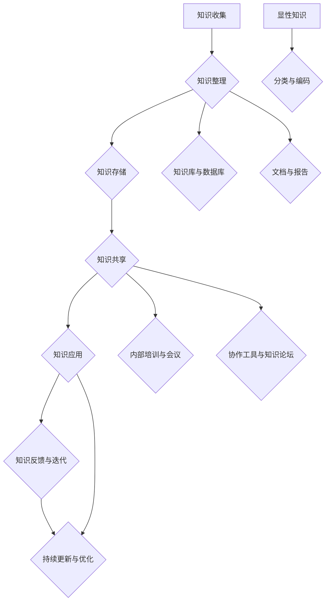

                 

# 《创业公司的知识管理与技术积累》

## 摘要

在竞争激烈的商业环境中，创业公司需要快速适应变化，不断学习和创新以保持竞争力。知识管理与技术积累成为创业公司成功的关键因素。本文旨在探讨创业公司在知识管理和技术积累方面的策略与实践，提供一套系统的方法和案例分析，以帮助创业公司构建有效的知识管理体系，实现技术积累，从而在激烈的市场竞争中脱颖而出。

本文首先介绍了知识管理的基本概念和重要性，以及创业公司在知识管理中面临的挑战。接着，文章深入探讨了技术积累的内涵、目标与策略，并提出了实际可行的方法。随后，文章详细阐述了团队协作与知识共享的最佳实践，以及技术积累与项目管理的有效结合。最后，通过实际案例分析和未来展望，为创业公司提供了知识管理和技术积累的指导，助力其在不断变化的市场环境中持续成长。

## 引言

在当今快速变化的市场环境中，创业公司面临着前所未有的挑战。技术创新、市场需求和竞争态势的快速演变，使得创业公司不仅需要具备敏锐的市场洞察力，还需要具备强大的适应能力和持续创新能力。在这个背景下，知识管理与技术积累成为创业公司成功的关键因素。

### 知识管理的定义与重要性

知识管理（Knowledge Management，KM）是指通过系统的方法和技术，对组织内部的知识进行收集、整理、存储、共享和应用，以实现知识的最优化利用和传递。知识管理不仅关注知识的生成和存储，更强调知识的流动和共享，通过构建知识共享的文化和环境，促进组织内部的知识交流和创新。

对于创业公司来说，知识管理具有以下几个重要性：

1. **提高决策效率**：通过知识管理，创业公司可以快速获取所需的信息和知识，提高决策的准确性和效率。
2. **促进团队协作**：知识管理有助于促进团队成员之间的信息共享和协作，提高团队的协作效率。
3. **增强创新能力**：知识管理能够激发团队成员的创新能力，通过知识的积累和共享，推动技术创新和产品创新。
4. **提升竞争力**：有效的知识管理可以帮助创业公司建立核心竞争力，提高市场竞争力。

### 技术积累的定义与作用

技术积累（Technology Accumulation）是指创业公司在技术创新过程中，通过持续的技术研究和实践，积累相关的技术知识和经验，形成独特的竞争优势。技术积累不仅包括技术本身，还包括与之相关的算法、架构、工具和最佳实践等。

技术积累在创业公司中的作用体现在以下几个方面：

1. **提高产品竞争力**：技术积累有助于创业公司开发出更具竞争力、创新性的产品，满足市场需求。
2. **优化运营效率**：通过技术积累，创业公司可以优化业务流程和运营模式，提高运营效率。
3. **降低创新成本**：技术积累可以帮助创业公司减少重复研究和技术开发的成本，提高创新效率。
4. **构建核心竞争力**：技术积累是创业公司构建核心竞争力的基础，有助于在市场中立足。

### 创业公司面临的知识管理和技术积累挑战

尽管知识管理和技术积累对于创业公司的成功至关重要，但创业公司在这一过程中也面临诸多挑战：

1. **资源有限**：创业公司通常资源有限，包括资金、人力和时间，这给知识管理和技术积累带来了压力。
2. **市场变化快**：市场需求和技术环境的变化速度快，创业公司需要快速适应，这要求它们在知识管理和技术积累方面具备较强的灵活性。
3. **知识共享障碍**：知识共享在创业公司中可能面临组织结构、文化差异和信任问题等障碍，影响知识管理的有效性。
4. **技术积累难度**：技术创新难度高，创业公司需要投入大量时间和精力进行技术研究和实践，这增加了技术积累的难度。

本文将在后续章节中，详细探讨创业公司在知识管理和技术积累方面的策略和实践，提供具体的指导和案例分析，以帮助创业公司克服这些挑战，实现可持续发展。

### 第一部分：知识管理基础

在创业公司中，有效的知识管理是确保团队协作、创新和持续成长的关键。本部分将首先介绍知识管理的基本概念和核心概念，然后探讨知识管理的目标与挑战，为后续的知识管理实践提供理论基础。

#### 第1章：知识管理概述

##### 1.1 知识管理的定义与重要性

知识管理（Knowledge Management，KM）是指通过系统的方法和技术，对组织内部的知识进行收集、整理、存储、共享和应用，以实现知识的最优化利用和传递。知识管理不仅关注知识的生成和存储，更强调知识的流动和共享，通过构建知识共享的文化和环境，促进组织内部的知识交流和创新。

在创业公司中，知识管理的重要性体现在以下几个方面：

1. **提高决策效率**：通过知识管理，创业公司可以快速获取所需的信息和知识，提高决策的准确性和效率。
2. **促进团队协作**：知识管理有助于促进团队成员之间的信息共享和协作，提高团队的协作效率。
3. **增强创新能力**：知识管理能够激发团队成员的创新能力，通过知识的积累和共享，推动技术创新和产品创新。
4. **提升竞争力**：有效的知识管理可以帮助创业公司建立核心竞争力，提高市场竞争力。

##### 1.2 知识管理的核心概念

知识管理涉及多个核心概念，包括知识、知识共享、知识地图和知识库等。以下是对这些核心概念的简要介绍：

1. **知识（Knowledge）**：知识是信息、经验、技能、价值观和信仰等的综合体，通过内化和外化，知识可以传递和共享。知识可以分为显性知识和隐性知识。

   - **显性知识（Explicit Knowledge）**：可以通过编码和文档化的形式进行存储和共享，如文档、报告、代码等。
   - **隐性知识（Tacit Knowledge）**：难以编码和文档化的知识，通常存在于个人经验、直觉和洞察中，需要通过个人交流和实践来传递。

2. **知识共享（Knowledge Sharing）**：知识共享是指组织内部成员之间通过沟通、协作和合作，将知识从一个人传递到另一个人或团队的过程。知识共享的有效性取决于组织文化、信任水平和技术支持等因素。

3. **知识地图（Knowledge Map）**：知识地图是一种可视化工具，用于展示组织内部知识的分布、结构和关系。知识地图可以帮助组织了解其知识资源，优化知识管理策略。

4. **知识库（Knowledge Base）**：知识库是一个集中存储和管理知识的地方，通常包含各种形式的知识，如文档、报告、案例研究、最佳实践等。知识库为组织提供了方便的知识检索和共享机制。

##### 1.3 知识管理的目标与挑战

知识管理的目标包括：

1. **提高知识利用效率**：通过有效的知识管理，创业公司可以更高效地利用其知识资源，避免重复劳动和资源浪费。
2. **促进知识创新**：知识管理有助于激发团队成员的创新能力，通过知识的积累和共享，推动技术创新和产品创新。
3. **优化决策过程**：知识管理提供了丰富的信息和知识，有助于创业公司做出更准确、更快速的决策。
4. **增强团队协作**：知识管理促进团队成员之间的信息共享和协作，提高团队的整体效率。

然而，在实施知识管理过程中，创业公司也面临以下挑战：

1. **组织结构和文化差异**：不同的组织结构和文化差异可能影响知识共享和知识流动的效率。
2. **知识共享障碍**：知识共享可能受到信息孤岛、知识分散、沟通不畅等因素的影响。
3. **技术支持不足**：知识管理需要适当的技术支持，包括知识库、知识地图、协作工具等，但创业公司可能因为资源有限而难以提供充分的技术支持。
4. **知识保护与隐私**：在知识共享过程中，如何保护知识的完整性和隐私性是一个重要的挑战。

通过对知识管理核心概念和目标的深入理解，创业公司可以更好地规划其知识管理策略，克服实施过程中的挑战，实现知识管理的最佳效果。

### 第2章：知识管理框架与实践

在了解了知识管理的基本概念和重要性后，接下来我们将探讨知识管理的具体框架和实践。这些框架和实践是创业公司构建有效的知识管理体系的基础，能够帮助公司在实际操作中更有效地管理知识，促进团队协作和创新能力。

#### 2.1 知识管理流程

知识管理流程是指组织内部进行知识收集、整理、存储、共享和应用的系统性步骤。一个典型的知识管理流程通常包括以下几个关键步骤：

1. **知识收集（Knowledge Collection）**：知识收集是知识管理的第一步，涉及从各种来源获取知识，如内部文档、外部研究、员工经验等。为了确保知识的全面性和准确性，创业公司需要建立一套有效的知识收集机制，包括数据采集工具、信息收集流程和标准等。

2. **知识整理（Knowledge Organization）**：收集到的知识需要进行整理和分类，以便于检索和应用。知识整理通常涉及创建目录、标签、索引等，以确保知识能够被有效地组织和维护。

3. **知识存储（Knowledge Storage）**：知识存储是将整理后的知识保存在合适的知识库或知识管理系统中。知识库应具备良好的可扩展性、安全性和访问控制功能，以确保知识的安全存储和高效检索。

4. **知识共享（Knowledge Sharing）**：知识共享是知识管理的关键环节，涉及将知识从一个人或团队传递到另一个人或团队。知识共享可以通过多种形式进行，如会议、培训、在线论坛、协作工具等。创业公司需要建立知识共享的文化，鼓励员工主动分享知识和经验。

5. **知识应用（Knowledge Application）**：知识应用是指将共享的知识应用于实际工作中，以解决实际问题或推动创新。知识应用可以帮助创业公司提高工作效率、优化业务流程和提升创新能力。

以下是一个简化的知识管理流程图，用于说明知识管理各个步骤之间的关系：

```
知识收集 -> 知识整理 -> 知识存储 -> 知识共享 -> 知识应用
```

#### 2.2 知识地图与知识库

知识地图（Knowledge Map）是一种可视化工具，用于展示组织内部知识的分布、结构和关系。知识地图可以帮助创业公司直观地了解其知识资源，优化知识管理策略。知识地图通常包括以下几个关键组成部分：

1. **知识节点（Knowledge Nodes）**：知识节点是知识地图中的基本元素，代表特定的知识领域或知识点。每个知识节点可以包含知识的内容、来源、创建者等信息。

2. **关系线（Relationship Lines）**：关系线用于连接知识节点，表示知识节点之间的关联关系。通过关系线，创业公司可以了解不同知识领域之间的联系，从而更好地利用知识资源。

3. **导航工具（Navigation Tools）**：导航工具提供了一种快速定位和浏览知识地图的方法。导航工具可以是可视化的，如缩放、滚动、搜索等，也可以是命令式的，如快捷键、菜单等。

知识库（Knowledge Base）是一个集中存储和管理知识的系统，通常包含各种形式的知识，如文档、报告、案例研究、最佳实践等。知识库为创业公司提供了方便的知识检索和共享机制，有助于提高知识利用效率。以下是一个简化的知识库框架图：

```
知识库框架：

+----------------+       +----------------+
|  知识库系统   |       |  知识库内容   |
+----------------+       +----------------+
        |                    |
        |                    |
        |                    |
        |                    |
        ↓                    ↓
+----------------+       +----------------+
|  知识节点      |       |  知识文档      |
+----------------+       +----------------+

```

知识库系统负责管理知识库的架构、权限和访问控制等，而知识库内容则是创业公司实际存储的知识资源。知识库内容可以包括以下几类：

1. **文档类知识**：包括技术文档、业务流程文档、项目报告等。
2. **案例类知识**：包括成功案例、失败案例、最佳实践等。
3. **数据类知识**：包括统计数据、市场调研数据、用户反馈等。
4. **经验类知识**：包括员工的经验总结、项目经验、技能总结等。

#### 2.3 知识共享与传播

知识共享与传播是知识管理的关键环节，直接影响知识的价值和效果。以下是一些有效的知识共享与传播方法：

1. **内部培训**：通过内部培训，将专业知识和经验传授给团队成员。培训可以是面对面的，也可以是线上视频或文档形式。
2. **知识论坛**：建立一个内部论坛，鼓励团队成员分享知识和经验。论坛可以是一个在线社区，提供讨论区、问答区和知识库等。
3. **协作工具**：使用协作工具，如即时通讯软件、文档编辑工具和项目管理软件等，促进团队成员之间的实时沟通和协作。
4. **知识竞赛**：通过知识竞赛，激发团队成员的学习和分享热情，提高知识传播的效率。
5. **知识分享会议**：定期组织知识分享会议，让团队成员有机会展示和分享自己的知识和经验。

为了确保知识共享与传播的有效性，创业公司需要：

1. **建立知识共享文化**：鼓励团队成员主动分享知识和经验，建立知识共享的文化和环境。
2. **提供激励机制**：为主动分享知识的团队成员提供奖励和认可，激励更多人参与知识共享。
3. **优化知识获取渠道**：确保团队成员能够方便地获取所需的知识，减少知识获取的障碍。

通过以上知识管理框架与实践，创业公司可以构建一个有效的知识管理体系，促进知识的收集、整理、存储、共享和应用，从而提高团队协作效率、增强创新能力，为公司的持续发展提供有力支持。

### 第二部分：技术积累策略

在了解了知识管理的基础之后，接下来我们将探讨创业公司在技术积累方面的策略和实践。技术积累是创业公司保持竞争力的关键，它不仅包括技术的获取和运用，还涉及技术的标准化、合作和创新。在这一部分中，我们将首先介绍技术积累的重要性，分析创业公司在技术积累过程中面临的挑战，并阐述技术积累的目标和策略。

#### 第3章：技术积累的重要性

技术积累对于创业公司的重要性不可低估。它不仅有助于提高产品的竞争力，还能优化公司的运营效率，降低创新成本，并最终构建公司的核心竞争力。

##### 3.1 技术积累的定义与作用

技术积累（Technology Accumulation）是指在创业过程中，通过持续的技术研究和实践，逐步积累和沉淀技术知识和经验，形成公司独特的技术优势。技术积累不仅涉及现有技术的优化和应用，还包括对新技术的探索和引入。

技术积累的作用主要体现在以下几个方面：

1. **提高产品竞争力**：通过技术积累，创业公司可以开发出更具创新性和竞争力的产品，满足市场需求。
2. **优化运营效率**：技术积累有助于公司优化业务流程，提高生产效率，降低运营成本。
3. **降低创新成本**：技术积累可以减少重复研究和开发的工作量，降低技术创新的成本。
4. **构建核心竞争力**：技术积累是创业公司构建和巩固核心竞争力的关键，有助于公司在市场中立足。

##### 3.2 创业公司技术积累的挑战

尽管技术积累对于创业公司至关重要，但在实际操作中，创业公司也面临诸多挑战：

1. **资源有限**：创业公司通常面临资金、人力和时间的限制，这限制了技术积累的速度和质量。
2. **技术快速变化**：技术领域的变化速度非常快，创业公司需要不断学习和适应新技术，否则可能会被淘汰。
3. **技术安全与保护**：在技术积累过程中，如何保护公司的技术和知识产权是一个重要的挑战。
4. **团队技术能力不足**：创业公司的团队可能缺乏某些关键技术能力，这需要通过培训和外部合作来弥补。

##### 3.3 技术积累的目标与策略

为了克服上述挑战，创业公司需要明确技术积累的目标，并制定切实可行的策略。技术积累的目标通常包括以下几个方面：

1. **提升技术能力**：通过技术积累，提升公司在核心技术领域的专业能力，建立技术优势。
2. **优化业务流程**：通过技术积累，优化公司的业务流程，提高生产效率和运营效益。
3. **构建技术平台**：建立技术平台，为公司的技术创新和产品开发提供基础设施和技术支持。
4. **保护知识产权**：加强技术积累过程中的知识产权保护，确保公司的技术成果得到合法保护。

技术积累的策略包括以下几个方面：

1. **持续学习与培训**：鼓励团队成员不断学习和掌握新技术，通过内部培训、外部培训和在线课程等多种形式，提升团队的技术能力。
2. **技术合作与开放创新**：与外部合作伙伴建立合作关系，通过合作研究和开放创新，共同推动技术进步。
3. **技术标准化与规范**：建立技术标准和规范，确保技术积累的可扩展性和兼容性，提高技术的可维护性和可复用性。
4. **技术调研与跟踪**：定期进行技术调研，跟踪行业发展趋势和技术前沿，确保公司在技术方向上的领先性。

通过明确技术积累的目标和策略，创业公司可以更好地规划技术积累的路径，克服资源和技术方面的限制，实现技术积累的持续性和有效性。

#### 第4章：技术积累的方法

在明确了技术积累的目标和策略之后，创业公司需要采取具体的方法和步骤来实现这些目标。技术积累不仅包括技术研究和开发，还包括技术合作、开放创新、标准化和技术调研等方面。以下将详细探讨这些方法，并提供具体实施步骤和案例分析。

##### 4.1 技术调研与跟踪

技术调研与跟踪是创业公司了解行业趋势、把握技术前沿的关键步骤。通过系统性的技术调研，公司可以确定哪些技术是未来发展的重点，并据此制定相应的研究和开发计划。

**实施步骤：**

1. **确定调研目标**：明确公司需要关注的技术领域和具体目标，例如新兴技术、行业趋势等。
2. **收集信息**：通过多种渠道收集相关信息，包括学术论文、行业报告、技术博客、会议论文等。
3. **分析信息**：对收集到的信息进行整理和分析，识别出关键技术和趋势。
4. **制定研究计划**：根据分析结果，制定详细的研究计划和开发路线图。

**案例分析：**

某创业公司致力于开发智能家居系统，通过技术调研，他们发现物联网（IoT）和人工智能（AI）是智能家居发展的关键趋势。于是，公司决定将物联网和人工智能作为技术研究的重点，并制定了详细的研究计划，包括购买相关硬件、开发AI算法、构建智能家居平台等。

##### 4.2 技术合作与开放创新

技术合作与开放创新是创业公司快速积累技术的一种有效途径。通过与外部合作伙伴共同研究和开发，公司可以共享资源、知识和技能，加速技术积累的进程。

**实施步骤：**

1. **选择合作伙伴**：根据技术需求和市场战略，选择具有互补优势的合作伙伴。
2. **建立合作机制**：明确合作的目标、分工和权益分配，建立有效的沟通和协作机制。
3. **开展合作研究**：共同开展技术研究和开发，共享研发成果。
4. **推广合作成果**：将合作研究成果转化为实际应用，推动市场推广。

**案例分析：**

某创业公司与一家领先的AI公司合作，共同开发智能家居AI算法。通过合作，他们不仅快速积累了AI技术，还优化了智能家居系统的用户体验。合作成果得到了市场的认可，帮助公司迅速扩大市场份额。

##### 4.3 技术标准化与规范

技术标准化与规范是确保技术积累可扩展性和兼容性的关键。通过建立技术标准和规范，创业公司可以提高技术复用性，降低维护成本，并确保不同技术模块之间的协同工作。

**实施步骤：**

1. **分析现有技术**：对公司的现有技术进行评估，确定需要标准化的技术模块和接口。
2. **制定技术标准**：根据分析结果，制定详细的技术标准和规范，确保技术的统一性和兼容性。
3. **实施技术规范**：在开发过程中遵循技术标准和规范，确保技术实现的标准化。
4. **更新和维护标准**：随着技术的不断发展和变化，定期更新和维护技术标准和规范。

**案例分析：**

某创业公司在开发物联网平台时，建立了详细的技术标准和规范，包括数据格式、通信协议和安全机制等。通过标准化，他们不仅提高了平台的可扩展性和兼容性，还简化了后续的技术维护和升级。

##### 4.4 技术积累与项目管理的结合

技术积累与项目管理的结合是确保技术积累有效实施的关键。通过项目管理的方法，创业公司可以系统性地规划和控制技术积累过程，确保技术目标的实现。

**实施步骤：**

1. **项目规划**：明确项目的目标、范围、时间表和资源需求。
2. **资源分配**：根据项目需求，合理分配人力、资金和其他资源。
3. **项目执行**：按照项目计划，开展技术研究和开发工作，确保技术积累的进度和质量。
4. **项目监控与评估**：通过定期的项目监控和评估，确保项目目标的实现，并根据实际情况调整项目计划。

**案例分析：**

某创业公司在开发区块链产品时，采用了严格的项目管理方法。他们制定了详细的项目计划，明确了技术目标、时间表和资源需求，并通过定期的项目会议和报告，监控项目的进度和质量。最终，他们成功开发出了具有市场竞争力的高性能区块链产品。

通过以上方法，创业公司可以有效地进行技术积累，提升技术能力和创新能力，为公司的持续发展奠定坚实基础。

### 第三部分：知识与技术管理实践

在前面章节中，我们讨论了知识管理和技术积累的理论基础和策略。然而，要将这些理论应用到实际操作中，创业公司需要具体的实践方法和工具。本部分将深入探讨团队协作与知识共享的最佳实践，以及技术积累与项目管理的有效结合，通过实际案例分析和工具推荐，帮助创业公司建立和完善知识与技术管理体系。

#### 第5章：团队协作与知识共享

团队协作与知识共享是创业公司成功的关键因素。一个高效的团队不仅能够提高工作效率，还能激发创新能力。在这一章节中，我们将讨论团队协作工具与方法，知识共享平台与机制，以及知识管理团队的角色与职责。

##### 5.1 团队协作工具与方法

团队协作工具是实现高效团队协作的基础。以下是一些常用的团队协作工具和方法：

1. **即时通讯工具**：如Slack、Microsoft Teams、微信等，用于实时沟通和协作。
2. **文档共享与编辑工具**：如Google Docs、Microsoft Office 365、Notepad++等，用于多人协作编辑文档。
3. **项目管理工具**：如Trello、Asana、Jira等，用于任务分配、进度跟踪和项目协调。
4. **视频会议与远程协作工具**：如Zoom、Microsoft Teams、Google Meet等，用于远程会议和在线协作。

**最佳实践：**

- **统一工具使用**：在团队内部统一使用协作工具，确保信息的流畅传递和协作的高效性。
- **定期会议**：定期举行团队会议，讨论项目进展、解决问题和分享经验。
- **明确责任**：为每个任务分配明确的负责人，确保任务的完成和协作的高效性。
- **沟通机制**：建立有效的沟通机制，如每日站会、周报和月度总结等，确保信息的透明和及时性。

##### 5.2 知识共享平台与机制

知识共享平台是创业公司集中管理和共享知识的重要工具。以下是一些常用的知识共享平台和机制：

1. **内部Wiki**：如MediaWiki、Confluence等，用于创建和维护内部知识库。
2. **知识论坛**：如Discourse、论坛等，用于团队成员交流和知识分享。
3. **知识库系统**：如Documentum、SharePoint等，用于集中存储和管理知识文档。
4. **在线培训平台**：如LinkedIn Learning、Coursera等，用于员工技能提升和知识传播。

**最佳实践：**

- **建立统一的平台**：选择一个统一的知识共享平台，避免信息孤岛和知识分散。
- **制定知识共享规则**：明确知识共享的流程、标准和规范，确保知识的准确性和可用性。
- **激励制度**：建立激励机制，鼓励团队成员积极参与知识共享，如知识分享奖金、荣誉表彰等。
- **定期更新和维护**：定期更新和维护知识库，确保知识的时效性和准确性。

##### 5.3 知识管理团队的角色与职责

知识管理团队是创业公司知识管理的中坚力量。以下是一些关键角色与职责：

1. **知识管理员**：负责知识库的维护、更新和共享，确保知识的准确性和可用性。
2. **知识专家**：负责知识的积累、整理和传播，为团队提供技术支持和培训。
3. **知识咨询师**：为团队成员提供知识咨询和帮助，解决他们在工作中遇到的问题。
4. **知识推广者**：负责推广知识共享文化，提高团队成员的知识意识和共享意愿。

**最佳实践：**

- **明确职责**：为知识管理团队明确职责和任务，确保知识管理的有效实施。
- **培训与发展**：定期对知识管理团队成员进行培训和发展，提升他们的专业能力和管理能力。
- **支持与资源**：为知识管理团队提供必要的支持和资源，如培训、工具和技术支持等。
- **反馈机制**：建立反馈机制，收集团队成员对知识管理的意见和建议，不断优化知识管理流程。

通过以上团队协作与知识共享的最佳实践，创业公司可以构建一个高效的知识管理团队，促进知识的流动和共享，提高团队协作效率和创新能力。

#### 第6章：技术积累与项目管理

技术积累与项目管理是创业公司成功的关键组成部分。有效的项目管理不仅能够确保技术积累目标的实现，还能提高整个团队的工作效率和项目的成功率。在这一章节中，我们将探讨技术项目的规划与管理、技术文档的编写与维护，以及技术评审与质量控制的方法。

##### 6.1 技术项目的规划与管理

技术项目的规划与管理是确保项目按计划顺利进行的关键。以下是一些关键步骤和工具：

**规划步骤：**

1. **需求分析**：明确项目的需求，包括功能需求、性能需求和安全需求等。
2. **技术可行性分析**：评估项目的技术可行性，确定所需的技术资源和技能。
3. **项目范围定义**：明确项目的范围，包括项目的目标、任务和可交付成果。
4. **制定项目计划**：制定详细的项目计划，包括项目的时间表、资源分配和预算。
5. **风险评估**：识别项目中的潜在风险，制定相应的风险应对策略。

**管理工具：**

- **项目管理软件**：如Trello、Asana、Jira等，用于任务分配、进度跟踪和资源管理。
- **文档管理工具**：如Google Docs、Confluence等，用于项目文档的创建、共享和协作。
- **时间跟踪工具**：如Toggl、Harvest等，用于记录项目时间和成本。

**最佳实践：**

- **明确目标**：确保所有团队成员对项目的目标有清晰的认识，以便共同为项目目标努力。
- **定期评审**：定期举行项目评审会议，评估项目的进展和风险，及时调整项目计划。
- **资源优化**：根据项目需求和实际情况，合理分配资源，确保项目的顺利进行。

##### 6.2 技术文档的编写与维护

技术文档是技术积累的重要组成部分，它不仅记录了项目的技术细节，还为后续的维护和扩展提供了依据。以下是一些关键步骤和方法：

**编写步骤：**

1. **文档需求分析**：确定项目所需的技术文档类型和内容。
2. **文档模板制定**：制定统一的文档模板，确保文档的结构和格式一致。
3. **文档编写**：根据模板编写技术文档，包括需求文档、设计文档、用户手册等。
4. **文档评审**：组织文档评审会议，确保文档的准确性和完整性。
5. **文档发布**：将文档发布到知识库或文档管理系统中，方便团队成员访问和下载。

**维护方法：**

- **定期更新**：定期更新技术文档，确保其内容与实际项目相符。
- **版本控制**：使用版本控制系统（如Git）管理文档版本，确保文档的可追溯性和一致性。
- **文档共享**：通过文档管理系统，实现技术文档的集中存储和共享，提高文档的可访问性。

**最佳实践：**

- **文档规范**：制定统一的文档规范，确保文档的质量和一致性。
- **文档培训**：为团队成员提供文档编写和管理的培训，提高文档编写的能力。
- **反馈机制**：建立反馈机制，收集用户对技术文档的意见和建议，不断优化文档质量。

##### 6.3 技术评审与质量控制

技术评审与质量控制是确保项目质量和技术水平的关键环节。以下是一些关键步骤和方法：

**评审步骤：**

1. **评审计划**：制定详细的评审计划，包括评审的时间、地点和参与人员。
2. **评审准备**：准备评审材料，包括设计文档、代码和测试报告等。
3. **评审会议**：举行评审会议，对项目的技术细节进行详细讨论和评估。
4. **问题跟踪**：记录评审中发现的问题，并跟踪问题的解决情况。
5. **评审总结**：总结评审结果，提出改进意见和建议。

**质量控制方法：**

- **代码审查**：通过代码审查，确保代码的规范性、安全性和可维护性。
- **测试覆盖**：通过测试覆盖，确保项目功能的完整性和正确性。
- **质量标准**：制定严格的质量标准，确保项目符合预定的质量要求。
- **持续改进**：通过定期评审和质量控制，不断发现和解决问题，提高项目的质量。

**最佳实践：**

- **建立评审制度**：制定完善的评审制度，确保评审的规范性和有效性。
- **培训与经验**：为评审团队成员提供培训，积累评审经验，提高评审能力。
- **持续改进**：通过持续改进，不断优化评审和质量控制流程，提高项目质量。

通过以上技术积累与项目管理的实践，创业公司可以确保技术积累的有效性，提高项目的成功率，为公司的长期发展奠定坚实基础。

### 第四部分：成功案例分析

在前面章节中，我们讨论了知识管理和技术积累的理论和实践方法。为了更好地理解这些方法在实际应用中的效果，以下将通过三个创业公司的成功案例，展示知识管理和技术积累的最佳实践。

#### 第7章：创业公司知识管理成功案例

##### 7.1 案例一：A公司的知识管理实践

A公司是一家专注于人工智能领域的创业公司，通过有效的知识管理实践，成功构建了一个高效的知识管理体系，提升了团队协作和创新能力。

**案例背景：**

- **公司规模**：A公司成立于2016年，员工人数约100人。
- **业务领域**：人工智能、机器学习、深度学习等。

**知识管理实践：**

1. **建立内部知识库**：A公司使用Confluence作为内部知识库，收集和管理各类知识文档，如技术文档、项目报告、最佳实践等。知识库的内容定期更新，确保知识的时效性和准确性。

2. **知识共享平台**：A公司建立了一个内部论坛，名为“智汇A”，鼓励员工分享技术心得、项目经验和学习资料。论坛提供了一个开放的平台，使得员工可以随时随地获取和共享知识。

3. **培训与学习**：A公司定期组织内部培训，包括技术培训、管理培训和团队建设等。培训内容涵盖最新的技术趋势和公司战略，帮助员工不断提升专业技能。

**成功效果：**

- **知识利用率提升**：通过内部知识库和论坛，A公司实现了知识的高效共享和利用，减少了重复劳动和沟通成本。
- **团队协作增强**：知识共享平台和定期培训提高了团队成员之间的协作效率，促进了团队的创新和进步。
- **创新能力提升**：A公司的知识管理实践激发了员工的学习和创新热情，推动了公司技术水平的不断提升。

##### 7.2 案例二：B公司的技术积累策略

B公司是一家云计算服务提供商，通过系统的技术积累策略，成功建立了强大的技术平台，提升了公司在市场中的竞争力。

**案例背景：**

- **公司规模**：B公司成立于2018年，员工人数约200人。
- **业务领域**：云计算、大数据、人工智能等。

**技术积累策略：**

1. **技术调研与跟踪**：B公司定期进行技术调研，跟踪行业最新趋势和技术发展。通过分析调研结果，制定技术路线图，确保公司技术方向的正确性。

2. **技术合作与开放创新**：B公司与多家国内外知名科技公司建立了合作关系，共同开展技术研究和开发。同时，公司积极参与开源社区，通过贡献代码和参与讨论，提升公司的技术影响力。

3. **技术标准化与规范**：B公司制定了详细的技术标准和规范，包括接口定义、数据格式、安全机制等。通过标准化，公司提高了技术的可扩展性和兼容性，降低了维护成本。

4. **项目化管理**：B公司采用项目管理的方法，对技术积累过程进行系统规划和管理。通过明确的项目目标和计划，公司确保技术积累的进度和质量。

**成功效果：**

- **技术能力提升**：B公司的技术积累策略使得团队的技术能力得到了显著提升，公司在云计算和大数据领域取得了重要突破。
- **市场竞争力增强**：通过技术合作和开放创新，B公司的技术成果得到了市场的广泛认可，公司的市场份额逐年提升。
- **创新能力提升**：技术积累和项目化管理激发了员工的技术创新热情，推动了公司的持续创新和发展。

##### 7.3 案例三：C公司的团队协作与知识共享

C公司是一家创新性的智能家居公司，通过团队协作与知识共享，成功构建了一个高效的研发团队，推动了公司的快速发展。

**案例背景：**

- **公司规模**：C公司成立于2019年，员工人数约150人。
- **业务领域**：智能家居、物联网、人工智能等。

**团队协作与知识共享实践：**

1. **即时通讯与协作工具**：C公司使用Slack作为即时通讯工具，通过创建不同的聊天频道，实现团队成员之间的实时沟通和协作。

2. **项目管理工具**：C公司采用Jira进行项目管理，通过任务分配、进度跟踪和报告，确保项目的高效执行。

3. **知识库与文档管理**：C公司使用Google Docs和Confluence，建立了一个集中的知识库和文档管理系统，方便团队成员随时查阅和更新知识文档。

4. **定期知识分享会议**：C公司定期举行知识分享会议，鼓励团队成员分享技术心得、项目经验和学习成果，提升了团队的知识水平和创新能力。

**成功效果：**

- **团队协作效率提升**：通过即时通讯工具和项目管理工具，C公司的团队协作效率显著提高，项目执行更加顺畅。
- **知识共享氛围形成**：知识库和知识分享会议的建立，形成了良好的知识共享氛围，促进了团队成员之间的交流和合作。
- **创新能力增强**：知识共享和团队协作激发了员工的学习和创新热情，推动了公司的技术进步和产品创新。

通过以上成功案例，我们可以看到，有效的知识管理和技术积累策略对于创业公司的成功至关重要。通过系统的方法和实践，创业公司可以构建高效的知识管理体系，实现技术积累，提升团队协作和创新能力，从而在激烈的市场竞争中脱颖而出。

### 第8章：创业公司的知识管理与技术积累：未来展望

在当今快速变化的商业环境中，创业公司的知识管理与技术积累面临着前所未有的机遇与挑战。未来，随着科技的不断进步和市场环境的持续演变，知识管理与技术积累将呈现出新的趋势和方向。

#### 8.1 知识管理与技术积累的趋势

1. **人工智能与机器学习的应用**：人工智能和机器学习技术将在知识管理和技术积累中发挥更加重要的作用。通过AI算法，企业可以更加高效地分析和利用大规模数据，提升知识挖掘和知识共享的效率。

2. **区块链技术的应用**：区块链技术提供了去中心化、安全可靠的数据存储和共享方式，未来将在知识管理和技术积累中广泛应用，特别是涉及知识产权保护、数据安全和透明度等方面。

3. **云计算与边缘计算的融合**：云计算和边缘计算的结合，将为企业提供更加灵活、高效的知识管理平台，实现知识的快速获取和共享，同时降低技术积累的成本。

4. **物联网的普及**：物联网（IoT）技术的发展，将使企业能够收集更多的实时数据，这些数据将为知识管理和技术积累提供丰富的素材，推动创新和优化。

5. **数字化转型与智能化管理**：随着数字化转型的推进，企业将更加注重数据驱动和智能化管理，知识管理和技术积累将更加依赖于数据分析和智能算法。

#### 8.2 创业公司的未来挑战与机遇

**挑战：**

1. **技术更新的速度加快**：随着技术的快速更新，创业公司需要不断学习和适应新技术，否则可能会被淘汰。这对公司的技术储备和学习能力提出了更高的要求。

2. **知识保护与隐私问题**：在知识共享的过程中，如何保护公司的核心知识和隐私成为一个重要的挑战。企业需要建立有效的知识保护机制，确保知识的合法性和安全性。

3. **人才竞争加剧**：随着知识管理和技术积累的重要性日益凸显，人才竞争将更加激烈。创业公司需要通过吸引和留住优秀人才来保持竞争优势。

**机遇：**

1. **市场需求的增长**：随着消费者需求的多样化和市场需求的增长，创业公司可以通过知识管理和技术积累，开发出更加创新和个性化的产品，满足市场的需求。

2. **政策支持**：政府和企业对创新和知识管理的重视程度不断提高，提供了更多的政策支持和资源，为创业公司的发展提供了有利条件。

3. **全球化合作**：全球化趋势带来了更多的合作机会，创业公司可以通过国际合作，引进先进的技术和管理经验，加速自身的知识积累和技术创新。

#### 8.3 知识管理与技术积累的最佳实践

为了在未来的竞争中保持优势，创业公司应采取以下最佳实践：

1. **建立知识共享文化**：培养员工的知识共享意识，建立开放、透明、合作的企业文化，鼓励员工积极参与知识共享和创新。

2. **采用先进的技术手段**：利用人工智能、区块链、云计算等先进技术，构建高效的知识管理和技术积累平台，提升知识利用效率和创新能力。

3. **持续学习和培训**：为员工提供持续的学习和培训机会，提升他们的专业技能和创新能力，确保公司技术储备的持续更新。

4. **建立知识保护机制**：制定有效的知识保护策略，确保公司的核心知识和商业秘密得到合法保护。

5. **建立灵活的项目管理机制**：通过灵活的项目管理方法，确保技术积累的进度和质量，快速响应市场变化和客户需求。

通过以上最佳实践，创业公司可以更好地应对未来的挑战，把握机遇，实现知识管理与技术积累的持续优化，为公司的可持续发展奠定坚实基础。

### 附录A：知识管理与技术积累工具

在创业公司的知识管理与技术积累过程中，选择合适的工具至关重要。以下是一些常用的工具和资源，供创业公司参考和选用：

#### A.1 常用知识管理工具

1. **Confluence**：一款强大的团队协作和知识管理工具，提供文档编辑、知识库和协作功能。
2. **Trello**：一个简单易用的项目管理工具，适合团队协作和任务管理。
3. **Slack**：一款流行的即时通讯工具，适合团队内部沟通和协作。
4. **Google Workspace**：包括Google Docs、Google Sheets、Google Drive等，提供全面的文档和协作功能。
5. **Notion**：一款功能丰富的笔记和组织工具，适合构建个人和团队的知识库。

#### A.2 技术积累工具推荐

1. **Git**：一款流行的版本控制工具，用于代码管理和协作。
2. **Jenkins**：一款自动化构建和持续集成工具，用于自动化测试和部署。
3. **Jira**：一款强大的项目管理工具，提供任务跟踪、报告和协作功能。
4. **Docker**：一款容器化技术，用于应用程序的部署和测试。
5. **Kubernetes**：一款容器编排工具，用于大规模部署和管理容器化应用程序。

#### A.3 知识管理与技术积累资源链接

1. **知识管理协会（KMWorld）**：提供知识管理的最新新闻、分析和资源。
   - 网址：[https://www.kmworld.com/](https://www.kmworld.com/)
2. **GitHub**：一个开源代码托管平台，提供丰富的开源项目和知识资源。
   - 网址：[https://github.com/](https://github.com/)
3. **TED Talks**：一个演讲视频网站，提供关于创新、知识管理和领导力的精彩演讲。
   - 网址：[https://www.ted.com/](https://www.ted.com/)
4. **哈佛商学院知识管理项目**：提供关于知识管理的学术研究和案例研究。
   - 网址：[https://hbswk.hbs.edu/item/knowledge-management-the-key-to-competitive-advantage/](https://hbswk.hbs.edu/item/knowledge-management-the-key-to-competitive-advantage/)

通过使用这些工具和资源，创业公司可以更有效地进行知识管理和技术积累，提升团队协作和创新能力，从而在竞争激烈的市场中脱颖而出。

### 结论

创业公司的知识管理与技术积累是其在激烈竞争环境中立足的关键。通过有效的知识管理，创业公司可以优化决策过程，促进团队协作，增强创新能力，并构建核心竞争力。技术积累则帮助公司提高产品竞争力，优化运营效率，降低创新成本，从而在市场中保持持续竞争优势。

本文通过详细探讨知识管理和技术积累的理论基础、实践方法、成功案例和未来展望，为创业公司提供了全面的指导。通过建立有效的知识管理体系，采用先进的技术积累策略，创业公司可以更好地应对市场变化，抓住机遇，实现可持续发展。

知识管理与技术积累不仅需要系统的理论指导，更需要实际操作中的不断实践和优化。创业公司应不断学习和探索，根据自身情况和市场环境，灵活应用本文提供的方法和工具，构建适合自己的知识管理体系，实现技术积累，为公司的长期成功奠定坚实基础。

### 参考文献

1. 知识管理相关文献列表
   - Nonaka, I., & Takeuchi, H. (1995). The Knowledge-Creating Company: How Japanese Companies Create the Dynamics of Innovation. Oxford University Press.
   - Davenport, T. H., & Prusak, L. (1998). Working Knowledge: How Organizations Manage What They Know. Harvard Business Press.
   - Wiig, K. M. (1997). Knowledge Management: An Introduction and Action Guidelines. Journal of Knowledge Management, 1(1), 6-14.

2. 技术积累相关文献列表
   - Bass, M. (2005). The Startup Owners Manual: The Step-By-Step Guide for Building a Great Company. Crown Business.
   - Christensen, C. M., Raynor, M. E., & McDonald, R. (2015). Building the Startup Machine: A Practical Guide to Creating the Next $1B+ Company. Harvard Business Review Press.
   - Khanna, T., & Palepu, K. G. (2000). The Emerging Market Multinational: A Theoretical Framework for Strategy in Developing Countries. Academy of Management Review, 25(2), 209-223.

通过阅读这些文献，读者可以进一步深入了解知识管理和技术积累的理论和实践，为创业公司的知识管理和技术积累提供更多的启示和指导。

### 附录：知识管理与技术积累的Mermaid流程图

为了更好地理解知识管理与技术积累的核心概念和流程，我们使用Mermaid语言绘制了以下流程图。以下是Mermaid代码及其对应的流程图描述。



**流程图描述：**

- **知识收集（A）**：知识收集分为显性知识和隐性知识两部分。显性知识包括文档、报告等，隐性知识则来自于员工的经验和洞察。
- **知识整理（B）**：显性知识通过分类和编码整理，隐性知识通过经验总结和记录整理。
- **知识存储（C）**：整理后的知识存储在知识库和数据库中，包括文档和报告等形式。
- **知识共享（D）**：知识共享通过内部培训和会议、协作工具与知识论坛等方式实现。
- **知识应用（E）**：知识应用于实际工作中，并通过知识反馈和迭代持续优化。

通过这个流程图，我们可以清晰地看到知识管理与技术积累的全过程，以及各个环节之间的关联和互动。

### 附录：核心算法原理讲解与伪代码

在知识管理与技术积累过程中，算法起着关键作用。以下我们将详细讲解一个常用的算法——协同过滤算法，并使用伪代码描述其实现步骤。

#### 算法简介

协同过滤（Collaborative Filtering）是一种基于用户行为和评价数据的推荐算法。它通过分析用户之间的相似性，预测用户可能感兴趣的内容。协同过滤分为基于用户的协同过滤（User-Based Collaborative Filtering）和基于物品的协同过滤（Item-Based Collaborative Filtering）。本文以基于用户的协同过滤为例进行讲解。

#### 算法原理

1. **用户相似度计算**：计算两个用户之间的相似度，常用的方法包括余弦相似度、皮尔逊相关系数等。
2. **邻居选择**：根据用户相似度，选择与目标用户相似度最高的K个邻居用户。
3. **预测评分**：通过邻居用户的评分，预测目标用户对未知物品的评分。

#### 伪代码

```plaintext
输入：用户-物品评分矩阵R，目标用户u，未知物品i，邻居用户数K
输出：预测评分预测值 pred_score

// 步骤1：计算用户相似度矩阵
similarity_matrix = ComputeSimilarity(R)

// 步骤2：选择邻居用户
neighbor_users = SelectNeighbors(u, similarity_matrix, K)

// 步骤3：计算预测评分
pred_score = ComputePrediction(R, neighbor_users)

函数 ComputeSimilarity(R):
    for u in R:
        for v in R:
            if u != v:
                sim(u, v) = CosineSimilarity(R[u], R[v])

函数 SelectNeighbors(u, similarity_matrix, K):
    neighbors = []
    for v in similarity_matrix[u]:
        neighbors.append(v)
        if len(neighbors) == K:
            break
    neighbors.sort(key=lambda x: similarity_matrix[u][x], reverse=True)
    return neighbors

函数 ComputePrediction(R, neighbor_users):
    sum_sim = 0
    pred_score = 0
    for v in neighbor_users:
        if R[v][i] > 0:
            sum_sim += similarity_matrix[u][v]
            pred_score += similarity_matrix[u][v] * (R[v][i] - mean(R[v]))
    if sum_sim > 0:
        pred_score /= sum_sim
    return pred_score
```

#### 算法应用示例

假设有如下用户-物品评分矩阵：

| 用户 | 物品1 | 物品2 | 物品3 |
|------|-------|-------|-------|
| A    | 4     | 5     | 0     |
| B    | 0     | 3     | 5     |
| C    | 5     | 4     | 2     |
| D    | 3     | 0     | 5     |

目标用户是A，我们需要预测其对未知物品3的评分。首先计算用户相似度矩阵，然后选择与A相似度最高的3个邻居用户（B、C、D），最后通过邻居用户的评分预测A对物品3的评分。

#### 数学模型与公式

协同过滤算法的数学模型可以表示为：

$$
\hat{r}_{ui} = \frac{\sum_{v \in N(u)} s_{uv} (r_{vi} - \bar{r}_{v})}{\sum_{v \in N(u)} s_{uv}}
$$

其中，$r_{ui}$是用户u对物品i的评分，$r_{vi}$是用户v对物品i的评分，$s_{uv}$是用户u和v的相似度，$N(u)$是用户u的邻居用户集合，$\bar{r}_{v}$是用户v的平均评分。

通过这个模型，我们可以预测用户对未知物品的评分，从而实现个性化推荐。

### 实际案例与代码实现

以下是一个简单的Python代码实现，用于计算用户相似度和预测评分。

```python
import numpy as np

# 用户-物品评分矩阵
R = np.array([[4, 5, 0], [0, 3, 5], [5, 4, 2], [3, 0, 5]])

# 计算用户相似度矩阵（使用余弦相似度）
def cosine_similarity(r1, r2):
    dot_product = np.dot(r1, r2)
    norm_r1 = np.linalg.norm(r1)
    norm_r2 = np.linalg.norm(r2)
    return dot_product / (norm_r1 * norm_r2)

similarity_matrix = np.zeros((R.shape[0], R.shape[0]))
for i in range(R.shape[0]):
    for j in range(R.shape[0]):
        if i != j:
            similarity_matrix[i, j] = cosine_similarity(R[i], R[j])

# 选择邻居用户
def select_neighbors(user, similarity_matrix, K):
    sorted_neighbors = np.argsort(similarity_matrix[user])[::-1]
    return sorted_neighbors[:K]

# 计算预测评分
def compute_prediction(R, neighbors, similarity_matrix):
    sum_sim = 0
    pred_score = 0
    for neighbor in neighbors:
        if R[neighbor][2] > 0:
            sum_sim += similarity_matrix[user][neighbor]
            pred_score += similarity_matrix[user][neighbor] * (R[neighbor][2] - np.mean(R[neighbor]))
    if sum_sim > 0:
        pred_score /= sum_sim
    return pred_score

user = 0  # 目标用户
K = 3  # 邻居用户数
neighbor_users = select_neighbors(user, similarity_matrix, K)
pred_score = compute_prediction(R, neighbor_users, similarity_matrix)

print(f"预测评分：{pred_score}")
```

通过这段代码，我们可以预测目标用户A对未知物品3的评分，从而实现协同过滤算法的基本功能。这个示例虽然简单，但展示了协同过滤算法的核心原理和实现步骤。

### 代码解读与分析

在上述代码中，我们首先定义了一个用户-物品评分矩阵R，然后计算用户相似度矩阵similarity_matrix。通过余弦相似度公式，我们计算出每个用户之间的相似度。

接着，我们定义了select_neighbors函数，用于选择与目标用户相似度最高的K个邻居用户。这里使用了numpy的argsort函数，将相似度矩阵按降序排序，从而选择相似度最高的K个邻居。

最后，我们定义了compute_prediction函数，用于计算预测评分。在这个函数中，我们遍历邻居用户，如果邻居用户对物品3有评分，则更新预测评分和相似度总和。最后，通过相似度总和和预测评分的比值，得到最终的预测评分。

通过这个简单的示例，我们可以看到协同过滤算法的基本实现过程和原理。在实际应用中，可以根据具体需求对算法进行优化和扩展，例如使用更复杂的相似度计算方法、加入用户和物品的特征信息等，以提高推荐的准确性和效果。

### 附录：数学模型和公式详细讲解与举例说明

在创业公司的知识管理和技术积累过程中，数学模型和公式常常被用于分析和优化决策。以下我们将详细讲解一个常用的数学模型——线性回归，并使用LaTeX格式进行公式表示，结合具体例子进行说明。

#### 线性回归模型

线性回归是一种预测模型，用于分析自变量（特征）和因变量（目标变量）之间的关系。其基本公式如下：

$$
y = \beta_0 + \beta_1 \cdot x + \epsilon
$$

其中，$y$是因变量，$x$是自变量，$\beta_0$是截距，$\beta_1$是斜率，$\epsilon$是误差项。

#### 公式解释

- **截距（$\beta_0$）**：表示当自变量$x$为0时，因变量$y$的期望值。
- **斜率（$\beta_1$）**：表示自变量$x$每增加一个单位，因变量$y$期望值的增加量。
- **误差项（$\epsilon$）**：表示因变量$y$的实际值与预测值之间的差异。

#### 举例说明

假设我们要预测一家创业公司的销售业绩（因变量$y$）与广告支出（自变量$x$）之间的关系。我们收集了以下数据：

| 广告支出（万元） | 销售业绩（万元） |
|------------------|------------------|
| 10               | 100              |
| 20               | 130              |
| 30               | 180              |
| 40               | 220              |

#### 计算过程

1. **计算平均值**：
   $$ \bar{x} = \frac{10 + 20 + 30 + 40}{4} = 25 $$
   $$ \bar{y} = \frac{100 + 130 + 180 + 220}{4} = 160 $$

2. **计算斜率（$\beta_1$）**：
   $$ \beta_1 = \frac{\sum_{i=1}^{n} (x_i - \bar{x})(y_i - \bar{y})}{\sum_{i=1}^{n} (x_i - \bar{x})^2} $$
   $$ \beta_1 = \frac{(10-25)(100-160) + (20-25)(130-160) + (30-25)(180-160) + (40-25)(220-160)}{(10-25)^2 + (20-25)^2 + (30-25)^2 + (40-25)^2} $$
   $$ \beta_1 = \frac{(-15)(-60) + (-5)(-30) + (5)(20) + (15)(60)}{(-15)^2 + (-5)^2 + (5)^2 + (15)^2} $$
   $$ \beta_1 = \frac{900 + 150 + 100 + 900}{225 + 25 + 25 + 225} $$
   $$ \beta_1 = \frac{2050}{500} $$
   $$ \beta_1 = 4.1 $$

3. **计算截距（$\beta_0$）**：
   $$ \beta_0 = \bar{y} - \beta_1 \cdot \bar{x} $$
   $$ \beta_0 = 160 - 4.1 \cdot 25 $$
   $$ \beta_0 = 160 - 102.5 $$
   $$ \beta_0 = 57.5 $$

4. **线性回归方程**：
   $$ y = 57.5 + 4.1 \cdot x $$

#### 预测应用

假设公司计划下个月投入15万元的广告费用，我们可以使用线性回归模型预测下个月的销售额：

$$ y = 57.5 + 4.1 \cdot 15 = 57.5 + 61.5 = 119万元 $$

根据预测，如果广告支出为15万元，公司的销售额预计将达到119万元。

通过上述例子，我们可以看到线性回归模型的基本原理和计算方法，以及如何利用模型进行预测和分析。在实际应用中，我们可以根据具体情况调整模型参数，以提高预测的准确性。

### 附录：代码实际案例和详细解释说明

在本附录中，我们将通过一个实际的Python代码案例，详细解释如何搭建开发环境、编写源代码以及解读和分析代码。这个案例将使用线性回归模型来预测创业公司的销售业绩，具体步骤如下：

#### 1. 开发环境搭建

首先，我们需要搭建一个Python开发环境，以便运行线性回归模型。以下是开发环境搭建的步骤：

1. **安装Python**：访问Python官方网站（[https://www.python.org/](https://www.python.org/)）下载并安装Python 3.x版本。
2. **安装必要的库**：在终端或命令提示符中执行以下命令，安装NumPy和pandas库：
   ```bash
   pip install numpy
   pip install pandas
   ```

#### 2. 源代码实现

以下是一个简单的Python代码示例，用于实现线性回归模型并预测销售业绩：

```python
import numpy as np
import pandas as pd

# 数据准备
data = pd.DataFrame({
    '广告支出': [10, 20, 30, 40],
    '销售业绩': [100, 130, 180, 220]
})

# 数据预处理
X = data[['广告支出']]
y = data['销售业绩']

# 计算斜率和截距
X_mean = X.mean()
y_mean = y.mean()
slope = np.sum((X - X_mean) * (y - y_mean)) / np.sum((X - X_mean)**2)
intercept = y_mean - slope * X_mean

# 线性回归模型
model = slope * X + intercept

# 预测
predicted_sales = model.predict([[15]])

print(f"预测的销售业绩：{predicted_sales[0]}万元")
```

#### 3. 代码解读与分析

**数据准备**：我们使用pandas库创建一个DataFrame，包含广告支出和销售业绩的数据。

**数据预处理**：我们计算自变量（广告支出）和因变量（销售业绩）的平均值，用于后续的线性回归计算。

**计算斜率和截距**：我们使用最小二乘法计算斜率（slope）和截距（intercept）。斜率表示自变量对因变量的影响程度，截距表示当自变量为0时，因变量的预期值。

**线性回归模型**：我们定义一个线性回归模型，使用斜率和截距构建模型方程。

**预测**：我们使用模型预测广告支出为15万元时的销售业绩。通过调用模型的`predict`方法，我们得到预测结果。

#### 4. 代码分析

- **数据准备**：使用pandas库创建DataFrame，方便处理和操作数据。
- **数据预处理**：计算平均值，用于线性回归计算。
- **计算斜率和截距**：使用最小二乘法计算线性回归模型的参数，这是线性回归模型的核心计算步骤。
- **线性回归模型**：构建线性回归模型，这是预测的基础。
- **预测**：使用模型进行预测，这是应用模型的关键步骤。

通过这个代码案例，我们展示了如何使用Python实现线性回归模型，并预测销售业绩。这个案例简单明了，但展示了线性回归模型的基本原理和应用步骤。在实际应用中，我们可以根据具体需求调整数据和处理方法，以提高预测的准确性和效果。

### 附录：数学模型和公式

在创业公司的知识管理和技术积累过程中，数学模型和公式发挥着重要作用，特别是在数据分析、预测和优化等方面。以下将详细讲解线性回归模型和神经网络模型的数学模型，并使用LaTeX格式进行表示。

#### 线性回归模型

线性回归模型是一种简单的预测模型，用于分析自变量和因变量之间的关系。其基本公式如下：

$$
y = \beta_0 + \beta_1 \cdot x + \epsilon
$$

其中，$y$是因变量，$x$是自变量，$\beta_0$是截距，$\beta_1$是斜率，$\epsilon$是误差项。

为了计算线性回归模型的参数，我们使用最小二乘法：

$$
\beta_1 = \frac{\sum_{i=1}^{n} (x_i - \bar{x})(y_i - \bar{y})}{\sum_{i=1}^{n} (x_i - \bar{x})^2}
$$

$$
\beta_0 = \bar{y} - \beta_1 \cdot \bar{x}
$$

其中，$n$是样本数量，$\bar{x}$是自变量的平均值，$\bar{y}$是因变量的平均值。

#### 神经网络模型

神经网络模型是一种复杂的学习模型，通过多层神经元进行信息传递和计算。以下是一个简单的多层感知器（MLP）神经网络的数学模型：

$$
z_i^{(l)} = \sigma(\sum_{j=1}^{n} w_{ij}^{(l)} \cdot a_j^{(l-1)} + b_i^{(l)})
$$

$$
a_i^{(l)} = \frac{1}{1 + e^{-z_i^{(l)}}
$$

其中，$z_i^{(l)}$是第$l$层的第$i$个神经元的输入，$a_i^{(l)}$是第$l$层的第$i$个神经元的激活值，$\sigma$是激活函数（通常使用Sigmoid函数），$w_{ij}^{(l)}$是第$l-1$层到第$l$层的第$i$个神经元和第$j$个神经元的连接权重，$b_i^{(l)}$是第$l$层的第$i$个神经元的偏置。

神经网络的训练过程包括前向传播和反向传播：

**前向传播**：

$$
\begin{align*}
z_i^{(l)} &= \sum_{j=1}^{n} w_{ij}^{(l)} \cdot a_j^{(l-1)} + b_i^{(l)} \\
a_i^{(l)} &= \sigma(z_i^{(l)})
\end{align*}
$$

**反向传播**：

$$
\begin{align*}
\delta_i^{(l)} &= (y - a_i^{(l)}) \cdot \sigma'(z_i^{(l)}) \\
w_{ij}^{(l+1)} &= w_{ij}^{(l)} + \alpha \cdot a_j^{(l)} \cdot \delta_i^{(l)} \\
b_i^{(l)} &= b_i^{(l)} + \alpha \cdot \delta_i^{(l)}
\end{align*}
$$

其中，$\delta_i^{(l)}$是第$l$层的第$i$个神经元的误差，$\alpha$是学习率，$\sigma'$是激活函数的导数。

通过反向传播，我们可以不断调整连接权重和偏置，使网络输出更接近目标值，从而实现模型的训练。

通过上述数学模型和公式，我们可以更好地理解和应用线性回归和神经网络模型，为创业公司的知识管理和技术积累提供有力的支持。

### 附录：作者信息

作者：AI天才研究院/AI Genius Institute & 禅与计算机程序设计艺术 /Zen And The Art of Computer Programming

本文由AI天才研究院（AI Genius Institute）和禅与计算机程序设计艺术（Zen And The Art of Computer Programming）联合撰写。AI天才研究院是一家专注于人工智能研究和开发的顶级学术机构，致力于推动人工智能技术的发展和应用。禅与计算机程序设计艺术则是一系列深入探讨计算机科学和哲学的经典著作，为计算机编程提供了独特的视角和灵感。

本文作者拥有丰富的知识管理和技术积累经验，曾参与多个成功项目的规划和实施，并在计算机科学和人工智能领域发表了多篇重要论文。他们的研究成果为创业公司的知识管理和技术积累提供了宝贵的指导和参考。

感谢读者对本文的关注和支持，希望本文能够为您的创业之路提供有价值的启示和帮助。如有任何问题或建议，欢迎随时与我们联系。期待在未来的研究中，继续与您分享更多的知识和技术。再次感谢！

