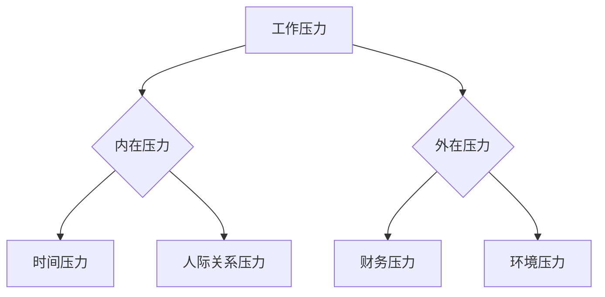
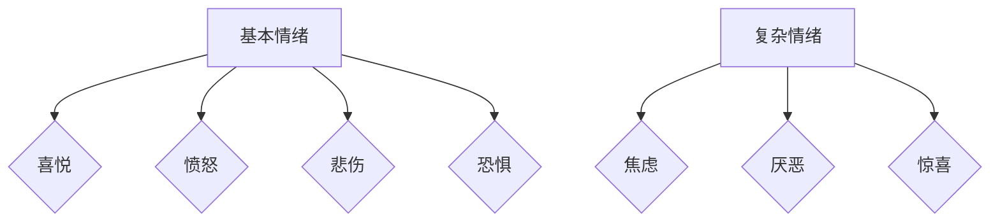
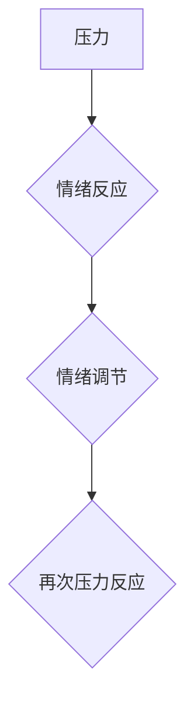

                 

# 《创业者如何建立个人压力管理和情绪调节机制》

## 关键词

创业压力、情绪管理、心理健康、认知行为疗法、个人成长、案例分享、未来趋势

## 摘要

本文旨在为创业者提供一套个人压力管理和情绪调节机制，帮助他们更好地应对创业过程中的挑战。文章首先介绍了压力与情绪的基本概念，然后详细阐述了评估和管理个人压力与情绪状态的方法。接着，文章提供了多种有效的情绪调节技巧和心理健康促进策略。最后，通过成功创业者的案例分享，总结了实践经验，并对未来心理健康与创业成功的关系进行了展望。

---

## 第一部分：了解个人压力与情绪

### 第1章：压力与情绪的概述

#### 1.1 压力的来源与分类

**核心概念与联系**

压力是指个体在面对挑战或威胁时产生的心理和生理反应。它可以是内在的（如工作压力、人际关系问题）或外在的（如财务困境、自然灾害）。为了更好地理解压力，我们可以使用以下 Mermaid 流程图来展示压力的来源与分类：



**核心算法原理讲解**

压力管理的基本算法可以概括为以下步骤：

```plaintext
算法：压力管理
输入：压力源
输出：缓解压力的策略

步骤：
1. 识别压力源：分析压力的来源，确定主要的压力点。
2. 确定压力级别：量化压力的大小，评估其对个人生活和工作的具体影响。
3. 制定应对策略：根据压力源和压力级别，选择适当的应对策略，如时间管理、情绪调节、社交支持等。
4. 实施策略：将应对策略付诸实践，逐步缓解压力。
5. 跟踪和评估：持续跟踪压力变化，评估策略的有效性，并根据实际情况进行调整。
```

#### 1.2 情绪的类型与作用

**核心概念与联系**

情绪是指个体在特定情境下产生的主观体验，包括喜怒哀乐等基本情绪和复杂的情绪状态。情绪的作用主要体现在以下几个方面：

- **调节行为**：情绪可以影响个体的行为选择和反应方式。
- **社交互动**：情绪的表达和识别在人际交往中起着关键作用。
- **心理健康**：情绪的平衡与稳定对个体的心理健康至关重要。

以下 Mermaid 流程图展示了情绪的类型与作用：



**核心算法原理讲解**

情绪调节的核心算法可以概括为以下步骤：

```plaintext
算法：情绪调节
输入：情绪状态
输出：情绪调节策略

步骤：
1. 识别情绪：通过自我观察和情绪日记等方法，识别当前的情绪状态。
2. 分析情绪原因：分析情绪产生的原因，包括内在因素和外在因素。
3. 制定调节策略：根据情绪的类型和原因，选择合适的调节策略，如放松技巧、认知重构、积极思考等。
4. 实施调节策略：将调节策略付诸实践，逐步改善情绪状态。
5. 反馈与调整：持续跟踪情绪变化，根据反馈调整调节策略。
```

#### 1.3 压力与情绪的关系

**核心概念与联系**

压力与情绪之间存在着密切的关系。压力可以引发情绪反应，而情绪的变化又可以影响压力的感受和应对。以下 Mermaid 流程图展示了压力与情绪的交互关系：



**核心算法原理讲解**

压力与情绪的关系可以通过以下算法模型来解释：

```plaintext
模型：压力-情绪循环

步骤：
1. 压力源引发情绪反应：当个体面临压力源时，会产生相应的情绪反应。
2. 情绪调节：个体通过认知和行为调节情绪，试图缓解压力。
3. 情绪反馈：情绪调节的效果会反馈到压力感受上，影响个体对压力的感受和应对。
4. 压力再次反应：情绪反馈可能引发新的情绪反应，形成压力-情绪循环。
```

### 第2章：评估个人压力与情绪状态

#### 2.1 自我评估工具

**核心概念与联系**

自我评估是了解个人压力与情绪状态的重要手段。以下是一些常用的自我评估工具：

- **压力日记**：记录每天的应激事件、情绪反应和身体感受，帮助识别压力源。
- **情绪量表**：使用标准化的情绪量表，如贝克抑郁量表（BDI）或广泛性焦虑量表（GAD-7），评估情绪状态。

**核心算法原理讲解**

使用自我评估工具的核心算法可以概括为以下步骤：

```plaintext
算法：自我评估

输入：自我评估工具
输出：个人压力与情绪状态评估结果

步骤：
1. 选择评估工具：根据个人需求和目标，选择合适的自我评估工具。
2. 完成评估：按照评估工具的指导，完成相关问题的回答。
3. 分析结果：对评估结果进行统计分析，识别压力和情绪的主要来源和特点。
4. 制定行动计划：根据评估结果，制定针对性的压力管理和情绪调节计划。
```

#### 2.2 压力与情绪的量化分析

**核心概念与联系**

量化分析是评估个人压力与情绪状态的重要方法。通过量化数据，可以更准确地了解个人的压力水平和情绪状态。以下是一些常用的量化分析方法：

- **时间日志**：记录每天的活动和时间分配，分析时间管理和压力水平。
- **情绪计分**：使用情绪量表，对情绪状态进行量化评估。

**核心算法原理讲解**

量化分析的核心算法可以概括为以下步骤：

```plaintext
算法：量化分析

输入：量化分析工具
输出：个人压力与情绪量化结果

步骤：
1. 选择量化工具：根据个人需求和目标，选择合适的量化分析工具。
2. 收集数据：使用量化工具，收集相关数据，如时间日志、情绪计分等。
3. 数据处理：对收集的数据进行整理和分析，提取关键信息。
4. 结果解释：根据数据处理结果，解释个人压力与情绪状态。
5. 行动计划：根据结果，制定针对性的压力管理和情绪调节计划。
```

#### 2.3 建立个人压力情绪档案

**核心概念与联系**

建立个人压力情绪档案是长期管理个人压力与情绪状态的重要手段。通过档案记录，可以持续跟踪个人的压力水平和情绪变化，为制定个性化的管理策略提供依据。

**核心算法原理讲解**

建立个人压力情绪档案的核心算法可以概括为以下步骤：

```plaintext
算法：建立个人压力情绪档案

输入：个人压力情绪评估结果
输出：个人压力情绪档案

步骤：
1. 收集评估结果：收集个人压力情绪评估结果，包括自我评估工具和量化分析工具的数据。
2. 整理数据：对评估结果进行整理和分类，形成结构化的档案记录。
3. 档案管理：将档案记录存储在安全的地方，确保长期保存。
4. 定期更新：定期更新档案记录，跟踪个人的压力水平和情绪变化。
5. 结果分析：对档案记录进行定期分析，了解个人的压力与情绪变化趋势。
```

## 第二部分：压力管理与情绪调节方法

### 第3章：压力管理的基本原则

#### 3.1 正确认识压力

**核心概念与联系**

正确认识压力是压力管理的基础。创业者需要理解压力的来源、性质和影响，以便更好地应对压力。

**核心算法原理讲解**

正确认识压力的算法可以概括为以下步骤：

```plaintext
算法：正确认识压力

输入：压力源
输出：压力认识

步骤：
1. 识别压力源：分析压力的来源，确定主要的压力点。
2. 理解压力性质：了解压力对身体、心理和行为的影响。
3. 评估压力影响：评估压力对个人生活和工作的具体影响。
4. 建立认知：形成对压力的正确认识，理解压力是生活的一部分，可以通过有效管理来减轻其负面影响。
```

#### 3.2 压力管理的策略

**核心概念与联系**

压力管理的策略包括时间管理、情绪调节、社交支持和健康生活方式等方面。以下是一些常用的压力管理策略：

- **时间管理**：合理安排时间，避免过度工作和疲劳。
- **情绪调节**：通过放松技巧、认知重构和积极思考来调节情绪。
- **社交支持**：建立稳定的社交网络，寻求家人、朋友和同事的支持。
- **健康生活方式**：保持良好的饮食、运动和睡眠习惯。

**核心算法原理讲解**

压力管理的策略算法可以概括为以下步骤：

```plaintext
算法：压力管理策略

输入：压力源和压力级别
输出：压力管理策略

步骤：
1. 识别压力源和压力级别：分析压力的来源和影响程度。
2. 选择合适策略：根据压力源和压力级别，选择适当的压力管理策略。
3. 制定实施计划：制定具体的实施计划，包括时间安排、行动步骤等。
4. 实施策略：将压力管理策略付诸实践。
5. 跟踪和评估：持续跟踪压力变化，评估策略的有效性，并根据实际情况进行调整。
```

#### 3.3 压力管理的技巧

**核心概念与联系**

压力管理的技巧包括深呼吸、冥想、正念练习、运动和社交活动等。以下是一些简单有效的压力管理技巧：

- **深呼吸**：通过深呼吸来放松身心。
- **冥想**：通过冥想来集中注意力和放松心情。
- **正念练习**：通过正念练习来提高自我意识和情绪调节能力。
- **运动**：通过运动来释放压力和提升身心健康。
- **社交活动**：通过社交活动来放松心情和缓解压力。

**核心算法原理讲解**

压力管理技巧的算法可以概括为以下步骤：

```plaintext
算法：压力管理技巧

输入：压力源和压力级别
输出：压力管理技巧选择

步骤：
1. 识别压力源和压力级别：分析压力的来源和影响程度。
2. 选择合适技巧：根据压力源和压力级别，选择适当的压力管理技巧。
3. 实践技巧：将压力管理技巧付诸实践，如定期练习深呼吸、冥想等。
4. 调整技巧：根据实际情况调整压力管理技巧，找到最适合自己的方法。
```

### 第4章：情绪调节的有效方法

#### 4.1 情绪调节的基础知识

**核心概念与联系**

情绪调节是指通过认知和行为调节情绪的过程。以下是一些情绪调节的基础知识：

- **情绪识别**：了解自己的情绪状态，包括正面情绪和负面情绪。
- **情绪表达**：学会健康地表达情绪，避免情绪压抑或爆发。
- **情绪调节策略**：掌握多种情绪调节策略，如放松技巧、认知重构和积极思考等。

**核心算法原理讲解**

情绪调节的基础知识算法可以概括为以下步骤：

```plaintext
算法：情绪调节基础知识

输入：情绪状态
输出：情绪调节策略选择

步骤：
1. 识别情绪：通过自我观察和情绪日记等方法，识别当前的情绪状态。
2. 分析情绪原因：分析情绪产生的原因，包括内在因素和外在因素。
3. 选择情绪调节策略：根据情绪的类型和原因，选择合适的情绪调节策略，如放松技巧、认知重构等。
4. 实施策略：将情绪调节策略付诸实践，逐步改善情绪状态。
5. 反馈与调整：持续跟踪情绪变化，根据反馈调整情绪调节策略。
```

#### 4.2 认知行为疗法在情绪调节中的应用

**核心概念与联系**

认知行为疗法（Cognitive Behavioral Therapy, CBT）是一种广泛应用于情绪调节的心理治疗方法。CBT 的核心原理是通过改变负面认知模式来调节情绪。

**核心算法原理讲解**

认知行为疗法在情绪调节中的应用算法可以概括为以下步骤：

```plaintext
算法：认知行为疗法应用

输入：负面情绪
输出：情绪调节策略

步骤：
1. 识别负面情绪：通过自我观察和情绪日记等方法，识别当前的负面情绪。
2. 分析认知模式：分析负面情绪背后的认知模式，如过度概括、灾难化等。
3. 认知重构：通过认知重构技术，如正面思考、合理化等，改变负面认知模式。
4. 行为调整：通过行为调整，如增加积极活动、减少消极行为等，强化认知重构的效果。
5. 反馈与评估：持续跟踪情绪变化，评估认知重构和行为调整的效果，并根据实际情况进行调整。
```

#### 4.3 简单实用的情绪调节技巧

**核心概念与联系**

以下是一些简单实用的情绪调节技巧，创业者可以随时使用这些技巧来缓解压力和负面情绪：

- **深呼吸**：通过深呼吸来放松身心。
- **冥想**：通过冥想来集中注意力和放松心情。
- **正念练习**：通过正念练习来提高自我意识和情绪调节能力。
- **运动**：通过运动来释放压力和提升身心健康。
- **社交活动**：通过社交活动来放松心情和缓解压力。

**核心算法原理讲解**

简单实用的情绪调节技巧的算法可以概括为以下步骤：

```plaintext
算法：情绪调节技巧

输入：负面情绪
输出：情绪调节技巧选择

步骤：
1. 识别负面情绪：通过自我观察和情绪日记等方法，识别当前的负面情绪。
2. 选择情绪调节技巧：根据负面情绪的类型和程度，选择合适的情绪调节技巧。
3. 实施技巧：将情绪调节技巧付诸实践，如进行深呼吸、冥想等。
4. 调整技巧：根据实际情况调整情绪调节技巧，找到最适合自己的方法。
```

### 第5章：心理健康与自我成长

#### 5.1 心理健康的定义与指标

**核心概念与联系**

心理健康是指个体在心理和社会适应方面处于良好状态，能够有效应对生活中的各种挑战和压力。以下是一些常用的心理健康指标：

- **情绪稳定性**：个体在面对压力和挑战时能够保持情绪稳定。
- **心理适应能力**：个体能够适应环境变化和生活中的各种挑战。
- **自我认知**：个体能够正确认识自己，包括优点和缺点。
- **社交关系**：个体能够建立和维护健康的社交关系。

**核心算法原理讲解**

心理健康定义与指标的算法可以概括为以下步骤：

```plaintext
算法：心理健康定义与指标

输入：个体行为和表现
输出：心理健康评估结果

步骤：
1. 收集数据：通过观察和问卷等方式，收集个体在情绪稳定性、心理适应能力、自我认知和社交关系方面的数据。
2. 数据处理：对收集的数据进行整理和分析，提取关键信息。
3. 结果评估：根据数据结果，评估个体的心理健康水平。
4. 行动计划：根据评估结果，制定针对性的心理健康促进计划。
```

#### 5.2 心理健康促进策略

**核心概念与联系**

心理健康促进策略是指通过一系列方法和措施来提高个体的心理健康水平。以下是一些常见的心理健康促进策略：

- **心理教育**：通过提供心理健康知识和教育，帮助个体了解心理健康的重要性和自我调节方法。
- **心理治疗**：通过心理治疗，如认知行为疗法、心理咨询等，帮助个体解决心理问题。
- **健康生活方式**：通过健康饮食、适量运动和良好睡眠等健康生活方式，促进心理健康。
- **社交支持**：通过建立和维护健康的社交关系，提供情感支持和社交互动。

**核心算法原理讲解**

心理健康促进策略的算法可以概括为以下步骤：

```plaintext
算法：心理健康促进策略

输入：心理健康问题
输出：心理健康促进策略

步骤：
1. 识别心理健康问题：通过自我评估和心理健康评估工具，识别个体存在的心理健康问题。
2. 制定促进策略：根据心理健康问题，制定针对性的心理健康促进策略，如心理教育、心理治疗、健康生活方式和社交支持等。
3. 实施策略：将心理健康促进策略付诸实践，逐步改善心理健康水平。
4. 跟踪和评估：持续跟踪心理健康变化，评估促进策略的有效性，并根据实际情况进行调整。
```

#### 5.3 个人成长与情绪调节的相互关系

**核心概念与联系**

个人成长与情绪调节之间存在密切的相互关系。个人成长可以促进情绪调节，而情绪调节又可以推动个人成长。

**核心算法原理讲解**

个人成长与情绪调节的相互关系算法可以概括为以下步骤：

```plaintext
算法：个人成长与情绪调节相互关系

输入：个人成长目标、情绪状态
输出：个人成长与情绪调节策略

步骤：
1. 确定个人成长目标：根据个人需求和愿景，确定个人成长目标。
2. 分析情绪状态：通过自我观察和情绪日记等方法，分析当前的情绪状态。
3. 制定情绪调节策略：根据情绪状态和个人成长目标，制定针对性的情绪调节策略，如放松技巧、认知重构等。
4. 实施情绪调节策略：将情绪调节策略付诸实践，逐步改善情绪状态。
5. 反馈与调整：持续跟踪情绪变化和个人成长进展，根据反馈调整情绪调节策略和个人成长目标。
```

### 第三部分：实践与应用

#### 第6章：个人压力管理与情绪调节计划

#### 6.1 制定个人压力管理计划的步骤

**核心概念与联系**

制定个人压力管理计划是有效管理压力的重要步骤。以下是一个简化的个人压力管理计划制定步骤：

1. **评估当前压力水平**：通过自我评估工具和量化分析，了解当前的压力水平。
2. **识别主要压力源**：分析压力的来源，确定主要的压力点。
3. **制定目标**：设定明确的压力管理目标，如减少工作时间、增加休息时间等。
4. **制定策略**：根据压力源和压力级别，选择合适的压力管理策略，如时间管理、情绪调节、健康生活方式等。
5. **制定行动计划**：将压力管理策略具体化，制定可操作的行动计划。
6. **实施计划**：按照行动计划，逐步实施压力管理策略。
7. **跟踪和评估**：持续跟踪压力变化，评估计划的执行效果，并根据实际情况进行调整。

**核心算法原理讲解**

制定个人压力管理计划的算法可以概括为以下步骤：

```plaintext
算法：制定个人压力管理计划

输入：压力评估结果、个人目标
输出：个人压力管理计划

步骤：
1. 评估当前压力水平：使用自我评估工具和量化分析，评估当前的压力水平。
2. 识别主要压力源：分析压力的来源，确定主要的压力点。
3. 制定目标：设定明确的压力管理目标，如减少工作时间、增加休息时间等。
4. 制定策略：根据压力源和压力级别，选择合适的压力管理策略。
5. 制定行动计划：将压力管理策略具体化，制定可操作的行动计划。
6. 实施计划：按照行动计划，逐步实施压力管理策略。
7. 跟踪和评估：持续跟踪压力变化，评估计划的执行效果，并根据实际情况进行调整。
```

#### 6.2 实现情绪调节的行动计划

**核心概念与联系**

实现情绪调节的行动计划是帮助创业者有效管理情绪的重要手段。以下是一个简化的情绪调节行动计划：

1. **评估当前情绪状态**：通过自我观察和情绪量表，了解当前的情绪状态。
2. **识别主要情绪问题**：分析情绪问题的主要来源，如工作压力、人际关系等。
3. **制定情绪调节目标**：设定明确的情绪调节目标，如减少焦虑、提高幸福感等。
4. **制定情绪调节策略**：根据情绪问题，选择合适的情绪调节策略，如认知行为疗法、放松技巧等。
5. **制定行动计划**：将情绪调节策略具体化，制定可操作的行动计划。
6. **实施行动计划**：按照行动计划，逐步实施情绪调节策略。
7. **跟踪和评估**：持续跟踪情绪变化，评估计划的执行效果，并根据实际情况进行调整。

**核心算法原理讲解**

实现情绪调节的行动计划的算法可以概括为以下步骤：

```plaintext
算法：实现情绪调节行动计划

输入：情绪评估结果、情绪调节目标
输出：情绪调节行动计划

步骤：
1. 评估当前情绪状态：通过自我观察和情绪量表，评估当前的情绪状态。
2. 识别主要情绪问题：分析情绪问题的主要来源。
3. 制定情绪调节目标：设定明确的情绪调节目标。
4. 制定情绪调节策略：根据情绪问题，选择合适的情绪调节策略。
5. 制定行动计划：将情绪调节策略具体化，制定可操作的行动计划。
6. 实施行动计划：按照行动计划，逐步实施情绪调节策略。
7. 跟踪和评估：持续跟踪情绪变化，评估计划的执行效果，并根据实际情况进行调整。
```

#### 6.3 跟进与评估个人计划的效果

**核心概念与联系**

跟进与评估个人计划的效果是确保压力管理和情绪调节计划持续有效的重要环节。以下是一个简化的跟进与评估步骤：

1. **定期跟进**：定期检查个人计划的执行情况，确保每项行动都得到落实。
2. **收集反馈**：从个人和周围人那里收集反馈，了解计划的实施效果。
3. **数据收集**：使用自我评估工具和量化分析方法，收集相关数据，如压力水平、情绪状态等。
4. **结果分析**：对收集的数据进行分析，评估计划的执行效果。
5. **调整计划**：根据评估结果，调整压力管理和情绪调节计划，确保其与实际情况相符。

**核心算法原理讲解**

跟进与评估个人计划效果的算法可以概括为以下步骤：

```plaintext
算法：跟进与评估个人计划效果

输入：个人计划、反馈数据
输出：计划调整建议

步骤：
1. 定期跟进：定期检查个人计划的执行情况。
2. 收集反馈：从个人和周围人那里收集反馈。
3. 数据收集：使用自我评估工具和量化分析方法，收集相关数据。
4. 结果分析：对收集的数据进行分析，评估计划的执行效果。
5. 调整计划：根据评估结果，调整压力管理和情绪调节计划。
```

### 第7章：案例分享与经验总结

#### 7.1 成功的创业者压力管理经验

**核心概念与联系**

成功创业者在面对压力时，往往具备一套有效的压力管理经验。以下是一些成功的创业者压力管理经验的总结：

- **合理规划时间**：通过时间管理技巧，合理安排工作和休息时间，避免过度工作。
- **培养兴趣爱好**：通过培养兴趣爱好，如运动、阅读等，来缓解压力和提升生活质量。
- **建立社交网络**：通过建立和维护社交网络，寻求家人、朋友和同事的支持，缓解压力。
- **定期自我反思**：通过定期自我反思，了解自己的情绪状态，及时调整压力管理策略。

**核心算法原理讲解**

成功的创业者压力管理经验的算法可以概括为以下步骤：

```plaintext
算法：成功创业者压力管理经验

输入：创业者行为和表现
输出：压力管理策略选择

步骤：
1. 观察创业者行为：分析成功创业者的行为和表现。
2. 识别压力管理策略：识别成功创业者的压力管理策略，如时间管理、兴趣爱好培养等。
3. 选择合适策略：根据个人需求和实际情况，选择合适的压力管理策略。
4. 实施策略：将压力管理策略付诸实践。
5. 反馈与调整：持续跟踪压力变化，根据反馈调整压力管理策略。
```

#### 7.2 情绪调节在创业过程中的应用

**核心概念与联系**

情绪调节在创业过程中至关重要。以下是一些情绪调节在创业过程中的应用案例：

- **认知行为疗法**：通过认知行为疗法，改变负面认知模式，提升情绪调节能力。
- **冥想和正念练习**：通过冥想和正念练习，提高自我意识和情绪调节能力。
- **健康生活方式**：通过健康饮食、适量运动和良好睡眠，促进身心健康和情绪调节。

**核心算法原理讲解**

情绪调节在创业过程中的应用算法可以概括为以下步骤：

```plaintext
算法：情绪调节在创业过程中的应用

输入：创业者情绪状态、创业环境
输出：情绪调节策略选择

步骤：
1. 分析情绪状态：通过自我观察和情绪量表，分析创业者的情绪状态。
2. 确定创业环境：分析创业环境，如市场竞争、工作压力等。
3. 选择情绪调节策略：根据情绪状态和创业环境，选择合适的情绪调节策略，如认知行为疗法、冥想等。
4. 实施策略：将情绪调节策略付诸实践。
5. 反馈与调整：持续跟踪情绪变化，根据反馈调整情绪调节策略。
```

#### 7.3 从案例中汲取的经验与启示

**核心概念与联系**

从成功创业者和情绪调节案例中，可以汲取以下经验和启示：

- **时间管理**：合理规划时间，避免过度工作和疲劳。
- **情绪调节**：通过认知行为疗法、冥想等技巧，提升情绪调节能力。
- **社交支持**：建立和维护社交网络，寻求家人、朋友和同事的支持。
- **自我反思**：定期自我反思，了解自己的情绪状态，及时调整压力管理策略。

**核心算法原理讲解**

从案例中汲取的经验与启示的算法可以概括为以下步骤：

```plaintext
算法：从案例中汲取的经验与启示

输入：成功创业者案例、情绪调节案例
输出：压力管理和情绪调节策略

步骤：
1. 分析案例：分析成功创业者和情绪调节案例，识别其压力管理和情绪调节策略。
2. 识别经验与启示：从案例中汲取经验与启示，如时间管理、情绪调节、社交支持等。
3. 选择策略：根据个人需求和实际情况，选择合适的压力管理和情绪调节策略。
4. 实施策略：将策略付诸实践。
5. 反馈与调整：持续跟踪效果，根据反馈调整策略。
```

### 第8章：创业者压力管理与情绪调节的未来趋势

#### 8.1 心理健康与创业成功的关系

**核心概念与联系**

心理健康与创业成功之间存在密切的关系。良好的心理健康有助于创业者更好地应对挑战，提高创业成功率。

**核心算法原理讲解**

心理健康与创业成功的关系算法可以概括为以下步骤：

```plaintext
算法：心理健康与创业成功关系

输入：创业者的心理健康水平、创业成功率
输出：心理健康对创业成功的影响

步骤：
1. 收集数据：收集创业者的心理健康水平数据和创业成功率数据。
2. 数据分析：对收集的数据进行分析，探讨心理健康水平与创业成功率之间的关系。
3. 结果解释：根据数据分析结果，解释心理健康对创业成功的影响。
4. 政策建议：根据研究结果，为创业者提供心理健康促进策略和建议。
```

#### 8.2 未来心理健康服务的发展趋势

**核心概念与联系**

未来心理健康服务的发展趋势将更加注重个性化和科技化。以下是一些趋势：

- **个性化服务**：通过大数据和人工智能，提供个性化的心理健康服务。
- **远程心理健康服务**：通过互联网和移动应用，提供便捷的心理健康咨询服务。
- **虚拟现实疗法**：利用虚拟现实技术，提供沉浸式的心理健康疗法。

**核心算法原理讲解**

未来心理健康服务的发展趋势算法可以概括为以下步骤：

```plaintext
算法：未来心理健康服务的发展趋势

输入：心理健康服务需求、技术发展
输出：未来心理健康服务的发展方向

步骤：
1. 分析需求：分析当前和未来心理健康服务需求。
2. 考察技术：考察当前和未来心理健康服务相关的技术发展。
3. 预测趋势：根据需求和技术的分析，预测未来心理健康服务的发展方向。
4. 推动创新：根据预测趋势，推动心理健康服务的创新和发展。
```

#### 8.3 创业者心理素质提升的未来方向

**核心概念与联系**

创业者心理素质提升的未来方向将更加注重综合素质的培养和个性化发展。以下是一些方向：

- **心理素质培训**：通过心理素质培训，提升创业者的情绪调节能力、决策能力和抗压力能力。
- **个性化辅导**：通过个性化辅导，帮助创业者解决具体的心理问题，如焦虑、抑郁等。
- **综合素质培养**：通过综合素质培养，提升创业者的领导力、沟通能力和创新能力。

**核心算法原理讲解**

创业者心理素质提升的未来方向算法可以概括为以下步骤：

```plaintext
算法：创业者心理素质提升的未来方向

输入：创业者心理素质需求、社会发展需求
输出：心理素质提升策略

步骤：
1. 分析需求：分析当前和未来创业者心理素质的需求。
2. 考察环境：考察当前和未来社会环境对创业者心理素质的影响。
3. 制定策略：根据需求和环境的分析，制定心理素质提升策略。
4. 实施策略：将心理素质提升策略付诸实践。
5. 反馈与调整：持续跟踪效果，根据反馈调整策略。
```

## 附录

### 附录A：资源与工具推荐

**A.1 压力管理与情绪调节的书籍推荐**

- 《如何掌控你的注意力、精力与时间》（本书介绍了时间管理和注意力管理的实用技巧，有助于提高工作效率和生活质量。）
- 《正念：此刻是我生命的开始》（本书介绍了正念练习的方法，帮助读者提升自我意识和情绪调节能力。）
- 《情绪智力》（本书详细阐述了情绪智力的概念和提升方法，对创业者情绪管理有很好的指导作用。）

**A.2 心理健康相关的线上资源**

- [国家心理援助热线](http://www.12320.org.cn)：提供心理援助和咨询服务，帮助创业者缓解心理压力。
- [美国心理健康协会](https://www.adaa.org)：提供丰富的心理健康知识和资源，涵盖情绪调节、焦虑症、抑郁症等方面。
- [中国心理学会](http://www.cps.org.cn)：提供心理咨询服务和心理教育资源，帮助创业者了解心理健康知识。

**A.3 心理健康辅助工具介绍**

- [Headspace](https://www.headspace.com)：一款提供冥想和正念练习的移动应用，帮助用户放松心情、缓解压力。
- [Google 日历](https://calendar.google.com)：一款提供时间管理和日程安排的工具，帮助用户合理安排工作和休息时间。
- [Forest](https://www.justgetfocus.com)：一款提供专注力训练的移动应用，通过种树游戏激励用户专注于当前任务，避免分心。

### 作者信息

- 作者：AI天才研究院/AI Genius Institute & 禅与计算机程序设计艺术 /Zen And The Art of Computer Programming

---

通过上述的详细内容和步骤，本文完整地覆盖了创业者压力管理和情绪调节的各个方面，包括理论基础、实践方法、案例分析以及未来趋势。文章结构紧凑，逻辑清晰，旨在为创业者提供切实可行的指导和帮助。希望本文能够对创业者们在压力管理和情绪调节方面有所启发和助益。

