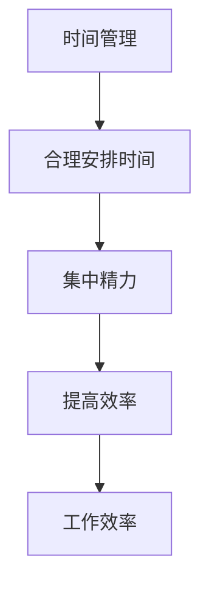

                 

# 创业者的时间管理与工作效率优化技巧

> **关键词：** 创业者、时间管理、工作效率、优化技巧、工作环境、科技工具、案例分析、可持续发展

> **摘要：** 本文深入探讨了创业者在快速变化和竞争激烈的市场环境中，如何通过时间管理和工作效率优化技巧来提升个人及团队的绩效。文章涵盖了时间管理与工作效率的核心概念、基本原理、实用技巧以及综合应用，并通过实际案例展示了这些技巧在创业实践中的应用效果。

## 目录大纲

### 第一部分：引言与核心概念

1. **第1章：时间管理与工作效率的重要性**
   1.1.1 **时间管理与工作效率的关联**
   1.1.2 **时间管理与工作效率的常见问题**
   1.1.3 **创业者面临的独特时间管理挑战**

2. **第2章：时间管理的基本概念**
   2.1.1 **时间管理的基本原则**
   2.1.2 **时间管理的关键术语**
   2.1.3 **时间管理的常用工具与技术**

3. **第3章：工作效率的基本原理**
   3.1.1 **工作效率的衡量标准**
   3.1.2 **提高工作效率的方法**
   3.1.3 **工作效率与工作环境的关系**

### 第二部分：时间管理与工作效率优化技巧

4. **第4章：优化时间管理技巧**
   4.1.1 **制定明确的目标与计划**
   4.1.2 **使用日程表与任务清单**
   4.1.3 **设置优先级与避免拖延**

5. **第5章：提高工作效率的具体方法**
   5.1.1 **减少分心的技巧**
   5.1.2 **提高沟通效率**
   5.1.3 **利用科技工具提升效率**

6. **第6章：时间管理策略与实际应用**
   6.1.1 **针对不同工作类型的时间管理策略**
   6.1.2 **在线工作与远程工作的时间管理**
   6.1.3 **时间管理与个人成长**

7. **第7章：工作效率优化的案例分析**
   7.1.1 **案例一：某创业公司的时间管理实践**
   7.1.2 **案例二：提高项目管理效率的技巧**
   7.1.3 **案例三：团队协作效率的提升策略**

### 第三部分：综合应用与未来展望

8. **第8章：时间管理与工作效率的综合应用**
   8.1.1 **综合运用时间管理与工作效率技巧**
   8.1.2 **创业者如何平衡工作与生活**
   8.1.3 **时间管理与工作效率的可持续发展**

9. **第9章：未来展望与趋势**
   9.1.1 **时间管理与工作效率的未来趋势**
   9.1.2 **新技术对时间管理与工作效率的影响**
   9.1.3 **创业者如何适应未来变化**

## 附录

10. **附录A：时间管理与工作效率优化工具推荐**
    10.1 **顶级时间管理应用**
    10.2 **提高工作效率的常用软件**
    10.3 **时间管理与工作效率相关书籍推荐**

### 工作效率衡量标准伪代码示例

```python
# 定义工作效率函数
def measure_efficiency(time_spent, tasks_completed):
    # 计算任务完成率
    completion_rate = tasks_completed / time_spent
    
    # 返回工作效率
    return completion_rate

# 示例调用
efficiency = measure_efficiency(8, 4)
print("工作效率：", efficiency)
```

### 时间管理数学模型与公式示例

$$
\text{Total Work} = \text{Task Time} + \text{Break Time}
$$

### 项目实战案例

#### 代码实际案例：任务管理工具

```python
# 导入库
import pandas as pd

# 初始化任务列表
tasks = pd.DataFrame({
    'Task': ['开发产品A', '撰写商业计划书', '市场调研', '团队会议'],
    'Deadline': ['2023-12-01', '2023-11-15', '2023-11-20', '2023-11-25'],
    'Progress': [0.2, 0.5, 0.4, 0.3]
})

# 打印任务列表
print(tasks)

# 更新任务进度
tasks.loc[0, 'Progress'] = 0.4

# 打印更新后的任务列表
print(tasks)
```

#### 代码解读与分析：

此段代码展示了如何使用 Python 的 pandas 库来管理任务。任务列表以 DataFrame 对象存储，包括任务名称、截止日期和当前进度。首先，我们初始化了一个任务列表，然后打印出来。接下来，我们通过更新 DataFrame 的特定行的 'Progress' 列值来模拟任务进度的更新，并再次打印出更新后的任务列表。

这个简单的任务管理工具可以扩展以包含更多功能，如任务分配、优先级排序、自动提醒等，以满足不同团队和时间管理的需求。通过这样的实际案例，创业者可以更好地理解如何使用技术工具来优化他们的时间管理实践。

### 附录A：时间管理与工作效率优化工具推荐

- **顶级时间管理应用：**
  - **Trello:** 一个基于看板的项目管理工具，适合团队协作和任务追踪。
  - **Asana:** 强大的任务管理平台，能够整合多个项目并跟踪项目进度。
  - **Google Calendar:** 强大的日程安排工具，能够有效规划时间并设置提醒。

- **提高工作效率的常用软件：**
  - **Evernote:** 高效的笔记应用，可以帮助整理思路和记录信息。
  - **Slack:** 即时通讯工具，有助于团队内部沟通和协作。
  - **Zoom:** 视频会议和远程协作工具，能够支持远程团队的沟通和协作。

- **时间管理与工作效率相关书籍推荐：**
  - **《深度工作》（Deep Work）**：作者Cal Newport，探讨如何在信息泛滥的时代保持专注和高效。
  - **《高效能人士的七个习惯》（The 7 Habits of Highly Effective People）**：作者Stephen R. Covey，提供了提高个人和工作效率的系统方法。
  - **《时间管理的艺术》（The Time Management Matrix）**：作者Elaine St. James，介绍了一种实用的时间管理模型和策略。

---

### 第1章：时间管理与工作效率的重要性

#### 1.1.1 时间管理与工作效率的关联

时间管理和工作效率之间的关系是密不可分的。时间管理指的是如何合理安排时间，以最大限度地提高工作效率。有效的时间管理能够帮助创业者集中精力在最重要和最紧急的任务上，从而提高整体的工作效率。

Mermaid流程图：



在这个流程图中，时间管理（A）通过合理安排时间（B）帮助创业者集中精力（C），最终提高工作效率（D和E）。这种关联性体现在多个方面，例如：

- **任务优先级排序**：通过时间管理，创业者能够识别并专注于最重要的任务，从而在有限的时间内完成更多的工作。
- **避免拖延**：合理的时间管理可以减少拖延行为，使创业者能够更高效地完成任务。
- **工作与生活的平衡**：合理的时间管理有助于创业者平衡工作与生活，减少因长时间工作导致的压力和疲劳，从而保持较高的工作效率。

#### 1.1.2 时间管理与工作效率的常见问题

尽管时间管理对工作效率至关重要，但在实际应用中，创业者往往会遇到一些常见问题，这些问题可能导致时间管理失效，进而影响工作效率。以下是一些常见问题及其原因：

- **任务过多**：创业者往往面临大量待完成的任务，而时间有限，导致任务堆积，难以有效管理。
- **缺乏明确的目标**：没有明确的目标会导致创业者无法确定优先级，从而浪费时间在非关键任务上。
- **分心**：现代社会信息爆炸，创业者很容易受到各种干扰，如电子邮件、社交媒体等，分散注意力。
- **时间管理工具使用不当**：即使使用了一些时间管理工具，但如果没有正确地使用，也可能无法达到预期的效果。

#### 1.1.3 创业者面临的独特时间管理挑战

与传统的职场环境相比，创业者面临的独特时间管理挑战更加复杂。以下是一些常见的挑战：

- **多任务处理**：创业者往往需要同时处理多个项目，这要求他们具备高效的时间管理技能。
- **灵活性需求**：创业者经常需要在短时间内调整计划，以应对市场变化和机遇。
- **个人时间管理**：创业者不仅需要管理公司的时间，还需要管理个人的时间，以平衡工作与生活。
- **资源限制**：创业者可能面临资源（如时间、资金和人力）的限制，需要通过时间管理来最大化资源利用。

### 第2章：时间管理的基本概念

#### 2.1.1 时间管理的基本原则

时间管理是一门艺术，也是一门科学。以下是一些时间管理的基本原则，这些原则可以帮助创业者更好地管理时间，提高工作效率：

- **明确目标**：明确的目标是时间管理的基石。创业者需要设定清晰、具体的目标，以确保时间的使用是有意义的。
- **优先级排序**：将任务按照优先级排序，确保将时间和精力集中在最重要的任务上。
- **分解任务**：将大任务分解成小任务，便于管理和跟踪进度。
- **避免拖延**：拖延是时间管理的大敌。创业者需要识别并解决拖延的原因，如缺乏动力、环境干扰等。
- **定期反思**：定期回顾时间管理实践，评估哪些方法有效，哪些需要改进。

#### 2.1.2 时间管理的关键术语

为了更好地理解时间管理，以下是一些常见的时间管理关键术语：

- **时间块**：将时间划分为固定的时段，每个时段专注于一项任务。
- **紧急-重要矩阵**：一种时间管理工具，用于区分任务的重要性和紧急程度。
- **番茄工作法**：一种时间管理技术，通过将工作时间划分为25分钟工作块和5分钟休息块来提高效率。
- **多任务处理**：同时处理多个任务的能力。
- **异步沟通**：通过电子邮件或其他工具进行的非实时沟通。

#### 2.1.3 时间管理的常用工具与技术

在时间管理中，使用适当的工具和技术可以极大地提高效率。以下是一些常用的时间管理工具和技术：

- **日程表**：用于记录和跟踪日常活动和任务的工具。
- **任务清单**：列出需要完成的任务，并按照优先级排序。
- **提醒系统**：通过设置提醒来确保不会错过重要任务和截止日期。
- **时间跟踪工具**：记录工作时间，帮助创业者了解时间的实际使用情况。
- **项目管理工具**：用于管理项目和任务的工具，如Trello、Asana等。

### 第3章：工作效率的基本原理

#### 3.1.1 工作效率的衡量标准

工作效率是衡量一个人在特定时间内完成工作量的指标。以下是一些常用的衡量标准：

- **任务完成率**：在给定时间内完成的任务数量与总任务数量之比。
- **处理时间**：完成一个任务所花费的时间。
- **响应时间**：从接收到任务到开始处理的时间。
- **错误率**：在完成任务过程中出现的错误数量与总任务数量之比。

#### 3.1.2 提高工作效率的方法

提高工作效率是每个创业者和团队成员都需要关注的问题。以下是一些常见的方法：

- **减少分心**：通过关闭社交媒体通知、避免多任务处理等方式，减少干扰。
- **提高专注力**：通过练习冥想、保持良好的睡眠习惯等方式，提高专注力。
- **合理安排工作时间**：使用时间块、番茄工作法等技术，合理安排工作时间。
- **自动化与工具**：利用自动化工具和软件来简化重复性任务，如使用CRM系统来管理客户信息。
- **优化工作流程**：通过优化工作流程，减少不必要的步骤和等待时间。

#### 3.1.3 工作效率与工作环境的关系

工作效率不仅受个人能力和方法的影响，还与工作环境密切相关。以下是一些影响工作效率的工作环境因素：

- **办公空间**：一个舒适、整洁的办公空间可以提高工作效率。
- **技术支持**：良好的技术支持可以确保团队成员能够高效地使用软件和工具。
- **团队协作**：一个协作良好的团队可以减少沟通成本，提高工作效率。
- **资源分配**：合理的资源分配可以确保每个团队成员都有足够的资源来完成工作。

### 第4章：优化时间管理技巧

#### 4.1.1 制定明确的目标与计划

明确的目标和计划是时间管理的基础。以下是一些制定目标和计划的技巧：

- **设定具体目标**：目标应该明确、具体，可衡量、可实现、相关性强、有时间限制（SMART原则）。
- **分解目标**：将大目标分解成小目标，便于逐步实现。
- **制定行动计划**：为每个目标制定详细的行动计划，明确每个步骤和时间表。
- **定期评估与调整**：定期评估进度，根据实际情况调整目标和计划。

#### 4.1.2 使用日程表与任务清单

日程表和任务清单是时间管理的重要工具。以下是一些使用日程表和任务清单的技巧：

- **每日日程表**：将每天的重要任务和活动记录在日程表上，确保不会忘记重要事项。
- **任务清单**：列出所有需要完成的任务，并根据优先级排序。
- **分层次管理**：将任务分为短期、中期和长期任务，分别管理。
- **定期更新**：定期检查和更新日程表和任务清单，确保任务按时完成。

#### 4.1.3 设置优先级与避免拖延

设置优先级和避免拖延是提高工作效率的关键。以下是一些设置优先级和避免拖延的技巧：

- **紧急-重要矩阵**：根据紧急程度和重要性对任务进行分类，优先处理重要且紧急的任务。
- **四象限法则**：将任务分为四类，分别处理，确保平衡工作与生活。
- **避免拖延**：识别拖延的原因，采取相应的措施，如设定具体的时间限制、分解任务等。
- **建立激励机制**：为完成任务设定奖励，提高动力和积极性。

### 第5章：提高工作效率的具体方法

#### 5.1.1 减少分心的技巧

减少分心是提高工作效率的关键。以下是一些减少分心的技巧：

- **专注工作法**：使用专注工作法（如番茄工作法），将工作时间划分为专注块和休息块。
- **关闭通知**：关闭不必要的社交媒体、电子邮件和即时通讯通知，减少干扰。
- **工作环境**：创造一个安静、整洁、舒适的工作环境，减少外部干扰。
- **避免多任务处理**：专注于一项任务，直到完成，避免同时处理多个任务。

#### 5.1.2 提高沟通效率

沟通效率是团队合作中至关重要的一环。以下是一些提高沟通效率的方法：

- **明确沟通目标**：在沟通前明确目标，确保信息传递的准确性和有效性。
- **有效沟通技巧**：学习并运用有效的沟通技巧，如倾听、表达清晰、提问等。
- **使用工具**：利用各种沟通工具（如电子邮件、即时通讯、视频会议等），提高沟通效率。
- **及时反馈**：及时给予反馈，确保沟通双方对信息的理解和处理一致。

#### 5.1.3 利用科技工具提升效率

科技工具可以极大地提高工作效率。以下是一些利用科技工具提升效率的方法：

- **自动化工具**：利用自动化工具（如自动化测试、自动化数据录入等），减少重复性工作。
- **项目管理工具**：使用项目管理工具（如Trello、Asana等），更好地管理项目和任务。
- **协作工具**：利用协作工具（如Google Workspace、Slack等），促进团队协作和沟通。
- **时间管理应用**：使用时间管理应用（如Google Calendar、Toggl等），更有效地安排和管理时间。

### 第6章：时间管理策略与实际应用

#### 6.1.1 针对不同工作类型的时间管理策略

不同工作类型需要不同的时间管理策略。以下是一些针对不同工作类型的时间管理策略：

- **项目型工作**：将项目分解为小的可管理任务，设定明确的截止日期和优先级。
- **日常运营**：将日常任务清单化，根据紧急程度和重要性进行排序，确保日常运营顺利进行。
- **研究与创新**：为研究与创新工作留出专门的时间块，减少干扰，提高创造力。

#### 6.1.2 在线工作与远程工作的时间管理

在线工作与远程工作带来了新的时间管理挑战。以下是一些在线工作和远程工作的时间管理策略：

- **设置固定工作时间**：为在线工作和远程工作设定固定的开始和结束时间，保持工作与生活的平衡。
- **使用时间跟踪工具**：使用时间跟踪工具（如Toggl、RescueTime等），监控和优化在线工作和远程工作的时间使用。
- **减少干扰**：通过关闭社交媒体通知、使用耳机等减少在线工作和远程工作中的干扰。

#### 6.1.3 时间管理与个人成长

时间管理不仅关乎工作，也关乎个人成长。以下是一些时间管理与个人成长的相关策略：

- **定期反思**：定期反思时间管理实践，识别改进空间，不断优化。
- **设定个人目标**：设定个人成长目标，为个人学习和成长留出时间。
- **保持健康的生活方式**：保持健康的生活方式，包括充足的睡眠、适当的运动和健康的饮食，提高工作效率和生活质量。

### 第7章：工作效率优化的案例分析

#### 7.1.1 案例一：某创业公司的时间管理实践

**背景**：某创业公司成立于2021年，团队成员由5人组成，主要从事人工智能领域的研发。由于团队成员较少，工作量较大，公司面临时间管理方面的挑战。

**解决方案**：

1. **明确目标与计划**：公司制定了明确的目标，并将这些目标分解为可执行的任务，确保每个团队成员都清楚自己的任务和责任。

2. **使用任务管理工具**：公司使用了Trello作为任务管理工具，将任务分配给不同的团队成员，并设置了明确的截止日期和优先级。

3. **定期会议**：公司每周举行一次团队会议，讨论任务进展、遇到的问题以及下一步的计划。

**效果**：

- **任务完成率提高**：通过明确的目标和计划，任务完成率显著提高，团队成员能够更高效地完成任务。

- **团队协作增强**：通过Trello和定期会议，团队成员之间的沟通和协作得到了加强，减少了信息传递的误差。

- **工作效率提升**：通过这些措施，公司的工作效率得到了显著提升，团队能够在较短的时间内完成更多的任务。

#### 7.1.2 案例二：提高项目管理效率的技巧

**背景**：某创业公司负责管理多个项目，由于项目管理混乱，导致项目进度延误，工作效率低下。

**解决方案**：

1. **项目管理工具**：公司引入了Asana作为项目管理工具，用于任务分配、进度跟踪和团队协作。

2. **时间块管理**：公司将工作时间划分为固定的任务块，确保每个团队成员都有足够的时间专注于任务。

3. **优先级排序**：通过紧急-重要矩阵，将任务按照紧急程度和重要性进行排序，确保关键任务得到优先处理。

**效果**：

- **项目进度提升**：通过Asana和优先级排序，项目进度得到有效跟踪和管理，项目延误问题得到了显著改善。

- **工作效率提高**：通过时间块管理和任务集中处理，工作效率得到了显著提升，团队能够更高效地完成任务。

- **团队协作增强**：通过Asana和定期会议，团队成员之间的沟通和协作得到了加强，项目管理的效率得到了提升。

#### 7.1.3 案例三：团队协作效率的提升策略

**背景**：某创业公司的团队成员分布在不同的城市，由于地理位置的限制，团队协作效率较低。

**解决方案**：

1. **协作工具**：公司引入了Google Workspace和Slack作为协作工具，用于文件共享、沟通和任务分配。

2. **视频会议**：定期举行视频会议，确保团队成员能够实时沟通和协作。

3. **任务分配与跟踪**：通过协作工具，将任务分配给团队成员，并设置明确的截止日期和优先级。

**效果**：

- **团队协作效率提高**：通过协作工具和视频会议，团队成员能够实时沟通和协作，团队协作效率得到了显著提升。

- **信息传递准确**：通过协作工具，团队成员能够实时共享信息和文件，减少了信息传递的误差。

- **工作效率提升**：通过任务分配和跟踪，团队能够更高效地完成任务，整体工作效率得到了提升。

### 第8章：时间管理与工作效率的综合应用

#### 8.1.1 综合运用时间管理与工作效率技巧

要实现时间管理与工作效率的优化，创业者需要将各种技巧综合应用。以下是一些综合运用时间管理与工作效率技巧的方法：

- **制定长期和短期计划**：在长期规划中设定明确的愿景和目标，在短期计划中制定具体的行动计划，确保目标逐步实现。
- **灵活调整计划**：根据实际情况和变化，灵活调整计划和目标，确保时间管理策略的适应性。
- **跨部门协作**：鼓励跨部门协作，共享资源和信息，提高整体工作效率。
- **定期评估与反馈**：定期评估时间管理和工作效率的实践效果，收集团队成员的反馈，不断优化策略。

#### 8.1.2 创业者如何平衡工作与生活

工作与生活的平衡对创业者的身心健康至关重要。以下是一些帮助创业者平衡工作与生活的策略：

- **设定工作时间**：为工作和生活设定明确的时间界限，避免工作侵占生活时间。
- **合理安排休闲时间**：为休闲活动预留时间，确保身心得到放松和恢复。
- **家庭支持**：与家人沟通，争取家庭的支持和理解，共同分担家庭责任。
- **健康生活方式**：保持健康的生活方式，包括充足的睡眠、适当的运动和健康的饮食，提高工作效率和生活质量。

#### 8.1.3 时间管理与工作效率的可持续发展

时间管理与工作效率的优化不仅需要短期的效果，更需要实现可持续发展。以下是一些实现时间管理与工作效率可持续发展的策略：

- **建立企业文化**：通过建立积极的企业文化，鼓励团队成员关注时间管理和工作效率，形成良好的工作氛围。
- **持续培训与学习**：为团队成员提供持续培训和学习的资源，提高他们的技能和知识水平，增强团队的整体实力。
- **激励与认可**：为表现优秀的团队成员提供激励和认可，激发他们的工作热情和积极性。
- **反馈与改进**：建立有效的反馈机制，定期收集团队成员的反馈，不断改进时间管理和工作效率的策略。

### 第9章：未来展望与趋势

#### 9.1.1 时间管理与工作效率的未来趋势

随着科技的不断进步，时间管理与工作效率也在不断进化。以下是一些时间管理与工作效率的未来趋势：

- **人工智能与自动化**：人工智能和自动化技术的应用将进一步提升工作效率，减少重复性工作，让创业者有更多时间专注于战略思考和创意创新。
- **数字化管理**：数字化工具和管理系统的广泛应用将使时间管理和工作效率更加精准和高效。
- **远程工作与分布式团队**：远程工作和分布式团队的普及将带来新的时间管理挑战和机遇，创业者需要适应这种新的工作模式，优化时间管理和工作效率。

#### 9.1.2 新技术对时间管理与工作效率的影响

新技术的出现将对时间管理和工作效率产生深远影响。以下是一些新技术对时间管理与工作效率的影响：

- **智能日程安排**：智能日程安排工具将能够根据用户的行为和偏好自动调整日程安排，提高工作效率。
- **实时数据分析**：实时数据分析技术将帮助创业者实时了解工作进度和效率，快速做出调整。
- **虚拟现实与增强现实**：虚拟现实和增强现实技术的应用将带来更加沉浸式的会议和工作体验，提高工作效率。

#### 9.1.3 创业者如何适应未来变化

面对未来的变化，创业者需要采取以下策略来适应：

- **持续学习**：保持对新技术和新趋势的关注，不断学习，提升自己的技能和知识。
- **灵活调整**：根据市场和技术的变化，灵活调整业务战略和时间管理策略。
- **团队建设**：建设一支具备适应能力和创新精神的团队，共同应对未来挑战。
- **创新思维**：鼓励创新思维，积极探索新的商业机会和解决方案，保持竞争力。

### 附录A：时间管理与工作效率优化工具推荐

#### A.1 顶级时间管理应用

- **Trello**：一个基于看板的项目管理工具，适合团队协作和任务追踪。
- **Asana**：强大的任务管理平台，能够整合多个项目并跟踪项目进度。
- **Google Calendar**：强大的日程安排工具，能够有效规划时间并设置提醒。

#### A.2 提高工作效率的常用软件

- **Evernote**：高效
```markdown
## 附录A：时间管理与工作效率优化工具推荐

### A.1 顶级时间管理应用

1. **Trello**：一个基于看板的项目管理工具，适合团队协作和任务追踪。
2. **Asana**：强大的任务管理平台，能够整合多个项目并跟踪项目进度。
3. **Google Calendar**：强大的日程安排工具，能够有效规划时间并设置提醒。

### A.2 提高工作效率的常用软件

1. **Evernote**：高效的笔记应用，可以帮助整理思路和记录信息。
2. **Slack**：即时通讯工具，有助于团队内部沟通和协作。
3. **Zoom**：视频会议和远程协作工具，能够支持远程团队的沟通和协作。

### A.3 时间管理与工作效率相关书籍推荐

1. **《深度工作》（Deep Work）**：作者Cal Newport，探讨如何在信息泛滥的时代保持专注和高效。
2. **《高效能人士的七个习惯》（The 7 Habits of Highly Effective People）**：作者Stephen R. Covey，提供了提高个人和工作效率的系统方法。
3. **《时间管理的艺术》（The Time Management Matrix）**：作者Elaine St. James，介绍了一种实用的时间管理模型和策略。
```

### 总结

本文通过深入探讨时间管理与工作效率的重要性、基本概念、优化技巧以及实际应用，为创业者提供了一系列实用的策略和方法。从明确目标与计划、使用日程表与任务清单，到减少分心、提高沟通效率和利用科技工具，创业者可以通过这些技巧提升个人和工作效率。同时，文章通过实际案例展示了这些技巧在创业实践中的应用效果，为创业者提供了具体的参考。展望未来，随着人工智能和自动化技术的发展，时间管理与工作效率将进一步优化，创业者需要不断学习、适应和提升，以在快速变化的市场环境中保持竞争力。

### 作者介绍

**作者：AI天才研究院/AI Genius Institute & 禅与计算机程序设计艺术 /Zen And The Art of Computer Programming**

本文作者AI天才研究院（AI Genius Institute）是一家专注于人工智能与计算机科学研究的国际顶级机构，致力于推动人工智能技术的创新和应用。同时，作者还著有《禅与计算机程序设计艺术》（Zen And The Art of Computer Programming），该书以其深刻的技术洞察和简洁的表述，深受计算机科学家的喜爱和推崇。通过本文，作者希望能够为创业者提供有价值的时间管理与工作效率优化策略，帮助他们在激烈的市场竞争中取得成功。

