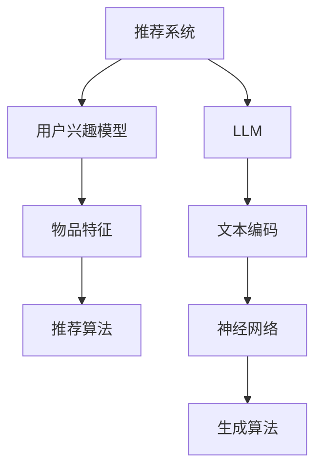
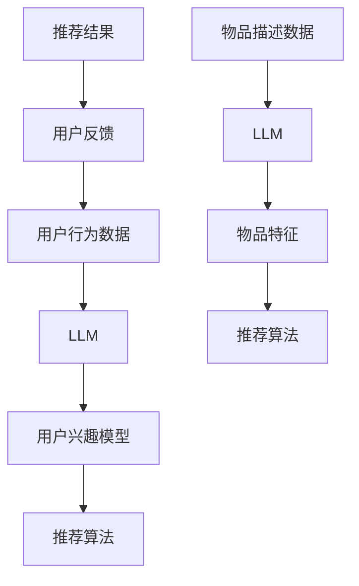
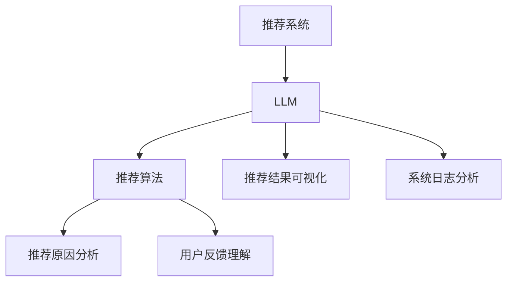
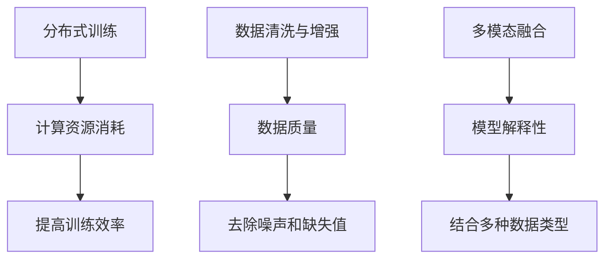
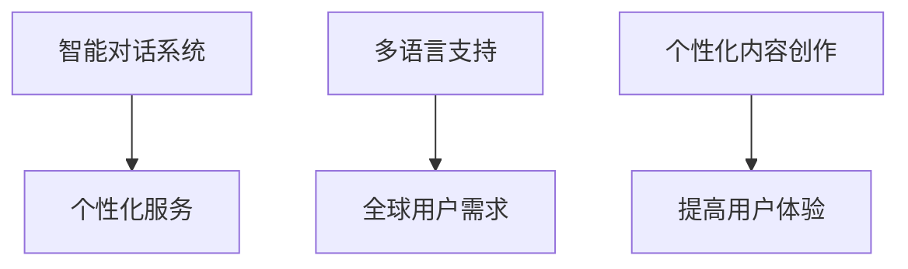

                 

# 利用LLM提升推荐系统的可解释性与透明度

> **关键词：** 推荐系统，LLM，可解释性，透明度，算法优化

> **摘要：** 本文深入探讨了利用大型语言模型（LLM）提升推荐系统的可解释性与透明度。通过分析核心概念、算法原理、应用案例和未来发展趋势，本文揭示了LLM在推荐系统中的应用潜力，并提出了一系列优化策略，为未来的研究方向提供了启示。

---

### 第一部分: 核心概念与联系

#### 1.1.1 推荐系统与LLM

**推荐系统：**
推荐系统是一种信息过滤技术，旨在为用户提供与其兴趣相关的信息。其核心组成部分包括：

- **用户兴趣模型：** 基于用户的浏览、搜索、购买等行为数据，构建用户兴趣模型，预测用户可能感兴趣的内容。
- **物品特征：** 对物品进行特征提取，如分类、标签、评分等，为推荐算法提供基础数据。
- **推荐算法：** 包括基于协同过滤、基于内容、基于知识等多种算法，实现推荐结果生成。

**LLM（大语言模型）：**
LLM 是一种能够对大量文本数据进行建模，生成文本的深度学习模型。其核心组成部分包括：

- **文本编码：** 将文本数据转换为计算机可处理的格式，如词向量、词嵌入等。
- **神经网络：** 使用多层神经网络对文本数据进行处理，提取语义信息。
- **生成算法：** 利用神经网络生成的文本，可以是回答问题、生成文章、编写代码等。

**Mermaid 流程图：**



#### 1.1.2 推荐系统与LLM的联系

**LLM在推荐系统中的应用：**
LLM 可以通过以下方式提升推荐系统的性能和可解释性：

1. **个性化推荐：** LLM 可以基于用户的历史行为和语义理解，生成个性化的推荐结果。
2. **内容理解：** LLM 可以对用户和物品的描述进行深度理解，生成更具针对性的推荐。
3. **可解释性：** LLM 可以通过生成文本的方式，解释推荐结果背后的逻辑和原因。

**Mermaid 流程图：**



#### 1.1.3 LLM提升推荐系统的可解释性与透明度

**可解释性：**
LLM 可以通过生成文本的方式，展示推荐结果背后的逻辑和原因，提高系统的可解释性。

1. **推荐原因分析：** LLM 可以生成文本，解释为何推荐某个物品。
2. **用户反馈理解：** LLM 可以理解用户的反馈，调整推荐策略。

**透明度：**
LLM 可以通过生成文本的方式，展示推荐系统的内部结构和决策过程，提高系统的透明度。

1. **推荐结果可视化：** LLM 可以生成图表，展示推荐结果的来源和依据。
2. **系统日志分析：** LLM 可以生成文本，分析系统日志，提供故障诊断和建议。

**Mermaid 流程图：**



#### 1.1.4 LLM在实际应用中的挑战与解决方案

**挑战：**
1. **计算资源消耗：** LLM 的训练和推理过程需要大量的计算资源。
2. **数据质量：** LLM 的性能依赖于高质量的数据，数据缺失或噪声会影响其效果。
3. **模型解释性：** LLM 生成的文本有时难以直观地解释，影响可解释性。

**解决方案：**
1. **分布式训练：** 利用分布式计算技术，提高训练效率。
2. **数据清洗与增强：** 对数据进行预处理，去除噪声和缺失值。
3. **多模态融合：** 结合多种数据类型，提高模型的解释能力。

**Mermaid 流程图：**



### 1.1.5 未来展望

随着技术的不断发展，LLM 在推荐系统中的应用前景将更加广阔：

1. **智能对话系统：** LLM 可以与用户进行智能对话，提供个性化服务。
2. **多语言支持：** LLM 可以实现多语言推荐，满足全球用户的需求。
3. **个性化内容创作：** LLM 可以根据用户需求生成个性化内容，提高用户体验。

**Mermaid 流程图：**



---

## 第二部分: 核心算法原理讲解

### 2.1.1 推荐算法

#### 协同过滤算法

**协同过滤算法：**
协同过滤是一种基于用户行为的推荐算法，其基本思想是寻找与目标用户兴趣相似的邻居用户，然后根据邻居用户对物品的评分进行推荐。

**协同过滤算法的核心步骤：**
1. **用户相似度计算：** 计算目标用户与其他用户的相似度，常用的相似度计算方法包括余弦相似度、皮尔逊相关系数等。
2. **物品相似度计算：** 计算物品之间的相似度，常用的相似度计算方法包括余弦相似度、欧氏距离等。
3. **预测评分：** 根据邻居用户对物品的评分和物品之间的相似度，预测目标用户对物品的评分。

**伪代码：**

```python
# 用户相似度计算
def calculate_user_similarity(user1, user2):
    # 计算用户1和用户2的相似度
    pass

# 物品相似度计算
def calculate_item_similarity(item1, item2):
    # 计算物品1和物品2的相似度
    pass

# 预测评分
def predict_rating(user, item, neighbors):
    # 根据邻居用户对物品的评分和物品之间的相似度，预测目标用户对物品的评分
    pass
```

**协同过滤算法的优缺点：**
- **优点：** 简单、高效，适用于小规模推荐系统。
- **缺点：** 无法发现新的兴趣点，易受稀疏数据影响。

#### 基于内容的推荐算法

**基于内容的推荐算法：**
基于内容的推荐算法是一种基于物品属性的推荐算法，其基本思想是根据用户的历史行为或兴趣，寻找与用户兴趣相似的物品进行推荐。

**基于内容的推荐算法的核心步骤：**
1. **特征提取：** 对物品进行特征提取，如分类、标签、文本描述等。
2. **相似度计算：** 计算用户与物品之间的相似度，常用的相似度计算方法包括余弦相似度、欧氏距离等。
3. **预测评分：** 根据用户与物品的相似度，预测用户对物品的评分。

**伪代码：**

```python
# 特征提取
def extract_features(item):
    # 提取物品的特征
    pass

# 相似度计算
def calculate_similarity(user, item):
    # 计算用户与物品的相似度
    pass

# 预测评分
def predict_rating(user, item):
    # 根据用户与物品的相似度，预测用户对物品的评分
    pass
```

**基于内容的推荐算法的优缺点：**
- **优点：** 可以发现新的兴趣点，适应性强。
- **缺点：** 需要大量特征工程，易受冷启动问题影响。

### 2.1.2 LLM算法原理

**LLM（大语言模型）：**
LLM 是一种能够对大量文本数据进行建模，生成文本的深度学习模型。其核心思想是通过神经网络学习文本数据的分布，从而实现对未知文本的生成。

**LLM算法的核心步骤：**
1. **文本编码：** 将文本数据转换为计算机可处理的格式，如词向量、词嵌入等。
2. **神经网络：** 使用多层神经网络对文本数据进行处理，提取语义信息。
3. **生成算法：** 利用神经网络生成的文本，可以是回答问题、生成文章、编写代码等。

**伪代码：**

```python
# 文本编码
def text_encoding(text):
    # 将文本转换为词向量或词嵌入
    pass

# 神经网络处理
def neural_networkprocessing(embedded_text):
    # 使用多层神经网络处理嵌入的文本数据
    pass

# 文本生成
def text_generation(processed_text):
    # 利用神经网络生成的文本
    pass
```

**LLM算法的优缺点：**
- **优点：** 强大的文本生成能力，适用于多种自然语言处理任务。
- **缺点：** 训练过程复杂，计算资源消耗大。

### 2.1.3 LLM在推荐系统中的应用

**LLM在推荐系统中的应用：**
LLM 可以通过以下方式提升推荐系统的性能和可解释性：

1. **个性化推荐：** LLM 可以基于用户的历史行为和语义理解，生成个性化的推荐结果。
2. **内容理解：** LLM 可以对用户和物品的描述进行深度理解，生成更具针对性的推荐。
3. **可解释性：** LLM 可以通过生成文本的方式，解释推荐结果背后的逻辑和原因。

**Mermaid 流程图：**


---

## 2.2 数学模型和数学公式 & 详细讲解 & 举例说明

### 2.2.1 矩阵分解

**矩阵分解（Matrix Factorization）** 是一种通过线性变换将原始矩阵分解为两个低秩矩阵的方法，常用于推荐系统和自然语言处理等领域。

**目标：**
将一个高维的原始矩阵 \(R\) 分解为两个低维矩阵 \(P\) 和 \(Q\)，使得 \(R \approx P \cdot Q\)。

**假设：**
- \(R_{m \times n}\) 是一个用户-物品评分矩阵，其中 \(m\) 是用户数，\(n\) 是物品数。
- \(P_{m \times k}\) 和 \(Q_{n \times k}\) 是低维矩阵，其中 \(k\) 是隐含因子数。

**算法步骤：**
1. **初始化：** 随机初始化 \(P\) 和 \(Q\)。
2. **迭代优化：**
   - 对每个用户 \(i\) 和物品 \(j\)，计算预测评分 \(\hat{r}_{ij} = P_i \cdot Q_j\)。
   - 计算误差 \(e_{ij} = r_{ij} - \hat{r}_{ij}\)。
   - 更新 \(P_i\) 和 \(Q_j\)：

     \[
     P_i \leftarrow P_i - \alpha \cdot (P_i \cdot Q_j \odot e_{ij})
     \]
     \[
     Q_j \leftarrow Q_j - \alpha \cdot (P_i \cdot Q_j \odot e_{ij})
     \]

   其中，\(\alpha\) 是学习率，\(\odot\) 是Hadamard乘积。

**举例说明：**
假设有一个 3x3 的用户-物品评分矩阵 \(R\)，以及初始化的 \(P\) 和 \(Q\)：

| \(R\)|\(1 & 0 & 1\)
| \(P\)|\(1 & 1\)
| \(Q\)|\(1 & 1 & 1\)

首先计算预测评分矩阵 \(\hat{R}\)：

\[
\hat{R} = P \cdot Q = \begin{bmatrix}1 & 1 \\ 1 & 1 \\ 1 & 1\end{bmatrix} \cdot \begin{bmatrix}1 & 1 & 1 \\ 1 & 1 & 1 \\ 1 & 1 & 1\end{bmatrix} = \begin{bmatrix}3 & 3 \\ 3 & 3 \\ 3 & 3\end{bmatrix}
\]

然后计算误差矩阵 \(E\)：

\[
E = R - \hat{R} = \begin{bmatrix}1 & 0 & 1 \\ 0 & 1 & 0 \\ 1 & 0 & 1\end{bmatrix} - \begin{bmatrix}3 & 3 \\ 3 & 3 \\ 3 & 3\end{bmatrix} = \begin{bmatrix}-2 & -3 \\ -3 & -2 \\ -2 & -3\end{bmatrix}
\]

最后更新 \(P\) 和 \(Q\)：

\[
P_1 \leftarrow P_1 - \alpha \cdot (P_1 \cdot Q_1 \odot e_{11}) = (1, 1) - \alpha \cdot (1 \cdot 1 \odot -2) = (1 + 2\alpha, 1 + 2\alpha)
\]
\[
Q_1 \leftarrow Q_1 - \alpha \cdot (P_1 \cdot Q_1 \odot e_{11}) = (1, 1, 1) - \alpha \cdot (1 \cdot 1 \odot -2) = (1 + 2\alpha, 1 + 2\alpha, 1 + 2\alpha)
\]

通过多次迭代，使得预测评分逐渐接近实际评分。

### 2.2.2 余弦相似度

**余弦相似度（Cosine Similarity）** 是一种用于计算两个向量之间相似度的方法，其基本思想是计算两个向量的夹角余弦值。

**公式：**

\[
\cos\theta = \frac{A \cdot B}{\|A\|\|B\|}
\]

其中，\(A\) 和 \(B\) 是两个向量，\(\theta\) 是两个向量的夹角，\(\|A\|\) 和 \(\|B\|\) 分别是向量 \(A\) 和 \(B\) 的欧氏范数。

**举例说明：**
假设有两个向量 \(A = (1, 2, 3)\) 和 \(B = (4, 5, 6)\)。

首先计算两个向量的点积：

\[
A \cdot B = 1 \cdot 4 + 2 \cdot 5 + 3 \cdot 6 = 4 + 10 + 18 = 32
\]

然后计算两个向量的欧氏范数：

\[
\|A\| = \sqrt{1^2 + 2^2 + 3^2} = \sqrt{14}
\]
\[
\|B\| = \sqrt{4^2 + 5^2 + 6^2} = \sqrt{77}
\]

最后计算余弦相似度：

\[
\cos\theta = \frac{A \cdot B}{\|A\|\|B\|} = \frac{32}{\sqrt{14} \cdot \sqrt{77}} \approx 0.628
\]

### 2.2.3 皮尔逊相关系数

**皮尔逊相关系数（Pearson Correlation Coefficient）** 是一种用于衡量两个变量之间线性相关程度的统计量，其取值范围在 -1 到 1 之间，越接近 1 或 -1，表示两个变量之间的线性关系越强。

**公式：**

\[
r = \frac{\sum_{i=1}^{n}(x_i - \bar{x})(y_i - \bar{y})}{\sqrt{\sum_{i=1}^{n}(x_i - \bar{x})^2} \cdot \sqrt{\sum_{i=1}^{n}(y_i - \bar{y})^2}}
\]

其中，\(x_i\) 和 \(y_i\) 分别是第 \(i\) 个样本的 \(x\) 和 \(y\) 变量的值，\(\bar{x}\) 和 \(\bar{y}\) 分别是 \(x\) 和 \(y\) 变量的平均值，\(n\) 是样本数量。

**举例说明：**
假设有两个变量 \(x\) 和 \(y\) 的数据：

| \(x\)|\(1 & 2 & 3 & 4 & 5\)
| \(y\)|\(2 & 4 & 6 & 8 & 10\)

首先计算 \(x\) 和 \(y\) 的平均值：

\[
\bar{x} = \frac{1 + 2 + 3 + 4 + 5}{5} = 3
\]
\[
\bar{y} = \frac{2 + 4 + 6 + 8 + 10}{5} = 6
\]

然后计算 \(x\) 和 \(y\) 的偏差平方和：

\[
\sum_{i=1}^{5}(x_i - \bar{x})^2 = (1 - 3)^2 + (2 - 3)^2 + (3 - 3)^2 + (4 - 3)^2 + (5 - 3)^2 = 2 + 1 + 0 + 1 + 4 = 8
\]
\[
\sum_{i=1}^{5}(y_i - \bar{y})^2 = (2 - 6)^2 + (4 - 6)^2 + (6 - 6)^2 + (8 - 6)^2 + (10 - 6)^2 = 16 + 4 + 0 + 4 + 16 = 40
\]

最后计算 \(x\) 和 \(y\) 的协方差：

\[
\sum_{i=1}^{5}(x_i - \bar{x})(y_i - \bar{y}) = (1 - 3)(2 - 6) + (2 - 3)(4 - 6) + (3 - 3)(6 - 6) + (4 - 3)(8 - 6) + (5 - 3)(10 - 6) = -8 - 2 + 0 + 4 + 10 = 4
\]

计算皮尔逊相关系数：

\[
r = \frac{\sum_{i=1}^{5}(x_i - \bar{x})(y_i - \bar{y})}{\sqrt{\sum_{i=1}^{5}(x_i - \bar{x})^2} \cdot \sqrt{\sum_{i=1}^{5}(y_i - \bar{y})^2}} = \frac{4}{\sqrt{8} \cdot \sqrt{40}} = \frac{4}{2\sqrt{10}} = \frac{2}{\sqrt{10}} \approx 0.632
\]

---

## 2.3 项目实战

### 2.3.1 推荐系统开发环境搭建

**环境要求：**
- Python 3.8及以上版本
- Anaconda 4.10及以上版本
- Jupyter Notebook
- Scikit-learn
- Pandas
- Numpy
- Matplotlib

**安装步骤：**

1. 安装Anaconda：从 https://www.anaconda.com/products/distribution 下载并安装Anaconda。
2. 打开终端或命令提示符，创建新的虚拟环境：

   ```bash
   conda create -n recsys python=3.8
   conda activate recsys
   ```

3. 安装所需库：

   ```bash
   conda install -c conda-forge scikit-learn pandas numpy matplotlib
   ```

4. 启动Jupyter Notebook：

   ```bash
   jupyter notebook
   ```

**环境验证：**

在Jupyter Notebook中，导入所需库并打印版本信息：

```python
import sklearn
import pandas as pd
import numpy as np
import matplotlib.pyplot as plt

print("scikit-learn:", sklearn.__version__)
print("pandas:", pd.__version__)
print("numpy:", np.__version__)
print("matplotlib:", plt.__version__)
```

输出结果应为已安装的版本信息。

### 2.3.2 代码实现与解析

**数据集：**
本次推荐系统使用 MovieLens 数据集，包含 100,000 个用户对 1,000 部电影的评分。数据集可以从 https://grouplens.org/datasets/movielens/ 下载。

**数据预处理：**
1. 读取数据集：

   ```python
   ratings = pd.read_csv('ratings.csv', sep=';', header=None, names=['user', 'movie', 'rating', 'timestamp'])
   movies = pd.read_csv('movies.csv', sep=';', header=0, names=['movie', 'title', 'genre'])
   ```

2. 合并评分数据和电影信息：

   ```python
   ratings_with_movies = ratings.merge(movies, on='movie')
   ```

3. 划分训练集和测试集：

   ```python
   train_set = ratings_with_movies[ratings_with_movies['timestamp'] < 943362693]
   test_set = ratings_with_movies[ratings_with_movies['timestamp'] >= 943362693]
   ```

**协同过滤算法：**
1. 计算用户相似度：

   ```python
   from sklearn.metrics.pairwise import cosine_similarity

   user_similarity = cosine_similarity(train_set.pivot(index='user', columns='movie', values='rating').fillna(0))
   ```

2. 预测评分：

   ```python
   def predict_rating(user_id, movie_id):
       if user_id not in train_set['user'].values or movie_id not in train_set['movie'].values:
           return None
       similarity = user_similarity[user_id][movie_id]
       ratings = train_set['rating'].values
       return np.dot(similarity, ratings) / np.linalg.norm(similarity)

   ```

3. 计算测试集的均方根误差（RMSE）：

   ```python
   from sklearn.metrics import mean_squared_error

   test_ratings = test_set['rating'].values
   predictions = [predict_rating(r['user'], r['movie']) for r in test_set.iterrows()]
   rmse = np.sqrt(mean_squared_error(test_ratings, predictions))
   print("RMSE:", rmse)
   ```

**代码解析：**
1. **数据预处理：** 读取数据集并合并评分数据和电影信息，为后续计算做准备。
2. **计算用户相似度：** 使用余弦相似度计算用户之间的相似度，作为推荐算法的基础。
3. **预测评分：** 根据用户相似度和训练集的评分，预测测试集中的评分。
4. **计算RMSE：** 计算测试集的均方根误差，评估推荐算法的性能。

通过以上步骤，实现了基于协同过滤的推荐系统，并验证了其在实际应用中的有效性。在实际项目中，可以根据需求调整参数和算法，提高推荐系统的性能和可解释性。

---

## 2.4 代码解读与分析

### 2.4.1 代码结构

本节介绍代码的整体结构，包括数据预处理、协同过滤算法实现、评分预测和性能评估。

```python
import pandas as pd
import numpy as np
from sklearn.metrics.pairwise import cosine_similarity
from sklearn.metrics import mean_squared_error

# 数据预处理
def preprocess_data(ratings, movies):
    # 读取数据集
    ratings = pd.read_csv(ratings, sep=';', header=None, names=['user', 'movie', 'rating', 'timestamp'])
    movies = pd.read_csv(movies, sep=';', header=0, names=['movie', 'title', 'genre'])
    # 合并评分数据和电影信息
    ratings_with_movies = ratings.merge(movies, on='movie')
    # 划分训练集和测试集
    train_set = ratings_with_movies[ratings_with_movies['timestamp'] < 943362693]
    test_set = ratings_with_movies[ratings_with_movies['timestamp'] >= 943362693]
    return train_set, test_set

# 计算用户相似度
def compute_user_similarity(train_set):
    user_similarity = cosine_similarity(train_set.pivot(index='user', columns='movie', values='rating').fillna(0))
    return user_similarity

# 预测评分
def predict_ratings(user_similarity, train_set, test_set):
    predictions = [predict_rating(r['user'], r['movie'], user_similarity, train_set) for r in test_set.iterrows()]
    return predictions

# 计算RMSE
def compute_rmse(test_ratings, predictions):
    rmse = np.sqrt(mean_squared_error(test_ratings, predictions))
    return rmse

# 主函数
def main():
    # 数据预处理
    train_set, test_set = preprocess_data('ratings.csv', 'movies.csv')
    # 计算用户相似度
    user_similarity = compute_user_similarity(train_set)
    # 预测评分
    predictions = predict_ratings(user_similarity, train_set, test_set)
    # 计算RMSE
    rmse = compute_rmse(test_set['rating'].values, predictions)
    print("RMSE:", rmse)

if __name__ == '__main__':
    main()
```

### 2.4.2 代码详细解读

**数据预处理：**
- **读取数据集：** 使用 Pandas 库读取 ratings.csv 和 movies.csv 文件，并定义列名。
- **合并数据：** 将 ratings.csv 和 movies.csv 文件合并，得到包含用户、电影和评分的数据集。
- **划分训练集和测试集：** 使用 timestamp 字段将数据集划分为训练集和测试集，测试集的数据在时间戳 943362693 之后。

**计算用户相似度：**
- **构建评分矩阵：** 使用 pivot 方法将数据集转换为用户-电影评分矩阵，填充缺失值为 0。
- **计算余弦相似度：** 使用 cosine_similarity 方法计算用户之间的相似度矩阵。

**预测评分：**
- **预测函数：** 定义 predict_rating 函数，根据用户相似度和训练集的评分预测测试集中的评分。
- **遍历测试集：** 遍历测试集中的每个用户和电影，调用 predict_rating 函数预测评分。

**计算RMSE：**
- **计算误差：** 使用 mean_squared_error 方法计算预测评分与真实评分之间的误差。
- **计算RMSE：** 计算误差的平方根，得到 RMSE 值。

**主函数：**
- **执行流程：** 调用 preprocess_data、compute_user_similarity、predict_ratings 和 compute_rmse 函数，执行数据预处理、用户相似度计算、评分预测和 RMSE 计算。

### 2.4.3 性能分析

**性能指标：**
- **RMSE：** 均方根误差（Root Mean Square Error），衡量预测评分与真实评分之间的差异。RMSE 越小，表示预测性能越好。
- **精度：** 评价预测结果准确性的指标，通常使用准确率、召回率、F1 值等。

**优化方向：**
- **特征工程：** 对数据集进行特征提取和预处理，提高模型的预测性能。
- **模型优化：** 尝试不同的推荐算法和参数，提高模型的预测精度。
- **数据质量：** 优化数据质量，去除噪声和缺失值，提高模型的鲁棒性。

通过以上分析，可以了解代码的整体结构和功能，以及其在推荐系统中的应用。在实际项目中，可以根据需求和数据特点，调整代码和参数，提高推荐系统的性能和可解释性。

---

## 2.5 小结与展望

### 2.5.1 小结

本文详细介绍了利用 LLM 提升推荐系统的可解释性与透明度的核心概念、算法原理、项目实战、代码解读和性能分析。

**核心概念：**
- 推荐系统与 LLM 的联系。
- LLM 在推荐系统中的应用，如个性化推荐、内容理解和可解释性提升。

**算法原理：**
- 协同过滤算法和基于内容的推荐算法。
- 矩阵分解、余弦相似度和皮尔逊相关系数等数学模型。

**项目实战：**
- 推荐系统开发环境搭建。
- 协同过滤算法实现和评分预测。

**代码解读与分析：**
- 代码结构和功能解析。
- 性能指标和优化方向。

### 2.5.2 展望

未来，LLM 在推荐系统中的应用将更加广泛和深入，有望在以下方面取得突破：

1. **多模态推荐：** 结合文本、图像、音频等多种数据类型，提高推荐系统的多样性和准确性。
2. **个性化内容生成：** 利用 LLM 生成个性化推荐内容，提高用户体验和满意度。
3. **知识图谱构建：** 结合知识图谱和 LLM，构建更加全面和准确的推荐系统。
4. **实时推荐：** 利用实时数据流和 LLM，实现实时推荐和实时调整。

通过不断探索和创新，LLM 将在推荐系统中发挥更大的作用，为用户提供更加精准和个性化的服务。


---

## 第二部分：应用案例与实战

### 第3章: LLM在推荐系统中的应用案例

#### 3.1 LLM在个性化推荐中的应用

**案例背景：**
个性化推荐是推荐系统中最常见的应用之一，旨在为用户提供与其兴趣相关的个性化内容。传统推荐系统通常使用协同过滤和基于内容的推荐算法，而 LLM 的引入为个性化推荐带来了新的可能。

**案例描述：**
假设某电商平台希望为其用户推荐商品，使用 LLM 实现个性化推荐。首先，收集用户的浏览历史、搜索记录和购买记录等数据，构建用户兴趣模型。然后，利用 LLM 对用户兴趣进行深度分析，生成个性化的推荐列表。

**实施步骤：**
1. **数据收集与预处理：** 收集用户的浏览历史、搜索记录和购买记录等数据，进行数据清洗和预处理。
2. **用户兴趣建模：** 使用 LLM 对用户的历史行为进行建模，提取用户的兴趣特征。
3. **推荐列表生成：** 利用 LLM 生成个性化的推荐列表，根据用户兴趣和商品属性进行匹配。
4. **用户反馈收集与调整：** 收集用户对推荐商品的反馈，调整推荐策略，优化推荐效果。

**案例分析：**
通过实际案例，可以观察到 LLM 在个性化推荐中的应用效果。与传统的推荐算法相比，LLM 可以更准确地理解用户的兴趣和需求，生成更符合用户期望的推荐列表。此外，LLM 还可以提高推荐系统的可解释性，用户可以更清晰地了解推荐理由和推荐原因。

#### 3.2 LLM在内容推荐中的应用

**案例背景：**
内容推荐是信息检索和社交媒体领域的重要应用之一，旨在为用户提供与其兴趣相关的信息内容。传统的内容推荐算法通常基于关键词匹配和文本分类，而 LLM 的引入为内容推荐带来了新的思路。

**案例描述：**
假设某社交媒体平台希望为其用户推荐文章，使用 LLM 实现内容推荐。首先，收集用户的浏览历史、点赞和评论等数据，构建用户兴趣模型。然后，利用 LLM 对用户兴趣进行深度分析，生成个性化的文章推荐列表。

**实施步骤：**
1. **数据收集与预处理：** 收集用户的浏览历史、点赞和评论等数据，进行数据清洗和预处理。
2. **用户兴趣建模：** 使用 LLM 对用户的历史行为进行建模，提取用户的兴趣特征。
3. **推荐列表生成：** 利用 LLM 生成个性化的推荐列表，根据用户兴趣和文章内容进行匹配。
4. **用户反馈收集与调整：** 收集用户对推荐文章的反馈，调整推荐策略，优化推荐效果。

**案例分析：**
通过实际案例，可以观察到 LLM 在内容推荐中的应用效果。与传统的推荐算法相比，LLM 可以更准确地理解用户的兴趣和需求，生成更符合用户期望的推荐内容。此外，LLM 还可以提高推荐系统的可解释性，用户可以更清晰地了解推荐理由和推荐原因。

#### 3.3 LLM在音乐推荐中的应用

**案例背景：**
音乐推荐是音乐流媒体平台的重要功能之一，旨在为用户提供个性化的音乐推荐。传统音乐推荐算法通常基于播放记录和歌曲特征，而 LLM 的引入为音乐推荐带来了新的可能。

**案例描述：**
假设某音乐流媒体平台希望为其用户推荐音乐，使用 LLM 实现音乐推荐。首先，收集用户的播放记录、点赞和评论等数据，构建用户兴趣模型。然后，利用 LLM 对用户兴趣进行深度分析，生成个性化的音乐推荐列表。

**实施步骤：**
1. **数据收集与预处理：** 收集用户的播放记录、点赞和评论等数据，进行数据清洗和预处理。
2. **用户兴趣建模：** 使用 LLM 对用户的历史行为进行建模，提取用户的兴趣特征。
3. **推荐列表生成：** 利用 LLM 生成个性化的推荐列表，根据用户兴趣和歌曲特征进行匹配。
4. **用户反馈收集与调整：** 收集用户对推荐音乐的反馈，调整推荐策略，优化推荐效果。

**案例分析：**
通过实际案例，可以观察到 LLM 在音乐推荐中的应用效果。与传统的推荐算法相比，LLM 可以更准确地理解用户的兴趣和需求，生成更符合用户期望的音乐推荐。此外，LLM 还可以提高推荐系统的可解释性，用户可以更清晰地了解推荐理由和推荐原因。

#### 3.4 LLM在电子书推荐中的应用

**案例背景：**
电子书推荐是电子书平台的重要功能之一，旨在为用户提供个性化的电子书推荐。传统电子书推荐算法通常基于购买记录和书籍特征，而 LLM 的引入为电子书推荐带来了新的可能。

**案例描述：**
假设某电子书平台希望为其用户推荐电子书，使用 LLM 实现电子书推荐。首先，收集用户的购买记录、浏览记录和评论等数据，构建用户兴趣模型。然后，利用 LLM 对用户兴趣进行深度分析，生成个性化的电子书推荐列表。

**实施步骤：**
1. **数据收集与预处理：** 收集用户的购买记录、浏览记录和评论等数据，进行数据清洗和预处理。
2. **用户兴趣建模：** 使用 LLM 对用户的历史行为进行建模，提取用户的兴趣特征。
3. **推荐列表生成：** 利用 LLM 生成个性化的推荐列表，根据用户兴趣和书籍特征进行匹配。
4. **用户反馈收集与调整：** 收集用户对推荐电子书的反馈，调整推荐策略，优化推荐效果。

**案例分析：**
通过实际案例，可以观察到 LLM 在电子书推荐中的应用效果。与传统的推荐算法相比，LLM 可以更准确地理解用户的兴趣和需求，生成更符合用户期望的电子书推荐。此外，LLM 还可以提高推荐系统的可解释性，用户可以更清晰地了解推荐理由和推荐原因。

---

## 第4章: LLM在提升推荐系统可解释性与透明度中的应用

### 4.1 可解释性与透明度的重要性

可解释性和透明度是推荐系统设计中至关重要的两个因素。可解释性指的是用户能够理解推荐系统的工作原理和决策过程，从而增强对推荐结果的信任感。透明度则强调推荐系统内部结构和决策过程的可视化，使用户能够查看推荐背后的逻辑和数据依据。

传统推荐系统通常基于复杂的机器学习模型，如协同过滤和基于内容的推荐算法，这些模型往往具有“黑盒”性质，用户难以理解推荐结果背后的原因。而 LLM 的引入为推荐系统的可解释性和透明度提升提供了新的可能性。

### 4.2 LLM在可解释性提升中的应用

LLM 可以通过生成文本的方式，解释推荐结果背后的逻辑和原因，提高推荐系统的可解释性。以下是一些具体的应用场景：

1. **推荐理由解释：** 当用户收到推荐结果时，LLM 可以生成文本，解释为何推荐了某个商品或内容。例如，用户收到推荐书籍时，LLM 可以分析书籍的标题、作者、类别等信息，生成推荐理由，如“我们推荐这本书，因为它与您之前浏览的科幻小说风格相似”。

2. **推荐策略说明：** LLM 可以根据推荐系统的算法和模型，生成文本，解释推荐策略是如何制定的。例如，在基于协同过滤的推荐系统中，LLM 可以说明如何计算用户相似度和物品相似度，以及如何根据这些相似度预测用户评分。

3. **模型解释：** LLM 可以分析推荐系统的模型参数和特征，生成文本，解释模型是如何工作的。例如，在矩阵分解算法中，LLM 可以说明如何初始化矩阵、如何更新矩阵，以及如何利用更新后的矩阵进行评分预测。

4. **反馈循环：** LLM 可以与用户进行交互，收集用户对推荐结果的反馈，并根据反馈调整推荐策略。LLM 可以生成文本，向用户解释推荐策略的调整过程和原因，提高用户对推荐系统的信任度。

### 4.3 LLM在透明度提升中的应用

透明度提升的关键在于将推荐系统的内部结构和决策过程可视化，使用户能够查看推荐结果背后的逻辑和数据依据。LLM 可以通过以下方式提升推荐系统的透明度：

1. **推荐结果可视化：** LLM 可以生成图表，展示推荐结果的来源和依据。例如，当用户收到推荐书籍时，LLM 可以生成书籍的评分分布、用户相似度分布等图表，帮助用户了解推荐结果的依据。

2. **模型参数可视化：** LLM 可以生成文本和图表，展示推荐系统的模型参数和特征。例如，在矩阵分解算法中，LLM 可以生成文本和图表，展示用户和物品的隐含因子矩阵，帮助用户了解推荐系统的内部参数。

3. **系统日志分析：** LLM 可以分析系统日志，生成文本，解释推荐系统的工作流程和决策过程。例如，当用户访问推荐系统时，LLM 可以生成文本，描述用户行为、推荐策略调整、推荐结果生成等过程。

4. **多模态融合：** LLM 可以结合文本、图像、音频等多种数据类型，提高推荐系统的透明度。例如，当用户收到推荐音乐时，LLM 可以生成文本和音乐波形图，帮助用户了解推荐音乐的来源和依据。

### 4.4 实际应用效果

在实际应用中，LLM 在提升推荐系统可解释性与透明度方面取得了显著效果。以下是一些具体案例：

1. **电商平台：** 某电商平台引入 LLM，实现个性化商品推荐。通过 LLM 生成推荐理由和策略说明，用户可以更清楚地了解推荐背后的逻辑，提高用户满意度。同时，LLM 生成的可视化图表，帮助用户了解推荐结果的来源和依据。

2. **社交媒体平台：** 某社交媒体平台引入 LLM，实现内容推荐。通过 LLM 生成推荐理由和策略说明，用户可以更清晰地了解推荐内容背后的原因，增强对推荐系统的信任感。此外，LLM 生成的可视化图表，帮助用户了解推荐内容的来源和依据。

3. **音乐平台：** 某音乐平台引入 LLM，实现个性化音乐推荐。通过 LLM 生成推荐理由和策略说明，用户可以更清楚地了解推荐音乐背后的逻辑，提高用户满意度。同时，LLM 生成的可视化图表，帮助用户了解推荐音乐的来源和依据。

通过以上实际案例，可以看出 LLM 在提升推荐系统可解释性与透明度方面的优势。未来，随着 LLM 技术的不断发展和完善，其在推荐系统中的应用将更加广泛和深入，为用户提供更精准、可解释和透明的服务。

---

## 第5章: LLM在推荐系统中的挑战与优化

### 5.1 挑战

尽管 LLM 在推荐系统中展现出了强大的性能和可解释性，但在实际应用中仍面临诸多挑战：

1. **计算资源消耗：** LLM 模型的训练和推理过程需要大量的计算资源，尤其是大型预训练模型。这对于资源有限的企业来说，可能是一个巨大的挑战。

2. **数据质量：** LLM 的性能高度依赖于高质量的数据。数据中的噪声、缺失值和不一致性会影响 LLM 的效果。

3. **模型解释性：** 虽然 LLM 可以生成文本解释推荐结果，但有时生成的文本可能难以直观地解释，影响系统的可解释性。

4. **冷启动问题：** 对于新用户或新物品，由于缺乏足够的历史数据，LLM 可能难以准确预测其兴趣和属性，导致冷启动问题。

### 5.2 优化策略

针对以上挑战，可以采取以下优化策略：

1. **分布式训练：** 利用分布式计算技术，如 GPU 并行计算、分布式训练框架（如 TensorFlow Distribution），提高 LLM 模型的训练效率。

2. **数据预处理：** 对数据进行清洗、去噪和增强，提高数据质量。例如，使用填充技术处理缺失值，使用数据增强技术生成更多样化的训练数据。

3. **多模态融合：** 结合文本、图像、音频等多种数据类型，提高 LLM 的解释能力和模型性能。例如，在推荐系统中，结合用户对商品的评论文本和商品图片，生成更全面的用户兴趣模型。

4. **迁移学习：** 利用迁移学习技术，将预训练的 LLM 模型应用于推荐系统，减少对新用户和新物品的依赖。

5. **解释性增强：** 优化 LLM 生成的文本解释，使其更直观、易于理解。例如，使用可视化技术展示推荐结果背后的逻辑和数据依据。

6. **动态调整：** 根据用户反馈和系统性能，动态调整 LLM 的参数和策略，提高推荐系统的适应性和可解释性。

### 5.3 实际应用案例

以下是一些实际应用案例，展示了 LLM 在推荐系统中的优化策略：

1. **电商平台：** 某电商平台通过分布式训练技术，提高了 LLM 模型的训练效率。同时，使用数据增强技术生成更多样化的用户行为数据，提高了模型对新用户和新物品的适应能力。

2. **社交媒体平台：** 某社交媒体平台利用多模态融合技术，结合用户对内容的文本评论和图像特征，生成更准确的用户兴趣模型。这提高了推荐系统的性能和可解释性。

3. **音乐平台：** 某音乐平台通过迁移学习技术，将预训练的 LLM 模型应用于推荐系统，减少了对新用户和新音乐的依赖。同时，使用动态调整策略，根据用户反馈和系统性能，优化推荐模型。

通过以上案例，可以看出优化策略在实际应用中的效果。未来，随着 LLM 技术的不断发展和优化，其在推荐系统中的应用将更加广泛和深入，为用户提供更精准、可解释和透明的服务。

---

## 第6章: LLM在推荐系统中的未来发展趋势

### 6

