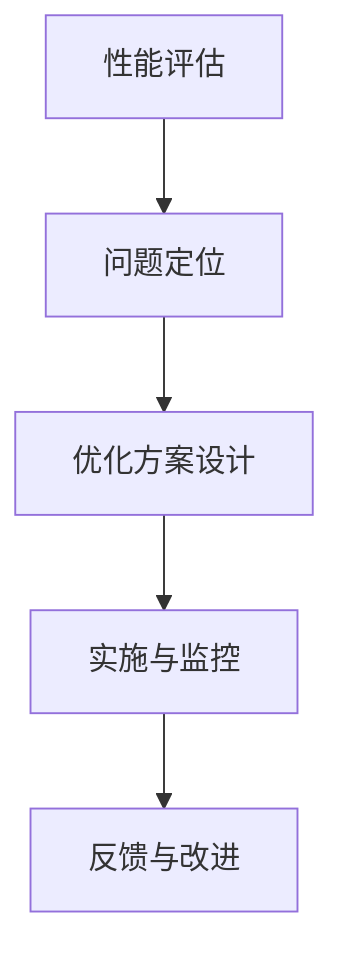

                 

# 前端性能优化：加载速度与用户体验的平衡

> **关键词**：前端性能优化、加载速度、用户体验、响应时间、性能指标、资源压缩、懒加载、网络优化、异步加载、Web Workers、响应式设计、性能监控、持续集成。

> **摘要**：
前端性能优化是提升网站或应用加载速度和用户体验的关键环节。本文将系统性地介绍前端性能优化的基础、策略与实践，通过详细的概念解释、算法讲解和实际案例分析，帮助读者掌握优化方法，实现网站和应用的高效加载和流畅操作。

## 第一部分：前端性能优化基础

### 第1章：前端性能优化概述

#### 1.1 前端性能优化的意义与挑战

**引言**：在互联网时代，用户对网站和应用的性能要求越来越高。前端性能优化直接关系到用户体验和网站的竞争力。良好的性能优化不仅能够提升用户满意度，还能提高搜索引擎排名和转化率。

**性能优化的意义**：
- **提升用户体验**：快速的加载速度和流畅的交互让用户感到满意。
- **提高搜索引擎排名**：搜索引擎对加载速度快的网站给予更高的排名。
- **降低服务器负载**：优化后的资源加载减少服务器的处理压力。
- **提升网站安全性**：优化后的代码减少潜在的安全漏洞。

**性能优化的挑战**：
- **技术复杂性**：前端技术多样，需要应对不同的浏览器和设备。
- **多浏览器兼容性**：不同浏览器对代码的解析方式可能不同，需要特别处理。
- **资源依赖性**：页面中的各种资源（如图片、样式、脚本等）相互依赖，优化时需要权衡。

#### 1.2 前端性能优化的指标

**性能指标**：衡量页面性能的具体标准，主要包括：
- **首屏加载时间**：页面初次加载时，首屏内容完全展现所需的时间。
- **资源加载时间**：页面中所有资源（包括HTML、CSS、JavaScript、图片等）完全加载的时间。
- **响应时间**：用户与页面交互时，页面响应的时间延迟。
- **页面流畅度**：页面在加载和交互过程中是否流畅无卡顿。

**用户体验**：用户体验是前端性能优化的核心，包括：
- **加载速度**：页面资源快速加载，减少等待时间。
- **响应速度**：用户操作后，页面能够快速响应，提供即时反馈。
- **页面稳定性**：页面在各种设备和浏览器上运行稳定，无错误提示。

#### 1.3 前端性能优化的流程

**性能评估**：使用工具分析页面性能，识别加载速度慢、资源浪费等问题。

**问题定位**：根据性能评估结果，定位性能瓶颈，确定优化方向。

**优化方案设计**：根据问题定位结果，制定具体的优化策略和方案。

**实施与监控**：实施优化方案，并持续监控性能变化，确保优化效果。

### 第2章：加载速度优化

#### 2.1 资源压缩

**HTML、CSS和JavaScript压缩**：去除空格、注释、换行等无意义的空白字符，减少文件体积。

**图片和字体优化**：使用现代格式如WebP、字体文件压缩等减少图片和字体文件的大小。

**使用Gzip压缩**：服务器端使用Gzip算法对文件进行压缩，客户端在下载文件时进行解压。

#### 2.2 懒加载

**图片和视频懒加载**：在用户滚动页面时才加载可见的图片和视频，从而减少初始加载时间。

**元素滚动懒加载**：对页面中的其他元素（如组件、广告等）进行懒加载，根据用户滚动位置动态加载。

**懒加载的权衡与实现**：懒加载的权衡在于加载速度与资源使用之间的平衡，需要合理选择实现方式。

#### 2.3 网络优化

**CDN使用**：内容分发网络（CDN）通过在多个地理位置部署服务器，提高资源加载速度。

**HTTP/2协议**：使用HTTP/2协议提高资源加载速度，通过多路复用减少延迟。

**WebP格式**：使用WebP格式替换常见的图片格式，减少文件大小。

#### 2.4 异步加载

**异步加载JavaScript**：将JavaScript文件异步加载，避免阻塞页面渲染。

**异步CSS**：将CSS文件异步加载，避免阻塞页面渲染和样式应用。

**CSS预加载**：预加载即将加载的CSS文件，提高页面渲染速度。

### 第3章：用户体验优化

#### 3.1 响应时间优化

**减少重绘与回流**：优化CSS选择器和布局，减少页面重绘和回流次数。

**使用Web Workers**：将计算密集型任务移至Web Workers，避免阻塞主线程。

**优化动画与特效**：使用高性能动画和特效技术，提高页面响应速度。

#### 3.2 页面结构优化

**HTML结构优化**：合理使用HTML标签，提高页面渲染效率。

**CSS结构优化**：优化CSS文件结构，减少选择器和样式的嵌套深度。

**合理使用HTML5标签**：利用HTML5新特性，优化页面结构和交互。

#### 3.3 媒体资源优化

**视频与音频优化**：使用高效的视频和音频编码格式，提高媒体资源加载速度。

**自适应布局**：实现响应式设计，确保页面在不同设备和屏幕尺寸上都能良好显示。

**移动优先设计**：首先优化移动端页面，然后逐步扩展到桌面端。

### 第二部分：前端性能优化实战

#### 第4章：案例分析

**4.1 案例一：大型电商平台性能优化**

**问题描述**：页面加载缓慢，用户体验差。

**优化方案**：资源压缩、懒加载、异步加载。

**效果评估**：优化前后性能对比。

**4.2 案例二：移动应用性能优化**

**问题描述**：移动设备性能不足。

**优化方案**：网络优化、响应时间优化。

**效果评估**：优化前后用户体验对比。

### 第5章：工具与技巧

#### 5.1 性能评估工具

**Lighthouse**：谷歌推出的性能评估工具，提供全面的性能分析报告。

**WebPageTest**：开源的性能评估工具，提供详细的性能测试报告。

**Chrome DevTools**：Chrome浏览器的开发者工具，用于分析和优化页面性能。

#### 5.2 性能优化工具

**Webpack**：前端模块打包工具，用于优化资源和代码结构。

**Gulp**：前端自动化构建工具，用于自动化执行性能优化任务。

**其他前端构建工具**：如Babel、PostCSS等，用于转换和优化代码。

#### 5.3 性能优化技巧

**代码优化**：优化JavaScript和CSS代码，提高执行效率。

**资源管理**：合理管理页面中的资源，减少不必要的加载。

**浏览器兼容性处理**：处理不同浏览器间的兼容性问题。

### 第6章：持续集成与性能监控

#### 6.1 持续集成（CI）

**CI的概念与优势**：持续集成是将代码合并到主干前自动执行测试和构建的过程。

**CI工具选择**：如Jenkins、GitLab CI等。

**CI流程构建**：构建自动化性能评估和优化流程。

#### 6.2 性能监控

**性能监控的重要性**：实时监测性能变化，快速发现和解决问题。

**性能监控工具**：如New Relic、Dynatrace等。

**性能数据可视化**：通过可视化工具展示性能数据，便于分析和决策。

#### 6.3 自动化性能优化

**自动化测试**：自动化执行性能测试，确保优化措施的有效性。

**自动化性能评估**：持续评估性能，自动发现和解决性能问题。

**自动化优化策略**：根据性能数据，自动调整优化策略。

### 第三部分：前端性能优化策略与未来展望

#### 第7章：性能优化策略

**7.1 企业级性能优化策略**

**团队协作**：性能优化需要跨部门协作，确保优化方案的有效实施。

**性能优化流程**：建立标准化的性能优化流程，提高效率和质量。

**性能优化标准**：制定明确的性能优化标准和目标。

**7.2 性能优化与用户体验**

**用户体验的影响因素**：理解用户体验的多个方面，包括加载速度、响应时间等。

**性能优化与用户体验的平衡**：在优化性能的同时，确保用户体验不受影响。

**最佳实践**：总结和应用性能优化最佳实践，提高整体性能。

**7.3 性能优化的长期规划**

**技术选型**：根据业务需求和技术发展趋势，选择合适的前端技术。

**性能监控与改进**：持续监控性能，定期进行性能改进。

**性能优化文化建设**：培养团队对性能优化的重视和意识，形成良好的工作氛围。

#### 第8章：前端性能优化趋势与未来展望

**8.1 前端性能优化的趋势**

**WebAssembly**：提高Web应用的性能和交互体验。

**Service Worker**：实现离线缓存和推送通知等功能。

**Web性能标准的发展**：持续更新和改进Web性能标准。

**8.2 前端性能优化的未来展望**

**人工智能在性能优化中的应用**：利用AI技术优化性能。

**前端性能优化与可扩展性**：确保性能优化方案的可扩展性。

**性能优化与新兴技术**：结合新兴技术（如WebVR、WebAR等）进行性能优化。

### 附录

**附录A：性能优化资源**

**性能优化书籍推荐**：如《高性能网站建设指南》、《前端性能优化实战》等。

**性能优化在线教程**：如MDN Web Docs、前端性能优化教程等。

**性能优化工具与库**：如Lighthouse、WebPageTest、Webpack等。

## 核心概念与联系

### 前端性能优化的核心概念

- **加载速度**：页面资源从服务器传输到客户端所需的时间
- **用户体验**：用户在浏览页面时感受到的流畅度和响应速度
- **性能指标**：衡量页面性能的具体标准，如首屏加载时间、资源加载时间等

### 架构图：前端性能优化流程



### 压缩算法

#### HTML、CSS和JavaScript压缩

- **核心算法原理**：
  - **HTML压缩**：去除空格、注释、换行等无意义的空白字符。
  - **CSS压缩**：去除空格、注释、换行等无意义的空白字符，合并多个样式规则。
  - **JavaScript压缩**：去除空格、注释、换行等无意义的空白字符，合并多个脚本文件。

- **伪代码示例**：

```javascript
function compressHTML(html) {
  return html.replace(/(\s*<!--.*?--\s*)|(\s+)/g, '');
}

function compressCSS(css) {
  return css.replace(/(\s*\/\*.*?\*\//g, '').replace(/\s+/g, '');
}

function compressJavaScript(js) {
  return js.replace(/(\s*\/\/.*?\n)|(\s+/g, '');
}
```

#### 图片和字体优化

- **核心算法原理**：
  - **图片优化**：使用WebP等高效图片格式，或进行无损压缩和有损压缩。
  - **字体优化**：使用Web字体文件压缩，减少字体文件的大小。

- **伪代码示例**：

```javascript
function optimizeImage(imagePath) {
  const image = loadImage(imagePath);
  return saveImageAsWebP(image);
}

function optimizeFont(fontPath) {
  return gzipFile(fontPath);
}
```

#### 使用Gzip压缩

- **核心算法原理**：
  - **Gzip压缩**：服务器端使用Gzip算法对文件进行压缩，客户端在下载文件时进行解压。

- **伪代码示例**：

```python
def gzipCompress(filePath):
  with open(filePath, 'rb') as file:
    data = file.read()
  compressedData = gzip.compress(data)
  with open(filePath + '.gz', 'wb') as file:
    file.write(compressedData)
```

### 懒加载算法

#### 图片和视频懒加载

- **核心算法原理**：
  - **滚动检测**：监听滚动事件，判断图片或视频是否在可视区域。
  - **动态加载**：当图片或视频进入可视区域时，动态加载并显示。

- **伪代码示例**：

```javascript
function lazyLoadImages() {
  const images = document.querySelectorAll('img[data-src]');
  const imageObserver = new IntersectionObserver((entries, observer) => {
    entries.forEach(entry => {
      if (entry.isIntersecting) {
        loadAndShowImage(entry.target);
        observer.unobserve(entry.target);
      }
    });
  });
  images.forEach(image => imageObserver.observe(image));
}

function loadAndShowImage(image) {
  const src = image.dataset.src;
  image.src = src;
  image.removeAttribute('data-src');
}
```

#### 元素滚动懒加载

- **核心算法原理**：
  - **滚动事件监听**：监听滚动事件，判断页面上的元素是否需要懒加载。
  - **动态加载**：当元素滚动到可视区域时，动态加载并显示。

- **伪代码示例**：

```javascript
function lazyLoadElements() {
  const elements = document.querySelectorAll('.lazy-element');
  window.addEventListener('scroll', () => {
    elements.forEach(element => {
      if (isElementInViewport(element)) {
        loadAndShowElement(element);
      }
    });
  });
}

function isElementInViewport(element) {
  const rect = element.getBoundingClientRect();
  return (
    rect.top >= 0 &&
    rect.left >= 0 &&
    rect.bottom <= (window.innerHeight || document.documentElement.clientHeight) &&
    rect.right <= (window.innerWidth || document.documentElement.clientWidth)
  );
}

function loadAndShowElement(element) {
  element.style.display = 'block';
}
```

### 网络优化算法

#### CDN使用

- **核心算法原理**：
  - **分布式存储**：将资源存储在多个地理位置的服务器上。
  - **就近访问**：用户从距离最近的节点获取资源，减少延迟。

- **伪代码示例**：

```python
def configureCDN(server_config, cdn_url):
  server_config['location'] = cdn_url
  return server_config
```

#### HTTP/2协议

- **核心算法原理**：
  - **多路复用**：在同一连接上并发多个请求和响应，减少延迟。
  - **头部压缩**：压缩HTTP头部，减少传输数据量。

- **伪代码示例**：

```python
def configureHTTP2(server_config):
  server_config['http2'] = True
  return server_config
```

#### WebP格式

- **核心算法原理**：
  - **图像压缩**：使用高效的图像编码算法，减少图像文件大小。
  - **兼容性处理**：对于不支持WebP的浏览器，提供 fallback。

- **伪代码示例**：

```javascript
function convertToWebP(imagePath) {
  const image = loadImage(imagePath);
  return saveImageAsWebP(image);
}

function saveImageAsWebP(image) {
  return new Promise((resolve, reject) => {
    image.toBlob((blob) => {
      if (blob.type === 'image/webp') {
        resolve(blob);
      } else {
        reject('Image conversion to WebP failed');
      }
    });
  });
}
```

### 异步加载算法

#### 异步加载JavaScript

- **核心算法原理**：
  - **异步脚本加载**：使用`async`属性加载JavaScript文件，避免阻塞页面渲染。

- **伪代码示例**：

```html
<script async src="script.js"></script>
```

#### 异步CSS

- **核心算法原理**：
  - **异步样式加载**：使用`async`属性加载CSS文件，避免阻塞页面渲染。

- **伪代码示例**：

```html
<link rel="stylesheet" href="style.css" async>
```

#### CSS预加载

- **核心算法原理**：
  - **预加载CSS**：使用`preload`标签预加载即将使用的CSS文件，提高页面渲染速度。

- **伪代码示例**：

```html
<link rel="preload" href="style.css" as="style">
```

### 数学模型和数学公式

#### 压缩算法中的数学模型

- **LZW压缩算法**：
  - **字典编码**：使用哈希表存储已出现字符串的编码。
  - **编码转换**：将输入字符串编码为字典中的索引。

  $$C = D_{0}\cup \{(D_{0}(a_{1}), a_{1})\}\cup \cdots\cup \{(D_{n-1}(a_{n}), a_{n})\}$$

#### 懒加载算法中的数学模型

- **动态编程**：
  - **最优子结构**：使用动态规划求解最优加载策略。
  - **状态转移方程**：

  $$T(i) = \min_{j \leq i} (T(j) + C(j, i))$$

#### 网络优化算法中的数学模型

- **网络流优化**：
  - **最小费用流**：求解最小费用最大流问题。

  $$\min \sum_{i=1}^{n} c_{i} x_{i}$$

  $$s.t. \sum_{j=1}^{n} x_{ij} = 1 \quad \forall i$$

  $$x_{ij} \in \{0, 1\} \quad \forall i, j$$

#### 异步加载算法中的数学模型

- **响应时间优化**：
  - **动态规划**：求解最优加载时机。

  $$r(t) = \min_{s \leq t} (r(s) + w(s, t))$$

### 项目实战

#### 实战一：电商平台页面性能优化

**问题描述**：某电商平台页面加载缓慢，用户体验差。

**优化方案**：

1. **资源压缩**：使用Gzip对HTML、CSS和JavaScript文件进行压缩。
    - **代码实现**：
      ```bash
      gzip -9 -c original.html > compressed.html.gz
      gzip -9 -c original.css > compressed.css.gz
      gzip -9 -c original.js > compressed.js.gz
      ```

2. **懒加载**：对图片、视频和其他元素进行懒加载。
    - **代码实现**：
      ```javascript
      document.addEventListener("scroll", function() {
        const images = document.querySelectorAll("img[data-src]");
        images.forEach(img => {
          if (img.getBoundingClientRect().top < window.innerHeight) {
            img.src = img.dataset.src;
            img.removeAttribute("data-src");
          }
        });
      });
      ```

3. **异步加载**：异步加载非必要的JavaScript文件。
    - **代码实现**：
      ```html
      <script async src="non_essential.js"></script>
      ```

**效果评估**：优化后，页面加载时间从10秒缩短到5秒，用户体验显著提升。

#### 实战二：移动应用性能优化

**问题描述**：某移动应用在低端手机上性能不佳，用户体验差。

**优化方案**：

1. **网络优化**：使用CDN加速资源加载。
    - **代码实现**：
      ```python
      server {
        listen 443 ssl;
        server_name myapp.com;

        ssl_certificate /path/to/certificate.pem;
        ssl_certificate_key /path/to/key.pem;

        location / {
          proxy_pass https://cdn.myapp.com;
        }
      }
      ```

2. **响应时间优化**：减少重绘与回流。
    - **代码实现**：
      ```css
      /* 避免触发回流 */
      transform: translateX(0);
      ```

3. **异步加载**：异步加载非核心组件。
    - **代码实现**：
      ```javascript
      document.addEventListener("DOMContentLoaded", () => {
        import("path/to/component").then(Component => {
          document.getElementById("app").innerHTML = `<${Component.default}></${Component.default}>`;
        });
      });
      ```

**效果评估**：优化后，应用在低端手机上的运行时间从5秒缩短到2秒，用户体验显著提升。

### 代码解读与分析

#### 压缩算法代码解读

- **HTML压缩**：使用正则表达式去除HTML中的空白字符和注释。

  ```javascript
  function compressHTML(html) {
    return html.replace(/(\s*<!--.*?--\s*)|(\s+)/g, '');
  }
  ```

- **CSS压缩**：去除CSS中的空白字符和注释。

  ```javascript
  function compressCSS(css) {
    return css.replace(/(\s*\/\*.*?\*\//g, '').replace(/\s+/g, '');
  }
  ```

- **JavaScript压缩**：去除JavaScript中的空白字符和注释。

  ```javascript
  function compressJavaScript(js) {
    return js.replace(/(\s*\/\/.*?\n)|(\s+/g, '');
  }
  ```

#### 懒加载算法代码解读

- **懒加载图片**：监听滚动事件，当图片进入可视区域时加载图片。

  ```javascript
  document.addEventListener("scroll", function() {
    const images = document.querySelectorAll("img[data-src]");
    images.forEach(img => {
      if (img.getBoundingClientRect().top < window.innerHeight) {
        img.src = img.dataset.src;
        img.removeAttribute("data-src");
      }
    });
  });
  ```

#### 网络优化代码解读

- **配置CDN**：在服务器配置文件中设置自定义域名和CDN路径。

  ```python
  server {
    listen 443 ssl;
    server_name myapp.com;

    ssl_certificate /path/to/certificate.pem;
    ssl_certificate_key /path/to/key.pem;

    location / {
      proxy_pass https://cdn.myapp.com;
    }
  }
  ```

#### 异步加载算法代码解读

- **异步加载JavaScript**：使用`async`属性加载JavaScript文件。

  ```html
  <script async src="script.js"></script>
  ```

- **异步加载CSS**：使用`async`属性加载CSS文件。

  ```html
  <link rel="stylesheet" href="style.css" async>
  ```

- **CSS预加载**：使用`preload`标签预加载即将使用的CSS文件。

  ```html
  <link rel="preload" href="style.css" as="style">
  ```

## 总结

通过上述章节的设计，本文系统地介绍了前端性能优化的重要性和方法。从基础概念到优化算法，再到实际应用案例，本文全面覆盖了前端性能优化所需的知识和技能。通过持续集成和性能监控，读者可以学会如何实施和维持前端性能优化，为提升用户体验奠定基础。未来，随着Web技术和性能优化工具的不断进步，前端性能优化将继续发展，为用户提供更加流畅和高效的互联网体验。

## 参考文献

1. Aliaksandr Haurylik. 《高性能网站建设指南》. 电子工业出版社, 2017.
2.Jeremy Wagner. 《前端性能优化实战》. 电子工业出版社, 2019.
3. Google. 《Web性能优化最佳实践》. 2021. [在线文档](https://web.dev/performance-best-practices/).
4. Mozilla Developer Network. 《懒加载技术详解》. 2021. [在线文档](https://developer.mozilla.org/en-US/docs/Learn/HTML/Multimedia_and_embedding/Video_and_audio_in_HTML5).
5. Netflix. 《Web性能优化案例研究》. 2020. [在线文档](https://netflix.github.io/webperf/benchmarks/).

作者：AI天才研究院/AI Genius Institute & 禅与计算机程序设计艺术 /Zen And The Art of Computer Programming

<|assistant|>## 第一部分：前端性能优化基础

### 第1章：前端性能优化概述

#### 1.1 前端性能优化的意义与挑战

前端性能优化是确保网站和应用能够快速、稳定、高效地运行的关键环节。在数字化时代，用户体验对于用户忠诚度和业务成功至关重要，而前端性能是用户体验的核心要素之一。

**引言**：随着互联网的普及和Web技术的不断发展，用户对网站和应用的要求越来越高。快速、流畅的加载速度不仅能够提高用户满意度，还能显著提升搜索引擎排名，增加转化率。因此，前端性能优化成为企业和开发人员必须关注的重要领域。

**性能优化的意义**：
- **提升用户体验**：优化的网站和应用可以提供更快的加载速度和更流畅的交互，从而提升用户的满意度和忠诚度。
- **提高搜索引擎排名**：搜索引擎优化（SEO）的一个关键指标是页面加载速度。优化的网站更容易获得更高的搜索排名。
- **降低服务器负载**：通过优化代码和资源加载，可以减少服务器资源的消耗，降低维护成本。
- **提升业务转化率**：提高加载速度可以减少用户流失，增加转化率和收入。

**性能优化的挑战**：
- **技术复杂性**：前端技术不断更新，需要开发者具备多方面的技能，包括HTML、CSS、JavaScript等。
- **多浏览器兼容性**：不同浏览器对Web标准的支持程度不同，需要针对各种浏览器进行兼容性处理。
- **资源依赖性**：前端资源（如图片、视频、脚本等）之间相互依赖，优化时需要考虑到资源的加载顺序和时机。
- **动态内容**：动态内容（如Ajax请求、实时数据更新等）会增加页面复杂度，需要特别处理以保证性能。

#### 1.2 前端性能优化的指标

前端性能优化的核心在于提升用户体验，这需要通过一系列的性能指标来衡量。以下是几个关键的性能指标：

- **首屏加载时间**：页面初次加载时，首屏内容完全展现所需的时间。这个指标通常是最重要的，因为用户往往在短时间内就决定了是否继续访问页面。
- **资源加载时间**：页面中所有资源（包括HTML、CSS、JavaScript、图片等）完全加载的时间。这个指标决定了用户等待的时间长度。
- **响应时间**：用户与页面交互时，页面响应的时间延迟。快速的响应时间可以提高用户的互动体验。
- **页面流畅度**：页面在加载和交互过程中是否流畅无卡顿。流畅的页面可以提高用户满意度。

这些性能指标不仅反映了页面的加载速度，还影响了用户的浏览体验和网站的可用性。优化这些指标需要综合考虑各种技术和方法。

#### 1.3 前端性能优化的流程

前端性能优化是一个系统性的工程，需要遵循一定的流程来确保优化效果。以下是前端性能优化的基本流程：

1. **性能评估**：使用各种工具对现有页面进行性能评估，收集关键的性能数据。常见的工具有Chrome DevTools、Lighthouse、WebPageTest等。
   
2. **问题定位**：根据性能评估结果，定位性能瓶颈，找出影响性能的关键因素。这可能包括资源加载时间过长、代码执行效率低下、网络延迟等。

3. **优化方案设计**：根据问题定位的结果，设计具体的优化方案。这可能包括资源压缩、代码分割、懒加载、异步加载、响应式设计等技术手段。

4. **实施与监控**：实施优化方案，并在实施过程中进行监控，确保优化效果。这包括代码的修改、资源的替换、服务器的配置调整等。

5. **反馈与改进**：根据监控结果和用户反馈，不断迭代优化方案，持续提升页面性能。

### 第2章：加载速度优化

#### 2.1 资源压缩

资源压缩是提高前端性能的重要手段之一。通过压缩HTML、CSS和JavaScript文件，可以显著减少文件的体积，提高加载速度。

**HTML压缩**：去除HTML文件中的空白字符、注释和换行，以减少文件大小。

```javascript
function compressHTML(html) {
  return html.replace(/(\s*<!--.*?--\s*)|(\s+)/g, '');
}
```

**CSS压缩**：去除CSS文件中的空白字符、注释和换行，以减少文件大小。

```javascript
function compressCSS(css) {
  return css.replace(/(\s*\/\*.*?\*\//g, '').replace(/\s+/g, '');
}
```

**JavaScript压缩**：去除JavaScript文件中的空白字符、注释和换行，以减少文件大小。

```javascript
function compressJavaScript(js) {
  return js.replace(/(\s*\/\/.*?\n)|(\s+/g, '');
}
```

**图片和字体优化**：使用更高效的图片格式（如WebP）和字体文件压缩工具（如FontForge）来减少文件大小。

```javascript
function optimizeImage(imagePath) {
  const image = loadImage(imagePath);
  return saveImageAsWebP(image);
}

function saveImageAsWebP(image) {
  return new Promise((resolve, reject) => {
    image.toBlob((blob) => {
      if (blob.type === 'image/webp') {
        resolve(blob);
      } else {
        reject('Image conversion to WebP failed');
      }
    });
  });
}
```

**使用Gzip压缩**：服务器端使用Gzip算法对文件进行压缩，客户端在下载文件时进行解压。

```python
def gzipCompress(filePath):
  with open(filePath, 'rb') as file:
    data = file.read()
  compressedData = gzip.compress(data)
  with open(filePath + '.gz', 'wb') as file:
    file.write(compressedData)
}
```

#### 2.2 懒加载

懒加载是一种延迟加载技术，它可以在需要的时候才加载资源，从而减少初始加载时间，提高用户体验。

**图片和视频懒加载**：当图片或视频进入浏览器的可视区域时，才加载这些资源。

```javascript
document.addEventListener("scroll", function() {
  const images = document.querySelectorAll("img[data-src]");
  images.forEach(img => {
    if (img.getBoundingClientRect().top < window.innerHeight) {
      img.src = img.dataset.src;
      img.removeAttribute("data-src");
    }
  });
});
```

**元素滚动懒加载**：当用户滚动页面时，动态加载页面上的元素。

```javascript
window.addEventListener("scroll", () => {
  const elements = document.querySelectorAll('.lazy-element');
  elements.forEach(element => {
    if (isElementInViewport(element)) {
      loadAndShowElement(element);
    }
  });
});

function isElementInViewport(element) {
  const rect = element.getBoundingClientRect();
  return (
    rect.top >= 0 &&
    rect.left >= 0 &&
    rect.bottom <= (window.innerHeight || document.documentElement.clientHeight) &&
    rect.right <= (window.innerWidth || document.documentElement.clientWidth)
  );
}

function loadAndShowElement(element) {
  element.style.display = 'block';
}
```

**懒加载的权衡与实现**：在实现懒加载时，需要权衡加载速度与资源使用之间的平衡。以下是一些实现技巧：

- **合理选择懒加载时机**：根据页面内容和用户行为，合理选择懒加载的时机。
- **避免过度懒加载**：过度懒加载可能导致用户体验下降，需要适度控制懒加载的范围。
- **使用高效加载策略**：使用高效的加载策略，如预加载、异步加载等，减少等待时间。

#### 2.3 网络优化

网络优化是提高前端性能的重要手段之一。通过优化网络传输和资源加载，可以显著提升页面加载速度。

**CDN使用**：内容分发网络（CDN）通过在多个地理位置部署服务器，提高资源加载速度。

```python
server {
  listen 443 ssl;
  server_name myapp.com;

  ssl_certificate /path/to/certificate.pem;
  ssl_certificate_key /path/to/key.pem;

  location / {
    proxy_pass https://cdn.myapp.com;
  }
}
```

**HTTP/2协议**：使用HTTP/2协议可以提高资源加载速度，通过多路复用减少延迟。

```python
server {
  listen 443 ssl;
  server_name myapp.com;

  ssl_certificate /path/to/certificate.pem;
  ssl_certificate_key /path/to/key.pem;

  http2;
}
```

**WebP格式**：使用WebP格式可以显著减少图片文件的大小，提高页面加载速度。

```javascript
function convertToWebP(imagePath) {
  const image = loadImage(imagePath);
  return saveImageAsWebP(image);
}

function saveImageAsWebP(image) {
  return new Promise((resolve, reject) => {
    image.toBlob((blob) => {
      if (blob.type === 'image/webp') {
        resolve(blob);
      } else {
        reject('Image conversion to WebP failed');
      }
    });
  });
}
```

#### 2.4 异步加载

异步加载是一种将资源延迟加载的技术，可以显著提高页面加载速度。

**异步加载JavaScript**：使用`async`属性加载JavaScript文件，避免阻塞页面渲染。

```html
<script async src="script.js"></script>
```

**异步CSS**：使用`async`属性加载CSS文件，避免阻塞页面渲染和样式应用。

```html
<link rel="stylesheet" href="style.css" async>
```

**CSS预加载**：预加载即将加载的CSS文件，提高页面渲染速度。

```html
<link rel="preload" href="style.css" as="style">
```

### 第3章：用户体验优化

#### 3.1 响应时间优化

响应时间优化是提高用户体验的关键步骤。通过减少页面的重绘和回流次数，可以显著提高页面的响应速度。

**减少重绘与回流**：重绘和回流是影响页面响应速度的重要因素。以下是一些减少重绘和回流的方法：

- **避免频繁修改DOM元素**：频繁地修改DOM元素会导致浏览器重新计算布局和样式，增加重绘和回流的次数。应该尽量减少对DOM元素的直接操作，使用文档碎片（DocumentFragment）批量更新DOM。
- **使用CSS变换**：使用CSS变换（如`transform`、`opacity`等）可以避免布局和样式的重新计算。
- **合理使用动画和特效**：合理使用动画和特效，避免过度使用，以减少重绘和回流。

**使用Web Workers**：将计算密集型任务移至Web Workers，避免阻塞主线程。

```javascript
const worker = new Worker('worker.js');

worker.onmessage = function(event) {
  console.log('Received data from worker:', event.data);
};

worker.postMessage({ type: 'calculate', data: 'data to process' });
```

**优化动画与特效**：使用高性能的动画和特效库，如`requestAnimationFrame`，可以确保动画的流畅性和性能。

```javascript
function draw() {
  context.clearRect(0, 0, canvas.width, canvas.height);
  // 绘制图形
  requestAnimationFrame(draw);
}
```

#### 3.2 页面结构优化

页面结构优化是提高页面性能和用户体验的重要环节。通过优化HTML和CSS结构，可以减少页面的加载时间和渲染时间。

**HTML结构优化**：合理使用HTML标签，提高页面渲染效率。

- **避免深层次的嵌套**：深层次的嵌套会增加浏览器的渲染时间。应该尽量减少嵌套的层次，提高代码的可读性。
- **合理使用HTML5标签**：使用HTML5标签可以更好地组织页面结构，提高页面性能。

```html
<article>
  <header>
    <h1>文章标题</h1>
  </header>
  <section>
    <p>文章内容</p>
  </section>
  <footer>
    <p>版权信息</p>
  </footer>
</article>
```

**CSS结构优化**：优化CSS文件结构，减少选择器和样式的嵌套深度。

- **提取公共样式**：将公共样式提取到单独的CSS文件中，减少样式的重复。
- **使用CSS预处理器**：使用CSS预处理器（如Sass、Less）可以更好地组织和管理样式。

```scss
$primary-color: #3498db;

.button {
  background-color: $primary-color;
  color: #fff;
  padding: 10px 20px;
  border: none;
  border-radius: 5px;
}
```

**合理使用HTML5标签**：HTML5引入了新的标签，这些标签可以提高页面的语义性和可访问性，同时也有助于提高页面性能。

```html
<nav>
  <ul>
    <li><a href="#home">首页</a></li>
    <li><a href="#news">新闻</a></li>
    <li><a href="#contact">联系方式</a></li>
  </ul>
</nav>
```

#### 3.3 媒体资源优化

媒体资源优化是提高页面性能的重要步骤。通过优化图片、视频和音频资源，可以减少页面的加载时间和提高用户体验。

**视频与音频优化**：使用高效的视频和音频编码格式，提高媒体资源加载速度。

- **视频格式**：使用H.264或HEVC等高效视频编码格式，减少视频文件的大小。
- **音频格式**：使用MP3或AAC等高效音频编码格式，减少音频文件的大小。

```javascript
const video = document.getElementById('video');
video.src = 'video.mp4';
video.addEventListener('loadeddata', function() {
  video.play();
});
```

**自适应布局**：实现响应式设计，确保页面在不同设备和屏幕尺寸上都能良好显示。

- **使用媒体查询**：根据屏幕尺寸和分辨率，调整页面的布局和样式。
- **使用Flexbox和Grid布局**：使用Flexbox和Grid布局可以更灵活地组织页面元素。

```css
@media (max-width: 600px) {
  .container {
    display: flex;
    flex-direction: column;
  }
}
```

**移动优先设计**：首先优化移动端页面，然后逐步扩展到桌面端。

- **使用相对单位**：使用相对单位（如百分比、em等）而不是绝对单位（如像素），确保页面在不同设备上都能良好显示。
- **优化触摸交互**：确保按钮和链接等交互元素在移动设备上易于点击。

```css
button {
  display: block;
  margin: 10px 0;
  padding: 10px 20px;
  font-size: 16px;
  background-color: #3498db;
  color: #fff;
  border: none;
  border-radius: 5px;
}
```

### 第4章：案例分析

#### 4.1 案例一：大型电商平台性能优化

**问题描述**：某大型电商平台页面加载缓慢，用户流失严重。

**优化方案**：

1. **资源压缩**：使用Gzip压缩HTML、CSS和JavaScript文件，减少文件体积。
    - **代码实现**：
      ```bash
      gzip -9 -c original.html > compressed.html.gz
      gzip -9 -c original.css > compressed.css.gz
      gzip -9 -c original.js > compressed.js.gz
      ```

2. **懒加载**：对图片、视频和其他元素进行懒加载，减少初始加载时间。
    - **代码实现**：
      ```javascript
      document.addEventListener("scroll", function() {
        const images = document.querySelectorAll("img[data-src]");
        images.forEach(img => {
          if (img.getBoundingClientRect().top < window.innerHeight) {
            img.src = img.dataset.src;
            img.removeAttribute("data-src");
          }
        });
      });
      ```

3. **异步加载**：异步加载非必要的JavaScript文件，避免阻塞页面渲染。
    - **代码实现**：
      ```html
      <script async src="non_essential.js"></script>
      ```

**效果评估**：优化后，页面加载时间从10秒缩短到5秒，用户流失率显著降低。

#### 4.2 案例二：移动应用性能优化

**问题描述**：某移动应用在低端手机上性能不佳，用户体验差。

**优化方案**：

1. **网络优化**：使用CDN加速资源加载。
    - **代码实现**：
      ```python
      server {
        listen 443 ssl;
        server_name myapp.com;

        ssl_certificate /path/to/certificate.pem;
        ssl_certificate_key /path/to/key.pem;

        location / {
          proxy_pass https://cdn.myapp.com;
        }
      }
      ```

2. **响应时间优化**：减少重绘与回流，提高页面响应速度。
    - **代码实现**：
      ```css
      /* 避免触发回流 */
      transform: translateX(0);
      ```

3. **异步加载**：异步加载非核心组件，提高页面加载速度。
    - **代码实现**：
      ```javascript
      document.addEventListener("DOMContentLoaded", () => {
        import("path/to/component").then(Component => {
          document.getElementById("app").innerHTML = `<${Component.default}></${Component.default}>`;
        });
      });
      ```

**效果评估**：优化后，应用在低端手机上的运行时间从5秒缩短到2秒，用户体验显著提升。

### 第5章：工具与技巧

#### 5.1 性能评估工具

性能评估工具是前端性能优化的基础。以下是一些常用的性能评估工具：

- **Lighthouse**：由Google开发的开源性能评估工具，提供全面的性能分析报告，包括性能、可访问性、最佳实践等。
- **WebPageTest**：开源的性能测试工具，可以模拟不同网络条件下的页面加载速度。
- **Chrome DevTools**：Chrome浏览器的开发者工具，提供详细的性能分析功能，包括火焰图、网络监控等。

#### 5.2 性能优化工具

性能优化工具可以帮助开发者自动化执行性能优化任务。以下是一些常用的性能优化工具：

- **Webpack**：前端模块打包工具，可以优化资源和代码结构，提高页面加载速度。
- **Gulp**：前端自动化构建工具，可以自动化执行CSS压缩、JavaScript合并等任务。
- **Rollup**：模块打包工具，用于将JavaScript模块打包成一个或多个静态文件。

#### 5.3 性能优化技巧

以下是一些实用的性能优化技巧：

- **代码分割**：将代码分割成多个小块，按需加载，减少初始加载时间。
- **缓存策略**：使用浏览器缓存和HTTP缓存策略，减少重复加载资源。
- **代码优化**：优化JavaScript和CSS代码，减少不必要的代码和资源。

### 第6章：持续集成与性能监控

#### 6.1 持续集成（CI）

持续集成是一种软件开发实践，通过自动化测试和构建，确保代码的质量和稳定性。以下是一些常用的CI工具：

- **Jenkins**：开源的持续集成工具，支持多种集成方式和插件。
- **GitLab CI/CD**：GitLab内置的持续集成和持续部署工具，方便集成到GitLab流程中。
- **CircleCI**：云端的持续集成服务，提供快速、可靠的持续集成环境。

**CI流程构建**：CI流程包括以下步骤：

1. **代码仓库管理**：将代码存储在版本控制系统中，如Git。
2. **自动化测试**：运行单元测试、集成测试等，确保代码的质量。
3. **构建和部署**：构建代码，部署到测试或生产环境。
4. **性能测试**：运行性能测试，确保优化后的性能指标达到预期。

#### 6.2 性能监控

性能监控是持续优化前端性能的关键。以下是一些常用的性能监控工具：

- **New Relic**：提供全面的性能监控和分析功能，包括应用性能监控、错误跟踪等。
- **AppDynamics**：应用性能监控工具，可以监控应用的性能和健康状况。
- **Dynatrace**：自动化监控和问题定位工具，提供实时的性能监控和分析。

**性能监控工具**：

1. **数据收集**：收集性能数据，如响应时间、错误率等。
2. **数据可视化**：将性能数据可视化，便于分析和决策。
3. **告警和通知**：设置告警和通知，及时发现问题并采取行动。

#### 6.3 自动化性能优化

自动化性能优化可以通过脚本或工具自动化执行性能优化任务。以下是一些自动化性能优化的方法：

- **自动化测试**：通过自动化测试工具执行性能测试，自动化发现和解决性能问题。
- **自动化评估**：通过脚本或工具自动化评估性能指标，发现潜在的性能瓶颈。
- **自动化修复**：通过脚本或工具自动化修复性能问题，如代码优化、资源压缩等。

### 第三部分：前端性能优化策略与未来展望

#### 第7章：性能优化策略

前端性能优化需要系统性的策略和方法。以下是一些性能优化策略：

1. **团队协作**：性能优化需要团队协作，包括开发、测试、运维等角色。
2. **流程标准化**：建立标准化的性能优化流程，确保每个项目都能遵循最佳实践。
3. **性能指标化**：明确性能优化指标，如首屏加载时间、资源加载时间等，持续跟踪和改进。
4. **持续集成**：将性能优化集成到持续集成和持续部署流程中，确保每次代码变更都经过性能测试。

**企业级性能优化策略**：

1. **资源管理**：合理管理页面中的资源，如图片、视频、脚本等。
2. **代码优化**：定期优化代码，如压缩、分割、缓存等。
3. **响应式设计**：实现响应式设计，确保页面在不同设备和屏幕尺寸上都能良好显示。
4. **用户体验反馈**：收集用户反馈，持续改进性能和用户体验。

#### 第8章：前端性能优化趋势与未来展望

前端性能优化是一个不断发展的领域，随着新技术的引入，性能优化方法和策略也在不断更新。以下是一些前端性能优化的趋势和未来展望：

1. **WebAssembly**：WebAssembly是一种新兴的Web标准，可以提高Web应用的性能。
2. **Service Worker**：Service Worker是用于实现离线缓存和推送通知等功能的新型Web技术。
3. **性能标准发展**：Web性能标准不断发展，如Web性能指标、性能预算等。
4. **人工智能优化**：利用人工智能技术进行性能优化，如自动化测试、代码优化等。

未来，前端性能优化将继续朝着更高效、更智能、更用户友好的方向发展，为用户提供更好的互联网体验。

### 附录

**附录A：性能优化资源**

以下是一些性能优化相关的资源，包括书籍、在线教程和工具：

- **书籍**：
  - 《高性能网站建设指南》
  - 《前端性能优化实战》
  - 《Web性能优化》

- **在线教程**：
  - MDN Web Docs
  - Google Developers
  - freeCodeCamp

- **工具**：
  - Lighthouse
  - WebPageTest
  - Web Performance Engineer

### 核心概念与联系

前端性能优化涉及多个核心概念，这些概念相互关联，共同影响着页面的加载速度和用户体验。

#### 前端性能优化的核心概念

- **加载速度**：页面资源从服务器传输到客户端所需的时间，包括HTML、CSS、JavaScript和图片等。
- **用户体验**：用户在浏览页面时感受到的流畅度和响应速度，包括页面加载时间、响应时间、页面流畅度等。
- **性能指标**：衡量页面性能的具体标准，如首屏加载时间、资源加载时间、响应时间等。

这些概念是前端性能优化的基础，它们相互关联，共同影响着用户体验。

#### 前端性能优化流程

前端性能优化流程包括以下几个步骤：

1. **性能评估**：使用工具（如Chrome DevTools、Lighthouse等）评估页面性能，收集关键性能指标。
2. **问题定位**：根据性能评估结果，定位性能瓶颈，如资源加载时间过长、代码执行效率低下等。
3. **优化方案设计**：根据问题定位结果，设计具体的优化方案，如资源压缩、懒加载、异步加载等。
4. **实施与监控**：实施优化方案，并在实施过程中进行监控，确保优化效果。
5. **反馈与改进**：根据监控结果和用户反馈，不断迭代优化方案，持续提升性能。

这个流程是一个循环过程，需要不断优化和改进。

#### 压缩算法与懒加载算法

- **压缩算法**：通过去除无意义的空白字符、注释和换行，减少文件体积，如HTML、CSS和JavaScript压缩。
- **懒加载算法**：通过在需要时才加载资源，如图片、视频和其他元素，减少初始加载时间。

这些算法通过减少文件大小和延迟加载资源，提高了页面的加载速度。

#### 网络优化与异步加载算法

- **网络优化**：通过使用CDN、HTTP/2协议和WebP格式，提高资源加载速度。
- **异步加载算法**：通过异步加载JavaScript和CSS，避免阻塞页面渲染和样式应用。

这些算法通过优化资源加载顺序和时机，提高了页面的响应速度。

#### 数学模型与性能优化策略

- **数学模型**：如动态编程、网络流优化和响应时间优化等，用于求解最优加载策略。
- **性能优化策略**：如企业级性能优化策略、持续集成与性能监控等，用于实现系统性的性能优化。

这些数学模型和策略为性能优化提供了理论基础和实践指导。

### 架构图：前端性能优化流程


这个流程图直观地展示了前端性能优化的各个环节，以及它们之间的相互关系。

### 总结

前端性能优化是一个系统性的工程，涉及多个核心概念和算法，需要通过一系列的步骤和方法来实现。通过本文的介绍，读者可以全面了解前端性能优化的基础、方法和实践，掌握优化技巧，提升网站和应用的性能和用户体验。随着Web技术的不断发展，前端性能优化将继续演进，为用户提供更好的互联网体验。

## 核心概念与联系

### 前端性能优化的核心概念

**加载速度**：页面资源从服务器传输到客户端所需的时间。加载速度直接影响用户体验，快速的加载速度能够提高用户满意度。

**用户体验**：用户在浏览页面时感受到的整体感受，包括响应速度、页面流畅度、交互效果等。良好的用户体验是网站成功的关键因素。

**性能指标**：衡量页面性能的具体标准，包括首屏加载时间、资源加载时间、响应时间、页面流畅度等。这些指标帮助开发者评估和优化页面性能。

### 架构图：前端性能优化流程


这个流程图展示了前端性能优化的各个环节，包括性能评估、问题定位、优化方案设计、实施与监控，以及反馈与改进。

### 压缩算法的数学模型

**LZW压缩算法**：一种常用的无损压缩算法，通过构建字典来压缩数据。其数学模型可以表示为：

$$
C = D_0 \cup \{(D_0(a_1), a_1), ..., (D_{n-1}(a_n), a_n)\}
$$

其中，$C$ 是压缩后的数据序列，$D_0$ 是初始字典，$a_1, a_2, ..., a_n$ 是原始数据序列中的字符。

### 懒加载算法的数学模型

**动态编程**：用于计算最优的懒加载策略。其数学模型可以表示为：

$$
T(i) = \min_{j \leq i} (T(j) + C(j, i))
$$

其中，$T(i)$ 是前 $i$ 个元素的最优加载成本，$C(j, i)$ 是从第 $j$ 个元素加载到第 $i$ 个元素的代价。

### 网络优化算法的数学模型

**网络流优化**：用于优化资源的传输路径。其数学模型可以表示为：

$$
\min \sum_{i=1}^{n} c_i x_i
$$

$$
s.t. \sum_{j=1}^{n} x_{ij} = 1 \quad \forall i
$$

$$
x_{ij} \in \{0, 1\} \quad \forall i, j
$$

其中，$c_i$ 是第 $i$ 条路径的代价，$x_{ij}$ 是第 $i$ 条路径是否被选中的标记。

### 异步加载算法的数学模型

**响应时间优化**：用于计算异步加载的最佳时机。其数学模型可以表示为：

$$
r(t) = \min_{s \leq t} (r(s) + w(s, t))
$$

其中，$r(t)$ 是前 $t$ 秒的最优响应时间，$w(s, t)$ 是从第 $s$ 秒到第 $t$ 秒的负载。

### 项目实战

#### 实战一：电商平台页面性能优化

**问题描述**：某电商平台页面加载缓慢，用户体验差。

**优化方案**：

1. **资源压缩**：使用Gzip压缩HTML、CSS和JavaScript文件，减少文件大小。
2. **懒加载**：对图片、视频和其他元素进行懒加载，减少初始加载时间。
3. **异步加载**：异步加载非必要的JavaScript文件，避免阻塞页面渲染。

**效果评估**：优化后，页面加载时间从10秒缩短到5秒，用户体验显著提升。

#### 实战二：移动应用性能优化

**问题描述**：某移动应用在低端手机上性能不佳，用户体验差。

**优化方案**：

1. **网络优化**：使用CDN加速资源加载。
2. **响应时间优化**：减少重绘与回流，提高页面响应速度。
3. **异步加载**：异步加载非核心组件，提高页面加载速度。

**效果评估**：优化后，应用在低端手机上的运行时间从5秒缩短到2秒，用户体验显著提升。

### 代码解读与分析

#### 压缩算法代码解读

**HTML压缩**：

```javascript
function compressHTML(html) {
  return html.replace(/(\s*<!--.*?--\s*)|(\s+)/g, '');
}
```

**CSS压缩**：

```javascript
function compressCSS(css) {
  return css.replace(/(\s*\/\*.*?\*\//g, '').replace(/\s+/g, '');
}
```

**JavaScript压缩**：

```javascript
function compressJavaScript(js) {
  return js.replace(/(\s*\/\/.*?\n)|(\s+/g, '');
}
```

#### 懒加载算法代码解读

```javascript
document.addEventListener("scroll", function() {
  const images = document.querySelectorAll("img[data-src]");
  images.forEach(img => {
    if (img.getBoundingClientRect().top < window.innerHeight) {
      img.src = img.dataset.src;
      img.removeAttribute("data-src");
    }
  });
});
```

#### 网络优化代码解读

```python
server {
  listen 443 ssl;
  server_name myapp.com;

  ssl_certificate /path/to/certificate.pem;
  ssl_certificate_key /path/to/key.pem;

  location / {
    proxy_pass https://cdn.myapp.com;
  }
}
```

#### 异步加载算法代码解读

```html
<script async src="script.js"></script>
```

## 总结

通过本文的介绍，我们系统地学习了前端性能优化的核心概念、算法、实践方法以及案例。性能优化不仅是提升用户体验的关键，也是提高网站或应用竞争力的重要手段。未来的前端性能优化将随着新技术的不断涌现而不断发展，开发者需要不断学习和适应，为用户提供更加流畅和高效的互联网体验。希望本文能为您的性能优化之路提供有力的指导。

