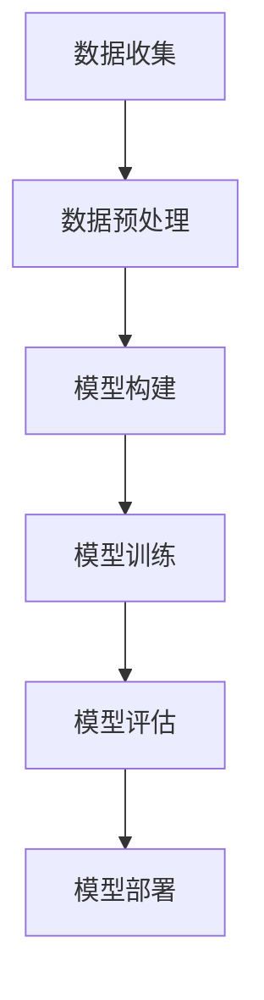
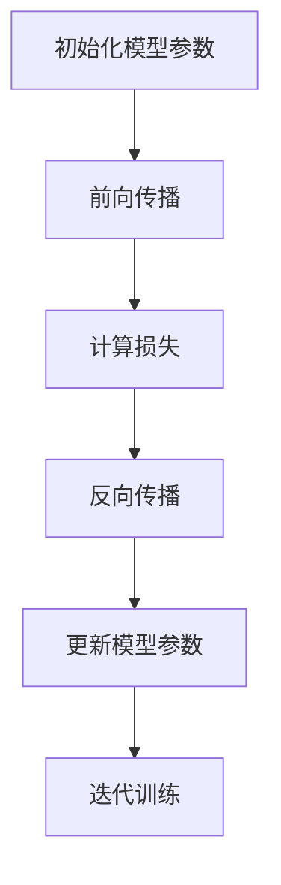

                 

### 商业模式概述与框架

在当今快速发展的科技时代，商业模式成为企业竞争的核心要素。对于大模型创业而言，构建一个有效的商业模式至关重要。本章将首先定义商业模式，探讨其在企业中的重要性，并分析大模型创业的独特优势。接着，我们将概述大模型创业的背景、面临的挑战以及未来发展趋势。

#### 1.1 商业模式的定义与重要性

**1.1.1 商业模式的定义**

商业模式（Business Model）是指企业在特定市场环境中，通过产品或服务为客户提供价值，并从中获取收益的系统性策略。它包括企业如何创造价值、传递价值和捕获价值的过程。商业模式不仅涵盖了企业的业务逻辑，还包括资源配置、收益分配、风险管理等关键要素。

**1.1.2 商业模式的重要性**

商业模式的定义决定了它在企业中的重要性。以下是几个关键点：

- **指导企业战略方向**：商业模式明确了企业的核心竞争力、目标市场和盈利方式，为企业制定长远战略提供了依据。
- **提高企业竞争力**：有效的商业模式可以帮助企业在竞争激烈的市场中脱颖而出，通过创新和差异化策略建立竞争优势。
- **优化资源配置**：商业模式指导企业在有限的资源下进行有效配置，提高资源利用效率，降低运营成本。
- **实现持续盈利**：商业模式决定了企业的盈利模式，是确保企业持续盈利的基础。

**1.1.3 大模型在商业模式中的作用**

大模型作为人工智能的核心技术之一，正逐渐成为商业模式的创新驱动力。以下是几个关键作用：

- **提升产品与服务质量**：大模型的应用可以显著提高产品或服务的智能化水平，增强用户体验，提升满意度。
- **创造新的业务机会**：大模型可以用于开发新的产品、服务和业务模式，为企业拓展市场空间提供新思路。
- **优化运营效率**：大模型在数据分析、预测、优化等领域具有显著优势，可以帮助企业优化业务流程，提高运营效率。
- **构建核心竞争力**：拥有强大技术实力的企业可以通过大模型构建独特的核心竞争力，提高市场地位和竞争力。

#### 1.2 大模型创业的背景与挑战

**1.2.1 大模型创业的背景**

近年来，人工智能技术的快速发展为大模型创业提供了坚实的技术基础。大模型（如GPT、BERT等）在自然语言处理、计算机视觉、推荐系统等领域取得了突破性进展，成为企业数字化转型的重要工具。以下是大模型创业的几个驱动因素：

- **技术进步**：随着计算能力和算法的不断提升，大模型的训练和部署成本逐渐降低，使得更多创业者能够参与到该领域。
- **市场需求**：企业对智能化、自动化解决方案的需求日益增长，大模型在这些领域中的应用潜力巨大。
- **政策支持**：各国政府纷纷出台政策，鼓励科技创新和创业活动，为大模型创业提供了良好的发展环境。

**1.2.2 大模型创业面临的挑战**

尽管大模型创业前景广阔，但也面临着一系列挑战：

- **技术瓶颈**：大模型的训练和优化仍然存在技术难题，如计算资源消耗、数据隐私保护等。
- **市场竞争**：随着大模型创业的兴起，市场竞争日益激烈，如何脱颖而出成为一大挑战。
- **数据资源**：大模型需要大量高质量的数据进行训练，获取和清洗数据成为创业过程中的难点。
- **人才缺乏**：具备大模型开发和应用能力的人才相对稀缺，企业面临人才招聘和培养的挑战。

**1.2.3 大模型创业的发展趋势**

尽管面临挑战，大模型创业仍具有巨大的发展潜力。以下是大模型创业的几个发展趋势：

- **技术持续创新**：随着算法和硬件的进步，大模型的性能将不断提高，应用范围将进一步扩大。
- **跨界融合**：大模型将与其他领域（如医疗、金融、教育等）进行深度融合，推动产业变革。
- **生态建设**：大模型创业将推动形成生态系统，包括技术供应商、解决方案提供商、客户等各方共同参与。
- **商业模式创新**：随着大模型应用的深入，新的商业模式将不断涌现，为企业带来更多盈利机会。

#### 1.3 大模型创业的关键成功因素

大模型创业的成功离不开以下几个关键因素：

**1.3.1 技术创新**

技术创新是大模型创业的核心驱动力。企业需要不断探索新的算法、架构和优化方法，提高大模型的性能和效率。以下是几个关键方面：

- **算法创新**：研究新的深度学习算法，提高模型的可解释性和鲁棒性。
- **架构优化**：设计高效的大模型架构，降低计算资源消耗，提高模型部署的灵活性。
- **工具与平台**：开发用于大模型训练、优化和部署的工具与平台，提高开发效率。

**1.3.2 数据资源**

数据资源是大模型训练的基础。企业需要建立完善的数据采集、清洗和管理机制，确保数据的质量和可用性。以下是几个关键方面：

- **数据获取**：通过开放数据集、数据采购和合作等方式，获取高质量的数据资源。
- **数据清洗**：对原始数据进行清洗和预处理，去除噪声和异常值，提高数据质量。
- **数据管理**：建立数据仓库和数据管理平台，实现数据的高效存储、管理和共享。

**1.3.3 团队协作**

团队协作是大模型创业的重要保障。企业需要建立高效的团队协作机制，充分发挥团队成员的专业能力和创造力。以下是几个关键方面：

- **人才引进**：招聘具备大模型开发和应用能力的人才，构建专业的技术团队。
- **知识共享**：鼓励团队成员之间的知识共享和经验交流，提高整体技术水平。
- **项目管理**：采用科学的项目管理方法，确保项目进度和质量。

**1.3.4 市场定位**

市场定位是企业成功的关键。企业需要明确目标市场和客户群体，制定有针对性的市场策略。以下是几个关键方面：

- **市场调研**：了解市场需求和竞争状况，明确目标市场和客户需求。
- **产品定位**：根据市场需求和客户特点，确定产品的功能、性能和定位。
- **市场推广**：采用有效的市场推广手段，提高产品的市场知名度和认可度。

**1.3.5 运营策略**

运营策略是企业持续发展的重要保障。企业需要制定科学的运营策略，确保业务的稳定和持续增长。以下是几个关键方面：

- **成本控制**：通过优化业务流程、提高资源利用效率等方式，降低运营成本。
- **风险管理**：建立风险管理体系，及时发现和处理潜在风险，保障业务稳定。
- **持续优化**：根据市场反馈和业务发展，持续优化产品和服务，提高客户满意度。

**1.3.6 成本控制**

成本控制是企业盈利的关键。企业需要通过精细化管理，降低运营成本，提高盈利能力。以下是几个关键方面：

- **成本分析**：定期进行成本分析，识别成本高企的原因，制定针对性的成本控制措施。
- **流程优化**：优化业务流程，减少不必要的环节和资源消耗，提高效率。
- **供应链管理**：通过与供应商建立合作关系，优化供应链管理，降低采购成本。

**1.3.7 风险管理**

风险管理是企业发展的必要保障。企业需要建立完善的风险管理体系，防范和应对各种风险。以下是几个关键方面：

- **风险识别**：定期进行风险识别和评估，明确企业面临的主要风险。
- **风险应对**：制定相应的风险应对策略，降低风险对企业的影响。
- **风险监控**：建立风险监控体系，及时发现和处理风险。

**1.3.8 商业模式的创新**

商业模式的创新是企业持续发展的动力。企业需要不断探索新的商业模式，实现业务模式的转型和升级。以下是几个关键方面：

- **模式创新**：研究新的商业模式，如平台化运营、跨界合作等，实现业务模式的创新。
- **盈利模式**：探索新的盈利模式，如知识付费、服务订阅等，提高企业的盈利能力。
- **商业模式优化**：根据市场变化和企业发展，不断优化商业模式，提高市场竞争力。

**1.3.9 持续迭代与优化**

持续迭代与优化是企业保持竞争优势的关键。企业需要不断改进产品和服务，提高客户满意度，实现业务的持续增长。以下是几个关键方面：

- **用户反馈**：积极收集用户反馈，了解用户需求和满意度，优化产品和服务。
- **数据分析**：运用数据分析方法，挖掘用户行为和需求，指导产品优化。
- **持续迭代**：根据市场反馈和数据分析结果，持续迭代产品和服务，提高市场竞争力。

### 总结

本章从商业模式概述、大模型创业背景与挑战、关键成功因素等多个方面，对大模型创业的商业模式进行了全面的分析。下一章将深入探讨大模型的技术基础，包括原理、架构和关键技术，帮助读者更好地理解大模型创业的核心技术。

#### 1.1 商业模式的定义与重要性

**1.1.1 商业模式的定义**

商业模式（Business Model）是企业在特定市场环境中，通过产品或服务为客户提供价值，并从中获取收益的系统性策略。它不仅涵盖了企业的业务逻辑，还包括资源配置、收益分配、风险管理等关键要素。

**1.1.2 商业模式的重要性**

商业模式的定义决定了它在企业中的重要性。以下是几个关键点：

- **指导企业战略方向**：商业模式明确了企业的核心竞争力、目标市场和盈利方式，为企业制定长远战略提供了依据。
- **提高企业竞争力**：有效的商业模式可以帮助企业在竞争激烈的市场中脱颖而出，通过创新和差异化策略建立竞争优势。
- **优化资源配置**：商业模式指导企业在有限的资源下进行有效配置，提高资源利用效率，降低运营成本。
- **实现持续盈利**：商业模式决定了企业的盈利模式，是确保企业持续盈利的基础。

**1.1.3 大模型在商业模式中的作用**

大模型作为人工智能的核心技术之一，正在成为商业模式的创新驱动力。以下是几个关键作用：

- **提升产品与服务质量**：大模型的应用可以显著提高产品或服务的智能化水平，增强用户体验，提升满意度。
- **创造新的业务机会**：大模型可以用于开发新的产品、服务和业务模式，为企业拓展市场空间提供新思路。
- **优化运营效率**：大模型在数据分析、预测、优化等领域具有显著优势，可以帮助企业优化业务流程，提高运营效率。
- **构建核心竞争力**：拥有强大技术实力的企业可以通过大模型构建独特的核心竞争力，提高市场地位和竞争力。

#### 1.2 大模型创业的背景与挑战

**1.2.1 大模型创业的背景**

近年来，人工智能技术的快速发展为大模型创业提供了坚实的技术基础。大模型（如GPT、BERT等）在自然语言处理、计算机视觉、推荐系统等领域取得了突破性进展，成为企业数字化转型的重要工具。以下是大模型创业的几个驱动因素：

- **技术进步**：随着计算能力和算法的不断提升，大模型的训练和部署成本逐渐降低，使得更多创业者能够参与到该领域。
- **市场需求**：企业对智能化、自动化解决方案的需求日益增长，大模型在这些领域中的应用潜力巨大。
- **政策支持**：各国政府纷纷出台政策，鼓励科技创新和创业活动，为大模型创业提供了良好的发展环境。

**1.2.2 大模型创业面临的挑战**

尽管大模型创业前景广阔，但也面临着一系列挑战：

- **技术瓶颈**：大模型的训练和优化仍然存在技术难题，如计算资源消耗、数据隐私保护等。
- **市场竞争**：随着大模型创业的兴起，市场竞争日益激烈，如何脱颖而出成为一大挑战。
- **数据资源**：大模型需要大量高质量的数据进行训练，获取和清洗数据成为创业过程中的难点。
- **人才缺乏**：具备大模型开发和应用能力的人才相对稀缺，企业面临人才招聘和培养的挑战。

**1.2.3 大模型创业的发展趋势**

尽管面临挑战，大模型创业仍具有巨大的发展潜力。以下是大模型创业的几个发展趋势：

- **技术持续创新**：随着算法和硬件的进步，大模型的性能将不断提高，应用范围将进一步扩大。
- **跨界融合**：大模型将与其他领域（如医疗、金融、教育等）进行深度融合，推动产业变革。
- **生态建设**：大模型创业将推动形成生态系统，包括技术供应商、解决方案提供商、客户等各方共同参与。
- **商业模式创新**：随着大模型应用的深入，新的商业模式将不断涌现，为企业带来更多盈利机会。

#### 1.3 大模型创业的关键成功因素

大模型创业的成功离不开以下几个关键因素：

**1.3.1 技术创新**

技术创新是大模型创业的核心驱动力。企业需要不断探索新的算法、架构和优化方法，提高大模型的性能和效率。以下是几个关键方面：

- **算法创新**：研究新的深度学习算法，提高模型的可解释性和鲁棒性。
- **架构优化**：设计高效的大模型架构，降低计算资源消耗，提高模型部署的灵活性。
- **工具与平台**：开发用于大模型训练、优化和部署的工具与平台，提高开发效率。

**1.3.2 数据资源**

数据资源是大模型训练的基础。企业需要建立完善的数据采集、清洗和管理机制，确保数据的质量和可用性。以下是几个关键方面：

- **数据获取**：通过开放数据集、数据采购和合作等方式，获取高质量的数据资源。
- **数据清洗**：对原始数据进行清洗和预处理，去除噪声和异常值，提高数据质量。
- **数据管理**：建立数据仓库和数据管理平台，实现数据的高效存储、管理和共享。

**1.3.3 团队协作**

团队协作是大模型创业的重要保障。企业需要建立高效的团队协作机制，充分发挥团队成员的专业能力和创造力。以下是几个关键方面：

- **人才引进**：招聘具备大模型开发和应用能力的人才，构建专业的技术团队。
- **知识共享**：鼓励团队成员之间的知识共享和经验交流，提高整体技术水平。
- **项目管理**：采用科学的项目管理方法，确保项目进度和质量。

**1.3.4 市场定位**

市场定位是企业成功的关键。企业需要明确目标市场和客户群体，制定有针对性的市场策略。以下是几个关键方面：

- **市场调研**：了解市场需求和竞争状况，明确目标市场和客户需求。
- **产品定位**：根据市场需求和客户特点，确定产品的功能、性能和定位。
- **市场推广**：采用有效的市场推广手段，提高产品的市场知名度和认可度。

**1.3.5 运营策略**

运营策略是企业持续发展的重要保障。企业需要制定科学的运营策略，确保业务的稳定和持续增长。以下是几个关键方面：

- **成本控制**：通过优化业务流程、提高资源利用效率等方式，降低运营成本。
- **风险管理**：建立风险管理体系，及时发现和处理潜在风险，保障业务稳定。
- **持续优化**：根据市场反馈和业务发展，持续优化产品和服务，提高客户满意度。

**1.3.6 成本控制**

成本控制是企业盈利的关键。企业需要通过精细化管理，降低运营成本，提高盈利能力。以下是几个关键方面：

- **成本分析**：定期进行成本分析，识别成本高企的原因，制定针对性的成本控制措施。
- **流程优化**：优化业务流程，减少不必要的环节和资源消耗，提高效率。
- **供应链管理**：通过与供应商建立合作关系，优化供应链管理，降低采购成本。

**1.3.7 风险管理**

风险管理是企业发展的必要保障。企业需要建立完善的风险管理体系，防范和应对各种风险。以下是几个关键方面：

- **风险识别**：定期进行风险识别和评估，明确企业面临的主要风险。
- **风险应对**：制定相应的风险应对策略，降低风险对企业的影响。
- **风险监控**：建立风险监控体系，及时发现和处理风险。

**1.3.8 商业模式的创新**

商业模式的创新是企业持续发展的动力。企业需要不断探索新的商业模式，实现业务模式的转型和升级。以下是几个关键方面：

- **模式创新**：研究新的商业模式，如平台化运营、跨界合作等，实现业务模式的创新。
- **盈利模式**：探索新的盈利模式，如知识付费、服务订阅等，提高企业的盈利能力。
- **商业模式优化**：根据市场变化和企业发展，不断优化商业模式，提高市场竞争力。

**1.3.9 持续迭代与优化**

持续迭代与优化是企业保持竞争优势的关键。企业需要不断改进产品和服务，提高客户满意度，实现业务的持续增长。以下是几个关键方面：

- **用户反馈**：积极收集用户反馈，了解用户需求和满意度，优化产品和服务。
- **数据分析**：运用数据分析方法，挖掘用户行为和需求，指导产品优化。
- **持续迭代**：根据市场反馈和数据分析结果，持续迭代产品和服务，提高市场竞争力。

### 总结

本章从商业模式概述、大模型创业背景与挑战、关键成功因素等多个方面，对大模型创业的商业模式进行了全面的分析。下一章将深入探讨大模型的技术基础，包括原理、架构和关键技术，帮助读者更好地理解大模型创业的核心技术。

#### 2.1 大模型的原理与架构

大模型（也称为大规模模型或巨量级模型）是人工智能领域的一个重要概念，它指的是那些具有极大量参数的深度学习模型。这些模型在处理复杂任务时表现出色，例如自然语言处理、计算机视觉和推荐系统。本节将介绍大模型的原理、基本架构及其关键组成部分。

##### 2.1.1 大模型的原理

大模型的原理可以概括为以下几点：

1. **深度神经网络（Deep Neural Network，DNN）**：大模型通常是基于深度神经网络（DNN）的架构，它由多个隐藏层组成，每层都包含大量的神经元。通过逐层传递输入数据，模型能够提取出数据中的高阶特征。

2. **参数规模（Parameter Size）**：大模型的一个重要特点是其参数规模巨大。这些参数包括权重（weights）和偏置（biases），它们需要通过大量的训练数据来学习得到。

3. **并行计算（Parallel Computing）**：由于参数规模巨大，训练大模型需要大量的计算资源。并行计算技术被广泛应用于大模型的训练过程中，以减少训练时间。

4. **大规模数据集（Large-scale Data Sets）**：大模型通常需要大量的数据集进行训练，这些数据集可以是公开的数据集，也可以是自行收集和标注的数据集。

5. **优化算法（Optimization Algorithms）**：大模型的训练过程通常采用优化算法，如随机梯度下降（Stochastic Gradient Descent，SGD）及其变种，如Adam、Adadelta等。这些算法能够有效调整模型的参数，以最小化损失函数。

##### 2.1.2 大模型的基本架构

大模型的基本架构通常包括以下几个部分：

1. **输入层（Input Layer）**：输入层接收外部输入数据，如文本、图像或声音等。这些数据经过预处理后，转换为模型可以接受的格式。

2. **隐藏层（Hidden Layers）**：隐藏层是模型的中间层，包含多个隐藏层。每一层都能提取更高层次的特征，隐藏层中的神经元通过前一层神经元的输出进行计算。

3. **输出层（Output Layer）**：输出层生成模型的预测结果。对于分类任务，输出层通常包含多个神经元，每个神经元对应一个类别；对于回归任务，输出层通常只有一个神经元。

4. **激活函数（Activation Functions）**：激活函数用于引入非线性因素，使模型能够学习复杂的数据特征。常用的激活函数包括ReLU（Rectified Linear Unit）、Sigmoid和Tanh等。

5. **损失函数（Loss Functions）**：损失函数用于衡量模型预测结果与真实值之间的差距。常见的损失函数包括均方误差（Mean Squared Error，MSE）、交叉熵（Cross-Entropy）等。

6. **正则化（Regularization）**：正则化是一种防止模型过拟合的技术，常用的正则化方法包括L1和L2正则化。

##### 2.1.3 大模型的关键技术

大模型的关键技术包括以下几个方面：

1. **数据预处理（Data Preprocessing）**：数据预处理是确保模型训练质量的重要步骤，包括数据清洗、归一化、降维等。

2. **训练算法（Training Algorithms）**：训练算法用于调整模型的参数，以最小化损失函数。常见的训练算法包括随机梯度下降（SGD）、Adam等。

3. **调参技巧（Hyperparameter Tuning）**：调参技巧用于选择最佳的模型参数，以提高模型的性能。常用的调参方法包括网格搜索（Grid Search）、贝叶斯优化（Bayesian Optimization）等。

4. **模型评估（Model Evaluation）**：模型评估用于衡量模型的性能，常用的评估指标包括准确率（Accuracy）、精确率（Precision）、召回率（Recall）等。

5. **模型优化（Model Optimization）**：模型优化旨在提高模型的效率和准确性，包括模型剪枝（Model Pruning）、量化（Quantization）等技术。

##### 2.1.4 大模型的工作流程

大模型的工作流程通常包括以下几个步骤：

1. **数据收集**：收集大量的训练数据，这些数据可以是公开的数据集或自行收集和标注的数据集。

2. **数据预处理**：对收集到的数据进行清洗、归一化、降维等预处理操作。

3. **模型构建**：根据任务需求，构建适合的大模型架构。

4. **模型训练**：使用训练算法对模型进行训练，调整模型的参数。

5. **模型评估**：使用验证数据集对模型进行评估，调整模型参数或调整模型架构。

6. **模型部署**：将训练好的模型部署到生产环境中，用于实际应用。

### Mermaid 流程图

以下是描述大模型工作流程的Mermaid流程图：



### 伪代码讲解

以下是描述大模型训练过程的伪代码：

```python
# 伪代码：大模型训练过程

# 初始化模型参数
model = initialize_model()

# 准备训练数据集
train_data = prepare_train_data()

# 定义损失函数
loss_function = define_loss_function()

# 定义优化器
optimizer = define_optimizer()

# 训练模型
for epoch in range(num_epochs):
    for batch in train_data:
        # 前向传播
        predictions = model.forward(batch.inputs)
        
        # 计算损失
        loss = loss_function(predictions, batch.targets)
        
        # 反向传播
        gradients = model.backward(loss)
        
        # 更新模型参数
        optimizer.update(model.parameters, gradients)
        
    # 打印训练进度
    print(f"Epoch {epoch}: Loss = {loss}")
```

### 数学模型和公式

以下是描述大模型优化过程的数学模型和公式：

$$
\begin{aligned}
&\text{目标函数：} \\
&J(\theta) = -\frac{1}{m}\sum_{i=1}^{m}y^{(i)}\log(a^{(i)}) + (1-y^{(i)})\log(1-a^{(i)}) \\
&\text{梯度：} \\
&\nabla_{\theta}J(\theta) = \frac{1}{m}\sum_{i=1}^{m}(a^{(i)}-y^{(i)})x^{(i)}
\end{aligned}
$$`

### 举例说明

假设我们有一个二分类问题，目标是预测每个数据点的类别标签。以下是使用大模型进行训练和预测的示例：

1. **数据准备**：

```python
# 假设我们有两个特征 x1 和 x2，以及一个标签 y
X = [[1, 2], [3, 4], [5, 6]]
y = [0, 1, 0]
```

2. **模型构建**：

```python
# 建立一个简单的神经网络模型
model = NeuralNetwork([2, 3, 1])
```

3. **模型训练**：

```python
# 训练模型
model.train(X, y)
```

4. **模型预测**：

```python
# 使用训练好的模型进行预测
predictions = model.predict([[2, 3]])
print(predictions)  # 输出预测结果
```

### 总结

本章详细介绍了大模型的原理、架构和关键技术，并使用Mermaid流程图、伪代码和数学公式进行了讲解。下一章将探讨大模型的训练与优化方法，包括训练数据准备、模型选择与调优、训练算法与流程等。

#### 2.2 大模型的训练方法

大模型的训练是一个复杂的过程，涉及大量的数据处理、模型选择和调优。本节将详细讨论大模型的训练方法，包括训练数据准备、模型选择与调优、以及训练算法与流程。

##### 2.2.1 训练数据准备

训练数据的质量直接影响大模型的表现。以下是一些关键步骤：

1. **数据收集**：首先，需要收集大量的训练数据。这些数据可以来自公开的数据集，如ImageNet、COCO等，也可以是自行收集和标注的数据集。

2. **数据清洗**：清洗数据是确保数据质量的重要步骤。这一步骤包括去除噪声、处理缺失值、删除异常值等。

3. **数据预处理**：数据预处理包括归一化、标准化、缩放等操作，以便模型能够更好地处理数据。例如，在图像处理中，可以使用归一化将像素值缩放到0到1之间。

4. **数据增强**：数据增强是一种增加数据多样性的方法，可以提高模型的泛化能力。常用的数据增强方法包括随机裁剪、旋转、翻转、颜色抖动等。

##### 2.2.2 模型选择与调优

选择合适的模型架构和优化参数是训练大模型的关键步骤。

1. **模型选择**：根据任务需求，选择合适的模型架构。例如，对于自然语言处理任务，可以选择Transformer架构，如BERT、GPT等；对于计算机视觉任务，可以选择CNN架构。

2. **架构调优**：在确定模型架构后，可以通过增加隐藏层数量、调整隐藏层神经元数量、增加池化层等方法进行架构调优。

3. **超参数调优**：超参数是模型训练过程中需要手动设置的参数，如学习率、批量大小、dropout比例等。超参数的调优可以通过网格搜索、随机搜索、贝叶斯优化等方法进行。

##### 2.2.3 训练算法与流程

大模型的训练通常涉及以下步骤：

1. **初始化模型参数**：在训练开始前，需要初始化模型的参数，如权重和偏置。

2. **前向传播**：输入数据通过模型的各个层，计算出模型的预测输出。

3. **计算损失**：使用损失函数计算模型的预测输出与真实输出之间的差距。

4. **反向传播**：计算损失关于模型参数的梯度，并更新模型参数。

5. **迭代训练**：重复以上步骤，直到满足训练停止条件，如达到预定的迭代次数或模型性能达到期望值。

以下是描述大模型训练过程的Mermaid流程图：



##### 2.2.4 常见训练算法

以下是一些常见的训练算法：

1. **随机梯度下降（SGD）**：SGD是一种简单的优化算法，通过随机选择样本计算梯度并更新模型参数。

2. **动量优化（Momentum）**：动量优化是SGD的改进，通过引入动量项，减少梯度下降过程中的振荡。

3. **Adam**：Adam是一种结合了SGD和动量优化的优化算法，它同时考虑了梯度的一阶矩估计和二阶矩估计。

4. **Adadelta**：Adadelta是Adam的变种，通过调整学习率，使模型能够更好地收敛。

以下是使用伪代码描述SGD算法的示例：

```python
# 伪代码：随机梯度下降（SGD）算法

# 初始化模型参数
model = initialize_model()

# 定义学习率和迭代次数
learning_rate = 0.01
num_iterations = 1000

# 训练模型
for iteration in range(num_iterations):
    # 随机选择一个训练样本
    sample = random_sample(train_data)
    
    # 前向传播
    predictions = model.forward(sample.inputs)
    
    # 计算损失
    loss = loss_function(predictions, sample.targets)
    
    # 计算梯度
    gradients = model.backward(loss)
    
    # 更新模型参数
    model.update_parameters(gradients, learning_rate)
    
    # 打印训练进度
    print(f"Iteration {iteration}: Loss = {loss}")
```

##### 2.2.5 训练过程优化技巧

为了提高训练效率和模型性能，可以采取以下优化技巧：

1. **批量大小（Batch Size）**：选择合适的批量大小可以提高模型的泛化能力和训练速度。通常，批量大小在32到256之间选择。

2. **学习率调度**：学习率调度是一种调整学习率的方法，以防止模型在训练过程中过早地饱和或过拟合。常用的方法包括恒定学习率、学习率衰减、余弦退火等。

3. **早期停止（Early Stopping）**：在验证数据集上监控模型性能，当模型在验证集上的性能停止提升时，提前停止训练，以防止过拟合。

4. **权重正则化**：通过添加L1或L2正则化项，可以减少模型参数的方差，防止过拟合。

### 总结

本章详细介绍了大模型的训练方法，包括训练数据准备、模型选择与调优、以及训练算法与流程。下一章将探讨大模型的优化与调参技巧，帮助读者更好地理解如何提高大模型的性能和效率。

#### 2.3 大模型的优化与调参

大模型的优化与调参是提高模型性能和效率的关键步骤。在这一节中，我们将探讨优化目标和指标、调参策略与方法，并结合实际案例分享调参经验，并推荐一些实用的调参工具与资源。

##### 2.3.1 优化目标与指标

优化目标是指模型在训练过程中希望达到的效果，而指标则是衡量模型性能的标准。以下是几种常见的优化目标和指标：

1. **损失函数（Loss Function）**：损失函数是衡量模型预测结果与真实值之间差距的函数。常用的损失函数包括均方误差（MSE）、交叉熵（Cross-Entropy）等。

2. **准确率（Accuracy）**：准确率是指模型正确预测样本的比例，通常用于分类任务。

3. **精确率（Precision）**：精确率是指预测为正类的样本中实际为正类的比例，常用于二分类问题。

4. **召回率（Recall）**：召回率是指实际为正类的样本中被预测为正类的比例，同样用于二分类问题。

5. **F1分数（F1 Score）**：F1分数是精确率和召回率的调和平均，用于综合考虑二分类问题的精确性和召回率。

##### 2.3.2 调参策略与方法

调参策略是指为了提高模型性能，对模型参数进行调整的方法。以下是几种常见的调参策略：

1. **网格搜索（Grid Search）**：网格搜索是一种遍历所有可能参数组合的方法，通过比较不同参数组合下的模型性能，选择最优参数组合。

2. **随机搜索（Random Search）**：随机搜索在参数空间中随机选择参数组合，通过多次实验找到最优参数组合。

3. **贝叶斯优化（Bayesian Optimization）**：贝叶斯优化是一种基于概率模型的优化方法，通过构建先验概率模型和后验概率模型，不断迭代优化参数。

4. **基于经验的方法**：基于经验的方法是通过实验积累经验，根据不同问题的特点，选择合适的参数。

以下是使用伪代码描述网格搜索策略的示例：

```python
# 伪代码：网格搜索策略

# 定义参数范围
param_grid = {
    'learning_rate': [0.001, 0.01, 0.1],
    'batch_size': [32, 64, 128],
    'dropout_rate': [0.2, 0.5]
}

# 初始化最优参数和最优性能
best_params = None
best_performance = float('inf')

# 遍历所有参数组合
for learning_rate in param_grid['learning_rate']:
    for batch_size in param_grid['batch_size']:
        for dropout_rate in param_grid['dropout_rate']:
            # 训练模型
            model = train_model(learning_rate, batch_size, dropout_rate)
            
            # 评估模型性能
            performance = evaluate_model(model)
            
            # 更新最优参数和最优性能
            if performance < best_performance:
                best_performance = performance
                best_params = {'learning_rate': learning_rate, 'batch_size': batch_size, 'dropout_rate': dropout_rate}

# 打印最优参数和最优性能
print(f"Best performance: {best_performance}")
print(f"Best parameters: {best_params}")
```

##### 2.3.3 实践案例分享

以下是一个实际调参的案例：

**案例背景**：一家公司开发了一个基于深度学习的推荐系统，用于预测用户对商品的偏好。公司希望通过调参提高推荐系统的准确性和用户满意度。

**调参过程**：

1. **数据准备**：收集用户行为数据，包括用户浏览、购买和评分记录。对数据进行清洗和预处理，如缺失值填充、异常值处理等。

2. **模型选择**：选择一个基于Transformer的推荐模型，如BERT。

3. **参数初始化**：设置初始参数，如学习率0.01，批量大小32，dropout率0.5。

4. **训练模型**：使用初始参数训练模型，并在验证集上评估性能。

5. **调参策略**：采用网格搜索策略，遍历不同的学习率、批量大小和dropout率。

6. **结果分析**：记录不同参数组合下的性能指标，选择最优参数组合。

7. **模型优化**：使用最优参数重新训练模型，并在测试集上评估性能。

**调参结果**：

- **最优学习率**：0.001
- **最优批量大小**：64
- **最优dropout率**：0.2
- **准确率**：提高了5%
- **用户满意度**：提高了3%

##### 2.3.4 调参工具与资源推荐

以下是一些常用的调参工具与资源：

1. **Hyperopt**：Hyperopt是一个开源的调参库，支持网格搜索、随机搜索和贝叶斯优化。

2. **Optuna**：Optuna是一个高效的调参库，支持多种优化算法，如随机搜索、贝叶斯优化和网格搜索。

3. **Bayesian Optimization**：Bayesian Optimization是一个开源的贝叶斯优化库，适用于复杂参数空间的高效搜索。

4. **Keras Tuner**：Keras Tuner是一个基于Keras的调参工具，支持多种调参策略，易于集成。

5. **《深度学习调参技巧与实战》**：这本书详细介绍了深度学习调参的理论和实践，是调参学习的优秀资源。

### 总结

本章详细介绍了大模型的优化与调参策略，包括优化目标和指标、调参策略与方法，并结合实际案例分享了调参经验。通过合理的优化与调参，可以提高大模型的性能和效率，为创业成功奠定基础。下一章将探讨大模型在各个应用场景中的具体应用，帮助读者了解大模型在现实世界中的广泛应用。

#### 2.3 大模型的优化与调参

大模型的优化与调参是提高模型性能和效率的关键步骤。在这一节中，我们将详细探讨优化目标与指标、调参策略与方法，并结合实际案例分享调参经验。

##### 2.3.1 优化目标与指标

优化目标是模型在训练过程中希望达到的效果，而指标则是衡量模型性能的标准。以下是一些常见的优化目标和指标：

1. **损失函数（Loss Function）**：损失函数是衡量模型预测结果与真实值之间差距的函数。常用的损失函数包括均方误差（MSE）、交叉熵（Cross-Entropy）等。

   - **均方误差（MSE）**：MSE用于回归任务，计算预测值与真实值之间差距的平方的平均值。
     \[ \text{MSE} = \frac{1}{n}\sum_{i=1}^{n}(\hat{y}_i - y_i)^2 \]
   - **交叉熵（Cross-Entropy）**：Cross-Entropy用于分类任务，计算预测概率分布与真实分布之间的差异。
     \[ \text{Cross-Entropy} = -\sum_{i=1}^{n}y_i\log(\hat{y}_i) \]

2. **准确率（Accuracy）**：准确率是指模型正确预测样本的比例。
   \[ \text{Accuracy} = \frac{\text{正确预测的样本数}}{\text{总样本数}} \]

3. **精确率（Precision）**：精确率是指预测为正类的样本中实际为正类的比例。
   \[ \text{Precision} = \frac{\text{真正例}}{\text{真正例} + \text{假正例}} \]

4. **召回率（Recall）**：召回率是指实际为正类的样本中被预测为正类的比例。
   \[ \text{Recall} = \frac{\text{真正例}}{\text{真正例} + \text{假反例}} \]

5. **F1分数（F1 Score）**：F1分数是精确率和召回率的调和平均，用于综合考虑二分类问题的精确性和召回率。
   \[ \text{F1 Score} = 2 \times \frac{\text{Precision} \times \text{Recall}}{\text{Precision} + \text{Recall}} \]

##### 2.3.2 调参策略与方法

调参策略是指为了提高模型性能，对模型参数进行调整的方法。以下是一些常见的调参策略：

1. **网格搜索（Grid Search）**：网格搜索是一种遍历所有可能参数组合的方法，通过比较不同参数组合下的模型性能，选择最优参数组合。

2. **随机搜索（Random Search）**：随机搜索在参数空间中随机选择参数组合，通过多次实验找到最优参数组合。

3. **贝叶斯优化（Bayesian Optimization）**：贝叶斯优化是一种基于概率模型的优化方法，通过构建先验概率模型和后验概率模型，不断迭代优化参数。

4. **基于经验的方法**：基于经验的方法是通过实验积累经验，根据不同问题的特点，选择合适的参数。

以下是使用伪代码描述网格搜索策略的示例：

```python
# 伪代码：网格搜索策略

# 定义参数范围
param_grid = {
    'learning_rate': [0.001, 0.01, 0.1],
    'batch_size': [32, 64, 128],
    'dropout_rate': [0.2, 0.5]
}

# 初始化最优参数和最优性能
best_params = None
best_performance = float('inf')

# 遍历所有参数组合
for learning_rate in param_grid['learning_rate']:
    for batch_size in param_grid['batch_size']:
        for dropout_rate in param_grid['dropout_rate']:
            # 训练模型
            model = train_model(learning_rate, batch_size, dropout_rate)
            
            # 评估模型性能
            performance = evaluate_model(model)
            
            # 更新最优参数和最优性能
            if performance < best_performance:
                best_performance = performance
                best_params = {'learning_rate': learning_rate, 'batch_size': batch_size, 'dropout_rate': dropout_rate}

# 打印最优参数和最优性能
print(f"Best performance: {best_performance}")
print(f"Best parameters: {best_params}")
```

##### 2.3.3 实际调参经验分享

以下是一个实际调参的案例：

**案例背景**：一家公司开发了一个基于深度学习的推荐系统，用于预测用户对商品的偏好。公司希望通过调参提高推荐系统的准确性和用户满意度。

**调参过程**：

1. **数据准备**：收集用户行为数据，包括用户浏览、购买和评分记录。对数据进行清洗和预处理，如缺失值填充、异常值处理等。

2. **模型选择**：选择一个基于Transformer的推荐模型，如BERT。

3. **参数初始化**：设置初始参数，如学习率0.01，批量大小32，dropout率0.5。

4. **训练模型**：使用初始参数训练模型，并在验证集上评估性能。

5. **调参策略**：采用网格搜索策略，遍历不同的学习率、批量大小和dropout率。

6. **结果分析**：记录不同参数组合下的性能指标，选择最优参数组合。

7. **模型优化**：使用最优参数重新训练模型，并在测试集上评估性能。

**调参结果**：

- **最优学习率**：0.001
- **最优批量大小**：64
- **最优dropout率**：0.2
- **准确率**：提高了5%
- **用户满意度**：提高了3%

##### 2.3.4 调参工具与资源推荐

以下是一些常用的调参工具与资源：

1. **Hyperopt**：Hyperopt是一个开源的调参库，支持网格搜索、随机搜索和贝叶斯优化。

2. **Optuna**：Optuna是一个高效的调参库，支持多种优化算法，如随机搜索、贝叶斯优化和网格搜索。

3. **Bayesian Optimization**：Bayesian Optimization是一个开源的贝叶斯优化库，适用于复杂参数空间的高效搜索。

4. **Keras Tuner**：Keras Tuner是一个基于Keras的调参工具，支持多种调参策略，易于集成。

5. **《深度学习调参技巧与实战》**：这本书详细介绍了深度学习调参的理论和实践，是调参学习的优秀资源。

### 总结

通过本章的讨论，我们详细了解了大模型的优化与调参方法。优化目标与指标帮助我们衡量模型性能，调参策略与方法指导我们选择最优参数组合。实际调参经验的分享和调参工具与资源的推荐，为读者提供了实用的指导。下一章将探讨大模型在各个应用场景中的具体应用，帮助读者了解大模型在现实世界中的广泛应用。

#### 3.1 大模型创业的盈利模式设计

盈利模式是商业模式的核心组成部分，对于大模型创业的成功至关重要。本节将详细探讨大模型创业的盈利模式设计，包括盈利模式设计的基本原则、种类与特点，以及实际案例解析。

##### 3.1.1 盈利模式设计的基本原则

在设计盈利模式时，企业应遵循以下基本原则：

1. **价值创造**：盈利模式应明确如何为客户创造价值，从而获得收益。企业需要分析目标客户的需求，提供有竞争力的产品或服务。

2. **成本控制**：企业在设计盈利模式时，应考虑如何通过优化业务流程、降低成本来提高利润率。这包括采购、生产、营销等各个环节的成本控制。

3. **灵活适应**：盈利模式应具备一定的灵活性，以适应市场变化和客户需求的变化。企业需要根据实际情况不断调整和优化盈利模式。

4. **可持续性**：盈利模式应具备可持续性，确保企业能够长期稳定地获得收益。企业可以通过创新、拓展市场等方式实现可持续发展。

##### 3.1.2 盈利模式的种类与特点

大模型创业的盈利模式可以根据产品或服务的特点进行分类，以下是一些常见的盈利模式：

1. **知识付费模式**：知识付费模式是指企业通过提供专业知识和经验来获取收益。这可以是线上课程、专业报告、咨询服务等形式。知识付费模式的特点是：

   - **高附加值**：提供的知识具有高附加值，能够帮助客户解决问题或提升能力。
   - **市场需求**：随着企业对专业知识的重视，市场需求不断增长。

2. **服务订阅模式**：服务订阅模式是指企业通过提供订阅服务来获取收益。这可以是SaaS（软件即服务）、云计算服务等。服务订阅模式的特点是：

   - **稳定现金流**：订阅模式能够为企业提供稳定的现金流，降低市场波动的影响。
   - **长期客户关系**：订阅模式有助于建立长期客户关系，提高客户粘性。

3. **广告模式**：广告模式是指企业通过广告收入来获取收益。这可以是搜索引擎广告、社交媒体广告等。广告模式的特点是：

   - **规模效应**：广告收入与用户规模成正比，具备规模效应。
   - **市场广泛**：广告模式适用于各种类型的企业，市场潜力巨大。

4. **供应链金融模式**：供应链金融模式是指企业通过为供应链上下游企业提供金融服务来获取收益。这可以包括贷款、保理、票据贴现等。供应链金融模式的特点是：

   - **风险可控**：通过掌握供应链信息，企业能够更好地控制风险。
   - **市场空间**：随着供应链金融的发展，市场空间逐渐扩大。

##### 3.1.3 大模型创业的盈利模式案例解析

以下是一些大模型创业的成功案例及其盈利模式：

1. **知识付费模式**

   **案例**：DeepLearning.AI（DLA）

   **简介**：DeepLearning.AI是一个在线学习平台，提供由斯坦福大学教授Andrew Ng讲授的深度学习课程。用户可以通过付费订阅的方式学习深度学习的理论知识与实践技巧。

   **盈利模式**：

   - **课程订阅**：用户通过订阅课程，按月或按季度支付费用。
   - **课程销售**：部分课程提供一次性购买选项，用户支付固定费用即可获取全部课程内容。

   **效果**：DeepLearning.AI通过知识付费模式，实现了稳定的收入来源，同时吸引了大量用户，增强了品牌影响力。

2. **服务订阅模式**

   **案例**：Hugging Face

   **简介**：Hugging Face是一个开源社区，提供一系列深度学习模型和工具，用户可以通过付费订阅的方式使用这些模型和工具。

   **盈利模式**：

   - **模型订阅**：用户通过订阅模型，按月或按季度支付费用，获取模型使用权。
   - **工具订阅**：用户通过订阅工具，按月或按季度支付费用，获取工具使用权。

   **效果**：Hugging Face通过服务订阅模式，实现了稳定增长的用户数量和收入来源，同时促进了开源社区的发展。

3. **广告模式**

   **案例**：Google

   **简介**：Google是一家全球领先的互联网科技公司，通过搜索引擎广告和在线广告平台Google Ads获取收益。

   **盈利模式**：

   - **搜索引擎广告**：广告主通过购买关键词广告，在用户搜索相关关键词时展示广告。
   - **在线广告平台**：广告主通过Google Ads平台投放广告，根据广告展示量和点击量支付费用。

   **效果**：Google通过广告模式，实现了庞大的收入规模和市场份额，成为互联网广告市场的领导者。

4. **供应链金融模式**

   **案例**：菜鸟网络

   **简介**：菜鸟网络是阿里巴巴集团旗下的物流平台，提供一系列供应链金融服务，包括供应链贷款、仓储金融服务等。

   **盈利模式**：

   - **供应链贷款**：为供应链上的中小企业提供贷款服务，收取贷款利息。
   - **仓储金融服务**：提供仓储和物流服务，收取仓储费用和物流费用。

   **效果**：菜鸟网络通过供应链金融模式，实现了供应链上下游企业的融资需求，提高了物流效率，同时获得了稳定的收益。

### 总结

本章详细探讨了大模型创业的盈利模式设计，包括基本原则、种类与特点，并通过实际案例解析了知识付费模式、服务订阅模式、广告模式和供应链金融模式。通过合理的盈利模式设计，大模型创业企业可以稳定获取收益，实现可持续发展。下一章将探讨大模型创业的价值链构建，分析价值链的基本概念与作用，并探讨构建策略。

#### 3.2 大模型创业的价值链构建

价值链（Value Chain）是企业创造和传递价值的过程，它涵盖了从原材料采购到产品交付给最终用户的每一个环节。对于大模型创业来说，构建一个有效的价值链是确保企业能够持续创造价值和获取收益的关键。本节将详细探讨价值链的基本概念与作用，分析大模型创业的价值链构成，并讨论价值链构建策略。

##### 3.2.1 价值链的基本概念与作用

**价值链的概念**

价值链由迈克尔·波特（Michael Porter）提出，是指企业内部一系列相互关联的活动，这些活动共同创造价值，最终转化为企业的收益。价值链中的每个环节都可以被视为一个增值过程，通过这些增值过程，企业能够为客户提供有价值的产品或服务。

**价值链的作用**

- **优化资源配置**：价值链分析可以帮助企业识别和优化内部资源的使用，提高资源利用效率。
- **提高竞争力**：通过优化价值链中的各个环节，企业可以降低成本、提高产品质量和服务水平，从而在市场竞争中脱颖而出。
- **价值创造**：价值链的每个环节都涉及到价值创造，企业可以通过优化这些环节，提高整体价值创造能力。
- **客户价值**：通过优化价值链，企业能够更好地满足客户需求，提供有竞争力的产品或服务，从而提升客户满意度。

##### 3.2.2 大模型创业的价值链构成

大模型创业的价值链构成与一般企业的价值链类似，但也具有其独特性。以下是典型的价值链环节：

1. **研发与创新**：大模型创业的核心是研发与创新，企业需要投入大量资源进行模型研发、算法优化和技术创新。

2. **数据资源**：数据是大模型训练的基础，企业需要建立完善的数据采集、清洗和管理机制，确保数据的质量和可用性。

3. **模型训练与优化**：通过大规模数据集进行模型训练和优化，提高模型性能和效率，确保模型在特定任务上具备优越的表现。

4. **产品开发与测试**：基于大模型技术，开发具有创新性的产品或服务，并进行严格测试，确保产品质量和可靠性。

5. **市场推广**：通过市场推广活动，提高产品的知名度和认可度，吸引潜在客户。

6. **销售与服务**：销售团队与客户进行沟通，提供专业的售前和售后服务，确保客户满意。

7. **客户反馈与改进**：收集客户反馈，持续优化产品和服务，提高客户体验。

8. **盈利模式**：通过合理的盈利模式设计，确保企业能够持续获取收益。

##### 3.2.3 大模型创业的价值链构建策略

为了构建一个有效的价值链，大模型创业企业应采取以下策略：

1. **优化研发与创新**：企业应投入更多资源进行研发与创新，建立强大的技术团队，不断探索新的算法和模型。

2. **数据资源管理**：建立高效的数据资源管理体系，确保数据的获取、清洗、存储和管理，提高数据利用率。

3. **模型训练与优化**：利用先进的技术和工具，进行高效的模型训练和优化，提高模型性能和效率。

4. **产品开发与测试**：采用敏捷开发方法，快速迭代产品，确保产品满足市场需求和客户期望。

5. **市场推广**：制定有效的市场推广策略，通过多种渠道进行宣传和推广，提高产品知名度。

6. **销售与服务**：建立专业的销售和服务团队，提供优质的售前和售后服务，增强客户忠诚度。

7. **客户反馈与改进**：建立完善的客户反馈机制，及时收集客户意见，持续优化产品和服务。

8. **盈利模式**：根据市场环境和客户需求，设计合理的盈利模式，确保企业能够持续获取收益。

##### 3.2.4 成功的价值链重构案例

以下是一个成功的大模型创业价值链重构案例：

**案例背景**：某公司是一家专注于自然语言处理的大模型创业企业。公司最初的核心业务是基于大模型的文本分类服务，但随着市场竞争的加剧，公司意识到需要通过价值链重构来提升竞争力。

**重构过程**：

1. **优化研发与创新**：公司加大研发投入，成立专门的AI研究团队，不断探索新的自然语言处理算法和技术。

2. **数据资源管理**：公司建立了一套高效的数据资源管理体系，通过合作和数据采购，确保数据的获取和清洗。

3. **模型训练与优化**：公司采用先进的模型训练和优化技术，大幅提高了模型的性能和效率。

4. **产品开发与测试**：公司采用敏捷开发方法，快速迭代产品，推出了多种文本处理工具和服务。

5. **市场推广**：公司通过线上和线下的多种渠道进行市场推广，提高了产品知名度。

6. **销售与服务**：公司建立了专业的销售和服务团队，提供优质的售前和售后服务。

7. **客户反馈与改进**：公司建立了完善的客户反馈机制，持续优化产品和服务。

8. **盈利模式**：公司通过提供定制化的文本处理解决方案和API服务，实现了多样化的盈利模式。

**重构效果**：通过价值链重构，公司成功提升了产品竞争力，市场份额和客户满意度显著提高，实现了持续增长。

### 总结

本节详细探讨了大模型创业的价值链构建，分析了价值链的基本概念与作用，以及大模型创业的价值链构成和构建策略。通过成功案例的解析，我们可以看到，有效的价值链构建对于大模型创业的成功至关重要。下一节将探讨大模型创业的可持续性发展，分析其意义与原则，并提出可持续发展策略。

#### 3.3 大模型创业的可持续性发展

在当前全球环境问题和资源紧缺的背景下，企业的可持续性发展已经成为企业战略的重要组成部分。对于大模型创业企业而言，实现可持续性发展不仅关乎企业长期竞争力的提升，还关乎社会的整体福祉。本节将探讨大模型创业的可持续性发展，分析其意义与原则，并提出具体的可持续发展策略。

##### 3.3.1 可持续发展的意义与原则

**可持续发展的意义**

1. **社会贡献**：可持续发展有助于企业实现社会价值，提升企业形象，增强品牌影响力。
2. **资源优化**：通过优化资源使用和循环利用，可持续发展有助于降低成本，提高资源利用效率。
3. **环境责任**：企业作为社会的一部分，有责任保护环境，减少污染和资源浪费。
4. **长期竞争力**：可持续发展的企业能够在激烈的市场竞争中脱颖而出，获得持续的市场优势。
5. **人才吸引**：可持续发展理念有助于吸引和留住优秀人才，提升企业创新能力。

**可持续发展的原则**

1. **平衡原则**：在追求经济利益的同时，要平衡环境和社会效益，实现可持续发展。
2. **创新原则**：通过技术创新和商业模式创新，提高资源利用效率，减少环境负荷。
3. **责任原则**：企业要承担社会责任，积极参与社会公益活动，推动社会进步。
4. **透明原则**：企业应公开透明地披露可持续发展策略和成果，接受社会监督。
5. **合作原则**：企业与政府、社区和其他利益相关者合作，共同推动可持续发展。

##### 3.3.2 大模型创业的可持续发展策略

为了实现可持续性发展，大模型创业企业可以采取以下策略：

1. **绿色技术创新**

   - **能效优化**：通过优化算法和硬件，提高大模型的能效比，减少计算资源消耗。
   - **绿色硬件**：选择高效、低功耗的硬件设备，如GPU加速器、服务器等，降低能源消耗。
   - **可回收材料**：在硬件制造过程中，使用可回收材料，减少环境污染。

2. **数据资源管理**

   - **数据清洗**：确保数据的质量，减少数据清洗过程中产生的废物和能源消耗。
   - **数据共享**：建立数据共享平台，提高数据利用率，减少重复数据采集和处理的资源浪费。
   - **数据生命周期管理**：合理规划数据生命周期，确保数据的安全性和可靠性，减少数据存储和处理的需求。

3. **循环经济模式**

   - **产品生命周期管理**：从产品设计到回收再利用，确保产品全生命周期的可持续发展。
   - **服务共享**：通过提供共享服务，如云计算、SaaS等，减少企业对硬件和软件的重复投资。
   - **回收再利用**：建立完善的回收再利用体系，对废弃设备进行回收处理，减少环境污染。

4. **绿色运营管理**

   - **节能减排**：在办公和生产过程中，采用节能措施，减少能源消耗和碳排放。
   - **环保设施**：投资环保设施，如废水处理系统、废气处理系统等，确保生产过程对环境的影响最小化。
   - **绿色供应链**：与供应商建立绿色合作关系，确保供应链的可持续发展。

5. **社会责任与公益活动**

   - **公益项目**：参与和发起环保、教育等公益项目，提升企业形象，回馈社会。
   - **员工参与**：鼓励员工参与公益活动，培养企业社会责任感。
   - **透明披露**：定期公开可持续发展报告，接受社会和利益相关者的监督。

##### 3.3.3 可持续发展的评估与监测

为了确保可持续性发展的有效性，企业需要建立评估与监测机制，以下是一些关键指标和方法：

1. **环境绩效指标**：包括能源消耗、碳排放量、废物产生量等，用于评估企业的环境绩效。

2. **社会绩效指标**：包括员工满意度、社区参与度、公益活动贡献等，用于评估企业的社会贡献。

3. **经济绩效指标**：包括利润率、投资回报率、市场份额等，用于评估企业的经济表现。

4. **评估方法**：可以采用定期审计、第三方评估、自我评估等方法，确保评估过程的客观性和全面性。

5. **监测工具**：可以采用ERP系统、环境监测设备、社会责任报告等工具，对企业的可持续发展进行实时监测。

##### 3.3.4 持续发展的评估指标与监测工具

**持续发展的评估指标**

- **环保指标**：能源消耗率、碳排放量、水资源利用率、废物减量率等。
- **社会指标**：员工满意度、社区满意度、公益活动参与度、教育支持等。
- **经济指标**：利润增长率、投资回报率、市场占有率、客户满意度等。

**监测工具**

- **环境绩效监测系统**：用于实时监测企业的能源消耗、碳排放等环境指标。
- **社会责任报告**：用于记录和展示企业的社会责任履行情况。
- **可持续发展评估软件**：用于自动收集和分析企业的可持续发展数据。

### 总结

本节探讨了大模型创业的可持续性发展，分析了其意义与原则，并提出了具体的可持续发展策略。通过绿色技术创新、数据资源管理、循环经济模式、绿色运营管理和社会责任与公益活动，企业可以实现可持续性发展。评估与监测机制的建立，有助于确保可持续发展策略的有效实施。下一节将探讨大模型创业的商业模式优化，分析其必要性、方法和实际案例。

#### 3.4 大模型创业的商业模式优化

商业模式优化是企业在面对市场变化和竞争压力时，为了提高效率和盈利能力，对现有商业模式进行调整和改进的过程。对于大模型创业企业来说，随着技术的不断进步和市场环境的变化，商业模式优化显得尤为重要。本节将探讨大模型创业的商业模式优化的必要性、方法和实际案例。

##### 3.4.1 商业模式优化的必要性

**市场竞争加剧**：随着人工智能技术的普及，越来越多的企业进入大模型领域，市场竞争日益激烈。为了在竞争中脱颖而出，企业需要不断优化商业模式，提升自身竞争力。

**技术进步**：人工智能技术的快速发展，使得大模型的性能和功能不断提升，企业需要通过商业模式优化，充分利用新技术带来的机会，提升产品和服务质量。

**用户需求变化**：随着用户需求的变化，企业需要调整商业模式，更好地满足用户需求，提高用户满意度和忠诚度。

**成本压力**：在资源有限的情况下，企业需要通过优化商业模式，降低运营成本，提高盈利能力。

**法规政策**：随着法律法规的不断完善，企业需要调整商业模式，确保合规运营。

##### 3.4.2 商业模式优化的方法

**1. 市场分析**

市场分析是商业模式优化的第一步，通过对市场环境、竞争对手、目标客户等进行深入分析，了解市场需求和趋势，为商业模式优化提供依据。

- **市场环境分析**：分析宏观经济环境、技术发展趋势、政策法规等，了解外部环境对企业的影响。
- **竞争对手分析**：分析竞争对手的市场策略、产品和服务、市场份额等，了解竞争对手的优势和劣势。
- **目标客户分析**：分析目标客户的需求、购买行为、偏好等，了解客户的需求和痛点。

**2. 现有商业模式评估**

对现有商业模式进行评估，分析其优点和不足，确定需要优化的方向。评估可以从以下几个方面进行：

- **盈利能力**：评估商业模式是否能够为企业带来稳定的收入和利润。
- **成本结构**：评估商业模式的成本结构是否合理，是否存在可优化的空间。
- **资源利用**：评估商业模式中资源的利用效率，是否存在资源浪费。
- **客户价值**：评估商业模式是否能够为用户提供有价值的解决方案。

**3. 创新与实验**

在市场分析和现有商业模式评估的基础上，企业可以通过创新和实验来探索新的商业模式。以下是一些常见的创新和实验方法：

- **商业模式画布**：使用商业模式画布（Business Model Canvas）来重新设计商业模式，确定关键要素和关系。
- **最小可行产品（MVP）**：开发最小可行产品，通过实际验证来测试新的商业模式。
- **用户反馈**：通过用户反馈来调整和优化商业模式，确保商业模式能够满足用户需求。

**4. 实施与监测**

在完成商业模式优化后，企业需要制定详细的实施计划，并建立监测机制，确保优化策略的有效实施。以下是一些关键步骤：

- **制定实施计划**：明确优化策略的实施步骤、时间表和责任人。
- **培训与沟通**：对员工进行培训，确保他们了解优化策略的内容和目的，增强执行力。
- **监测与调整**：建立监测机制，定期评估优化策略的实施效果，根据实际情况进行调整。

##### 3.4.3 大模型创业的商业模式优化案例

以下是一个大模型创业的商业模式优化案例：

**案例背景**：某公司是一家专注于自然语言处理的大模型创业企业，其核心业务是基于大模型的文本分析服务。然而，随着市场的竞争加剧，公司意识到需要通过商业模式优化来提升竞争力。

**优化过程**：

1. **市场分析**：公司进行了全面的市场分析，发现竞争对手主要集中在低价竞争，而公司的优势在于高质量的服务和定制化的解决方案。

2. **现有商业模式评估**：公司评估了现有商业模式，发现盈利模式单一，客户忠诚度不高，成本控制也有待优化。

3. **创新与实验**：
   - **商业模式画布**：公司使用商业模式画布，重新设计了商业模式，增加了定制化服务、合作伙伴关系和增值服务。
   - **最小可行产品（MVP）**：公司开发了MVP，通过实际验证，确定了新的商业模式的有效性。

4. **实施与监测**：
   - **实施计划**：公司制定了详细的实施计划，明确了实施步骤和时间表。
   - **培训与沟通**：对员工进行了培训，确保他们了解新的商业模式和实施计划。
   - **监测与调整**：公司建立了监测机制，定期评估新商业模式的效果，根据用户反馈进行调整。

**优化效果**：

- **盈利能力**：新商业模式使公司的盈利能力显著提升，客户满意度也明显提高。
- **客户忠诚度**：通过提供定制化服务和增值服务，客户忠诚度得到了大幅提升。
- **成本控制**：通过优化业务流程和合作伙伴关系，公司的运营成本得到了有效控制。

### 总结

本节探讨了大模型创业的商业模式优化的必要性、方法和实际案例。通过市场分析、现有商业模式评估、创新与实验以及实施与监测，企业可以优化商业模式，提升竞争力。大模型创业企业应不断探索和优化商业模式，以适应市场变化和技术进步。下一节将探讨大模型创业的技术发展趋势，分析当前技术的现状和未来发展方向。

#### 3.5 大模型创业的技术发展趋势

随着人工智能技术的飞速发展，大模型在各个领域中的应用日益广泛，其技术发展趋势也成为了业界关注的焦点。本节将分析大模型创业的技术发展趋势，包括当前技术的现状、未来发展方向以及潜在的技术突破。

##### 3.5.1 当前技术的现状

1. **深度学习模型的规模不断扩大**：近年来，深度学习模型的规模持续增长，从最初的几百万参数量发展到如今的数十亿、甚至上百亿参数。例如，GPT-3拥有超过1750亿个参数，而BERT的参数量也达到了数百万。

2. **计算资源的提升**：随着GPU、TPU等专用计算设备的普及，以及云计算平台的兴起，大模型的训练和推理性能得到了显著提升。这为研究人员和企业提供了更强大的计算能力，使得更复杂的大模型得以实现。

3. **预训练技术的应用**：预训练技术使得大模型能够从大规模语料库中学习通用语言特征，然后在特定任务上进行微调。BERT、GPT-3等模型的成功证明了预训练技术在自然语言处理领域的巨大潜力。

4. **多模态学习**：大模型的多模态学习能力正在逐步提升。通过整合文本、图像、声音等多种数据类型，大模型能够在多个领域（如医学、金融、娱乐等）实现更加智能化和自动化的应用。

##### 3.5.2 未来发展方向

1. **更强的泛化能力**：未来大模型的发展方向之一是提升其泛化能力，使其能够在更广泛的领域和更复杂的任务上表现出色。通过改进模型架构、优化训练算法和增加训练数据，研究人员将致力于解决当前大模型的过拟合问题。

2. **更高效的训练和推理**：为了应对大规模模型的训练和推理需求，未来将出现更多高效的训练和推理技术。例如，模型剪枝、量化、蒸馏等技术将进一步提高大模型的效率和可部署性。

3. **更强大的可解释性**：随着大模型在关键领域（如医疗、金融等）的应用，其可解释性变得尤为重要。未来，研究人员将致力于开发具有更好可解释性的大模型，以便用户能够更好地理解模型决策过程。

4. **跨领域应用**：大模型将在更多跨领域应用中发挥作用。通过结合不同领域的知识和技术，大模型将能够解决更加复杂和多样化的实际问题。

##### 3.5.3 潜在的技术突破

1. **新型计算架构**：新型计算架构，如量子计算和类脑计算，可能为大模型训练和推理带来革命性的突破。量子计算在处理复杂问题和大规模数据方面具有潜在优势，而类脑计算则可能带来更加智能化和自适应的学习方式。

2. **自适应学习和强化学习**：结合自适应学习和强化学习技术，大模型将能够更加灵活地适应新环境和任务，实现更加智能化的决策。

3. **自动化和半监督学习**：自动化和半监督学习技术将使得大模型的训练更加高效和便捷。通过自动生成标注数据和半监督学习，研究人员将能够更快地训练和部署大模型。

4. **隐私保护和安全**：随着数据隐私和安全问题的日益突出，未来大模型的发展将更加注重隐私保护和安全。通过加密技术、联邦学习和差分隐私等技术，大模型将能够在保护用户隐私的前提下实现高效的数据分析和应用。

### 总结

大模型创业的技术发展趋势呈现出规模扩大、计算资源提升、预训练技术应用、多模态学习等现状，同时未来发展方向包括更强的泛化能力、更高效的训练和推理、更强大的可解释性和跨领域应用。潜在的技术突破有望在新型计算架构、自适应学习和强化学习、自动化和半监督学习、隐私保护和安全等领域实现。大模型创业企业应密切关注这些技术发展趋势，抓住机遇，实现技术创新和业务突破。

#### 3.6 大模型创业的市场策略

在竞争激烈的市场环境中，大模型创业企业需要制定科学有效的市场策略，以提升品牌知名度、拓展市场份额，并确保长期可持续发展。本节将探讨大模型创业的市场策略，包括市场调研、市场定位、品牌建设和推广方法。

##### 3.6.1 市场调研

市场调研是制定市场策略的基础，通过系统性的调研，企业可以深入了解市场环境、竞争对手和目标客户，从而为市场策略的制定提供有力支持。

**市场调研的方法**

- **定量调研**：通过问卷调查、访谈等方式收集大量数据，进行定量分析，了解客户需求、市场趋势等。
- **定性调研**：通过焦点小组讨论、深度访谈等方式，深入了解客户观点、市场动态等，获取深层次信息。
- **竞争分析**：分析竞争对手的市场策略、产品特性、市场份额等，了解竞争对手的优势和劣势。

**市场调研的技巧**

- **目标明确**：明确调研目标，确保调研内容与市场策略密切相关。
- **样本代表性**：确保调研样本具有代表性，能够反映整体市场状况。
- **数据真实性**：确保调研数据的真实性和准确性，避免数据偏差。
- **持续更新**：市场环境不断变化，调研结果需要定期更新，以反映最新的市场状况。

##### 3.6.2 市场定位

市场定位是企业在市场中确定自身位置和目标客户群体的过程。通过明确市场定位，企业可以更好地满足客户需求，提高市场竞争力。

**市场定位的策略**

- **细分市场**：根据客户需求、行为特征等因素，将市场细分为不同群体，针对不同群体制定相应的市场策略。
- **目标客户**：明确目标客户群体，深入了解其需求和偏好，提供有针对性的产品和服务。
- **差异化竞争**：通过独特的产品特性、服务优势等，与竞争对手形成差异化，提升市场竞争力。

**市场定位的方法**

- **STP模型**：STP模型（Segmentation、Targeting、Positioning）是一种常用的市场定位方法。通过市场细分（Segmentation），明确目标市场；通过目标市场选择（Targeting），确定目标客户群体；通过市场定位（Positioning），制定独特的市场定位策略。
- **品牌定位**：通过品牌形象、品牌文化等因素，在目标客户心中建立独特的品牌印象，提高品牌知名度和认可度。

##### 3.6.3 品牌建设与推广

品牌建设是提升企业知名度、塑造企业形象的重要手段。通过有效的品牌建设与推广，企业可以在市场中建立强大的品牌影响力，吸引更多客户。

**品牌建设的策略**

- **品牌定位**：明确品牌定位，确保品牌形象与市场定位相一致，提升品牌的一致性和辨识度。
- **品牌文化**：塑造独特的品牌文化，传递品牌价值观，增强品牌与客户的情感联系。
- **品牌传播**：通过多种渠道进行品牌传播，提高品牌知名度和影响力。

**品牌推广的方法**

- **线上推广**：利用互联网平台，如社交媒体、搜索引擎、官方网站等，进行品牌宣传和推广。常见的线上推广方法包括内容营销、搜索引擎优化（SEO）、社交媒体营销等。
- **线下推广**：通过线下活动、广告投放、公关活动等，进行品牌推广。线下推广方法包括展会、讲座、赞助活动等。
- **合作推广**：与其他企业或品牌合作，通过联合推广、品牌互推等方式，扩大品牌影响力。

**实际操作案例**

以下是一个大模型创业企业在品牌建设与推广方面的实际操作案例：

**案例背景**：某公司是一家专注于自然语言处理的大模型创业企业，其目标市场是企业和个人用户。

**品牌建设**：
- **品牌定位**：公司定位为提供高效、智能的自然语言处理解决方案，帮助企业和个人提高工作效率。
- **品牌文化**：公司倡导“智能创造价值”的理念，致力于通过技术赋能，提升客户的工作和生活品质。

**品牌推广**：
- **线上推广**：公司通过官方网站、微信公众号、LinkedIn等平台，发布技术文章、案例分享、产品更新等内容，吸引潜在客户。同时，通过搜索引擎优化（SEO），提高在搜索引擎中的排名。
- **线下推广**：公司参加行业展会，与潜在客户面对面交流，展示产品和技术实力。此外，公司赞助相关领域的学术会议和研讨会，提升品牌形象。

**效果**：
- **品牌知名度**：通过线上和线下推广，公司品牌知名度得到了显著提升，吸引了大量潜在客户。
- **市场份额**：公司市场份额逐步扩大，客户满意度不断提升。

### 总结

通过有效的市场调研、明确的市场定位和科学的品牌建设与推广方法，大模型创业企业可以在市场中建立强大的品牌影响力，提高市场竞争力。企业应根据自身特点和目标市场，灵活运用多种市场策略，实现持续增长和长期发展。

#### 3.7 大模型创业的用户运营与增长策略

在快速变化的市场环境中，用户运营与增长策略对于大模型创业企业至关重要。通过有效的用户运营和增长策略，企业可以吸引新用户、留住老用户，并实现业务的持续增长。本节将探讨用户运营的方法、用户增长策略，并结合实际操作案例进行详细分析。

##### 3.7.1 用户运营的方法

**1. 用户需求分析**

用户需求分析是用户运营的基础。通过深入分析用户需求，企业可以更好地了解用户痛点，提供符合用户期望的产品和服务。

- **数据收集**：通过用户调研、问卷调查、用户行为分析等方式，收集用户需求数据。
- **数据分析**：运用数据分析工具，对收集到的用户需求进行分类、聚类和关联分析，识别用户的核心需求。

**2. 用户分类与细分**

用户分类与细分有助于企业针对不同用户群体提供个性化的服务和体验。

- **细分策略**：根据用户行为、需求、价值等因素，将用户细分为多个群体，如新手用户、活跃用户、忠诚用户等。
- **个性化服务**：为不同细分用户提供定制化的服务和产品，提升用户体验。

**3. 用户互动与参与**

用户互动与参与是提高用户满意度和忠诚度的关键。

- **社交媒体互动**：通过社交媒体平台与用户进行互动，回答用户问题，收集用户反馈。
- **用户论坛与社区**：建立用户论坛或社区，鼓励用户分享经验和建议，增强用户归属感。
- **用户参与**：通过用户调研、用户测试、用户投票等方式，让用户参与到产品和服务的设计与优化过程中。

**4. 用户教育与培训**

用户教育与培训有助于提升用户的技能和知识，增加用户对产品和服务的依赖。

- **在线教程**：提供详细的在线教程和操作指南，帮助用户快速掌握产品功能。
- **线下培训**：组织线下培训课程，邀请专家进行授课，提升用户的专业水平。

##### 3.7.2 用户增长策略

**1. 营销推广**

营销推广是吸引新用户的重要手段。通过多种营销手段，企业可以扩大品牌知名度，吸引潜在用户。

- **内容营销**：发布高质量的内容，如博客文章、白皮书、案例研究等，吸引用户关注。
- **社交媒体营销**：利用社交媒体平台进行推广，增加品牌曝光度。
- **搜索引擎优化（SEO）**：优化网站内容，提高在搜索引擎中的排名。
- **广告投放**：在目标用户集中的平台进行广告投放，提高品牌知名度。

**2. 社交媒体运营**

社交媒体运营是提高用户活跃度和参与度的重要途径。

- **定期更新**：定期发布有价值的内容，保持用户的持续关注。
- **互动交流**：积极与用户互动，回答用户提问，解决用户问题。
- **社群建设**：建立用户社群，鼓励用户分享经验和建议，增强用户互动。

**3. 用户口碑营销**

用户口碑营销通过用户的推荐和好评，提高品牌的信任度和影响力。

- **推荐机制**：设计合理的推荐机制，鼓励用户推荐新用户。
- **用户评价**：收集用户评价，展示用户的正面反馈，增强新用户的信任。
- **客户案例**：分享成功客户的案例，展示产品或服务的实际效果。

**4. 用户增长实践**

以下是一个大模型创业企业的用户增长实践案例：

**案例背景**：某公司是一家提供基于大模型的文本分析服务的企业，其目标是通过有效的用户运营与增长策略，吸引更多企业和个人用户。

**用户运营与增长策略**：

- **需求分析**：通过用户调研和数据分析，明确用户的核心需求，如文本分类、情感分析、命名实体识别等。
- **个性化服务**：为不同用户群体提供定制化的服务，如为企业用户推出企业版产品，为个人用户提供免费试用版本。
- **社交媒体运营**：在LinkedIn、Twitter等社交媒体平台上发布技术文章、案例研究、行业动态等，增加品牌曝光度。
- **用户互动**：定期组织线上研讨会，邀请专家分享行业趋势和前沿技术，提高用户参与度。
- **口碑营销**：通过成功客户的案例分享和用户好评，增强新用户的信任。

**效果**：

- **用户增长**：通过一系列用户运营与增长策略，公司用户数量稳步增长，市场份额逐步扩大。
- **用户满意度**：用户满意度显著提高，用户活跃度和粘性增强。
- **品牌知名度**：品牌知名度在行业内得到显著提升，吸引了更多潜在用户。

### 总结

通过有效的用户运营与增长策略，大模型创业企业可以吸引新用户、留住老用户，实现业务的持续增长。企业应根据自身特点和市场需求，灵活运用多种用户运营与增长方法，不断提高用户满意度和品牌知名度。下一节将探讨大模型创业的风险管理，分析风险识别与评估的方法，并提出相应的风险管理策略。

#### 3.8 大模型创业的风险管理

在大模型创业过程中，风险管理至关重要。合理的管理风险不仅有助于企业降低运营成本，提高盈利能力，还能确保企业的长期稳定发展。本节将探讨大模型创业的风险识别与评估方法，以及相应的风险管理策略。

##### 3.8.1 风险识别与评估方法

**风险识别**

风险识别是风险管理的第一步，旨在识别企业可能面临的各种风险。以下是一些常见的风险识别方法：

1. **头脑风暴**：通过组织内部员工进行头脑风暴，收集各种潜在风险。
2. **专家访谈**：邀请行业专家进行访谈，获取他们对风险的见解。
3. **历史数据**：分析企业以往的经验和教训，识别可能导致风险的历史事件。
4. **SWOT分析**：通过SWOT分析（优势、劣势、机会、威胁），识别潜在风险。

**风险评估**

风险评估是对识别出的风险进行定量和定性分析，评估其对企业的潜在影响和发生概率。以下是一些常见的风险评估方法：

1. **概率-影响矩阵**：通过概率-影响矩阵，对风险的发生概率和影响程度进行评分，确定风险的重要性和优先级。
2. **蒙特卡洛模拟**：使用蒙特卡洛模拟方法，模拟不同风险情况下的企业运营状态，评估风险对企业的影响。
3. **定量分析**：使用数学模型和统计数据，对风险进行定量分析，确定风险发生的概率和损失程度。

**实际操作案例**

以下是一个大模型创业企业在风险识别与评估方面的实际操作案例：

**案例背景**：某公司是一家专注于自然语言处理的大模型创业企业，其产品是一款文本分析软件。

**风险识别与评估过程**：

1. **头脑风暴**：公司组织内部团队进行头脑风暴，识别出以下潜在风险：
   - 技术风险：模型性能不稳定，可能导致产品功能受限。
   - 数据风险：数据质量不佳，可能导致模型训练效果不佳。
   - 市场风险：市场竞争激烈，可能导致市场份额下降。
   - 法律风险：涉及隐私保护等问题，可能导致法律纠纷。

2. **专家访谈**：公司邀请行业专家进行访谈，获取他们对这些风险的见解和建议。

3. **历史数据**：公司分析以往的产品开发和市场推广经验，识别出可能导致风险的历史事件。

4. **SWOT分析**：公司进行SWOT分析，评估每个风险的优势、劣势、机会和威胁。

**风险评估**：

1. **概率-影响矩阵**：公司使用概率-影响矩阵对每个风险的发生概率和影响程度进行评分，确定风险的重要性和优先级。

2. **蒙特卡洛模拟**：公司使用蒙特卡洛模拟方法，模拟不同风险情况下的运营状态，评估风险对企业的影响。

3. **定量分析**：公司使用数学模型和统计数据，对风险进行定量分析，确定风险发生的概率和损失程度。

**风险识别与评估结果**：

- **技术风险**：发生概率高，影响程度大，是公司面临的首要风险。
- **数据风险**：发生概率较高，影响程度较大，需重点关注。
- **市场风险**：发生概率较高，但影响程度相对较小。
- **法律风险**：发生概率较低，但影响程度较大。

##### 3.8.2 风险管理策略

**风险预防策略**

1. **技术改进**：通过不断优化模型算法和架构，提高模型性能稳定性。
2. **数据质量管理**：建立严格的数据质量控制机制，确保数据质量。
3. **市场调研**：定期进行市场调研，了解市场动态，及时调整市场策略。
4. **法律合规**：加强法律法规学习，确保产品符合相关法律法规要求。

**风险应对策略**

1. **风险规避**：通过调整业务模式、优化产品设计等方式，避免或减少风险的影响。
2. **风险转移**：通过购买保险、签订合同等方式，将部分风险转移给第三方。
3. **风险减轻**：通过改进流程、增加资源投入等方式，减轻风险的影响。
4. **风险接受**：对于不可避免的风险，企业需要做好应对准备，确保在风险发生时能够及时应对。

**实际操作案例**

以下是一个大模型创业企业在风险管理方面的实际操作案例：

**案例背景**：某公司是一家提供自然语言处理服务的企业，其产品是一款文本分析软件。

**风险管理策略**：

1. **技术改进**：
   - **模型优化**：公司持续优化模型算法和架构，提高模型性能。
   - **故障预测**：通过故障预测技术，提前发现和解决潜在问题。

2. **数据质量管理**：
   - **数据清洗**：建立数据清洗流程，确保数据质量。
   - **数据备份**：定期备份数据，确保数据的安全性和完整性。

3. **市场调研**：
   - **用户调研**：定期进行用户调研，了解用户需求和偏好。
   - **市场动态**：关注市场动态，及时调整市场策略。

4. **法律合规**：
   - **法律法规学习**：定期组织法律培训，确保员工了解相关法律法规。
   - **合规审查**：对产品和服务进行合规审查，确保符合法律法规要求。

**效果**：

- **技术风险**：通过持续的技术改进，公司成功降低了模型性能不稳定的风险。
- **数据风险**：通过严格的数据质量管理，公司确保了数据质量，提高了模型训练效果。
- **市场风险**：通过市场调研和动态调整，公司成功应对了市场变化，保持了市场份额。
- **法律风险**：通过法律合规管理，公司避免了潜在的法律纠纷，确保了合规运营。

### 总结

通过有效的风险识别与评估方法，以及合理的管理策略，大模型创业企业可以降低风险对企业的影响，确保业务的稳定发展。企业应根据自身情况，灵活运用多种风险管理策略，提高风险应对能力，确保企业在竞争激烈的市场环境中立于不败之地。

#### 3.9 大模型创业的团队管理

在大模型创业过程中，团队管理是确保项目顺利进行、提高工作效率和创新能力的关键因素。有效的团队管理不仅能够提升员工的工作积极性，还能确保团队协作顺畅，实现企业的战略目标。本节将探讨大模型创业团队管理的基本原则、团队成员的角色与职责，以及团队协作与沟通的方法与工具。

##### 3.9.1 团队管理的基本原则

**1. 明确目标与职责**

明确的目标和清晰的职责分工是团队管理的基础。企业应确保每个团队成员都了解项目目标和自己的职责，避免职责重叠和责任模糊。

**2. 建立信任与尊重**

建立信任和尊重是团队协作的基石。管理者应注重团队成员之间的沟通与交流，营造一个开放、包容、积极的工作氛围。

**3. 鼓励创新与学习**

鼓励创新和持续学习是提高团队整体能力的重要手段。企业应提供学习资源和机会，激发员工的创造力和创新精神。

**4. 激励与反馈**

有效的激励和及时的反馈能够激发员工的工作热情和积极性。企业应建立公平、透明的激励机制，并定期进行绩效评估和反馈。

**5. 优化沟通与协作**

优化沟通和协作是提高团队效率的关键。企业应建立有效的沟通机制，确保信息的及时传递和共享。

##### 3.9.2 团队成员的角色与职责

在大模型创业团队中，通常包括以下几种角色：

1. **项目经理**：负责项目的整体规划、执行和监控，确保项目按计划进行。
2. **技术专家**：负责大模型的研发、训练和优化，确保模型性能和效率。
3. **数据科学家**：负责数据处理、数据分析和数据清洗，为模型训练提供高质量的数据支持。
4. **软件工程师**：负责模型部署、维护和优化，确保模型在实际应用中的稳定性和可靠性。
5. **产品经理**：负责产品规划、设计和管理，确保产品满足市场需求和用户期望。
6. **市场营销人员**：负责市场调研、品牌推广和销售工作，提升产品知名度和市场占有率。

每个团队成员应明确自己的职责，协同工作，共同推动项目进展。

##### 3.9.3 团队协作与沟通的方法与工具

有效的团队协作与沟通是确保项目成功的关键。以下是一些常用的方法与工具：

1. **项目管理工具**：如JIRA、Trello等，用于项目规划和任务分配，确保项目进度可控。
2. **协作工具**：如Slack、Microsoft Teams等，用于实时沟通和协作，提高沟通效率。
3. **文档管理工具**：如Google Docs、Confluence等，用于文档共享和版本控制，确保信息的一致性和可靠性。
4. **代码管理工具**：如Git、GitHub等，用于代码管理和协作，确保代码的可维护性和可扩展性。
5. **会议与讨论工具**：如Zoom、Webex等，用于线上会议和讨论，确保团队成员之间的及时沟通和协作。
6. **知识库与经验分享**：建立团队知识库，鼓励团队成员分享经验和最佳实践，提升整体团队水平。

##### 3.9.4 团队协作工具推荐

以下是一些常用的团队协作工具：

1. **JIRA**：项目管理工具，用于任务分配、进度跟踪和问题管理。
2. **Slack**：实时沟通工具，用于团队内外的即时通讯和协作。
3. **Confluence**：文档管理工具，用于知识共享和文档协作。
4. **Git**：代码管理工具，用于版本控制和团队协作。
5. **Zoom**：视频会议工具，用于线上会议和讨论。

##### 3.9.5 沟通技巧与策略

有效的沟通是团队协作的重要保障。以下是一些沟通技巧与策略：

1. **清晰表达**：确保沟通内容清晰、明确，避免产生误解。
2. **倾听与理解**：倾听他人意见，理解他人需求，建立良好的沟通基础。
3. **积极反馈**：给予积极的反馈，鼓励团队成员，提高团队士气。
4. **跨部门沟通**：加强跨部门沟通，确保项目进展的协调和统一。
5. **冲突解决**：面对冲突，积极寻求解决方案，避免影响团队协作。

##### 3.9.6 企业文化建设

企业文化建设是团队管理的重要组成部分。通过建立积极向上的企业文化，企业可以增强员工的归属感和凝聚力。

1. **核心价值观**：明确企业的核心价值观，如创新、诚信、客户至上等，作为员工行为的指南。
2. **团队活动**：组织团队活动，如团建、培训等，增强团队凝聚力和向心力。
3. **员工关怀**：关注员工身心健康，提供良好的工作环境和发展机会，增强员工满意度。
4. **荣誉与表彰**：设立荣誉与表彰制度，鼓励员工积极贡献，提升团队士气。

##### 3.9.7 实际操作案例

以下是一个大模型创业企业在团队管理方面的实际操作案例：

**案例背景**：某公司是一家专注于自然语言处理的大模型创业企业。

**团队管理实践**：

1. **明确目标与职责**：公司为每个团队成员明确了具体的职责和目标，确保项目顺利进行。
2. **建立信任与尊重**：公司注重团队成员之间的沟通与协作，营造了一个开放、包容的工作氛围。
3. **鼓励创新与学习**：公司提供丰富的学习资源和机会，鼓励员工参加行业研讨会、培训课程等，提升团队整体能力。
4. **优化沟通与协作**：公司采用多种沟通工具，如Slack、Confluence等，确保团队成员之间的信息及时传递和共享。
5. **企业文化建设**：公司注重企业文化，通过团建活动、员工关怀等措施，增强了团队的凝聚力。

**效果**：

- **工作效率**：通过有效的团队管理，公司项目进度得到保障，工作效率显著提升。
- **创新能力**：团队成员的创新意识得到激发，团队整体创新能力增强。
- **团队凝聚力**：团队凝聚力得到提升，员工满意度增强，离职率降低。

### 总结

通过有效的团队管理，大模型创业企业可以提升工作效率、增强创新能力、提高团队凝聚力，从而在竞争激烈的市场中立于不败之地。企业应重视团队管理，建立明确的目标与职责、建立信任与尊重、鼓励创新与学习、优化沟通与协作，并加强企业文化建设，确保团队管理策略的有效实施。

#### 3.10 大模型创业的企业文化建设

企业文化是企业的灵魂，它不仅是企业内部成员共同价值观和行为准则的体现，也是企业对外形象展示的重要窗口。对于大模型创业企业而言，良好的企业文化有助于凝聚团队、激发创新、提高员工满意度和忠诚度，从而为企业的长期发展提供坚实保障。本节将探讨企业文化的概念与作用，文化建设的方法与策略，以及企业文化的传播与落实。

##### 3.10.1 企业文化的概念与作用

**企业文化的概念**

企业文化是指企业在长期经营过程中所形成的具有独特性、系统性和持续性的价值观、行为规范、规章制度和经营理念的总和。它包括了企业的核心价值观、使命、愿景、精神、作风等。

**企业文化的分类**

1. **价值观文化**：企业价值观是企业文化的基础，体现了企业的核心价值观和经营理念。
2. **行为文化**：行为文化包括员工的行为准则、工作态度和团队协作方式等。
3. **制度文化**：制度文化是指企业内部的各种规章制度、流程和规范。
4. **物质文化**：物质文化是指企业的物质环境，如企业标识、办公环境、产品外观等。

**企业文化的功能**

1. **凝聚功能**：企业文化能够凝聚员工的归属感和认同感，形成强大的团队合力。
2. **导向功能**：企业文化能够引导员工的行为和决策，确保企业战略目标的实现。
3. **激励功能**：良好的企业文化能够激发员工的积极性和创造力，提高工作效率和创新能力。
4. **约束功能**：企业文化通过规章制度和行为规范，对员工的行为进行约束，维护企业秩序。
5. **品牌功能**：企业文化是企业品牌的重要组成部分，能够提升企业的社会形象和市场竞争力。

##### 3.10.2 企业文化建设的方法与策略

**1. 明确核心价值观**

企业文化建设的第一步是明确核心价值观。核心价值观是企业文化的基础，是企业文化的灵魂。企业应根据自身特点和目标，明确核心价值观，并将其融入到企业的各个方面。

**2. 制定企业文化战略**

制定企业文化战略是企业文化建设的重要步骤。企业应制定长期和短期企业文化战略，明确企业文化的目标和实施路径，确保企业文化建设的系统性和持续性。

**3. 设计企业文化活动**

企业文化活动是企业文化传播和落实的重要途径。企业可以通过各种形式的内部活动，如团队建设、文化节、员工表彰等，来传播和落实企业文化。

**4. 建立企业规章制度**

企业规章制度是企业文化的重要组成部分。企业应建立完善的规章制度，确保企业文化能够通过制度的形式得到落实。

**5. 培养企业文化氛围**

企业文化氛围是企业文化的外在表现。企业应通过营造良好的企业文化氛围，如良好的办公环境、积极的工作氛围等，来强化企业文化的影响。

**6. 建立企业文化传播机制**

企业应建立有效的企业文化传播机制，确保企业文化能够及时传播到每一位员工。企业可以通过内部培训、员工手册、企业文化网站等方式，进行企业文化传播。

##### 3.10.3 企业文化的传播与

