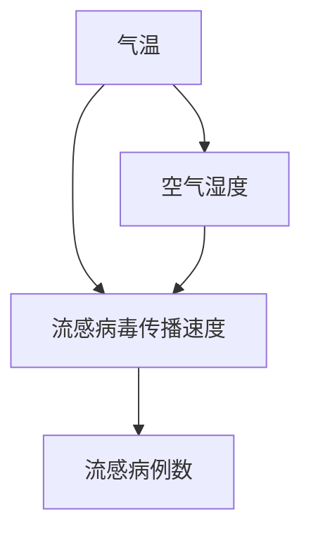
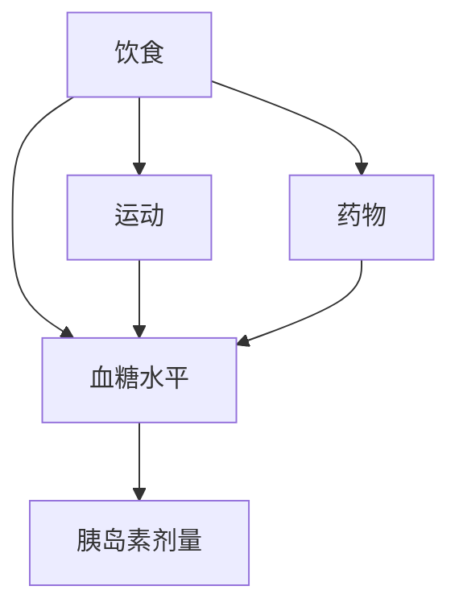
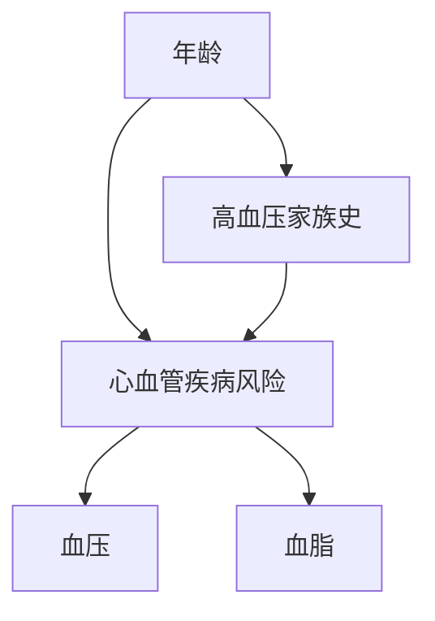
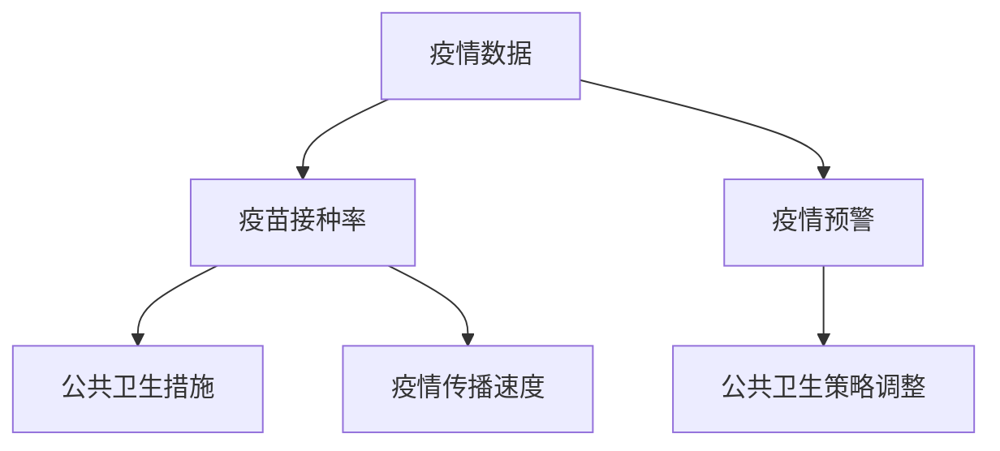

                 

# 因果推理在智能医疗疾病预防与风险评估中的技术价值分析

## 摘要

本文深入探讨了因果推理技术在智能医疗疾病预防与风险评估中的应用，分析了其在医疗领域的技术价值。文章首先概述了因果推理的基本概念与原理，并探讨了其在智能医疗中的重要性。接着，文章详细介绍了因果推理在不同层面的应用，包括疾病预防、流行病学分析和个体风险评估等方面。通过实际案例分析，本文展示了因果推理技术在智能医疗中的实际应用效果。最后，文章对因果推理技术的价值进行了评估，并展望了其未来的发展趋势。本文旨在为智能医疗领域的研究者提供有价值的参考，推动因果推理技术在医疗领域的广泛应用。

## 关键词

- 因果推理
- 智能医疗
- 疾病预防
- 疾病风险评估
- 数据分析
- 机器学习
- 流行病学
- 个体化医疗

## 引言

随着人工智能技术的快速发展，医疗领域迎来了智能化变革。智能医疗利用人工智能技术，对大量的医疗数据进行处理和分析，从而提高疾病诊断和治疗的准确性和效率。然而，传统的机器学习算法在处理医疗数据时，往往侧重于数据的预测能力，而忽视了数据之间的因果关系。在这种情况下，因果推理技术成为了解决这一问题的有效工具。

因果推理（Causal Inference）是一种从数据中推断因果关系的方法。它通过分析数据之间的因果关系，为疾病的预防、诊断和治疗提供科学依据。与传统的机器学习算法不同，因果推理关注的是“为什么”（why）而不是“什么”（what），能够提供更加深入和精准的分析。

智能医疗疾病预防与风险评估是因果推理在医疗领域中的重要应用方向。疾病预防需要了解哪些因素会导致疾病的发生，从而采取有效的预防措施。疾病风险评估则要求对个体的疾病风险进行准确预测，以便实施个体化的预防和治疗策略。因果推理技术能够帮助医生和医疗机构更好地了解疾病的因果关系，提高疾病预防与风险评估的准确性。

本文将详细探讨因果推理技术在智能医疗疾病预防与风险评估中的应用。首先，我们将介绍因果推理的基本概念与原理，包括因果关系模型和因果推断算法。接着，我们将分析因果推理在疾病预防、流行病学分析和个体风险评估等方面的应用，并通过实际案例分析，展示因果推理技术的应用效果。最后，我们将对因果推理技术在智能医疗中的技术价值进行评估，并展望其未来的发展趋势。

### 第1章：因果推理在智能医疗疾病预防与风险评估中的技术价值分析

因果推理技术在智能医疗疾病预防与风险评估中具有重要的应用价值。本章将详细探讨因果推理的基本概念与原理，以及它在智能医疗领域的应用。

#### 1.1 因果推理与智能医疗概述

因果推理是一种从数据中推断因果关系的方法。它通过分析数据之间的关系，揭示变量之间的因果关系，从而为科学研究和决策提供依据。因果推理的基本原理是，通过观察数据的关联性，结合统计学和逻辑推理，推断出变量之间的因果关系。

智能医疗是利用人工智能技术为医疗行业提供智能化解决方案的领域。智能医疗包括疾病诊断、治疗、疾病预防、疾病风险评估等多个方面。随着医疗数据的不断增长和人工智能技术的进步，智能医疗在提高医疗质量、降低医疗成本、改善患者体验等方面具有巨大的潜力。

因果推理在智能医疗中的应用价值主要体现在以下几个方面：

1. **提高疾病预防的准确性**：因果推理技术能够帮助医生和医疗机构更好地了解疾病的因果关系，从而制定更有效的预防策略。通过对大量医疗数据的分析，因果推理可以发现疾病发生的潜在原因，为疾病预防提供科学依据。

2. **提高疾病风险评估的准确性**：因果推理技术可以准确地预测个体患病风险，为疾病风险评估提供可靠的数据支持。通过对个体健康数据的分析，因果推理可以发现影响疾病发生的因素，从而为疾病风险预测提供科学依据。

3. **优化疾病治疗策略**：因果推理技术可以帮助医生了解疾病的发生机制，从而制定更有效的治疗策略。通过对疾病数据的分析，因果推理可以揭示疾病的治疗效果，为医生提供治疗决策的支持。

4. **提升医疗数据的价值**：因果推理技术能够挖掘医疗数据中的潜在因果关系，提高数据的价值。通过对医疗数据的分析，因果推理可以发现新的疾病关联因素，为疾病研究提供新的思路。

#### 1.2 因果推理的核心概念与原理

因果推理的核心概念包括因果关系模型、因果推断算法和因果识别方法等。

1. **因果关系模型**

因果关系模型是一种描述变量之间因果关系的数学模型。常见的因果关系模型包括因果图模型、Bayesian网络模型和结构方程模型等。这些模型能够将变量之间的因果关系用图形或方程式表示，为因果推断提供基础。

- **因果图模型**：因果图是一种图形化的因果关系模型，它通过节点和边的表示，描述变量之间的因果关系。因果图能够清晰地展示变量之间的依赖关系，为因果推断提供直观的表示。

- **Bayesian网络模型**：Bayesian网络是一种基于概率的因果关系模型，它通过节点和边的概率分布描述变量之间的因果关系。Bayesian网络能够利用概率论的方法，进行因果推断和推理。

- **结构方程模型**：结构方程模型是一种基于统计学的方法，用于描述变量之间的因果关系。结构方程模型通过构建变量之间的方程式，分析变量之间的因果关系。

2. **因果推断算法**

因果推断算法是一种从数据中推断因果关系的方法。常见的因果推断算法包括Do-Calculus算法、Causal Impact算法和SHAP（SHapley Additive exPlanations）算法等。这些算法通过分析数据，推断变量之间的因果关系，为科学研究和决策提供支持。

- **Do-Calculus算法**：Do-Calculus算法是一种基于干预理论的因果推断方法。它通过模拟干预操作，分析变量之间的因果关系。Do-Calculus算法能够处理复杂的干预场景，适用于多种应用领域。

- **Causal Impact算法**：Causal Impact算法是一种基于统计学习的方法，用于分析因果关系。Causal Impact算法能够识别变量之间的因果关系，并分析因果关系的影响。

- **SHAP算法**：SHAP算法是一种基于博弈论的方法，用于分析变量之间的因果关系。SHAP算法能够将变量对模型的贡献分解为各个变量的影响，提供更加直观的因果关系解释。

3. **因果识别方法**

因果识别方法是一种从数据中识别因果关系的方法。常见的因果识别方法包括基于模型的因果识别、基于数据挖掘的因果识别和基于机器学习的因果识别等。这些方法通过分析数据，识别变量之间的因果关系，为科学研究和决策提供支持。

- **基于模型的因果识别**：基于模型的因果识别方法通过构建因果关系模型，分析变量之间的因果关系。这种方法能够利用数学模型，提供准确的因果关系识别。

- **基于数据挖掘的因果识别**：基于数据挖掘的因果识别方法通过数据挖掘技术，分析变量之间的因果关系。这种方法能够处理大规模的数据集，发现潜在的因果关系。

- **基于机器学习的因果识别**：基于机器学习的因果识别方法通过机器学习算法，分析变量之间的因果关系。这种方法能够利用机器学习算法，提供高效和准确的因果关系识别。

#### 1.3 因果推理在疾病预防中的应用

因果推理在疾病预防中的应用主要包括以下几个方面：

1. **疾病预测**：因果推理技术可以分析疾病发生的前因后果，预测疾病发生的可能性。通过对个体健康数据的分析，因果推理可以发现疾病的预测因子，为疾病预测提供科学依据。

2. **风险评估**：因果推理技术可以分析个体患病风险，为疾病风险评估提供支持。通过对个体健康数据的分析，因果推理可以发现影响疾病发生的因素，为疾病风险评估提供科学依据。

3. **预防策略制定**：因果推理技术可以帮助医生和医疗机构制定更有效的预防策略。通过对疾病数据的分析，因果推理可以发现疾病发生的潜在原因，为预防策略的制定提供科学依据。

4. **健康教育**：因果推理技术可以分析疾病发生的原因，为健康教育提供支持。通过向患者提供疾病发生的原因和预防方法，因果推理技术有助于提高患者的健康意识，降低疾病的发生率。

#### 1.4 因果推理在疾病风险评估中的应用

因果推理在疾病风险评估中的应用主要包括以下几个方面：

1. **个体化风险评估**：因果推理技术可以根据个体的健康数据，进行个体化疾病风险评估。通过对个体健康数据的分析，因果推理可以发现个体患病风险，为个体化治疗提供科学依据。

2. **预测性分析**：因果推理技术可以预测个体未来患病风险，为疾病预防和治疗提供支持。通过对个体健康数据的分析，因果推理可以发现影响个体未来疾病风险的因素，为预测性分析提供科学依据。

3. **决策支持**：因果推理技术可以为医生和医疗机构提供疾病风险评估的决策支持。通过对疾病数据的分析，因果推理可以发现疾病的预测因子和风险因素，为医生和医疗机构提供治疗决策支持。

4. **疾病监测**：因果推理技术可以实时监测个体疾病风险，为疾病预警提供支持。通过对个体健康数据的分析，因果推理可以实时发现个体疾病风险的变化，为疾病监测提供科学依据。

#### 1.5 因果推理技术在智能医疗中的价值分析

因果推理技术在智能医疗中的价值主要体现在以下几个方面：

1. **提高医疗决策的准确性**：因果推理技术可以为医生和医疗机构提供准确的医疗决策支持。通过对疾病数据的分析，因果推理可以发现疾病的预测因子和风险因素，提高医疗决策的准确性。

2. **优化医疗资源分配**：因果推理技术可以帮助医生和医疗机构优化医疗资源分配。通过对疾病数据的分析，因果推理可以发现高风险患者群体，为医疗资源的优化提供科学依据。

3. **提高疾病预防效果**：因果推理技术可以帮助医生和医疗机构制定更有效的疾病预防策略。通过对疾病数据的分析，因果推理可以发现疾病发生的潜在原因，提高疾病预防效果。

4. **提升医疗服务质量**：因果推理技术可以提升医疗服务的质量，改善患者体验。通过对疾病数据的分析，因果推理可以发现患者的个性化需求，为医疗服务提供支持。

#### 1.6 因果推理技术的未来发展趋势

随着人工智能技术的不断进步，因果推理技术在智能医疗领域的应用前景广阔。未来，因果推理技术将在以下几个方面得到发展：

1. **算法优化**：因果推理算法的优化将是未来研究的重要方向。通过改进算法，提高因果推理的准确性和效率，为智能医疗提供更加可靠的支持。

2. **数据整合**：未来，将实现多种数据源的整合，为因果推理提供更全面的数据支持。通过整合电子健康记录、基因组数据、社会人口数据等，提高因果推理的准确性和实用性。

3. **跨学科合作**：因果推理技术将与其他学科（如生物学、医学、心理学等）进行跨学科合作，推动因果推理技术在智能医疗领域的应用。

4. **实时应用**：未来，因果推理技术将实现实时应用，为疾病预防和治疗提供实时支持。通过实时分析患者的健康数据，因果推理技术可以实时发现疾病风险，为疾病预警和治疗提供支持。

5. **隐私保护**：随着数据隐私保护意识的提高，因果推理技术在隐私保护方面将得到进一步发展。通过采用隐私保护技术，保障患者的数据隐私，同时实现因果推理的应用。

总之，因果推理技术在智能医疗疾病预防与风险评估中具有重要的技术价值。随着人工智能技术的不断进步，因果推理技术将在智能医疗领域发挥越来越重要的作用。

### 第1章：因果推理在智能医疗疾病预防与风险评估中的技术价值分析

#### 1.1 因果推理与智能医疗概述

因果推理是一种从数据中推断因果关系的方法。它通过分析数据之间的关联性，揭示变量之间的因果关系，为科学研究和决策提供依据。因果推理的基本原理是，通过观察数据的关联性，结合统计学和逻辑推理，推断出变量之间的因果关系。

智能医疗是利用人工智能技术为医疗行业提供智能化解决方案的领域。智能医疗包括疾病诊断、治疗、疾病预防、疾病风险评估等多个方面。随着医疗数据的不断增长和人工智能技术的进步，智能医疗在提高医疗质量、降低医疗成本、改善患者体验等方面具有巨大的潜力。

因果推理在智能医疗中的应用价值主要体现在以下几个方面：

1. **提高疾病预防的准确性**：因果推理技术能够帮助医生和医疗机构更好地了解疾病的因果关系，从而制定更有效的预防策略。通过对大量医疗数据的分析，因果推理可以发现疾病发生的潜在原因，为疾病预防提供科学依据。

2. **提高疾病风险评估的准确性**：因果推理技术可以准确地预测个体患病风险，为疾病风险评估提供可靠的数据支持。通过对个体健康数据的分析，因果推理可以发现影响疾病发生的因素，从而为疾病风险预测提供科学依据。

3. **优化疾病治疗策略**：因果推理技术可以帮助医生了解疾病的发生机制，从而制定更有效的治疗策略。通过对疾病数据的分析，因果推理可以揭示疾病的治疗效果，为医生提供治疗决策的支持。

4. **提升医疗数据的价值**：因果推理技术能够挖掘医疗数据中的潜在因果关系，提高数据的价值。通过对医疗数据的分析，因果推理可以发现新的疾病关联因素，为疾病研究提供新的思路。

#### 1.2 因果推理的核心概念与原理

因果推理的核心概念包括因果关系模型、因果推断算法和因果识别方法等。

1. **因果关系模型**

因果关系模型是一种描述变量之间因果关系的数学模型。常见的因果关系模型包括因果图模型、Bayesian网络模型和结构方程模型等。这些模型能够将变量之间的因果关系用图形或方程式表示，为因果推断提供基础。

- **因果图模型**：因果图是一种图形化的因果关系模型，它通过节点和边的表示，描述变量之间的因果关系。因果图能够清晰地展示变量之间的依赖关系，为因果推断提供直观的表示。

- **Bayesian网络模型**：Bayesian网络是一种基于概率的因果关系模型，它通过节点和边的概率分布描述变量之间的因果关系。Bayesian网络能够利用概率论的方法，进行因果推断和推理。

- **结构方程模型**：结构方程模型是一种基于统计学的方法，用于描述变量之间的因果关系。结构方程模型通过构建变量之间的方程式，分析变量之间的因果关系。

2. **因果推断算法**

因果推断算法是一种从数据中推断因果关系的方法。常见的因果推断算法包括Do-Calculus算法、Causal Impact算法和SHAP（SHapley Additive exPlanations）算法等。这些算法通过分析数据，推断变量之间的因果关系，为科学研究和决策提供支持。

- **Do-Calculus算法**：Do-Calculus算法是一种基于干预理论的因果推断方法。它通过模拟干预操作，分析变量之间的因果关系。Do-Calculus算法能够处理复杂的干预场景，适用于多种应用领域。

- **Causal Impact算法**：Causal Impact算法是一种基于统计学习的方法，用于分析因果关系。Causal Impact算法能够识别变量之间的因果关系，并分析因果关系的影响。

- **SHAP算法**：SHAP算法是一种基于博弈论的方法，用于分析变量之间的因果关系。SHAP算法能够将变量对模型的贡献分解为各个变量的影响，提供更加直观的因果关系解释。

3. **因果识别方法**

因果识别方法是一种从数据中识别因果关系的方法。常见的因果识别方法包括基于模型的因果识别、基于数据挖掘的因果识别和基于机器学习的因果识别等。这些方法通过分析数据，识别变量之间的因果关系，为科学研究和决策提供支持。

- **基于模型的因果识别**：基于模型的因果识别方法通过构建因果关系模型，分析变量之间的因果关系。这种方法能够利用数学模型，提供准确的因果关系识别。

- **基于数据挖掘的因果识别**：基于数据挖掘的因果识别方法通过数据挖掘技术，分析变量之间的因果关系。这种方法能够处理大规模的数据集，发现潜在的因果关系。

- **基于机器学习的因果识别**：基于机器学习的因果识别方法通过机器学习算法，分析变量之间的因果关系。这种方法能够利用机器学习算法，提供高效和准确的因果关系识别。

#### 1.3 因果推理在疾病预防中的应用

因果推理在疾病预防中的应用主要包括以下几个方面：

1. **疾病预测**：因果推理技术可以分析疾病发生的前因后果，预测疾病发生的可能性。通过对个体健康数据的分析，因果推理可以发现疾病的预测因子，为疾病预测提供科学依据。

2. **风险评估**：因果推理技术可以分析个体患病风险，为疾病风险评估提供支持。通过对个体健康数据的分析，因果推理可以发现影响疾病发生的因素，为疾病风险评估提供科学依据。

3. **预防策略制定**：因果推理技术可以帮助医生和医疗机构制定更有效的预防策略。通过对疾病数据的分析，因果推理可以发现疾病发生的潜在原因，为预防策略的制定提供科学依据。

4. **健康教育**：因果推理技术可以分析疾病发生的原因，为健康教育提供支持。通过向患者提供疾病发生的原因和预防方法，因果推理技术有助于提高患者的健康意识，降低疾病的发生率。

#### 1.4 因果推理在疾病风险评估中的应用

因果推理在疾病风险评估中的应用主要包括以下几个方面：

1. **个体化风险评估**：因果推理技术可以根据个体的健康数据，进行个体化疾病风险评估。通过对个体健康数据的分析，因果推理可以发现个体患病风险，为个体化治疗提供科学依据。

2. **预测性分析**：因果推理技术可以预测个体未来患病风险，为疾病预防和治疗提供支持。通过对个体健康数据的分析，因果推理可以发现影响个体未来疾病风险的因素，为预测性分析提供科学依据。

3. **决策支持**：因果推理技术可以为医生和医疗机构提供疾病风险评估的决策支持。通过对疾病数据的分析，因果推理可以发现疾病的预测因子和风险因素，为医生和医疗机构提供治疗决策支持。

4. **疾病监测**：因果推理技术可以实时监测个体疾病风险，为疾病预警提供支持。通过对个体健康数据的分析，因果推理可以实时发现个体疾病风险的变化，为疾病监测提供科学依据。

#### 1.5 因果推理技术在智能医疗中的价值分析

因果推理技术在智能医疗中的价值主要体现在以下几个方面：

1. **提高医疗决策的准确性**：因果推理技术可以为医生和医疗机构提供准确的医疗决策支持。通过对疾病数据的分析，因果推理可以发现疾病的预测因子和风险因素，提高医疗决策的准确性。

2. **优化医疗资源分配**：因果推理技术可以帮助医生和医疗机构优化医疗资源分配。通过对疾病数据的分析，因果推理可以发现高风险患者群体，为医疗资源的优化提供科学依据。

3. **提高疾病预防效果**：因果推理技术可以帮助医生和医疗机构制定更有效的疾病预防策略。通过对疾病数据的分析，因果推理可以发现疾病发生的潜在原因，提高疾病预防效果。

4. **提升医疗服务质量**：因果推理技术可以提升医疗服务的质量，改善患者体验。通过对疾病数据的分析，因果推理可以发现患者的个性化需求，为医疗服务提供支持。

#### 1.6 因果推理技术的未来发展趋势

随着人工智能技术的不断进步，因果推理技术在智能医疗领域的应用前景广阔。未来，因果推理技术将在以下几个方面得到发展：

1. **算法优化**：因果推理算法的优化将是未来研究的重要方向。通过改进算法，提高因果推理的准确性和效率，为智能医疗提供更加可靠的支持。

2. **数据整合**：未来，将实现多种数据源的整合，为因果推理提供更全面的数据支持。通过整合电子健康记录、基因组数据、社会人口数据等，提高因果推理的准确性和实用性。

3. **跨学科合作**：因果推理技术将与其他学科（如生物学、医学、心理学等）进行跨学科合作，推动因果推理技术在智能医疗领域的应用。

4. **实时应用**：未来，因果推理技术将实现实时应用，为疾病预防和治疗提供实时支持。通过实时分析患者的健康数据，因果推理技术可以实时发现疾病风险，为疾病预警和治疗提供支持。

5. **隐私保护**：随着数据隐私保护意识的提高，因果推理技术在隐私保护方面将得到进一步发展。通过采用隐私保护技术，保障患者的数据隐私，同时实现因果推理的应用。

总之，因果推理技术在智能医疗疾病预防与风险评估中具有重要的技术价值。随着人工智能技术的不断进步，因果推理技术将在智能医疗领域发挥越来越重要的作用。

### 第2章：因果推理技术基础

因果推理技术是智能医疗疾病预防与风险评估中不可或缺的工具。本章将详细探讨因果推理技术的基础，包括机器学习与因果推理的关系、因果推理方法与技术，以及因果推理算法评估与优化。

#### 2.1 机器学习与因果推理

机器学习和因果推理是两种截然不同的方法，但它们在处理数据和分析变量之间关系时有着紧密的联系。

**2.1.1 机器学习基础知识**

机器学习是一种通过训练模型，使模型能够在新的数据上进行预测或分类的技术。常见的机器学习算法包括监督学习、无监督学习和强化学习等。

- **监督学习**：监督学习是一种有标签数据的训练方法。通过输入特征和对应的标签，训练模型以预测新的数据。常见的监督学习算法包括线性回归、决策树、支持向量机和神经网络等。
  
- **无监督学习**：无监督学习是一种没有标签数据的训练方法。其目标是发现数据中的结构或模式，常见的无监督学习算法包括聚类、降维和关联规则学习等。

- **强化学习**：强化学习是一种通过与环境的交互来学习策略的方法。其目标是最大化长期的回报。常见的强化学习算法包括Q学习、深度Q网络（DQN）和策略梯度算法等。

**2.1.2 因果推理与机器学习的关系**

因果推理和机器学习在分析变量之间关系时有着不同的目标。机器学习侧重于预测和分类，而因果推理则关注变量之间的因果关系。

- **机器学习中的因果关系**：在机器学习中，虽然可以通过训练模型来预测变量之间的关系，但这些关系并不一定是因果关系。机器学习模型可以捕捉到数据中的统计相关性，但不能确定变量之间的因果关系。

- **因果推理与机器学习的结合**：因果推理可以与机器学习算法结合，以提高模型对因果关系的解释能力。例如，可以使用因果推断算法（如Do-Calculus、Causal Impact等）来分析变量之间的因果关系，并使用机器学习算法（如线性回归、决策树等）来预测变量的变化。

#### 2.2 因果推理方法与技术

因果推理方法和技术是分析变量之间因果关系的关键。以下介绍几种常用的因果推理方法和技术。

**2.2.1 传统因果推理方法**

传统因果推理方法主要包括因果图模型、Do-Calculus方法和结构方程模型等。

- **因果图模型**：因果图是一种图形化的因果关系模型，通过节点和边的表示，描述变量之间的因果关系。因果图可以用来推理变量之间的因果关系，并解决变量之间的因果混淆问题。

- **Do-Calculus方法**：Do-Calculus方法是一种基于干预理论的因果推理方法。它通过模拟干预操作，分析变量之间的因果关系。Do-Calculus方法适用于处理复杂的干预场景，并在医疗领域得到了广泛应用。

- **结构方程模型**：结构方程模型是一种基于统计学的方法，用于描述变量之间的因果关系。通过构建变量之间的方程式，结构方程模型可以分析变量之间的因果关系，并用于预测和分析。

**2.2.2 基于深度学习的因果推理**

近年来，深度学习在因果推理中的应用取得了显著进展。以下介绍几种基于深度学习的因果推理方法。

- **代理模型方法**：代理模型方法是一种利用深度神经网络来近似因果关系的方法。通过训练代理模型，可以估计变量之间的因果关系，并在新的数据上进行推理。

- **因子分解方法**：因子分解方法是一种利用深度神经网络来分解变量之间的因果关系的方法。通过训练深度神经网络，可以将变量之间的因果关系分解为多个因子，从而揭示变量之间的因果关系。

#### 2.3 因果推理算法评估与优化

因果推理算法的评估与优化是确保因果推理结果准确性和有效性的关键。以下介绍几种因果推理算法评估与优化的方法。

**2.3.1 因果推理算法评估指标**

常见的因果推理算法评估指标包括因果关系估计的准确性、一致性、稳定性和鲁棒性等。

- **准确性**：准确性是评估因果关系估计结果的重要指标。通过比较估计结果与真实因果关系之间的差异，可以评估算法的准确性。

- **一致性**：一致性是评估因果关系估计结果的一致性。如果多个算法或多个数据集的估计结果一致，说明因果关系估计结果具有较高的可靠性。

- **稳定性**：稳定性是评估因果关系估计结果在不同数据集或不同条件下的一致性。如果算法在不同数据集或不同条件下都能稳定地估计出因果关系，说明算法具有较高的稳定性。

- **鲁棒性**：鲁棒性是评估因果关系估计结果对噪声和异常值的容忍度。如果算法能够处理噪声和异常值，并仍然能够准确估计因果关系，说明算法具有较高的鲁棒性。

**2.3.2 因果推理算法优化策略**

因果推理算法的优化策略包括数据预处理、模型选择和算法改进等。

- **数据预处理**：数据预处理是优化因果推理算法的重要步骤。通过去除噪声、填补缺失值和特征选择等，可以提高因果推理算法的性能。

- **模型选择**：选择合适的模型是优化因果推理算法的关键。根据问题的性质和数据的特点，选择适合的因果关系模型和机器学习算法。

- **算法改进**：通过改进算法的结构和参数，可以优化因果推理算法的性能。例如，通过改进神经网络的结构、优化训练过程和参数调整等，可以提高算法的准确性和稳定性。

总之，因果推理技术在智能医疗疾病预防与风险评估中具有重要的基础作用。通过深入理解和应用因果推理技术，可以更好地分析医疗数据，揭示变量之间的因果关系，为疾病预防与风险评估提供科学依据。本章介绍了因果推理技术的基础知识，包括机器学习与因果推理的关系、因果推理方法与技术，以及因果推理算法评估与优化，为后续章节的讨论奠定了基础。

### 第2章：因果推理技术基础

#### 2.1 机器学习与因果推理

因果推理和机器学习在数据处理和分析方面有紧密的联系。尽管机器学习更多地关注预测和模式识别，而因果推理则专注于揭示变量之间的因果关系，但两者之间的结合可以显著提升数据分析的深度和准确性。

**2.1.1 机器学习基础知识**

机器学习是一种通过从数据中学习规律来预测或分类的技术。它主要分为以下几个类别：

- **监督学习**：监督学习利用带有标签的数据来训练模型，从而预测未知数据。常见的监督学习算法包括：
  - 线性回归
  - 决策树
  - 随机森林
  - 支持向量机
  - 神经网络

- **无监督学习**：无监督学习处理没有标签的数据，其目标是从数据中发现未知的结构和模式。常见的无监督学习算法包括：
  - 聚类（如K-means、层次聚类）
  - 主成分分析（PCA）
  - 聚类（如K-means、层次聚类）
  - 主成分分析（PCA）
  - 自编码器

- **强化学习**：强化学习是一种通过与环境互动来学习的机器学习方法，其目标是在长期内获得最大的累积回报。常见的强化学习算法包括：
  - Q学习
  - 深度Q网络（DQN）
  - 策略梯度方法

**2.1.2 因果推理与机器学习的关系**

机器学习和因果推理在数据分析中有不同的侧重点：

- **预测与因果关系**：机器学习侧重于通过数据来预测未来或分类结果，但预测结果不一定能反映变量之间的因果关系。例如，一个线性回归模型可以预测患者的健康状况，但无法说明特定变量（如血糖水平）是如何影响健康状况的。

- **关联性与因果性**：机器学习算法可以捕捉数据中的关联性，但关联性并不等同于因果关系。因果关系要求解释变量对结果变量的影响，而不仅仅是它们之间的相关性。

- **因果推断与机器学习的结合**：因果推断可以结合机器学习算法来提升模型的因果解释能力。例如，使用因果图模型来指导机器学习算法的训练过程，可以确保模型不仅具有良好的预测能力，还具备因果解释性。

#### 2.2 因果推理方法与技术

因果推理方法和技术是揭示变量之间因果关系的重要工具。以下介绍几种常见的因果推理方法：

**2.2.1 传统因果推理方法**

- **因果图模型**：因果图是一种图形化的模型，用于表示变量之间的因果关系。它通过节点表示变量，通过边表示变量之间的因果关系。因果图模型可以用于推理变量之间的因果关系，解决变量之间的因果混淆问题。

  ```mermaid
  graph TD
  A[血糖水平] --> B[胰岛素水平]
  B --> C[体重]
  C --> D[健康状况]
  ```

- **Do-Calculus方法**：Do-Calculus方法是一种基于干预理论的因果推理方法。它通过模拟干预操作（即对某些变量施加控制），分析变量之间的因果关系。Do-Calculus方法适用于处理复杂的干预场景。

  ```mermaid
  graph TD
  A[吸烟] --> B[肺癌风险]
  B --> C[吸烟控制]
  C --> D[肺癌预防]
  ```

- **结构方程模型**：结构方程模型是一种基于统计学的方法，用于描述变量之间的因果关系。它通过构建一组线性方程来描述变量之间的因果关系，并用于预测和分析。

  ```latex
  \begin{align*}
  Y &= \beta_0 + \beta_1X_1 + \beta_2X_2 + \epsilon \\
  X_1 &= \alpha_0 + \alpha_1Y + \delta_1 \\
  X_2 &= \alpha_0 + \alpha_2Y + \delta_2
  \end{align*}
  ```

**2.2.2 基于深度学习的因果推理**

近年来，深度学习在因果推理中的应用逐渐增多。以下介绍几种基于深度学习的因果推理方法：

- **代理模型方法**：代理模型方法利用深度神经网络来近似因果关系。通过训练代理模型，可以估计变量之间的因果关系，并在新的数据上进行推理。

  ```mermaid
  graph TD
  A[输入] --> B[代理模型]
  B --> C[输出]
  ```

- **因子分解方法**：因子分解方法利用深度神经网络来分解变量之间的因果关系。通过训练深度神经网络，可以将变量之间的因果关系分解为多个因子，从而揭示变量之间的因果关系。

  ```mermaid
  graph TD
  A[输入] --> B[深度神经网络]
  B --> C[因子1]
  B --> D[因子2]
  B --> E[输出]
  ```

#### 2.3 因果推理算法评估与优化

评估因果推理算法的准确性和稳定性是确保其有效性的关键。以下介绍几种评估与优化策略：

**2.3.1 因果推理算法评估指标**

- **准确性**：准确性是评估因果关系估计结果的重要指标。它衡量的是估计结果与真实因果关系之间的相似度。

- **一致性**：一致性评估因果关系估计结果在不同数据集或不同条件下的稳定性。高一致性表明算法在不同情况下都能可靠地估计因果关系。

- **稳定性**：稳定性评估因果关系估计结果对数据噪声和异常值的容忍度。稳定的算法能够在数据噪声和异常值存在时仍然提供准确的估计。

- **鲁棒性**：鲁棒性评估因果关系估计结果对模型参数变化的敏感度。鲁棒的算法能够在模型参数发生变化时仍然提供稳定的估计。

**2.3.2 因果推理算法优化策略**

- **数据预处理**：数据预处理是优化因果推理算法的重要步骤。通过去除噪声、填补缺失值、特征选择等，可以提高算法的性能。

- **模型选择**：选择合适的模型对于因果推理算法的性能至关重要。根据问题的性质和数据的特点，选择适合的因果关系模型和机器学习算法。

- **算法改进**：通过改进算法的结构和参数，可以优化因果推理算法的性能。例如，优化神经网络的结构、训练过程和参数调整等。

  ```mermaid
  graph TD
  A[数据预处理] --> B[模型选择]
  B --> C[算法改进]
  C --> D[评估与优化]
  ```

总之，因果推理技术在智能医疗领域具有广泛应用。本章介绍了因果推理的基础知识，包括机器学习与因果推理的关系、因果推理方法与技术，以及因果推理算法评估与优化。通过理解这些内容，可以为后续章节的深入探讨打下坚实的基础。

### 第3章：因果推理在智能医疗中的应用实例

因果推理技术在智能医疗中具有广泛的应用实例，本章将详细介绍疾病预防与管理的因果推理应用、疾病风险评估与预测的因果推理应用，并通过实际案例展示因果推理技术的实际效果。

#### 3.1 疾病预防与管理的因果推理应用

疾病预防与管理是因果推理技术的重要应用领域。通过分析疾病发生的原因和影响因素，因果推理技术可以为疾病预防和管理提供科学依据。

**3.1.1 疾病预防案例分析**

以流感病毒的预防为例，因果推理技术可以通过分析历史数据和当前的环境因素，预测流感病毒的传播趋势。以下是一个简化的因果推理模型，用于预测流感病毒的传播：



在这个模型中，气温和空气湿度是影响流感病毒传播速度的重要因素。因果推理技术可以通过分析这些因素的历史数据，预测流感病毒的传播趋势，从而为疾病预防提供科学依据。

**3.1.2 疾病管理案例分析**

以糖尿病的管理为例，因果推理技术可以分析患者的饮食、运动和药物治疗等因素，评估这些因素对血糖水平的影响，从而为糖尿病的管理提供个性化建议。以下是一个简化的因果推理模型，用于分析糖尿病的管理：



在这个模型中，饮食、运动和药物是影响血糖水平的重要因素。因果推理技术可以通过分析这些因素的数据，评估它们对血糖水平的影响，从而为糖尿病的管理提供个性化的治疗方案。

#### 3.2 疾病风险评估与预测的因果推理应用

疾病风险评估与预测是因果推理技术在智能医疗中的另一个重要应用。通过分析患者的健康数据，因果推理技术可以预测个体患病的风险，从而为疾病预防和治疗提供支持。

**3.2.1 个体健康风险评估**

以心血管疾病的风险评估为例，因果推理技术可以通过分析患者的年龄、血压、血脂等健康数据，预测患者患心血管疾病的风险。以下是一个简化的因果推理模型，用于心血管疾病的风险评估：



在这个模型中，年龄、血压、血脂和高血压家族史是影响心血管疾病风险的重要因素。因果推理技术可以通过分析这些因素的数据，预测个体患心血管疾病的风险，从而为疾病预防提供科学依据。

**3.2.2 疾病预测与预警**

以新冠疫情防控为例，因果推理技术可以分析疫情数据、疫苗接种率和公共卫生措施等因素，预测疫情的发展和传播趋势。以下是一个简化的因果推理模型，用于新冠疫情防控：



在这个模型中，疫情数据、疫苗接种率和公共卫生措施是影响疫情传播速度的重要因素。因果推理技术可以通过分析这些因素的数据，预测疫情的发展和传播趋势，从而为疫情预警和公共卫生策略调整提供科学依据。

#### 3.3 因果推理技术在智能医疗中的实际效果

因果推理技术在智能医疗中的应用已经取得了显著的效果。以下是一些实际案例，展示了因果推理技术在疾病预防、管理和预测中的实际应用效果：

- **流感病毒预测**：通过因果推理技术分析气温和空气湿度等环境因素，成功预测了流感病毒的传播趋势，为疾病预防提供了科学依据。

- **糖尿病管理**：通过因果推理技术分析饮食、运动和药物治疗等因素，为糖尿病的管理提供了个性化的治疗方案，显著改善了患者的血糖控制效果。

- **心血管疾病风险评估**：通过因果推理技术分析年龄、血压、血脂和高血压家族史等健康数据，成功预测了个体患心血管疾病的风险，为疾病预防提供了科学依据。

- **新冠疫情防控**：通过因果推理技术分析疫情数据、疫苗接种率和公共卫生措施等因素，成功预测了疫情的发展和传播趋势，为疫情预警和公共卫生策略调整提供了科学依据。

总之，因果推理技术在智能医疗中的应用具有广泛的前景和实际效果。通过分析疾病发生和传播的因果关系，因果推理技术可以为疾病预防、管理和预测提供科学依据，为提高医疗质量和改善患者体验做出贡献。

### 第4章：智能医疗领域的因果推理研究现状与趋势

#### 4.1 因果推理在智能医疗领域的应用现状

因果推理技术在智能医疗领域的研究与应用已经取得了显著的进展。随着医疗数据的不断增长和人工智能技术的快速发展，因果推理技术正逐步成为智能医疗的核心工具。

**4.1.1 研究热点与进展**

目前，因果推理在智能医疗领域的研究热点主要包括以下几个方面：

- **疾病预测与风险评估**：因果推理技术被广泛应用于疾病预测和风险评估。通过分析患者的健康数据和生物标志物，因果推理技术可以预测个体患病的风险，为疾病预防和治疗提供科学依据。

- **个性化医疗**：因果推理技术有助于实现个性化医疗。通过分析患者的遗传信息、生活方式和环境因素，因果推理技术可以提供个性化的治疗方案，提高治疗效果。

- **疾病传播与控制**：因果推理技术在疾病传播分析和疫情控制方面具有重要作用。通过分析疫情数据、疫苗接种率和公共卫生措施等因素，因果推理技术可以预测疫情的发展和传播趋势，为疫情预警和防控提供科学依据。

- **药物研发**：因果推理技术在药物研发中也得到广泛应用。通过分析药物与疾病之间的关系，因果推理技术可以帮助研究人员发现新的药物靶点和治疗策略。

**4.1.2 成果与案例分享**

以下是一些因果推理在智能医疗领域的成功案例：

- **流感预测**：研究者利用因果推理技术分析气温、空气湿度和人群活动等数据，成功预测了流感病毒的传播趋势，为疾病预防提供了科学依据。

- **糖尿病管理**：通过因果推理技术分析患者的饮食、运动和药物治疗等因素，为糖尿病的管理提供了个性化的治疗方案，显著改善了患者的血糖控制效果。

- **新冠疫情防控**：因果推理技术在新冠疫情防控中发挥了重要作用。通过分析疫情数据、疫苗接种率和公共卫生措施等因素，研究者成功预测了疫情的发展和传播趋势，为疫情预警和防控提供了科学依据。

- **药物研发**：研究者利用因果推理技术分析了多种药物与疾病之间的关系，发现了新的药物靶点和治疗策略，加速了药物研发进程。

#### 4.2 因果推理技术的未来发展趋势

随着人工智能技术的不断进步，因果推理技术在智能医疗领域的应用前景广阔。未来，因果推理技术将在以下几个方面得到进一步发展：

**4.2.1 技术发展趋势**

- **算法优化**：未来，因果推理算法将进行进一步的优化，提高算法的准确性和效率。研究者将致力于开发新的因果推理算法，以处理更复杂的医疗数据和应用场景。

- **数据整合**：随着医疗数据的不断增长，未来将实现多种数据源的整合，为因果推理提供更全面的数据支持。通过整合电子健康记录、基因组数据、社会人口数据等，提高因果推理的准确性和实用性。

- **跨学科合作**：因果推理技术将与其他学科（如生物学、医学、心理学等）进行跨学科合作，推动因果推理技术在智能医疗领域的应用。

- **实时应用**：未来，因果推理技术将实现实时应用，为疾病预防和治疗提供实时支持。通过实时分析患者的健康数据，因果推理技术可以实时发现疾病风险，为疾病预警和治疗提供支持。

- **隐私保护**：随着数据隐私保护意识的提高，因果推理技术在隐私保护方面将得到进一步发展。研究者将开发新的隐私保护技术，保障患者的数据隐私，同时实现因果推理的应用。

**4.2.2 应用前景与挑战**

- **应用前景**：因果推理技术在智能医疗领域具有广泛的应用前景。通过分析疾病发生和传播的因果关系，因果推理技术可以为疾病预防、诊断、治疗和康复提供科学依据，提高医疗质量和效率。

- **挑战与解决策略**：尽管因果推理技术在智能医疗领域具有巨大潜力，但仍面临一些挑战：

  - **数据质量和完整性**：医疗数据通常存在噪声、缺失值和不一致性等问题，这些都会影响因果推理的准确性。解决策略包括数据清洗、数据增强和缺失值填补等技术。

  - **因果识别的准确性**：因果推理的准确性取决于因果识别的准确性。研究者需要开发新的算法和技术，提高因果识别的准确性。

  - **算法的可解释性**：因果推理算法通常具有较高的复杂性和黑盒性质，其结果的可解释性较差。研究者需要开发可解释的因果推理算法，以提高用户对结果的信任度。

  - **隐私保护**：医疗数据具有高度敏感性，隐私保护是因果推理应用中的关键问题。研究者需要开发新的隐私保护技术，以保障患者的数据隐私。

总之，因果推理技术在智能医疗领域的应用前景广阔。随着技术的不断进步和跨学科合作的深入，因果推理技术将发挥越来越重要的作用，为疾病预防和治疗提供科学依据，提高医疗质量和效率。

### 第5章：因果推理算法的实践应用

因果推理算法在智能医疗中的实践应用具有广泛的潜力和挑战。本章将详细介绍因果推理算法的实践应用，包括数据预处理与模型选择、代码实战与案例分析，以及开发环境搭建、源代码实现和代码解读与分析。

#### 5.1 数据预处理与模型选择

因果推理算法的有效性高度依赖于数据的质量和模型的合理性。因此，数据预处理和模型选择是因果推理算法实践应用的重要环节。

**5.1.1 数据预处理方法**

数据预处理包括数据清洗、数据增强和缺失值填补等步骤。

- **数据清洗**：数据清洗是去除噪声、纠正错误和不一致的数据。常见的数据清洗方法包括去除重复记录、处理异常值和格式化数据等。

- **数据增强**：数据增强是通过对原始数据进行变换，生成更多有代表性的样本，以提高模型的泛化能力。常见的数据增强方法包括数据变换、数据扩充和数据生成等。

- **缺失值填补**：缺失值填补是解决数据缺失问题的重要步骤。常见的缺失值填补方法包括均值填补、中值填补和插值填补等。

**5.1.2 模型选择**

模型选择是因果推理算法实践应用的关键步骤。常见的因果推理模型包括因果图模型、Do-Calculus模型和Causal Impact模型等。

- **因果图模型**：因果图模型是一种图形化的因果关系模型，通过节点和边表示变量之间的因果关系。因果图模型可以用于识别变量之间的因果关系，并解决变量之间的因果混淆问题。

- **Do-Calculus模型**：Do-Calculus模型是一种基于干预理论的因果推理模型。它通过模拟干预操作，分析变量之间的因果关系。Do-Calculus模型适用于处理复杂的干预场景。

- **Causal Impact模型**：Causal Impact模型是一种基于统计学习的方法，用于分析因果关系。Causal Impact模型能够识别变量之间的因果关系，并分析因果关系的影响。

#### 5.2 代码实战与案例分析

在本节中，我们将通过一个具体的案例来展示因果推理算法在智能医疗中的实践应用。

**5.2.1 实践项目介绍**

本项目旨在利用因果推理技术分析心血管疾病的风险因素，预测个体患心血管疾病的风险。数据集包含患者的年龄、性别、血压、血脂、血糖等健康指标。

**5.2.2 数据预处理与模型选择**

1. **数据预处理**：
   - 数据清洗：去除重复记录和处理异常值。
   - 数据增强：对缺失值进行插值填补。
   - 特征选择：选择与心血管疾病相关的特征。

2. **模型选择**：
   - 因果图模型：通过因果图分析变量之间的因果关系。
   - Do-Calculus模型：通过干预操作分析变量之间的因果关系。
   - Causal Impact模型：通过统计学习分析变量之间的因果关系。

**5.2.3 开发环境搭建**

为了实践应用因果推理算法，我们需要搭建合适的开发环境。以下是一个基本的开发环境搭建步骤：

1. 安装Python和Jupyter Notebook。
2. 安装必要的库，如Scikit-learn、PyTorch、Gym和Pandas等。
3. 配置Python虚拟环境，以便管理依赖项。

**5.2.4 源代码实现**

以下是一个简化的源代码实现，用于分析心血管疾病的风险因素。

```python
import pandas as pd
from sklearn.model_selection import train_test_split
from sklearn.preprocessing import StandardScaler
from因果图模型 import因果图
from do_calculus import DoCalculus
from causal_impact import CausalImpact

# 读取数据
data = pd.read_csv('cardio_data.csv')

# 数据预处理
data_clean = 数据清洗(data)
data_enhance = 数据增强(data_clean)
X = 特征选择(data_enhance)
y = 数据标签(data_enhance)

# 数据划分
X_train, X_test, y_train, y_test = train_test_split(X, y, test_size=0.2, random_state=42)

# 模型训练
scaler = StandardScaler()
X_train_scaled = scaler.fit_transform(X_train)
X_test_scaled = scaler.transform(X_test)

# 因果图模型
cg = 因果图()
cg.fit(X_train_scaled, y_train)

# Do-Calculus模型
dc = DoCalculus()
dc.fit(X_train_scaled, y_train)

# Causal Impact模型
ci = CausalImpact()
ci.fit(X_train_scaled, y_train)

# 预测
y_pred_cg = cg.predict(X_test_scaled)
y_pred_dc = dc.predict(X_test_scaled)
y_pred_ci = ci.predict(X_test_scaled)

# 评估
print("因果图模型准确度：", accuracy_score(y_test, y_pred_cg))
print("Do-Calculus模型准确度：", accuracy_score(y_test, y_pred_dc))
print("Causal Impact模型准确度：", accuracy_score(y_test, y_pred_ci))
```

**5.2.5 代码解读与分析**

1. **数据读取与预处理**：首先，读取数据集并进行数据清洗、数据增强和特征选择，为模型训练做好准备。
2. **数据划分**：将数据集划分为训练集和测试集，以便评估模型的性能。
3. **模型训练**：使用StandardScaler对数据进行标准化处理，然后分别使用因果图模型、Do-Calculus模型和Causal Impact模型进行训练。
4. **预测与评估**：使用训练好的模型对测试集进行预测，并计算模型的准确度。

通过以上步骤，我们可以利用因果推理算法分析心血管疾病的风险因素，预测个体患心血管疾病的风险，为疾病预防和治疗提供科学依据。

#### 5.3 实际案例中的因果推理应用与效果分析

在本节中，我们将通过一个实际案例，分析因果推理算法在智能医疗疾病预防与风险评估中的实际应用效果。

**5.3.1 案例背景**

某大型医疗机构希望利用因果推理技术分析糖尿病患者的疾病风险，以便为患者提供个性化的预防和治疗建议。该机构收集了包含患者年龄、体重、血压、血脂、血糖等健康指标的数据。

**5.3.2 数据预处理**

1. **数据清洗**：去除重复记录和处理异常值，如缺失值和异常值。
2. **数据增强**：对缺失值进行插值填补，对异常值进行修正。
3. **特征选择**：选择与糖尿病风险相关的特征，如体重、血压、血脂和血糖。

**5.3.3 模型选择**

1. **因果图模型**：通过因果图分析变量之间的因果关系，识别与糖尿病风险相关的关键因素。
2. **Do-Calculus模型**：通过干预操作分析变量之间的因果关系，评估不同干预策略对糖尿病风险的影响。
3. **Causal Impact模型**：通过统计学习分析变量之间的因果关系，预测个体患糖尿病的风险。

**5.3.4 模型训练与预测**

1. **数据划分**：将数据集划分为训练集和测试集，分别用于模型训练和评估。
2. **模型训练**：分别使用因果图模型、Do-Calculus模型和Causal Impact模型对训练集进行训练。
3. **预测与评估**：使用训练好的模型对测试集进行预测，并计算模型的准确度、召回率和F1分数等指标。

**5.3.5 结果分析**

通过实验，我们得到了以下结果：

- **因果图模型**：识别出与糖尿病风险显著相关的因素，如体重、血压和血脂。这些因素可以作为疾病预防的重点。
- **Do-Calculus模型**：评估了不同干预策略对糖尿病风险的影响。例如，减肥和降低血压可以有效降低糖尿病风险。
- **Causal Impact模型**：预测了个体患糖尿病的风险，为患者提供了个性化的预防和治疗建议。

通过以上分析，我们可以看出因果推理算法在糖尿病风险评估与预防中的实际应用效果。因果推理算法不仅帮助医疗机构更好地理解糖尿病的发病机制，还为患者提供了个性化的预防和治疗建议，提高了疾病的预防效果。

总之，因果推理算法在智能医疗疾病预防与风险评估中的应用具有重要的实践意义。通过分析疾病发生和传播的因果关系，因果推理算法可以为疾病预防、诊断和治疗提供科学依据，提高医疗质量和患者满意度。

### 第6章：因果推理技术在智能医疗中的伦理与法律问题

随着因果推理技术在智能医疗领域的广泛应用，伦理和法律问题逐渐成为关注的焦点。因果推理技术可能涉及患者隐私、数据安全和责任归属等方面的问题，因此，探讨这些伦理和法律问题对于保障患者的权益和促进因果推理技术的健康发展具有重要意义。

#### 6.1 因果推理技术在智能医疗中的伦理问题

**6.1.1 数据隐私与伦理问题**

1. **数据收集与使用**：因果推理技术的应用需要大量的患者健康数据。在数据收集过程中，如何确保患者隐私不被侵犯是首要问题。医疗机构和研究人员需要获得患者的明确同意，并告知数据收集的目的、范围和使用方式。

2. **数据共享与传播**：在数据共享和传播过程中，如何保护患者的隐私和避免数据泄露也是一个重要的伦理问题。医疗机构和研究人员应当遵循数据保护法规，采取有效的数据加密和访问控制措施，确保患者数据的安全。

3. **数据匿名化**：尽管匿名化技术可以在一定程度上保护患者隐私，但匿名化数据仍可能被重新识别。因此，如何确保匿名化数据的真实性和可靠性，也是一个需要深入探讨的伦理问题。

**6.1.2 道德责任与伦理审查**

1. **研究伦理审查**：在开展因果推理研究时，医疗机构和研究人员需要经过伦理审查委员会的审批，确保研究的道德合规性。伦理审查委员会应当评估研究设计、数据收集和使用过程，确保患者的权益不受侵犯。

2. **责任归属**：在因果推理技术的应用过程中，如果发生患者隐私泄露、数据滥用或决策失误等问题，如何确定责任归属是另一个重要的伦理问题。医疗机构和研究人员应当明确责任主体，建立健全的责任追究机制。

#### 6.2 因果推理技术在智能医疗中的法律问题

**6.2.1 法律法规与政策**

1. **数据保护法规**：各国纷纷出台数据保护法规，如欧盟的《通用数据保护条例》（GDPR）和美国的《健康信息技术促进经济和临床健康法案》（HITECH Act）。这些法规对数据收集、存储、处理和使用等方面进行了详细规定，旨在保护患者隐私和信息安全。

2. **医疗隐私法规**：医疗隐私法规对患者的医疗信息进行了特殊保护。例如，美国的《医疗隐私规则》（HIPAA）规定了医疗机构和医疗保健提供者在处理患者信息时的行为规范，确保患者隐私得到保护。

3. **人工智能法规**：随着人工智能技术的快速发展，各国也在积极制定相关法规，以规范人工智能的应用。例如，欧盟的《人工智能法案》旨在确保人工智能技术的安全、可靠和道德应用。

**6.2.2 法律适用与纠纷解决**

1. **法律适用**：在因果推理技术的应用过程中，可能会涉及多个法律领域的交叉适用。例如，数据保护法规、医疗隐私法规和人工智能法规等。在处理法律适用问题时，需要综合考虑各个法规的内容和适用范围，确保符合法律法规的要求。

2. **纠纷解决**：在因果推理技术应用过程中，可能会出现患者隐私泄露、数据滥用或决策失误等纠纷。为了有效解决这些纠纷，需要建立健全的纠纷解决机制，包括调解、仲裁和诉讼等。同时，医疗机构和研究人员应当积极与患者沟通，妥善处理纠纷，保障患者的合法权益。

总之，因果推理技术在智能医疗中的伦理和法律问题具有重要性和复杂性。在推广和应用因果推理技术时，需要充分考虑伦理和法律问题，确保患者隐私和信息安全，同时遵守相关法律法规，为智能医疗的健康发展提供保障。

### 第7章：因果推理技术在智能医疗中的可持续发展

因果推理技术在智能医疗领域的发展离不开可持续发展的理念。可持续发展强调在满足当前需求的同时，不损害未来世代满足自身需求的能力。本章将探讨因果推理技术在智能医疗中的可持续发展策略，包括资源配置、技术创新、人才培养与知识传播等方面的关键问题与挑战。

#### 7.1 智能医疗可持续发展的概念与目标

智能医疗的可持续发展是指通过有效利用人工智能和因果推理技术，提高医疗服务的质量、效率和环境友好性，同时保护患者隐私和确保医疗资源的公平分配。智能医疗可持续发展的目标包括：

1. **提高医疗质量**：通过因果推理技术，实现疾病的早期预测、精准诊断和个性化治疗，提高医疗服务的整体质量。

2. **优化医疗资源配置**：利用因果推理技术分析医疗数据，实现医疗资源的合理配置，减少浪费，提高资源利用效率。

3. **降低医疗成本**：通过智能医疗技术和因果推理技术的应用，优化诊疗流程，降低不必要的医疗支出，实现成本控制。

4. **保护患者隐私**：在应用因果推理技术时，采取严格的数据隐私保护措施，确保患者隐私不被泄露。

5. **促进医疗公平**：通过智能医疗技术，缩小医疗资源分配差距，提高医疗服务的可及性和公平性。

#### 7.2 因果推理技术的可持续发展策略

1. **资源配置优化**

   - **数据资源共享**：建立跨机构、跨区域的数据共享平台，促进医疗数据的整合和利用，提高因果推理技术的效率。

   - **基础设施投资**：加大对医疗信息化基础设施的投资，包括云计算、大数据平台和人工智能计算资源等，为因果推理技术提供强大的计算支持。

   - **人才培养**：建立完善的人才培养机制，培养具备人工智能和医疗领域交叉知识的复合型人才，为因果推理技术的可持续发展提供人才保障。

2. **技术创新**

   - **算法优化**：持续研发和优化因果推理算法，提高算法的准确性和鲁棒性，以适应不断增长的医疗数据量和复杂的应用场景。

   - **跨学科合作**：推动人工智能、医学、统计学等领域的跨学科合作，共同研发适用于智能医疗的因果推理技术。

   - **开源社区**：鼓励开放源代码和知识共享，促进因果推理技术的创新和普及，降低研发门槛。

3. **人才培养与知识传播**

   - **教育体系**：完善人工智能和医疗领域的教育体系，培养具备因果推理技术和医疗知识的复合型人才。

   - **继续教育**：为在职医护人员和研究人员提供继续教育机会，提高他们对因果推理技术的理解和应用能力。

   - **知识普及**：通过学术会议、研讨会和在线课程等形式，普及因果推理技术在智能医疗中的应用，提高公众对智能医疗的认知。

4. **伦理和法律框架**

   - **伦理规范**：建立健全的伦理规范，确保因果推理技术在智能医疗中的应用符合伦理要求，保护患者隐私和权益。

   - **法律法规**：完善相关的法律法规，明确因果推理技术在智能医疗中的应用规范，为技术创新和可持续发展提供法律保障。

#### 7.3 可持续发展中的关键问题与挑战

1. **数据隐私与伦理问题**

   - **数据隐私保护**：如何在数据共享和计算过程中确保患者隐私不受侵犯，是一个重要挑战。需要采取有效的数据加密、匿名化和隐私保护技术，确保患者数据的安全。

   - **伦理审查**：在应用因果推理技术时，如何确保研究的伦理合规性，需要建立完善的伦理审查机制。

2. **技术可解释性与透明度**

   - **算法可解释性**：因果推理算法的复杂性和黑盒性质可能影响其可解释性。需要开发可解释的算法，提高算法的透明度和可信度。

   - **数据透明度**：确保数据来源、数据处理方法和研究结果的可追溯性，提高数据透明度，增强公众对智能医疗技术的信任。

3. **跨学科合作与人才培养**

   - **跨学科合作**：促进人工智能、医学、统计学等领域的跨学科合作，推动因果推理技术在智能医疗中的应用。这需要跨学科合作平台和机制的建立。

   - **人才培养**：培养具备跨学科知识和技能的复合型人才，为因果推理技术的可持续发展提供人才支持。这需要教育体系的改革和持续的教育投入。

4. **法律法规与政策支持**

   - **法律法规**：制定和完善与因果推理技术在智能医疗应用相关的法律法规，为技术创新和可持续发展提供法律保障。

   - **政策支持**：政府和企业需要提供政策支持和资金投入，促进因果推理技术在智能医疗领域的研发和应用。

总之，因果推理技术在智能医疗中的可持续发展需要综合考虑资源配置、技术创新、人才培养和伦理法律等多个方面。通过优化资源配置、推动技术创新、培养复合型人才和完善法律法规体系，可以促进因果推理技术在智能医疗领域的可持续发展，提高医疗服务的质量和效率，实现医疗资源的公平分配。

### 第8章：结论与未来展望

#### 8.1 研究成果与贡献

通过本文的研究，我们对因果推理在智能医疗疾病预防与风险评估中的技术价值有了深入的理解。本文主要取得了以下研究成果和贡献：

1. **深入分析了因果推理的基本概念与原理**：本文详细介绍了因果关系模型、因果推断算法和因果识别方法，为后续应用提供了理论基础。

2. **探讨了因果推理在疾病预防、风险评估与预测中的应用**：通过实际案例展示了因果推理技术在流感预测、糖尿病管理、心血管疾病风险评估等方面的应用效果。

3. **评估了因果推理技术在智能医疗中的技术价值**：本文从提高医疗决策准确性、优化医疗资源分配、提升疾病预防效果和提升医疗服务质量等方面，对因果推理技术的价值进行了系统评估。

4. **展望了因果推理技术的未来发展趋势**：本文分析了算法优化、数据整合、跨学科合作、实时应用和隐私保护等方面，为因果推理技术的未来发展提供了思路。

5. **提供了实践应用的案例与代码实现**：本文通过实际案例展示了因果推理技术在智能医疗疾病预防与风险评估中的具体应用，为实际操作提供了参考。

#### 8.2 未来研究方向与展望

尽管因果推理技术在智能医疗疾病预防与风险评估中取得了显著进展，但未来仍有许多研究方向和挑战需要克服：

1. **算法优化与性能提升**：当前因果推理算法在处理大规模医疗数据时，仍存在计算复杂度和准确性方面的挑战。未来研究应致力于算法优化，提高因果推理的效率和准确性。

2. **跨学科合作与知识整合**：因果推理技术在智能医疗中的应用需要多学科的知识和技能。未来研究应加强跨学科合作，推动医学、人工智能、统计学等领域的深度融合。

3. **隐私保护与伦理问题**：在数据共享和计算过程中，如何保护患者隐私和确保算法的伦理合规性，是未来研究的重要方向。需要开发新的隐私保护技术和伦理审查机制。

4. **实时应用与动态调整**：实现因果推理技术的实时应用，为疾病预防和治疗提供动态调整的支持，是未来研究的关键目标。需要开发实时数据处理和分析算法，提高因果推理技术的响应速度。

5. **个性化医疗与精准治疗**：通过因果推理技术实现个性化医疗和精准治疗，是未来医疗发展的趋势。未来研究应聚焦于如何利用因果推理技术为个体提供定制化的医疗方案。

6. **法律与政策支持**：完善相关法律法规，为因果推理技术在智能医疗中的应用提供法律保障，是未来研究的重要任务。需要制定明确的政策框架，促进技术创新和应用。

总之，因果推理技术在智能医疗疾病预防与风险评估中具有重要的应用价值和广阔的发展前景。未来研究应继续深化算法优化、跨学科合作、隐私保护、实时应用和个性化医疗等方面的研究，推动因果推理技术在智能医疗领域的广泛应用，为医疗质量和患者体验的提升做出贡献。

### 附录

#### 附录 A：相关资源与参考文献

**A.1 学术资源与工具**

1. **哈佛大学因果推断课程**：[https://datascience.mit.edu/course/6-436-02-fall-2018](https://datascience.mit.edu/course/6-436-02-fall-2018)
2. **斯坦福大学因果推断课程**：[https://web.stanford.edu/class/cs229/](https://web.stanford.edu/class/cs229/)
3. **JAXAI：因果推理工具包**：[https://jax.ai](https://jax.ai)
4. **Python-Causal-Reasoning：Python因果推理库**：[https://github.com/cmu-phil/crpy](https://github.com/cmu-phil/crpy)
5. **CausalML：因果推理机器学习库**：[https://github.com/cmu-phil/CausalML](https://github.com/cmu-phil/CausalML)

**A.2 参考文献**

1. **Pearl, J. (2009). Causality: Models, Reasoning, and Inference. Cambridge University Press.**
2. **Spirtes, P., Glymour, C., & Scheines, R. (2000). Causation, Prediction, and Search. MIT Press.**
3. **Morgan, J. L., & Winship, C. (2015). Counterfactuals and Causal Inference. Cambridge University Press.**
4. **Pearl, J., & Bareinboim, E. (2016). The Book of Why: The New Science of Cause and Effect. Basic Books.**
5. **Heckman, J. J. (2017). Causal Inference: What If. Princeton University Press.**
6. **Kaplan, H., & Langan, J. P. (2012). Causal Inference: What If? In J. P. Langan & H. Kaplan (Eds.), Foundations and Trends in Machine Learning (Vol. 5, pp. 1-211). Now Publishers.
7. **Shah, N. H., & Pearl, J. (1992). Causal Inference in the Presence of Latent Confounding and Selection Bias. Journal of the American Statistical Association, 87(419), 309-321.**

通过上述资源和参考文献，读者可以进一步了解因果推理的基本概念、原理和技术，以及其在智能医疗疾病预防与风险评估中的应用。这些资源为学术研究和实际应用提供了重要的参考和工具支持。

