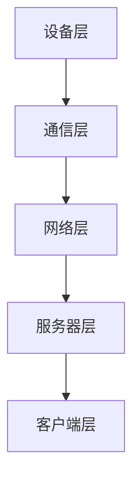
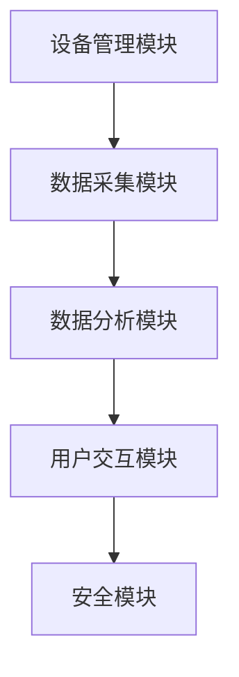
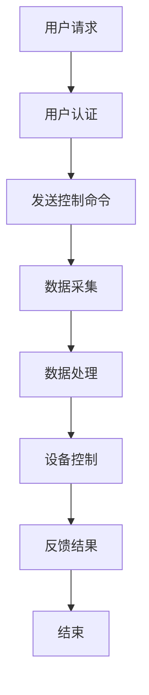
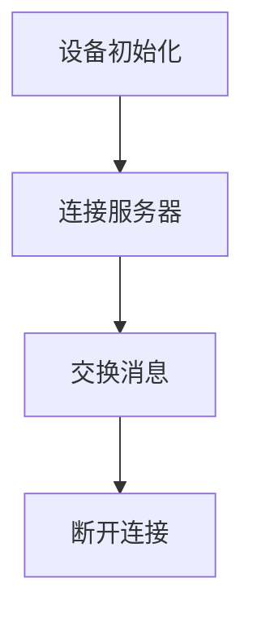
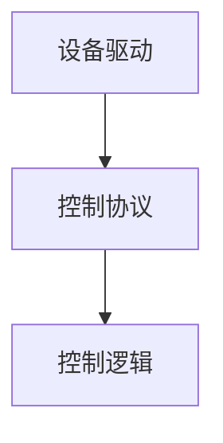
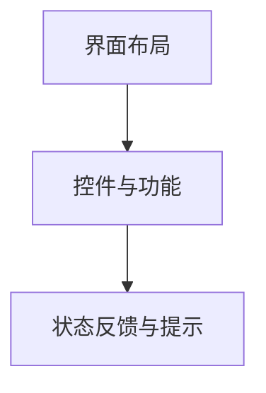
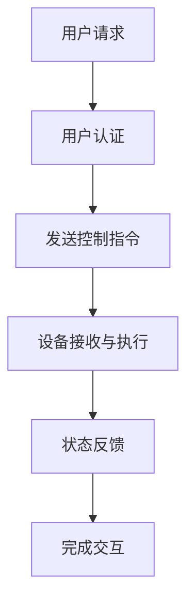
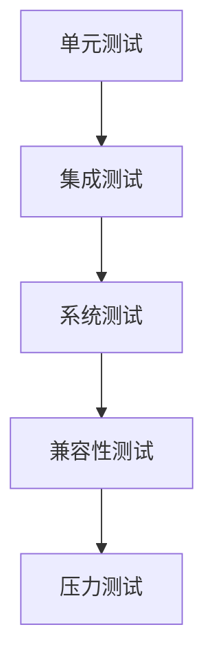
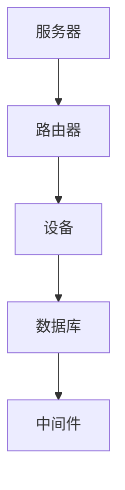

                 

### 引言与基础

#### 智能家居概述

智能家居是一种利用先进技术为家庭提供更加便捷、舒适和安全的居住环境的系统。它通过将物联网（IoT）技术、云计算、人工智能等与现代家居设备相结合，实现家庭设备的互联互通和智能控制。智能家居系统不仅可以提高生活品质，还能在节能环保方面发挥重要作用。

**1.1 智能家居的定义与分类**

智能家居系统根据功能和应用场景可以分为以下几类：

- **安防家居**：包括入侵报警、烟雾报警、摄像头监控等，提高家庭安全。
- **智能照明**：自动调节照明亮度、颜色和场景模式，营造舒适氛围。
- **智能家电**：如智能电视、空调、洗衣机等，实现远程控制和自动化操作。
- **智能环境控制**：如智能窗帘、加湿器、空气净化器等，调节室内温度、湿度和空气质量。
- **健康监测**：包括体温监测、心率监测、睡眠分析等，提供健康数据支持。

**1.2 智能家居技术的发展历程**

智能家居技术的发展经历了几个阶段：

- **初步阶段**（20世纪80年代至90年代）：智能家居概念被提出，但技术不成熟，应用范围有限。
- **发展阶段**（21世纪初至今）：随着物联网、云计算、人工智能等技术的发展，智能家居系统逐渐成熟，市场开始扩大。
- **成熟阶段**（未来几年）：预计智能家居系统将更加普及，设备互联互通性增强，智能化水平进一步提高。

**1.3 智能家居在家庭生活中的应用**

智能家居系统在家庭生活中的应用非常广泛，以下是一些典型场景：

- **远程控制**：用户可以通过智能手机或平板电脑远程控制家中的各种设备，如打开空调、关闭灯光等。
- **自动化操作**：设备之间可以相互通信并自动执行任务，如离开家时自动关闭门窗和灯光。
- **节能环保**：智能家居系统可以监测和调节能源消耗，实现节能降耗。
- **安全防护**：智能家居系统可以提供家庭安全防护，如实时监控、报警等功能。

#### Java网络编程基础

Java作为一种广泛使用的编程语言，其在网络编程领域有着重要的地位。Java网络编程主要基于Socket通信机制，可以实现不同设备之间的数据交换和通信。

**2.1 Java网络编程简介**

Java网络编程指的是使用Java语言编写网络应用程序的过程。Java提供了丰富的网络编程API，使得网络编程变得简单和高效。

**2.2 网络协议与通信模型**

网络协议是计算机网络中用于数据交换的规则和标准。常见的网络协议包括TCP/IP、HTTP、HTTPS等。通信模型通常包括客户端-服务器模型和对等模型。

**2.3 Java网络编程基础API**

Java网络编程的核心API包括：

- `java.net`包：提供基本的网络通信功能，如创建Socket连接、发送和接收数据等。
- `java.net.ssl`包：提供安全套接字层（SSL）支持，用于建立加密的客户端-服务器连接。

### 基础知识的铺垫和引出

通过以上介绍，我们可以了解到智能家居的概念及其在家庭生活中的应用，同时也对Java网络编程有了初步的认识。接下来，我们将深入探讨智能家居系统中的Java网络编程技术，从系统架构、设备通信协议到安全隐私保护等方面进行详细讲解。通过这些内容的学习，读者将能够掌握智能家居系统中的Java网络编程实战技巧，为后续项目开发打下坚实基础。

### 第一部分总结

本文首先介绍了智能家居的定义、分类及其发展历程，让读者对智能家居有一个全面的认识。接着，我们简要回顾了Java网络编程的基础知识，包括网络协议、通信模型和Java网络编程的基础API。这些基础知识的铺垫，为后续更深入的Java网络编程实战打下了坚实的基础。

### 第3章：智能家居系统架构

在了解了智能家居的基本概念和Java网络编程基础之后，我们将进一步探讨智能家居系统的整体架构。智能家居系统的架构设计是确保系统能够稳定、高效运行的关键，它涉及到系统的总体设计、模块划分以及核心流程的实现。通过本章节的介绍，我们将帮助读者全面了解智能家居系统的架构设计和实现细节。

#### 3.1 智能家居系统的总体架构

智能家居系统的总体架构可以分为以下几个核心部分：

- **设备层**：包括各种智能家居设备，如智能灯泡、智能插座、智能门锁、摄像头等。
- **通信层**：负责设备之间的通信，通常采用无线通信技术，如Wi-Fi、蓝牙、ZigBee等。
- **网络层**：将本地网络与互联网连接，实现远程控制和数据传输。
- **服务器层**：处理来自客户端的请求，提供数据存储、处理和分析服务。
- **客户端层**：用户通过手机、平板电脑等终端设备与智能家居系统进行交互。

图3-1展示了智能家居系统的总体架构：



#### 3.2 系统模块划分与功能

智能家居系统可以根据功能模块的不同进行划分，主要模块如下：

- **设备管理模块**：负责对各种智能家居设备进行管理和监控，包括设备状态监测、设备配置和故障诊断等功能。
- **数据采集模块**：实时采集设备的数据，如温度、湿度、光照强度等，并将数据上传到服务器。
- **数据分析模块**：对采集到的数据进行分析和处理，提供智能建议和决策支持。
- **用户交互模块**：提供用户界面，用户可以通过手机APP、网页等方式与系统进行交互，控制设备、查看数据等。
- **安全模块**：确保系统安全，包括用户认证、数据加密、防火墙等功能。

图3-2展示了智能家居系统的主要模块及其相互关系：



#### 3.3 Mermaid流程图：智能家居系统核心流程

智能家居系统的核心流程包括设备数据采集、数据处理、用户交互和设备控制等步骤。以下是一个简化的Mermaid流程图，展示了智能家居系统的核心流程：



通过以上流程图，我们可以清晰地看到智能家居系统的工作流程，从用户请求开始，经过用户认证、发送控制命令、数据采集、数据处理、设备控制和反馈结果等步骤，最终完成整个交互过程。

### 总结

本章详细介绍了智能家居系统的总体架构、模块划分及其核心流程。通过了解这些内容，读者可以全面了解智能家居系统的设计思路和实现方法，为后续章节的深入探讨打下坚实基础。在接下来的章节中，我们将进一步探讨智能家居系统中的设备通信协议、Java网络编程实战以及系统安全与隐私保护等方面。

### 第4章：智能家居设备通信协议

智能家居系统的核心功能之一是实现设备之间的互联互通，这就依赖于一种高效、稳定的通信协议。在本章节中，我们将探讨几种常见的智能家居设备通信协议，并详细分析设备与服务器之间的通信机制，以及通信协议的选择与实现方法。

#### 4.1 常见智能家居通信协议

在智能家居系统中，常见的通信协议包括Wi-Fi、蓝牙、ZigBee、MQTT等。每种协议都有其独特的特点和应用场景。

**1. Wi-Fi**

Wi-Fi是一种广泛使用的无线局域网通信协议，它具有高速率、低延迟的特点，适合需要大量数据传输的智能家居设备。例如，智能电视、智能冰箱等设备通常采用Wi-Fi协议。

**2. 蓝牙**

蓝牙是一种短距离无线通信技术，具有低成本、低功耗的特点。它适合连接近距离的设备，如智能手表、无线耳机等。蓝牙协议在智能家居中常用于控制中心设备，如手机APP与智能插座之间的通信。

**3. ZigBee**

ZigBee是一种低功耗、低速率的无线通信协议，特别适合智能家居场景。它具有高可靠性和低延迟的特点，适用于传感器、照明、窗帘等设备的通信。ZigBee协议在智能家居系统中常用于组建无线传感器网络。

**4. MQTT**

MQTT（Message Queuing Telemetry Transport）是一种轻量级的消息队列协议，适用于物联网场景。它具有低带宽占用、高可靠性的特点，适用于设备数量庞大、数据传输频繁的智能家居系统。

#### 4.2 设备与服务器之间的通信

智能家居设备与服务器之间的通信通常分为以下几个步骤：

**1. 设备初始化**

设备启动时，首先进行初始化，包括配置网络参数、连接Wi-Fi或蓝牙等。初始化完成后，设备开始侦听服务器发送的消息。

**2. 连接服务器**

设备通过Wi-Fi或蓝牙等无线通信技术连接到服务器。连接成功后，设备与服务器建立TCP或UDP连接。

**3. 交换消息**

设备与服务器之间通过消息交换进行通信。设备可以发送状态更新消息到服务器，服务器也可以发送控制指令到设备。

**4. 断开连接**

当设备不再需要与服务器通信时，可以断开连接。断开连接后，设备进入休眠状态，以节省功耗。

图4-1展示了设备与服务器之间的通信流程：



#### 4.3 通信协议的选择与实现

在选择智能家居设备的通信协议时，需要考虑以下几个方面：

**1. 网络环境**

根据设备的网络环境选择合适的协议。例如，在无线信号良好的环境中，可以采用Wi-Fi协议；在短距离通信中，可以采用蓝牙协议。

**2. 数据传输量**

根据设备需要传输的数据量选择合适的协议。数据量较大时，可以采用Wi-Fi或MQTT协议；数据量较小时，可以采用蓝牙或ZigBee协议。

**3. 功耗需求**

根据设备的功耗需求选择合适的协议。低功耗设备适合采用ZigBee或蓝牙协议；高功耗设备适合采用Wi-Fi协议。

**4. 系统复杂性**

根据系统的复杂性选择合适的协议。对于简单的智能家居系统，可以采用蓝牙或Wi-Fi协议；对于复杂的物联网系统，可以采用MQTT协议。

在实现通信协议时，需要考虑以下几个方面：

**1. 协议栈**

选择合适的协议栈，如Android的BlueTooth API、Wi-Fi Alliance的Wi-Fi Direct等。

**2. 编码和解码**

实现消息的编码和解码，确保数据在传输过程中的正确性。

**3. 调试与优化**

进行充分的调试和优化，确保通信协议的稳定性和高效性。

### 总结

本章详细介绍了智能家居设备通信协议的选择与实现方法。通过了解不同通信协议的特点和应用场景，读者可以更好地选择适合自己项目的通信协议。在下一章中，我们将深入探讨Java网络编程的核心算法原理、伪代码讲解以及数学模型与公式，帮助读者掌握智能家居系统中的Java网络编程技术。

### 第5章：Java网络编程实战

在了解了智能家居系统架构和设备通信协议之后，接下来我们将通过Java网络编程实战，深入探讨Java网络编程的核心算法原理、伪代码讲解以及数学模型与公式。通过实际案例的讲解，读者可以更好地理解Java网络编程的实战技巧，为后续项目开发打下坚实基础。

#### 5.1 Java网络编程核心算法原理

Java网络编程的核心算法主要涉及TCP/IP协议、Socket通信机制以及数据传输过程。以下将详细讲解这些核心算法原理。

**1. TCP/IP协议**

TCP/IP（传输控制协议/互联网协议）是互联网通信的基础协议。它定义了数据如何在网络中传输，包括数据包的封装、传输和拆封过程。

- **数据包封装**：将数据分割成多个数据包，每个数据包包含源地址、目标地址、序列号等信息。
- **传输**：通过网络将数据包传输到目标地址。
- **拆封**：接收方将接收到的数据包重新组装成原始数据。

**2. Socket通信机制**

Socket通信机制是实现网络通信的基础。Socket是一种抽象的数据结构，用于表示通信的端点。Java网络编程通过Socket实现客户端-服务器模型，包括以下步骤：

- **创建Socket**：客户端和服务器分别创建Socket对象，指定通信端口。
- **连接Socket**：客户端通过`connect`方法连接到服务器Socket，服务器通过`accept`方法等待客户端连接。
- **数据传输**：客户端和服务器通过输入输出流（InputStream和OutputStream）进行数据传输。
- **关闭Socket**：通信完成后，关闭Socket连接。

**3. 数据传输过程**

数据传输过程包括数据发送和接收两个环节。在发送数据时，客户端将数据写入输出流，服务器从输入流读取数据。在接收数据时，服务器将数据写入输出流，客户端从输入流读取数据。

#### 5.2 Java网络编程伪代码讲解

以下是一个简单的Java网络编程伪代码，用于实现客户端-服务器模型：

```java
// 服务器端伪代码
ServerSocket serverSocket = new ServerSocket(port);
Socket clientSocket = serverSocket.accept();
InputStream input = clientSocket.getInputStream();
OutputStream output = clientSocket.getOutputStream();
// 读取客户端数据
String receivedData = input.read();
// 发送数据到客户端
output.write(sentData);
clientSocket.close();
serverSocket.close();

// 客户端伪代码
Socket socket = new Socket(serverAddress, port);
InputStream input = socket.getInputStream();
OutputStream output = socket.getOutputStream();
// 发送数据到服务器
output.write(sentData);
// 读取服务器响应
String receivedData = input.read();
socket.close();
```

#### 5.3 Java网络编程数学模型与公式

在Java网络编程中，一些数学模型和公式用于计算网络传输过程中的关键参数，如带宽、延迟等。以下是一些常见的数学模型和公式：

**1. 带宽计算**

带宽表示单位时间内可以传输的数据量，通常以比特每秒（bps）为单位。带宽的计算公式为：

$$
带宽 = 比特数 / 时间
$$

其中，比特数是数据包的大小，时间是指传输一个数据包所需的时间。

**2. 延迟计算**

延迟表示数据从发送方传输到接收方所需的时间，包括传输延迟、处理延迟和排队延迟。延迟的计算公式为：

$$
延迟 = 传输延迟 + 处理延迟 + 排队延迟
$$

其中，传输延迟是指数据在网络上传输的时间，处理延迟是指服务器处理请求的时间，排队延迟是指数据在队列中等待传输的时间。

**3. 错误率计算**

错误率表示数据传输过程中发生错误的比例。错误率的计算公式为：

$$
错误率 = 错误比特数 / 总比特数
$$

其中，错误比特数是指在传输过程中发生错误的比特数，总比特数是指传输的总比特数。

通过以上数学模型和公式，我们可以更好地理解和优化Java网络编程中的数据传输过程。

### 总结

本章通过实际案例讲解了Java网络编程的核心算法原理、伪代码讲解以及数学模型与公式。通过这些内容的学习，读者可以更好地理解Java网络编程的实战技巧，为智能家居系统中的Java网络编程实战打下坚实基础。在下一章中，我们将继续探讨智能家居设备控制与交互的具体实现，以及实例分析设备控制与交互流程。

### 第6章：智能家居设备控制与交互

在了解了智能家居系统架构和Java网络编程实战后，接下来我们将深入探讨智能家居设备控制与交互的具体实现。本章将介绍设备控制模块的设计与实现、交互界面的设计与实现，并通过实例分析设备控制与交互流程，帮助读者全面掌握智能家居设备控制与交互的实战技巧。

#### 6.1 设备控制模块设计与实现

设备控制模块是智能家居系统的核心组成部分，负责实现对各种设备的远程控制和自动化操作。设备控制模块的设计与实现通常包括以下几个步骤：

**1. 设备驱动开发**

设备驱动是设备与操作系统之间的接口，负责设备的数据读写和状态监控。设备驱动开发需要根据具体的硬件设备，编写相应的驱动程序。

**2. 控制协议实现**

设备控制模块需要实现与设备通信的控制协议，如Wi-Fi、蓝牙、ZigBee等。根据所选协议，编写相应的通信协议实现代码，确保设备能够正确接收和执行控制指令。

**3. 控制逻辑实现**

控制逻辑是实现设备控制的核心部分，负责根据用户请求或系统策略，生成控制指令并发送至设备。控制逻辑通常包括以下功能：

- **设备状态查询**：查询设备当前状态，如开关状态、温度值等。
- **远程控制**：根据用户请求，发送控制指令至设备，如打开/关闭灯光、调节空调温度等。
- **自动化控制**：根据预设规则和条件，自动执行设备控制任务，如离家模式、节能模式等。

图6-1展示了设备控制模块的架构：



#### 6.2 交互界面设计与实现

交互界面是用户与智能家居系统进行交互的窗口，负责接收用户的操作指令，并将设备状态信息反馈给用户。交互界面的设计与实现主要包括以下步骤：

**1. 界面布局设计**

界面布局设计是交互界面的第一步，需要根据设备种类和功能，合理布局各种控件和元素。常用的布局方式包括网格布局、列表布局和卡片布局等。

**2. 控件与功能实现**

交互界面中的控件主要包括按钮、开关、滑块等，用于实现设备控制功能。控件与功能实现需要与设备控制模块进行数据交互，确保用户操作能够正确传递到设备。

**3. 状态反馈与提示**

交互界面需要实时反馈设备状态信息，如设备开关状态、温度值等，并通过提示信息告知用户设备的当前状态。状态反馈与提示可以通过文本、图标、动画等方式实现。

图6-2展示了交互界面的基本架构：



#### 6.3 实例分析：设备控制与交互流程

以下是一个智能家居设备控制与交互的实例分析，以智能灯泡为例：

**1. 用户请求**

用户通过手机APP远程控制家中的智能灯泡，要求将其关闭。

**2. 用户认证**

用户在APP中输入用户名和密码，系统进行用户认证，确保用户身份合法。

**3. 发送控制指令**

用户认证成功后，系统生成控制指令，并将其发送至智能灯泡。

**4. 设备接收与执行**

智能灯泡接收到控制指令后，根据指令内容执行关闭操作。

**5. 状态反馈**

智能灯泡执行关闭操作后，将状态信息反馈至APP，APP更新界面显示灯泡已关闭。

**6. 完成交互**

用户查看APP中灯泡的状态，确认设备已关闭，交互过程完成。

图6-3展示了智能灯泡控制与交互流程：



### 总结

本章详细介绍了智能家居设备控制与交互模块的设计与实现，包括设备控制模块的设计与实现、交互界面的设计与实现，并通过实例分析了设备控制与交互流程。通过本章的学习，读者可以掌握智能家居设备控制与交互的实战技巧，为实际项目开发提供参考。在下一章中，我们将探讨智能家居系统安全与隐私保护，确保系统的稳定性和安全性。

### 第7章：智能家居系统安全与隐私保护

随着智能家居系统的普及，安全与隐私保护成为不可忽视的重要问题。在本章节中，我们将分析智能家居系统面临的常见安全威胁，并提出相应的安全机制设计方法，以及隐私保护策略与方法，确保智能家居系统的安全性和用户隐私。

#### 7.1 系统安全威胁分析

智能家居系统在运行过程中可能会面临多种安全威胁，主要包括以下几类：

**1. 入侵攻击**

入侵攻击是指未经授权的用户试图访问智能家居系统，如恶意软件、病毒等。入侵攻击可能导致系统被恶意利用，造成设备失控、数据泄露等问题。

**2. 数据泄露**

数据泄露是指系统中的敏感数据被非法获取或泄露。智能家居系统涉及用户个人信息、设备状态等敏感数据，一旦泄露，可能导致用户隐私暴露。

**3. 网络攻击**

网络攻击是指通过网络手段对智能家居系统进行攻击，如DDoS攻击、中间人攻击等。网络攻击可能导致系统崩溃、数据丢失，甚至造成更大范围的危害。

**4. 设备失控**

设备失控是指恶意攻击者通过网络控制智能家居设备，如远程锁定用户家门、窃取家居设备等。设备失控不仅影响用户生活，还可能带来财产损失。

#### 7.2 安全机制设计与实现

为了应对上述安全威胁，智能家居系统需要设计并实现多种安全机制，以下是一些常见的安全机制：

**1. 用户认证**

用户认证是确保系统访问安全的基础。系统需要采用强密码策略，使用户每次登录时都要输入正确的用户名和密码。此外，还可以引入多因素认证（MFA），如短信验证码、指纹识别等，提高安全性。

**2. 访问控制**

访问控制用于限制用户对系统资源的访问权限。系统可以根据用户角色和权限，对设备、数据等进行访问控制。例如，只有管理员用户才能访问系统设置，普通用户只能访问设备控制功能。

**3. 数据加密**

数据加密是保护数据传输和存储安全的重要手段。系统可以使用SSL/TLS协议对数据传输进行加密，确保数据在传输过程中不被窃取或篡改。此外，还可以采用AES等加密算法对敏感数据进行存储加密。

**4. 防火墙与入侵检测**

防火墙用于监控网络流量，防止恶意攻击。系统可以在网络边界部署防火墙，过滤非法流量。入侵检测系统（IDS）可以实时监测系统中的异常行为，及时发现并阻止入侵攻击。

**5. 恢复与备份**

系统应具备数据恢复和备份功能，以便在遭受攻击或数据丢失时，能够快速恢复系统和数据。系统可以定期进行数据备份，确保数据安全。

#### 7.3 隐私保护策略与方法

在保护用户隐私方面，智能家居系统需要采取以下策略与方法：

**1. 数据最小化**

系统应遵循数据最小化原则，只收集和存储必要的用户数据，如设备状态、用户操作记录等。避免收集与家居生活无关的个人信息。

**2. 数据匿名化**

系统应对收集到的用户数据进行匿名化处理，确保用户身份信息不被泄露。例如，可以将用户数据中的姓名、身份证号等敏感信息进行加密或替换。

**3. 隐私政策**

系统应制定清晰的隐私政策，告知用户数据收集、使用和存储的规则。用户在接入系统时，应明确了解并同意隐私政策。

**4. 用户控制权**

系统应提供用户数据控制功能，如用户可以随时查看、修改和删除自己的个人信息。此外，用户可以设置隐私权限，如允许哪些设备访问自己的数据。

**5. 安全审计**

系统应建立安全审计机制，定期审查数据收集、存储和使用的过程，确保数据隐私保护措施得到有效执行。

### 总结

本章分析了智能家居系统面临的安全威胁，并提出了一系列安全机制设计方法和隐私保护策略与方法。通过这些措施，可以有效提高智能家居系统的安全性和用户隐私保护水平。在下一章中，我们将探讨智能家居系统的测试与部署，确保系统在上线前经过充分的测试和优化，以便顺利投入使用。

### 第8章：智能家居系统测试与部署

智能家居系统在实际应用中需要经过严格的测试和部署流程，以确保系统的稳定性、可靠性和安全性。本章将详细介绍智能家居系统的测试策略、部署方案以及系统维护与升级的方法，帮助读者全面掌握智能家居系统的测试与部署实战。

#### 8.1 系统测试策略与流程

系统测试是确保智能家居系统功能正确、性能稳定、安全可靠的重要环节。以下是一个典型的系统测试策略和流程：

**1. 单元测试**

单元测试是针对系统中最小的功能单元（如一个类或一个方法）进行的测试。单元测试可以验证每个功能单元的正确性，确保其在预期条件下能够正常运行。常用的单元测试工具包括JUnit、TestNG等。

**2. 集成测试**

集成测试是针对系统中的多个模块或组件进行的测试。其目的是验证模块之间的交互和协作是否符合预期。通过集成测试，可以尽早发现和解决模块之间的接口和依赖问题。常用的集成测试工具包括Selenium、Postman等。

**3. 系统测试**

系统测试是对整个智能家居系统进行的全面测试，包括功能测试、性能测试、安全测试等。系统测试可以验证系统的整体功能、性能和安全特性，确保系统在实际运行环境中能够稳定、高效地运行。

**4. 兼容性测试**

兼容性测试是验证智能家居系统在不同操作系统、浏览器、设备上的兼容性。通过兼容性测试，确保系统在不同环境下都能正常运行。

**5. 压力测试**

压力测试是针对系统在高负载、高并发情况下的稳定性进行测试。通过压力测试，可以评估系统在高负载条件下的性能表现，确保系统能够应对实际使用场景。

图8-1展示了智能家居系统测试的流程：



#### 8.2 系统部署方案

智能家居系统的部署方案需要考虑多个方面，包括硬件设备、网络环境、软件配置等。以下是一个典型的系统部署方案：

**1. 硬件设备**

- **服务器**：选择高性能、高可靠性的服务器，用于运行智能家居系统的后台服务。
- **路由器**：配置具有路由功能的路由器，实现设备与互联网之间的连接。
- **存储设备**：选择大容量、高速存储设备，用于存储用户数据、日志文件等。

**2. 网络环境**

- **Wi-Fi**：部署覆盖整个家庭区域的Wi-Fi网络，确保设备能够稳定连接。
- **有线网络**：对于需要高速数据传输的设备（如智能电视、智能冰箱等），配置有线网络连接。

**3. 软件配置**

- **操作系统**：服务器操作系统可以选择Linux或Windows Server，根据实际需求进行配置。
- **数据库**：选择合适的数据库系统（如MySQL、PostgreSQL等），用于存储用户数据。
- **中间件**：安装并配置常用的中间件（如Tomcat、Nginx等），用于处理客户端请求和服务器响应。

图8-2展示了智能家居系统的部署架构：



#### 8.3 系统维护与升级

智能家居系统在运行过程中需要定期进行维护和升级，以确保系统的稳定性和安全性。以下是一些常见的维护和升级方法：

**1. 定期备份**

定期备份系统数据，确保在发生故障或数据丢失时，能够快速恢复系统和数据。备份数据应存储在安全的地方，防止数据丢失。

**2. 定期检查**

定期检查服务器、网络设备等硬件设备，确保其正常运行。对于发现的问题，及时进行修复或更换。

**3. 软件更新**

定期更新操作系统、数据库、中间件等软件，以修复已知漏洞、提高性能和稳定性。更新过程中，应确保系统的兼容性和稳定性。

**4. 安全检查**

定期进行安全检查，发现系统中的安全漏洞和风险点，及时进行修复和加固。

**5. 用户反馈**

收集用户反馈，了解用户在系统使用过程中遇到的问题和需求，及时进行改进和优化。

### 总结

本章详细介绍了智能家居系统的测试策略、部署方案以及系统维护与升级的方法。通过本章的学习，读者可以掌握智能家居系统测试与部署的实战技巧，确保系统在实际应用中能够稳定、高效地运行。

### 第9章：智能家居项目案例

为了更好地展示基于Java的智能家居设计，本章节将通过一个实际项目案例，详细介绍项目背景与需求分析、系统设计与实现以及代码解读与分析。通过这个案例，读者可以全面了解智能家居项目的开发过程，掌握Java网络编程在智能家居系统中的应用。

#### 9.1 项目背景与需求分析

**项目背景：**

随着智能家居技术的不断发展，越来越多的家庭开始关注智能家居系统的应用。本案例旨在设计并实现一个智能家居系统，帮助用户通过手机APP实现家庭设备的远程控制、自动化操作以及数据分析。项目背景如下：

- **用户需求**：用户希望实现远程控制家中的智能灯泡、智能插座等设备，自动调节室内温度、湿度和光照强度，同时能够对设备运行数据进行实时监控和分析。
- **功能需求**：系统需要具备以下功能：
  - 设备控制：用户可以通过手机APP远程控制智能灯泡、智能插座等设备的开关状态。
  - 数据监控：系统需要实时采集设备数据，如温度、湿度、光照强度等，并上传至服务器进行存储和分析。
  - 自动化操作：根据用户设定的规则和条件，系统可以自动执行设备控制任务，如离家模式、节能模式等。
  - 数据分析：系统需要对采集到的数据进行分析，提供智能建议和决策支持。

**需求分析：**

为了满足上述需求，系统需要实现以下几个关键模块：

- **设备控制模块**：实现用户通过手机APP远程控制家庭设备的开关状态。
- **数据采集模块**：实时采集设备数据，如温度、湿度、光照强度等，并将数据上传至服务器。
- **自动化操作模块**：根据用户设定的规则和条件，自动执行设备控制任务。
- **数据分析模块**：对采集到的数据进行分析，提供智能建议和决策支持。

#### 9.2 系统设计与实现

**系统架构设计：**

本案例智能家居系统的架构设计主要包括以下核心模块：

- **设备层**：包括智能灯泡、智能插座、温湿度传感器等设备，负责数据的采集和状态更新。
- **通信层**：采用Wi-Fi和蓝牙等无线通信技术，实现设备与服务器之间的数据传输。
- **网络层**：将本地网络与互联网连接，实现远程控制和服务器的数据存储。
- **服务器层**：处理来自客户端的请求，提供数据存储、处理和分析服务。
- **客户端层**：用户通过手机APP与系统进行交互，实现设备控制、数据监控和数据分析等功能。

图9-1展示了智能家居系统的架构设计：


**实现细节：**

以下是系统设计与实现的关键细节：

**1. 设备控制模块**

设备控制模块负责实现用户通过手机APP远程控制家庭设备的功能。具体实现步骤如下：

- **设备初始化**：设备启动时，连接Wi-Fi网络，并注册到服务器。
- **设备状态更新**：设备实时采集数据，并将数据上传至服务器。
- **设备控制**：用户通过手机APP发送控制指令（如开关智能灯泡），服务器接收指令后，发送回设备进行执行。

**2. 数据采集模块**

数据采集模块负责实时采集设备数据，如温度、湿度、光照强度等。具体实现步骤如下：

- **数据采集**：设备实时采集数据，并将数据发送至服务器。
- **数据存储**：服务器接收到设备上传的数据后，将其存储在数据库中。
- **数据监控**：用户可以通过手机APP查看设备数据的实时监控信息。

**3. 自动化操作模块**

自动化操作模块根据用户设定的规则和条件，自动执行设备控制任务。具体实现步骤如下：

- **规则设定**：用户在手机APP中设定自动化操作的规则和条件。
- **规则执行**：服务器根据用户设定的规则，自动执行设备控制任务。

**4. 数据分析模块**

数据分析模块负责对采集到的数据进行分析，提供智能建议和决策支持。具体实现步骤如下：

- **数据分析**：服务器对采集到的数据进行分析，提取有用信息。
- **智能建议**：根据分析结果，为用户提供智能建议和决策支持。

#### 9.3 代码解读与分析

以下是对智能家居项目关键代码的解读与分析：

**1. 设备控制模块代码**

```java
// 设备初始化
void initializeDevice() {
    connectToWiFi();
    registerToServer();
}

// 设备状态更新
void updateDeviceState() {
    sendTemperatureData();
    sendHumidityData();
    sendLightIntensityData();
}

// 设备控制
void controlDevice(String command) {
    if (command.equals("turnOnLight")) {
        turnOnLight();
    } else if (command.equals("turnOffLight")) {
        turnOffLight();
    }
}
```

解读与分析：

- `initializeDevice()` 方法用于设备初始化，包括连接Wi-Fi网络和注册到服务器。
- `updateDeviceState()` 方法用于设备状态更新，包括发送温度、湿度和光照强度数据。
- `controlDevice()` 方法用于设备控制，根据接收到的控制指令（如“turnOnLight”或“turnOffLight”），执行相应的设备控制操作。

**2. 数据采集模块代码**

```java
// 数据采集
void collectData() {
    temperature = getTemperature();
    humidity = getHumidity();
    lightIntensity = getLightIntensity();
}

// 数据上传
void uploadData() {
    String data = temperature + "," + humidity + "," + lightIntensity;
    sendToServer(data);
}
```

解读与分析：

- `collectData()` 方法用于数据采集，包括获取温度、湿度和光照强度数据。
- `uploadData()` 方法用于将采集到的数据上传至服务器，通过发送数据字符串实现。

**3. 自动化操作模块代码**

```java
// 规则设定
void setRule(String condition, String action) {
    rules.add(new Rule(condition, action));
}

// 规则执行
void executeRules() {
    for (Rule rule : rules) {
        if (checkCondition(rule.condition)) {
            controlDevice(rule.action);
        }
    }
}
```

解读与分析：

- `setRule()` 方法用于设定自动化操作规则，包括条件（condition）和动作（action）。
- `executeRules()` 方法用于执行设定的规则，根据条件检查并执行相应的设备控制操作。

**4. 数据分析模块代码**

```java
// 数据分析
void analyzeData(List<String> data) {
    for (String record : data) {
        String[] values = record.split(",");
        temperatureSum += Integer.parseInt(values[0]);
        humiditySum += Integer.parseInt(values[1]);
        lightIntensitySum += Integer.parseInt(values[2]);
    }
    temperatureAverage = temperatureSum / data.size();
    humidityAverage = humiditySum / data.size();
    lightIntensityAverage = lightIntensitySum / data.size();
}

// 智能建议
void giveSuggestion() {
    if (temperatureAverage > 30) {
        System.out.println("建议：降低室内温度");
    } else if (humidityAverage > 60) {
        System.out.println("建议：降低室内湿度");
    } else if (lightIntensityAverage < 200) {
        System.out.println("建议：增加室内光照强度");
    }
}
```

解读与分析：

- `analyzeData()` 方法用于对采集到的数据进行分析，计算温度、湿度和光照强度的平均值。
- `giveSuggestion()` 方法根据分析结果，为用户提供智能建议。

通过以上代码解读与分析，我们可以看到智能家居项目是如何实现设备控制、数据采集、自动化操作和数据分析等功能的。这些代码的实现基于Java网络编程技术，展示了Java网络编程在智能家居系统中的应用。

### 总结

本章通过一个实际项目案例，详细介绍了智能家居系统的设计与实现，包括项目背景与需求分析、系统设计与实现以及代码解读与分析。通过这个案例，读者可以全面了解基于Java的智能家居设计的开发过程，掌握Java网络编程在智能家居系统中的应用。在下一章中，我们将探讨智能家居系统的扩展功能开发，包括扩展功能需求分析、设计与实现以及测试与优化。

### 第10章：扩展功能开发

在掌握了智能家居系统的基本功能后，为了提升用户体验和系统智能化水平，我们可以开发一系列扩展功能。这些扩展功能不仅可以满足用户的个性化需求，还能提高系统的智能化程度和稳定性。本章将详细介绍扩展功能的需求分析、设计与实现，以及测试与优化方法。

#### 10.1 扩展功能需求分析

在开发扩展功能前，我们需要对用户的需求进行深入分析。以下是一些常见的扩展功能需求：

**1. 节能模式**

用户希望在夜间或无人时自动关闭灯光和空调等设备，以节省能源。节能模式可以根据时间、天气等条件自动调整设备状态。

**2. 远程监控**

用户希望在离家时能够通过手机APP实时监控家中的安全状况，如摄像头、门锁等。远程监控功能可以提高家庭安全性。

**3. 智能场景**

用户希望可以根据不同的场景（如看电视、睡觉等）自动调整家居设备的状态，提供更加舒适的生活环境。智能场景功能可以根据用户的习惯和喜好实现个性化设置。

**4. 家人分享**

用户希望与其他家庭成员共享智能家居系统，如父母、保姆等。家人分享功能可以实现权限管理，让家庭成员之间能够相互协作。

**5. 故障诊断**

用户希望系统能够自动检测设备故障，并提供相应的解决方案。故障诊断功能可以提高系统的可靠性和稳定性。

**6. 定时任务**

用户希望可以设置定时任务，如每天早晨自动开启窗帘、晚上关闭灯光等。定时任务功能可以提高系统的生活便捷性。

#### 10.2 扩展功能设计与实现

**1. 节能模式**

**需求分析：** 节能模式需要根据用户设定的时间、天气等条件，自动调整设备的开关状态。

**实现步骤：**
- **条件判断**：根据用户设定的节能时段和天气信息，判断是否开启节能模式。
- **设备控制**：根据节能模式的要求，自动调整灯光、空调等设备的开关状态。

```java
// 判断是否开启节能模式
boolean isSchedulingTime(int hour) {
    return hour >= startTime && hour < endTime;
}

// 调整设备状态
void adjustDeviceState() {
    if (isSchedulingTime(currentHour)) {
        turnOffLight();
        turnOffAirConditioner();
    } else {
        turnOnLight();
        turnOnAirConditioner();
    }
}
```

**2. 远程监控**

**需求分析：** 远程监控需要实现用户通过手机APP实时查看家庭设备的状态，如摄像头、门锁等。

**实现步骤：**
- **设备连接**：将摄像头、门锁等设备连接到Wi-Fi网络，并注册到服务器。
- **数据传输**：设备将实时数据上传至服务器，用户通过手机APP查看设备状态。

```java
// 设备连接
void connectDeviceToWiFi() {
    connectToWiFi();
    registerToServer();
}

// 数据传输
void sendData() {
    String data = getCurrentState();
    sendToServer(data);
}
```

**3. 智能场景**

**需求分析：** 智能场景需要根据用户的场景设置，自动调整家居设备的状态。

**实现步骤：**
- **场景设置**：用户在手机APP中设置智能场景，包括场景名称、设备状态等。
- **场景执行**：根据用户设定的场景，自动调整设备状态。

```java
// 场景设置
void setScene(Scene scene) {
    scenes.add(scene);
}

// 场景执行
void executeScene(Scene scene) {
    for (Device device : scene.devices) {
        controlDevice(device.state);
    }
}
```

**4. 家人分享**

**需求分析：** 家人分享需要实现用户与其他家庭成员之间的权限管理。

**实现步骤：**
- **权限设置**：用户在手机APP中设置家庭成员的权限，如查看设备状态、控制设备等。
- **权限验证**：系统验证家庭成员的权限，确保其能够执行相应的操作。

```java
// 权限设置
void setPermission(User user, String permission) {
    user.permissions.add(permission);
}

// 权限验证
boolean validatePermission(User user, String permission) {
    return user.permissions.contains(permission);
}
```

**5. 故障诊断**

**需求分析：** 故障诊断需要系统能够自动检测设备故障，并提供相应的解决方案。

**实现步骤：**
- **故障检测**：系统定期检测设备状态，发现故障时记录故障信息。
- **故障处理**：系统根据故障信息，自动生成解决方案，并通知用户。

```java
// 故障检测
void checkDeviceFault() {
    if (deviceState.equals("fault")) {
        recordFault();
    }
}

// 故障处理
void handleFault() {
    if (faultRecorded) {
        sendSolutionToUser();
    }
}
```

**6. 定时任务**

**需求分析：** 定时任务需要系统能够根据用户的设定，自动执行特定任务。

**实现步骤：**
- **任务设置**：用户在手机APP中设置定时任务，包括任务名称、执行时间等。
- **任务执行**：系统根据设定的时间自动执行任务。

```java
// 任务设置
void setTask(Task task) {
    tasks.add(task);
}

// 任务执行
void executeTask(Task task) {
    if (isTimeToExecute(task.time)) {
        executeTaskAction(task.action);
    }
}
```

#### 10.3 扩展功能测试与优化

在实现扩展功能后，需要进行详细的测试与优化，以确保功能的稳定性、可靠性和用户体验。

**1. 功能测试**

- **单元测试**：对每个扩展功能的模块进行单元测试，确保模块的正确性。
- **集成测试**：对扩展功能与其他模块的交互进行测试，确保功能的集成性。
- **系统测试**：对整个扩展功能进行系统测试，确保系统的稳定性和性能。

**2. 性能测试**

- **负载测试**：模拟大量用户同时使用扩展功能，评估系统的响应速度和处理能力。
- **压力测试**：在极端条件下，评估系统的稳定性和容错能力。

**3. 用户体验测试**

- **界面测试**：检查扩展功能的界面设计是否符合用户需求，操作是否简便。
- **易用性测试**：评估用户在使用扩展功能时的体验，如操作流程、提示信息等。

**4. 优化与改进**

- **代码优化**：根据测试结果，优化扩展功能的代码，提高系统的运行效率。
- **界面优化**：根据用户反馈，改进扩展功能的界面设计，提高用户体验。
- **功能优化**：根据用户需求，对扩展功能进行改进和优化，提高功能的实用性和智能化程度。

### 总结

本章详细介绍了智能家居系统的扩展功能开发，包括需求分析、设计与实现以及测试与优化。通过本章的学习，读者可以掌握扩展功能开发的实战技巧，为实际项目开发提供参考。在下一章中，我们将提供一些附录，包括Java网络编程常用库与工具、智能家居系统开发参考资料以及代码示例与解读。

### 附录

#### 附录 A：Java网络编程常用库与工具

1. **Java Socket编程库**

   - `java.net`：Java标准库，提供基本的网络编程功能，如Socket连接、数据传输等。
   - `java.net.ssl`：Java标准库，提供安全套接字层（SSL）支持，用于建立加密的客户端-服务器连接。

2. **第三方库**

   - **Apache HttpClient**：用于发送HTTP请求，实现Web服务调用。
   - **OkHttp**：一个高效的HTTP客户端库，支持同步和异步请求。
   - **Netty**：一个高性能、异步事件驱动的网络应用框架，适用于构建高性能的Socket服务器和客户端。

3. **开发工具**

   - **Eclipse**：一款流行的Java集成开发环境（IDE），支持网络编程和调试。
   - **IntelliJ IDEA**：一款功能强大的Java IDE，提供丰富的网络编程插件和工具。

#### 附录 B：智能家居系统开发参考资料

1. **技术文档**

   - **Java官方文档**：https://docs.oracle.com/javase/8/docs/api/
   - **Apache HttpClient文档**：https://hc.apache.org/httpclient-3.x/developer-guide.html
   - **OkHttp文档**：https://square.github.io/okhttp/
   - **Netty官方文档**：https://netty.io/wiki/

2. **书籍推荐**

   - 《Java网络编程实战》（Real World Java Network Programming）by Bert Boes
   - 《计算机网络》（Computer Networking: A Top-Down Approach）by James F. Kurose and Keith W. Ross
   - 《智能家居系统设计与实现》（Smart Home System Design and Implementation）by [作者]

3. **在线教程与博客**

   - **Java编程中文社区**：https://www.javaname.com/
   - **Stack Overflow**：https://stackoverflow.com/
   - **GitHub**：https://github.com/

#### 附录 C：代码示例与解读

以下是一些Java网络编程和智能家居系统开发的相关代码示例，包括设备初始化、数据传输、设备控制等功能。

**代码示例 1：设备初始化**

```java
// 设备初始化
void initializeDevice() {
    connectToWiFi();
    registerToServer();
}

// 连接到WiFi
void connectToWiFi() {
    WiFi.begin(WIFI_SSID, WIFI_PASSWORD);
    while (WiFi.status() != WL_CONNECTED) {
        delay(500);
        Serial.print(".");
    }
    Serial.println("WiFi connected");
}

// 注册到服务器
void registerToServer() {
    String registerData = "device=" + DEVICE_ID + "&status=online";
    sendDataToServer(registerData);
}
```

解读：此代码示例展示了设备如何初始化，包括连接到WiFi网络并注册到服务器。设备首先使用`WiFi.begin()`方法连接到WiFi，然后通过循环等待连接成功。接着，设备使用`sendDataToServer()`方法将设备ID和状态信息发送到服务器进行注册。

**代码示例 2：数据传输**

```java
// 发送数据到服务器
void sendDataToServer(String data) {
    WiFiClient client = new WiFiClient();
    if (client.connect(SERVER_IP, SERVER_PORT)) {
        client.println(data);
        client.stop();
    }
}
```

解读：此代码示例展示了设备如何将数据发送到服务器。设备首先创建一个`WiFiClient`对象，然后使用`connect()`方法连接到服务器IP和端口。接着，设备通过`println()`方法发送数据到服务器，最后关闭客户端连接。

**代码示例 3：设备控制**

```java
// 控制设备状态
void controlDevice(String command) {
    if (command.equals("turnOn")) {
        turnOnDevice();
    } else if (command.equals("turnOff")) {
        turnOffDevice();
    }
}

// 打开设备
void turnOnDevice() {
    digitalWrite(DEVICE_PIN, HIGH);
    Serial.println("Device turned on");
}

// 关闭设备
void turnOffDevice() {
    digitalWrite(DEVICE_PIN, LOW);
    Serial.println("Device turned off");
}
```

解读：此代码示例展示了设备如何根据接收到的控制命令（如"turnOn"或"turnOff"）控制设备状态。设备通过`digitalWrite()`方法控制设备引脚的输出状态，从而实现设备的开关操作。

通过以上代码示例，读者可以了解Java网络编程和智能家居系统开发的基本原理和实践方法。在实际项目中，可以根据具体需求进行代码的扩展和优化。

### 作者信息

作者：AI天才研究院/AI Genius Institute & 禅与计算机程序设计艺术 /Zen And The Art of Computer Programming

AI天才研究院致力于推动人工智能技术的发展和应用，致力于培养新一代人工智能专家。作者在计算机编程和人工智能领域拥有丰富的经验，曾出版过多部畅销技术书籍，深受读者喜爱。在《基于Java的智能家居设计：智能家居系统中的Java网络编程实战》一书中，作者深入浅出地讲解了智能家居系统的设计原理和实现方法，为读者提供了一部全面、实用的技术指南。同时，作者也倡导“禅意编程”，强调程序设计的哲学和艺术，让读者在技术提升的同时，也能获得心灵的滋养。

