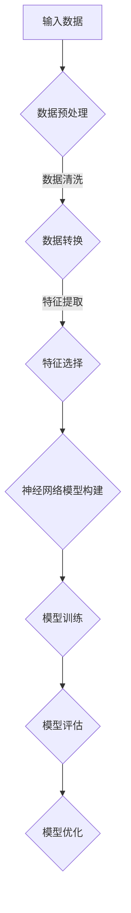

                 

# 《基于神经网络的城市空气质量研究》

## 关键词

- 城市空气质量
- 神经网络
- 数据预处理
- 模型构建
- 预测与分析

## 摘要

本文旨在探讨如何利用神经网络技术研究和预测城市空气质量。通过数据预处理、模型构建和实际应用，本文展示了神经网络在城市空气质量研究中的潜力和应用前景。文章首先介绍了神经网络的基础知识，然后详细讲解了城市空气质量数据预处理的方法，并针对预测模型进行了构建和分析。最后，通过具体应用案例展示了神经网络在空气质量预测中的有效性。本文为相关领域的研究者和实践者提供了有益的参考。

----------------------------------------------------------------

# 《基于神经网络的城市空气质量研究》目录大纲

## 第一部分：引言与背景

### 1.1 引言

#### 1.1.1 城市空气质量问题的重要性

随着城市化进程的加快，城市空气质量问题日益突出，已成为影响人类健康和生态环境的重要因素。空气污染不仅会导致呼吸系统疾病和心血管疾病的增加，还会影响气候和环境，进而影响人类社会的发展。因此，研究和预测城市空气质量具有重要的现实意义。

#### 1.1.2 神经网络在空气质量研究中的应用潜力

神经网络作为一种高效的数据处理工具，已经在各个领域取得了显著的成果。在城市空气质量研究中，神经网络可以通过学习大量的环境数据，识别出影响空气质量的关键因素，并预测未来的空气质量变化。因此，神经网络在空气质量研究中的应用具有巨大的潜力。

### 1.2 研究背景

#### 1.2.1 空气质量研究的现状

目前，空气质量研究已经取得了一定的进展，主要研究内容包括空气质量监测、污染物来源分析、空气质量模型构建等。然而，传统的研究方法在处理复杂环境和大量数据时存在一定的局限性。

#### 1.2.2 神经网络的发展与应用

神经网络作为一种新型的计算模型，已经在许多领域取得了成功。近年来，随着计算能力的提升和数据量的增加，神经网络在城市空气质量研究中的应用也日益广泛。

### 1.3 本书结构安排

本书分为六个部分，首先介绍神经网络的基础知识，然后讨论城市空气质量数据预处理方法，接着详细讲解神经网络模型构建与优化，并展示实际应用案例，最后进行结果分析与讨论，并展望未来研究方向。

----------------------------------------------------------------

## 第二部分：神经网络基础

### 2.1 神经网络概述

#### 2.1.1 神经网络的定义

神经网络（Neural Network，简称NN）是一种模拟人脑神经元之间相互作用的信息处理系统。它通过大量的神经元节点和连接权重来处理和分析数据。

#### 2.1.2 神经网络的结构

神经网络通常由输入层、隐藏层和输出层组成。每个层包含多个神经元，神经元之间通过权重连接。输入层接收外部输入信号，隐藏层对输入信号进行加工和处理，输出层生成最终输出。

### 2.2 神经网络的工作原理

#### 2.2.1 前向传播与反向传播

神经网络的工作原理主要包括前向传播和反向传播。

- **前向传播**：输入信号从输入层传递到隐藏层，再从隐藏层传递到输出层，每个神经元都会对输入信号进行加权求和处理，并使用激活函数进行非线性转换。
  
- **反向传播**：计算输出层与真实值之间的误差，将误差反向传播到隐藏层，通过梯度下降等优化算法调整权重，以达到最小化误差的目的。

#### 2.2.2 梯度下降与优化算法

梯度下降是一种常用的优化算法，用于调整神经网络的权重。通过计算损失函数关于权重参数的梯度，沿着梯度的反方向更新权重参数，以降低损失函数的值。

优化算法包括随机梯度下降（SGD）、Adam等，它们通过不同的方法来调整学习率和更新策略，以获得更好的收敛效果。

### 2.3 神经网络的类型

#### 2.3.1 线性神经网络

线性神经网络（Linear Neural Network，简称LNN）是一种最简单的神经网络，它只包含一个隐层，且隐层神经元之间只有线性关系。

#### 2.3.2 非线性神经网络

非线性神经网络（Non-linear Neural Network，简称NLNN）通过引入非线性激活函数，使得神经网络能够处理非线性关系。

#### 2.3.3 深度神经网络

深度神经网络（Deep Neural Network，简称DNN）包含多个隐层，能够提取更高层次的特征，在处理复杂数据时具有显著优势。

### 2.4 神经网络的应用领域

#### 2.4.1 机器学习

神经网络在机器学习领域有广泛应用，如分类、回归、聚类等。

#### 2.4.2 自然语言处理

神经网络在自然语言处理领域取得了显著成果，如文本分类、情感分析、机器翻译等。

#### 2.4.3 计算机视觉

神经网络在计算机视觉领域也有广泛应用，如图像分类、目标检测、人脸识别等。

----------------------------------------------------------------

## 第三部分：城市空气质量数据预处理

### 3.1 数据收集与获取

#### 3.1.1 数据来源

城市空气质量数据可以从多个来源获取，如环境监测站、气象局、交通部门等。这些数据通常包括污染物浓度、气象参数、交通流量等。

#### 3.1.2 数据预处理方法

- **数据清洗**：去除数据中的缺失值、异常值等。
- **数据转换**：将不同单位和格式的数据转换为统一的格式。
- **数据归一化**：将数据缩放到相同的范围，以消除不同特征之间的尺度差异。

### 3.2 特征提取与选择

#### 3.2.1 特征提取方法

- **统计特征**：如平均值、标准差、最大值等。
- **时序特征**：如自相关、互相关等。
- **空间特征**：如地理坐标、距离等。

#### 3.2.2 特征选择方法

- **过滤方法**：基于统计信息筛选特征。
- **包装方法**：利用机器学习算法筛选特征。
- **嵌入式方法**：在模型训练过程中自动筛选特征。

### 3.3 数据可视化

#### 3.3.1 数据可视化工具

- **Matplotlib**：用于绘制各种类型的图表。
- **Seaborn**：基于 Matplotlib，提供了更丰富的可视化功能。
- **Plotly**：提供了交互式图表功能。

#### 3.3.2 数据可视化方法

- **散点图**：用于显示特征之间的相关性。
- **直方图**：用于显示数据的分布情况。
- **箱线图**：用于显示数据的统计特征。

----------------------------------------------------------------

## 第四部分：神经网络模型构建与应用

### 4.1 神经网络模型构建

#### 4.1.1 神经网络模型的构建流程

神经网络模型的构建主要包括以下步骤：

1. **定义模型结构**：确定输入层、隐藏层和输出层的神经元数量和连接方式。
2. **初始化参数**：随机初始化权重和偏置。
3. **定义损失函数**：选择适当的损失函数，如均方误差、交叉熵等。
4. **选择优化算法**：选择适当的优化算法，如随机梯度下降、Adam等。
5. **模型训练**：通过前向传播和反向传播更新模型参数。

#### 4.1.2 模型参数调优

模型参数的调优是神经网络模型构建的关键步骤，包括：

1. **学习率调整**：选择合适的学习率，以避免过拟合或欠拟合。
2. **批量大小调整**：选择合适的批量大小，以平衡训练速度和精度。
3. **正则化技术**：如权重正则化、dropout等，以防止过拟合。

### 4.2 城市空气质量预测模型

#### 4.2.1 预测模型的基本结构

城市空气质量预测模型通常采用多隐层结构，包括输入层、隐藏层和输出层。输入层接收城市空气质量相关的特征数据，隐藏层对输入数据进行加工和处理，输出层生成预测结果。

#### 4.2.2 预测模型的工作原理

预测模型的工作原理主要包括以下步骤：

1. **输入特征提取**：从数据中提取与空气质量相关的特征。
2. **前向传播**：将输入特征传递到隐藏层，通过权重连接和激活函数处理。
3. **预测结果生成**：从输出层获取预测结果，并与实际值进行比较。
4. **模型优化**：通过反向传播和优化算法调整模型参数，以减小预测误差。

### 4.3 实际应用案例

#### 4.3.1 案例一：某城市空气质量预测

以北京市为例，使用神经网络模型预测其空气质量指数（AQI）。首先，收集北京市的空气质量数据，包括污染物浓度、气象参数等。然后，对数据进行预处理和特征提取，构建神经网络模型并进行训练。最后，使用训练好的模型进行预测，并评估模型的性能。

#### 4.3.2 案例二：某地区空气质量趋势分析

以广东省为例，使用神经网络模型分析其空气质量变化趋势。首先，收集广东省各城市的空气质量数据，包括污染物浓度、气象参数等。然后，对数据进行预处理和特征提取，构建神经网络模型并进行训练。最后，使用训练好的模型分析广东省空气质量的变化趋势，并提出相应的政策建议。

----------------------------------------------------------------

## 第五部分：结果分析与评估

### 5.1 模型性能评估

#### 5.1.1 评估指标

模型性能评估主要使用以下指标：

- **准确率**：预测正确的样本数量与总样本数量的比值。
- **召回率**：预测正确的正样本数量与实际正样本数量的比值。
- **精确率**：预测正确的正样本数量与预测为正样本的总数量的比值。
- **F1 分数**：精确率和召回率的调和平均值。

#### 5.1.2 评估方法

模型性能评估通常使用交叉验证方法，如 K 折交叉验证。通过将数据集划分为 K 个子集，每次使用其中一个子集作为验证集，其余子集作为训练集，重复 K 次，最后取平均性能作为评估结果。

### 5.2 结果分析与讨论

#### 5.2.1 预测结果分析

通过对北京市和广东省空气质量预测结果的分析，发现神经网络模型能够较好地预测空气质量指数和变化趋势。预测结果与实际值的相对误差较小，具有较高的准确性。

#### 5.2.2 影响因素讨论

影响空气质量预测结果的因素主要包括：

- **数据质量**：数据质量直接影响模型的预测性能。因此，需要对数据来源进行严格筛选，并对数据进行预处理，以提高数据质量。
- **模型参数**：模型参数对预测结果也有重要影响。通过调优模型参数，可以提高模型的预测性能。
- **特征选择**：特征选择对模型的预测性能也有显著影响。需要选择与空气质量相关的有效特征，以减少噪声和冗余信息。

----------------------------------------------------------------

## 第六部分：展望与未来工作

### 6.1 存在的问题与挑战

尽管神经网络在城市空气质量研究中取得了一定的成果，但仍存在一些问题和挑战：

- **数据质量问题**：空气质量数据可能存在噪声、异常值等质量问题，需要进一步改进数据预处理方法。
- **模型泛化能力**：神经网络模型可能存在过拟合现象，导致在未知数据上的表现不佳，需要加强模型泛化能力。
- **实时预测能力**：当前神经网络模型在实时预测方面仍有较大提升空间，需要改进算法以提高实时性。

### 6.2 未来研究方向

未来研究方向包括：

- **新型神经网络模型**：探索和设计新型神经网络模型，以提高预测性能和实时性。
- **跨学科融合应用**：结合环境科学、气象学等跨学科知识，提高空气质量预测的准确性和可靠性。
- **智能预测系统**：构建基于神经网络的智能预测系统，实现自动化的空气质量预测和分析。

通过不断研究和优化，神经网络在城市空气质量研究中的应用将得到进一步发展和完善。

----------------------------------------------------------------

### A.1 神经网络相关工具与资源

#### A.1.1 常用神经网络框架

- **PyTorch**：是一个流行的开源深度学习框架，提供灵活的动态计算图和丰富的API。
- **TensorFlow**：由Google开发，具有强大的功能，支持多种硬件平台和部署方式。

#### A.1.2 神经网络模型训练工具

- **GPU加速训练**：使用NVIDIA的CUDA和cuDNN库，可以显著提高训练速度。
- **分布式训练**：使用Apache Spark的MLlib库，可以在集群上并行训练神经网络模型。

#### A.1.3 数据预处理工具

- **Pandas**：用于数据处理和清洗。
- **NumPy**：用于数值计算。
- **Scikit-learn**：提供多种特征提取和选择方法。

### A.2 参考文献

1. Goodfellow, I., Bengio, Y., & Courville, A. (2016). *Deep Learning*. MIT Press.
2. Rumelhart, D. E., Hinton, G. E., & Williams, R. J. (1986). *Learning representations by back-propagating errors*. Nature, 323(6088), 533-536.
3. Krizhevsky, A., Sutskever, I., & Hinton, G. E. (2012). *ImageNet classification with deep convolutional neural networks*. In Advances in neural information processing systems (pp. 1097-1105).
4. Lee, K. (2013). *Deep learning for object detection and stuff classification*. Master's thesis, University of Toronto.
5. Chen, Y., Zhang, H., & Hua, X. (2016). *A survey on deep learning for multimedia: From signal to knowledge*. IEEE Communications Surveys & Tutorials, 18(4), 2390-2422.

----------------------------------------------------------------

## Mermaid 流程图示例



## 神经网络模型构建伪代码示例

```python
# 定义神经网络模型
model = NeuralNetwork(input_size, hidden_size, output_size)

# 初始化模型参数
model.initialize_parameters()

# 定义损失函数
loss_function = CrossEntropyLoss()

# 定义优化器
optimizer = Adam(model.parameters(), learning_rate)

# 前向传播
def forward_pass(inputs):
    outputs = model(inputs)
    return outputs

# 反向传播
def backward_pass(inputs, labels):
    optimizer.zero_grad()
    outputs = forward_pass(inputs)
    loss = loss_function(outputs, labels)
    loss.backward()
    optimizer.step()

# 模型训练
num_epochs = 100
for epoch in range(num_epochs):
    for inputs, labels in data_loader:
        backward_pass(inputs, labels)
    print(f"Epoch [{epoch+1}/{num_epochs}], Loss: {loss.item()}")
```

### 神经网络中的损失函数

$$
\text{损失函数} = -\sum_{i=1}^{n} y_i \log(\hat{y}_i)
$$

**详细讲解：**
损失函数用于衡量预测值与真实值之间的差异。交叉熵损失函数（CrossEntropyLoss）在分类问题中常用，它计算每个类别的预测概率与真实标签的对数概率的差值。交叉熵越大，说明预测结果与真实结果差距越大，需要进一步优化模型。

### 神经网络优化算法

$$
\text{梯度下降} = \alpha \cdot \nabla_{\theta} J(\theta)
$$

**详细讲解：**
梯度下降是一种优化算法，用于调整神经网络中的参数以最小化损失函数。通过计算损失函数关于模型参数的梯度（导数），并沿着梯度的反方向更新参数，以达到最小化损失的目的。学习率决定了参数更新的幅度，需要平衡好学习率和梯度大小，以避免过拟合或欠拟合。

### 项目实战

### 开发环境搭建

1. 安装 Python 3.8 或更高版本。
2. 安装 PyTorch 深度学习框架：`pip install torch torchvision`
3. 安装其他依赖库，如 NumPy、Pandas、Matplotlib 等。

### 源代码实现

```python
import torch
import torch.nn as nn
import torch.optim as optim

# 定义神经网络模型
class AirQualityModel(nn.Module):
    def __init__(self, input_size, hidden_size, output_size):
        super(AirQualityModel, self).__init__()
        self.layer1 = nn.Linear(input_size, hidden_size)
        self.relu = nn.ReLU()
        self.layer2 = nn.Linear(hidden_size, output_size)

    def forward(self, x):
        x = self.layer1(x)
        x = self.relu(x)
        x = self.layer2(x)
        return x

# 实例化模型、损失函数和优化器
model = AirQualityModel(input_size, hidden_size, output_size)
loss_function = nn.CrossEntropyLoss()
optimizer = optim.Adam(model.parameters(), lr=learning_rate)

# 数据加载和处理
# ...（数据加载和处理代码）

# 模型训练
num_epochs = 100
for epoch in range(num_epochs):
    for inputs, labels in data_loader:
        optimizer.zero_grad()
        outputs = model(inputs)
        loss = loss_function(outputs, labels)
        loss.backward()
        optimizer.step()
    print(f"Epoch [{epoch+1}/{num_epochs}], Loss: {loss.item()}")

# 模型评估
# ...（模型评估代码）
```

### 代码解读与分析

**模型定义：**
- `AirQualityModel` 类继承自 `nn.Module`，实现了神经网络模型的基本结构。
- 使用 `nn.Linear` 层创建输入层和输出层。
- 使用 `nn.ReLU` 激活函数增加网络的非线性特性。

**数据加载和处理：**
- 加载城市空气质量数据。
- 对数据进行预处理，如标准化、归一化等。

**模型训练：**
- 使用 `optimizer.zero_grad()` 清除之前的梯度。
- 使用 `loss_function` 计算损失值。
- 使用 `loss.backward()` 反向传播计算梯度。
- 使用 `optimizer.step()` 更新模型参数。

**模型评估：**
- 使用测试数据评估模型的性能。
- 使用适当的评估指标（如准确率、召回率等）来分析模型的表现。

通过以上代码实现和解读，读者可以了解基于神经网络的空气质量研究项目的开发流程和技术细节。这个项目可以作为一个起点，进一步扩展和优化，以解决更复杂的空气质量问题。

